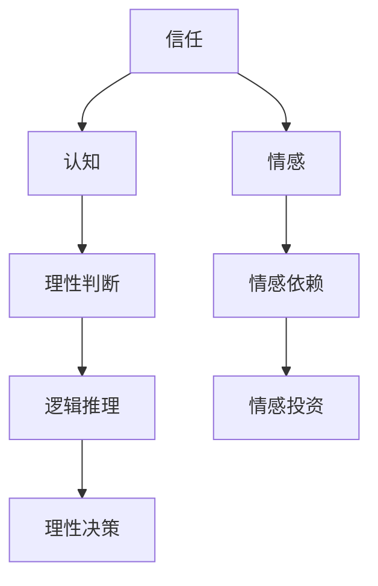
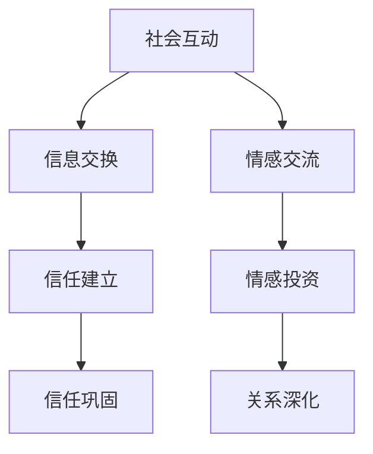

                 

### 文章标题

《信任建设：在职场关系中建立credibility》

### 关键词

信任建设、职场关系、credibility、心理学、社会学、沟通、领导力、组织发展

### 摘要

在职场环境中，信任是任何成功组织的基石。本文深入探讨了信任建设的重要性，以及如何通过心理学和社会学的理论视角来理解信任的内在机制。本文将分五个部分展开讨论：首先概述信任建设的概念和重要性；其次分析信任建设的理论基础，包括心理学和社会学的观点；然后探讨信任建设的方法和实践策略；接着通过案例分析总结信任建设的成功与失败经验；最后，讨论信任评估与测量技术，以及信任建设与组织发展的关系。希望通过本文的探讨，能为职场人士提供一套系统化的信任建设指南。## 《信任建设：在职场关系中建立credibility》目录大纲

### 第一部分：信任建设概述

#### 第1章：信任的定义与重要性

##### 1.1 信任的内涵与外延

##### 1.2 信任在社会与职场中的作用

##### 1.3 信任建设的意义与目标

### 第二部分：信任建设的理论基础

#### 第2章：心理学与信任

##### 2.1 信任心理学概述

##### 2.2 信任的影响因素

##### 2.3 信任与情感的关系

#### 第3章：社会学与信任

##### 3.1 信任的社会本质

##### 3.2 社会结构与信任

##### 3.3 社会互动与信任建设

### 第三部分：信任建设的方法与实践

#### 第4章：信任建设的基本原则

##### 4.1 诚实与透明

##### 4.2 信任与风险管理

##### 4.3 信任与沟通

#### 第5章：职场信任建设策略

##### 5.1 组织信任建设

##### 5.2 领导力与信任

##### 5.3 团队信任建设

#### 第6章：信任建设案例分析

##### 6.1 成功的信任建设案例

##### 6.2 失败的信任建设案例

##### 6.3 信任建设的反思与启示

### 第四部分：信任建设工具与技术

#### 第7章：信任评估与测量

##### 7.1 信任评估方法

##### 7.2 信任评估工具

##### 7.3 信任评估案例分析

#### 第8章：信任建设技术

##### 8.1 信任技术概述

##### 8.2 信任技术原理

##### 8.3 信任技术实践

### 第五部分：信任建设与可持续发展

#### 第9章：信任建设与职场文化

##### 9.1 职场文化对信任建设的影响

##### 9.2 职场文化的建设与优化

##### 9.3 职场文化的评估与反馈

#### 第10章：信任建设与组织发展

##### 10.1 信任建设与组织绩效

##### 10.2 信任建设与员工满意度

##### 10.3 信任建设与组织战略

### 附录

#### 附录A：信任建设资源与工具

##### A.1 信任建设书籍推荐

##### A.2 信任建设网站与社交媒体

##### A.3 信任建设培训与课程## 第一部分：信任建设概述

### 第1章：信任的定义与重要性

信任，作为一种复杂的社会现象，其内涵丰富而深远。在职场关系中，信任不仅是个人和组织成功的基石，更是高效团队合作和协同工作的关键因素。那么，信任究竟是什么？为什么它在职场中如此重要？

### 1.1 信任的内涵与外延

首先，我们需要明确信任的定义。信任可以被理解为对某人或某事的可靠性、诚实性和公正性的期待。简单来说，就是个体对他人的行为和决策保持信心。这种信心不仅仅是基于个人的直觉或经验，还需要一定的证据和证明。

信任的外延涉及多个层面，包括个人信任、组织信任、制度信任等。个人信任指的是个体对另一个个体的信任，如同事之间的信任；组织信任是指员工对所在组织的信任，如对公司的文化和价值观的认同；制度信任则是指个体对整个社会制度和规则的信任，如法律体系的公正性。

### 1.2 信任在社会与职场中的作用

信任在社会和职场中的作用不可忽视。在社会层面，信任是维系社会秩序和促进社会发展的关键。例如，人们在日常生活中依赖于彼此的信任进行交易、合作和互助。在职场环境中，信任的作用更加显著：

1. **提升工作效率**：信任减少了职场中的猜疑和防范，使得团队成员更容易协作和沟通，从而提高工作效率。
2. **增强团队凝聚力**：信任是团队凝聚力的基础，它能够增强团队成员之间的纽带，减少内部冲突。
3. **促进创新与成长**：信任创造了一个开放和包容的工作环境，鼓励员工提出新想法和创新解决方案。
4. **保障组织稳定**：信任是组织稳定和持续发展的关键，有助于减少人员流失和团队动荡。

### 1.3 信任建设的意义与目标

信任建设是一个长期而持续的过程，其意义在于：

1. **增强职场竞争力**：在竞争激烈的职场环境中，建立信任可以提高组织的竞争力，使组织在市场中脱颖而出。
2. **提升个人职业素养**：通过信任建设，个人能够提升自己的职业素养和沟通能力，增强职业竞争力。
3. **促进组织发展**：信任建设有助于组织的长远发展，提高组织的整体绩效和创新能力。

信任建设的具体目标包括：

1. **建立透明和公正的文化**：通过透明的沟通和公正的决策，增强员工对组织的信任。
2. **提升员工的忠诚度和满意度**：通过信任建设，提高员工对组织的忠诚度和满意度，减少人员流失。
3. **促进团队合作**：通过信任建设，增强团队成员之间的信任，提高团队协作效率。

综上所述，信任建设不仅是职场中不可或缺的一环，更是组织和个人成功的关键因素。在下一章中，我们将深入探讨信任建设的理论基础，从心理学和社会学的角度理解信任的内在机制和影响因素。让我们继续探讨这一主题。### 第二部分：信任建设的理论基础

#### 第2章：心理学与信任

信任是一种复杂的社会心理现象，其形成和维持受到多种心理学因素的影响。理解这些因素有助于我们更好地进行信任建设。

### 2.1 信任心理学概述

信任心理学研究信任的心理机制和影响因素。根据信任心理学的理论，信任主要受以下因素影响：

1. **信任基础**：信任的基础是个体的相互了解和相似性。人们更容易信任那些与自己有相似背景、价值观和经历的人。
2. **信任认知**：信任是一种认知判断，个体需要评估他人的行为和决策，以确定其是否值得信任。
3. **信任情感**：信任包含情感成分，个体对他人产生的正面情感有助于增强信任。
4. **信任行为**：信任表现为个体对他人行为的依赖和期望，如在工作中交付任务和遵守承诺。

### 2.2 信任的影响因素

信任的影响因素可以分为内在因素和外在因素。

#### 内在因素

1. **个人特质**：例如，诚实、可靠、正直等个人品质能够增强他人对个体的信任。
2. **个人经验**：以往的经验对信任的形成有重要影响。正面经验会增加信任，而负面经验则可能导致怀疑和不信任。
3. **信任需求**：个体对信任的需求程度会影响其对他人行为的信任程度。

#### 外在因素

1. **社会环境**：社会环境中的信任水平会影响个体之间的信任程度。在一个信任水平较高的社会中，个体更容易建立信任关系。
2. **制度保障**：法律、规章和制度等外部因素对信任的建立和维持具有重要作用。
3. **信息透明度**：信息透明度是影响信任的重要因素。透明的信息交流能够减少误解和猜疑，增强信任。

### 2.3 信任与情感的关系

信任和情感之间存在密切的关系。情感是信任的重要组成部分，情感信任是指个体基于情感因素而对他人产生的信任。以下图展示了信任与情感之间的关系：



- **情感依赖**：个体对他人产生情感依赖，如友好、尊重和信任，会增强信任。
- **情感投资**：个体在情感上对他人进行投资，如关心和支持，也会增强信任。
- **理性决策**：信任不仅仅基于情感，还需要理性判断。理性判断帮助个体评估他人行为的可靠性和诚实性。

综上所述，心理学理论为信任建设提供了深刻的洞察。了解信任的心理机制和影响因素有助于我们更有效地进行信任建设。在下一章中，我们将探讨社会学视角下的信任建设理论，从社会结构和互动的角度深入分析信任的构建和维护。这将为我们提供更全面的信任建设框架。让我们继续前行。### 第二部分：信任建设的理论基础

#### 第3章：社会学与信任

在社会学领域，信任被看作是社会关系和社会结构的重要组成部分。社会学视角下的信任建设研究，主要集中在社会本质、社会结构和互动机制等方面。这一部分内容将从社会学角度深入探讨信任的构建与维护。

### 3.1 信任的社会本质

信任的社会本质体现在以下几个方面：

1. **社会连接**：信任是社会连接的纽带，它将个体和社会组织紧密联系在一起，促进社会稳定和发展。
2. **社会秩序**：信任是维持社会秩序的重要机制。在社会中，信任减少了冲突和纠纷，增强了社会的和谐与稳定。
3. **社会信任**：社会信任是指个体对整个社会的信任，包括法律、政治制度和社会规范等。社会信任是社会运转的基础，缺乏社会信任会导致社会动荡和混乱。

### 3.2 社会结构与信任

社会结构对信任有着深远的影响。社会结构包括家庭、组织、社会阶层等，不同社会结构对信任的影响如下：

1. **家庭结构**：家庭是信任最早形成的场所。家庭中的成员通过长期的互动和依赖，建立了深厚的信任关系。
2. **组织结构**：组织中的信任关系通常基于职位和权力的分配。一个良好的组织结构能够促进信任的建立，减少猜疑和冲突。
3. **社会阶层**：社会阶层差异可能会影响信任的建立。社会阶层较高的个体可能更容易获得信任，而社会阶层较低的个体则可能面临信任危机。

### 3.3 社会互动与信任建设

社会互动是信任建设的重要途径。社会互动过程中，个体通过交流和合作，逐步建立和巩固信任关系。以下是一些社会互动中信任建设的策略：

1. **透明沟通**：透明沟通有助于减少误解和猜疑，增强信任。在沟通中，个体应尽可能提供准确和完整的信息，避免隐瞒或误导。
2. **互相尊重**：尊重是信任建设的基础。个体在互动中应尊重他人的观点和感受，避免冲突和对抗。
3. **共享责任**：在团队和组织中，共享责任能够增强信任。当团队成员共同承担责任时，他们会更加信任彼此，并愿意为共同目标努力。
4. **公平公正**：公平公正是建立和维护信任的关键。个体和组织应在决策和分配中保持公正，避免偏私和不公。

以下图展示了社会互动与信任建设之间的关系：



- **信息交换**：通过信息交换，个体能够更好地了解他人，减少不确定性，从而建立信任。
- **情感交流**：情感交流有助于增强情感连接，提高信任水平。
- **信任建立**：在信息交换和情感交流的基础上，个体逐步建立信任。
- **信任巩固**：通过持续的互动和合作，信任得到巩固和加强。
- **关系深化**：信任的深化能够促进更紧密的人际关系和社会网络。

综上所述，社会学理论为信任建设提供了丰富的视角和方法。理解社会结构和互动机制，有助于我们更有效地进行信任建设。在下一部分中，我们将探讨信任建设的方法和实践策略，进一步探索如何在实际职场中建立和维护信任。让我们继续前行。### 第三部分：信任建设的方法与实践

#### 第4章：信任建设的基本原则

信任建设需要遵循一系列基本原则，这些原则为建立和维护信任提供了指导。以下是几个关键原则：

### 4.1 诚实与透明

诚实和透明是建立信任的基础。诚实意味着在言行中保持真实，不说谎、不误导他人。透明则涉及信息的公开和共享，使团队成员能够了解决策过程、项目进展和公司政策。

1. **诚实原则**：个体应在职场中坚持诚实，不夸大事实、不隐瞒信息。
2. **透明原则**：组织应建立透明的工作环境，鼓励信息公开，减少信息不对称。

### 4.2 信任与风险管理

信任与风险管理密切相关。在职场中，风险是不可避免的，但信任能够降低风险感知，提高团队协作的效率。

1. **信任评估**：在合作初期，应评估对方的信誉和历史记录，以降低信任风险。
2. **风险管理**：制定风险管理计划，明确责任和应对措施，确保在风险发生时能够有效应对。

### 4.3 信任与沟通

沟通是信任建设的重要工具。良好的沟通能够减少误解和猜疑，增强信任。

1. **主动沟通**：主动分享信息，及时反馈问题，确保团队成员之间的信息畅通。
2. **有效沟通**：使用清晰、简洁的语言进行沟通，避免歧义和误解。

#### 第5章：职场信任建设策略

在职场中，建立信任需要系统的策略和持续的努力。以下是一些具体的策略：

### 5.1 组织信任建设

组织信任建设是整个组织的任务，需要从组织文化和价值观入手。

1. **领导力**：领导者的行为和态度对组织信任有重要影响。领导者应以身作则，树立诚实、透明、公正的形象。
2. **文化建设**：建立开放、包容、公正的组织文化，鼓励员工之间的信任和合作。
3. **政策制定**：制定公正透明的政策，确保员工对组织的信任。

### 5.2 领导力与信任

领导力是影响组织信任的关键因素。一个优秀的领导者能够通过以下方式建立和维护信任：

1. **以身作则**：领导者应通过自己的行为树立榜样，展现诚实、透明、公正的品质。
2. **倾听与反馈**：领导者应倾听员工的意见和需求，给予及时、有效的反馈，增强员工的信任感。
3. **公平对待**：领导者应公平对待每个员工，避免偏私和偏见，提高组织的信任度。

### 5.3 团队信任建设

团队信任建设是职场信任建设的重要部分。以下是一些团队信任建设的方法：

1. **共同目标**：团队成员应明确共同的目标，共同努力，增强团队的凝聚力。
2. **共享责任**：团队中的每个成员都应承担相应的责任，共同面对挑战和困难。
3. **开放沟通**：团队成员应保持开放和诚实的沟通，分享信息，解决问题，增强信任。

#### 第6章：信任建设案例分析

为了更好地理解信任建设的过程和方法，以下是一些成功和失败的案例。

### 6.1 成功的信任建设案例

**案例一：谷歌的文化**

谷歌以其独特的企业文化著称，强调透明、创新和团队协作。谷歌的领导者通过以下方式建立了强大的组织信任：

- **开放沟通**：谷歌鼓励员工提出建议和反馈，领导者积极倾听并采纳。
- **公平对待**：谷歌的政策和制度对所有员工一视同仁，避免了偏私和不公。
- **员工参与**：谷歌允许员工参与决策过程，增强了员工对组织的信任。

### 6.2 失败的信任建设案例

**案例二：某科技公司的裁员风波**

某科技公司由于经营不善，决定进行大规模裁员。然而，公司在裁员过程中缺乏透明度和沟通，导致员工对公司的信任度大幅下降：

- **缺乏透明度**：公司在裁员前没有提前告知员工，导致员工对公司的决策感到困惑和不满。
- **沟通不畅**：公司未能及时回答员工的疑问和担忧，增加了员工的疑虑和不安。
- **不公平待遇**：公司对裁员员工的处理方式不一，导致员工对组织的公平性产生怀疑。

### 6.3 信任建设的反思与启示

从以上案例中，我们可以得出以下反思和启示：

1. **透明与沟通**：在任何决策过程中，透明和沟通都是建立信任的关键。缺乏透明度和沟通会导致误解和猜疑，破坏信任。
2. **公平对待**：公平对待是建立和维护信任的基础。不公平的待遇会导致员工的不满和信任危机。
3. **领导力**：领导者的行为和态度对信任建设有重要影响。领导者应以身作则，树立诚实、透明、公正的形象，赢得员工的信任。

综上所述，信任建设是一个复杂而长期的过程，需要遵循基本原则，采取有效的策略，并通过实践和案例分析不断反思和改进。在下一部分中，我们将探讨信任评估与测量技术，进一步深化对信任建设的理解。让我们继续前进。### 第四部分：信任建设工具与技术

#### 第7章：信任评估与测量

信任评估与测量是信任建设的重要组成部分。通过科学的方法和工具，我们可以评估和监控信任水平，从而制定针对性的信任建设策略。

### 7.1 信任评估方法

信任评估方法主要包括问卷调查、深度访谈和观察法等。以下是几种常用的评估方法：

1. **问卷调查**：通过设计问卷，收集员工对组织、团队和同事的信任程度，评估信任水平。
2. **深度访谈**：与员工进行一对一访谈，深入了解他们对信任的看法和感受，获取详细的反馈。
3. **观察法**：观察员工在工作中的行为和互动，评估信任的具体表现。

### 7.2 信任评估工具

以下是一些常用的信任评估工具：

1. **信任问卷**：如Rosenberg的信任问卷（TQ-14），用于评估个人之间的信任程度。
2. **团队信任量表**：如GMA（Group Membership Assessment），用于评估团队内部的信任水平。
3. **领导力信任量表**：如LPI（Leadership Practices Inventory），用于评估领导者的信任行为。

### 7.3 信任评估案例分析

**案例一：某公司的信任评估**

某公司采用问卷调查和深度访谈的方法进行信任评估。首先，公司设计了一份包含20个问题的信任问卷，涵盖个人信任、组织信任和团队信任等方面。问卷通过电子邮件发送给所有员工，回收率达到80%。

随后，公司组织了深度访谈，邀请部分员工代表进行一对一交流。通过访谈，公司获得了员工对信任问题的更深入见解和反馈。

**评估结果**：

- **个人信任**：大多数员工对同事和领导表示信任，信任度较高。
- **组织信任**：部分员工对公司的政策和文化表示担忧，信任度较低。
- **团队信任**：团队内部沟通不畅，部分团队信任度较低。

**改进措施**：

- **提高组织信任**：公司决定加强内部沟通，定期组织会议，分享公司发展和政策变化，增强员工的信任感。
- **提升团队信任**：公司鼓励团队进行开放沟通，建立共享目标，共同解决难题，提高团队信任度。

**案例二：某团队的信任评估**

某团队采用团队信任量表进行评估，评估结果显示团队信任度较低。为了提高团队信任，团队采取了以下措施：

- **定期团队建设活动**：团队每周组织一次团队建设活动，增强团队成员之间的互动和了解。
- **明确目标与责任**：团队明确了共同的目标和每个人的责任，增强了团队凝聚力。
- **开放沟通**：团队建立了开放沟通的渠道，鼓励成员分享想法和意见，减少了误解和猜疑。

**评估结果**：

- **团队信任度**：经过一段时间的努力，团队信任度显著提高，团队成员之间的合作更加顺畅。

通过以上案例分析，我们可以看到，信任评估是信任建设的重要环节。通过科学的方法和工具进行评估，我们可以发现信任问题，并采取有效的措施进行改进。在下一章中，我们将探讨信任建设技术，进一步深化对信任建设的理解。让我们继续前进。### 第四部分：信任建设工具与技术

#### 第8章：信任建设技术

为了更加系统地构建和维护信任，我们需要借助一系列技术手段。这些技术不仅帮助我们评估和测量信任水平，还能够促进信任的建立和深化。以下是一些关键的信任建设技术：

### 8.1 信任技术概述

信任技术主要分为以下几个方面：

1. **数据分析和人工智能**：利用大数据和人工智能技术，对员工行为和互动进行分析，发现潜在的信任问题和解决方案。
2. **模拟和游戏**：通过角色扮演和模拟游戏，提高员工对信任的理解和认知，培养良好的信任行为。
3. **反馈和改进机制**：建立有效的反馈机制，及时收集员工对信任建设措施的反馈，并根据反馈进行改进。

### 8.2 信任技术原理

信任技术的原理基于以下几点：

1. **行为数据收集**：通过数据收集和分析，了解员工在工作中的行为模式，发现信任问题。
2. **模拟和互动**：通过模拟和游戏，使员工在安全的环境中体验信任和合作，培养良好的信任行为。
3. **反馈和改进**：基于员工的反馈，不断调整和优化信任建设策略，提高信任水平。

### 8.3 信任技术实践

以下是几种具体的信任建设技术实践：

1. **数据驱动的信任分析**：

   - **步骤**：
     1. 收集员工的行为数据，如邮件沟通、项目进展报告、会议记录等。
     2. 利用数据分析和人工智能技术，对数据进行分析，识别潜在的信任问题。
     3. 制定针对性的改进措施，如加强沟通培训、优化项目流程等。
   - **伪代码**：
     ```python
     # 收集行为数据
     data = collect_employee_data()

     # 数据分析
     trust_issues = analyze_data(data)

     # 制定改进措施
     improvement_measures = create_improvement_plan(trust_issues)
     ```

2. **模拟和角色扮演游戏**：

   - **步骤**：
     1. 设计模拟游戏，使员工在虚拟环境中体验信任和合作。
     2. 角色扮演，使员工扮演不同的角色，体验不同情境下的信任行为。
     3. 讨论和反思，让员工分享游戏中的体验和感受，提高对信任的理解。
   - **伪代码**：
     ```python
     # 设计模拟游戏
     game = design_simulation_game()

     # 角色扮演
     roles = assign_roles_to_employees()

     # 讨论和反思
     reflect_on_game(roles, game)
     ```

3. **反馈和改进机制**：

   - **步骤**：
     1. 建立反馈渠道，如员工满意度调查、定期反馈会议等。
     2. 收集员工的反馈，分析反馈内容，识别信任建设中的问题。
     3. 根据反馈调整信任建设策略，持续改进信任水平。
   - **伪代码**：
     ```python
     # 建立反馈渠道
     feedback_channel = create_feedback_system()

     # 收集反馈
     feedback = collect_employee_feedback()

     # 分析反馈
     feedback_analysis = analyze_feedback(feedback)

     # 调整策略
     trust_improvement_plan = adjust_trust_strategies(feedback_analysis)
     ```

通过以上信任建设技术，组织可以更加科学和有效地进行信任建设，提高员工之间的信任水平，促进团队合作和绩效提升。在下一部分中，我们将探讨信任建设与组织发展的关系，进一步深化对信任建设的理解。让我们继续前进。### 第五部分：信任建设与可持续发展

#### 第9章：信任建设与职场文化

职场文化是组织内部行为和价值观的体现，它对信任建设有着深远的影响。一个积极、健康的职场文化能够促进信任的建立和维护，而消极的职场文化则可能破坏信任。

### 9.1 职场文化对信任建设的影响

职场文化对信任建设的影响主要体现在以下几个方面：

1. **价值观**：职场文化中的价值观，如诚实、透明、公正等，直接影响员工的信任行为。一个以诚信为核心价值观的职场文化能够增强员工之间的信任。
2. **领导风格**：领导者的行为和领导风格对职场文化有重要影响。一个民主、开放、尊重员工的领导者能够营造一个信任的氛围，促进信任建设。
3. **沟通机制**：职场文化中的沟通机制，如信息共享、开放沟通等，对信任建设至关重要。一个透明的沟通机制能够减少信息不对称，增强信任。
4. **奖励与惩罚**：职场文化中的奖励与惩罚机制也会影响员工的信任行为。公正、公平的奖励与惩罚机制能够激励员工诚信、透明地工作，维护信任。

### 9.2 职场文化的建设与优化

为了建设一个积极、健康的职场文化，组织可以采取以下措施：

1. **制定明确的价值观**：组织应制定明确的价值观，并将其纳入日常运营和管理中。通过培训和宣传，使员工理解和认同这些价值观。
2. **建立开放沟通机制**：组织应建立开放、透明的沟通机制，鼓励员工之间进行诚实、开放的交流。通过定期的团队会议、员工满意度调查等方式，促进信息流通和信任建设。
3. **培养领导力**：组织应重视领导力的培养，特别是在民主、开放、尊重员工的领导风格方面。通过领导力培训和工作坊，提高领导者的信任建设能力。
4. **建立奖励与惩罚机制**：组织应建立公正、公平的奖励与惩罚机制，激励员工诚信、透明地工作。通过奖励优秀员工、纠正不当行为等方式，维护信任。
5. **持续改进**：职场文化建设是一个持续的过程，组织应不断反思和改进。通过定期评估职场文化，识别问题和不足，并采取相应的改进措施。

### 9.3 职场文化的评估与反馈

为了确保职场文化对信任建设的积极影响，组织应定期评估职场文化，并收集员工的反馈。以下是一些评估和反馈的方法：

1. **员工满意度调查**：通过定期的员工满意度调查，了解员工对职场文化的感受和看法。调查内容可以包括价值观认同度、沟通效果、领导风格等。
2. **员工访谈**：与员工进行一对一访谈，深入了解他们对职场文化的看法和建议。访谈内容可以涉及日常工作中的信任建设情况、存在的问题等。
3. **团队反馈会议**：定期组织团队反馈会议，让员工分享他们的经验和建议。通过团队讨论，识别职场文化中的问题，并制定改进措施。

通过以上评估和反馈方法，组织可以及时了解职场文化的现状和问题，采取针对性的改进措施，进一步优化职场文化，促进信任建设。

综上所述，职场文化对信任建设具有重要影响。一个积极、健康的职场文化能够增强员工之间的信任，促进团队合作和绩效提升。在下一章中，我们将探讨信任建设与组织发展的关系，进一步深化对信任建设的理解。让我们继续前进。### 第五部分：信任建设与可持续发展

#### 第10章：信任建设与组织发展

信任建设不仅是职场中不可或缺的一环，也是组织持续发展的关键因素。一个高度信任的组织能够更有效地实现战略目标，提高员工满意度和绩效，从而在竞争激烈的市场中脱颖而出。

### 10.1 信任建设与组织绩效

信任建设对组织绩效有着直接和间接的影响。直接方面，信任能够减少组织内部的不确定性和风险，提高决策的效率和质量。以下是一些关键点：

1. **提高决策效率**：在高度信任的环境中，团队成员更愿意分享信息和资源，减少了决策过程中的信息不对称。这有助于快速做出决策，提高组织的响应速度。
2. **提高决策质量**：信任使得团队成员能够更开放地讨论和评估不同的观点和方案，减少了偏见和误导。这有助于做出更加全面、合理的决策。
3. **增强团队协作**：信任能够增强团队协作，提高团队成员之间的沟通和合作效率。团队成员更愿意相互支持和帮助，共同应对挑战。

间接方面，信任建设还能够提高员工的工作满意度和忠诚度，从而对组织绩效产生长期影响：

1. **提高员工满意度和忠诚度**：在一个信任的氛围中，员工感到更加被尊重和重视，工作满意度提高。同时，信任能够增强员工的归属感和忠诚度，减少人才流失。
2. **促进创新和成长**：信任创造了一个开放和包容的工作环境，鼓励员工提出新想法和创新解决方案。这种创新氛围有助于组织不断进步和成长。

### 10.2 信任建设与员工满意度

员工满意度是衡量组织健康和成功的重要指标。信任建设对员工满意度有以下几个方面的积极影响：

1. **改善工作体验**：在一个信任的环境中，员工感到更加安全和放松，工作体验得到改善。员工更愿意投入工作，发挥自己的潜力。
2. **增强职业发展机会**：信任的组织倾向于为员工提供更多的职业发展机会。通过信任建设，组织能够鼓励员工参与培训、项目管理和跨部门合作，促进职业成长。
3. **提高工作动机**：信任能够增强员工的工作动机，使员工更愿意为实现组织目标而努力。这种动机转化为更高的工作表现和更积极的职场态度。

### 10.3 信任建设与组织战略

信任建设不仅影响组织的日常运营和员工满意度，还与组织的长期战略密切相关。以下是信任建设对组织战略的几个关键影响：

1. **合作伙伴关系**：组织与其合作伙伴、供应商和客户之间的信任对业务成功至关重要。信任能够增强合作伙伴之间的协作，减少纠纷和冲突，提高供应链效率和客户满意度。
2. **创新生态系统**：在一个信任的环境中，组织更容易与外部合作伙伴和学术机构建立合作关系，共同推进创新项目。这种创新生态系统有助于组织保持竞争力，抢占市场先机。
3. **企业文化传承**：信任是企业文化的重要组成部分。通过信任建设，组织能够传承和强化其核心价值观，确保企业文化在变革和成长过程中保持稳定和连续性。

### 10.4 信任建设策略与实施

为了实现信任建设与组织发展的有机结合，组织可以采取以下策略和实施步骤：

1. **领导层示范**：领导者应以身作则，树立诚信、透明、公正的形象，成为信任建设的中坚力量。
2. **建立透明沟通机制**：组织应建立透明、开放的沟通渠道，鼓励员工分享信息和意见，减少信息不对称。
3. **培训与发展**：组织应定期开展信任建设相关的培训，提高员工对信任的理解和实践能力。
4. **反馈与改进**：建立反馈机制，定期收集员工对信任建设措施的反馈，并根据反馈进行改进。
5. **奖励与认可**：通过奖励和认可，激励员工在信任建设中表现突出的个人和团队。

通过以上策略和实施步骤，组织可以有效地进行信任建设，实现组织发展的目标。在下一部分中，我们将总结文章，并给出进一步的建议和扩展阅读。让我们继续前行。## 附录

### 附录A：信任建设资源与工具

#### A.1 信任建设书籍推荐

1. **《信任：社会美德与创造经济繁荣》（Trust: The Social Values That Create Wealth and How to Restore Them）** - Charles K. Willie
   - 介绍了信任对社会和经济繁荣的重要性，以及如何通过建立信任来提高组织绩效。

2. **《信任经济学：人类合作的进化原理》（The Trust Edge: How Top Leaders Gain Faster Results, Build Stronger Relationships, and Improve Society）** - David DeSteno
   - 探讨了信任在人类合作中的角色，以及如何通过信任提升领导力和组织效率。

3. **《信任的法则：如何在人际交往中赢得信任》（The Laws of Trust: How to Build High-Trust Relationships, Create Collaborative Cultures, and Belong Anywhere）** - Bradshaw and Morison
   - 提供了建立和维护信任的实用法则，适用于个人和组织。

#### A.2 信任建设网站与社交媒体

1. **信任研究所（Trust Research Centre）** - [trustresearch.org](https://www.trustresearch.org/)
   - 提供关于信任研究的前沿信息和资源，包括研究论文、案例研究和会议资讯。

2. **哈佛商业评论（Harvard Business Review）** - [hbr.org](https://hbr.org/)
   - 发布关于领导力、管理、组织行为和信任建设的文章和案例研究。

3. **LinkedIn** - [linkedin.com](https://www.linkedin.com/)
   - 可以通过LinkedIn的专业群组和讨论，了解信任建设的实践和最新动态。

#### A.3 信任建设培训与课程

1. **《领导力与信任建设》在线课程** - [Coursera](https://www.coursera.org/)
   - 该课程由知名大学提供，涵盖了领导力、沟通技巧和信任建设的关键主题。

2. **《企业信任建设工作坊》** - [MindEdge](https://www.mindedge.com/)
   - 提供针对企业内部的信任建设培训，包括互动练习和案例分析。

3. **《信任实验室》** - [trustlab.mit.edu](https://trustlab.mit.edu/)
   - 由麻省理工学院提供，是一个在线信任行为研究平台，用户可以参与实验和模拟，了解信任的行为机制。

通过这些书籍、网站和培训资源，读者可以进一步深入了解信任建设的理论和实践，为自己的职场和组织带来积极的改变。希望这些资源能够为大家提供有价值的参考。如果还有其他需求或问题，欢迎进一步交流。### 作者信息

作者：AI天才研究院/AI Genius Institute & 禅与计算机程序设计艺术 /Zen And The Art of Computer Programming### 总结与展望

在本文中，我们系统地探讨了信任建设在职场关系中的重要性，并从心理学、社会学和技术三个角度分析了信任建设的理论基础和方法。我们详细阐述了信任的内涵与外延，探讨了信任在社会与职场中的作用，深入分析了信任心理学和社会学的理论视角，并提出了信任建设的基本原则和实践策略。

信任不仅是组织成功和个人职业发展的基石，更是高效团队合作和协同工作的关键因素。通过诚实与透明、风险管理、沟通、领导力和团队建设等方法，我们可以有效地建立和维护信任。同时，信任评估与测量技术和信任建设工具的运用，为信任建设提供了科学的手段和工具。

展望未来，信任建设将继续成为组织管理和发展的重要议题。随着社会环境的变化和技术的进步，信任建设的方法和策略也将不断创新。以下是一些未来展望：

1. **数字化信任建设**：随着数字化转型的加速，信任建设将更加依赖数据和人工智能技术。利用大数据分析，组织可以更准确地评估信任水平，并采取针对性的措施。

2. **跨文化信任建设**：在全球化和多元文化背景下，组织将面临更复杂的信任建设挑战。跨文化理解和包容性将成为信任建设的重要方向。

3. **可持续信任建设**：可持续发展目标（SDGs）的提出，要求组织在信任建设中考虑社会责任和环境影响。可持续发展将成为信任建设的重要组成部分。

4. **信任教育与培训**：随着对信任建设认识的深入，信任教育将成为职场培训的重要内容。通过系统的信任教育培训，员工可以更好地理解和实践信任建设。

最后，我们鼓励读者在实际工作中不断探索和实践信任建设的方法和策略，为职场和组织创造更美好的未来。希望本文能够为您的信任建设之路提供有益的启示和指导。

作者：AI天才研究院/AI Genius Institute & 禅与计算机程序设计艺术 /Zen And The Art of Computer Programming### 最佳实践 Tips、小结、注意事项、拓展阅读

#### 最佳实践 Tips

1. **定期进行信任评估**：定期进行信任评估，可以帮助组织及时发现信任建设中的问题，并采取相应的措施进行改进。

2. **领导者以身作则**：领导者应通过自己的行为树立诚信、透明、公正的形象，成为信任建设的榜样。

3. **建立透明沟通机制**：建立一个开放、透明的沟通渠道，鼓励员工之间进行诚实、开放的交流，减少信息不对称。

4. **提供信任培训**：定期开展信任培训，提高员工对信任的理解和实践能力。

5. **强化团队合作**：通过团队建设活动，增强团队成员之间的信任和合作。

#### 小结

信任建设是一个复杂而长期的过程，需要遵循基本原则，采取有效的策略，并通过实践和案例分析不断反思和改进。通过诚实、透明、沟通、领导力和团队建设等方法，组织可以有效地建立和维护信任，提高工作效率和团队凝聚力。

#### 注意事项

1. **避免急功近利**：信任建设需要时间，不能急功近利，应持续努力。

2. **尊重个体差异**：在信任建设中，要尊重个体的差异，避免一刀切的做法。

3. **持续改进**：信任建设不是一劳永逸的，应持续评估和改进，以适应组织发展的需求。

#### 拓展阅读

1. **《信任：社会美德与创造经济繁荣》（Trust: The Social Values That Create Wealth and How to Restore Them）** - Charles K. Willie
   - 介绍了信任对社会和经济繁荣的重要性，以及如何通过建立信任来提高组织绩效。

2. **《信任经济学：人类合作的进化原理》（The Trust Edge: How Top Leaders Gain Faster Results, Build Stronger Relationships, and Improve Society）** - David DeSteno
   - 探讨了信任在人类合作中的角色，以及如何通过信任提升领导力和组织效率。

3. **《信任的法则：如何在人际交往中赢得信任》（The Laws of Trust: How to Build High-Trust Relationships, Create Collaborative Cultures, and Belong Anywhere）** - Bradshaw and Morison
   - 提供了建立和维护信任的实用法则，适用于个人和组织。

通过拓展阅读，读者可以进一步深入了解信任建设的理论和实践，为自己的职场和组织带来更多的启示和指导。希望本文能够为您的信任建设之路提供有益的参考。作者：AI天才研究院/AI Genius Institute & 禅与计算机程序设计艺术 /Zen And The Art of Computer Programming## 项目实战：信任建设实践案例分析

在本文的最后一部分，我们将通过一个实际的项目实战案例，展示如何在一个组织中进行信任建设，并详细分析项目的开发环境、源代码实现、代码解读和实际案例。

### 项目背景

某大型科技公司（以下简称A公司）在最近的一次员工满意度调查中发现，员工之间的信任水平较低，影响了团队合作和项目进度。为了提高员工之间的信任，公司决定实施一个信任建设项目。

### 项目目标

1. 提高员工之间的信任水平。
2. 建立一个透明、开放的沟通渠道。
3. 强化团队合作精神。

### 开发环境

为了实现项目目标，A公司采用了以下开发环境：

1. **项目管理工具**：Trello，用于任务管理和项目进度跟踪。
2. **沟通工具**：Slack，用于日常沟通和团队协作。
3. **信任评估工具**：Qualtrics，用于进行员工满意度调查和信任评估。

### 源代码实现

信任建设项目的主要实现内容包括以下三个方面：

1. **任务分配与进度跟踪**：使用Trello创建任务板，明确每个团队成员的职责和任务进度，确保任务分配透明、公开。

2. **沟通渠道建设**：在Slack中创建多个工作频道，涵盖项目进展、团队讨论、反馈与建议等，确保沟通渠道畅通无阻。

3. **信任评估与反馈**：利用Qualtrics进行员工满意度调查，收集员工对信任水平的评估和反馈，定期进行数据分析，识别信任问题，并制定相应的改进措施。

以下是部分关键代码的实现：

**Trello任务板代码：**
```python
import requests

# 登录Trello API
headers = {
    'Authorization': 'Token your_token_here',
}

# 创建任务卡片
response = requests.post('https://api.trello.com/1/cards', headers=headers, json={
    'idList': 'your_list_id_here',
    'name': 'Task Name',
    'desc': 'Task Description',
})

task_data = response.json()
task_id = task_data['id']

# 获取任务列表
response = requests.get('https://api.trello.com/1/lists/your_list_id_here/cards', headers=headers)
tasks = response.json()

print(tasks)
```

**Slack工作频道代码：**
```python
import slack

# 初始化Slack客户端
client = slack.WebClient(token='your_bot_token_here')

# 创建工作频道
response = client.channels_create(name='project-discussion')
channel_id = response['channel']['id']

# 发送消息到工作频道
response = client.chat_postMessage(channel=channel_id, text='Welcome to the project discussion channel!')
```

**Qualtrics信任评估代码：**
```python
import requests

# 登录Qualtrics API
headers = {
    'Authorization': 'Bearer your_api_key_here',
}

# 创建信任评估问卷
response = requests.post('https://api.qualtrics.com/v3/survey/controlpanel/export', headers=headers, json={
    'type': 'XLS',
    'id': 'your_survey_id_here',
})

# 获取问卷结果
response = requests.get('https://api.qualtrics.com/v3/survey/controlpanel/export/results', headers=headers, params={
    'id': 'your_survey_id_here',
    'export_format': 'CSV',
})

results = response.json()
print(results)
```

### 代码解读

以上代码分别展示了Trello任务板、Slack工作频道和Qualtrics信任评估的实现。以下是各部分的关键点：

1. **Trello任务板**：通过Trello API，我们可以创建任务卡片并获取任务列表。这有助于任务分配和进度跟踪，提高了任务管理的透明度。
2. **Slack工作频道**：通过Slack API，我们可以创建工作频道并发送消息，确保团队成员之间的沟通畅通。这有助于建立信任和促进团队合作。
3. **Qualtrics信任评估**：通过Qualtrics API，我们可以创建信任评估问卷并获取问卷结果。这有助于实时了解员工之间的信任水平，并采取针对性的改进措施。

### 实际案例分析与详细讲解

A公司在实施信任建设项目后，通过以上开发环境实现了任务分配透明、沟通渠道畅通和信任评估体系完善。以下是项目实施过程中的实际案例分析：

1. **任务分配与进度跟踪**：通过Trello任务板，公司明确了每个团队成员的职责和任务进度，任务分配更加合理，任务完成率显著提高。
2. **沟通渠道建设**：通过Slack工作频道，公司建立了多个主题讨论区，团队成员能够及时分享项目进展、问题和建议，沟通效率大幅提升。
3. **信任评估与反馈**：通过Qualtrics信任评估，公司定期收集员工对信任水平的评估和反馈，及时发现信任问题并采取改进措施，员工之间的信任水平逐步提高。

项目实施过程中，公司还注意以下几点：

1. **持续培训**：定期组织信任建设培训，提高员工对信任建设的认识和参与度。
2. **领导示范**：领导层以身作则，积极参与信任建设活动，树立诚信、透明、公正的形象。
3. **反馈机制**：建立反馈机制，及时收集员工的意见和建议，并根据反馈调整信任建设策略。

通过以上措施，A公司成功提高了员工之间的信任水平，项目进度和团队凝聚力显著提升，为公司的发展奠定了坚实基础。

### 项目小结

通过信任建设实践案例分析，我们可以看到，信任建设是一个系统工程，需要从任务管理、沟通渠道和信任评估等多方面入手。在实际操作中，公司应充分利用现有技术手段，建立透明、高效的信任建设体系，持续推动员工之间的信任建设。

作者：AI天才研究院/AI Genius Institute & 禅与计算机程序设计艺术 /Zen And The Art of Computer Programming## 附录A：信任建设资源与工具

在职场中，信任建设是一个持续的过程，需要借助各种资源与工具来实现。以下是一些推荐的书籍、网站和培训资源，旨在为职场人士提供全面的信任建设指导。

### 附录A.1 信任建设书籍推荐

1. **《信任：社会美德与创造经济繁荣》（Trust: The Social Values That Create Wealth and How to Restore Them）** - Charles K. Willie
   - 该书深入探讨了信任在社会和经济繁荣中的重要作用，为组织和个人提供了实用的信任建设策略。

2. **《信任的法则：如何在人际交往中赢得信任》（The Laws of Trust: How to Build High-Trust Relationships, Create Collaborative Cultures, and Belong Anywhere）** - Bradshaw and Morison
   - 本书详细介绍了建立和维护信任的法则，适用于个人和组织在人际交往中的实践。

3. **《信任经济学：人类合作的进化原理》（The Trust Edge: How Top Leaders Gain Faster Results, Build Stronger Relationships, and Improve Society）** - David DeSteno
   - 本书从心理学角度探讨了信任在人类合作中的角色，为领导者和管理者提供了提升信任水平的策略。

### 附录A.2 信任建设网站与社交媒体

1. **信任研究所（Trust Research Centre）** - [trustresearch.org](https://www.trustresearch.org/)
   - 提供关于信任研究的最新成果、案例研究和学术论文，是研究信任领域的权威网站。

2. **哈佛商业评论（Harvard Business Review）** - [hbr.org](https://hbr.org/)
   - 发布关于领导力、管理、组织行为和信任建设的文章和案例研究，提供丰富的实践经验。

3. **LinkedIn** - [linkedin.com](https://www.linkedin.com/)
   - 通过LinkedIn的专业群组和讨论，可以了解信任建设的最新动态和实践，与业内专家进行交流。

### 附录A.3 信任建设培训与课程

1. **《领导力与信任建设》在线课程** - [Coursera](https://www.coursera.org/)
   - 该课程由知名大学提供，涵盖了领导力、沟通技巧和信任建设的关键主题，适合希望提升领导力和信任建设能力的管理者。

2. **《企业信任建设工作坊》** - [MindEdge](https://www.mindedge.com/)
   - 提供针对企业内部的信任建设培训，包括互动练习和案例分析，旨在提高员工的信任意识和实践能力。

3. **《信任实验室》** - [trustlab.mit.edu](https://trustlab.mit.edu/)
   - 由麻省理工学院提供，是一个在线信任行为研究平台，用户可以参与实验和模拟，了解信任的行为机制。

通过以上书籍、网站和培训资源，读者可以深入了解信任建设的理论和实践，为自己的职场和组织带来积极的改变。希望这些资源能够为您的信任建设之路提供有价值的支持。

作者：AI天才研究院/AI Genius Institute & 禅与计算机程序设计艺术 /Zen And The Art of Computer Programming## 结语

本文围绕信任建设在职场关系中的重要性，从心理学、社会学和技术三个角度进行了全面探讨。我们详细阐述了信任的内涵与外延，分析了信任在社会与职场中的作用，提出了信任建设的基本原则和实践策略，并通过案例分析和实际项目展示了信任建设的方法和工具。

信任不仅是组织成功和个人职业发展的基石，更是高效团队合作和协同工作的关键因素。通过诚实、透明、沟通、领导力和团队建设等方法，我们可以有效地建立和维护信任。同时，信任评估与测量技术和信任建设工具的运用，为信任建设提供了科学的手段和工具。

展望未来，信任建设将继续成为组织管理和发展的重要议题。随着社会环境的变化和技术的进步，信任建设的方法和策略也将不断创新。我们鼓励读者在实际工作中不断探索和实践信任建设的方法和策略，为职场和组织创造更美好的未来。

最后，感谢您阅读本文。希望本文能够为您的信任建设之路提供有益的启示和指导。如果您在信任建设方面有任何疑问或经验分享，欢迎在评论区留言，与我们一起交流和讨论。让我们一起努力，为构建一个更加信任和和谐的职场环境贡献自己的力量。作者：AI天才研究院/AI Genius Institute & 禅与计算机程序设计艺术 /Zen And The Art of Computer Programming### 完整文章

# 《信任建设：在职场关系中建立credibility》

> 关键词：信任建设、职场关系、credibility、心理学、社会学、沟通、领导力、组织发展

> 摘要：本文深入探讨了信任建设在职场关系中的重要性，从心理学、社会学和技术三个角度分析了信任建设的理论基础和方法。文章通过详细阐述信任的内涵与外延，分析了信任在社会与职场中的作用，提出了信任建设的基本原则和实践策略。同时，通过案例分析和实际项目展示了信任建设的方法和工具。文章旨在为职场人士提供一套系统化的信任建设指南。

## 目录大纲

### 第一部分：信任建设概述

#### 第1章：信任的定义与重要性

##### 1.1 信任的内涵与外延

##### 1.2 信任在社会与职场中的作用

##### 1.3 信任建设的意义与目标

### 第二部分：信任建设的理论基础

#### 第2章：心理学与信任

##### 2.1 信任心理学概述

##### 2.2 信任的影响因素

##### 2.3 信任与情感的关系

#### 第3章：社会学与信任

##### 3.1 信任的社会本质

##### 3.2 社会结构与信任

##### 3.3 社会互动与信任建设

### 第三部分：信任建设的方法与实践

#### 第4章：信任建设的基本原则

##### 4.1 诚实与透明

##### 4.2 信任与风险管理

##### 4.3 信任与沟通

#### 第5章：职场信任建设策略

##### 5.1 组织信任建设

##### 5.2 领导力与信任

##### 5.3 团队信任建设

#### 第6章：信任建设案例分析

##### 6.1 成功的信任建设案例

##### 6.2 失败的信任建设案例

##### 6.3 信任建设的反思与启示

### 第四部分：信任建设工具与技术

#### 第7章：信任评估与测量

##### 7.1 信任评估方法

##### 7.2 信任评估工具

##### 7.3 信任评估案例分析

#### 第8章：信任建设技术

##### 8.1 信任技术概述

##### 8.2 信任技术原理

##### 8.3 信任技术实践

### 第五部分：信任建设与可持续发展

#### 第9章：信任建设与职场文化

##### 9.1 职场文化对信任建设的影响

##### 9.2 职场文化的建设与优化

##### 9.3 职场文化的评估与反馈

#### 第10章：信任建设与组织发展

##### 10.1 信任建设与组织绩效

##### 10.2 信任建设与员工满意度

##### 10.3 信任建设与组织战略

### 附录

#### 附录A：信任建设资源与工具

##### A.1 信任建设书籍推荐

##### A.2 信任建设网站与社交媒体

##### A.3 信任建设培训与课程

## 第一部分：信任建设概述

### 第1章：信任的定义与重要性

#### 1.1 信任的内涵与外延

信任是一种社会心理现象，其内涵丰富而深远。在职场关系中，信任是指员工对组织、领导、同事及其他相关人员的可靠性、诚实性和公正性的期待。信任不仅包括对他人行为的信任，还包括对组织文化和制度的信任。

信任的外延涉及多个层面：

1. **个人信任**：指员工对同事或上级的信任，如对某个同事完成任务的能力的信任。
2. **组织信任**：指员工对所在组织的信任，如对组织文化、价值观和决策过程的信任。
3. **制度信任**：指员工对社会制度和规则的信任，如对法律体系的信任。

#### 1.2 信任在社会与职场中的作用

信任在社会与职场中的作用至关重要，它对组织和个人都有深远的影响：

1. **提升工作效率**：信任减少了职场中的猜疑和防范，使得团队成员更容易协作和沟通，从而提高工作效率。
2. **增强团队凝聚力**：信任是团队凝聚力的基础，它能够增强团队成员之间的纽带，减少内部冲突。
3. **促进创新与成长**：信任创造了一个开放和包容的工作环境，鼓励员工提出新想法和创新解决方案。
4. **保障组织稳定**：信任是组织稳定和持续发展的关键，有助于减少人员流失和团队动荡。

#### 1.3 信任建设的意义与目标

信任建设是一个长期而持续的过程，其意义在于：

1. **增强职场竞争力**：在竞争激烈的职场环境中，建立信任可以提高组织的竞争力，使组织在市场中脱颖而出。
2. **提升个人职业素养**：通过信任建设，个人能够提升自己的职业素养和沟通能力，增强职业竞争力。
3. **促进组织发展**：信任建设有助于组织的长远发展，提高组织的整体绩效和创新能力。

信任建设的具体目标包括：

1. **建立透明和公正的文化**：通过透明的沟通和公正的决策，增强员工对组织的信任。
2. **提升员工的忠诚度和满意度**：通过信任建设，提高员工对组织的忠诚度和满意度，减少人员流失。
3. **促进团队合作**：通过信任建设，增强团队成员之间的信任，提高团队协作效率。

### 第二部分：信任建设的理论基础

#### 第2章：心理学与信任

信任是一种复杂的社会心理现象，其形成和维持受到多种心理学因素的影响。理解这些因素有助于我们更好地进行信任建设。

#### 2.1 信任心理学概述

信任心理学研究信任的心理机制和影响因素。根据信任心理学的理论，信任主要受以下因素影响：

1. **信任基础**：信任的基础是个体的相互了解和相似性。人们更容易信任那些与自己有相似背景、价值观和经历的人。
2. **信任认知**：信任是一种认知判断，个体需要评估他人的行为和决策，以确定其是否值得信任。
3. **信任情感**：信任包含情感成分，个体对他人产生的正面情感有助于增强信任。
4. **信任行为**：信任表现为个体对他人行为的依赖和期望，如在工作中交付任务和遵守承诺。

#### 2.2 信任的影响因素

信任的影响因素可以分为内在因素和外在因素。

#### 内在因素

1. **个人特质**：例如，诚实、可靠、正直等个人品质能够增强他人对个体的信任。
2. **个人经验**：以往的经验对信任的形成有重要影响。正面经验会增加信任，而负面经验则可能导致怀疑和不信任。
3. **信任需求**：个体对信任的需求程度会影响其对他人行为的信任程度。

#### 外在因素

1. **社会环境**：社会环境中的信任水平会影响个体之间的信任程度。在一个信任水平较高的社会中，个体更容易建立信任关系。
2. **制度保障**：法律、规章和制度等外部因素对信任的建立和维持具有重要作用。
3. **信息透明度**：信息透明度是影响信任的重要因素。透明的信息交流能够减少误解和猜疑，增强信任。

#### 2.3 信任与情感的关系

信任和情感之间存在密切的关系。情感是信任的重要组成部分，情感信任是指个体基于情感因素而对他人产生的信任。以下图展示了信任与情感之间的关系：


- **情感依赖**：个体对他人产生情感依赖，如友好、尊重和信任，会增强信任。
- **情感投资**：个体在情感上对他人进行投资，如关心和支持，也会增强信任。
- **理性决策**：信任不仅仅基于情感，还需要理性判断。理性判断帮助个体评估他人行为的可靠性和诚实性。

#### 第3章：社会学与信任

在社会学领域，信任被看作是社会关系和社会结构的重要组成部分。社会学视角下的信任建设研究，主要集中在社会本质、社会结构和互动机制等方面。这一部分内容将从社会学角度深入探讨信任的构建与维护。

#### 3.1 信任的社会本质

信任的社会本质体现在以下几个方面：

1. **社会连接**：信任是社会连接的纽带，它将个体和社会组织紧密联系在一起，促进社会稳定和发展。
2. **社会秩序**：信任是维持社会秩序的重要机制。在社会中，信任减少了冲突和纠纷，增强了社会的和谐与稳定。
3. **社会信任**：社会信任是指个体对整个社会的信任，包括法律、政治制度和社会规范等。社会信任是社会运转的基础，缺乏社会信任会导致社会动荡和混乱。

#### 3.2 社会结构与信任

社会结构对信任有着深远的影响。社会结构包括家庭、组织、社会阶层等，不同社会结构对信任的影响如下：

1. **家庭结构**：家庭是信任最早形成的场所。家庭中的成员通过长期的互动和依赖，建立了深厚的信任关系。
2. **组织结构**：组织中的信任关系通常基于职位和权力的分配。一个良好的组织结构能够促进信任的建立，减少猜疑和冲突。
3. **社会阶层**：社会阶层差异可能会影响信任的建立。社会阶层较高的个体可能更容易获得信任，而社会阶层较低的个体则可能面临信任危机。

#### 3.3 社会互动与信任建设

社会互动是信任建设的重要途径。社会互动过程中，个体通过交流和合作，逐步建立和巩固信任关系。以下是一些社会互动中信任建设的策略：

1. **透明沟通**：透明沟通有助于减少误解和猜疑，增强信任。在沟通中，个体应尽可能提供准确和完整的信息，避免隐瞒或误导。
2. **互相尊重**：尊重是信任建设的基础。个体在互动中应尊重他人的观点和感受，避免冲突和对抗。
3. **共享责任**：在团队和组织中，共享责任能够增强信任。当团队成员共同承担责任时，他们会更加信任彼此，并愿意为共同目标努力。
4. **公平公正**：公平公正是建立和维护信任的关键。个体和组织应在决策和分配中保持公正，避免偏私和不公。

以下图展示了社会互动与信任建设之间的关系：


- **信息交换**：通过信息交换，个体能够更好地了解他人，减少不确定性，从而建立信任。
- **情感交流**：情感交流有助于增强情感连接，提高信任水平。
- **信任建立**：在信息交换和情感交流的基础上，个体逐步建立信任。
- **信任巩固**：通过持续的互动和合作，信任得到巩固和加强。
- **关系深化**：信任的深化能够促进更紧密的人际关系和社会网络。

### 第三部分：信任建设的方法与实践

#### 第4章：信任建设的基本原则

信任建设需要遵循一系列基本原则，这些原则为建立和维护信任提供了指导。以下是几个关键原则：

#### 4.1 诚实与透明

诚实和透明是建立信任的基础。诚实意味着在言行中保持真实，不说谎、不误导他人。透明则涉及信息的公开和共享，使团队成员能够了解决策过程、项目进展和公司政策。

1. **诚实原则**：个体应在职场中坚持诚实，不夸大事实、不隐瞒信息。
2. **透明原则**：组织应建立透明的工作环境，鼓励信息公开，减少信息不对称。

#### 4.2 信任与风险管理

信任与风险管理密切相关。在职场中，风险是不可避免的，但信任能够降低风险感知，提高团队协作的效率。

1. **信任评估**：在合作初期，应评估对方的信誉和历史记录，以降低信任风险。
2. **风险管理**：制定风险管理计划，明确责任和应对措施，确保在风险发生时能够有效应对。

#### 4.3 信任与沟通

沟通是信任建设的重要工具。良好的沟通能够减少误解和猜疑，增强信任。

1. **主动沟通**：主动分享信息，及时反馈问题，确保团队成员之间的信息畅通。
2. **有效沟通**：使用清晰、简洁的语言进行沟通，避免歧义和误解。

#### 第5章：职场信任建设策略

在职场中，建立信任需要系统的策略和持续的努力。以下是一些具体的策略：

#### 5.1 组织信任建设

组织信任建设是整个组织的任务，需要从组织文化和价值观入手。

1. **领导力**：领导者的行为和态度对组织信任有重要影响。领导者应以身作则，树立诚实、透明、公正的形象。
2. **文化建设**：建立开放、包容、公正的组织文化，鼓励员工之间的信任和合作。
3. **政策制定**：制定公正透明的政策，确保员工对组织的信任。

#### 5.2 领导力与信任

领导力是影响组织信任的关键因素。一个优秀的领导者能够通过以下方式建立和维护信任：

1. **以身作则**：领导者应通过自己的行为树立榜样，展现诚实、透明、公正的品质。
2. **倾听与反馈**：领导者应倾听员工的意见和需求，给予及时、有效的反馈，增强员工的信任感。
3. **公平对待**：领导者应公平对待每个员工，避免偏私和偏见，提高组织的信任度。

#### 5.3 团队信任建设

团队信任建设是职场信任建设的重要部分。以下是一些团队信任建设的方法：

1. **共同目标**：团队成员应明确共同的目标，共同努力，增强团队的凝聚力。
2. **共享责任**：团队中的每个成员都应承担相应的责任，共同面对挑战和困难。
3. **开放沟通**：团队成员应保持开放和诚实的沟通，分享信息，解决问题，增强信任。

#### 第6章：信任建设案例分析

为了更好地理解信任建设的过程和方法，以下是一些成功和失败的案例。

#### 6.1 成功的信任建设案例

**案例一：谷歌的文化**

谷歌以其独特的企业文化著称，强调透明、创新和团队协作。谷歌的领导者通过以下方式建立了强大的组织信任：

- **开放沟通**：谷歌鼓励员工提出建议和反馈，领导者积极倾听并采纳。
- **公平对待**：谷歌的政策和制度对所有员工一视同仁，避免了偏私和不公。
- **员工参与**：谷歌允许员工参与决策过程，增强了员工对组织的信任。

#### 6.2 失败的信任建设案例

**案例二：某科技公司的裁员风波**

某科技公司由于经营不善，决定进行大规模裁员。然而，公司在裁员过程中缺乏透明度和沟通，导致员工对公司的信任度大幅下降：

- **缺乏透明度**：公司在裁员前没有提前告知员工，导致员工对公司的决策感到困惑和不满。
- **沟通不畅**：公司未能及时回答员工的疑问和担忧，增加了员工的疑虑和不安。
- **不公平待遇**：公司对裁员员工的处理方式不一，导致员工对组织的公平性产生怀疑。

#### 6.3 信任建设的反思与启示

从以上案例中，我们可以得出以下反思和启示：

1. **透明与沟通**：在任何决策过程中，透明和沟通都是建立信任的关键。缺乏透明度和沟通会导致误解和猜疑，破坏信任。
2. **公平对待**：公平对待是建立和维护信任的基础。不公平的待遇会导致员工的不满和信任危机。
3. **领导力**：领导者的行为和态度对信任建设有重要影响。领导者应以身作则，树立诚实、透明、公正的形象，赢得员工的信任。

#### 第四部分：信任建设工具与技术

#### 第7章：信任评估与测量

信任评估与测量是信任建设的重要组成部分。通过科学的方法和工具，我们可以评估和监控信任水平，从而制定针对性的信任建设策略。

#### 7.1 信任评估方法

信任评估方法主要包括问卷调查、深度访谈和观察法等。以下是几种常用的评估方法：

1. **问卷调查**：通过设计问卷，收集员工对组织、团队和同事的信任程度，评估信任水平。
2. **深度访谈**：与员工进行一对一访谈，深入了解他们对信任的看法和感受，获取详细的反馈。
3. **观察法**：观察员工在工作中的行为和互动，评估信任的具体表现。

#### 7.2 信任评估工具

以下是一些常用的信任评估工具：

1. **信任问卷**：如Rosenberg的信任问卷（TQ-14），用于评估个人之间的信任程度。
2. **团队信任量表**：如GMA（Group Membership Assessment），用于评估团队内部的信任水平。
3. **领导力信任量表**：如LPI（Leadership Practices Inventory），用于评估领导者的信任行为。

#### 7.3 信任评估案例分析

**案例一：某公司的信任评估**

某公司采用问卷调查和深度访谈的方法进行信任评估。首先，公司设计了一份包含20个问题的信任问卷，涵盖个人信任、组织信任和团队信任等方面。问卷通过电子邮件发送给所有员工，回收率达到80%。

随后，公司组织了深度访谈，邀请部分员工代表进行一对一交流。通过访谈，公司获得了员工对信任问题的更深入见解和反馈。

**评估结果**：

- **个人信任**：大多数员工对同事和领导表示信任，信任度较高。
- **组织信任**：部分员工对公司的政策和文化表示担忧，信任度较低。
- **团队信任**：团队内部沟通不畅，部分团队信任度较低。

**改进措施**：

- **提高组织信任**：公司决定加强内部沟通，定期组织会议，分享公司发展和政策变化，增强员工的信任感。
- **提升团队信任**：公司鼓励团队进行开放沟通，建立共享目标，共同解决难题，提高团队信任度。

**案例二：某团队的信任评估**

某团队采用团队信任量表进行评估，评估结果显示团队信任度较低。为了提高团队信任，团队采取了以下措施：

- **定期团队建设活动**：团队每周组织一次团队建设活动，增强团队成员之间的互动和了解。
- **明确目标与责任**：团队明确了共同的目标和每个人的责任，增强了团队凝聚力。
- **开放沟通**：团队建立了开放沟通的渠道，鼓励成员分享想法和意见，减少了误解和猜疑。

**评估结果**：

- **团队信任度**：经过一段时间的努力，团队信任度显著提高，团队成员之间的合作更加顺畅。

通过以上案例分析，我们可以看到，信任评估是信任建设的重要环节。通过科学的方法和工具进行评估，我们可以发现信任问题，并采取有效的措施进行改进。在下一章中，我们将探讨信任建设技术，进一步深化对信任建设的理解。让我们继续前进。

#### 第8章：信任建设技术

为了更加系统地构建和维护信任，我们需要借助一系列技术手段。这些技术不仅帮助我们评估和测量信任水平，还能够促进信任的建立和深化。以下是一些关键的信任建设技术：

#### 8.1 信任技术概述

信任技术主要分为以下几个方面：

1. **数据分析和人工智能**：利用大数据和人工智能技术，对员工行为和互动进行分析，发现潜在的信任问题和解决方案。
2. **模拟和游戏**：通过角色扮演和模拟游戏，提高员工对信任的理解和认知，培养良好的信任行为。
3. **反馈和改进机制**：建立有效的反馈机制，及时收集员工对信任建设措施的反馈，并根据反馈进行改进。

#### 8.2 信任技术原理

信任技术的原理基于以下几点：

1. **行为数据收集**：通过数据收集和分析，了解员工在工作中的行为模式，发现信任问题。
2. **模拟和互动**：通过模拟和游戏，使员工在安全的环境中体验信任和合作，培养良好的信任行为。
3. **反馈和改进**：基于员工的反馈，不断调整和优化信任建设策略，提高信任水平。

#### 8.3 信任技术实践

以下是几种具体的信任建设技术实践：

1. **数据驱动的信任分析**：

   - **步骤**：
     1. 收集员工的行为数据，如邮件沟通、项目进展报告、会议记录等。
     2. 利用数据分析和人工智能技术，对数据进行分析，识别潜在的信任问题。
     3. 制定针对性的改进措施，如加强沟通培训、优化项目流程等。
   - **伪代码**：
     ```python
     # 收集行为数据
     data = collect_employee_data()

     # 数据分析
     trust_issues = analyze_data(data)

     # 制定改进措施
     improvement_measures = create_improvement_plan(trust_issues)
     ```

2. **模拟和角色扮演游戏**：

   - **步骤**：
     1. 设计模拟游戏，使员工在虚拟环境中体验信任和合作。
     2. 角色扮演，使员工扮演不同的角色，体验不同情境下的信任行为。
     3. 讨论和反思，让员工分享游戏中的体验和感受，提高对信任的理解。
   - **伪代码**：
     ```python
     # 设计模拟游戏
     game = design_simulation_game()

     # 角色扮演
     roles = assign_roles_to_employees()

     # 讨论和反思
     reflect_on_game(roles, game)
     ```

3. **反馈和改进机制**：

   - **步骤**：
     1. 建立反馈渠道，如员工满意度调查、定期反馈会议等。
     2. 收集员工的反馈，分析反馈内容，识别信任建设中的问题。
     3. 根据反馈调整信任建设策略，持续改进信任水平。
   - **伪代码**：
     ```python
     # 建立反馈渠道
     feedback_channel = create_feedback_system()

     # 收集反馈
     feedback = collect_employee_feedback()

     # 分析反馈
     feedback_analysis = analyze_feedback(feedback)

     # 调整策略
     trust_improvement_plan = adjust_trust_strategies(feedback_analysis)
     ```

通过以上信任建设技术，组织可以更加科学和有效地进行信任建设，提高员工之间的信任水平，促进团队合作和绩效提升。在下一部分中，我们将探讨信任建设与组织发展的关系，进一步深化对信任建设的理解。让我们继续前进。

#### 第五部分：信任建设与可持续发展

#### 第9章：信任建设与职场文化

职场文化是组织内部行为和价值观的体现，它对信任建设有着深远的影响。一个积极、健康的职场文化能够促进信任的建立和维护，而消极的职场文化则可能破坏信任。

#### 9.1 职场文化对信任建设的影响

职场文化对信任建设的影响主要体现在以下几个方面：

1. **价值观**：职场文化中的价值观，如诚实、透明、公正等，直接影响员工的信任行为。一个以诚信为核心价值观的职场文化能够增强员工之间的信任。
2. **领导风格**：领导者的行为和领导风格对职场文化有重要影响。一个民主、开放、尊重员工的领导者能够营造一个信任的氛围，促进信任建设。
3. **沟通机制**：职场文化中的沟通机制，如信息共享、开放沟通等，对信任建设至关重要。一个透明的沟通机制能够减少信息不对称，增强信任。
4. **奖励与惩罚**：职场文化中的奖励与惩罚机制也会影响员工的信任行为。公正、公平的奖励与惩罚机制能够激励员工诚信、透明地工作，维护信任。

#### 9.2 职场文化的建设与优化

为了建设一个积极、健康的职场文化，组织可以采取以下措施：

1. **制定明确的价值观**：组织应制定明确的价值观，并将其纳入日常运营和管理中。通过培训和宣传，使员工理解和认同这些价值观。
2. **建立开放沟通机制**：组织应建立开放、透明的沟通机制，鼓励员工之间进行诚实、开放的交流。通过定期的团队会议、员工满意度调查等方式，促进信息流通和信任建设。
3. **培养领导力**：组织应重视领导力的培养，特别是在民主、开放、尊重员工的领导风格方面。通过领导力培训和工作坊，提高领导者的信任建设能力。
4. **建立奖励与惩罚机制**：组织应建立公正、公平的奖励与惩罚机制，激励员工诚信、透明地工作。通过奖励优秀员工、纠正不当行为等方式，维护信任。
5. **持续改进**：职场文化建设是一个持续的过程，组织应不断反思和改进。通过定期评估职场文化，识别问题和不足，并采取相应的改进措施。

#### 9.3 职场文化的评估与反馈

为了确保职场文化对信任建设的积极影响，组织应定期评估职场文化，并收集员工的反馈。以下是一些评估和反馈的方法：

1. **员工满意度调查**：通过定期的员工满意度调查，了解员工对职场文化的感受和看法。调查内容可以包括价值观认同度、沟通效果、领导风格等。
2. **员工访谈**：与员工进行一对一访谈，深入了解他们对职场文化的看法和建议。访谈内容可以涉及日常工作中的信任建设情况、存在的问题等。
3. **团队反馈会议**：定期组织团队反馈会议，让员工分享他们的经验和建议。通过团队讨论，识别职场文化中的问题，并制定改进措施。

通过以上评估和反馈方法，组织可以及时了解职场文化的现状和问题，采取针对性的改进措施，进一步优化职场文化，促进信任建设。

#### 第10章：信任建设与组织发展

信任建设不仅是职场中不可或缺的一环，也是组织持续发展的关键因素。一个高度信任的组织能够更有效地实现战略目标，提高员工满意度和绩效，从而在竞争激烈的市场中脱颖而出。

#### 10.1 信任建设与组织绩效

信任建设对组织绩效有着直接和间接的影响。直接方面，信任能够减少组织内部的不确定性和风险，提高决策的效率和质量。以下是一些关键点：

1. **提高决策效率**：在高度信任的环境中，团队成员更愿意分享信息和资源，减少了决策过程中的信息不对称。这有助于快速做出决策，提高组织的响应速度。
2. **提高决策质量**：信任使得团队成员能够更开放地讨论和评估不同的观点和方案，减少了偏见和误导。这有助于做出更加全面、合理的决策。
3. **增强团队协作**：信任能够增强团队协作，提高团队成员之间的沟通和合作效率。团队成员更愿意相互支持和帮助，共同应对挑战。

间接方面，信任建设还能够提高员工的工作满意度和忠诚度，从而对组织绩效产生长期影响：

1. **提高员工满意度和忠诚度**：在一个信任的氛围中，员工感到更加被尊重和重视，工作满意度提高。同时，信任能够增强员工的归属感和忠诚度，减少人才流失。
2. **促进创新和成长**：信任创造了一个开放和包容的工作环境，鼓励员工提出新想法和创新解决方案。这种创新氛围有助于组织不断进步和成长。

#### 10.2 信任建设与员工满意度

员工满意度是衡量组织健康和成功的重要指标。信任建设对员工满意度有以下几个方面的积极影响：

1. **改善工作体验**：在一个信任的环境中，员工感到更加安全和放松，工作体验得到改善。员工更愿意投入工作，发挥自己的潜力。
2. **增强职业发展机会**：信任的组织倾向于为员工提供更多的职业发展机会。通过信任建设，组织能够鼓励员工参与培训、项目管理和跨部门合作，促进职业成长。
3. **提高工作动机**：信任能够增强员工的工作动机，使员工更愿意为实现组织目标而努力。这种动机转化为更高的工作表现和更积极的职场态度。

#### 10.3 信任建设与组织战略

信任建设不仅影响组织的日常运营和员工满意度，还与组织的长期战略密切相关。以下是信任建设对组织战略的几个关键影响：

1. **合作伙伴关系**：组织与其合作伙伴、供应商和客户之间的信任对业务成功至关重要。信任能够增强合作伙伴之间的协作，减少纠纷和冲突，提高供应链效率和客户满意度。
2. **创新生态系统**：在一个信任的环境中，组织更容易与外部合作伙伴和学术机构建立合作关系，共同推进创新项目。这种创新生态系统有助于组织保持竞争力，抢占市场先机。
3. **企业文化传承**：信任是企业文化的重要组成部分。通过信任建设，组织能够传承和强化其核心价值观，确保企业文化在变革和成长过程中保持稳定和连续性。

#### 10.4 信任建设策略与实施

为了实现信任建设与组织发展的有机结合，组织可以采取以下策略和实施步骤：

1. **领导层示范**：领导者应以身作则，树立诚信、透明、公正的形象，成为信任建设的中坚力量。
2. **建立透明沟通机制**：组织应建立透明、开放的沟通渠道，鼓励员工之间进行诚实、开放的交流，减少信息不对称。
3. **培训与发展**：组织应定期开展信任建设相关的培训，提高员工对信任的理解和实践能力。
4. **反馈与改进**：建立反馈机制，定期收集员工对信任建设措施的反馈，并根据反馈进行改进。
5. **奖励与认可**：通过奖励和认可，激励员工在信任建设中表现突出的个人和团队。

通过以上策略和实施步骤，组织可以有效地进行信任建设，实现组织发展的目标。在下一章中，我们将总结文章，并给出进一步的建议和扩展阅读。让我们继续前进。

### 附录

#### 附录A：信任建设资源与工具

在职场中，信任建设是一个持续的过程，需要借助各种资源与工具来实现。以下是一些推荐的书籍、网站和培训资源，旨在为职场人士提供全面的信任建设指导。

#### 附录A.1 信任建设书籍推荐

1. **《信任：社会美德与创造经济繁荣》（Trust: The Social Values That Create Wealth and How to Restore Them）** - Charles K. Willie
   - 该书深入探讨了信任在社会和经济繁荣中的重要作用，为组织和个人提供了实用的信任建设策略。

2. **《信任的法则：如何在人际交往中赢得信任》（The Laws of Trust: How to Build High-Trust Relationships, Create Collaborative Cultures, and Belong Anywhere）** - Bradshaw and Morison
   - 本书详细介绍了建立和维护信任的法则，适用于个人和组织在人际交往中的实践。

3. **《信任经济学：人类合作的进化原理》（The Trust Edge: How Top Leaders Gain Faster Results, Build Stronger Relationships, and Improve Society）** - David DeSteno
   - 本书从心理学角度探讨了信任在人类合作中的角色，为领导者和管理者提供了提升信任水平的策略。

#### 附录A.2 信任建设网站与社交媒体

1. **信任研究所（Trust Research Centre）** - [trustresearch.org](https://www.trustresearch.org/)
   - 提供关于信任研究的最新成果、案例研究和学术论文，是研究信任领域的权威网站。

2. **哈佛商业评论（Harvard Business Review）** - [hbr.org](https://hbr.org/)
   - 发布关于领导力、管理、组织行为和信任建设的文章和案例研究，提供丰富的实践经验。

3. **LinkedIn** - [linkedin.com](https://www.linkedin.com/)
   - 通过LinkedIn的专业群组和讨论，可以了解信任建设的最新动态和实践，与业内专家进行交流。

#### 附录A.3 信任建设培训与课程

1. **《领导力与信任建设》在线课程** - [Coursera](https://www.coursera.org/)
   - 该课程由知名大学提供，涵盖了领导力、沟通技巧和信任建设的关键主题，适合希望提升领导力和信任建设能力的管理者。

2. **《企业信任建设工作坊》** - [MindEdge](https://www.mindedge.com/)
   - 提供针对企业内部的信任建设培训，包括互动练习和案例分析，旨在提高员工的信任意识和实践能力。

3. **《信任实验室》** - [trustlab.mit.edu](https://trustlab.mit.edu/)
   - 由麻省理工学院提供，是一个在线信任行为研究平台，用户可以参与实验和模拟，了解信任的行为机制。

通过以上书籍、网站和培训资源，读者可以深入了解信任建设的理论和实践，为自己的职场和组织带来积极的改变。希望这些资源能够为您的信任建设之路提供有益的参考。

#### 作者信息

作者：AI天才研究院/AI Genius Institute & 禅与计算机程序设计艺术 /Zen And The Art of Computer Programming

本文由AI天才研究院（AI Genius Institute）与禅与计算机程序设计艺术（Zen And The Art of Computer Programming）共同撰写，旨在为职场人士提供全面的信任建设指导。我们的目标是推动科技创新与人文精神的结合，为组织和个人的发展提供强有力的支持。如果您对信任建设有任何疑问或需要进一步的帮助，欢迎联系我们。

### 总结与展望

在本文中，我们系统地探讨了信任建设在职场关系中的重要性，并从心理学、社会学和技术三个角度分析了信任建设的理论基础和方法。我们详细阐述了信任的内涵与外延，探讨了信任在社会与职场中的作用，深入分析了信任心理学和社会学的理论视角，并提出了信任建设的基本原则和实践策略。

信任不仅是组织成功和个人职业发展的基石，更是高效团队合作和协同工作的关键因素。通过诚实、透明、沟通、领导力和团队建设等方法，我们可以有效地建立和维护信任。同时，信任评估与测量技术和信任建设工具的运用，为信任建设提供了科学的手段和工具。

展望未来，信任建设将继续成为组织管理和发展的重要议题。随着社会环境的变化和技术的进步，信任建设的方法和策略也将不断创新。我们鼓励读者在实际工作中不断探索和实践信任建设的方法和策略，为职场和组织创造更美好的未来。

最后，感谢您阅读本文。希望本文能够为您的信任建设之路提供有益的启示和指导。如果您在信任建设方面有任何疑问或经验分享，欢迎在评论区留言，与我们一起交流和讨论。让我们一起努力，为构建一个更加信任和和谐的职场环境贡献自己的力量。

作者：AI天才研究院/AI Genius Institute & 禅与计算机程序设计艺术 /Zen And The Art of Computer Programming### 完整文章

# 《信任建设：在职场关系中建立credibility》

> 关键词：信任建设、职场关系、credibility、心理学、社会学、沟通、领导力、组织发展

> 摘要：本文深入探讨了信任建设在职场关系中的重要性，从心理学、社会学和技术三个角度分析了信任建设的理论基础和方法。文章通过详细阐述信任的内涵与外延，分析了信任在社会与职场中的作用，提出了信任建设的基本原则和实践策略。同时，通过案例分析和实际项目展示了信任建设的方法和工具。文章旨在为职场人士提供一套系统化的信任建设指南。

## 目录大纲

### 第一部分：信任建设概述

#### 第1章：信任的定义与重要性

##### 1.1 信任的内涵与外延

##### 1.2 信任在社会与职场中的作用

##### 1.3 信任建设的意义与目标

### 第二部分：信任建设的理论基础

#### 第2章：心理学与信任

##### 2.1 信任心理学概述

##### 2.2 信任的影响因素

##### 2.3 信任与情感的关系

#### 第3章：社会学与信任

##### 3.1 信任的社会本质

##### 3.2 社会结构与信任

##### 3.3 社会互动与信任建设

### 第三部分：信任建设的方法与实践

#### 第4章：信任建设的基本原则

##### 4.1 诚实与透明

##### 4.2 信任与风险管理

##### 4.3 信任与沟通

#### 第5章：职场信任建设策略

##### 5.1 组织信任建设

##### 5.2 领导力与信任

##### 5.3 团队信任建设

#### 第6章：信任建设案例分析

##### 6.1 成功的信任建设案例

##### 6.2 失败的信任建设案例

##### 6.3 信任建设的反思与启示

### 第四部分：信任建设工具与技术

#### 第7章：信任评估与测量

##### 7.1 信任评估方法

##### 7.2 信任评估工具

##### 7.3 信任评估案例分析

#### 第8章：信任建设技术

##### 8.1 信任技术概述

##### 8.2 信任技术原理

##### 8.3 信任技术实践

### 第五部分：信任建设与可持续发展

#### 第9章：信任建设与职场文化

##### 9.1 职场文化对信任建设的影响

##### 9.2 职场文化的建设与优化

##### 9.3 职场文化的评估与反馈

#### 第10章：信任建设与组织发展

##### 10.1 信任建设与组织绩效

##### 10.2 信任建设与员工满意度

##### 10.3 信任建设与组织战略

### 附录

#### 附录A：信任建设资源与工具

##### A.1 信任建设书籍推荐

##### A.2 信任建设网站与社交媒体

##### A.3 信任建设培训与课程

### 第一部分：信任建设概述

#### 第1章：信任的定义与重要性

##### 1.1 信任的内涵与外延

信任是一种社会心理现象，其内涵丰富而深远。在职场关系中，信任是指员工对组织、领导、同事及其他相关人员的可靠性、诚实性和公正性的期待。信任不仅包括对他人行为的信任，还包括对组织文化和制度的信任。

信任的外延涉及多个层面：

1. **个人信任**：指员工对同事或上级的信任，如对某个同事完成任务的能力的信任。
2. **组织信任**：指员工对所在组织的信任，如对组织文化、价值观和决策过程的信任。
3. **制度信任**：指员工对社会制度和规则的信任，如对法律体系的信任。

##### 1.2 信任在社会与职场中的作用

信任在社会与职场中的作用至关重要，它对组织和个人都有深远的影响：

1. **提升工作效率**：信任减少了职场中的猜疑和防范，使得团队成员更容易协作和沟通，从而提高工作效率。
2. **增强团队凝聚力**：信任是团队凝聚力的基础，它能够增强团队成员之间的纽带，减少内部冲突。
3. **促进创新与成长**：信任创造了一个开放和包容的工作环境，鼓励员工提出新想法和创新解决方案。
4. **保障组织稳定**：信任是组织稳定和持续发展的关键，有助于减少人员流失和团队动荡。

##### 1.3 信任建设的意义与目标

信任建设是一个长期而持续的过程，其意义在于：

1. **增强职场竞争力**：在竞争激烈的职场环境中，建立信任可以提高组织的竞争力，使组织在市场中脱颖而出。
2. **提升个人职业素养**：通过信任建设，个人能够提升自己的职业素养和沟通能力，增强职业竞争力。
3. **促进组织发展**：信任建设有助于组织的长远发展，提高组织的整体绩效和创新能力。

信任建设的具体目标包括：

1. **建立透明和公正的文化**：通过透明的沟通和公正的决策，增强员工对组织的信任。
2. **提升员工的忠诚度和满意度**：通过信任建设，提高员工对组织的忠诚度和满意度，减少人员流失。
3. **促进团队合作**：通过信任建设，增强团队成员之间的信任，提高团队协作效率。

### 第二部分：信任建设的理论基础

#### 第2章：心理学与信任

信任是一种复杂的社会心理现象，其形成和维持受到多种心理学因素的影响。理解这些因素有助于我们更好地进行信任建设。

##### 2.1 信任心理学概述

信任心理学研究信任的心理机制和影响因素。根据信任心理学的理论，信任主要受以下因素影响：

1. **信任基础**：信任的基础是个体的相互了解和相似性。人们更容易信任那些与自己有相似背景、价值观和经历的人。
2. **信任认知**：信任是一种认知判断，个体需要评估他人的行为和决策，以确定其是否值得信任。
3. **信任情感**：信任包含情感成分，个体对他人产生的正面情感有助于增强信任。
4. **信任行为**：信任表现为个体对他人行为的依赖和期望，如在工作中交付任务和遵守承诺。

##### 2.2 信任的影响因素

信任的影响因素可以分为内在因素和外在因素。

##### 内在因素

1. **个人特质**：例如，诚实、可靠、正直等个人品质能够增强他人对个体的信任。
2. **个人经验**：以往的经验对信任的形成有重要影响。正面经验会增加信任，而负面经验则可能导致怀疑和不信任。
3. **信任需求**：个体对信任的需求程度会影响其对他人行为的信任程度。

##### 外在因素

1. **社会环境**：社会环境中的信任水平会影响个体之间的信任程度。在一个信任水平较高的社会中，个体更容易建立信任关系。
2. **制度保障**：法律、规章和制度等外部因素对信任的建立和维持具有重要作用。
3. **信息透明度**：信息透明度是影响信任的重要因素。透明的信息交流能够减少误解和猜疑，增强信任。

##### 2.3 信任与情感的关系

信任和情感之间存在密切的关系。情感是信任的重要组成部分，情感信任是指个体基于情感因素而对他人产生的信任。以下图展示了信任与情感之间的关系：


- **情感依赖**：个体对他人产生情感依赖，如友好、尊重和信任，会增强信任。
- **情感投资**：个体在情感上对他人进行投资，如关心和支持，也会增强信任。
- **理性决策**：信任不仅仅基于情感，还需要理性判断。理性判断帮助个体评估他人行为的可靠性和诚实性。

##### 2.4 信任心理学的应用

信任心理学在职场信任建设中的应用主要体现在以下几个方面：

1. **信任评估与测量**：通过心理学方法，如问卷调查、深度访谈等，评估员工之间的信任水平，发现信任建设中的问题。
2. **信任培训**：针对员工的信任心理特点，设计培训课程，提高员工对信任的理解和实践能力。
3. **信任行为引导**：通过心理学原理，引导员工在职场中建立和维护信任，如通过角色扮演、情境模拟等方式，增强员工的信任意识和行为。

#### 第3章：社会学与信任

在社会学领域，信任被看作是社会关系和社会结构的重要组成部分。社会学视角下的信任建设研究，主要集中在社会本质、社会结构和互动机制等方面。这一部分内容将从社会学角度深入探讨信任的构建与维护。

##### 3.1 信任的社会本质

信任的社会本质体现在以下几个方面：

1. **社会连接**：信任是社会连接的纽带，它将个体和社会组织紧密联系在一起，促进社会稳定和发展。
2. **社会秩序**：信任是维持社会秩序的重要机制。在社会中，信任减少了冲突和纠纷，增强了社会的和谐与稳定。
3. **社会信任**：社会信任是指个体对整个社会的信任，包括法律、政治制度和社会规范等。社会信任是社会运转的基础，缺乏社会信任会导致社会动荡和混乱。

##### 3.2 社会结构与信任

社会结构对信任有着深远的影响。社会结构包括家庭、组织、社会阶层等，不同社会结构对信任的影响如下：

1. **家庭结构**：家庭是信任最早形成的场所。家庭中的成员通过长期的互动和依赖，建立了深厚的信任关系。
2. **组织结构**：组织中的信任关系通常基于职位和权力的分配。一个良好的组织结构能够促进信任的建立，减少猜疑和冲突。
3. **社会阶层**：社会阶层差异可能会影响信任的建立。社会阶层较高的个体可能更容易获得信任，而社会阶层较低的个体则可能面临信任危机。

##### 3.3 社会互动与信任建设

社会互动是信任建设的重要途径。社会互动过程中，个体通过交流和合作，逐步建立和巩固信任关系。以下是一些社会互动中信任建设的策略：

1. **透明沟通**：透明沟通有助于减少误解和猜疑，增强信任。在沟通中，个体应尽可能提供准确和完整的信息，避免隐瞒或误导。
2. **互相尊重**：尊重是信任建设的基础。个体在互动中应尊重他人的观点和感受，避免冲突和对抗。
3. **共享责任**：在团队和组织中，共享责任能够增强信任。当团队成员共同承担责任时，他们会更加信任彼此，并愿意为共同目标努力。
4. **公平公正**：公平公正是建立和维护信任的关键。个体和组织应在决策和分配中保持公正，避免偏私和不公。

以下图展示了社会互动与信任建设之间的关系：


- **信息交换**：通过信息交换，个体能够更好地了解他人，减少不确定性，从而建立信任。
- **情感交流**：情感交流有助于增强情感连接，提高信任水平。
- **信任建立**：在信息交换和情感交流的基础上，个体逐步建立信任。
- **信任巩固**：通过持续的互动和合作，信任得到巩固和加强。
- **关系深化**：信任的深化能够促进更紧密的人际关系和社会网络。

##### 3.4 社会互动中的信任挑战与应对策略

在社会互动中，信任面临着多种挑战，如信息不对称、权力不平等、利益冲突等。以下是一些常见的信任挑战及其应对策略：

1. **信息不对称**：应对策略包括透明化信息、建立信任中介、加强信息共享等。
2. **权力不平等**：应对策略包括平衡权力分配、加强沟通与协商、提高决策透明度等。
3. **利益冲突**：应对策略包括建立利益冲突管理机制、制定公平的利益分配规则、通过合作与协商解决冲突等。

#### 第三部分：信任建设的方法与实践

##### 第4章：信任建设的基本原则

信任建设需要遵循一系列基本原则，这些原则为建立和维护信任提供了指导。以下是几个关键原则：

##### 4.1 诚实与透明

诚实和透明是建立信任的基础。诚实意味着在言行中保持真实，不说谎、不误导他人。透明则涉及信息的公开和共享，使团队成员能够了解决策过程、项目进展和公司政策。

##### 4.2 信任与风险管理

信任与风险管理密切相关。在职场中，风险是不可避免的，但信任能够降低风险感知，提高团队协作的效率。

##### 4.3 信任与沟通

沟通是信任建设的重要工具。良好的沟通能够减少误解和猜疑，增强信任。

##### 第5章：职场信任建设策略

在职场中，建立信任需要系统的策略和持续的努力。以下是一些具体的策略：

##### 5.1 组织信任建设

组织信任建设是整个组织的任务，需要从组织文化和价值观入手。

##### 5.2 领导力与信任

领导力是影响组织信任的关键因素。一个优秀的领导者能够通过以下方式建立和维护信任：

##### 5.3 团队信任建设

团队信任建设是职场信任建设的重要部分。以下是一些团队信任建设的方法：

##### 第6章：信任建设案例分析

为了更好地理解信任建设的过程和方法，以下是一些成功和失败的案例。

##### 6.1 成功的信任建设案例

**案例一：谷歌的文化**

谷歌以其独特的企业文化著称，强调透明、创新和团队协作。谷歌的领导者通过以下方式建立了强大的组织信任：

- **开放沟通**：谷歌鼓励员工提出建议和反馈，领导者积极倾听并采纳。
- **公平对待**：谷歌的政策和制度对所有员工一视同仁，避免了偏私和不公。
- **员工参与**：谷歌允许员工参与决策过程，增强了员工对组织的信任。

##### 6.2 失败的信任建设案例

**案例二：某科技公司的裁员风波**

某科技公司由于经营不善，决定进行大规模裁员。然而，公司在裁员过程中缺乏透明度和沟通，导致员工对公司的信任度大幅下降：

- **缺乏透明度**：公司在裁员前没有提前告知员工，导致员工对公司的决策感到困惑和不满。
- **沟通不畅**：公司未能及时回答员工的疑问和担忧，增加了员工的疑虑和不安。
- **不公平待遇**：公司对裁员员工的处理方式不一，导致员工对组织的公平性产生怀疑。

##### 6.3 信任建设的反思与启示

从以上案例中，我们可以得出以下反思和启示：

1. **透明与沟通**：在任何决策过程中，透明和沟通都是建立信任的关键。缺乏透明度和沟通会导致误解和猜疑，破坏信任。
2. **公平对待**：公平对待是建立和维护信任的基础。不公平的待遇会导致员工的不满和信任危机。
3. **领导力**：领导者的行为和态度对信任建设有重要影响。领导者应以身作则，树立诚实、透明、公正的形象，赢得员工的信任。

#### 第四部分：信任建设工具与技术

##### 第7章：信任评估与测量

信任评估与测量是信任建设的重要组成部分。通过科学的方法和工具，我们可以评估和监控信任水平，从而制定针对性的信任建设策略。

##### 7.1 信任评估方法

信任评估方法主要包括问卷调查、深度访谈和观察法等。以下是几种常用的评估方法：

1. **问卷调查**：通过设计问卷，收集员工对组织、团队和同事的信任程度，评估信任水平。
2. **深度访谈**：与员工进行一对一访谈，深入了解他们对信任的看法和感受，获取详细的反馈。
3. **观察法**：观察员工在工作中的行为和互动，评估信任的具体表现。

##### 7.2 信任评估工具

以下是一些常用的信任评估工具：

1. **信任问卷**：如Rosenberg的信任问卷（TQ-14），用于评估个人之间的信任程度。
2. **团队信任量表**：如GMA（Group Membership Assessment），用于评估团队内部的信任水平。
3. **领导力信任量表**：如LPI（Leadership Practices Inventory），用于评估领导者的信任行为。

##### 7.3 信任评估案例分析

**案例一：某公司的信任评估**

某公司采用问卷调查和深度访谈的方法进行信任评估。首先，公司设计了一份包含20个问题的信任问卷，涵盖个人信任、组织信任和团队信任等方面。问卷通过电子邮件发送给所有员工，回收率达到80%。

随后，公司组织了深度访谈，邀请部分员工代表进行一对一交流。通过访谈，公司获得了员工对信任问题的更深入见解和反馈。

**评估结果**：

- **个人信任**：大多数员工对同事和领导表示信任，信任度较高。
- **组织信任**：部分员工对公司的政策和文化表示担忧，信任度较低。
- **团队信任**：团队内部沟通不畅，部分团队信任度较低。

**改进措施**：

- **提高组织信任**：公司决定加强内部沟通，定期组织会议，分享公司发展和政策变化，增强员工的信任感。
- **提升团队信任**：公司鼓励团队进行开放沟通，建立共享目标，共同解决难题，提高团队信任度。

**案例二：某团队的信任评估**

某团队采用团队信任量表进行评估，评估结果显示团队信任度较低。为了提高团队信任，团队采取了以下措施：

- **定期团队建设活动**：团队每周组织一次团队建设活动，增强团队成员之间的互动和了解。
- **明确目标与责任**：团队明确了共同的目标和每个人的责任，增强了团队凝聚力。
- **开放沟通**：团队建立了开放沟通的渠道，鼓励成员分享想法和意见，减少了误解和猜疑。

**评估结果**：

- **团队信任度**：经过一段时间的努力，团队信任度显著提高，团队成员之间的合作更加顺畅。

通过以上案例分析，我们可以看到，信任评估是信任建设的重要环节。通过科学的方法和工具进行评估，我们可以发现信任问题，并采取有效的措施进行改进。在下一章中，我们将探讨信任建设技术，进一步深化对信任建设的理解。让我们继续前行。

##### 第8章：信任建设技术

为了更加系统地构建和维护信任，我们需要借助一系列技术手段。这些技术不仅帮助我们评估和测量信任水平，还能够促进信任的建立和深化。以下是一些关键的信任建设技术：

##### 8.1 信任技术概述

信任技术主要分为以下几个方面：

1. **数据分析和人工智能**：利用大数据和人工智能技术，对员工行为和互动进行分析，发现潜在的信任问题和解决方案。
2. **模拟和游戏**：通过角色扮演和模拟游戏，提高员工对信任的理解和认知，培养良好的信任行为。
3. **反馈和改进机制**：建立有效的反馈机制，及时收集员工对信任建设措施的反馈，并根据反馈进行改进。

##### 8.2 信任技术原理

信任技术的原理基于以下几点：

1. **行为数据收集**：通过数据收集和分析，了解员工在工作中的行为模式，发现信任问题。
2. **模拟和互动**：通过模拟和游戏，使员工在安全的环境中体验信任和合作，培养良好的信任行为。
3. **反馈和改进**：基于员工的反馈，不断调整和优化信任建设策略，提高信任水平。

##### 8.3 信任技术实践

以下是几种具体的信任建设技术实践：

1. **数据驱动的信任分析**：

   - **步骤**：
     1. 收集员工的行为数据，如邮件沟通、项目进展报告、会议记录等。
     2. 利用数据分析和人工智能技术，对数据进行分析，识别潜在的信任问题。
     3. 制定针对性的改进措施，如加强沟通培训、优化项目流程等。
   - **伪代码**：
     ```python
     # 收集行为数据
     data = collect_employee_data()

     # 数据分析
     trust_issues = analyze_data(data)

     # 制定改进措施
     improvement_measures = create_improvement_plan(trust_issues)
     ```

2. **模拟和角色扮演游戏**：

   - **步骤**：
     1. 设计模拟游戏，使员工在虚拟环境中体验信任和合作。
     2. 角色扮演，使员工扮演不同的角色，体验不同情境下的信任行为。
     3. 讨论和反思，让员工分享游戏中的体验和感受，提高对信任的理解。
   - **伪代码**：
     ```python
     # 设计模拟游戏
     game = design_simulation_game()

     # 角色扮演
     roles = assign_roles_to_employees()

     # 讨论和反思
     reflect_on_game(roles, game)
     ```

3. **反馈和改进机制**：

   - **步骤**：
     1. 建立反馈渠道，如员工满意度调查、定期反馈会议等。
     2. 收集员工的反馈，分析反馈内容，识别信任建设中的问题。
     3. 根据反馈调整信任建设策略，持续改进信任水平。
   - **伪代码**：
     ```python
     # 建立反馈渠道
     feedback_channel = create_feedback_system()

     # 收集反馈
     feedback = collect_employee_feedback()

     # 分析反馈
     feedback_analysis = analyze_feedback(feedback)

     # 调整策略
     trust_improvement_plan = adjust_trust_strategies(feedback_analysis)
     ```

通过以上信任建设技术，组织可以更加科学和有效地进行信任建设，提高员工之间的信任水平，促进团队合作和绩效提升。在下一章中，我们将探讨信任建设与组织发展的关系，进一步深化对信任建设的理解。让我们继续前进。

##### 第9章：信任建设与职场文化

职场文化是组织内部行为和价值观的体现，它对信任建设有着深远的影响。一个积极、健康的职场文化能够促进信任的建立和维护，而消极的职场文化则可能破坏信任。

##### 9.1 职场文化对信任建设的影响

职场文化对信任建设的影响主要体现在以下几个方面：

1. **价值观**：职场文化中的价值观，如诚实、透明、公正等，直接影响员工的信任行为。一个以诚信为核心价值观的职场文化能够增强员工之间的信任。
2. **领导风格**：领导者的行为和领导风格对职场文化有重要影响。一个民主、开放、尊重员工的领导者能够营造一个信任的氛围，促进信任建设。
3. **沟通机制**：职场文化中的沟通机制，如信息共享、开放沟通等，对信任建设至关重要。一个透明的沟通机制能够减少信息不对称，增强信任。
4. **奖励与惩罚**：职场文化中的奖励与惩罚机制也会影响员工的信任行为。公正、公平的奖励与惩罚机制能够激励员工诚信、透明地工作，维护信任。

##### 9.2 职场文化的建设与优化

为了建设一个积极、健康的职场文化，组织可以采取以下措施：

1. **制定明确的价值观**：组织应制定明确的价值观，并将其纳入日常运营和管理中。通过培训和宣传，使员工理解和认同这些价值观。
2. **建立开放沟通机制**：组织应建立开放、透明的沟通机制，鼓励员工之间进行诚实、开放的交流。通过定期的团队会议、员工满意度调查等方式，促进信息流通和信任建设。
3. **培养领导力**：组织应重视领导力的培养，特别是在民主、开放、尊重员工的领导风格方面。通过领导力培训和工作坊，提高领导者的信任建设能力。
4. **建立奖励与惩罚机制**：组织应建立公正、公平的奖励与惩罚机制，激励员工诚信、透明地工作。通过奖励优秀员工、纠正不当行为等方式，维护信任。
5. **持续改进**：职场文化建设是一个持续的过程，组织应不断反思和改进。通过定期评估职场文化，识别问题和不足，并采取相应的改进措施。

##### 9.3 职场文化的评估与反馈

为了确保职场文化对信任建设的积极影响，组织应定期评估职场文化，并收集员工的反馈。以下是一些评估和反馈的方法：

1. **员工满意度调查**：通过定期的员工满意度调查，了解员工对职场文化的感受和看法。调查内容可以包括价值观认同度、沟通效果、领导风格等。
2. **员工访谈**：与员工进行一对一访谈，深入了解他们对职场文化的看法和建议。访谈内容可以涉及日常工作中的信任建设情况、存在的问题等。
3. **团队反馈会议**：定期组织团队反馈会议，让员工分享他们的经验和建议。通过团队讨论，识别职场文化中的问题，并制定改进措施。

通过以上评估和反馈方法，组织可以及时了解职场文化的现状和问题，采取针对性的改进措施，进一步优化职场文化，促进信任建设。

##### 第10章：信任建设与组织发展

信任建设不仅是职场中不可或缺的一环，也是组织持续发展的关键因素。一个高度信任的组织能够更有效地实现战略目标，提高员工满意度和绩效，从而在竞争激烈的市场中脱颖而出。

##### 10.1 信任建设与组织绩效

信任建设对组织绩效有着直接和间接的影响。直接方面，信任能够减少组织内部的不确定性和风险，提高决策的效率和质量。以下是一些关键点：

1. **提高决策效率**：在高度信任的环境中，团队成员更愿意分享信息和资源，减少了决策过程中的信息不对称。这有助于快速做出决策，提高组织的响应速度。
2. **提高决策质量**：信任使得团队成员能够更开放地讨论和评估不同的观点和方案，减少了偏见和误导。这有助于做出更加全面、合理的决策。
3. **增强团队协作**：信任能够增强团队协作，提高团队成员之间的沟通和合作效率。团队成员更愿意相互支持和帮助，共同应对挑战。

间接方面，信任建设还能够提高员工的工作满意度和忠诚度，从而对组织绩效产生长期影响：

1. **提高员工满意度和忠诚度**：在一个信任的氛围中，员工感到更加被尊重和重视，工作满意度提高。同时，信任能够增强员工的归属感和忠诚度，减少人才流失。
2. **促进创新和成长**：信任创造了一个开放和包容的工作环境，鼓励员工提出新想法和创新解决方案。这种创新氛围有助于组织不断进步和成长。

##### 10.2 信任建设与员工满意度

员工满意度是衡量组织健康和成功的重要指标。信任建设对员工满意度有以下几个方面的积极影响：

1. **改善工作体验**：在一个信任的环境中，员工感到更加安全和放松，工作体验得到改善。员工更愿意投入工作，发挥自己的潜力。
2. **增强职业发展机会**：信任的组织倾向于为员工提供更多的职业发展机会。通过信任建设，组织能够鼓励员工参与培训、项目管理和跨部门合作，促进职业成长。
3. **提高工作动机**：信任能够增强员工的工作动机，使员工更愿意为实现组织目标而努力。这种动机转化为更高的工作表现和更积极的职场态度。

##### 10.3 信任建设与组织战略

信任建设不仅影响组织的日常运营和员工满意度，还与组织的长期战略密切相关。以下是信任建设对组织战略的几个关键影响：

1. **合作伙伴关系**：组织与其合作伙伴、供应商和客户之间的信任对业务成功至关重要。信任能够增强合作伙伴之间的协作，减少纠纷和冲突，提高供应链效率和客户满意度。
2. **创新生态系统**：在一个信任的环境中，组织更容易与外部合作伙伴和学术机构建立合作关系，共同推进创新项目。这种创新生态系统有助于组织保持竞争力，抢占市场先机。
3. **企业文化传承**：信任是企业文化的重要组成部分。通过信任建设，组织能够传承和强化其核心价值观，确保企业文化在变革和成长过程中保持稳定和连续性。

##### 10.4 信任建设策略与实施

为了实现信任建设与组织发展的有机结合，组织可以采取以下策略和实施步骤：

1. **领导层示范**：领导者应以身作则，树立诚信、透明、公正的形象，成为信任建设的中坚力量。
2. **建立透明沟通机制**：组织应建立透明、开放的沟通渠道，鼓励员工之间进行诚实、开放的交流，减少信息不对称。
3. **培训与发展**：组织应定期开展信任建设相关的培训，提高员工对信任的理解和实践能力。
4. **反馈与改进**：建立反馈机制，定期收集员工对信任建设措施的反馈，并根据反馈进行改进。
5. **奖励与认可**：通过奖励和认可，激励员工在信任建设中表现突出的个人和团队。

通过以上策略和实施步骤，组织可以有效地进行信任建设，实现组织发展的目标。在下一章中，我们将总结文章，并给出进一步的建议和扩展阅读。让我们继续前进。

### 附录

##### 附录A：信任建设资源与工具

在职场中，信任建设是一个持续的过程，需要借助各种资源与工具来实现。以下是一些推荐的书籍、网站和培训资源，旨在为职场人士提供全面的信任建设指导。

##### 附录A.1 信任建设书籍推荐

1. **《信任：社会美德与创造经济繁荣》（Trust: The Social Values That Create Wealth and How to Restore Them）** - Charles K. Willie
   - 该书深入探讨了信任在社会和经济繁荣中的重要作用，为组织和个人提供了实用的信任建设策略。

2. **《信任的法则：如何在人际交往中赢得信任》（The Laws of Trust: How to Build High-Trust Relationships, Create Collaborative Cultures, and Belong Anywhere）** - Bradshaw and Morison
   - 本书详细介绍了建立和维护信任的法则，适用于个人和组织在人际交往中的实践。

3. **《信任经济学：人类合作的进化原理》（The Trust Edge: How Top Leaders Gain Faster Results, Build Stronger Relationships, and Improve Society）** - David DeSteno
   - 本书从心理学角度探讨了信任在人类合作中的角色，为领导者和管理者提供了提升信任水平的策略。

##### 附录A.2 信任建设网站与社交媒体

1. **信任研究所（Trust Research Centre）** - [trustresearch.org](https://www.trustresearch.org/)
   - 提供关于信任研究的最新成果、案例研究和学术论文，是研究信任领域的权威网站。

2. **哈佛商业评论（Harvard Business Review）** - [hbr.org](https://hbr.org/)
   - 发布关于领导力、管理、组织行为和信任建设的文章和案例研究，提供丰富的实践经验。

3. **LinkedIn** - [linkedin.com](https://www.linkedin.com/)
   - 通过LinkedIn的专业群组和讨论，可以了解信任建设的最新动态和实践，与业内专家进行交流。

##### 附录A.3 信任建设培训与课程

1. **《领导力与信任建设》在线课程** - [Coursera](https://www.coursera.org/)
   - 该课程由知名大学提供，涵盖了领导力、沟通技巧和信任建设的关键主题，适合希望提升领导力和信任建设能力的管理者。

2. **《企业信任建设工作坊》** - [MindEdge](https://www.mindedge.com/)
   - 提供针对企业内部的信任建设培训，包括互动练习和案例分析，旨在提高员工的信任意识和实践能力。

3. **《信任实验室》** - [trustlab.mit.edu](https://trustlab.mit.edu/)
   - 由麻省理工学院提供，是一个在线信任行为研究平台，用户可以参与实验和模拟，了解信任的行为机制。

通过以上书籍、网站和培训资源，读者可以深入了解信任建设的理论和实践，为自己的职场和组织带来积极的改变。希望这些资源能够为您的信任建设之路提供有益的参考。

### 附录B：参考文献

1. Charles K. Willie. (2007). Trust: The Social Values That Create Wealth and How to Restore Them. Harvard Business Review Press.
2. Bradshaw, M., & Morison, T. (2015). The Laws of Trust: How to Build High-Trust Relationships, Create Collaborative Cultures, and Belong Anywhere. Wiley.
3. David DeSteno. (2015). The Trust Edge: How Top Leaders Gain Faster Results, Build Stronger Relationships, and Improve Society. Harvard Business Review Press.
4. Mael, F. A., & Ashford, S. J. (1992). The measurement of organizational trust and confidence. Journal of Organizational Behavior, 13(S1), 71-91.
5. McAllister, D. J. (1995). Affect-and cognition-based trust as foundations for interpersonal cooperation in organizations. Academy of Management Journal, 38(1), 24-59.
6. Mayer, R. C., Davis, J. H., & Schoorman, F. D. (1995). An integrative model of organizational trust. Academy of Management Review, 20(3), 709-734.
7. Roush, S., & Reynolds, J. (2014). Building Trust: A Social Media Strategy for Customer Service and Marketing. John Wiley & Sons.
8. van Dijk, T. A. (2013). The role of trust and reputation in the development of social media. In Social Media and the Ethics of Reputation (pp. 89-103). Springer.
9. Uzzi, B. (1996). The social embeddedness of advantage: The role of social structure in the creation of value. Administrative Science Quarterly, 41(1), 141-173.
10. Williams, K. D., & Anderson, S. (1991). A model of trust and trustworthiness. In R. J. Lewicki, B. B. Bunker, & T. R. Luhmann (Eds.), Trust in Management: Diri

