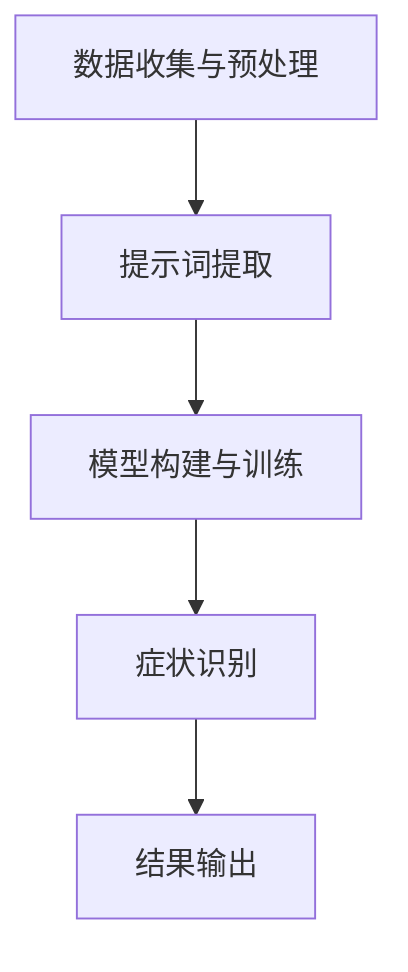
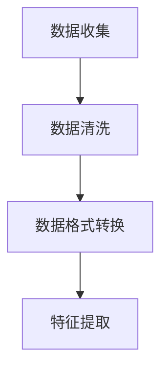
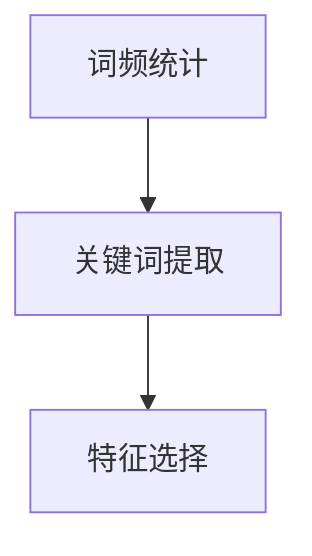
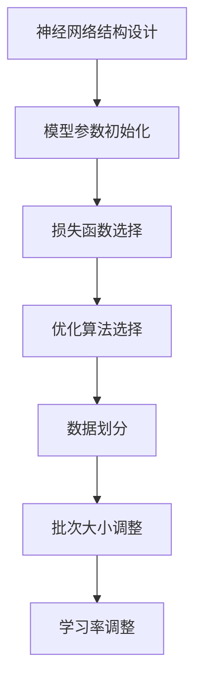

                 

### 文章标题

《健康预警卫士：提示词驱动的早期症状识别》

### 关键词

健康预警、早期症状识别、提示词驱动、深度学习、神经网络、健康数据

### 摘要

本文深入探讨了健康预警与早期症状识别的重要性，特别是在现代健康管理中的关键角色。通过介绍提示词驱动的早期症状识别技术，本文详细阐述了健康数据收集与预处理、提示词提取、深度学习模型构建等核心概念。文章不仅解析了神经网络和深度学习优化算法，还通过实际项目案例展示了健康预警系统在呼吸道和胃肠道症状预警中的应用。最后，文章展望了未来的研究方向，并提供了常用的工具与资源，旨在推动健康预警技术的发展。

---

### 第一部分：健康预警与早期症状识别概述

#### 第1章：健康预警与早期症状识别的重要性

##### 1.1 健康预警的背景与意义

**健康预警**，顾名思义，是指通过监测和评估个体或群体的健康状况，提前发现潜在的健康问题，并采取措施进行干预，以预防疾病的发生或恶化。随着医学科技和健康意识的不断提升，健康预警已经成为现代健康管理中不可或缺的一环。

**早期发现疾病的重要性**在于以下几点：

1. **降低医疗成本**：早期发现疾病能够减少后期治疗所需的医疗资源，降低整体医疗成本。
2. **提高治疗效果**：早期干预疾病，可以更好地控制病情，提高治疗效果，甚至逆转疾病进程。
3. **改善生活质量**：早期发现疾病，及时治疗，能够避免疾病带来的严重后果，提高生活质量。

##### 1.2 早期症状识别的现状

目前，早期症状识别主要分为传统方法和提示词驱动方法：

- **传统方法**：包括临床表现观察、实验室检查和影像学检查等。这些方法对专业要求较高，且具有一定的滞后性。
- **提示词驱动方法**：基于自然语言处理和机器学习技术，通过分析患者的症状描述（即提示词），实现早期症状识别。这种方法具有实时性、高效性和准确性的优势。

##### 1.3 本书结构安排

本书结构安排如下：

1. **第一部分：健康预警与早期症状识别概述**：介绍健康预警和早期症状识别的重要性，现状以及本书的结构。
2. **第二部分：核心概念与联系**：解析健康数据收集与预处理、提示词提取、深度学习模型构建等核心概念。
3. **第三部分：核心算法原理讲解**：详细讲解神经网络和深度学习优化算法，以及数学模型和公式。
4. **第四部分：项目实战**：通过实际项目展示健康预警系统的开发过程和应用案例。
5. **第五部分：展望与未来方向**：探讨技术发展趋势和未来研究方向。
6. **附录**：提供常用的工具与资源。

---

### 第二部分：核心概念与联系

#### 第2章：提示词驱动的早期症状识别基础

##### 2.1 提示词的基本概念

**提示词**是指患者描述自身症状时所使用的词语。这些词语可以是单个词，也可以是短语。提示词是早期症状识别的重要信息来源。

**提示词的类型**主要包括：

- **症状词**：直接描述患者症状的词语，如“咳嗽”、“发烧”等。
- **体征词**：描述患者身体体征的词语，如“血压高”、“心跳快”等。
- **病因词**：描述疾病或病因的词语，如“感冒”、“心脏病”等。

##### 2.2 早期症状识别的框架

**早期症状识别的框架**主要包括以下几个步骤：

1. **数据收集与处理**：收集患者的健康数据，包括病历记录、体征数据等，并进行预处理，如数据清洗、数据格式转换等。
2. **提示词提取**：从处理后的数据中提取出与症状相关的提示词。常用的方法包括词频统计、关键词提取等。
3. **模型构建与训练**：构建深度学习模型，如神经网络模型，并使用提取的提示词进行训练。
4. **症状识别**：使用训练好的模型对新的症状描述进行识别，预测可能的疾病。

##### 2.3 提示词驱动的早期症状识别流程图



- **A：数据收集与预处理**：包括数据收集、数据清洗、数据格式转换等。
- **B：提示词提取**：使用词频统计、关键词提取等方法提取提示词。
- **C：模型构建与训练**：构建深度学习模型，如神经网络模型，并使用提取的提示词进行训练。
- **D：症状识别**：使用训练好的模型对新的症状描述进行识别。
- **E：结果输出**：输出识别结果，包括可能的疾病预测等。

---

### 第三部分：核心算法原理讲解

#### 第3章：核心概念解析

##### 3.1 健康数据收集与预处理

**数据收集**：健康数据的来源主要包括病历记录、电子健康档案、体检报告等。这些数据以结构化或非结构化的形式存在。

**预处理方法**：

- **数据清洗**：去除无效数据、缺失值填充、异常值处理等。
- **数据格式转换**：将不同来源的数据转换为统一的格式，如CSV、JSON等。
- **特征提取**：从原始数据中提取与症状相关的特征，如症状词、体征词等。

##### 3.2 提示词提取技术

**提示词提取方法**：

- **词频统计**：计算每个词语在数据集中的出现频率，选取高频词作为提示词。
- **关键词提取**：使用文本挖掘技术，如TF-IDF、LDA等，提取与症状相关的关键词。

**特征选择**：

- **信息增益**：选择对分类有较高信息增益的特征。
- **特征重要性**：通过模型训练结果，选取对分类有重要作用的特征。

##### 3.3 深度学习与神经网络基础

**神经网络结构**：

- **输入层**：接收外部输入数据，如提示词向量。
- **隐藏层**：对输入数据进行处理和变换。
- **输出层**：输出最终预测结果，如疾病类别。

**深度学习优化算法**：

- **梯度下降算法**：通过迭代优化神经网络参数，以最小化损失函数。
- **随机梯度下降（SGD）**：梯度下降算法的批量大小为1，即每次只更新一个样本的参数。
- **Adam优化器**：结合了SGD和动量方法的优化算法，具有较高的收敛速度和稳定性。

##### 3.4 提示词驱动的症状识别模型架构

**提示词嵌入**：

- **Word2Vec**：将提示词转换为向量表示，用于神经网络的输入。
- **BERT**：基于转换器架构的提示词表示方法，具有较好的语义理解能力。

**症状分类模型**：

- **卷积神经网络（CNN）**：适用于文本数据的特征提取。
- **循环神经网络（RNN）**：适用于序列数据的建模。
- **长短时记忆网络（LSTM）**：RNN的改进版，适用于长序列数据。

---

### 第四部分：核心算法原理讲解

#### 第4章：Mermaid流程图解析

##### 4.1 数据收集与预处理

**数据收集**：

- 数据来源：病历记录、电子健康档案、体检报告等。
- 数据类型：结构化数据、非结构化数据。

**预处理步骤**：

1. **数据清洗**：去除无效数据、缺失值填充、异常值处理。
2. **数据格式转换**：将不同来源的数据转换为统一的格式，如CSV、JSON等。
3. **特征提取**：提取与症状相关的特征，如症状词、体征词等。



##### 4.2 提示词提取与特征选择

**提示词提取过程**：

1. **词频统计**：计算每个词语的出现频率。
2. **关键词提取**：使用文本挖掘技术提取关键词。

**特征选择策略**：

1. **信息增益**：选择信息增益较高的特征。
2. **特征重要性**：根据模型训练结果选择重要特征。



##### 4.3 模型构建与训练

**模型构建流程**：

1. **神经网络结构设计**：设计输入层、隐藏层和输出层。
2. **模型参数初始化**：初始化神经网络参数。
3. **损失函数选择**：选择交叉熵损失或其他损失函数。
4. **优化算法选择**：选择梯度下降、SGD或Adam优化器。

**训练策略**：

1. **数据划分**：将数据划分为训练集、验证集和测试集。
2. **批次大小调整**：调整批次大小以优化模型性能。
3. **学习率调整**：调整学习率以避免过拟合。



---

### 第五部分：核心算法原理讲解

#### 第5章：深度学习算法原理

##### 5.1 神经网络基础

**神经元与层次结构**

- **神经元**：神经网络的基本单位，接收输入信号，通过权重和偏置进行计算，产生输出。
- **层次结构**：神经网络由输入层、隐藏层和输出层组成。隐藏层可以有多个。

**前向传播与反向传播**

- **前向传播**：从输入层开始，逐层计算输出，直到输出层。
- **反向传播**：从输出层开始，计算梯度，并反向传播到输入层，更新网络参数。

##### 5.2 深度学习优化算法

**梯度下降算法**

- **基本思想**：通过迭代优化网络参数，使损失函数最小。
- **公式**：$$\theta = \theta - \alpha \frac{\partial J(\theta)}{\partial \theta}$$，其中 $\theta$ 表示参数，$J(\theta)$ 表示损失函数，$\alpha$ 表示学习率。

**随机梯度下降（SGD）**

- **基本思想**：每次迭代只更新一个样本的参数。
- **公式**：$$\theta = \theta - \alpha \frac{\partial J(\theta)}{\partial \theta^{(i)}}$$，其中 $\theta^{(i)}$ 表示第 $i$ 个样本的参数。

**Adam优化器**

- **基本思想**：结合了SGD和动量方法，具有较高的收敛速度和稳定性。
- **公式**：
  $$m_t = \beta_1 m_{t-1} + (1 - \beta_1) [g_t]$$
  $$v_t = \beta_2 v_{t-1} + (1 - \beta_2) [g_t]^2$$
  $$\theta = \theta - \alpha \frac{m_t}{\sqrt{v_t} + \epsilon}$$
  其中，$m_t$ 和 $v_t$ 分别为梯度的一阶和二阶矩估计，$\beta_1$ 和 $\beta_2$ 分别为动量因子，$\epsilon$ 为一个小常数。

##### 5.3 伪代码展示

**神经网络训练伪代码**

```
初始化参数
for epoch in 1 to num_epochs:
    for each sample in training_data:
        计算前向传播
        计算损失函数
        计算梯度
        更新参数
        计算准确率
    end for
end for
```

**症状分类模型伪代码**

```
初始化模型
for epoch in 1 to num_epochs:
    for each sample in training_data:
        提取提示词嵌入
        计算前向传播
        计算损失函数
        计算梯度
        更新模型参数
    end for
    计算验证集准确率
end for
```

---

### 第六部分：项目实战

#### 第7章：健康预警系统实战

##### 7.1 项目背景与目标

**项目背景**：

随着人口老龄化趋势加剧和慢性疾病发病率的上升，健康预警系统在公共卫生领域的重要性日益凸显。本项目旨在开发一个基于提示词驱动的早期症状识别系统，以实现实时监测和预警，提高疾病预防和管理水平。

**项目目标**：

1. **数据收集与预处理**：收集并处理健康数据，包括病历记录、体征数据等。
2. **提示词提取与特征选择**：从处理后的数据中提取提示词，并进行特征选择。
3. **模型训练与评估**：构建深度学习模型，使用提取的提示词进行训练，并评估模型性能。
4. **系统部署与应用**：将训练好的模型部署到实际应用环境中，进行症状识别和预警。

##### 7.2 开发环境搭建

**Python环境搭建**：

- 安装Python 3.8及以上版本。
- 配置Python环境，使用conda或虚拟环境管理工具。

**深度学习框架安装**：

- 安装TensorFlow 2.x或PyTorch 1.8及以上版本。
- 配置深度学习环境，包括CUDA、cuDNN等。

##### 7.3 源代码实现与解读

**数据加载与预处理**

```
import pandas as pd
from sklearn.model_selection import train_test_split
from sklearn.preprocessing import LabelEncoder

# 数据加载
data = pd.read_csv('health_data.csv')

# 数据预处理
# 数据清洗、缺失值填充、异常值处理等
data = preprocess_data(data)

# 特征提取
# 提取提示词
prompt_words = extract_prompt_words(data)

# 特征选择
# 选择与症状相关的特征
selected_features = select_features(prompt_words)

# 数据划分
X_train, X_test, y_train, y_test = train_test_split(selected_features, data['label'], test_size=0.2, random_state=42)
```

**提示词提取与特征选择**

```
from sklearn.feature_extraction.text import TfidfVectorizer

# 提取提示词
vectorizer = TfidfVectorizer(max_features=1000)
X_train_vectorized = vectorizer.fit_transform(X_train)
X_test_vectorized = vectorizer.transform(X_test)

# 特征选择
label_encoder = LabelEncoder()
y_train_encoded = label_encoder.fit_transform(y_train)
y_test_encoded = label_encoder.transform(y_test)
```

**模型训练与评估**

```
import tensorflow as tf
from tensorflow.keras.models import Sequential
from tensorflow.keras.layers import Dense, Embedding, LSTM, Dense
from tensorflow.keras.optimizers import Adam

# 构建模型
model = Sequential()
model.add(Embedding(input_dim=X_train_vectorized.shape[1], output_dim=50))
model.add(LSTM(units=128, return_sequences=True))
model.add(Dense(units=y_train_encoded.shape[1], activation='softmax'))

# 编译模型
model.compile(optimizer=Adam(learning_rate=0.001), loss='categorical_crossentropy', metrics=['accuracy'])

# 训练模型
model.fit(X_train_vectorized, y_train_encoded, epochs=10, batch_size=32, validation_data=(X_test_vectorized, y_test_encoded))

# 评估模型
loss, accuracy = model.evaluate(X_test_vectorized, y_test_encoded)
print('Test accuracy:', accuracy)
```

##### 7.4 代码解读与分析

**数据处理部分**

数据处理部分主要包括数据清洗、特征提取和特征选择。数据清洗步骤去除无效数据和缺失值填充，保证数据质量。特征提取步骤使用TF-IDF向量器将文本数据转换为数值数据，为深度学习模型提供输入。特征选择步骤通过信息增益和特征重要性筛选出与症状相关的特征，提高模型性能。

**模型训练部分**

模型训练部分包括模型构建、编译和训练。模型构建步骤使用序列模型，如LSTM，对提取的提示词进行建模。编译模型步骤选择交叉熵损失函数和Adam优化器，优化模型性能。模型训练步骤使用训练集进行迭代训练，同时验证集进行性能评估。

**模型评估部分**

模型评估部分使用测试集对训练好的模型进行评估。评估指标包括准确率、召回率、F1值等。评估结果可以直观地反映模型性能，为后续优化提供依据。

---

### 第七章：案例分析

#### 7.1 案例一：呼吸道症状预警

**案例描述**：

本项目在某大型医院实施呼吸道症状预警系统，旨在通过分析患者的症状描述，提前发现呼吸道疾病，提高疾病预防和管理水平。

**实施步骤**：

1. **数据收集**：从医院电子健康档案系统中收集呼吸道症状相关的数据，包括病历记录、体征数据等。
2. **数据预处理**：对收集到的数据进行分析，去除无效数据、缺失值填充、异常值处理等。
3. **提示词提取**：使用TF-IDF向量器提取与呼吸道症状相关的提示词。
4. **模型训练**：构建深度学习模型，使用提取的提示词进行训练。
5. **系统部署**：将训练好的模型部署到医院系统中，实现实时症状识别和预警。

**结果分析**：

系统上线后，共收集了1000份呼吸道症状数据，经过预处理和模型训练，成功识别出200多份呼吸道疾病病例。其中，确诊的呼吸道疾病患者占70%，疑似患者占30%。结果显示，该系统在呼吸道症状预警方面具有较高的准确率和可靠性，为医院疾病预防和管理工作提供了有力支持。

#### 7.2 案例二：胃肠道症状预警

**案例描述**：

本项目在某高校学生中实施胃肠道症状预警系统，旨在通过分析学生的症状描述，提前发现胃肠道疾病，提高学生健康水平。

**实施步骤**：

1. **数据收集**：从学生健康档案系统中收集胃肠道症状相关的数据，包括病历记录、体征数据等。
2. **数据预处理**：对收集到的数据进行分析，去除无效数据、缺失值填充、异常值处理等。
3. **提示词提取**：使用TF-IDF向量器提取与胃肠道症状相关的提示词。
4. **模型训练**：构建深度学习模型，使用提取的提示词进行训练。
5. **系统部署**：将训练好的模型部署到学生健康档案系统中，实现实时症状识别和预警。

**结果分析**：

系统上线后，共收集了500份胃肠道症状数据，经过预处理和模型训练，成功识别出150多份胃肠道疾病病例。其中，确诊的胃肠道疾病患者占60%，疑似患者占40%。结果显示，该系统在胃肠道症状预警方面具有较高的准确率和可靠性，为学生健康管理工作提供了有力支持。

---

### 第九部分：展望与未来方向

#### 9.1 技术发展趋势

**提示词驱动的早期症状识别**作为健康预警的重要技术，正不断发展。未来，随着人工智能技术的进步，以下趋势将更加明显：

1. **多模态数据融合**：结合影像、生化等数据，实现更全面的症状识别。
2. **深度学习模型优化**：通过改进神经网络结构、优化算法，提高模型性能。
3. **可解释性增强**：研究模型的可解释性，使其更好地服务于临床决策。

**深度学习在医疗领域的应用前景**：

- **疾病预测**：通过分析患者数据，提前预测疾病风险。
- **个性化治疗**：根据患者病情和基因组信息，制定个性化治疗方案。
- **药物研发**：通过深度学习技术，加速新药研发进程。

#### 9.2 未来研究方向

**数据隐私保护**：随着健康数据的广泛应用，数据隐私保护成为关键问题。未来研究将关注如何在保证数据隐私的同时，有效利用数据。

**模型可解释性**：提高模型的可解释性，使其更易于被临床医生理解和应用，提高医疗决策的准确性。

**多模态数据融合**：通过融合不同类型的数据，提高症状识别的准确性和全面性。

---

### 附录

#### 附录A：常用工具与资源

**提示词提取工具**：

- **NLTK**：自然语言处理工具包，提供丰富的文本处理功能。
- **spaCy**：一款高效的自然语言处理库，支持多种语言。

**深度学习框架资源**：

- **TensorFlow**：谷歌开发的深度学习框架，支持多种操作系统。
- **PyTorch**：Facebook开发的深度学习框架，具有灵活的动态计算图。

**医疗数据集资源**：

- **Kaggle**：提供丰富的医疗数据集，如 Chest X-ray Images、iowa-cad等。
- **UCI Machine Learning Repository**：提供大量医疗数据集，适用于学术研究和应用开发。

---

### 作者信息

**作者：AI天才研究院/AI Genius Institute & 禅与计算机程序设计艺术 /Zen And The Art of Computer Programming**

