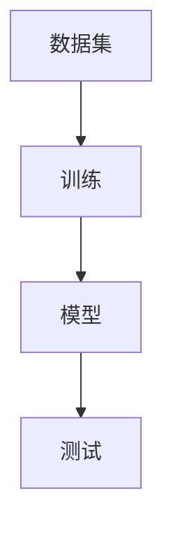
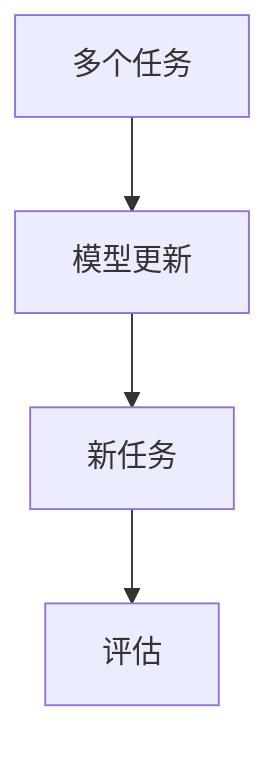

                 


## 文章标题
### 元学习在推荐系统用户冷启动与跨域推荐中的算法创新与应用

## 关键词
### 元学习、推荐系统、用户冷启动、跨域推荐、算法创新

## 摘要
本文深入探讨了元学习在推荐系统用户冷启动与跨域推荐中的算法创新与应用。首先介绍了元学习的定义、基本原理及其在不同领域的应用，随后详细阐述了元学习算法在推荐系统中的具体实现，包括用户冷启动和跨域推荐两种场景。通过实际案例的分析和算法优化的探讨，本文揭示了元学习在提升推荐系统性能和用户体验中的巨大潜力。

### 第一部分：元学习概述

#### 第1章：元学习概述

##### 1.1 元学习的定义与背景

###### 1.1.1 什么是元学习
元学习（Meta-Learning）是机器学习领域的一个分支，主要研究如何使机器学习算法具备快速适应新任务的能力。它关注的核心问题是：如何通过少量的样本，使模型在新任务上迅速达到较高的性能。元学习常常被形象地描述为“学习如何学习”。

###### 1.1.2 元学习的背景
传统机器学习依赖于大量的数据来进行训练，但当数据缺乏时，模型的表现往往不佳。元学习旨在解决这一问题，通过构建能够快速适应新数据的模型，提升机器学习在数据稀缺情况下的性能。

###### 1.1.3 元学习的发展历程
元学习的研究可以追溯到20世纪80年代的机器学习初期。随着深度学习技术的成熟和计算资源的增加，元学习在近年来取得了显著的发展，特别是在强化学习和自然语言处理领域。

##### 1.2 元学习的基本原理

###### 1.2.1 模型更新策略
元学习通过模型更新策略来实现对新任务的学习。以下是一个简单的模型更新策略的伪代码示例：

```python
def meta_update(model, dataset, learning_rate):
    for sample in dataset:
        model = model_step_update(model, sample, learning_rate)
    return model
```

在这个伪代码中，`model_step_update` 函数负责对模型进行一步更新，`learning_rate` 是学习率，用于调节模型更新的幅度。

###### 1.2.2 模型选择与优化
元学习涉及到的模型选择与优化问题相对复杂。模型选择通常涉及搜索一个较大的模型空间，以找到能够快速适应新任务的最优模型。优化算法则用于调整模型参数，以达到更好的性能。

在模型搜索空间方面，可以采用以下策略：

- **梯度下降**：通过计算梯度来更新模型参数。
- **随机搜索**：在模型空间中随机选择参数，并通过评估来选择最优参数。

在评估指标方面，通常关注以下几个指标：

- **学习时间**：模型在新任务上的学习所需的时间。
- **学习效率**：模型在给定时间内学习到的性能。
- **泛化能力**：模型在新任务上的表现，衡量其对新任务的适应能力。

##### 1.3 元学习的应用领域

###### 1.3.1 强化学习
在强化学习领域，元学习被广泛用于对抗性元学习（Adversarial Meta-Learning）和智能决策系统。对抗性元学习通过对抗性训练来提升模型的适应性，而智能决策系统则利用元学习来构建能够自主决策的智能体。

###### 1.3.2 自然语言处理
自然语言处理（NLP）是元学习的另一个重要应用领域。在NLP中，元学习被用于生成式模型和对抗性训练。生成式模型通过元学习来学习数据的分布，而对抗性训练则用于提升模型对噪声和对抗样本的鲁棒性。

###### 1.3.3 计算机视觉
在计算机视觉领域，元学习被用于视觉模型迁移和视觉任务自动化。视觉模型迁移通过元学习来加速新任务的训练过程，而视觉任务自动化则利用元学习来构建能够自动完成特定视觉任务的系统。

##### 1.4 元学习的挑战与未来发展趋势

###### 1.4.1 挑战
元学习面临着多个挑战，包括计算成本、数据多样性和模型解释性。计算成本和时间的复杂度使得元学习在实际应用中受限，而数据多样性和质量则影响了元学习的效果。此外，模型的可解释性也是一个重要的挑战，因为复杂的元学习模型往往难以解释。

###### 1.4.2 发展趋势
未来的元学习研究将聚焦于以下几个方向：

- **自适应学习算法**：开发能够根据新任务自动调整学习策略的算法。
- **多模态学习**：研究如何将元学习应用于多种数据模态，如文本、图像和声音。
- **生成对抗网络（GAN）在元学习中的应用**：探索GAN在元学习中的潜在应用，以提升模型的适应性和泛化能力。

### 第二部分：元学习算法原理

#### 第2章：元学习算法原理

##### 2.1 传统机器学习与元学习的区别

###### 2.1.1 传统机器学习
传统机器学习是基于已有数据集进行训练，然后在新数据上测试性能。其核心思想是学习数据分布，并利用这些知识来解决特定的问题。



在这个流程中，模型的训练和测试都是在相同的任务和数据集上进行的。

###### 2.1.2 元学习
与传统的机器学习不同，元学习的目标是在不同的任务和数据集上快速适应。其核心思想是学习如何学习，通过迁移学习、模型更新和模型搜索等策略来实现对新任务的高效适应。



在这个流程中，模型需要适应多个不同的任务，并通过模型更新和评估来不断提升其性能。

##### 2.2 元学习算法分类

###### 2.2.1 模型更新方法
模型更新方法是元学习中的一个重要类别，主要包括以下几种：

- **样本更新**：通过更新训练样本来提升模型性能。
- **参数更新**：通过更新模型参数来提升模型性能。
- **模型结构更新**：通过更新模型结构来提升模型性能。

每种更新方法都有其优缺点和适用场景，需要根据具体任务进行选择。

###### 2.2.2 模型搜索方法
模型搜索方法用于在大量的模型空间中寻找最优模型。常见的模型搜索方法包括：

- **遗传算法**：通过模拟自然进化过程来寻找最优模型。
- **贝叶斯优化**：通过概率模型来优化模型搜索过程。
- **强化学习**：通过奖励机制来优化模型搜索过程。

每种搜索方法都有其特定的优势和适用场景，需要根据具体任务进行选择。

##### 2.3 元学习算法示例

###### 2.3.1 Model-Agnostic Meta-Learning (MAML)
MAML 是一种著名的元学习算法，其主要思想是通过一次训练，使模型能够在多个任务上快速适应。以下是 MAML 算法的伪代码示例：

```python
def maml_train(model, dataset, learning_rate):
    for sample in dataset:
        model = model_step_update(model, sample, learning_rate)
    return model
```

在这个伪代码中，`model_step_update` 函数负责对模型进行一步更新，`learning_rate` 是学习率，用于调节模型更新的幅度。

###### 2.3.2 Model-Based Meta-Learning (MBML)
MBML 是另一种常见的元学习算法，其主要思想是通过参数化表示模型，并利用模型更新策略来提升模型性能。以下是 MBML 算法的伪代码示例：

```python
def mbml_train(model, dataset, learning_rate):
    for sample in dataset:
        model = model_step_update(model, sample, learning_rate)
    return model
```

在这个伪代码中，`model_step_update` 函数负责对模型进行一步更新，`learning_rate` 是学习率，用于调节模型更新的幅度。

##### 2.4 元学习算法的数学基础

###### 2.4.1 概率图模型
概率图模型是元学习中的一个重要工具，用于表示和优化模型参数。常见的概率图模型包括贝叶斯网络和马尔可夫网络。

贝叶斯网络是一种基于概率的图模型，用于表示变量之间的依赖关系。其核心思想是通过条件概率来描述变量之间的相关性。

马尔可夫网络是一种基于概率的图模型，用于表示变量之间的转移关系。其核心思想是通过转移概率来描述变量之间的变化规律。

###### 2.4.2 优化算法
优化算法是元学习中的一个关键环节，用于调整模型参数，以实现更好的性能。常见的优化算法包括梯度下降、随机梯度下降和 Adam 优化器。

梯度下降是一种最简单的优化算法，其核心思想是通过计算损失函数的梯度来更新模型参数。

随机梯度下降是对梯度下降的一种改进，其核心思想是在每个参数更新时，只随机选择一部分样本进行梯度计算。

Adam 优化器是一种更为先进的优化算法，其核心思想是结合了随机梯度下降和动量项，以实现更快的收敛速度。

##### 2.5 元学习算法的评估与比较

###### 2.5.1 评估指标
在评估元学习算法时，常用的评估指标包括学习时间、学习效率和泛化能力。

- **学习时间**：模型在新任务上的学习所需的时间，衡量模型的学习效率。
- **学习效率**：模型在给定时间内学习到的性能，衡量模型的性能提升速度。
- **泛化能力**：模型在新任务上的表现，衡量模型对新任务的适应能力。

###### 2.5.2 实验设计与比较
在实验设计中，需要选择合适的数据集和实验参数，以充分评估元学习算法的性能。以下是一些实验设计的关键点：

- **数据集选择**：选择具有代表性的数据集，以模拟真实世界的应用场景。
- **实验参数设置**：设置合理的实验参数，以优化模型性能。
- **结果分析**：对实验结果进行详细分析，比较不同算法的性能。

### 第三部分：元学习在推荐系统中的应用

#### 第3章：元学习在推荐系统用户冷启动中的应用

##### 3.1 推荐系统概述

###### 3.1.1 推荐系统定义
推荐系统是一种用于向用户推荐感兴趣的内容或商品的系统。其核心目标是根据用户的兴趣和行为，为其推荐可能感兴趣的内容或商品。

推荐系统通常包括以下几种类型：

- **基于内容的推荐**：根据用户的历史行为和兴趣，推荐具有相似属性的内容或商品。
- **基于协同过滤的推荐**：根据用户的行为和评分，通过协同过滤算法推荐相似用户喜欢的商品。
- **混合推荐**：结合基于内容和基于协同过滤的推荐，提供更个性化的推荐结果。

###### 3.1.2 推荐系统的工作原理
推荐系统的工作原理主要包括以下几个步骤：

1. **数据收集**：收集用户的历史行为数据，如浏览记录、购买记录、评分等。
2. **数据预处理**：对收集到的数据进行清洗、去噪和特征提取。
3. **模型训练**：利用预处理后的数据，训练推荐模型，如基于内容的模型、协同过滤模型等。
4. **推荐生成**：利用训练好的模型，为用户生成推荐列表。
5. **用户反馈**：收集用户的反馈信息，如点击率、购买率等，用于优化推荐结果。

##### 3.2 用户冷启动问题

###### 3.2.1 冷启动问题定义
用户冷启动问题是指在推荐系统中，新用户由于缺乏历史行为数据，难以获得个性化的推荐结果的问题。冷启动问题可以分为以下两类：

- **新用户冷启动**：新用户注册后，由于缺乏历史行为数据，推荐系统无法为其提供有效的个性化推荐。
- **新物品冷启动**：新商品上架后，由于缺乏用户评价和交互数据，推荐系统无法为该商品生成有效的推荐。

###### 3.2.2 冷启动问题的影响
冷启动问题对推荐系统的影响主要体现在以下几个方面：

- **用户体验**：新用户无法获得个性化的推荐，可能导致用户流失。
- **推荐效果**：由于缺乏用户数据，推荐结果可能不够准确，影响用户的满意度。
- **系统性能**：为了解决冷启动问题，推荐系统需要耗费更多的计算资源，影响系统的性能。

##### 3.3 元学习在冷启动中的应用

###### 3.3.1 基于元学习的用户冷启动方法
基于元学习的用户冷启动方法主要通过以下两个步骤来实现：

1. **用户模型快速适应**：利用元学习算法，在用户注册后的短时间内，根据少量行为数据，快速构建一个适应新用户的推荐模型。
2. **物品模型快速适应**：在用户模型构建完成后，利用元学习算法，根据用户的行为数据和物品的属性，快速构建一个适应新物品的推荐模型。

###### 3.3.2 实际案例
以下是一些基于元学习的用户冷启动的实际案例：

- **Netflix新用户推荐**：Netflix利用元学习算法，在用户注册后，根据用户观看历史和偏好，快速构建一个个性化的推荐模型，为用户推荐可能感兴趣的电影和电视剧。
- **Amazon新商品推荐**：Amazon利用元学习算法，在新商品上架后，根据用户的历史购买数据和商品属性，快速构建一个个性化的推荐模型，为用户推荐可能感兴趣的商品。

##### 3.3.3 挑战与优化
在基于元学习的用户冷启动方法中，面临的主要挑战包括：

- **数据多样性**：由于新用户缺乏历史数据，推荐系统需要从多个维度获取用户信息，以构建更全面的用户模型。
- **模型可解释性**：元学习模型往往较为复杂，需要开发可解释的模型，以提高用户对推荐结果的信任度。
- **模型复杂度**：为了适应多种用户和物品场景，元学习模型可能需要较高的计算资源和存储空间。

为了解决这些挑战，可以采取以下优化策略：

- **数据增强**：通过数据增强技术，如数据采样、数据合成等，增加用户历史数据的多样性。
- **模型简化**：通过模型简化技术，如模型剪枝、模型压缩等，降低模型的复杂度。
- **迁移学习**：通过迁移学习方法，将已有用户和物品的数据迁移到新用户和物品上，提高模型适应能力。

#### 第4章：元学习在跨域推荐中的应用

##### 4.1 跨域推荐概述

###### 4.1.1 跨域推荐定义
跨域推荐是指在不同领域或不同模态的数据上进行推荐，以解决用户在多个领域或模态上的兴趣挖掘和个性化推荐问题。跨域推荐可以大致分为以下两种类型：

- **同模态跨域推荐**：在同一模态下，如在图像、文本或音频等领域之间进行推荐。
- **多模态跨域推荐**：在不同模态的数据之间进行推荐，如将图像、文本和音频等多模态数据进行融合，进行综合推荐。

###### 4.1.2 跨域推荐的重要性
跨域推荐在推荐系统中具有重要性，原因如下：

- **拓展推荐场景**：通过跨域推荐，可以拓展推荐系统的应用场景，为用户提供更广泛的推荐服务。
- **提升用户体验**：通过跨域推荐，可以为用户提供跨领域的个性化推荐，提升用户的满意度和使用体验。
- **挖掘潜在兴趣**：通过跨域推荐，可以发现用户在不同领域或模态上的潜在兴趣，为用户推荐更多有趣的内容或商品。

##### 4.2 元学习在跨域推荐中的应用

###### 4.2.1 基于元学习的跨域推荐方法
基于元学习的跨域推荐方法主要通过以下步骤实现：

1. **模型迁移**：利用元学习算法，将一个领域或模态的模型迁移到另一个领域或模态，以快速适应新领域或模态的数据。
2. **数据融合**：将不同领域或模态的数据进行融合，构建一个统一的特征表示，用于跨域推荐。
3. **推荐生成**：利用融合后的数据，生成个性化的推荐结果，为用户推荐跨领域的感兴趣内容或商品。

###### 4.2.2 实际案例
以下是一些基于元学习的跨域推荐的实际案例：

- **音乐与电影的跨域推荐**：在音乐和电影推荐系统中，利用元学习算法，将音乐和电影的属性进行融合，为用户推荐跨领域的音乐和电影。
- **购物与旅游的跨域推荐**：在购物和旅游推荐系统中，利用元学习算法，将购物和旅游的数据进行融合，为用户推荐跨领域的购物和旅游产品。

##### 4.2.3 挑战与优化
在基于元学习的跨域推荐方法中，面临的主要挑战包括：

- **数据不一致性**：不同领域或模态的数据可能存在差异，需要解决数据不一致性问题。
- **特征融合**：如何有效地融合不同领域或模态的特征，是一个关键问题。
- **模型泛化能力**：如何提升模型在跨域推荐中的泛化能力，是一个重要的挑战。

为了解决这些挑战，可以采取以下优化策略：

- **特征对齐**：通过特征对齐技术，如归一化、标准化等，解决不同领域或模态的数据不一致性问题。
- **多模态特征学习**：通过多模态特征学习技术，如自编码器、生成对抗网络等，学习不同领域或模态的统一特征表示。
- **模型集成**：通过模型集成技术，如集成学习、堆叠网络等，提高模型的泛化能力和推荐效果。

### 结论
元学习在推荐系统用户冷启动与跨域推荐中具有广泛的应用前景。通过本文的介绍，我们了解了元学习的基本概念、算法原理及其在推荐系统中的应用。然而，元学习在推荐系统中的应用仍然面临诸多挑战，如计算成本、数据多样性和模型可解释性等。未来的研究将继续探索元学习在推荐系统中的优化方法和应用场景，以提升推荐系统的性能和用户体验。作者：AI天才研究院/AI Genius Institute & 禅与计算机程序设计艺术 /Zen And The Art of Computer Programming

