                 

### 第2章：全球化领导的战略思维

### 2.1 全球化领导战略的制定

#### 全球化背景下的战略思维

全球化不仅是经济现象，它对组织管理和领导力也提出了新的挑战。在全球化的背景下，领导者需要具备全球视野，理解不同地区的文化、政治和经济环境，从而制定有效的战略。

**核心概念与联系：**

**全球化背景 → 战略思维**

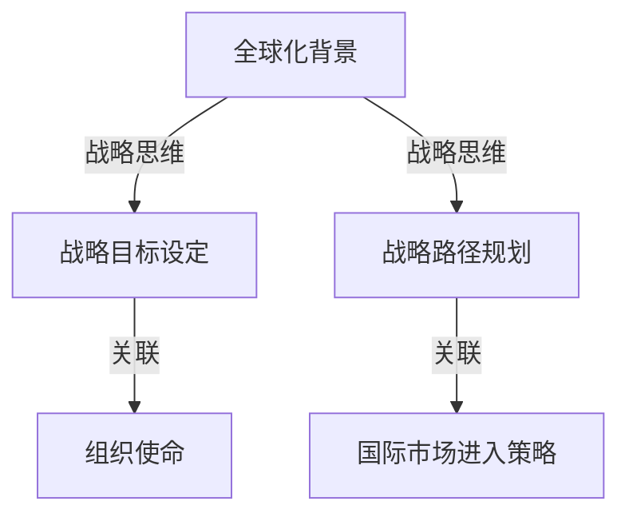

#### 战略目标设定

制定战略目标需要清晰地了解组织的使命和愿景，同时要考虑全球化带来的机遇和挑战。战略目标应具有可衡量性、可实现性和相关性。

**核心算法原理讲解：**

1. **使命与愿景分析：**  
   - 明确组织的使命和愿景
   - 分析全球化对使命和愿景的影响

2. **目标设定：**  
   - 制定具体的战略目标
   - 确保目标与使命和愿景的一致性

**伪代码：**

```python
def set_strategic_goals(organization_mission, vision, globalization_impact):
    # 分析使命和愿景
    mission_analysis = analyze_mission(organization_mission, globalization_impact)
    vision_analysis = analyze_vision(vision, globalization_impact)
    
    # 设定具体目标
    strategic_goals = []
    for goal in create_goals(mission_analysis, vision_analysis):
        if is_measureable(goal) and is_achievable(goal) and is_relevant(goal):
            strategic_goals.append(goal)
    
    return strategic_goals
```

#### 战略路径规划

战略路径规划涉及如何进入国际市场、选择适当的经营模式，以及如何实现战略目标。

**核心算法原理讲解：**

1. **市场进入策略：**  
   - 分析国际市场的需求和竞争状况
   - 选择合适的进入策略（如出口、合资、并购等）

2. **经营模式选择：**  
   - 考虑本地化与全球化平衡
   - 选择适合经营模式（如跨国经营、全球供应链等）

**伪代码：**

```python
def plan_strategic_path(international_market_analysis, business_model_options):
    # 选择市场进入策略
    entry_strategy = select_entry_strategy(international_market_analysis)
    
    # 选择经营模式
    business_model = select_business_model(business_model_options, entry_strategy)
    
    # 确定路径规划
    strategic_path = {
        'entry_strategy': entry_strategy,
        'business_model': business_model
    }
    
    return strategic_path
```

#### 战略目标的实现

战略目标的实现需要通过有效的组织结构和流程管理来实现。

**核心算法原理讲解：**

1. **组织结构设计：**  
   - 考虑全球化对组织结构的影响
   - 设计适应全球化的组织结构

2. **流程管理：**  
   - 确保战略目标的实现
   - 实施有效的流程管理

**伪代码：**

```python
def implement_strategic_goals(strategic_goals, organizational_structure, process_management):
    # 设计组织结构
    organizational_structure = design_organizational_structure(organizational_structure, globalization_impact)
    
    # 确保流程管理
    process_management = ensure_process_management(process_management, strategic_goals)
    
    # 实现战略目标
    for goal in strategic_goals:
        if is实现的战略目标(goal):
            print(f"战略目标'{goal}'已实现。")
        else:
            print(f"战略目标'{goal}'尚未实现，需要进一步努力。")
    
    return True
```

### 2.2 跨文化领导与组织整合

跨文化领导涉及如何在多元化的团队中发挥领导作用，以及如何整合不同文化背景下的组织。

**核心概念与联系：**

**跨文化领导 → 组织整合**

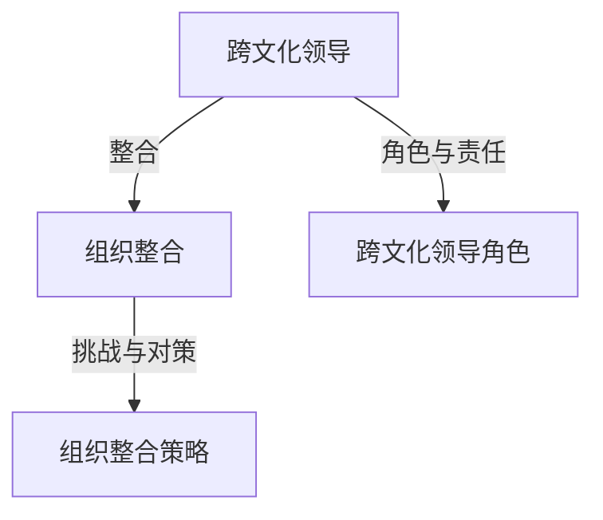

#### 跨文化领导的角色与责任

跨文化领导需要具备跨文化意识，能够理解和尊重不同文化的价值观和行为模式。

**核心算法原理讲解：**

1. **跨文化意识：**    
   - 学习和理解不同文化的基本特征
   - 培养跨文化沟通和协作的能力

2. **角色模型：**    
   - 跨文化领导者的角色定位
   - 跨文化领导者的行为规范

**伪代码：**

```python
def cross_cultural_leadership(cultural_knowledge, communication_skills, role_model):
    # 学习文化知识
    cultural_knowledge = learn_cultural_knowledge(cultural_knowledge)
    
    # 培养沟通技能
    communication_skills = develop_communication_skills(communication_skills)
    
    # 角色模型建立
    role_model = define_role_model(role_model)
    
    return True
```

#### 组织整合的挑战与对策

组织整合面临文化差异、沟通障碍和协作难题等挑战。

**核心算法原理讲解：**

1. **文化差异分析：**    
   - 分析不同文化之间的差异
   - 确定组织整合的关键因素

2. **整合策略：**    
   - 制定文化整合的策略
   - 实施文化整合的步骤

**伪代码：**

```python
def integrate_organizations(cultural_differences, integration_strategies):
    # 分析文化差异
    cultural_analyzer = analyze_cultural_differences(cultural_differences)
    
    # 制定整合策略
    integration_strategies = create_integration_strategies(cultural_analyzer)
    
    # 实施整合步骤
    integration_steps = implement_integration_steps(integration_strategies)
    
    return True
```

### 2.3 全球化领导与创新

全球化领导需要鼓励创新，以应对不断变化的市场环境和竞争压力。

**核心概念与联系：**

**全球化领导 → 创新**

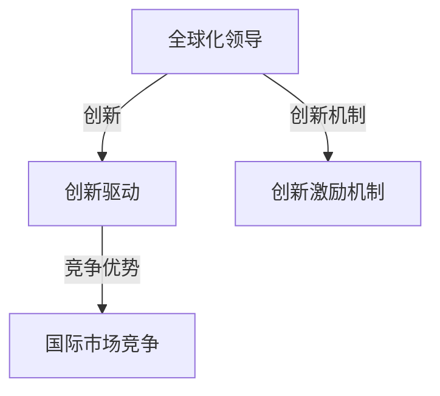

#### 创新驱动的全球化

创新驱动的全球化强调通过创新来提升企业的国际竞争力。

**核心算法原理讲解：**

1. **创新机制：**    
   - 建立创新流程和管理体系
   - 鼓励跨部门合作和知识共享

2. **创新激励机制：**    
   - 设定创新目标和奖励机制
   - 提供创新资源和培训

**伪代码：**

```python
def drive_innovation_through_global_leadership(innovation_process, innovation_incentives):
    # 建立创新流程
    innovation_process = establish_innovation_process(innovation_process)
    
    # 设定创新目标
    innovation_goals = set_innovation_goals(innovation_process)
    
    # 提供创新资源
    innovation_resources = provide_innovation_resources(innovation_goals)
    
    # 奖励创新行为
    innovation_rewards = reward_innovation_activities(innovation_resources)
    
    return True
```

通过上述步骤，全球化领导可以在全球化背景下制定有效的战略，整合跨文化组织，并驱动创新，以实现组织的全球竞争力。

## 总结

全球化领导要求领导者具备全球视野、跨文化意识和创新思维。通过有效的战略制定、组织整合和创新能力，领导者可以应对全球化带来的挑战，提升组织的国际竞争力。在下一章中，我们将探讨跨国团队管理中的挑战，包括跨文化沟通障碍和跨国团队协作难题。

### 第3章：跨国团队管理挑战

#### 第3章：跨国团队管理挑战

### 3.1 跨文化沟通障碍

跨文化沟通障碍是跨国团队管理中的一个重要挑战。不同文化背景下的沟通方式和习惯差异可能导致误解和冲突。

**核心概念与联系：**

**跨文化差异 → 沟通障碍**

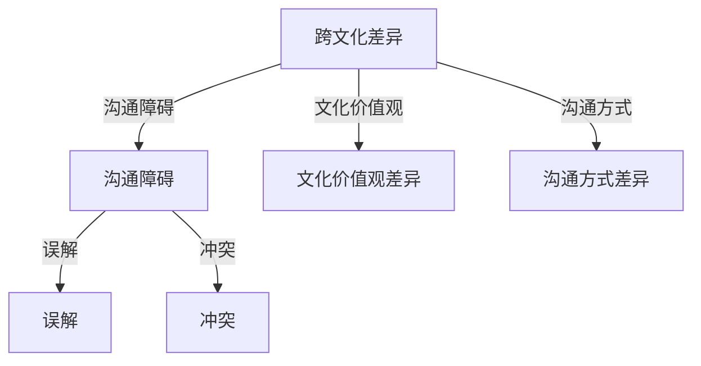

#### 跨文化差异分析

跨文化差异包括文化价值观、沟通方式、决策风格等方面。

**核心算法原理讲解：**

1. **文化价值观差异：**  
   - 分析不同文化价值观的异同
   - 确定文化价值观对沟通的影响

2. **沟通方式差异：**  
   - 研究不同文化背景下的沟通习惯
   - 确定跨文化沟通的有效策略

**伪代码：**

```python
def analyze_cultural_differences(culture_a, culture_b):
    # 分析文化价值观差异
    cultural_values = compare_cultural_values(culture_a, culture_b)
    
    # 分析沟通方式差异
    communication_styles = compare_communication_styles(culture_a, culture_b)
    
    return cultural_values, communication_styles
```

#### 跨文化沟通策略

为了克服跨文化沟通障碍，领导者需要采取有效的沟通策略。

**核心算法原理讲解：**

1. **增强跨文化意识：**  
   - 培训和提高团队成员的跨文化意识
   - 促进跨文化知识的共享和交流

2. **明确沟通目标：**  
   - 设定明确的沟通目标
   - 确保沟通信息的准确传达

3. **使用多种沟通方式：**  
   - 结合面对面沟通、书面沟通和远程沟通
   - 选择合适的沟通工具和平台

**伪代码：**

```python
def implement_cultural_communication_strategy(communication_goals, cultural_awareness, communication_tools):
    # 提高跨文化意识
    cultural_awareness = enhance_cultural_awareness(cultural_awareness)
    
    # 设定沟通目标
    communication_goals = define_communication_goals(communication_goals)
    
    # 选择沟通工具
    communication_tools = select_communication_tools(communication_tools)
    
    return True
```

#### 跨文化冲突管理

跨文化冲突是跨国团队管理中的常见问题，需要有效的管理策略。

**核心算法原理讲解：**

1. **识别冲突源：**  
   - 分析跨文化冲突的潜在原因
   - 确定冲突的关键因素

2. **冲突解决策略：**  
   - 使用适当的冲突解决方法
   - 促进对话和协商

3. **文化敏感性培训：**  
   - 提高团队成员对文化冲突的敏感性
   - 培养文化冲突管理的技能

**伪代码：**

```python
def manage_cultural_conflicts(conflict_source, conflict_resolution_methods, cultural_sensitivity_training):
    # 识别冲突源
    conflict_source = identify_conflict_source(conflict_source)
    
    # 冲突解决策略
    conflict_resolution = implement_conflict_resolution_methods(conflict_source)
    
    # 文化敏感性培训
    cultural_sensitivity = provide_cultural_sensitivity_training(cultural_sensitivity_training)
    
    return True
```

通过上述策略，领导者可以有效地管理跨国团队中的跨文化沟通障碍和冲突，提高团队的整体效能。

### 第3章小结

跨国团队管理中的跨文化沟通障碍是一个复杂的问题，需要领导者在跨文化差异分析的基础上，采取有效的沟通策略和冲突管理方法。通过提高跨文化意识和冲突管理技能，领导者可以促进团队的跨文化协作，提升团队绩效。在下一章中，我们将探讨跨国团队协作中的其他难题。

### 第4章：跨国团队协作难题

#### 第4章：跨国团队协作难题

### 4.1 跨国团队的构成与特点

跨国团队是由来自不同国家、具有不同文化背景和技能的成员组成的团队。这种团队的构成和特点对管理提出了特殊的要求。

**核心概念与联系：**

**跨国团队构成 → 团队特点**

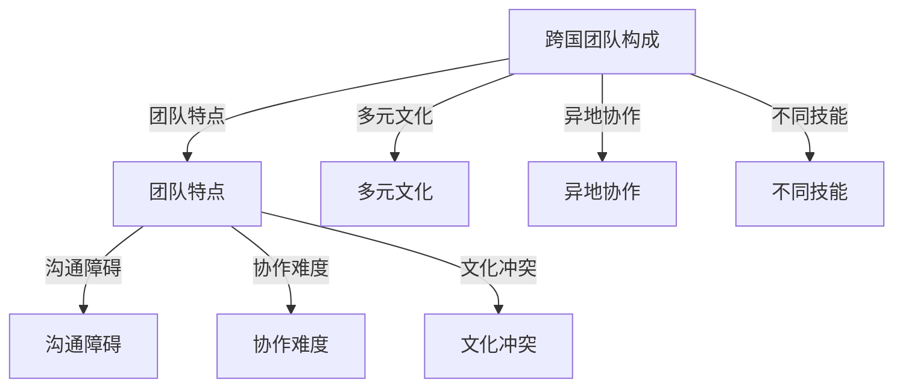

#### 多元文化

多元文化是跨国团队的一大特点，也是协作中的一大挑战。

**核心算法原理讲解：**

1. **文化差异识别：**  
   - 分析团队成员的文化背景
   - 确定可能的文化冲突点

2. **文化融合策略：**  
   - 制定文化融合的方案
   - 促进文化之间的理解和尊重

**伪代码：**

```python
def identify_and_fuse_cultures(team_members):
    # 分析文化差异
    cultural_differences = analyze_cultural_differences(team_members)
    
    # 制定文化融合策略
    cultural_fusion_strategy = create_fusion_strategy(cultural_differences)
    
    # 实施文化融合
    implement_cultural_fusion(cultural_fusion_strategy)
    
    return True
```

#### 异地协作

异地协作是跨国团队的另一个挑战，涉及到时区、语言和通信设施的问题。

**核心算法原理讲解：**

1. **协作工具选择：**  
   - 选择适合的协作工具和平台
   - 确保团队成员可以顺畅沟通和协作

2. **时区管理：**  
   - 制定时区协作计划
   - 确保重要任务的按时完成

**伪代码：**

```python
def manage_time_zone协作(team_members, collaboration_tools):
    # 选择协作工具
    collaboration_tools = select Collaboration_tools(collaboration_tools)
    
    # 制定时区协作计划
    time_zone_plan = create_time_zone_plan(team_members)
    
    # 实施时区协作
    implement_time_zone_collaboration(time_zone_plan, collaboration_tools)
    
    return True
```

#### 不同技能

跨国团队中成员的技能多样性也是协作中的一大挑战。

**核心算法原理讲解：**

1. **技能匹配：**  
   - 分析团队成员的技能和能力
   - 确保团队成员能够互补

2. **技能培训：**  
   - 提供必要的技能培训
   - 促进团队成员技能的提升

**伪代码：**

```python
def match_and_train_skills(team_members):
    # 分析技能差异
    skill_analyzer = analyze_skills(team_members)
    
    # 制定技能匹配方案
    skill_matching_strategy = create_matching_strategy(skill_analyzer)
    
    # 实施技能培训
    implement_skills_training(skill_matching_strategy)
    
    return True
```

#### 团队协作难题

跨国团队的协作难题包括沟通障碍、文化冲突和协作难度。

**核心算法原理讲解：**

1. **沟通障碍识别：**  
   - 分析沟通障碍的来源
   - 确定解决沟通障碍的方法

2. **文化冲突管理：**  
   - 分析文化冲突的原因
   - 采用有效的冲突管理策略

3. **协作难度提升：**  
   - 提高团队成员的协作能力
   - 建立有效的协作流程

**伪代码：**

```python
def manage_collaboration_difficulties(communication_barriers, cultural_conflicts, collaboration_difficulties):
    # 识别沟通障碍
    communication_solutions = identify_communication_barriers(communication_barriers)
    
    # 管理文化冲突
    cultural_conflict_management = manage_cultural_conflicts(cultural_conflicts)
    
    # 提升协作难度
    collaboration_improvement = improve_collaboration(collaboration_difficulties)
    
    return True
```

通过上述策略，领导者可以有效地应对跨国团队协作中的挑战，促进团队的整体效能。在下一章中，我们将探讨如何建设跨国团队，以及如何提高团队协作的效果。

### 第4章小结

跨国团队的协作难题包括多元文化、异地协作和不同技能等多个方面。通过识别和解决这些难题，领导者可以促进跨国团队的协作，提升团队绩效。在下一章中，我们将探讨如何通过有效的团队建设和领导艺术来提高跨国团队的协作效能。

### 第5章：跨文化领导力模型

#### 第5章：跨文化领导力模型

### 5.1 跨文化领导理论回顾

跨文化领导理论是全球化背景下领导学研究的重要组成部分。不同的跨文化领导理论提供了不同的视角和方法，以帮助领导者更好地管理多元化团队。

**核心概念与联系：**

**跨文化领导理论 → 领导模型**

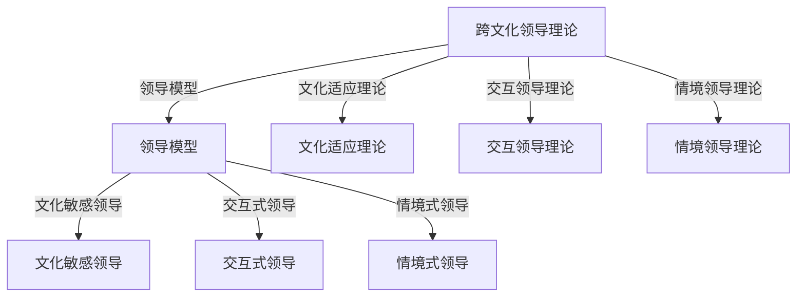

#### 文化适应理论

文化适应理论强调领导者需要适应不同的文化环境，以有效管理多元文化团队。

**核心算法原理讲解：**

1. **文化适应模型：**  
   - 分析文化适应的不同阶段
   - 提出文化适应的策略和方法

2. **文化适应策略：**  
   - 增强跨文化意识
   - 提高跨文化沟通技能

**伪代码：**

```python
def cultural_adaptation_model(culture_a, culture_b):
    # 分析文化差异
    cultural_differences = analyze_differences(culture_a, culture_b)
    
    # 提出文化适应策略
    adaptation_strategies = create_adaptation_strategies(cultural_differences)
    
    # 增强跨文化意识
    cultural_awareness = enhance_awareness(adaptation_strategies)
    
    # 提高跨文化沟通技能
    communication_skills = improve_skills(cultural_awareness)
    
    return communication_skills
```

#### 交互领导理论

交互领导理论关注领导者与团队成员之间的互动，强调通过互动来实现团队的目标。

**核心算法原理讲解：**

1. **交互领导模型：**  
   - 分析领导者与团队成员的互动关系
   - 提出有效的互动策略

2. **交互策略：**  
   - 增强团队协作
   - 提高领导有效性

**伪代码：**

```python
def interactive_leadership_model(team_members, leadership_skills):
    # 分析互动关系
    interaction_relations = analyze_interactions(team_members)
    
    # 提出互动策略
    interaction_strategies = create_interaction_strategies(interaction_relations)
    
    # 增强团队协作
    team_cohesion = enhance_cohesion(interaction_strategies)
    
    # 提高领导有效性
    leadership_effectiveness = improve_effectiveness(team_cohesion)
    
    return leadership_effectiveness
```

#### 情境领导理论

情境领导理论认为领导风格应适应不同的情境和团队成员的特点。

**核心算法原理讲解：**

1. **情境领导模型：**  
   - 分析情境因素和团队成员特点
   - 提出情境领导策略

2. **情境领导策略：**  
   - 适应性领导风格
   - 提高领导灵活性和适应性

**伪代码：**

```python
def situational_leadership_model(situation, team_members):
    # 分析情境因素
    situational_factors = analyze_situation(situation)
    
    # 分析团队成员特点
    member_characteristics = analyze_members(team_members)
    
    # 提出情境领导策略
    leadership_strategies = create_leadership_strategies(situational_factors, member_characteristics)
    
    # 适应性领导风格
    adaptive_style = adapt_style(leadership_strategies)
    
    # 提高领导灵活性和适应性
    flexibility = improve_adaptability(adaptive_style)
    
    return flexibility
```

通过上述跨文化领导理论的回顾和模型分析，领导者可以更好地理解跨文化领导的核心要素，从而在实际管理中采取有效的领导策略。在下一章中，我们将探讨如何评估和提升跨文化领导力。

### 第5章小结

跨文化领导力模型涵盖了文化适应、交互领导和情境领导等多个理论。通过理解这些理论，领导者可以更好地应对跨国团队的管理挑战，提高领导效能。在下一章中，我们将探讨如何通过评估和提升来发展跨文化领导力。

### 第6章：文化适应与国际化人才管理

#### 第6章：文化适应与国际化人才管理

### 6.1 文化适应的策略与技巧

文化适应是跨国团队管理中至关重要的一环，有效的文化适应策略与技巧有助于团队成员更好地融入新的文化环境，提高团队的整体效能。

**核心概念与联系：**

**文化适应 → 策略与技巧**

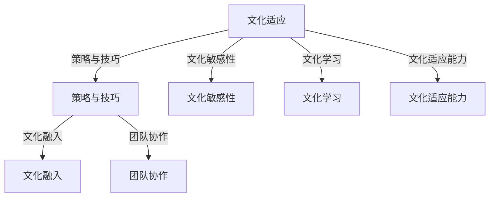

#### 文化敏感性

文化敏感性是文化适应的重要基础，它要求领导者对文化差异有深刻的认识和尊重。

**核心算法原理讲解：**

1. **文化敏感性培养：**    
   - 通过培训和学习提高文化敏感性
   - 理解不同文化背景下的价值观和行为模式

2. **文化敏感性实践：**    
   - 在日常管理中体现文化敏感性
   - 建立多元文化团队的文化认同

**伪代码：**

```python
def cultivate_cultural_sensitivity(training_program, cultural_understanding):
    # 培训提高文化敏感性
    cultural_sensitivity = enhance_sensitivity(training_program)
    
    # 理解不同文化背景
    cultural_knowledge = understand_cultures(cultural_understanding)
    
    # 实践文化敏感性
    cultural_integration = integrate_sensitivity(cultural_sensitivity, cultural_knowledge)
    
    return cultural_integration
```

#### 文化学习

文化学习是文化适应的关键步骤，通过不断学习和积累，领导者可以更好地理解不同文化。

**核心算法原理讲解：**

1. **文化学习路径：**    
   - 确定文化学习的目标和方向
   - 选择合适的学习资源和渠道

2. **文化学习实践：**    
   - 通过实际经验和案例学习文化
   - 反思和总结文化学习经验

**伪代码：**

```python
def learn_culture(learning_goals, resources, practical_experience):
    # 确定学习目标
    cultural_goals = define_goals(learning_goals)
    
    # 选择学习资源
    learning_resources = select_resources(resources)
    
    # 实践文化学习
    cultural_practice = apply_learning(practical_experience, cultural_goals, learning_resources)
    
    return cultural_practice
```

#### 文化适应能力

文化适应能力是领导者应对跨文化挑战的重要能力，它要求领导者能够灵活应对不同文化环境。

**核心算法原理讲解：**

1. **文化适应能力评估：**    
   - 评估领导者的文化适应能力
   - 确定文化适应能力的发展方向

2. **文化适应能力提升：**    
   - 通过培训和实践提升文化适应能力
   - 建立有效的文化适应机制

**伪代码：**

```python
def assess_and_improve_cultural_adaptation_ability(assessment_tools, training_program, practical_experience):
    # 评估文化适应能力
    cultural_ability = assess_ability(assessment_tools)
    
    # 提升文化适应能力
    improvement_program = create_improvement_program(training_program, practical_experience)
    
    # 实施文化适应提升
    cultural_adaptation = implement_improvement(cultural_ability, improvement_program)
    
    return cultural_adaptation
```

#### 国际化人才选拔与培养

国际化人才是跨国团队的核心资源，选拔和培养国际化人才是提升团队文化适应能力的关键。

**核心算法原理讲解：**

1. **国际化人才选拔：**    
   - 确定国际化人才选拔的标准
   - 选择合适的人才选拔方法

2. **国际化人才培养：**    
   - 设计国际化人才培养计划
   - 提供持续的职业发展机会

**伪代码：**

```python
def select_and_ cultivate_international_talent(selection_criteria, selection_methods, cultivation_plan):
    # 确定选拔标准
    talent_criteria = define_selection_criteria(selection_criteria)
    
    # 选择选拔方法
    selection_methods = apply_selection_methods(talent_criteria)
    
    # 培养国际化人才
    talent_cultivation = implement_cultivation_plan(cultivation_plan, selection_methods)
    
    return talent_cultivation
```

#### 国际化人才激励机制

激励机制是激发国际化人才潜力和保持团队活力的重要手段。

**核心算法原理讲解：**

1. **激励机制设计：**    
   - 确定激励机制的目标
   - 选择合适的激励手段

2. **激励机制实施：**    
   - 制定激励计划的执行方案
   - 监测激励效果并调整方案

**伪代码：**

```python
def design_and_implement_incentive_program(incentive_goals, incentive_methods, execution_plan):
    # 确定激励机制目标
    incentive_objectives = define_incentive_goals(incentive_goals)
    
    # 选择激励手段
    incentive_methods = select_incentive_methods(incentive_objectives)
    
    # 实施激励计划
    incentive_execution = implement_execution_plan(incentive_methods, execution_plan)
    
    # 监测激励效果
    incentive_evaluation = monitor_incentive_effects(incentive_execution)
    
    # 调整激励方案
    incentive_adjustment = adjust_program_based_on_evaluation(incentive_evaluation)
    
    return incentive_adjustment
```

通过上述文化适应策略、国际化人才选拔与培养、以及激励机制的设计与实施，领导者可以有效地提升跨国团队的文化适应能力和整体效能。在下一章中，我们将探讨如何进行跨国团队绩效管理。

### 第6章小结

文化适应与国际化人才管理是跨国团队管理中的关键环节。通过有效的文化适应策略、国际化人才选拔与培养，以及激励机制的设计与实施，领导者可以提升团队的文化适应能力和整体效能。在下一章中，我们将深入探讨跨国团队绩效管理的具体方法和策略。

### 第7章：跨国团队绩效管理

#### 第7章：跨国团队绩效管理

### 7.1 跨国团队绩效评估体系

跨国团队绩效评估体系是确保团队高效运作和持续改进的关键。有效的评估体系需要综合考虑团队成员的个人绩效、团队目标和组织战略。

**核心概念与联系：**

**绩效评估体系 → 绩效评估标准**

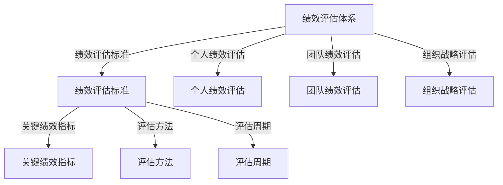

#### 个人绩效评估

个人绩效评估是跨国团队绩效评估体系的基础，它关注团队成员的工作表现和成果。

**核心算法原理讲解：**

1. **关键绩效指标（KPI）设定：**    
   - 分析个人职责和目标
   - 确定关键绩效指标

2. **评估方法选择：**    
   - 选择合适的评估方法，如360度评估、绩效对话等

3. **评估周期设定：**    
   - 制定定期评估的周期，如季度或年度评估

**伪代码：**

```python
def set_personal_performance_evaluation(kpi, evaluation_methods, evaluation_cycle):
    # 设定关键绩效指标
    kpi = define_kpi(kpi)
    
    # 选择评估方法
    evaluation_methods = select_evaluation_methods(evaluation_methods)
    
    # 设定评估周期
    evaluation_cycle = define_evaluation_cycle(evaluation_cycle)
    
    # 实施个人绩效评估
    performance_evaluation = implement_evaluation(kpi, evaluation_methods, evaluation_cycle)
    
    return performance_evaluation
```

#### 团队绩效评估

团队绩效评估关注团队的整体表现和协作效果，它是评估团队成功与否的重要指标。

**核心算法原理讲解：**

1. **关键绩效指标（KPI）设定：**    
   - 分析团队目标和职责
   - 确定关键绩效指标

2. **评估方法选择：**    
   - 选择合适的评估方法，如团队讨论、问卷调查等

3. **评估周期设定：**    
   - 制定定期评估的周期，如季度或年度评估

**伪代码：**

```python
def set_team_performance_evaluation(kpi, evaluation_methods, evaluation_cycle):
    # 设定关键绩效指标
    kpi = define_kpi(kpi)
    
    # 选择评估方法
    evaluation_methods = select_evaluation_methods(evaluation_methods)
    
    # 设定评估周期
    evaluation_cycle = define_evaluation_cycle(evaluation_cycle)
    
    # 实施团队绩效评估
    performance_evaluation = implement_evaluation(kpi, evaluation_methods, evaluation_cycle)
    
    return performance_evaluation
```

#### 组织战略评估

组织战略评估是确保团队绩效与组织战略目标一致的重要环节。

**核心算法原理讲解：**

1. **战略目标匹配：**    
   - 分析团队绩效与组织战略目标的关系

2. **评估方法选择：**    
   - 选择合适的评估方法，如平衡计分卡、战略地图等

3. **评估周期设定：**    
   - 制定定期评估的周期，如年度评估

**伪代码：**

```python
def set_organization_strategy_evaluation(strategy_goals, evaluation_methods, evaluation_cycle):
    # 分析战略目标匹配
    strategy_matching = analyze_strategy_goals(strategy_goals)
    
    # 选择评估方法
    evaluation_methods = select_evaluation_methods(evaluation_methods)
    
    # 设定评估周期
    evaluation_cycle = define_evaluation_cycle(evaluation_cycle)
    
    # 实施组织战略评估
    strategy_evaluation = implement_evaluation(strategy_matching, evaluation_methods, evaluation_cycle)
    
    return strategy_evaluation
```

#### 绩效评估体系实施

绩效评估体系的实施需要确保评估标准的公正性、透明性和有效性。

**核心算法原理讲解：**

1. **评估标准制定：**    
   - 制定明确的评估标准

2. **评估过程管理：**    
   - 管理评估过程，确保评估的公正性和透明性

3. **评估结果应用：**    
   - 将评估结果应用于绩效改进和奖励机制

**伪代码：**

```python
def implement_performance_evaluation_system(evaluation_standards, process_management, evaluation_results):
    # 制定评估标准
    standards = define_evaluation_standards(evaluation_standards)
    
    # 管理评估过程
    process_management = manage_evaluation_process(process_management, standards)
    
    # 应用评估结果
    evaluation_application = apply_evaluation_results(evaluation_results)
    
    return evaluation_application
```

通过建立和实施跨国团队绩效评估体系，领导者可以确保团队成员和团队整体的工作表现与组织战略目标保持一致，从而实现组织的长期成功。在下一章中，我们将探讨如何通过有效的激励机制来提升跨国团队的绩效。

### 第7章小结

跨国团队绩效评估体系是确保团队高效运作和持续改进的重要手段。通过设定关键绩效指标、选择合适的评估方法和周期，以及确保评估的公正性和透明性，领导者可以有效地管理团队绩效。在下一章中，我们将探讨如何通过激励机制来提升跨国团队的绩效。

### 第8章：全球化领导实践案例分析

#### 第8章：全球化领导实践案例分析

### 8.1 案例分析一：跨国公司的成功经验

在本节中，我们将探讨一家跨国公司在全球化领导实践中的成功经验，分析其在全球化战略、跨文化管理和团队绩效提升方面的做法。

#### 案例背景

**公司名称：**ABC科技公司

**业务领域：**高科技产品研发与销售

**全球化战略：**ABC科技公司致力于在全球范围内拓展业务，通过建立海外研发中心和销售网络，提高市场覆盖率和竞争力。

#### 全球化战略

1. **全球研发网络建设：**
   - **战略定位：**ABC科技公司将创新作为核心竞争力，通过在全球建立研发中心，吸引顶尖人才，提升研发能力。
   - **实施措施：**
     - 在北美、欧洲和亚洲等地区设立研发中心。
     - 与当地高校和研究机构建立合作关系，共同开展科研项目。
     - 实施全球人才招聘计划，吸引国际化人才。

2. **全球市场拓展：**
   - **战略定位：**ABC科技公司通过精准的市场定位和差异化营销策略，在全球市场中占据一席之地。
   - **实施措施：**
     - 分析全球市场趋势，确定重点市场。
     - 根据不同市场的特点，调整产品和服务策略。
     - 建立全球销售网络，提高市场响应速度。

#### 跨文化管理

1. **文化适应策略：**
   - **战略定位：**ABC科技公司认识到文化差异对业务发展的重要性，制定了文化适应策略。
   - **实施措施：**
     - 提供跨文化培训，提高员工的文化敏感性。
     - 建立跨文化团队，促进不同文化之间的沟通与协作。
     - 设立文化大使，负责跨文化沟通与协调。

2. **文化融合：**
   - **战略定位：**ABC科技公司致力于实现文化融合，以增强团队的凝聚力和创新能力。
   - **实施措施：**
     - 定期举办跨文化活动，增进员工之间的了解和友谊。
     - 建立多元文化团队，鼓励不同文化背景的员工分享经验和观点。
     - 确保管理层的多元文化代表性，提高文化融合的效率。

#### 团队绩效提升

1. **绩效管理体系：**
   - **战略定位：**ABC科技公司通过建立科学的绩效管理体系，激励员工提升绩效。
   - **实施措施：**
     - 设定明确的绩效目标和考核标准。
     - 采用多样化的绩效评估方法，如360度评估、绩效对话等。
     - 实施绩效激励措施，如奖金、晋升等。

2. **激励机制：**
   - **战略定位：**ABC科技公司认识到激励机制在团队绩效提升中的重要作用。
   - **实施措施：**
     - 设立创新奖励机制，鼓励员工提出创新方案。
     - 提供职业发展机会，帮助员工实现个人职业目标。
     - 建立公平的奖励制度，确保员工感受到公平和尊重。

#### 案例启示

通过ABC科技公司的成功经验，我们可以得出以下启示：

1. **全球化战略的重要性：**明确的全球化战略可以帮助企业在国际市场中占据优势。
2. **跨文化管理的必要性：**有效的跨文化管理可以促进团队的沟通与协作，提高整体效能。
3. **团队绩效的提升策略：**建立科学的绩效管理体系和激励机制，可以激发员工的潜能，提升团队绩效。

在下一节中，我们将探讨跨国团队管理的失败教训，分析其原因，以及如何避免类似的错误。

### 8.2 案例分析二：跨国团队的失败教训

在本节中，我们将通过分析一家跨国团队的失败案例，探讨导致失败的主要原因，以及从中汲取的经验教训。

#### 案例背景

**公司名称：**XYZ科技公司

**业务领域：**软件开发与系统集成

**全球化战略：**XYZ科技公司试图通过快速全球化来扩展市场份额，但由于管理不善，导致跨国团队表现不佳，最终项目失败。

#### 失败原因分析

1. **战略规划不足：**
   - **问题表现：**XYZ科技公司在全球化过程中缺乏明确的战略规划，导致资源分配不合理，战略目标不明确。
   - **解决方法：**制定详细的全球化战略规划，明确市场目标、资源需求和实施步骤。

2. **跨文化管理缺失：**
   - **问题表现：**XYZ科技公司没有重视跨文化管理，导致团队成员之间的沟通不畅，文化冲突频发。
   - **解决方法：**加强跨文化培训，提高员工的文化敏感性，建立有效的跨文化沟通机制。

3. **团队协作问题：**
   - **问题表现：**XYZ科技公司跨国团队的协作不畅，团队成员之间缺乏信任和合作精神。
   - **解决方法：**建立高效的团队协作机制，促进团队成员之间的沟通与协作，提高团队凝聚力。

4. **绩效管理不善：**
   - **问题表现：**XYZ科技公司绩效管理体系不完善，缺乏有效的激励机制，导致员工积极性不高。
   - **解决方法：**建立科学的绩效管理体系，实施多样化的激励措施，激发员工的潜能。

#### 经验教训

通过XYZ科技公司的失败案例，我们可以得出以下经验教训：

1. **战略规划的重要性：**明确的全球化战略规划和细致的实施步骤是跨国团队成功的关键。
2. **跨文化管理的必要性：**有效的跨文化管理可以促进团队的沟通与协作，提高整体效能。
3. **团队协作的有效性：**建立高效的团队协作机制，提高团队成员之间的信任和合作精神。
4. **绩效管理的完善性：**科学的绩效管理体系和激励机制是提升团队绩效的重要保障。

在下一节中，我们将探讨全球化领导的新趋势，分析未来全球化领导的发展方向。

### 8.3 案例分析三：全球化领导的新趋势

在全球化的背景下，全球化领导面临着新的挑战和机遇。在本节中，我们将探讨全球化领导的新趋势，分析其发展趋势和影响因素。

#### 新趋势一：数字领导

随着数字化技术的快速发展，数字领导成为全球化领导的新趋势。数字领导强调利用数字技术和数据驱动决策，提高组织的灵活性和响应速度。

**核心概念与联系：**

**数字领导 → 数据驱动决策**

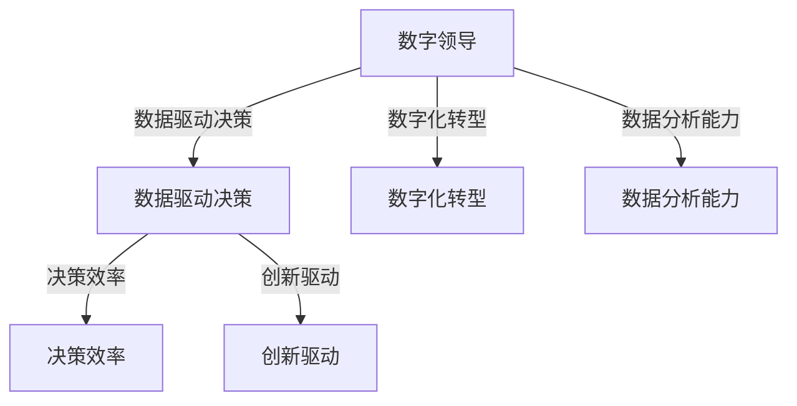

**实施措施：**

1. **数字化转型：**建立数字化基础设施，提高业务流程的数字化水平。
2. **数据分析能力：**培养数据分析人才，利用大数据分析提升决策的准确性和效率。

#### 新趋势二：远程领导

远程工作的普及使得远程领导成为全球化领导的新趋势。远程领导要求领导者具备更强的沟通能力和团队管理技巧，以保持团队的凝聚力和工作效率。

**核心概念与联系：**

**远程领导 → 团队凝聚力**

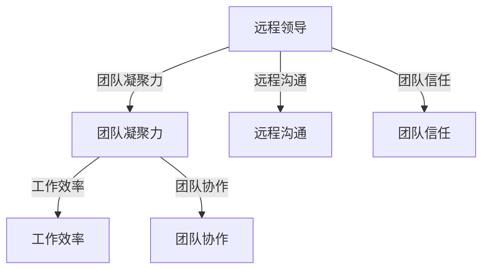

**实施措施：**

1. **远程沟通：**利用视频会议、即时通讯等工具，提高远程沟通的效率和效果。
2. **团队信任：**建立明确的团队目标和共同价值观，增强团队成员之间的信任。

#### 新趋势三：可持续领导

可持续领导关注企业的长期发展和社会责任，强调在全球化过程中注重环境保护、社会公正和经济效益的平衡。

**核心概念与联系：**

**可持续领导 → 可持续发展**

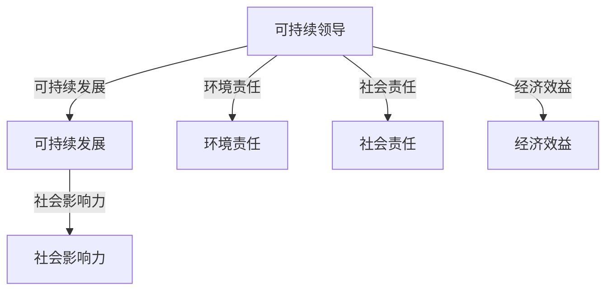

**实施措施：**

1. **环境责任：**实施绿色生产和环保措施，减少碳排放和资源消耗。
2. **社会责任：**参与社会公益项目，关注员工福利和社会问题。

#### 新趋势四：敏捷领导

敏捷领导强调快速响应市场变化，提高组织的灵活性和创新能力。敏捷领导要求领导者具备敏捷思维和敏捷管理能力，以适应快速变化的环境。

**核心概念与联系：**

**敏捷领导 → 敏捷管理**

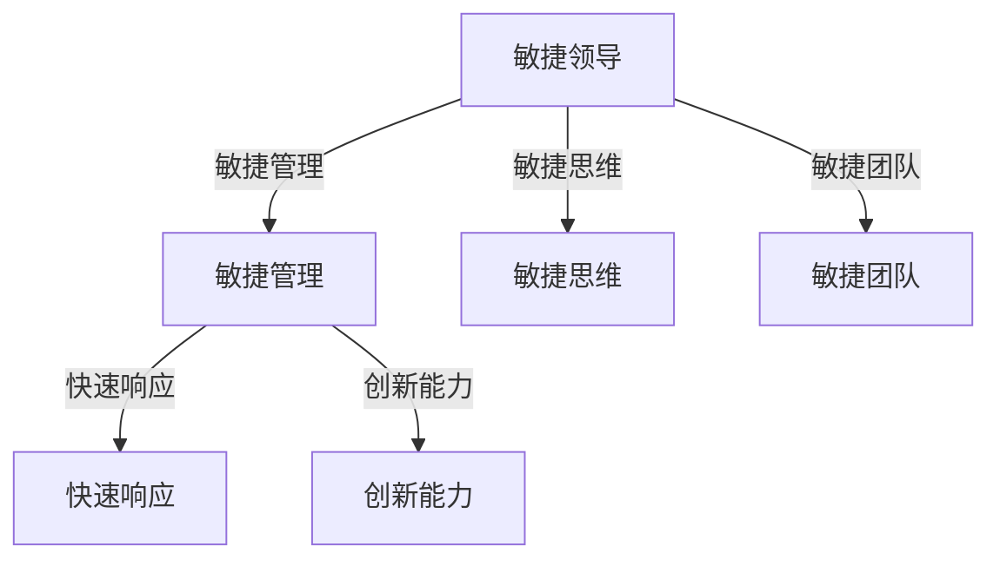

**实施措施：**

1. **敏捷思维：**培养员工的敏捷思维，鼓励创新和快速迭代。
2. **敏捷团队：**建立敏捷团队，采用敏捷开发方法和工具。

#### 结论

全球化领导的新趋势包括数字领导、远程领导、可持续领导和敏捷领导。这些趋势要求领导者具备新的领导能力和管理技巧，以应对全球化的挑战和机遇。通过有效的战略规划、跨文化管理和团队建设，领导者可以引领跨国团队在全球化背景下取得成功。

### 第8章小结

通过分析跨国公司的成功经验和失败教训，以及全球化领导的新趋势，我们可以得出以下结论：全球化领导需要领导者具备全球视野、跨文化意识和创新思维。成功的全球化领导可以提升团队效能，促进组织发展。在下一章中，我们将探讨如何提升个人领导力，以应对全球化领导的新挑战。

### 第9章：自我领导力提升

#### 第9章：自我领导力提升

### 9.1 自我认知与领导力发展

自我认知是提升领导力的第一步，领导者需要了解自己的优势和不足，明确个人发展目标。

**核心概念与联系：**

**自我认知 → 领导力发展**

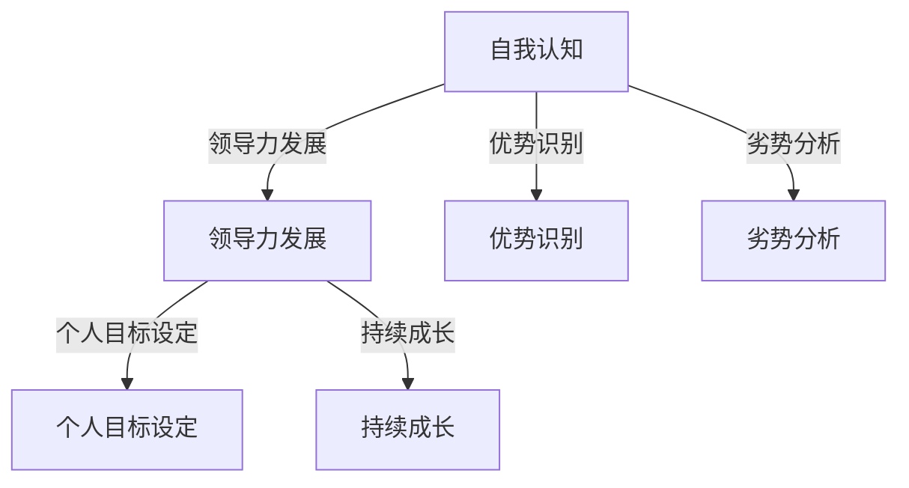

#### 优势识别

领导者需要识别自己的优势，以充分发挥个人潜力。

**核心算法原理讲解：**

1. **自我评估：**通过自我反思和他人反馈，识别个人优势。
2. **技能评估：**利用职业测评工具，如MBTI、DISC等，分析个人特质和优势。

**伪代码：**

```python
def identify_strengths(self_evaluation, skill_assessment):
    # 自我反思
    self_reflection = reflect_on_self()
    
    # 他人反馈
    feedback = collect_feedback()
    
    # 技能评估
    skills_assessment = perform_skill_assessment()
    
    # 综合分析
    strengths = analyze_strengths(self_reflection, feedback, skills_assessment)
    
    return strengths
```

#### 劣势分析

领导者需要正视自己的劣势，通过改进和提升来克服弱点。

**核心算法原理讲解：**

1. **劣势识别：**通过自我反思和他人反馈，识别个人劣势。
2. **改进计划：**制定针对劣势的改进计划和行动步骤。

**伪代码：**

```python
def identify_and_improve_weaknesses(self_evaluation, feedback, improvement_plan):
    # 自我反思
    self_reflection = reflect_on_self()
    
    # 他人反馈
    feedback = collect_feedback()
    
    # 识别劣势
    weaknesses = analyze_weaknesses(self_reflection, feedback)
    
    # 制定改进计划
    improvement_plan = create_improvement_plan(weaknesses)
    
    # 实施改进计划
    implement_improvement_plan(improvement_plan)
    
    return improvement_plan
```

#### 个人目标设定

设定清晰的个人目标是领导力发展的重要步骤。

**核心算法原理讲解：**

1. **目标设定：**确定短期和长期的个人发展目标。
2. **目标分解：**将大目标分解为具体的行动步骤。

**伪代码：**

```python
def set_personal_goals(short_term_goals, long_term_goals, goal_decomposition):
    # 确定短期目标
    short_term_goals = define_short_term_goals()
    
    # 确定长期目标
    long_term_goals = define_long_term_goals()
    
    # 目标分解
    goal_decomposition = decompose_goals(short_term_goals, long_term_goals)
    
    return goal_decomposition
```

#### 持续成长

领导力提升是一个持续的过程，需要通过不断学习和实践来提升个人能力。

**核心算法原理讲解：**

1. **学习策略：**制定有效的学习策略，包括阅读、培训、实践等。
2. **经验总结：**通过实践和反思，不断总结经验，提升领导能力。

**伪代码：**

```python
def continuous_growth.learning_strategy(learning_plan, reflection_practice):
    # 制定学习计划
    learning_plan = create_learning_plan()
    
    # 实践与反思
    reflection_practice = practice_and_reflect(learning_plan)
    
    return reflection_practice
```

#### 自我激励与压力管理

自我激励和压力管理是领导力提升的重要组成部分。

**核心算法原理讲解：**

1. **自我激励：**通过设定目标和奖励机制，激发个人动力。
2. **压力管理：**采用有效的压力管理方法，如时间管理、放松技巧等，以保持良好的心态。

**伪代码：**

```python
def self_motivation_and_stress_management(motivation_goals, stress_management_strategies):
    # 设定自我激励目标
    motivation_goals = set_motivation_goals()
    
    # 实施压力管理策略
    stress_management = apply_stress_management_strategies()
    
    return stress_management
```

通过自我认知与领导力发展、个人目标设定、持续成长、自我激励与压力管理等步骤，领导者可以不断提升个人领导力，以应对全球化领导的新挑战。在下一章中，我们将探讨领导力团队建设的方法和策略。

### 第9章小结

自我领导力提升是领导者发展的重要环节。通过自我认知、目标设定、持续成长和压力管理，领导者可以不断提升个人能力，为全球化领导奠定坚实基础。在下一章中，我们将探讨如何通过团队建设来增强领导力。

### 第10章：领导力团队建设

#### 第10章：领导力团队建设

### 10.1 领导力团队建设原则

领导力团队建设是提升团队整体效能和竞争力的重要手段。有效的团队建设需要遵循一定的原则和方法。

**核心概念与联系：**

**领导力团队建设原则 → 团队建设方法**

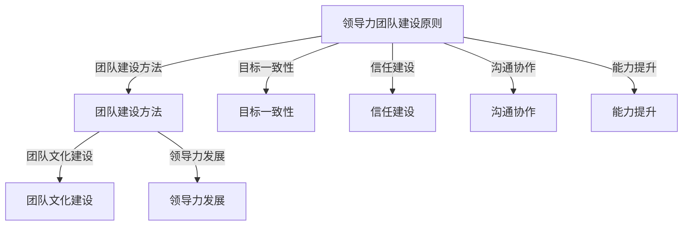

#### 目标一致性

团队目标的一致性是团队建设的基础，它要求团队成员对团队目标有共同的理解和认同。

**核心算法原理讲解：**

1. **目标设定：**明确团队的目标，并确保所有成员都清楚理解。
2. **目标分解：**将大目标分解为具体的行动步骤，确保每个成员都有明确的工作职责。

**伪代码：**

```python
def define_team_goals(goal, goal_decomposition):
    # 设定团队目标
    team_goal = set_goal(goal)
    
    # 目标分解
    goal_decomposition = decompose_goal(team_goal)
    
    return goal_decomposition
```

#### 信任建设

信任建设是团队高效协作的基石，它要求团队成员之间建立互信关系。

**核心算法原理讲解：**

1. **信任培养：**通过共同经历和合作，培养团队成员之间的信任。
2. **沟通机制：**建立有效的沟通机制，确保团队成员之间的信息透明和沟通顺畅。

**伪代码：**

```python
def build_trust_team(cultural_integration, communication_mechanism):
    # 文化整合
    cultural_integration = integrate_cultures()
    
    # 沟通机制
    communication_mechanism = establish_communication()
    
    return communication_mechanism
```

#### 沟通协作

有效的沟通协作是团队高效运作的关键，它要求团队成员之间保持良好的沟通和协作。

**核心算法原理讲解：**

1. **沟通策略：**制定适合团队的沟通策略，确保信息传递的准确性和及时性。
2. **协作技巧：**培养团队成员的协作技巧，提高团队的整体协作效率。

**伪代码：**

```python
def improve_communication_and_collaboration(communication_strategy, collaboration_skills):
    # 沟通策略
    communication_strategy = develop_communication_plan()
    
    # 协作技巧
    collaboration_skills = enhance_collaboration_skills()
    
    return communication_strategy, collaboration_skills
```

#### 能力提升

提升团队整体能力是团队建设的重要目标，它要求团队成员不断学习和成长。

**核心算法原理讲解：**

1. **培训与发展：**提供团队成员所需的培训和职业发展机会。
2. **能力评估：**定期评估团队成员的能力，并根据评估结果制定个性化的提升计划。

**伪代码：**

```python
def enhance_team_capabilities(training_program, capability_evaluation):
    # 培训与发展
    training_program = create_training_plan()
    
    # 能力评估
    capability_evaluation = assess_capabilities()
    
    return training_program, capability_evaluation
```

#### 团队文化建设

团队文化是团队的核心价值观和行为规范，它对团队的凝聚力和效能有重要影响。

**核心算法原理讲解：**

1. **文化塑造：**制定团队文化价值观和行为准则，确保团队成员共同遵守。
2. **文化传承：**通过团队活动和日常管理，传承和弘扬团队文化。

**伪代码：**

```python
def build_team_culture(culture_values, culture_practices):
    # 文化塑造
    culture_values = define_culture_values()
    
    # 文化传承
    culture_practices = promote_culture_practices()
    
    return culture_values, culture_practices
```

#### 领导力发展

领导力发展是团队建设的重要内容，它要求团队成员不断提升领导力。

**核心算法原理讲解：**

1. **领导力培养：**提供领导力培训和辅导，帮助团队成员提升领导能力。
2. **领导力评估：**定期评估团队成员的领导力，并根据评估结果制定发展计划。

**伪代码：**

```python
def develop_leadership_capabilities(leader_training, leadership_evaluation):
    # 领导力培训
    leader_training = provide_leadership_training()
    
    # 领导力评估
    leadership_evaluation = assess_leadership_capabilities()
    
    return leader_training, leadership_evaluation
```

通过遵循领导力团队建设原则，采用有效的团队建设方法，领导者可以提升团队的整体效能和竞争力。在下一章中，我们将探讨全球化领导的新挑战和未来展望。

### 第10章小结

领导力团队建设是提升团队整体效能和竞争力的重要手段。通过目标一致性、信任建设、沟通协作、能力提升、团队文化建设和领导力发展，领导者可以打造一支高效协作的团队。在下一章中，我们将探讨全球化领导的新挑战和未来展望。

### 第11章：全球化领导的新挑战

#### 第11章：全球化领导的新挑战

### 11.1 新型全球化背景下的领导变革

在新型全球化的背景下，领导者的角色和职责发生了显著变化。新型全球化不仅涉及到经济和市场的扩展，还涉及到技术的革新、文化的多样性和可持续发展的要求。

**核心概念与联系：**

**新型全球化 → 领导变革**

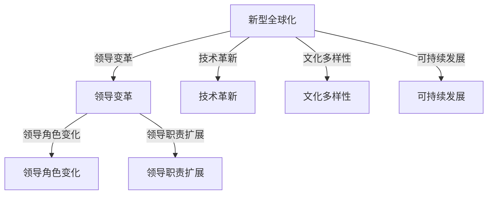

#### 技术革新

技术的快速发展，特别是人工智能、大数据和区块链等新兴技术的应用，对全球化领导提出了新的要求。

**核心算法原理讲解：**

1. **技术理解：**领导者需要具备对新兴技术的理解和应用能力。
2. **技术应用：**将技术应用于团队管理和业务运营，提高效率和创新能力。

**伪代码：**

```python
def adapt_to_technological_innovations(technical_knowledge, application_strategies):
    # 理解新技术
    technical_knowledge = learn_technical_innovations()
    
    # 应用新技术
    application_strategies = implement_technological_solutions()
    
    return application_strategies
```

#### 文化多样性

文化多样性是全球化领导面临的另一个重要挑战。领导者需要理解和尊重不同文化背景下的价值观和行为模式。

**核心算法原理讲解：**

1. **文化敏感性：**培养跨文化意识，提高文化敏感性。
2. **文化整合：**建立文化整合策略，促进不同文化之间的交流与融合。

**伪代码：**

```python
def manage_cultural_diversity(cultural_sensitivity, integration_strategies):
    # 提高文化敏感性
    cultural_sensitivity = enhance_cultural_awareness()
    
    # 制定文化整合策略
    integration_strategies = create_cultural_integration_plan()
    
    return integration_strategies
```

#### 可持续发展

可持续发展是全球化领导必须考虑的长期目标。领导者需要在业务运营中注重环境保护、社会责任和经济效益的平衡。

**核心算法原理讲解：**

1. **可持续发展战略：**制定符合可持续发展目标的战略。
2. **可持续发展实践：**在运营过程中实施可持续发展措施，如节能减排、社会责任项目等。

**伪代码：**

```python
def pursue_sustainable_development(sustainable_strategies, sustainable_practices):
    # 制定可持续发展战略
    sustainable_strategies = define_sustainable_goals()
    
    # 实施可持续发展措施
    sustainable_practices = implement_sustainable_practices(sustainable_strategies)
    
    return sustainable_practices
```

#### 领导角色变化

在新型全球化背景下，领导者的角色从传统的管理者转变为协调者、创新者和变革推动者。

**核心算法原理讲解：**

1. **角色转变：**领导者需要适应新的角色要求，提升跨职能协调能力和创新思维。
2. **领导力提升：**通过不断学习和实践，提升领导力，以应对新的挑战。

**伪代码：**

```python
def evolve_leadership_role(adaptive_leadership, innovation_mindset):
    # 角色转变
    adaptive_leadership = develop_adaptive_leadership()
    
    # 创新思维
    innovation_mindset = cultivate_innovation_mindset()
    
    return adaptive_leadership, innovation_mindset
```

#### 领导职责扩展

全球化领导需要承担更多的责任，包括国际市场拓展、跨文化管理和团队绩效提升等。

**核心算法原理讲解：**

1. **职责拓展：**明确全球化领导的职责范围，确保职责与角色的匹配。
2. **职责管理：**采用有效的管理策略，确保领导职责的有效履行。

**伪代码：**

```python
def expand_leadership_duties(duties_definition, management_strategies):
    # 明确职责
    duties_definition = define_leadership_duties()
    
    # 管理策略
    management_strategies = implement_management_strategies(duties_definition)
    
    return management_strategies
```

通过理解新型全球化的背景和挑战，领导者可以采取相应的变革措施，提升自身领导力，以应对全球化领导的新挑战。在下一章中，我们将探讨全球化领导力的新趋势和未来发展。

### 第11章小结

新型全球化背景下，全球化领导面临技术革新、文化多样性、可持续发展等新挑战。领导者需要适应新的领导角色和职责，提升跨文化意识和创新能力，同时注重可持续发展的战略和实践。在下一章中，我们将总结全球化领导力的重要性、发展现状和未来趋势。

### 第12章：全球化领导力总结

#### 第12章：全球化领导力总结

### 12.1 全球化领导力的重要性回顾

全球化领导力是21世纪领导者必须具备的核心能力。在全球化的背景下，领导者需要具备跨文化意识、战略思维、创新能力等多方面的素质，以应对全球化带来的挑战和机遇。

**核心概念与联系：**

**全球化领导力 → 跨文化意识**

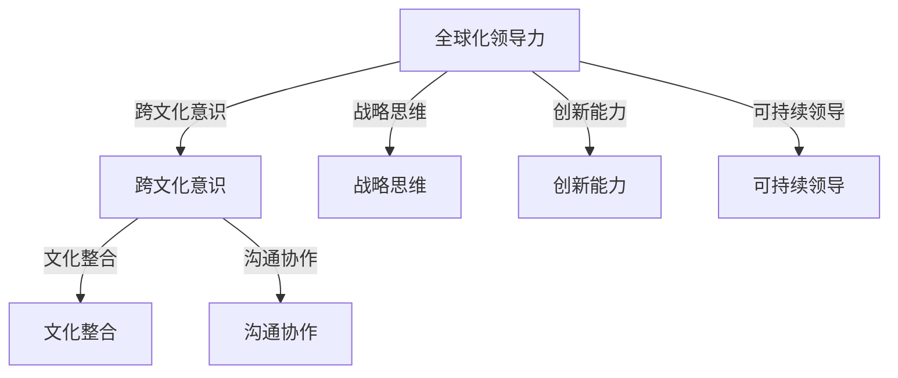

#### 跨文化意识

跨文化意识是全球化领导力的基础，它要求领导者理解和尊重不同文化背景下的价值观和行为模式。

**核心算法原理讲解：**

1. **文化敏感性：**培养跨文化敏感性，提高对不同文化的理解和适应能力。
2. **文化整合：**建立有效的文化整合策略，促进不同文化之间的交流与融合。

**伪代码：**

```python
def develop_cultural_awareness(sensitivity_training, integration_strategies):
    # 文化敏感性培训
    sensitivity_training = provide_cultural_training()
    
    # 文化整合策略
    integration_strategies = create_integration_plan()
    
    return integration_strategies
```

#### 战略思维

战略思维是全球化领导力的重要组成部分，它要求领导者具备全局视野和前瞻性思维。

**核心算法原理讲解：**

1. **战略规划：**制定有效的全球化战略规划，明确目标和路径。
2. **战略执行：**确保战略的顺利执行，实现全球化目标。

**伪代码：**

```python
def strategic_thinking(strategic_planning, strategic_execution):
    # 战略规划
    strategic_planning = define_global_strategy()
    
    # 战略执行
    strategic_execution = implement_strategic_actions(strategic_planning)
    
    return strategic_execution
```

#### 创新能力

创新能力是全球化领导力的关键，它要求领导者具备推动创新、应对市场变化的能力。

**核心算法原理讲解：**

1. **创新驱动：**建立创新机制，鼓励团队成员提出创新方案。
2. **创新实践：**将创新方案应用于实际工作中，提高组织竞争力。

**伪代码：**

```python
def cultivate_innovation(drive_innovation, innovation_practice):
    # 创新驱动
    drive_innovation = establish_innovation_mechanism()
    
    # 创新实践
    innovation_practice = apply_innovation_solutions()
    
    return innovation_practice
```

#### 可持续领导

可持续领导关注企业的长期发展和社会责任，它要求领导者具备可持续发展战略和实践能力。

**核心算法原理讲解：**

1. **可持续发展战略：**制定符合可持续发展目标的战略。
2. **可持续发展实践：**在运营过程中实施可持续发展措施，如节能减排、社会责任项目等。

**伪代码：**

```python
def sustainable_leadership(sustainable_strategies, sustainable_practices):
    # 可持续发展战略
    sustainable_strategies = define_sustainable_goals()
    
    # 可持续发展实践
    sustainable_practices = implement_sustainable_actions(sustainable_strategies)
    
    return sustainable_practices
```

#### 全球化领导力的发展现状

全球化领导力在过去几十年中得到了迅速发展。随着全球化的深入，越来越多的领导者意识到跨文化意识和战略思维的重要性，创新能力也成为领导力的核心要素。可持续发展成为全球化领导力的重要组成部分，越来越多的企业开始关注社会责任和环境保护。

**核心算法原理讲解：**

1. **领导力培养：**通过培训和实践，提升领导者的全球化领导力。
2. **领导力评估：**定期评估领导者的全球化领导力，并根据评估结果制定发展计划。

**伪代码：**

```python
def develop_global_leadership(leadership_training, leadership_evaluation):
    # 领导力培训
    leadership_training = provide_leadership_programs()
    
    # 领导力评估
    leadership_evaluation = assess_leadership_capabilities()
    
    return leadership_evaluation
```

#### 全球化领导力的未来趋势

未来全球化领导力的发展趋势将更加注重技术创新、文化多样性和可持续发展。随着人工智能、大数据等新兴技术的应用，领导者的技术理解和应用能力将成为关键。文化多样性的管理将成为全球化领导的重要课题，领导者需要具备更强的文化敏感性和整合能力。可持续发展将成为全球化领导的核心价值观，领导者需要在战略规划和实践中融入可持续发展理念。

**核心算法原理讲解：**

1. **技术适应：**领导者需要不断更新自己的技术知识，适应新技术的发展。
2. **文化整合：**领导者需要加强跨文化管理，促进文化之间的交流与融合。
3. **可持续发展：**领导者需要制定可持续发展战略，并在运营中实施具体措施。

**伪代码：**

```python
def future_global_leadership(technical_adaptation, cultural_integration, sustainable_development):
    # 技术适应
    technical_adaptation = update_technical_knowledge()
    
    # 文化整合
    cultural_integration = enhance_cultural_awareness()
    
    # 可持续发展
    sustainable_development = implement_sustainable_actions()
    
    return technical_adaptation, cultural_integration, sustainable_development
```

#### 全球化领导力的实践启示

通过全球化领导力的研究和实践，我们可以得出以下启示：

1. **跨文化意识：**领导者需要具备跨文化意识，尊重和理解不同文化的差异。
2. **战略思维：**领导者需要具备战略思维，制定和执行有效的全球化战略。
3. **创新能力：**领导者需要具备创新能力，推动组织不断创新和进步。
4. **可持续发展：**领导者需要关注可持续发展，将可持续发展理念融入战略规划和实践中。

通过上述实践启示，领导者可以在全球化背景下提升自身领导力，引领组织实现长期发展。

### 第12章小结

全球化领导力是21世纪领导者必须具备的核心能力。通过回顾全球化领导力的重要性、发展现状和未来趋势，我们可以得出以下结论：全球化领导力要求领导者具备跨文化意识、战略思维、创新能力等多方面的素质，以应对全球化带来的挑战和机遇。在未来的全球化竞争中，领导者需要不断提升自身领导力，以引领组织实现长期成功。通过本文的探讨，我们希望能够为读者提供有价值的思考和实践启示。

