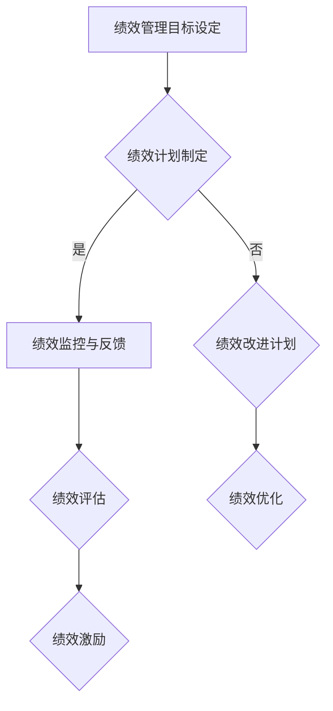

                 

### 文章标题

《全面绩效管理：提升团队整体效能的系统方法》

> 关键词：绩效管理、团队效能、KPI、BSC、OKR、数字化绩效管理

> 摘要：本文将深入探讨绩效管理的核心概念、工具与方法，以及其在不同行业的实际应用。通过系统的方法和实例分析，揭示绩效管理如何提升团队整体效能，助力组织成功。

### 第一部分：绩效管理的基础理论

#### 第1章：绩效管理的核心概念

**1.1 绩效管理的基本理念**

绩效管理与效能管理是两个密切相关的概念。绩效通常指个人或团队在一定时间内完成工作的质量和效率，而效能则更侧重于工作过程中的资源利用效率和目标达成的效果。在绩效管理中，绩效和效能的定义与区别至关重要。

- **绩效**：指个人或团队在完成工作任务时所达到的具体结果。绩效的好坏可以通过量化指标来评估，如销售额、生产数量、项目进度等。
- **效能**：指个人或团队在完成工作任务时，所表现出的效率和效果。效能不仅关注结果的达成，还关注过程中的资源利用效率，如时间、人力、财力等。

**绩效管理的目标与意义**

绩效管理的目标在于提升个人和团队的绩效水平，进而提升组织的整体效能。具体目标包括：

- **明确目标**：通过绩效管理，确保个人和团队明确自己的工作目标，并与组织的战略目标保持一致。
- **激励员工**：通过合理的绩效评估和激励机制，激发员工的积极性和创造力。
- **持续改进**：通过绩效反馈和改进措施，帮助员工不断提升工作能力和绩效水平。
- **优化资源配置**：通过绩效管理，优化组织的资源分配，提高资源利用效率。

绩效管理的意义在于：

- **提升团队整体效能**：通过有效的绩效管理，团队可以更加专注于关键任务，提高工作效率和质量，从而实现整体效能的提升。
- **促进组织发展**：绩效管理有助于组织明确目标，制定合理的发展战略，提高市场竞争力。
- **培养人才**：绩效管理为组织提供了培养和选拔人才的机会，有助于发现和培养优秀的人才。

**1.2 绩效管理体系架构**

绩效管理体系主要包括组织层面和个人层面的架构。

**组织层面的绩效管理架构**

在组织层面，绩效管理体系通常包括以下几个关键组成部分：

- **战略规划**：明确组织的战略目标和发展方向，为绩效管理提供指导。
- **绩效政策**：制定绩效管理的总体原则和规范，确保绩效管理的公平性和透明性。
- **绩效评估流程**：设计合理的绩效评估标准和流程，确保绩效评估的客观性和准确性。
- **绩效反馈与改进**：建立绩效反馈机制，及时给予员工绩效评估结果和改进建议。
- **激励与奖惩**：制定激励政策，对绩效优秀的员工给予奖励，对绩效不佳的员工采取适当的惩戒措施。

**个人层面的绩效管理架构**

在个人层面，绩效管理体系通常包括以下几个关键组成部分：

- **个人目标设定**：根据组织的战略目标和部门目标，设定个人工作目标。
- **工作计划与执行**：制定工作计划，确保个人目标的实现。
- **绩效评估与反馈**：定期进行绩效评估，给予员工反馈，帮助其发现优势和不足。
- **能力提升与培训**：根据绩效评估结果，为员工提供培训和发展机会，提升其工作能力。
- **激励与奖惩**：根据绩效评估结果，对员工进行激励或惩戒，激发其工作积极性。

**1.3 绩效评估方法**

绩效评估是绩效管理的重要组成部分，其目的是对员工的工作表现进行客观、公正的评价，为激励、晋升和培训提供依据。

- **KPI（关键绩效指标）的设计与运用**

KPI是绩效评估的重要工具，它通过量化指标来衡量员工的工作绩效。设计KPI时，需要注意以下几点：

  - **明确目标**：确保KPI与组织的战略目标和部门目标保持一致，明确指标的目标值。
  - **可衡量性**：确保KPI可以量化，便于评估和比较。
  - **相关性**：确保KPI与工作内容和岗位要求相关，能够准确反映员工的工作表现。
  - **适度性**：确保KPI的数量适中，避免过多或过少，影响评估的准确性和效率。

- **360度评估的实施与效果**

360度评估是一种全面、多角度的绩效评估方法，它通过收集来自上级、同事、下属和客户的反馈，对员工的工作表现进行全面评估。360度评估的实施效果包括：

  - **客观公正**：通过多角度的反馈，提高绩效评估的客观性和公正性。
  - **促进沟通**：促进员工与上级、同事、下属和客户之间的沟通，提高团队合作效果。
  - **发现潜在问题**：通过多角度的反馈，发现员工工作中的潜在问题，为改进提供依据。
  - **激励与成长**：通过全面的评估，激励员工提升工作表现，促进其个人和职业发展。

**1.4 绩效管理的实施流程**

绩效管理的实施流程包括以下几个关键步骤：

- **绩效计划与目标设定**

  - **组织战略目标分解**：将组织的战略目标分解为部门目标和个人目标。
  - **个人目标设定**：根据部门目标和个人职责，设定具体的个人目标。
  - **目标共识**：与员工沟通并达成共识，确保员工明确自己的工作目标和职责。

- **绩效监控与反馈**

  - **日常工作监控**：通过日常的工作记录和检查，了解员工的工作进展和表现。
  - **定期反馈**：定期进行绩效反馈，及时了解员工的优点和不足，提供改进建议。

- **绩效评估与改进**

  - **绩效评估**：根据设定的目标和评估标准，对员工的工作表现进行评估。
  - **反馈与改进**：根据绩效评估结果，给予员工反馈，并提供改进措施和培训机会。

- **激励与奖惩**

  - **激励措施**：根据绩效评估结果，对表现优秀的员工给予奖励和激励。
  - **惩戒措施**：对绩效不佳的员工采取适当的惩戒措施，如警告、培训或调整工作岗位。

#### 第二部分：绩效管理的工具与方法

##### 第2章：全面绩效管理工具

**2.1 平衡计分卡（BSC）**

平衡计分卡（Balanced Score Card，简称BSC）是一种战略绩效管理工具，它通过四个维度来衡量组织的绩效：财务、客户、内部业务流程和学习与成长。BSC的应用案例包括：

- **财务维度**：衡量组织的财务绩效，如收入、利润、市场份额等。
- **客户维度**：衡量组织的客户满意度、客户保留率、客户获取成本等。
- **内部业务流程维度**：衡量组织的业务流程效率，如生产周期、产品交付时间等。
- **学习与成长维度**：衡量组织的学习与成长能力，如员工培训、创新能力等。

**2.2 目标管理与OKR**

目标管理（Management by Objectives，简称MBO）是一种通过设定目标来引导员工工作、实现组织目标的管理方法。OKR（Objectives and Key Results）是目标管理的一种具体实践，它通过设定明确的目标和关键结果来推动组织的进步。

- **OKR的概念与特点**

  - **目标（Objectives）**：明确表达组织或团队希望达成的目标，通常具有挑战性但可实现。
  - **关键结果（Key Results）**：量化目标，明确衡量目标达成的具体指标。

  OKR的特点包括：

  - **明确性**：通过明确的目标和关键结果，确保团队成员对目标有清晰的认识。
  - **挑战性**：设定具有挑战性的目标，激发团队成员的积极性和创造力。
  - **透明性**：通过公开目标和关键结果，提高团队的协作效率和透明度。
  - **定期更新**：定期回顾和更新OKR，确保目标与组织战略保持一致。

- **OKR的设定与执行**

  - **设定OKR**：在设定OKR时，需要考虑组织的战略目标、团队职责和员工的个人目标，确保OKR具有明确性、挑战性和相关性。
  - **执行OKR**：在执行OKR的过程中，需要定期检查关键结果的进展，及时调整目标和关键结果，确保目标的达成。

**2.3 绩效反馈与辅导**

有效的绩效反馈和辅导是绩效管理的重要组成部分，它有助于员工提升工作表现，实现个人和组织的共同发展。

- **有效的绩效反馈**

  - **及时性**：及时给予员工绩效反馈，帮助其及时发现问题并改进。
  - **具体性**：具体、明确地描述员工的优点和不足，避免模糊、抽象的评价。
  - **建设性**：给予员工具体的改进建议，帮助其提升工作能力。
  - **双向沟通**：鼓励员工参与反馈过程，表达自己的意见和想法，增强反馈的有效性。

- **绩效辅导的方法与技巧**

  - **指导性辅导**：通过提供具体的指导和建议，帮助员工解决工作中遇到的问题。
  - **支持性辅导**：提供情感支持和鼓励，帮助员工克服困难和挫折。
  - **互动性辅导**：通过与员工的互动和讨论，激发员工的思考和创新。
  - **个性化辅导**：根据员工的不同特点和需求，提供个性化的辅导方案。

#### 第三部分：绩效提升策略

##### 第3章：绩效提升策略

**3.1 团队效能优化**

团队效能优化是提升团队整体绩效的关键。以下是一些团队效能优化的策略：

- **团队建设策略**：

  - **共同目标**：确保团队成员明确共同的目标和愿景，增强团队的凝聚力。
  - **分工合作**：合理分配任务，确保每个成员都能充分发挥自己的优势。
  - **沟通协作**：建立有效的沟通机制，促进团队成员之间的信息共享和协作。
  - **信任与尊重**：营造积极、开放、尊重的团队氛围，增强团队成员之间的信任和合作。

- **团队沟通与协作**

  - **定期会议**：定期召开团队会议，讨论工作进展、问题和解决方案。
  - **在线协作工具**：利用在线协作工具，如项目管理系统、即时通讯工具等，提高团队协作效率。
  - **团队培训**：定期组织团队培训，提升团队成员的技能和协作能力。
  - **反馈与改进**：鼓励团队成员及时反馈工作中的问题和建议，不断优化团队协作流程。

**3.2 绩效改进计划**

绩效改进计划是提升团队整体绩效的重要手段。以下是一些绩效改进的方法：

- **绩效改进的方法论**：

  - **问题分析**：分析团队绩效不佳的原因，找出主要问题。
  - **目标设定**：根据问题分析，设定具体的改进目标和计划。
  - **实施与监控**：制定详细的改进计划，确保计划的实施和监控。
  - **效果评估**：评估改进计划的效果，根据评估结果调整改进策略。

- **绩效改进的实施步骤**：

  - **评估当前绩效**：通过绩效评估，了解团队当前的绩效水平和存在的问题。
  - **确定改进目标**：根据问题分析和团队需求，设定具体的改进目标。
  - **制定改进计划**：制定详细的改进计划，包括具体措施、责任人和时间节点。
  - **实施改进计划**：按照改进计划实施，确保各项措施的有效执行。
  - **监控与评估**：定期监控改进计划的执行情况，及时调整和优化改进策略。
  - **持续改进**：根据评估结果，不断优化改进计划，确保绩效持续提升。

**3.3 激励机制设计**

激励机制是提升团队整体绩效的重要手段。以下是一些激励机制的设计策略：

- **激励理论的应用**：

  - **需求层次理论**：根据员工的不同需求，设计相应的激励措施，如物质激励、精神激励等。
  - **期望理论**：通过设定明确的绩效目标和奖励，激发员工的期望和动力。
  - **公平理论**：确保激励机制的公平性，避免员工产生不公平感。

- **激励机制的设计与调整**：

  - **物质激励**：根据员工的绩效表现，提供奖金、提成等物质奖励，满足员工的物质需求。
  - **精神激励**：通过表彰、晋升、培训等精神奖励，满足员工的精神需求，提高工作满意度。
  - **竞争激励**：通过设立竞争机制，激发员工的竞争意识和进取心。
  - **参与激励**：鼓励员工参与决策和管理，提高员工的参与感和责任感。
  - **调整与优化**：根据实际情况和员工反馈，及时调整和优化激励机制，确保其持续有效。

#### 第四部分：绩效管理的实际应用

##### 第4章：不同行业绩效管理案例分析

**4.1 互联网行业绩效管理案例**

互联网行业的绩效管理具有其独特的特点，主要表现在：

- **快节奏与创新性**：互联网行业竞争激烈，产品迭代快，要求员工具备快速适应和创新的能力。
- **团队协作与跨职能**：互联网项目的实施通常需要跨部门的协作，要求员工具备良好的沟通能力和团队合作精神。

以下是一个互联网行业绩效管理案例：

- **绩效指标**：设定与公司战略目标相关的绩效指标，如用户增长率、市场份额、项目交付进度等。
- **KPI设定**：针对不同岗位和职责，设定具体的KPI，如产品经理的用户增长率、工程师的项目交付进度等。
- **绩效评估**：采用360度评估方法，收集来自上级、同事、下属和客户的反馈，全面评估员工的工作表现。
- **反馈与改进**：定期进行绩效反馈，提供具体的改进建议，鼓励员工持续提升工作能力。

**4.2 制造业绩效管理案例**

制造业绩效管理主要关注生产效率、产品质量和成本控制。以下是一个制造业绩效管理案例：

- **绩效指标**：设定与生产目标相关的绩效指标，如生产效率、产品合格率、生产成本等。
- **KPI设定**：针对不同岗位和职责，设定具体的KPI，如生产工人的生产效率、质量检验员的产品合格率等。
- **绩效评估**：采用定量评估方法，通过统计数据和报表，评估员工的工作表现。
- **反馈与改进**：定期进行绩效反馈，提供具体的改进措施，如培训、工艺改进等，提高员工的技能和绩效水平。

**4.3 银行业绩效管理案例**

银行业绩效管理主要关注客户满意度、风险控制和业务发展。以下是一个银行业绩效管理案例：

- **绩效指标**：设定与业务目标相关的绩效指标，如客户满意度、贷款发放率、风险控制指标等。
- **KPI设定**：针对不同岗位和职责，设定具体的KPI，如客户服务人员的客户满意度、信贷经理的贷款发放率等。
- **绩效评估**：采用综合评估方法，结合定量和定性指标，评估员工的工作表现。
- **反馈与改进**：定期进行绩效反馈，提供具体的改进建议，如优化客户服务流程、加强风险管理等，提高业务发展和风险控制能力。

#### 第五部分：绩效管理的数字化转型

##### 第5章：绩效管理的数字化转型

随着数字技术的发展，绩效管理也在逐渐向数字化转型。数字化转型不仅提高了绩效管理的效率和准确性，还为组织提供了更多的数据支持，有助于实现更精细化的管理。

**5.1 数字化绩效管理的趋势**

- **大数据在绩效管理中的应用**：

  - **数据收集与整合**：利用大数据技术，收集来自各个业务系统和渠道的数据，进行整合和分析。
  - **绩效预测与优化**：通过大数据分析，预测员工的绩效趋势，提前采取优化措施。
  - **个性化管理**：根据员工的数据表现，制定个性化的绩效管理和激励策略。

- **人工智能在绩效管理中的应用**：

  - **智能评估**：利用人工智能技术，自动分析和评估员工的绩效，提高评估的客观性和准确性。
  - **智能反馈**：通过自然语言处理技术，生成智能化的绩效反馈，帮助员工理解评估结果。
  - **智能推荐**：根据员工的绩效数据和需求，推荐个性化的培训和发展计划。

**5.2 云技术在绩效管理中的应用**

云计算为绩效管理提供了强大的基础设施支持，使得绩效管理工具和数据的存储、处理和分析变得更加高效和便捷。

- **云绩效管理平台的建设**：

  - **数据集中管理**：利用云计算平台，实现数据的高效集中管理，提高数据的安全性、可靠性和访问速度。
  - **灵活的扩展能力**：云计算平台具有弹性伸缩的能力，可以根据业务需求，灵活调整计算资源和存储容量。
  - **多租户架构**：采用多租户架构，实现不同部门和团队之间的数据隔离和权限控制，确保数据的安全性。

- **云绩效管理的数据安全与隐私保护**：

  - **数据加密**：采用数据加密技术，对存储和传输的数据进行加密，确保数据的安全性。
  - **访问控制**：通过访问控制机制，确保只有授权用户才能访问和操作数据。
  - **安全审计**：定期进行安全审计，及时发现和修复安全漏洞。

**5.3 数字化绩效管理工具的选用**

在数字化绩效管理中，选择合适的工具至关重要。以下是一些常用的数字化绩效管理工具：

- **绩效管理系统**：

  - **功能齐全**：支持绩效目标设定、评估、反馈和改进等全流程管理。
  - **集成性强**：能够与其他业务系统（如ERP、CRM等）进行集成，实现数据共享和协同工作。
  - **用户体验好**：界面友好，操作简单，易于员工接受和使用。

- **数据分析工具**：

  - **数据处理能力**：具备强大的数据处理和分析能力，能够处理海量数据。
  - **可视化能力**：提供丰富的可视化工具，帮助用户直观地了解数据情况和趋势。
  - **自定义能力**：支持自定义报表和仪表盘，满足不同部门和团队的需求。

#### 第六部分：绩效管理的高级议题

##### 第6章：跨部门绩效协同

跨部门协作中的绩效协同是一个复杂而重要的问题。以下是一些跨部门协作中的绩效协同策略：

- **协同绩效目标的设定**：

  - **统一目标**：确保跨部门团队具有共同的目标，实现协同效应。
  - **明确责任**：明确各部门在跨部门协作中的职责和责任，确保工作的高效开展。
  - **利益共享**：建立利益共享机制，激励跨部门团队共同为实现目标而努力。

- **跨部门协作中的绩效评价标准**：

  - **综合评价**：采用综合评价方法，结合各部门的绩效指标，全面评估跨部门团队的工作表现。
  - **透明公正**：确保绩效评价过程的透明性和公正性，消除各部门之间的误解和矛盾。
  - **反馈与改进**：定期进行绩效反馈，针对存在的问题，提出改进措施，不断提升跨部门协作的效能。

##### 第7章：绩效管理的持续优化

绩效管理是一个持续优化的过程，需要不断地评估和调整。以下是一些绩效管理持续优化的方法：

- **绩效管理评估与反馈**：

  - **定期评估**：定期对绩效管理的实施效果进行评估，发现存在的问题和不足。
  - **反馈机制**：建立有效的反馈机制，鼓励员工和管理者提出意见和建议，为绩效管理改进提供参考。
  - **改进措施**：根据评估结果和反馈，制定具体的改进措施，持续优化绩效管理流程。

- **绩效管理持续优化的方法**：

  - **流程优化**：简化绩效管理流程，减少不必要的环节和步骤，提高效率。
  - **培训与指导**：为员工提供绩效管理相关的培训和指导，提高其绩效管理能力和意识。
  - **技术创新**：采用先进的技术手段，如大数据分析、人工智能等，提升绩效管理的精度和效率。

- **绩效管理优化的关键要素**：

  - **领导重视**：领导者的重视和支持是绩效管理优化的关键，领导者需要积极参与绩效管理，推动变革。
  - **文化氛围**：建立积极向上的绩效文化，鼓励员工参与绩效管理，形成全员参与、共同改进的氛围。
  - **持续改进**：绩效管理优化是一个持续的过程，需要不断地进行评估、反馈和改进，以适应不断变化的环境。

##### 附录

#### 附录A：绩效管理工具与资源

- **A.1 主流绩效管理工具介绍**：

  - **功能与特点**：介绍主流绩效管理工具的功能和特点，如目标管理、绩效评估、反馈机制等。
  - **适用场景**：分析不同工具的适用场景和优缺点，帮助用户选择合适的绩效管理工具。

- **A.2 绩效管理相关书籍推荐**：

  - **经典书籍**：推荐一些经典的绩效管理书籍，如《绩效管理实战手册》、《绩效管理：从理论到实践》等。
  - **实战经验**：介绍一些绩效管理专家的实战经验和心得，帮助用户更好地理解和应用绩效管理理论。

- **A.3 绩效管理研究报告**：

  - **行业报告**：提供一些权威的行业报告，分析绩效管理的现状、趋势和挑战。
  - **案例分析**：介绍一些典型的绩效管理案例，分析其成功的原因和经验，为用户提供借鉴和启示。

### Mermaid 流程图

### 数学模型与算法原理

#### 1.2.1 KPI（关键绩效指标）设计

**KPI的计算公式：**
$$
KPI = \frac{实际完成值}{目标值} \times 100\%
$$

**实例：** 如果目标销售额为100万，实际完成销售额为120万，则KPI为：
$$
KPI = \frac{120}{100} \times 100\% = 120\%
$$

**算法原理：**
KPI的计算基于实际完成值和目标值的比较，通过计算两者之间的比率，可以直观地反映出绩效的完成情况。该算法简单易懂，适用于各种类型的绩效评估。

### 附录

#### 附录A：绩效管理工具与资源

- **A.1 主流绩效管理工具介绍**

  - **功能与特点**：介绍主流绩效管理工具的功能和特点，如目标管理、绩效评估、反馈机制等。
  - **适用场景**：分析不同工具的适用场景和优缺点，帮助用户选择合适的绩效管理工具。

- **A.2 绩效管理相关书籍推荐**

  - **经典书籍**：推荐一些经典的绩效管理书籍，如《绩效管理实战手册》、《绩效管理：从理论到实践》等。
  - **实战经验**：介绍一些绩效管理专家的实战经验和心得，帮助用户更好地理解和应用绩效管理理论。

- **A.3 绩效管理研究报告**

  - **行业报告**：提供一些权威的行业报告，分析绩效管理的现状、趋势和挑战。
  - **案例分析**：介绍一些典型的绩效管理案例，分析其成功的原因和经验，为用户提供借鉴和启示。

### 作者信息

作者：AI天才研究院/AI Genius Institute & 禅与计算机程序设计艺术 /Zen And The Art of Computer Programming

