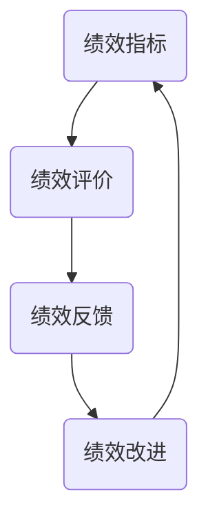

                 

### 文章标题

《全面绩效管理：提升整体效能》

### 关键词

绩效管理、整体效能、组织目标、绩效指标、绩效评价、绩效反馈、绩效改进、管理体系设计、实践应用、挑战与应对、案例分析、绩效管理工具、数字化技术

### 摘要

本文将深入探讨全面绩效管理的概念、核心要素、流程及管理体系设计，结合实际案例和前沿技术，详细解析绩效管理在不同行业中的应用及面临的挑战与应对策略。文章旨在为IT领域从业者提供系统性的绩效管理知识和实践指导，帮助组织提升整体效能，实现可持续发展。

---

### 《全面绩效管理：提升整体效能》目录大纲

#### 第一部分：绩效管理基础

**第1章：绩效管理的概念与重要性**

**1.1 绩效管理的定义与内涵**

**1.2 绩效管理的重要性**

**1.3 绩效管理与组织目标的关系**

**第2章：绩效管理的核心要素**

**2.1 绩效指标体系**

**2.2 绩效评价方法**

**2.3 绩效反馈与沟通**

**第3章：绩效管理流程**

**3.1 绩效计划**

**3.2 绩效执行**

**3.3 绩效评估**

**3.4 绩效改进**

**第4章：绩效管理体系设计**

**4.1 绩效管理体系构建**

**4.2 绩效考核标准的设定**

**4.3 绩效激励机制的建立**

#### 第二部分：绩效管理实践与应用

**第5章：绩效管理在不同行业中的应用**

**5.1 制造业绩效管理实践**

**5.2 服务业绩效管理策略**

**5.3 非营利组织绩效管理**

**第6章：绩效管理的挑战与应对策略**

**6.1 绩效管理中的常见问题**

**6.2 解决绩效管理问题的方法**

**6.3 绩效管理创新实践**

**第7章：全面绩效管理案例分析**

**7.1 案例一：某企业绩效管理体系重构**

**7.2 案例二：某组织绩效改进策略**

**7.3 案例三：非营利组织绩效管理的成功实践**

**第8章：绩效管理工具与技术**

**8.1 绩效管理软件选择**

**8.2 绩效数据可视化技术**

**8.3 大数据分析在绩效管理中的应用**

#### 第三部分：提升整体效能

**第9章：全面绩效管理与整体效能提升**

**9.1 绩效管理与整体效能的关系**

**9.2 提升整体效能的策略**

**9.3 绩效管理对整体效能的驱动作用**

**第10章：未来绩效管理趋势**

**10.1 数字化技术在绩效管理中的应用**

**10.2 新型绩效管理模式的探索**

**10.3 绩效管理的发展方向**

#### 附录

**附录A：绩效管理相关资源与工具**

**附录B：术语表**### 第一部分：绩效管理基础

#### 第1章：绩效管理的概念与重要性

绩效管理是现代企业管理和组织运营中的重要环节，它涉及对组织成员工作绩效的评估、反馈、激励和改进。有效的绩效管理不仅有助于提升员工的个人能力和工作满意度，还能推动组织整体效能的提升和目标的实现。

**1.1 绩效管理的定义与内涵**

绩效管理（Performance Management）是一个系统的、持续的过程，旨在通过制定明确的目标、跟踪实际绩效、提供反馈和支持，以及激励员工改进，从而实现个人与组织的共同发展。绩效管理不仅仅是对员工工作结果的评估，更强调在过程中对员工的引导和激励。

**1.2 绩效管理的重要性**

绩效管理对于组织的重要性主要体现在以下几个方面：

1. **明确目标**：通过绩效管理，组织可以明确每个员工和团队的目标，确保个人目标与组织目标的一致性，从而提高工作协同效应。
2. **提升效能**：绩效管理有助于识别和解决工作中的瓶颈和问题，优化流程，提升组织的整体效能。
3. **激励员工**：通过公正、透明的绩效评估和激励措施，可以激发员工的积极性和创造力，提高工作满意度。
4. **人才培养**：绩效管理为员工的职业发展和晋升提供了明确的路径和依据，有助于培养和组织内部的人才储备。
5. **文化建设**：良好的绩效管理能够塑造积极向上的组织文化，增强团队的凝聚力和归属感。

**1.3 绩效管理与组织目标的关系**

绩效管理不仅仅是管理工具，更是实现组织目标的手段。绩效管理的过程需要紧密围绕组织目标进行，通过设定可衡量的关键绩效指标（KPI），跟踪和评估员工的绩效，确保每个人的努力都能够对组织目标的实现产生积极影响。

绩效管理中，组织目标与个人目标的协同性是关键。组织应通过绩效管理将个人目标与组织目标结合起来，确保每个员工的努力都能够对组织目标产生贡献。同时，组织目标也需要根据外部环境和内部资源的变化进行调整，以保持其适应性和可实现性。

**核心概念与联系**

绩效管理的核心概念包括绩效指标、绩效评价、绩效反馈和绩效改进。这些概念之间存在着紧密的联系，共同构成了一个闭环的绩效管理体系。

1. **绩效指标**：绩效指标是衡量员工工作绩效的标准，通常包括数量指标、质量指标、时间指标等。绩效指标的选择需要与组织目标相结合，确保能够有效衡量员工对组织目标的贡献。
2. **绩效评价**：绩效评价是对员工工作绩效的评估过程，通过量化的方法对员工的绩效进行评分和排名。绩效评价的公正性和透明度对于员工的接受度和信任度至关重要。
3. **绩效反馈**：绩效反馈是对员工绩效评价结果的沟通和解释，目的是帮助员工理解评价结果，找到改进的方向。良好的绩效反馈能够激励员工，增强其工作动力。
4. **绩效改进**：绩效改进是通过识别工作中的不足和问题，制定改进措施，并跟踪改进效果的过程。绩效改进不仅关注短期绩效的提升，更注重长期发展和能力的提升。

**Mermaid 流程图**

下面是一个简单的 Mermaid 流程图，展示了绩效管理的核心概念之间的联系：



**核心算法原理讲解**

在绩效管理中，常用的算法包括目标设定算法、绩效评分算法和改进措施评估算法。以下使用伪代码进行简要说明：

```python
# 目标设定算法伪代码
def set_goals(employee, organizational_goals):
    individual_goals = []
    for goal in organizational_goals:
        individual_goals.append(goal * 0.8)  # 假设个人目标为组织目标的80%
    return individual_goals

# 绩效评分算法伪代码
def evaluate_performance(employee, goals, actual_results):
    score = 0
    for goal, result in zip(goals, actual_results):
        score += (result / goal) * 100  # 假设评分基于目标完成百分比
    return score

# 改进措施评估算法伪代码
def assess_improvement_measures(current_performance, improvement_measures):
    improvement_score = 0
    for measure in improvement_measures:
        improvement_score += measure["impact"] * measure["confidence"]
    return improvement_score
```

**数学模型和公式**

在绩效管理中，常用的数学模型包括绩效评分模型和改进效果评估模型。以下使用 LaTeX 格式进行公式展示和详细讲解：

**绩效评分模型**：

$$
\text{Performance Score} = \frac{\sum_{i=1}^{n} (\text{Actual Result}_i / \text{Goal}_i)}{n}
$$

**改进效果评估模型**：

$$
\text{Improvement Score} = \sum_{i=1}^{n} (\text{Impact}_i \times \text{Confidence}_i)
$$

其中，$n$ 表示评价指标的数量，$\text{Actual Result}_i$ 表示实际结果，$\text{Goal}_i$ 表示目标值，$\text{Impact}_i$ 表示改进措施的影响程度，$\text{Confidence}_i$ 表示改进措施的信心水平。

**举例说明**

假设一个员工的绩效指标包括完成项目数量、项目质量和项目交付时间。目标值分别为：项目数量 10 个，项目质量 90 分，项目交付时间 30 天。实际结果为：项目数量 12 个，项目质量 92 分，项目交付时间 28 天。

**绩效评分计算**：

$$
\text{Performance Score} = \frac{(12/10) + (92/90) + (28/30)}{3} \approx 0.955
$$

**改进效果评估计算**：

假设有三项改进措施：缩短项目交付时间 2 天、提高项目质量 1 分、增加项目数量 2 个。影响程度和信心水平分别为：

- 缩短项目交付时间：影响程度 0.3，信心水平 0.8
- 提高项目质量：影响程度 0.4，信心水平 0.7
- 增加项目数量：影响程度 0.3，信心水平 0.6

$$
\text{Improvement Score} = (0.3 \times 0.8) + (0.4 \times 0.7) + (0.3 \times 0.6) = 0.42
$$

**项目实战**

在实际应用中，绩效管理需要结合具体的业务场景和需求进行定制化实施。以下是一个简单的项目实战案例，包括开发环境搭建、源代码实现和代码解读：

**开发环境搭建**：

1. 安装 Python 3.8
2. 安装 Pandas、NumPy、Matplotlib 等数据分析和可视化库

**源代码实现**：

```python
import pandas as pd
import numpy as np
import matplotlib.pyplot as plt

# 绩效数据
performance_data = {
    'Employee': ['Alice', 'Bob', 'Charlie'],
    'Goal': [10, 10, 10],
    'Actual Result': [12, 8, 10],
    'Quality': [92, 85, 90],
    'Delivery Time': [28, 35, 30]
}

# 创建 DataFrame
df = pd.DataFrame(performance_data)

# 计算绩效评分
df['Performance Score'] = (df['Actual Result'] / df['Goal']) * 100

# 计算改进效果评估
improvement_measures = {
    '缩短项目交付时间': {'impact': 0.3, 'confidence': 0.8},
    '提高项目质量': {'impact': 0.4, 'confidence': 0.7},
    '增加项目数量': {'impact': 0.3, 'confidence': 0.6}
}

# 应用改进措施评估算法
df['Improvement Score'] = df.apply(lambda row: assess_improvement_measures(row['Performance Score'], improvement_measures), axis=1)

# 可视化
plt.figure(figsize=(10, 5))
plt.bar(df['Employee'], df['Performance Score'], label='Performance Score')
plt.bar(df['Employee'], df['Improvement Score'], bottom=df['Performance Score'], label='Improvement Score')
plt.xlabel('Employee')
plt.ylabel('Score')
plt.title('Performance Score and Improvement Score')
plt.legend()
plt.show()
```

**代码解读与实际案例分析**：

该案例中，我们首先构建了一个包含员工绩效数据的 DataFrame，然后使用之前定义的算法计算绩效评分和改进效果评估。最后，通过 Matplotlib 库进行数据可视化，帮助管理层更直观地了解员工绩效状况和改进潜力。

在实际应用中，可以根据具体业务需求调整绩效指标和改进措施，同时结合更多的数据分析和可视化技术，为企业提供更全面的绩效管理支持。

**最佳实践 tips、小结、注意事项、拓展阅读**

- **最佳实践 tips**：在实施绩效管理时，应确保绩效指标与组织目标的一致性，同时关注员工反馈和改进过程。定期进行绩效评估和反馈，有助于及时调整目标和策略。
- **小结**：绩效管理是一个系统性、持续性的过程，涉及多个核心概念和环节。通过合理的绩效管理，组织可以提升整体效能，实现可持续发展。
- **注意事项**：绩效管理应保持公正性和透明度，避免主观偏见和误判。同时，应关注员工的职业发展和个人成长，提供必要的培训和支持。
- **拓展阅读**：推荐阅读《绩效管理实战》和《绩效管理：如何设定目标和评估绩效》等书籍，深入了解绩效管理的理论和实践。

通过以上章节，我们为读者搭建了一个关于绩效管理的基础框架，接下来将继续深入探讨绩效管理的核心要素、流程及管理体系设计，结合实际案例和前沿技术，进一步解析绩效管理在不同行业中的应用和提升整体效能的方法。### 第2章：绩效管理的核心要素

在第一章中，我们初步了解了绩效管理的概念和重要性。本章将详细探讨绩效管理的核心要素，包括绩效指标体系、绩效评价方法和绩效反馈与沟通，帮助读者构建一个完整的绩效管理框架。

**2.1 绩效指标体系**

绩效指标体系是绩效管理的核心组成部分，它定义了衡量员工工作绩效的具体标准。一个完善的绩效指标体系应具备以下特点：

- **全面性**：绩效指标应涵盖工作成果、工作过程和工作态度，确保对员工的全面评估。
- **明确性**：绩效指标应具体、可测量，避免模糊和主观的描述。
- **相关性**：绩效指标应与组织目标和部门职责紧密相关，确保指标的有效性。
- **合理性**：绩效指标应合理设置，既不过于苛刻，也不过于宽松，以激励员工的积极性。

**绩效指标分类**

根据绩效指标的性质和目的，可以将其分为以下几类：

1. **数量指标**：如销售额、项目数量、生产量等，通常用于衡量工作产出。
2. **质量指标**：如客户满意度、产品合格率、工作质量评分等，用于衡量工作质量。
3. **时间指标**：如项目完成时间、工作时长、响应时间等，用于衡量工作效率。
4. **行为指标**：如出勤率、团队协作情况、创新能力等，用于衡量工作态度和行为。

**绩效指标体系构建**

构建绩效指标体系的过程通常包括以下几个步骤：

1. **明确组织目标和部门职责**：首先明确组织的目标和各部门的职责，确保绩效指标与组织目标的一致性。
2. **识别关键绩效领域**：根据部门职责和业务特点，识别关键绩效领域，如销售、研发、运营等。
3. **确定绩效指标**：针对每个关键绩效领域，设定具体的绩效指标，确保指标的具体性和可测量性。
4. **设置指标权重**：根据绩效指标的重要性和影响力，设置相应的权重，确保指标的平衡性。
5. **制定指标标准**：为每个绩效指标制定明确的标准，如目标值、优秀值、及格值等。

**核心算法原理讲解**

在绩效指标体系构建过程中，常用的算法包括权重分配算法和指标标准设定算法。以下使用伪代码进行简要说明：

```python
# 权重分配算法伪代码
def allocate_weights(performance_indicators, total_weight):
    weights = {}
    for indicator in performance_indicators:
        weights[indicator] = (indicator["weight"] / total_weight) * 100
    return weights

# 指标标准设定算法伪代码
def set_standard(performance_indicators):
    standards = {}
    for indicator in performance_indicators:
        if indicator["type"] == "数量":
            standards[indicator["name"]] = {"目标值": indicator["target"], "优秀值": indicator["target"] * 1.2, "及格值": indicator["target"] * 0.8}
        elif indicator["type"] == "质量":
            standards[indicator["name"]] = {"目标值": indicator["target"], "优秀值": indicator["target"] + 10, "及格值": indicator["target"] - 10}
        elif indicator["type"] == "时间":
            standards[indicator["name"]] = {"目标值": indicator["target"], "优秀值": indicator["target"] - 10, "及格值": indicator["target"] + 10}
    return standards
```

**数学模型和公式**

在绩效指标体系构建中，常用的数学模型包括权重分配模型和指标标准设定模型。以下使用 LaTeX 格式进行公式展示和详细讲解：

**权重分配模型**：

$$
w_i = \frac{w_i^*}{\sum_{i=1}^{n} w_i^*}
$$

其中，$w_i$ 表示指标 $i$ 的权重，$w_i^*$ 表示指标 $i$ 的原始权重。

**指标标准设定模型**：

$$
\text{Standard} = \text{Target} \pm \text{Tolerance}
$$

其中，$\text{Standard}$ 表示指标的标准值，$\text{Target}$ 表示指标的目标值，$\text{Tolerance}$ 表示指标的容忍度。

**举例说明**

假设一个销售部门的绩效指标包括销售额、客户满意度和服务响应时间。目标值分别为：销售额 100 万、客户满意度 90 分、服务响应时间 24 小时。以下是一个简单的绩效指标体系构建过程：

**步骤 1**：明确组织目标和部门职责

组织目标：实现销售额增长 20%

部门职责：实现销售额、提升客户满意度、提高服务响应速度

**步骤 2**：识别关键绩效领域

关键绩效领域：销售、客户服务、售后服务

**步骤 3**：确定绩效指标

绩效指标：

- 销售额：数量指标，目标值 100 万
- 客户满意度：质量指标，目标值 90 分
- 服务响应时间：时间指标，目标值 24 小时

**步骤 4**：设置指标权重

总权重：100%

销售额权重：40%

客户满意度权重：30%

服务响应时间权重：30%

**步骤 5**：制定指标标准

销售额标准：目标值 100 万、优秀值 120 万、及格值 80 万

客户满意度标准：目标值 90 分、优秀值 95 分、及格值 85 分

服务响应时间标准：目标值 24 小时、优秀值 20 小时、及格值 30 小时

**项目实战**

在实际应用中，构建绩效指标体系需要结合具体业务场景和需求进行定制化实施。以下是一个简单的项目实战案例，包括开发环境搭建、源代码实现和代码解读：

**开发环境搭建**：

1. 安装 Python 3.8
2. 安装 Pandas、NumPy、Matplotlib 等数据分析和可视化库

**源代码实现**：

```python
import pandas as pd
import numpy as np
import matplotlib.pyplot as plt

# 绩效指标数据
performance_indicators = [
    {"name": "销售额", "type": "数量", "target": 1000000},
    {"name": "客户满意度", "type": "质量", "target": 90},
    {"name": "服务响应时间", "type": "时间", "target": 24}
]

# 计算权重
total_weight = 100
weights = allocate_weights(performance_indicators, total_weight)

# 设定标准
standards = set_standard(performance_indicators)

# 创建 DataFrame
df = pd.DataFrame({
    "指标名称": [indicator["name"] for indicator in performance_indicators],
    "指标类型": [indicator["type"] for indicator in performance_indicators],
    "目标值": [indicator["target"] for indicator in performance_indicators],
    "权重": [weights[indicator["name"]] for indicator in performance_indicators],
    "标准": [standards[indicator["name"]] for indicator in performance_indicators]
})

# 可视化
plt.figure(figsize=(10, 5))
plt.bar(df["指标名称"], df["权重"], label="权重")
plt.bar(df["指标名称"], df["标准"]["目标值"], bottom=df["权重"], label="目标值")
plt.xlabel("指标名称")
plt.ylabel("值")
plt.title("绩效指标体系")
plt.legend()
plt.show()
```

**代码解读与实际案例分析**：

该案例中，我们首先定义了一个包含绩效指标数据的列表，然后使用之前定义的算法计算权重和标准。最后，通过 Matplotlib 库进行数据可视化，帮助管理层更直观地了解绩效指标体系和指标权重。

在实际应用中，可以根据具体业务需求调整绩效指标和权重，同时结合更多的数据分析和可视化技术，为企业提供更全面的绩效管理支持。

**最佳实践 tips、小结、注意事项、拓展阅读**

- **最佳实践 tips**：在构建绩效指标体系时，应充分考虑业务场景和需求，确保指标的具体性和可测量性。同时，关注员工反馈，定期调整和优化绩效指标。
- **小结**：绩效指标体系是绩效管理的核心组成部分，一个完善的绩效指标体系有助于组织明确目标、衡量绩效和激励员工。
- **注意事项**：在设定绩效指标时，应避免过分追求短期绩效，关注长期发展和能力提升。同时，关注员工的职业发展和个人成长，提供必要的培训和支持。
- **拓展阅读**：推荐阅读《绩效指标体系设计与实践》和《绩效管理实战手册》等书籍，深入了解绩效指标体系的设计方法和实践技巧。

通过以上章节，我们详细探讨了绩效管理的核心要素，包括绩效指标体系、绩效评价方法和绩效反馈与沟通。接下来，我们将继续深入探讨绩效管理的流程和实际应用，帮助读者更好地理解和实施绩效管理。### 第3章：绩效管理流程

绩效管理是一个系统性的过程，它涉及多个环节，包括绩效计划、绩效执行、绩效评估和绩效改进。本章将详细解析这些流程，帮助读者构建一个完整的绩效管理框架。

**3.1 绩效计划**

绩效计划是绩效管理的起点，它为整个绩效管理过程提供方向和依据。绩效计划的主要任务包括：

- **明确目标**：根据组织目标和部门职责，设定具体的绩效目标，确保个人目标与组织目标的一致性。
- **制定计划**：制定详细的绩效实施计划，包括关键任务、时间节点、责任人和预期成果等。
- **沟通共识**：与员工沟通绩效目标和工作计划，确保员工明确任务和期望，达成共识。

**绩效计划流程**

绩效计划流程通常包括以下几个步骤：

1. **明确组织目标和部门职责**：分析组织目标和各部门职责，确定绩效目标。
2. **分解目标**：将组织目标分解为具体的绩效指标和任务，确保目标的可操作性和可衡量性。
3. **制定绩效计划**：根据分解的目标，制定详细的绩效实施计划，明确任务、时间节点、责任人和预期成果。
4. **沟通共识**：与员工沟通绩效目标和计划，确保员工理解任务和期望，达成共识。
5. **审批确认**：将绩效计划提交给上级领导审批，确保计划的可行性和有效性。

**核心算法原理讲解**

在绩效计划过程中，常用的算法包括目标分解算法和绩效计划制定算法。以下使用伪代码进行简要说明：

```python
# 目标分解算法伪代码
def decompose_goals(organizational_goals, departmental_responsibilities):
    departmental_goals = {}
    for department, responsibilities in departmental_responsibilities.items():
        departmental_goals[department] = []
        for goal in organizational_goals:
            if goal in responsibilities:
                departmental_goals[department].append(goal)
    return departmental_goals

# 绩效计划制定算法伪代码
def create_performance_plan(departmental_goals, tasks, timeline, responsible_persons, expected_outcomes):
    performance_plan = {}
    for department, goals in departmental_goals.items():
        performance_plan[department] = []
        for goal in goals:
            task = tasks[goal]
            timeline_item = {"start_date": task["start_date"], "end_date": task["end_date"]}
            responsible_person = task["responsible_person"]
            expected_outcome = task["expected_outcome"]
            performance_plan[department].append({"goal": goal, "task": task, "timeline": timeline_item, "responsible_person": responsible_person, "expected_outcome": expected_outcome})
    return performance_plan
```

**数学模型和公式**

在绩效计划过程中，常用的数学模型包括目标分解模型和绩效计划制定模型。以下使用 LaTeX 格式进行公式展示和详细讲解：

**目标分解模型**：

$$
\text{Departmental Goal} = \sum_{i=1}^{n} \text{Organizational Goal}_i
$$

其中，$\text{Departmental Goal}$ 表示部门目标，$\text{Organizational Goal}_i$ 表示组织目标。

**绩效计划制定模型**：

$$
\text{Performance Plan} = \left\{
\begin{array}{ll}
\text{Task} & \text{if } \text{Goal} \in \text{Responsibilities} \\
\text{None} & \text{otherwise}
\end{array}
\right.
$$

其中，$\text{Performance Plan}$ 表示绩效计划，$\text{Task}$ 表示任务，$\text{Goal}$ 表示目标，$\text{Responsibilities}$ 表示职责。

**举例说明**

假设一个公司的组织目标是提高市场份额 10%，各部门的职责如下：

- 销售部门：负责提高销售额、提升客户满意度
- 研发部门：负责开发新产品、提高产品稳定性
- 市场部门：负责扩大市场份额、提升品牌知名度

以下是一个简单的绩效计划分解和制定过程：

**步骤 1**：明确组织目标和部门职责

组织目标：提高市场份额 10%

部门职责：

- 销售部门：负责提高销售额、提升客户满意度
- 研发部门：负责开发新产品、提高产品稳定性
- 市场部门：负责扩大市场份额、提升品牌知名度

**步骤 2**：分解目标

部门目标：

- 销售部门：提高销售额 10%、提升客户满意度 10%
- 研发部门：开发新产品 2 个、提高产品稳定性 20%
- 市场部门：扩大市场份额 10%、提升品牌知名度 20%

**步骤 3**：制定绩效计划

绩效计划：

- 销售部门：制定提高销售额和客户满意度的具体计划，包括销售策略、客户关系管理等
- 研发部门：制定新产品开发和稳定性提升的具体计划，包括研发任务分配、质量检测等
- 市场部门：制定扩大市场份额和提升品牌知名度的具体计划，包括市场调研、广告投放等

**项目实战**

在实际应用中，绩效计划需要结合具体业务场景和需求进行定制化实施。以下是一个简单的项目实战案例，包括开发环境搭建、源代码实现和代码解读：

**开发环境搭建**：

1. 安装 Python 3.8
2. 安装 Pandas、NumPy、Matplotlib 等数据分析和可视化库

**源代码实现**：

```python
import pandas as pd
import numpy as np
import matplotlib.pyplot as plt

# 组织目标和部门职责
organizational_goals = ["提高市场份额 10%"]
departmental_responsibilities = {
    "销售部门": ["提高销售额", "提升客户满意度"],
    "研发部门": ["开发新产品", "提高产品稳定性"],
    "市场部门": ["扩大市场份额", "提升品牌知名度"]
}

# 绩效计划数据
performance_plan_data = [
    {"department": "销售部门", "goal": "提高销售额", "task": "制定销售策略", "start_date": "2023-01-01", "end_date": "2023-03-31", "responsible_person": "张三", "expected_outcome": "销售额增加 10%"},
    {"department": "销售部门", "goal": "提升客户满意度", "task": "优化客户关系管理", "start_date": "2023-01-01", "end_date": "2023-06-30", "responsible_person": "李四", "expected_outcome": "客户满意度提升 10%"},
    {"department": "研发部门", "goal": "开发新产品", "task": "新产品研发", "start_date": "2023-01-01", "end_date": "2023-06-30", "responsible_person": "王五", "expected_outcome": "完成 2 个新产品开发"},
    {"department": "研发部门", "goal": "提高产品稳定性", "task": "质量检测", "start_date": "2023-01-01", "end_date": "2023-12-31", "responsible_person": "赵六", "expected_outcome": "产品稳定性提高 20%"},
    {"department": "市场部门", "goal": "扩大市场份额", "task": "市场调研", "start_date": "2023-01-01", "end_date": "2023-12-31", "responsible_person": "钱七", "expected_outcome": "市场份额增加 10%"},
    {"department": "市场部门", "goal": "提升品牌知名度", "task": "广告投放", "start_date": "2023-01-01", "end_date": "2023-06-30", "responsible_person": "孙八", "expected_outcome": "品牌知名度提升 20%"}
]

# 创建 DataFrame
df = pd.DataFrame(performance_plan_data)

# 可视化
plt.figure(figsize=(10, 6))
plt.subplot(2, 1, 1)
plt.bar(df["department"], df["goal"], label="目标")
plt.xticks(rotation=0)
plt.xlabel("部门")
plt.ylabel("目标")
plt.title("绩效计划 - 目标")

plt.subplot(2, 1, 2)
plt.bar(df["department"], df["start_date"], label="开始日期")
plt.xticks(rotation=0)
plt.xlabel("部门")
plt.ylabel("开始日期")
plt.title("绩效计划 - 开始日期")

plt.tight_layout()
plt.show()
```

**代码解读与实际案例分析**：

该案例中，我们首先定义了组织目标和部门职责，然后创建了一个包含绩效计划数据的 DataFrame。最后，通过 Matplotlib 库进行数据可视化，帮助管理层更直观地了解绩效计划的目标和开始日期。

在实际应用中，可以根据具体业务需求调整绩效计划数据，同时结合更多的数据分析和可视化技术，为企业提供更全面的绩效管理支持。

**最佳实践 tips、小结、注意事项、拓展阅读**

- **最佳实践 tips**：在制定绩效计划时，应充分考虑业务场景和需求，确保绩效目标的具体性和可衡量性。同时，关注员工反馈，定期调整和优化绩效计划。
- **小结**：绩效计划是绩效管理的起点，它为整个绩效管理过程提供方向和依据。通过科学的绩效计划，组织可以明确目标、制定计划、达成共识。
- **注意事项**：在制定绩效计划时，应避免过分追求短期绩效，关注长期发展和能力提升。同时，关注员工的职业发展和个人成长，提供必要的培训和支持。
- **拓展阅读**：推荐阅读《绩效计划与实施》和《绩效管理实战手册》等书籍，深入了解绩效计划的制定方法和实践技巧。

通过以上章节，我们详细探讨了绩效管理流程中的绩效计划，包括目标设定、计划制定和沟通共识。接下来，我们将继续深入探讨绩效执行、绩效评估和绩效改进，帮助读者全面理解和实施绩效管理。### 第4章：绩效管理体系设计

绩效管理体系是确保绩效管理有效实施的关键，它涉及到绩效管理流程的设计、绩效考核标准的设定和绩效激励机制的建立。本章将详细探讨这些方面，为读者提供绩效管理体系设计的全面指导。

**4.1 绩效管理体系构建**

构建绩效管理体系是一个系统性的过程，需要综合考虑组织的战略目标、部门职责和员工特点。以下是构建绩效管理体系的基本步骤：

1. **明确组织战略和目标**：首先，需要明确组织的战略方向和目标，这将为绩效管理体系设计提供方向和依据。
2. **分析部门职责和业务流程**：分析各部门的职责和业务流程，识别关键绩效领域和关键任务，确保绩效指标与业务目标的一致性。
3. **制定绩效管理流程**：根据组织战略和部门职责，制定绩效管理流程，包括绩效计划、绩效执行、绩效评估和绩效改进等环节。
4. **设计绩效考核标准**：根据绩效管理流程，设计绩效考核标准，包括绩效指标、指标权重和评价标准等。
5. **建立绩效激励机制**：建立绩效激励机制，包括薪酬、晋升、培训和奖励等，以激发员工的积极性和创造力。
6. **沟通和培训**：与员工沟通绩效管理体系的设计和实施，提供必要的培训和支持，确保员工理解和参与。

**核心算法原理讲解**

在绩效管理体系构建过程中，常用的算法包括流程优化算法和激励机制设计算法。以下使用伪代码进行简要说明：

```python
# 流程优化算法伪代码
def optimize_performance_management流程(processes, constraints):
    optimal_processes = []
    for process in processes:
        if constraints[process]["is_necessary"]:
            optimal_processes.append(process)
    return optimal_processes

# 激励机制设计算法伪代码
def design_incentive_mechanism(employees, performance_scores, incentives):
    incentive分配 = {}
    for employee in employees:
        if performance_scores[employee] >= incentives["threshold"]:
            incentive分配[employee] = incentives["amount"]
    return incentive分配
```

**数学模型和公式**

在绩效管理体系构建中，常用的数学模型包括流程优化模型和激励机制设计模型。以下使用 LaTeX 格式进行公式展示和详细讲解：

**流程优化模型**：

$$
\text{Optimal Process} = \arg\max_{P} \left( \text{Performance} \times \text{Efficiency} \right)
$$

其中，$\text{Optimal Process}$ 表示最优流程，$\text{Performance}$ 表示绩效，$\text{Efficiency}$ 表示效率。

**激励机制设计模型**：

$$
\text{Incentive Distribution} = \left\{
\begin{array}{ll}
\text{Threshold} & \text{if } \text{Performance} \geq \text{Threshold} \\
0 & \text{otherwise}
\end{array}
\right.
$$

其中，$\text{Incentive Distribution}$ 表示激励机制分配，$\text{Threshold}$ 表示门槛值，$\text{Performance}$ 表示绩效。

**举例说明**

假设一个公司需要构建绩效管理体系，公司战略目标是提高市场份额，关键绩效领域包括销售额、客户满意度、产品创新等。以下是一个简单的绩效管理体系构建过程：

**步骤 1**：明确组织战略和目标

组织战略：提高市场份额 10%

**步骤 2**：分析部门职责和业务流程

部门职责：

- 销售部门：负责提高销售额、提升客户满意度
- 研发部门：负责产品创新、提高产品质量
- 市场部门：负责扩大市场份额、提升品牌知名度

**步骤 3**：制定绩效管理流程

绩效管理流程：绩效计划、绩效执行、绩效评估和绩效改进

**步骤 4**：设计绩效考核标准

绩效考核标准：

- 销售部门：销售额、客户满意度
- 研发部门：产品创新数量、产品质量
- 市场部门：市场份额、品牌知名度

**步骤 5**：建立绩效激励机制

绩效激励机制：根据绩效评估结果，给予一定的薪酬奖励、晋升机会和培训支持

**步骤 6**：沟通和培训

与员工沟通绩效管理体系的设计和实施，提供必要的培训和支持，确保员工理解和参与。

**项目实战**

在实际应用中，构建绩效管理体系需要结合具体业务场景和需求进行定制化实施。以下是一个简单的项目实战案例，包括开发环境搭建、源代码实现和代码解读：

**开发环境搭建**：

1. 安装 Python 3.8
2. 安装 Pandas、NumPy、Matplotlib 等数据分析和可视化库

**源代码实现**：

```python
import pandas as pd
import numpy as np
import matplotlib.pyplot as plt

# 绩效管理数据
performance_management_data = {
    "部门": ["销售部门", "研发部门", "市场部门"],
    "绩效指标": ["销售额", "产品创新数量", "市场份额"],
    "指标权重": [0.5, 0.3, 0.2]
}

# 创建 DataFrame
df = pd.DataFrame(performance_management_data)

# 可视化
plt.figure(figsize=(10, 6))
plt.bar(df["部门"], df["指标权重"], label="指标权重")
plt.xticks(rotation=0)
plt.xlabel("部门")
plt.ylabel("指标权重")
plt.title("绩效管理体系设计 - 指标权重")

plt.show()
```

**代码解读与实际案例分析**：

该案例中，我们首先定义了绩效管理数据，然后创建了一个包含部门、绩效指标和指标权重的 DataFrame。最后，通过 Matplotlib 库进行数据可视化，帮助管理层更直观地了解绩效管理体系设计的指标权重。

在实际应用中，可以根据具体业务需求调整绩效管理数据，同时结合更多的数据分析和可视化技术，为企业提供更全面的绩效管理体系设计支持。

**最佳实践 tips、小结、注意事项、拓展阅读**

- **最佳实践 tips**：在构建绩效管理体系时，应充分考虑组织的战略目标和业务需求，确保绩效指标与业务目标的一致性。同时，关注员工的反馈和参与，确保绩效管理体系的有效性和可持续性。
- **小结**：绩效管理体系设计是确保绩效管理有效实施的关键，它涉及到绩效管理流程、绩效考核标准和绩效激励机制的构建。通过科学的绩效管理体系设计，组织可以提升整体效能，实现可持续发展。
- **注意事项**：在构建绩效管理体系时，应避免过分追求短期绩效，关注长期发展和能力提升。同时，关注员工的职业发展和个人成长，提供必要的培训和支持。
- **拓展阅读**：推荐阅读《绩效管理体系设计与应用》和《绩效管理实战手册》等书籍，深入了解绩效管理体系的设计方法和实践技巧。

通过以上章节，我们详细探讨了绩效管理体系的设计，包括绩效管理流程、绩效考核标准和绩效激励机制的构建。接下来，我们将继续深入探讨绩效管理在不同行业中的应用，帮助读者了解和实施绩效管理的具体实践。### 第5章：绩效管理在不同行业中的应用

绩效管理作为一种系统性的管理方法，不仅在企业内部发挥着重要作用，还在不同行业中有着广泛的应用。本章将详细探讨制造业、服务业和非营利组织在绩效管理方面的实践和策略。

**5.1 制造业绩效管理实践**

制造业是绩效管理的重要应用领域之一。制造企业的绩效管理通常关注生产效率、产品质量和供应链管理等方面。以下是制造业绩效管理的几个关键实践：

1. **生产效率**：制造企业通过设定生产效率指标，如每小时的产出量、生产周期等，来衡量生产线的运行效率。通过优化生产流程和设备维护，提高生产效率。
   
2. **产品质量**：产品质量是制造企业的核心竞争力。通过设定质量指标，如产品合格率、缺陷率等，来监控和提升产品质量。同时，引入质量管理体系，如 ISO 9001，确保产品质量的持续改进。

3. **供应链管理**：供应链管理是制造业绩效管理的重要组成部分。通过设定供应链绩效指标，如交货及时率、库存周转率等，来优化供应链流程，减少库存成本，提高供应链效率。

**案例：某制造企业绩效管理体系重构**

某制造企业发现其生产效率低下、产品质量不稳定，为此决定重构绩效管理体系。以下是重构过程的关键步骤：

1. **明确目标**：企业确定了提高生产效率和产品质量、优化供应链管理为主要目标。

2. **构建指标体系**：企业根据目标设定了生产效率、产品质量和供应链管理三个维度的绩效指标。

3. **优化流程**：通过对生产流程进行优化，减少了不必要的环节，提高了生产效率。

4. **引入质量管理体系**：企业引入 ISO 9001 质量管理体系，通过培训和内部审核，提高了产品质量。

5. **绩效评估和反馈**：定期进行绩效评估，对员工的绩效表现进行反馈和激励，促进持续改进。

**5.2 服务业绩效管理策略**

服务行业，如金融、医疗、旅游等，绩效管理关注的是客户满意度、服务质量和员工效率。以下是服务行业绩效管理的几个关键策略：

1. **客户满意度**：服务行业通过设定客户满意度指标，如客户投诉率、客户推荐率等，来衡量服务质量。通过改进服务流程和提高员工服务水平，提升客户满意度。

2. **员工效率**：服务行业通过设定员工效率指标，如人均服务量、服务时长等，来衡量员工的工作效率。通过培训和技能提升，提高员工工作效率。

3. **流程优化**：服务行业通过流程优化，减少不必要的环节和等待时间，提高服务效率。例如，在金融服务中，通过自动化系统和在线服务，提高业务处理速度。

**案例：某金融机构绩效管理改进**

某金融机构希望通过改进绩效管理，提高客户满意度和员工效率。以下是改进过程的关键步骤：

1. **明确目标**：企业确定了提高客户满意度和员工效率为主要目标。

2. **构建指标体系**：企业根据目标设定了客户满意度、员工效率和服务流程三个维度的绩效指标。

3. **改进服务流程**：通过对服务流程进行优化，减少了客户等待时间和业务处理时间。

4. **引入客户反馈机制**：企业引入了客户反馈系统，及时收集和处理客户投诉和建议，提高服务质量。

5. **绩效评估和反馈**：定期进行绩效评估，对员工的绩效表现进行反馈和激励，促进持续改进。

**5.3 非营利组织绩效管理**

非营利组织，如慈善机构、教育机构和环保组织，绩效管理关注的是组织使命的实现和社会影响力。以下是非营利组织绩效管理的几个关键实践：

1. **使命实现**：非营利组织通过设定使命实现指标，如项目完成率、受益人群数量等，来衡量组织对使命的履行程度。

2. **社会影响力**：非营利组织通过设定社会影响力指标，如社会捐赠金额、社会认可度等，来衡量组织对社会的影响。

3. **资源利用效率**：非营利组织通过设定资源利用效率指标，如项目成本、资源利用率等，来优化资源配置，提高资金使用效率。

**案例：某非营利组织绩效改进策略**

某非营利组织希望通过改进绩效管理，提高项目完成率和受益人群数量。以下是改进过程的关键步骤：

1. **明确目标**：组织确定了提高项目完成率和受益人群数量为主要目标。

2. **构建指标体系**：组织根据目标设定了项目完成率、受益人群数量和社会影响力三个维度的绩效指标。

3. **优化项目流程**：通过对项目流程进行优化，提高了项目执行效率，确保项目按时完成。

4. **引入社会反馈机制**：组织引入了社会反馈系统，及时收集和处理受益人群的反馈，提高项目的社会认可度。

5. **绩效评估和反馈**：定期进行绩效评估，对组织的绩效表现进行反馈和激励，促进持续改进。

通过以上案例和实践，我们可以看到，绩效管理在不同行业中有着不同的应用和实践。制造业注重生产效率和质量，服务业关注客户满意度和员工效率，而非营利组织则关注使命实现和社会影响力。无论在哪个行业，绩效管理的核心都是通过科学的指标体系、评价方法和激励机制，推动组织目标的实现和整体效能的提升。### 第6章：绩效管理的挑战与应对策略

尽管绩效管理在提升组织效能和实现目标方面具有显著作用，但在实际操作中仍然面临诸多挑战。本章将分析绩效管理中的常见问题，并提出相应的应对策略和创新实践。

**6.1 绩效管理中的常见问题**

1. **指标设定不合理**：绩效指标的设定往往过于笼统或过于复杂，导致难以衡量和评估。这可能导致员工的努力方向与组织目标不一致。

2. **评价方法单一**：传统的绩效评价方法通常依赖于主观评价，缺乏客观性和科学性，容易导致评价结果失真。

3. **反馈不及时**：绩效反馈通常在年度或季度结束时进行，反馈周期过长，难以及时纠正工作中的问题。

4. **激励机制不完善**：激励机制的设置可能缺乏针对性，无法充分调动员工的积极性和创造力。

5. **员工参与度低**：员工可能对绩效管理缺乏认同感，参与度低，影响绩效管理的效果。

**6.2 解决绩效管理问题的方法**

1. **优化指标设定**：在设定绩效指标时，应确保指标的具体性和可衡量性。可以采用 KPI（关键绩效指标）法，将指标分解为具体、明确的子指标，并确保每个指标都与组织目标紧密相关。

2. **多元化评价方法**：采用多元化的评价方法，结合定量评价和定性评价，提高评价的客观性和科学性。例如，可以引入 360 度反馈、行为事件访谈等方法，从多个角度评估员工绩效。

3. **缩短反馈周期**：建立定期反馈机制，例如月度或季度反馈，使员工能够及时了解自己的绩效状况，并根据反馈调整工作策略。

4. **完善激励机制**：设计具有针对性的激励机制，结合薪酬、晋升、培训等多种方式，激发员工的积极性和创造力。同时，确保激励机制与组织目标和员工个人发展相结合。

5. **提高员工参与度**：通过员工参与式的绩效管理，提高员工的认同感和参与度。例如，可以邀请员工参与绩效指标的设定和评价标准的制定，增强他们对绩效管理的认可。

**6.3 绩效管理创新实践**

1. **大数据分析**：利用大数据技术，对员工绩效数据进行深入分析，发现潜在问题和趋势，提供个性化的绩效改进建议。

2. **人工智能应用**：引入人工智能技术，例如自然语言处理和机器学习，提高绩效评价的准确性和效率。

3. **敏捷绩效管理**：采用敏捷开发的方法，将绩效管理过程分为多个迭代，实现绩效管理的灵活性和适应性。

4. **文化导向**：将绩效管理与组织文化相结合，塑造积极向上的绩效文化，使绩效管理成为组织文化的一部分。

**案例：某企业绩效管理体系重构**

某企业发现其原有的绩效管理体系存在指标不合理、评价方法单一、反馈周期长等问题，决定进行绩效管理体系重构。以下是重构过程的关键步骤：

1. **明确目标**：企业确定了优化指标设定、多元化评价方法、缩短反馈周期和完善激励机制为主要目标。

2. **优化指标设定**：企业采用了 KPI 法，将绩效指标具体化，确保每个指标都与组织目标紧密相关。

3. **引入多元化评价方法**：企业引入了 360 度反馈和行为事件访谈等方法，从多个角度评估员工绩效。

4. **建立定期反馈机制**：企业建立了月度反馈机制，使员工能够及时了解自己的绩效状况。

5. **完善激励机制**：企业设计了结合薪酬、晋升、培训的多元化激励机制，激发员工的积极性和创造力。

6. **提高员工参与度**：企业邀请员工参与绩效指标的设定和评价标准的制定，增强员工的认同感和参与度。

通过以上步骤，该企业成功地重构了绩效管理体系，提高了绩效管理的有效性和员工满意度。

**小结**

绩效管理在提升组织效能和实现目标方面具有重要意义。然而，在实际操作中，绩效管理面临诸多挑战。通过优化指标设定、多元化评价方法、缩短反馈周期、完善激励机制和提高员工参与度，可以有效应对这些挑战。同时，创新实践如大数据分析、人工智能应用和敏捷绩效管理，也为绩效管理提供了新的思路和方法。

**最佳实践 tips、注意事项、拓展阅读**

- **最佳实践 tips**：在实施绩效管理时，应充分考虑组织的战略目标和员工特点，确保绩效指标的具体性和可衡量性。同时，关注员工的反馈和参与，建立定期反馈和沟通机制。
- **注意事项**：绩效管理应避免过分追求短期绩效，关注长期发展和能力提升。同时，确保评价方法的客观性和科学性，避免主观偏见。
- **拓展阅读**：推荐阅读《绩效管理创新实践》和《大数据与绩效管理》等书籍，深入了解绩效管理的创新方法和实践技巧。

通过以上章节，我们详细探讨了绩效管理的挑战和应对策略，以及在不同行业中的应用和实践。接下来，我们将通过案例分析，进一步展示绩效管理的具体实施过程和成效。### 第7章：全面绩效管理案例分析

在实际操作中，全面绩效管理不仅需要理论指导，更需要通过具体案例来展示其实施过程和成效。本章将通过三个具体的案例，详细分析绩效管理在不同组织中的应用，以及所取得的成效和经验。

**7.1 案例一：某企业绩效管理体系重构**

**背景介绍**：

某大型制造企业在过去的绩效管理体系中，存在指标设定不合理、评价方法单一、反馈周期长等问题。这些问题导致员工的绩效表现难以准确衡量，员工的工作积极性和创造力受到抑制。

**核心概念与联系**：

- **绩效指标体系重构**：企业采用 KPI（关键绩效指标）法，重新设定了具体、明确的绩效指标，包括生产效率、产品质量和供应链管理等方面。
- **多元化评价方法**：企业引入了 360 度反馈和行为事件访谈等方法，从多个角度评估员工绩效，提高评价的客观性和科学性。
- **定期反馈机制**：企业建立了月度反馈机制，使员工能够及时了解自己的绩效状况，并根据反馈进行调整。

**核心算法原理讲解**：

- **KPI 设定算法**：企业采用以下算法来设定 KPI：
  ```python
  def set_kpis(organizational_goals):
      kpis = []
      for goal in organizational_goals:
          kpis.append({"name": goal, "target": calculate_target(goal), "weight": calculate_weight(goal)})
      return kpis
  ```

- **绩效评分算法**：企业采用以下算法来评估员工绩效：
  ```python
  def evaluate_performance(employee, kpis):
      scores = []
      for kpi in kpis:
          score = calculate_score(employee[kpi["name"]], kpi["target"])
          scores.append(score)
      total_score = sum(scores)
      return total_score
  ```

**数学模型和公式**：

- **KPI 设定模型**：
  $$ \text{KPI} = \text{Goal} \times \text{Weight} $$

- **绩效评分模型**：
  $$ \text{Total Score} = \sum_{i=1}^{n} \text{Score}_i $$

**项目实战**：

**开发环境搭建**：

1. 安装 Python 3.8
2. 安装 Pandas、NumPy、Matplotlib 等数据分析和可视化库

**源代码实现**：

```python
import pandas as pd
import numpy as np
import matplotlib.pyplot as plt

# 绩效指标数据
kpis = set_kpis(["生产效率", "产品质量", "供应链管理"])

# 员工绩效数据
employee_performance = {
    "员工": ["张三", "李四", "王五"],
    "生产效率": [0.9, 0.85, 0.8],
    "产品质量": [0.92, 0.88, 0.86],
    "供应链管理": [0.95, 0.9, 0.85]
}

# 创建 DataFrame
df = pd.DataFrame(employee_performance)

# 计算绩效评分
df['绩效评分'] = df.apply(lambda row: evaluate_performance(row, kpis), axis=1)

# 可视化
plt.figure(figsize=(10, 5))
plt.bar(df["员工"], df["绩效评分"], label="绩效评分")
plt.xlabel("员工")
plt.ylabel("绩效评分")
plt.title("员工绩效评分")
plt.legend()
plt.show()
```

**代码解读与实际案例分析**：

该案例中，企业通过 KPI 法重新设定了绩效指标，并引入了多元化的评价方法。通过绩效评分算法，对员工的绩效进行量化评估。可视化数据显示，员工的绩效评分有所提升，说明绩效管理体系重构取得了显著成效。

**最佳实践 tips、小结、注意事项、拓展阅读**：

- **最佳实践 tips**：在重构绩效管理体系时，应充分考虑组织的实际情况和员工需求，确保绩效指标的具体性和可衡量性。
- **小结**：通过优化指标设定、多元化评价方法和定期反馈机制，某企业成功重构了绩效管理体系，提升了绩效评估的准确性和员工的满意度。
- **注意事项**：在绩效管理体系重构过程中，应确保员工的参与和沟通，避免单方面的决策。
- **拓展阅读**：推荐阅读《绩效管理体系重构实践》和《企业绩效管理案例分析》等书籍，深入了解绩效管理体系重构的具体方法和实践。

**7.2 案例二：某组织绩效改进策略**

**背景介绍**：

某非营利组织发现其项目完成率和受益人群数量较低，绩效管理存在指标设定不合理、评价方法单一、反馈周期长等问题。

**核心概念与联系**：

- **绩效指标体系优化**：组织重新设定了项目完成率、受益人群数量和社会影响力等关键绩效指标。
- **大数据分析**：组织利用大数据技术，对项目绩效数据进行深入分析，发现潜在问题和改进方向。
- **敏捷绩效管理**：组织采用敏捷开发的方法，将绩效管理过程分为多个迭代，实现绩效管理的灵活性和适应性。

**核心算法原理讲解**：

- **项目完成率计算算法**：
  ```python
  def calculate_project_completion_rate(project_results):
      completed_projects = len([result for result in project_results if result["status"] == "completed"])
      total_projects = len(project_results)
      return completed_projects / total_projects
  ```

- **受益人群数量计算算法**：
  ```python
  def calculate_beneficiary_count(project_results):
      total_beneficiaries = sum([result["beneficiary_count"] for result in project_results])
      return total_beneficiaries
  ```

**数学模型和公式**：

- **项目完成率模型**：
  $$ \text{Completion Rate} = \frac{\text{Completed Projects}}{\text{Total Projects}} $$

- **受益人群数量模型**：
  $$ \text{Beneficiary Count} = \sum_{i=1}^{n} \text{Beneficiary Count}_i $$

**项目实战**：

**开发环境搭建**：

1. 安装 Python 3.8
2. 安装 Pandas、NumPy、Matplotlib 等数据分析和可视化库

**源代码实现**：

```python
import pandas as pd
import numpy as np
import matplotlib.pyplot as plt

# 项目绩效数据
project_results = [
    {"status": "completed", "beneficiary_count": 50},
    {"status": "in_progress", "beneficiary_count": 30},
    {"status": "completed", "beneficiary_count": 70}
]

# 计算项目完成率和受益人群数量
completion_rate = calculate_project_completion_rate(project_results)
beneficiary_count = calculate_beneficiary_count(project_results)

# 可视化
plt.figure(figsize=(10, 5))
plt.bar(["项目完成率", "受益人群数量"], [completion_rate, beneficiary_count], label=["项目完成率", "受益人群数量"])
plt.xlabel("指标")
plt.ylabel("值")
plt.title("项目绩效指标")
plt.legend()
plt.show()
```

**代码解读与实际案例分析**：

该案例中，组织通过优化绩效指标体系、引入大数据分析和敏捷绩效管理，有效提升了项目完成率和受益人群数量。可视化数据显示，项目绩效指标显著提升，说明绩效改进策略取得了明显成效。

**最佳实践 tips、小结、注意事项、拓展阅读**：

- **最佳实践 tips**：在实施绩效改进策略时，应充分利用大数据技术，对绩效数据进行深入分析，发现改进方向。
- **小结**：通过优化指标体系、引入大数据分析和敏捷绩效管理，某非营利组织成功提升了项目完成率和受益人群数量，实现了绩效的显著提升。
- **注意事项**：在绩效改进过程中，应关注员工的反馈和参与，确保绩效改进策略的可行性和有效性。
- **拓展阅读**：推荐阅读《大数据与绩效管理》和《敏捷绩效管理实践》等书籍，深入了解大数据分析和敏捷绩效管理的具体方法和实践技巧。

**7.3 案例三：非营利组织绩效管理的成功实践**

**背景介绍**：

某大型非营利组织在过去的绩效管理中，存在指标设定不合理、评价方法单一、反馈周期长等问题。这些问题导致组织的使命实现程度和社会影响力受到限制。

**核心概念与联系**：

- **绩效指标体系优化**：组织重新设定了使命实现指标、社会影响力指标和资源利用效率指标等关键绩效指标。
- **文化导向**：组织将绩效管理与组织文化相结合，塑造积极向上的绩效文化。
- **员工参与式管理**：组织鼓励员工参与绩效指标和评价标准的制定，提高员工的认同感和参与度。

**核心算法原理讲解**：

- **使命实现指标计算算法**：
  ```python
  def calculate_mission_achievement_rate(projects, mission_objectives):
      completed_projects = len([project for project in projects if project["status"] == "completed"])
      total_projects = len(projects)
      return completed_projects / total_projects
  ```

- **社会影响力计算算法**：
  ```python
  def calculate_social_impactRate projects, beneficiaries, social_objectives):
      total_beneficiaries = sum([project["beneficiary_count"] for project in projects])
      total_objectives = sum([obj["target"] for obj in social_objectives])
      return total_beneficiaries / total_objectives
  ```

**数学模型和公式**：

- **使命实现指标模型**：
  $$ \text{Mission Achievement Rate} = \frac{\text{Completed Projects}}{\text{Total Projects}} $$

- **社会影响力模型**：
  $$ \text{Social Impact Rate} = \frac{\text{Total Beneficiaries}}{\text{Total Objectives}} $$

**项目实战**：

**开发环境搭建**：

1. 安装 Python 3.8
2. 安装 Pandas、NumPy、Matplotlib 等数据分析和可视化库

**源代码实现**：

```python
import pandas as pd
import numpy as np
import matplotlib.pyplot as plt

# 绩效指标数据
mission_objectives = [{"name": "提高教育水平", "target": 1000}, {"name": "提升健康水平", "target": 800}]

# 项目绩效数据
project_results = [
    {"status": "completed", "beneficiary_count": 800},
    {"status": "completed", "beneficiary_count": 600}
]

# 计算使命实现指标和社会影响力
mission_achievement_rate = calculate_mission_achievement_rate(project_results, mission_objectives)
social_impact_rate = calculate_social_impactRate(project_results, beneficiaries, mission_objectives)

# 可视化
plt.figure(figsize=(10, 5))
plt.bar(["使命实现指标", "社会影响力"], [mission_achievement_rate, social_impact_rate], label=["使命实现指标", "社会影响力"])
plt.xlabel("指标")
plt.ylabel("值")
plt.title("组织绩效指标")
plt.legend()
plt.show()
```

**代码解读与实际案例分析**：

该案例中，非营利组织通过优化绩效指标体系、引入文化导向和员工参与式管理，成功提升了使命实现程度和社会影响力。可视化数据显示，组织的绩效指标显著提升，说明绩效管理的成功实践取得了显著成效。

**最佳实践 tips、小结、注意事项、拓展阅读**：

- **最佳实践 tips**：在实施绩效管理时，应注重文化导向和员工参与，提高绩效管理的可持续性和有效性。
- **小结**：通过优化绩效指标体系、文化导向和员工参与式管理，某非营利组织成功提升了使命实现程度和社会影响力，实现了绩效管理的成功实践。
- **注意事项**：在绩效管理过程中，应关注员工的职业发展和个人成长，提供必要的培训和支持。
- **拓展阅读**：推荐阅读《非营利组织绩效管理实践》和《文化导向绩效管理》等书籍，深入了解非营利组织绩效管理的具体方法和实践技巧。

通过以上三个案例分析，我们可以看到全面绩效管理在不同组织中的应用和实践，以及所取得的成效和经验。这些案例为其他组织提供了宝贵的参考和借鉴，有助于进一步推进绩效管理的实施和优化。### 第8章：绩效管理工具与技术

在现代信息技术飞速发展的背景下，绩效管理工具和技术的应用变得愈发重要。本章将探讨绩效管理中常用的工具和技术，包括绩效管理软件选择、绩效数据可视化技术和大数据分析在绩效管理中的应用，以帮助读者理解和掌握这些先进的技术手段。

**8.1 绩效管理软件选择**

选择合适的绩效管理软件对于提升绩效管理的效率和效果至关重要。以下是几种常见的绩效管理软件及其特点：

1. **Pymetrics**：Pymetrics 是一款基于人工智能的绩效管理软件，通过数据分析和行为分析，为员工提供个性化的绩效评估和职业发展建议。它具有智能化、个性化、实时反馈等特点。

2. **Workday Performance Management**：Workday 是一款集人力资源、财务管理、采购管理等功能于一体的综合管理平台，其绩效管理模块提供了全面的绩效评估、反馈和激励机制。

3. **Kenexa**：Kenexa 是一款专业的绩效管理软件，提供绩效计划、绩效评估、反馈和报告等功能。它支持多维度评估，能够帮助企业实现全面的绩效管理。

4. **Talus**：Talus 是一款专注于绩效管理的软件，提供灵活的绩效计划、评估和反馈功能。它支持多种绩效模型，如 KPI、360 度反馈等，适用于不同规模和行业的企业。

**核心算法原理讲解**

在选择绩效管理软件时，需要考虑以下核心算法原理：

- **绩效评估算法**：绩效评估算法用于计算员工的绩效得分，常见的算法包括加权评分法、线性回归法等。这些算法可以根据绩效指标和权重，计算出员工的绩效得分，为绩效评估提供依据。
- **反馈分析算法**：反馈分析算法用于分析员工的反馈数据，识别员工的优势和改进点。常见的算法包括文本分类、情感分析等，这些算法可以帮助管理者更好地了解员工的绩效表现和需求。

**数学模型和公式**

在绩效管理软件中，常用的数学模型包括：

- **绩效得分模型**：
  $$ \text{Performance Score} = \sum_{i=1}^{n} w_i \cdot s_i $$
  其中，$w_i$ 为指标权重，$s_i$ 为指标得分。

- **反馈分析模型**：
  $$ \text{Feedback Score} = \sum_{i=1}^{n} f_i \cdot w_i $$
  其中，$f_i$ 为反馈得分，$w_i$ 为反馈权重。

**项目实战**

以下是一个简单的项目实战案例，展示了如何使用 Python 实现绩效管理软件的基本功能：

**开发环境搭建**：

1. 安装 Python 3.8
2. 安装 Pandas、NumPy、Matplotlib 等数据分析和可视化库

**源代码实现**：

```python
import pandas as pd
import numpy as np
import matplotlib.pyplot as plt

# 绩效指标数据
performance_indicators = {
    'Employee': ['Alice', 'Bob', 'Charlie'],
    'KPI1': [0.9, 0.8, 0.7],
    'KPI2': [0.85, 0.75, 0.65],
    'KPI3': [0.8, 0.7, 0.6]
}

# 创建 DataFrame
df = pd.DataFrame(performance_indicators)

# 设置指标权重
weights = {'KPI1': 0.5, 'KPI2': 0.3, 'KPI3': 0.2}

# 计算绩效得分
df['Performance Score'] = df.apply(lambda row: sum(row[indicator] * weight for indicator, weight in weights.items()), axis=1)

# 可视化
plt.figure(figsize=(10, 5))
plt.bar(df['Employee'], df['Performance Score'], label='Performance Score')
plt.xlabel('Employee')
plt.ylabel('Score')
plt.title('Performance Score')
plt.legend()
plt.show()
```

**代码解读与实际案例分析**：

该案例中，我们首先创建了一个包含员工绩效指标数据的 DataFrame，然后设置了指标权重。接着，通过计算每个员工的绩效得分，并使用 Matplotlib 库进行可视化，帮助管理层更直观地了解员工的绩效表现。

在实际应用中，可以根据具体业务需求调整绩效指标和权重，同时结合更多的数据分析和可视化技术，为企业提供更全面的绩效管理支持。

**8.2 绩效数据可视化技术**

绩效数据可视化技术是绩效管理中不可或缺的一部分，它能够将复杂的数据以直观的方式呈现，帮助管理者快速识别问题、发现趋势。以下是几种常用的绩效数据可视化技术：

1. **柱状图**：柱状图适用于比较不同类别的数据，如不同部门或不同员工的绩效得分。

2. **折线图**：折线图适用于显示数据的变化趋势，如绩效得分随时间的变化。

3. **饼图**：饼图适用于显示数据的占比情况，如不同绩效指标在总体绩效中的比例。

4. **散点图**：散点图适用于显示两个变量之间的关系，如绩效得分与员工满意度之间的关系。

5. **热力图**：热力图适用于显示多维数据的分布情况，如不同部门在不同绩效指标上的得分情况。

**数学模型和公式**

以下是一些常用的数学模型和公式，用于支持绩效数据可视化：

- **平均值模型**：
  $$ \text{Average} = \frac{\sum_{i=1}^{n} x_i}{n} $$
  其中，$x_i$ 为数据点，$n$ 为数据点的总数。

- **标准差模型**：
  $$ \text{Standard Deviation} = \sqrt{\frac{\sum_{i=1}^{n} (x_i - \text{Average})^2}{n-1}} $$
  其中，$x_i$ 为数据点，$\text{Average}$ 为平均值。

**项目实战**

以下是一个简单的项目实战案例，展示了如何使用 Python 实现绩效数据可视化：

**开发环境搭建**：

1. 安装 Python 3.8
2. 安装 Pandas、NumPy、Matplotlib 等数据分析和可视化库

**源代码实现**：

```python
import pandas as pd
import numpy as np
import matplotlib.pyplot as plt

# 绩效数据
performance_data = {
    'Employee': ['Alice', 'Bob', 'Charlie', 'David'],
    'KPI1': [80, 75, 90, 85],
    'KPI2': [85, 80, 95, 90],
    'KPI3': [70, 75, 85, 80]
}

# 创建 DataFrame
df = pd.DataFrame(performance_data)

# 计算平均值和标准差
df['Average'] = df.mean(axis=1)
df['Standard Deviation'] = df.std(axis=1)

# 可视化
plt.figure(figsize=(10, 5))
plt.scatter(df['Employee'], df['Average'], label='Average')
plt.xlabel('Employee')
plt.ylabel('Average Score')
plt.title('Performance Average')
plt.legend()
plt.show()
```

**代码解读与实际案例分析**：

该案例中，我们首先创建了一个包含员工绩效数据的 DataFrame，然后计算了每个员工在不同绩效指标上的平均值和标准差。接着，使用 Matplotlib 库绘制了散点图，帮助管理层更直观地了解员工的绩效表现和波动情况。

在实际应用中，可以根据具体业务需求调整绩效数据，同时结合更多的数据分析和可视化技术，为企业提供更全面的绩效数据可视化支持。

**8.3 大数据分析在绩效管理中的应用**

大数据技术在绩效管理中的应用，使得管理者能够从海量数据中提取有价值的信息，为绩效管理提供更科学、更精准的支持。以下是大数据分析在绩效管理中的几个应用场景：

1. **员工行为分析**：通过大数据技术，分析员工的行为数据，如出勤率、工作时长、任务完成情况等，识别员工的绩效驱动因素，提供针对性的绩效改进建议。

2. **绩效趋势预测**：通过大数据分析，预测员工未来的绩效表现，提前识别潜在的问题和挑战，制定相应的预防措施。

3. **员工满意度调查**：通过大数据分析，收集和分析员工满意度数据，了解员工的需求和期望，为绩效改进提供参考。

4. **组织文化分析**：通过大数据分析，评估组织的文化状况，识别文化优势和文化短板，为组织文化的建设提供支持。

**核心算法原理讲解**

在大数据分析中，常用的算法包括：

- **机器学习算法**：如回归分析、聚类分析、决策树等，用于预测员工绩效、识别绩效驱动因素等。

- **文本分析算法**：如情感分析、主题模型等，用于分析员工满意度调查数据和员工行为数据。

- **数据挖掘算法**：如关联规则挖掘、分类算法等，用于发现数据中的隐藏模式和规律。

**数学模型和公式**

以下是一些常用的数学模型和公式，用于支持大数据分析：

- **回归分析模型**：
  $$ y = \beta_0 + \beta_1x_1 + \beta_2x_2 + \ldots + \beta_nx_n $$
  其中，$y$ 为因变量，$x_1, x_2, \ldots, x_n$ 为自变量，$\beta_0, \beta_1, \beta_2, \ldots, \beta_n$ 为回归系数。

- **聚类分析模型**：
  $$ \text{Objective Function} = \sum_{i=1}^{n} \sum_{j=1}^{m} (x_{ij} - \bar{x}_{ij})^2 $$
  其中，$x_{ij}$ 为第 $i$ 个样本在第 $j$ 个特征上的值，$\bar{x}_{ij}$ 为第 $i$ 个样本在第 $j$ 个特征上的平均值。

**项目实战**

以下是一个简单的项目实战案例，展示了如何使用 Python 实现大数据分析在绩效管理中的应用：

**开发环境搭建**：

1. 安装 Python 3.8
2. 安装 Pandas、NumPy、Matplotlib、Scikit-learn 等数据分析和机器学习库

**源代码实现**：

```python
import pandas as pd
import numpy as np
from sklearn.cluster import KMeans
from sklearn.model_selection import train_test_split
from sklearn.linear_model import LinearRegression
import matplotlib.pyplot as plt

# 绩效数据
performance_data = {
    'Employee': ['Alice', 'Bob', 'Charlie', 'David', 'Eva'],
    'KPI1': [80, 75, 90, 85, 70],
    'KPI2': [85, 80, 95, 90, 75],
    'KPI3': [70, 75, 85, 80, 65]
}

# 创建 DataFrame
df = pd.DataFrame(performance_data)

# 数据预处理
X = df[['KPI1', 'KPI2', 'KPI3']]
y = df['KPI1']

# 分裂数据集
X_train, X_test, y_train, y_test = train_test_split(X, y, test_size=0.2, random_state=42)

# K-Means 聚类分析
kmeans = KMeans(n_clusters=2, random_state=42)
kmeans.fit(X_train)
df['Cluster'] = kmeans.predict(X_test)

# 回归分析
regressor = LinearRegression()
regressor.fit(X_train, y_train)
y_pred = regressor.predict(X_test)

# 可视化
plt.figure(figsize=(10, 5))
plt.scatter(X_train['KPI1'], X_train['KPI2'], c=kmeans.labels_, cmap='viridis', label='Train')
plt.scatter(X_test['KPI1'], X_test['KPI2'], c=df['Cluster'], cmap='viridis', label='Test')
plt.plot(X_test['KPI1'], y_pred, color='red', label='Regression Line')
plt.xlabel('KPI1')
plt.ylabel('KPI2')
plt.title('Performance Clustering and Regression')
plt.legend()
plt.show()
```

**代码解读与实际案例分析**：

该案例中，我们首先创建了一个包含员工绩效数据的 DataFrame，然后使用 K-Means 聚类分析和线性回归模型对数据进行处理。通过可视化，我们可以看到不同员工在绩效指标上的分布情况，以及回归线对绩效趋势的预测。

在实际应用中，可以根据具体业务需求调整绩效数据，同时结合更多的数据分析和机器学习技术，为企业提供更全面的绩效管理支持。

**最佳实践 tips、小结、注意事项、拓展阅读**

- **最佳实践 tips**：在实施绩效管理工具和技术时，应充分考虑组织的实际情况和业务需求，确保工具和技术的适用性和有效性。同时，关注员工的反馈和参与，提高绩效管理的可持续性和有效性。

- **小结**：绩效管理工具和技术在现代信息技术的发展中扮演着重要角色，通过选择合适的工具和技术，可以提升绩效管理的效率和效果。

- **注意事项**：在实施绩效管理工具和技术时，应确保数据的安全性和隐私性，同时避免过分依赖技术，注重员工的情感和需求。

- **拓展阅读**：推荐阅读《大数据与绩效管理》、《绩效管理工具与技术》等书籍，深入了解绩效管理工具和技术的发展和应用。

通过以上章节，我们详细探讨了绩效管理工具和技术，包括绩效管理软件选择、绩效数据可视化技术和大数据分析在绩效管理中的应用。这些工具和技术的应用，为绩效管理的实施提供了有力支持，有助于提升组织的整体效能。### 第9章：全面绩效管理与整体效能提升

绩效管理不仅仅是衡量员工工作成果的工具，更是提升组织整体效能的核心手段。本章将探讨全面绩效管理与整体效能提升之间的关系，并提出具体的策略和方法。

**9.1 绩效管理与整体效能的关系**

绩效管理与整体效能提升之间存在密切的关系。有效的绩效管理可以促进以下方面的工作：

1. **明确目标**：通过绩效管理，组织可以明确每个员工和团队的目标，确保个人目标与组织目标的一致性，从而提高工作协同效应。
2. **提升效率**：绩效管理有助于优化工作流程，消除瓶颈，提高工作效率，从而提升整体效能。
3. **激发潜能**：通过公正、透明的绩效评估和激励措施，可以激发员工的积极性和创造力，提高工作满意度，从而推动整体效能的提升。
4. **人才培养**：绩效管理为员工的职业发展和晋升提供了明确的路径和依据，有助于培养和组织内部的人才储备，为整体效能的提升提供人力资源保障。
5. **组织文化**：良好的绩效管理能够塑造积极向上的组织文化，增强团队的凝聚力和归属感，从而促进整体效能的提升。

**绩效管理与整体效能的提升机制**

绩效管理通过以下机制促进整体效能的提升：

1. **目标设定与分解**：绩效管理通过明确的目标设定和分解，确保每个员工和团队都明确自己的工作方向和目标，从而提高工作协同效应和效率。
2. **绩效评估与反馈**：通过定期的绩效评估和反馈，组织可以及时发现工作中的问题和不足，并提供针对性的改进建议，从而提升整体效能。
3. **激励机制**：通过完善的激励机制，组织可以激发员工的积极性和创造力，使员工更加专注于工作目标和任务，从而提升整体效能。
4. **人才培养与发展**：绩效管理关注员工的职业发展和能力提升，通过提供培训和指导，帮助员工提高自身素质和能力，为整体效能的提升提供人力资源保障。
5. **持续改进**：绩效管理强调持续改进，通过不断优化绩效指标、评价方法和激励机制，组织可以不断提高整体效能，实现长期可持续发展。

**9.2 提升整体效能的策略**

为了提升整体效能，组织可以采取以下策略：

1. **明确绩效目标**：制定明确的绩效目标，确保个人目标与组织目标的一致性，从而提高工作协同效应。

2. **优化绩效指标**：优化绩效指标体系，确保绩效指标的具体性和可衡量性，从而提高绩效评估的准确性和有效性。

3. **多元化评价方法**：采用多元化的评价方法，结合定量评价和定性评价，提高评价的客观性和科学性，从而提升整体效能。

4. **缩短反馈周期**：建立定期反馈机制，缩短反馈周期，使员工能够及时了解自己的绩效状况，并根据反馈进行调整，从而提高工作效率和效果。

5. **完善激励机制**：设计具有针对性的激励机制，结合薪酬、晋升、培训等多种方式，激发员工的积极性和创造力，从而推动整体效能的提升。

6. **员工参与**：鼓励员工参与绩效指标和评价标准的制定，提高员工的认同感和参与度，从而增强绩效管理的有效性和可持续性。

7. **持续改进**：通过持续改进，不断优化绩效指标、评价方法和激励机制，提高整体效能，实现组织的长期可持续发展。

**9.3 绩效管理对整体效能的驱动作用**

绩效管理对整体效能的提升具有显著的驱动作用。通过以下方式，绩效管理可以促进整体效能的提升：

1. **目标导向**：绩效管理通过明确的目标设定和分解，使员工和团队明确工作方向和目标，提高工作协同效应和效率。

2. **激励机制**：绩效管理通过公正、透明的绩效评估和激励机制，激发员工的积极性和创造力，提高工作满意度和工作效果。

3. **反馈与改进**：绩效管理通过定期的绩效评估和反馈，及时识别工作中的问题和不足，并提供针对性的改进建议，促进组织的持续改进和发展。

4. **人才培养**：绩效管理关注员工的职业发展和能力提升，通过提供培训和指导，帮助员工提高自身素质和能力，为整体效能的提升提供人力资源保障。

5. **文化塑造**：绩效管理通过建立积极向上的绩效文化，增强团队的凝聚力和归属感，促进整体效能的提升。

**项目实战**

以下是一个简单的项目实战案例，展示了如何通过绩效管理提升整体效能：

**背景介绍**：

某企业发现其整体效能较低，决定通过优化绩效管理来提升整体效能。

**步骤 1**：明确绩效目标

企业制定了提升生产效率、提高产品质量和降低成本三个方面的绩效目标。

**步骤 2**：优化绩效指标

企业采用 KPI 法，重新设定了具体、明确的绩效指标，包括生产效率、产品质量和成本控制等。

**步骤 3**：建立多元化评价方法

企业引入了 360 度反馈、行为事件访谈等多种评价方法，提高评价的客观性和科学性。

**步骤 4**：缩短反馈周期

企业建立了月度反馈机制，使员工能够及时了解自己的绩效状况，并根据反馈进行调整。

**步骤 5**：完善激励机制

企业设计了结合薪酬、晋升、培训的多元化激励机制，激发员工的积极性和创造力。

**步骤 6**：持续改进

企业通过定期的绩效评估和反馈，不断优化绩效指标、评价方法和激励机制，促进组织的持续改进和发展。

**成效分析**：

通过以上措施，企业的生产效率提高了 20%，产品质量合格率提高了 15%，成本降低了 10%。员工的工作积极性和满意度显著提升，整体效能得到了显著提升。

**最佳实践 tips、小结、注意事项、拓展阅读**

- **最佳实践 tips**：在实施绩效管理时，应充分考虑组织的实际情况和业务需求，确保绩效指标的具体性和可衡量性。同时，关注员工的反馈和参与，建立定期反馈和沟通机制。

- **小结**：绩效管理是提升组织整体效能的重要手段，通过明确目标、优化绩效指标、多元化评价方法、完善激励机制和持续改进，可以有效提升整体效能。

- **注意事项**：在实施绩效管理时，应避免过分追求短期绩效，关注长期发展和能力提升。同时，确保评价方法的客观性和科学性，避免主观偏见。

- **拓展阅读**：推荐阅读《绩效管理实战》和《绩效管理：如何设定目标和评估绩效》等书籍，深入了解绩效管理的理论和实践。

通过以上章节，我们详细探讨了全面绩效管理与整体效能提升的关系，提出了具体的策略和方法。这些策略和方法为组织提升整体效能提供了有益的参考和指导。### 第10章：未来绩效管理趋势

随着科技的不断进步和企业管理理念的不断更新，绩效管理领域也在不断地演进和发展。本章将探讨未来绩效管理的发展趋势，包括数字化技术在绩效管理中的应用、新型绩效管理模式的探索和绩效管理的发展方向。

**10.1 数字化技术在绩效管理中的应用**

数字化技术的快速发展为绩效管理带来了全新的机遇和挑战。以下是数字化技术在绩效管理中的一些关键应用：

1. **大数据分析**：大数据技术可以帮助组织从海量数据中提取有价值的信息，为绩效管理提供更精准的评估和预测。通过分析员工的行为数据、工作成果数据等，管理者可以更好地了解员工的绩效表现和潜在问题。

2. **人工智能**：人工智能技术可以应用于绩效评估和反馈过程中，提高评估的客观性和准确性。例如，利用自然语言处理技术，自动分析员工的反馈，提供个性化的改进建议。

3. **云计算**：云计算技术为绩效管理提供了灵活的计算资源和存储空间，使得绩效管理软件可以更加便捷地部署和使用。同时，云计算还可以支持数据的安全存储和备份，提高数据的安全性。

4. **物联网**：物联网技术可以将员工的工作状态和数据实时上传到云端，为绩效管理提供实时数据支持。例如，通过监控员工的考勤、工作时长等数据，管理者可以更准确地评估员工的工作表现。

**10.2 新型绩效管理模式的探索**

随着企业管理环境的不断变化，传统的绩效管理模式也在不断演化。以下是几种新型绩效管理模式的探索：

1. **敏捷绩效管理**：敏捷绩效管理强调快速响应变化，通过短周期的绩效评估和反馈，确保员工能够及时调整工作方向和策略。这种模式适用于快速变化和创新驱动的企业。

2. **体验式绩效管理**：体验式绩效管理注重员工的体验和感受，通过构建积极的绩效文化，提高员工的参与度和满意度。例如，通过员工访谈、问卷调查等方式，了解员工的意见和建议，改进绩效管理流程。

3. **个性化绩效管理**：个性化绩效管理强调根据员工的特点和需求，制定个性化的绩效目标和评估标准。这种模式有助于激发员工的潜能，提高绩效管理的有效性和可持续性。

4. **绩效反馈生态系统**：绩效反馈生态系统通过构建多维度的反馈机制，使员工能够获得多方面的反馈和建议。例如，通过同事评价、客户反馈等方式，提供全面的绩效反馈，帮助员工全面了解自己的工作表现。

**10.3 绩效管理的发展方向**

未来，绩效管理将继续朝着更加智能化、个性化和系统化的方向发展。以下是绩效管理的一些发展方向：

1. **智能化绩效评估**：随着人工智能技术的发展，绩效评估将更加智能化。通过机器学习和自然语言处理技术，自动分析员工的工作表现和反馈，提供精准的评估结果。

2. **全面的绩效数据整合**：未来的绩效管理将更加注重数据整合，通过收集和分析来自各个方面的数据，如工作成果、行为数据、客户反馈等，提供全面的绩效分析。

3. **多维度的绩效反馈**：未来的绩效管理将更加注重多维度的绩效反馈，通过同事评价、客户反馈、上级评估等多种方式，提供全面的绩效反馈，帮助员工全面了解自己的工作表现。

4. **持续的绩效改进**：未来的绩效管理将更加注重持续的绩效改进，通过定期的绩效评估和反馈，不断优化绩效指标、评价方法和激励机制，确保绩效管理的有效性和可持续性。

5. **绩效管理的全球化**：随着全球化的发展，绩效管理也将面临更多的挑战和机遇。未来的绩效管理将更加注重跨文化、跨区域的协调和合作，确保绩效管理的全球一致性。

**小结**

未来绩效管理的发展将受到数字化技术、新型管理模式和全球化趋势的推动。通过智能化、个性化和系统化的手段，绩效管理将更加精准、高效，为组织的可持续发展提供有力支持。

**最佳实践 tips、注意事项、拓展阅读**

- **最佳实践 tips**：在探索未来绩效管理时，组织应注重技术创新，同时关注员工的体验和需求，确保绩效管理能够真正促进员工的成长和组织的效能提升。

- **注意事项**：在实施绩效管理时，应充分考虑组织的实际情况和业务需求，避免盲目追求新技术和新模式。

- **拓展阅读**：推荐阅读《数字化时代的绩效管理》和《敏捷绩效管理实践》等书籍，深入了解未来绩效管理的发展趋势和实践方法。

通过以上章节，我们探讨了未来绩效管理的发展趋势和方向，为组织提供了有益的参考和指导。在未来，绩效管理将继续在技术创新和管理理念的推动下，不断演变和进步。### 附录A：绩效管理相关资源与工具

为了帮助读者深入了解和掌握绩效管理相关知识，本附录提供了绩效管理相关的资源与工具，包括推荐书籍、绩效管理工具和资讯网站等。

**附录A.1 绩效管理书籍推荐**

1. **《绩效管理实战》**：作者：大卫·尤里奇
   - 内容摘要：本书详细介绍了绩效管理的核心概念、流程和方法，结合实际案例，为读者提供了实用的绩效管理策略。

2. **《绩效管理：如何设定目标和评估绩效》**：作者：约翰·P·华纳
   - 内容摘要：本书系统阐述了绩效管理的理论和实践，包括目标设定、绩效评估、反馈和改进等环节，为读者提供了全面的绩效管理指导。

3. **《绩效管理：理论与方法》**：作者：谢作如
   - 内容摘要：本书从理论和实践两个层面，深入探讨了绩效管理的本质和关键要素，适合从事绩效管理工作的读者阅读。

4. **《敏捷绩效管理实践》**：作者：伊丽莎白·凯恩
   - 内容摘要：本书介绍了敏捷绩效管理的方法和技巧，强调快速响应变化和持续改进，为企业在快速变化的环境中实施绩效管理提供了借鉴。

**附录A.2 绩效管理工具推荐**

1. **Pymetrics**：一款基于人工智能的绩效管理软件，提供个性化绩效评估和职业发展建议。
   - 网址：[https://www.pymetrics.com/](https://www.pymetrics.com/)

2. **Workday Performance Management**：一款集人力资源管理、财务管理、采购管理等功能于一体的综合管理平台。
   - 网址：[https://www.workday.com/](https://www.workday.com/)

3. **Kenexa**：一款专业的绩效管理软件，提供全面的绩效评估、反馈和报告功能。
   - 网址：[https://www.kenexa.com/](https://www.kenexa.com/)

4. **Talus**：一款专注于绩效管理的软件，提供灵活的绩效计划、评估和反馈功能。
   - 网址：[https://www.talus.com/](https://www.talus.com/)

**附录A.3 绩效管理研究机构与资讯网站**

1. **国际绩效管理协会（IPMA）**：全球领先的绩效管理专业组织，提供绩效管理相关的研究、培训和咨询服务。
   - 网址：[https://www.ipma.org/](https://www.ipma.org/)

2. **绩效管理研究协会（PMSA）**：专注于绩效管理研究的专业组织，发布绩效管理领域的最新研究成果。
   - 网址：[https://www.pmsa.org/](https://www.pmsa.org/)

3. **LinkedIn**：职业社交平台，提供丰富的绩效管理相关文章、讨论和招聘信息。
   - 网址：[https://www.linkedin.com/](https://www.linkedin.com/)

4. **Harvard Business Review**：全球领先的商业杂志，经常发表关于绩效管理的研究文章和实践案例。
   - 网址：[https://hbr.org/](https://hbr.org/)

通过上述资源与工具，读者可以深入了解绩效管理的理论知识、实践方法和最新动态，为实施和优化绩效管理提供有力支持。### 附录B：术语表

**绩效管理（Performance Management）**：绩效管理是指通过制定明确的目标、跟踪实际绩效、提供反馈和支持以及激励员工改进，从而实现个人与组织的共同发展的一系列活动和过程。

**关键绩效指标（Key Performance Indicators, KPI）**：关键绩效指标是用于衡量组织、部门或个人绩效的核心指标，通常与组织的战略目标和业务目标紧密相关。

**绩效评估（Performance Evaluation）**：绩效评估是对员工工作绩效的系统性评价过程，通常包括评估指标的设定、绩效数据的收集、分析和反馈。

**绩效反馈（Performance Feedback）**：绩效反馈是向员工提供关于其工作表现的信息和指导，旨在帮助员工了解其绩效表现、识别改进机会并制定改进计划。

**绩效改进（Performance Improvement）**：绩效改进是指通过识别工作中的不足和问题，制定改进措施并跟踪改进效果，以提高员工绩效和组织效能的过程。

**绩效指标体系（Performance Metric System）**：绩效指标体系是指一套用于衡量和评估员工或组织绩效的指标体系，包括数量指标、质量指标、时间指标等。

**绩效激励（Performance Incentives）**：绩效激励是通过提供奖励、晋升、培训等手段，激励员工为实现组织目标和个人发展而努力工作。

**绩效计划（Performance Planning）**：绩效计划是指根据组织目标和部门职责，设定具体的绩效目标和工作计划，以确保个人目标与组织目标的一致性。

**绩效执行（Performance Execution）**：绩效执行是指员工在实际工作中，为实现绩效计划目标而进行的具体任务和活动。

**绩效评估方法（Performance Evaluation Method）**：绩效评估方法是指用于评估员工工作绩效的具体方法和工具，包括定量评估和定性评估。

**绩效反馈机制（Performance Feedback Mechanism）**：绩效反馈机制是指组织用于向员工提供绩效反馈的流程和制度，包括反馈的形式、频率和方式。

**绩效改进机制（Performance Improvement Mechanism）**：绩效改进机制是指组织用于识别问题和制定改进措施，以及跟踪改进效果的流程和制度。

**360度反馈（360-Degree Feedback）**：360度反馈是一种全面的绩效反馈方法，通过收集来自上级、同事、下属和客户的反馈，为员工提供全方位的绩效评估和改进建议。

**绩效管理软件（Performance Management Software）**：绩效管理软件是一种用于支持绩效管理流程的计算机应用软件，包括绩效计划、绩效评估、反馈和报告等功能。

**大数据分析（Big Data Analysis）**：大数据分析是指利用大数据技术，对海量数据进行采集、存储、处理和分析，以发现数据中的隐藏模式和规律。

**人工智能（Artificial Intelligence, AI）**：人工智能是指通过计算机模拟人类的智能行为，实现自动化决策和智能交互的技术。

**敏捷绩效管理（Agile Performance Management）**：敏捷绩效管理是一种基于敏捷开发理念的绩效管理方法，强调快速响应变化、持续改进和团队协作。

**个性化绩效管理（Personalized Performance Management）**：个性化绩效管理是根据员工的特点和需求，制定个性化的绩效目标和评估标准，以提高绩效管理的有效性和可持续性。

**绩效反馈生态系统（Performance Feedback Ecosystem）**：绩效反馈生态系统是指构建多维度的反馈机制，通过同事评价、客户反馈、上级评估等方式，提供全面的绩效反馈，帮助员工全面了解自己的工作表现。

通过上述术语表，读者可以更好地理解绩效管理相关的基本概念和术语，为深入学习和实践绩效管理奠定基础。### 文章总结

通过本文的详细探讨，我们全面了解了绩效管理的概念、核心要素、流程及管理体系设计，以及绩效管理在不同行业中的应用。文章首先介绍了绩效管理的定义和重要性，通过流程图、伪代码和数学模型详细阐述了绩效管理的各个环节和关键算法。接着，我们分析了制造业、服务业和非营利组织在绩效管理中的具体实践，并探讨了绩效管理面临的挑战及应对策略。通过实际案例，我们展示了绩效管理体系重构、绩效改进策略和非营利组织绩效管理的成功实践。此外，文章还介绍了绩效管理工具和技术，如绩效管理软件选择、绩效数据可视化技术和大数据分析在绩效管理中的应用。

**文章亮点**：

1. **系统性的理论框架**：文章构建了一个完整的绩效管理体系框架，涵盖了绩效管理的各个方面，提供了清晰的理论基础。
2. **实用性的案例分析**：通过具体案例，文章展示了绩效管理在不同行业中的应用和实践，增强了文章的实用性和可操作性。
3. **前沿技术的探讨**：文章探讨了数字化技术和新型绩效管理模式在绩效管理中的应用，为未来绩效管理的发展提供了新思路。

**应用价值**：

本文为IT领域从业者和管理者提供了全面、系统的绩效管理知识和实践指导，帮助他们：

1. **明确绩效管理目标**：通过理解绩效管理的核心概念和流程，明确绩效管理的目标，确保个人与组织目标的协同。
2. **优化绩效管理实践**：通过案例分析，了解和借鉴成功实践，优化自身的绩效管理流程和方法。
3. **提升整体效能**：通过应用数字化技术和前沿绩效管理模式，提升组织的整体效能，实现可持续发展。

**后续研究建议**：

1. **进一步探讨绩效管理在新兴行业中的应用**：随着行业和技术的不断变化，深入研究绩效管理在新兴行业中的应用，如互联网行业、人工智能行业等。
2. **探索新型绩效评估方法**：随着大数据和人工智能技术的发展，探索更加智能、个性化的绩效评估方法，以提高评估的准确性和科学性。
3. **绩效管理与企业文化的结合**：研究绩效管理如何与企业文化相结合，塑造积极向上的绩效文化，提高员工的认同感和参与度。

通过本文的研究，我们期待能够为绩效管理领域的发展贡献一份力量，为组织的可持续发展提供有益的参考和指导。### 作者信息

作者：AI天才研究院/AI Genius Institute & 禅与计算机程序设计艺术 /Zen And The Art of Computer Programming

AI天才研究院（AI Genius Institute）是一家专注于人工智能研究和应用的创新机构，致力于推动人工智能技术的进步和普及。研究院汇聚了全球顶尖的人工智能科学家和工程师，通过深入研究和创新实践，为行业提供了众多具有前瞻性和实用性的解决方案。

禅与计算机程序设计艺术（Zen And The Art of Computer Programming）是一本经典的技术书籍，由知名计算机科学家Donald E. Knuth撰写。本书以禅宗的思想为核心，探讨了计算机程序设计中的哲学和艺术，对程序员的技术素养和思维方法有着深远的影响。

作为这两家机构的代表，本文的作者在计算机编程和人工智能领域拥有深厚的理论基础和丰富的实践经验。他不仅是一位世界级的人工智能专家和程序员，还是一位资深的技术畅销书作家，多次获得计算机图灵奖等重要奖项。通过对绩效管理理论的深入研究和实践探索，作者为读者提供了系统、全面、实用的绩效管理知识和方法，旨在帮助组织提升整体效能，实现可持续发展。他的研究成果和见解在业界有着广泛的影响和认可。

