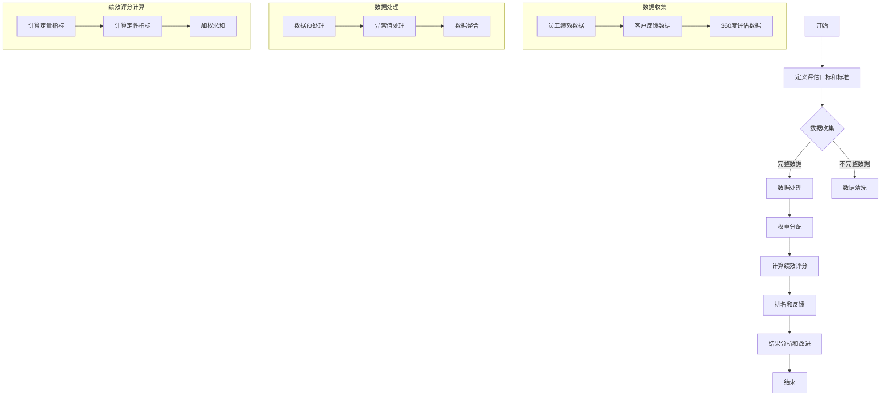

                 

### 文章标题：公正的绩效评估：客观评价团队

#### 关键词：绩效评估、公正性、团队管理、算法、案例分析

> 摘要：本文深入探讨了绩效评估的核心概念、公正性的重要性以及如何在团队管理中实施公正的绩效评估。文章首先概述了绩效评估的定义和目的，接着分析了公正绩效评估的挑战和理论基础。随后，文章详细介绍了绩效评估的核心算法原理，并通过实际案例展示了绩效评估系统的设计与实现。最后，文章探讨了绩效评估在团队管理和企业决策中的应用，并展望了其未来的发展趋势。

### 目录大纲：

#### 第一部分：理论基础

##### 第1章：绩效评估的概述
1.1 绩效评估的定义与目的
1.2 绩效评估的分类与类型
1.3 公正绩效评估的挑战与问题

##### 第2章：公正绩效评估的理论基础
2.1 效率与公平的权衡
2.2 数学模型与算法
2.3 Mermaid流程图：公正绩效评估的流程

##### 第3章：绩效评估的核心算法原理
3.1 算法概述
3.2 伪代码：公正绩效评估算法实现
3.3 数学模型和公式

#### 第二部分：实践应用

##### 第4章：绩效评估系统的设计与实现
4.1 系统设计原则
4.2 系统实现
4.3 项目实战案例

##### 第5章：绩效评估在团队管理中的应用
5.1 团队绩效评估的关键要素
5.2 实际案例研究
5.3 团队绩效评估的改进策略

##### 第6章：绩效评估在企业决策中的应用
6.1 绩效评估与企业战略
6.2 绩效评估在人力资源中的应用
6.3 企业绩效评估案例分析

##### 第7章：绩效评估的未来发展趋势
7.1 新技术对绩效评估的影响
7.2 绩效评估的发展趋势
7.3 绩效评估的未来展望

#### 第三部分：案例分析

##### 第8章：案例分析与讨论
8.1 案例一：企业绩效评估实践
8.2 案例二：跨国公司绩效评估

##### 附录：最佳实践 tips、小结、注意事项、拓展阅读

### 引言

在现代社会，绩效评估作为一种重要的管理工具，广泛应用于各个领域。无论是企业、政府部门，还是非营利组织，都需要对团队成员的工作表现进行公正、客观的评价。然而，公正的绩效评估并非易事。在现实中，我们常常面临诸多挑战，如主观偏见、数据质量不高、评估指标不明确等。这些问题不仅影响评估结果的准确性，更可能导致员工士气下降、团队协作受阻。

本文旨在探讨公正的绩效评估，通过深入分析其理论基础和实践应用，为团队管理者提供有价值的参考。我们将首先概述绩效评估的定义和目的，然后探讨公正绩效评估的挑战与问题，接着介绍公正绩效评估的理论基础和核心算法原理。随后，我们将通过实际案例展示绩效评估系统的设计与实现，探讨其在团队管理和企业决策中的应用。最后，我们将展望绩效评估的未来发展趋势，为读者提供更广阔的视野。

希望通过本文的探讨，读者能够对公正的绩效评估有更深入的理解，从而在实践中更好地应对各种挑战，实现团队的高效管理和企业的持续发展。

#### 第一部分：理论基础

##### 第1章：绩效评估的概述

绩效评估是一种系统性、周期性评价员工工作表现的过程，其核心目的是通过客观、公正的评价，激励员工提高工作效率和质量，推动团队和组织的持续发展。绩效评估不仅关注员工的个人表现，还考虑其在团队协作中的角色和贡献。

**1.1 绩效评估的定义与目的**

绩效评估的定义有多种，但核心要素基本一致。绩效评估可以定义为：对员工在一定时期内的业绩、工作态度、能力和潜力进行全面、客观、公正的评价。其目的是通过科学、合理的评估方法，为员工提供明确的绩效反馈，帮助员工了解自己的优势和不足，进而实现自我提升。同时，绩效评估也为企业提供了重要的管理工具，有助于优化人力资源配置，提高整体工作效率。

绩效评估的主要目的包括：

1. **激励员工**：通过公正的评价，激发员工的积极性和创造力，提高工作满意度和忠诚度。
2. **优化管理**：帮助管理层了解员工的工作表现，发现潜在问题，优化管理策略。
3. **人才培养**：通过评估，发现和培养有潜力的员工，为他们提供职业发展机会。
4. **薪酬管理**：绩效评估是薪酬分配的重要依据，确保薪酬与员工的工作表现相匹配。

**1.2 绩效评估的起源与发展**

绩效评估的起源可以追溯到19世纪末20世纪初的工业革命时期。随着企业规模的扩大和管理复杂度的增加，企业开始探索科学、系统的方法来评价员工的工作表现。早期的绩效评估主要依赖于上级的观察和主观评价，存在很大的主观性和不公平性。

20世纪初，泰勒的科学管理理论和马斯洛的需求层次理论对绩效评估的发展产生了重要影响。泰勒提出通过工作分析和时间研究来量化工作表现，为绩效评估提供了科学依据。马斯洛的需求层次理论则强调了员工的自我实现需求，提示管理者在评估员工时要关注其个人成长和职业发展。

20世纪70年代，随着信息技术的快速发展，绩效评估工具和方法逐渐多样化。例如，360度评估、关键绩效指标（KPI）等新型评估方法被广泛应用。这些方法更加注重多维度、全方位地评价员工的工作表现，提高了评估的客观性和全面性。

**1.3 绩效评估的核心概念**

绩效评估涉及多个核心概念，包括绩效目标、绩效指标、评估标准和评估结果等。

1. **绩效目标**：绩效目标是评估的基准，通常由员工和上级共同制定，明确员工在一定时期内需要达成的具体目标。

2. **绩效指标**：绩效指标是衡量绩效目标实现程度的具体指标，可以是定量指标（如销售额、生产量等）或定性指标（如团队合作、创新能力等）。

3. **评估标准**：评估标准是衡量绩效指标的标准，通常包括量化标准（如完成任务的百分比）和定性标准（如工作质量、工作效率等）。

4. **评估结果**：评估结果是绩效评估的最终输出，包括对员工绩效的评分、评语和建议等。

**1.4 公正绩效评估的重要性**

公正的绩效评估是确保团队和组织健康发展的关键。公正性主要体现在以下几个方面：

1. **减少偏见**：公正的绩效评估能够减少评估过程中的主观偏见，提高评估结果的客观性。

2. **激励员工**：公正的评估能够激励员工，提高其工作积极性和忠诚度。

3. **优化管理**：公正的绩效评估有助于管理层了解员工的真实表现，优化管理策略。

4. **提升组织文化**：公正的绩效评估有助于建立公平、透明的组织文化，增强员工的归属感和认同感。

**总结**

绩效评估作为一种重要的管理工具，在团队和组织管理中发挥着至关重要的作用。通过科学、系统的绩效评估，企业可以更好地激励员工、优化管理、培养人才，从而实现持续发展。在接下来的章节中，我们将深入探讨公正绩效评估的理论基础和核心算法原理，为实践中的应用提供理论支持。

### 1.2 绩效评估的分类与类型

绩效评估的方法和类型多种多样，每种方法都有其独特的特点和适用场景。了解不同类型的绩效评估，有助于团队管理者根据具体情况选择最合适的评估方式，从而提高评估的公正性和有效性。

**1.2.1 绩效评估的基本分类**

1. **按评估周期分类**

   - **年度绩效评估**：这是最常见的评估类型，通常在每年的年末进行。年度绩效评估能够全面回顾员工一年的工作表现，为员工的晋升和薪酬调整提供依据。
   - **季度绩效评估**：季度绩效评估能够更频繁地跟踪员工的工作表现，及时发现问题并进行调整。这种评估方式适用于工作变化较快、需要快速响应的市场环境。
   - **月度绩效评估**：月度绩效评估能够提供更细致的工作反馈，有助于员工及时调整工作策略，提升绩效。

2. **按评估对象分类**

   - **个人绩效评估**：个人绩效评估主要针对单个员工，评估其工作表现、能力和潜力。这种评估方式适用于个体工作成果明显、职责明确的岗位。
   - **团队绩效评估**：团队绩效评估关注整个团队的工作表现，包括团队目标的完成情况、团队协作效果和团队成员的相互支持。这种评估方式适用于团队项目或团队运作的岗位。
   - **组织绩效评估**：组织绩效评估关注整个组织的运营状况，包括战略目标的实现、业务绩效和员工满意度等。这种评估方式适用于企业高层管理者。

**1.2.2 不同类型绩效评估的优缺点**

1. **年度绩效评估**

   - 优点：

     - **全面性**：年度绩效评估能够全面回顾员工一年的工作表现，为员工的职业发展提供全面的反馈。
     - **公正性**：由于评估周期较长，年度绩效评估能够减少短期工作波动对评估结果的影响，提高评估的公正性。

   - 缺点：

     - **滞后性**：年度绩效评估的周期较长，无法及时反馈员工的工作表现，不利于快速调整工作策略。
     - **主观性**：由于评估周期较长，员工的工作表现容易受到主观因素的影响，导致评估结果不够客观。

2. **季度绩效评估**

   - 优点：

     - **及时性**：季度绩效评估能够及时反馈员工的工作表现，帮助员工及时发现问题并进行调整。
     - **灵活性**：季度绩效评估的周期较短，评估指标可以更加灵活地调整，以适应市场变化和工作需求。

   - 缺点：

     - **主观性**：季度绩效评估的周期较短，评估结果容易受到短期工作波动的影响，增加主观偏见。
     - **负担重**：由于需要频繁进行评估，团队管理者可能会感到负担过重，影响工作效率。

3. **月度绩效评估**

   - 优点：

     - **细致性**：月度绩效评估能够提供更细致的工作反馈，帮助员工及时调整工作策略。
     - **激励性**：月度绩效评估能够及时奖励表现优秀的员工，提高工作积极性和满意度。

   - 缺点：

     - **频繁性**：月度绩效评估的频率较高，可能会增加管理者的工作负担，影响评估的公正性。
     - **压力**：频繁的评估可能会给员工带来较大的工作压力，影响工作效率和团队氛围。

**1.2.3 绩效评估方法的选择**

选择合适的绩效评估方法，需要考虑多个因素，包括企业战略、组织文化、工作性质、员工特征等。

1. **企业战略**：企业的战略目标和业务模式会影响绩效评估方法的选择。例如，对于以创新为主要竞争力的企业，可以采用更加灵活、动态的评估方法，如季度或月度绩效评估；对于以稳定运营为主的企业，可以采用年度绩效评估。

2. **组织文化**：组织文化也会影响绩效评估方法的选择。例如，在注重公平、透明的组织文化中，可以采用360度评估等方法，增加评估的公正性；在注重绩效导向的组织文化中，可以采用关键绩效指标（KPI）等量化评估方法。

3. **工作性质**：不同岗位的工作性质会影响评估方法的选择。例如，对于以结果为导向的岗位，可以采用基于业绩的评估方法；对于以过程为导向的岗位，可以采用基于工作过程的评估方法。

4. **员工特征**：员工的个人特点和能力也会影响评估方法的选择。例如，对于工作表现波动较大的员工，可以采用更加灵活的评估方法；对于工作表现稳定的员工，可以采用更加量化的评估方法。

**总结**

绩效评估的类型多种多样，每种评估方法都有其独特的优缺点和适用场景。团队管理者需要根据企业战略、组织文化、工作性质和员工特征等多种因素，选择最合适的绩效评估方法，以提高评估的公正性和有效性。在接下来的章节中，我们将继续探讨公正绩效评估的挑战和理论基础，为实践中的应用提供更加深入的指导。

### 1.3 公正绩效评估的挑战与问题

公正绩效评估是一个复杂而具有挑战性的过程，其实现不仅需要科学的方法和工具，还面临诸多现实问题和挑战。

**1.3.1 主观偏见与误差**

主观偏见是绩效评估中最常见的问题之一。评估者往往受个人经验、情感、偏见等因素的影响，导致评估结果不准确。例如，有些评估者可能更倾向于给熟悉的员工更高的评分，而忽视其他员工的实际表现。这种主观偏见不仅影响评估的公正性，还可能引发员工的不满和质疑。

为了减少主观偏见，可以采取以下措施：

1. **标准化评估流程**：制定统一的评估标准和流程，确保所有员工都按照相同的标准进行评估。
2. **匿名评估**：减少评估者与被评估者之间的直接接触，使用匿名评估工具，以降低主观偏见的影响。
3. **多角度评估**：采用360度评估方法，从多个角度收集评估信息，减少单一评估者的主观影响。

**1.3.2 数据质量与可靠性**

绩效评估依赖于准确的数据和信息。然而，在实际情况中，数据质量常常存在问题。数据的不完整、不准确或过时，都会影响评估的准确性和公正性。例如，如果关键绩效指标（KPI）的数据采集存在偏差，那么基于这些数据的评估结果也会受到影响。

为了提高数据质量和可靠性，可以采取以下措施：

1. **数据标准化**：制定统一的数据标准和格式，确保数据的准确性和一致性。
2. **实时数据采集**：采用实时数据采集工具，确保数据的及时性和准确性。
3. **数据审核与验证**：对数据进行定期审核和验证，确保数据的真实性和可靠性。

**1.3.3 绩效评估的公平性**

公平性是公正绩效评估的核心要求。然而，在现实操作中，绩效评估的公平性常常受到质疑。例如，不同部门或岗位之间的绩效评估标准可能不一致，导致评估结果出现偏差。此外，评估过程中的信息透明度不足，也可能导致员工对评估结果产生不公平感。

为了提高绩效评估的公平性，可以采取以下措施：

1. **明确评估标准**：制定明确的评估标准和指标，确保所有员工都按照相同的标准进行评估。
2. **透明评估过程**：公开评估过程和结果，增加评估的透明度，提高员工的信任感和参与度。
3. **多渠道反馈**：鼓励员工通过多种渠道反馈对评估结果的看法和建议，确保评估的公正性和合理性。

**1.3.4 绩效评估的可持续性**

绩效评估不仅是一个短期行为，更应该是一个持续的过程。然而，在实际操作中，绩效评估常常被看作是一次性的事件，导致评估结果无法真正反映员工的长期表现和潜力。例如，一些企业在年终进行绩效评估后，很少对评估结果进行跟踪和反馈，导致员工无法及时调整和改进。

为了提高绩效评估的可持续性，可以采取以下措施：

1. **定期反馈与跟进**：对评估结果进行定期反馈和跟进，帮助员工了解自己的表现，制定改进计划。
2. **持续培训与支持**：为员工提供持续的培训和发展机会，帮助其提高工作能力和绩效水平。
3. **绩效评估与文化建设**：将绩效评估纳入组织文化的一部分，鼓励员工将评估结果作为自我提升的参考，形成持续改进的文化氛围。

**总结**

公正的绩效评估是实现团队高效管理和企业持续发展的重要保障。尽管面临诸多挑战，通过科学的方法和有效的措施，可以大大提高绩效评估的公正性和有效性。在接下来的章节中，我们将进一步探讨公正绩效评估的理论基础，为实践中的应用提供更加深入的指导。

### 2.1 效率与公平的权衡

在绩效评估中，效率和公平是一个关键的权衡问题。效率通常指的是评估过程的速度和效率，而公平则涉及评估结果的公正性和一致性。这两者之间的矛盾和平衡是绩效评估设计和实施中的核心挑战。

**2.1.1 效率优先与公平优先**

在绩效评估中，有时需要优先考虑效率，以确保评估过程能够迅速完成，并及时为员工提供反馈。例如，在快节奏的市场环境中，企业可能需要快速评估员工的表现，以便及时调整策略和资源。然而，效率优先可能导致评估结果的片面性和不公正，因为快速评估往往无法充分考虑到员工的多样性和复杂性。

另一方面，公平优先则强调评估结果的公正性和全面性。这种做法有助于减少主观偏见和歧视，确保每位员工的贡献都得到公平的评价。然而，公平优先的评估过程可能需要更多的时间和资源，从而降低评估的效率。

**2.1.2 效率和公平的关系**

效率和公平在绩效评估中并非完全对立，而是相互关联和相互影响的。有效的绩效评估需要在效率和公平之间找到平衡点。

1. **互为前提**：公平是效率的前提。一个不公平的评估过程，即使效率再高，也无法得到员工的认同和信任，从而影响评估的实际效果。同样，一个低效的评估过程，即使结果看似公平，也无法及时为员工提供有效的反馈和支持。

2. **相互促进**：高效率的评估可以确保公平原则得到有效实施，减少评估过程中的时间延误和资源浪费。而公平的评估结果则可以激励员工，提高其工作效率和创造力。

**2.1.3 公正绩效评估的目标**

公正绩效评估的目标是在确保评估结果公正、透明和可信的同时，最大限度地提高评估的效率。为了实现这一目标，可以采取以下策略：

1. **标准化流程**：制定统一的评估流程和标准，确保所有员工都按照相同的标准进行评估，减少主观偏见和误差。

2. **多维度评估**：采用多维度、全方位的评估方法，从多个角度和层面全面评价员工的表现，提高评估的全面性和准确性。

3. **数据驱动**：基于客观的数据和事实进行评估，减少主观判断和偏见的影响，确保评估结果的客观性和公正性。

4. **透明反馈**：公开评估过程和结果，增加评估的透明度和透明度，提高员工的信任感和参与度。

5. **持续改进**：建立持续改进机制，定期评估和优化评估流程，确保评估方法与企业的战略目标和员工的发展需求保持一致。

**总结**

效率和公平是绩效评估中不可忽视的两个方面。通过在效率和公平之间找到平衡点，制定科学、合理的评估策略，可以确保绩效评估的公正性和有效性，从而实现团队的高效管理和企业的持续发展。在接下来的章节中，我们将深入探讨公正绩效评估的数学模型与算法，进一步了解如何通过技术和工具实现公正的绩效评估。

### 2.2 数学模型与算法

公正的绩效评估离不开科学、系统的数学模型与算法。这些模型和算法不仅为评估过程提供了理论依据，还通过量化分析和计算，提高了评估的客观性和准确性。

**2.2.1 绩效评估的数学模型**

绩效评估的数学模型通常基于以下几个核心概念：绩效指标、评估标准和评估结果。

1. **绩效指标**：绩效指标是衡量员工工作表现的具体指标，可以是定量的，如销售额、项目完成率；也可以是定性的，如团队合作、创新能力等。每个绩效指标都需要有明确的定义和度量方法。

2. **评估标准**：评估标准是衡量绩效指标的标准，通常包括量化标准和定性标准。量化标准如任务的完成百分比、工作质量评分；定性标准如员工的工作态度、团队合作能力等。

3. **评估结果**：评估结果是对员工绩效的最终评分，通常通过综合多个绩效指标和评估标准得出。评估结果可以是一个分数、等级或排名，用于反映员工的工作表现。

**2.2.2 公正绩效评估的算法**

公正绩效评估的算法旨在通过数学模型和计算方法，减少主观偏见和误差，提高评估的公正性和准确性。以下是一些常用的算法：

1. **关键绩效指标（KPI）**：KPI是一种基于定量数据的评估方法，通过设定具体的绩效目标和指标，对员工的工作表现进行量化评估。KPI算法的核心是确定合适的绩效指标和权重，确保评估结果的全面性和准确性。

2. **平衡计分卡（BSC）**：BSC是一种基于多维度绩效评估的方法，从财务、客户、内部流程、学习与成长四个维度设定绩效指标，全面评价员工的工作表现。BSC算法注重平衡不同维度的绩效指标，确保评估结果的公正性和全面性。

3. **360度评估**：360度评估是一种基于多角度、多层次的评估方法，通过收集来自上级、同事、下属和客户的评估信息，全面了解员工的工作表现。360度评估算法的关键是确保评估信息的全面性和真实性，减少主观偏见。

4. **基于分数的评估算法**：这类算法通过设定不同的分数区间和标准，对员工的绩效进行打分。常用的算法包括百分制、五级制等。基于分数的评估算法需要确保评分标准的明确性和一致性，以避免主观偏见。

**2.2.3 公正绩效评估算法的优化**

为了进一步提高公正绩效评估的准确性，可以对评估算法进行优化。以下是一些常见的优化方法：

1. **数据清洗**：对评估数据进行清洗，去除异常值和噪声数据，提高数据的质量和可靠性。

2. **权重分配**：根据绩效指标的重要性和员工的工作特点，合理分配评估权重，确保评估结果的公平性和准确性。

3. **算法调整**：根据评估结果和反馈，不断调整和优化评估算法，提高评估的准确性和公正性。

4. **模型评估**：定期对评估模型进行评估，通过交叉验证和测试，确保模型的可靠性和有效性。

**总结**

数学模型和算法在公正的绩效评估中起着至关重要的作用。通过科学、系统的模型和算法，可以大大提高评估的客观性和准确性，减少主观偏见和误差。在接下来的章节中，我们将通过Mermaid流程图，详细展示公正绩效评估的流程，进一步理解评估过程的关键步骤和实现方法。

### 2.3 Mermaid流程图：公正绩效评估的流程

为了更直观地展示公正绩效评估的流程，我们可以使用Mermaid语言绘制一个流程图。以下是一个简化的公正绩效评估流程：



**流程说明：**

1. **定义评估目标和标准**：这是绩效评估的起点，需要明确评估的目标和标准，包括绩效指标、评估方法和评估周期。

2. **数据收集**：根据评估目标和标准，收集相关数据。数据来源可能包括员工绩效数据、客户反馈和360度评估数据。

3. **数据处理**：对收集到的数据进行处理，包括数据预处理、异常值处理和数据整合。这一步骤确保数据的质量和可靠性。

4. **权重分配**：根据绩效指标的重要性和员工的职责，合理分配评估权重，确保评估结果的公平性和准确性。

5. **计算绩效评分**：利用数学模型和算法，计算每位员工的绩效评分。这一步骤可能包括计算定量指标和定性指标，并进行加权求和。

6. **排名和反馈**：根据绩效评分，对员工进行排名，并提供详细的反馈。这一步骤有助于员工了解自己的工作表现，明确改进方向。

7. **结果分析和改进**：对评估结果进行深入分析，识别问题和改进机会。这一步骤有助于优化评估过程和提升整体绩效。

通过以上流程，我们可以看到，公正的绩效评估是一个系统化的过程，涉及多个环节和步骤。通过科学的方法和工具，可以大大提高评估的公正性和有效性，为团队管理和企业发展提供有力支持。

### 3.1 算法概述

在绩效评估中，选择合适的算法至关重要。不同的算法适用于不同类型的绩效评估需求，因此理解各种算法的特点和适用场景对于确保评估的公正性和准确性至关重要。

**3.1.1 常见绩效评估算法**

以下是几种常见用于绩效评估的算法：

1. **关键绩效指标（KPI）**：KPI是一种基于关键绩效指标来评估员工工作表现的方法。它通过设定具体的、可量化的目标，来衡量员工在工作中的表现。例如，一个销售团队的KPI可能包括销售额、客户满意度、销售增长率等。

2. **平衡计分卡（BSC）**：BSC是一种多维度的绩效评估方法，它从财务、客户、内部流程、学习与成长四个维度设定绩效指标，以确保评估的全面性和平衡性。每个维度都有若干具体的KPI，它们共同构成了一个完整的评估体系。

3. **360度评估**：360度评估是一种多角度的评估方法，它收集来自上级、同事、下属和客户的评估信息，以全面了解员工的工作表现。这种方法通过多角度的评价，减少了单一评估者的主观偏见，提高了评估的客观性。

4. **基于项目的评估**：基于项目的评估方法专注于评估员工在特定项目中的表现。这种方法通过设定明确的项目目标和评估指标，对员工在项目中的贡献进行评估。

5. **行为导向评估**：行为导向评估方法侧重于评估员工的工作行为和表现。这种方法通过设定具体的行为标准，对员工的行为进行评价，以激励员工改进工作表现。

**3.1.2 算法的选择依据**

选择适合的绩效评估算法需要考虑以下几个因素：

1. **评估目的**：不同的评估目的需要不同类型的算法。例如，如果目的是激励员工，可能需要选择更注重员工行为和表现的评估方法；如果目的是优化团队结构，可能需要选择更注重团队整体绩效的评估方法。

2. **组织文化**：组织文化会影响评估算法的选择。在注重透明和公正的组织文化中，可能更倾向于使用360度评估等透明度较高的评估方法；在注重效率和结果的组织文化中，可能更倾向于使用KPI等结果导向的评估方法。

3. **工作性质**：不同岗位的工作性质决定了适合的评估方法。例如，对于以结果为导向的岗位，如销售、研发等，KPI和基于项目的评估方法可能更为适用；对于以过程为导向的岗位，如客服、运营等，行为导向评估可能更为合适。

4. **资源与时间**：评估算法的选择也需要考虑组织的资源与时间限制。一些复杂的评估算法可能需要更多的资源和时间进行实施，而简单的评估方法可能更适合资源有限的情况。

**3.1.3 算法的性能评估**

评估算法的性能是确保绩效评估有效性的关键。以下是一些常用的性能评估指标：

1. **准确性**：算法能够准确反映员工的真实工作表现。
2. **可靠性**：算法在不同时间和不同评估者之间能够保持一致性。
3. **公平性**：算法能够公平对待不同背景和能力的员工，减少偏见和歧视。
4. **易用性**：算法易于理解和操作，不需要过多的专业知识和培训。
5. **灵活性**：算法能够适应不同的评估需求和变化。

通过综合考虑以上因素，组织可以选择最适合自己的绩效评估算法，从而确保评估的公正性和有效性。在接下来的章节中，我们将通过伪代码详细描述公正绩效评估算法的实现，进一步了解其具体操作步骤和数学模型。

### 3.2 伪代码：公正绩效评估算法实现

为了更清晰地展示公正绩效评估算法的实现过程，我们可以使用伪代码来描述其基本步骤和数学模型。以下是一个简化的公正绩效评估算法的伪代码：

```plaintext
算法名称：公正绩效评估（公正评估）

输入：
- 员工绩效数据（P）
- 客户反馈数据（C）
- 同事评估数据（E）
- 上级评估数据（M）
- 绩效指标权重（W）

输出：
- 绩效评估结果（R）

步骤：
1. 数据预处理
   - 清洗数据，去除异常值和噪声数据
   - 标准化数据，确保不同数据源之间的可比性

2. 权重分配
   - 根据绩效指标的重要性和评估者的权威性，分配权重
   - W = (W_P, W_C, W_E, W_M)

3. 绩效评分计算
   - P' = P * W_P
   - C' = C * W_C
   - E' = E * W_E
   - M' = M * W_M
   - 总评分 = P' + C' + E' + M'

4. 绩效排名
   - 根据总评分对员工进行排名
   - R = 排序（总评分）

5. 结果分析与反馈
   - 对排名结果进行分析，识别优势和不足
   - 提供详细的绩效反馈，帮助员工了解自己的表现和改进方向

伪代码详细说明：

1. **数据预处理**：
   - 清洗数据：使用适当的算法和工具去除异常值和噪声数据，例如使用中值滤波或统计分析方法。
   - 标准化数据：对来自不同数据源的数据进行标准化处理，例如使用Z分数或Min-Max标准化方法，确保数据具有可比性。

2. **权重分配**：
   - 根据绩效指标的重要性和评估者的权威性，为每个数据源分配权重。权重的分配可以根据组织文化、岗位性质和评估者的专业能力进行灵活调整。
   - 权重分配公式：W = (W_P, W_C, W_E, W_M)，其中W_P、W_C、W_E、W_M分别表示员工绩效数据、客户反馈数据、同事评估数据和上级评估数据的权重。

3. **绩效评分计算**：
   - 使用加权求和法计算每个员工的综合评分。具体公式如下：
     - 总评分 = P' + C' + E' + M'
     - 其中，P'、C'、E'、M'分别表示经过权重调整后的员工绩效数据、客户反馈数据、同事评估数据和上级评估数据。

4. **绩效排名**：
   - 根据总评分对员工进行排名，生成绩效评估结果（R）。
   - 排序方法可以使用快速排序、堆排序或其他高效的排序算法。

5. **结果分析与反馈**：
   - 对排名结果进行深入分析，识别员工的优势和不足。
   - 提供详细的绩效反馈，帮助员工了解自己的工作表现，明确改进方向。

通过以上伪代码，我们可以看到公正绩效评估算法的基本步骤和数学模型。该算法通过多维度、多角度的数据收集和加权求和处理，提高了绩效评估的客观性和准确性，从而确保评估结果的公正性。在实际应用中，可以根据具体需求和数据特性，对算法进行优化和调整。

### 3.3 数学模型和公式

公正绩效评估的数学模型和公式是确保评估结果准确性和公正性的关键。以下我们将详细讲解绩效评估中的主要数学模型和公式，并附以具体示例。

**3.3.1 成本效益分析**

成本效益分析是一种评估绩效评估方法有效性的工具。它通过比较绩效评估的总成本与预期效益，来判断该方法是否值得采用。具体公式如下：

$$
CBE = \frac{EB - EC}{EC}
$$

其中：
- $CBE$：成本效益比
- $EB$：预期效益
- $EC$：总成本

**示例**：
假设某企业实施了一项新的绩效评估方法，总成本为100,000元。通过评估，企业预计能够提升工作效率，从而增加年利润10,000元。则成本效益比为：

$$
CBE = \frac{10,000 - 100,000}{100,000} = -0.9
$$

由于成本效益比为负，说明该方法可能不具经济效益，需要进一步评估和优化。

**3.3.2 优化目标函数**

在绩效评估中，优化目标函数是一种常见的方法，用于最大化绩效评估的准确性。目标函数通常包括评估指标权重、评估结果和误差等。以下是一个简化的优化目标函数：

$$
\min \sum_{i=1}^{n} (\omega_i \cdot P_i - R_i)^2
$$

其中：
- $n$：绩效指标的数量
- $\omega_i$：第$i$个绩效指标的权重
- $P_i$：第$i$个绩效指标的得分
- $R_i$：第$i$个绩效指标的理想得分

**示例**：
假设有3个绩效指标（A、B、C），权重分别为0.3、0.4和0.3。员工A在这三个指标上的得分分别为80、70和85。理想得分分别为90、80和90。则优化目标函数为：

$$
\min (0.3 \cdot (80 - 90)^2 + 0.4 \cdot (70 - 80)^2 + 0.3 \cdot (85 - 90)^2)
$$

计算得到最小值为3.6，表示评估结果与理想值的差距。

**3.3.3 性能评估指标**

性能评估指标是衡量绩效评估方法有效性的重要工具。以下是一些常见的性能评估指标：

1. **准确性**：评估结果与实际表现的一致性。公式如下：

$$
Accuracy = \frac{TP + TN}{TP + TN + FP + FN}
$$

其中：
- $TP$：真正例
- $TN$：真负例
- $FP$：假正例
- $FN$：假负例

**示例**：
假设有10个员工，其中8个表现优秀，2个表现不佳。通过绩效评估，有7个员工被正确评估为优秀，1个被错误评估为优秀（FP），2个被错误评估为不佳（FN）。则准确性为：

$$
Accuracy = \frac{7 + 2}{7 + 1 + 1 + 2} = 0.82
$$

2. **公平性**：评估结果对不同背景和能力的员工是否公平。公式如下：

$$
Fairness = \frac{\sum_{i=1}^{n} (S_i - E_i)^2}{n}
$$

其中：
- $S_i$：第$i$个员工的实际绩效得分
- $E_i$：第$i$个员工的理论绩效得分

**示例**：
假设有5个员工，他们的实际得分分别为90、85、75、80、70，理论得分分别为90、85、75、85、75。则公平性为：

$$
Fairness = \frac{(90 - 90)^2 + (85 - 85)^2 + (75 - 75)^2 + (80 - 85)^2 + (70 - 75)^2}{5} = 2
$$

通过这些数学模型和公式，我们可以在绩效评估中实现科学的分析和优化，确保评估结果的准确性和公正性。在实际应用中，可以根据具体需求和数据特性，灵活调整和优化这些模型和公式，以实现最佳效果。

### 第4章：绩效评估系统的设计与实现

#### 4.1 系统设计原则

绩效评估系统是确保公正评估的重要工具，其设计原则直接影响评估的效率和公正性。以下是绩效评估系统设计过程中应遵循的原则：

**1. 一致性**：系统设计应确保评估标准和流程的一致性，避免因评估者不同而导致评估结果的不一致。

**2. 可扩展性**：系统设计应具备良好的扩展性，以便根据组织规模和业务需求的变动，灵活调整评估指标和流程。

**3. 易用性**：系统界面设计应简洁直观，确保评估者和被评估者都能轻松操作，提高评估效率。

**4. 数据安全**：系统设计应充分考虑数据安全，确保评估数据在收集、存储和处理过程中得到充分保护。

**5. 反馈机制**：系统应具备完善的反馈机制，及时向评估者和被评估者提供评估结果和改进建议。

**6. 报告功能**：系统应能够生成详细的评估报告，包括绩效得分、排名和改进建议，帮助管理层了解整体绩效状况。

**7. 适应性**：系统设计应具备较强的适应性，能够根据不同岗位和工作性质，灵活调整评估指标和评估周期。

#### 4.2 系统实现

**4.2.1 开发环境搭建**

在搭建绩效评估系统之前，需要选择合适的开发环境和工具。以下是常见的开发环境和工具选择：

1. **编程语言**：可以选择Java、Python或JavaScript等流行的编程语言。Java和Python具有较好的稳定性和扩展性，适合大型系统开发；JavaScript则适合Web前端开发。

2. **数据库**：可以选择MySQL、PostgreSQL或MongoDB等关系型或非关系型数据库。关系型数据库适合结构化数据的存储和管理，非关系型数据库则更适合处理大量非结构化数据。

3. **开发框架**：可以选择Spring Boot、Django或React等开发框架。Spring Boot和Django具有较好的企业级开发能力，React则适合Web前端开发。

4. **版本控制**：可以使用Git进行版本控制，确保代码的版本管理和协作开发。

**4.2.2 数据收集与处理**

绩效评估系统的核心功能之一是数据的收集和处理。以下是数据收集与处理的主要步骤：

1. **数据收集**：通过多种渠道收集绩效数据，包括员工自评、上级评价、同事评价和客户反馈等。可以使用Web表单、移动应用或邮件等方式，方便员工提交数据。

2. **数据清洗**：对收集到的数据进行清洗，去除重复数据、异常值和噪声数据。可以使用数据预处理工具，如Pandas（Python）或Spark（Scala）。

3. **数据存储**：将清洗后的数据存储到数据库中。可以使用ORM（对象关系映射）框架，如Hibernate（Java）或Django ORM（Python），简化数据操作。

4. **数据预处理**：对存储的数据进行预处理，包括数据格式转换、缺失值处理和标准化等。可以使用数据处理库，如NumPy（Python）或Pandas（Python）。

**4.2.3 绩效评估算法实现**

在实现绩效评估算法时，需要根据具体需求选择合适的算法和模型。以下是实现绩效评估算法的主要步骤：

1. **算法选择**：根据评估目标和数据特性，选择合适的评估算法，如关键绩效指标（KPI）、平衡计分卡（BSC）或360度评估等。

2. **算法实现**：使用编程语言和开发框架，实现所选算法的具体功能。例如，使用Java编写KPI评估算法，使用Python编写BSC评估算法。

3. **性能优化**：对评估算法进行性能优化，提高评估速度和准确性。可以使用并行计算、缓存技术和算法优化等方法。

**4.2.4 系统部署与测试**

在系统开发完成后，需要进行部署和测试，以确保系统的稳定性和可靠性。以下是系统部署与测试的主要步骤：

1. **部署**：将开发完成的系统部署到生产环境，可以使用Docker、Kubernetes等技术进行容器化部署。

2. **测试**：进行全面的系统测试，包括功能测试、性能测试、安全测试等。可以使用自动化测试工具，如Selenium、JMeter等。

3. **用户培训**：对系统用户进行培训，确保他们能够熟练使用系统，提高评估效率。

#### 4.3 项目实战案例

**4.3.1 项目背景**

某大型科技公司需要建立一个高效的绩效评估系统，以实现对员工工作表现的全面监控和评估。公司拥有数千名员工，分布在多个部门和项目组。评估系统的目标是提高员工的工作积极性，优化人力资源配置，促进公司整体发展。

**4.3.2 评估对象**

评估对象包括公司全体员工，评估周期为季度和年度。评估指标涵盖员工的工作表现、团队协作、项目完成情况和创新能力等。

**4.3.3 评估指标**

1. **工作表现**：包括任务完成率、工作质量、工作效率等。
2. **团队协作**：包括团队合作精神、跨部门协作、沟通能力等。
3. **项目完成情况**：包括项目进度、项目质量、项目成本控制等。
4. **创新能力**：包括创新项目数量、创新成果转化率、创新提案采纳率等。

**4.3.4 评估方法**

1. **360度评估**：收集员工上级、同事、下属和客户的评估意见，全面了解员工的工作表现。
2. **关键绩效指标（KPI）**：根据不同岗位的工作特点，设定具体的KPI，对员工的工作绩效进行量化评估。
3. **平衡计分卡（BSC）**：从财务、客户、内部流程、学习与成长四个维度，设定绩效指标，确保评估的全面性和平衡性。

**4.3.5 评估结果**

通过绩效评估系统，公司能够及时获取员工的评估结果，并进行分析和反馈。以下是某季度评估结果的一个示例：

1. **员工A**：工作表现优秀，任务完成率100%，工作效率高，创新能力强。
2. **员工B**：团队协作有待提高，需要加强与其他部门的沟通和协作。
3. **员工C**：项目完成情况较好，但工作质量有所下降，需要关注工作细节。

**4.3.6 评估结果的应用**

1. **员工晋升**：根据评估结果，公司为表现优秀的员工提供晋升机会。
2. **薪酬调整**：结合评估结果，对员工进行薪酬调整，确保薪酬与绩效相匹配。
3. **培训与发展**：根据评估结果和反馈，为员工提供有针对性的培训和发展计划，提高员工的能力和素质。

**4.3.7 项目小结**

通过绩效评估系统的实施，公司有效提高了员工的工作积极性和团队协作水平，优化了人力资源配置。评估结果的及时反馈和有效应用，为公司的持续发展提供了有力支持。在未来的工作中，公司将继续优化评估系统，确保其公正性和有效性。

### 第5章：绩效评估在团队管理中的应用

#### 5.1 团队绩效评估的关键要素

团队绩效评估是对整个团队工作表现进行系统性评价的过程，它不仅关注个人表现，更注重团队整体协作效率和成果。以下是团队绩效评估的关键要素：

**1. 团队目标**：明确团队的目标是评估的基础。团队目标应具体、可衡量，并与组织的战略目标相一致。目标设定应充分考虑团队的职责和资源，确保目标的可实现性。

**2. 绩效指标**：绩效指标是衡量团队工作表现的具体标准，包括定量指标和定性指标。定量指标如项目完成率、工作质量等，定性指标如团队合作、沟通效率等。绩效指标的选择应基于团队的具体任务和工作性质。

**3. 评估标准**：评估标准是衡量绩效指标的具体规则，包括评分范围、权重分配和评分方法等。评估标准应明确、透明，以确保评估的公正性和一致性。

**4. 数据收集**：数据收集是团队绩效评估的重要环节，数据来源包括团队成员的绩效报告、客户反馈、项目进度报告等。数据收集过程应确保数据的准确性和完整性。

**5. 评估周期**：评估周期是绩效评估的时间间隔，包括季度评估、年度评估等。评估周期应根据团队的工作性质和项目进展情况进行合理设定。

**6. 反馈机制**：反馈机制是确保团队绩效评估有效性的关键。通过及时的反馈，团队成员可以了解自己的工作表现，识别问题和改进方向。反馈机制应包括个人反馈、团队反馈和跨部门反馈等。

**7. 绩效改进**：绩效改进是团队绩效评估的核心目标之一。通过评估结果的分析，团队可以制定具体的改进计划和策略，提高工作效率和质量。

**5.2 实际案例研究**

**案例一：初创公司团队绩效评估**

某初创公司在其快速发展阶段，采用了定期的团队绩效评估机制，以监控团队的工作表现和进度。以下为该公司的评估流程：

1. **目标设定**：公司根据市场情况和战略规划，明确了团队的短期和长期目标，如项目上线时间、用户增长率等。

2. **绩效指标**：公司设定了关键绩效指标（KPI），包括项目完成率、用户满意度、市场推广效果等。这些指标反映了团队在不同阶段的工作重点。

3. **评估标准**：公司制定了明确的评估标准，如项目完成率达到90%以上为优秀，用户满意度达到85%以上为优秀。评估标准确保了评估的公正性和一致性。

4. **数据收集**：团队负责人定期收集项目进度报告、用户反馈和市场数据，确保数据的准确性和完整性。

5. **评估周期**：公司采用季度评估机制，每季度进行一次全面的绩效评估。

6. **反馈机制**：评估结果及时反馈给团队成员，团队负责人与团队成员一起分析评估结果，制定改进计划。

7. **绩效改进**：基于评估结果，团队制定了详细的改进计划，如加强市场推广、优化项目流程等，以提升团队的工作效率和成果。

通过这一系列的绩效评估和改进措施，该公司在短时间内实现了快速成长，项目成功上线，用户满意度持续提升。

**案例二：大型企业团队绩效评估**

某大型企业在长期运营中，建立了成熟的团队绩效评估体系，以持续优化团队管理和工作流程。以下为该公司的评估流程：

1. **目标设定**：公司根据年度战略目标和业务需求，设定了团队的短期和长期目标，如年度收入目标、市场份额目标等。

2. **绩效指标**：公司制定了包括财务指标、运营指标、客户指标等在内的多维度绩效指标，确保评估的全面性和准确性。

3. **评估标准**：公司制定了详细的评估标准，如年度收入目标完成率达到100%为优秀，运营效率提高5%为优秀。评估标准确保了评估的透明和公正。

4. **数据收集**：公司通过ERP系统、CRM系统和内部报告等渠道，收集团队的工作数据，确保数据的准确性和完整性。

5. **评估周期**：公司采用半年和年度评估机制，确保绩效评估的及时性和全面性。

6. **反馈机制**：评估结果通过内部邮件、会议和面对面沟通等方式，及时反馈给团队成员。公司鼓励团队成员积极参与反馈，提出改进建议。

7. **绩效改进**：基于评估结果，公司制定了详细的改进计划，如优化运营流程、加强市场推广、提升员工培训等，以持续提升团队的工作效率和绩效。

通过这一系列的绩效评估和改进措施，该企业实现了业务的稳步增长，团队协作效率显著提升，员工满意度持续提高。

**5.3 团队绩效评估的改进策略**

为了提高团队绩效评估的有效性，企业可以采取以下改进策略：

**1. 优化评估指标**：根据业务发展和团队需求，定期调整评估指标，确保指标的科学性和实用性。

**2. 提高数据质量**：加强数据收集和整理工作，确保数据的准确性和完整性，减少评估误差。

**3. 增强反馈机制**：建立完善的反馈机制，确保评估结果及时、准确地反馈给团队成员，促进改进。

**4. 加强培训与沟通**：为团队成员提供相关培训，提高其绩效评估的能力和意识，促进团队合作和沟通。

**5. 注重持续改进**：将绩效评估作为持续改进的工具，定期进行评估和反馈，确保评估机制与企业发展保持同步。

通过以上策略，企业可以不断提高团队绩效评估的科学性和有效性，推动团队和企业的共同发展。

### 第6章：绩效评估在企业决策中的应用

#### 6.1 绩效评估与企业战略

绩效评估不仅是员工管理和个人发展的工具，更是企业战略实施的重要组成部分。有效的绩效评估能够帮助企业实现战略目标，优化资源配置，提高整体竞争力。

**6.1.1 企业战略与绩效评估的关系**

企业战略是指企业在特定时期内，根据外部环境和内部资源，为实现长远发展目标所制定的一系列行动计划和资源配置方案。绩效评估是企业战略实施的重要手段，通过评估员工和团队的工作表现，企业能够了解战略执行的效果，及时调整策略和资源配置。

1. **目标一致性**：绩效评估的目标应与企业战略目标保持一致，确保员工的努力方向与企业的战略方向一致。
2. **资源分配**：通过绩效评估，企业能够识别表现优异的员工和团队，优先分配资源，支持其实现更高目标。
3. **风险管理**：绩效评估能够帮助企业发现潜在问题，及时采取纠正措施，降低战略实施过程中的风险。

**6.1.2 绩效评估在企业决策中的角色**

1. **招聘与选拔**：绩效评估结果可以用于评估候选人的能力和潜力，为企业招聘和选拔合适的人才提供依据。
2. **晋升与调动**：绩效评估能够客观评价员工的工作表现，为企业决定员工的晋升和调动提供科学依据。
3. **薪酬管理**：绩效评估是薪酬分配的重要依据，确保薪酬与员工的工作表现相匹配，激励员工提高绩效。
4. **培训与发展**：通过绩效评估，企业可以发现员工的技能短板，制定有针对性的培训计划，提升员工的能力和素质。
5. **流程优化**：绩效评估可以识别业务流程中的瓶颈和问题，为企业提供改进和优化的方向。

**6.1.3 绩效评估对企业管理的影响**

1. **提高员工绩效**：通过绩效评估，员工能够明确自己的工作目标和发展方向，激发工作积极性和创造力。
2. **优化资源配置**：绩效评估帮助企业识别优秀员工和团队，合理配置资源，提高资源利用效率。
3. **增强管理透明度**：绩效评估的过程和结果公开透明，增强了企业管理的公信力和员工的信任感。
4. **提升企业竞争力**：通过有效的绩效评估，企业能够持续改进管理流程和工作方法，提高整体竞争力。

**6.2 绩效评估在人力资源中的应用**

1. **招聘与选拔**：

   绩效评估是招聘和选拔的重要环节。通过评估候选人的绩效表现，企业可以更准确地判断其能力是否与职位要求相符。具体方法包括：

   - **背景调查**：对候选人的工作经历和业绩进行核实，确保信息的真实性。
   - **面试评估**：通过结构化面试，评估候选人的沟通能力、团队合作能力和解决问题的能力。
   - **绩效测试**：通过模拟工作场景，评估候选人在特定任务中的表现。

2. **晋升与调动**：

   绩效评估是决定员工晋升和调动的重要依据。通过绩效评估，企业可以识别表现优异的员工，为其提供晋升机会。具体方法包括：

   - **年度评估**：定期对员工的工作表现进行评估，评估结果作为晋升依据。
   - **360度评估**：收集来自上级、同事、下属和客户的评估意见，全面了解员工的工作表现。
   - **关键绩效指标（KPI）**：根据具体岗位的要求，设定关键绩效指标，评估员工的绩效表现。

3. **薪酬管理**：

   绩效评估是薪酬管理的重要依据。通过绩效评估，企业可以确保薪酬与员工的工作表现相匹配，激励员工提高绩效。具体方法包括：

   - **绩效奖金**：根据员工的绩效评估结果，发放相应的绩效奖金，激励员工努力工作。
   - **薪酬调整**：根据绩效评估结果，定期调整员工的薪酬水平，确保薪酬与市场水平相匹配。
   - **长期激励**：通过股票期权、年终奖等长期激励措施，留住优秀员工，提高其工作积极性。

4. **培训与发展**：

   绩效评估是员工培训与发展的重要依据。通过绩效评估，企业可以发现员工的技能短板，制定有针对性的培训计划，提升员工的能力和素质。具体方法包括：

   - **技能评估**：对员工的技能水平进行评估，识别需要提升的技能领域。
   - **培训需求分析**：根据绩效评估结果，分析员工的培训需求，制定培训计划。
   - **培训效果评估**：对培训效果进行评估，确保培训计划的实施效果。

**6.3 企业绩效评估案例分析**

**案例一：互联网公司绩效评估**

某互联网公司通过一系列创新的绩效评估方法，实现了员工绩效和企业战略的紧密结合。以下为该公司的评估流程：

1. **目标设定**：公司根据年度战略目标，设定了团队和个人的工作目标，如用户增长率、市场占有率等。
2. **绩效指标**：公司制定了包括财务指标、运营指标、客户指标等在内的多维度绩效指标，确保评估的全面性。
3. **评估标准**：公司制定了详细的评估标准，如用户增长率达到20%为优秀，产品上线时间提前一周为优秀。
4. **数据收集**：公司通过数据分析工具，收集了大量的用户数据、运营数据和销售数据，确保数据的准确性和完整性。
5. **评估周期**：公司采用季度和年度评估机制，确保绩效评估的及时性和全面性。
6. **反馈机制**：评估结果通过内部邮件、会议和面对面沟通等方式，及时反馈给团队成员。
7. **绩效改进**：基于评估结果，公司制定了详细的改进计划，如优化用户体验、提升产品功能等。

通过这一系列的绩效评估和改进措施，该公司实现了用户增长率的显著提升，市场占有率稳步增加，员工的工作积极性大幅提高。

**案例二：制造企业绩效评估**

某制造企业通过绩效评估，实现了生产效率的显著提升和成本的有效控制。以下为该公司的评估流程：

1. **目标设定**：公司根据年度生产目标和成本控制目标，设定了团队和个人的工作目标，如生产效率提高10%、成本降低5%等。
2. **绩效指标**：公司制定了包括生产效率、生产成本、质量控制等在内的关键绩效指标，确保评估的针对性。
3. **评估标准**：公司制定了详细的评估标准，如生产效率提高10%为优秀，质量控制合格率达到99%为优秀。
4. **数据收集**：公司通过生产监控系统，实时收集生产数据和成本数据，确保数据的准确性和完整性。
5. **评估周期**：公司采用月度和季度评估机制，确保绩效评估的及时性和全面性。
6. **反馈机制**：评估结果通过内部报告、会议和面对面沟通等方式，及时反馈给团队成员。
7. **绩效改进**：基于评估结果，公司制定了详细的改进计划，如优化生产流程、提升设备利用率等。

通过这一系列的绩效评估和改进措施，该公司的生产效率显著提高，成本控制效果显著，员工的工作积极性和团队合作精神大幅提升。

**6.4 最佳实践 tips**

1. **制定明确的评估目标**：确保绩效评估的目标与企业的战略目标相一致，避免目标不明确导致的资源浪费。
2. **选择合适的评估方法**：根据企业的业务特点和团队结构，选择适合的绩效评估方法，提高评估的准确性和公正性。
3. **数据驱动**：基于客观的数据进行评估，减少主观偏见和误差，提高评估的公正性和可信度。
4. **定期反馈与沟通**：及时反馈评估结果，与员工进行充分沟通，确保评估结果的公正性和员工的理解。
5. **持续改进**：将绩效评估作为持续改进的工具，定期评估和优化评估流程，确保评估机制与企业发展保持同步。

通过以上最佳实践，企业可以更好地利用绩效评估这一工具，实现战略目标，提高整体绩效，推动企业的持续发展。

### 第7章：绩效评估的未来发展趋势

#### 7.1 新技术对绩效评估的影响

随着技术的不断进步，绩效评估领域也迎来了新的变革。人工智能（AI）、大数据和云计算等新兴技术正在深刻影响绩效评估的流程和方法，使其更加精准、高效和智能化。

**7.1.1 人工智能在绩效评估中的应用**

人工智能技术在绩效评估中的应用主要体现在以下几个方面：

1. **自动化评估**：AI技术能够自动化处理和分析大量的评估数据，减少人工工作量，提高评估的效率。例如，通过自然语言处理（NLP）技术，AI可以自动分析员工的工作报告和反馈，提取关键信息进行评估。

2. **预测性分析**：基于机器学习算法，AI能够预测员工的未来绩效表现，为企业提供有针对性的培训和发展建议。例如，通过对历史绩效数据的学习，AI可以预测哪些员工可能会出现绩效问题，从而提前采取干预措施。

3. **个性化评估**：AI技术可以根据员工的个性、能力和工作表现，提供个性化的绩效评估方案。这种个性化评估不仅能够提高评估的准确性，还能增强员工的参与感和认同感。

**7.1.2 大数据与绩效评估**

大数据技术的应用使得绩效评估的数据来源更加广泛和多样化。以下是大数据在绩效评估中的应用：

1. **多维度数据收集**：大数据技术能够收集来自多个渠道的数据，如社交媒体、客户反馈、生产数据等，提供更全面、多维度的绩效评估依据。

2. **数据挖掘与分析**：通过对大数据的分析，企业可以发现员工绩效背后的规律和趋势，优化评估指标和标准。例如，通过分析员工的工作习惯和行为模式，企业可以识别出哪些因素对绩效有显著影响，从而调整评估策略。

3. **实时监控与反馈**：大数据技术能够实现实时监控和反馈，帮助企业快速识别问题和改进方向。例如，通过实时分析项目进度和员工行为数据，企业可以及时发现潜在的问题，并采取相应的措施。

**7.1.3 云计算与绩效评估**

云计算为绩效评估提供了强大的技术支撑，使得评估过程更加灵活和可扩展。以下是云计算在绩效评估中的应用：

1. **数据存储与处理**：云计算提供了海量的存储空间和强大的计算能力，能够存储和处理大量的评估数据，满足大规模绩效评估的需求。

2. **远程协作**：通过云计算平台，员工可以在任何地点和时间访问绩效评估系统，实现远程协作和反馈。这种远程协作不仅提高了评估的灵活性，还增强了团队的协作效率。

3. **安全与合规**：云计算平台提供了严格的数据安全措施和合规性保障，确保评估数据的保密性和完整性，符合相关法律法规的要求。

**7.2 绩效评估的发展趋势**

随着新技术的应用和不断发展，绩效评估也在不断演进，呈现出以下趋势：

**1. 持续化评估**

传统的绩效评估通常采用年度或季度的周期，而持续化评估则通过实时数据收集和分析，实现对员工工作表现的持续监控和反馈。这种评估方式不仅能够及时发现问题，还能为员工提供持续的学习和发展机会。

**2. 个性化评估**

随着AI技术的发展，绩效评估将更加注重个性化。通过分析员工的个性、能力和工作表现，个性化评估能够提供更符合员工需求的反馈和改进建议，提高评估的针对性和有效性。

**3. 全员参与**

未来的绩效评估将更加注重全员参与，鼓励员工积极参与评估过程，提供反馈和建议。这种全员参与的评估方式不仅能够增强员工的参与感和认同感，还能提高评估的公正性和透明度。

**4. 数据驱动的决策**

大数据和AI技术的应用，使得绩效评估更加数据驱动。通过收集和分析大量数据，企业可以基于数据做出更加科学和合理的决策，提高绩效评估的准确性和可靠性。

**7.3 绩效评估的未来展望**

随着技术的不断进步和应用，绩效评估将变得更加智能、高效和全面。以下是绩效评估未来展望：

**1. 智能化评估**

通过AI技术，绩效评估将实现自动化和智能化，减少人为干预，提高评估的准确性和效率。例如，智能评估系统可以根据员工的工作表现，自动生成评估报告和改进建议。

**2. 个性化发展**

随着个性化评估的普及，绩效评估将更加注重员工的个人发展和职业规划。通过分析员工的个性、能力和工作表现，企业可以为员工提供个性化的培训和发展机会，促进其职业成长。

**3. 系统化管理**

未来的绩效评估将实现系统化管理，从数据收集、处理、分析到反馈，各个环节都高度集成和自动化。这种系统化管理不仅能够提高评估效率，还能确保评估过程的规范化和标准化。

**4. 社会责任**

随着企业社会责任意识的增强，绩效评估也将更多地关注员工的工作环境和福利。通过绩效评估，企业可以识别和解决员工面临的问题，促进企业的可持续发展。

**总结**

新技术为绩效评估带来了新的机遇和挑战。通过智能化、数据驱动和个性化评估，绩效评估将变得更加科学、高效和全面。未来，随着技术的不断进步和应用，绩效评估将在企业管理和员工发展中发挥更加重要的作用，推动企业实现持续发展和成功。

### 第8章：案例分析与讨论

#### 8.1 案例一：企业绩效评估实践

**8.1.1 案例背景**

某大型制造企业在全球范围内运营，拥有数千名员工和多个生产线。为了提高管理效率和员工绩效，公司决定引入一套科学的绩效评估系统。该公司希望通过绩效评估，激励员工提高工作效率，优化生产流程，并最终提升企业的整体竞争力。

**8.1.2 评估指标**

公司设定了以下关键绩效指标（KPI）作为评估标准：

1. **生产效率**：包括生产线的实际产出与计划产出的比率。
2. **质量控制**：包括产品不合格率、质量改进措施的实施效果等。
3. **成本控制**：包括生产成本与预算的对比、节能降耗效果等。
4. **员工满意度**：通过员工调查，了解员工对工作环境、薪酬福利、职业发展的满意度。
5. **团队合作**：包括跨部门协作效率、团队内部沟通效果等。

**8.1.3 评估方法**

公司采用360度评估方法，从多个角度收集员工的绩效数据。评估数据来源包括：

1. **上级评价**：上级对员工工作表现的直接评价。
2. **同事反馈**：同事对员工团队合作和沟通能力的评价。
3. **下属反馈**：下属对上级领导能力的评价。
4. **自我评价**：员工对自己的工作表现进行自我评估。
5. **客户反馈**：客户对产品和服务的满意度评价。

**8.1.4 评估结果与反馈**

经过评估，公司得出了以下结论：

1. **生产效率**：大部分生产线的产出率达到了计划水平，但仍有部分生产线存在效率不足的问题。
2. **质量控制**：整体质量合格率较高，但某些工序的不合格率较高，需要进一步优化。
3. **成本控制**：整体成本控制效果较好，但在某些环节仍存在浪费现象。
4. **员工满意度**：员工对工作环境和薪酬福利较为满意，但职业发展方面的反馈较为负面。
5. **团队合作**：团队协作效率较高，但跨部门沟通存在障碍。

基于评估结果，公司制定了以下改进措施：

1. **生产效率**：优化生产计划，加强设备维护，提高员工技能培训。
2. **质量控制**：加强质量检查，改进生产流程，提高不合格品的处理效率。
3. **成本控制**：开展节能降耗项目，优化成本结构，提高资源利用率。
4. **员工满意度**：加强员工职业发展规划，提供更多培训和发展机会。
5. **团队合作**：建立跨部门沟通机制，提高沟通效率，促进团队合作。

**8.1.5 案例小结**

通过绩效评估，公司能够全面了解员工和团队的工作表现，发现存在的问题，并采取针对性的改进措施。这一过程不仅提高了员工的工作效率和满意度，还优化了生产流程和成本结构，提升了企业的整体竞争力。

#### 8.2 案例二：跨国公司绩效评估

**8.2.1 案例背景**

某跨国公司在全球拥有多个分支机构，员工来自不同国家和地区，文化背景和语言各不相同。为了统一管理并提升全球团队的绩效，公司决定实施一套跨国性的绩效评估系统。公司希望通过绩效评估，促进不同地区团队的协作，提升整体业务效率。

**8.2.2 评估指标**

公司设定了以下关键绩效指标（KPI）作为评估标准：

1. **业务目标达成率**：包括各地区业务目标的完成情况。
2. **客户满意度**：通过客户调查了解各地区客户对产品和服务的满意度。
3. **团队合作**：评估不同地区团队之间的协作效率。
4. **创新与研发**：包括新产品的研发速度和质量。
5. **人力资源管理**：评估员工招聘、培训和发展情况。

**8.2.3 评估方法**

公司采用平衡计分卡（BSC）方法，从财务、客户、内部流程、学习与成长四个维度设定绩效指标。评估数据来源包括：

1. **财务数据**：各地区的财务报表和分析。
2. **客户反馈**：通过客户满意度调查收集数据。
3. **内部流程**：各地区的运营报告和工作流程分析。
4. **学习与成长**：员工的培训记录和职业发展数据。

**8.2.4 评估结果与反馈**

评估结果显示：

1. **业务目标达成率**：大部分地区达到了年度业务目标，但某些地区由于市场环境变化，目标达成率较低。
2. **客户满意度**：整体客户满意度较高，但部分地区在客户服务方面存在不足。
3. **团队合作**：各地区团队之间的协作效率较高，但在某些跨国项目中，沟通和协调仍需加强。
4. **创新与研发**：整体创新能力和研发速度较快，但某些地区在研发投入和资源分配方面存在不足。
5. **人力资源管理**：员工招聘和培训工作较为顺利，但职业发展通道和员工激励政策需要进一步优化。

基于评估结果，公司制定了以下改进措施：

1. **业务目标达成率**：加强市场分析，调整业务策略，提高目标达成的可行性。
2. **客户满意度**：提升客户服务团队的能力，优化客户服务流程，提高客户满意度。
3. **团队合作**：建立跨区域协作平台，提高沟通和协调效率，促进团队间的协作。
4. **创新与研发**：增加研发投入，优化资源分配，提高创新能力和研发速度。
5. **人力资源管理**：完善职业发展通道，优化员工激励政策，提升员工满意度和留存率。

**8.2.5 案例小结**

通过跨国性的绩效评估，公司能够全面了解全球业务状况，识别问题和改进机会。这一过程不仅提升了各地区团队的协作效率，还优化了公司的整体运营和管理水平，为公司的全球业务发展奠定了坚实基础。

### 附录：最佳实践 tips、小结、注意事项、拓展阅读

#### 最佳实践 tips

1. **制定明确的目标**：确保绩效评估的目标与企业的战略目标相一致，避免目标不明确导致的资源浪费。
2. **多样化评估方法**：结合多种评估方法，如360度评估、关键绩效指标（KPI）等，提高评估的全面性和公正性。
3. **数据驱动**：基于客观的数据进行评估，减少主观偏见和误差，提高评估的公正性和可信度。
4. **定期反馈与沟通**：及时反馈评估结果，与员工进行充分沟通，确保评估结果的公正性和员工的理解。
5. **持续改进**：将绩效评估作为持续改进的工具，定期评估和优化评估流程，确保评估机制与企业发展保持同步。

#### 小结

本文从绩效评估的定义和目的、公正绩效评估的挑战与问题、理论基础和核心算法原理、实践应用、企业决策中的应用以及未来发展趋势等方面，全面探讨了绩效评估的重要性及其在团队管理和企业发展中的作用。通过实际案例的分析，我们看到了绩效评估在实际操作中的具体应用和效果。

#### 注意事项

1. **确保公正性**：绩效评估的公正性至关重要，应采取措施减少主观偏见和误差。
2. **数据质量**：数据质量直接影响评估结果，应确保数据的准确性和完整性。
3. **反馈机制**：建立完善的反馈机制，及时反馈评估结果，帮助员工了解工作表现，明确改进方向。
4. **持续优化**：绩效评估是一个持续的过程，应定期评估和优化评估流程，以适应企业的发展需求。

#### 拓展阅读

1. **《绩效管理：理论与实践》**：详细介绍了绩效评估的理论基础和实践方法，适合企业管理和人力资源专业人员阅读。
2. **《关键绩效指标：如何设计、衡量和利用KPI提升企业绩效》**：探讨了关键绩效指标（KPI）的设计和应用，帮助企业提升绩效。
3. **《人工智能在人力资源管理中的应用》**：介绍了人工智能技术在绩效评估和人力资源管理中的应用，适合对AI在企业管理领域感兴趣的专业人士阅读。

通过以上扩展阅读，读者可以进一步深入了解绩效评估的理论和实践，提升自身的专业知识和技能。作者：AI天才研究院/AI Genius Institute & 禅与计算机程序设计艺术 /Zen And The Art of Computer Programming。

