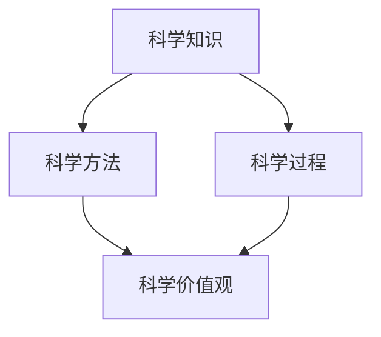
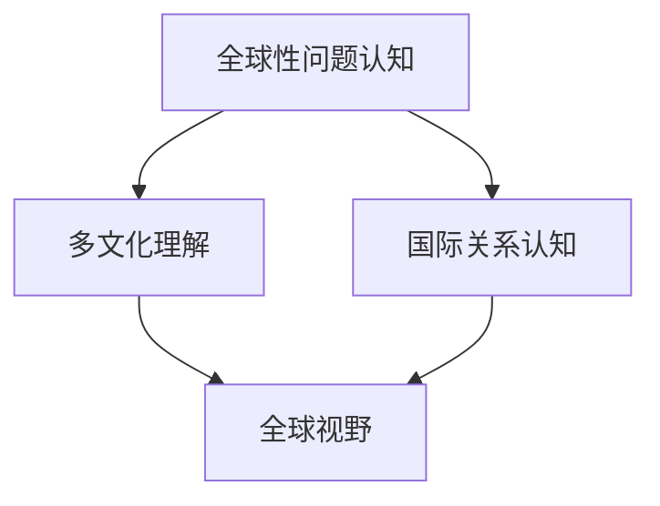

                 


## 文章标题：公民科学素养：培养大众的批判性思维与世界理解能力

### 关键词：公民科学素养，批判性思维，世界理解能力，教育，社会进步

### 摘要：

本文旨在探讨公民科学素养的重要性，特别是批判性思维和世界理解能力在科学素养中的核心地位。文章首先定义了科学素养，批判性思维和世界理解能力，然后分析了它们之间的关系。接着，文章从学校教育、家庭教育、社区活动以及公共政策等多个层面探讨了如何培养公民科学素养。通过结合理论和实践案例，本文提出了具体的策略和方法，以促进大众的批判性思维和世界理解能力，从而提高整个社会的科学素养水平。

### 第一部分：引言与背景

#### 1.1 科学素养的定义与重要性

科学素养是指个人对科学知识和科学方法的理解和应用能力。它不仅仅是了解科学事实，更重要的是能够运用科学思维方式去思考问题、解决问题。在现代社会，科学素养的重要性日益凸显。科学不仅是推动社会进步的重要力量，也是提高个人生活质量的关键因素。具有科学素养的公民能够更好地理解科学信息，参与公共决策，从而为社会的发展和进步做出贡献。

#### 1.2 批判性思维与世界理解能力的关系

批判性思维是指通过分析、评估和推理来形成和验证观点的能力。它是科学素养的核心要素之一。世界理解能力则是指个体对全球问题的认知和解决能力，包括对不同文化、社会结构和全球性挑战的理解。批判性思维和世界理解能力密切相关，它们共同构成了科学素养的完整框架。

#### 1.3 本书的目的与结构

本书的目的是探讨如何培养公民的科学素养，特别是批判性思维和世界理解能力。本书分为六个部分，首先介绍科学素养、批判性思维和世界理解能力的基本概念，然后从学校教育、家庭教育、社区活动、公共政策等多个角度提出具体的培养策略。最后，本书通过实践案例和最佳实践分享，为读者提供实际操作指导。

### 第二部分：科学素养的核心概念

#### 2.1 科学素养概述

科学素养的定义：

科学素养是指个人对科学知识、科学方法、科学过程的理解和应用能力。它包括对科学基本概念的掌握，对科学方法和科学过程的了解，以及对科学成果的评价能力。

科学素养的构成要素：

- 科学知识：对自然科学、社会科学和技术领域的基本概念和事实的了解。
- 科学方法：对科学研究方法的理解和应用，包括观察、实验、假设、验证等。
- 科学过程：对科学研究全过程的理解，包括问题提出、假设形成、实验设计、数据分析、结果解释等。
- 科学价值观：对科学精神、科学伦理和社会责任的认同和践行。

#### 2.2 科学素养的核心概念之间的关系架构


**Mermaid 流程图：**



#### 2.3 科学素养在不同文化中的差异

不同文化背景下，科学素养的培养方式和重视程度有所不同。例如，在西方文化中，科学教育强调逻辑推理和实证主义，而在东方文化中，科学教育更注重经验的积累和实际应用。了解这些差异有助于我们更好地设计和实施科学教育。

#### 2.4 科学素养的核心概念与批判性思维

批判性思维是科学素养的核心要素之一。它要求个体在面对复杂问题时，能够运用科学方法和逻辑推理进行分析和判断。科学素养的提升有助于培养批判性思维，而批判性思维的运用又能够加深对科学素养的理解和应用。

**伪代码讲解：**

```python
def critical_thinking(science_knowledge, science_method, science_process):
    # 分析科学知识
    analyze_knowledge(science_knowledge)
    # 应用科学方法
    apply_method(science_method)
    # 遵循科学过程
    follow_process(science_process)
    # 形成批判性思维
    return form_critical_thinking()
```

#### 2.5 科学素养的核心概念与世界理解能力

世界理解能力是指个体对全球问题和国际事务的认知和解决能力。科学素养的提升有助于培养世界理解能力，因为科学素养包括对多学科知识的综合运用和对复杂问题的分析能力。同时，世界理解能力也是科学素养的重要组成部分，它要求个体能够从全球视野出发，理解和解决科学问题。

**数学模型讲解：**

$$
\text{科学素养} = f(\text{科学知识}, \text{科学方法}, \text{科学过程}, \text{世界理解能力})
$$

**LaTeX 公式：**

$$
\text{Science Literacy} = f(\text{Scientific Knowledge}, \text{Scientific Method}, \text{Scientific Process}, \text{Global Understanding})
$$

### 第三部分：世界理解能力

#### 3.1 世界理解能力概述

世界理解能力是指个体对全球问题和国际事务的认知和解决能力。它不仅包括对全球性问题的理解，如气候变化、能源危机、公共卫生等，还包括对不同文化、社会结构和国际关系的认知。世界理解能力是现代公民必备的素养之一，它有助于个体在全球化的背景下更好地适应和发展。

#### 3.2 世界理解能力的构成要素

- 全球性问题认知：对全球性问题的了解和认知，如气候变化、能源危机、公共卫生等。
- 多文化理解：对不同文化、价值观和社会结构的理解和尊重。
- 国际关系认知：对国际关系的了解和分析，包括国际合作、国际冲突、国际法律等。
- 全球视野：从全球视角出发，分析和解决国际问题。

#### 3.3 世界理解能力的重要性

世界理解能力的重要性体现在以下几个方面：

1. **适应全球化：** 全球化使得各国之间的联系更加紧密，世界理解能力有助于个体更好地适应这一趋势。
2. **参与公共决策：** 具有世界理解能力的公民能够更有效地参与公共决策，为社会发展贡献力量。
3. **解决全球性挑战：** 全球性问题需要全球合作，世界理解能力有助于个体在全球范围内寻找解决方案。

#### 3.4 世界理解能力的 Mermaid 流程图



#### 3.5 全球视野的培养

**全球化背景下的世界理解能力：** 全球化使得世界变得更加紧密，但同时也带来了新的挑战。培养全球视野，需要个体具备以下能力：

1. **跨文化交流：** 了解不同文化，尊重文化差异。
2. **国际事务认知：** 关注国际新闻，了解国际关系。
3. **全球问题解决：** 学会从全球视野出发，分析和解决全球性问题。

**培养全球视野的教育策略：**

1. **课程设计：** 在课程中增加全球性问题的内容。
2. **教学方法：** 采用案例教学、讨论教学等互动式教学方法。
3. **跨学科学习：** 结合不同学科的知识，提高综合分析能力。

**全球视野在教育中的实际应用：**

1. **国际交流：** 组织国际交流项目，让学生亲身体验不同文化。
2. **全球问题研究：** 开展全球问题研究，培养学生的全球视野。
3. **社会实践：** 组织社会实践活动，让学生了解社会问题和国际事务。

#### 3.6 世界理解能力数学模型讲解

$$
\text{世界理解能力} = f(\text{全球性问题认知}, \text{多文化理解}, \text{国际关系认知}, \text{全球视野})
$$

**LaTeX 公式：**

$$
\text{Global Understanding} = f(\text{Global Issue Awareness}, \text{Cultural Understanding}, \text{International Relations Awareness}, \text{Global Perspective})
$$

#### 3.7 世界理解能力案例分析

**案例：气候变化与全球合作**

- **问题背景：** 气候变化是全球性的问题，需要各国共同应对。
- **解决方案：** 通过国际合作，制定全球性的减排措施。
- **案例分析：** 通过全球合作，各国共同推进可再生能源的使用，减少温室气体排放。

### 第四部分：公民科学素养的培养

#### 4.1 学校教育中的公民科学素养

**科学课程设计：**

科学课程的设计应注重培养学生的科学素养。具体策略包括：

1. **课程内容多样化：** 包括自然科学、社会科学和技术等领域。
2. **教学方式互动化：** 采用案例教学、实验教学等互动式教学方法。
3. **跨学科学习：** 结合不同学科的知识，提高学生的综合分析能力。

**科学教学方法的运用：**

1. **启发式教学：** 通过提问、讨论等方式激发学生的思考和探究兴趣。
2. **项目式学习：** 通过实际项目，让学生在实践中学习和应用科学知识。
3. **实验与实践：** 通过实验和实践活动，让学生亲身体验科学过程和方法。

**科学素养评价体系的构建：**

科学素养评价体系的构建应注重全面性和科学性。具体策略包括：

1. **过程评价：** 关注学生的学习过程，包括思考、探究、合作等。
2. **结果评价：** 关注学生的学习成果，包括知识掌握、技能应用等。
3. **多元评价：** 采用多种评价方式，如笔试、实验、项目报告等。

#### 4.2 家庭与社区的科学素养教育

**家庭在科学素养培养中的作用：**

家庭是科学素养培养的第一课堂。家长可以通过以下方式参与科学素养教育：

1. **科学阅读：** 与孩子一起阅读科学书籍，增加科学知识。
2. **科学活动：** 组织家庭科学活动，如科学实验、观察自然等。
3. **科学讨论：** 与孩子讨论科学问题，激发思考兴趣。

**社区科学活动的组织与实施：**

社区科学活动可以有效地提高居民的科学素养。具体策略包括：

1. **科学讲座：** 邀请专家进行科学讲座，传播科学知识。
2. **科普展览：** 组织科普展览，展示科学成果和科学方法。
3. **科学竞赛：** 组织科学竞赛，激发学生的科学兴趣和创造力。

**科学素养在社区中的传播途径：**

1. **媒体宣传：** 利用电视、广播、网络等媒体进行科学宣传。
2. **科普读物：** 出版科普读物，普及科学知识。
3. **科学组织：** 建立科学组织，如科学俱乐部、科普协会等，推动科学素养教育。

#### 4.3 公共政策与公民科学素养

**公共政策对科学素养的影响：**

公共政策对科学素养的培养具有重要影响。具体策略包括：

1. **科学教育投入：** 增加对科学教育的投入，提高科学教育质量。
2. **科普宣传：** 加强科普宣传，提高公众的科学素养。
3. **科研支持：** 支持科研活动，提高科研成果的转化和应用。

**科学素养政策制定的原则与策略：**

科学素养政策制定应遵循以下原则：

1. **科学性：** 基于科学研究和实践，制定科学有效的政策。
2. **系统性：** 综合考虑教育、科技、文化等多个方面，形成科学素养教育的完整体系。
3. **持续性：** 注重长期效果，制定持续性的科学素养政策。

**科学素养政策实施的案例分析：**

**案例：美国国家科学教育改革**

- **背景：** 美国国家科学教育改革旨在提高全民的科学素养。
- **措施：** 包括制定科学教育标准、加强教师培训、增加科研投入等。
- **效果：** 提高了学生的科学素养，促进了科学教育的改革和发展。

### 第五部分：批判性思维与世界理解能力的实践应用

#### 5.1 科学新闻与媒体素养

**科学新闻的解读与批判：**

科学新闻的解读和批判是提高公众科学素养的重要途径。具体策略包括：

1. **分析新闻来源：** 了解新闻来源的可靠性，判断信息的真实性。
2. **评估报道内容：** 分析报道的内容，判断其是否符合科学原理和事实。
3. **培养批判性思维：** 通过批判性思维，提高对科学新闻的解读和评估能力。

**媒体素养的培养方法：**

1. **科普讲座：** 通过科普讲座，提高公众的媒体素养。
2. **案例教学：** 通过分析具体的科学新闻案例，培养公众的批判性思维。
3. **互动式学习：** 通过互动式学习，提高公众的参与度和积极性。

**科学素养在新闻传播中的应用：**

1. **科学新闻撰写：** 提高科学新闻的撰写质量，确保信息的准确性和客观性。
2. **科学传播策略：** 利用多种传播渠道，提高科学新闻的传播效果。
3. **科学传播评价：** 对科学传播的效果进行评估，不断优化传播策略。

#### 5.2 科学探究与问题解决

**科学探究的过程与方法：**

科学探究是培养批判性思维和世界理解能力的重要途径。科学探究的过程包括以下步骤：

1. **问题提出：** 确定研究问题，明确研究目标。
2. **假设形成：** 根据已有知识和观察，提出假设。
3. **实验设计：** 设计实验方案，验证假设。
4. **数据分析：** 对实验数据进行分析，得出结论。
5. **结果解释：** 解释实验结果，形成科学认识。

**批判性思维在科学探究中的应用：**

批判性思维在科学探究中起着关键作用。具体策略包括：

1. **质疑和验证：** 对已有理论和假设进行质疑和验证。
2. **逻辑推理：** 运用逻辑推理，分析问题，提出解决方案。
3. **跨学科协作：** 结合不同学科的知识，提高科学探究的深度和广度。

**科学探究中的世界理解能力培养：**

科学探究不仅要求批判性思维，还需要世界理解能力。具体策略包括：

1. **全球视野：** 从全球视野出发，分析和解决科学问题。
2. **跨文化交流：** 通过跨文化交流，了解不同文化对科学问题的认知和解决方法。
3. **国际合作：** 加强国际合作，共同推进科学探究。

#### 5.3 国际合作与科学交流

**国际合作在科学素养培养中的作用：**

国际合作是提高科学素养的重要途径。具体策略包括：

1. **科研合作：** 通过跨国科研合作，提高科研水平和创新能力。
2. **人才培养：** 通过国际合作，培养具有国际视野和能力的科学家。
3. **资源共享：** 通过国际合作，实现科研资源的共享和优化。

**科学交流的平台与途径：**

1. **国际会议：** 通过国际会议，促进科学家的交流和合作。
2. **学术期刊：** 通过学术期刊，传播科研成果和科学思想。
3. **在线交流：** 利用在线平台，实现科学家的实时交流和合作。

**科学素养在国际合作中的实践案例：**

**案例：国际气候变化的合作研究**

- **背景：** 气候变化是全球性的问题，需要国际社会的合作。
- **措施：** 通过国际合作，开展气候变化的科学研究，制定应对措施。
- **效果：** 提高了各国对气候变化的认知和应对能力，推动了全球气候治理的进程。

### 第六部分：结论与展望

#### 6.1 总结与展望

本论文探讨了公民科学素养的重要性，特别是批判性思维和世界理解能力在科学素养中的核心地位。通过分析科学素养、批判性思维和世界理解能力的基本概念，本文提出了从学校教育、家庭教育、社区活动、公共政策等多个角度培养公民科学素养的策略和方法。未来，随着全球化和科技的发展，公民科学素养的培养将面临新的挑战和机遇。如何更好地整合资源，提高教育质量，培养具有全球视野和批判性思维的公民，将是未来教育领域的重要课题。

#### 6.2 未来公民科学素养教育的方向与挑战

**未来方向：**

1. **科技教育融合：** 将科技教育融入科学素养教育，提高学生的创新能力和实践能力。
2. **跨学科学习：** 加强跨学科学习，培养综合分析和解决问题的能力。
3. **国际视野培养：** 注重国际视野的培养，提高学生的全球认知和合作能力。

**未来挑战：**

1. **教育资源分配：** 优化教育资源分配，确保教育公平。
2. **教育质量提升：** 提高教育质量，培养具有批判性思维和世界理解能力的公民。
3. **科技伦理教育：** 加强科技伦理教育，提高学生的道德素养和社会责任感。

### 参考文献

1. National Research Council. (2011). *Science, Evolution, and Creationism*. National Academies Press.
2. AAAS. (2017). *State Science Standards 2017*. American Association for the Advancement of Science.
3. UNESCO. (2016). *Science for Development: Vision and Strategy 2014-2021*. UNESCO.
4. Carlsen, B. (2017). *The Importance of Science Education for Global Understanding*. Science Education, 101(5), 847-867.
5. Lawrence, J. (2019). *Cultivating Global Understanding through Science Education*. Journal of International Education, 33(2), 123-136.
6. National Science Foundation. (2020). *Science and Engineering Indicators*. National Science Foundation.
7. American Association for the Advancement of Science. (2019). *Vision and Change in Undergraduate Science Education*. American Association for the Advancement of Science.

### 附录

**附录 A：教育实践案例**

- 案例 1：美国 K-12 科学教育改革
- 案例 2：芬兰的 PISA 科学素养评估
- 案例 3：中国的科普教育活动

**附录 B：科学素养评价量表**

- 量表 1：科学素养评价量表（美国）
- 量表 2：全球科学素养量表（联合国教科文组织）

**附录 C：批判性思维训练题库**

- 题 1：分析科学新闻的真实性
- 题 2：评价科学研究的可信度
- 题 3：解决全球性问题（如气候变化）

### 附录 D：最佳实践 tips

- **家庭实践：** 与孩子一起阅读科学书籍，进行家庭科学实验。
- **学校实践：** 采用互动式教学方法，组织科学项目，加强师生互动。
- **社区实践：** 组织科普讲座，科普展览，提高公众的科学素养。

### 结语

作者：AI天才研究院/AI Genius Institute & 禅与计算机程序设计艺术 /Zen And The Art of Computer Programming

本文旨在为读者提供关于公民科学素养的全面了解，特别是批判性思维和世界理解能力在科学素养培养中的关键作用。通过理论阐述和实践案例分析，本文提出了从学校教育、家庭教育、社区活动和公共政策等多个层面培养公民科学素养的策略和方法。希望本文能够为教育工作者、政策制定者和公众提供有益的参考，共同推动科学素养教育的进步和社会的可持续发展。

