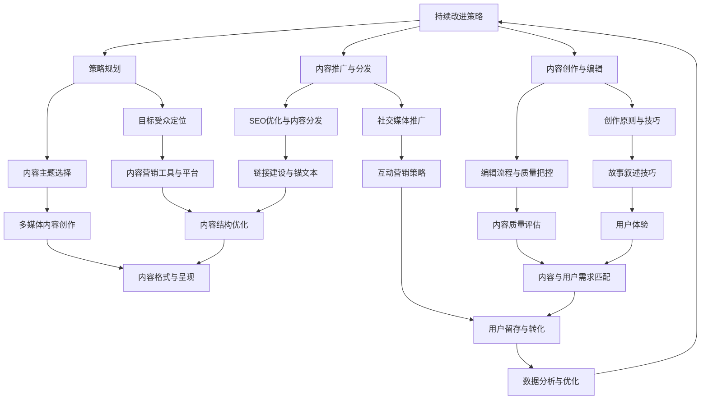

                 

## 文章标题

# 内容营销：吸引潜在用户的有效方式

## 关键词

- 内容营销
- 潜在用户
- 用户需求
- 数据分析
- 社交媒体
- SEO优化

## 摘要

内容营销是企业通过创建和分享有价值的内容来吸引潜在用户、建立品牌信任和促进销售的一种策略。本文将详细探讨内容营销的基础理论、策略规划、内容创作与编辑、内容推广与分发、数据分析与优化、案例分析、跨渠道整合以及高级内容营销技巧。通过本文的深入分析，读者将了解到如何通过内容营销吸引潜在用户，从而提升企业的市场竞争力。

## 《内容营销：吸引潜在用户的有效方式》目录大纲

### 第一部分：内容营销基础

#### 第1章：内容营销概述

##### 1.1 内容营销的定义与目标

##### 1.2 内容营销与传统营销的差异

##### 1.3 内容营销在企业中的重要性

#### 第2章：内容营销策略规划

##### 2.1 制定内容营销策略的步骤

##### 2.2 明确目标受众与定位

##### 2.3 内容主题与类型选择

#### 第3章：内容创作与编辑

##### 3.1 内容创作原则与技巧

##### 3.2 编辑流程与质量把控

##### 3.3 多媒体内容创作

#### 第4章：内容推广与分发

##### 4.1 社交媒体推广策略

##### 4.2 SEO优化与内容分发

##### 4.3 内容营销工具与平台

### 第二部分：内容营销实施与优化

#### 第5章：内容营销数据分析与评估

##### 5.1 数据分析的重要性

##### 5.2 内容营销关键指标

##### 5.3 数据分析与优化策略

#### 第6章：内容营销案例分析

##### 6.1 成功的内容营销案例解析

##### 6.2 失败的内容营销案例反思

##### 6.3 案例对内容营销的启示

#### 第7章：跨渠道内容营销整合

##### 7.1 跨渠道营销策略

##### 7.2 内容营销与其他营销手段的整合

##### 7.3 跨渠道内容营销的挑战与应对

### 第三部分：高级内容营销技巧

#### 第8章：个性化内容营销

##### 8.1 个性化内容营销的概念

##### 8.2 个性化内容营销的实施策略

##### 8.3 个性化内容营销的案例分析

#### 第9章：内容营销与品牌建设

##### 9.1 内容营销与品牌的关系

##### 9.2 品牌内容营销策略

##### 9.3 品牌内容营销的案例分析

#### 第10章：内容营销趋势与未来

##### 10.1 内容营销的发展趋势

##### 10.2 内容营销的未来方向

##### 10.3 企业应对内容营销变革的策略

### 附录

#### 附录A：内容营销资源与工具

##### A.1 内容营销工具介绍

##### A.2 内容营销资源推荐

##### A.3 开源内容营销工具列表

## 核心概念与联系 Mermaid 流程图



## 核心算法原理讲解（伪代码）

```python
# 内容推荐算法伪代码

# 定义用户兴趣向量生成函数
def generate_user_interest_vector(user_profile):
    # 根据用户历史行为和偏好生成兴趣向量
    # ...
    return user_interest_vector

# 定义内容特征向量生成函数
def generate_content_vector(content):
    # 根据内容属性生成特征向量
    # ...
    return content_vector

# 定义余弦相似度计算函数
def cosine_similarity(user_interest_vector, content_vector):
    # 计算两个向量的余弦相似度
    # ...
    return similarity_score

# 定义内容推荐函数
def content_recommendation(user_profile, content_library):
    # 根据用户兴趣向量生成推荐列表
    user_interest_vector = generate_user_interest_vector(user_profile)
    recommendations = []
    
    # 遍历内容库中的每个内容
    for content in content_library:
        content_vector = generate_content_vector(content)
        similarity_score = cosine_similarity(user_interest_vector, content_vector)
        
        # 添加相似度最高的内容到推荐列表
        recommendations.append((content, similarity_score))
    
    # 对推荐列表按相似度排序
    recommendations.sort(key=lambda x: x[1], reverse=True)
    
    return recommendations
```

以上是内容推荐算法的核心伪代码，通过生成用户兴趣向量、内容特征向量，并计算余弦相似度，最终推荐出相似度最高的内容。这为内容营销提供了有效的个性化推荐机制，有助于吸引潜在用户。接下来，我们将逐步深入探讨内容营销的基础理论和实践技巧。

