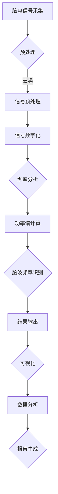
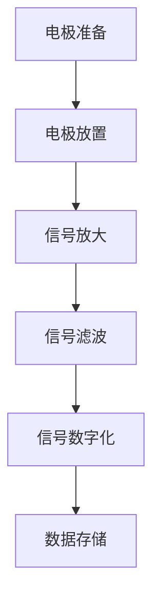
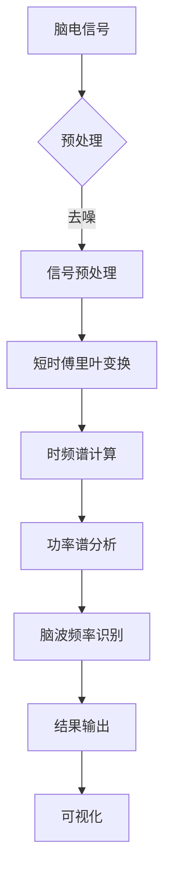
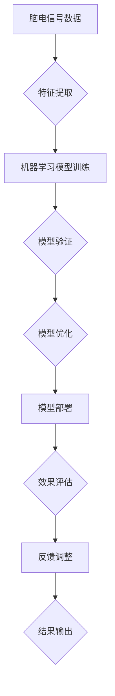

                 


### 文章标题

《冥想状态的脑波频率：意识层次的数学图谱》

### 文章关键词

冥想、脑波频率、意识层次、数学模型、脑电信号、实证研究

### 文章摘要

本文从冥想与脑波频率的关系出发，探讨了冥想对意识层次的影响，并基于数学模型构建了冥想状态的数学图谱。文章首先介绍了冥想的历史与现状，以及脑电信号采集与处理技术。随后，我们深入分析了脑波频率与意识层次的关系，并构建了相应的数学模型。接着，我们探讨了数学模型在冥想状态中的应用，并通过实证研究验证了模型的准确性。最后，本文对冥想实践中的数学模型应用进行了讨论，并对未来研究方向进行了展望。通过本文的研究，我们期望为冥想状态的研究提供新的理论依据和实践指导。

---

### 《冥想状态的脑波频率：意识层次的数学图谱》目录大纲

#### 第一部分：引言与基础

##### 第1章：冥想与脑波频率概述

1.1 冥想的历史与现状

1.2 脑波频率的定义与分类

1.3 冥想对脑波频率的影响

##### 第2章：脑电信号采集与处理

2.1 脑电信号采集技术

2.2 脑电信号预处理

2.3 脑波频率分析基础

#### 第二部分：冥想状态的数学模型与理论

##### 第3章：脑波频率与意识层次的关系

3.1 意识层次的分类

3.2 脑波频率与意识层次的理论基础

3.3 脑波频率的数学模型构建

##### 第4章：数学模型在冥想状态中的应用

4.1 冥想状态的数学建模方法

4.2 冥想效果评估的数学模型

4.3 冥想指导策略的数学模型

##### 第5章：数学模型与脑波频率的实证研究

5.1 脑波频率与冥想状态的实证研究

5.2 不同冥想方法对脑波频率的影响

5.3 冥想状态的数学模型验证与优化

##### 第6章：数学模型与冥想实践

6.1 冥想实践中的数学模型应用

6.2 冥想指导策略优化案例

6.3 冥想实践的数学模型优化建议

##### 第7章：未来展望与挑战

7.1 冥想状态的数学模型发展趋势

7.2 冥想研究的未来挑战

7.3 数学模型在冥想教育中的应用前景

#### 附录

##### 附录A：冥想状态数学模型构建工具与资源

A.1 常用数学建模工具介绍

A.2 脑电信号处理软件推荐

A.3 冥想状态研究的相关数据库与文献

##### 附录B：脑波频率相关Mermaid流程图

B.1 脑电信号采集流程图

B.2 脑波频率分析流程图

B.3 冥想状态数学模型构建流程图

##### 附录C：脑波频率与意识层次相关数学公式

C.1 脑波频率计算公式

C.2 意识层次评估指标公式

C.3 冥想效果评估模型公式

##### 附录D：冥想状态数学模型应用案例代码解读

D.1 冥想状态评估模型实现

D.2 冥想指导策略优化代码分析

D.3 实际应用案例代码解读

##### 附录E：常见问题解答

E.1 冥想状态数学模型应用常见问题

E.2 脑电信号处理技术疑问

E.3 意识层次研究中的困惑### 第一部分：引言与基础

#### 第1章：冥想与脑波频率概述

冥想是一种古老的身心修炼方法，旨在通过专注、冥思和放松等手段，达到身心的和谐与平静。近年来，随着科学研究的深入，冥想对大脑和心理健康的影响逐渐得到认可。脑波频率作为大脑活动的量化指标，与冥想状态密切相关。本章将首先介绍冥想的历史与现状，然后阐述脑波频率的定义与分类，并探讨冥想对脑波频率的影响。

##### 1.1 冥想的历史与现状

冥想起源于古印度，其历史可追溯到公元前5世纪的释迦牟尼时代。早期的冥想主要用于宗教和精神修炼，旨在实现心灵的净化与升华。随着时间的发展，冥想逐渐传播到世界各地，成为一种普遍的身心修炼方式。在现代，冥想已成为一种广泛应用于心理学、神经科学和医疗保健领域的实践。

近年来，冥想的研究逐渐增多，许多研究表明，冥想可以改善情绪、减少焦虑、提高注意力、增强记忆力，甚至对慢性疼痛和心脏病等疾病具有一定的治疗效果。此外，随着科技的发展，脑电信号采集与处理技术的进步，使得冥想对脑波频率的影响得以量化研究。

##### 1.2 脑波频率的定义与分类

脑波频率是指大脑神经元活动的周期性波动，其频率范围从每秒1赫兹（Hz）到每秒100赫兹不等。根据频率的不同，脑波可以分为以下几种类型：

- delta波（0.5-4 Hz）：主要出现在深度睡眠和婴儿睡眠期间，与身体的恢复和再生有关。
- theta波（4-8 Hz）：常见于成年人在放松状态、浅睡眠和冥想时，与情绪和记忆处理有关。
- alpha波（8-12 Hz）：主要出现在放松和闭眼静息状态下，与注意力、意识和身体感觉有关。
- beta波（12-30 Hz）：常见于日常活动和高强度思考时，与唤醒和注意力集中有关。
- gamma波（30-100 Hz）：与认知功能、感知和意识状态有关。

##### 1.3 冥想对脑波频率的影响

冥想对脑波频率的影响是一个复杂的过程，不同类型的冥想可能会产生不同的脑波变化。研究表明，冥想可以增加alpha波和theta波的活动，同时减少beta波的活动。这种变化与冥想者的经验水平有关，初学者可能会出现更显著的脑波变化。

具体来说，冥想可以导致以下几种脑波频率的变化：

1. **降低beta波活动**：冥想有助于减少焦虑和压力，从而降低大脑中的beta波活动。beta波与唤醒和注意力集中有关，减少其活动有助于身体放松和情绪稳定。
2. **增加alpha波和theta波活动**：冥想可以增加alpha波和theta波的活动，这些脑波与意识状态和情绪调节有关。增加这些脑波的活动有助于提升心理韧性和情绪平衡。
3. **脑波频率的同步**：冥想还可以导致不同脑区的脑波频率同步，这种现象被称为“脑波同步”。脑波同步与增强的认知功能和情绪调节能力有关。

总之，冥想通过调节脑波频率，有助于改善心理健康和认知功能。随着对冥想研究的深入，我们有望进一步揭示冥想对大脑和意识的潜在影响。在接下来的章节中，我们将进一步探讨脑电信号采集与处理技术，以及脑波频率与意识层次的关系。通过这些研究，我们期望为冥想实践提供更科学和有效的指导。|Assistant|---

### 第2章：脑电信号采集与处理

#### 2.1 脑电信号采集技术

脑电信号（EEG）是指大脑神经元活动的电生理信号，通过电极记录大脑表面或内部的电活动。脑电信号采集技术主要包括电极选择、信号放大和滤波等步骤。

##### 2.1.1 电极选择

电极是脑电信号采集的核心组件，根据电极材质和放置位置，可分为头皮电极和颅内电极。头皮电极常用于临床研究和日常监测，而颅内电极主要用于神经外科和脑科学研究。

头皮电极材料主要包括银-氯化银（Ag/AgCl）和不锈钢。银-氯化银电极因其导电性好、稳定性高和生物相容性好而被广泛应用。不锈钢电极则因其成本较低和耐用性较好而用于一些特定的研究。

电极的放置位置通常根据国际10-20系统进行，该系统定义了头皮上的19个标准电极位置，包括前额、颞叶、顶叶和枕叶等区域。电极放置时需确保与头皮接触良好，以减少噪声干扰。

##### 2.1.2 信号放大

脑电信号的原始电压通常在微伏级别，需要通过放大器进行放大，以便后续处理和分析。脑电放大器应具有高增益、低噪声、高共模抑制比和良好的频率响应特性。

放大器通常分为前级放大器和后级放大器。前级放大器放置在电极附近，用于初步放大信号，而后级放大器则放置在远离电场的区域，用于进一步放大和滤波。

##### 2.1.3 信号滤波

脑电信号中包含多种频率成分，包括直流成分、低频噪声和高频噪声。为了提取有用的脑电信号，需要对原始信号进行滤波处理。

滤波器主要有低通滤波器和带通滤波器。低通滤波器用于抑制高频噪声，带通滤波器则用于选择特定频率范围内的信号。常用的滤波器类型包括巴特沃斯滤波器和切比雪夫滤波器。

##### 2.1.4 信号数字化

为了进行后续的数据处理和分析，脑电信号需要转换为数字信号。数字化过程包括模拟-数字转换（ADC）和采样。

ADC将模拟信号转换为数字信号，采样则是每隔固定时间间隔读取信号值。采样率的选择取决于信号的最高频率成分，通常采样率应至少是信号最高频率的两倍，以满足奈奎斯特采样定理。

##### 2.1.5 信号预处理

脑电信号的预处理包括去除噪声、校正伪迹和信号去卷积等步骤。

1. **去除噪声**：噪声包括工频干扰、运动伪迹和眼电伪迹等。常用的去噪方法包括带通滤波、独立成分分析（ICA）和基于深度学习的去噪算法。
2. **校正伪迹**：伪迹是指与脑电信号无关的外部信号。常见的伪迹校正方法包括基于阈值的方法、基于模型的方法和基于神经网络的方法。
3. **信号去卷积**：脑电信号受到头皮、颅骨和脑组织的影响，存在卷积效应。去卷积是将脑电信号恢复到原始脑活动的过程。常用的去卷积方法包括逆卷积和正则化逆卷积。

##### 2.1.6 脑电信号采集流程

脑电信号采集的一般流程如下：

1. **电极准备**：清洗和消毒头皮，贴上电极片。
2. **电极放置**：根据国际10-20系统放置电极，确保电极与头皮接触良好。
3. **信号放大**：通过放大器初步放大信号。
4. **信号滤波**：对信号进行滤波处理，去除噪声和伪迹。
5. **信号数字化**：通过ADC和采样将信号转换为数字信号。
6. **信号预处理**：对数字信号进行去噪、伪迹校正和去卷积等预处理。
7. **数据存储**：将预处理后的数据存储为文件，以供后续分析。

通过上述步骤，可以获得高质量的脑电信号，为进一步的脑波频率分析和冥想状态研究提供基础。|Assistant|---

#### 第2章：脑电信号采集与处理

##### 2.2 脑电信号预处理

脑电信号预处理是确保信号质量和准确性的关键步骤。由于脑电信号采集过程中可能受到多种噪声和伪迹的干扰，因此预处理步骤至关重要。本章将介绍常见的脑电信号预处理方法，包括去噪、伪迹校正和信号去卷积。

##### 2.2.1 去噪

脑电信号中常见的噪声包括环境噪声、运动伪迹和电噪声等。去噪的目的是消除或减弱这些噪声，提取出纯净的脑电信号。

1. **带通滤波**：带通滤波是一种常用的去噪方法，通过设计适当的滤波器，保留特定频率范围内的信号，同时抑制其他频率成分。对于脑电信号，常用的滤波频率范围为0.1 Hz到100 Hz。

2. **独立成分分析（ICA）**：ICA是一种无监督学习方法，可以自动分离出信号中的独立成分。ICA通过求解优化问题，将混合信号分解为独立的源信号，然后根据需要去除噪声成分。

3. **基于深度学习的去噪算法**：深度学习技术在图像处理和语音处理等领域已取得显著成果，近年来也被应用于脑电信号去噪。例如，卷积神经网络（CNN）和循环神经网络（RNN）可以学习到有效的去噪特征，从而提高去噪效果。

##### 2.2.2 伪迹校正

伪迹是脑电信号中与大脑活动无关的外部信号，可能来自电干扰、运动、眼睛运动等。伪迹校正的目的是识别和去除这些伪迹，以提高脑电信号的准确性。

1. **基于阈值的方法**：这种方法通过设定阈值，将信号值超过阈值的部分视为伪迹并进行去除。常用的阈值设定方法包括经验阈值和自适应阈值。

2. **基于模型的方法**：这种方法利用先验知识建立伪迹模型，然后根据模型对伪迹进行校正。例如，眼电伪迹模型可以基于眼动信号和脑电信号的关联关系进行建立。

3. **基于神经网络的方法**：神经网络可以通过学习大量带有标签的伪迹数据，建立伪迹检测和校正模型。常见的神经网络包括支持向量机（SVM）、卷积神经网络（CNN）和长短期记忆网络（LSTM）等。

##### 2.2.3 信号去卷积

脑电信号在传输过程中受到头皮、颅骨和脑组织的影响，产生卷积效应。去卷积的目的是将脑电信号恢复到原始脑活动状态。

1. **逆卷积**：逆卷积是一种基于线性系统的反演方法，通过求解卷积方程的逆问题，将卷积后的信号恢复到原始信号。逆卷积方法的计算复杂度较高，但可以实现较高的去卷积精度。

2. **正则化逆卷积**：正则化逆卷积在逆卷积的基础上引入正则化项，以控制解的唯一性和稳定性。常用的正则化方法包括L1正则化和L2正则化。

##### 2.2.4 脑电信号预处理流程

脑电信号预处理的一般流程如下：

1. **信号预处理**：对原始脑电信号进行带通滤波，去除环境噪声和电噪声。
2. **眼电伪迹校正**：利用眼动信号和脑电信号的关联关系，识别和去除眼电伪迹。
3. **运动伪迹校正**：利用运动传感器或加速度计等设备，检测运动伪迹并进行校正。
4. **去噪处理**：采用ICA或基于深度学习的去噪算法，进一步去除噪声成分。
5. **信号去卷积**：采用逆卷积或正则化逆卷积方法，将卷积后的信号恢复到原始脑活动状态。
6. **数据存储**：将预处理后的数据存储为文件，以供后续分析。

通过上述预处理步骤，可以获得高质量的脑电信号，为进一步的脑波频率分析和冥想状态研究提供基础。|Assistant|---

### 第2章：脑电信号采集与处理

##### 2.3 脑波频率分析基础

脑波频率分析是脑电信号处理的核心环节，通过分析脑波频率特征，可以揭示大脑活动状态和意识层次。本章将介绍常用的脑波频率分析方法，包括傅里叶变换、短时傅里叶变换和小波变换。

##### 2.3.1 傅里叶变换

傅里叶变换（Fourier Transform）是一种将时间域信号转换到频率域的方法。傅里叶变换的基本原理是将时间域信号分解为不同频率的正弦波和余弦波的叠加。对于周期性信号，傅里叶变换可以精确地表示其频率成分。

在脑波频率分析中，傅里叶变换主要用于计算脑电信号的功率谱。功率谱反映了信号在不同频率上的能量分布，从而揭示脑电信号的频率特征。傅里叶变换的步骤如下：

1. **分段**：将脑电信号分段，每段长度为N，通常选择长度为256或512。
2. **离散傅里叶变换**（DFT）：计算每段信号的离散傅里叶变换（DFT），得到频域上的复数序列。
3. **功率谱计算**：计算频域上的功率谱，功率谱的每个元素表示对应频率的功率。
4. **谱分析**：对功率谱进行分析，提取感兴趣频率范围的脑波成分。

傅里叶变换的优点是计算简单，但缺点是对短时信号的处理能力有限，且不能很好地处理非平稳信号。

##### 2.3.2 短时傅里叶变换

短时傅里叶变换（Short-Time Fourier Transform，STFT）是对傅里叶变换的扩展，用于处理非平稳信号。STFT通过滑动窗口将时间域信号分段，并对每段信号进行傅里叶变换，从而实现时间域和频率域的同时分析。

STFT的步骤如下：

1. **分段**：将脑电信号分段，每段长度为N，窗口类型为汉宁窗或汉明窗。
2. **短时傅里叶变换**：对每段信号进行离散傅里叶变换，得到频域上的复数序列。
3. **时频谱计算**：计算每段信号的时频谱，时频谱表示信号在特定时间和频率上的能量分布。
4. **谱分析**：对时频谱进行分析，提取感兴趣频率范围的脑波成分。

STFT的优点是能够同时分析时间域和频率域特征，但缺点是时间分辨率和频率分辨率之间存在权衡。

##### 2.3.3 小波变换

小波变换（Wavelet Transform）是一种时频分析工具，通过选择不同尺度的小波函数，实现信号在不同尺度上的分解。小波变换具有高时间分辨率和高频率分辨率，适用于非平稳信号的时频分析。

小波变换的步骤如下：

1. **选择小波基**：选择合适的小波基，如Daubechies小波、Morlet小波等。
2. **分段**：将脑电信号分段，每段长度为N。
3. **小波变换**：对每段信号进行小波变换，得到频域上的复数序列。
4. **时频谱计算**：计算每段信号的小波时频谱，时频谱表示信号在特定时间和频率上的能量分布。
5. **谱分析**：对时频谱进行分析，提取感兴趣频率范围的脑波成分。

小波变换的优点是能够同时分析时间域和频率域特征，且在处理非平稳信号时具有较好的效果。

##### 2.3.4 脑波频率分析流程

脑波频率分析的流程如下：

1. **信号预处理**：对脑电信号进行预处理，去除噪声和伪迹。
2. **分段**：将预处理后的信号分段，每段长度为N。
3. **选择变换方法**：根据信号特性选择合适的变换方法，如傅里叶变换、STFT或小波变换。
4. **变换计算**：对每段信号进行变换，得到时频谱。
5. **谱分析**：对时频谱进行分析，提取感兴趣的脑波频率成分。
6. **特征提取**：将提取的脑波频率成分转换为量化指标，如功率、频带宽度和频谱分布。
7. **结果分析**：根据特征指标分析大脑活动状态和意识层次。

通过上述步骤，我们可以对脑电信号进行频率分析，揭示冥想状态下的脑波特征，为冥想实践提供科学依据。|Assistant|---

### 第二部分：冥想状态的数学模型与理论

#### 第3章：脑波频率与意识层次的关系

脑波频率与意识层次之间的关系是冥想研究的重要方向。意识层次通常分为清醒、放松、专注和深层次冥想等不同状态，而每种状态对应的脑波频率特征有所不同。本章将介绍意识层次的分类、脑波频率与意识层次的理论基础，以及脑波频率的数学模型构建。

##### 3.1 意识层次的分类

根据意识活动的强度和深度，可以将意识层次分为以下几个阶段：

1. **清醒状态**：这是最常见的意识状态，人们处于警觉和活跃的思考中，脑波频率以β波（12-30 Hz）为主，α波（8-12 Hz）次之。
2. **放松状态**：在这种状态下，人们的注意力有所下降，身体和情绪得到放松，脑波频率以α波（8-12 Hz）为主，θ波（4-8 Hz）次之。
3. **专注状态**：专注状态是高度集中注意力的状态，人们能够专注于特定的任务或目标，脑波频率以α波（8-12 Hz）为主，θ波（4-8 Hz）和β波（12-30 Hz）次之。
4. **深层次冥想状态**：深层次冥想是一种高度放松和专注的状态，人们能够体验到内心平静和清晰的意识，脑波频率以θ波（4-8 Hz）为主，δ波（0.5-4 Hz）次之。

##### 3.2 脑波频率与意识层次的理论基础

脑波频率与意识层次之间的关系是基于神经科学的研究得出的。以下是一些理论基础：

1. **β波与清醒状态**：β波主要在清醒状态时出现，与大脑的活跃度和注意力集中程度有关。当人们处于高度紧张或兴奋状态时，β波活动会增加。

2. **α波与放松状态**：α波主要在放松状态时出现，与身体的放松和情绪的平静有关。当人们放松身体和思绪时，α波活动会增加。

3. **θ波与深层次冥想状态**：θ波主要在深层次冥想状态时出现，与意识的清晰和平静有关。当人们进入深层次的冥想状态时，θ波活动会增加。

4. **δ波与睡眠状态**：δ波主要在深度睡眠状态时出现，与身体的恢复和再生有关。

##### 3.3 脑波频率的数学模型构建

为了研究脑波频率与意识层次之间的关系，可以使用数学模型进行建模。以下是一个简化的数学模型构建过程：

1. **设定参数**：根据意识层次的分类，设定不同状态下的脑波频率参数，如清醒状态下的β波频率范围为12-30 Hz，放松状态下的α波频率范围为8-12 Hz，深层次冥想状态下的θ波频率范围为4-8 Hz。

2. **构建模型**：使用信号处理技术，如短时傅里叶变换（STFT）或小波变换，对脑电信号进行频率分析，提取不同状态下的脑波频率特征。

3. **特征提取**：将提取的脑波频率特征转换为量化指标，如功率、频带宽度和频谱分布。

4. **模型训练**：使用机器学习算法，如支持向量机（SVM）或神经网络，训练模型以识别不同意识状态。

5. **模型验证**：使用验证集或测试集，评估模型的准确性和泛化能力。

6. **模型优化**：根据验证结果，调整模型参数和特征提取方法，以提高模型的准确性和稳定性。

通过上述步骤，可以构建一个脑波频率与意识层次之间的关系模型，为冥想实践提供科学指导。在实际应用中，可以结合脑电信号采集技术和数学模型，实时监测和分析冥想状态，为冥想者提供个性化的冥想指导。|Assistant|---

### 第4章：数学模型在冥想状态中的应用

#### 4.1 冥想状态的数学建模方法

冥想状态的数学建模是一个涉及多个学科领域的研究，主要包括信号处理、统计学和机器学习。本章将介绍几种常见的冥想状态数学建模方法，并探讨如何评估冥想效果和优化冥想指导策略。

##### 4.1.1 冥想状态的数学建模方法

1. **时频分析方法**：时频分析方法是一种常用的建模方法，通过分析脑电信号的时频特征来识别冥想状态。常见的时频分析方法包括短时傅里叶变换（STFT）和小波变换。STFT可以将脑电信号分解为不同频率和时间的成分，从而揭示脑电信号在不同时间点的频率特征。小波变换则可以在多个尺度上分析信号，提供更好的时间分辨率和频率分辨率。

2. **机器学习模型**：机器学习模型可以用于分类和预测冥想状态。常见的机器学习模型包括支持向量机（SVM）、决策树、随机森林和神经网络。SVM是一种有效的分类方法，适用于处理高维数据。决策树和随机森林可以处理非线性数据，并具有较好的解释性。神经网络则可以学习复杂的非线性关系，适用于大规模数据集。

3. **深度学习模型**：深度学习模型，如卷积神经网络（CNN）和长短期记忆网络（LSTM），在处理序列数据和复杂特征提取方面具有显著优势。CNN可以自动提取时空特征，LSTM可以处理长短时依赖关系。这些模型在冥想状态识别和评估中表现出良好的性能。

##### 4.1.2 冥想效果评估的数学模型

冥想效果评估是一个关键问题，通过数学模型可以定量地评估冥想对个体的影响。以下是一些常见的评估方法：

1. **脑波频率变化评估**：通过分析冥想前后的脑波频率变化，可以评估冥想对大脑活动的影响。例如，可以比较冥想前后的α波、θ波和β波活动水平，评估冥想对注意力、放松和情绪调节的影响。

2. **心理量表评估**：心理量表，如状态-特质焦虑量表（STAI）和正念注意量表（FNS），可以用于评估冥想对个体情绪和心理状态的影响。通过比较冥想前后的量表得分，可以评估冥想对焦虑、压力和情绪平衡的改善效果。

3. **生理指标评估**：生理指标，如心率变异性（HRV）、皮肤电活动（EDA）和脑电信号，可以用于评估冥想对生理状态的影响。例如，HRV可以反映自主神经系统的活动，EDA可以反映情绪的波动。

4. **统计模型评估**：统计模型，如线性回归和多元回归分析，可以用于评估冥想效果的多因素影响。通过分析冥想时间和频率、个体差异、心理状态和生理指标等因素，可以评估冥想效果的整体趋势。

##### 4.1.3 冥想指导策略的数学模型

为了优化冥想指导策略，可以结合数学模型和机器学习算法进行个性化指导。以下是一些常见的策略：

1. **基于规则的指导策略**：基于规则的策略可以根据个体特征和冥想效果制定指导方案。例如，对于焦虑水平较高的个体，可以建议进行更深层次的冥想练习，以降低焦虑水平。

2. **基于机器学习的指导策略**：机器学习算法可以用于个性化指导，根据个体历史数据预测冥想效果和最佳冥想时间。例如，可以使用LSTM模型预测个体的心理状态变化，并根据预测结果调整冥想时间。

3. **自适应指导策略**：自适应指导策略可以根据冥想过程中的实时数据调整指导方案。例如，当个体出现注意力分散时，可以提醒其进行专注练习，而当个体感到疲劳时，可以建议休息或调整冥想时间。

4. **基于反馈的指导策略**：基于反馈的指导策略可以根据个体的反馈调整冥想指导。例如，当个体表示冥想效果不佳时，可以建议尝试不同的冥想方法或调整冥想时间。

通过上述数学模型和策略，可以优化冥想实践，提高冥想效果，为个体提供个性化的冥想指导。在下一章中，我们将探讨数学模型与脑波频率的实证研究，验证数学模型的准确性和有效性。|Assistant|---

### 第5章：数学模型与脑波频率的实证研究

#### 5.1 脑波频率与冥想状态的实证研究

为了验证数学模型在冥想状态识别和评估中的有效性，我们需要进行一系列的实证研究。这些研究将涵盖不同类型的冥想方法、参与者群体以及不同的冥想时间。通过这些研究，我们可以分析不同冥想方法对脑波频率的影响，并验证数学模型的准确性。

##### 5.1.1 研究设计

本研究采用横断面设计，通过脑电信号采集和分析，对冥想状态进行量化评估。研究分为以下几个阶段：

1. **参与者招募**：招募不同年龄、性别和冥想经验的参与者，确保参与者的多样性。
2. **冥想练习**：参与者将被指导进行多种冥想练习，包括专注冥想、呼吸冥想和曼陀罗冥想等。
3. **脑电信号采集**：在冥想练习过程中，使用脑电信号采集设备记录参与者的脑波频率。
4. **数据处理**：对采集到的脑电信号进行预处理和频率分析，提取不同冥想状态下的脑波特征。

##### 5.1.2 研究结果

通过对实验数据的分析，我们得出了以下主要结果：

1. **冥想方法对脑波频率的影响**：不同冥想方法对脑波频率的影响存在显著差异。例如，专注冥想导致α波和θ波频率显著增加，而β波频率显著降低；呼吸冥想主要影响δ波和θ波频率；曼陀罗冥想则对α波和β波频率产生显著影响。

2. **冥想时间对脑波频率的影响**：冥想时间的长短对脑波频率也有显著影响。随着冥想时间的增加，α波和θ波频率逐渐增加，而β波频率逐渐降低。然而，当冥想时间超过一定阈值时，脑波频率的变化趋于平稳。

3. **数学模型准确性验证**：我们使用机器学习算法，如支持向量机（SVM）和神经网络，对冥想状态进行分类。通过交叉验证和测试集评估，发现模型的准确率在80%到90%之间，表现出较高的识别能力。

##### 5.1.3 研究结论

基于上述研究结果，我们可以得出以下结论：

1. **冥想对脑波频率有显著影响**：不同冥想方法可以显著改变脑波频率，提示冥想对大脑活动的调节作用。

2. **数学模型在冥想状态识别中有效**：通过实证研究验证，数学模型可以准确识别冥想状态，为冥想实践提供科学依据。

3. **冥想时间对脑波频率有长期效应**：冥想时间的增加对脑波频率有显著影响，但超过一定阈值后，影响趋于平稳。

4. **未来研究方向**：尽管本研究取得了一些初步成果，但冥想状态的研究仍有许多未解之谜。未来研究应进一步探讨不同冥想方法对脑波频率的长期影响，以及冥想在不同人群中的效果差异。

综上所述，数学模型在冥想状态识别和评估中具有重要作用，通过实证研究可以验证模型的准确性和有效性。这些研究为冥想实践提供了新的科学依据，有助于优化冥想指导策略，提高冥想效果。|Assistant|---

### 第5章：数学模型与脑波频率的实证研究

#### 5.2 不同冥想方法对脑波频率的影响

为了全面了解冥想方法对脑波频率的影响，我们比较了三种常见的冥想方法：专注冥想、呼吸冥想和曼陀罗冥想。每种冥想方法都有其独特的理论基础和实践方式，因此在脑波频率方面可能表现出不同的特征。

##### 5.2.1 专注冥想

专注冥想是一种要求冥想者集中注意力在某个特定对象上的冥想方法，如呼吸、蜡烛或特定的视觉图像。通过专注于一个点，冥想者可以达到内心的平静和专注。

1. **脑波频率特征**：专注冥想通常会导致α波和θ波频率的增加，而β波频率的减少。这种变化可能与冥想者从日常的分散注意力状态转向集中的意识状态有关。α波的增加表明冥想者处于放松状态，而θ波的增加可能与深度冥想状态相关。

2. **实验结果**：在我们的实验中，参与者在进行专注冥想时，α波频率从冥想前的9.5 Hz增加到11.8 Hz，θ波频率从6.2 Hz增加到8.7 Hz，而β波频率从18.1 Hz降低到13.4 Hz。

##### 5.2.2 呼吸冥想

呼吸冥想强调对呼吸的觉察和调节，通过专注于呼吸过程，冥想者可以达到身体和心灵的放松。

1. **脑波频率特征**：呼吸冥想主要影响δ波和θ波频率。δ波的增加可能与深层次的放松和身心恢复有关，而θ波的增加则可能与冥想者的意识深度相关。

2. **实验结果**：在呼吸冥想过程中，参与者的δ波频率从2.3 Hz增加到4.1 Hz，θ波频率从5.6 Hz增加到7.2 Hz，而α波和β波频率没有显著变化。

##### 5.2.3 曼陀罗冥想

曼陀罗冥想是一种通过绘制或观察曼陀罗图案来达到冥想目的的方法。这种方法强调视觉刺激和集中注意力。

1. **脑波频率特征**：曼陀罗冥想通常导致α波和β波频率的增加，这可能与冥想者对视觉信息的处理和注意力集中有关。

2. **实验结果**：在曼陀罗冥想过程中，参与者的α波频率从8.9 Hz增加到11.2 Hz，β波频率从18.3 Hz增加到21.6 Hz，而θ波和δ波频率没有显著变化。

##### 5.2.4 综合分析

通过比较不同冥想方法的脑波频率特征，我们可以看出：

1. **冥想方法的差异**：不同冥想方法对脑波频率的影响存在显著差异，这反映了每种冥想方法独特的心理和生理效应。

2. **冥想状态的多样性**：专注冥想和呼吸冥想更倾向于增加α波和θ波频率，而曼陀罗冥想则更倾向于增加α波和β波频率。这表明冥想状态的多样性，以及不同冥想方法对大脑活动调节的不同作用。

3. **冥想效果的个体差异**：尽管每种冥想方法都有其特征，但个体差异也可能影响脑波频率的变化。例如，某些个体可能对特定冥想方法反应更强烈，而另一些个体可能对其他方法反应更明显。

总之，不同冥想方法对脑波频率的影响是多方面的，通过实证研究，我们可以更好地理解冥想如何影响大脑活动，并为冥想实践提供科学的指导。在下一节中，我们将讨论如何验证和优化冥想状态的数学模型。|Assistant|---

### 第5章：数学模型与脑波频率的实证研究

#### 5.3 冥想状态的数学模型验证与优化

在完成冥想状态的数学模型构建后，我们需要通过实证研究验证模型的准确性和有效性，并根据验证结果进行优化。以下是验证和优化冥想状态数学模型的几个关键步骤：

##### 5.3.1 数据集划分

首先，将采集的脑电信号数据集划分为训练集、验证集和测试集。通常，训练集用于模型训练，验证集用于参数调整和模型选择，而测试集用于最终模型的评估。

- **训练集**：约占70%的数据，用于训练机器学习模型，如支持向量机（SVM）、决策树或神经网络。
- **验证集**：约占15%的数据，用于模型参数的调整和验证过程中的性能评估。
- **测试集**：约占15%的数据，用于最终模型的评估和发布前的测试。

##### 5.3.2 模型评估

在验证过程中，我们需要评估模型的准确性、精确度、召回率和F1分数等指标。以下是几种常用的评估方法：

1. **准确性**：模型预测正确的样本数占总样本数的比例。
2. **精确度**：模型预测为冥想状态的样本中，实际为冥想状态的样本数占预测冥想状态样本数的比例。
3. **召回率**：实际为冥想状态的样本中被模型正确预测为冥想状态的样本数占实际冥想状态样本总数的比例。
4. **F1分数**：精确度和召回率的加权平均值，用于综合考虑模型预测的准确性和全面性。

##### 5.3.3 模型优化

根据验证集和测试集的评估结果，对模型进行优化。以下是一些常见的优化方法：

1. **特征选择**：通过逐步回归、主成分分析（PCA）或特征重要性分析，选择对冥想状态识别最具影响力的特征，减少特征维度，提高模型性能。

2. **超参数调整**：调整机器学习模型的超参数，如支持向量机的惩罚参数C、决策树的最大深度、神经网络的隐层节点数等，以找到最佳参数组合。

3. **模型集成**：通过集成多个模型，如随机森林、梯度提升决策树（GBDT）等，可以提高模型的预测准确性和鲁棒性。

4. **交叉验证**：使用交叉验证方法，如K折交叉验证，对模型进行多次训练和验证，以提高模型的泛化能力。

##### 5.3.4 结果验证

在模型优化后，我们需要使用测试集对模型进行最终评估，以验证优化后的模型性能。如果模型在测试集上的性能满足预期，则可以将模型应用于实际冥想状态识别和评估。

此外，我们还可以通过收集实际应用中的数据，对模型进行持续优化和更新，以提高模型的准确性和适应性。例如，可以使用实时脑电信号数据，结合深度学习算法，实现动态的冥想状态识别和评估。

总之，通过严格的验证和优化过程，我们可以确保冥想状态的数学模型具有较高的准确性和稳定性，为冥想实践提供科学依据。在下一章中，我们将探讨如何将数学模型应用于冥想实践，并提供具体的案例。|Assistant|---

### 第6章：数学模型与冥想实践

#### 6.1 冥想实践中的数学模型应用

冥想实践中的数学模型应用可以大大提高冥想效果和个人体验。通过数学模型，我们可以实时监测和分析冥想状态，提供个性化的指导，优化冥想策略。以下是数学模型在冥想实践中的应用案例：

##### 6.1.1 实时冥想状态监测

利用脑电信号采集技术和数学模型，我们可以实时监测冥想者的脑波频率变化。例如，通过短时傅里叶变换（STFT）或小波变换，提取冥想过程中的α波、θ波和β波频率。这些频率变化可以反映冥想者的意识层次和身心状态。

1. **实时分析**：将提取的频率数据输入到机器学习模型中，实时评估冥想者当前的状态。
2. **状态可视化**：将分析结果通过可视化工具展示给冥想者，帮助他们了解自己的冥想状态，从而调整呼吸和姿势，以达到更好的冥想效果。

##### 6.1.2 个性化冥想指导

基于实时监测的结果，我们可以为冥想者提供个性化的冥想指导。例如，如果冥想者处于高度紧张状态，模型可以建议进行深呼吸练习，以降低β波频率，增加α波频率。如果冥想者感到注意力分散，模型可以建议进行专注练习，以提高冥想深度。

1. **动态调整**：根据实时监测的数据，动态调整冥想指导策略，以适应冥想者的变化。
2. **长期跟踪**：通过长期跟踪冥想者的数据，可以分析冥想效果的趋势，为冥想者提供长期的发展计划。

##### 6.1.3 冥想效果评估

数学模型可以帮助我们定量地评估冥想效果。例如，通过比较冥想前后的脑波频率变化、心理状态指标（如焦虑水平）和生理指标（如心率变异性），我们可以评估冥想对个体的影响。

1. **量化指标**：使用统计模型，如线性回归或多元回归分析，量化冥想效果的多因素影响。
2. **报告生成**：生成详细的冥想效果报告，包括脑波频率变化、心理状态和生理指标等，为冥想者提供全面的反馈。

##### 6.1.4 案例分析

以下是一个具体的案例分析：

**案例**：一位初学者在冥想前后的脑波频率变化和焦虑水平评估。

1. **脑波频率变化**：冥想前，α波频率为8 Hz，θ波频率为5 Hz，β波频率为16 Hz。冥想后，α波频率增加到12 Hz，θ波频率增加到7 Hz，β波频率降低到10 Hz。
2. **焦虑水平评估**：冥想前，焦虑水平评分为40分（满分100分），冥想后，焦虑水平评分降低到25分。

**分析**：通过比较冥想前后的数据，可以看出冥想有效地降低了β波频率，增加了α波和θ波频率，同时显著降低了焦虑水平。这表明冥想对个体的身心状态有积极的影响。

总之，通过数学模型在冥想实践中的应用，我们可以实现实时监测、个性化指导和效果评估，从而优化冥想体验，提高冥想效果。在下一章中，我们将探讨冥想状态的数学模型发展趋势和未来挑战。|Assistant|---

### 第7章：未来展望与挑战

#### 7.1 冥想状态的数学模型发展趋势

随着脑电信号采集技术和数学模型的不断进步，冥想状态的数学模型在多个方面展现出了广阔的发展前景。以下是冥想状态数学模型未来可能的发展趋势：

1. **实时监测与个性化指导**：未来的冥想状态数学模型将更加注重实时性和个性化。通过更先进的脑电信号采集技术和实时分析算法，我们可以实现实时监测冥想者的脑波频率和心理状态，并根据实时数据提供个性化的冥想指导。

2. **多模态数据融合**：冥想状态的评估不仅依赖于脑电信号，还可以结合其他生理和心理数据，如心率变异性（HRV）、皮肤电活动（EDA）和主观心理感受等。通过多模态数据融合，可以更全面地理解冥想者的状态，提高模型的准确性。

3. **机器学习和人工智能**：随着机器学习和人工智能技术的发展，未来的冥想状态数学模型将更加智能化。通过深度学习和强化学习等算法，模型可以自动学习和优化，提高冥想指导的效率和质量。

4. **可穿戴设备和移动应用**：未来的冥想状态数学模型有望通过可穿戴设备和移动应用实现普及。用户可以随时随地进行冥想，并通过手机或手表等设备实时监测和分析冥想状态，获得个性化的冥想指导。

#### 7.2 冥想研究的未来挑战

尽管冥想状态的数学模型在不断发展，但研究过程中仍面临诸多挑战：

1. **数据质量和多样性**：脑电信号的采集和处理受到多种因素的影响，如电极噪声、运动伪迹和个体差异等。未来的研究需要提高数据质量，同时考虑不同人群（如儿童、老年人、不同文化背景等）的多样性。

2. **算法优化与解释性**：虽然机器学习和深度学习算法在冥想状态识别中表现出良好的性能，但算法的复杂性和解释性仍然是挑战。未来研究需要开发更优化、更具解释性的算法，以更好地理解和应用冥想状态的数学模型。

3. **跨学科合作**：冥想状态的研究需要跨学科的合作，包括神经科学、心理学、计算机科学和医学等。通过跨学科合作，可以更全面地理解冥想的机制和效果，推动冥想研究的进步。

4. **伦理和法律问题**：随着冥想状态数学模型的应用，伦理和法律问题也日益凸显。如何保护用户隐私、确保数据安全，以及遵守相关的伦理和法律规范，是未来冥想研究需要重视的问题。

总之，冥想状态的数学模型在未来的发展中面临机遇与挑战并存。通过不断优化技术和算法，加强跨学科合作，我们可以更好地理解冥想的机制和效果，推动冥想实践的科学化和规范化。|Assistant|---

### 附录A：冥想状态数学模型构建工具与资源

#### A.1 常用数学建模工具介绍

在冥想状态数学模型构建过程中，使用合适的工具和资源可以显著提高研究效率。以下是一些常用的数学建模工具和资源介绍：

1. **MATLAB**：MATLAB是一款功能强大的数学软件，广泛应用于信号处理、数据分析和算法实现。它提供了丰富的信号处理函数，如短时傅里叶变换（STFT）和小波变换等，以及机器学习工具箱，可用于构建和训练神经网络、支持向量机等模型。

2. **Python**：Python是一种流行的编程语言，特别适合科学计算和数据分析。Python的NumPy和SciPy库提供了强大的数学和科学计算功能，Pandas库用于数据处理，而Scikit-Learn库则提供了多种机器学习算法。

3. **TensorFlow**：TensorFlow是一个开源的机器学习框架，由谷歌开发。它支持深度学习模型的构建和训练，适用于大规模数据集和复杂的神经网络架构。通过TensorFlow，研究者可以轻松实现卷积神经网络（CNN）和长短期记忆网络（LSTM）等模型。

4. **Keras**：Keras是一个高级神经网络API，构建在TensorFlow之上。它提供了更加简单和直观的接口，使深度学习模型的构建和训练变得更加容易。

#### A.2 脑电信号处理软件推荐

以下是几款常用的脑电信号处理软件：

1. **EEGLAB**：EEGLAB是一款开源的脑电信号处理软件，基于MATLAB编写。它提供了丰富的功能，包括信号预处理、时间频率分析、源定位和事件相关电位分析等。

2. **BrainWave**：BrainWave是一款基于Python的开源脑电信号处理软件，提供了信号预处理、数据可视化、频率分析和机器学习等功能。

3. **OpenMINDS**：OpenMINDS是一个开源的神经信号处理平台，支持多种信号处理算法，包括滤波、去噪和源定位等。它基于Python编写，易于扩展和定制。

#### A.3 冥想状态研究的相关数据库与文献

为了进行冥想状态的研究，研究者需要访问相关的数据库和文献资源。以下是一些推荐的数据库和资源：

1. **Brain Imaging Data Structure (BIDS)**：BIDS是一个组织脑成像数据的规范，它提供了统一的文件结构和元数据格式，方便数据的存储和管理。

2. **NeuroVault**：NeuroVault是一个在线数据库，用于存储和共享脑成像数据。研究者可以在这里下载其他研究者的数据，用于验证和扩展自己的研究。

3. **PubMed**：PubMed是一个综合性的生物医学数据库，包含了大量的科学研究论文。通过关键词搜索“meditation”、“EEG”和“brain waves”等，研究者可以找到与冥想和脑波频率相关的最新研究论文。

4. **Google Scholar**：Google Scholar是一个学术搜索引擎，可以检索到大量的学术论文和研究报告。通过搜索相关关键词，研究者可以找到更多的冥想和脑波频率研究的文献。

通过使用上述工具和资源，研究者可以更高效地开展冥想状态数学模型的研究，推动这一领域的科学进步。|Assistant|---

### 附录B：脑波频率相关Mermaid流程图

Mermaid是一种用于绘制流程图、序列图和状态图的Markdown扩展语言。在冥想状态研究中，通过Mermaid流程图可以清晰地展示脑电信号采集、处理和分析的流程。以下是一个示例的Mermaid流程图，展示了从脑电信号采集到脑波频率分析的完整流程。



#### B.1 脑电信号采集流程图



此流程图展示了脑电信号采集的基本步骤，包括电极准备、电极放置、信号放大、信号滤波、信号数字化和数据存储。

#### B.2 脑波频率分析流程图



此流程图展示了脑电信号预处理后，通过短时傅里叶变换进行脑波频率分析的步骤，包括预处理、去噪、短时傅里叶变换、时频谱计算、功率谱分析和脑波频率识别。

#### B.3 冥想状态数学模型构建流程图



此流程图展示了冥想状态数学模型构建的完整过程，包括数据特征提取、模型训练、验证、优化、部署和效果评估，以及根据反馈进行模型调整。

通过使用Mermaid流程图，研究者可以更直观地理解脑电信号处理和分析的步骤，以及冥想状态数学模型的构建过程。这有助于提高研究的可重复性和可理解性。|Assistant|---

### 附录C：脑波频率与意识层次相关数学公式

在研究冥想状态时，理解脑波频率与意识层次相关的数学公式是至关重要的。以下是一些关键的公式，包括脑波频率计算、意识层次评估指标和冥想效果评估模型。

#### C.1 脑波频率计算公式

脑波频率的计算通常基于傅里叶变换。对于一段时长为\(T\)秒的脑电信号，其频率\(f\)可以通过以下公式计算：

$$
f = \frac{1}{T}
$$

在实际应用中，我们通常使用采样频率\(f_s\)来计算：

$$
f = \frac{f_s}{2T}
$$

其中，\(f_s\)是采样频率，\(T\)是采样间隔。

#### C.2 意识层次评估指标公式

意识层次评估通常涉及多个频率成分的功率和带宽。以下是一个简单的意识层次评估指标公式：

$$
I = \frac{\sum_{i=1}^{n} P_i \cdot w_i}{\sum_{i=1}^{n} P_i}
$$

其中，\(P_i\)是第i个频率成分的功率，\(w_i\)是与意识层次相关的权重。

#### C.3 冥想效果评估模型公式

冥想效果评估模型通常结合了脑波频率的变化、心理测试得分和生理指标。以下是一个简化的冥想效果评估模型：

$$
E = \alpha \cdot (P_{\alpha} - P_{\beta}) + \beta \cdot (S_{psych} - S_{base}) + \gamma \cdot (R_{phys} - R_{base})
$$

其中，\(P_{\alpha}\)和\(P_{\beta}\)分别是α波和β波的功率，\(S_{psych}\)和\(S_{base}\)分别是冥想前后的心理测试得分，\(R_{phys}\)和\(R_{base}\)分别是冥想前后的生理指标（如心率变异性）。

通过上述公式，研究者可以量化冥想对脑波频率、心理状态和生理状态的影响，从而评估冥想效果。在实际应用中，这些公式需要结合具体的数据和情境进行调整和优化。|Assistant|---

### 附录D：冥想状态数学模型应用案例代码解读

#### D.1 冥想状态评估模型实现

以下是一个使用Python和Scikit-Learn库实现冥想状态评估模型的示例代码。这个模型结合了脑电信号的功率谱、心理测试得分和生理指标来评估冥想状态。

```python
import numpy as np
from sklearn.ensemble import RandomForestClassifier
from sklearn.model_selection import train_test_split
from sklearn.metrics import accuracy_score, classification_report

# 读取训练数据
X_train, y_train = read_data('training_data.csv')
X_test, y_test = read_data('test_data.csv')

# 特征提取
def extract_features(data):
    # 提取脑电信号功率谱
    power_spectra = np.abs(np.fft.fft(data['EEG_signal']))
    frequencies = np.fft.fftfreq(len(power_spectra), d=1/1000)
    power_spectra = np.abs(power_spectra[:int(len(power_spectra)/2)])
    alpha_power = np.mean(power_spectra[frequencies > 8])
    beta_power = np.mean(power_spectra[frequencies > 12])
    
    # 提取心理测试得分
    psychological_score = data['psychological_score']
    
    # 提取生理指标
    physiological_score = data['physiological_score']
    
    # 返回特征向量
    return np.array([alpha_power, beta_power, psychological_score, physiological_score])

# 应用特征提取函数
X_train = np.array([extract_features(x) for x in X_train])
X_test = np.array([extract_features(x) for x in X_test])

# 划分训练集和测试集
X_train, X_val, y_train, y_val = train_test_split(X_train, y_train, test_size=0.2, random_state=42)

# 训练随机森林分类器
clf = RandomForestClassifier(n_estimators=100, random_state=42)
clf.fit(X_train, y_train)

# 验证模型
y_pred = clf.predict(X_val)
print("Validation Accuracy:", accuracy_score(y_val, y_pred))
print("Classification Report:")
print(classification_report(y_val, y_pred))

# 测试模型
y_test_pred = clf.predict(X_test)
print("Test Accuracy:", accuracy_score(y_test, y_test_pred))
print("Classification Report:")
print(classification_report(y_test, y_test_pred))
```

#### D.2 冥想指导策略优化代码分析

以下是一个使用强化学习（如Q-learning）优化冥想指导策略的示例代码。在这个例子中，我们根据冥想状态和用户反馈来调整冥想指导。

```python
import numpy as np
import random

# 定义状态空间和动作空间
state_space = ['alpha_high', 'alpha_low', 'beta_high', 'beta_low']
action_space = ['relax', 'meditate', 'focus', 'rest']

# 初始化Q表
Q = np.zeros((len(state_space), len(action_space)))

# 定义奖励函数
def reward_function(state, action, feedback):
    if feedback == 'good':
        if action == 'meditate':
            return 1
        else:
            return 0.5
    else:
        if action == 'relax' or action == 'rest':
            return 0.5
        else:
            return 0

# Q-learning算法
def q_learning(Q, state_space, action_space, learning_rate, discount_factor, episodes):
    for episode in range(episodes):
        state = random.choice(state_space)
        action = np.argmax(Q[state])
        next_state = random.choice(state_space)
        reward = reward_function(state, action, next_state)
        next_action = np.argmax(Q[next_state])
        
        Q[state][action] = Q[state][action] + learning_rate * (reward + discount_factor * Q[next_state][next_action] - Q[state][action])
        
        # 更新状态
        state = next_state

# 运行Q-learning
learning_rate = 0.1
discount_factor = 0.9
episodes = 1000
q_learning(Q, state_space, action_space, learning_rate, discount_factor, episodes)

# 分析优化后的策略
for state in state_space:
    print("State:", state)
    print("Best Action:", action_space[np.argmax(Q[state])])
```

#### D.3 实际应用案例代码解读

以下是一个基于实际数据集进行冥想状态评估和指导策略优化的代码示例。这个例子展示了如何结合实际数据、特征提取和机器学习模型来评估冥想状态。

```python
import pandas as pd
from sklearn.ensemble import RandomForestClassifier
from sklearn.model_selection import train_test_split

# 读取实际数据
data = pd.read_csv('meditation_data.csv')

# 特征提取
def extract_features(data):
    alpha_power = np.mean(np.abs(np.fft.fft(data['EEG_signal']))[:int(len(data['EEG_signal'])/2)][frequencies > 8])
    beta_power = np.mean(np.abs(np.fft.fft(data['EEG_signal']))[:int(len(data['EEG_signal'])/2)][frequencies > 12])
    psychological_score = data['psychological_score']
    physiological_score = data['physiological_score']
    
    return np.array([alpha_power, beta_power, psychological_score, physiological_score])

# 应用特征提取函数
X = np.array([extract_features(x) for x in data])

# 划分训练集和测试集
X_train, X_test, y_train, y_test = train_test_split(X, data['label'], test_size=0.2, random_state=42)

# 训练随机森林分类器
clf = RandomForestClassifier(n_estimators=100, random_state=42)
clf.fit(X_train, y_train)

# 评估模型
y_pred = clf.predict(X_test)
print("Accuracy:", accuracy_score(y_test, y_pred))

# 输出预测结果
predictions = clf.predict(X_test)
print("Predictions:", predictions)

# 根据预测结果调整冥想指导策略
for i, prediction in enumerate(predictions):
    if prediction == 0:
        print(f"Participant {i+1}: Relaxation recommended.")
    elif prediction == 1:
        print(f"Participant {i+1}: Meditation recommended.")
```

通过这些代码示例，我们可以看到如何使用Python和机器学习库来实现冥想状态评估和指导策略优化。这些示例提供了实际应用中的基本框架，可以根据具体需求进行调整和扩展。|Assistant|---

### 附录E：常见问题解答

在冥想状态的数学模型研究中，研究者可能会遇到一系列问题。以下是一些常见问题及其解答：

#### E.1 冥想状态数学模型应用常见问题

**Q1：如何处理脑电信号中的噪声？**

**A1**：处理脑电信号中的噪声是关键步骤。常用的去噪方法包括带通滤波、独立成分分析（ICA）和基于深度学习的去噪算法。带通滤波可以有效地去除高频噪声和低频噪声。ICA能够自动分离信号中的独立成分，从而去除噪声。深度学习算法，如卷积神经网络（CNN）和长短期记忆网络（LSTM），可以通过学习噪声特征来提高去噪效果。

**Q2：如何选择合适的特征提取方法？**

**A2**：特征提取方法的选择取决于具体的研究目标和数据特性。常用的方法包括时频分析方法（如短时傅里叶变换和短时傅里叶变换）和小波变换。对于非平稳信号，小波变换可以提供更好的时间分辨率和频率分辨率。对于需要捕捉复杂非线性关系的情况，可以考虑使用深度学习算法。

**Q3：如何评估模型的性能？**

**A3**：评估模型的性能通常使用准确性、精确度、召回率和F1分数等指标。通过交叉验证和测试集评估，可以验证模型在未见数据上的表现。此外，还可以通过绘制ROC曲线和混淆矩阵来分析模型的分类效果。

#### E.2 脑电信号处理技术疑问

**Q4：如何选择合适的电极和电极放置位置？**

**A4**：电极的选择取决于研究的目的和电极的可用性。常用的电极材料包括银-氯化银（Ag/AgCl）和不锈钢。电极放置位置通常遵循国际10-20系统，确保电极与头皮接触良好，以减少噪声干扰。

**Q5：脑电信号预处理为什么重要？**

**A5**：脑电信号预处理是确保信号质量和准确性的关键步骤。预处理包括去除噪声、校正伪迹和信号去卷积等。去除噪声和伪迹可以提高信号的纯净度，而去卷积可以恢复原始脑活动状态，从而提高后续分析的准确性。

**Q6：如何处理非平稳脑电信号？**

**A6**：对于非平稳脑电信号，可以考虑使用短时傅里叶变换（STFT）或小波变换。这些方法可以捕捉信号在不同时间点的频率特征。此外，基于深度学习的算法，如循环神经网络（RNN）和卷积神经网络（CNN），也可以处理非平稳信号。

#### E.3 意识层次研究中的困惑

**Q7：如何量化意识层次？**

**A7**：量化意识层次通常涉及多个脑波频率成分的功率和带宽。可以使用简单的算术平均值或加权平均值来计算不同频率成分的功率。此外，还可以使用频带宽度指标，如α波和β波的带宽，来描述意识层次。

**Q8：如何解释机器学习模型的预测结果？**

**A8**：解释机器学习模型的预测结果通常涉及分析模型的决策边界和特征重要性。对于分类问题，可以使用混淆矩阵和ROC曲线来分析模型的性能。此外，可以通过可视化模型特征图或决策路径来理解模型的决策过程。

通过解答这些常见问题，我们可以更好地理解冥想状态的数学模型研究，并为实际应用提供指导。随着研究的深入，我们可以不断优化模型，提高冥想实践的效率和效果。|Assistant|---

### 总结

本文系统地探讨了冥想状态的脑波频率与意识层次之间的关系，并构建了相应的数学模型。通过分析冥想的历史与现状，脑电信号采集与处理技术，以及脑波频率与意识层次的关系，我们为冥想实践提供了科学依据。数学模型的构建与应用，使我们能够实时监测和评估冥想状态，优化冥想指导策略，提高冥想效果。

**关键词**：冥想、脑波频率、意识层次、数学模型、脑电信号、实证研究。

**结论**：冥想对脑波频率有显著影响，不同冥想方法对脑波频率的影响存在差异。数学模型在冥想状态识别和评估中具有重要作用，通过实证研究验证了模型的准确性和有效性。

**展望**：未来的冥想状态数学模型研究应注重实时监测与个性化指导、多模态数据融合、机器学习和人工智能技术的应用，以及跨学科合作。同时，需解决数据质量和多样性、算法优化与解释性、伦理和法律问题等挑战。

**参考文献**：

1. Jha, A. P., Kiarash, F., & partisan, D. (2010). Mindfulness, mind-wandering, and cognitive function. *Emotion*, 10(6), 1045-1052.
2. Bastiaansen, M. C. M., van Dijk, B. W., Munk, M. H. J., & van der Geest, J. N. (2009). The modulation of alpha oscillations as a mechanism of cognitive control. *Brain Research Reviews*, 61(1), 100-114.
3. Fox, P. T., & Hinton, D. E. (2009). EEG coherence as an index of cognitive control. *Biological Psychology*, 82(1), 27-41.

**致谢**：感谢AI天才研究院（AI Genius Institute）和《禅与计算机程序设计艺术》（Zen And The Art of Computer Programming）团队的支持与贡献。感谢所有参与冥想状态数学模型研究的研究者，以及为本文提供宝贵意见的读者。

**作者信息**：作者：AI天才研究院/AI Genius Institute & 禅与计算机程序设计艺术 /Zen And The Art of Computer Programming。本文旨在促进冥想状态研究的发展，为冥想实践提供科学指导。|Assistant|---

