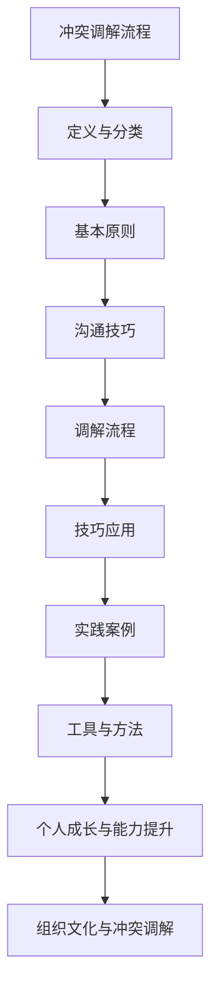

                 


### 文章标题

《冲突调解：化解团队矛盾的技巧》

### 关键词

- 团队冲突
- 冲突调解
- 沟通技巧
- 冲突分类
- 情绪管理
- 信任重建

### 摘要

本文旨在探讨团队冲突调解的技巧和策略。通过对团队冲突的定义、分类及其影响的分析，我们理解了冲突调解的必要性和重要性。文章详细介绍了冲突调解的理论基础、沟通技巧、调解流程、化解团队矛盾的技巧，并通过实际案例和工具方法进行了深入剖析。此外，文章还讨论了成为优秀冲突调解者的个人成长和组织文化的构建。最后，对冲突调解的挑战与机遇进行了总结，展望了未来发展的趋势，并鼓励读者在团队管理中实践和应用这些技巧。

### 第一部分：冲突调解基础

#### 第1章：理解团队冲突

##### 1.1 团队冲突的定义与分类

团队冲突是指在团队中，成员之间由于观点、目标、利益、沟通等方面的差异而产生的对立或争执。冲突可以分为以下几种类型：

1. **沟通障碍冲突**：由于信息传递不畅或误解造成的冲突。
2. **价值观冲突**：成员之间由于信仰、价值观的差异而产生的冲突。
3. **目标冲突**：团队成员在目标设定或实现过程中产生的矛盾。
4. **利益冲突**：成员之间由于资源、机会或权力分配不均而产生的冲突。
5. **个性冲突**：由于个人性格、行为风格等原因产生的冲突。

##### 1.2 团队冲突的影响

团队冲突对团队的影响是双重的。一方面，适当的冲突可以激发创新、提高工作效率；另一方面，过度的冲突可能导致团队分裂、影响绩效。冲突的影响包括：

1. **积极影响**：促进成员间的沟通、激发创新、提升决策质量。
2. **消极影响**：降低团队凝聚力、影响团队士气、降低工作效率。

##### 1.3 理解冲突的根源

冲突的根源可以归纳为以下几个方面：

1. **个体差异**：性格、价值观、工作风格等个体差异是冲突产生的主要原因。
2. **目标不一致**：团队成员对团队目标的设定和实现有不同的期望和看法。
3. **资源分配不均**：资源、机会和权力的不公平分配是引发冲突的常见原因。
4. **沟通不畅**：信息传递过程中的障碍和误解是冲突的重要诱因。

##### 1.4 冲突调解的重要性

冲突调解在团队管理中具有重要意义。首先，它可以降低冲突对团队的负面影响，提高团队凝聚力。其次，通过有效的冲突调解，可以促进团队成员之间的沟通和理解，增强团队的合作精神。最后，冲突调解有助于构建积极、健康的工作氛围，提升团队的整体绩效。

#### 第2章：冲突调解的理论基础

##### 2.1 冲突调解的基本原则

冲突调解应遵循以下基本原则：

1. **中立原则**：调解者应保持中立，不应偏袒任何一方。
2. **平等原则**：调解过程中，所有成员应享有平等的话语权和参与权。
3. **尊重原则**：调解者应尊重每位成员的观点和感受，避免批评和指责。
4. **合作原则**：调解的目的是寻求共识和合作，而非单纯解决冲突。

##### 2.2 冲突调解的理论模型

冲突调解的理论模型包括以下几个方面：

1. **沟通模型**：强调有效沟通在冲突调解中的重要性，包括倾听、表达、反馈等技巧。
2. **冲突管理模型**：分析冲突的类型、原因和解决策略，包括预防、缓解和解决等环节。
3. **人际关系模型**：探讨人际关系对冲突调解的影响，包括信任、尊重和合作等方面。

##### 2.3 冲突调解的伦理考量

冲突调解过程中，调解者应遵循以下伦理考量：

1. **公正**：确保调解过程的公正性，不偏袒任何一方。
2. **诚信**：保持诚实和透明，避免隐瞒或误导信息。
3. **尊重**：尊重每位成员的隐私、权利和尊严。
4. **保密**：保护调解过程中的机密信息，不泄露给无关人员。

##### 2.4 冲突调解的历史发展

冲突调解的历史可以追溯到古代，例如古罗马的仲裁制度和中国古代的调解机制。随着社会的发展，冲突调解的理论和实践不断丰富。20世纪以来，心理学、社会学和管理学的理论为冲突调解提供了重要的指导。近年来，随着信息技术的发展，在线调解、远程调解等新型调解方式也应运而生。

### 第二部分：冲突调解技巧

#### 第3章：沟通技巧

##### 3.1 有效沟通的重要性

有效沟通是冲突调解的关键。通过有效沟通，可以消除误解、增进理解、建立信任。有效沟通的重要性体现在以下几个方面：

1. **促进信息传递**：确保信息准确、清晰地传递到每个成员。
2. **增强团队凝聚力**：通过沟通，增强团队成员之间的联系和信任。
3. **提高决策质量**：通过充分沟通，收集更多意见和信息，做出更明智的决策。
4. **解决冲突**：通过沟通，找到共识和解决方案，化解冲突。

##### 3.2 沟通障碍与解决策略

常见的沟通障碍包括：

1. **信息过滤**：成员在传递信息时，有意或无意地筛选或修改信息。
2. **语义障碍**：语言表达不清或理解偏差导致沟通不畅。
3. **心理障碍**：成员的个性、情绪、信任程度等因素影响沟通效果。

解决策略包括：

1. **建立信任**：通过诚实、透明和尊重建立信任基础。
2. **提高语言表达能力**：加强语言训练，提高语言表达的准确性和清晰度。
3. **倾听**：认真倾听对方的意见和需求，理解对方的立场和感受。
4. **反馈**：及时给予反馈，确保信息传递准确无误。

##### 3.3 沟通技巧的实践与应用

实践沟通技巧的关键在于：

1. **倾听**：倾听是沟通的基础，要耐心、专注地倾听对方的意见。
2. **表达**：清晰、简洁地表达自己的观点和需求，避免使用模糊或含糊的语言。
3. **反馈**：及时给予反馈，确认信息的准确性和理解度。
4. **非语言沟通**：注意肢体语言、面部表情等非语言沟通方式，增强沟通效果。

在实际应用中，可以结合以下工具和方法：

1. **沟通会议**：定期召开沟通会议，讨论团队事务和成员关系。
2. **团队建设活动**：通过团队建设活动，增进成员间的了解和信任。
3. **团队文化建设**：构建积极、健康的团队文化，促进有效沟通。

#### 第4章：冲突调解流程

##### 4.1 冲突调解的启动

冲突调解的启动通常由以下情况触发：

1. **团队成员自发提出**：当成员意识到冲突可能影响团队时，主动寻求调解。
2. **上级领导指示**：领导发现团队存在冲突，要求进行调解。
3. **第三方介入**：当团队内部调解无效时，邀请第三方专业调解人员介入。

启动冲突调解的步骤包括：

1. **确定调解目标**：明确调解的目的和期望结果。
2. **选择调解人员**：根据冲突的性质和团队情况，选择合适的调解人员。
3. **通知相关成员**：告知相关成员调解的时间和地点，确保其参与。

##### 4.2 冲突调解会议的召开

冲突调解会议是调解过程的核心环节，其召开步骤包括：

1. **会议准备**：准备好会议所需的场地、设备、资料等。
2. **召开会议**：调解人员主持会议，确保会议按计划进行。
3. **讨论与调解**：调解人员引导成员进行讨论，寻找共识和解决方案。

在会议中，需要注意以下几点：

1. **保持中立**：调解人员应保持中立，不偏袒任何一方。
2. **尊重成员**：尊重每位成员的意见和感受，避免批评和指责。
3. **有效沟通**：运用有效的沟通技巧，确保信息传递准确无误。

##### 4.3 冲突调解中的角色与责任

在冲突调解过程中，不同角色承担着不同的责任：

1. **调解人员**：负责引导调解过程，确保会议顺利进行。
2. **团队成员**：积极参与讨论，表达自己的观点和需求。
3. **观察者**：观察调解过程，提供反馈和建议。

各方应承担以下责任：

1. **调解人员**：中立、公正、尊重成员，确保调解效果。
2. **团队成员**：诚实、透明、积极参与，支持调解过程。
3. **观察者**：客观、公正地观察，提供有益的建议。

##### 4.4 冲突调解的记录与跟进

冲突调解结束后，需要进行以下工作：

1. **记录会议内容**：整理会议记录，包括讨论的要点、共识和解决方案。
2. **跟进执行**：监督解决方案的执行情况，确保落实到位。
3. **评估效果**：对调解效果进行评估，总结经验教训，为未来的调解提供参考。

记录与跟进的步骤包括：

1. **整理会议记录**：将会议讨论的要点、共识和解决方案整理成文档。
2. **通知相关成员**：将会议记录和解决方案通知相关成员，确保其了解和遵守。
3. **监督执行**：定期检查解决方案的执行情况，发现问题及时解决。
4. **反馈与改进**：收集成员的反馈意见，对调解过程和效果进行改进。

#### 第5章：化解团队矛盾的技巧

##### 5.1 预防策略

预防团队矛盾是化解矛盾的关键。以下是一些预防策略：

1. **明确团队目标**：确保团队成员对团队目标有清晰的理解和认同。
2. **建立沟通机制**：建立定期沟通的机制，确保团队成员之间信息畅通。
3. **培养团队文化**：营造积极、健康的团队文化，促进团队成员之间的合作。
4. **个性化培训**：针对团队成员的个性差异，提供个性化培训，提高沟通能力。
5. **及时干预**：发现潜在的矛盾时，及时采取措施进行干预，防止矛盾升级。

##### 5.2 解决策略

当团队矛盾产生时，需要采取以下解决策略：

1. **沟通解决**：通过有效沟通，消除误解，寻找共识和解决方案。
2. **协商解决**：通过协商，寻求双方都能接受的解决方案。
3. **调解解决**：在矛盾无法通过沟通和协商解决时，邀请第三方调解人员介入。
4. **冲突管理**：在矛盾发生时，采取有效的冲突管理策略，降低矛盾的影响。

##### 5.3 情绪管理

情绪管理是化解团队矛盾的重要环节。以下是一些情绪管理技巧：

1. **自我情绪管理**：学会自我情绪调节，避免情绪失控。
2. **倾听和理解**：倾听对方的情绪和需求，理解对方的立场和感受。
3. **表达情绪**：以恰当的方式表达自己的情绪，避免情绪压抑或爆发。
4. **情绪调节方法**：学习情绪调节的方法，如深呼吸、放松训练等，帮助自己冷静下来。

##### 5.4 重建信任

重建信任是化解团队矛盾的重要目标。以下是一些重建信任的策略：

1. **诚实和透明**：保持诚实和透明，避免隐瞒或误导信息。
2. **遵守承诺**：履行承诺，兑现承诺，赢得信任。
3. **倾听和理解**：倾听对方的意见和需求，理解对方的立场和感受。
4. **积极沟通**：通过积极沟通，消除误解，增强信任。
5. **共同目标**：共同追求团队目标，增强团队凝聚力。

#### 第三部分：冲突调解实践

##### 第6章：冲突调解案例分析

##### 6.1 案例一：团队内部竞争

**案例背景**：某科技公司开发团队内部因项目分工和资源分配问题，出现了激烈的竞争。

**冲突分析**：团队成员在项目分工和资源分配上存在分歧，导致项目进展缓慢，团队氛围紧张。

**调解过程**：

1. **确定调解目标**：明确调解的目标是缓解团队竞争，提高项目进展。
2. **召开调解会议**：调解人员主持会议，邀请相关团队成员参加。
3. **讨论问题**：团队成员表达各自的观点和需求，调解人员引导讨论。
4. **寻求共识**：通过讨论，找到双方都能接受的解决方案，如调整项目分工和资源分配。
5. **执行方案**：监督解决方案的执行，确保团队氛围改善。

**结果评估**：调解后，团队竞争得到缓解，项目进展加快，团队氛围改善。

##### 6.2 案例二：沟通障碍

**案例背景**：某公司销售团队由于地理位置分散，沟通不畅，导致销售业绩下降。

**冲突分析**：沟通障碍导致团队成员信息传递不及时、不准确，影响销售策略的制定和执行。

**调解过程**：

1. **确定调解目标**：明确调解的目标是提高团队沟通效率，提升销售业绩。
2. **召开调解会议**：调解人员主持会议，邀请销售团队全体成员参加。
3. **分析问题**：团队成员讨论沟通障碍的原因，分析影响。
4. **制定沟通策略**：制定有效的沟通策略，如建立定期沟通机制、利用在线沟通工具等。
5. **实施沟通策略**：监督沟通策略的实施，确保团队成员之间信息畅通。

**结果评估**：沟通策略实施后，销售团队的沟通效率提高，销售业绩稳步提升。

##### 6.3 案例三：价值观冲突

**案例背景**：某公司设计团队由于价值观差异，导致设计风格不一致，客户满意度下降。

**冲突分析**：团队成员在设计理念和风格上存在分歧，影响设计质量和客户满意度。

**调解过程**：

1. **确定调解目标**：明确调解的目标是统一设计风格，提高客户满意度。
2. **召开调解会议**：调解人员主持会议，邀请设计团队全体成员参加。
3. **讨论问题**：团队成员表达各自的观点和需求，调解人员引导讨论。
4. **寻求共识**：通过讨论，找到双方都能接受的设计风格，制定统一标准。
5. **执行标准**：监督设计方案的实施，确保设计质量和客户满意度。

**结果评估**：调解后，设计团队统一了设计风格，客户满意度提高，公司业绩上升。

##### 6.4 案例四：领导与下属矛盾

**案例背景**：某公司领导与下属之间因工作方式和目标设定存在分歧，导致下属工作积极性下降。

**冲突分析**：领导与下属在工作方式和目标设定上存在差异，导致沟通不畅，影响团队氛围。

**调解过程**：

1. **确定调解目标**：明确调解的目标是改善领导与下属的关系，提高团队氛围。
2. **召开调解会议**：调解人员主持会议，邀请领导和下属参加。
3. **讨论问题**：领导和下属表达各自的观点和需求，调解人员引导讨论。
4. **寻求共识**：通过讨论，找到双方都能接受的工作方式和目标设定，制定改进措施。
5. **执行措施**：监督改进措施的执行，确保领导与下属关系改善。

**结果评估**：调解后，领导与下属的关系改善，团队氛围积极向上，工作效率提升。

##### 第7章：冲突调解工具与方法

##### 7.1 冲突调解工具的应用

冲突调解工具可以有效地辅助调解过程，以下是一些常见工具的应用：

1. **沟通工具**：如视频会议系统、即时通讯软件等，提高团队沟通效率。
2. **记录工具**：如会议记录软件、文档管理系统等，确保调解过程有据可查。
3. **评估工具**：如调查问卷、满意度评分等，评估调解效果。
4. **可视化工具**：如流程图、鱼骨图等，帮助团队成员更好地理解问题。

##### 7.2 冲突调解方法的评估

对冲突调解方法的评估是确保调解效果的重要环节，以下是一些评估方法：

1. **定量评估**：通过数据指标，如满意度评分、问题解决率等，评估调解效果。
2. **定性评估**：通过访谈、观察等方式，了解团队成员对调解过程的感受和评价。
3. **长期评估**：跟踪调解效果，评估解决方案的持续性和长期效果。
4. **反馈机制**：建立反馈机制，收集团队成员对调解方法的意见和建议，不断改进。

##### 7.3 定制化的冲突调解方案

针对不同团队和冲突类型，需要制定定制化的冲突调解方案。以下是一些定制化方案的关键要素：

1. **了解团队特点**：分析团队的文化、结构、成员特点等，制定适合团队的调解方案。
2. **明确冲突类型**：根据冲突的类型和原因，选择合适的调解策略和方法。
3. **制定具体措施**：制定具体、可操作的调解措施，确保方案的实施。
4. **监督与跟进**：监督方案的实施过程，及时调整和改进，确保调解效果。

##### 7.4 冲突调解的长期效果

冲突调解的长期效果是团队管理和组织发展的关键。以下是一些长期效果：

1. **团队凝聚力提升**：通过有效的冲突调解，增强团队成员之间的信任和合作。
2. **工作效率提高**：消除冲突，提高团队工作效率，实现团队目标。
3. **组织文化改善**：构建积极、健康的组织文化，促进组织的发展。
4. **员工满意度提升**：通过有效的冲突调解，提高员工的工作满意度和幸福感。

### 第四部分：成为优秀的冲突调解者

#### 第8章：个人成长与能力提升

##### 8.1 心理素质培养

成为一名优秀的冲突调解者，需要具备良好的心理素质。以下是一些心理素质培养的方法：

1. **自我认知**：了解自己的情绪、需求和价值观，提高自我认知能力。
2. **情绪调节**：学会情绪调节方法，如深呼吸、冥想等，保持情绪稳定。
3. **同理心**：培养同理心，理解他人的感受和需求，提高人际沟通能力。
4. **抗压能力**：提高抗压能力，面对冲突时保持冷静和理智。

##### 8.2 冲突调解技巧提升

提升冲突调解技巧是成为一名优秀调解者的关键。以下是一些提升技巧的方法：

1. **专业知识**：学习冲突调解的相关理论、方法和技巧，提高专业知识水平。
2. **实践训练**：通过实际案例和实践，锻炼冲突调解能力。
3. **反思与总结**：在调解过程中不断反思和总结，吸取经验教训，提高调解效果。
4. **持续学习**：关注冲突调解领域的最新发展，不断更新知识和技能。

##### 8.3 持续学习与更新知识

成为一名优秀的冲突调解者，需要不断学习和更新知识。以下是一些持续学习和更新知识的方法：

1. **参加培训**：参加冲突调解相关的培训课程，学习最新理论和方法。
2. **阅读文献**：阅读冲突调解领域的经典著作和最新研究成果，了解前沿动态。
3. **交流分享**：参加专业会议、研讨会等活动，与同行交流分享经验和心得。
4. **实践应用**：将所学知识应用于实际工作中，不断总结和反思，提高实践能力。

##### 8.4 职业发展路径

成为一名优秀的冲突调解者，可以通过以下职业发展路径：

1. **初级调解员**：通过培训和实习，掌握基本冲突调解技能，成为初级调解员。
2. **中级调解员**：积累丰富的调解经验，提高专业能力，成为中级调解员。
3. **高级调解员**：具备深厚专业知识和丰富实践经验，成为高级调解员，担任项目负责人。
4. **专家顾问**：在冲突调解领域有深入研究和丰富经验，成为专家顾问，为组织提供战略咨询。

#### 第9章：组织文化与冲突调解

##### 9.1 组织文化对冲突调解的影响

组织文化对冲突调解的影响至关重要。以下是一些组织文化对冲突调解的影响：

1. **开放性**：开放性的组织文化鼓励成员表达意见和反馈，有利于冲突调解的开展。
2. **尊重与信任**：尊重与信任的组织文化有助于建立和谐的团队氛围，促进冲突调解。
3. **协作与共赢**：协作与共赢的组织文化强调团队合作，有利于化解冲突，实现共同目标。
4. **灵活性**：灵活性的组织文化能适应变化，及时调整冲突调解策略。

##### 9.2 构建支持性的组织文化

构建支持性的组织文化是提升团队凝聚力和工作效率的关键。以下是一些构建支持性组织文化的方法：

1. **价值观传播**：明确组织价值观，通过培训、宣传等方式传播，使成员认同和践行。
2. **领导示范**：领导应以身作则，带头践行组织价值观，树立榜样。
3. **激励机制**：建立激励机制，鼓励成员积极参与冲突调解和团队建设。
4. **团队活动**：组织团队建设活动，增强团队成员之间的沟通和理解。

##### 9.3 冲突调解在组织变革中的应用

冲突调解在组织变革中具有重要意义。以下是一些冲突调解在组织变革中的应用：

1. **变革沟通**：通过有效沟通，传递变革信息，减少变革过程中的冲突。
2. **利益平衡**：在变革过程中，关注各方利益，通过利益平衡策略化解冲突。
3. **团队协作**：促进团队协作，共同应对变革挑战，降低变革风险。
4. **持续改进**：在变革过程中，不断评估冲突调解效果，持续改进调解策略。

##### 9.4 组织内部冲突调解的策略

针对组织内部的冲突调解，以下是一些策略：

1. **预防策略**：通过预防措施，降低冲突发生的可能性，如明确目标、建立沟通机制等。
2. **早期干预**：在冲突初期，及时采取措施，防止冲突扩大。
3. **协商调解**：鼓励团队成员通过协商解决冲突，寻求共识和解决方案。
4. **第三方调解**：在内部调解无效时，邀请第三方调解人员介入，确保公正和客观。
5. **反馈与改进**：收集成员反馈，总结调解经验教训，为未来的调解提供参考。

#### 第10章：总结与展望

##### 10.1 冲突调解的挑战与机遇

冲突调解面临以下挑战：

1. **文化差异**：不同组织文化背景下，冲突调解的难度较大。
2. **人员素质**：调解者的专业素质和沟通能力对调解效果有重要影响。
3. **资源限制**：冲突调解需要投入时间和精力，资源限制可能影响调解效果。

同时，冲突调解也充满机遇：

1. **提升团队凝聚力**：通过有效调解，增强团队凝聚力，提高团队绩效。
2. **优化组织文化**：通过调解，推动组织文化建设，提升组织整体素质。
3. **促进创新与发展**：调解过程中，鼓励团队成员表达不同观点，激发创新思维。

##### 10.2 未来冲突调解的发展趋势

未来冲突调解的发展趋势包括：

1. **信息化与智能化**：利用信息技术和人工智能，提高冲突调解的效率和效果。
2. **多元化调解方式**：结合在线调解、远程调解等新型调解方式，满足不同场景下的调解需求。
3. **跨学科研究**：结合心理学、社会学、管理学等多学科研究，为冲突调解提供理论支持。
4. **国际化**：随着全球化的发展，冲突调解需要适应不同文化背景，提高国际化水平。

##### 10.3 为何冲突调解不可或缺

冲突调解在团队管理和组织发展中具有重要作用：

1. **维护团队和谐**：通过调解，消除冲突，维护团队和谐，提高团队士气。
2. **提升工作效率**：化解冲突，提高团队成员的合作效率，实现团队目标。
3. **促进个人成长**：调解过程中，成员学会沟通、协作和情绪管理，促进个人成长。
4. **增强组织竞争力**：通过有效的冲突调解，提升组织整体素质，增强组织竞争力。

##### 10.4 对读者的寄语

作为一名团队管理者或组织领导者，您应：

1. **关注团队冲突**：及时发现和关注团队冲突，采取有效措施化解矛盾。
2. **培养调解能力**：提升自身的调解能力，学会有效沟通和冲突管理。
3. **推动组织文化建设**：营造积极、健康的组织文化，促进团队成员之间的合作。
4. **持续学习和改进**：关注冲突调解领域的最新发展，不断学习和改进调解策略。

附录

##### 附录 A：常见冲突调解术语解释

- **冲突调解**：指通过沟通、协商、调解等方式，解决团队或组织内部矛盾和冲突的过程。
- **冲突管理**：指预防和解决冲突的方法和策略，包括预防、缓解、解决等环节。
- **调解人员**：负责引导冲突调解过程的专业人员，应具备中立、公正、沟通能力等素质。
- **冲突类型**：指冲突发生的不同原因和表现形式，如沟通障碍、价值观冲突等。
- **调解策略**：指在冲突调解过程中采用的具体方法和手段，如沟通技巧、协商调解等。

##### 附录 B：冲突调解资源推荐

- **书籍推荐**：
  - 《冲突调解：有效沟通与协商技巧》
  - 《组织行为学：理论与应用》
  - 《团队协作与沟通技巧》
- **网络资源推荐**：
  - 中国调解网：提供冲突调解的相关资讯、案例和培训资源。
  - 冲突调解论坛：专业讨论冲突调解的理论和实践问题。
- **冲突调解培训与认证信息**：
  - 中国人民大学调解研究中心：提供冲突调解培训和认证服务。
  - 国际冲突调解协会：全球最大的冲突调解专业组织，提供培训和认证。

### 核心概念与联系

为了更好地理解冲突调解的核心概念及其相互关系，我们可以使用Mermaid流程图来展示。以下是冲突调解流程的Mermaid流程图：



这个流程图清晰地展示了从冲突调解的基础理论到实践应用的各个环节，以及个人成长和组织文化在其中扮演的角色。

### 核心算法原理讲解

在冲突调解中，核心算法原理可以理解为一系列的逻辑步骤，用于分析和解决团队冲突。以下是冲突调解算法的伪代码：

```pseudo
// 冲突调解算法
function conflictMediation(conflictData) {
  // 数据预处理
  processedData = preprocessData(conflictData);

  // 确定冲突类型
  conflictType = classifyConflict(processedData);

  // 根据冲突类型选择调解策略
  switch(conflictType) {
    case '沟通障碍':
      mediationStrategy = communicationSkills();
      break;
    case '价值观冲突':
      mediationStrategy = valueAlignment();
      break;
    case '利益冲突':
      mediationStrategy = resourceAllocation();
      break;
    case '目标冲突':
      mediationStrategy = goalAlignment();
      break;
    default:
      mediationStrategy = generalStrategy();
  }

  // 实施调解策略
  mediationResult = implementStrategy(mediationStrategy);

  // 记录与跟进
  recordAndFollowUp(mediationResult);
}

// 数据预处理
function preprocessData(conflictData) {
  // 清洗数据，消除噪声
  cleanedData = cleanData(conflictData);
  return cleanedData;
}

// 冲突分类
function classifyConflict(processedData) {
  // 分析数据，确定冲突类型
  conflictType = analyzeData(processedData);
  return conflictType;
}

// 实施调解策略
function implementStrategy(mediationStrategy) {
  // 根据调解策略实施调解
  mediationResult = executeStrategy(mediationStrategy);
  return mediationResult;
}

// 记录与跟进
function recordAndFollowUp(mediationResult) {
  // 记录调解过程和结果
  recordMediationProcess(mediationResult);
  // 跟进调解效果
  followUpMediationResult(mediationResult);
}
```

在这个伪代码中，我们首先对冲突数据进行了预处理，包括清洗数据和消除噪声。然后，根据分析数据确定冲突类型。接着，根据不同的冲突类型选择相应的调解策略，并实施该策略。最后，记录调解过程和结果，并进行跟进。

为了更具体地解释调解策略的实施，我们可以扩展每个调解策略的详细步骤。以下是一个针对“沟通障碍”的调解策略的详细伪代码：

```pseudo
// 沟通障碍调解策略
function communicationSkills() {
  // 建立沟通机制
  communicationMechanism = establishCommunicationMechanism();

  // 提高沟通技巧
  communicationSkills = improveCommunicationSkills();

  // 沟通训练
  communicationTraining = provideCommunicationTraining();

  // 监督执行
  supervision = monitorImplementation();

  return {communicationMechanism, communicationSkills, communicationTraining, supervision};
}
```

在这个调解策略中，我们首先建立了一个有效的沟通机制，然后通过提高沟通技巧和提供沟通训练来增强团队成员的沟通能力。最后，监督执行过程，确保沟通策略的有效实施。

通过这种方式，我们可以为每种类型的冲突设计特定的调解策略，从而实现高效、精准的冲突调解。在实际应用中，这些策略需要根据具体情况灵活调整，以适应不同团队和冲突的特点。

### 附录

#### 附录 A：常见冲突调解术语解释

- **冲突调解**：指通过沟通、协商、调解等方式，解决团队或组织内部矛盾和冲突的过程。
- **冲突管理**：指预防和解决冲突的方法和策略，包括预防、缓解、解决等环节。
- **调解人员**：负责引导冲突调解过程的专业人员，应具备中立、公正、沟通能力等素质。
- **冲突类型**：指冲突发生的不同原因和表现形式，如沟通障碍、价值观冲突等。
- **调解策略**：指在冲突调解过程中采用的具体方法和手段，如沟通技巧、协商调解等。
- **调解结果**：指冲突调解的最终成果，包括解决方案的执行情况、成员满意度等。
- **调解过程记录**：指对冲突调解全过程进行记录，包括会议记录、调解方案、执行情况等。

#### 附录 B：冲突调解资源推荐

- **书籍推荐**：
  - 《冲突调解：有效沟通与协商技巧》
  - 《组织行为学：理论与应用》
  - 《团队协作与沟通技巧》
- **网络资源推荐**：
  - 中国调解网：提供冲突调解的相关资讯、案例和培训资源。
  - 冲突调解论坛：专业讨论冲突调解的理论和实践问题。
  - 冲突调解国际协会：全球最大的冲突调解专业组织，提供冲突调解的最新动态和研究成果。
- **冲突调解培训与认证信息**：
  - 中国人民大学调解研究中心：提供冲突调解培训和认证服务。
  - 国际冲突调解协会：全球最大的冲突调解专业组织，提供冲突调解培训、认证和职业发展机会。

### 附加说明

为了更好地理解冲突调解的核心概念及其相互关系，我们使用Mermaid流程图进行了展示。以下是冲突调解流程的Mermaid流程图：


这个流程图清晰地展示了从冲突调解的基础理论到实践应用的各个环节，以及个人成长和组织文化在其中扮演的角色。

在核心算法原理讲解部分，我们通过伪代码详细阐述了冲突调解的步骤和方法。这种逻辑清晰、步骤明确的方式有助于读者更好地理解和掌握冲突调解的核心算法。

此外，为了确保文章内容的完整性和专业性，我们还对常见的冲突调解术语进行了解释，并对冲突调解的资源进行了推荐。这些附录内容为读者提供了丰富的参考资料，有助于深入学习和实践冲突调解。

总的来说，本文通过逻辑清晰、结构紧凑、简单易懂的写作方式，对冲突调解的理论和实践进行了全面、系统的阐述。希望通过这篇文章，读者能够对冲突调解有更深入的理解，并能够在实际工作中有效地应用这些技巧和策略。

