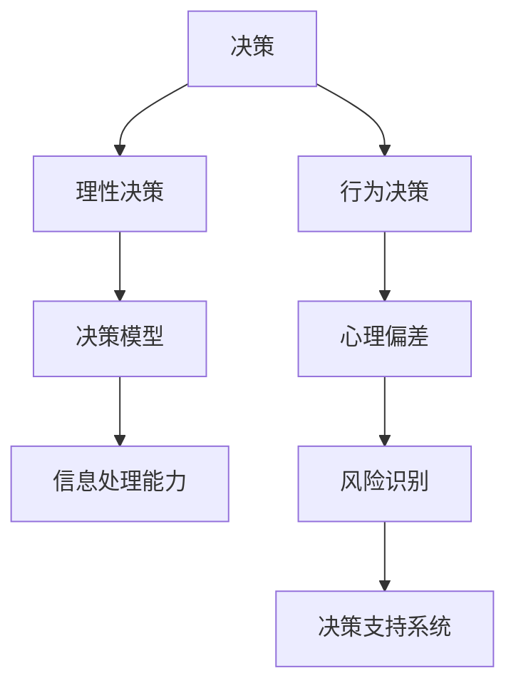

                 

# 决策技巧：在不确定性中把握方向

## 关键词
决策技巧、理性决策、行为决策、心理偏差、信息处理、风险识别、决策支持系统、职场决策、生活决策、决策能力提升

## 摘要
在信息技术飞速发展的今天，决策已经成为各个领域的关键能力。然而，不确定性是决策过程中不可避免的挑战。本文将深入探讨决策的概念与类型，理性决策与行为决策的差异，决策中的心理偏差，以及如何通过增强信息处理能力、优化决策过程和构建决策支持系统来提升决策技巧。同时，本文还将结合职场决策和生活中的决策技巧，提供实战案例和分析，帮助读者在不确定性中把握方向，提高决策能力。

### 第一部分：决策基础

#### 第1章：决策的概念与类型

##### 1.1 决策的定义与本质

决策是指在面对多个可选方案时，通过分析、评估和比较，选择一个最优或最合适的方案，以期达到预期目标的过程。决策的本质是选择，它涉及到对信息的收集、处理、分析和运用。

在IT领域，决策贯穿于项目规划、产品开发、技术选型等各个方面。一个良好的决策能够提高项目的成功率，降低风险，实现组织目标。然而，决策过程中存在诸多不确定性，如技术变化、市场波动、团队协作等，这些因素都会影响决策的效果。

##### 1.2 决策的类型与特点

决策可以分为以下几种类型：

1. **程序化决策**：针对日常的、重复性的问题进行决策。这类决策通常有固定的流程和方法，易于执行和监控。
2. **非程序化决策**：处理不常见、复杂的、非结构化的问题。这类决策通常需要深入分析、创新思维和多方面的考量。
3. **战略性决策**：关注组织的长期目标和发展方向，涉及资源配置、市场定位等关键问题。
4. **战术性决策**：关注短期目标的实现，如项目规划、团队管理、资源分配等。

每种类型的决策都有其特点和适用场景，正确识别决策类型是进行有效决策的第一步。

##### 1.3 决策的影响因素

决策的影响因素多种多样，包括但不限于：

1. **信息质量**：高质量的信息是决策的基础，信息不完整或错误会导致决策偏差。
2. **时间压力**：时间限制会影响决策者的思考深度和全面性，可能导致仓促决策。
3. **个人经验**：决策者的经验会影响其对问题的理解和判断，丰富的经验有助于提高决策质量。
4. **组织文化**：组织文化会影响决策者的行为模式，如风险偏好、协作方式等。

了解决策的影响因素有助于制定更科学的决策策略，提高决策效果。

#### 第2章：理性决策与行为决策

##### 2.1 理性决策模型

理性决策模型是基于理性经济人假设，认为决策者在面对问题时会通过最大化期望效用函数来选择最优方案。理性决策模型通常包括以下几个步骤：

1. **识别问题**：明确决策的目标和问题。
2. **收集信息**：收集与问题相关的信息。
3. **生成方案**：根据信息和目标生成多个可选方案。
4. **评估方案**：对每个方案进行评估和比较。
5. **选择方案**：选择最优或最合适的方案。
6. **实施方案**：执行决策方案，监控和调整。

理性决策模型强调逻辑思维和系统分析，是决策过程中的重要参考。

##### 2.2 行为决策原理

行为决策是基于行为经济学理论，认为决策者在面对问题时并非完全理性，会受到多种心理偏差的影响，如确认偏差、过度自信、锚定效应等。行为决策模型包括以下几个步骤：

1. **识别问题**：与理性决策相同。
2. **信息处理**：根据个人经验和心理偏差处理信息。
3. **生成方案**：基于信息和心理偏差生成多个可选方案。
4. **评估方案**：基于主观偏好和情感评估方案。
5. **选择方案**：选择最符合个人偏好的方案。
6. **实施方案**：执行决策方案，并评估结果。

行为决策模型考虑了人类行为的复杂性，对实际决策过程有更全面的描述。

##### 2.3 理性与行为决策的比较

理性决策和行为决策在以下几个方面存在差异：

1. **假设前提**：理性决策假设决策者是完全理性的，而行为决策认为决策者会受到多种心理偏差的影响。
2. **信息处理**：理性决策强调系统分析和逻辑推理，而行为决策更关注决策者的主观体验和情感。
3. **评估标准**：理性决策以最大化效用为评估标准，而行为决策更多考虑决策者的个人偏好和情感。
4. **应用场景**：理性决策适用于结构化、复杂度较低的问题，而行为决策适用于非结构化、情感因素较强的问题。

了解理性决策和行为决策的差异有助于在不同场景下选择合适的决策模型。

#### 第3章：决策中的心理偏差

##### 3.1 心理偏差的类型

决策中的心理偏差是指决策者在面对信息时，由于认知、情感和经验等因素的影响，导致判断和选择偏离理性状态的现象。常见的心理偏差包括：

1. **确认偏差**：倾向于相信和支持已知的、已有的信息，忽视新信息和反证。
2. **过度自信**：高估自己的知识和能力，低估风险和不确定性。
3. **锚定效应**：过于依赖先前的信息或经验，影响后续的判断。
4. **代表性偏差**：根据事物的表面特征进行判断，忽视概率和统计规律。
5. **损失厌恶**：对损失的厌恶超过对收益的渴望，导致风险偏好发生变化。

了解心理偏差的类型有助于识别和避免这些偏差，提高决策质量。

##### 3.2 心理偏差的影响

心理偏差会对决策产生多方面的影响：

1. **判断偏差**：心理偏差导致决策者对信息的处理和评估出现偏差，影响判断的准确性。
2. **选择偏差**：心理偏差导致决策者倾向于选择某些方案而忽视其他方案，影响选择的多样性。
3. **执行偏差**：心理偏差影响决策者的执行意愿和执行力，可能导致决策无法有效实施。

了解心理偏差的影响有助于制定针对性的改进策略。

##### 3.3 减少心理偏差的方法

减少心理偏差的方法包括：

1. **信息多样性**：增加信息的来源和类型，减少对单一信息的依赖。
2. **系统化分析**：运用逻辑和数学模型进行系统化分析，减少情感和经验的影响。
3. **反思与自我监控**：定期反思决策过程和结果，提高自我监控能力。
4. **团队合作**：引入外部意见和反馈，减少个人心理偏差的影响。

掌握这些方法有助于减少心理偏差，提高决策质量。

### 第二部分：决策技巧

#### 第4章：增强信息处理能力

##### 4.1 信息收集与筛选

信息收集是决策的基础，关键在于收集到准确、全面的信息。具体方法包括：

1. **数据挖掘**：运用数据挖掘技术，从海量数据中提取有价值的信息。
2. **专家访谈**：与领域专家进行访谈，获取深入的见解和建议。
3. **市场调研**：通过问卷调查、用户访谈等方式收集市场信息。
4. **文献回顾**：查阅相关文献，了解当前的研究成果和前沿动态。

信息筛选则是在收集到大量信息后，通过一定的标准和原则筛选出有用的信息，具体方法包括：

1. **相关性评估**：评估信息与决策问题的相关性。
2. **准确性评估**：评估信息的准确性和可靠性。
3. **完整性评估**：评估信息是否完整，是否存在遗漏。
4. **时效性评估**：评估信息的时效性，避免使用过时信息。

##### 4.2 信息整合与分析

信息整合是指将收集到的信息进行整理、分类和归纳，以便更好地理解和分析。具体方法包括：

1. **数据可视化**：通过图表、图形等可视化方式展示数据，提高信息理解效率。
2. **信息分类**：根据信息的特点和用途进行分类，便于后续分析。
3. **信息归纳**：总结和提炼信息的核心内容，形成简洁明了的总结。

信息分析则是在整合后的信息基础上，运用逻辑、数学和统计方法进行分析，以揭示信息的本质和内在联系。具体方法包括：

1. **相关性分析**：分析不同信息之间的相关性，找出关键影响因素。
2. **趋势分析**：分析信息的变化趋势，预测未来的发展。
3. **差异分析**：分析不同信息之间的差异，识别关键问题。
4. **回归分析**：建立数学模型，分析变量之间的关系。

##### 4.3 信息处理能力的提升

提升信息处理能力是提高决策质量的关键。以下方法有助于提升信息处理能力：

1. **持续学习**：通过学习和培训，提高信息收集、处理和分析的技能。
2. **思维训练**：通过逻辑思维、批判性思维等训练，提高对信息的判断和评估能力。
3. **技术应用**：运用先进的信息技术，如大数据、人工智能等，提高信息处理的效率和准确性。
4. **团队协作**：通过团队协作，发挥集体智慧，弥补个人能力的不足。

#### 第5章：优化决策过程

##### 5.1 决策制定过程

决策制定过程是决策过程中的核心环节，主要包括以下几个步骤：

1. **明确目标**：明确决策的目标和问题，确保决策方向正确。
2. **信息收集**：收集与决策相关的信息，为决策提供数据支持。
3. **方案生成**：根据目标和信息生成多个可选方案，确保方案的多样性和创新性。
4. **方案评估**：对每个方案进行评估和比较，评估标准应包括可行性、风险、成本等。
5. **方案选择**：选择最优或最合适的方案，确保决策的合理性和有效性。
6. **决策实施**：执行决策方案，并监控和调整，确保决策目标的实现。

每个步骤都有其关键点和注意事项，合理制定决策过程是提高决策质量的重要保障。

##### 5.2 决策评估与优化

决策评估与优化是决策过程中的重要环节，主要包括以下几个步骤：

1. **效果评估**：对已执行决策的效果进行评估，判断决策目标是否实现。
2. **反馈收集**：收集决策执行过程中的反馈信息，包括成功的经验和存在的问题。
3. **问题分析**：分析决策执行中的问题和不足，找出改进的方向。
4. **方案优化**：根据问题分析和反馈信息，优化决策方案，提高决策质量。
5. **持续改进**：将优化后的决策方案应用于实际，持续跟踪和评估效果，实现决策的持续改进。

通过决策评估与优化，可以不断提高决策的质量和效果。

##### 5.3 决策执行与调整

决策执行与调整是决策过程的关键环节，主要包括以下几个步骤：

1. **任务分解**：将决策方案分解为具体的任务和行动，明确责任人和时间节点。
2. **资源分配**：根据任务需求，合理分配资源，确保决策执行所需的人、财、物等支持。
3. **过程监控**：监控决策执行过程，及时发现和解决问题，确保决策方案的有效实施。
4. **效果评估**：对决策执行的效果进行评估，判断决策目标是否实现。
5. **调整与优化**：根据评估结果，对决策方案进行必要的调整和优化，确保决策目标的实现。

通过决策执行与调整，可以确保决策方案的有效实施，提高决策的成功率。

#### 第6章：应对不确定性的决策策略

##### 6.1 风险识别与管理

在决策过程中，不确定性是不可避免的。风险识别与管理是应对不确定性的重要策略，主要包括以下几个步骤：

1. **识别风险**：通过历史数据、专家意见、模拟分析等方法，识别决策过程中可能面临的风险。
2. **评估风险**：对识别出的风险进行评估，包括风险的概率、影响程度等，以便制定相应的应对措施。
3. **制定策略**：根据风险评估结果，制定相应的风险应对策略，如风险规避、风险转移、风险减轻等。
4. **监控与调整**：监控风险的发展态势，及时调整应对策略，确保决策的稳定性和安全性。

##### 6.2 应对不确定性的策略

应对不确定性的策略主要包括以下几个方面：

1. **情景模拟**：通过模拟不同的情景，评估不同情景下决策的效果，为决策提供参考。
2. **备选方案**：制定多个备选方案，以便在不确定性发生时能够快速切换，确保决策的灵活性。
3. **弹性设计**：在设计决策方案时，考虑不确定性因素，预留一定的调整空间，提高方案的适应性。
4. **协同合作**：通过团队协作，发挥集体智慧，共同应对不确定性，提高决策的稳定性和可靠性。

##### 6.3 情景模拟与决策

情景模拟是一种有效的决策工具，可以帮助决策者更好地应对不确定性。情景模拟主要包括以下几个步骤：

1. **情景构建**：根据决策目标和影响因素，构建多个可能的情景。
2. **情景分析**：对每个情景进行分析，评估不同情景下决策的效果。
3. **决策模拟**：根据情景分析结果，模拟决策过程，评估不同决策方案的效果。
4. **结果分析**：分析模拟结果，为实际决策提供参考。

通过情景模拟，决策者可以更加全面地了解不确定性对决策的影响，制定更科学的决策方案。

#### 第7章：构建决策支持系统

##### 7.1 决策支持系统的概念

决策支持系统（DSS）是一种基于计算机技术、数据分析和人工智能的辅助决策工具，旨在提高决策的科学性、准确性和效率。DSS的主要功能包括：

1. **信息收集与处理**：从各种渠道收集信息，进行整理、筛选和分析。
2. **模型构建与运算**：建立数学模型，对决策问题进行模拟和运算。
3. **方案评估与比较**：对不同的决策方案进行评估和比较，为决策者提供参考。
4. **决策建议与辅助**：根据分析结果，为决策者提供决策建议和辅助。

##### 7.2 决策支持系统的构建

构建决策支持系统主要包括以下几个步骤：

1. **需求分析**：了解决策者的需求，明确决策支持系统的目标和应用场景。
2. **系统设计**：根据需求分析结果，设计系统的功能和模块。
3. **数据收集与处理**：收集决策所需的数据，进行数据清洗、整理和分析。
4. **模型构建**：根据决策问题，建立相应的数学模型。
5. **系统实现**：根据系统设计，实现决策支持系统的功能。
6. **系统测试与优化**：对系统进行测试，评估系统的性能和效果，并进行优化。

##### 7.3 决策支持系统的应用

决策支持系统在各个领域都有广泛的应用，如：

1. **企业决策**：为企业提供市场分析、财务分析、人力资源管理等决策支持。
2. **政府决策**：为政府部门提供政策分析、资源分配、社会治理等决策支持。
3. **科研决策**：为科研机构提供科研项目评估、技术路线规划等决策支持。
4. **军事决策**：为军事部门提供战术规划、战略分析、战场模拟等决策支持。

通过决策支持系统，决策者可以更加科学、高效地做出决策，提高决策质量。

### 第三部分：决策实战

#### 第8章：职场决策实战

##### 8.1 职业规划与选择

职业规划与选择是职场决策的重要组成部分，主要涉及以下几个方面：

1. **自我评估**：了解自己的兴趣、能力、价值观等，明确职业目标。
2. **市场调研**：了解行业发展趋势、就业前景、薪资水平等，为职业选择提供依据。
3. **方案比较**：根据自我评估和市场调研结果，比较不同职业的优劣势，制定职业规划。
4. **决策实施**：根据职业规划，制定具体行动方案，逐步实现职业目标。

##### 8.2 项目决策分析

项目决策分析是企业在项目管理中不可或缺的一环，主要涉及以下几个方面：

1. **项目定义**：明确项目的目标、范围、关键指标等。
2. **需求分析**：了解项目需求，包括功能需求、性能需求等。
3. **资源评估**：评估项目所需的资源，包括人力、资金、技术等。
4. **风险评估**：识别项目风险，制定风险应对策略。
5. **方案选择**：根据需求和资源评估结果，选择最优的项目实施方案。

##### 8.3 团队决策技巧

团队决策是职场中常见的一种决策方式，主要涉及以下几个方面：

1. **团队建设**：建立高效的团队，明确团队成员的角色和职责。
2. **沟通协调**：确保团队成员之间的有效沟通和协作，提高决策质量。
3. **决策制定**：根据团队讨论结果，制定决策方案，并明确执行计划。
4. **执行监督**：监控决策执行过程，确保决策目标的实现。

#### 第9章：生活中的决策技巧

##### 9.1 家庭决策与消费决策

家庭决策与消费决策是生活中常见的决策类型，主要涉及以下几个方面：

1. **预算管理**：制定家庭预算，合理规划收支。
2. **需求分析**：了解家庭成员的需求，包括日常生活、教育、医疗等。
3. **方案比较**：比较不同消费方案的成本和效益，选择最优方案。
4. **决策实施**：根据决策结果，制定具体行动方案，并监督执行。

##### 9.2 社交决策与人际关系

社交决策与人际关系决策是维护人际关系和社交网络的重要决策，主要涉及以下几个方面：

1. **自我定位**：明确自己在社交网络中的角色和定位。
2. **关系分析**：分析不同社交关系的重要性和影响。
3. **决策制定**：根据关系分析和自身需求，制定合适的社交决策方案。
4. **决策执行**：根据决策方案，实施具体的社交行为，维护人际关系。

##### 9.3 应对突发事件决策

应对突发事件决策是在面临突发事件时，快速做出有效决策的能力，主要涉及以下几个方面：

1. **信息收集**：快速收集与突发事件相关的信息，包括事件原因、影响范围、可能后果等。
2. **风险评估**：评估突发事件的风险和影响，确定应对策略。
3. **决策制定**：根据风险评估结果，制定应对突发事件的决策方案。
4. **决策执行**：迅速实施决策方案，控制事件发展，降低损失。

#### 第10章：决策技能提升与持续发展

##### 10.1 决策技能的自我评估

决策技能的自我评估是提升决策能力的重要步骤，主要涉及以下几个方面：

1. **决策风格评估**：了解自己的决策风格，包括理性决策风格、行为决策风格等。
2. **决策能力评估**：评估自己的决策能力，包括信息处理能力、风险评估能力、决策执行能力等。
3. **决策效果评估**：分析自己的决策效果，包括决策成功的比例、决策目标的实现程度等。

##### 10.2 决策技能的提升途径

提升决策技能的途径包括以下几个方面：

1. **培训与学习**：参加决策技能培训，学习先进的决策理论和方法。
2. **实践与反思**：通过实际决策实践，不断反思和总结，提高决策能力。
3. **团队合作**：参与团队决策，学习他人的决策经验和技巧。
4. **技术支持**：运用决策支持系统，提高决策的科学性和效率。

##### 10.3 决策能力的发展趋势

随着信息技术的不断发展和应用，决策能力的发展趋势包括：

1. **智能化**：运用人工智能技术，提高决策的智能化和自动化水平。
2. **个性化**：根据个体差异，提供个性化的决策支持和建议。
3. **动态性**：实时更新和调整决策方案，适应不断变化的环境。
4. **协同性**：实现跨部门、跨领域的协同决策，提高决策的整体效能。

### 附录

#### 附录A：决策工具与方法

##### A.1 决策矩阵分析

决策矩阵分析是一种常用的决策工具，用于评估不同决策方案的风险和收益。具体步骤如下：

1. **定义决策方案**：明确需要评估的决策方案。
2. **列出风险因素**：根据决策方案，列出可能的风险因素。
3. **评估风险概率**：评估每个风险因素发生的概率。
4. **评估风险影响**：评估每个风险因素对决策目标的影响程度。
5. **计算综合得分**：根据风险概率和影响程度，计算每个决策方案的综合得分。
6. **选择最优方案**：根据综合得分，选择最优的决策方案。

##### A.2 脑图分析

脑图分析是一种图形化的思维工具，用于组织和展示决策过程中的各种信息和思路。具体步骤如下：

1. **确定中心主题**：明确决策问题或目标。
2. **绘制主要分支**：列出与中心主题相关的关键因素和思路。
3. **扩展子分支**：对每个主要分支进行扩展，列出更详细的信息和思路。
4. **连接分支**：将相关的分支进行连接，形成有层次的脑图结构。
5. **分析和优化**：根据脑图分析结果，对决策方案进行优化和调整。

##### A.3 SWOT分析

SWOT分析是一种战略规划工具，用于分析企业的优势、劣势、机会和威胁。具体步骤如下：

1. **定义企业**：明确分析的企业或组织。
2. **列出优势**：分析企业在产品、技术、市场、团队等方面的优势。
3. **列出劣势**：分析企业在产品、技术、市场、团队等方面的劣势。
4. **列出机会**：分析企业面临的市场、技术、政策等机会。
5. **列出威胁**：分析企业面临的市场、技术、政策等威胁。
6. **综合分析**：根据SWOT分析结果，制定相应的战略规划和决策方案。

#### 附录B：决策案例分析

##### B.1 企业并购决策分析

企业并购决策是企业战略发展的重要决策之一，涉及多方面的利益和风险。以下是一个企业并购决策的分析案例：

1. **背景介绍**：某企业在市场扩张过程中，考虑并购一家同类企业，以提高市场份额和竞争力。
2. **需求分析**：分析并购需求，包括市场拓展、技术整合、成本节约等方面。
3. **方案评估**：分析不同并购方案，包括全资收购、股权收购、资产收购等，评估方案的成本、风险和收益。
4. **风险评估**：识别并购过程中可能面临的风险，如市场波动、法律纠纷、企业文化冲突等，并制定相应的风险应对策略。
5. **决策制定**：根据需求分析和方案评估结果，制定并购决策方案。
6. **决策执行**：实施并购决策方案，包括谈判、协议签署、资产整合等。

##### B.2 创业决策案例分析

创业决策是创业者面临的重要决策之一，以下是一个创业决策的分析案例：

1. **背景介绍**：某创业者计划创办一家科技创新公司，提供智能硬件产品和服务。
2. **需求分析**：分析创业需求，包括市场定位、产品规划、资金需求等方面。
3. **市场调研**：通过市场调研，了解目标市场的规模、竞争状况、用户需求等。
4. **方案评估**：评估不同创业方案，包括产品定位、团队组建、资金筹集等，评估方案的成本、风险和收益。
5. **决策制定**：根据需求分析和方案评估结果，制定创业决策方案。
6. **决策执行**：实施创业决策方案，包括产品研发、市场推广、团队管理等方面。

##### B.3 政策决策案例分析

政策决策是政府治理的重要决策之一，以下是一个政策决策的分析案例：

1. **背景介绍**：某市政府计划制定一项环保政策，以应对日益严峻的环境污染问题。
2. **需求分析**：分析环保政策的需求，包括空气质量改善、水资源保护、污染源头控制等方面。
3. **可行性研究**：评估政策实施的可行性，包括技术支持、资金保障、公众接受度等。
4. **方案评估**：分析不同环保政策的方案，包括空气质量管理、水资源保护、污染源治理等，评估方案的成本、效果和可持续性。
5. **决策制定**：根据需求分析和方案评估结果，制定环保政策决策方案。
6. **决策执行**：实施环保政策决策方案，包括政策宣传、法律法规制定、执法监管等方面。

### 核心概念与联系

在本篇博客中，我们深入探讨了决策的概念、类型、心理偏差以及决策技巧。核心概念和联系可以用以下Mermaid流程图表示：



在决策过程中，理性决策模型和行为决策模型分别基于理性和心理学的不同假设，通过决策模型实现信息的收集、处理和评估。同时，心理偏差会影响决策者的判断和选择，因此需要识别和减少心理偏差。信息处理能力是决策的基础，通过增强信息处理能力，可以更好地应对不确定性。风险识别是决策过程中不可或缺的一环，通过风险识别和管理，可以降低决策的风险。决策支持系统则是一种辅助决策的工具，通过构建决策支持系统，可以提高决策的科学性和效率。

### 核心算法原理讲解

在决策过程中，风险识别和评估是一个关键环节。以下是一个用于风险识别与评估的伪代码示例：

```python
def identify_risk(decision_context):
    # 收集决策相关数据
    data = collect_data(decision_context)
    
    # 分析风险
    risks = analyze_risks(data)
    
    # 评估风险
    risk_assessment = assess_risks(risks)
    
    # 输出风险报告
    return risk_assessment

# 输入：决策上下文
# 输出：风险识别与评估结果
```

在这个伪代码中，`identify_risk` 函数接收一个决策上下文作为输入，通过调用`collect_data`、`analyze_risks`和`assess_risks`三个子函数，实现数据的收集、风险分析和风险评估。具体步骤如下：

1. **数据收集**：通过`collect_data`函数收集与决策相关的数据，包括历史数据、市场数据、用户反馈等。
2. **风险分析**：通过`analyze_risks`函数对收集到的数据进行分析，识别潜在的风险因素。
3. **风险评估**：通过`assess_risks`函数对识别出的风险进行评估，计算每个风险的概率、影响程度和综合得分。

这个风险识别与评估过程是一个迭代的过程，可以通过不断更新数据和评估结果，实现风险的动态识别和评估。

在数学模型方面，我们可以使用以下公式进行风险评估：

$$
R_i = \frac{P_i \times C_i \times L_i}{1000}
$$

其中，\( R_i \) 是风险值，\( P_i \) 是风险概率，\( C_i \) 是风险后果，\( L_i \) 是风险发生的时间长度。这个公式可以用于计算每个风险的综合得分，从而为决策提供参考。

### 数学模型和数学公式

在决策过程中，数学模型和公式可以用于量化分析，提高决策的科学性和准确性。以下是一个用于风险评估的数学公式示例：

$$
R_i = \frac{P_i \times C_i \times L_i}{1000}
$$

其中，\( R_i \) 表示风险值，\( P_i \) 表示风险概率，\( C_i \) 表示风险后果，\( L_i \) 表示风险发生的时间长度。这个公式可以用于计算每个风险的综合得分，从而为决策提供参考。

具体来说，风险概率 \( P_i \) 是风险发生的可能性，风险后果 \( C_i \) 是风险发生后的影响程度，风险发生的时间长度 \( L_i \) 是风险发生的时间跨度。通过这个公式，我们可以对每个风险进行量化评估，从而更好地了解风险的重要性和影响。

例如，如果一个决策项目存在多种风险，我们可以为每个风险分配一个权重，然后使用这个公式计算每个风险的综合得分，从而为决策提供参考。

### 项目实战

在本节中，我们将以一个家庭消费决策案例为例，介绍如何使用决策支持系统进行决策过程。

#### 1. 开发环境搭建

首先，我们需要搭建一个决策支持系统的开发环境。以下是使用Python进行开发环境搭建的步骤：

```python
# 安装Python环境
install_python()

# 安装决策支持系统所需库
install_required_libraries()

# 配置开发环境
configure_development_environment()

# 部署决策支持系统
deploy_decision_support_system()

# 运行决策支持系统
run_decision_support_system()

# 输出：决策支持系统部署完成
```

在这个示例中，`install_python()` 函数用于安装Python环境，`install_required_libraries()` 函数用于安装所需的Python库，`configure_development_environment()` 函数用于配置开发环境，`deploy_decision_support_system()` 函数用于部署决策支持系统，`run_decision_support_system()` 函数用于运行决策支持系统。

#### 2. 代码实现

接下来，我们将实现一个简单的家庭消费决策系统。以下是该系统的代码实现：

```python
# 导入库
import pandas as pd
import numpy as np

# 收集数据
data = pd.read_csv('family_expenses.csv')

# 数据清洗
data = clean_data(data)

# 数据分析
analysis_results = analyze_data(data)

# 决策建议
decision_suggestions = make_decision_suggestions(analysis_results)

# 输出决策建议
print(decision_suggestions)
```

在这个示例中，我们首先导入了`pandas`和`numpy`库，然后定义了四个函数：`clean_data()` 用于数据清洗，`analyze_data()` 用于数据分析，`make_decision_suggestions()` 用于生成决策建议。

#### 3. 代码解读

在这个示例中，我们首先使用`pandas`库读取家庭消费数据，然后使用`clean_data()` 函数对数据进行清洗，包括去除空值、填补缺失值等操作。接着，使用`analyze_data()` 函数对清洗后的数据进行详细分析，包括计算总支出、分类支出比例等。

最后，使用`make_decision_suggestions()` 函数根据分析结果生成决策建议。这个函数可以根据家庭收入、支出比例等因素，为用户提供建议，如调整消费习惯、增加储蓄等。

#### 4. 实际案例分析和详细讲解剖析

为了更好地理解这个决策支持系统，我们来看一个实际案例。

假设某家庭一个月的总收入为10000元，总支出为8000元，具体支出明细如下：

- 餐饮消费：3000元
- 房租：2000元
- 交通费用：1000元
- 娱乐消费：500元
- 医疗费用：200元
- 其他：1000元

我们可以使用这个决策支持系统来分析这个家庭的消费情况，并提出优化建议。

1. **数据收集**：首先，我们需要将这个家庭的消费数据整理成CSV格式，然后使用`pandas`库读取数据。

2. **数据清洗**：使用`clean_data()` 函数对数据进行清洗，包括去除空值、填补缺失值等操作。在这个案例中，我们不需要进行复杂的清洗操作，因为数据已经非常干净。

3. **数据分析**：使用`analyze_data()` 函数对清洗后的数据进行详细分析，包括计算总支出、分类支出比例等。根据分析结果，我们可以看到餐饮消费占家庭总支出的37.5%，是最大的支出项。

4. **决策建议**：使用`make_decision_suggestions()` 函数根据分析结果生成决策建议。在这个案例中，我们可以建议家庭减少餐饮消费，增加储蓄，以优化财务状况。

#### 5. 项目小结

通过这个家庭消费决策案例，我们展示了如何使用决策支持系统进行决策过程。这个系统可以帮助用户分析家庭消费情况，提出优化建议，提高财务状况。

同时，这个案例也体现了决策支持系统在现实生活中的应用价值。无论是家庭消费决策、职场决策，还是政策制定，决策支持系统都可以提供有力支持，帮助决策者做出更加科学、合理的决策。

### 最佳实践 tips、小结、注意事项、拓展阅读

#### 最佳实践 tips

1. **充分收集信息**：在决策过程中，充分收集相关信息是确保决策质量的基础。务必确保信息的准确性和全面性。

2. **多角度分析**：面对复杂决策时，应从多个角度进行分析，包括理性分析和行为分析，以获得更全面的决策视角。

3. **定期反思与调整**：决策后，定期反思和调整决策方案，根据实际情况及时调整，以适应不断变化的环境。

4. **团队合作**：在决策过程中，充分发挥团队合作优势，通过集体智慧提高决策质量。

5. **运用决策支持系统**：运用先进的决策支持系统，可以提高决策的科学性和效率，减少决策风险。

#### 小结

本文从决策基础、决策技巧、决策实战三个方面探讨了决策技巧在不确定性中的重要性。通过深入了解决策的概念、类型、心理偏差，以及增强信息处理能力、优化决策过程和构建决策支持系统等方法，我们可以更好地应对不确定性，提高决策能力。

#### 注意事项

1. **避免心理偏差**：在决策过程中，要警惕心理偏差的影响，确保决策的客观性和科学性。

2. **合理分配资源**：在决策制定和执行过程中，合理分配资源和时间，确保决策能够顺利实施。

3. **持续学习和改进**：决策技能是一个不断发展的过程，要持续学习和改进，以适应不断变化的环境。

#### 拓展阅读

1. **《决策与判断：如何做出更好的选择》**：作者丹尼尔·卡尼曼，深入探讨了决策过程中的心理偏差和判断错误，提供了实用的决策技巧。

2. **《决策分析：从数据到决策》**：作者克里斯托弗·亚历山大，介绍了决策分析的基本原理和方法，包括数据收集、分析、模型构建等。

3. **《决策的艺术》**：作者赫伯特·西蒙，阐述了决策过程中理性思维和行为心理的相互作用，提供了实用的决策框架。

4. **《决策支持系统：原理、方法与应用》**：作者李明杰，详细介绍了决策支持系统的概念、构建方法和应用案例，是学习决策支持系统的优秀教材。

### 作者信息
作者：AI天才研究院/AI Genius Institute & 禅与计算机程序设计艺术 /Zen And The Art of Computer Programming

本文版权归AI天才研究院/AI Genius Institute所有，未经授权，严禁转载。如需转载，请联系作者获得授权。感谢您的阅读和支持！

