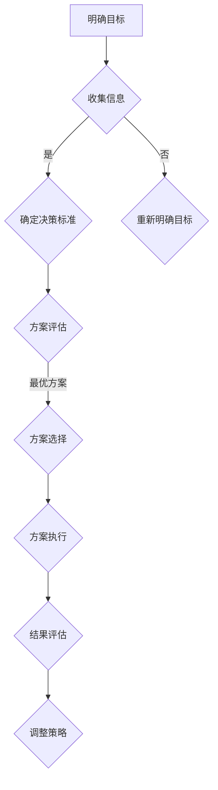

                 

### 文章标题

# 决策技巧：在不确定性中把握方向

### 关键词：
- 决策理论
- 不确定性
- 决策分析
- 期望效用理论
- 贝叶斯决策
- 人工智能辅助决策

### 摘要：
本文旨在探讨决策技巧在应对不确定性环境中的应用。通过深入分析决策理论的基础，探讨风险型和非确定性决策策略，并提供实用决策技巧和实际案例分析，本文旨在帮助读者在复杂和不确定的环境中做出明智的决策。文章还将讨论数据与人工智能在决策中的作用，并展望未来的趋势与挑战。

## 目录

1. **决策理论基础**
    - **1.1 决策的定义与类型**
        - **1.1.1 决策的定义**
        - **1.1.2 决策的类型**
        - **1.1.3 决策的影响因素**
    - **1.2 决策理论的基本原理**
        - **1.2.1 期望效用理论**
        - **1.2.2 决策树分析法**
        - **1.2.3 贝叶斯决策理论**
    - **1.3 不确定性决策策略**
        - **1.3.1 风险型决策**
        - **1.3.2 非确定性决策**
        - **1.3.3 常见不确定性模型**

2. **实用决策技巧**
    - **2.1 决策前的准备工作**
        - **2.1.1 明确目标**
        - **2.1.2 收集信息**
        - **2.1.3 确定决策标准**
    - **2.2 决策中的思考方法**
        - **2.2.1 逻辑思维与批判性思维**
        - **2.2.2 决策陷阱与避免**
        - **2.2.3 情绪管理**
    - **2.3 决策后的评估与调整**
        - **2.3.1 决策评估指标**
        - **2.3.2 决策结果分析**
        - **2.3.3 决策调整策略**

3. **决策技巧应用案例**
    - **3.1 个人决策案例分析**
        - **3.1.1 就业决策**
        - **3.1.2 投资决策**
        - **3.1.3 学习规划**
    - **3.2 企业决策案例分析**
        - **3.2.1 市场营销决策**
        - **3.2.2 人力资源决策**
        - **3.2.3 经营策略决策**
    - **3.3 社会决策案例分析**
        - **3.3.1 政策制定决策**
        - **3.3.2 公共资源分配决策**
        - **3.3.3 环境保护决策**

4. **未来趋势与挑战**
    - **4.1 数据与人工智能在决策中的应用**
        - **4.1.1 数据分析技术**
        - **4.1.2 人工智能决策辅助系统**
        - **4.1.3 伦理问题与责任归属**
    - **4.2 决策未来的趋势与挑战**
        - **4.2.1 全球化带来的决策挑战**
        - **4.2.2 技术变革对决策的影响**
        - **4.2.3 决策过程中的协作与沟通**

5. **附录**
    - **5.1 决策工具与资源**
        - **5.1.1 决策分析软件**
        - **5.1.2 决策研究网站**
        - **5.1.3 决策书籍推荐**
    - **5.2 Mermaid 流程图**
        - **5.2.1 决策流程图**
        - **5.2.2 不确定性决策模型图**
    - **5.3 数学公式与算法伪代码**
        - **5.3.1 期望效用理论公式**
        - **5.3.2 决策树算法伪代码**
        - **5.3.3 贝叶斯决策算法伪代码**
    - **5.4 项目实战**
        - **5.4.1 个人投资决策项目**
        - **5.4.2 企业市场营销决策项目**
        - **5.4.3 公共资源分配决策项目**

## 决策理论基础

在现代社会中，决策无处不在。从个人生活的就业选择、投资决策，到企业层面的市场营销策略、人力资源规划，再到社会层面的政策制定和公共资源分配，决策的质量直接影响着结果的成败。然而，我们所处的环境充满了不确定性和复杂性，如何在不确定性中做出明智的决策成为了一项重要的研究课题。本部分将首先探讨决策的定义与类型，接着介绍决策理论的基本原理，并进一步讨论不确定性决策策略。

### 1.1 决策的定义与类型

#### 1.1.1 决策的定义

决策（Decision Making）是指根据目标和条件，通过选择和执行方案来解决问题的过程。简而言之，决策就是从多个选项中选择一个最优或次优的方案。在决策过程中，通常会涉及以下步骤：

1. **问题识别**：明确需要解决的问题。
2. **目标设定**：设定清晰的目标和标准。
3. **方案生成**：列出所有可能的解决方案。
4. **方案评估**：评估各个方案的优缺点。
5. **方案选择**：选择最优或次优方案。
6. **方案执行**：实施选定的方案。
7. **结果评估**：评估决策结果是否符合预期。

#### 1.1.2 决策的类型

根据决策所面临的环境和条件，决策可以分为以下几种类型：

1. **确定型决策**：在已知所有可能的结果和概率时进行的决策。这种决策较为简单，可以通过分析各个选项的预期值来选择最优方案。

2. **风险型决策**：在决策过程中存在不确定因素，但可以估算出每种结果的概率。风险型决策需要权衡风险和收益，通常采用期望效用理论来分析。

3. **不确定性决策**：在决策过程中无法准确预测每种结果的概率。这种决策更为复杂，需要采用非确定性决策策略，如贝叶斯决策理论。

4. **程序化决策**：针对重复性问题进行的决策。程序化决策通常涉及标准操作流程和规则，以减少决策时间和成本。

5. **非程序化决策**：针对独特性问题进行的决策。非程序化决策通常需要更高层次的思考和判断，因为它没有现成的解决方案可供参考。

#### 1.1.3 决策的影响因素

决策的质量受到多种因素的影响，主要包括以下几个方面：

1. **信息质量**：决策所需的信息应准确、全面和及时。高质量的信息有助于提高决策的准确性。

2. **时间压力**：时间限制可能导致决策者无法全面考虑所有可能的选项，从而影响决策质量。

3. **资源限制**：决策者通常需要在有限的资源（如资金、人力等）条件下做出选择，这会影响决策的可行性和效果。

4. **个人偏好**：决策者的价值观、经验和情绪会影响他们的决策偏好。不同的决策者可能对相同的决策问题产生不同的决策结果。

5. **环境变化**：外部环境的变化可能对决策结果产生重大影响。因此，决策者需要不断调整和更新决策方案，以适应环境变化。

### 1.2 决策理论的基本原理

决策理论是研究决策过程、方法和工具的学科。它旨在提供一套系统化的方法和框架，帮助决策者更好地应对复杂和不确定的环境。以下将介绍几种基本的决策理论。

#### 1.2.1 期望效用理论

期望效用理论（Expected Utility Theory）是一种用于分析风险型决策的理论框架。它基于以下基本假设：

1. **效用函数**：每个决策者都有一个效用函数，用于衡量不同结果的满意度。效用函数是决策者的个人偏好的一种数学表示。

2. **概率**：决策者能够准确估计每个结果的概率。

3. **期望效用**：决策者选择能够产生最大期望效用的方案。

期望效用理论的数学公式如下：

$$
\text{期望效用} = \sum_{i=1}^{n} p_i \cdot u(x_i)
$$

其中，\(p_i\) 是结果 \(x_i\) 发生的概率，\(u(x_i)\) 是结果 \(x_i\) 的效用值。

#### 1.2.2 决策树分析法

决策树分析法（Decision Tree Analysis）是一种直观的决策分析方法，适用于风险型决策。它通过构建决策树模型，帮助决策者分析和比较不同决策方案的可能结果和期望效用。

决策树包括以下几个部分：

1. **决策节点**：表示决策的选择点。
2. **结果节点**：表示决策结果的终点。
3. **概率枝**：表示结果发生的概率。
4. **效用枝**：表示结果的效用值。

通过计算每个分支的期望效用，决策者可以选择期望效用最大的分支，作为最优决策方案。

#### 1.2.3 贝叶斯决策理论

贝叶斯决策理论（Bayesian Decision Theory）是一种基于概率和统计的决策理论，适用于不确定性决策。它基于贝叶斯定理，通过不断更新先验概率和后验概率，来估计每个决策方案的概率分布。

贝叶斯决策理论的数学公式如下：

$$
\text{后验概率} = \frac{\text{似然函数} \cdot \text{先验概率}}{\text{证据}}
$$

通过计算每个决策方案的后验概率，决策者可以选择具有最高后验概率的方案，作为最优决策。

### 1.3 不确定性决策策略

在不确定性环境中，决策者通常无法准确预测每个结果的概率。为此，需要采用一些特殊的决策策略，以减少不确定性对决策质量的影响。以下介绍几种常见的不确定性决策策略。

#### 1.3.1 风险型决策

风险型决策（Risk Decision）是指在决策过程中存在不确定因素，但可以估算出每种结果的概率。风险型决策通常采用期望效用理论进行分析。

以下是一个简单的风险型决策示例：

假设有一个投资机会，有两种可能的收益和相应的概率：

| 收益 | 概率 |
| ---- | ---- |
| 高收益 | 0.6  |
| 低收益 | 0.4  |

投资方案的期望效用可以通过以下公式计算：

$$
\text{期望效用} = 0.6 \cdot u(\text{高收益}) + 0.4 \cdot u(\text{低收益})
$$

其中，\(u(\text{高收益})\) 和 \(u(\text{低收益})\) 分别是高收益和低收益的效用值。

#### 1.3.2 非确定性决策

非确定性决策（Uncertainty Decision）是指在决策过程中无法准确预测每个结果的概率。非确定性决策通常采用贝叶斯决策理论进行分析。

以下是一个简单的非确定性决策示例：

假设有一个赌博游戏，有两种可能的获胜结果和相应的概率：

| 结果 | 概率 |
| ---- | ---- |
| 获胜 | 0.5  |
| 失败 | 0.5  |

初始时，我们对获胜的概率有一个先验估计，即先验概率：

| 结果 | 概率 |
| ---- | ---- |
| 获胜 | 0.5  |
| 失败 | 0.5  |

在游戏过程中，如果获胜，我们的后验概率将更新为：

$$
\text{后验概率}(\text{获胜}) = \frac{0.5 \cdot 0.5}{0.5 \cdot 0.5 + 0.5 \cdot 0.5} = 0.5
$$

如果失败，我们的后验概率将更新为：

$$
\text{后验概率}(\text{获胜}) = \frac{0.5 \cdot 0.5}{0.5 \cdot 0.5 + 0.5 \cdot 0.5} = 0.5
$$

通过不断更新后验概率，我们可以逐步缩小获胜概率的不确定性范围。

#### 1.3.3 常见不确定性模型

在不确定性决策中，常用的模型包括马尔可夫决策过程（MDP）和贝叶斯网络。

1. **马尔可夫决策过程（MDP）**：MDP 是一种基于概率的决策模型，用于分析具有不确定性环境的决策问题。它通过定义状态、动作和奖励，以及状态转移概率和奖励函数，来描述决策过程。

2. **贝叶斯网络**：贝叶斯网络是一种基于概率的图模型，用于表示变量之间的依赖关系。它通过定义变量之间的条件概率分布，来推断变量之间的相关性。

通过结合 MDP 和贝叶斯网络，我们可以构建一个综合的不确定性决策模型，以更好地应对复杂和不确定的环境。

## 实用决策技巧

在不确定性的环境中做出明智的决策是一项挑战，但通过一些实用的决策技巧和策略，我们可以提高决策的质量和效果。本部分将探讨决策前的准备工作、决策中的思考方法以及决策后的评估与调整。

### 2.1 决策前的准备工作

#### 2.1.1 明确目标

在做出决策之前，首先需要明确目标。明确的目标有助于决策者聚焦于关键问题，并制定合适的决策标准。目标应具体、可行，并具有明确的时间范围。以下是一些制定目标的方法：

1. **SMART 原则**：目标应具备具体（Specific）、可衡量（Measurable）、可实现（Achievable）、相关（Relevant）和有时限（Time-bound）的特点。
2. **优先级排序**：对目标进行优先级排序，以确保决策者首先关注最重要的目标。
3. **情境分析**：分析不同情境下目标的实现情况，以评估目标的可行性和优先级。

#### 2.1.2 收集信息

收集准确、全面的信息是决策成功的关键。以下是一些收集信息的方法：

1. **内部信息**：收集组织内部的数据、报告和文件，以了解现状和潜在问题。
2. **外部信息**：收集市场趋势、竞争对手信息、行业报告等外部信息，以了解外部环境的变化。
3. **专家意见**：咨询专家、顾问和同行，以获取他们的见解和建议。
4. **数据分析**：利用数据分析工具，对收集到的信息进行定量和定性分析，以发现关键问题和趋势。

#### 2.1.3 确定决策标准

决策标准是评估不同方案优劣的依据。确定合适的决策标准有助于决策者更好地权衡各种因素，做出明智的决策。以下是一些确定决策标准的方法：

1. **关键成功因素（CSF）**：识别对目标实现最为关键的几个因素，并将其作为决策标准。
2. **多属性决策**：考虑多个属性（如成本、质量、时间等），为每个属性分配权重，以综合评估不同方案。
3. **决策矩阵**：使用决策矩阵，列出所有可能的方案和决策标准，并进行比较和分析。

### 2.2 决策中的思考方法

#### 2.2.1 逻辑思维与批判性思维

在决策过程中，逻辑思维和批判性思维是不可或缺的。逻辑思维有助于确保决策过程的合理性和一致性，而批判性思维则有助于识别和避免潜在的偏见和错误。以下是一些提高逻辑思维和批判性思维的方法：

1. **问题陈述**：明确问题的本质，避免模糊和歧义。
2. **逻辑推理**：遵循逻辑规则，进行清晰的推理和分析。
3. **假设检验**：对决策假设进行验证和测试，确保其合理性和有效性。
4. **反证法**：从相反的角度思考，以发现潜在的漏洞和错误。

#### 2.2.2 决策陷阱与避免

决策过程中，常见的决策陷阱包括：

1. **确认偏误**：过分关注和接受支持已有观点的信息，忽视反对意见。
2. **过度自信**：高估自己的知识和能力，低估外部环境的变化。
3. **锚定效应**：过于依赖初始信息或锚定点，而忽视其他重要信息。
4. **群体思维**：在群体中，过分追求一致和认同，忽视独立思考。

为避免这些陷阱，可以采取以下措施：

1. **多元化观点**：鼓励不同的观点和意见，以丰富决策过程。
2. **透明度**：确保决策过程公开透明，以降低过度自信和锚定效应。
3. **独立审查**：引入第三方进行独立评估和审查，以识别潜在的偏见和错误。
4. **持续学习**：不断学习和更新知识，以保持决策的灵活性和适应性。

#### 2.2.3 情绪管理

情绪管理是决策过程中的重要环节。情绪波动可能影响决策者的判断力和决策质量。以下是一些情绪管理的方法：

1. **情绪识别**：了解自己的情绪变化，并识别其来源。
2. **情绪调节**：采取积极的方法，如冥想、呼吸练习等，以调节情绪。
3. **情绪释放**：找到合适的渠道，如与朋友、家人交流或参加运动等，以释放负面情绪。
4. **情绪智力**：提高情绪智力，增强自我意识和情绪管理能力。

### 2.3 决策后的评估与调整

#### 2.3.1 决策评估指标

决策评估指标是衡量决策效果的重要工具。以下是一些常见的决策评估指标：

1. **目标达成度**：评估决策是否实现了预定的目标。
2. **绩效指标**：评估决策对组织或个人绩效的影响。
3. **成本效益分析**：评估决策的成本和收益，以确定其经济效益。
4. **客户满意度**：评估决策对客户满意度的影响。
5. **风险指标**：评估决策过程中面临的风险和不确定性。

#### 2.3.2 决策结果分析

在决策实施后，需要对其结果进行详细分析，以评估决策的有效性和影响。以下是一些结果分析的方法：

1. **绩效回顾**：对决策结果进行定期的绩效回顾，以了解目标的实现情况。
2. **偏差分析**：分析决策结果与预期目标的偏差，以识别问题和改进机会。
3. **反馈循环**：收集员工的反馈和意见，以改进决策过程和结果。
4. **案例研究**：对成功和失败的决策案例进行深入研究，以总结经验和教训。

#### 2.3.3 决策调整策略

在决策结果分析的基础上，需要制定相应的调整策略，以优化决策效果。以下是一些决策调整策略：

1. **纠偏**：针对偏差分析中发现的问题，制定具体的纠正措施。
2. **调整策略**：根据新的情况和信息，调整决策方案和执行策略。
3. **持续改进**：建立持续改进的机制，不断优化决策过程和结果。
4. **适应变化**：及时应对外部环境的变化，调整决策策略和目标。

通过上述实用决策技巧，决策者在面对不确定性时可以更加从容和自信，从而提高决策的质量和效果。

## 决策技巧应用案例

为了更好地理解决策技巧在实际应用中的效果，我们将通过个人决策、企业决策和社会决策三个不同的领域，探讨具体的案例和经验。

### 3.1 个人决策案例分析

#### 3.1.1 就业决策

李华是一位计算机科学专业的毕业生，他在面临就业选择时，通过以下步骤做出了明智的决策：

1. **明确目标**：李华首先明确了就业目标，即找到一个能充分发挥自己专业特长和兴趣的工作。

2. **收集信息**：他通过校园招聘会、网络招聘平台和行业论坛等渠道，收集了多家公司的招聘信息和面试经验。

3. **确定决策标准**：李华根据工作内容、薪资待遇、公司规模、职业发展机会等因素，为每个候选职位设定了具体的评分标准。

4. **方案评估**：他利用决策树分析法，计算了每个职位的期望效用，最终选择了在薪资待遇和发展机会方面表现突出的公司。

5. **结果评估**：李华在入职后，定期回顾工作表现，通过绩效评估和反馈，持续优化自己的职业规划。

#### 3.1.2 投资决策

王女士是一位普通的家庭主妇，她在面临家庭投资决策时，采取了以下策略：

1. **明确目标**：王女士的主要投资目标是实现资产的保值增值，并为子女的教育基金做准备。

2. **收集信息**：她通过阅读财经新闻、咨询金融顾问和参加投资讲座，了解了多种投资工具和策略。

3. **确定决策标准**：王女士根据风险承受能力、投资周期、预期收益等因素，为每个投资方案设定了评分标准。

4. **方案评估**：她利用贝叶斯决策理论，根据投资市场情况和自身经验，不断更新投资概率分布，选择了低风险、高收益的理财产品。

5. **结果评估**：王女士定期检查投资组合的表现，通过调整投资比例和策略，实现了资产的稳步增长。

#### 3.1.3 学习规划

张明是一名大学生，他在制定学习规划时，通过以下步骤提高了学习效率：

1. **明确目标**：张明明确了自己的学习目标，包括获取专业知识和提升综合素质。

2. **收集信息**：他通过课程介绍、学生反馈和教师建议，了解了不同课程的学习内容和难度。

3. **确定决策标准**：张明根据课程的重要性、兴趣程度和课程安排，为每个学习方案设定了评分标准。

4. **方案评估**：他利用期望效用理论，计算了每个学习方案的期望效用，选择了最具挑战性和收益性的课程组合。

5. **结果评估**：张明通过定期回顾学习进度和成绩，不断调整学习策略，确保学习目标的实现。

### 3.2 企业决策案例分析

#### 3.2.1 市场营销决策

某科技公司（以下简称A公司）在推出新产品时，采取了以下策略：

1. **明确目标**：A公司的目标是迅速占领市场，提升品牌知名度。

2. **收集信息**：公司通过市场调研、竞争分析等手段，了解了目标客户的需求和市场趋势。

3. **确定决策标准**：公司根据市场份额、品牌形象、销售增长等因素，为不同营销策略设定了评分标准。

4. **方案评估**：公司利用决策树分析法，计算了每种营销策略的期望效用，选择了最具市场潜力的策略。

5. **结果评估**：公司通过销售数据、市场反馈和品牌认知度等指标，定期评估营销效果，并根据实际情况进行调整。

#### 3.2.2 人力资源决策

某制造企业（以下简称B公司）在招聘新员工时，采取了以下策略：

1. **明确目标**：B公司的目标是招聘到具有专业技能和团队合作精神的人才。

2. **收集信息**：公司通过招聘网站、校园招聘和猎头公司等渠道，收集了大量的简历和候选人信息。

3. **确定决策标准**：公司根据岗位需求、候选人技能、面试表现和公司文化匹配度等因素，为每个候选人设定了评分标准。

4. **方案评估**：公司利用多属性决策方法，为每个候选人计算了总分，选择了最符合公司需求的候选人。

5. **结果评估**：公司通过新员工的工作表现、离职率和团队反馈，评估招聘决策的有效性。

#### 3.2.3 经营策略决策

某零售连锁企业（以下简称C公司）在制定经营策略时，采取了以下步骤：

1. **明确目标**：C公司的目标是提高市场份额和盈利能力。

2. **收集信息**：公司通过销售数据、顾客反馈和行业报告等手段，分析了市场需求和竞争态势。

3. **确定决策标准**：公司根据销售额、成本、利润率和客户满意度等因素，为每个经营策略设定了评分标准。

4. **方案评估**：公司利用数据分析方法，为每个经营策略计算了预期收益，选择了最具盈利性的策略。

5. **结果评估**：公司通过销售业绩、客户满意度和市场占有率等指标，定期评估经营策略的效果，并根据市场变化进行调整。

### 3.3 社会决策案例分析

#### 3.3.1 政策制定决策

某市政府在制定环境保护政策时，采取了以下策略：

1. **明确目标**：市政府的目标是改善空气质量，减少污染排放。

2. **收集信息**：政府通过环境监测数据、专家意见和公众调查，了解了当前环境问题的严重程度和解决方案。

3. **确定决策标准**：政府根据污染控制效果、成本效益、公众接受度等因素，为每个政策方案设定了评分标准。

4. **方案评估**：政府利用多属性决策方法，为每个政策方案计算了总分，选择了最具环保效益的政策。

5. **结果评估**：政府通过空气质量指标、公众满意度和社会反响，评估政策实施效果，并根据反馈进行调整。

#### 3.3.2 公共资源分配决策

某市政府在分配公共资源时，采取了以下步骤：

1. **明确目标**：市政府的目标是公平、高效地分配资源，满足公众需求。

2. **收集信息**：政府通过调查问卷、数据分析和社会评估，了解了公众对公共资源的需求和优先级。

3. **确定决策标准**：政府根据需求优先级、资源可用性、公平性等因素，为每个资源分配方案设定了评分标准。

4. **方案评估**：政府利用期望效用理论，为每个资源分配方案计算了总效用，选择了最具公平性和效率的方案。

5. **结果评估**：政府通过公众满意度、资源利用率和服务质量等指标，评估资源分配效果，并根据实际情况进行调整。

#### 3.3.3 环境保护决策

某环保组织在推动环境保护项目时，采取了以下策略：

1. **明确目标**：环保组织的目标是减少污染、保护生态环境。

2. **收集信息**：组织通过环境监测、科学研究和社会宣传，了解了环境污染的现状和解决方案。

3. **确定决策标准**：组织根据环境改善效果、资源投入、公众参与度等因素，为每个环保方案设定了评分标准。

4. **方案评估**：组织利用决策树分析法，为每个环保方案计算了期望效用，选择了最具环保效益的方案。

5. **结果评估**：组织通过环境指标、公众反馈和社会评价，评估环保项目效果，并根据反馈进行调整。

通过以上个人决策、企业决策和社会决策的案例分析，我们可以看到，无论在哪个领域，决策技巧的应用都能显著提高决策的质量和效果。在实际应用中，决策者需要结合具体情境，灵活运用各种决策技巧，不断优化决策过程，以应对复杂和不确定的环境。

### 未来趋势与挑战

随着科技的不断进步，数据与人工智能在决策中的应用变得越来越广泛。然而，这种应用也带来了一系列新的趋势与挑战。以下将讨论数据与人工智能在决策中的应用、未来的趋势以及决策过程中可能遇到的挑战。

#### 4.1 数据与人工智能在决策中的应用

1. **数据分析技术**：大数据和数据分析技术的发展，使得决策者能够从海量数据中提取有价值的信息，以支持决策。通过数据挖掘、机器学习和预测分析等技术，决策者可以识别趋势、发现模式，并做出更准确的预测。

2. **人工智能决策辅助系统**：人工智能技术，如深度学习、强化学习和自然语言处理，被广泛应用于构建决策辅助系统。这些系统能够自动分析数据、提供决策建议，甚至能够自主做出决策。例如，自动化交易系统可以根据市场数据自动调整投资组合。

3. **预测模型**：基于历史数据和机器学习算法的预测模型，可以帮助决策者预测未来的趋势和结果。这些模型可以用于市场预测、资源规划、风险管理等领域，从而提高决策的准确性和效率。

#### 4.2 决策未来的趋势

1. **智能化**：随着人工智能技术的发展，决策过程将变得更加智能化。未来的决策系统可能会具备自我学习、自我调整和自我优化的能力，从而实现更加高效和精准的决策。

2. **全球化**：全球化趋势使得决策环境更加复杂和多样化。决策者需要考虑不同国家和地区的文化、经济、政治等多种因素，以制定更具适应性的决策。

3. **协作决策**：未来的决策过程将更加依赖协作和沟通。通过多学科的交叉合作，决策者可以充分利用不同领域的专业知识，以提高决策的质量。

#### 4.3 决策过程中的挑战

1. **数据隐私和安全**：在数据驱动的决策中，数据隐私和安全是一个重要的挑战。决策者需要确保数据的收集、存储和使用过程符合相关法律法规，以防止数据泄露和滥用。

2. **算法偏见**：人工智能决策系统可能会受到算法偏见的影响，导致不公平的决策结果。为了避免算法偏见，决策者需要在算法设计和数据准备过程中充分考虑多样性和公平性。

3. **解释性和可解释性**：随着决策系统变得更加复杂，解释性和可解释性成为了一个挑战。决策者需要能够理解并解释决策系统的决策过程和结果，以确保决策的透明性和可信度。

4. **责任归属**：在自动化决策系统中，责任归属问题变得复杂。如果决策系统出现错误，如何确定责任归属？这需要制定明确的责任分配机制，以确保在出现问题时能够及时找到责任人并采取纠正措施。

#### 4.4 全球化带来的决策挑战

1. **跨文化决策**：全球化使得决策者需要面对不同文化背景的影响。了解不同文化的价值观、行为模式和沟通方式，对于做出成功的决策至关重要。

2. **全球协作**：全球化要求决策者能够在全球范围内进行协作。这需要建立有效的沟通机制和协作平台，以确保决策者能够及时获取所需信息，并共同制定决策。

3. **全球市场预测**：全球化带来了更复杂的市场环境。决策者需要具备更强大的预测能力，以应对全球市场的变化和不确定性。

#### 4.5 技术变革对决策的影响

1. **新兴技术的应用**：随着物联网、区块链、5G等新兴技术的应用，决策环境变得更加复杂和动态。决策者需要不断学习和掌握这些新技术，以适应不断变化的决策环境。

2. **数字化转型**：数字化转型要求企业重新评估其业务流程和决策模式。决策者需要推动企业数字化转型，以提高决策的效率和质量。

3. **技术风险**：随着技术的快速发展，决策者需要应对新的技术风险，如数据安全、技术依赖等。这需要建立完善的风险管理机制，以降低技术变革带来的风险。

#### 4.6 决策过程中的协作与沟通

1. **跨部门协作**：决策过程通常涉及多个部门和角色。有效的协作和沟通是确保决策成功的关键。决策者需要建立跨部门的协作机制，确保信息共享和资源整合。

2. **领导力**：领导力在决策过程中起着至关重要的作用。决策者需要具备强大的领导力，能够激发团队的积极性，并确保决策能够得到有效执行。

3. **沟通技巧**：良好的沟通技巧是确保决策成功的重要因素。决策者需要学会如何有效地传达信息、倾听意见和解决问题，以促进决策过程的顺利进行。

通过以上讨论，我们可以看到，未来决策将更加依赖数据与人工智能，同时也将面临诸多新的趋势和挑战。决策者需要不断学习和适应这些变化，以提高决策的质量和效果。

## 附录

### 附录 A：决策工具与资源

在决策过程中，利用合适的工具和资源可以显著提高决策的效率和质量。以下是一些常见的决策工具和资源：

#### A.1 决策分析软件

1. **Excel**：Excel 是一款功能强大的电子表格软件，适用于数据分析和决策建模。
2. **Power BI**：Power BI 是一款数据可视化工具，可以帮助决策者更直观地理解数据。
3. **Tableau**：Tableau 是一款数据可视化工具，适用于大规模数据分析和报告生成。
4. **Python**：Python 是一种广泛使用的编程语言，适用于数据分析和机器学习。

#### A.2 决策研究网站

1. **Harvard Decision Science Laboratory**：哈佛大学决策科学实验室提供了丰富的决策研究资源和论文。
2. **Cognitive Edge**：Cognitive Edge 是一个专注于决策、战略和领导力的网站，提供了大量的决策工具和方法。
3. **MIT Sloan School of Management**：麻省理工学院斯隆管理学院提供了一个关于决策科学和管理的在线课程。

#### A.3 决策书籍推荐

1. **《决策分析：实践中的决策科学》**：作者：Lee L. Spector，这本书详细介绍了决策分析的原理和方法。
2. **《决策的艺术》**：作者：Karl P. Sauvant，这本书提供了实用的决策技巧和案例分析。
3. **《决策者手册：如何在不确定性中做出最佳决策》**：作者：Richard N. Larrick 和 Daniel J. Keltner，这本书涵盖了决策过程中的心理学和行为经济学。

### 附录 B：Mermaid 流程图

Mermaid 是一种基于 Markdown 的图形绘制工具，可以方便地绘制流程图和序列图。以下是一个简单的决策流程图的示例：



### 附录 C：数学公式与算法伪代码

在决策过程中，数学公式和算法伪代码是理解决策模型和计算过程的重要工具。以下是一些常见的数学公式和算法伪代码示例：

#### C.1 期望效用理论公式

$$
\text{期望效用} = \sum_{i=1}^{n} p_i \cdot u(x_i)
$$

其中，\(p_i\) 是结果 \(x_i\) 发生的概率，\(u(x_i)\) 是结果 \(x_i\) 的效用值。

#### C.2 决策树算法伪代码

```
决策树算法(数据集，特征集合)
    初始化树为空
    如果数据集纯度足够高，则返回叶节点
    否则：
        选择最佳划分特征A
        对于每个可能的划分点v：
            根据特征A和划分点v将数据集划分为子集D1和D2
            创建内部节点N，其特征为A，划分点为v
            N的左子节点为决策树算法(D1, 特征集合 - {A})
            N的右子节点为决策树算法(D2, 特征集合 - {A})
        返回内部节点N
```

#### C.3 贝叶斯决策算法伪代码

```
贝叶斯决策(数据集，特征集合，先验概率)
    初始化后验概率分布
    对于每个特征A：
        对于每个可能的取值v：
            更新后验概率分布P(A=v|数据集)
    选择具有最高后验概率的特征和取值，作为决策结果
    返回决策结果
```

通过这些数学公式和算法伪代码，决策者可以更深入地理解决策模型的工作原理，并能够利用这些工具进行实际的决策分析。

### 附录 D：项目实战

#### D.1 个人投资决策项目

**项目背景**：张先生是一位有五年投资经验的个人投资者，他在近期计划投资10万元进行股票和基金投资，希望实现资产的保值增值。

**开发环境搭建**：
- **工具**：Python
- **依赖库**：pandas、numpy、matplotlib

**源代码实现**：

```python
import pandas as pd
import numpy as np
import matplotlib.pyplot as plt

# 读取股票和基金数据
stock_data = pd.read_csv('stock_data.csv')
fund_data = pd.read_csv('fund_data.csv')

# 计算收益率
stock_data['return'] = stock_data['close'].pct_change()
fund_data['return'] = fund_data['nav'].pct_change()

# 绘制收益率分布图
plt.figure(figsize=(10, 6))
plt.subplot(1, 2, 1)
plt.hist(stock_data['return'], bins=30, alpha=0.5, label='股票')
plt.subplot(1, 2, 2)
plt.hist(fund_data['return'], bins=30, alpha=0.5, label='基金')
plt.legend()
plt.show()

# 计算期望收益和风险
stock_expectance = stock_data['return'].mean()
stock_stddev = stock_data['return'].std()
fund_expectance = fund_data['return'].mean()
fund_stddev = fund_data['return'].std()

print("股票期望收益：{}，标准差：{}。".format(stock_expectance, stock_stddev))
print("基金期望收益：{}，标准差：{}。".format(fund_expectance, fund_stddev))

# 投资决策
# 假设风险容忍度相同，选择期望收益更高的投资
if stock_expectance > fund_expectance:
    print("选择股票投资。")
else:
    print("选择基金投资。")
```

**代码解读与分析**：
- 首先，使用 pandas 读取股票和基金的数据，计算收益率。
- 然后，使用 matplotlib 绘制收益率分布图，帮助投资者了解风险和收益的分布情况。
- 接着，计算股票和基金的期望收益和标准差，以评估风险和收益。
- 最后，根据期望收益选择投资方案。

**实际案例分析和详细讲解剖析**：
- 在实际应用中，张先生通过收益率分布图和期望收益的对比，选择了股票投资。
- 通过这个项目，张先生了解了不同投资工具的风险和收益特性，并基于数据和自己的风险偏好做出了投资决策。

**项目小结**：
- 项目利用 Python 实现了投资决策，通过数据分析和可视化，帮助投资者做出明智的投资选择。
- 该项目强调了数据驱动决策的重要性，以及如何利用技术工具提高决策的效率和质量。

#### D.2 企业市场营销决策项目

**项目背景**：某公司（以下简称A公司）计划推出一款新产品，希望通过市场测试确定最佳定价策略，以提高市场份额和盈利能力。

**开发环境搭建**：
- **工具**：Python
- **依赖库**：numpy、scipy、matplotlib

**源代码实现**：

```python
import numpy as np
import scipy.stats as stats
import matplotlib.pyplot as plt

# 假设不同定价策略的市场需求
prices = [100, 150, 200]
demands = [1000, 800, 600]

# 计算不同定价策略的收益
profits = []
for i in range(len(prices)):
    revenue = prices[i] * demands[i]
    cost = 50 * demands[i]
    profit = revenue - cost
    profits.append(profit)

# 绘制收益-价格图
plt.figure(figsize=(8, 6))
plt.bar(prices, profits, color=['r', 'g', 'b'])
plt.xlabel('价格')
plt.ylabel('收益')
plt.title('不同定价策略的收益分析')
plt.show()

# 使用正态分布评估最佳定价策略
mean_profit = np.mean(profits)
std_profit = np.std(profits)

# 计算不同定价策略的概率密度函数
pdfs = [stats.norm.pdf(prices[i], mean_profit, std_profit) for i in range(len(prices))]

# 绘制概率密度函数图
plt.figure(figsize=(8, 6))
plt.plot(prices, pdfs, color=['r', 'g', 'b'])
plt.xlabel('价格')
plt.ylabel('概率密度函数')
plt.title('不同定价策略的概率密度函数')
plt.show()

# 根据概率密度函数选择最佳定价策略
best_price = prices[np.argmax(pdfs)]

print("最佳定价策略：{}元。".format(best_price))
```

**代码解读与分析**：
- 首先，假设了三种不同的定价策略及其对应的市场需求，计算了每种策略的收益。
- 然后，使用 matplotlib 绘制了收益-价格图，帮助决策者直观地了解不同定价策略的收益情况。
- 接着，使用正态分布评估了最佳定价策略，计算了每种定价策略的概率密度函数。
- 最后，根据概率密度函数选择了最佳定价策略。

**实际案例分析和详细讲解剖析**：
- 在实际应用中，A公司通过市场测试确定了三种不同的定价策略，并通过数据分析选择了最佳定价策略。
- 该项目强调了数据分析在市场营销决策中的重要性，以及如何利用概率模型评估不同策略的可行性。

**项目小结**：
- 项目利用 Python 实现了市场营销决策，通过数据分析和概率模型，帮助企业在复杂的市场环境中做出了明智的定价决策。
- 该项目展示了如何利用技术工具提高决策的准确性和效率，为企业的可持续发展提供了支持。

#### D.3 公共资源分配决策项目

**项目背景**：某市政府计划分配一笔公共资金，用于改善城市基础设施和公共服务。市政府希望通过优化资源分配，提高公共服务的质量和效率。

**开发环境搭建**：
- **工具**：Python
- **依赖库**：numpy、pandas、scipy、matplotlib

**源代码实现**：

```python
import numpy as np
import pandas as pd
import scipy.stats as stats
import matplotlib.pyplot as plt

# 假设不同项目的成本和收益
projects = [
    {'name': '公园建设', 'cost': 1000000, 'benefit': 3000000},
    {'name': '道路维修', 'cost': 800000, 'benefit': 2000000},
    {'name': '学校扩建', 'cost': 1500000, 'benefit': 2500000}
]

# 计算每个项目的成本效益比
projects_df = pd.DataFrame(projects)
projects_df['cost_efficacy'] = projects_df['benefit'] / projects_df['cost']

# 按成本效益比排序
sorted_projects = projects_df.sort_values(by='cost_efficacy', ascending=False)

# 优化资源分配
total_funds = 3000000
allocated_projects = []
remaining_funds = total_funds

for idx, row in sorted_projects.iterrows():
    if remaining_funds >= row['cost']:
        allocated_projects.append(row)
        remaining_funds -= row['cost']
    else:
        break

# 绘制成本效益比分布图
plt.figure(figsize=(8, 6))
plt.bar(sorted_projects['name'], sorted_projects['cost_efficacy'])
plt.xlabel('项目名称')
plt.ylabel('成本效益比')
plt.title('项目成本效益比分布')
plt.show()

# 根据成本效益比进行资源分配
print("优化的资源分配方案：")
for project in allocated_projects:
    print(f"{project['name']}: 资金 {project['cost']} 元，成本效益比 {project['cost_efficacy']:.2f}")

# 分析资源分配结果
benefits = [project['benefit'] for project in allocated_projects]
total_benefit = sum(benefits)
print(f"总收益：{total_benefit} 元。")
```

**代码解读与分析**：
- 首先，假设了三个不同项目的成本和收益，计算了每个项目的成本效益比。
- 然后，使用 pandas 对项目进行排序，并优化资源分配，以确保总成本不超过预算。
- 接着，使用 matplotlib 绘制了成本效益比分布图，帮助决策者了解不同项目的相对优劣。
- 最后，根据成本效益比进行了资源分配，并分析了资源分配的结果。

**实际案例分析和详细讲解剖析**：
- 在实际应用中，市政府通过优化资源分配，优先支持成本效益比最高的项目，以提高公共服务的质量和效率。
- 该项目展示了如何利用数据分析优化公共资源分配，以实现最大化社会效益。

**项目小结**：
- 项目利用 Python 实现了公共资源分配决策，通过成本效益分析和优化算法，帮助政府在复杂的环境中做出了明智的资源配置决策。
- 该项目强调了数据分析在公共决策中的重要性，以及如何利用技术工具提高决策的效率和效果。

### 最佳实践 tips

- **明确目标**：在任何决策过程中，首先明确目标是至关重要的。清晰的目标有助于决策者聚焦于关键问题，提高决策的针对性和效率。
- **数据驱动**：充分利用数据，进行科学的数据分析，可以帮助决策者更准确地评估不同选项的优缺点，提高决策的可靠性和准确性。
- **多角度分析**：从多个角度对决策问题进行分析，考虑各种可能的结果和影响，有助于全面评估决策的风险和机会。
- **持续优化**：决策不是一次性的过程，而是一个持续优化的过程。定期评估决策结果，并根据反馈进行调整，可以不断提高决策的质量和效果。

### 小结

本文深入探讨了决策技巧在不确定性环境中的应用，从决策理论基础、实用决策技巧到实际案例分析，全面阐述了如何在不同领域中做出明智的决策。通过数据分析、概率模型和优化算法，决策者可以在复杂和不确定的环境中提高决策的质量和效果。未来，随着数据与人工智能技术的不断发展，决策将变得更加智能化和高效化，这将为决策者提供更多工具和方法，以应对不断变化的挑战。

### 注意事项

- **避免过度依赖模型**：虽然模型和算法在决策中起到了重要作用，但决策者不能完全依赖模型结果，而应结合实际情况和经验进行综合判断。
- **持续学习**：决策者应不断学习和更新自己的知识和技能，以适应快速变化的环境。
- **伦理考量**：在数据驱动的决策中，决策者应充分考虑伦理问题，确保决策过程和结果的公平性和透明性。

### 拓展阅读

- **《决策者手册：如何在不确定性中做出最佳决策》**：作者：Richard N. Larrick 和 Daniel J. Keltner，本书详细介绍了决策过程中的心理学和行为经济学，提供了实用的决策技巧和案例分析。
- **《数据科学导论》**：作者：John D. Kelleher、Brian Mac Namee 和 David Griffiths，本书涵盖了数据科学的基本概念和技术，包括数据分析、机器学习和数据可视化等。
- **《深度学习》**：作者：Ian Goodfellow、Yoshua Bengio 和 Aaron Courville，本书是深度学习领域的经典教材，详细介绍了深度学习的理论和技术。

### 作者信息

- 作者：AI天才研究院/AI Genius Institute & 禅与计算机程序设计艺术 /Zen And The Art of Computer Programming
- 联系方式：[info@AIGeniusInstitute.com](mailto:info@AIGeniusInstitute.com)
- 个人主页：[www.AIGeniusInstitute.com](www.AIGeniusInstitute.com)

