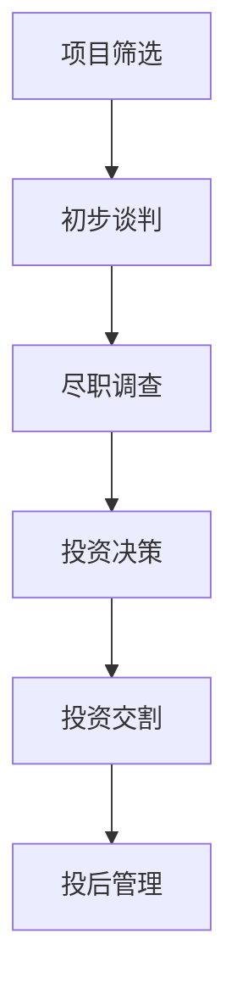

                 

## 文章标题

### 《创业公司如何选择合适的融资方式和时机》

> 关键词：创业公司、融资方式、风险投资、股权融资、债务融资、融资时机、财务管理

> 摘要：本文旨在为创业公司提供一份详细的融资指南，帮助公司选择合适的融资方式和时机。文章首先介绍了创业公司融资的基础知识，然后深入解析了风险投资融资的方式、股权融资与债务融资的比较，以及融资前的准备和风险评估。此外，文章还探讨了融资谈判与协议签署的技巧，以及融资后的管理和运用策略。最后，通过案例分析总结了成功与失败的经验教训，为创业公司提供实际操作的参考。

### 引言

创业公司的成长离不开资金的注入，而融资是公司获取外部资金的重要途径。然而，选择合适的融资方式和时机对于创业公司的成功至关重要。不恰当的融资方式或时机可能会导致公司面临财务风险、股权稀释等问题，甚至可能影响公司的长远发展。

本文将围绕创业公司融资的主题，从以下几个方面进行探讨：

1. **融资基础**：介绍融资的定义、重要性以及融资方式的分类。
2. **风险投资融资深度解析**：探讨风险投资的原理、流程，以及如何寻找合适的投资者。
3. **股权融资与债务融资比较**：分析股权融资和债务融资的优势与劣势，并指导如何选择合适的融资方式。
4. **融资前准备与风险评估**：阐述融资前的准备工作以及风险评估的重要性。
5. **融资谈判与协议签署**：提供融资谈判的策略和协议签署的流程。
6. **融资后的管理和运用**：讨论融资后的财务管理和运营管理策略。
7. **案例分析**：通过成功和失败的融资案例分析，总结经验教训。

希望通过本文，能够为创业公司在融资方面提供一些有价值的参考和指导。

### 第一部分：融资基础

#### 第1章：创业公司融资概述

创业公司融资是指公司通过各种途径获取外部资金的过程，以支持公司的运营、研发和扩展。融资对于创业公司的发展至关重要，因为它能够为公司提供必要的资金支持，降低资金短缺的风险，提高公司的竞争力。

##### 1.1 融资的定义与重要性

**融资的概念**：
融资是指公司通过向外部投资者、银行或其他金融机构借款，或通过发行股票、债券等证券来筹集资金的过程。融资的目的是为了满足公司运营资金需求，支持公司的业务发展。

**融资的重要性**：
对于创业公司来说，融资的重要性体现在以下几个方面：

1. **满足运营资金需求**：创业公司通常需要大量的资金来支持日常运营，包括员工工资、房租、设备采购等。如果没有足够的资金支持，公司可能会面临停业的风险。
2. **支持研发投入**：创业公司往往需要投入大量的资金进行产品研发和技术创新，以保持市场竞争力。通过融资，公司可以获取足够的资金来支持研发项目。
3. **扩展业务规模**：创业公司需要通过融资来扩大业务规模，开拓新市场，提高市场份额。融资可以为公司提供必要的资金支持，推动业务的快速发展。
4. **降低资金风险**：通过融资，创业公司可以降低依赖单一融资来源的风险。多元化的融资渠道可以提高公司的资金稳定性，降低资金短缺的风险。

##### 1.2 融资方式分类

创业公司的融资方式主要包括以下几种：

**启动资金融资**：
启动资金融资是指公司在成立初期，通过股东投入、天使投资、朋友和家人的支持等方式筹集资金。这种融资方式通常成本较低，但资金量有限，适用于初创阶段的公司。

**风险投资融资**：
风险投资融资是指创业公司通过向风险投资机构、私募股权基金等机构投资者筹集资金。这种融资方式通常需要公司具备较高的成长潜力，投资者会根据公司的未来增长潜力来决定投资额度。

**银行贷款融资**：
银行贷款融资是指创业公司通过向银行等金融机构申请贷款来筹集资金。这种融资方式通常需要公司具备良好的信用记录和财务状况，贷款利率相对较低。

**股权融资**：
股权融资是指公司通过出售股权来筹集资金。这种融资方式可以吸引战略投资者和财务投资者，为公司提供资金支持，同时也可以引入外部资源和经验。

**债务融资**：
债务融资是指公司通过发行债券、借债等方式筹集资金。这种融资方式通常需要公司具备良好的信用评级和稳定的现金流，债务融资的利率通常高于股权融资。

##### 1.3 融资时机选择

选择合适的融资时机对于创业公司的成功至关重要。以下是一些常见的融资时机：

**产品或服务成熟度**：
当创业公司的产品或服务已经成熟，市场需求明确，且具备盈利潜力时，是进行融资的最佳时机。此时，公司可以通过融资来扩大生产和销售，提高市场份额。

**市场需求分析**：
通过市场调研和分析，如果发现市场对公司的产品或服务有强烈需求，且竞争对手较少，那么公司可以考虑进行融资，以抓住市场机遇。

**财务状况评估**：
在融资前，创业公司需要对自身的财务状况进行详细评估。如果公司的财务状况良好，盈利能力强，那么融资的可行性会更高。

**资金用途明确**：
创业公司在融资时，需要明确资金的具体用途。如果资金用途明确，且能够带来显著的投资回报，那么融资的成功率会更高。

通过以上分析，创业公司可以根据自身的情况，选择合适的融资方式和时机，为公司的未来发展奠定坚实的基础。

### 第2章：风险投资融资深度解析

#### 2.1 风险投资的原理与流程

风险投资（Venture Capital，简称VC）是一种投资方式，主要针对具有高成长潜力的初创企业或小型企业进行投资。风险投资机构通过提供资金支持，帮助企业实现快速成长，并分享企业成功带来的收益。

**风险投资的基本原理**：

风险投资的核心在于“风险”和“收益”的平衡。风险投资机构通常会在企业发展的早期阶段进行投资，此时企业面临着较高的不确定性，包括技术风险、市场风险、管理风险等。但与此同时，风险投资也具有高收益的潜力。如果企业成功发展壮大，风险投资机构可以通过股权转让等方式获得高额回报。

**风险投资的投资流程**：

1. **项目筛选**：
   风险投资机构首先会对潜在的投资项目进行筛选。筛选标准通常包括企业的商业模式、技术团队、市场潜力、资金需求等。风险投资机构会通过尽职调查、市场调研等方式，评估项目的可行性和潜在风险。

2. **初步谈判**：
   在筛选出潜在投资项目后，风险投资机构会与创业者进行初步谈判，了解企业的详细情况，讨论投资条款等。

3. **尽职调查**：
   在初步谈判通过后，风险投资机构会进行尽职调查。尽职调查包括对企业的财务状况、法律风险、技术风险等进行全面评估，以确保投资决策的准确性。

4. **投资决策**：
   完成尽职调查后，风险投资机构会进行投资决策。投资决策通常由投资委员会或投资团队共同决定，考虑的因素包括投资额度、投资比例、投资条款等。

5. **投资交割**：
   投资决策通过后，风险投资机构会与创业者签署投资协议，完成投资交割。投资交割包括资金注入、股权变更等法律手续。

6. **投后管理**：
   风险投资机构在投资交割后，会对被投资企业进行投后管理。投后管理包括跟踪企业的经营状况、提供战略建议、协助企业解决发展中遇到的问题等。

**风险投资的流程图**：

通过以上流程，风险投资机构能够系统地评估和管理投资项目，提高投资的成功率。

#### 2.2 如何寻找合适的投资者

对于创业公司来说，寻找合适的投资者是融资过程中的关键一步。合适的投资者不仅能够提供资金支持，还可以带来宝贵的资源和经验，帮助企业实现快速发展。

**投资者类型分析**：

1. **风险投资机构**：
   风险投资机构是创业公司最常见的投资者类型。风险投资机构通常具有丰富的投资经验和专业知识，能够为创业公司提供战略建议和资源支持。

2. **天使投资者**：
   天使投资者通常是个人投资者，他们具有资金和行业经验，愿意为有潜力的创业项目提供早期投资。

3. **战略投资者**：
   战略投资者是具有战略意图的投资方，他们通过投资创业公司，可以实现业务扩展、技术合作等战略目标。

4. **银行和金融机构**：
   银行和金融机构可以通过贷款、债券等方式为创业公司提供资金支持。

**投资者筛选标准**：

1. **投资领域**：
   创业公司需要寻找与自己业务领域相匹配的投资者，这样投资者才能提供有针对性的支持和资源。

2. **投资能力**：
   投资者需要具备足够的资金实力，能够满足公司的资金需求。

3. **投资意愿**：
   投资者需要具有投资创业公司的意愿，愿意参与企业的管理和决策。

4. **行业经验**：
   具有行业经验的投资者能够更好地理解创业公司的业务和市场需求，提供有价值的建议和资源。

5. **投资策略**：
   投资者的投资策略需要与创业公司的长期发展目标相匹配。

**如何寻找合适的投资者**：

1. **参加创业比赛**：
   创业比赛是吸引投资者关注的好方法。通过比赛，创业公司可以展示自己的项目和团队，吸引潜在投资者。

2. **利用专业网络**：
   创业公司可以通过参加行业会议、研讨会等活动，建立专业人脉，寻找合适的投资者。

3. **利用融资平台**：
   当前有许多专业的融资平台，如天使投资平台、众筹平台等，可以帮助创业公司找到合适的投资者。

4. **直接接触**：
   创业公司可以直接联系潜在投资者，通过邮件、电话等方式介绍自己的项目和需求。

通过以上方法，创业公司可以有效地寻找合适的投资者，为融资过程打下坚实的基础。

#### 2.3 风险投资协议关键条款解读

风险投资协议是创业公司与投资者之间签订的正式合同，明确了双方的权利和义务。以下是一些关键条款的解读：

**1. 股权分配**：

股权分配是风险投资协议中最重要的条款之一。它决定了投资者和创业公司创始人之间的股权比例。股权分配通常会考虑以下几个因素：

- 投资额：投资者投入的资金越多，通常获得的股权比例越高。
- 创始人股权：创始人的股权比例通常不会因为投资者的进入而大幅降低，以确保创始人的积极性和控制权。
- 股权稀释：在后续融资中，原有股东的股权会被稀释，这是风险投资中常见的现象。

**2. 投资退出机制**：

投资退出机制是指投资者在未来通过何种方式实现投资回报的途径。常见的退出机制包括：

- 股权转让：投资者可以在公司上市或被收购时，通过股权转让实现退出。
- 股权回购：创业公司可以在特定条件下回购投资者的股份，以实现退出。
- 股权激励：通过股权激励计划，投资者可以在公司内部实现退出。

**3. 风险投资人角色**：

风险投资人在投资后，通常会扮演多种角色，包括：

- 监督董事：风险投资人会指派代表加入公司的董事会，监督公司的运营和决策。
- 战略顾问：风险投资人会利用自己的行业经验和资源，为公司提供战略建议和资源支持。
- 投资后管理：风险投资人会定期跟踪公司的运营情况，提供管理建议和资源支持。

**4. 其他关键条款**：

- **投资条款**：包括投资额度、投资比例、投资价格等具体细节。
- **优先股权**：投资者通常会要求优先股权，以确保在分红和清算时享有优先权。
- **反稀释条款**：用于保护投资者在股权稀释时的利益，防止股权被过度稀释。

通过以上关键条款的解读，创业公司可以更好地理解风险投资协议的内容，为谈判和签署协议做好准备。

#### 第3章：股权融资与债务融资比较

股权融资和债务融资是创业公司常见的两种融资方式，各自具有独特的优势与劣势。正确选择融资方式对于创业公司的长期发展至关重要。

##### 3.1 股权融资的优势与劣势

**股权融资的优势**：

1. **资金来源稳定**：股权融资可以为公司提供长期、稳定的资金来源。投资者通过购买股权成为公司的股东，会关注公司的长期发展，从而提供持续的财务支持。
2. **无需偿还本金**：与债务融资不同，股权融资无需偿还本金。公司只需按照协议向投资者分配利润，无需支付固定利息。
3. **增强企业信用**：股权融资可以提高公司的信用等级，因为投资者成为公司的股东，有助于增强公司的信用基础。
4. **引入外部资源**：投资者不仅提供资金，还可以带来行业经验、人脉资源和管理建议，帮助公司实现快速发展。

**股权融资的劣势**：

1. **股权稀释**：随着融资次数的增加，创始人的股权会被不断稀释，可能导致创始人失去对公司的控制权。
2. **决策权受限**：投资者作为股东，有权参与公司的重大决策，可能对创始人的决策产生制约。
3. **潜在的法律风险**：股权融资需要签署复杂的协议，涉及大量的法律条款，可能存在法律风险。
4. **估值波动**：公司的估值波动可能会影响投资者的收益，特别是在市场不景气时，投资者的利益可能会受到损失。

##### 3.2 债务融资的优势与劣势

**债务融资的优势**：

1. **资金成本较低**：债务融资的利率通常低于股权融资，且不需要支付股息，财务成本较低。
2. **无需放弃控制权**：债务融资不涉及股权交易，创始人无需放弃对公司的控制权，可以保持企业的独立性。
3. **资金用途灵活**：债务融资的资金用途较为灵活，可以用于运营资金周转、项目投资等。
4. **加速资金回流**：债务融资的本金和利息通常需要在特定时间内偿还，这有助于加速资金回流，提高公司的资金周转率。

**债务融资的劣势**：

1. **偿还压力**：债务融资需要按期偿还本金和利息，可能导致公司的现金流紧张，增加财务风险。
2. **信用风险**：债务融资依赖于公司的信用评级和还款能力，如果公司信用评级较低，可能面临较高的融资成本。
3. **限制性条款**：债务融资通常附带一系列限制性条款，包括资金用途、财务指标等，可能对公司的运营产生一定的制约。
4. **市场波动影响**：债务融资的成本受市场利率波动的影响较大，市场利率上升可能导致融资成本增加。

##### 3.3 如何选择股权融资或债务融资

选择股权融资或债务融资需要根据公司的发展阶段、财务状况、资金需求等因素进行综合考虑。

**公司发展阶段**：

- **初创阶段**：在初创阶段，公司通常选择股权融资，因为债务融资的门槛较高，且初创企业的信用评级较低。
- **成长阶段**：在成长阶段，公司可以考虑债务融资，以获取低成本的资金支持，同时保持股权结构的稳定。
- **扩张阶段**：在扩张阶段，公司可能需要大量资金来支持业务扩展，此时股权融资和债务融资均可考虑。

**财务状况**：

- **财务状况良好**：如果公司财务状况良好，盈利能力强，可以考虑债务融资，以获取较低的资金成本。
- **财务状况一般**：如果公司财务状况一般，但具备良好的发展前景，可以选择股权融资，以吸引外部投资者的关注。

**资金用途**：

- **运营资金**：对于运营资金的融资需求，可以选择债务融资，以获取低成本的资金。
- **项目投资**：对于项目投资的融资需求，可以选择股权融资，以引入外部资源和支持。

通过以上分析，创业公司可以根据自身的情况，选择合适的融资方式，为公司的长期发展提供坚实的资金支持。

#### 第4章：融资前准备与风险评估

融资前准备和风险评估是创业公司成功融资的重要环节。充分的准备和详细的风险评估有助于确保融资过程顺利进行，降低融资失败的风险。

##### 4.1 融资前准备

融资前的准备工作包括以下几个方面：

**1. 企业财务状况梳理**

企业财务状况梳理是融资准备的首要任务。创业公司需要详细梳理其财务状况，包括资产负债表、现金流量表、利润表等。具体步骤如下：

- **财务报表准备**：准备完整的财务报表，包括最近一年的资产负债表、现金流量表和利润表。如果公司成立时间较短，可以提供前几个季度的财务报表。
- **财务数据真实可靠**：确保财务数据的真实性和准确性，避免因数据不准确而导致融资失败。
- **财务指标分析**：分析公司的财务指标，如营收增长率、净利润率、资产负债率等，以评估公司的财务健康状况。

**2. 商业计划书撰写**

商业计划书是创业公司向投资者展示自身价值的重要文件。撰写商业计划书需要包括以下内容：

- **公司概述**：介绍公司的背景、愿景和使命。
- **市场分析**：分析目标市场、市场规模、市场趋势、竞争对手等。
- **产品与服务**：详细描述公司的产品或服务，包括产品功能、优势、市场定位等。
- **营销策略**：阐述公司的营销策略，包括市场推广计划、销售渠道等。
- **运营计划**：介绍公司的运营模式、生产流程、人力资源计划等。
- **财务计划**：提供详细的财务计划，包括收入预测、成本预算、现金流预测等。

**3. 资产评估与估值**

资产评估与估值是融资过程中重要的一环。创业公司需要对自身资产进行评估，确定其价值。资产评估主要包括以下几个方面：

- **固定资产评估**：对公司拥有的固定资产，如厂房、设备等进行评估，确定其市场价值。
- **无形资产评估**：对公司的知识产权、商标、专利等无形资产进行评估。
- **整体估值**：综合评估公司的资产、盈利能力、市场前景等因素，确定公司的整体估值。

通过以上准备工作，创业公司可以全面展示自己的财务状况、业务模式和未来发展潜力，提高融资成功率。

##### 4.2 融资风险评估

融资风险评估是创业公司融资过程中不可或缺的一环。通过详细的风险评估，公司可以识别潜在的融资风险，并采取相应的措施进行防范。

**1. 市场风险**

市场风险是指由于市场需求变化、竞争加剧等因素导致融资计划失败的风险。市场风险主要包括以下几个方面：

- **市场需求变化**：市场需求的变化可能导致公司的产品或服务失去竞争力，影响公司的营收和盈利能力。
- **竞争加剧**：竞争者的增加可能抢占市场份额，影响公司的市场份额和盈利能力。
- **行业波动**：某些行业可能受到政策、经济环境等因素的影响，导致行业波动，影响公司的经营状况。

为了降低市场风险，公司可以采取以下措施：

- **市场调研**：通过市场调研，了解市场需求和竞争态势，制定合理的市场策略。
- **多元化经营**：通过多元化经营，降低对单一市场的依赖，分散市场风险。
- **技术领先**：通过技术创新，提高产品竞争力，确保公司在市场中占据优势地位。

**2. 财务风险**

财务风险是指由于财务状况不佳、资金链断裂等因素导致融资计划失败的风险。财务风险主要包括以下几个方面：

- **资金链断裂**：资金链断裂可能导致公司无法按时偿还债务，影响公司的信用评级和市场地位。
- **财务状况不佳**：如果公司的财务状况不佳，可能导致融资失败，影响公司的运营和发展。
- **融资成本上升**：融资成本的上升可能增加公司的财务负担，影响公司的盈利能力。

为了降低财务风险，公司可以采取以下措施：

- **加强财务管理**：通过加强财务管理，提高资金使用效率，确保资金链的稳定性。
- **合理规划融资**：合理规划融资，避免过度依赖单一融资渠道，分散融资风险。
- **提升盈利能力**：通过提升盈利能力，确保公司具备足够的资金偿还能力。

**3. 法律风险**

法律风险是指由于法律环境变化、合同纠纷等因素导致融资计划失败的风险。法律风险主要包括以下几个方面：

- **合同纠纷**：合同纠纷可能导致融资协议无法执行，影响公司的正常运营。
- **知识产权问题**：知识产权问题可能导致公司的技术无法得到有效保护，影响公司的竞争优势。
- **政策变化**：政策的变化可能影响公司的融资环境，导致融资计划无法实施。

为了降低法律风险，公司可以采取以下措施：

- **聘请专业律师**：聘请专业律师对融资协议进行审核，确保协议的合法性和有效性。
- **保护知识产权**：通过申请专利、商标等方式，保护公司的知识产权，确保公司在市场竞争中的优势。
- **关注政策变化**：关注政策变化，及时调整融资策略，避免因政策变化导致融资失败。

通过以上风险评估和防范措施，创业公司可以降低融资失败的风险，确保融资过程的顺利进行。

#### 第5章：融资谈判与协议签署

融资谈判是创业公司与投资者之间的重要环节，直接关系到融资的成功与否。有效的谈判策略和签署流程对于确保双方权益至关重要。

##### 5.1 融资谈判策略

**1. 谈判前期准备**

在融资谈判前，创业公司需要做好充分的准备，包括以下几个方面：

- **了解投资者背景**：了解投资者的背景、投资领域、投资策略等，以便在谈判中更好地应对。
- **明确谈判目标**：明确公司的融资需求和谈判目标，包括融资额度、股权比例、投资条款等。
- **制定谈判策略**：根据投资者的特点和公司的需求，制定合理的谈判策略，包括谈判节奏、价格区间等。

**2. 谈判中的策略**

在谈判过程中，创业公司可以采取以下策略：

- **主动沟通**：保持积极主动的态度，与投资者保持良好的沟通，了解投资者的需求和顾虑。
- **让步策略**：在谈判中，适当地做出让步，以换取投资者的妥协，但需要注意保持底线。
- **谈判节奏控制**：掌握谈判节奏，避免过早暴露自己的底牌，同时也要避免拖延谈判时间。
- **利益最大化**：在谈判中，既要考虑投资者的利益，也要考虑公司的利益，力求实现双方利益的最大化。

**3. 谈判中的沟通技巧**

有效的沟通技巧是谈判成功的关键，创业公司可以采取以下沟通技巧：

- **倾听**：倾听投资者的意见和需求，了解投资者的真实想法，以便更好地应对。
- **表达清晰**：用清晰、明确的语言表达自己的观点和需求，避免产生误解。
- **尊重对方**：尊重投资者的意见和决策，保持礼貌和耐心，建立良好的信任关系。
- **非语言沟通**：注意非语言沟通，如眼神交流、肢体语言等，以增强沟通效果。

##### 5.2 融资协议的签署

融资协议是创业公司与投资者之间签订的正式文件，明确了双方的权利和义务。以下是一般的融资协议签署流程：

**1. 谈判达成一致**

在谈判过程中，双方就融资额度、股权比例、投资条款等关键条款达成一致。

**2. 草签协议**

双方在达成一致后，可以草签协议。草签协议是正式协议的前置程序，用于确认双方的基本意愿和条款。

**3. 协议审核**

草签协议后，双方需要对协议进行仔细审核，确保协议的合法性和有效性。创业公司可以聘请专业律师对协议进行审核，确保公司利益得到充分保护。

**4. 签署正式协议**

审核无误后，双方可以签署正式协议。签署正式协议是融资谈判的最终环节，标志着融资关系的正式确立。

**5. 协议履行**

签署协议后，双方需要按照协议的约定履行各自的义务。创业公司需要按照协议约定的时间节点完成资金注入、股权变更等法律手续，投资者则需要按照协议约定提供资金支持。

通过以上步骤，创业公司可以顺利完成融资谈判和协议签署，为公司的未来发展提供坚实的资金支持。

#### 第6章：融资后的管理和运用

融资成功后，创业公司需要合理管理和运用资金，确保资金的使用效率，同时实现公司的长期发展目标。以下是融资后的管理和运用策略：

##### 6.1 融资后的财务管理

**1. 资金分配策略**

融资成功后，创业公司需要对资金进行合理的分配，确保资金的使用效率。具体的资金分配策略包括以下几个方面：

- **运营资金**：用于支持日常运营，包括员工工资、房租、设备采购等。这部分资金通常占融资总额的较大比例。
- **研发投入**：用于产品研发和技术创新，提高公司的核心竞争力。随着公司的发展，研发投入的比例应逐步增加。
- **市场推广**：用于市场推广和品牌建设，提高公司的市场知名度和竞争力。市场推广的效果直接关系到公司的营收和市场份额。
- **并购与合作**：用于并购其他企业或与合作伙伴进行合作，以实现快速扩张或资源共享。

**2. 财务监控机制**

创业公司需要建立完善的财务监控机制，确保资金使用的透明度和合规性。具体的监控机制包括以下几个方面：

- **财务报表**：定期编制财务报表，包括资产负债表、现金流量表和利润表等，确保财务数据的真实性和准确性。
- **审计**：聘请专业的审计机构进行年度审计，确保公司的财务状况符合相关法律法规和行业标准。
- **内部审计**：建立内部审计制度，对公司的财务运作进行定期审查，及时发现和纠正问题。

**3. 成本控制与效益分析**

创业公司需要严格控制成本，提高资金使用效益。具体的成本控制与效益分析包括以下几个方面：

- **预算管理**：制定详细的预算计划，对各项支出进行预算控制，确保资金使用的合理性和有效性。
- **成本分析**：定期对各项成本进行分析，找出成本控制的难点和重点，采取相应的措施降低成本。
- **效益分析**：对各项投资进行效益分析，评估投资回报率，确保资金使用的有效性和高效性。

##### 6.2 融资后的运营管理

**1. 项目进度管理**

融资后的项目进度管理是确保公司战略目标实现的重要环节。具体策略包括：

- **项目计划**：制定详细的项目计划，明确项目的目标、任务、时间节点和责任人。
- **进度跟踪**：定期跟踪项目进度，及时发现和解决项目中的问题，确保项目按时完成。
- **风险管理**：对项目中的风险进行评估和管理，采取相应的措施降低风险。

**2. 团队建设与管理**

团队建设与管理是融资后运营管理的关键。具体策略包括：

- **人才引进**：根据公司发展需要，引进高素质的人才，提升团队的整体能力。
- **培训与发展**：定期组织培训，提升员工的业务能力和专业技能，促进员工的职业发展。
- **激励机制**：建立合理的激励机制，激励员工的工作积极性和创造力。

**3. 市场拓展策略**

市场拓展策略是融资后公司发展的重要方向。具体策略包括：

- **市场调研**：定期进行市场调研，了解市场需求和竞争态势，制定合理的市场策略。
- **品牌建设**：通过广告宣传、社交媒体推广等方式，提高公司的品牌知名度和美誉度。
- **渠道拓展**：积极拓展销售渠道，提高产品的市场覆盖率，增加销售收入。

通过以上管理和运用策略，创业公司可以确保融资后的资金使用高效，实现公司的长期发展目标。

#### 第7章：案例分析

在创业公司的融资历程中，既有成功的典范，也有失败的教训。以下通过两个成功案例和两个失败案例，分析创业公司在融资过程中的成功经验和失败原因。

##### 7.1 成功融资案例分析

**案例一：小米的融资历程**

小米是一家专注于智能硬件和电子产品的互联网公司。自成立以来，小米通过多次成功融资实现了快速扩张。以下是小米的融资历程及其成功经验：

1. **天使轮融资**：2010年，小米创始人雷军通过个人关系，获得了天使投资，筹集了900万美元。这笔资金为小米的成立和初期发展提供了坚实的基础。

2. **A轮融资**：2011年，小米完成A轮融资，融资金额达到1.2亿美元。此轮融资由淡马锡、启明创投等机构参与，为小米的快速发展提供了资金支持。

3. **B轮融资**：2012年，小米完成B轮融资，融资金额达到6.5亿美元。此轮融资由淡马锡、GIC、俄罗斯投资公司等机构参与，进一步巩固了小米的市场地位。

4. **C轮融资**：2013年，小米完成C轮融资，融资金额达到20亿美元。此轮融资由新投资者淡马锡、Naspers等机构参与，为小米的国际化战略提供了资金支持。

**成功经验**：

- **明确的发展方向**：小米在成立之初就明确了智能硬件和电子产品的发展方向，制定了清晰的战略规划。
- **优秀的团队**：小米拥有一支高素质的团队，包括技术、产品、市场等各方面的专业人才。
- **灵活的融资策略**：小米根据不同发展阶段，选择合适的融资方式和时机，确保资金供应的稳定性。

**案例二：Airbnb的融资策略**

Airbnb是一家提供住宿服务的互联网公司。以下是Airbnb的融资策略及其成功经验：

1. **天使轮融资**：2009年，Airbnb通过创始人Brian Chesky和Joe Gebbia的个人储蓄，筹集了10万美元。这笔资金用于开发产品原型和市场推广。

2. **A轮融资**：2010年，Airbnb完成A轮融资，融资金额达到200万美元。此轮融资由Sequoia Capital等机构参与，为Airbnb的快速发展提供了资金支持。

3. **B轮融资**：2011年，Airbnb完成B轮融资，融资金额达到1亿美元。此轮融资由Google Ventures等机构参与，进一步巩固了Airbnb在市场中的地位。

4. **C轮融资**：2012年，Airbnb完成C轮融资，融资金额达到3.47亿美元。此轮融资由T. Rowe Price等机构参与，为Airbnb的国际化战略提供了资金支持。

**成功经验**：

- **独特的商业模式**：Airbnb通过独特的共享经济模式，创新性地解决了住宿需求，受到了市场的欢迎。
- **持续的创新**：Airbnb在发展过程中，不断进行产品创新和商业模式创新，保持了市场竞争力。
- **高效的融资策略**：Airbnb在融资过程中，选择合适的融资方式和时机，确保了资金的供应。

##### 7.2 融资失败案例分析

**案例一：Uber的融资困境**

Uber是一家提供网约车服务的互联网公司。以下是Uber的融资困境及其失败原因：

1. **初期融资顺利**：Uber在成立初期，通过多次成功融资，筹集了巨额资金。其中包括A轮融资、B轮融资等。

2. **C轮融资失败**：2015年，Uber计划进行C轮融资，但遭遇了融资失败。原因包括内部管理问题、负面新闻影响等。

**失败原因**：

- **内部管理问题**：Uber在发展过程中，存在内部管理问题，包括高管腐败、员工不满等，导致公司形象受损。
- **负面新闻影响**：Uber在发展过程中，遭遇了一系列负面新闻，如性骚扰丑闻、数据泄露等，影响了投资者的信心。

**案例二：WeWork的融资危机**

WeWork是一家提供共享办公空间的互联网公司。以下是WeWork的融资危机及其失败原因：

1. **快速扩张**：WeWork在发展过程中，通过多次融资，实现了快速扩张。包括A轮融资、B轮融资等。

2. **C轮融资失败**：2019年，WeWork计划进行C轮融资，但遭遇了融资失败。原因包括市场环境变化、商业模式争议等。

**失败原因**：

- **市场环境变化**：全球经济环境发生变化，特别是新冠疫情的爆发，导致市场对共享办公空间的需求大幅下降。
- **商业模式争议**：WeWork的商业模式受到争议，包括高租金、低成本扩张等，导致公司面临巨大的财务压力。

通过以上案例分析，创业公司可以从中吸取成功经验和教训，提高融资成功率，实现可持续发展。

### 附录

#### 附录A：融资工具与资源

**A.1 融资平台介绍**

创业公司可以通过以下融资平台寻找投资者：

- **天使投资平台**：如天使客、36氪等，提供天使投资者的信息和服务。
- **众筹平台**：如京东众筹、淘宝众筹等，通过公众众筹筹集资金。
- **风投平台**：如红杉资本、真格基金等，提供专业的风险投资服务。
- **银行融资平台**：如网商银行、招商银行等，提供企业贷款和信用贷款服务。

**A.2 融资政策与法规**

了解国家和地区的融资政策与法规对于创业公司至关重要。以下是一些重要的融资政策和法规：

- **国家创新创业政策**：包括科技型中小企业支持政策、创新创业平台建设政策等。
- **地方政府融资政策**：包括人才引进政策、产业扶持政策等。
- **融资法律法规**：包括《中华人民共和国公司法》、《中华人民共和国证券法》等。

**A.3 融资研究报告与资讯**

以下是一些重要的融资研究报告和资讯来源：

- **行业研究报告**：如艾瑞咨询、智研咨询等，提供行业市场分析和预测。
- **财经新闻**：如新浪财经、腾讯财经等，提供最新的财经新闻和行业动态。
- **融资案例分析**：如创业邦、创业家等，提供融资案例分析和创业指导。

通过以上融资工具和资源，创业公司可以更好地了解融资环境，提高融资成功率。

### 结束语

创业公司的融资之路充满了挑战和机遇。通过本文，我们系统地探讨了创业公司融资的基础知识、风险投资融资深度解析、股权融资与债务融资比较、融资前准备与风险评估、融资谈判与协议签署、融资后的管理和运用以及成功与失败的融资案例分析。希望这些内容能够为创业公司在融资方面提供有价值的参考和指导。

在融资过程中，创业公司需要根据自身的发展阶段、财务状况和市场需求，选择合适的融资方式和时机。同时，充分准备和详细的风险评估也是确保融资成功的重要环节。通过学习和借鉴成功案例，创业公司可以从中汲取经验，规避失败风险，实现可持续发展。

最后，感谢读者对本文的关注和支持。希望在创业的道路上，每一位创业者都能找到适合自己的融资策略，实现企业的辉煌发展。作者：AI天才研究院/AI Genius Institute & 禅与计算机程序设计艺术 /Zen And The Art of Computer Programming。

