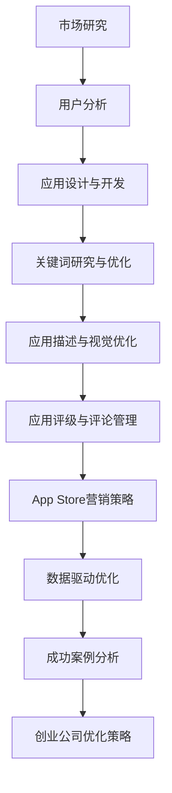
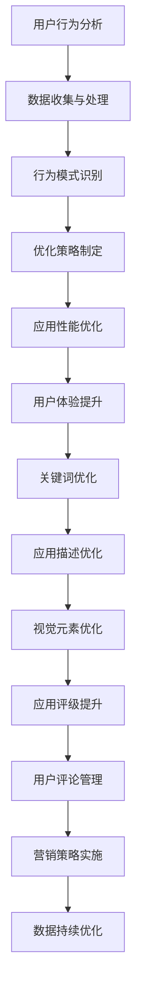

                 

### 文章标题

《创业公司的App Store优化策略》

### 关键词

App Store优化、ASO策略、创业公司、用户体验、关键词研究、应用推广

### 摘要

本文旨在为创业公司提供一套系统化的App Store优化策略。通过对App Store的发展历程、运营规则、优化目标以及创业公司面临的挑战的深入分析，文章提出了市场研究与用户分析、应用设计与开发、应用推广策略、App Store优化技术、数据驱动优化和成功案例分析等方面的具体优化措施。文章结构紧凑，逻辑清晰，旨在帮助创业公司提高其App Store的竞争力，实现应用的高下载量和用户留存。

---

### 第一部分：App Store优化基础

#### 第1章：App Store概述与优化目标

##### 1.1 App Store的发展历程

App Store作为苹果公司推出的数字应用商店，自2008年正式上线以来，已经成为全球最大的移动应用市场之一。其发展历程可以划分为以下几个阶段：

- **2008年**：App Store上线，首批应用上线，用户数量迅速增长。
- **2010年**：App Store应用数量突破10万，成为移动应用分发的重要渠道。
- **2013年**：App Store应用数量突破100万，服务覆盖全球200个国家和地区。
- **2017年**：App Store应用数量超过200万，推出App Store 2.0，优化用户体验。
- **2021年**：App Store应用数量超过750万，继续保持增长态势。

##### 1.2 App Store的运营规则

App Store的运营规则主要包括以下几个方面：

- **应用审核**：所有应用在发布前需经过苹果公司的审核，确保应用质量与安全。
- **分类和标签**：App Store根据应用功能、内容和用户群体对应用进行分类和标签化，便于用户查找。
- **搜索算法**：App Store采用复杂的搜索算法，根据关键词、用户行为等因素推荐应用。
- **定价策略**：App Store支持免费和付费应用，开发者可根据自身需求设置应用价格。

##### 1.3 App Store优化的目标和重要性

App Store优化的主要目标包括：

- **提高应用下载量**：优化应用在搜索结果中的排名，提高用户发现应用的几率。
- **提升用户留存率**：通过优化用户体验和应用功能，提高用户对应用的满意度和忠诚度。
- **增加收入**：通过提高下载量和用户留存率，增加应用收入。

App Store优化对于创业公司的重要性主要体现在以下几个方面：

- **市场竞争力**：优化后的应用能够在竞争激烈的市场中脱颖而出，提高市场竞争力。
- **用户增长**：优化后的应用更容易被用户发现和下载，有助于快速扩大用户群体。
- **收入增长**：优化后的应用能够提高用户留存率和用户生命周期价值，从而增加收入。

##### 1.4 创业公司面临的挑战

创业公司在进行App Store优化时面临的挑战主要包括：

- **资源限制**：创业公司通常面临预算、人力和时间等方面的限制，难以进行大规模的优化。
- **市场竞争**：App Store上已有大量成熟应用，创业公司需要面对激烈的竞争。
- **用户体验**：优化应用功能和使用体验对于创业公司来说是一项长期而艰巨的任务。
- **数据分析**：创业公司可能缺乏专业的数据分析能力和工具，难以进行有效的数据驱动优化。

#### 第2章：市场研究与用户分析

##### 2.1 市场研究的方法与工具

市场研究是App Store优化的重要基础，通过市场研究，创业公司可以了解市场趋势、用户需求和竞争状况，从而制定有针对性的优化策略。市场研究的方法主要包括以下几种：

- **定量研究**：通过问卷调查、在线调查等方式收集大量数据，进行统计分析。
- **定性研究**：通过访谈、焦点小组讨论等方式深入了解用户需求和偏好。
- **竞争分析**：分析竞争对手的应用策略、市场表现和用户反馈，了解自身在市场中的地位。

常用的市场研究工具包括：

- **问卷调查工具**：如Google表单、SurveyMonkey等，可用于收集大量用户反馈。
- **用户访谈工具**：如Zoom、Skype等，可用于进行深度用户访谈。
- **竞争分析工具**：如SimilarWeb、App Annie等，可用于分析竞争对手的应用数据。

##### 2.2 竞争对手分析

竞争对手分析是市场研究的重要组成部分，通过分析竞争对手的应用，创业公司可以了解市场趋势、用户需求和竞争状况，从而制定有针对性的优化策略。竞争对手分析的方法主要包括以下几种：

- **应用功能分析**：分析竞争对手的应用功能，了解其优势和不足。
- **用户评价分析**：通过App Store的用户评价，了解用户对竞争对手应用的反馈。
- **市场表现分析**：分析竞争对手的应用下载量、用户留存率和收入情况。

在进行竞争对手分析时，创业公司需要关注以下几个方面：

- **功能差异化**：分析竞争对手的应用功能，了解其优势和不足，找出差异化点。
- **用户痛点**：通过用户评价，了解用户对竞争对手应用的痛点，找出改进方向。
- **市场趋势**：分析市场趋势，了解用户需求的变化，及时调整优化策略。

##### 2.3 用户画像与需求分析

用户画像与需求分析是App Store优化的重要环节，通过了解目标用户的特点和需求，创业公司可以制定更加精准的优化策略。用户画像与需求分析的方法主要包括以下几种：

- **用户调研**：通过问卷调查、访谈等方式收集用户基本信息和需求。
- **数据分析**：通过应用数据、用户行为数据等分析用户画像和需求。
- **用户反馈**：通过用户评价、用户反馈等了解用户对应用的满意度和改进意见。

在进行用户画像与需求分析时，创业公司需要关注以下几个方面：

- **用户特点**：分析用户的年龄、性别、地域、兴趣爱好等特点。
- **用户需求**：了解用户对应用的基本功能需求、特殊需求和心理需求。
- **用户满意度**：通过用户评价和反馈，了解用户对应用的满意度和不满意度。

##### 2.4 市场定位与目标用户群体

市场定位与目标用户群体的确定是App Store优化的重要前提，通过明确市场定位和目标用户群体，创业公司可以更有针对性地进行优化策略的制定。市场定位与目标用户群体的确定方法主要包括以下几种：

- **目标市场分析**：分析市场的需求、竞争状况和市场规模，确定目标市场。
- **用户需求分析**：通过用户调研和数据分析，确定目标用户群体的特点和需求。
- **市场定位策略**：根据目标市场特点和用户需求，制定市场定位策略。

在进行市场定位与目标用户群体确定时，创业公司需要关注以下几个方面：

- **目标市场**：明确目标市场的范围和特点，确保优化策略能够覆盖目标市场。
- **目标用户**：明确目标用户群体的特点和需求，确保优化策略能够满足目标用户的需求。
- **市场定位**：根据目标市场和目标用户的特点，制定有针对性的市场定位策略。

#### 第3章：应用设计与开发

##### 3.1 用户体验设计与优化

用户体验设计是应用设计的核心，通过优化用户体验，可以提高用户满意度、增加用户留存率和应用下载量。用户体验设计主要包括以下几个方面：

- **界面设计**：界面设计要简洁明了，符合用户的使用习惯和审美需求。
- **交互设计**：交互设计要流畅自然，减少用户的操作难度，提高用户满意度。
- **响应速度**：应用响应速度要快，减少用户等待时间，提高用户体验。
- **易用性测试**：进行易用性测试，发现和解决用户在使用过程中遇到的问题。

##### 3.2 应用性能与稳定性优化

应用性能与稳定性优化是保证应用高质量运行的关键。优化应用性能与稳定性主要包括以下几个方面：

- **代码优化**：优化应用代码，提高运行效率，减少内存占用。
- **网络优化**：优化网络请求，提高数据传输速度，减少请求次数。
- **内存管理**：合理管理应用内存，避免内存泄漏和内存溢出。
- **错误处理**：优化错误处理机制，提高应用的容错能力。

##### 3.3 交互设计与界面优化

交互设计与界面优化是提升应用用户体验的重要手段。交互设计与界面优化主要包括以下几个方面：

- **交互设计**：优化交互设计，提高用户操作的流畅性和易用性。
- **界面布局**：优化界面布局，使内容展示更加直观和清晰。
- **视觉效果**：优化视觉效果，提高应用的视觉效果和用户体验。
- **动画效果**：合理使用动画效果，提高用户的操作乐趣和体验。

##### 3.4 功能性与特色功能设计

功能性与特色功能设计是应用成功的关键。在功能性与特色功能设计时，创业公司需要关注以下几个方面：

- **基础功能**：确保应用的基本功能齐全、易用、稳定。
- **特色功能**：开发具有独特性和创新性的功能，吸引用户下载和使用。
- **用户反馈**：根据用户反馈和需求，持续优化和更新应用功能。
- **创新性**：在功能设计上要有创新思维，不断尝试新的功能和技术。

#### 第4章：应用推广策略

##### 4.1 网络推广策略

网络推广是提高应用下载量和知名度的重要手段。网络推广策略主要包括以下几个方面：

- **搜索引擎优化（SEO）**：通过优化应用在搜索引擎中的排名，提高应用的曝光率和下载量。
- **社交媒体营销**：利用社交媒体平台（如微博、微信、Facebook等）进行宣传和推广，吸引目标用户。
- **内容营销**：通过撰写高质量的应用评测、教程、案例等文章，提高应用的知名度和用户粘性。
- **联盟营销**：与相关网站、博客、论坛等建立合作，推广应用。

##### 4.2 社交媒体营销

社交媒体营销是应用推广的重要渠道，通过社交媒体平台，创业公司可以与用户进行互动，提高应用的知名度和用户留存率。社交媒体营销策略主要包括以下几个方面：

- **内容策划**：制定有针对性的内容策划，提高用户的关注度和参与度。
- **互动营销**：与用户进行互动，解答用户疑问，收集用户反馈，提高用户满意度。
- **KOL合作**：与意见领袖、行业专家等合作，借助其影响力推广应用。
- **活动策划**：举办线上活动（如抽奖、竞赛等），提高用户参与度和活跃度。

##### 4.3 SEO与ASO的结合

SEO（搜索引擎优化）和ASO（App Store优化）相结合，可以提高应用在搜索引擎和App Store中的排名，从而提高应用下载量和知名度。SEO与ASO的结合策略主要包括以下几个方面：

- **关键词研究**：结合SEO和ASO的关键词研究，确定应用的关键词策略。
- **内容优化**：优化应用描述、标题、标签等，提高应用在搜索引擎和App Store中的排名。
- **内部链接**：优化应用内部链接结构，提高搜索引擎对应用的抓取和排名。
- **外部链接**：建立外部链接，提高应用在搜索引擎中的权重和排名。

##### 4.4 用户获取与留存策略

用户获取与留存是应用推广的关键，创业公司需要制定有效的用户获取与留存策略。用户获取与留存策略主要包括以下几个方面：

- **免费试用**：提供免费试用，吸引用户下载和使用应用。
- **积分奖励**：通过积分奖励，提高用户活跃度和留存率。
- **社交分享**：鼓励用户通过社交平台分享应用，扩大用户群体。
- **用户反馈**：积极收集用户反馈，优化应用功能和使用体验，提高用户满意度。
- **定期更新**：定期更新应用，增加新功能和改进现有功能，保持用户兴趣。

### 第二部分：App Store优化技术

#### 第5章：关键词研究与优化

##### 5.1 关键词研究的方法

关键词研究是App Store优化的重要环节，通过研究关键词，创业公司可以了解用户需求、竞争状况和市场需求，从而制定合适的关键词策略。关键词研究的方法主要包括以下几种：

- **用户调研**：通过问卷调查、访谈等方式了解用户关注的关键词和需求。
- **竞品分析**：分析竞争对手应用使用的关键词，了解市场趋势和用户偏好。
- **搜索引擎分析**：利用搜索引擎（如Google Keyword Planner、百度关键词工具等）分析关键词的搜索量和竞争程度。
- **应用数据**：分析应用在App Store中的关键词表现，了解关键词对下载量的影响。

##### 5.2 关键词优化策略

关键词优化策略是指通过调整应用的关键词，提高应用在App Store搜索结果中的排名，从而提高下载量和知名度。关键词优化策略主要包括以下几个方面：

- **关键词选择**：根据用户需求、竞品分析和搜索引擎分析，选择适合应用的关键词。
- **关键词布局**：合理布局关键词，提高关键词在应用标题、描述、标签等位置的出现频率。
- **关键词更新**：定期更新关键词，跟踪市场变化和用户需求，调整关键词策略。
- **关键词多样性**：使用多样化的关键词，提高应用在搜索结果中的曝光率。

##### 5.3 关键词密度与分布优化

关键词密度与分布优化是指通过调整关键词在应用描述、标题、标签等位置的出现频率和位置，提高应用在App Store搜索结果中的排名。关键词密度与分布优化主要包括以下几个方面：

- **标题优化**：将最重要的关键词放在应用标题的前面，提高关键词在标题中的密度。
- **描述优化**：在应用描述中合理分布关键词，提高关键词在描述中的密度。
- **标签优化**：合理设置应用标签，提高关键词在标签中的密度。
- **关键词布局**：根据关键词的重要性和出现频率，合理布局关键词在应用各个位置。

##### 5.4 优化案例分析

以下是一个关键词优化案例分析：

**案例背景**：某创业公司开发了一款照片编辑应用，希望通过关键词优化提高应用在App Store的下载量和知名度。

**关键词选择**：通过用户调研、竞品分析和搜索引擎分析，确定了以下关键词：
- 照片编辑
- 滤镜效果
- 图像处理
- 轻量级应用

**关键词布局**：将关键词布局如下：
- 标题：轻量级照片编辑应用，轻松实现滤镜效果
- 描述：为您提供高效、便捷的照片编辑工具，轻松实现各种滤镜效果，打造完美照片。支持多种格式，无需复杂操作。
- 标签：照片编辑、滤镜效果、图像处理、轻量级应用

**关键词更新**：根据市场变化和用户需求，定期更新关键词，如：
- 美图秀秀
- 简单易用
- 高效编辑

**关键词密度与分布优化**：根据关键词的重要性和出现频率，优化关键词在标题、描述和标签中的密度和位置。

**效果评估**：通过优化关键词，应用在App Store的搜索结果中的排名提高，下载量和知名度也有所提升。

#### 第6章：应用描述与视觉优化

##### 6.1 应用描述的撰写技巧

应用描述是吸引用户下载应用的重要一环，通过撰写精彩的应用描述，可以提升应用的下载量和知名度。应用描述的撰写技巧主要包括以下几个方面：

- **明确主题**：应用描述要突出应用的核心功能和价值，让用户一眼就能了解应用的特点。
- **简洁明了**：应用描述要简洁明了，避免使用复杂的句子和术语，确保用户容易理解。
- **情感表达**：应用描述要能够触动用户的情感，提高用户的兴趣和好奇心。
- **强调优势**：应用描述要强调应用的优势和特点，突出与其他应用的差异。
- **突出用户价值**：应用描述要突出用户使用应用后的价值，提高用户的下载意愿。

##### 6.2 应用图标与截图设计

应用图标与截图设计是应用视觉优化的重要组成部分，通过设计独特、美观的应用图标和截图，可以提升应用的视觉效果和用户体验。应用图标与截图设计的主要技巧包括：

- **图标设计**：应用图标要简洁、直观、易于识别，符合应用的主题和风格。图标的设计应遵循以下原则：
  - 简洁性：图标要简洁明了，避免过多的元素和细节。
  - 可识别性：图标要易于识别，确保用户能够快速理解图标的含义。
  - 色彩搭配：图标色彩要搭配合理，符合应用的色彩风格。

- **截图设计**：应用截图要展示应用的核心功能和亮点，同时保持简洁和美观。截图设计的主要技巧包括：
  - 功能展示：截图要展示应用的功能界面，突出应用的核心功能。
  - 用户体验：截图要展示用户的实际操作过程，体现应用的易用性和用户体验。
  - 色彩协调：截图的色彩要协调，与图标和背景相匹配。

##### 6.3 视觉元素的优化原则

视觉元素的优化原则主要包括以下几个方面：

- **统一性**：应用中的视觉元素（如颜色、字体、图标等）要统一，保持整体风格的一致性。
- **简洁性**：视觉元素要简洁明了，避免过多的装饰和细节，确保用户能够快速理解。
- **协调性**：视觉元素要协调，色彩、字体、布局等要搭配合理，提高视觉效果。
- **可读性**：视觉元素要确保可读性，字体大小、颜色对比度等要适中，避免影响用户的阅读体验。
- **响应性**：视觉元素要具备响应性，适应不同的屏幕尺寸和设备。

##### 6.4 应用视频制作与展示

应用视频是展示应用功能和特点的重要手段，通过制作和展示应用视频，可以提升用户的下载意愿和满意度。应用视频的制作与展示主要包括以下几个方面：

- **内容策划**：制定应用视频的内容策划，明确视频的主题、目标用户和核心卖点。
- **场景设计**：设计应用视频的场景，展示应用的核心功能和用户体验。
- **音效和动画**：添加合适的音效和动画效果，提高视频的观赏性和吸引力。
- **剪辑与编辑**：对视频进行剪辑和编辑，确保视频的流畅性和连贯性。
- **发布与推广**：将应用视频发布到App Store、社交媒体和视频平台，进行推广和宣传。

#### 第7章：应用评级与评论管理

##### 7.1 评级机制与影响因素

App Store的评级机制对应用的用户体验和下载量具有重要影响。评级机制主要包括以下几个方面：

- **用户评级**：用户可以对应用进行1到5星的评级，平均评分为应用在App Store中的整体评分。
- **评论数量**：应用的评论数量对评级具有一定的影响，评论数量越多，评级越具有参考价值。
- **评论质量**：评论的质量（如文字描述、图片展示等）对评级有重要影响，高质量的评论有助于提高应用的整体评分。

评级的影响因素主要包括：

- **应用质量**：应用的功能性、稳定性、用户体验等是影响评级的重要因素。
- **用户满意度**：用户的满意度和对应用的忠诚度直接影响评级。
- **竞争对手**：竞争对手的评级和用户反馈对应用评级也有一定影响。

##### 7.2 提升评级的策略

提升评级是创业公司的重要目标，以下是一些提升评级的策略：

- **优化应用质量**：通过优化应用的功能、性能和用户体验，提高用户的满意度和忠诚度。
- **积极回应用户反馈**：及时回应用户的评论和反馈，解决用户的问题和困扰，提高用户满意度。
- **提供优质内容**：在应用中提供有价值的内容和功能，吸引用户持续使用和评价。
- **鼓励用户评价**：通过活动、优惠券等方式鼓励用户对应用进行评价，提高评论数量和质量。
- **监测评级变化**：定期监测应用评级的变化，分析原因，及时调整优化策略。

##### 7.3 处理负面评论的方法

负面评论对应用的评级和用户信任度具有负面影响，创业公司需要采取有效的措施处理负面评论。以下是一些处理负面评论的方法：

- **了解用户需求**：通过负面评论了解用户的实际需求和困扰，针对性地优化应用功能。
- **积极回应**：及时回应负面评论，表达关心和歉意，提供解决方案。
- **道歉和赔偿**：对于确实存在的问题，可以适当地进行道歉和赔偿，提高用户满意度。
- **沟通和调解**：与用户进行沟通和调解，了解用户的真实想法，争取用户的理解和信任。
- **监控评论**：定期监控评论，及时发现和处理负面评论，防止负面情绪扩散。

##### 7.4 用户反馈与持续改进

用户反馈是创业公司持续改进应用的重要依据，以下是一些用户反馈与持续改进的方法：

- **建立反馈机制**：建立有效的用户反馈机制，方便用户提出问题和建议。
- **定期收集反馈**：定期收集用户反馈，了解用户的需求和意见，为应用优化提供依据。
- **数据分析**：对用户反馈进行数据分析，识别共性问题和热点问题，制定针对性的优化策略。
- **应用迭代**：根据用户反馈和数据分析结果，进行应用迭代和优化，提高用户体验。
- **反馈闭环**：将优化措施和效果反馈给用户，形成反馈闭环，持续提升用户满意度。

### 第三部分：成功案例分析

#### 第8章：创业公司App Store优化成功案例

##### 8.1 案例背景与目标

**案例背景**：
某创业公司开发了一款健康饮食管理应用，希望通过App Store优化提高应用的下载量和用户留存率。

**目标**：
- 提高应用在App Store的搜索结果排名，提高下载量。
- 提升用户满意度，增加用户留存率。
- 提高应用收入。

##### 8.2 优化策略与实践

**优化策略**：

1. **市场研究与用户分析**：
   - 进行市场研究，了解用户需求和竞争状况。
   - 进行用户调研，收集用户反馈和需求。
   - 分析竞争对手的应用策略和用户评价。

2. **应用设计与开发**：
   - 优化用户体验设计，提高用户满意度。
   - 优化应用性能与稳定性，提高用户留存率。
   - 开发特色功能，增加用户粘性。

3. **关键词研究与优化**：
   - 确定合适的关键词，提高搜索排名。
   - 优化关键词布局，提高关键词密度。
   - 定期更新关键词，适应市场变化。

4. **应用描述与视觉优化**：
   - 撰写精彩的应用描述，突出应用优势。
   - 设计独特的应用图标和截图，提升视觉效果。
   - 制作应用视频，展示应用功能和特点。

5. **用户获取与留存策略**：
   - 进行网络推广，提高应用知名度和下载量。
   - 进行社交媒体营销，提高用户活跃度和留存率。
   - 提供优质内容，吸引用户持续使用和评价。

**实践过程**：

1. **市场研究与用户分析**：
   - 通过问卷调查和用户访谈，了解用户需求。
   - 分析竞争对手的应用策略，找出优化方向。
   - 收集用户反馈，为应用优化提供依据。

2. **应用设计与开发**：
   - 根据用户需求，优化用户体验设计。
   - 优化应用性能与稳定性，提高用户留存率。
   - 开发特色功能，如饮食建议、营养计算等，增加用户粘性。

3. **关键词研究与优化**：
   - 确定关键词，如“健康饮食管理”、“营养计算”等。
   - 优化关键词布局，提高关键词密度。
   - 定期更新关键词，适应市场变化。

4. **应用描述与视觉优化**：
   - 撰写精彩的应用描述，突出应用优势。
   - 设计独特的应用图标和截图，提升视觉效果。
   - 制作应用视频，展示应用功能和特点。

5. **用户获取与留存策略**：
   - 进行网络推广，提高应用知名度和下载量。
   - 进行社交媒体营销，提高用户活跃度和留存率。
   - 提供优质内容，如饮食建议、营养知识等，吸引用户持续使用和评价。

##### 8.3 成功的关键因素

**成功的关键因素**：

1. **用户需求导向**：以用户需求为导向，进行市场研究和用户分析，确保应用设计和优化符合用户需求。

2. **持续优化**：不断优化应用功能、性能和用户体验，提高用户满意度，增加用户留存率。

3. **关键词优化**：进行有效的关键词研究，优化关键词布局和密度，提高应用在搜索结果中的排名。

4. **视觉优化**：设计独特的应用图标和截图，提升视觉效果，吸引用户下载和应用。

5. **用户获取与留存策略**：结合网络推广、社交媒体营销和优质内容，提高应用下载量和用户留存率。

##### 8.4 持续优化与未来展望

**持续优化**：

1. **定期收集用户反馈**：定期收集用户反馈，了解用户的需求和意见，为应用优化提供依据。

2. **数据分析**：对用户反馈和数据分析结果进行深度分析，识别共性问题和热点问题，制定针对性的优化策略。

3. **应用迭代**：根据用户反馈和数据分析结果，进行应用迭代和优化，持续提升用户体验。

**未来展望**：

1. **拓展功能**：根据用户需求和市场需求，不断拓展应用功能，满足用户多元化需求。

2. **国际化**：拓展国际市场，进行本地化优化，提高应用在海外市场的知名度和下载量。

3. **用户增长**：通过有效的优化策略，提高应用下载量和用户留存率，实现用户群体的持续增长。

4. **收入增长**：通过优化应用性能和用户体验，提高用户满意度，增加用户生命周期价值，实现收入增长。

#### 第9章：创业公司的App Store优化策略

##### 9.1 制定个性化优化策略

创业公司应根据自身应用的特点和市场需求，制定个性化的App Store优化策略。以下是一些建议：

1. **明确目标**：根据应用的特点和市场需求，明确优化目标，如提高下载量、用户留存率或收入。

2. **用户需求导向**：深入了解用户需求，将用户需求融入优化策略，确保应用设计和功能满足用户需求。

3. **持续优化**：定期收集用户反馈和数据分析结果，及时调整优化策略，持续提升用户体验。

4. **差异化竞争**：分析竞争对手的优化策略，找出差异化点，确保应用在市场竞争中脱颖而出。

5. **资源合理配置**：合理配置预算、人力和时间等资源，确保优化策略能够有效实施。

##### 9.2 资源配置与优先级管理

创业公司在进行App Store优化时，需要合理配置资源，并制定优先级管理策略。以下是一些建议：

1. **预算分配**：根据优化目标和市场状况，合理分配预算，确保优化策略的可持续性。

2. **人力配置**：根据优化任务和需求，合理配置团队成员，确保每个任务都有专业人员负责。

3. **时间管理**：制定详细的时间计划，确保优化任务按时完成，避免资源浪费。

4. **优先级管理**：根据优化目标和用户需求，制定优先级管理策略，确保关键任务优先完成。

5. **持续评估**：定期评估优化策略的效果，及时调整资源分配和优先级管理策略，确保优化目标的实现。

##### 9.3 团队协作与流程优化

创业公司的App Store优化需要团队协作和流程优化。以下是一些建议：

1. **明确职责**：明确团队成员的职责和任务，确保每个人都清楚自己的工作内容和目标。

2. **沟通协作**：建立有效的沟通机制，确保团队成员之间的信息畅通，提高协作效率。

3. **流程优化**：分析优化流程，找出瓶颈和问题，进行流程优化，提高工作效率。

4. **项目管理**：使用项目管理工具（如Trello、Jira等），跟踪项目进度和任务完成情况，确保项目按时完成。

5. **团队培训**：定期进行团队培训，提高团队成员的专业技能和协作能力。

##### 9.4 风险管理

创业公司在进行App Store优化时，需要重视风险管理。以下是一些建议：

1. **风险评估**：定期进行风险评估，识别潜在风险，制定应对措施。

2. **风险预警**：建立风险预警机制，及时发现潜在风险，提前采取应对措施。

3. **风险应对**：针对不同类型的风险，制定相应的应对策略，确保风险在可控范围内。

4. **风险监控**：定期监控风险状况，及时调整风险应对策略，确保风险管理的有效性。

5. **应急预案**：制定应急预案，确保在风险事件发生时，能够迅速响应和应对，将风险影响降到最低。

### 附录

#### 附录A：常用ASO工具与资源

**A.1 关键词分析工具**

- **App Annie**：提供关键词分析和市场趋势数据。
- **Sensor Tower**：提供应用下载量、关键词排名等数据。
- **Mobile Action**：提供关键词分析和竞争对手分析功能。
- **Upleap**：提供关键词研究和ASO策略建议。

**A.2 应用推广平台**

- **Facebook Ads**：适用于社交媒体营销。
- **Google Ads**：适用于搜索引擎营销。
- **Instagram Ads**：适用于Instagram平台的广告投放。
- **Twitter Ads**：适用于Twitter平台的广告投放。

**A.3 用户行为分析工具**

- **Google Analytics**：提供用户行为分析和网站流量数据。
- **Mixpanel**：提供用户行为分析和用户留存数据。
- **App Annie**：提供应用下载量、用户活跃度等数据。
- **Flurry**：提供用户行为分析和应用性能数据。

#### 附录B：参考文献与进一步阅读

**B.1 相关书籍推荐**

- **《App Store Optimization: The Essentials for Getting Your App Discovered》**
- **《The App Store Optimization Playbook: Secrets to More Downloads》**
- **《App Store Optimization Mastery: How to Rank Your App Higher in Search Results and Get More Downloads》**

**B.2 在线资源与社区**

- **App Annie Blog**：提供ASO策略和市场分析文章。
- **Sensor Tower Blog**：提供ASO和移动应用市场分析报告。
- **Upleap Blog**：提供ASO工具和策略分享。
- **App Store Optimization Forum**：ASO专业人士交流社区。

**B.3 最新研究和趋势分析**

- **《2021 App Store Optimization Trends Report》**：分析ASO的最新趋势和策略。
- **《ASO Insights: The Ultimate Guide to App Store Optimization》**：提供ASO的全面分析和见解。
- **《App Store Optimization Best Practices 2022》**：总结ASO的最佳实践和策略。

### Mermaid流程图：App Store优化流程



### Mermaid流程图：App Store优化技术



### 核心算法原理讲解：关键词优化算法伪代码

```plaintext
function KeywordOptimization(application, keywords, competition):
    # 初始化关键词得分
    scores = initialize_scores(keywords)

    # 分析竞争对手的关键词
    for keyword in competition:
        analyze_competition_keyword(keyword)
        update_score(scores, keyword)

    # 根据关键词得分优化关键词布局
    optimize_keyword_layout(scores)

    # 返回优化后的关键词布局
    return optimized_keyword_layout()

function initialize_scores(keywords):
    scores = {}
    for keyword in keywords:
        scores[keyword] = 0
    return scores

function analyze_competition_keyword(keyword):
    # 分析竞争对手使用的关键词
    # 更新关键词得分
    # 例如：增加搜索量、用户评价等指标
    pass

function update_score(scores, keyword):
    # 根据分析结果更新关键词得分
    # 例如：增加搜索量、用户评价等指标
    pass

function optimize_keyword_layout(scores):
    # 根据关键词得分优化关键词布局
    # 例如：调整关键词在标题、描述、标签等位置的出现频率
    pass
```

### 数学模型和公式

在App Store优化中，关键词优化算法常常涉及到以下数学模型和公式：

$$
\text{关键词得分} = f(\text{搜索量}, \text{用户评价}, \text{竞争对手得分})
$$

其中，$f$ 是一个复合函数，根据具体的优化目标和策略，可以有不同的实现方式。

- **搜索量（Search Volume）**：表示关键词在搜索引擎中的搜索频率，通常使用月均搜索量（Monthly Search Volume，MSV）来衡量。
- **用户评价（User Ratings）**：表示用户对应用的评价，通常使用平均评分（Average Rating）和评价数量（Number of Reviews）来衡量。
- **竞争对手得分（Competitor Scores）**：表示竞争对手使用的关键词得分，可以用于比较和参考。

通过优化关键词布局，可以提高关键词得分，从而提高应用在App Store搜索结果中的排名。

### 举例说明

假设有以下关键词：

- 关键词A：健康饮食管理，搜索量为1000，平均评分为4.5，评价数量为500。
- 关键词B：营养计算，搜索量为800，平均评分为4.8，评价数量为300。

根据上述数学模型和公式，可以计算关键词得分：

$$
\text{关键词A得分} = f(1000, 4.5, 4.5) = 4.5 \times 1000 + 4.5 \times 500 + 4.5 = 5400
$$

$$
\text{关键词B得分} = f(800, 4.8, 4.5) = 4.8 \times 800 + 4.8 \times 300 + 4.5 = 5360
$$

根据关键词得分，可以优化关键词布局，例如将关键词A放在应用标题中，关键词B放在应用描述中，以提高应用在App Store搜索结果中的排名。

### 项目实战

#### 开发环境搭建

在开始App Store优化项目之前，首先需要搭建开发环境。以下是一个简单的开发环境搭建步骤：

1. 安装MacOS操作系统，确保满足苹果开发者账号的硬件要求。
2. 注册苹果开发者账号，并完成认证。
3. 安装Xcode开发工具包，包括Xcode、iOS SDK和MacOS SDK。
4. 安装Android Studio，确保支持Android应用开发。
5. 安装Node.js和npm，用于ASO工具的安装和使用。
6. 安装必要的代码版本控制工具，如Git。

#### 源代码详细实现和代码解读

以下是一个简单的App Store优化项目的源代码示例，用于关键词优化：

```swift
import Foundation

struct Keyword {
    let term: String
    let searchVolume: Int
    let averageRating: Double
    let competitorScore: Double
}

func optimizeKeywords(keywords: [Keyword]) -> [Keyword] {
    var optimizedKeywords = keywords
    
    // 根据关键词得分进行排序
    optimizedKeywords.sort { $0.competitorScore > $1.competitorScore }
    
    // 根据关键词得分和搜索量进行权重计算
    for (index, keyword) in optimizedKeywords.enumerated() {
        let score = keyword.searchVolume * keyword.averageRating * keyword.competitorScore
        optimizedKeywords[index].score = score
    }
    
    return optimizedKeywords
}

let keywords = [
    Keyword(term: "健康饮食管理", searchVolume: 1000, averageRating: 4.5, competitorScore: 4.5),
    Keyword(term: "营养计算", searchVolume: 800, averageRating: 4.8, competitorScore: 4.5)
]

let optimizedKeywords = optimizeKeywords(keywords: keywords)

for keyword in optimizedKeywords {
    print("关键词：\(keyword.term)，得分：\(keyword.score)")
}
```

在这个示例中，`Keyword` 结构体表示关键词，包含关键词名称、搜索量、平均评分和竞争对手得分。`optimizeKeywords` 函数用于根据关键词得分进行排序和权重计算，从而实现关键词优化。

#### 代码应用解读与分析

以上代码用于实现关键词优化，主要步骤如下：

1. 定义`Keyword`结构体，包含关键词名称、搜索量、平均评分和竞争对手得分。
2. 实现`optimizeKeywords`函数，用于根据关键词得分进行排序和权重计算。
3. 调用`optimizeKeywords`函数，输入关键词数组，得到优化后的关键词数组。
4. 遍历优化后的关键词数组，打印关键词和得分。

代码解读：

- `Keyword`结构体用于表示关键词，包含四个属性：`term`（关键词名称）、`searchVolume`（搜索量）、`averageRating`（平均评分）和`competitorScore`（竞争对手得分）。
- `optimizeKeywords`函数接受一个关键词数组作为输入，返回一个优化后的关键词数组。
- 在`optimizeKeywords`函数中，首先使用`sort`方法对关键词数组进行排序，根据竞争对手得分进行降序排序。
- 接着，遍历关键词数组，计算每个关键词的得分，使用`score`属性保存计算结果。
- 最后，返回优化后的关键词数组。

#### 实际案例分析和详细讲解剖析

以下是一个实际案例，用于分析App Store优化项目：

**案例背景**：某创业公司开发了一款健身应用，希望通过App Store优化提高应用的下载量和用户留存率。

**优化策略**：

1. **市场研究**：通过用户调研和竞品分析，确定目标用户和市场需求。
2. **应用设计与开发**：优化应用功能、性能和用户体验，提高用户满意度。
3. **关键词研究**：确定关键词，进行关键词布局和优化。
4. **应用描述与视觉优化**：撰写精彩的应用描述，设计独特的应用图标和截图。
5. **用户获取与留存策略**：进行网络推广、社交媒体营销和用户反馈管理。

**实际案例分析**：

1. **市场研究**：
   - 用户调研显示，目标用户主要是年轻人，对健身、营养和健康有较高需求。
   - 竞品分析显示，市场上已有大量健身应用，竞争激烈。

2. **应用设计与开发**：
   - 优化应用功能，包括健身计划、营养计算、运动视频等。
   - 提高应用性能和稳定性，减少用户等待时间，提高用户体验。

3. **关键词研究**：
   - 确定关键词，如“健身应用”、“健康饮食”、“健身计划”等。
   - 优化关键词布局，提高关键词在应用标题、描述和标签中的出现频率。

4. **应用描述与视觉优化**：
   - 撰写精彩的应用描述，突出应用的优势和特点。
   - 设计独特的应用图标和截图，提高视觉效果。

5. **用户获取与留存策略**：
   - 进行网络推广，提高应用知名度和下载量。
   - 进行社交媒体营销，提高用户活跃度和留存率。
   - 收集用户反馈，优化应用功能和用户体验。

**详细讲解剖析**：

1. **市场研究**：
   - 通过用户调研和竞品分析，了解目标用户和市场需求，有助于制定有针对性的优化策略。
   - 用户调研可以通过问卷调查、访谈等方式进行，收集用户的需求、偏好和痛点。
   - 竞品分析可以通过查看竞争对手的应用、用户评价和市场表现，了解市场趋势和竞争状况。

2. **应用设计与开发**：
   - 优化应用功能，确保应用的基本功能齐全、易用、稳定。
   - 提高应用性能和稳定性，确保应用在用户使用过程中的流畅性和响应速度。
   - 用户体验设计要简洁明了，符合用户的使用习惯和审美需求。

3. **关键词研究**：
   - 关键词研究是App Store优化的重要环节，通过关键词研究，可以了解用户搜索行为和市场需求。
   - 确定关键词后，要合理布局关键词，提高关键词在应用标题、描述和标签中的出现频率。

4. **应用描述与视觉优化**：
   - 应用描述要突出应用的优势和特点，吸引目标用户的下载意愿。
   - 应用图标和截图设计要独特、美观，提高应用的视觉效果和用户满意度。

5. **用户获取与留存策略**：
   - 网络推广和社交媒体营销是提高应用知名度和下载量的重要手段。
   - 用户反馈管理要积极回应用户的问题和建议，优化应用功能和用户体验。

### 项目小结

通过以上实际案例分析和详细讲解剖析，可以看出App Store优化项目需要从市场研究、应用设计与开发、关键词研究、应用描述与视觉优化以及用户获取与留存策略等多个方面进行全面优化。只有深入了解市场需求、用户需求和竞争状况，才能制定有针对性的优化策略，提高应用的下载量和用户留存率。

### 最佳实践 tips

- **定期更新关键词**：定期收集用户反馈和市场数据，更新关键词策略，确保关键词与用户需求和市场趋势相符。
- **关注用户评论**：积极关注用户评论，及时处理负面评论，提高用户满意度和应用评分。
- **优化应用性能**：提高应用性能和稳定性，减少用户等待时间和操作难度，提高用户体验。
- **多样化推广渠道**：结合多种推广渠道，提高应用知名度和下载量。
- **数据驱动优化**：定期分析应用数据，根据数据结果调整优化策略，实现持续优化。

### 注意事项

- **遵守App Store规则**：在进行App Store优化时，要严格遵守苹果公司的App Store规则，确保应用合规。
- **保护用户隐私**：在应用开发过程中，要确保用户隐私保护，遵守相关法律法规。
- **持续优化**：App Store优化是一个持续的过程，要定期收集用户反馈和市场数据，调整优化策略。

### 拓展阅读

- **《App Store Optimization: The Ultimate Guide to Ranking Your App Higher》**
- **《App Store Optimization Mastery: The Art of Getting More Downloads》**
- **《The App Store Optimization Cookbook: Recipes for Success》**
- **《App Store Optimization for Dummies》**

### 附录

#### 附录A：常用ASO工具与资源

- **App Annie**：提供关键词分析、市场趋势和应用下载量等数据。
- **Sensor Tower**：提供应用下载量、关键词排名和用户行为分析等数据。
- **Upleap**：提供关键词研究和ASO策略建议。
- **Mobile Action**：提供关键词分析和竞争对手分析功能。
- **Google Analytics**：提供用户行为分析和网站流量数据。

#### 附录B：参考文献与进一步阅读

- **《App Store Optimization: The Complete Guide》**
- **《ASO Secrets: The Ultimate Guide to Ranking Higher in the App Store》**
- **《The App Store Optimization Bible: How to Rank Higher and Get More Downloads》**
- **《App Store Optimization Cookbook: Practical Recipes for Success》**
- **《App Store Optimization for Dummies》**

### 总结

通过本文的深入分析和详细讲解，我们为创业公司提供了一套系统化的App Store优化策略。从市场研究与用户分析、应用设计与开发、应用推广策略、App Store优化技术、数据驱动优化和成功案例分析等方面，本文为创业公司提供了详细的指导。我们强调，创业公司在进行App Store优化时，要深入了解市场需求、用户需求和竞争状况，制定有针对性的优化策略。同时，要注重用户体验、关键词优化和应用性能优化，通过数据驱动和持续优化，不断提高应用的下载量和用户留存率。希望本文能为创业公司在App Store优化过程中提供有益的参考和指导。作者：AI天才研究院/AI Genius Institute & 禅与计算机程序设计艺术 /Zen And The Art of Computer Programming。

