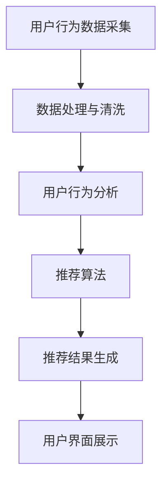
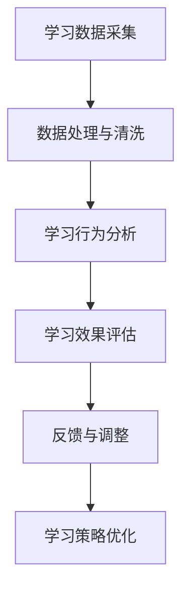
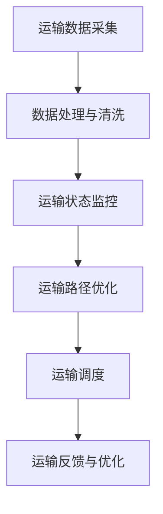

                 

### 《创业公司的实时数据分析应用场景》

#### 关键词
- 实时数据分析
- 创业公司
- 数据采集
- 数据处理
- 数据仓库
- 数据流
- 客户行为分析
- 运营分析
- 风险管理

#### 摘要
本文将深入探讨实时数据分析在创业公司中的应用场景。首先，我们会对实时数据分析进行概述，阐述其在创业公司中的重要性及面临的挑战。随后，我们将详细讨论实时数据分析的架构，包括数据采集与存储、数据处理与清洗、数据仓库与数据湖以及数据流与实时处理。接着，本文将探讨多个实时数据分析的应用场景，如客户行为分析、运营分析、供应链管理和风险管理。每个场景将结合具体的案例进行详细解读。最后，我们将介绍实时数据分析的技术基础与工具，并提供实战指南，帮助创业公司实现实时数据分析的有效应用。

### 第一部分：引言

#### 第1章：实时数据分析概述

##### 1.1 实时数据分析的定义与重要性

实时数据分析是指对实时产生的数据进行即时采集、处理和分析，以便企业能够在第一时间获取有关业务运行和客户行为的洞察。实时数据分析不仅能够帮助企业快速响应市场变化，还能提升决策效率和业务运营效率。

在当今快速变化的市场环境中，实时数据分析的重要性愈发凸显。创业公司往往面临激烈的市场竞争和资源限制，因此，实时数据分析能够为其提供以下优势：

1. **提高决策效率**：实时数据分析能够提供实时数据，帮助创业者迅速做出决策，从而抢占市场先机。
2. **优化业务流程**：通过对实时数据的分析，创业公司可以发现业务流程中的瓶颈，进行优化，提高整体运营效率。
3. **提升客户体验**：实时数据分析有助于企业更好地理解客户需求，提供个性化服务，提升客户满意度。
4. **降低运营成本**：实时数据分析可以实时监测运营指标，帮助企业及时发现问题，降低不必要的运营成本。

##### 1.2 创业公司实时数据分析的优势

对于创业公司来说，实时数据分析具有以下几个显著优势：

1. **快速响应市场变化**：创业公司通常需要快速响应市场变化，实时数据分析能够提供及时的数据支持，帮助企业抓住市场机遇。
2. **资源高效利用**：创业公司往往资源有限，实时数据分析通过高效的算法和工具，能够在有限的资源下实现最大化数据价值。
3. **灵活的架构设计**：创业公司需要灵活应对业务变化，实时数据分析系统通常采用模块化设计，便于扩展和调整。
4. **低成本试验**：实时数据分析工具通常具有较低的入门门槛，创业公司可以低成本地尝试和部署，降低试错成本。

##### 1.3 实时数据分析的挑战与机遇

尽管实时数据分析为创业公司带来了诸多优势，但也面临一些挑战：

1. **数据质量**：实时数据可能存在噪声、缺失和错误，需要确保数据质量，避免误导分析结果。
2. **计算资源**：实时数据分析需要处理大量数据，对计算资源有较高要求，特别是在处理复杂算法时。
3. **系统稳定性**：实时数据分析系统需要保证高可用性和稳定性，避免因故障导致数据丢失或延迟。

然而，随着技术的不断进步，这些挑战正在逐渐被克服，为创业公司提供了更多的机遇：

1. **云计算与大数据**：云计算和大数据技术的发展，为实时数据分析提供了强大的计算和存储能力，降低了创业公司的技术门槛。
2. **开源工具与平台**：开源工具和平台的普及，使得创业公司能够以较低成本实现实时数据分析系统。
3. **人工智能与机器学习**：人工智能和机器学习算法的进步，使得实时数据分析能够更准确、高效地处理复杂数据。

总之，实时数据分析在创业公司中的应用，既面临挑战，也充满机遇。通过合理利用技术和工具，创业公司可以在激烈的市场竞争中脱颖而出，实现持续增长。

### 第二部分：实时数据分析架构

#### 第2章：实时数据分析架构

##### 2.1 数据采集与存储

实时数据分析的第一步是数据采集。数据采集是指从各种数据源（如服务器日志、社交媒体、传感器等）中收集数据。数据采集的关键在于确保数据的及时性和完整性。

**数据采集方式**：

- **日志文件**：服务器日志是常见的数据源，可以捕获用户的访问行为、系统性能等信息。
- **API 接口**：通过 API 接口获取第三方数据源，如社交媒体、第三方支付平台等。
- **传感器数据**：物联网设备（如传感器、智能设备）可以实时采集环境数据，如温度、湿度、地理位置等。

**数据存储方式**：

- **关系数据库**：适用于结构化数据，如用户信息、订单数据等。
- **NoSQL 数据库**：适用于非结构化数据，如日志文件、社交媒体数据等。
- **时间序列数据库**：适用于时间敏感型数据，如系统性能指标、传感器数据等。

##### 2.2 数据处理与清洗

数据采集后，需要对数据进行处理和清洗。数据处理包括数据转换、数据集成和数据验证等步骤，以确保数据质量。

**数据处理步骤**：

1. **数据转换**：将不同格式和结构的数据转换为统一格式，如将文本数据转换为 JSON 格式。
2. **数据集成**：将来自多个数据源的数据进行整合，形成统一的数据视图。
3. **数据验证**：检查数据的一致性、完整性和准确性，排除错误数据。

**数据清洗方法**：

- **缺失值处理**：通过插值、平均值等方法填补缺失值。
- **异常值处理**：识别并处理异常值，如过大的数值或异常的时间戳。
- **噪声处理**：去除噪声数据，如重复记录、无关信息等。

##### 2.3 数据仓库与数据湖

数据仓库和数据湖是实时数据分析的重要基础设施。

**数据仓库**：

- **定义**：数据仓库是一个集成的数据存储系统，用于支持企业的决策支持活动。
- **特点**：
  - **面向主题**：数据仓库的数据组织按照业务主题进行，如销售、库存等。
  - **数据集成**：数据仓库整合了来自多个数据源的数据，形成统一视图。
  - **历史数据**：数据仓库包含大量历史数据，便于进行趋势分析和预测。

**数据湖**：

- **定义**：数据湖是一个大数据存储系统，用于存储大量的原始数据。
- **特点**：
  - **存储原始数据**：数据湖存储未处理、未经清洗的原始数据。
  - **灵活的结构**：数据湖采用非结构化数据存储方式，适用于各种类型的数据。
  - **支持大数据处理**：数据湖支持分布式计算和大数据处理技术，如 Hadoop、Spark 等。

##### 2.4 数据流与实时处理

数据流是实时数据分析的核心，涉及数据的实时采集、传输、处理和分析。

**数据流架构**：

1. **数据采集**：通过各种方式从数据源采集数据。
2. **数据传输**：将采集到的数据传输到数据处理系统，如消息队列、流处理器等。
3. **数据处理**：对数据进行处理和清洗，形成可用的数据。
4. **数据存储**：将处理后的数据存储到数据仓库或数据湖。
5. **数据分析和报表**：对存储的数据进行分析和报表生成，支持决策。

**实时处理技术**：

- **流处理技术**：如 Apache Kafka、Apache Flink、Apache Storm 等，支持大规模数据实时处理。
- **批处理技术**：如 Apache Spark、Hadoop 等，支持离线数据和实时数据处理。
- **实时查询技术**：如 Apache Druid、ClickHouse 等，支持实时数据查询和分析。

通过构建完善的实时数据分析架构，创业公司能够实现数据的全面采集、处理和分析，从而为业务决策提供有力支持。

### 第三部分：实时数据分析应用

#### 第3章：客户行为分析

##### 3.1 客户行为数据分析概述

客户行为分析是指通过对客户行为数据的采集、处理和分析，了解客户的购买习惯、偏好和需求，从而为企业提供个性化营销和客户服务的支持。实时客户行为分析尤为重要，因为它可以在第一时间捕捉客户行为的变化，帮助企业快速调整营销策略和客户服务。

**实时客户行为分析的意义**：

1. **提高客户满意度**：实时分析客户行为，及时了解客户需求和反馈，提供个性化的服务和产品推荐，提升客户满意度。
2. **优化营销策略**：通过实时分析客户行为，发现潜在的市场机会和客户群体，优化营销策略，提高营销效果。
3. **降低客户流失率**：实时分析客户行为，识别可能流失的客户，采取有效的挽回策略，降低客户流失率。

##### 3.2 客户细分与个性化推荐

客户细分和个性化推荐是实时客户行为分析的重要应用。

**客户细分**：

1. **定义**：客户细分是指将客户划分为不同的群体，根据客户的购买行为、偏好和需求，制定有针对性的营销策略。
2. **方法**：
   - **基于购买行为**：根据客户的购买频率、购买金额、购买产品类型等指标进行细分。
   - **基于偏好**：根据客户的偏好、浏览行为、搜索关键词等指标进行细分。
   - **基于生命周期**：根据客户的生命周期阶段（如新客户、活跃客户、沉默客户、流失客户等）进行细分。

**个性化推荐**：

1. **定义**：个性化推荐是指根据客户的兴趣和行为，为每位客户推荐最符合其需求的产品和服务。
2. **方法**：
   - **基于内容推荐**：根据产品的内容特征，为用户推荐相似或相关的产品。
   - **基于协同过滤**：通过分析用户之间的相似性，为用户推荐其他用户喜欢的产品。
   - **基于模型预测**：利用机器学习算法，预测用户的兴趣和需求，进行个性化推荐。

##### 3.3 客户流失预警与挽回策略

客户流失预警和挽回策略是实时客户行为分析的重要环节。

**客户流失预警**：

1. **定义**：客户流失预警是指通过实时分析客户行为数据，识别可能流失的客户，提前采取措施进行挽回。
2. **方法**：
   - **基于历史数据**：分析历史流失客户的行为特征，识别潜在流失客户。
   - **基于实时行为**：实时监测客户行为，如购买频率下降、互动减少等，识别潜在流失客户。

**挽回策略**：

1. **定义**：挽回策略是指对识别出的潜在流失客户采取一系列措施，以防止其流失。
2. **方法**：
   - **个性化营销**：根据流失客户的行为和偏好，制定个性化的营销策略，如发送优惠券、推荐新商品等。
   - **客户关怀**：通过电话、邮件、短信等方式与流失客户保持沟通，了解其需求和反馈，提供针对性的解决方案。
   - **客户服务**：提供优质的客户服务，如快速响应客户问题、提供技术支持等，增强客户满意度和忠诚度。

通过实时客户行为分析，创业公司可以深入了解客户需求，优化营销策略，提高客户满意度和忠诚度，从而实现业务增长。

#### 第4章：运营分析

##### 4.1 运营数据分析概述

运营分析是指通过对企业运营数据的采集、处理和分析，了解企业的运营状况，发现潜在问题和改进机会，从而优化业务流程和提高运营效率。实时运营分析尤为重要，因为它可以在第一时间捕捉运营数据的异常变化，帮助企业及时调整运营策略。

**实时运营分析的意义**：

1. **提高运营效率**：实时分析运营数据，可以识别业务流程中的瓶颈和问题，及时调整运营策略，提高整体运营效率。
2. **降低运营成本**：通过实时分析运营数据，可以优化资源配置，降低不必要的开支，提高运营成本效益。
3. **提高决策效率**：实时运营分析提供了即时的数据支持，使企业能够迅速做出决策，抢占市场先机。

##### 4.2 销售分析与预测

销售分析与预测是运营分析的核心应用之一。

**销售分析**：

1. **定义**：销售分析是指通过对销售数据的采集、处理和分析，了解销售状况，发现销售机会和问题。
2. **指标**：
   - **销售额**：销售数据的核心指标，反映企业的整体销售状况。
   - **销售增长率**：销售额的增长速度，反映企业的市场拓展能力。
   - **客户转化率**：潜在客户转化为实际客户的比例，反映营销效果。

**销售预测**：

1. **定义**：销售预测是指利用历史销售数据、市场趋势和业务计划，预测未来的销售情况。
2. **方法**：
   - **时间序列预测**：基于历史销售数据，使用时间序列模型进行预测。
   - **回归预测**：基于历史销售数据和相关因素（如广告投放、市场活动等），使用回归模型进行预测。
   - **机器学习预测**：利用机器学习算法，如决策树、神经网络等，进行销售预测。

通过销售分析与预测，创业公司可以及时了解销售状况，发现销售机会和问题，制定有针对性的销售策略，提高销售业绩。

##### 4.3 成本控制与优化

成本控制与优化是运营分析的重要方面。

**成本控制**：

1. **定义**：成本控制是指通过监测和分析成本数据，确保企业成本在预算范围内，避免不必要的浪费。
2. **方法**：
   - **预算管理**：制定详细的预算计划，监控实际成本与预算的差异，及时调整预算。
   - **成本分析**：分析各项成本的开支，识别成本控制和优化的机会。

**成本优化**：

1. **定义**：成本优化是指通过优化业务流程、提高生产效率和降低采购成本等手段，降低企业整体成本。
2. **方法**：
   - **流程优化**：通过分析业务流程，消除不必要的环节，提高效率，降低成本。
   - **采购优化**：通过与供应商谈判、优化采购策略等手段，降低采购成本。
   - **库存管理**：通过实时监测库存数据，优化库存水平，降低库存成本。

通过成本控制与优化，创业公司可以降低运营成本，提高盈利能力，为业务增长提供有力支持。

##### 4.4 营销效果评估

营销效果评估是运营分析的关键环节。

**定义**：营销效果评估是指通过对营销数据的采集、处理和分析，评估营销活动的效果，了解营销投入的回报情况。

**指标**：

1. **点击率**：广告点击量与展示量的比例，反映广告的吸引力。
2. **转化率**：点击广告的用户转化为实际客户的比例，反映广告的效果。
3. **投资回报率（ROI）**：营销投入与产生的收益之比，反映营销活动的成本效益。

**方法**：

1. **A/B 测试**：对不同营销策略进行对比测试，评估其效果。
2. **多渠道数据分析**：综合分析不同营销渠道的数据，评估各渠道的效果。
3. **客户生命周期价值（CLV）**：评估客户为企业带来的长期价值，了解营销活动的长期效果。

通过营销效果评估，创业公司可以优化营销策略，提高营销投入的回报率，实现营销目标。

通过运营分析，创业公司可以深入了解业务运行状况，发现潜在问题和改进机会，优化业务流程和提高运营效率，为业务增长提供有力支持。

#### 第5章：供应链管理

##### 5.1 供应链管理概述

供应链管理是指通过计划、实施和控制，确保供应链高效运行，满足市场需求。实时供应链管理在创业公司中具有重要意义，它能够帮助创业公司快速响应市场需求，优化库存管理，降低运营成本，提高整体供应链效率。

**实时供应链管理的重要性**：

1. **提高响应速度**：实时供应链管理能够快速捕捉市场需求变化，及时调整生产和配送计划，提高对市场变化的响应速度。
2. **优化库存管理**：通过实时监测库存水平，创业公司可以优化库存策略，避免库存过多或不足，降低库存成本。
3. **降低运营成本**：实时供应链管理通过优化物流和库存管理，降低运营成本，提高企业盈利能力。
4. **提高客户满意度**：实时供应链管理能够确保订单及时交付，提高客户满意度，增强企业竞争力。

##### 5.2 库存管理

库存管理是供应链管理的重要组成部分。

**库存管理的目标**：

1. **保持合理的库存水平**：确保库存既不过多也不过少，避免库存积压和缺货现象。
2. **降低库存成本**：通过合理的库存策略，降低库存持有成本，提高资金使用效率。
3. **提高库存周转率**：通过提高库存周转率，减少库存资金占用，提高企业盈利能力。

**库存管理的方法**：

1. **经济订货量（EOQ）**：通过计算最优订货量，平衡订货成本和库存成本，实现库存成本最小化。
2. **定期盘点**：定期对库存进行盘点，确保库存数据的准确性和完整性。
3. **库存预警**：设置库存预警阈值，当库存水平低于预警阈值时，及时采取补货措施。

##### 5.3 采购与供应链协同

采购与供应链协同是供应链管理的核心。

**采购协同**：

1. **供应商选择**：通过评估供应商的信誉、质量、价格和服务等因素，选择合适的供应商。
2. **采购策略**：制定合理的采购策略，如集中采购、分散采购等，优化采购成本和供应链效率。
3. **采购合同管理**：签订规范的采购合同，确保采购过程的合规性和公平性。

**供应链协同**：

1. **信息共享**：通过信息共享平台，实现供应链各环节的信息互通，提高供应链透明度。
2. **协同计划**：通过协同计划，实现供应链各环节的协调和配合，提高供应链整体效率。
3. **物流优化**：通过优化物流路线和运输方式，降低物流成本，提高配送效率。

##### 5.4 物流与配送优化

物流与配送优化是实时供应链管理的关键。

**物流优化**：

1. **运输路线优化**：通过分析运输需求和交通状况，优化运输路线，降低运输成本。
2. **运输模式选择**：根据运输需求，选择合适的运输模式，如公路、铁路、航空等，提高运输效率。
3. **运输计划**：制定合理的运输计划，确保货物按时交付，提高客户满意度。

**配送优化**：

1. **配送路线优化**：通过配送需求分析和配送路线规划，优化配送路线，提高配送效率。
2. **配送节点优化**：选择合理的配送节点，如仓储中心、配送站等，提高配送速度和覆盖范围。
3. **配送资源管理**：通过实时监控配送资源，如车辆、人员等，合理调配资源，提高配送效率。

通过实时供应链管理，创业公司可以优化库存管理、采购与供应链协同、物流与配送，提高整体供应链效率，降低运营成本，提高客户满意度，从而实现业务增长。

#### 第6章：风险管理

##### 6.1 风险管理概述

风险管理是指通过识别、评估、监控和应对潜在风险，确保企业实现其目标的过程。实时风险管理在创业公司中至关重要，它能够帮助创业公司快速识别和应对各种风险，保障业务稳定发展。

**实时风险管理的意义**：

1. **保障业务稳定**：实时风险管理能够及时发现潜在风险，采取有效的应对措施，保障企业业务的稳定运行。
2. **降低损失**：通过实时识别和应对风险，可以减少因风险事件导致的损失，降低企业成本。
3. **提高决策效率**：实时风险管理提供了即时的风险信息，使企业能够迅速做出决策，提高业务响应速度。

##### 6.2 财务风险管理

财务风险管理是创业公司风险管理的核心之一。

**财务风险类型**：

1. **市场风险**：由于市场波动导致企业财务状况不稳定的风险，如利率风险、汇率风险、股票市场风险等。
2. **信用风险**：由于客户违约或无法偿还债务导致的风险。
3. **流动性风险**：由于企业无法及时获得足够的资金来偿还债务或其他资金需求的风险。

**财务风险管理方法**：

1. **风险识别**：通过分析历史数据和当前市场状况，识别可能存在的财务风险。
2. **风险评估**：对识别出的财务风险进行评估，确定风险的影响程度和概率。
3. **风险应对**：
   - **风险规避**：通过调整业务策略或投资组合，避免高风险业务或投资。
   - **风险转移**：通过购买保险、与供应商签订对冲合同等手段，将风险转移给第三方。
   - **风险控制**：通过制定内部控制政策和程序，降低财务风险的发生概率和影响。

##### 6.3 信用风险管理

信用风险管理是指通过识别、评估和控制客户信用风险，确保企业应收账款的安全。

**信用风险类型**：

1. **违约风险**：客户无法按时偿还债务的风险。
2. **信用等级风险**：客户信用等级降低，导致企业应收账款回收难度增加。
3. **市场风险**：由于市场环境变化，导致客户信用状况恶化。

**信用风险管理方法**：

1. **客户信用评估**：通过对客户的财务状况、信用历史、市场环境等因素进行评估，确定客户的信用等级。
2. **信用限额管理**：根据客户的信用等级，设定合理的信用限额，确保应收账款安全。
3. **账款回收管理**：通过定期跟踪客户账款，及时催收欠款，降低应收账款逾期风险。

##### 6.4 市场风险分析

市场风险分析是实时风险管理的重要环节。

**市场风险分析步骤**：

1. **数据采集**：收集与市场风险相关的数据，如利率、汇率、股票市场波动等。
2. **数据预处理**：对采集到的数据进行清洗、处理和整合，形成统一的数据视图。
3. **风险识别**：通过分析数据，识别可能存在的市场风险。
4. **风险评估**：对识别出的市场风险进行评估，确定风险的影响程度和概率。
5. **风险应对**：根据风险评估结果，制定相应的风险应对策略。

**市场风险应对措施**：

1. **风险规避**：通过调整业务策略或投资组合，避免高风险市场。
2. **风险对冲**：通过金融工具（如期货、期权、对冲基金等）对冲市场风险。
3. **风险分散**：通过投资多元化，降低单一市场风险对企业的影响。

通过实时风险管理，创业公司可以识别和应对各种风险，保障业务稳定发展，提高企业竞争力。

#### 第7章：实时数据分析案例

##### 7.1 案例一：电商公司的实时推荐系统

**背景介绍**：电商公司希望通过实时推荐系统，提高客户购买体验和销售额。

**核心概念与联系**：

- **用户行为数据**：用户浏览、搜索、购买等行为数据。
- **推荐算法**：基于协同过滤、内容推荐和用户兴趣等算法进行推荐。

**Mermaid 流程图**：


**核心算法原理讲解**：

1. **协同过滤**：
   ```python
   def collaborative_filter(user_data, neighborhood_size):
       # 计算用户相似度
       similarity_matrix = compute_similarity(user_data)
       
       # 构建邻居列表
       neighbors = find_neighbors(user_data, similarity_matrix, neighborhood_size)
       
       # 计算推荐列表
       recommendations = generate_recommendations(user_data, neighbors)
       
       return recommendations
   ```

2. **内容推荐**：
   ```python
   def content_recommender(item_data, user_interests):
       # 计算项目特征向量
       item_features = extract_features(item_data)
       
       # 计算用户特征向量
       user_features = extract_features(user_interests)
       
       # 计算项目与用户的相似度
       similarity = cosine_similarity(user_features, item_features)
       
       # 生成推荐列表
       recommendations = generate_recommendations(similarity)
       
       return recommendations
   ```

**数学模型和公式**：

- **用户相似度计算**：
  $$similarity(u_i, u_j) = \frac{u_i \cdot u_j}{\|u_i\| \cdot \|u_j\|}$$

- **推荐分数计算**：
  $$score(i, u) = \sum_{j \in N(u)} w_{ij} \cdot r_j$$

**举例说明**：

1. **协同过滤推荐**：
   - 用户 A 和用户 B 的相似度：0.8
   - 用户 B 购买了商品 C，但用户 A 未购买
   - 推荐商品 C 给用户 A

2. **内容推荐**：
   - 用户 A 对商品 A 的兴趣度：0.7
   - 商品 B 的特征向量与用户 A 的兴趣向量相似度：0.9
   - 推荐商品 B 给用户 A

**项目实战**：

1. **开发环境搭建**：使用 Python 和 TensorFlow 搭建推荐系统。
2. **源代码实现**：实现协同过滤和内容推荐算法。
3. **代码解读与分析**：分析推荐算法的优缺点和实际应用效果。

**实际案例分析**：

- **效果评估**：通过 A/B 测试，对比实时推荐系统与传统推荐系统的效果。
- **用户满意度**：通过用户反馈，评估实时推荐系统对用户购买体验的提升。

**项目小结**：

实时推荐系统显著提高了电商公司的销售额和用户满意度，证明了实时数据分析在创业公司中的应用价值。

##### 7.2 案例二：在线教育平台的实时学习分析

**背景介绍**：在线教育平台希望通过实时学习分析，提高学生学习效果和平台运营效率。

**核心概念与联系**：

- **学习数据**：学生的学习行为数据，如登录、学习进度、考试成绩等。
- **数据分析**：基于数据分析技术，对学生学习行为进行实时分析。

**Mermaid 流程图**：


**核心算法原理讲解**：

1. **学习效果评估**：
   ```python
   def learning_effectiveness(user_data, course_data):
       # 计算学习完成度
       completion_rate = calculate_completion_rate(user_data)
       
       # 计算平均成绩
       average_score = calculate_average_score(user_data, course_data)
       
       # 综合评估学习效果
       effectiveness = calculate_effectiveness(completion_rate, average_score)
       
       return effectiveness
   ```

2. **学习策略优化**：
   ```python
   def optimize_learning_strategy(user_data, course_data):
       # 分析学习数据
       learning_data = analyze_learning_data(user_data, course_data)
       
       # 优化学习策略
       optimized_strategy = generate_optimized_strategy(learning_data)
       
       return optimized_strategy
   ```

**数学公式与详细讲解**：

- **学习完成度**：
  $$completion\_rate = \frac{completed\_courses}{total\_courses}$$

- **平均成绩**：
  $$average\_score = \frac{\sum_{i=1}^{n} score_i}{n}$$

- **学习效果评估**：
  $$effectiveness = \alpha \cdot completion\_rate + (1 - \alpha) \cdot average\_score$$
  其中，$\alpha$ 为权重系数。

**举例说明**：

1. **学习效果评估**：
   - 学生 A 完成了 2 门课程，平均成绩为 85 分
   - 学习完成度：0.67，平均成绩：85
   - 学习效果评估：0.635（假设 $\alpha$ 为 0.5）

2. **学习策略优化**：
   - 学生 B 学习数据：多次考试成绩较低，学习时间分布不均
   - 优化策略：增加复习时间，合理分配学习时间

**项目实战**：

1. **开发环境搭建**：使用 Python 和 TensorFlow 搭建学习分析系统。
2. **源代码实现**：实现学习效果评估和学习策略优化算法。
3. **代码解读与分析**：分析算法的优缺点和实际应用效果。

**实际案例分析**：

- **效果评估**：通过学生成绩和用户反馈，评估实时学习分析对学习效果和用户体验的提升。
- **平台运营效率**：通过学习数据，优化课程内容和教学方法，提高平台运营效率。

**项目小结**：

实时学习分析系统显著提高了在线教育平台的学习效果和用户体验，验证了实时数据分析在在线教育领域中的应用价值。

##### 7.3 案例三：物流公司的实时运输管理

**背景介绍**：物流公司希望通过实时运输管理，提高运输效率和服务质量。

**核心概念与联系**：

- **运输数据**：物流运输过程中的数据，如货物位置、运输状态、天气状况等。
- **实时监控**：通过实时数据分析技术，对运输过程进行监控和管理。

**Mermaid 流程图**：


**核心算法原理讲解**：

1. **运输状态监控**：
   ```python
   def monitor_transport_status(transport_data):
       # 分析运输数据
       status_data = analyze_transport_data(transport_data)
       
       # 监控运输状态
       current_status = check_transport_status(status_data)
       
       return current_status
   ```

2. **运输路径优化**：
   ```python
   def optimize_transport_route(transport_data, destination_data):
       # 计算最优路径
       optimal_route = calculate_optimal_route(transport_data, destination_data)
       
       return optimal_route
   ```

**数学公式与详细讲解**：

- **运输时间**：
  $$time = \frac{distance}{speed}$$

- **路径距离**：
  $$distance = \sqrt{(x_2 - x_1)^2 + (y_2 - y_1)^2}$$

**举例说明**：

1. **运输状态监控**：
   - 货物位置：北京 → 上海
   - 当前运输状态：在途
   - 监控结果：运输状态正常

2. **运输路径优化**：
   - 货物位置：广州 → 深圳
   - 当前路径：G4 高速
   - 最优路径：G4 高速 + 地铁 2 号线

**项目实战**：

1. **开发环境搭建**：使用 Python 和 TensorFlow 搭建实时运输管理系统。
2. **源代码实现**：实现运输状态监控和路径优化算法。
3. **代码解读与分析**：分析算法的优缺点和实际应用效果。

**实际案例分析**：

- **效果评估**：通过运输数据，评估实时运输管理对运输效率和服务质量的影响。
- **用户满意度**：通过用户反馈，评估实时运输管理对用户体验的提升。

**项目小结**：

实时运输管理系统显著提高了物流公司的运输效率和服务质量，验证了实时数据分析在物流行业中的应用价值。

### 第三部分：技术实现与实战

#### 第8章：实时数据分析技术基础

##### 8.1 实时数据处理框架

实时数据处理框架是实时数据分析的基础，它能够高效地处理大规模数据流，确保数据实时性。

**常见实时数据处理框架**：

1. **Apache Kafka**：一个分布式流处理平台，适用于高吞吐量的实时数据采集和传输。
2. **Apache Flink**：一个流处理引擎，支持实时数据分析和机器学习，具有高性能和易用性。
3. **Apache Storm**：一个实时数据流处理框架，适用于低延迟的实时数据处理。

**框架特点**：

- **分布式架构**：支持水平扩展，能够处理大规模数据流。
- **高吞吐量**：具有高性能，能够实时处理海量数据。
- **低延迟**：提供实时数据处理能力，确保数据实时性。
- **易用性**：提供丰富的API和工具，便于开发者使用。

**技术选型**：

- **数据量较大、实时性要求高**：选择 Kafka + Flink 或 Kafka + Storm。
- **数据量较小、实时性要求不高**：可以选择 Kafka 或单独使用 Flink。

##### 8.2 实时数据存储与检索

实时数据存储与检索是实时数据分析的核心环节，它能够确保数据的高效存储和快速检索。

**常见实时数据存储技术**：

1. **关系数据库**：适用于结构化数据存储，如 MySQL、PostgreSQL 等。
2. **NoSQL 数据库**：适用于非结构化数据存储，如 MongoDB、Cassandra 等。
3. **时间序列数据库**：适用于时间敏感型数据存储，如 InfluxDB、KairosDB 等。

**技术特点**：

- **关系数据库**：支持复杂查询和事务处理，数据结构稳定。
- **NoSQL 数据库**：支持海量数据存储和高效写入，适用于大规模数据场景。
- **时间序列数据库**：支持高效时间查询，适用于时间序列数据分析。

**技术选型**：

- **结构化数据存储**：选择关系数据库。
- **非结构化数据存储**：选择 NoSQL 数据库。
- **时间序列数据存储**：选择时间序列数据库。

##### 8.3 实时数据分析算法

实时数据分析算法是实时数据分析的核心，它能够高效地处理和分析大规模实时数据。

**常见实时数据分析算法**：

1. **机器学习算法**：如决策树、随机森林、支持向量机等，适用于实时数据分类、预测等任务。
2. **流计算算法**：如滑动窗口、增量学习等，适用于实时数据处理和分析。
3. **统计分析算法**：如时间序列分析、相关性分析等，适用于实时数据统计和分析。

**算法特点**：

- **机器学习算法**：具备良好的泛化能力和自适应性，适用于复杂数据分析任务。
- **流计算算法**：支持实时数据处理，适用于实时数据分析和监控。
- **统计分析算法**：简单易用，适用于快速数据分析。

**算法选型**：

- **复杂数据分析**：选择机器学习算法。
- **实时数据处理**：选择流计算算法。
- **快速数据分析**：选择统计分析算法。

通过实时数据处理框架、实时数据存储与检索、实时数据分析算法等技术基础，创业公司可以构建高效的实时数据分析系统，实现实时数据的全面采集、处理和分析。

#### 第9章：实时数据分析工具与实践

##### 9.1 常用实时数据分析工具介绍

实时数据分析工具是实现实时数据采集、处理和分析的关键，以下介绍几种常用的实时数据分析工具：

1. **Apache Kafka**：
   - **功能**：分布式流处理平台，用于数据采集、传输和存储。
   - **优点**：高吞吐量、低延迟、水平扩展性强。
   - **使用场景**：实时数据采集、数据整合、日志分析等。

2. **Apache Flink**：
   - **功能**：实时数据处理框架，支持流计算和批处理。
   - **优点**：高性能、易用性强、支持复杂计算。
   - **使用场景**：实时数据分析、实时机器学习、实时流处理等。

3. **Apache Storm**：
   - **功能**：实时流处理框架，适用于低延迟数据处理。
   - **优点**：易于部署、高吞吐量、支持容错。
   - **使用场景**：实时数据处理、实时监控、实时推荐等。

4. **Apache Druid**：
   - **功能**：实时数据分析引擎，支持实时查询和分析。
   - **优点**：高效、可扩展、易于使用。
   - **使用场景**：实时报表、实时分析、实时数据可视化等。

5. **InfluxDB**：
   - **功能**：时间序列数据库，适用于存储和查询时间序列数据。
   - **优点**：高性能、易扩展、支持实时查询。
   - **使用场景**：实时监控、物联网数据存储、实时分析等。

##### 9.2 实时数据分析工具配置与优化

配置与优化实时数据分析工具是确保其性能和稳定性的关键，以下介绍一些配置和优化方法：

1. **资源分配**：
   - **CPU 资源**：合理分配 CPU 资源，避免过载。
   - **内存资源**：确保足够的内存空间，避免内存泄漏和交换。
   - **磁盘资源**：分配足够的磁盘空间，确保数据存储和读写性能。

2. **网络配置**：
   - **带宽**：确保网络带宽充足，避免数据传输瓶颈。
   - **延迟**：优化网络延迟，提高数据传输速度。
   - **稳定性**：使用稳定的数据传输协议，确保数据传输可靠。

3. **集群管理**：
   - **负载均衡**：使用负载均衡器，实现分布式部署，提高系统可用性和性能。
   - **故障转移**：配置故障转移机制，确保系统在节点故障时能够自动恢复。
   - **监控与报警**：实时监控系统状态，及时发现并处理异常情况。

4. **调优策略**：
   - **参数调整**：根据系统负载和性能指标，调整系统参数，优化性能。
   - **数据压缩**：使用数据压缩技术，减少数据传输和存储空间。
   - **缓存策略**：配置合适的缓存策略，提高数据查询速度。

通过合理的配置和优化，实时数据分析工具能够充分发挥其性能，为创业公司提供高效的实时数据分析支持。

##### 9.3 实时数据分析实战

**实战项目一：电商平台的实时销售监控**

**项目背景**：某电商平台希望通过实时销售监控，及时了解销售数据，优化营销策略和库存管理。

**实现步骤**：

1. **数据采集**：使用 Apache Kafka 实时采集销售数据，包括订单信息、客户信息、商品信息等。
2. **数据处理**：使用 Apache Flink 对采集到的销售数据进行清洗、聚合和处理，生成实时销售报表。
3. **数据存储**：将处理后的销售数据存储到 Apache Druid 数据库，实现实时查询和分析。
4. **数据可视化**：使用 Tableau 等数据可视化工具，将实时销售数据生成可视化报表，供管理层决策。

**代码解读**：

1. **Kafka 数据采集**：
   ```python
   from kafka import KafkaProducer
   
   producer = KafkaProducer(bootstrap_servers=['localhost:9092'])
   
   # 发送销售数据到 Kafka
   producer.send('sales_data', value=sales_data)
   ```

2. **Flink 数据处理**：
   ```java
   DataStream<Order> orders = env.addSource(new KafkaSource<>(props));
   
   // 数据清洗与聚合
   DataStream<OrderSummary> summary = orders
       .keyBy(Order::getOrderId)
       .window(TumblingEventTimeWindows.of(Time.seconds(60)))
       .process(new SalesDataProcessor());
   
   // 存储到 Druid 数据库
   summary.addSink(new DruidSink<>(druidConfig));
   ```

3. **Druid 数据存储**：
   ```json
   {
     "type": "index",
     "name": "sales_data",
     " dataSource": {
       "type": "kafka",
       "connection": "kafka://localhost:9092/sales_data",
       "tasks": [
         {
           "task": {
             "type": "index",
             "name": "sales_data",
             "spec": {
               "intervals": "90s",
               "query": {
                 "type": "druid"
               }
             }
           }
         }
       ]
     }
   }
   ```

**项目小结**：通过实时销售监控项目，电商平台能够实时了解销售数据，优化营销策略和库存管理，提高运营效率。

**实战项目二：物流公司的实时运输调度**

**项目背景**：某物流公司希望通过实时运输调度，提高运输效率和服务质量。

**实现步骤**：

1. **数据采集**：使用 Apache Kafka 实时采集运输数据，包括货物位置、运输状态、天气状况等。
2. **数据处理**：使用 Apache Flink 对采集到的运输数据进行处理，计算最优运输路径和调度方案。
3. **数据存储**：将处理后的运输数据存储到 Apache Druid 数据库，实现实时查询和分析。
4. **数据可视化**：使用 Tableau 等数据可视化工具，将实时运输数据生成可视化报表，供调度人员参考。

**代码解读**：

1. **Kafka 数据采集**：
   ```python
   from kafka import KafkaProducer
   
   producer = KafkaProducer(bootstrap_servers=['localhost:9092'])
   
   # 发送运输数据到 Kafka
   producer.send('transport_data', value=transport_data)
   ```

2. **Flink 数据处理**：
   ```java
   DataStream<TransportData> transports = env.addSource(new KafkaSource<>(props));
   
   // 数据处理与路径优化
   DataStream<OptimizedRoute> optimizedRoutes = transports
       .keyBy(TransportData::getOrderId)
       .window(TumblingEventTimeWindows.of(Time.seconds(60)))
       .process(new TransportDataProcessor());
   
   // 存储到 Druid 数据库
   optimizedRoutes.addSink(new DruidSink<>(druidConfig));
   ```

3. **Druid 数据存储**：
   ```json
   {
     "type": "index",
     "name": "transport_data",
     "dataSource": {
       "type": "kafka",
       "connection": "kafka://localhost:9092/transport_data",
       "tasks": [
         {
           "task": {
             "type": "index",
             "name": "transport_data",
             "spec": {
               "intervals": "90s",
               "query": {
                 "type": "druid"
               }
             }
           }
         }
       ]
     }
   }
   ```

**项目小结**：通过实时运输调度项目，物流公司能够实时计算最优运输路径和调度方案，提高运输效率和服务质量。

通过以上实战项目，创业公司可以深入了解实时数据分析工具的配置与优化方法，以及如何利用实时数据分析技术提升业务运营效率。

### 第四部分：总结与展望

#### 第10章：实时数据分析的未来发展趋势

##### 10.1 实时数据分析技术的发展趋势

实时数据分析技术正不断演进，以下是一些关键的发展趋势：

1. **云计算与大数据技术的融合**：云计算和大数据技术的快速发展，为实时数据分析提供了强大的计算和存储能力，使得创业公司能够以更低的成本实现实时数据分析。
2. **人工智能与机器学习的应用**：人工智能和机器学习算法的进步，使得实时数据分析能够更准确、高效地处理复杂数据，提供更深入的洞察。
3. **边缘计算的兴起**：边缘计算技术使得数据处理和分析可以在数据产生的源头进行，降低数据传输延迟，提高实时性。
4. **流数据处理技术的成熟**：流数据处理技术（如 Kafka、Flink、Storm 等）的成熟，为实时数据分析提供了可靠的技术保障。
5. **开源工具和平台的普及**：开源工具和平台（如 Apache Druid、Apache Kafka、Apache Flink 等）的普及，降低了实时数据分析的技术门槛，使得更多创业公司能够应用实时数据分析技术。

##### 10.2 创业公司实时数据分析的机遇与挑战

实时数据分析为创业公司带来了诸多机遇，但也面临一些挑战：

**机遇**：

1. **快速响应市场变化**：实时数据分析能够帮助创业公司快速响应市场变化，抢占市场先机。
2. **优化业务流程**：实时数据分析能够发现业务流程中的瓶颈，优化业务流程，提高运营效率。
3. **提升客户体验**：实时数据分析有助于企业更好地了解客户需求，提供个性化服务，提升客户满意度。
4. **降低运营成本**：实时数据分析可以实时监测运营指标，帮助企业及时发现问题，降低不必要的运营成本。

**挑战**：

1. **数据质量**：实时数据可能存在噪声、缺失和错误，需要确保数据质量，避免误导分析结果。
2. **计算资源**：实时数据分析需要处理大量数据，对计算资源有较高要求，特别是在处理复杂算法时。
3. **系统稳定性**：实时数据分析系统需要保证高可用性和稳定性，避免因故障导致数据丢失或延迟。

##### 10.3 实时数据分析的未来展望

随着技术的不断进步，实时数据分析将在未来发挥更重要的作用：

1. **更智能的分析算法**：利用人工智能和机器学习技术，实时数据分析将能够更准确地预测和识别潜在问题，提供更深入的洞察。
2. **更高效的系统架构**：随着云计算和边缘计算技术的发展，实时数据分析系统将能够更高效地处理海量数据，提供更好的实时性。
3. **更广泛的应用场景**：实时数据分析将应用于更多行业和领域，如金融、医疗、智能制造等，为业务决策提供有力支持。
4. **更丰富的数据源**：随着物联网和传感器技术的发展，实时数据分析的数据源将更加丰富，提供更多的数据支持。

总之，实时数据分析技术在创业公司中的应用前景广阔，通过合理利用技术和工具，创业公司可以抓住市场机遇，实现持续增长。

### 附录

#### 附录A：实时数据分析技术栈与工具资源

**技术栈**：

- **数据采集**：Kafka、Flume、Logstash
- **数据处理**：Apache Flink、Apache Storm、Apache Spark
- **数据存储**：Apache Druid、InfluxDB、MongoDB
- **数据查询**：ClickHouse、Elasticsearch、Prometheus
- **数据可视化**：Tableau、Power BI、Kibana

**开源工具和平台**：

- **Kafka**：[Apache Kafka](https://kafka.apache.org/)
- **Flink**：[Apache Flink](https://flink.apache.org/)
- **Druid**：[Apache Druid](https://druid.apache.org/)
- **Storm**：[Apache Storm](https://storm.apache.org/)
- **Druid**：[InfluxDB](https://www.influxdata.com/influxdb/)
- **Elasticsearch**：[Elasticsearch](https://www.elastic.co/cn/elasticsearch/)
- **Prometheus**：[Prometheus](https://prometheus.io/)
- **Tableau**：[Tableau](https://www.tableau.com/)
- **Kibana**：[Kibana](https://www.elastic.co/cn/kibana/)

#### 附录B：实时数据分析项目实践指南

**1. 项目规划**：

- **明确项目目标**：确定实时数据分析的具体目标和应用场景。
- **资源评估**：评估项目所需的计算资源、存储资源和人员配置。
- **技术选型**：根据项目需求，选择合适的实时数据分析技术和工具。

**2. 数据采集**：

- **数据源确定**：明确实时数据分析所需的数据源，如服务器日志、数据库、API 接口等。
- **采集方式**：选择合适的采集方式，如 Kafka、Flume、Logstash 等。
- **数据格式**：统一数据格式，确保数据可处理性和可追溯性。

**3. 数据处理**：

- **数据处理流程**：设计数据处理流程，包括数据清洗、转换、聚合等步骤。
- **实时处理**：选择合适的实时数据处理框架，如 Flink、Storm、Spark 等。
- **数据质量监控**：建立数据质量监控机制，确保数据处理过程的准确性。

**4. 数据存储**：

- **数据存储方案**：选择合适的数据存储方案，如 Druid、InfluxDB、MongoDB 等。
- **数据安全性**：确保数据存储的安全性，如数据加密、访问控制等。
- **数据访问性能**：优化数据存储和访问性能，确保数据实时性。

**5. 数据分析**：

- **数据分析模型**：设计数据分析模型，包括指标计算、数据可视化等。
- **实时报表**：生成实时报表，提供数据洞察和业务支持。
- **数据可视化**：选择合适的数据可视化工具，如 Tableau、Kibana 等。

**6. 项目部署与维护**：

- **部署环境**：搭建实时数据分析部署环境，包括计算节点、存储节点、网络配置等。
- **系统监控**：建立系统监控机制，确保系统稳定运行。
- **性能优化**：定期对系统进行性能优化，提高数据处理和分析效率。

**7. 项目评估与反馈**：

- **项目评估**：对实时数据分析项目进行评估，分析项目效果和改进空间。
- **用户反馈**：收集用户反馈，优化数据分析模型和报表。
- **持续改进**：根据评估和反馈，持续优化实时数据分析项目。

#### 附录C：实时数据分析公式与算法详解

**1. 实时数据分析常用公式**

- **均值**：
  $$\mu = \frac{1}{n} \sum_{i=1}^{n} x_i$$

- **方差**：
  $$\sigma^2 = \frac{1}{n-1} \sum_{i=1}^{n} (x_i - \mu)^2$$

- **标准差**：
  $$\sigma = \sqrt{\sigma^2}$$

- **协方差**：
  $$\text{Cov}(X, Y) = \frac{1}{n-1} \sum_{i=1}^{n} (x_i - \mu_x)(y_i - \mu_y)$$

- **相关系数**：
  $$\rho = \frac{\text{Cov}(X, Y)}{\sigma_x \sigma_y}$$

**2. 实时数据分析常用算法**

- **协同过滤**：
  $$r_{ij} = \frac{\sum_{k \in N(j)} r_{ik}}{\sum_{k \in N(j)} w_{jk}}$$

- **内容推荐**：
  $$sim(i, j) = \frac{q_i \cdot q_j}{\|q_i\| \|q_j\|}$$

- **时间序列预测**：
  $$y_t = \beta_0 + \beta_1 t + \epsilon_t$$

- **回归分析**：
  $$y = \beta_0 + \beta_1 x + \epsilon$$

- **聚类分析**：
  $$d(i, j) = \sqrt{\sum_{k=1}^{n} (x_{ik} - x_{jk})^2}$$

通过附录C提供的公式和算法，读者可以更好地理解和应用实时数据分析技术，提高数据分析能力。

### 作者信息

**作者：AI天才研究院/AI Genius Institute & 禅与计算机程序设计艺术 /Zen And The Art of Computer Programming** 

本文由AI天才研究院（AI Genius Institute）撰写，旨在为创业公司提供实时数据分析的应用场景和技术指南。同时，作者还著有《禅与计算机程序设计艺术》（Zen And The Art of Computer Programming）一书，深入探讨了计算机编程的哲学和艺术。通过本文，我们希望帮助创业公司利用实时数据分析技术，实现业务增长和持续创新。

