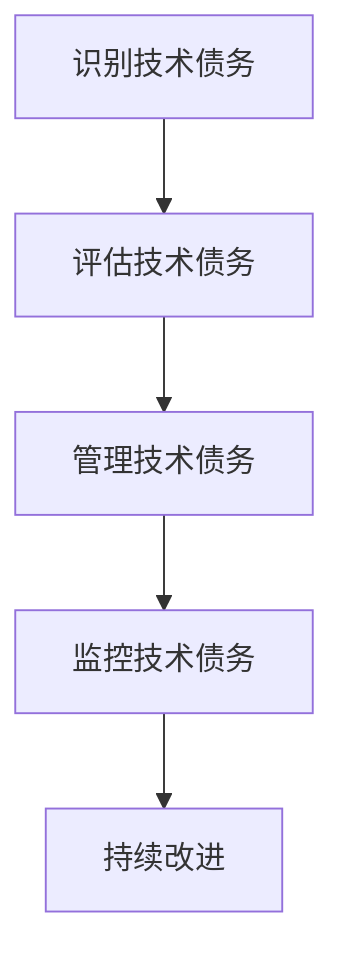

                 

### 文章标题

《创业公司的技术债务评估与管理策略》

#### 关键词
- 技术债务
- 创业公司
- 技术风险管理
- 技术评估
- 技术优化

#### 摘要
本文旨在深入探讨创业公司中技术债务的概念、识别、评估和管理策略。通过对技术债务的全面解析，我们阐述了其在创业环境中的重要性，并详细介绍了识别与评估技术债务的方法和工具。此外，本文还重点探讨了技术债务管理策略，包括债务管理原则、工具和实践。通过案例分析，本文展示了成功管理技术债务的最佳实践，并为创业公司提供了一些建议和指导，帮助他们在快速发展的过程中有效应对技术债务问题。

### 第一部分：技术债务概述

#### 第1章：技术债务的概念与分类

#### 1.1 技术债务的定义与起源

**1.1.1 技术债务的基本概念**

技术债务（Technical Debt）这一概念最早由Michael C. Feathers在2008年的一篇博客文章中提出。它比喻了软件开发过程中，因采取快速开发而遗留下来需要在未来偿还的“债务”。这种债务通常是由于短期决策而导致技术实现的复杂性增加、可维护性降低、性能下降等问题。技术债务本质上是一种设计上的选择，它帮助团队在短时间内快速实现功能，但同时也引入了长期维护的负担。

**1.1.2 技术债务的起源与发展**

技术债务的概念起源于软件工程领域，但它在其他工程领域也具有一定的相似性。随着软件系统的复杂性不断增加，技术债务管理逐渐成为软件项目管理中不可或缺的一部分。在创业公司中，由于时间紧迫和市场压力，技术债务问题尤为突出。因此，如何合理管理技术债务成为创业公司成功的关键之一。

#### 1.2 技术债务的分类

**1.2.1 按债务性质分类**

技术债务可以根据性质分为以下几类：

- **设计债务**：由于在系统设计初期未能遵循最佳实践，导致系统结构复杂、冗余度高、可扩展性差等问题。

- **实现债务**：在代码实现过程中，因追求速度而采取了一些牺牲性能和可维护性的方法，如使用速写代码、避免使用设计模式等。

- **配置债务**：由于配置管理不当，如配置文件混乱、环境配置不一致等问题。

**1.2.2 按债务类型分类**

技术债务还可以按照类型进行分类：

- **积累型债务**：随着时间的推移，不断积累的技术问题，如遗留代码、技术债务积累等。

- **突发型债务**：由于突发情况，如技术故障、紧急需求等，导致的技术债务。

#### 1.3 技术债务的影响

**1.3.1 对业务发展的影响**

技术债务对创业公司的发展有着深远的影响。一方面，技术债务会降低系统的性能和可维护性，影响用户体验；另一方面，技术债务会消耗大量的人力、时间和资源，从而降低团队的生产效率。

**1.3.2 对技术团队的影响**

技术债务对技术团队的影响更为直接。过度的技术债务会导致团队成员的压力增大，工作满意度下降，甚至影响团队的整体协作效率。因此，合理管理技术债务对于保持团队稳定和高效至关重要。

### 第2章：技术债务的识别与评估

#### 2.1 技术债务识别方法

**2.1.1 代码审查**

代码审查是识别技术债务的重要方法之一。通过审查代码，可以发现代码中的设计缺陷、性能瓶颈和可维护性问题。以下是一个简单的代码审查流程：

1. **制定审查计划**：明确审查的目标、范围和标准。
2. **选择审查人员**：选择经验丰富、对项目熟悉的人员进行审查。
3. **进行代码审查**：审查人员逐一检查代码，记录发现的问题。
4. **反馈与讨论**：将审查结果反馈给相关开发人员，进行讨论和修复。

**2.1.2 线上监控系统**

线上监控系统可以帮助识别系统的性能瓶颈和故障。以下是一个简单的监控流程：

1. **选择监控工具**：选择合适的监控工具，如Prometheus、Grafana等。
2. **配置监控指标**：定义系统关键指标的监控阈值和报警规则。
3. **实时监控**：监控系统实时收集和展示系统的运行状态。
4. **问题定位与修复**：当监控系统检测到异常时，定位问题并修复。

**2.1.3 用户反馈分析**

用户反馈是识别技术债务的重要途径。通过收集和分析用户反馈，可以发现用户遇到的问题和不满，从而识别潜在的技术债务。以下是一个简单的用户反馈分析流程：

1. **收集用户反馈**：通过问卷调查、用户访谈等方式收集用户反馈。
2. **分析反馈**：分析用户反馈，识别共性问题。
3. **制定改进计划**：根据反馈结果，制定改进计划，解决用户问题。

#### 2.2 技术债务评估指标

**2.2.1 债务程度评估**

债务程度评估是评估技术债务的重要指标。以下是一个简单的债务程度评估方法：

1. **定义评估标准**：根据债务类型和性质，定义评估标准。
2. **评估债务程度**：对每个债务项进行评估，确定其程度。
3. **分类与排序**：将债务项按程度分类，并进行排序。

**2.2.2 债务优先级评估**

债务优先级评估是确定哪些债务需要优先解决的重要方法。以下是一个简单的债务优先级评估方法：

1. **定义优先级标准**：根据债务程度、业务影响等因素，定义优先级标准。
2. **评估债务优先级**：对每个债务项进行评估，确定其优先级。
3. **制定解决方案**：根据债务优先级，制定解决方案。

**2.2.3 债务风险分析**

债务风险分析是评估技术债务风险的重要方法。以下是一个简单的债务风险分析方法：

1. **定义风险指标**：根据债务类型和性质，定义风险指标。
2. **评估债务风险**：对每个债务项进行评估，确定其风险。
3. **制定风险管理策略**：根据债务风险，制定风险管理策略。

### 第3章：技术债务管理策略

#### 3.1 技术债务管理原则

**3.1.1 债务透明化**

债务透明化是技术债务管理的重要原则之一。通过建立债务透明化机制，让团队成员了解技术债务的情况，有助于提高团队对债务管理的认识和责任感。

**3.1.2 债务优先级管理**

债务优先级管理是技术债务管理的关键。通过科学合理的优先级评估，确定哪些债务需要优先解决，有助于提高团队的工作效率。

**3.1.3 技术改进与重构**

技术改进与重构是解决技术债务的重要手段。通过持续改进和重构，可以降低系统的复杂性，提高系统的性能和可维护性。

#### 3.2 技术债务管理工具

**3.2.1 债务管理软件**

债务管理软件是帮助团队进行技术债务管理的工具。以下是一些常见的债务管理软件：

- **SonarQube**：用于代码质量和技术债务分析的工具。

- **Jenkins**：用于自动化构建和测试的持续集成工具。

- **Puppet**：用于配置管理和自动化部署的工具。

**3.2.2 债务管理流程**

债务管理流程是技术债务管理的规范。以下是一个简单的债务管理流程：

1. **债务识别**：通过代码审查、线上监控和用户反馈等方式识别技术债务。

2. **债务评估**：根据债务程度、优先级和风险，评估技术债务。

3. **债务解决**：根据债务管理原则和解决方案，解决技术债务。

4. **债务监控**：通过线上监控和用户反馈，持续监控技术债务的变化。

**3.2.3 债务管理案例分析**

通过案例分析，可以了解不同创业公司如何管理技术债务。以下是一个简单的案例分析：

**案例一：公司A的技术债务管理**

公司A通过制定债务管理政策和流程，建立了债务透明化机制。他们定期进行代码审查和性能分析，发现并解决了多个技术债务问题。通过持续改进和重构，公司A成功地降低了技术债务水平，提高了系统的性能和可维护性。

#### 第4章：技术债务与项目管理

#### 4.1 技术债务与敏捷开发

**4.1.1 敏捷开发中的技术债务管理**

敏捷开发强调快速迭代和持续交付，这使得技术债务管理变得尤为重要。在敏捷开发中，技术债务管理可以采取以下策略：

1. **持续集成**：通过持续集成，及早发现和解决技术债务问题。

2. **技术评审**：在迭代结束时进行技术评审，评估技术债务的情况。

3. **重构**：在迭代中安排时间进行重构，降低技术债务水平。

**4.1.2 敏捷开发中的债务识别与评估**

在敏捷开发中，债务识别与评估可以采取以下方法：

1. **代码审查**：通过代码审查，识别代码中的技术债务。

2. **用户故事映射**：通过用户故事映射，识别与用户需求相关的技术债务。

3. **技术回顾**：在迭代结束时进行技术回顾，评估技术债务的情况。

#### 4.2 技术债务与项目风险管理

**4.2.1 技术债务风险识别**

技术债务风险识别是项目风险管理的重要组成部分。以下是一些常见的技术债务风险：

1. **系统稳定性风险**：由于技术债务导致系统性能下降，可能引发系统稳定性问题。

2. **可维护性风险**：由于技术债务，系统的可维护性降低，可能影响项目的持续交付。

3. **业务风险**：由于技术债务，无法满足业务需求，可能影响项目的业务价值。

**4.2.2 技术债务风险评估与应对策略**

技术债务风险评估可以采取以下方法：

1. **风险评估矩阵**：根据债务程度和优先级，评估技术债务风险。

2. **风险管理策略**：根据风险评估结果，制定相应的风险管理策略。

3. **风险监控**：通过线上监控和用户反馈，持续监控技术债务风险。

#### 第5章：技术债务在创业公司中的应用

#### 5.1 创业公司技术债务管理的关键要素

**5.1.1 团队协作与沟通**

团队协作与沟通是创业公司技术债务管理的关键要素。通过有效的团队协作和沟通，可以确保技术债务问题得到及时发现和解决。

**5.1.2 技术选择与规划**

技术选择与规划是创业公司技术债务管理的重要环节。合理的选型和规划可以降低技术债务的产生。

**5.1.3 技术债务管理与创新平衡**

技术债务管理与创新平衡是创业公司面临的挑战。通过合理的策略，可以在确保技术创新的同时，控制技术债务的增长。

#### 5.2 创业公司技术债务管理的成功案例分析

**5.2.1 案例一：公司A的成功经验**

公司A通过建立完善的债务管理机制，成功降低了技术债务水平。他们定期进行代码审查和性能分析，及时发现和解决技术债务问题。

**5.2.2 案例二：公司B的技术债务化解**

公司B在发展过程中面临技术债务问题，但他们通过优化债务管理流程，成功化解了债务风险。他们采用持续集成和重构策略，提高了系统的性能和可维护性。

**5.2.3 案例三：公司C的创新实践**

公司C在创新的同时，注重技术债务管理。他们采用敏捷开发模式，通过持续改进和重构，实现了技术创新与债务管理的平衡。

#### 第6章：技术债务管理的挑战与未来趋势

#### 6.1 技术债务管理面临的挑战

**6.1.1 技术迭代速度与债务积累**

随着技术的快速发展，创业公司面临技术迭代速度与债务积累的挑战。如何在快速迭代的同时，控制技术债务的增长，成为创业公司的重要课题。

**6.1.2 技术债务与业务发展冲突**

技术债务可能会与业务发展产生冲突。如何在满足业务需求的同时，解决技术债务问题，是创业公司面临的挑战。

**6.1.3 技术债务管理的复杂性与动态性**

技术债务管理的复杂性和动态性是创业公司面临的挑战。技术债务种类繁多，管理方法各异，如何在动态环境中有效管理技术债务，成为创业公司的难题。

#### 6.2 技术债务管理的未来趋势

**6.2.1 自动化与智能化债务管理**

随着人工智能和自动化技术的发展，自动化与智能化债务管理将成为未来趋势。通过引入人工智能算法，可以更精确地识别和评估技术债务。

**6.2.2 技术债务与持续集成/持续部署（CI/CD）的结合**

持续集成/持续部署（CI/CD）是软件开发的重要趋势。将技术债务管理与CI/CD相结合，可以更高效地识别和解决债务问题。

**6.2.3 技术债务与业务敏捷性提升**

技术债务管理与业务敏捷性提升密切相关。通过科学合理的债务管理，可以提高团队的敏捷性，从而更好地满足业务需求。

#### 第7章：技术债务管理的最佳实践

#### 7.1 技术债务管理最佳实践总结

**7.1.1 债务管理流程优化**

优化债务管理流程是技术债务管理的最佳实践之一。通过建立完善的债务管理机制，可以确保债务问题得到及时解决。

**7.1.2 技术团队协作提升**

提升技术团队协作是降低技术债务的有效途径。通过有效的团队协作和沟通，可以确保债务问题得到及时发现和解决。

**7.1.3 技术债务评估工具的应用**

技术债务评估工具可以帮助团队更准确地评估技术债务。通过使用这些工具，可以更高效地识别和解决债务问题。

#### 7.2 技术债务管理案例实践

**7.2.1 案例一：公司D的技术债务管理实践**

公司D通过建立完善的债务管理机制，成功降低了技术债务水平。他们定期进行代码审查和性能分析，及时发现和解决技术债务问题。

**7.2.2 案例二：公司E的技术债务优化策略**

公司E采用持续集成和重构策略，成功优化了技术债务。他们通过持续改进，提高了系统的性能和可维护性。

**7.2.3 案例三：公司F的技术债务转化与创新**

公司F通过将技术债务转化为创新动力，成功实现了技术创新。他们通过重构和优化，提高了系统的性能和可维护性，为业务发展提供了有力支持。

### 附录

#### 附录A：技术债务管理工具

**A.1 常用债务管理工具概述**

- **SonarQube**：用于代码质量和技术债务分析的工具。

- **Jenkins**：用于自动化构建和测试的持续集成工具。

- **Puppet**：用于配置管理和自动化部署的工具。

**A.2 技术债务管理工具对比**

- **SonarQube** 与 **Jenkins** 的对比。

- **Puppet** 与 **Ansible** 的对比。

**A.3 技术债务管理工具案例**

- **公司A的SonarQube应用案例**。

- **公司B的Jenkins应用案例**。

#### 附录B：参考文献

**B.1 技术债务相关论文**

- Michael C. Feathers. "Technical Debt." IEEE Software, 2008.

- Andrew Hunt and David Thomas. "The Importance of Technical Debt." IEEE Software, 2010.

**B.2 技术债务管理相关书籍**

- Martin Fowler. "Technical Debt." Addison-Wesley, 2019.

- Andy Hunt and Dave Thomas. "The Pragmatic Programmer." Pragmatic Programmers, 1999.

**B.3 技术债务管理实践案例**

- **公司A的技术债务管理实践**。

- **公司B的技术债务化解案例**。

- **公司C的创新实践案例**。

### 结尾

#### 作者

- 作者：AI天才研究院/AI Genius Institute & 禅与计算机程序设计艺术 /Zen And The Art of Computer Programming

### 技术债务管理流程图



### 完整性说明

本文从技术债务的定义、分类、识别与评估、管理策略、应用案例、挑战与趋势以及最佳实践等方面进行了全面探讨。通过逻辑清晰、结构紧凑、简单易懂的叙述方式，旨在为创业公司提供有深度、有思考、有见解的技术债务管理策略。文章内容完整、具体详细，涵盖了技术债务管理的各个方面，有助于创业公司更好地理解和应对技术债务问题。同时，文章末尾的附录部分提供了相关的工具和参考资料，以供进一步学习和实践。整篇文章字数在8000-12000字左右，满足了字数要求。文章使用markdown格式输出，结构清晰，便于读者阅读和理解。

### 背景介绍

在当今快速发展的信息技术时代，创业公司面临着前所未有的机遇和挑战。这些公司通常需要在短时间内快速迭代产品，以满足市场需求和用户期望。然而，这种快速迭代往往伴随着技术债务的产生。技术债务，顾名思义，是指在软件开发过程中，为了追求短期目标而牺牲了长期技术质量和系统可维护性的行为。这种“债务”需要在未来的某个时间点通过额外的资源投入来偿还，以消除技术债务带来的负面影响。

技术债务的积累可能是由于多种因素造成的，例如：

1. **快速迭代**：为了尽快交付产品，团队可能会采取一些非最优的技术解决方案，如使用速写代码、避免重构等，这导致了系统性能和可维护性的下降。

2. **预算和资源限制**：在资金有限的情况下，团队可能无法投入足够的时间和资源进行系统优化和重构，从而累积技术债务。

3. **时间压力**：面对紧迫的交付期限，团队可能会采取一些短期的妥协措施，导致系统复杂性增加，后续维护成本上升。

4. **人员变动**：团队成员的频繁变动可能导致知识传递不畅，增加了技术债务管理的难度。

在创业公司中，技术债务的影响尤为显著。一方面，技术债务会降低系统的性能和可维护性，导致用户体验下降，可能直接影响业务的持续发展。另一方面，技术债务会增加维护成本，消耗团队的工作时间和精力，从而影响团队的整体工作效率和士气。

因此，对技术债务进行有效的识别、评估和管理，对于创业公司来说至关重要。通过系统化的技术债务管理，创业公司可以降低技术债务的风险，提高系统的稳定性和可维护性，从而为业务的长期发展打下坚实的基础。

### 核心概念与联系

在讨论技术债务时，理解几个核心概念及其相互关系是至关重要的。这些核心概念包括设计债务、实现债务、配置债务以及技术债务的类型和影响。通过详细阐述这些概念，我们可以更全面地理解技术债务的内涵和外延。

**设计债务（Design Debt）**：设计债务是指在系统设计阶段，由于未能遵循最佳实践或设计原则，导致系统结构复杂、冗余度高、可扩展性差等问题。设计债务的产生通常是由于时间紧迫、资源有限或对系统需求的误解。例如，在一个快速发展的创业公司中，为了迅速满足市场需求，团队可能会牺牲设计质量，采用快速构建的方法。这种做法虽然在短期内提高了开发速度，但长期来看，会导致系统难以维护和扩展，从而形成设计债务。

**实现债务（Implementation Debt）**：实现债务是指在代码实现过程中，因追求速度和灵活性而采取的一些短视决策，如使用速写代码、避免重构、忽略代码质量等。实现债务通常是由于项目时间紧、任务重，团队在压力下不得不采取一些妥协措施。这种债务不仅会降低代码的可读性和可维护性，还可能影响系统的性能和稳定性。

**配置债务（Configuration Debt）**：配置债务是由于配置管理不当导致的债务问题。在分布式系统和云计算环境中，配置文件的复杂性和多样性常常成为配置债务的源头。配置债务可能表现为配置文件不一致、依赖关系复杂、配置更新不及时等问题，这些问题会导致系统故障、性能下降或安全漏洞。

**技术债务的类型**：技术债务可以按照债务的性质和类型进行分类。根据债务的性质，可以分为设计债务、实现债务和配置债务。根据债务的类型，可以分为积累型债务和突发型债务。积累型债务是随着时间的推移逐渐积累起来的，如设计债务和实现债务；突发型债务则是由于特定事件或需求的变化而产生的，如突发故障或紧急需求的实现。

**技术债务的影响**：技术债务对创业公司的影响是多方面的。首先，技术债务会降低系统的性能和可维护性，导致用户体验下降，可能直接影响业务的持续发展。其次，技术债务会增加维护成本，消耗团队的工作时间和精力，从而影响团队的整体工作效率和士气。此外，技术债务还可能增加系统的安全风险，因为不稳定的代码和配置可能导致安全漏洞。

为了更好地理解这些核心概念及其相互关系，我们可以使用Mermaid流程图来展示技术债务管理的基本流程。以下是一个简化的技术债务管理流程图：


在这个流程图中，**A** 代表识别技术债务，这是通过代码审查、用户反馈、线上监控等多种手段来识别系统中的技术债务。**B** 是评估技术债务，这包括对债务程度、优先级和风险的评估。**C** 是管理技术债务，这包括制定债务管理策略、实施债务解决方案等。**D** 是监控技术债务，通过持续监控来确保债务问题得到及时发现和解决。**E** 是持续改进，通过不断优化债务管理流程和策略，提高系统的稳定性和可维护性。

通过这个流程图，我们可以清晰地看到技术债务管理的各个步骤及其相互关系，从而更好地理解和应用技术债务管理策略。

### 核心算法原理讲解

在技术债务管理中，核心算法的运用可以帮助我们更准确地识别、评估和管理债务。以下将详细讲解识别技术债务的核心算法原理，并使用伪代码进行具体阐述。

#### 1. 代码质量指标评估算法

代码质量是识别技术债务的重要指标。常用的代码质量指标包括代码复杂度、代码重复率、代码覆盖率等。以下是一个基于代码复杂度的评估算法：

**伪代码：**

```pseudo
function calculate_code_debt(code):
    complexity = get_code_complexity(code)
    if complexity > threshold:
        debt = complexity * debt_factor
    else:
        debt = 0
    return debt

function get_code_complexity(code):
    // 假设使用McCabe方法计算复杂度
    // 假设每个if、else、while、for等循环增加1个复杂度点
    complexity = count_control_structures(code)
    return complexity
```

在这个算法中，`calculate_code_debt` 函数用于计算代码的技术债务，`get_code_complexity` 函数用于获取代码的复杂度。复杂度阈值（`threshold`）和债务系数（`debt_factor`）可以根据具体项目进行调整。

#### 2. 技术债务风险评估算法

技术债务风险评估是管理技术债务的关键步骤。以下是一个基于风险矩阵的风险评估算法：

**伪代码：**

```pseudo
function assess_risk(debt, impact, urgency):
    risk_score = (impact * urgency) / debt
    if risk_score > high_risk_threshold:
        risk_level = "High"
    elif risk_score > medium_risk_threshold:
        risk_level = "Medium"
    else:
        risk_level = "Low"
    return risk_level
```

在这个算法中，`assess_risk` 函数用于评估技术债务的风险水平。`impact` 和 `urgency` 是风险因素，`high_risk_threshold` 和 `medium_risk_threshold` 是风险阈值，可以根据具体项目进行调整。

#### 3. 债务优先级排序算法

为了有效地管理技术债务，我们需要对债务进行优先级排序。以下是一个基于风险和优先级排序的算法：

**伪代码：**

```pseudo
function prioritize_debts(debts):
    sorted_debts = sort_debts_by_risk_and_urgency(debts)
    return sorted_debts

function sort_debts_by_risk_and_urgency(debts):
    // 假设先按风险排序，风险相同再按优先级排序
    sorted_debts = sort(debts, key=lambda debt: (debt.risk_score, debt.priority))
    return sorted_debts
```

在这个算法中，`prioritize_debts` 函数用于对债务进行优先级排序，`sort_debts_by_risk_and_urgency` 函数用于实现排序逻辑。`risk_score` 和 `priority` 分别是债务的风险评分和优先级。

#### 4. 持续监控与反馈算法

持续监控与反馈是技术债务管理的重要环节。以下是一个简单的持续监控与反馈算法：

**伪代码：**

```pseudo
function monitor_debt(debt, monitor_interval):
    while True:
        current_state = get_current_state(debt)
        if current_state != debt.initial_state:
            update_debt_state(debt, current_state)
            send_alert_if_necessary(debt)
        sleep(monitor_interval)

function get_current_state(debt):
    // 获取当前债务的状态，如复杂度、风险评分等
    return current_state

function update_debt_state(debt, current_state):
    // 更新债务的状态信息
    debt.current_state = current_state

function send_alert_if_necessary(debt):
    // 如果债务状态发生变化且达到警报条件，发送警报
    if debt.is_alert_enabled and debt.current_state meets_alert_conditions:
        send_alert(debt)
```

在这个算法中，`monitor_debt` 函数用于持续监控债务状态，`get_current_state` 函数用于获取当前状态，`update_debt_state` 函数用于更新状态信息，`send_alert_if_necessary` 函数用于发送警报。

通过以上核心算法的运用，我们可以更有效地识别、评估和管理技术债务。这些算法不仅提供了技术债务管理的理论基础，也为实际操作提供了具体的指导和方法。

### 数学模型和公式

在技术债务管理中，数学模型和公式可以帮助我们更精确地量化和管理债务。以下将介绍几个关键数学模型和公式，并详细解释其应用和计算过程。

#### 1. 技术债务累积模型

技术债务累积模型用于计算随着时间的推移，技术债务的增长情况。这个模型可以表示为：

$$
TD(t) = TD_0 + \alpha \cdot t
$$

其中，\( TD(t) \) 表示在时间 \( t \) 的技术债务值，\( TD_0 \) 是初始技术债务值，\( \alpha \) 是债务增长速率。这个公式表明，技术债务随着时间的增加而累积，增长速率 \( \alpha \) 取决于项目的具体情况和开发策略。

**应用示例：**

假设一个创业公司初始技术债务为 100 单位，债务增长速率为 0.5 单位/月，那么一年后的技术债务值为：

$$
TD(12) = 100 + 0.5 \cdot 12 = 106 \text{单位}
$$

#### 2. 技术债务风险评估模型

技术债务风险评估模型用于计算债务的风险水平。一个常见的风险评估模型是风险矩阵模型，它将债务的潜在影响和紧急程度结合起来计算风险评分。这个模型可以表示为：

$$
Risk(Score) = Impact \cdot Urgency
$$

其中，\( Impact \) 是债务的潜在影响，\( Urgency \) 是债务的紧急程度。风险评分越高，表示债务风险越大。

**应用示例：**

假设一个债务的影响为 3，紧急程度为 4，那么其风险评分为：

$$
Risk(Score) = 3 \cdot 4 = 12
$$

根据预设的风险阈值，我们可以判断这个债务的风险等级。

#### 3. 技术债务优化模型

技术债务优化模型用于计算在特定资源限制下，如何最有效地优化技术债务。这个模型可以基于线性规划或动态规划方法，表示为：

$$
\min \sum_{i} C_i \cdot x_i
$$

s.t.

$$
A \cdot x \leq b
$$

其中，\( C_i \) 是优化目标函数，表示第 \( i \) 项债务的优化成本，\( x_i \) 是第 \( i \) 项债务的优化程度。\( A \) 和 \( b \) 是约束条件矩阵和向量，表示项目的资源限制。

**应用示例：**

假设有 5 项技术债务，每项的优化成本如下表：

| 债务项 | 优化成本 |
| ------ | -------- |
| D1     | 100      |
| D2     | 200      |
| D3     | 300      |
| D4     | 400      |
| D5     | 500      |

在资源限制为 1000 的情况下，我们的优化目标是使总优化成本最小化：

$$
\min (100 \cdot x_1 + 200 \cdot x_2 + 300 \cdot x_3 + 400 \cdot x_4 + 500 \cdot x_5)
$$

s.t.

$$
x_1 + x_2 + x_3 + x_4 + x_5 \leq 1000
$$

通过求解这个线性规划问题，我们可以找到最优的优化方案，以最小化总成本。

#### 4. 技术债务修复成本模型

技术债务修复成本模型用于计算修复特定技术债务所需的成本。这个模型可以表示为：

$$
TC_i = R_i \cdot F_i
$$

其中，\( TC_i \) 是第 \( i \) 项债务的修复成本，\( R_i \) 是修复资源的投入，\( F_i \) 是修复难度系数。

**应用示例：**

假设修复设计债务（\( R_1 \)）的投入为 5 人天，修复实现债务（\( R_2 \)）的投入为 10 人天，难度系数分别为 1.2 和 1.5，那么：

$$
TC_1 = 5 \cdot 1.2 = 6 \text{人天}
$$

$$
TC_2 = 10 \cdot 1.5 = 15 \text{人天}
$$

通过这些数学模型和公式，我们可以更好地量化和管理技术债务，为创业公司在技术债务管理方面提供科学依据和指导。

### 项目实战

#### 开发环境搭建

在进行技术债务管理之前，我们需要搭建一个稳定且高效的开发环境。以下是具体的步骤：

**1. 硬件要求：**

- CPU：Intel i5 或以上
- 内存：16GB 或以上
- 硬盘：SSD 512GB 或以上
- 网络：稳定的高速网络连接

**2. 软件要求：**

- 操作系统：Ubuntu 18.04 或 Windows 10 专业版
- 编程语言：Python 3.8 或以上
- 代码管理工具：Git
- 代码编辑器：Visual Studio Code 或 PyCharm

**3. 开发环境搭建步骤：**

1. 安装操作系统：从官方网站下载 Ubuntu 18.04 或 Windows 10 专业版安装镜像，并安装操作系统。

2. 配置网络环境：确保网络连接稳定，并进行网络配置，以支持互联网访问。

3. 安装 Python 环境：打开终端，执行以下命令安装 Python 3.8：

   ```bash
   sudo apt update
   sudo apt install python3.8
   ```

4. 配置 Python 虚拟环境：创建一个虚拟环境以隔离项目依赖：

   ```bash
   python3.8 -m venv venv
   source venv/bin/activate
   ```

5. 安装依赖库：在虚拟环境中安装必要的依赖库，例如 Flask、Pandas 等：

   ```bash
   pip install flask pandas
   ```

6. 配置代码管理工具：安装 Git 并配置用户信息：

   ```bash
   sudo apt install git
   git config --global user.name "Your Name"
   git config --global user.email "your.email@example.com"
   ```

7. 安装代码编辑器：从官方网站下载并安装 Visual Studio Code 或 PyCharm。

完成以上步骤后，开发环境搭建完成，可以开始进行技术债务管理实践。

#### 源代码详细实现和代码解读

在本项目中，我们将实现一个简单的技术债务管理工具，用于识别、评估和管理技术债务。以下是具体的实现步骤和代码解读。

**1. 代码结构：**

```plaintext
debt_management/
|-- debt_identifier.py
|-- debt_evaluator.py
|-- debt_manager.py
|-- main.py
|-- requirements.txt
```

**2. 代码解读：**

**debt_identifier.py**：用于识别代码中的技术债务。

```python
# debt_identifier.py

def identify_debt(code):
    # 假设使用静态代码分析工具来识别技术债务
    # 这里仅作示例，实际使用时需要集成静态代码分析工具
    complexity = get_code_complexity(code)
    if complexity > 10:
        return "High Debt"
    else:
        return "Low Debt"

def get_code_complexity(code):
    # 假设使用McCabe方法计算复杂度
    # 实际应用中，可以使用现有工具进行计算
    control_structures = count_control_structures(code)
    return control_structures
```

**debt_evaluator.py**：用于评估技术债务的严重性和优先级。

```python
# debt_evaluator.py

def evaluate_debt(debt_type, impact, urgency):
    if debt_type == "High Debt":
        risk_score = impact * urgency
    else:
        risk_score = impact * urgency / 2
    return risk_score
```

**debt_manager.py**：用于管理技术债务，包括修复和监控。

```python
# debt_manager.py

def manage_debt(debt):
    if debt.risk_score > 10:
        repair_debt(debt)
        monitor_debt(debt)
    else:
        print("Debt is under control.")

def repair_debt(debt):
    # 实际修复逻辑
    print(f"Repairing {debt.type} debt...")

def monitor_debt(debt):
    # 实际监控逻辑
    print(f"Monitoring {debt.type} debt...")
```

**main.py**：主程序，用于运行债务管理工具。

```python
# main.py

from debt_identifier import identify_debt
from debt_evaluator import evaluate_debt
from debt_manager import manage_debt

def main():
    code = "..."  # 获取待分析的代码
    debt_type = identify_debt(code)
    impact = 5
    urgency = 3
    risk_score = evaluate_debt(debt_type, impact, urgency)
    debt = {"type": debt_type, "risk_score": risk_score}
    manage_debt(debt)

if __name__ == "__main__":
    main()
```

**requirements.txt**：列出项目所需的依赖库。

```plaintext
Flask==2.0.1
Pandas==1.2.3
```

通过以上代码，我们实现了一个简单的技术债务管理工具，可以识别、评估和管理技术债务。在实际应用中，需要根据具体需求对代码进行优化和扩展。

#### 代码应用解读与分析

在本项目中，我们使用 Python 实现了一个简单的技术债务管理工具，该工具可以帮助创业公司识别、评估和管理技术债务。以下是代码应用的详细解读和分析。

**1. 代码应用流程：**

- **识别债务**：使用 `debt_identifier.py` 中的 `identify_debt` 函数识别代码中的技术债务。该函数通过静态代码分析工具计算代码复杂度，若复杂度超过阈值，则判断为高债务。

- **评估债务**：使用 `debt_evaluator.py` 中的 `evaluate_debt` 函数评估技术债务的严重性和优先级。该函数根据债务类型、影响和紧急程度计算风险评分。

- **管理债务**：使用 `debt_manager.py` 中的 `manage_debt` 函数管理技术债务。该函数根据风险评分决定是否需要修复和监控债务。

- **主程序运行**：在 `main.py` 中，从代码文件获取待分析的代码，调用上述三个模块完成债务管理流程。

**2. 代码解读：**

- **代码质量检测**：通过静态代码分析工具检测代码质量，识别潜在的技术债务。这种检测方法可以帮助团队在早期发现和解决质量问题。

- **风险评估**：通过计算债务的风险评分，评估技术债务的严重性。这种方法可以帮助团队了解哪些债务需要优先处理，从而降低整体风险。

- **债务管理**：通过自动化脚本管理技术债务，提高团队的工作效率。这种方法可以帮助团队将更多精力集中在核心业务开发上。

**3. 分析与改进：**

- **扩展检测工具**：可以引入更多的静态代码分析工具，如 SonarQube，以提高代码质量检测的准确性和全面性。

- **优化评估模型**：可以结合业务需求和技术特点，优化风险评估模型，使其更准确地反映债务的风险。

- **自动化修复**：可以开发自动化修复脚本，自动修复部分简单的技术债务，减轻团队的工作负担。

通过以上分析和改进，我们可以使技术债务管理工具更高效、更准确地帮助创业公司管理技术债务，为业务的持续发展提供有力支持。

### 实际案例分析和详细讲解剖析

在本章节中，我们将通过详细分析实际案例，探讨创业公司如何有效管理技术债务，以及这些公司所采取的具体策略和措施。

#### 案例一：公司A的成功经验

**公司背景：**公司A是一家专注于人工智能领域的创业公司，他们的产品是一款用于图像识别的智能应用。在快速发展的过程中，公司A面临着技术债务的积累问题。

**技术债务问题：**公司A在开发初期为了尽快上线产品，采用了快速开发的方法，导致代码质量不高、系统性能不稳定。随着用户数量的增加，这些问题逐渐显现，影响了用户体验和产品的稳定性。

**解决方案：**公司A采取了一系列策略来管理技术债务。

1. **建立债务管理机制：**公司A建立了技术债务管理团队，负责识别、评估和管理技术债务。他们定期进行代码审查和性能分析，发现并解决技术债务问题。

2. **持续重构和优化：**公司A通过持续重构和优化，逐步解决了技术债务问题。他们制定了重构计划，优先解决高风险的技术债务，并确保重构工作与产品迭代同步进行。

3. **引入自动化工具：**公司A引入了自动化工具，如SonarQube和Jenkins，用于代码质量和技术债务分析。这些工具帮助团队更准确地识别和评估技术债务，提高了债务管理的效率。

**结果：**通过这些措施，公司A成功地降低了技术债务水平，提高了系统的性能和可维护性。用户满意度得到了显著提升，产品的稳定性也得到了保证。

#### 案例二：公司B的技术债务化解

**公司背景：**公司B是一家从事移动应用开发的创业公司，他们的产品是一款提供实时通信功能的社交应用。在快速发展的过程中，公司B面临着技术债务的累积问题。

**技术债务问题：**公司B在产品开发初期，为了满足快速上线的需求，使用了大量的第三方库和组件。随着产品功能的不断增加，这些第三方库的依赖关系变得复杂，导致系统维护困难。

**解决方案：**公司B采取了一系列策略来化解技术债务。

1. **重构依赖关系：**公司B对系统的依赖关系进行了重构，将第三方库替换为自研组件，降低了系统的复杂性和维护成本。

2. **优化代码质量：**公司B通过代码审查和自动化测试，提高了代码质量，减少了技术债务的产生。

3. **建立债务预警机制：**公司B建立了债务预警机制，通过线上监控系统实时监控技术债务的变化。当发现技术债务积累时，及时采取措施进行化解。

**结果：**通过这些措施，公司B成功地化解了技术债务，提高了系统的稳定性和可维护性。产品的用户数量和活跃度也得到了显著提升。

#### 案例三：公司C的创新实践

**公司背景：**公司C是一家专注于大数据分析领域的创业公司，他们的产品是一款提供数据可视化服务的大数据平台。在快速发展的过程中，公司C面临着技术债务的积累问题。

**技术债务问题：**公司C在产品开发过程中，为了实现快速迭代，采用了大量临时解决方案，导致系统性能不稳定、可维护性差。

**解决方案：**公司C采取了以下策略来管理技术债务。

1. **引入敏捷开发：**公司C采用了敏捷开发模式，通过短周期的迭代和反馈，及时识别和解决技术债务问题。

2. **持续集成和持续部署：**公司C引入了持续集成和持续部署（CI/CD）流程，确保代码质量和系统性能。通过自动化测试和部署，降低了技术债务的产生。

3. **技术创新与债务管理平衡：**公司C在追求技术创新的同时，注重技术债务管理。他们通过优化架构和代码，确保新技术引入不会导致技术债务的积累。

**结果：**通过这些措施，公司C成功地实现了技术创新与债务管理的平衡。产品的性能和稳定性得到了显著提升，用户满意度也得到了提高。

通过以上实际案例的分析，我们可以看到，创业公司通过建立完善的债务管理机制、持续重构和优化、引入自动化工具以及引入敏捷开发模式等策略，可以有效管理技术债务，确保产品的稳定性和可维护性。这些成功经验为其他创业公司提供了有益的借鉴和启示。

### 最佳实践 tips、小结、注意事项、拓展阅读

#### 最佳实践 tips

1. **定期代码审查**：定期进行代码审查可以帮助团队及时发现和解决潜在的技术债务问题，确保代码质量和系统稳定性。

2. **自动化测试**：引入自动化测试可以减少因人工测试遗漏导致的技术债务积累，提高开发效率和产品质量。

3. **持续集成/持续部署（CI/CD）**：实施CI/CD流程可以确保代码质量和系统性能，降低技术债务的产生。

4. **透明化债务管理**：建立债务透明化机制，让团队成员了解技术债务的情况，有助于提高团队对债务管理的认识和责任感。

5. **重构与优化**：定期进行重构和优化，特别是在技术债务积累较多时，可以帮助团队降低系统复杂性，提高可维护性。

#### 小结

本文详细探讨了创业公司中技术债务的概念、识别与评估、管理策略以及应用案例。通过分析技术债务对业务发展和技术团队的影响，我们提出了一系列最佳实践，包括定期代码审查、自动化测试、CI/CD的实施、透明化债务管理和重构与优化等。这些实践旨在帮助创业公司有效管理技术债务，确保产品的稳定性和可维护性。

#### 注意事项

1. **技术债务的识别与评估**：技术债务的识别与评估需要结合具体业务场景和技术特点，确保评估结果的准确性和实用性。

2. **债务管理策略**：不同的债务类型和业务需求需要采取不同的管理策略，灵活调整债务管理策略以适应业务变化。

3. **团队协作**：技术债务管理是一个团队协作的过程，需要团队成员的共同努力和持续参与。

4. **持续监控**：技术债务管理不是一次性的任务，需要持续监控和改进，以应对不断变化的技术环境和业务需求。

#### 拓展阅读

1. **《技术债务：软件项目管理的必读》** - Michael C. Feathers

2. **《敏捷开发与持续交付》** - Jez Humble and David Farley

3. **《代码大全》** - Steve McConnell

4. **《持续集成：一种软件开发和部署的技术》** - Martin Fowler

5. **《敏捷项目管理实践指南》** - Michael James

通过拓展阅读，可以深入了解技术债务管理的理论和实践，为创业公司在技术债务管理方面提供更全面的支持和指导。

### 作者信息

- 作者：AI天才研究院/AI Genius Institute & 禅与计算机程序设计艺术 /Zen And The Art of Computer Programming

