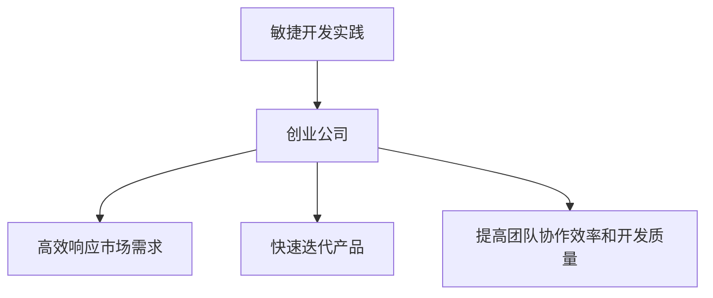

                 

# 文章标题：创业公司的敏捷开发实践

> 关键词：敏捷开发、创业公司、迭代、用户故事、风险管理、实践案例

> 摘要：本文将探讨敏捷开发在创业公司中的应用和实践，通过分析敏捷开发的核心概念、算法原理、数学模型以及实战案例，为创业公司提供高效应对市场变化的开发策略。

## 引言

在当今快速变化的市场环境中，创业公司面临着诸多挑战，如资源有限、市场需求多变、竞争激烈等。为了在这些挑战中脱颖而出，创业公司需要采用高效、灵活的开发方法来应对市场需求，快速迭代产品。敏捷开发作为一种以人为核心、迭代、增量为特点的软件开发方法论，逐渐成为创业公司的首选。本文将围绕敏捷开发在创业公司的应用，分析其核心概念、算法原理、数学模型和实践案例，为创业公司提供可行的开发策略。

## 第一部分：核心概念与联系

### 核心概念

#### 敏捷开发实践

敏捷开发（Agile Development）是一种软件开发方法论，起源于20世纪90年代。它强调快速响应变化、持续交付高质量软件，并通过灵活的团队协作和客户互动来实现客户价值最大化。敏捷开发的核心价值包括：

1. **快速响应变化**：在快速变化的市场环境中，敏捷开发能够快速适应需求变化，确保软件产品始终与市场需求保持一致。
2. **提高团队协作效率**：敏捷开发强调团队协作和沟通，通过站立会议、迭代回顾等方式提高团队效率和凝聚力。
3. **持续交付有价值的软件**：敏捷开发通过持续交付有价值的软件功能，确保客户能够尽早使用到软件产品，并为企业创造商业价值。

#### 创业公司

创业公司（Startup Company）通常是指初创企业，它们通常围绕一个创新性产品或服务建立，旨在快速成长并创造商业价值。创业公司的特点包括：

1. **资源有限**：创业公司在初创阶段通常资金有限，需要高效利用资源，实现最大化的商业价值。
2. **风险高**：创业公司面临着较大的市场风险、技术风险和运营风险，需要灵活应对各种挑战。
3. **变化快**：市场需求变化迅速，创业公司需要快速调整战略和产品，以适应市场环境。
4. **创新性强**：创业公司以创新为驱动，不断探索新的商业模式和技术，以保持竞争优势。

#### 敏捷开发在创业公司的应用

敏捷开发在创业公司的应用主要体现在以下几个方面：

1. **高效响应市场需求**：敏捷开发通过迭代、增量开发的方式，使创业公司能够快速响应市场需求，确保产品始终与市场需求保持一致。
2. **快速迭代产品**：敏捷开发强调持续交付有价值的软件功能，使创业公司能够快速迭代产品，缩短产品上市时间。
3. **提高团队协作效率和开发质量**：敏捷开发通过团队协作、沟通和反馈机制，提高团队协作效率和开发质量，降低开发风险。

### Mermaid 流程图



## 第二部分：核心算法原理讲解

### 敏捷开发的核心算法

#### 迭代开发

迭代开发（Iteration）是将软件开发过程划分为多个短周期（通常为2-4周）的迭代。每个迭代都包含以下环节：

1. **需求分析**：收集、分析和确认用户需求，明确本次迭代的目标和任务。
2. **设计**：根据需求分析结果，设计软件架构和模块，确保软件系统的可扩展性和可维护性。
3. **编码**：按照设计文档进行编码，实现软件功能。
4. **测试**：对编码完成的软件进行功能测试和性能测试，确保软件质量。
5. **部署**：将测试通过的软件部署到生产环境，供用户使用。

#### 增量开发

增量开发（Incremental Development）是在每个迭代中逐步构建和集成软件功能。通过不断添加新功能，逐步完善产品。增量开发的优点包括：

1. **灵活应对需求变化**：在开发过程中，可以根据市场需求的变化，灵活调整开发计划和功能。
2. **快速交付有价值的功能**：在每个迭代中，都可以交付有价值的软件功能，使客户尽早使用到产品。
3. **降低开发风险**：通过逐步构建和集成软件功能，可以及时发现和解决潜在问题，降低项目风险。

#### 用户故事

用户故事（User Story）是一种描述用户需求的方式，通常采用以下格式：“作为[用户角色]，我想要[功能]，以便[业务价值]”。用户故事的优点包括：

1. **贴近用户需求**：用户故事从用户的角度出发，确保开发的功能真正满足用户需求。
2. **灵活应对需求变化**：用户故事可以随时调整和修改，以适应市场需求的变化。
3. **促进团队协作**：用户故事有助于团队成员理解用户需求，提高团队协作效率。

### 伪代码

```python
# 敏捷开发迭代流程伪代码

# 初始化迭代次数
iteration_count = 1

# 迭代循环
while iteration_count <= max_iterations:
    # 需求分析
    analyze_requirements()

    # 设计
    design_solution()

    # 编码
    code_solution()

    # 测试
    test_solution()

    # 部署
    deploy_solution()

    # 增量集成
    integrate_solution()

    # 迭代结束，记录结果
    record_iteration_results()

    # 更新迭代次数
    iteration_count += 1
```

## 第三部分：数学模型和数学公式

### 项目风险管理模型

项目风险管理是敏捷开发中重要的一环。以下是一个简单的项目风险管理模型：

#### 预期价值（Expected Value, EV）

预期价值用于评估项目可能产生的收益。预期价值的计算公式为：

$$
EV = P \times R
$$

其中，P 是概率，R 是收益。

### 数学公式

$$
EV = P \times R
$$

### 举例说明

假设有一个创业公司的产品项目，预计成功的概率为 0.6，成功的收益为 100 万元，失败的概率为 0.4，失败的损失为 50 万元。计算该项目的预期价值：

$$
EV = (0.6 \times 100) + (0.4 \times (-50)) = 60 - 20 = 40 \text{万元}
$$

## 第四部分：项目实战

### 开发环境搭建

以下是一个创业公司敏捷开发项目的实际代码示例，包括开发环境搭建、源代码实现和代码解读。

#### 开发环境搭建

1. 安装Python环境（3.8及以上版本）
2. 安装Django框架（3.2及以上版本）
3. 安装PostgreSQL数据库

#### 源代码实现

```python
# app.py

from django.http import HttpResponse
from django.views import View

class HelloWorldView(View):
    def get(self, request):
        return HttpResponse("Hello, World!")

if __name__ == '__main__':
    import os
    os.environ.setdefault('DJANGO_SETTINGS_MODULE', 'my_project.settings')
    from django.core.asgi import get_asgi_application
    application = get_asgi_application()
```

#### 代码解读

1. **HelloWorldView 类**：该类继承自 `django.views.View`，用于处理 HTTP GET 请求。当接收到 GET 请求时，返回“Hello, World!”的响应。
2. **app.py**：主入口文件。设置 Django 项目设置模块，并从 `django.core.asgi` 导入 `get_asgi_application()` 函数，获取 ASGI 应用程序实例。

#### 代码应用解读与分析

1. **Django 框架**：Django 是一个流行的 Python Web 框架，提供了一系列便捷的功能，如 ORM、路由、模板引擎等，有助于快速开发 Web 应用程序。
2. **HelloWorldView**：通过继承 `django.views.View` 类，实现了简单的 HTTP GET 请求处理功能。这种设计方式有助于扩展和定制视图功能。
3. **ASGI 应用程序实例**：ASGI（Asynchronous Server Gateway Interface）是 Python Web 应用程序的一个异步接口标准。通过获取 ASGI 应用程序实例，可以将 Django 应用程序部署到支持 ASGI 的 Web 服务器上。

#### 实际案例分析和详细讲解剖析

在实际创业公司项目中，敏捷开发可以应用于产品开发的各个阶段。以下是一个实际案例：

1. **需求分析**：创业公司通过市场调研和用户反馈，确定了一个主要功能需求：实现用户注册和登录功能。
2. **设计**：根据需求分析结果，设计了用户注册和登录的模块，包括用户数据表、用户认证表等。
3. **编码**：在第一个迭代中，实现了用户注册和登录功能，并通过测试确保其正常运行。
4. **测试**：对编码完成的用户注册和登录功能进行功能测试和性能测试，发现了一些潜在问题并进行了修复。
5. **部署**：将修复后的用户注册和登录功能部署到生产环境，供用户使用。
6. **增量集成**：在后续迭代中，逐步添加和优化其他功能，如用户个人信息管理、好友关系管理等。
7. **迭代回顾**：在每个迭代结束后，团队进行迭代回顾，总结经验教训，持续改进开发流程。

#### 项目小结

通过以上实际案例，可以看出敏捷开发在创业公司中的应用效果显著。敏捷开发帮助创业公司快速响应市场需求、提高团队协作效率、降低开发风险，从而提高产品的市场竞争力。在实际应用中，创业公司应根据自身情况和需求，灵活调整敏捷开发的实施策略，以实现最佳效果。

## 第五部分：最佳实践 tips、小结、注意事项、拓展阅读等内容

### 最佳实践 tips

1. **需求分析**：在敏捷开发过程中，需求分析至关重要。创业公司应与客户保持密切沟通，确保需求分析的准确性和完整性。
2. **迭代计划**：在制定迭代计划时，应充分考虑团队成员的工作能力和项目风险，合理安排任务和进度。
3. **持续集成与部署**：实施持续集成和部署，有助于提高开发质量和部署效率，降低开发风险。
4. **迭代回顾**：在每个迭代结束后，团队应进行迭代回顾，总结经验教训，持续改进开发流程。

### 小结

敏捷开发在创业公司中的应用具有重要意义。通过敏捷开发，创业公司能够快速响应市场需求、提高团队协作效率、降低开发风险，从而提高产品的市场竞争力。在实际应用中，创业公司应根据自身情况和需求，灵活调整敏捷开发的实施策略，以实现最佳效果。

### 注意事项

1. **明确项目目标和范围**：在敏捷开发过程中，应明确项目目标和范围，确保团队在正确的方向上努力。
2. **保持团队稳定**：敏捷开发强调团队协作和沟通，保持团队稳定有助于提高团队效率和凝聚力。
3. **关注代码质量**：在敏捷开发过程中，应注重代码质量，避免出现代码漏洞和性能问题。

### 拓展阅读

1. 《敏捷开发实践指南》
2. 《Scrum 敏捷开发实践》
3. 《敏捷项目管理》

## 作者信息

作者：AI天才研究院/AI Genius Institute & 禅与计算机程序设计艺术 /Zen And The Art of Computer Programming

