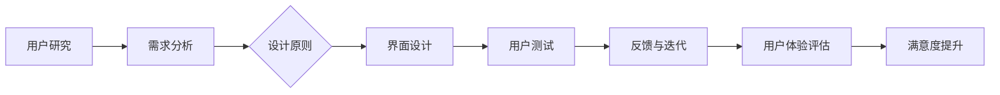

                 


### 《创业公司的用户体验优化与满意度提升策略》

---

**关键词：**用户体验优化、满意度提升、创业公司、策略、实践

**摘要：**
本文旨在探讨创业公司在资源有限的情况下如何通过用户体验优化与满意度提升策略，增强产品竞争力，推动业务发展。文章从用户体验基础理论出发，逐步深入探讨用户体验设计原则、评估方法和数据分析，并结合实际案例，提出优化策略与实践方法，旨在为创业公司提供一套可操作的实施指南。

---

### 目录大纲

# 《创业公司的用户体验优化与满意度提升策略》

## 第一部分：用户体验优化基础

### 第1章：用户体验概述

#### 1.1 用户体验的重要性
#### 1.2 用户研究方法
#### 1.3 用户满意度评估

### 第2章：用户体验设计原则

#### 2.1 设计思维方法
#### 2.2 设计原则与实践
#### 2.3 设计流程

### 第3章：用户界面设计

#### 3.1 用户界面设计要素
#### 3.2 布局与导航设计
#### 3.3 色彩与字体选择

### 第4章：用户体验评估方法

#### 4.1 用户测试
#### 4.2 竞品分析
#### 4.3 用户调研

### 第5章：用户数据分析

#### 5.1 数据分析基础
#### 5.2 用户行为分析
#### 5.3 数据驱动决策

## 第二部分：用户体验优化实践

### 第6章：优化策略与方法

#### 6.1 优化目标设定
#### 6.2 优化方法选择
#### 6.3 优化流程

### 第7章：用户体验案例研究

#### 7.1 案例一：移动应用优化
#### 7.2 案例二：电商网站优化
#### 7.3 案例三：在线教育平台优化

### 第8章：提升用户满意度

#### 8.1 用户情感分析
#### 8.2 满意度提升策略
#### 8.3 满意度持续提升方法

### 第9章：创业公司用户体验策略

#### 9.1 创业公司特点与挑战
#### 9.2 用户体验策略制定
#### 9.3 用户体验管理

### 第10章：用户体验团队建设

#### 10.1 团队组织结构
#### 10.2 职责与技能要求
#### 10.3 团队协作与沟通

## 第三部分：用户体验优化工具与资源

### 第11章：用户体验工具介绍

#### 11.1 用户测试工具
#### 11.2 用户调研工具
#### 11.3 数据分析工具

### 第12章：用户体验资源推荐

#### 12.1 学术研究资源
#### 12.2 设计案例资源
#### 12.3 开放课程资源

### 第13章：用户体验优化实践指南

#### 13.1 实践步骤
#### 13.2 风险与挑战
#### 13.3 成功案例分析

### 第14章：用户体验优化与业务目标

#### 14.1 用户体验与业务目标的关系
#### 14.2 用户价值评估
#### 14.3 用户体验优化的商业价值

### 第15章：用户体验优化与可持续发展

#### 15.1 可持续用户体验理念
#### 15.2 社会责任与伦理
#### 15.3 创业公司用户体验优化之路

附录：用户体验优化实用手册

### 附录A：用户体验优化实用手册

#### 附录A.1：用户体验优化关键术语解释
#### 附录A.2：用户体验优化工具汇总
#### 附录A.3：用户体验优化案例集锦

---

**图1-1：用户体验架构概览（Mermaid流程图）**



**图1-2：用户体验优化流程（伪代码）**

```python
# 用户体验优化流程
def optimize_user_experience():
  # 用户研究
  user_research()

  # 需求分析
  requirement_analysis()

  # 设计原则
  design_principles()

  # 界面设计
  interface_design()

  # 用户测试
  user_testing()

  # 反馈与迭代
  feedback_and Iteration()

  # 用户体验评估
  user_experience_evaluation()

  # 满意度提升
  satisfaction_boost()
```

---

### 第6章：优化策略与方法

#### 6.1 优化目标设定

优化目标设定的第一步是明确优化方向，这通常需要基于用户研究、市场分析以及业务目标来确定。以下是具体的步骤：

1. **用户研究**：通过用户访谈、问卷调查等方法收集用户反馈，了解用户对产品的看法、需求和痛点。
2. **市场分析**：分析竞争对手的产品特性，找出差异化的优化点。
3. **业务目标**：结合公司的长期目标和短期目标，确定用户体验优化的关键指标。
4. **确定关键优化领域**：根据上述分析，确定需要优先优化的领域，如加载速度、界面设计、功能易用性等。

**数学模型：**

$$
优化目标 = f(\text{用户体验指标}, \text{业务指标}, \text{用户反馈})
$$

#### 6.2 优化方法选择

优化方法的选择取决于优化目标和现有资源的限制。以下是几种常用的优化方法：

1. **数据驱动的优化**：通过数据分析，识别用户行为的模式，针对性地进行优化。
   - **数学公式：**
     $$
     \text{优化方案} = \arg\min_{\text{方案}} \sum_{i=1}^{n} (\text{用户行为指标} - \text{期望指标})^2
     $$

2. **用户反馈驱动的优化**：直接基于用户反馈，快速迭代产品。
   - **伪代码：**
     ```python
     while not user_satisfied():
         collect_user_feedback()
         update_product()
     ```

3. **竞品分析驱动的优化**：借鉴竞争对手的成功经验，结合自身产品特点进行优化。
   - **流程图：**
     ```mermaid
     flowchart LR
     A[分析竞品] --> B[识别优点]
     B --> C[适配自身产品]
     C --> D[实施优化]
     ```

#### 6.3 优化流程

用户体验优化的流程可以分为以下几个步骤：

1. **需求分析**：明确优化目标和关键领域，制定优化方案。
2. **设计与开发**：根据优化方案，进行产品设计、开发和迭代。
3. **用户测试**：通过用户测试，验证优化方案的有效性。
4. **反馈与迭代**：根据用户反馈，调整优化方案，进行下一轮迭代。
5. **用户体验评估**：综合用户测试结果，评估优化效果。
6. **满意度提升**：通过持续优化，提升用户满意度。

**伪代码：**

```python
# 用户体验优化流程
def optimize_user_experience():
  while not optimal_experience():
    analyze_requirements()
    design_and_develop()
    user_test()
    collect_feedback()
    update_experience()
  evaluate_experience()
  boost_satisfaction()
```

---

以上是用户体验优化与满意度提升策略的初步探讨。接下来的章节将进一步深入探讨用户体验设计原则、用户界面设计、评估方法、数据分析等关键内容，并分享实际的优化案例，帮助创业公司更好地理解和实施用户体验优化策略。在创业公司的资源有限的情况下，科学合理的用户体验优化策略将直接影响到产品的市场竞争力，进而推动业务的发展。希望本文能为读者提供有价值的参考和启示。

