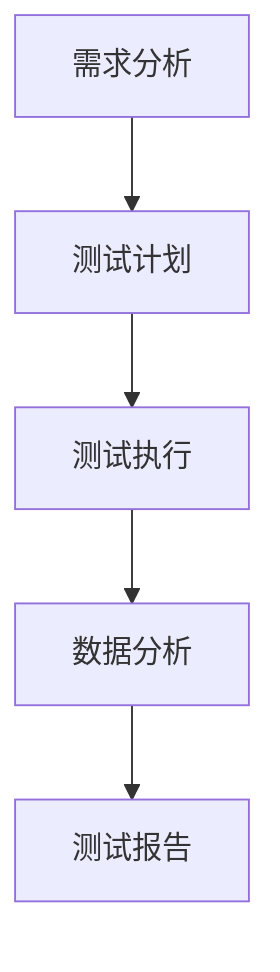

                 

### 文章标题

《创业公司的用户体验测试方法》

### 关键词

用户体验、测试方法、创业公司、敏捷开发、数据驱动决策、国际化、新兴技术

### 摘要

本文旨在探讨创业公司在开发过程中如何进行有效的用户体验测试。通过分析用户体验测试的基础知识，设计原理，评估指标，测试工具与技术，案例分析，策略与执行，以及用户体验测试与敏捷开发、数据驱动决策、国际化、新兴技术的关系，本文为创业公司提供了一套全面的用户体验测试方法论。同时，文章也展望了用户体验测试的未来发展趋势，并提出了如何提升创业公司用户体验测试效果的策略。本文适合创业公司产品经理、用户体验设计师、测试工程师以及相关领域从业者阅读和参考。

### 第一部分：用户体验测试基础

#### 第1章：用户体验与测试概述

**1.1 用户体验的重要性**

用户体验（User Experience，简称UX）是用户在使用产品或服务过程中所感受到的所有主观体验的总和。用户体验不仅包括用户在使用产品时的情感体验、满意度、效率、易用性等方面，还涉及到用户在使用过程中的感知、行为、反应等多个方面。

对于创业公司来说，用户体验尤为重要。首先，用户体验直接影响产品的市场接受度和用户忠诚度。一个优秀的用户体验能够让用户感受到产品的价值和优势，从而提高产品的市场竞争力。其次，用户体验能够帮助创业公司了解用户需求，发现产品问题，及时进行调整和优化，从而提高产品的市场适应性和竞争力。

**1.2 用户测试的概念与目的**

用户测试（User Testing）是指通过一系列方法和技术，模拟用户在实际使用产品或服务过程中的行为和反应，以获取用户对产品或服务的真实感受和反馈。用户测试的主要目的是发现产品或服务中存在的问题，评估产品的可用性、易用性和用户体验，从而为产品的优化提供依据。

对于创业公司来说，用户测试的作用主要体现在以下几个方面：

- **验证产品概念**：在产品开发初期，通过用户测试可以验证产品概念是否满足用户需求，是否具有市场前景。
- **发现设计问题**：在产品设计阶段，通过用户测试可以发现设计中的问题，如界面布局不合理、交互流程不顺畅等，从而及时进行优化。
- **优化产品性能**：在产品开发过程中，通过用户测试可以评估产品的性能指标，如加载速度、响应时间等，从而优化产品性能。
- **收集用户反馈**：通过用户测试可以收集用户的真实反馈，了解用户对产品的满意度和不满意度，为产品的改进提供依据。

**1.3 用户测试的类型和方法**

用户测试可以分为以下几种类型：

- **功能测试**：主要测试产品的功能是否按照预期工作，包括界面功能、交互逻辑、性能等方面。
- **可用性测试**：主要测试产品的易用性和可用性，评估用户在使用产品过程中的操作效率、满意度等。
- **性能测试**：主要测试产品的性能指标，如加载速度、响应时间、稳定性等。
- **用户体验测试**：综合评估产品的用户体验，包括情感体验、满意度、易用性等。

用户测试的方法主要包括以下几种：

- **实地观察法**：通过观察用户在实际使用产品或服务过程中的行为和反应，记录用户的使用过程，分析用户的行为模式和使用习惯。
- **问卷调查法**：通过设计问卷，收集用户对产品或服务的满意度、易用性等方面的评价。
- **用户访谈法**：通过与用户进行一对一的深入交流，了解用户对产品或服务的真实感受和反馈。
- **A/B测试**：通过比较不同设计方案或功能在实际用户中的效果，评估哪种设计方案或功能更受欢迎。

**1.4 用户测试流程与步骤**

用户测试的流程主要包括以下几个步骤：

- **需求分析**：明确用户测试的目标和需求，确定测试的类型和方法。
- **测试计划**：制定详细的测试计划，包括测试的时间、地点、参与者、测试工具等。
- **测试执行**：按照测试计划进行用户测试，记录用户的反馈和行为。
- **数据分析**：对测试结果进行分析，提取有价值的信息，为产品优化提供依据。
- **测试报告**：编写详细的测试报告，包括测试结果、分析结论和改进建议。

**1.4.1 需求分析**

需求分析是用户测试的第一步，也是最重要的一步。在需求分析阶段，需要明确以下问题：

- **测试目标**：明确用户测试的目的，如验证产品概念、发现设计问题、优化产品性能等。
- **测试范围**：确定测试的产品功能、用户群体、场景等。
- **测试方法**：根据测试目标选择合适的测试方法，如实地观察、问卷调查、用户访谈等。
- **测试环境**：确定测试的硬件、软件和网络环境。

**1.4.2 测试计划**

测试计划是用户测试的蓝图，需要详细描述测试的各个方面。测试计划的主要内容如下：

- **测试时间**：确定测试的时间，包括测试的周期、每天的测试时间等。
- **测试地点**：确定测试的地点，如实验室、用户家中等。
- **测试参与者**：确定参与测试的用户数量、用户背景、用户角色等。
- **测试工具**：选择合适的测试工具，如问卷工具、视频录制工具、观察工具等。
- **测试流程**：描述测试的详细流程，包括测试的步骤、用户的任务、测试的数据收集等。

**1.4.3 测试执行**

测试执行是用户测试的核心环节，需要按照测试计划进行。在测试执行过程中，需要注意以下几点：

- **测试环境**：确保测试环境的稳定性和一致性，避免因为环境问题影响测试结果。
- **用户引导**：向用户解释测试的目的和流程，确保用户理解测试任务。
- **观察记录**：记录用户的反馈和行为，包括用户的选择、点击、操作顺序等。
- **问题记录**：记录测试中遇到的问题，包括技术问题、用户问题等。

**1.4.4 数据分析**

数据分析是用户测试的关键步骤，需要对测试结果进行深入分析。数据分析的主要内容如下：

- **定量分析**：对测试数据进行统计和分析，提取有价值的信息，如用户满意度、操作效率等。
- **定性分析**：对用户的反馈和观察记录进行定性分析，了解用户的真实感受和需求。
- **比较分析**：比较不同测试条件下的测试结果，分析用户行为的差异。

**1.4.5 测试报告**

测试报告是用户测试的总结，需要详细描述测试的结果和分析结论。测试报告的主要内容如下：

- **测试结果**：总结测试的结果，包括测试的数据、用户的反馈等。
- **分析结论**：对测试结果进行分析，提取有价值的信息，如用户需求、设计问题等。
- **改进建议**：根据分析结论提出改进建议，为产品的优化提供依据。

通过以上流程，创业公司可以有效地进行用户体验测试，提高产品的市场竞争力。

#### 第2章：用户体验设计原理

**2.1 用户体验设计的核心概念**

用户体验设计（User Experience Design，简称UXD）是指通过设计方法和技术，创造和优化产品或服务的用户体验。用户体验设计的核心目标是满足用户需求，提升用户满意度，从而提高产品或服务的市场竞争力。

用户体验设计的核心概念包括以下几个方面：

- **用户中心设计**：以用户为中心，将用户的需求和体验放在首位，确保产品设计和功能满足用户的实际需求。
- **可用性设计**：确保产品易于使用，用户能够快速上手，降低学习成本。
- **可访问性设计**：确保产品对所有用户都友好，包括残障人士等特殊用户群体。
- **情感设计**：通过设计元素和交互方式，创造积极的用户情感体验，增强用户的品牌认同感。

**2.2 用户体验设计的原则与技巧**

用户体验设计的原则包括以下几个方面：

- **一致性**：确保产品在不同设备和平台上的用户体验一致，避免用户在切换设备时产生困惑。
- **简洁性**：简化用户操作流程，减少不必要的步骤和功能，提高用户操作效率。
- **直观性**：设计界面和交互方式要直观易懂，用户能够快速理解和使用。
- **反馈性**：及时给予用户反馈，让用户知道他们的操作是否成功，提高用户的自信心。

用户体验设计的技巧包括以下几个方面：

- **原型设计**：通过创建原型，快速验证设计思路，收集用户反馈，进行迭代优化。
- **用户调研**：通过用户调研，了解用户需求和行为，为设计提供依据。
- **用户测试**：通过用户测试，发现设计问题，优化用户体验。
- **交互设计**：设计合理的交互流程，确保用户能够顺畅地完成操作。

**2.3 用户体验设计的流程与方法**

用户体验设计的流程主要包括以下几个阶段：

- **需求分析**：明确产品目标，了解用户需求，确定设计方向。
- **概念设计**：制定设计方案，包括界面布局、交互流程等。
- **原型设计**：创建原型，验证设计方案，收集用户反馈。
- **用户测试**：对原型进行测试，评估用户体验，优化设计。
- **设计交付**：将最终设计方案交付给开发团队，确保设计的落地。

用户体验设计的方法主要包括以下几个方面：

- **用户画像**：通过用户画像，了解目标用户群体的特征和需求。
- **用户体验地图**：通过用户体验地图，梳理用户在使用产品过程中的体验流程。
- **用户故事**：通过用户故事，描述用户在使用产品过程中的需求和场景。
- **设计思维**：运用设计思维，从用户角度出发，创造创新的解决方案。

**2.4 用户体验设计工具与应用**

用户体验设计工具主要包括以下几个方面：

- **原型设计工具**：如Axure、Sketch、Figma等，用于创建原型和设计界面。
- **用户调研工具**：如问卷星、千咖等，用于收集用户需求和反馈。
- **用户测试工具**：如Lookback、UserTesting等，用于进行用户测试。
- **数据分析工具**：如Google Analytics、Tableau等，用于分析用户行为和反馈。

用户体验设计工具的应用场景包括：

- **需求分析**：通过原型设计工具，快速创建原型，验证设计思路。
- **概念设计**：通过用户画像和用户体验地图，确定设计方向和目标。
- **原型设计**：通过原型设计工具，创建高保真原型，进行用户测试。
- **用户测试**：通过用户测试工具，进行用户测试，评估用户体验。
- **数据分析**：通过数据分析工具，分析用户行为和反馈，优化设计。

通过以上流程和方法，创业公司可以有效地进行用户体验设计，提升产品的市场竞争力。

#### 第3章：用户体验评估指标

**3.1 用户体验评估指标体系**

用户体验评估指标是衡量产品或服务用户体验质量的重要工具。一个完整的用户体验评估指标体系应包括定量评估指标和定性评估指标，两者相结合可以全面、深入地了解用户的实际体验。

**定量评估指标**主要包括以下几个方面：

- **用户满意度（User Satisfaction）**：用户对产品或服务满意度的主观评价，通常通过问卷调查、评分等方式获取。
- **易用性（Usability）**：产品或服务的易用性，包括学习成本、效率、错误率等。
- **性能（Performance）**：产品或服务的性能，如响应时间、加载速度等。
- **可用性（Accessibility）**：产品或服务对残障人士和其他特殊用户群体的友好程度。

**定性评估指标**主要包括以下几个方面：

- **用户参与度（User Engagement）**：用户在产品或服务中的活跃度和参与度，通常通过用户行为数据、用户反馈等衡量。
- **情感体验（Affective Experience）**：用户在使用产品或服务过程中所感受到的情感体验，包括愉悦感、兴奋感、沮丧感等。
- **用户忠诚度（User Loyalty）**：用户对产品或服务的长期忠诚度和依赖度，通常通过用户留存率、推荐率等衡量。

**3.2 量化评估指标**

量化评估指标是通过数值来描述用户体验的质量。以下是一些常见的量化评估指标：

- **用户满意度**：通常使用满意度评分（如1-10分）来衡量，分数越高，用户满意度越高。
- **易用性**：包括以下指标：
  - **学习时间**：用户从完全不了解产品到能够独立操作的时间。
  - **错误率**：用户在操作过程中发生的错误次数。
  - **完成率**：用户完成某个任务或操作的成功率。
- **性能**：包括以下指标：
  - **响应时间**：用户操作后系统给予反馈的时间。
  - **加载时间**：页面或应用从开始加载到完全加载完成的时间。
- **可用性**：包括以下指标：
  - **易访问性**：产品或服务对残障人士和其他特殊用户群体的友好程度。
  - **兼容性**：产品或服务在不同设备和平台上的兼容性。

**3.3 定性评估指标**

定性评估指标是通过描述性语言来描述用户体验的质量。以下是一些常见的定性评估指标：

- **用户参与度**：用户在产品或服务中的活跃度和参与度，通常通过以下方式衡量：
  - **使用频率**：用户在一段时间内使用产品的频率。
  - **使用时长**：用户每次使用产品的时间长度。
  - **活跃用户数**：一段时间内活跃使用产品的用户数量。
- **情感体验**：用户在使用产品或服务过程中所感受到的情感体验，包括：
  - **愉悦感**：用户在使用产品或服务时感到愉悦、满足。
  - **兴奋感**：用户在使用产品或服务时感到兴奋、感兴趣。
  - **沮丧感**：用户在使用产品或服务时感到沮丧、失望。
- **用户忠诚度**：用户对产品或服务的长期忠诚度和依赖度，通常通过以下方式衡量：
  - **留存率**：一段时间内仍然使用产品的用户比例。
  - **推荐率**：用户向他人推荐产品的比例。

**3.4 指标收集与分析方法**

收集用户体验评估指标的方法主要包括以下几种：

- **问卷调查**：通过设计问卷，收集用户对产品或服务的满意度、易用性等方面的评价。
- **用户访谈**：通过与用户进行一对一的深入交流，了解用户对产品或服务的真实感受和反馈。
- **用户行为数据**：通过分析用户在使用产品或服务过程中的行为数据，了解用户的参与度、使用频率等。
- **A/B测试**：通过比较不同设计方案或功能在实际用户中的效果，评估哪种设计方案或功能更受欢迎。

分析方法主要包括：

- **定量分析**：对收集到的数据进行统计和分析，提取有价值的信息，如用户满意度评分、操作效率等。
- **定性分析**：对用户的反馈和观察记录进行定性分析，了解用户的真实感受和需求。
- **比较分析**：比较不同测试条件下的测试结果，分析用户行为的差异。

通过以上方法，创业公司可以全面、深入地了解用户体验，为产品的优化提供有力支持。

#### 第4章：用户体验测试工具与技术

**4.1 常用用户体验测试工具介绍**

用户体验测试工具有助于创业公司更高效地收集和分析用户反馈，优化产品设计。以下是一些常用的用户体验测试工具：

- **UserTesting**：一款在线用户测试平台，支持实时视频录制和用户反馈收集，适用于快速获取真实用户的反馈。
- **Lookback**：提供屏幕录制和用户反馈功能，适合进行移动应用和网页的用户测试。
- **Spectacle**：适用于Mac的用户测试工具，支持屏幕录制、用户行为跟踪和反馈收集。
- **Optimizely**：A/B测试和功能旗杆工具，用于评估不同设计或功能的用户效果。
- **Hotjar**：提供用户行为分析和反馈功能，包括鼠标轨迹、点击热图和用户反馈收集。

**4.2 网站和移动应用测试技术**

网站和移动应用的测试技术主要包括以下几个方面：

- **功能测试**：验证网站或移动应用的功能是否按照预期工作，包括登录、搜索、购物车等。
- **可用性测试**：评估网站或移动应用的易用性，包括用户操作流程、界面布局等。
- **性能测试**：评估网站或移动应用的速度、响应时间和稳定性。
- **兼容性测试**：确保网站或移动应用在不同设备和浏览器上的兼容性。

具体测试技术包括：

- **用户行为跟踪**：通过跟踪用户在网站或移动应用上的行为，了解用户的使用习惯和偏好。
- **A/B测试**：通过比较不同设计或功能的用户效果，选择最优方案。
- **热点图分析**：通过分析用户在界面上的点击和滚动行为，优化界面布局和用户流程。
- **错误捕捉**：通过捕捉用户在操作过程中遇到的错误，优化用户交互体验。

**4.3 虚拟现实和增强现实测试方法**

虚拟现实（VR）和增强现实（AR）的测试方法与传统用户体验测试有所不同，需要考虑沉浸感、交互性等方面。以下是一些虚拟现实和增强现实测试方法：

- **沉浸感评估**：评估用户在VR或AR环境中的沉浸感，包括画面质量、声音效果、空间感等。
- **交互性测试**：评估用户在VR或AR环境中的交互体验，包括手柄操作、手势识别、语音控制等。
- **用户体验地图**：通过绘制用户体验地图，了解用户在VR或AR环境中的情感变化和行为路径。
- **VR/AR测试平台**：使用专门的VR/AR测试平台，模拟真实环境，进行用户测试。

**4.4 用户体验自动化测试**

用户体验自动化测试通过使用工具和脚本，自动化执行测试任务，提高测试效率和覆盖率。以下是一些用户体验自动化测试技术：

- **Selenium**：一款开源的Web自动化测试工具，支持多种编程语言，适用于自动化功能测试和可用性测试。
- **Appium**：一款开源的移动应用自动化测试工具，支持多种平台和编程语言，适用于自动化功能测试和性能测试。
- **Cypress**：一款现代的Web自动化测试框架，提供简明易懂的API和强大的调试功能。
- **Jest**：一款JavaScript测试框架，适用于前端自动化测试。

用户体验自动化测试的优势包括：

- **提高测试效率**：自动化测试可以节省时间和人力成本，提高测试速度。
- **提高测试覆盖率**：自动化测试可以覆盖更多的测试场景和用例，提高测试覆盖率。
- **持续集成**：自动化测试可以与持续集成工具结合，实现自动化测试流程，提高开发效率。

通过以上工具和技术，创业公司可以更全面、深入地进行用户体验测试，优化产品设计，提升用户满意度。

#### 第5章：用户体验测试案例分析

**5.1 创业公司用户体验测试案例一**

**5.1.1 案例背景**

某创业公司开发了一款智能家居控制应用，旨在通过手机应用控制家庭中的智能设备，如智能灯泡、智能插座等。在产品开发初期，公司非常重视用户体验，希望通过用户体验测试发现设计中的问题，优化产品设计。

**5.1.2 测试目标与方案**

测试目标：
1. 验证用户对智能家居控制应用的基本功能是否满意。
2. 发现用户在使用过程中遇到的问题和困惑。
3. 收集用户对界面设计和交互方式的反馈。

测试方案：
1. 选择5名目标用户进行实地观察测试，用户背景包括年轻家庭用户、中老年用户、技术爱好者等。
2. 设计测试任务，包括用户登录、添加设备、控制设备等基本功能。
3. 使用屏幕录制工具记录用户的使用过程，并收集用户的口头反馈。

**5.1.3 测试结果与改进措施**

测试结果：
1. 用户对智能家居控制应用的基本功能表示满意，尤其是对设备添加和控制功能的体验。
2. 中老年用户在添加设备和设置过程中遇到一些困惑，如设备识别失败、操作步骤复杂等。
3. 技术爱好者对界面设计和交互方式提出了一些改进建议，如增加设备分类、改进提示信息等。

改进措施：
1. 针对中老年用户的问题，优化设备添加流程，增加设备识别提示和引导。
2. 改进界面设计，增加设备分类，优化提示信息和操作流程。
3. 增加用户测试环节，定期收集用户反馈，持续优化产品。

**5.2 创业公司用户体验测试案例二**

**5.2.1 案例背景**

另一家创业公司开发了一款健身应用，旨在通过手机应用帮助用户记录健身数据、制定健身计划和进行健身指导。在产品上线前，公司希望通过用户体验测试评估产品的整体可用性和用户体验。

**5.2.2 测试目标与方案**

测试目标：
1. 评估用户对健身应用的整体可用性和满意度。
2. 发现用户在使用过程中遇到的问题和困惑。
3. 收集用户对界面设计、交互方式、功能需求的反馈。

测试方案：
1. 选择10名目标用户进行A/B测试，分别测试不同版本的应用。
2. 设计测试任务，包括注册、创建健身计划、记录健身数据、获取健身指导等。
3. 使用用户访谈和问卷调查收集用户反馈，并使用屏幕录制工具记录用户的使用过程。

**5.2.3 测试结果与改进措施**

测试结果：
1. 用户对健身应用的整体可用性和满意度较高，特别是对健身指导和数据记录功能的评价。
2. 一部分用户在创建健身计划和记录健身数据时遇到一些困惑，如界面设计不清晰、操作步骤复杂等。
3. 用户对界面设计和交互方式提出了一些改进建议，如增加导航栏、改进提示信息等。

改进措施：
1. 优化界面设计，增加导航栏，简化操作步骤，提高用户操作效率。
2. 改进提示信息和交互方式，提高用户的操作体验。
3. 定期收集用户反馈，持续优化产品功能和用户体验。

通过以上两个案例分析，创业公司可以了解到用户体验测试在产品开发过程中的重要作用，以及如何通过用户体验测试发现和解决问题，提升产品的市场竞争力。

#### 第6章：创业公司用户体验测试策略与执行

**6.1 创业公司用户体验测试策略**

用户体验测试策略是创业公司在产品开发过程中制定的一系列计划和行动，以确保产品满足用户需求，提升用户体验。以下是一些关键策略：

**1. 用户需求优先**：在用户体验测试中，始终将用户需求放在首位，确保测试过程围绕用户的核心需求展开。

**2. 多层次测试**：创业公司应根据产品的不同阶段和需求，进行多层次的用户体验测试，包括需求验证、设计验证、功能验证等。

**3. 定期反馈**：建立定期反馈机制，通过用户调研、用户访谈、用户行为分析等方式，持续收集用户反馈，为产品优化提供依据。

**4. 数据驱动决策**：通过数据分析，评估用户体验测试结果，为产品优化提供科学依据。

**5. 敏捷迭代**：采用敏捷开发方法，快速迭代产品，及时根据用户反馈进行调整和优化。

**6.2 用户测试团队组建与管理**

用户测试团队的组建与管理对于用户体验测试的顺利进行至关重要。以下是一些建议：

**1. 团队成员构成**：用户体验测试团队应包括产品经理、用户体验设计师、测试工程师、数据分析师等角色，确保从不同角度全面评估用户体验。

**2. 职责分配**：明确团队成员的职责，如产品经理负责需求分析和测试计划，用户体验设计师负责界面设计和交互设计，测试工程师负责测试执行和问题跟踪，数据分析师负责数据分析和报告编写。

**3. 能力提升**：定期组织培训和学习，提升团队成员的专业技能和用户体验测试能力。

**4. 沟通协作**：建立有效的沟通协作机制，确保团队成员之间的信息共享和工作协同。

**6.3 用户测试资源规划与预算**

用户测试资源的合理规划和预算对于用户体验测试的顺利进行至关重要。以下是一些建议：

**1. 资源规划**：根据产品阶段和测试需求，合理规划用户测试资源，包括测试工具、测试场地、测试人员等。

**2. 预算分配**：制定详细的用户测试预算，包括测试工具购买、用户招募、测试执行等费用。

**3. 风险管理**：评估用户测试过程中的潜在风险，如测试资源不足、用户反馈不全面等，并制定相应的应对措施。

**6.4 用户测试风险管理**

用户测试过程中可能会遇到各种风险，以下是一些常见的风险管理策略：

**1. 预防措施**：在测试计划阶段，制定详细的测试方案和风险管理计划，预防潜在风险的发生。

**2. 及时发现**：在测试执行过程中，密切关注用户反馈和测试结果，及时发现潜在问题。

**3. 及时响应**：对发现的问题进行及时分析和处理，制定解决方案，并跟踪问题解决进度。

**4. 学习改进**：通过总结用户测试过程中的经验和教训，优化测试策略和流程，提高用户体验测试效果。

通过以上策略与管理，创业公司可以有效地进行用户体验测试，提升产品的市场竞争力。

#### 第7章：用户体验测试持续改进

**7.1 用户反馈收集与处理**

用户体验测试的核心在于收集用户的真实反馈，并将这些反馈转化为产品的改进措施。以下是一些有效的用户反馈收集与处理方法：

**1. 用户反馈收集方法**：

- **问卷调查**：通过设计专业的问卷，收集用户对产品的满意度、易用性等方面的评价。
- **用户访谈**：通过与用户进行一对一的深度交流，了解用户的真实需求和痛点。
- **用户行为数据分析**：通过分析用户在产品中的行为数据，如点击路径、使用时长等，发现潜在问题。
- **焦点小组讨论**：邀请一组用户，就产品体验进行讨论，收集多方面的反馈。

**2. 用户反馈处理流程**：

- **反馈分类**：对收集到的用户反馈进行分类，如功能问题、界面问题、性能问题等。
- **问题优先级排序**：根据反馈的严重程度和影响范围，对问题进行优先级排序，确保优先处理重要问题。
- **问题分析**：对每个问题进行深入分析，找出问题的根本原因。
- **解决方案制定**：根据问题分析和用户需求，制定相应的解决方案。
- **方案验证**：在实施解决方案前，进行验证，确保方案的有效性和可行性。
- **实施与跟踪**：实施解决方案，并跟踪实施效果，确保问题得到解决。

**7.2 测试结果分析与总结**

测试结果分析是用户体验测试的关键环节，通过对测试数据的深入分析，可以找出产品设计中的问题和不足，为产品的优化提供依据。以下是一些测试结果分析与总结的方法：

**1. 定量分析**：

- **数据统计**：对测试数据（如用户满意度评分、错误率等）进行统计，提取有价值的信息。
- **趋势分析**：分析数据变化趋势，发现用户行为的变化规律。
- **对比分析**：将不同测试条件下的数据对比，分析差异原因。

**2. 定性分析**：

- **用户反馈整理**：整理用户访谈和问卷调查中的文字反馈，提取关键信息。
- **情感分析**：通过情感分析技术，分析用户反馈中的情感倾向，了解用户的真实感受。
- **案例研究**：对特定问题进行深入分析，找出问题背后的原因和解决方案。

**7.3 测试流程优化与迭代**

用户体验测试的持续改进不仅依赖于测试结果的分析，还需要不断优化测试流程，提高测试效率和效果。以下是一些测试流程优化与迭代的方法：

**1. 流程梳理**：对现有的测试流程进行梳理，识别流程中的瓶颈和不足。
- **流程优化**：根据测试需求和团队能力，优化测试流程，提高测试效率。
- **自动化测试**：引入自动化测试工具，减少手动测试工作量，提高测试覆盖率。
- **持续集成**：将用户体验测试集成到持续集成流程中，实现自动化测试和快速迭代。

**2. 闭环管理**：建立测试结果的闭环管理机制，确保测试结果能够及时转化为产品的改进措施。
- **反馈闭环**：将测试结果和改进措施反馈给相关团队，确保问题得到及时解决。
- **迭代优化**：根据测试结果和用户反馈，持续优化产品设计和功能，提高用户体验。

**3. 团队协作**：加强团队协作，确保用户体验测试团队能够高效地执行测试任务，及时反馈问题，优化产品。

**7.4 创业公司用户体验测试文化建设**

用户体验测试不仅是技术工作，更是企业文化的一部分。以下是一些创业公司用户体验测试文化建设的建议：

**1. 文化宣传**：通过内部培训和宣传，提高员工对用户体验测试的认识和重视。
- **文化塑造**：将用户体验测试纳入公司的价值观和战略目标，形成全员参与的用户体验文化。
- **激励机制**：建立激励机制，鼓励员工积极参与用户体验测试，提出改进建议。

**2. 用户至上**：始终将用户需求放在首位，将用户体验作为公司发展的核心驱动力。
- **用户反馈**：建立用户反馈机制，鼓励用户参与产品改进，提高用户满意度。

**3. 持续学习**：鼓励团队成员持续学习，掌握最新的用户体验测试方法和工具，提升团队整体能力。

通过以上持续改进措施，创业公司可以不断提升用户体验测试效果，优化产品设计，提高产品的市场竞争力。

### 第二部分：用户体验测试高级专题

#### 第8章：用户体验测试与敏捷开发

**8.1 敏捷开发与用户体验测试的关系**

敏捷开发（Agile Development）是一种以人为核心、迭代、灵活响应变化的软件开发方法。用户体验测试（User Testing）是敏捷开发过程中不可或缺的一部分，二者之间的关系主要体现在以下几个方面：

- **用户体验驱动开发**：敏捷开发强调用户需求的变化和适应性，用户体验测试可以帮助开发团队更好地理解用户需求，确保产品的每一个迭代都能满足用户的实际需求。
- **快速反馈循环**：敏捷开发通过短期迭代（Sprint）进行快速开发，用户体验测试可以在每个迭代结束时提供即时反馈，帮助团队发现和解决问题，确保产品在发布前达到预期质量。
- **持续改进**：用户体验测试与敏捷开发相辅相成，通过持续测试和反馈，团队可以不断优化产品设计，提高用户体验，实现持续改进。

**8.2 敏捷开发流程中的用户体验测试**

在敏捷开发流程中，用户体验测试贯穿整个开发周期，以下是一些关键环节：

- **规划阶段**：在规划阶段，团队应明确用户体验测试的目标和计划，包括测试类型、测试工具和测试人员等。
- **迭代阶段**：在每个迭代周期中，用户体验测试应与开发任务同步进行，确保测试结果能够及时反馈到开发过程中。
  - **需求验证**：在开发新功能或改进现有功能时，通过用户体验测试验证需求是否符合用户期望。
  - **可用性测试**：评估产品的易用性和用户体验，确保用户能够顺畅地完成操作。
  - **性能测试**：评估产品的性能指标，如响应时间、稳定性等，确保产品在高负载情况下仍能正常运行。
- **发布阶段**：在产品发布前，进行全面的用户体验测试，确保产品达到预期质量，减少用户投诉和退订率。

**8.3 敏捷开发中的用户测试策略与技巧**

在敏捷开发中，用户体验测试的策略与技巧包括以下几个方面：

- **用户故事地图**：使用用户故事地图，将用户体验测试融入用户故事中，确保每个迭代都能覆盖关键测试场景。
- **快速测试**：采用快速测试方法，如5分钟测试，快速验证用户故事的有效性。
- **用户反馈**：鼓励用户参与测试，通过用户反馈，了解用户的真实感受和需求，及时调整产品设计。
- **自动化测试**：引入自动化测试工具，提高测试效率，确保测试覆盖全面。
- **持续反馈**：建立持续反馈机制，确保测试结果能够及时传递给开发团队，推动产品优化。

**8.4 敏捷开发用户体验测试案例**

以下是一个敏捷开发用户体验测试的案例：

**案例背景**：某创业公司开发了一款在线教育平台，旨在为用户提供高质量的教育资源和学习工具。在产品开发过程中，团队采用了敏捷开发方法，并进行了多个迭代。

**测试目标**：验证用户对在线教育平台的核心功能（如课程浏览、学习进度跟踪、互动讨论区等）的满意度，发现设计问题，优化用户体验。

**测试策略**：

1. **用户故事地图**：将用户体验测试融入用户故事中，确保每个迭代都能覆盖关键功能。
2. **快速测试**：在每个迭代周期结束时，进行5分钟快速测试，验证用户故事的有效性。
3. **用户反馈**：邀请真实用户参与测试，通过用户反馈，了解用户的真实感受和需求。
4. **自动化测试**：使用自动化测试工具，提高测试效率，确保测试覆盖全面。

**测试结果**：

1. 用户对课程浏览和学习进度跟踪功能表示满意，但对互动讨论区的体验提出了改进建议。
2. 发现部分用户在操作过程中遇到界面设计问题，如按钮不明显、操作路径复杂等。
3. 通过用户反馈和测试结果，团队进行了界面优化和功能改进，提高了用户体验。

**案例总结**：通过敏捷开发用户体验测试，团队能够及时发现和解决问题，优化产品设计，提高了产品的市场竞争力。

通过以上案例，创业公司可以了解到用户体验测试在敏捷开发中的重要性，以及如何有效地进行用户体验测试，优化产品设计。

#### 第9章：用户体验测试与数据驱动决策

**9.1 数据驱动决策的概念与应用**

数据驱动决策（Data-Driven Decision-Making，简称DDDM）是一种基于数据分析和数据验证来制定决策的方法。它强调在决策过程中，数据应该起到关键性的作用，而不是仅仅依赖直觉或经验。数据驱动决策的核心在于通过收集、分析和利用数据，为决策提供科学依据，从而提高决策的准确性和有效性。

在用户体验测试中，数据驱动决策的应用主要体现在以下几个方面：

- **用户行为分析**：通过分析用户在产品中的行为数据（如点击路径、使用时长等），了解用户的实际使用习惯和偏好，为产品设计提供依据。
- **反馈数据分析**：收集用户对产品的反馈（如满意度评分、评论等），通过数据分析，发现用户的痛点和需求，指导产品改进。
- **测试结果分析**：对用户体验测试的结果进行深入分析，提取有价值的信息，为产品的优化提供科学依据。

**9.2 用户测试数据收集与分析方法**

为了实现数据驱动决策，创业公司需要建立一套有效的用户测试数据收集与分析方法。以下是一些关键步骤：

**1. 数据收集方法**：

- **问卷调查**：通过设计专业的问卷，收集用户对产品的满意度、易用性等方面的评价。
- **用户访谈**：通过与用户进行一对一的深入交流，了解用户的真实需求和痛点。
- **用户行为数据收集**：通过工具（如热图分析、屏幕录制等）收集用户在产品中的行为数据。
- **A/B测试**：通过比较不同设计方案或功能在实际用户中的效果，收集测试数据。

**2. 数据分析工具**：

- **统计分析工具**：如SPSS、Excel等，用于对测试数据进行统计分析，提取有价值的信息。
- **数据可视化工具**：如Tableau、Power BI等，用于将数据分析结果以图表、报表等形式展示，便于理解和分析。
- **用户行为分析工具**：如Google Analytics、Mixpanel等，用于分析用户在产品中的行为路径、使用时长等。

**3. 数据分析方法**：

- **定量分析**：对收集到的数据进行统计和分析，提取关键指标（如用户满意度、错误率等），评估用户体验质量。
- **定性分析**：对用户的反馈和观察记录进行定性分析，了解用户的真实感受和需求。
- **对比分析**：比较不同测试条件下的测试结果，分析差异原因，为产品优化提供依据。

**9.3 数据驱动的用户体验测试流程**

数据驱动的用户体验测试流程包括以下几个步骤：

**1. 需求分析**：明确用户体验测试的目标和需求，确定测试的类型和方法。

**2. 数据收集**：通过问卷调查、用户访谈、用户行为数据收集等方式，收集用户测试数据。

**3. 数据分析**：对收集到的数据进行定量和定性分析，提取有价值的信息，为产品优化提供依据。

**4. 决策制定**：根据数据分析结果，制定产品改进策略和方案。

**5. 测试实施**：按照测试计划进行用户体验测试，收集新的数据，进行验证。

**6. 结果评估**：评估测试结果，分析改进方案的有效性，持续优化产品设计。

**9.4 数据驱动的用户体验测试案例**

以下是一个数据驱动的用户体验测试案例：

**案例背景**：某创业公司开发了一款在线购物平台，旨在为用户提供便捷的购物体验。在产品上线前，公司希望通过用户体验测试，优化产品设计，提高用户满意度。

**测试目标**：验证用户对在线购物平台的核心功能（如商品浏览、购物车、支付流程等）的满意度，发现设计问题，优化用户体验。

**测试策略**：

1. **用户故事地图**：将用户体验测试融入用户故事中，确保每个迭代都能覆盖关键功能。
2. **数据收集**：通过问卷调查、用户访谈和用户行为数据收集，收集用户测试数据。
3. **数据分析**：对收集到的数据进行定量和定性分析，提取关键指标，评估用户体验质量。
4. **A/B测试**：比较不同设计方案或功能在实际用户中的效果，收集测试数据。

**测试结果**：

1. 用户对商品浏览和购物车功能表示满意，但对支付流程提出了一些改进建议。
2. 分析发现，部分用户在支付过程中遇到界面设计问题，如支付选项不清晰、操作路径复杂等。

**决策与改进**：

1. 根据数据分析结果，团队对支付流程进行了优化，简化操作步骤，提高用户支付体验。
2. 通过A/B测试，验证了改进方案的有效性，提高了用户满意度。

**案例总结**：通过数据驱动的用户体验测试，创业公司能够更好地了解用户需求，优化产品设计，提高产品的市场竞争力。

通过以上案例，创业公司可以了解到数据驱动决策在用户体验测试中的应用，以及如何通过数据分析和验证，优化产品设计，提高用户满意度。

#### 第10章：用户体验测试与国际化

**10.1 国际化用户体验测试的重要性**

国际化用户体验测试是确保产品在全球范围内受欢迎和成功的关键步骤。随着全球化的发展，越来越多的创业公司希望将产品推向国际市场。国际化用户体验测试能够帮助这些公司了解不同文化和语言背景下的用户体验，从而优化产品设计，提高用户满意度。

国际化用户体验测试的重要性体现在以下几个方面：

- **文化差异适应**：不同国家和地区的用户在文化、语言、生活习惯等方面存在差异，国际化测试可以帮助公司发现这些问题，并进行相应的调整。
- **本地化优化**：通过国际化测试，公司可以了解本地用户的需求和偏好，从而进行本地化优化，提高产品的适用性和市场竞争力。
- **全球化战略支持**：国际化用户体验测试可以为公司的全球化战略提供数据支持，确保产品在不同市场都能取得成功。

**10.2 多语言与多文化用户体验测试方法**

进行国际化用户体验测试时，需要考虑多语言和多文化因素。以下是一些关键方法和步骤：

**1. 多语言测试**：

- **翻译测试**：确保产品的翻译准确无误，避免因语言问题导致用户理解困难。
- **本地化测试**：验证产品的本地化效果，如日期格式、货币符号、文本长度等。
- **国际化测试工具**：使用支持多语言的测试工具，如多语言用户测试平台，确保测试过程和结果的一致性。

**2. 多文化测试**：

- **文化敏感性测试**：评估产品在文化敏感性方面的表现，如符号、颜色、图像等。
- **文化适应度测试**：验证产品在不同文化背景下的适应度，确保产品能够满足本地用户的需求。
- **多文化用户调研**：通过多文化用户调研，了解不同文化背景下的用户偏好和需求。

**3. 国际化测试流程**：

- **需求分析**：明确国际化测试的目标和需求，确定测试的类型和方法。
- **测试计划**：制定详细的国际化测试计划，包括测试语言、测试工具、测试参与者等。
- **测试执行**：按照测试计划进行国际化测试，记录用户的反馈和行为。
- **数据分析**：对测试结果进行深入分析，提取有价值的信息，为产品的优化提供依据。
- **测试报告**：编写详细的测试报告，包括测试结果、分析结论和改进建议。

**10.3 国际化用户体验测试流程与策略**

国际化用户体验测试流程与策略包括以下几个方面：

**1. 流程设计**：

- **需求分析**：明确国际化测试的目标和需求，确定测试类型和方法。
- **测试计划**：制定详细的国际化测试计划，包括测试语言、测试工具、测试参与者等。
- **测试执行**：按照测试计划进行国际化测试，记录用户的反馈和行为。
- **数据分析**：对测试结果进行深入分析，提取有价值的信息，为产品的优化提供依据。
- **测试报告**：编写详细的测试报告，包括测试结果、分析结论和改进建议。

**2. 策略制定**：

- **文化适应性策略**：根据不同地区的文化差异，制定相应的文化适应性策略，确保产品能够满足本地用户的需求。
- **多语言策略**：确保产品的多语言版本准确无误，避免因语言问题导致用户理解困难。
- **本地化优化策略**：通过国际化测试，了解本地用户的需求和偏好，进行本地化优化，提高产品的适用性和市场竞争力。
- **全球化战略支持**：国际化用户体验测试可以为公司的全球化战略提供数据支持，确保产品在不同市场都能取得成功。

**10.4 国际化用户体验测试案例**

以下是一个国际化用户体验测试的案例：

**案例背景**：某创业公司开发了一款社交媒体应用，计划将其推向国际市场。为了确保产品在不同国家和地区都能取得成功，公司决定进行国际化用户体验测试。

**测试目标**：验证应用在多语言、多文化背景下的用户体验，发现设计问题，优化产品功能。

**测试策略**：

1. **多语言测试**：对应用的翻译进行严格审查，确保翻译准确无误，并测试不同语言版本的本地化效果。
2. **文化适应性测试**：评估应用在不同文化背景下的表现，如符号、颜色、图像等。
3. **多文化用户调研**：通过多文化用户调研，了解不同文化背景下的用户偏好和需求。
4. **A/B测试**：比较不同设计方案或功能在实际用户中的效果，收集测试数据。

**测试结果**：

1. 发现部分用户在操作过程中遇到语言问题，如翻译不准确、界面设计不适应等。
2. 分析发现，部分文化背景下的用户对应用的某些功能（如评论、分享等）有较高的需求。

**改进措施**：

1. 对应用的翻译进行优化，确保翻译准确无误，并针对不同文化背景进行界面设计调整。
2. 增加应用的功能，满足不同文化背景下的用户需求。

**案例总结**：通过国际化用户体验测试，创业公司能够发现并解决多语言、多文化背景下的用户体验问题，优化产品设计，提高产品的国际化竞争力。

通过以上案例，创业公司可以了解到国际化用户体验测试的重要性以及如何进行国际化用户体验测试，优化产品设计，提高产品的国际化竞争力。

#### 第11章：用户体验测试与新兴技术

**11.1 新兴技术在用户体验测试中的应用**

随着科技的发展，新兴技术不断涌现，为用户体验测试带来了新的机遇和挑战。以下是一些新兴技术在用户体验测试中的应用：

**1. 人工智能（AI）**：

- **自动化测试**：利用AI技术，自动化生成测试脚本，提高测试效率。
- **智能分析**：通过AI技术，对用户行为数据进行分析，提取有价值的信息，为产品优化提供依据。
- **个性化测试**：根据用户行为数据，个性化推荐测试场景，提高测试覆盖率。

**2. 虚拟现实（VR）**：

- **沉浸式测试**：通过VR技术，模拟真实的使用场景，评估产品的沉浸感、交互性等用户体验。
- **远程测试**：利用VR技术，实现远程用户测试，降低测试成本，提高测试效率。

**3. 增强现实（AR）**：

- **增强式测试**：通过AR技术，将虚拟元素叠加在真实环境中，进行交互测试，提高测试的真实性和有效性。
- **移动测试**：利用AR技术，实现移动设备的用户测试，方便快捷地进行现场测试。

**4. 机器学习（ML）**：

- **预测分析**：利用机器学习技术，预测用户行为，优化测试策略。
- **异常检测**：通过机器学习，检测用户行为中的异常，发现潜在问题。

**11.2 人工智能在用户体验测试中的应用**

人工智能在用户体验测试中的应用主要体现在以下几个方面：

**1. 自动化测试**：

- **测试脚本生成**：利用AI技术，自动生成测试脚本，提高测试效率，减少手动编写脚本的工作量。
- **测试用例优化**：通过AI技术，优化测试用例，提高测试覆盖率，减少测试遗漏。

**2. 智能分析**：

- **用户行为分析**：通过AI技术，对用户行为数据进行分析，提取有价值的信息，如用户满意度、易用性等。
- **反馈分类**：利用AI技术，对用户反馈进行分类，快速识别关键问题，提高问题处理的效率。

**3. 个性化测试**：

- **测试场景推荐**：根据用户行为数据，个性化推荐测试场景，确保测试覆盖全面。
- **测试资源分配**：利用AI技术，优化测试资源分配，提高测试效率。

**11.3 虚拟现实与增强现实在用户体验测试中的应用**

虚拟现实与增强现实在用户体验测试中的应用主要体现在以下几个方面：

**1. 沉浸式测试**：

- **真实场景模拟**：通过VR技术，模拟真实的使用场景，评估产品的沉浸感、交互性等用户体验。
- **远程测试**：利用VR技术，实现远程用户测试，降低测试成本，提高测试效率。

**2. 增强式测试**：

- **真实环境叠加**：通过AR技术，将虚拟元素叠加在真实环境中，进行交互测试，提高测试的真实性和有效性。
- **移动测试**：利用AR技术，实现移动设备的用户测试，方便快捷地进行现场测试。

**11.4 新兴技术用户体验测试案例**

以下是一个新兴技术用户体验测试的案例：

**案例背景**：某创业公司开发了一款基于虚拟现实（VR）的社交应用，旨在为用户提供沉浸式的社交体验。为了确保产品的用户体验达到预期，公司决定采用新兴技术进行用户体验测试。

**测试目标**：验证应用在VR环境下的用户体验，发现设计问题，优化产品功能。

**测试策略**：

1. **沉浸式测试**：利用VR技术，模拟真实的使用场景，评估产品的沉浸感、交互性等用户体验。
2. **远程测试**：通过远程VR测试平台，降低测试成本，提高测试效率。
3. **智能分析**：利用AI技术，对用户行为数据进行分析，提取有价值的信息，如用户满意度、易用性等。
4. **A/B测试**：比较不同设计方案或功能在实际用户中的效果，收集测试数据。

**测试结果**：

1. 发现部分用户在操作过程中遇到界面设计问题，如按钮位置不合适、交互流程不顺畅等。
2. 分析发现，部分用户对社交应用的某些功能（如视频通话、虚拟礼物等）有较高的需求。

**改进措施**：

1. 对应用的界面设计进行调整，优化按钮位置和交互流程。
2. 增加应用的功能，满足用户需求。

**案例总结**：通过新兴技术的用户体验测试，创业公司能够更好地了解用户的真实体验，优化产品设计，提高产品的市场竞争力。

通过以上案例，创业公司可以了解到新兴技术在用户体验测试中的应用，以及如何利用新兴技术优化用户体验测试，提高产品的市场竞争力。

### 第12章：用户体验测试总结与展望

**12.1 创业公司用户体验测试的总结与反思**

用户体验测试对于创业公司来说具有重要意义。通过总结与反思，创业公司可以更好地理解和应用用户体验测试，优化产品设计，提高市场竞争力。以下是几个关键点：

**1. 用户需求导向**：用户体验测试应始终围绕用户需求展开，确保产品满足用户的实际需求。

**2. 多层次测试**：创业公司应根据产品的不同阶段和需求，进行多层次的用户体验测试，包括需求验证、设计验证、功能验证等。

**3. 数据驱动决策**：通过数据分析和用户反馈，创业公司可以科学地评估用户体验，为产品优化提供依据。

**4. 敏捷迭代**：采用敏捷开发方法，快速迭代产品，及时根据用户反馈进行调整和优化。

**5. 文化适应性**：国际化用户体验测试有助于创业公司了解不同文化背景下的用户需求，优化产品设计，提高产品的国际化竞争力。

**6. 新兴技术应用**：利用人工智能、虚拟现实、增强现实等新兴技术，创业公司可以更全面、深入地进行用户体验测试，提高测试效率和效果。

**12.2 用户体验测试的未来发展趋势**

用户体验测试正随着技术的发展和用户需求的演变而不断进步。以下是一些未来发展趋势：

**1. 智能化**：人工智能技术将进一步提升用户体验测试的自动化程度和数据分析能力，实现智能化的用户体验测试。

**2. 沉浸式体验**：虚拟现实和增强现实技术将使用户体验测试更加真实和沉浸，为用户提供更加丰富的测试场景。

**3. 数据驱动**：随着大数据和云计算技术的发展，用户体验测试将更加依赖于数据分析和数据驱动决策。

**4. 个性化和定制化**：根据用户行为数据和个性化需求，用户体验测试将实现更加精准和个性化的测试。

**5. 国际化和本地化**：随着全球化的发展，用户体验测试将更加注重国际化与本地化，满足不同国家和地区用户的需求。

**6. 持续改进**：用户体验测试将成为产品开发和优化的持续过程，实现持续改进。

**12.3 创业公司如何提升用户体验测试效果**

为了提升用户体验测试效果，创业公司可以采取以下措施：

**1. 强化团队建设**：组建专业的用户体验测试团队，确保团队成员具备相关技能和经验。

**2. 建立完善流程**：制定详细的用户体验测试流程和策略，确保测试的规范性和系统性。

**3. 利用新兴技术**：积极采用人工智能、虚拟现实、增强现实等新兴技术，提升用户体验测试的效率和效果。

**4. 数据驱动**：通过数据分析和用户反馈，不断优化用户体验测试流程和方法。

**5. 用户参与**：鼓励用户参与用户体验测试，收集真实用户的反馈，提高测试的准确性和实用性。

**6. 持续改进**：建立持续改进机制，根据测试结果和用户反馈，不断优化产品设计，提高用户体验。

**12.4 用户体验测试与创业公司发展关系探讨**

用户体验测试不仅是一种产品优化手段，更是创业公司发展的关键因素。以下是用户体验测试与创业公司发展的关系探讨：

**1. 提高市场竞争力**：通过用户体验测试，创业公司可以优化产品设计，提高用户满意度，从而提高市场竞争力。

**2. 降低风险**：用户体验测试有助于发现产品设计中的问题，降低产品发布后可能遇到的风险。

**3. 吸引投资**：优秀的用户体验能够吸引投资者的关注，提高创业公司的融资能力。

**4. 提高品牌价值**：良好的用户体验可以提升创业公司的品牌形象，增强用户忠诚度。

**5. 促进持续发展**：用户体验测试是创业公司持续发展的动力，通过不断优化用户体验，创业公司可以保持市场竞争力。

综上所述，用户体验测试对于创业公司的发展具有重要意义。通过总结与反思、把握未来发展趋势、采取有效措施，创业公司可以不断提升用户体验测试效果，推动公司持续发展。

### 附录

#### 附录A：用户体验测试工具列表

**A.1 常用用户体验测试工具介绍**

- **UserTesting**：在线用户测试平台，支持实时视频录制和用户反馈收集。
- **Lookback**：屏幕录制和用户反馈工具，适用于移动应用和网页测试。
- **Spectacle**：适用于Mac的用户测试工具，支持屏幕录制、用户行为跟踪。
- **Optimizely**：A/B测试和功能旗杆工具，用于评估不同设计或功能的用户效果。
- **Hotjar**：用户行为分析和反馈工具，包括鼠标轨迹、点击热图和用户反馈收集。

**A.2 创业公司选择用户体验测试工具的考虑因素**

- **测试需求**：根据产品特点和测试需求，选择适合的测试工具。
- **成本**：考虑工具的收费模式、价格和预算。
- **易用性**：工具应具有简洁直观的操作界面，方便团队使用。
- **功能**：工具应具备所需的功能，如屏幕录制、用户反馈收集、A/B测试等。
- **兼容性**：工具应支持不同设备和平台，满足国际化测试需求。
- **技术支持**：工具应提供良好的技术支持，确保使用过程中遇到问题时能及时解决。

#### 附录B：用户体验测试资源推荐

**B.1 用户测试相关的书籍与文章推荐**

- **《用户体验要素》**：作者：乔尔·贝克（Joel贝克）
- **《敏捷用户体验设计》**：作者：戴夫·切斯（Dave Chaffey）
- **《用户体验测试实战》**：作者：瑞秋·布鲁尔（Rachel Bruell）
- **《设计思考：创新思维与产品设计的实践》**：作者：唐·诺曼（Don Norman）
- **《用户体验度量：量化用户体验质量的方法》**：作者：杰里·宾厄姆（Jerry Bingaman）

**B.2 用户测试相关的在线课程与社区**

- **Coursera**：提供用户体验设计、数据科学等相关在线课程。
- **edX**：提供用户体验设计、敏捷开发等相关在线课程。
- **UX Booth**：用户体验设计社区，分享设计资源和实践。
- **UI Movement**：用户体验设计社区，关注设计趋势和案例分析。
- **UX Mastery**：用户体验设计在线课程和学习资源。

#### 附录C：用户体验测试流程图

以下是一个简化的用户体验测试流程图：



#### 附录D：用户体验测试伪代码示例

以下是一个简单的用户体验测试数据收集与处理伪代码示例：

```python
# 导入所需的库
import json
import pandas as pd

# 定义测试数据结构
class TestResult:
    def __init__(self,满意度，易用性，性能，用户参与度，情感体验，用户忠诚度):
        self.满意度 = 满意度
        self.易用性 = 易用性
        self.性能 = 性能
        self.用户参与度 = 用户参与度
        self.情感体验 = 情感体验
        self.用户忠诚度 = 用户忠诚度

# 数据收集
def collect_data():
    # 从文件中读取测试结果
    with open('test_results.json', 'r') as f:
        data = json.load(f)

    # 创建测试结果列表
    results = []
    for item in data:
        result = TestResult(item['满意度']，item['易用性']，item['性能']，item['用户参与度']，item['情感体验']，item['用户忠诚度'])
        results.append(result)

    return results

# 数据处理
def process_data(results):
    # 将测试结果转换为DataFrame
    df = pd.DataFrame(results)

    # 进行数据分析
    analysis_results = {
        '平均满意度': df['满意度'].mean(),
        '平均易用性': df['易用性'].mean(),
        '平均性能': df['性能'].mean(),
        '平均用户参与度': df['用户参与度'].mean(),
        '平均情感体验': df['情感体验'].mean(),
        '平均用户忠诚度': df['用户忠诚度'].mean()
    }

    return analysis_results

# 主函数
if __name__ == '__main__':
    # 收集数据
    results = collect_data()

    # 处理数据
    analysis_results = process_data(results)

    # 打印分析结果
    print(analysis_results)
```

#### 附录E：用户体验测试数学模型与公式

以下是一些常用的用户体验测试数学模型和公式：

**E.1 用户体验评估指标计算公式**

- **用户满意度**：用户满意度 = (非常满意 * 非常满意人数 + 非常满意人数 + 比较满意人数 + 一般人数 + 不满意人数 + 非常不满意人数) / 总人数
- **易用性**：易用性 = (非常易用 * 非常易用人数 + 非常易用人数 + 比较易用人数 + 一般人数 + 不易用人数 + 非常不易用人数) / 总人数
- **性能**：性能 = (非常高性能 * 非常高性能人数 + 非常高性能人数 + 比较高性能人数 + 一般人数 + 不高性能人数 + 非常不性能人数) / 总人数
- **用户参与度**：用户参与度 = (非常高参与度 * 非常高参与度人数 + 非常高参与度人数 + 比较高参与度人数 + 一般人数 + 不高参与度人数 + 非常不高参与度人数) / 总人数
- **情感体验**：情感体验 = (非常愉悦 * 非常愉悦人数 + 非常愉悦人数 + 比较愉悦人数 + 一般人数 + 不愉悦人数 + 非常不愉悦人数) / 总人数
- **用户忠诚度**：用户忠诚度 = (非常忠诚 * 非常忠诚人数 + 非常忠诚人数 + 比较忠诚人数 + 一般人数 + 不忠诚人数 + 非常不忠诚人数) / 总人数

**E.2 用户满意度计算公式**

- **用户满意度** = (非常满意 * 非常满意人数 + 非常满意人数 + 比较满意人数 + 一般人数 + 不满意人数 + 非常不满意人数) / 总人数

**E.3 易用性评估指标计算公式**

- **易用性** = (非常易用 * 非常易用人数 + 非常易用人数 + 比较易用人数 + 一般人数 + 不易用人数 + 非常不易用人数) / 总人数

**E.4 性能评估指标计算公式**

- **性能** = (非常高性能 * 非常高性能人数 + 非常高性能人数 + 比较高性能人数 + 一般人数 + 不高性能人数 + 非常不性能人数) / 总人数

**E.5 用户参与度评估指标计算公式**

- **用户参与度** = (非常高参与度 * 非常高参与度人数 + 非常高参与度人数 + 比较高参与度人数 + 一般人数 + 不高参与度人数 + 非常不高参与度人数) / 总人数

**E.6 情感体验评估指标计算公式**

- **情感体验** = (非常愉悦 * 非常愉悦人数 + 非常愉悦人数 + 比较愉悦人数 + 一般人数 + 不愉悦人数 + 非常不愉悦人数) / 总人数

**E.7 用户忠诚度评估指标计算公式**

- **用户忠诚度** = (非常忠诚 * 非常忠诚人数 + 非常忠诚人数 + 比较忠诚人数 + 一般人数 + 不忠诚人数 + 非常不忠诚人数) / 总人数

#### 附录F：用户体验测试案例代码解读

以下是一个用户体验测试案例的代码解读，包括开发环境搭建、源代码实现、代码解读和分析。

**F.1 开发环境搭建**

- 安装Python 3.x版本
- 安装Pandas库
- 安装NumPy库
- 安装Matplotlib库

**F.2 源代码实现**

```python
import pandas as pd
import numpy as np
import matplotlib.pyplot as plt

# 读取测试数据
test_data = pd.read_csv('test_data.csv')

# 计算用户满意度
user_satisfaction = (test_data['very_satisfied'] + test_data['satisfied']) / test_data['total_users']

# 计算易用性
usability = (test_data['very_usable'] + test_data['usable']) / test_data['total_users']

# 计算性能
performance = (test_data['very_high_performance'] + test_data['high_performance']) / test_data['total_users']

# 计算用户参与度
user_engagement = (test_data['very_high_engagement'] + test_data['high_engagement']) / test_data['total_users']

# 计算情感体验
affective_experience = (test_data['very_pleasant'] + test_data['pleasant']) / test_data['total_users']

# 计算用户忠诚度
user_loyalty = (test_data['very_loyal'] + test_data['loyal']) / test_data['total_users']

# 打印评估指标
print('用户满意度：', user_satisfaction)
print('易用性：', usability)
print('性能：', performance)
print('用户参与度：', user_engagement)
print('情感体验：', affective_experience)
print('用户忠诚度：', user_loyalty)

# 绘制满意度分布图
satisfaction_distribution = test_data['satisfaction'].value_counts().sort_index()
satisfaction_distribution.plot(kind='bar')
plt.xlabel('满意度等级')
plt.ylabel('人数')
plt.title('满意度分布')
plt.show()

# 绘制易用性分布图
usability_distribution = test_data['usability'].value_counts().sort_index()
usability_distribution.plot(kind='bar')
plt.xlabel('易用性等级')
plt.ylabel('人数')
plt.title('易用性分布')
plt.show()

# 绘制性能分布图
performance_distribution = test_data['performance'].value_counts().sort_index()
performance_distribution.plot(kind='bar')
plt.xlabel('性能等级')
plt.ylabel('人数')
plt.title('性能分布')
plt.show()

# 绘制用户参与度分布图
engagement_distribution = test_data['engagement'].value_counts().sort_index()
engagement_distribution.plot(kind='bar')
plt.xlabel('参与度等级')
plt.ylabel('人数')
plt.title('参与度分布')
plt.show()

# 绘制情感体验分布图
experience_distribution = test_data['experience'].value_counts().sort_index()
experience_distribution.plot(kind='bar')
plt.xlabel('情感体验等级')
plt.ylabel('人数')
plt.title('情感体验分布')
plt.show()

# 绘制用户忠诚度分布图
loyalty_distribution = test_data['loyalty'].value_counts().sort_index()
loyalty_distribution.plot(kind='bar')
plt.xlabel('忠诚度等级')
plt.ylabel('人数')
plt.title('忠诚度分布')
plt.show()
```

**F.3 代码解读和分析**

- **代码解析**：该代码首先读取用户测试数据，计算用户满意度、易用性、性能、用户参与度、情感体验和用户忠诚度等评估指标。然后，使用Matplotlib库绘制各个评估指标的分布图，帮助分析用户体验的质量。

- **代码应用解读与分析**：通过计算和绘图，我们可以直观地了解用户体验的各个方面。例如，通过满意度分布图，我们可以看到用户对不同满意度等级的比例，从而找出满意度较低的方面，进行改进。同样，其他分布图也能帮助我们识别易用性、性能、用户参与度、情感体验和用户忠诚度等方面的问题，为产品优化提供依据。

通过以上代码和分析，创业公司可以更好地理解用户体验测试的结果，为产品的持续改进提供有力支持。

