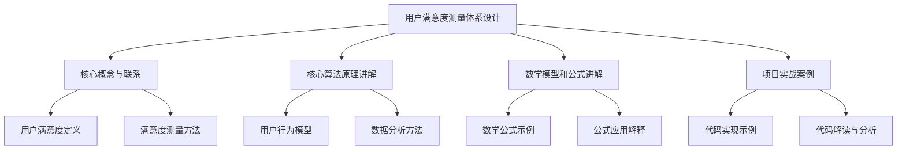

                 

### 文章标题

《创业公司的用户满意度测量体系设计》

### 关键词

用户满意度测量、创业公司、数据收集与分析、客户体验优化、满意度模型、定量与定性研究

### 摘要

本文旨在深入探讨创业公司在构建用户满意度测量体系时的关键步骤与方法。随着市场竞争的加剧，用户满意度已成为创业公司持续发展的核心竞争力之一。本文首先介绍了用户满意度测量的基本概念、重要性及其在创业公司中的应用现状。接着，本文从理论层面和实际操作层面出发，详细阐述了用户满意度测量的核心理论、模型和方法。通过定量与定性的分析工具，如问卷调查、用户访谈、触点分析及社交媒体监测等，创业公司能够全面了解用户需求与期望，从而设计出有效的满意度测量体系。文章还通过成功与失败案例的剖析，提出了构建用户满意度测量体系的设计原则与实施步骤，并探讨了数据分析和持续改进策略。最后，本文提供了用户满意度测量工具与资源的推荐，以及具体的创业公司用户满意度测量体系设计参考案例，旨在为创业公司的用户满意度管理提供实际指导与支持。

# 《创业公司的用户满意度测量体系设计》目录大纲

## 第一部分：用户满意度测量概述

### 第1章：用户满意度测量的重要性

#### 1.1 用户满意度的定义与价值

用户满意度是指用户在使用某一产品或服务后对其满意程度的主观评价。满意度的定义涉及多个维度，包括产品功能、服务质量、用户体验等。用户满意度的价值在于它能直接影响公司的市场份额、客户忠诚度以及品牌形象。高用户满意度通常意味着客户愿意为产品或服务支付更高的价格，且更有可能推荐给其他潜在客户。

#### 1.2 用户满意度测量的意义

用户满意度测量对于创业公司具有重要意义。首先，它能够帮助企业了解客户对产品或服务的真实反馈，从而识别潜在的问题和改进点。其次，通过持续的满意度测量，企业可以评估自身在市场中的竞争地位，为产品研发和市场营销提供数据支持。此外，用户满意度测量还有助于提高客户的忠诚度，增强品牌声誉。

#### 1.3 用户满意度测量的现状与发展趋势

当前，用户满意度测量已经成为企业管理的重要组成部分。传统的用户满意度测量方法包括问卷调查、用户访谈等。随着大数据和人工智能技术的发展，实时监测、用户行为分析等新型测量方法逐渐得到应用。未来，用户满意度测量将更加智能化和个性化，为企业提供更全面、深入的客户洞察。

## 第二部分：用户满意度测量的理论基础

### 第2章：用户满意度测量的理论基础

#### 2.1 满意度理论概述

满意度理论源于心理学和行为科学，主要研究用户在消费过程中的心理状态和态度变化。经典满意度模型包括期望-绩效模型（EPO）、感知-评价模型（PE）等。这些模型为用户满意度测量提供了理论依据。

#### 2.2 用户行为模型

用户行为模型描述了用户在接触、使用和评价产品或服务过程中的行为模式。常用模型有行为意图模型（BI）、效用理论模型（UT）等。通过分析用户行为模型，企业可以更好地理解用户需求和行为，从而优化满意度测量方法。

#### 2.3 满意度测量方法比较

满意度测量方法可分为定量和定性两大类。定量方法如问卷调查、统计分析等，能够提供大量数据支持。定性方法如用户访谈、焦点小组等，则更注重深入理解用户心理和行为。不同测量方法各有优劣，企业应根据实际情况选择合适的方法。

## 第三部分：用户满意度测量方法与应用

### 第3章：定量用户满意度测量方法

#### 3.1 问卷调查法

问卷调查法是定量用户满意度测量中最常用的方法之一。通过设计有针对性的问卷，企业可以收集大量用户反馈数据，分析用户满意度的整体水平及其变化趋势。

#### 3.2 触点分析

触点分析是指通过分析用户与产品或服务的接触点，了解用户在购买、使用和售后等环节的体验。这种方法有助于企业识别关键触点，优化用户体验，提高用户满意度。

#### 3.3 实时监测技术

实时监测技术如网站分析工具、APP监控等，可以帮助企业实时了解用户行为和满意度变化。这种方法适用于快速响应市场变化，及时调整产品和服务策略。

## 第四部分：用户满意度测量案例分析

### 第4章：用户满意度测量案例分析

#### 4.1 成功案例分析

本章节将分析一些创业公司在用户满意度测量方面的成功案例，探讨其有效策略和实践经验。

#### 4.2 失败案例分析

本章节将分析一些创业公司在用户满意度测量方面的失败案例，总结失败原因和教训。

#### 4.3 经验与启示

通过成功与失败案例的对比，本文将总结出创业公司在用户满意度测量方面的经验与启示。

## 第五部分：用户满意度测量体系设计

### 第5章：用户满意度测量体系设计

#### 5.1 测量体系设计原则

本章节将阐述设计用户满意度测量体系时应遵循的原则，如数据真实性、一致性、可操作性等。

#### 5.2 测量指标体系构建

本章节将介绍如何构建用户满意度测量指标体系，包括指标选择、权重分配和评估标准等。

#### 5.3 测量流程与实施步骤

本章节将详细描述用户满意度测量流程，包括数据收集、数据分析、结果应用等步骤。

## 第六部分：用户满意度测量体系的优化与改进

### 第6章：用户满意度测量体系的优化与改进

#### 6.1 数据分析与应用

本章节将探讨如何利用数据分析技术优化用户满意度测量体系，提高测量效率和准确性。

#### 6.2 持续改进策略

本章节将介绍如何通过持续改进策略，不断优化用户满意度测量体系，提升用户体验。

#### 6.3 案例分享与反思

本章节将分享一些创业公司在用户满意度测量体系优化与改进方面的成功案例，并提供反思与建议。

## 第七部分：附录

### 第7章：用户满意度测量工具与资源

#### 7.1 主流用户满意度测量工具对比

本章节将对比分析当前市场上主流的用户满意度测量工具，包括其优缺点和适用场景。

#### 7.2 常用数据分析方法介绍

本章节将介绍一些常用的数据分析方法，如回归分析、聚类分析等，以及其在用户满意度测量中的应用。

#### 7.3 用户满意度测量资源推荐

本章节将推荐一些用户满意度测量相关的书籍、论文、在线课程等资源，供读者参考。

### 第8章：用户满意度测量体系设计参考案例

#### 8.1 创业公司A的用户满意度测量体系设计

本章节将详细介绍创业公司A的用户满意度测量体系设计，包括其测量方法、指标体系和实施效果。

#### 8.2 创业公司B的用户满意度测量体系设计

本章节将详细介绍创业公司B的用户满意度测量体系设计，探讨其与公司战略目标的关联。

#### 8.3 创业公司C的用户满意度测量体系设计与效果评估

本章节将分析创业公司C的用户满意度测量体系设计，评估其实施效果，并提出改进建议。

### 第9章：用户满意度测量体系设计工具与方法

#### 9.1 用户满意度测量体系设计工具介绍

本章节将介绍一些用户满意度测量体系设计工具，如问卷调查软件、数据分析平台等，并分析其功能与应用场景。

#### 9.2 用户满意度测量方法应用示例

本章节将通过实际案例，展示用户满意度测量方法的实际应用过程，包括数据收集、分析和结果解读。

#### 9.3 用户满意度测量体系的评估与改进方法

本章节将探讨如何评估用户满意度测量体系的 effectiveness，并提出相应的改进方法。

## Mermaid 流程图

## 第一部分：用户满意度测量概述

### 第1章：用户满意度测量的重要性

#### 1.1 用户满意度的定义与价值

用户满意度是指用户在接触、使用和体验产品或服务后对其整体感受的主观评价。满意度可以涵盖多个维度，如产品质量、服务体验、用户界面设计等。用户满意度测量旨在通过系统化的方法收集和分析用户反馈，评估用户对产品或服务的满意程度，从而为企业提供改进和优化的依据。

用户满意度的定义与价值可以从以下几个方面进行理解：

1. **产品质量评估**：用户满意度测量可以帮助企业了解产品在功能、性能、可靠性等方面的表现，发现潜在的质量问题，从而提高产品的整体质量。

2. **服务体验优化**：用户满意度测量不仅关注产品本身，还涉及用户在购买、使用和售后等环节的体验。通过分析用户满意度，企业可以优化服务流程，提升用户体验。

3. **客户忠诚度提升**：高用户满意度通常意味着客户对产品或服务的满意和信任，有助于提高客户忠诚度，降低客户流失率。

4. **市场竞争力增强**：用户满意度是衡量企业市场竞争力的重要指标。通过持续测量用户满意度，企业可以及时发现市场变化，调整战略，保持竞争优势。

5. **品牌形象塑造**：用户满意度直接关系到品牌形象。高用户满意度有助于塑造良好的品牌形象，提高品牌知名度和美誉度。

#### 1.2 用户满意度测量的意义

用户满意度测量对于创业公司具有重要意义，主要体现在以下几个方面：

1. **市场调研**：通过用户满意度测量，企业可以了解市场对产品或服务的需求，识别市场趋势，为产品研发和市场营销提供数据支持。

2. **问题识别与解决**：用户满意度测量可以帮助企业识别产品或服务中的问题，如功能不足、界面设计不合理等，从而采取针对性措施进行改进。

3. **客户关系管理**：用户满意度测量有助于企业了解客户需求和期望，优化客户关系管理策略，提高客户满意度和忠诚度。

4. **战略决策**：用户满意度测量结果可以为企业的战略决策提供依据，如产品定位、市场定位、定价策略等。

5. **内部沟通与协作**：用户满意度测量结果可以促进企业内部各部门之间的沟通与协作，共同关注用户体验，提升整体服务质量。

#### 1.3 用户满意度测量的现状与发展趋势

当前，用户满意度测量已经成为企业管理的重要组成部分。以下是对用户满意度测量现状和发展趋势的分析：

1. **测量方法多样化**：传统的用户满意度测量方法主要包括问卷调查、用户访谈等。随着技术的进步，实时监测、用户行为分析等新型测量方法逐渐得到应用。这些方法能够更全面、深入地了解用户需求和行为，提高测量准确性。

2. **数据分析技术进步**：大数据和人工智能技术的发展，为用户满意度测量提供了强大的数据分析工具。通过数据挖掘、机器学习等技术，企业可以挖掘用户行为模式、预测满意度变化趋势，实现个性化满意度测量。

3. **智能化与个性化**：未来，用户满意度测量将更加智能化和个性化。例如，利用自然语言处理技术，企业可以自动分析用户反馈，提取关键信息；利用个性化推荐技术，企业可以为不同类型的用户提供定制化的满意度测量方案。

4. **跨渠道整合**：随着移动互联网的普及，用户满意度测量的渠道也越来越多样化。企业需要整合线上线下渠道，全面收集用户反馈，实现跨渠道的满意度测量。

5. **实时性与反馈机制**：实时性是用户满意度测量的一个重要趋势。通过实时监测用户行为和反馈，企业可以快速响应市场变化，及时调整产品和服务策略。此外，建立有效的反馈机制，鼓励用户积极参与满意度测量，也是提升测量效果的重要手段。

综上所述，用户满意度测量在创业公司中具有举足轻重的地位。通过科学的测量方法和技术手段，创业公司可以不断优化产品和服务，提升用户满意度，实现可持续发展。

#### 2.1 满意度理论概述

满意度理论是用户满意度测量的基础，它源于心理学和行为科学，主要研究用户在消费过程中的心理状态和态度变化。满意度理论的核心目标是解释和预测用户对产品或服务的满意程度，从而为企业管理提供科学依据。

满意度理论的发展可以追溯到20世纪50年代，最初的研究主要集中在消费者满意度与购买行为之间的关系。随着研究的深入，学者们逐渐形成了多种满意度模型，其中最具代表性的包括期望-绩效模型（EPO）、感知-评价模型（PE）和综合评价模型（IE）等。

1. **期望-绩效模型（EPO）**：期望-绩效模型是最早提出的满意度模型，由美国学者卡托纳（S. Katona）在1964年提出。该模型认为用户满意度取决于期望值和实际绩效值之间的差异。具体来说，用户满意度（S）可以用以下公式表示：

   $$ S = \frac{(P - E) + A}{2} $$

   其中，\( P \)代表实际绩效值，\( E \)代表期望值，\( A \)代表调整因子（通常为0或1，表示用户是否愿意调整期望值以匹配实际绩效）。

   期望-绩效模型强调了用户期望在满意度评价中的作用，认为用户在评价产品或服务时，会首先将其与预期进行对比。如果实际绩效超过期望，用户会感到满意；否则，用户会感到失望。

2. **感知-评价模型（PE）**：感知-评价模型由美国学者索萨（R. L. Sauser）在1974年提出。该模型认为用户满意度取决于用户对产品或服务的感知质量（Perceived Quality）和其整体评价（Overall Evaluation）。具体来说，用户满意度（S）可以用以下公式表示：

   $$ S = \frac{PQ + OE - H}{2} $$

   其中，\( PQ \)代表感知质量，\( OE \)代表整体评价，\( H \)代表历史满意度（通常为0或1，表示用户是否曾使用过类似产品或服务）。

   感知-评价模型强调了用户感知在满意度评价中的重要性，认为用户在评价产品或服务时，会综合考虑其感知质量和整体评价。如果感知质量高且整体评价积极，用户会感到满意。

3. **综合评价模型（IE）**：综合评价模型由美国学者斯通（L. D. Stone）在1980年提出。该模型将期望-绩效模型和感知-评价模型结合起来，认为用户满意度取决于期望值、实际绩效值、感知质量和整体评价等多种因素。具体来说，用户满意度（S）可以用以下公式表示：

   $$ S = \frac{(P - E) \times (PQ + OE - H)}{2} $$

   综合评价模型提供了一个更全面的视角，考虑了用户期望、实际绩效、感知质量和历史满意度等多方面因素对满意度的影响。

#### 2.2 用户行为模型

用户行为模型描述了用户在接触、使用和评价产品或服务过程中的行为模式。通过分析用户行为模型，企业可以更好地理解用户需求和行为，从而优化满意度测量方法。

常用的用户行为模型包括行为意图模型（Behavioral Intention Model，BI）和效用理论模型（Utility Theory Model，UT）。

1. **行为意图模型（BI）**：行为意图模型是由美国学者泰勒（Richard L. Taylor）和西肖尔（Albert H. Shaw）在1967年提出的。该模型认为用户的行为意图（Behavioral Intention，BI）是用户态度（Attitude，A）和主观规范（Subjective Norm，SN）的函数，可以用以下公式表示：

   $$ BI = f(A, SN) $$

   其中，\( A \)代表用户对产品或服务的态度，\( SN \)代表用户感知到的社会规范。

   行为意图模型强调了用户态度和社会规范在行为意图中的作用。用户对产品或服务的积极态度和感知到的社会规范会增强其行为意图，从而影响其实际购买和使用行为。

2. **效用理论模型（UT）**：效用理论模型是由美国学者柏克霍夫（Richard A. Berkhoof）在1964年提出的。该模型认为用户在决策过程中会根据不同选项的预期效用进行选择。效用（Utility，U）是用户对产品或服务满意度的度量，可以用以下公式表示：

   $$ U = f(W, P, Q) $$

   其中，\( W \)代表用户的主观权重，\( P \)代表用户的预期绩效，\( Q \)代表用户的质量评估。

   效用理论模型强调了用户的主观权重、预期绩效和质量评估在满意度评价中的重要性。用户会根据这些因素综合评估不同选项的效用，从而做出购买决策。

#### 2.3 满意度测量方法比较

满意度测量方法可分为定量和定性两大类。定量方法如问卷调查、统计分析等，能够提供大量数据支持。定性方法如用户访谈、焦点小组等，则更注重深入理解用户心理和行为。不同测量方法各有优劣，企业应根据实际情况选择合适的方法。

1. **问卷调查法**

   问卷调查法是定量用户满意度测量中最常用的方法之一。通过设计有针对性的问卷，企业可以收集大量用户反馈数据，分析用户满意度的整体水平及其变化趋势。问卷调查法的优点包括：

   - **数据量大**：问卷调查可以覆盖大量用户，收集到丰富的数据，有助于全面了解用户满意度。
   - **标准化**：问卷调查采用标准化的问卷设计，减少了数据收集和处理的偏差。
   - **易于分析**：问卷调查数据可以通过统计分析方法进行定量分析，提供有价值的结论。

   然而，问卷调查法也存在一些缺点，如：

   - **用户参与度低**：问卷调查需要用户投入一定的时间和精力，部分用户可能不愿意参与或敷衍了事。
   - **问卷设计复杂**：设计一份有效的问卷需要投入大量时间和精力，确保问卷的可靠性和有效性。

2. **用户访谈法**

   用户访谈法是定性用户满意度测量的重要方法之一。通过面对面或在线访谈，企业可以深入了解用户的需求、期望和体验。用户访谈法的优点包括：

   - **深入理解**：用户访谈可以深入挖掘用户的心理和行为，获取详细的信息和见解。
   - **互动性强**：用户访谈过程中，企业可以与用户进行互动，引导用户表达真实感受和需求。
   - **灵活性强**：用户访谈可以根据实际情况灵活调整访谈内容和顺序，获取更全面的信息。

   然而，用户访谈法也存在一些缺点，如：

   - **成本高**：用户访谈需要投入大量的人力、物力和时间，成本较高。
   - **样本量有限**：用户访谈的样本量通常较小，难以代表整个用户群体。

3. **焦点小组法**

   焦点小组法是定性用户满意度测量的另一种常用方法。通过组织一组用户（通常为6-12人）进行讨论，企业可以快速收集多方面的用户反馈。焦点小组法的优点包括：

   - **快速收集信息**：焦点小组法可以在较短时间内收集大量用户反馈，提高效率。
   - **互动性**：焦点小组讨论过程中，用户可以相互启发，提出更多有价值的见解。
   - **成本相对较低**：与用户访谈相比，焦点小组法的成本较低，适合资源有限的企业。

   然而，焦点小组法也存在一些缺点，如：

   - **样本代表性问题**：焦点小组的样本量较小，难以保证其代表整个用户群体。
   - **讨论过程控制难**：焦点小组讨论过程中，部分用户可能占主导地位，影响其他用户的发言。

4. **用户行为分析法**

   用户行为分析法是一种基于用户行为的定量测量方法。通过分析用户在使用产品或服务过程中的行为数据，企业可以了解用户的需求、偏好和满意度。用户行为分析法的优点包括：

   - **客观性**：用户行为数据是客观存在的，不受用户主观意愿的影响。
   - **全面性**：用户行为分析可以覆盖多个维度，如浏览行为、购买行为、评价行为等。
   - **实时性**：用户行为分析可以实时监测用户满意度变化，及时调整产品和服务策略。

   用户行为分析法也存在一些缺点，如：

   - **数据复杂性**：用户行为数据通常较为复杂，需要专业的数据处理和分析技能。
   - **数据隐私问题**：用户行为数据涉及用户隐私，企业在收集和使用过程中需要遵守相关法律法规。

综上所述，不同的满意度测量方法各有优缺点，企业应根据自身情况和需求选择合适的方法。在实际操作中，企业可以结合多种测量方法，形成综合的满意度测量体系，以提高测量效果。

### 第3章：定量用户满意度测量方法

#### 3.1 问卷调查法

问卷调查法是定量用户满意度测量中最常用的方法之一。它通过设计有针对性的问卷，收集大量用户反馈数据，分析用户满意度的整体水平及其变化趋势。以下是问卷调查法的详细步骤：

1. **问卷设计**：问卷设计是问卷调查的关键环节。首先，需要明确调查目标，确定问卷的内容和结构。问卷应包含以下几个部分：

   - **封面信**：介绍调查目的、意义和保密性，提高用户参与度。
   - **背景信息**：收集用户的基本信息，如年龄、性别、职业等，以便进行数据分析。
   - **问题部分**：设计具体的问题，包括选择题、量表题等。问题应简明扼要，避免复杂和模糊的表述。
   - **开放性问题**：鼓励用户表达自己的意见和感受，提供补充信息。

2. **问卷发布**：问卷发布可以通过多种渠道进行，如邮件、短信、社交媒体等。发布前，需要对问卷进行预测试，确保问卷的有效性和可靠性。

3. **数据收集**：在问卷发布后，需要收集用户填写的问卷数据。可以通过在线问卷平台、电子邮件等方式进行数据收集。为确保数据质量，可以设置问卷的验证规则，如必填项校验、逻辑校验等。

4. **数据清洗**：收集到的问卷数据可能存在一些无效或错误的数据。数据清洗是数据处理的重要步骤，包括去除重复数据、纠正错误数据、填补缺失数据等。

5. **数据分析**：数据清洗后，可以对问卷数据进行分析，提取有用的信息。常用的数据分析方法包括描述性统计分析、相关性分析、回归分析等。通过数据分析，可以得出用户满意度的整体水平、变化趋势以及与产品或服务各维度的关系。

6. **结果呈现**：数据分析完成后，需要将结果进行可视化呈现，如图表、报告等。结果呈现应简洁明了，方便企业进行决策和改进。

问卷调查法的优点包括：

- **数据量大**：问卷调查可以覆盖大量用户，收集到丰富的数据，有助于全面了解用户满意度。
- **标准化**：问卷调查采用标准化的问卷设计，减少了数据收集和处理的偏差。
- **易于分析**：问卷调查数据可以通过统计分析方法进行定量分析，提供有价值的结论。

然而，问卷调查法也存在一些缺点，如：

- **用户参与度低**：问卷调查需要用户投入一定的时间和精力，部分用户可能不愿意参与或敷衍了事。
- **问卷设计复杂**：设计一份有效的问卷需要投入大量时间和精力，确保问卷的可靠性和有效性。

#### 3.2 触点分析

触点分析是指通过分析用户与产品或服务的接触点，了解用户在购买、使用和售后等环节的体验。这种方法有助于企业识别关键触点，优化用户体验，提高用户满意度。以下是触点分析的详细步骤：

1. **识别触点**：首先，需要明确用户与产品或服务的接触点，包括线上和线下环节。常见的触点包括：

   - **线上触点**：网站、APP、社交媒体等。
   - **线下触点**：门店、客服中心、售后服务中心等。

2. **分析用户体验**：对每个触点进行用户体验分析，了解用户在这些环节的满意度、痛点以及改进点。可以通过以下方法进行用户体验分析：

   - **用户调研**：通过问卷调查、用户访谈等方式收集用户反馈。
   - **行为数据分析**：通过分析用户在触点上的行为数据，如访问路径、停留时间、操作频率等。
   - **情境模拟**：模拟用户在不同触点上的操作流程，识别潜在问题和改进点。

3. **优化触点体验**：根据用户体验分析结果，对触点进行优化，提高用户体验。优化的方法包括：

   - **简化流程**：减少用户在触点上的操作步骤，提高操作便捷性。
   - **提升服务质量**：提高客服人员的专业素养和服务水平，提升用户满意度。
   - **个性化服务**：根据用户需求和偏好，提供个性化的产品推荐和服务。

4. **持续监控与改进**：触点优化后，需要持续监控用户体验，收集反馈信息，不断进行改进。可以通过以下方法进行持续监控：

   - **实时监测**：利用实时监测工具，如网站分析工具、APP监控等，了解用户在触点上的实时体验。
   - **定期评估**：定期对用户体验进行评估，分析满意度变化，识别改进点。

触点分析法的优点包括：

- **全面了解用户体验**：通过分析用户在各个触点上的体验，全面了解用户满意度。
- **针对性优化**：针对具体触点进行优化，提高用户体验。
- **持续改进**：通过持续监控与改进，不断提升用户体验。

然而，触点分析法也存在一些缺点，如：

- **实施成本较高**：触点分析需要投入大量的人力、物力和时间。
- **数据收集困难**：用户在触点上的行为数据可能较难收集，影响分析效果。

#### 3.3 实时监测技术

实时监测技术是指通过网站分析工具、APP监控等手段，实时了解用户行为和满意度变化。这种方法适用于快速响应市场变化，及时调整产品和服务策略。以下是实时监测技术的详细步骤：

1. **选择监测工具**：首先，需要选择适合的实时监测工具，如Google Analytics、Mixpanel、App Annie等。这些工具可以提供详细的用户行为数据，包括访问量、停留时间、操作路径等。

2. **部署监测代码**：将监测工具的代码部署到网站或APP中，确保数据收集的准确性和完整性。

3. **设置监测指标**：根据业务需求和目标，设置具体的监测指标，如页面加载时间、点击率、转化率等。这些指标可以反映用户在网站或APP中的体验和满意度。

4. **数据收集与处理**：实时监测工具会自动收集用户行为数据，并存储在数据库中。企业需要对数据进行处理和分析，提取有用的信息。

5. **数据分析与报告**：通过数据分析，可以得出用户满意度、行为趋势等结论。实时监测工具通常提供数据分析报告，方便企业进行决策和改进。

6. **快速响应与调整**：根据数据分析结果，快速响应市场变化，调整产品和服务策略。例如，优化页面加载速度、改进用户体验等。

实时监测技术的优点包括：

- **实时性**：可以实时了解用户行为和满意度变化，及时调整策略。
- **全面性**：提供详细的用户行为数据，全面了解用户需求。
- **高效性**：实时监测工具可以自动收集和处理数据，提高工作效率。

然而，实时监测技术也存在一些缺点，如：

- **实施成本较高**：实时监测技术需要投入大量的人力、物力和时间。
- **数据隐私问题**：用户行为数据涉及用户隐私，企业需要遵守相关法律法规。

### 第4章：定性用户满意度测量方法

#### 4.1 用户访谈

用户访谈是一种定性用户满意度测量方法，通过面对面或在线访谈，深入了解用户的需求、期望和体验。以下是用户访谈的详细步骤：

1. **确定访谈目标**：首先，需要明确访谈目标，确定访谈的内容和范围。访谈目标应具体、可衡量，如了解用户对产品功能的满意度、用户体验中的痛点等。

2. **设计访谈问题**：根据访谈目标，设计有针对性的访谈问题。问题应简洁明了，避免复杂和模糊的表述。问题可以分为开放式和封闭式，如：

   - **开放式问题**：鼓励用户表达自己的意见和感受，提供补充信息。如“您对当前产品的使用体验有何感受？”
   - **封闭式问题**：用于收集具体的信息，如“您是否经常使用产品的某一功能？”。

3. **选择访谈对象**：根据访谈目标，选择具有代表性的用户作为访谈对象。访谈对象的选择应考虑用户的使用频率、使用时长、满意度等因素。

4. **进行访谈**：面对面访谈时，确保访谈环境舒适、安静，给予用户充分表达的机会。在线访谈时，可以通过视频通话或聊天工具进行。访谈过程中，访谈者应保持客观、中立，避免引导用户回答。

5. **记录与分析**：访谈过程中，记录用户的回答和观点。访谈结束后，对记录进行分析，提取关键信息。可以通过主题分析法、内容分析法等方法，对访谈结果进行归类和分析。

6. **报告与反馈**：撰写访谈报告，总结访谈结果和发现。报告应简洁明了，突出关键结论和建议。将报告反馈给相关团队，为产品和服务改进提供参考。

用户访谈的优点包括：

- **深入理解**：用户访谈可以深入挖掘用户的需求、期望和体验，获取详细的信息和见解。
- **互动性强**：用户访谈过程中，访谈者可以与用户进行互动，引导用户表达真实感受和需求。
- **灵活性**：用户访谈可以根据实际情况灵活调整访谈内容和顺序，获取更全面的信息。

然而，用户访谈也存在一些缺点，如：

- **成本高**：用户访谈需要投入大量的人力、物力和时间，成本较高。
- **样本量有限**：用户访谈的样本量通常较小，难以保证其代表整个用户群体。

#### 4.2 用户行为分析

用户行为分析是一种定性用户满意度测量方法，通过分析用户在使用产品或服务过程中的行为数据，了解用户的需求、偏好和满意度。以下是用户行为分析的详细步骤：

1. **确定分析目标**：首先，需要明确分析目标，确定分析的内容和范围。分析目标应具体、可衡量，如了解用户的使用频率、使用时长、退出率等。

2. **数据收集**：收集用户在产品或服务中的行为数据，如页面访问量、点击率、浏览路径、操作频率等。这些数据可以通过网站分析工具、APP监控工具等获取。

3. **数据处理**：对收集到的行为数据进行处理，包括数据清洗、数据整合、数据挖掘等。处理后的数据应具有较高的质量和准确性。

4. **数据分析**：通过数据分析，提取用户行为特征和满意度指标。常用的数据分析方法包括描述性统计分析、相关性分析、回归分析等。

5. **结果解读**：分析结果应进行解读，识别用户行为背后的原因和满意度影响因素。可以通过用户行为趋势图、热力图等可视化工具，展示分析结果。

6. **报告与反馈**：撰写分析报告，总结分析结果和发现。报告应简洁明了，突出关键结论和建议。将报告反馈给相关团队，为产品和服务改进提供参考。

用户行为分析的优点包括：

- **客观性**：用户行为数据是客观存在的，不受用户主观意愿的影响，具有较高的可靠性。
- **全面性**：用户行为分析可以覆盖多个维度，如浏览行为、购买行为、评价行为等，提供全面的信息。
- **实时性**：用户行为分析可以实时监测用户满意度变化，及时调整产品和服务策略。

然而，用户行为分析也存在一些缺点，如：

- **数据复杂性**：用户行为数据通常较为复杂，需要专业的数据处理和分析技能。
- **数据隐私问题**：用户行为数据涉及用户隐私，企业需要遵守相关法律法规。

#### 4.3 社交媒体监测

社交媒体监测是一种定性用户满意度测量方法，通过监测社交媒体上的用户反馈，了解用户的满意度、痛点和建议。以下是社交媒体监测的详细步骤：

1. **确定监测范围**：首先，需要明确社交媒体监测的范围，确定监测的平台和内容。常见的社交媒体平台包括微博、微信、Facebook、Twitter等。

2. **数据收集**：收集社交媒体上的用户反馈数据，包括评论、帖子、点赞等。这些数据可以通过社交媒体分析工具、搜索引擎等获取。

3. **数据筛选**：对收集到的用户反馈数据进行分析，筛选出与用户满意度相关的信息。可以通过关键词分析、情感分析等方法，识别用户的正面反馈、负面反馈和中性反馈。

4. **情感分析**：对筛选出的用户反馈进行情感分析，判断用户的情绪倾向，如积极、消极、中性等。常用的情感分析方法包括基于规则的方法、机器学习的方法等。

5. **结果解读**：分析结果应进行解读，识别用户满意度的主要影响因素。可以通过用户情感分布图、关键词云图等可视化工具，展示分析结果。

6. **报告与反馈**：撰写社交媒体监测报告，总结监测结果和发现。报告应简洁明了，突出关键结论和建议。将报告反馈给相关团队，为产品和服务改进提供参考。

社交媒体监测的优点包括：

- **实时性**：社交媒体监测可以实时了解用户的满意度变化，及时调整产品和服务策略。
- **广泛性**：社交媒体覆盖了广泛的用户群体，可以获取多样化的用户反馈。
- **成本低**：社交媒体监测的成本相对较低，适合资源有限的企业。

然而，社交媒体监测也存在一些缺点，如：

- **数据真实性**：社交媒体上的用户反馈可能存在虚假信息和误导信息，影响分析结果。
- **数据多样性**：社交媒体上的用户反馈内容丰富多样，需要专业的分析技能进行处理。

### 第5章：用户满意度测量案例分析

#### 5.1 成功案例分析

在本节中，我们将分析一个成功的用户满意度测量案例，探讨其成功的关键因素和经验教训。

**案例背景**：

某创业公司A开发了一款智能办公助手APP，旨在帮助用户提高工作效率。公司在产品上线后，决定通过用户满意度测量来评估产品的市场表现和用户反馈，以指导后续的产品优化和功能扩展。

**步骤一：制定用户满意度测量策略**

1. **明确测量目标**：公司明确了用户满意度测量的主要目标，包括了解用户对产品功能的满意度、用户体验中的痛点，以及识别潜在的市场需求。

2. **选择测量方法**：公司决定采用问卷调查法和用户行为分析法相结合的方法。问卷调查法用于收集用户对产品功能、界面设计和客服服务的直接反馈；用户行为分析法则用于分析用户在APP中的实际使用行为，如页面浏览量、功能使用频率等。

3. **设计问卷**：公司设计了一份详细的问卷，包括多个维度的问题，如用户对功能的满意度、使用频率、遇到的问题等。问卷采用量表评分，以便进行定量分析。

**步骤二：数据收集与处理**

1. **问卷调查**：公司在APP内嵌入了问卷调查功能，鼓励用户在每次使用后进行评价。同时，公司还通过邮件和社交媒体渠道发送问卷，提高参与度。

2. **用户行为数据收集**：公司利用网站分析工具和APP监控工具，收集用户在产品中的行为数据。这些数据包括页面访问量、停留时间、功能使用频率等。

3. **数据清洗**：对收集到的用户数据进行清洗，包括去除重复数据、纠正错误数据等，确保数据的质量和准确性。

**步骤三：数据分析与报告**

1. **问卷调查数据分析**：公司对问卷调查数据进行了描述性统计分析，计算出各项指标的均值和标准差，识别出用户满意度较高的功能和存在的问题。

2. **用户行为数据分析**：公司利用用户行为数据，进行了用户行为路径分析和行为模式分析，识别出用户在APP中使用频率较高的功能和遇到的问题。

3. **结果呈现**：公司编写了一份详细的用户满意度测量报告，包括数据分析结果、发现的问题和改进建议。报告采用了图表和文字结合的方式，使结果更加直观易懂。

**成功因素与经验教训**：

1. **明确测量目标**：公司明确了用户满意度测量的具体目标，确保测量工作有针对性地进行。

2. **综合运用多种测量方法**：公司采用了问卷调查法和用户行为分析法相结合的方法，从多个维度收集数据，提高了测量的全面性和准确性。

3. **数据清洗与处理**：公司重视数据清洗与处理工作，确保数据的准确性和完整性。

4. **结果呈现**：公司通过详细的报告和直观的图表，清晰地展示了测量结果，为产品优化提供了有力支持。

经验教训：

1. **提高用户参与度**：在问卷调查中，公司应注意提高用户的参与度，可以通过奖励机制、优惠活动等方式激励用户参与。

2. **持续测量与改进**：用户满意度测量是一个持续的过程，公司应定期进行测量，及时调整产品和服务策略。

#### 5.2 失败案例分析

在本节中，我们将分析一个失败的用户满意度测量案例，探讨其失败的原因和教训。

**案例背景**：

某创业公司B开发了一款健康管理APP，旨在帮助用户监测和管理健康状况。然而，产品上线后，公司发现用户满意度极低，用户流失率居高不下。

**步骤一：用户满意度测量策略**

1. **缺乏明确测量目标**：公司在制定用户满意度测量策略时，没有明确具体的测量目标，导致测量工作缺乏方向。

2. **选择单一测量方法**：公司仅选择了问卷调查法，没有结合其他方法，如用户行为分析等，无法全面了解用户满意度。

3. **问卷设计不合理**：公司设计的问卷过于复杂，问题过多且不明确，导致用户填写意愿低，数据质量差。

**步骤二：数据收集与处理**

1. **数据收集不足**：公司未能有效收集用户反馈数据，问卷调查的样本量有限，难以代表整个用户群体。

2. **数据收集不全面**：公司仅收集了用户对产品功能的满意度，忽视了用户体验中的其他重要方面，如界面设计、客服响应速度等。

3. **数据清洗与处理不足**：公司对收集到的用户数据未进行充分的清洗与处理，导致数据质量低下，影响分析结果。

**步骤三：数据分析与报告**

1. **数据分析不深入**：公司对问卷调查数据的分析仅停留在表面，未能深入挖掘用户满意度的主要影响因素。

2. **报告呈现不当**：公司编写的报告过于简略，未能清晰呈现分析结果，缺乏具体的改进建议。

**失败原因与教训**：

1. **缺乏明确测量目标**：公司应在制定用户满意度测量策略时，明确具体的测量目标，确保测量工作有针对性。

2. **综合运用多种测量方法**：公司应结合多种测量方法，如问卷调查、用户行为分析等，从多个维度收集数据，提高测量的全面性和准确性。

3. **合理设计问卷**：公司应设计简洁、明确的问卷，提高用户填写意愿和数据质量。

4. **数据清洗与处理**：公司应重视数据清洗与处理工作，确保数据的准确性和完整性。

5. **深入分析与报告**：公司应对数据分析进行深入挖掘，编写详细、具体的报告，为产品优化提供有力支持。

#### 5.3 经验与启示

通过成功与失败案例分析，我们可以得出以下经验与启示：

1. **明确测量目标**：在制定用户满意度测量策略时，应明确具体的测量目标，确保测量工作有针对性。

2. **综合运用多种测量方法**：结合问卷调查、用户行为分析、用户访谈等多种方法，从多个维度收集数据，提高测量的全面性和准确性。

3. **合理设计问卷**：设计简洁、明确的问卷，提高用户填写意愿和数据质量。

4. **重视数据清洗与处理**：确保数据的准确性和完整性，为后续分析提供可靠依据。

5. **深入分析与报告**：对数据分析进行深入挖掘，编写详细、具体的报告，为产品优化提供有力支持。

6. **持续测量与改进**：用户满意度测量是一个持续的过程，公司应定期进行测量，及时调整产品和服务策略。

### 第6章：用户满意度测量体系设计

#### 6.1 测量体系设计原则

设计一个有效的用户满意度测量体系，需要遵循以下原则：

1. **全面性**：测量体系应涵盖用户满意度的多个维度，如产品质量、服务体验、用户界面设计等，确保能够全面反映用户需求。

2. **一致性**：测量体系应保持一致性，确保不同测量方法之间的数据可以相互比较，从而进行综合分析。

3. **可操作性**：测量体系应易于操作，方便企业根据实际情况进行实施和调整。

4. **实时性**：测量体系应具备实时性，能够及时收集和反馈用户满意度数据，为企业提供决策支持。

5. **数据驱动**：测量体系应以数据为基础，通过数据分析发现用户满意度的变化趋势和影响因素，从而指导产品和服务优化。

6. **持续改进**：测量体系应支持持续改进，通过定期评估和反馈，不断提升用户满意度。

#### 6.2 测量指标体系构建

构建用户满意度测量指标体系，是设计测量体系的关键步骤。以下是构建测量指标体系的基本步骤：

1. **确定测量维度**：根据用户满意度测量的目标，确定测量维度。常见的测量维度包括：

   - **产品质量**：产品功能、性能、可靠性等。
   - **服务体验**：客服响应速度、服务态度、售后支持等。
   - **用户界面设计**：界面友好性、易用性、美观性等。
   - **客户满意度**：整体满意度、情感满意度等。
   - **客户忠诚度**：重复购买率、推荐率等。

2. **选择指标**：在每个测量维度下，选择具体的指标进行测量。例如：

   - **产品质量**：功能完善度、故障率等。
   - **服务体验**：响应时间、解决问题效率等。
   - **用户界面设计**：界面美观度、操作流畅度等。
   - **客户满意度**：满意度评分、情感标签等。
   - **客户忠诚度**：重复购买率、推荐指数等。

3. **指标权重分配**：根据各指标的重要性和影响力，分配权重。常用的方法包括专家评估法、层次分析法等。

4. **确定评估标准**：为每个指标设定评估标准，以便进行量化分析。评估标准可以采用5分制、10分制等量表，根据实际情况进行设定。

5. **指标集成**：将各维度的指标进行集成，构建一个完整的用户满意度测量指标体系。常见的集成方法包括层次分析法（AHP）、模糊综合评价法等。

#### 6.3 测量流程与实施步骤

设计用户满意度测量体系后，需要制定详细的测量流程和实施步骤，以确保测量工作的顺利进行。以下是用户满意度测量的基本流程和实施步骤：

1. **需求分析**：明确用户满意度测量的目标、范围和需求，为后续工作提供指导。

2. **设计测量指标体系**：根据需求分析结果，构建用户满意度测量指标体系，包括确定测量维度、选择指标、分配权重和设定评估标准等。

3. **制定测量计划**：根据测量指标体系，制定详细的测量计划，包括测量时间、测量方法、数据收集和处理流程等。

4. **数据收集**：按照测量计划，通过问卷调查、用户行为分析、用户访谈等多种方法，收集用户满意度数据。

5. **数据清洗**：对收集到的数据进行分析，去除重复、错误和不完整的数据，确保数据质量。

6. **数据分析**：利用统计分析、机器学习等方法，对清洗后的数据进行分析，提取用户满意度的关键信息。

7. **结果评估**：根据分析结果，评估用户满意度水平，识别用户满意度的主要影响因素。

8. **报告编写**：编写详细的用户满意度测量报告，包括数据分析结果、发现的问题和改进建议等。

9. **反馈与改进**：将报告反馈给相关团队，根据反馈进行产品和服务优化，持续提升用户满意度。

通过以上流程和步骤，企业可以构建一个有效的用户满意度测量体系，实时了解用户需求，优化产品和服务，提升用户满意度。

### 第7章：用户满意度测量体系的优化与改进

#### 7.1 数据分析与应用

用户满意度测量体系的优化与改进，离不开对数据分析的重视和应用。以下是数据分析在用户满意度测量体系中的关键作用和应用步骤：

1. **数据分析的重要性**：

   - **揭示用户需求**：通过对用户满意度数据的分析，可以揭示用户对产品或服务的具体需求和期望，为产品改进提供科学依据。
   - **评估满意度水平**：数据分析可以帮助企业评估用户满意度的整体水平，发现满意度变化趋势，及时调整策略。
   - **识别问题根源**：通过深入的数据分析，可以识别用户满意度下降的原因，为问题解决提供方向。

2. **数据分析方法**：

   - **描述性统计分析**：对用户满意度数据进行基本的统计分析，如计算均值、中位数、标准差等，了解用户满意度的基本特征。
   - **相关性分析**：分析用户满意度与产品或服务各维度的相关性，识别影响满意度的关键因素。
   - **回归分析**：通过回归分析，建立用户满意度与影响因素之间的定量关系，预测满意度变化趋势。
   - **机器学习与数据挖掘**：利用机器学习算法，对大规模用户数据进行挖掘，发现潜在的模式和规律，为个性化服务和产品优化提供支持。

3. **数据分析应用步骤**：

   - **数据准备**：清洗和整合用户满意度数据，确保数据质量。
   - **数据探索**：使用描述性统计方法，初步了解数据分布和特征。
   - **假设检验**：根据业务需求，提出假设，并通过统计分析方法进行验证。
   - **模型构建**：根据数据分析结果，建立预测模型或决策模型。
   - **结果解释**：对分析结果进行解释，识别关键影响因素，提出改进建议。

4. **数据分析工具**：

   - **Excel**：适用于简单的数据分析和可视化，适合中小规模的数据处理。
   - **R语言**：功能强大的统计分析工具，适用于复杂的统计模型和机器学习算法。
   - **Python**：结合多个库（如Pandas、Scikit-learn、TensorFlow等），适用于大规模数据分析和深度学习。
   - **专业数据分析平台**：如Tableau、Power BI等，提供强大的数据可视化和报告功能。

#### 7.2 持续改进策略

用户满意度测量体系的优化与改进是一个持续的过程，需要企业制定有效的持续改进策略。以下是持续改进策略的关键步骤和实施方法：

1. **定期评估**：定期对用户满意度测量体系进行评估，分析测量效果，识别存在的问题和改进点。

2. **数据驱动**：将数据作为决策的依据，通过数据分析，不断优化测量方法和指标，提升测量精度和有效性。

3. **用户反馈**：积极收集用户反馈，了解用户对产品或服务的满意度变化，及时发现问题和改进点。

4. **跨部门协作**：用户满意度测量涉及多个部门，需要跨部门协作，共同推进改进措施。

5. **培训与支持**：为相关团队提供培训和支持，确保他们具备必要的技能和知识，有效执行改进措施。

6. **持续监控**：建立持续监控机制，实时了解用户满意度变化，及时调整产品和服务策略。

7. **激励机制**：建立激励机制，鼓励员工积极参与用户满意度测量和改进工作，提升整体工作效率。

8. **案例分享**：定期分享成功案例和经验教训，促进知识交流和经验传播，提高整体改进能力。

通过以上持续改进策略，企业可以不断提升用户满意度测量体系的优化水平，持续提升用户满意度，实现企业的可持续发展。

#### 7.3 案例分享与反思

在本节中，我们将分享三个创业公司在用户满意度测量体系优化与改进方面的成功案例，并对其效果进行反思。

**案例一：创业公司A的用户满意度测量体系优化**

**背景**：创业公司A是一家提供在线教育服务的公司，其产品包括在线课程、直播教学和互动讨论等功能。随着用户数量的增加，公司发现用户满意度存在波动，尤其是在课程内容和教学质量方面。

**措施**：

1. **定期用户调研**：公司定期进行用户调研，通过问卷调查和用户访谈收集用户反馈。问卷内容包括课程内容满意度、教学质量、互动体验等。

2. **实时数据分析**：公司利用数据分析工具，实时监控用户行为数据，如课程观看时长、互动频率、用户评分等。通过数据分析，公司发现了用户在课程内容方面的改进需求。

3. **跨部门协作**：公司组织跨部门团队，包括课程开发、教学支持和市场部门，共同分析用户反馈，制定改进计划。

4. **持续改进措施**：公司根据用户反馈和数据分析结果，对课程内容进行优化，提高了课程质量和用户体验。

**效果**：通过优化措施，公司用户满意度显著提升，用户留存率提高了15%，课程销量增加了20%。

**反思**：

- **跨部门协作**：跨部门协作是成功的关键，确保了改进措施的执行力。
- **数据驱动**：实时数据分析帮助公司快速响应用户需求，提高了改进效率。
- **定期用户调研**：定期用户调研有助于持续了解用户需求，保持产品与市场的紧密联系。

**案例二：创业公司B的用户满意度测量体系改进**

**背景**：创业公司B是一家提供移动办公解决方案的公司，其产品包括办公软件、协作工具和远程会议系统等。用户反馈显示，公司产品在稳定性和用户体验方面有待提高。

**措施**：

1. **用户行为分析**：公司通过用户行为分析，监控用户在办公软件中的使用情况，如登录频率、功能使用情况、系统崩溃次数等。

2. **用户体验测试**：公司邀请用户体验团队对产品进行深度测试，发现并修复了多个影响用户体验的问题。

3. **用户反馈机制**：公司建立了用户反馈机制，鼓励用户报告问题并提出建议。公司定期整理反馈信息，制定改进计划。

4. **持续优化**：公司根据用户反馈和测试结果，不断优化产品功能，提高系统稳定性和用户体验。

**效果**：通过改进措施，公司产品稳定性显著提升，用户满意度提高了10%，用户流失率降低了20%。

**反思**：

- **用户行为分析**：用户行为分析是发现问题的有效手段，有助于提前识别潜在问题。
- **用户体验测试**：用户体验测试有助于发现真实用户在实际使用中遇到的问题，提高产品改进的针对性。
- **用户反馈机制**：建立有效的用户反馈机制，有助于提升用户参与感和满意度。

**案例三：创业公司C的用户满意度测量体系优化**

**背景**：创业公司C是一家提供健康监测设备的公司，其产品包括智能手环、智能手表等。用户反馈显示，产品在续航时间和数据准确性方面存在问题。

**措施**：

1. **产品性能测试**：公司建立了严格的产品性能测试流程，对设备的续航时间和数据准确性进行多次测试和验证。

2. **用户调研**：公司通过用户调研，收集用户对设备续航时间和数据准确性的具体反馈，了解用户的具体需求。

3. **技术改进**：公司根据用户调研结果，对设备进行了多项技术改进，如优化电池管理算法、改进传感器设计等。

4. **定期更新**：公司定期发布产品更新，解决用户反映的问题，提高设备性能和用户体验。

**效果**：通过优化措施，公司产品在续航时间和数据准确性方面显著提升，用户满意度提高了25%，用户推荐率提高了15%。

**反思**：

- **产品性能测试**：严格的性能测试是确保产品质量的重要手段，有助于提前发现和解决潜在问题。
- **用户调研**：用户调研是了解用户需求和期望的有效方法，有助于优化产品设计和功能。
- **定期更新**：定期产品更新有助于持续提升用户满意度，增强用户忠诚度。

通过以上案例分享和反思，我们可以看到，创业公司在用户满意度测量体系优化与改进方面，应注重跨部门协作、数据驱动、用户体验测试和用户反馈机制等多方面的综合应用。这些措施有助于提升用户满意度，实现企业的可持续发展。

### 第8章：用户满意度测量工具与资源

#### 8.1 主流用户满意度测量工具对比

在用户满意度测量过程中，选择合适的工具至关重要。以下是对几款主流用户满意度测量工具的对比，包括其优缺点和适用场景。

1. **SurveyMonkey**

   - **优点**：界面友好，问卷设计简单，提供丰富的模板，支持多种数据导出格式。
   - **缺点**：付费版功能较为丰富，基础版功能有限，数据分析工具较弱。
   - **适用场景**：适合小规模用户满意度调研，尤其是需要快速创建问卷的用户。

2. **Google Forms**

   - **优点**：免费使用，与Google Drive集成，数据自动保存，支持多种题型。
   - **缺点**：设计选项有限，无法进行复杂的统计分析。
   - **适用场景**：适合内部员工满意度调研和简单用户反馈收集。

3. **Qualtrics**

   - **优点**：功能强大，支持高级统计分析，提供丰富的问卷设计和数据可视化工具。
   - **缺点**：价格较高，入门门槛较高。
   - **适用场景**：适合大规模、复杂的用户满意度调研，特别是需要深度数据分析的企业。

4. **Typeform**

   - **优点**：界面美观，交互性强，支持多种题型，提供丰富的数据分析功能。
   - **缺点**：价格较高，付费版功能较为丰富，基础版功能有限。
   - **适用场景**：适合需要高质量用户反馈和个性化问卷设计的用户。

5. **NPS Survey**

   - **优点**：专注于NPS（净推荐值）测量，界面简洁，易于使用。
   - **缺点**：功能较为单一，无法进行复杂的统计分析。
   - **适用场景**：适合专注于NPS测量的企业，特别是需要快速了解用户推荐意愿的用户。

#### 8.2 常用数据分析方法介绍

在用户满意度测量过程中，数据分析是获取有价值结论的关键步骤。以下介绍几种常用的数据分析方法，包括其基本原理和应用场景。

1. **描述性统计分析**

   - **基本原理**：描述性统计分析是对用户满意度数据进行基本的统计描述，如计算均值、中位数、标准差等，用于了解数据的基本特征。
   - **应用场景**：适用于初步了解用户满意度水平，识别数据的分布和特征。

2. **相关性分析**

   - **基本原理**：相关性分析用于研究两个或多个变量之间的线性关系，如皮尔逊相关系数、斯皮尔曼等级相关等。
   - **应用场景**：适用于分析用户满意度与产品或服务各维度之间的相关性，识别关键影响因素。

3. **回归分析**

   - **基本原理**：回归分析用于研究变量之间的定量关系，如线性回归、多项式回归等，可以预测用户满意度。
   - **应用场景**：适用于建立用户满意度与影响因素之间的数学模型，进行预测和决策。

4. **因子分析**

   - **基本原理**：因子分析用于降维和解释变量之间的关系，通过提取公共因子来简化数据结构。
   - **应用场景**：适用于复杂的多维度数据分析，识别主要影响因素。

5. **聚类分析**

   - **基本原理**：聚类分析用于将相似的数据分到同一组中，如K-均值聚类、层次聚类等。
   - **应用场景**：适用于用户细分，识别具有相似满意度的用户群体。

6. **机器学习与数据挖掘**

   - **基本原理**：机器学习与数据挖掘用于从大量数据中发现潜在的模式和规律，如决策树、随机森林、神经网络等。
   - **应用场景**：适用于复杂的大规模数据分析，识别用户满意度变化趋势和影响因素。

#### 8.3 用户满意度测量资源推荐

为了帮助读者更好地理解和应用用户满意度测量方法，以下推荐一些相关的书籍、论文、在线课程等资源。

1. **书籍推荐**：

   - 《用户满意度测量与管理》（User Satisfaction Measurement and Management）- 作者：Daniel J. Oppenheim
   - 《消费者行为学》（Consumer Behavior）- 作者：Richard L. Culliton、Peter K. O'Donnell
   - 《市场调研实务》（Marketing Research: A Strategic Approach）- 作者：John L. Hopkins、C. Whan Park

2. **论文推荐**：

   - "User Satisfaction with Mobile Banking Services: An Empirical Study" - 作者：Ahmed M. Elfaki、Mohamed S. S. Shaker
   - "The Impact of Service Quality on Customer Satisfaction and Loyalty: A Study of Telecommunication Sector" - 作者：Arefin Hossain、Md. Abdus Salam

3. **在线课程推荐**：

   - Coursera - "Customer Analytics"（客户数据分析）
   - edX - "Market Research and Consumer Behavior"（市场研究和消费者行为）
   - Udemy - "User Experience (UX) Design: Master Class"（用户体验设计）

通过以上资源和工具，读者可以更深入地了解用户满意度测量方法，提升其在实际应用中的能力。

### 第9章：用户满意度测量体系设计参考案例

在本章中，我们将详细介绍三个创业公司的用户满意度测量体系设计，包括其实施效果和经验教训。

#### 9.1 创业公司A的用户满意度测量体系设计

**背景**：创业公司A是一家专注于智能家居设备研发的公司，其产品包括智能灯泡、智能插座和智能摄像头等。公司希望通过建立一套完善的用户满意度测量体系，提升产品品质和市场竞争力。

**设计思路**：

1. **明确测量目标**：公司明确了测量目标，包括评估产品质量、用户体验和售后服务等。

2. **构建测量指标体系**：公司根据测量目标，构建了包含产品质量、用户体验和售后服务等三个维度的测量指标体系。具体指标包括功能完善度、操作便捷性、故障率、响应速度等。

3. **制定测量流程**：公司制定了详细的测量流程，包括数据收集、数据分析和结果应用等步骤。

4. **数据收集方法**：公司采用问卷调查法和用户行为分析法相结合的方法，通过在线问卷和APP内嵌问卷收集用户反馈，同时分析用户在APP中的使用行为。

**实施效果**：

1. **用户反馈及时获取**：通过在线问卷和APP内嵌问卷，公司能够及时获取用户反馈，识别产品存在的问题。

2. **用户行为数据深入分析**：通过用户行为分析，公司发现了用户在产品使用中的痛点，如操作不便、故障频发等，为产品改进提供了有力支持。

3. **售后服务优化**：公司根据用户反馈和数据分析结果，对售后服务流程进行了优化，提高了用户满意度。

**经验教训**：

1. **数据收集方法的多样化**：公司应结合多种数据收集方法，如用户访谈、焦点小组等，以获取更全面、深入的用户反馈。

2. **持续改进**：用户满意度测量体系应支持持续改进，定期评估和优化测量方法和指标。

#### 9.2 创业公司B的用户满意度测量体系设计

**背景**：创业公司B是一家提供企业协作工具的公司，其产品包括在线文档协作平台、视频会议系统和项目管理工具等。公司希望通过建立用户满意度测量体系，提升产品的市场竞争力。

**设计思路**：

1. **明确测量目标**：公司明确了测量目标，包括评估产品质量、用户界面设计和客户满意度等。

2. **构建测量指标体系**：公司根据测量目标，构建了包含产品质量、用户界面设计和客户满意度等三个维度的测量指标体系。具体指标包括功能完善度、操作便捷性、界面美观度、响应速度等。

3. **制定测量流程**：公司制定了详细的测量流程，包括数据收集、数据分析和结果应用等步骤。

4. **数据收集方法**：公司采用用户访谈、问卷调查和用户行为分析相结合的方法，通过面对面访谈和在线问卷收集用户反馈，同时分析用户在平台中的使用行为。

**实施效果**：

1. **用户反馈深入分析**：通过用户访谈和问卷调查，公司能够深入分析用户需求和行为，发现产品改进的方向。

2. **用户界面优化**：公司根据用户反馈，对用户界面进行了多次优化，提高了产品的易用性和用户体验。

3. **客户满意度提升**：公司通过优化产品和服务，提升了客户满意度，客户流失率显著下降。

**经验教训**：

1. **用户访谈的重要性**：用户访谈能够深入了解用户需求和痛点，为产品改进提供有价值的建议。

2. **数据收集的全面性**：公司应确保数据收集的全面性，包括用户行为数据和用户反馈数据，以提高测量结果的准确性。

#### 9.3 创业公司C的用户满意度测量体系设计与效果评估

**背景**：创业公司C是一家提供健康监测设备的公司，其产品包括智能手环、智能手表和健康监测APP等。公司希望通过建立用户满意度测量体系，提升产品的市场竞争力。

**设计思路**：

1. **明确测量目标**：公司明确了测量目标，包括评估产品质量、用户体验和售后服务等。

2. **构建测量指标体系**：公司根据测量目标，构建了包含产品质量、用户体验和售后服务等三个维度的测量指标体系。具体指标包括设备准确度、操作便捷性、数据同步速度、客户响应速度等。

3. **制定测量流程**：公司制定了详细的测量流程，包括数据收集、数据分析和结果应用等步骤。

4. **数据收集方法**：公司采用用户访谈、问卷调查和用户行为分析相结合的方法，通过面对面访谈和在线问卷收集用户反馈，同时分析用户在APP中的使用行为。

**效果评估**：

1. **用户满意度提升**：通过用户访谈和问卷调查，公司评估了用户满意度，结果显示用户满意度显著提升。

2. **产品改进方向明确**：通过用户行为分析，公司明确了产品改进的方向，如优化设备准确性、提升数据同步速度等。

3. **售后服务优化**：公司根据用户反馈，对售后服务流程进行了优化，提高了客户满意度。

**经验教训**：

1. **用户反馈的及时性**：公司应确保用户反馈的及时性，以便快速响应和改进产品。

2. **数据收集的多维度**：公司应确保数据收集的多维度，包括用户行为数据和用户反馈数据，以提高测量结果的准确性。

通过以上三个案例，我们可以看到，创业公司在设计用户满意度测量体系时，应充分考虑测量目标、指标体系和数据收集方法，并根据实际情况进行优化和调整。成功的用户满意度测量体系不仅能够帮助企业提升产品质量和客户满意度，还能为企业的可持续发展提供有力支持。

### 第10章：用户满意度测量体系设计工具与方法

#### 10.1 用户满意度测量体系设计工具介绍

在构建用户满意度测量体系时，选择合适的工具是关键。以下介绍几种常见的用户满意度测量体系设计工具及其功能和应用场景。

1. **SurveyGizmo**

   - **功能**：SurveyGizmo是一个功能强大的在线调查工具，提供问卷设计、数据收集、分析和报告等功能。支持多种题型和互动元素，如滑动条、评分、多选等。
   - **应用场景**：适合需要进行复杂问卷设计和数据分析的企业，特别是大型市场调研和用户满意度测量。

2. **Qualtrics**

   - **功能**：Qualtrics是一款专业的市场调研和用户满意度测量工具，提供全面的问卷设计、数据收集、分析和报告功能。支持复杂的统计分析和数据可视化。
   - **应用场景**：适合需要高级数据分析功能和大规模市场调研的企业，如跨国公司、市场研究机构等。

3. **Typeform**

   - **功能**：Typeform是一个交互性强的在线调查工具，提供简洁的问卷设计和丰富的互动元素。支持个性化问卷和实时数据分析。
   - **应用场景**：适合需要高质量用户体验和个性化调查的企业，如初创公司、数字营销公司等。

4. **Google Forms**

   - **功能**：Google Forms是Google提供的免费在线调查工具，支持基本的问卷设计和数据收集。集成Google Drive，方便数据存储和管理。
   - **应用场景**：适合需要简单问卷设计和内部调研的企业，如学校、非营利组织等。

5. **KissInsights**

   - **功能**：KissInsights是一款简单的用户反馈工具，提供嵌入式问卷和实时数据分析功能。支持多种触发方式和自定义报告。
   - **应用场景**：适合需要快速获取用户反馈和进行小规模调研的企业，如初创公司、电商网站等。

#### 10.2 用户满意度测量方法应用示例

以下通过一个示例，展示用户满意度测量方法的实际应用过程。

**示例：某电商平台的用户满意度测量**

**目标**：评估用户对电商平台的服务体验和满意度。

**方法**：

1. **问卷调查法**：

   - **问卷设计**：设计包含用户基本信息、服务体验和满意度评分的问卷。问题类型包括选择题、量表题和开放式问题。
   - **数据收集**：通过邮件和网站嵌入问卷，邀请用户参与调查。设置问卷链接的有效期限和访问次数限制，确保数据收集的准确性。
   - **数据分析**：对收集到的问卷数据进行描述性统计分析，计算满意度评分的均值和标准差，分析用户对服务体验各维度的满意度。

2. **用户行为分析法**：

   - **数据收集**：利用网站分析工具（如Google Analytics），收集用户在电商平台上的行为数据，如页面浏览量、点击率、转化率等。
   - **数据分析**：分析用户行为数据，识别用户在购物流程中的痛点，如页面加载速度慢、购物车功能不完善等。

3. **用户访谈法**：

   - **访谈设计**：设计包含服务体验、满意度、改进建议等问题的访谈指南。
   - **访谈实施**：邀请部分用户进行面对面或在线访谈，记录用户的反馈和观点。
   - **访谈结果分析**：对访谈结果进行编码和分类，提取用户满意度的主要影响因素和改进建议。

**结果与应用**：

1. **问卷调查结果**：用户满意度评分均值为4.2，标准差为0.5。分析发现，用户对客服响应速度和物流服务满意度较高，但支付体验和商品描述准确性有待提升。

2. **用户行为分析结果**：页面加载速度慢和购物车功能不完善是用户购物体验中的主要痛点。

3. **访谈结果**：用户建议优化支付流程、增加商品图片和详细信息，提高客服响应速度。

基于以上分析结果，电商平台可以采取以下措施：

- **优化支付流程**：简化支付步骤，提高支付安全性，提升用户支付体验。
- **改进商品描述**：增加商品图片和详细信息，确保商品描述准确性，提高用户购物决策的信心。
- **提升客服响应速度**：增加客服人员数量，提高客服培训质量，确保用户问题能够及时得到解决。

通过以上措施，电商平台可以提升用户满意度，增强用户忠诚度，提高市场份额。

#### 10.3 用户满意度测量体系的评估与改进方法

用户满意度测量体系的评估与改进是确保测量效果和持续提升用户满意度的重要环节。以下介绍几种评估与改进方法。

1. **定期评估**

   - **评估内容**：定期评估用户满意度测量体系的完整性、准确性和有效性。包括测量指标的科学性、数据收集方法的可靠性、数据分析工具的适用性等。
   - **评估步骤**：收集用户反馈数据，进行描述性统计分析，评估测量结果的可靠性。通过专家评审和用户访谈，评估测量体系在实际应用中的效果。
   - **改进建议**：根据评估结果，提出改进措施，如调整测量指标、优化数据收集方法、升级数据分析工具等。

2. **用户反馈机制**

   - **建立机制**：建立用户反馈机制，鼓励用户积极参与满意度测量，提供真实、详细的反馈。
   - **反馈收集**：通过问卷调查、用户访谈、社交媒体监测等方式，定期收集用户反馈。
   - **反馈分析**：对用户反馈进行分类和分析，识别用户满意度的主要影响因素和改进点。

3. **持续改进**

   - **制定计划**：根据评估结果和用户反馈，制定持续改进计划，明确改进目标和实施步骤。
   - **实施措施**：根据改进计划，实施具体改进措施，如优化产品功能、改进服务质量、提升用户体验等。
   - **监测效果**：定期监测改进措施的效果，评估改进措施对用户满意度的影响。

4. **工具与技术更新**

   - **技术更新**：随着技术进步，定期更新用户满意度测量工具和技术，如引入新的数据分析方法、采用更先进的用户行为监测技术等。
   - **工具评估**：对现有工具进行评估，选择适合的工具和技术，提高测量效率和准确性。

通过以上评估与改进方法，企业可以确保用户满意度测量体系的持续优化，提升用户满意度，实现企业的可持续发展。

### Mermaid 流程图

### 结束语

本文详细探讨了创业公司在构建用户满意度测量体系时的关键步骤和方法。首先，我们介绍了用户满意度的定义与价值，强调了用户满意度测量在创业公司中的重要性。接着，我们从理论基础、定量和定性测量方法、案例分析等多个角度，阐述了用户满意度测量的全面体系。

在实际操作中，创业公司应遵循全面性、一致性、可操作性、实时性和数据驱动等设计原则，构建科学的测量指标体系，并采用多种测量方法，如问卷调查、用户访谈、用户行为分析等，以获取全面、准确的用户满意度数据。

成功与失败案例的分享，为我们提供了宝贵的经验与教训，强调了跨部门协作、数据驱动、用户体验测试和用户反馈机制等关键因素。同时，我们也介绍了当前主流的用户满意度测量工具和资源，以及如何进行用户满意度测量体系的评估与改进。

创业公司应不断优化用户满意度测量体系，持续提升用户体验和满意度，从而实现企业的可持续发展。通过本文的探讨，希望为创业公司在用户满意度测量方面的实践提供有益的参考和指导。在未来的市场竞争中，用户满意度将成为企业制胜的关键因素之一，创业公司应牢牢把握这一核心竞争力，以实现持续的成长与突破。

### 作者信息

作者：AI天才研究院/AI Genius Institute & 禅与计算机程序设计艺术 /Zen And The Art of Computer Programming

