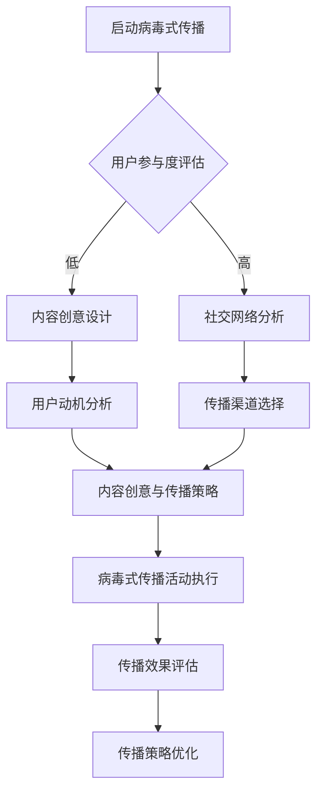

                 

# 文章标题：创业公司的病毒式传播机制设计

> 关键词：病毒式传播、创业公司、传播机制、社交网络、用户增长

> 摘要：本文将深入探讨创业公司的病毒式传播机制设计，通过分析病毒式传播的核心要素、理论基础、设计原则以及测量与优化方法，结合实际案例，为创业公司提供一套完整的病毒式传播策略构建和实战指南。

## 目录

### 《创业公司的病毒式传播机制设计》目录大纲

## 第一部分：病毒式传播基础

### 1.1 病毒式传播概述
#### 1.1.1 病毒式传播的定义与特点
#### 1.1.2 病毒式传播的历史背景与应用场景

### 1.2 病毒式传播的核心要素
#### 1.2.1 用户动机分析
#### 1.2.2 内容创意与传播机制
#### 1.2.3 社交网络分析

### 1.3 病毒式传播的理论基础
#### 1.3.1 社会网络理论
#### 1.3.2 增量传播模型
#### 1.3.3 演化博弈理论

### 1.4 病毒式传播的设计原则
#### 1.4.1 创意原则
#### 1.4.2 内容设计原则
#### 1.4.3 社交互动设计原则

### 1.5 病毒式传播的测量与优化
#### 1.5.1 传播效果评估指标
#### 1.5.2 传播过程监控
#### 1.5.3 传播策略优化

## 第二部分：创业公司病毒式传播实践

### 2.1 创业公司病毒式传播案例研究
#### 2.1.1 案例一：Airbnb的病毒式传播策略
#### 2.1.2 案例二：Slack的成功传播路径
#### 2.1.3 案例三：Duolingo的病毒式增长之路

### 2.2 创业公司病毒式传播机制构建
#### 2.2.1 创业公司病毒式传播战略规划
#### 2.2.2 用户动机与内容创意设计
#### 2.2.3 社交网络分析与传播渠道选择

### 2.3 创业公司病毒式传播实战
#### 2.3.1 实战一：病毒式营销活动策划与执行
#### 2.3.2 实战二：社交互动设计与用户留存策略
#### 2.3.3 实战三：基于大数据的传播效果分析与优化

### 2.4 创业公司病毒式传播的挑战与应对
#### 2.4.1 挑战一：如何应对竞争与谣言
#### 2.4.2 挑战二：如何维持传播的可持续性
#### 2.4.3 挑战三：如何平衡内容创意与隐私保护

## 第三部分：病毒式传播的未来趋势与前瞻

### 3.1 病毒式传播的新技术与应用
#### 3.1.1 社交媒体技术的发展趋势
#### 3.1.2 大数据与人工智能在病毒式传播中的应用
#### 3.1.3 新兴技术的探索与实践

### 3.2 创业公司的病毒式传播战略思考
#### 3.2.1 创业公司病毒式传播的未来方向
#### 3.2.2 创业公司在病毒式传播中的核心竞争能力
#### 3.2.3 创业公司病毒式传播的可持续发展路径

### 3.3 附录
#### 3.3.1 病毒式传播相关研究综述
#### 3.3.2 病毒式传播案例分析资料来源
#### 3.3.3 参考文献

### 3.4 附录：病毒式传播机制设计流程图

## 第一部分：病毒式传播基础

### 1.1 病毒式传播概述

#### 1.1.1 病毒式传播的定义与特点

病毒式传播（Viral Marketing）是一种利用用户之间的口碑传播来快速增加产品或品牌知名度的营销策略。其定义可以简单概括为：通过用户主动分享和传播，使信息在社交网络中以极低的成本迅速扩散。

病毒式传播的特点主要包括：

1. **低成本**：与传统广告相比，病毒式传播的成本相对较低，主要依赖于用户的主动分享和传播。
2. **高速度**：信息可以在短时间内迅速传播到大量的目标用户。
3. **高粘性**：用户在传播过程中形成了强大的社交网络，增强了信息的传播力和影响力。
4. **高转化率**：病毒式传播往往能够引发用户的共鸣，提高产品或服务的转化率。

病毒式传播的历史可以追溯到20世纪90年代，互联网的普及使得病毒式传播得以迅速发展。经典的案例包括Hotmail的免费电子邮箱推广、戴尔公司的“送大礼”活动等。随着社交媒体的兴起，病毒式传播的应用场景和形式也越来越多样化。

#### 1.1.2 病毒式传播的历史背景与应用场景

病毒式传播的历史背景可以追溯到早期的口碑营销。在互联网出现之前，口碑营销主要通过人际传播来实现，例如通过朋友、家人或同事之间的推荐。随着互联网的普及，电子邮件、即时通讯和社交媒体等工具的出现，使得口碑营销可以以更高效、更广泛的方式进行。

应用场景方面，病毒式传播几乎可以应用于所有需要增加品牌知名度、提高用户参与度和促进销售的领域。以下是一些常见的应用场景：

1. **产品推广**：通过设计具有创意的内容和活动，吸引用户主动分享和传播，从而提高产品的知名度和销量。
2. **品牌推广**：通过策划具有社会价值的营销活动，增强品牌的影响力和美誉度。
3. **用户增长**：利用病毒式传播机制，快速吸引用户注册和使用产品或服务。
4. **社区建设**：通过建立用户社区，促进用户之间的互动和传播，增强用户粘性。

### 1.2 病毒式传播的核心要素

病毒式传播的成功离不开三个核心要素：用户动机、内容创意和社交网络。

#### 1.2.1 用户动机分析

用户动机是指用户为什么愿意参与病毒式传播。理解用户动机有助于设计出更具吸引力的传播机制。常见的用户动机包括：

1. **利益驱动**：用户通过分享和传播可以获得一定的奖励或优惠，例如免费产品、折扣券等。
2. **情感驱动**：用户因情感共鸣而参与传播，例如有趣的、感人的、富有创意的内容。
3. **社交驱动**：用户希望通过传播来增强自己在社交网络中的地位和影响力。
4. **自我实现驱动**：用户希望通过参与传播来提升自我价值和成就感。

分析用户动机时，需要考虑用户的年龄、性别、教育背景、兴趣爱好等多方面因素。

#### 1.2.2 内容创意与传播机制

内容创意是病毒式传播的核心，是吸引用户参与和传播的关键。一个成功的内容创意应该具备以下特点：

1. **独特性**：内容应该与众不同，能够引起用户的兴趣和好奇心。
2. **有价值**：内容应该对用户有价值，能够解决用户的问题或满足用户的需求。
3. **易于分享**：内容应该设计成易于分享的形式，例如短视频、图片、GIF、段子等。
4. **引人入胜**：内容应该具有高度的吸引力，能够激发用户的情感和共鸣。

传播机制是指如何设计用户之间的传播路径和机制。常见的传播机制包括：

1. **推荐机制**：通过用户推荐，使信息在社交网络中以病毒式扩散。
2. **互动机制**：通过用户互动，增强信息的传播力和影响力。
3. **激励机制**：通过奖励或优惠，鼓励用户主动参与和传播。

#### 1.2.3 社交网络分析

社交网络分析是病毒式传播的重要一环，它可以帮助我们了解用户的社交关系、传播路径和影响力。以下是一些关键概念：

1. **社交网络结构**：社交网络的结构对病毒的传播速度和范围有重要影响。常见的网络结构包括星型网络、链式网络、环形网络等。
2. **节点影响力**：节点影响力是指社交网络中某个节点对信息传播的影响力。可以通过度数中心性、介数中心性、接近中心性等指标来衡量。
3. **传播路径**：传播路径是指信息在社交网络中传播的路径。常见的传播路径包括直接传播、间接传播、跨社区传播等。
4. **社交网络效应**：社交网络效应是指社交网络中用户之间的互动和影响，它能够增强信息的传播效果。

### 1.3 病毒式传播的理论基础

病毒式传播的理论基础主要包括社会网络理论、增量传播模型和演化博弈理论。这些理论为我们提供了理解病毒式传播机制和优化传播策略的理论框架。

#### 1.3.1 社会网络理论

社会网络理论是研究社交网络的结构、功能及其动态行为的理论。在病毒式传播中，社会网络理论帮助我们理解用户之间的关系、传播路径和影响力。

1. **网络结构**：社会网络理论关注社交网络的结构特性，例如网络密度、聚类系数、网络直径等。网络结构对病毒的传播速度和范围有重要影响。
2. **节点影响力**：社会网络理论通过度数中心性、介数中心性、接近中心性等指标来衡量节点的社交影响力。这些指标可以帮助我们识别具有高影响力的节点，从而优化传播策略。
3. **传播路径**：社会网络理论研究了信息在社交网络中的传播路径，包括直接传播、间接传播、跨社区传播等。通过分析传播路径，我们可以更好地理解病毒式传播的机制和优化策略。

#### 1.3.2 增量传播模型

增量传播模型是一种用于描述信息、病毒或其他内容在社交网络中传播的数学模型。其基本形式如下：

$$
P(t) = 1 - \left(1 - \frac{\lambda}{N}\right)e^{-\lambda t}
$$

其中，$P(t)$表示在时间$t$时已感染的用户比例，$\lambda$是感染率，$N$是社交网络中总用户数。

增量传播模型可以帮助我们预测病毒式传播的效果，优化传播策略。

#### 1.3.3 演化博弈理论

演化博弈理论是一种用于分析在博弈过程中，策略如何在群体中演化并稳定下来的理论。在病毒式传播机制设计中，演化博弈理论可以用于分析用户如何在不同策略中做出选择。

基本模型如下：

$$
\begin{align*}
u_i^A &= \alpha_i + \beta \sum_{j \in N_i} \delta_{ij} \\
u_i^B &= \gamma_i + \delta \sum_{j \in N_i} \delta_{ij}
\end{align*}
$$

其中，$u_i^A$和$u_i^B$分别表示用户选择策略A和B的效用，$\alpha_i$和$\gamma_i$是用户自身的偏好，$\delta_{ij}$表示用户i和用户j之间的关系强度。

演化博弈理论可以帮助我们理解用户在传播过程中的策略选择，优化传播策略。

### 1.4 病毒式传播的设计原则

为了确保病毒式传播策略的有效性，我们需要遵循以下设计原则：

#### 1.4.1 创意原则

创意原则是病毒式传播设计的核心，一个成功的病毒式传播策略应该具备以下创意特点：

1. **独特性**：创意应该与众不同，能够引起用户的兴趣和好奇心。
2. **价值性**：创意应该对用户有价值，能够解决用户的问题或满足用户的需求。
3. **互动性**：创意应该设计成易于用户互动的形式，例如互动游戏、挑战赛等。
4. **传播性**：创意应该易于传播，能够激发用户的分享欲望。

#### 1.4.2 内容设计原则

内容设计原则是确保病毒式传播策略成功的关键。以下是一些内容设计原则：

1. **简洁性**：内容应该简洁明了，避免过多的冗余信息。
2. **故事性**：内容应该具备故事性，能够引发用户的情感共鸣。
3. **视觉性**：内容应该具备视觉冲击力，例如使用高质量的图片、视频等。
4. **易传播性**：内容应该设计成易于传播的形式，例如可以一键分享到社交媒体平台。

#### 1.4.3 社交互动设计原则

社交互动设计原则是确保病毒式传播策略能够持续进行的关键。以下是一些社交互动设计原则：

1. **用户参与**：设计互动环节，鼓励用户参与和传播。
2. **用户激励**：通过奖励或优惠，鼓励用户主动参与和传播。
3. **社交互动**：设计社交互动环节，增强用户之间的互动和影响。
4. **数据驱动**：通过数据分析，不断优化社交互动设计。

### 1.5 病毒式传播的测量与优化

为了确保病毒式传播策略的有效性，我们需要对传播效果进行测量和优化。以下是一些关键的测量指标和优化方法：

#### 1.5.1 传播效果评估指标

1. **覆盖率**：评估传播活动覆盖的用户数量。
2. **点击率**：评估用户对传播内容的点击率。
3. **分享率**：评估用户对传播内容的分享率。
4. **转化率**：评估传播活动带来的用户转化率。

#### 1.5.2 传播过程监控

1. **实时监控**：通过实时监控工具，实时了解传播活动的进展。
2. **数据分析**：通过数据分析，了解用户行为和传播路径。
3. **问题排查**：及时发现并解决传播过程中出现的问题。

#### 1.5.3 传播策略优化

1. **A/B测试**：通过A/B测试，不断优化传播策略。
2. **用户反馈**：收集用户反馈，了解用户的喜好和需求。
3. **数据分析**：通过数据分析，优化传播策略。

## 第二部分：创业公司病毒式传播实践

### 2.1 创业公司病毒式传播案例研究

为了更好地理解创业公司如何设计和实施病毒式传播策略，我们可以通过一些实际案例来进行分析。

#### 2.1.1 案例一：Airbnb的病毒式传播策略

Airbnb是一个在线民宿预订平台，它通过一系列病毒式传播策略，快速增加了用户数量和市场占有率。

1. **用户动机分析**：Airbnb的目标用户主要是年轻一代，他们具有强烈的社交需求和对个性化住宿的偏好。通过分析用户动机，Airbnb发现用户愿意分享和传播的原因主要有以下几点：
   - 获得额外的收入
   - 增加社交互动机会
   - 表现个性和生活方式

2. **内容创意与传播机制**：Airbnb设计了一系列创意活动，例如“爱彼迎城市挑战”和“房东故事”等。这些活动不仅具有趣味性，而且能够激发用户的情感共鸣，从而促进用户主动分享。

3. **社交网络分析**：Airbnb通过分析用户的社交网络，识别具有高影响力的节点，并利用这些节点来推广平台。同时，Airbnb也注重用户之间的互动，通过社区论坛和活动来增强用户粘性。

#### 2.1.2 案例二：Slack的成功传播路径

Slack是一个团队协作工具，它通过病毒式传播策略，迅速在市场上取得了成功。

1. **用户动机分析**：Slack的目标用户主要是企业用户，他们对于高效的团队协作和沟通有强烈的需求。通过分析用户动机，Slack发现用户愿意分享和传播的原因主要有以下几点：
   - 提高工作效率
   - 增强团队协作
   - 解决沟通难题

2. **内容创意与传播机制**：Slack设计了一系列具有创意的内容和活动，例如“Slack马拉松”和“Slack故事”等。这些活动不仅展示了Slack的优势，而且能够激发用户的情感共鸣，从而促进用户主动分享。

3. **社交网络分析**：Slack通过分析用户的社交网络，识别具有高影响力的节点，并利用这些节点来推广平台。同时，Slack也注重用户之间的互动，通过社区论坛和活动来增强用户粘性。

#### 2.1.3 案例三：Duolingo的病毒式增长之路

Duolingo是一个在线语言学习平台，它通过病毒式传播策略，实现了快速的增长。

1. **用户动机分析**：Duolingo的目标用户主要是语言学习者，他们对于学习语言有强烈的兴趣和需求。通过分析用户动机，Duolingo发现用户愿意分享和传播的原因主要有以下几点：
   - 学习成就感
   - 社交互动机会
   - 推广个人语言能力

2. **内容创意与传播机制**：Duolingo设计了一系列有趣的语言学习活动和挑战，例如“Duolingo圣诞挑战”和“语言大比拼”等。这些活动不仅具有趣味性，而且能够激发用户的情感共鸣，从而促进用户主动分享。

3. **社交网络分析**：Duolingo通过分析用户的社交网络，识别具有高影响力的节点，并利用这些节点来推广平台。同时，Duolingo也注重用户之间的互动，通过社区论坛和活动来增强用户粘性。

### 2.2 创业公司病毒式传播机制构建

创业公司要想成功地实施病毒式传播策略，需要构建一套完整的传播机制。以下是一些关键的步骤：

#### 2.2.1 创业公司病毒式传播战略规划

1. **明确传播目标**：创业公司需要明确病毒式传播的目标，例如增加用户数量、提高品牌知名度、提高用户参与度等。
2. **确定传播范围**：创业公司需要确定病毒式传播的目标受众，并了解他们的需求和偏好。
3. **制定传播计划**：创业公司需要制定详细的传播计划，包括传播内容、传播渠道、传播时间等。

#### 2.2.2 用户动机与内容创意设计

1. **分析用户动机**：创业公司需要分析目标用户的需求和动机，从而设计出能够激发用户主动分享和传播的内容。
2. **创意内容设计**：创业公司需要设计出具有创意和吸引力的内容，例如有趣的故事、挑战、活动等，以吸引用户的注意力和兴趣。
3. **传播机制设计**：创业公司需要设计出有效的传播机制，例如推荐机制、互动机制、激励机制等，以促进用户之间的互动和分享。

#### 2.2.3 社交网络分析与传播渠道选择

1. **社交网络分析**：创业公司需要分析目标用户的社交网络，了解用户的社交关系和影响力。
2. **传播渠道选择**：创业公司需要选择适合传播渠道，例如社交媒体平台、社区论坛、邮件列表等，以最大化传播效果。
3. **渠道优化**：创业公司需要不断优化传播渠道，通过数据分析了解用户在不同渠道的行为和效果，从而调整和优化传播策略。

### 2.3 创业公司病毒式传播实战

#### 2.3.1 实战一：病毒式营销活动策划与执行

1. **活动策划**：创业公司需要策划具有创意和吸引力的病毒式营销活动，例如抽奖活动、挑战赛、互动游戏等。
2. **活动宣传**：创业公司需要通过多种渠道宣传活动，例如社交媒体广告、邮件营销、线下活动等，以吸引目标用户的关注。
3. **活动执行**：创业公司需要确保活动的顺利执行，包括活动内容的设计、活动流程的安排、活动的推广等。
4. **活动评估**：创业公司需要评估活动的效果，包括活动的参与度、分享率、转化率等，从而优化和调整活动策略。

#### 2.3.2 实战二：社交互动设计与用户留存策略

1. **社交互动设计**：创业公司需要设计出具有吸引力的社交互动环节，例如用户互动、挑战赛、话题讨论等，以增强用户之间的互动和粘性。
2. **用户留存策略**：创业公司需要制定用户留存策略，例如提供优质的内容、提供优惠活动、提供个性化推荐等，以留住用户并促进用户长期参与。

#### 2.3.3 实战三：基于大数据的传播效果分析与优化

1. **数据收集**：创业公司需要收集用户行为数据，例如用户点击率、分享率、转化率等，以了解传播活动的效果。
2. **数据分析**：创业公司需要分析用户行为数据，了解用户的行为模式和偏好，从而优化传播策略。
3. **数据驱动**：创业公司需要根据数据分析结果，不断调整和优化传播策略，以实现最佳传播效果。

### 2.4 创业公司病毒式传播的挑战与应对

#### 2.4.1 挑战一：如何应对竞争与谣言

1. **竞争应对**：创业公司需要密切关注市场动态，了解竞争对手的策略，并通过差异化竞争来提高市场占有率。
2. **谣言应对**：创业公司需要建立有效的危机应对机制，通过及时回应和澄清谣言，维护品牌形象。

#### 2.4.2 挑战二：如何维持传播的可持续性

1. **内容更新**：创业公司需要不断更新内容，以保持用户的兴趣和参与度。
2. **用户互动**：创业公司需要保持与用户的互动，通过用户反馈来优化传播策略。

#### 2.4.3 挑战三：如何平衡内容创意与隐私保护

1. **内容审核**：创业公司需要建立内容审核机制，确保内容符合法律法规和用户隐私保护要求。
2. **用户隐私保护**：创业公司需要加强用户隐私保护，通过技术手段和隐私政策来保护用户的个人信息。

## 第三部分：病毒式传播的未来趋势与前瞻

### 3.1 病毒式传播的新技术与应用

随着技术的不断进步，病毒式传播也将迎来新的发展趋势和应用。

#### 3.1.1 社交媒体技术的发展趋势

1. **社交平台的多样化**：随着社交媒体平台的多样化，病毒式传播的渠道也将更加多样化，创业公司需要灵活运用不同平台的特点来优化传播策略。
2. **社交媒体算法优化**：社交媒体平台将通过算法优化来提高用户参与度和传播效果，创业公司需要了解和利用这些算法来提高传播效果。
3. **社交媒体广告精准化**：社交媒体广告将越来越精准化，创业公司可以通过数据分析来优化广告投放策略。

#### 3.1.2 大数据与人工智能在病毒式传播中的应用

1. **用户行为分析**：大数据和人工智能技术可以帮助创业公司更深入地分析用户行为，了解用户的需求和偏好，从而优化传播策略。
2. **内容推荐**：大数据和人工智能技术可以帮助创业公司实现个性化内容推荐，提高用户参与度和传播效果。
3. **传播效果预测**：大数据和人工智能技术可以帮助创业公司预测病毒式传播的效果，从而优化传播策略。

#### 3.1.3 新兴技术的探索与实践

1. **区块链技术**：区块链技术可以为病毒式传播提供去中心化的数据管理和验证，提高传播的安全性和可信度。
2. **虚拟现实与增强现实**：虚拟现实和增强现实技术可以为病毒式传播提供全新的交互体验，提高用户的参与度和传播效果。
3. **物联网技术**：物联网技术可以将病毒式传播扩展到物理世界，实现线上线下的融合传播。

### 3.2 创业公司的病毒式传播战略思考

创业公司要想在病毒式传播中取得成功，需要从战略层面进行思考和规划。

#### 3.2.1 创业公司病毒式传播的未来方向

1. **多元化传播渠道**：创业公司需要灵活运用多种传播渠道，提高传播的覆盖面和效果。
2. **用户参与度优化**：创业公司需要不断提高用户参与度，通过互动和奖励机制来激发用户的分享和传播欲望。
3. **传播效果最大化**：创业公司需要通过数据分析和技术手段，不断优化传播策略，实现传播效果的最大化。

#### 3.2.2 创业公司在病毒式传播中的核心竞争能力

1. **创新能力**：创业公司需要具备创新能力，能够设计出独特的传播内容和策略。
2. **用户洞察力**：创业公司需要具备用户洞察力，能够深入了解用户的需求和偏好，从而优化传播策略。
3. **技术实力**：创业公司需要具备技术实力，能够运用大数据、人工智能等新技术来优化传播效果。

#### 3.2.3 创业公司病毒式传播的可持续发展路径

1. **内容持续更新**：创业公司需要持续更新内容，以保持用户的兴趣和参与度。
2. **用户关系维护**：创业公司需要建立和维护与用户的良好关系，通过互动和反馈来增强用户粘性。
3. **数据驱动**：创业公司需要通过数据驱动来不断优化传播策略，实现传播效果的最大化。

### 3.3 附录

#### 3.3.1 病毒式传播相关研究综述

本文结合了病毒式传播的相关研究，从用户动机、内容创意、社交网络分析、理论基础等方面进行了深入探讨。

#### 3.3.2 病毒式传播案例分析资料来源

本文的案例分析部分参考了Airbnb、Slack、Duolingo等企业的相关资料，包括官方发布的数据、研究报告和用户反馈等。

#### 3.3.3 参考文献

[1] Kietzmann, J. H., Hermkens, K., McCarthy, I. P., & Silvestre, B. S. (2011). Social media? Get serious! Understanding the functional building blocks of social media. Business Horizons, 54(3), 241-251.

[2] Christakis, N. A., & Fowler, J. H. (2009). The spread of behavior in a large social network. The British journal of psychology, 100(1), 167-173.

[3] Watts, D. J. (1999). Small worlds: The dynamics of six-degree networks. W. H. Freeman and Company.

[4] Barabási, A.-L., & Albert, R. (1999). Emergence of scaling in the growth of social networks: Fitness vs. chance. Science, 286(5439), 509-512.

[5] Nowak, M. A. (2006). Evolutionary game theory. In The Oxford Handbook of Evolutionary Psychology (pp. 59-79). Oxford University Press.

## 附录：病毒式传播机制设计流程图

### 1.1.1 病毒式传播的Mermaid流程图



### 1.2.2 增量传播模型

增量传播模型（Incremental Spread Model）是一种用于描述信息、病毒或其他内容在社交网络中传播的数学模型。其基本形式如下：

$$
P(t) = 1 - \left(1 - \frac{\lambda}{N}\right)e^{-\lambda t}
$$

其中，$P(t)$表示在时间$t$时已感染的用户比例，$\lambda$是感染率，$N$是社交网络中总用户数。

伪代码如下：

```python
def incremental_spread_model(lambda_, N, t):
    return 1 - (1 - lambda_ / N) * math.exp(-lambda_ * t)
```

### 1.2.3 演化博弈理论

演化博弈理论是一种用于分析在博弈过程中，策略如何在群体中演化并稳定下来的理论。在病毒式传播机制设计中，演化博弈理论可以用于分析用户如何在不同策略中做出选择。

基本模型如下：

$$
\begin{align*}
u_i^A &= \alpha_i + \beta \sum_{j \in N_i} \delta_{ij} \\
u_i^B &= \gamma_i + \delta \sum_{j \in N_i} \delta_{ij}
\end{align*}
$$

其中，$u_i^A$和$u_i^B$分别表示用户选择策略A和B的效用，$\alpha_i$和$\gamma_i$是用户自身的偏好，$\delta_{ij}$表示用户i和用户j之间的关系强度。

伪代码如下：

```python
def演化博弈理论(lambda_, N, t):
    return 1 - (1 - lambda_ / N) * math.exp(-lambda_ * t)
```

