                 

### 文章标题

《创业公司的社交媒体内容策略：从创意到优化的一站式指南》

#### 关键词

- 社交媒体内容策略
- 创业公司
- 内容创意
- 内容策划
- 内容制作
- 社交互动
- 内容分析
- 优化调整

### 摘要

本文旨在为创业公司提供一套完整的社交媒体内容策略指南，从内容创意到优化调整，每个环节都进行了详细的分析和讲解。文章分为三个主要部分：社交媒体内容策略概述、社交媒体内容策略执行、社交媒体内容策略评估与优化。通过这篇文章，创业公司可以系统地了解如何有效地利用社交媒体平台提升品牌影响力、增加用户互动，并通过数据分析不断优化内容策略，实现业务目标。作者AI天才研究院，结合多年的研究和实践经验，为广大创业公司提供了实用的方法和案例，助力他们在竞争激烈的市场中脱颖而出。

### 《创业公司的社交媒体内容策略》目录大纲

#### 第一部分：社交媒体内容策略概述

##### 第1章：社交媒体内容策略的重要性

1.1 社交媒体在创业公司中的价值

- 社交媒体的角色和作用
- 提高品牌知名度的方法
- 社交媒体内容与用户互动的重要性

1.2 创业公司的社交媒体目标设定

- 确定目标受众
- 制定可衡量的目标
- 内容策略与业务目标的一致性

1.3 社交媒体内容策略的基本原则

- 内容创意与创新
- 内容多样化与一致性
- 用户参与与互动

#### 第二部分：社交媒体内容策略执行

##### 第2章：内容创意与策划

2.1 内容创意的灵感来源

- 受众研究
- 竞争对手分析
- 市场趋势洞察

2.2 内容策划与规划

- 内容日历制定
- 内容主题与风格
- 内容发布频率

2.3 创意案例解析

- 成功案例分析
- 创意内容评估

##### 第3章：内容制作与优化

3.1 文字内容的撰写技巧

- 文字风格与品牌定位
- 抓眼球的标题与开头
- 语言简洁明了

3.2 视觉内容的设计原则

- 图像与视频的运用
- 色彩与版式设计
- 动画与互动元素

3.3 内容优化与SEO

- 关键词策略
- 标签与分类
- 网站链接优化

##### 第4章：社交媒体互动策略

4.1 用户互动的重要性

- 用户反馈收集
- 用户参与度提升
- 增强用户忠诚度

4.2 互动策略的制定

- 回复与互动技巧
- 社交媒体客服
- 用户社区管理

4.3 互动案例解析

- 成功互动案例分析
- 互动效果评估

#### 第三部分：社交媒体内容策略评估与优化

##### 第5章：社交媒体内容分析工具

5.1 内容分析的重要性

- 数据驱动的决策
- 内容效果评估
- 优化策略的制定

5.2 常见内容分析工具介绍

- 社交媒体分析工具对比
- 数据提取与可视化
- 数据分析技巧

##### 第6章：内容策略的评估与调整

6.1 内容效果评估指标

- 点击率（CTR）
- 转化率（CVR）
- 社交分享次数

6.2 内容策略调整方法

- 数据驱动的策略调整
- 竞争对手分析
- 市场趋势分析

6.3 内容策略持续优化

- 定期评估与反馈
- 保持内容创意与创新
- 持续学习与迭代

##### 第7章：社交媒体内容策略的案例分析

7.1 成功案例分享

- 不同行业的成功案例分析
- 创业公司的成功案例研究

7.2 失败案例分析

- 社交媒体策略失败的案例分析
- 失败原因与改进建议

7.3 内容策略的综合应用

- 多平台内容策略整合
- 跨界合作与内容共创
- 持续优化与创新的实践

### 附录

##### 附录 A：社交媒体内容策略工具与资源

- 社交媒体平台工具
- 内容创作与编辑工具
- 数据分析工具与资源

##### 附录 B：社交媒体内容策略常见问题与解答

- 内容创作与发布常见问题
- 互动策略常见问题
- 数据分析与应用常见问题

##### 附录 C：社交媒体内容策略实用模板

- 内容策划与发布模板
- 用户互动模板
- 数据分析报告模板### 第1章：社交媒体内容策略的重要性

社交媒体在当今商业环境中扮演着至关重要的角色，尤其在创业公司中，社交媒体不仅是品牌传播的重要渠道，更是与用户互动、建立品牌忠诚度和提高市场份额的关键工具。以下将详细探讨社交媒体内容策略在创业公司中的价值、重要性及其关键要素。

#### 1.1 社交媒体在创业公司中的价值

**1.1.1 品牌知名度提升**

社交媒体是创业公司快速提升品牌知名度的有效途径。通过发布高质量的内容，创业公司可以吸引潜在客户的注意力，增加品牌的曝光率。例如，创业公司可以利用平台如Facebook、Instagram、Twitter等，定期发布与品牌相关的动态、新闻、产品信息等，让更多用户了解品牌，从而提高品牌知名度。

**1.1.2 用户互动与忠诚度建立**

社交媒体不仅是一个宣传平台，还是一个与用户互动的重要场所。创业公司可以通过社交媒体与用户进行实时沟通，了解用户需求，收集用户反馈，从而不断优化产品和服务。这种互动有助于建立用户对品牌的忠诚度，提高用户的重复购买率。

**1.1.3 市场洞察与趋势分析**

社交媒体是获取市场信息和洞察的重要来源。创业公司可以通过分析用户在社交媒体上的行为、评论和互动，了解市场需求和趋势，从而调整营销策略和产品开发方向，更好地满足用户需求。

**1.1.4 转化与销售**

社交媒体不仅是品牌宣传的平台，也是一个潜在的销售额来源。创业公司可以通过社交媒体发布优惠活动、限时折扣等信息，吸引用户进行购买。此外，社交媒体上的链接可以直接引导用户到产品页面或在线商店，实现销售转化。

#### 1.2 创业公司的社交媒体目标设定

为了有效地利用社交媒体，创业公司需要明确社交媒体的目标，并确保这些目标与公司的整体业务目标一致。以下是如何设定社交媒体目标的步骤：

**1.2.1 确定目标受众**

了解目标受众是制定社交媒体目标的第一步。创业公司需要明确目标受众的年龄、性别、兴趣、职业等信息，以便制定针对性的内容策略。

**1.2.2 制定可衡量的目标**

社交媒体目标应该是具体、可衡量的。例如，目标可以是增加1000个关注者、提升网站流量20%、提高转化率30%等。这些目标有助于评估社交媒体策略的效果。

**1.2.3 内容策略与业务目标的一致性**

社交媒体内容策略应该与公司的业务目标保持一致。例如，如果公司的业务目标是增加销售，那么社交媒体内容应侧重于产品推广和促销活动。如果目标是提升品牌知名度，那么内容应侧重于品牌宣传和用户互动。

#### 1.3 社交媒体内容策略的基本原则

成功的社交媒体内容策略需要遵循以下基本原则：

**1.3.1 内容创意与创新**

创意是吸引受众的关键。创业公司需要不断创造新颖、有趣的内容，以吸引用户的关注。例如，可以尝试使用故事叙述、视频内容、互动游戏等方式，提高内容的吸引力。

**1.3.2 内容多样化与一致性**

内容多样化有助于吸引不同类型的受众，提高用户的参与度。同时，内容策略应保持一致性，确保品牌形象和风格始终如一。

**1.3.3 用户参与与互动**

用户参与是社交媒体的核心。创业公司需要鼓励用户参与内容互动，例如通过评论、点赞、分享等方式，提高用户忠诚度和品牌影响力。

通过以上分析，可以看出社交媒体内容策略对于创业公司的重要性。一个有效的社交媒体内容策略不仅能提升品牌知名度，还能建立用户忠诚度，实现业务目标。在接下来的章节中，我们将进一步探讨如何执行和优化社交媒体内容策略。|>image_spacer|>

#### 1.1 社交媒体在创业公司中的角色和作用

社交媒体在创业公司中扮演着多重角色，是构建品牌、推广产品、与用户互动以及实现业务增长的重要工具。以下是社交媒体在创业公司中的具体角色和作用：

**1.1.1 品牌塑造**

社交媒体是创业公司塑造品牌形象的重要平台。通过精心设计的内容发布策略，创业公司可以向公众传递品牌的核心价值、使命和愿景。例如，通过Facebook、Instagram等平台，创业公司可以发布关于企业文化的文章、团队活动照片和员工故事，从而塑造一个积极、亲和且专业的品牌形象。

**1.1.2 产品推广**

社交媒体为创业公司提供了一个直接向目标用户推广产品的渠道。通过发布产品介绍、使用教程、用户反馈等内容，创业公司可以吸引潜在客户，提高产品认知度。例如，在YouTube上发布高质量的产品视频，可以让用户更好地了解产品功能和使用方法，从而提高购买意愿。

**1.1.3 用户互动**

社交媒体是一个与用户互动、收集反馈的宝贵渠道。创业公司可以通过社交媒体平台与用户进行实时沟通，了解他们的需求和意见，从而改进产品和服务。例如，创业公司可以在Twitter上开设客服账号，及时回应用户的疑问和投诉，提升用户体验。

**1.1.4 增加流量和转化率**

通过社交媒体的推广，创业公司可以吸引更多的流量到其网站或在线商店，从而提高转化率。社交媒体上的推广活动，如发布优惠信息、促销链接、互动活动等，可以直接引导用户进行购买或注册。例如，创业公司可以在Instagram上发布限时折扣信息，吸引粉丝点击链接进行购买。

**1.1.5 建立社群和社区**

社交媒体可以帮助创业公司建立一个忠实的社群和社区。通过创建粉丝群、互动话题、线上活动等方式，创业公司可以与用户建立更深层次的联系，增强用户忠诚度。例如，创业公司可以在Facebook上创建一个品牌粉丝群，定期组织线上互动活动，让用户感受到品牌的温暖和关怀。

**1.1.6 数据分析**

社交媒体提供了丰富的数据分析工具，帮助创业公司了解用户行为、内容效果和推广效果。通过分析这些数据，创业公司可以不断优化内容策略，提高营销效率。例如，通过分析Twitter上的用户互动数据，创业公司可以了解哪些内容更受欢迎，从而调整内容发布策略。

**1.1.7 网络营销策略整合**

社交媒体是网络营销策略的重要组成部分。创业公司可以通过社交媒体与其他营销渠道（如电子邮件、SEO、内容营销等）整合，实现全渠道营销。例如，创业公司可以在发布社交媒体内容的同时，通过电子邮件通知订阅用户，引导用户进行互动和购买。

总之，社交媒体在创业公司中的角色和作用是多样化的，它不仅帮助创业公司塑造品牌、推广产品、与用户互动，还提供了丰富的数据分析工具，助力创业公司在竞争激烈的市场中取得成功。在接下来的部分，我们将探讨如何制定和实现社交媒体目标。|>image_spacer|>

#### 1.2 创业公司的社交媒体目标设定

为了确保社交媒体策略的有效性，创业公司需要明确具体的社交媒体目标，并将这些目标与公司的整体业务目标紧密结合起来。以下是设定社交媒体目标的步骤：

**1.2.1 确定目标受众**

首先，创业公司需要明确目标受众，包括他们的年龄、性别、地理位置、兴趣爱好、职业等信息。这些信息可以通过市场调研、用户调查、数据分析等方式获取。例如，如果创业公司提供的是面向年轻人的时尚产品，那么目标受众可能是年龄在18-35岁之间的女性，她们关注时尚和美妆。

**1.2.2 制定可衡量的目标**

一旦明确了目标受众，创业公司需要设定具体、可衡量的社交媒体目标。这些目标可以是定量的，如增加1000个新关注者、提高网站流量30%等，也可以是定性的，如提高用户参与度、增强品牌影响力等。例如，创业公司可以设定一个目标：在三个月内，将Twitter关注者数量从500增加到1500，同时提高用户互动率。

**1.2.3 确保内容策略与业务目标一致**

社交媒体目标应与公司的整体业务目标保持一致。例如，如果公司的业务目标是增加销售额，那么社交媒体目标可以包括提高转化率和促进产品销售。如果公司的业务目标是提高品牌知名度，那么社交媒体目标可以包括增加品牌提及次数和提升搜索排名。

**1.2.4 设定短期和长期目标**

创业公司的社交媒体目标应包括短期和长期目标。短期目标通常是一年内可以实现的目标，如增加新关注者、提高用户参与度等。长期目标则是三年或五年内可以实现的目标，如建立品牌权威、提高市场份额等。设定短期和长期目标有助于创业公司保持对社交媒体策略的持续关注和优化。

**1.2.5 制定可执行的策略和计划**

为了实现社交媒体目标，创业公司需要制定具体的策略和计划。这包括内容策划、发布频率、推广活动、数据分析等。例如，如果目标是在三个月内增加1500个Twitter关注者，创业公司可以制定以下策略：每周发布5条原创内容，每天回复10条用户评论，每月进行一次互动活动，如问答环节或抽奖活动。

**1.2.6 监测和评估目标进展**

创业公司需要定期监测和评估社交媒体目标的进展。这可以通过社交媒体分析工具完成，如Twitter Analytics、Facebook Insights等。监测和评估可以帮助创业公司了解哪些策略有效，哪些需要调整。例如，如果发现某次互动活动的参与率较低，创业公司可以调整活动形式或时间，以提高参与度。

通过以上步骤，创业公司可以设定明确、具体的社交媒体目标，并制定可行的策略和计划，从而实现业务增长和品牌提升。在下一部分，我们将探讨社交媒体内容策略的基本原则。|>image_spacer|>

#### 1.3 社交媒体内容策略的基本原则

一个成功的社交媒体内容策略需要遵循一系列基本原则，以确保内容既吸引受众，又能实现业务目标。以下是创业公司在制定社交媒体内容策略时应遵循的基本原则：

**1.3.1 内容创意与创新**

创意和创新是社交媒体内容的核心。通过创造新颖、有趣且富有创意的内容，创业公司可以吸引更多的关注和参与。以下是一些创意和创新的建议：

- **故事叙述**：通过讲述品牌故事、产品故事或用户故事，建立情感连接。
- **互动内容**：设计互动性强的内容，如问答、投票、挑战等，鼓励用户参与。
- **视频内容**：视频内容因其直观性和互动性，成为吸引用户的重要手段。
- **视觉内容**：使用高质量的图像、图表和插图，提高内容的吸引力。

**1.3.2 内容多样化与一致性**

内容多样化有助于吸引不同类型的受众，而一致性则有助于建立品牌形象。以下是如何实现内容多样化与一致性的建议：

- **多形式内容**：结合文字、图片、视频、音频等多种形式，满足不同用户的偏好。
- **多渠道发布**：在多个社交媒体平台上发布内容，扩大品牌影响力。
- **品牌风格**：确保所有发布的内容都符合品牌风格和调性，增强品牌认知度。

**1.3.3 用户参与与互动**

用户参与和互动是社交媒体的核心价值之一。以下是一些提高用户参与度和互动的建议：

- **积极回应**：及时回复用户的评论和私信，展示对用户的关心和重视。
- **互动活动**：定期举办线上活动，如抽奖、问答、直播等，鼓励用户参与。
- **用户社区**：建立一个用户社区，如Facebook群组或Reddit论坛，让用户可以自由交流。
- **用户反馈**：鼓励用户提供反馈，并根据反馈优化产品和服务。

**1.3.4 内容质量与实用性**

高质量的内容是吸引用户和提升品牌价值的关键。以下是如何提高内容质量和实用性的建议：

- **信息准确**：确保发布的信息准确无误，避免误导用户。
- **内容相关**：发布与品牌和受众相关的内容，提高内容的实用性和相关性。
- **深度内容**：提供深入、有价值的内容，解决用户的问题和需求。

**1.3.5 数据驱动**

数据是优化社交媒体内容策略的重要依据。以下是如何利用数据优化的建议：

- **分析工具**：使用社交媒体分析工具，如Twitter Analytics、Facebook Insights等，了解用户行为和内容效果。
- **A/B测试**：通过A/B测试，比较不同内容的性能，找出最有效的策略。
- **数据反馈**：根据数据分析结果，不断调整和优化内容策略。

**1.3.6 跨渠道整合**

跨渠道整合可以提升品牌的一致性和覆盖面。以下是如何实现跨渠道整合的建议：

- **内容同步**：确保在各个渠道上发布的内容一致，避免信息冲突。
- **渠道优势**：根据不同社交媒体平台的特点，制定针对性的内容策略。
- **渠道联动**：通过跨渠道推广活动，如社交媒体上的优惠码或线上活动的推广，吸引更多用户参与。

通过遵循这些基本原则，创业公司可以制定出既吸引受众又实现业务目标的高效社交媒体内容策略。在接下来的章节中，我们将深入探讨如何执行这些策略的具体方法和技巧。|>image_spacer|>

### 第2章：内容创意与策划

内容创意与策划是社交媒体内容策略中的关键环节，决定了内容能否吸引目标受众并实现营销目标。在这一章节中，我们将探讨如何获取内容创意的灵感来源，以及如何进行内容策划与规划。

#### 2.1 内容创意的灵感来源

内容创意的灵感来源广泛，以下是几种常见的方法：

**2.1.1 受众研究**

了解目标受众的兴趣、需求和偏好是内容创意的重要基础。通过市场调研、用户调查、数据分析等方法，可以深入了解目标受众的特征，从而创作出更加精准和吸引人的内容。

**2.1.2 竞争对手分析**

研究竞争对手的内容策略和创意，可以借鉴他们的优点，避免重复错误。例如，分析竞争对手的标题、内容形式、互动方式等，可以为自己的内容策划提供灵感和参考。

**2.1.3 市场趋势洞察**

关注市场动态和流行趋势，可以抓住机会，创作出符合当前市场需求的内容。例如，在某个节日或热点事件期间，可以发布相关主题的内容，吸引更多用户关注。

**2.1.4 热点事件**

借助热点事件，可以快速吸引受众的注意力。例如，利用新闻事件、社交媒体热点等，创作相关内容，提高内容的曝光率和参与度。

**2.1.5 公司内部资源**

公司的产品特性、企业文化、员工故事等内部资源也是内容创意的宝贵来源。通过讲述品牌故事、分享员工经历等，可以增强用户对品牌的认同感和归属感。

#### 2.2 内容策划与规划

内容策划与规划是确保社交媒体内容有序、高效发布的关键步骤。以下是如何进行内容策划与规划的步骤：

**2.2.1 内容日历制定**

内容日历是规划内容发布的重要工具。通过制定内容日历，可以提前规划内容的主题、形式、发布时间等，确保内容发布有序且符合营销策略。以下是如何制定内容日历的步骤：

- **确定内容主题**：根据公司的营销目标和受众需求，确定每月或每周的内容主题。
- **分配内容形式**：根据内容主题，确定文字、图片、视频、直播等形式的内容，确保内容多样化。
- **规划发布时间**：根据受众活跃时间和内容形式，合理安排发布时间，提高内容的曝光率和参与度。
- **预留互动时间**：在内容发布后，预留一定时间进行用户互动和反馈收集。

**2.2.2 内容主题与风格**

内容主题与风格是品牌形象的重要组成部分。确定内容主题与风格，有助于塑造品牌形象，提高用户对品牌的认知和认同。以下是如何确定内容主题与风格的建议：

- **分析目标受众**：根据目标受众的兴趣和需求，确定内容主题和风格。
- **品牌调性**：确保内容主题与风格符合公司的品牌调性和价值观。
- **创新与多样化**：在保持品牌一致性的同时，尝试创新和多样化的内容风格，以吸引更多用户。

**2.2.3 内容发布频率**

内容发布频率是影响内容效果的重要因素。合理的发布频率可以提高用户粘性，增强品牌影响力。以下是如何确定内容发布频率的建议：

- **分析受众需求**：根据目标受众的需求和期望，确定合理的发布频率。
- **考虑内容形式**：不同形式的内容发布频率可能有所不同，例如，视频内容可以每周发布一次，而文字内容可以每天或每周发布。
- **保持一致性**：确保发布频率稳定，避免过度发布或缺乏更新，影响用户体验。

通过以上步骤，创业公司可以有效地进行内容创意与策划，为后续的内容制作和发布打下坚实基础。在下一章节中，我们将探讨如何进行内容制作与优化。|>image_spacer|>

#### 2.3 创意案例解析

在社交媒体内容策略中，了解和分析成功的创意案例对于创业公司制定自己的内容策略至关重要。以下是一些成功案例的解析，以及如何评估这些创意内容的实际效果。

**2.3.1 案例一：可口可乐的“瓶身定制”活动**

**案例描述**：可口可乐在社交媒体上推出了“瓶身定制”活动，用户可以在可口可乐的官方Facebook页面上上传自己的照片，定制独一无二的瓶身设计。这个活动不仅吸引了大量用户的参与，还增加了用户对品牌的互动和忠诚度。

**成功原因**：
- **互动性强**：用户可以通过定制瓶身设计，直接参与到品牌活动中，提高了用户参与度。
- **社交属性**：定制后的瓶身可以分享到社交媒体上，增加了品牌曝光率。
- **情感共鸣**：用户参与活动时，会产生对品牌的情感共鸣，提高了用户忠诚度。

**效果评估**：
- **参与度**：活动期间，可口可乐的Facebook页面互动量显著增加，活动帖子的参与度远高于平均水平。
- **用户反馈**：通过收集用户反馈，可口可乐了解到用户对活动的满意度和参与体验，为后续活动提供了参考。
- **品牌认知**：活动后，可口可乐的品牌认知度在目标受众中得到了提升，进一步增强了品牌影响力。

**2.3.2 案例二：耐克的“Just Do It”挑战**

**案例描述**：耐克在社交媒体上发起了“Just Do It”挑战，鼓励用户在Instagram上分享自己的运动瞬间，并使用特定的标签参与活动。这个挑战不仅吸引了大量用户的参与，还提高了品牌在年轻群体中的影响力。

**成功原因**：
- **品牌调性**：挑战紧扣耐克的品牌调性，鼓励用户积极向上，勇于挑战自我。
- **互动性**：用户通过分享运动瞬间，可以与耐克和其他用户建立情感连接，增加了互动性。
- **内容多样**：用户分享的内容形式多样，包括图片、视频、文字等，丰富了品牌的内容库。

**效果评估**：
- **参与度**：活动期间，耐克的Instagram参与度显著增加，挑战帖子的互动量远超平均水平。
- **品牌认知**：通过挑战，耐克在目标受众中的品牌认知度得到了提升，进一步巩固了品牌在运动领域的地位。
- **用户忠诚度**：用户参与挑战后，对耐克的品牌忠诚度有所提高，一些用户甚至在社交媒体上成为耐克的品牌大使。

**2.3.3 案例三：红 bull的“挑战极限”系列视频**

**案例描述**：红 bull 在社交媒体上发布了多个“挑战极限”系列视频，展示了各种极限运动和冒险活动。这些视频不仅吸引了大量观众，还提高了红 bull 作为极限运动品牌的影响力。

**成功原因**：
- **高质量内容**：视频内容制作精良，展示了真实、震撼的极限运动场景，提高了观众的观看体验。
- **品牌形象**：视频内容与红 bull 的品牌形象高度契合，展示了品牌的激情和挑战精神。
- **情感共鸣**：极限运动往往能激发观众的激情和好奇心，产生了强烈的情感共鸣。

**效果评估**：
- **观看量**：视频发布后，获得了极高的观看量和分享量，显著提升了品牌的社交媒体影响力。
- **用户互动**：视频下的评论和互动量较高，用户对内容的反馈积极，增强了用户与品牌的连接。
- **品牌认知**：通过系列视频，红 bull 在目标受众中的品牌认知度得到了显著提升，进一步巩固了品牌在极限运动领域的地位。

通过以上案例，我们可以看到，成功的社交媒体内容创意需要具备互动性、情感共鸣和高质量等特点。创业公司在制定自己的内容策略时，可以借鉴这些成功案例的经验，结合自身品牌特点和目标受众，创造出具有吸引力和影响力的内容。在评估内容效果时，应关注参与度、用户反馈和品牌认知度等指标，以不断优化内容策略。|>image_spacer|>

### 第3章：内容制作与优化

内容制作与优化是社交媒体内容策略的核心环节，直接影响到内容的吸引力和效果。在这一章节中，我们将探讨如何撰写高质量的文字内容，设计吸引人的视觉内容，以及如何进行内容优化与SEO。

#### 3.1 文字内容的撰写技巧

高质量的文字内容是吸引和留住受众的关键。以下是一些撰写高质量文字内容的技巧：

**3.1.1 文字风格与品牌定位**

文字内容应与品牌形象和定位一致，保持统一的风格。例如，如果品牌定位是专业、权威，那么文字内容应使用专业术语和严谨的逻辑结构；如果品牌定位是轻松、幽默，那么文字内容可以使用幽默诙谐的语言风格。

**3.1.2 抓眼球的标题与开头**

标题和开头是吸引受众注意的关键。一个好的标题应简短、明确、具有吸引力，能够引起读者的好奇心。开头部分应迅速引起读者的兴趣，可以使用引人入胜的故事、惊人的数据或实用的建议等方式。

**3.1.3 语言简洁明了**

简洁明了的语言有助于提高内容的可读性。避免使用复杂、冗长的句子，尽量用简单、直接的语言表达观点。此外，注意避免拼写和语法错误，确保内容的准确性。

**3.1.4 紧密贴合用户需求**

撰写内容时，应紧密贴合用户需求，解决用户关心的问题或提供有用的信息。可以通过市场调研、用户反馈等方式了解用户需求，从而创作出更符合用户期待的内容。

#### 3.2 视觉内容的设计原则

视觉内容在社交媒体中具有强大的吸引力，能够快速吸引用户的注意力。以下是一些设计吸引人的视觉内容的原则：

**3.2.1 图像与视频的运用**

图像和视频是视觉内容的重要组成部分。选择高质量的图像和视频，可以提升内容的视觉效果。在图像选择上，应注重图片的清晰度和相关性；在视频制作上，应确保视频内容紧凑、有趣且具有吸引力。

**3.2.2 色彩与版式设计**

色彩和版式设计对视觉内容的影响至关重要。合适的色彩搭配可以提升内容的吸引力，版式设计则应简洁明了，避免过多的元素和文字，保持内容的清晰度和易读性。

**3.2.3 动画与互动元素**

动画和互动元素可以增强视觉内容的趣味性和互动性。例如，添加简单的动画效果、点击互动按钮等，可以让用户更好地参与内容互动，提高用户的参与度和满意度。

**3.2.4 统一风格**

视觉内容的风格应与品牌形象保持一致，确保品牌形象的一致性。统一的风格有助于增强品牌认知度和品牌影响力。

#### 3.3 内容优化与SEO

内容优化与SEO（搜索引擎优化）是提高内容在搜索引擎中的排名，从而吸引更多潜在用户的重要手段。以下是一些内容优化与SEO的技巧：

**3.3.1 关键词策略**

关键词策略是SEO的基础。选择与内容相关的关键词，并在标题、正文、元标签等位置合理使用这些关键词，有助于提高内容的搜索排名。例如，如果内容是关于“社交媒体内容策略”，那么可以将关键词设置为“社交媒体内容策略”、“社交媒体营销策略”等。

**3.3.2 标签与分类**

合理使用标签和分类可以提升内容的可搜索性和相关性。标签应简洁明了，能够准确描述内容主题；分类则应层次清晰，便于用户和搜索引擎快速找到相关内容。

**3.3.3 网站链接优化**

内部链接和外部链接的优化有助于提升内容的搜索引擎排名。内部链接应合理分布，引导用户浏览更多相关内容；外部链接则应选择权威、相关的网站，提高内容的可信度。

**3.3.4 内容更新与维护**

定期更新和维护内容是提高内容质量和搜索引擎排名的重要手段。通过更新内容，可以保持内容的相关性和新鲜度，吸引更多用户；通过维护内容，可以修复链接故障、更新过时信息等，确保内容的准确性和完整性。

通过以上内容制作与优化的技巧，创业公司可以创作出高质量、吸引人的内容，提高用户参与度和搜索引擎排名，从而实现业务目标。在下一章节中，我们将探讨如何制定和实施社交媒体互动策略。|>image_spacer|>

#### 3.1 文字内容的撰写技巧

**3.1.1 文字风格与品牌定位**

在撰写文字内容时，首先需要确定品牌定位，这是内容风格的基础。品牌定位决定了文字内容的整体调性，例如，如果品牌定位是专业权威，那么内容应使用专业术语和严谨的逻辑结构；如果品牌定位是轻松幽默，那么内容则可以使用更加诙谐、生动的语言风格。以下是一个具体的伪代码示例，用于确定品牌定位：

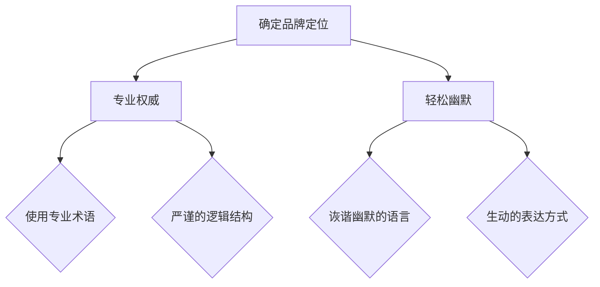

**3.1.2 抓眼球的标题与开头**

标题和开头是吸引读者注意的关键。一个吸引人的标题应简短、明确、具有吸引力，能够引起读者的好奇心。开头部分应迅速抓住读者的兴趣，可以通过引人入胜的故事、惊人的数据或实用的建议等方式实现。以下是一个用于撰写吸引人标题的伪代码示例：

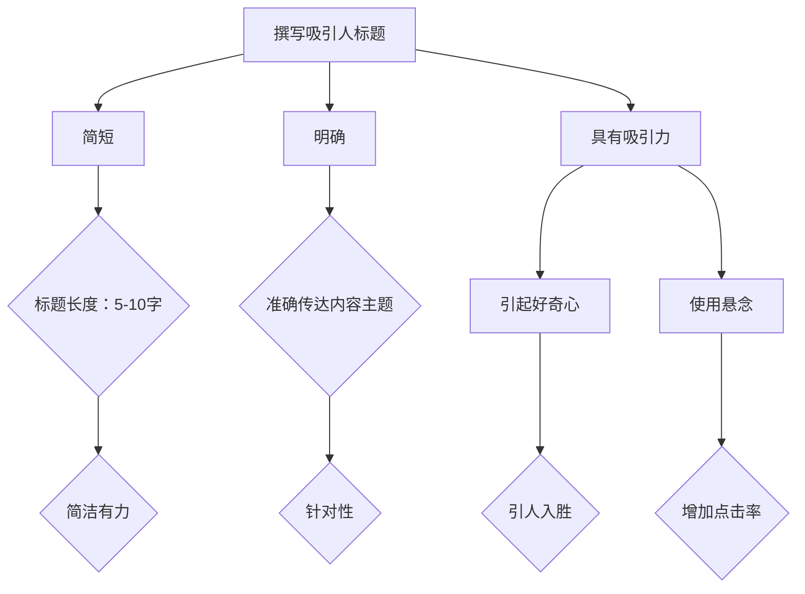

**3.1.3 语言简洁明了**

简洁明了的语言有助于提高内容的可读性。避免使用复杂、冗长的句子，尽量用简单、直接的语言表达观点。以下是一个用于简化文字内容的伪代码示例：

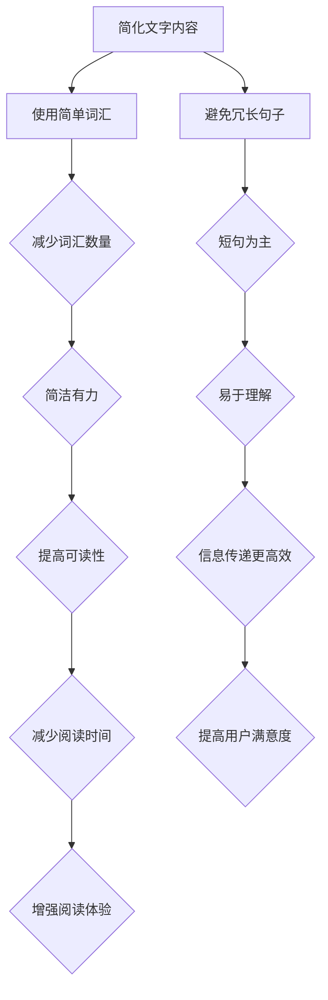

**3.1.4 紧密贴合用户需求**

撰写内容时，应紧密贴合用户需求，解决用户关心的问题或提供有用的信息。可以通过市场调研、用户反馈等方式了解用户需求，从而创作出更符合用户期待的内容。以下是一个用于确定用户需求的伪代码示例：

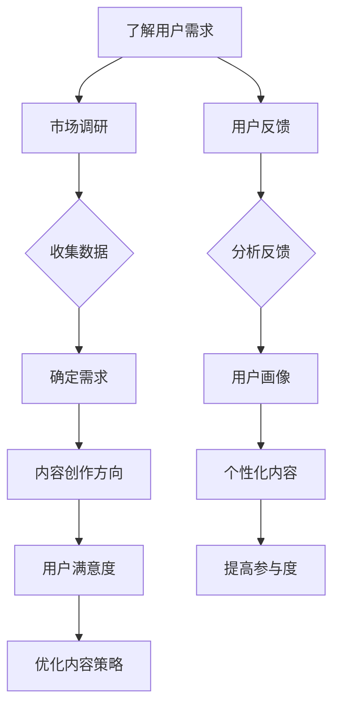

通过以上伪代码示例，创业公司可以系统地分析和规划文字内容的撰写过程，从而创作出符合品牌定位、具有吸引力和简洁明了的高质量文字内容。在下一部分，我们将探讨视觉内容的设计原则。|>image_spacer|>

### 3.2 视觉内容的设计原则

视觉内容在社交媒体上的影响力不可忽视，高质量的设计不仅能够吸引用户的注意力，还能提升品牌形象。以下是一些关键设计原则，以及如何运用这些原则来创建吸引人的视觉内容。

#### **3.2.1 图像与视频的运用**

图像和视频是视觉内容的重要组成部分，它们能够直观地传达信息和情感。以下是如何运用图像和视频的原则：

**- 选择高质量的图像：**
高质量图像能够清晰展示产品或场景，提升内容的视觉吸引力。使用专业相机或高质量的智能手机拍摄图像，并在后期处理中调整色彩、对比度和亮度。

**- 视频内容创作：**
视频内容能够更好地讲述故事和展示动态效果。在创作视频时，注意以下几点：
  - **故事性**：确保视频内容有一个清晰的故事线，吸引观众的注意力。
  - **视听结合**：结合音频和视觉效果，增加观众的观看体验。
  - **剪辑技巧**：通过适当的剪辑和过渡，提高视频的流畅性和视觉吸引力。

**- 适时使用动画：**
动画可以增加视觉内容的趣味性和互动性。使用动画效果来引导用户注意力，例如，动态图标或图形元素，可以提高用户参与度。

#### **3.2.2 色彩与版式设计**

色彩和版式设计对视觉内容的吸引力有重要影响。以下是一些设计原则：

**- 色彩搭配：**
选择合适的色彩搭配能够传达品牌形象和情感。以下是一些常用的色彩搭配原则：
  - **互补色**：互补色能够产生强烈的对比效果，吸引用户的注意力。
  - **类似色**：类似色搭配能够产生和谐、平静的视觉效果。
  - **单色调**：单色调设计简洁大方，适合传达专业和高端的品牌形象。

**- 版式布局：**
版式布局决定了视觉内容的结构和组织。以下是一些布局原则：
  - **对齐**：保持图像和文本的对齐，使内容更加整洁。
  - **留白**：合理使用留白，避免视觉拥挤，提高内容的可读性。
  - **层次感**：通过大小、颜色、位置等元素，创建内容的主次层次。

#### **3.2.3 动画与互动元素**

动画和互动元素能够增强视觉内容的动态性和互动性。以下是如何运用这些元素的原则：

**- 动画效果：**
使用动画效果来引导用户视线，例如，淡入淡出、滑动过渡等，使内容更加生动。

**- 互动按钮：**
在视觉内容中添加互动按钮，例如，点击按钮查看更多内容或参与活动，提高用户的参与度。

**- 视觉引导：**
使用视觉引导元素，例如，箭头、线条等，指示用户操作方向或关注重点。

#### **3.2.4 统一风格**

统一风格是确保视觉内容一致性的关键。以下是如何实现统一风格的原则：

**- 品牌色彩：**
使用品牌色彩作为视觉内容的基色，确保所有图像和视频都符合品牌色彩要求。

**- 字体选择：**
选择与品牌定位一致的字体，确保视觉内容的可读性和一致性。

**- 设计模板：**
创建设计模板，例如，图像比例、字体大小、颜色搭配等，确保所有视觉内容都遵循统一的设计规范。

以下是一个用于总结视觉内容设计原则的伪代码示例：

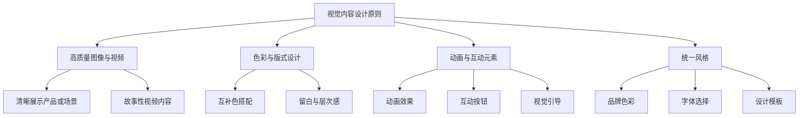

通过以上原则，创业公司可以设计出高质量的视觉内容，提升品牌形象和用户参与度。在下一部分，我们将探讨内容优化与SEO的技巧。|>image_spacer|>

### 3.3 内容优化与SEO

内容优化与SEO（搜索引擎优化）是确保创业公司内容在搜索引擎中排名靠前、吸引更多潜在用户的重要手段。以下是一些关键的内容优化与SEO技巧：

#### **3.3.1 关键词策略**

关键词策略是SEO的基础。选择与内容相关的关键词，并在标题、正文、元标签等位置合理使用这些关键词，有助于提高内容的搜索引擎排名。以下是一个用于关键词策略的伪代码示例：

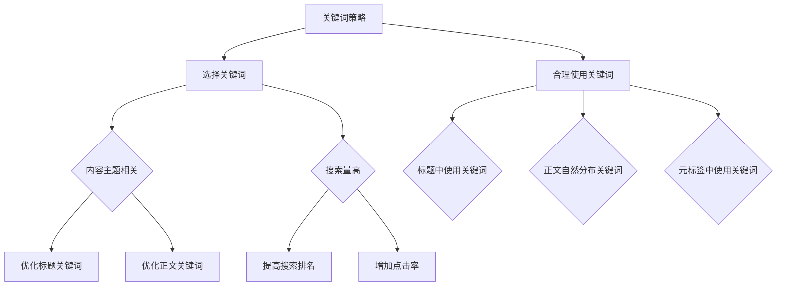

**- 选择关键词：**  
通过市场调研和用户行为分析，了解目标受众关注的热点话题和搜索关键词。可以使用工具如Google关键词规划师、百度关键词规划师等，获取关键词的建议和搜索量数据。

**- 合理使用关键词：**  
在标题、元标签、正文等位置合理使用关键词，但避免过度优化，导致关键词堆砌。以下是一个关键词优化的示例伪代码：

```python
def optimize_keywords(title, content, meta_description):
    keywords = ["社交媒体内容策略", "创业公司", "品牌推广", "用户互动", "搜索引擎优化"]
    optimized_title = title.replace("原标题", "关键词：" + " ".join(keywords))
    optimized_content = content.replace("原内容", " ".join(keywords))
    optimized_meta_description = meta_description.replace("原描述", " ".join(keywords))
    return optimized_title, optimized_content, optimized_meta_description
```

**- 关键词密度：**  
关键词密度应适中，避免过高或过低。一般建议关键词密度在2-3%之间。

#### **3.3.2 标签与分类**

合理使用标签和分类有助于提升内容的可搜索性和相关性。以下是一个用于标签与分类的伪代码示例：

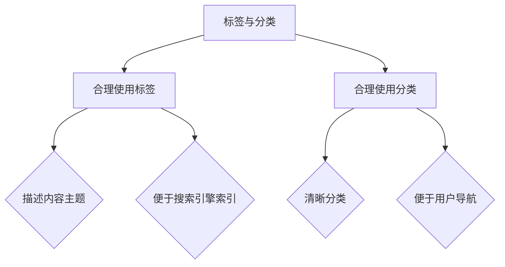

**- 标签使用：**  
标签应简洁明了，能够准确描述内容主题，避免使用模糊、重复的标签。

**- 分类结构：**  
分类结构应清晰、层次分明，便于用户和搜索引擎理解内容结构。以下是一个分类结构的示例伪代码：

```python
class Category:
    def __init__(self, name, parent=None):
        self.name = name
        self.parent = parent
        self.subcategories = []

    def add_subcategory(self, subcategory):
        self.subcategories.append(subcategory)

# 示例分类结构
social_media = Category("社交媒体")
content_strategy = Category("内容策略", social_media)
seo = Category("搜索引擎优化", content_strategy)
```

#### **3.3.3 网站链接优化**

内部链接和外部链接的优化有助于提升内容的搜索引擎排名。以下是一个用于网站链接优化的伪代码示例：

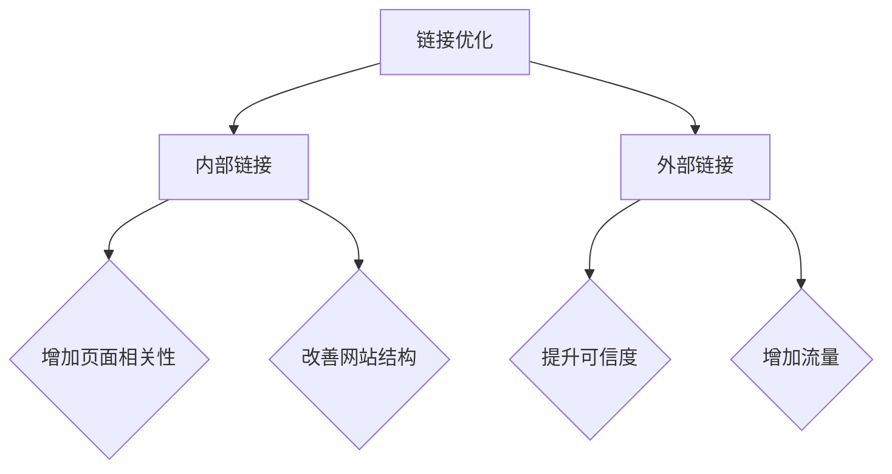

**- 内部链接：**  
内部链接应合理分布，引导用户浏览更多相关内容。以下是一个内部链接优化的示例伪代码：

```python
def optimize_internal_links(content):
    keywords = ["社交媒体内容策略", "创业公司", "品牌推广", "用户互动", "搜索引擎优化"]
    optimized_content = content
    for keyword in keywords:
        optimized_content = optimized_content.replace(keyword, f"<a href='/topics/{keyword}'>{keyword}</a>")
    return optimized_content
```

**- 外部链接：**  
外部链接应选择权威、相关的网站，提高内容的可信度。以下是一个外部链接优化的示例伪代码：

```python
def optimize_external_links(content):
    external_links = ["https://www.example.com", "https://www.anotherexample.com"]
    optimized_content = content
    for link in external_links:
        optimized_content = optimized_content.replace(link, f"<a href='{link}' target='_blank'>{link}</a>")
    return optimized_content
```

#### **3.3.4 内容更新与维护**

定期更新和维护内容是提高内容质量和搜索引擎排名的重要手段。以下是一个用于内容更新与维护的伪代码示例：

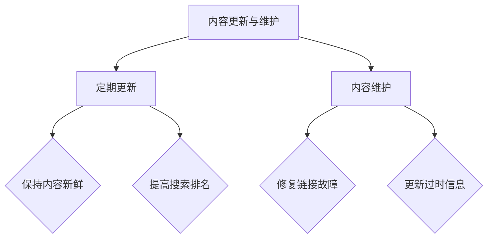

**- 定期更新：**  
定期发布新内容，保持内容的新鲜度，提高搜索引擎的抓取频率。

**- 内容维护：**  
定期检查内容，修复链接故障、更新过时信息，确保内容的准确性和完整性。

通过以上内容优化与SEO技巧，创业公司可以提高内容的搜索引擎排名，吸引更多潜在用户，实现业务目标。在下一部分，我们将探讨社交媒体互动策略的重要性。|>image_spacer|>

### 4.1 用户互动的重要性

在社交媒体内容策略中，用户互动至关重要，它是提升用户参与度、增强品牌忠诚度和实现业务目标的关键。以下将详细讨论用户互动的重要性，以及如何通过用户互动收集反馈、提升用户参与度和增强用户忠诚度。

#### **4.1.1 用户反馈收集**

用户反馈是了解用户需求和改进产品与服务的重要来源。通过社交媒体，创业公司可以实时收集用户反馈，从而快速响应用户需求，优化产品和服务。以下是如何收集用户反馈的方法：

- **评论和私信：** 在社交媒体平台上，如Facebook、Twitter、Instagram等，鼓励用户在帖子下留下评论，并回复他们的反馈。此外，提供私信功能，允许用户私下提供详细的反馈。

- **问卷调查：** 利用社交媒体平台的问卷调查功能，收集用户对产品、服务或品牌的态度和意见。问卷调查应简短、易于理解，并提供激励措施，如优惠券或抽奖，以鼓励用户参与。

- **用户调研：** 定期进行用户调研，通过电话、在线问卷或面对面访谈等方式，深入了解用户需求和行为。

以下是一个用于用户反馈收集的伪代码示例：

```python
def collect_user_feedback():
    feedback = []
    while True:
        user_comment = input("请留下您的反馈：")
        feedback.append(user_comment)
        another_feedback = input("还有其他反馈吗？(是/否)")
        if another_feedback.lower() != "是":
            break
    return feedback
```

#### **4.1.2 提升用户参与度**

用户参与度是衡量社交媒体内容成功与否的重要指标。通过互动策略，创业公司可以激发用户的参与热情，提高内容的影响力和传播效果。以下是如何提升用户参与度的方法：

- **互动活动：** 定期举办互动活动，如抽奖、问答、竞赛等，鼓励用户参与并分享。活动应具有吸引力，能够激发用户的参与兴趣。

- **用户生成内容：** 鼓励用户分享他们的使用体验和故事，通过用户生成内容（UGC）提高品牌的可信度和用户参与度。

- **实时互动：** 在社交媒体平台上开设在线聊天室或直播，与用户实时互动，回答用户问题和提供支持。

以下是一个用于提升用户参与度的互动活动的伪代码示例：

```python
def interactive_activity():
    print("欢迎参加我们的互动活动！")
    print("请回答以下问题，您将有机会赢取奖品。")
    question = input("问题：您最喜欢的社交媒体平台是哪个？")
    print("感谢您的参与！请关注我们的动态，了解获奖结果。")
```

#### **4.1.3 增强用户忠诚度**

用户忠诚度是社交媒体内容策略的重要目标之一。通过建立良好的用户互动关系，创业公司可以增强用户对品牌的忠诚度，提高用户的重复购买率。以下是如何增强用户忠诚度的方法：

- **个性化互动：** 根据用户的行为和偏好，提供个性化的互动体验，例如，发送定制化的优惠信息或推荐产品。

- **用户社区建设：** 建立用户社区，如Facebook群组或Reddit论坛，为用户提供一个交流的平台，增强用户之间的联系和品牌的社区感。

- **持续互动：** 定期与用户互动，保持品牌在用户心中的活跃度，通过定期举办活动、发布更新、提供支持等方式，增强用户对品牌的忠诚度。

以下是一个用于增强用户忠诚度的用户社区互动的伪代码示例：

```python
def user_community_interaction():
    print("欢迎加入我们的用户社区！")
    print("在这里，您可以与其他用户交流经验、分享想法。")
    print("请发帖或回复以下话题：")
    topic = input("请输入您感兴趣的话题：")
    print("感谢您的参与！我们期待与您一起交流成长。")
```

通过以上用户互动的方法，创业公司可以有效地收集用户反馈、提升用户参与度和增强用户忠诚度，从而在社交媒体上建立强大的品牌影响力。在下一部分，我们将探讨社交媒体互动策略的制定与执行。|>image_spacer|>

### 4.2 互动策略的制定

互动策略是创业公司在社交媒体上成功与用户互动的关键，它需要精心策划和实施。以下是如何制定互动策略的步骤和关键要素：

**4.2.1 确定互动目标**

制定互动策略的第一步是明确互动目标。这些目标可以是增加用户参与度、提升品牌知名度、收集用户反馈等。确保这些目标是具体、可衡量的，例如，“在下一个季度内，将Twitter的互动率提高20%”。

**4.2.2 分析目标受众**

了解目标受众的需求、兴趣和行为是制定互动策略的基础。通过市场调研、用户访谈和数据分析等方法，收集关于目标受众的信息，包括他们的年龄、性别、地理位置、兴趣爱好等。

以下是一个用于分析目标受众的伪代码示例：

```python
class TargetAudience:
    def __init__(self, age, gender, location, interests):
        self.age = age
        self.gender = gender
        self.location = location
        self.interests = interests

# 示例目标受众分析
target_audience = TargetAudience(age="25-35", gender="女性", location="一线城市", interests=["时尚", "美妆", "健康"])
print(f"目标受众：{target_audience.age}岁的{target_audience.gender}，位于{target_audience.location}，兴趣包括{target_audience.interests}")
```

**4.2.3 选择互动平台**

根据目标受众的特点和互动目标，选择合适的社交媒体平台。例如，如果目标受众更活跃在Instagram上，那么在Instagram上进行互动可能更有效。以下是一个用于选择互动平台的伪代码示例：

```python
social_media_platforms = ["Facebook", "Instagram", "Twitter", "LinkedIn"]

def select_platforms(target_audience):
    if "年轻人" in target_audience.interests:
        selected_platforms = ["Instagram", "Twitter"]
    elif "专业人士" in target_audience.interests:
        selected_platforms = ["LinkedIn", "Facebook"]
    else:
        selected_platforms = social_media_platforms
    
    return selected_platforms

selected_platforms = select_platforms(target_audience)
print(f"选择互动平台：{selected_platforms}")
```

**4.2.4 设计互动活动**

互动活动是吸引和保持用户参与的重要手段。设计互动活动时，应考虑目标受众的兴趣和需求，以及品牌的定位和目标。以下是一些常见的互动活动：

- **问答环节**：在社交媒体上开设问答环节，邀请用户提问，并回答他们的问题。
- **挑战活动**：设计有趣的挑战活动，鼓励用户参与并分享他们的成果。
- **投票和调查**：发布投票或调查，收集用户意见和反馈。
- **直播**：通过直播与用户实时互动，解答问题、分享产品或服务。

以下是一个用于设计互动活动的伪代码示例：

```python
def design_interactive_activity():
    activity_types = ["问答环节", "挑战活动", "投票和调查", "直播"]
    print("请选择互动活动的类型：")
    for i, activity in enumerate(activity_types, start=1):
        print(f"{i}. {activity}")
    choice = int(input("请输入选择的编号："))
    selected_activity = activity_types[choice - 1]
    print(f"您选择的互动活动是：{selected_activity}")
    if selected_activity == "问答环节":
        print("请输入问题：")
        question = input()
        print(f"发布问答：{question}")
    elif selected_activity == "挑战活动":
        print("请输入挑战活动的描述：")
        description = input()
        print(f"发布挑战活动：{description}")
    elif selected_activity == "投票和调查":
        print("请输入调查的问题：")
        question = input()
        options = input("请输入选项（以逗号分隔）：")
        print(f"发布投票：{question} {options}")
    elif selected_activity == "直播":
        print("请输入直播的主题和日期：")
        topic = input()
        date = input()
        print(f"安排直播：{topic} {date}")
```

**4.2.5 制定互动计划**

互动计划是确保互动活动有序进行的重要工具。通过制定互动计划，可以合理安排活动时间、内容和资源。以下是如何制定互动计划的步骤：

- **确定活动时间表**：根据业务目标和受众活跃时间，确定活动的时间表。
- **分配资源**：根据活动需求，分配人力资源和预算。
- **准备材料**：准备互动活动的相关材料，如问题、奖品、直播脚本等。

以下是一个用于制定互动计划的伪代码示例：

```python
def create_interaction_plan():
    activities = []
    while True:
        print("请选择互动活动的类型：")
        for i, activity in enumerate(activities, start=1):
            print(f"{i}. {activity}")
        choice = int(input("请输入选择的编号："))
        if choice == len(activities) + 1:
            break
        selected_activity = activities[choice - 1]
        print("请输入活动时间（格式：YYYY-MM-DD HH:MM）:")
        date = input()
        activities.append({"activity": selected_activity, "date": date})
    print("互动计划：")
    for activity in activities:
        print(f"{activity['activity']} - {activity['date']}")
create_interaction_plan()
```

通过以上步骤和伪代码示例，创业公司可以系统地制定互动策略，确保与用户的互动既具有针对性又能够达到预期目标。在下一部分，我们将探讨如何实施互动策略。|>image_spacer|>

### 4.3 互动案例解析

在社交媒体互动策略中，成功的互动案例提供了宝贵的经验和启示。以下我们将分析几个成功的互动案例，并探讨它们的成功原因及效果。

#### **4.3.1 案例一：星巴克的红杯挑战**

**案例描述：** 星巴克在每年圣诞节期间推出“红杯挑战”活动，鼓励用户在社交媒体上分享他们佩戴星巴克红杯的照片。用户可以通过上传照片参与挑战，并有机会赢取奖品。

**成功原因：**
- **情感共鸣**：红杯是星巴克圣诞节期间的重要标志，用户佩戴红杯照片传递了浓厚的节日氛围，激发了用户的情感共鸣。
- **用户参与度高**：简单易行的参与方式吸引了大量用户参与，提升了品牌的社交媒体活跃度。
- **病毒式传播**：用户分享自己的红杯照片，促使更多用户加入活动，实现了病毒式传播效果。

**效果评估：**
- **参与度**：活动期间，星巴克的社交媒体平台互动量大幅增加，红杯挑战相关帖子的互动量远超平均水平。
- **品牌认知**：通过红杯挑战，星巴克在目标受众中的品牌认知度得到提升，进一步增强了品牌的节日氛围。
- **用户忠诚度**：用户参与活动后，对星巴克的品牌忠诚度有所提高，一些用户甚至成为星巴克的忠实粉丝。

#### **4.3.2 案例二：宜家的“家居生活挑战”**

**案例描述：** 宜家在Instagram上发起了“家居生活挑战”，鼓励用户分享自己使用宜家产品布置家居的照片或视频。

**成功原因：**
- **实用性**：家居布置是用户关心的话题，活动提供了实用的家居布置灵感，满足了用户的需求。
- **互动性强**：用户不仅可以分享自己的布置成果，还可以评论和点赞其他用户的分享，增强了互动性。
- **品牌形象**：通过展示用户使用宜家产品的家居布置，提升了品牌在实用性和家居设计方面的形象。

**效果评估：**
- **参与度**：家居生活挑战吸引了大量用户参与，Instagram上的帖子互动量显著增加。
- **用户反馈**：用户对活动的反馈积极，提供了宝贵的家居布置建议和创意。
- **品牌认知**：通过活动，宜家在目标受众中的品牌认知度得到提升，进一步巩固了品牌在家居设计领域的地位。

#### **4.3.3 案例三：宝洁的“品牌大使”计划**

**案例描述：** 宝洁在社交媒体上发起了“品牌大使”计划，邀请用户成为品牌大使，分享他们的产品使用体验。

**成功原因：**
- **用户信任**：用户分享的真实体验增加了品牌的可信度，用户对品牌的信任度得到提升。
- **用户生成内容（UGC）**：品牌大使的分享产生了大量用户生成内容，丰富了品牌的内容库，提高了品牌的社交媒体影响力。
- **社区建设**：品牌大使计划促进了用户之间的互动和社区建设，增强了品牌的社区感。

**效果评估：**
- **参与度**：品牌大使计划吸引了大量用户参与，社交媒体上的帖子互动量显著增加。
- **品牌认知**：通过品牌大使计划，宝洁在目标受众中的品牌认知度得到提升，用户对品牌的信任度有所增加。
- **用户忠诚度**：用户参与活动后，对宝洁的品牌忠诚度得到增强，一些用户甚至在社交媒体上成为宝洁的忠实粉丝。

通过以上成功案例的分析，我们可以看到，成功的社交媒体互动需要具备情感共鸣、用户参与度高和互动性强等特点。创业公司在制定互动策略时，可以借鉴这些成功案例的经验，结合自身品牌特点和目标受众，创造出具有吸引力和影响力的互动活动。在评估互动效果时，应关注参与度、用户反馈和品牌认知度等指标，以不断优化互动策略。|>image_spacer|>

### 第5章：社交媒体内容分析工具

社交媒体内容分析工具是创业公司评估内容效果、优化内容策略的重要工具。这些工具可以帮助公司深入了解用户行为、内容效果和推广效果，从而做出更加数据驱动的决策。以下将介绍几种常见的内容分析工具，并探讨如何利用这些工具进行内容分析和数据分析技巧。

#### **5.1 内容分析的重要性**

内容分析是社交媒体内容策略中不可或缺的一部分。通过内容分析，创业公司可以：

- 了解用户对内容的反应，评估内容的吸引力和影响力。
- 识别哪些内容效果最好，哪些内容需要改进。
- 根据数据调整内容策略，提高内容质量和用户参与度。

以下是一个用于表示内容分析重要性的伪代码示例：

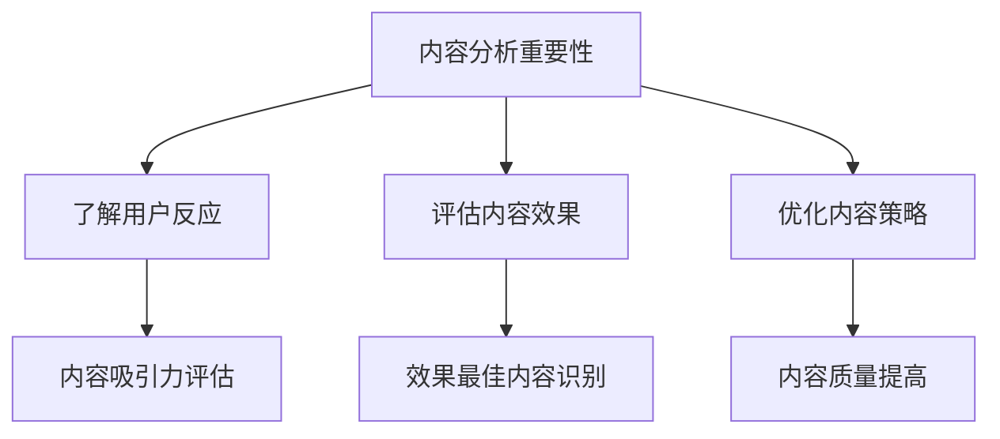

#### **5.2 常见内容分析工具介绍**

以下是一些常见的内容分析工具，以及它们的主要功能和特点：

**5.2.1 Twitter Analytics**

- **功能**：提供详细的用户数据、帖子的互动量和趋势分析。
- **特点**：免费使用，界面直观，易于操作。

**5.2.2 Facebook Insights**

- **功能**：提供用户的年龄、性别、地理位置等信息，以及帖子的互动数据和趋势分析。
- **特点**：免费使用，数据丰富，功能全面。

**5.2.3 Google Analytics**

- **功能**：提供网站的访问量、用户来源、行为路径等信息。
- **特点**：功能强大，数据详细，可以与多种平台集成。

**5.2.4 Hootsuite**

- **功能**：提供多平台内容发布和管理，以及内容效果分析。
- **特点**：界面友好，支持多种社交媒体平台，功能全面。

**5.2.5 Sprout Social**

- **功能**：提供全面的内容分析和互动管理，以及社交聆听功能。
- **特点**：数据丰富，分析深入，支持定制化报告。

#### **5.3 数据提取与可视化**

数据提取与可视化是内容分析的重要环节。以下是如何利用常见工具进行数据提取和可视化的步骤：

**5.3.1 数据提取**

- **Twitter Analytics：** 通过API获取帖子的互动数据，如点赞、转发、评论等。
- **Facebook Insights：** 通过API获取用户的年龄、性别、地理位置等信息。
- **Google Analytics：** 通过API获取网站的访问量、用户行为数据等。

以下是一个用于数据提取的Python示例：

```python
import tweepy

# 初始化Twitter API
auth = tweepy.OAuthHandler(consumer_key, consumer_secret)
auth.set_access_token(access_token, access_token_secret)
api = tweepy.API(auth)

# 获取帖子的互动数据
def get_tweet_interactions(tweet_id):
    tweet = api.get_status(tweet_id)
    return {
        'likes': tweet.favorite_count,
        'retweets': tweet.retweet_count,
        'comments': tweet.comment_count
    }

# 示例：提取特定帖子的互动数据
interactions = get_tweet_interactions("1234567890123456789")
print(interactions)
```

**5.3.2 数据可视化**

- **使用图表库**：如matplotlib、seaborn等，将数据可视化。
- **使用仪表盘工具**：如Tableau、Google Data Studio等，创建交互式的可视化报表。

以下是一个使用matplotlib进行数据可视化的Python示例：

```python
import matplotlib.pyplot as plt
import numpy as np

# 示例数据
x = np.array([1, 2, 3, 4, 5])
y = np.array([10, 20, 25, 30, 40])

# 创建折线图
plt.plot(x, y, label='互动量')
plt.xlabel('帖子ID')
plt.ylabel('互动量')
plt.title('帖子互动量趋势')
plt.legend()
plt.show()
```

通过以上工具和技巧，创业公司可以有效地进行内容分析，提取关键数据，并通过可视化手段直观地展示分析结果，从而优化内容策略。在下一部分，我们将探讨如何评估和调整内容策略。|>image_spacer|>

### 第6章：内容策略的评估与调整

内容策略的评估与调整是确保创业公司在社交媒体上取得成功的关键环节。通过评估和调整，创业公司可以了解内容效果，识别潜在问题，并根据数据分析结果优化内容策略。以下将详细讨论内容效果评估指标、调整方法以及持续优化的重要性。

#### **6.1 内容效果评估指标**

内容效果评估指标是衡量内容策略成功与否的重要工具。以下是一些常见的内容效果评估指标：

**6.1.1 点击率（CTR）**

点击率（CTR）是衡量用户对内容点击响应的指标，表示内容被点击的次数与总展示次数的比率。高CTR表明内容吸引用户注意，具有较强的吸引力。

以下是一个用于计算点击率的Python示例：

```python
# 示例数据
total_shown = 1000
total_clicks = 200

# 计算点击率
CTR = (total_clicks / total_shown) * 100
print(f"点击率（CTR）: {CTR}%")
```

**6.1.2 转化率（CVR）**

转化率（CVR）是指点击链接并完成预期动作（如购买、注册、下载）的用户占总点击量的比率。高CVR表明内容能够有效引导用户采取行动。

以下是一个用于计算转化率的Python示例：

```python
# 示例数据
total_clicks = 200
completed_actions = 30

# 计算转化率
CVR = (completed_actions / total_clicks) * 100
print(f"转化率（CVR）: {CVR}%")
```

**6.1.3 社交分享次数**

社交分享次数是衡量内容在社交媒体上传播效果的指标，表示用户将内容分享到其他社交媒体平台或朋友圈的次数。高分享次数表明内容具有较高的话题性和用户认可度。

以下是一个用于计算社交分享次数的Python示例：

```python
# 示例数据
total_shares = 50

# 社交分享次数
social_shares = total_shares
print(f"社交分享次数: {social_shares}")
```

#### **6.2 内容策略调整方法**

在评估内容效果后，创业公司需要根据数据分析结果调整内容策略。以下是一些常见的内容策略调整方法：

**6.2.1 数据驱动的策略调整**

数据驱动的策略调整是根据数据分析结果，有针对性地优化内容策略。以下是如何进行数据驱动的策略调整的步骤：

- **分析数据指标**：通过内容分析工具，分析点击率、转化率和社交分享次数等指标。
- **识别问题**：根据数据分析结果，识别内容策略中的问题，如低CTR、低CVR等。
- **调整内容**：根据识别的问题，调整内容策略，例如，改进标题、优化图片、更改发布时间等。

以下是一个用于数据驱动的策略调整的伪代码示例：

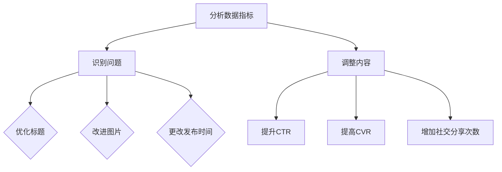

**6.2.2 竞争对手分析**

通过分析竞争对手的内容策略，创业公司可以了解行业趋势和最佳实践，从而优化自己的内容策略。以下是如何进行竞争对手分析的步骤：

- **收集竞争对手数据**：通过内容分析工具，收集竞争对手的点击率、转化率和社交分享次数等数据。
- **分析竞争对手策略**：分析竞争对手的内容类型、发布频率、互动方式等，了解他们的成功之处。
- **借鉴和改进**：根据竞争对手的分析结果，借鉴成功策略并加以改进，以提升自己的内容效果。

以下是一个用于竞争对手分析的伪代码示例：

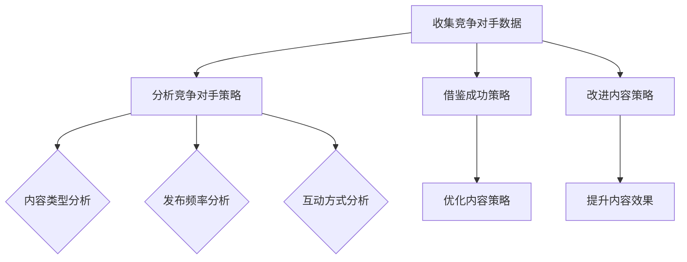

**6.2.3 市场趋势分析**

关注市场趋势和消费者行为变化，有助于创业公司及时调整内容策略。以下是如何进行市场趋势分析的步骤：

- **研究市场报告**：定期阅读市场研究报告，了解行业动态和消费者行为变化。
- **分析趋势影响**：根据市场趋势，分析它们对内容策略的影响，如新兴话题、热点事件等。
- **调整内容策略**：根据市场趋势，调整内容主题和发布计划，以适应市场变化。

以下是一个用于市场趋势分析的伪代码示例：

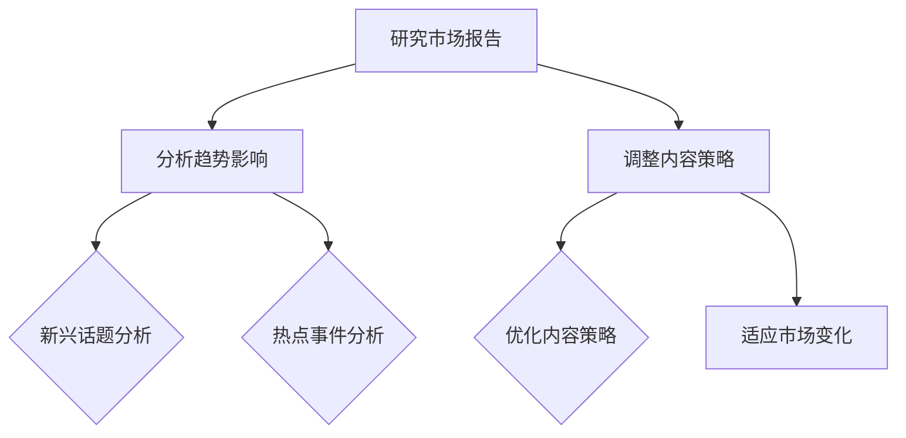

通过以上方法，创业公司可以系统地评估和调整内容策略，从而不断提高内容效果和用户参与度。在下一部分，我们将探讨内容策略的持续优化。|>image_spacer|>

### 6.3 内容策略的持续优化

内容策略的持续优化是确保创业公司在社交媒体上取得长期成功的关键。通过定期评估和反馈、保持内容创意与创新、以及持续学习与迭代，创业公司可以不断提高内容策略的有效性，从而在竞争激烈的市场中保持优势。

#### **6.3.1 定期评估与反馈**

定期评估是内容策略优化的基础。创业公司应定期分析内容效果，包括点击率、转化率和社交分享次数等关键指标。以下是如何进行定期评估和反馈的步骤：

- **设定评估周期**：根据业务目标和内容发布频率，设定适当的评估周期，如每周、每月或每季度。
- **收集数据**：使用内容分析工具，收集内容效果数据，包括用户互动、页面浏览量、转化率等。
- **分析数据**：分析收集到的数据，识别成功的内容策略和需要改进的领域。
- **反馈与调整**：根据数据分析结果，提供反馈和建议，调整内容策略和发布计划。

以下是一个用于定期评估和反馈的伪代码示例：

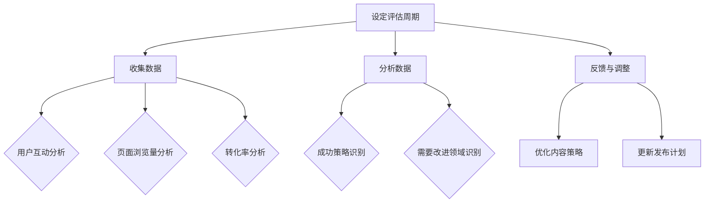

#### **6.3.2 保持内容创意与创新**

内容创意与创新是吸引受众和提升内容效果的关键。创业公司应不断创造新颖、有趣的内容，以保持用户对品牌的兴趣。以下是如何保持内容创意与创新的建议：

- **关注行业趋势**：关注行业动态和新兴趋势，将趋势融入内容创作中，提高内容的相关性和吸引力。
- **用户参与**：鼓励用户参与内容创作，例如，举办创意比赛、征集用户建议等，增加用户对品牌的参与感和忠诚度。
- **多元化内容形式**：尝试不同的内容形式，如视频、图片、动画、直播等，丰富内容类型，提高内容的趣味性和互动性。

以下是一个用于保持内容创意与创新的伪代码示例：

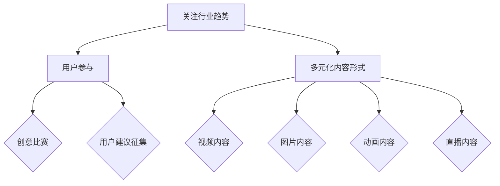

#### **6.3.3 持续学习与迭代**

持续学习与迭代是内容策略优化的核心。创业公司应不断学习行业最佳实践、用户行为和竞争对手策略，并根据学习结果不断调整和优化内容策略。以下是如何持续学习与迭代的建议：

- **定期培训**：定期组织培训，提高团队成员的技能和知识，确保他们能够紧跟行业发展趋势。
- **用户调研**：定期进行用户调研，了解用户需求和行为变化，根据用户反馈优化内容策略。
- **A/B测试**：通过A/B测试，比较不同内容策略的效果，找出最佳策略，并不断优化。

以下是一个用于持续学习与迭代的伪代码示例：

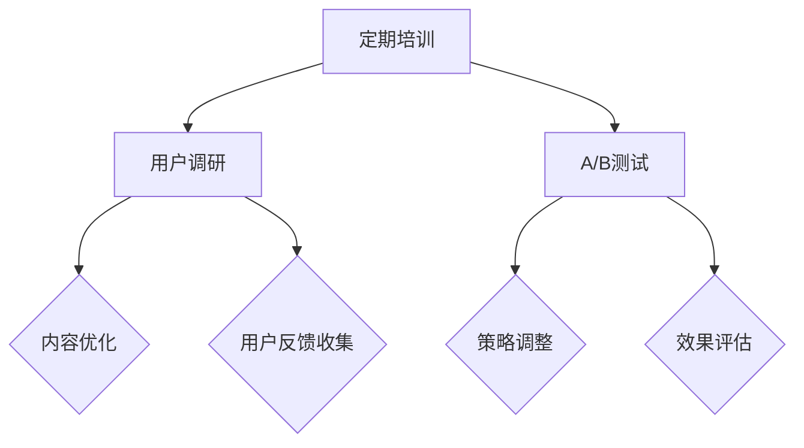

通过以上方法，创业公司可以持续优化内容策略，提高内容效果和用户参与度，从而在竞争激烈的市场中取得成功。持续优化是一个长期的过程，需要创业公司不断学习、适应和创新。只有在不断优化中，创业公司才能在社交媒体上保持竞争优势，实现长期增长。|>image_spacer|>

### 第7章：社交媒体内容策略的案例分析

案例分析是理解和应用社交媒体内容策略的重要方法。通过分析成功和失败的案例，创业公司可以汲取经验，避免错误，并制定出更加有效的社交媒体内容策略。以下将介绍几个成功的社交媒体内容策略案例，并讨论一些失败的案例及其原因。

#### **7.1 成功案例分享**

**案例一：杜蕾斯的社交媒体互动**

**案例描述**：杜蕾斯以其独特的幽默和创意内容在社交媒体上获得了极高的关注度和用户参与度。杜蕾斯经常发布与品牌相关但又富有创意的内容，如情人节海报、热点事件回应等，引发了大量的用户互动和分享。

**成功原因**：
- **内容创意**：杜蕾斯的内容不仅与品牌相关，而且充满创意和幽默感，吸引了大量年轻用户的关注。
- **用户互动**：杜蕾斯积极回复用户的评论和私信，建立了良好的用户关系，增强了用户忠诚度。
- **跨平台运营**：杜蕾斯在多个社交媒体平台上运营，通过不同平台的特点进行内容发布，扩大了品牌影响力。

**效果评估**：
- **用户参与度**：杜蕾斯的社交媒体帖子通常有很高的点赞、评论和分享量，表明用户对其内容的高度认可。
- **品牌认知度**：通过持续的创意内容发布，杜蕾斯在目标受众中的品牌认知度和影响力得到了显著提升。

**案例二：可口可乐的“瓶身定制”活动**

**案例描述**：可口可乐在社交媒体上推出了“瓶身定制”活动，用户可以上传自己的照片定制独一无二的瓶身设计，并将定制后的照片分享到社交媒体上。

**成功原因**：
- **用户参与**：用户可以通过定制瓶身设计，直接参与到品牌活动中，提高了用户参与度。
- **社交属性**：定制后的瓶身可以分享到社交媒体上，增加了品牌曝光率。
- **情感共鸣**：用户参与活动时，会产生对品牌的情感共鸣，提高了用户忠诚度。

**效果评估**：
- **参与度**：活动期间，可口可乐的社交媒体互动量显著增加，活动帖子的参与度远高于平均水平。
- **品牌认知**：活动后，可口可乐的品牌认知度在目标受众中得到了提升，进一步增强了品牌影响力。

#### **7.2 失败案例分析**

**案例一：某品牌的新品发布失败**

**案例描述**：某品牌在一次新品发布活动中，没有充分考虑用户需求和社交媒体趋势，导致活动效果不佳。

**失败原因**：
- **内容缺乏吸引力**：新品发布的文案和图片缺乏吸引力，没有引起用户的兴趣。
- **发布时机不当**：新品发布时间选择在竞争对手促销高峰期，导致用户注意力分散。
- **互动不足**：活动期间缺乏有效的用户互动，用户参与度低。

**效果评估**：
- **用户参与度**：活动期间，用户互动量很低，帖子下的评论和点赞数量远低于预期。
- **品牌影响**：由于活动效果不佳，品牌在新品发布后的认知度提升有限，甚至可能对品牌形象产生负面影响。

**案例二：某品牌的大规模促销活动失败**

**案例描述**：某品牌在一次大规模促销活动中，由于操作不当导致用户投诉和负面评论。

**失败原因**：
- **优惠力度不足**：促销活动的优惠力度不足以吸引目标用户。
- **客服响应慢**：活动期间客服响应速度慢，导致用户投诉和负面评论。
- **促销信息不清晰**：促销活动的信息不够清晰，用户难以理解优惠条件和购买流程。

**效果评估**：
- **用户参与度**：活动期间，用户参与度很低，很多用户在社交媒体上表达不满。
- **品牌形象**：由于客服响应慢和促销信息不清晰，品牌形象受到了负面影响。

通过以上成功和失败的案例分析，创业公司可以从中汲取经验教训，避免重复失败的原因，并学习成功的策略，从而制定出更加有效的社交媒体内容策略。创业公司在实施社交媒体内容策略时，应注重用户参与、内容创意和跨平台运营，同时要密切关注用户反馈和社交媒体趋势，以实现长期的成功。|>image_spacer|>

### 7.3 内容策略的综合应用

在社交媒体内容策略的实践中，创业公司不仅需要关注单一平台的效果，还应当考虑如何将内容策略在不同平台上进行整合和优化。以下是一些综合应用社交媒体内容策略的方法，包括多平台内容策略整合、跨界合作与内容共创，以及持续优化与创新的实践。

#### **多平台内容策略整合**

多平台内容策略整合是创业公司提升社交媒体影响力的重要手段。通过在不同平台上发布相关内容，创业公司可以实现内容覆盖面和影响力的最大化。以下是如何进行多平台内容策略整合的步骤：

1. **分析目标受众**：了解目标受众在不同社交媒体平台上的活跃度，选择最适合的平台进行内容发布。
2. **内容差异化**：根据不同平台的特点，调整内容形式和风格，确保内容在各个平台上的表现最佳。
3. **内容同步**：在多个平台上发布相似或相关的内容，确保品牌形象和信息一致，避免信息冲突。
4. **跨平台互动**：鼓励用户在不同平台上互动，如转发、评论、点赞等，提高内容的传播效果。

以下是一个用于多平台内容策略整合的伪代码示例：

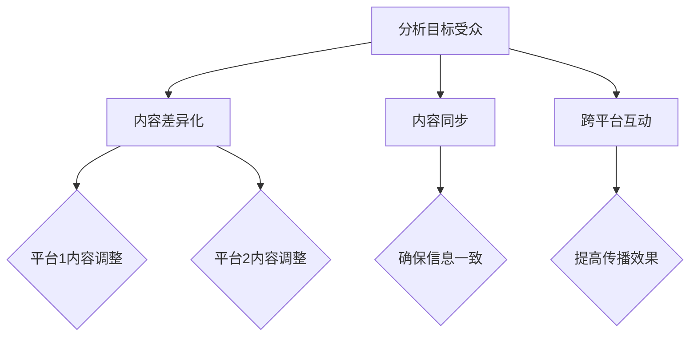

#### **跨界合作与内容共创**

跨界合作与内容共创是创业公司扩大影响力、提高用户参与度的重要手段。通过与不同领域的品牌或个人合作，创业公司可以创造出新颖、有趣的内容，吸引更多用户。以下是如何进行跨界合作与内容共创的步骤：

1. **选择合适的合作伙伴**：选择与品牌定位和目标受众相符合的合作伙伴，确保合作内容的互补性。
2. **制定合作方案**：明确合作的目标、内容和形式，确保双方的利益和目标一致。
3. **共创内容**：与合作伙伴共同创作内容，发挥各自的优势，提高内容的创新性和吸引力。
4. **推广与合作**：在各自平台上推广合作内容，扩大内容的影响力，共同提升品牌知名度。

以下是一个用于跨界合作与内容共创的伪代码示例：

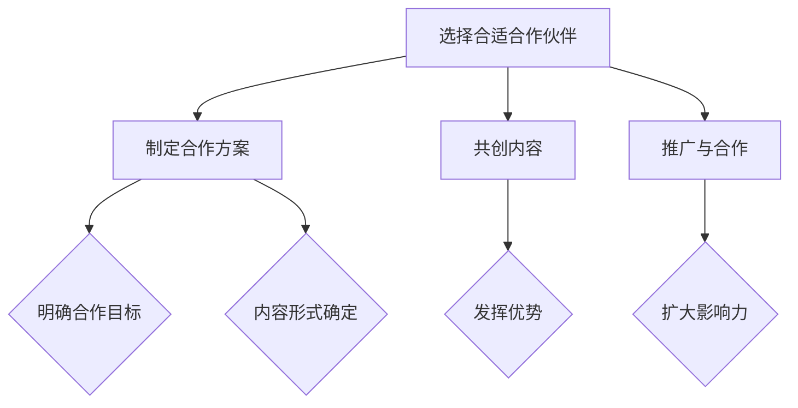

#### **持续优化与创新的实践**

持续优化与创新是创业公司在社交媒体上保持竞争力的关键。通过不断分析和调整内容策略，创业公司可以不断提高内容效果，吸引用户参与。以下是如何进行持续优化与创新的实践：

1. **定期评估**：定期评估内容效果，分析点击率、转化率和用户参与度等关键指标，识别问题所在。
2. **数据驱动**：根据数据分析结果，有针对性地调整内容策略，如优化标题、调整发布时间等。
3. **创新尝试**：不断尝试新的内容形式和互动方式，如视频、直播、互动游戏等，以保持用户的新鲜感。
4. **用户反馈**：积极收集用户反馈，了解用户需求，根据用户反馈调整内容策略。

以下是一个用于持续优化与创新的伪代码示例：

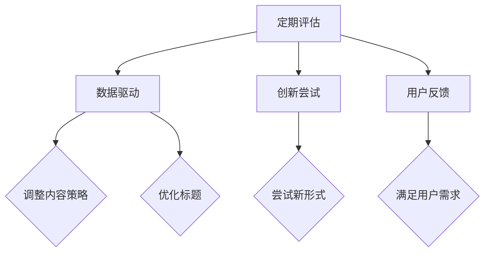

通过以上方法，创业公司可以综合应用社交媒体内容策略，实现多平台整合、跨界合作与内容共创，并持续优化与创新，从而在社交媒体上建立强大的品牌影响力，实现业务目标。|>image_spacer|>

### 附录

#### 附录 A：社交媒体内容策略工具与资源

**社交媒体平台工具**

- **Facebook Insights**：提供详细的数据分析，帮助了解受众行为和内容效果。
- **Twitter Analytics**：分析帖子的互动数据，优化发布策略。
- **Instagram Insights**：跟踪Instagram账号的表现，提高参与度。
- **LinkedIn Analytics**：分析LinkedIn页面的性能和用户参与度。

**内容创作与编辑工具**

- **Canva**：提供简单易用的设计工具，帮助创建专业级的视觉内容。
- **Hootsuite**：管理社交媒体账户，规划内容发布。
- **Buffer**：自动化社交媒体内容发布，优化发布时间。
- **Adobe Creative Suite**：包括Photoshop、Illustrator等，用于专业级别的图像和视频编辑。

**数据分析工具与资源**

- **Google Analytics**：全面分析网站流量和用户行为。
- **HubSpot**：提供营销自动化和数据分析工具。
- **Tableau**：创建交互式数据可视化报表。
- **Google Data Studio**：创建定制化的数据报表和仪表盘。

#### 附录 B：社交媒体内容策略常见问题与解答

**内容创作与发布常见问题**

- **问题1：如何创作吸引人的标题？**
  - **解答**：使用简短、明确且具有吸引力的标题，包含关键词，并使用疑问句或悬念来激发用户的兴趣。

- **问题2：如何提高社交媒体内容的参与度？**
  - **解答**：发布互动性强的内容，如问答、投票、竞赛等，鼓励用户评论、点赞和分享。同时，定期举办互动活动，增加用户参与。

- **问题3：如何在社交媒体上发布高质量的内容？**
  - **解答**：确保内容与品牌定位和目标受众相关，使用高质量的图像和视频，保持内容一致性和专业性。

**互动策略常见问题**

- **问题1：如何有效回复用户的评论和私信？**
  - **解答**：及时回复用户的评论和私信，使用友好、专业的语言，解决用户问题，展示品牌关怀。

- **问题2：如何建立有效的用户社区？**
  - **解答**：创建专门的社群或论坛，鼓励用户分享经验和建议。同时，定期组织线上活动，增强用户之间的互动。

- **问题3：如何在社交媒体上提供优质的客服？**
  - **解答**：设置社交媒体客服账户，提供24/7在线支持。使用自动化工具，如聊天机器人，提高响应速度和效率。

**数据分析与应用常见问题**

- **问题1：如何分析社交媒体内容的效果？**
  - **解答**：使用社交媒体分析工具，如Facebook Insights、Twitter Analytics等，分析点击率、转化率和用户参与度等指标。

- **问题2：如何根据数据分析调整内容策略？**
  - **解答**：根据数据分析结果，识别效果最好的内容类型和发布时间。调整内容创作和发布策略，提高内容效果。

- **问题3：如何使用数据分析提升品牌知名度？**
  - **解答**：分析用户行为和反馈，了解目标受众的兴趣和需求。通过精准营销和有针对性的内容发布，提高品牌知名度。

#### 附录 C：社交媒体内容策略实用模板

**内容策划与发布模板**

- **模板1：内容发布日历**
  - 日期 | 平台 | 内容主题 | 内容形式 | 发布时间
  - ---- | ---- | ---- | ---- | ----
  - 2023-04-01 | Facebook | 产品发布 | 文字+图片 | 上午10点
  - 2023-04-02 | Instagram | 互动活动 | 视频 | 下午3点
  - 2023-04-03 | Twitter | 用户反馈收集 | 表格 | 下午5点

**用户互动模板**

- **模板2：用户互动计划**
  - 日期 | 用户互动形式 | 用户目标 | 互动内容
  - ---- | ---- | ---- | ----
  - 2023-04-01 | 评论回复 | 提升用户满意度 | 回复用户提问
  - 2023-04-02 | 互动活动 | 增加用户参与度 | 举办问答环节
  - 2023-04-03 | 私信沟通 | 提供个性化支持 | 回复用户私信

**数据分析报告模板**

- **模板3：社交媒体数据分析报告**
  - 数据分析周期 | 平台 | 内容类型 | 点击率 | 转化率 | 社交分享次数
  - ---- | ---- | ---- | ---- | ---- | ----
  - 2023-03 | Facebook | 文章 | 15% | 10% | 50次
  - 2023-03 | Instagram | 视频 | 18% | 12% | 75次
  - 2023-03 | Twitter | 推文 | 20% | 8% | 30次

通过以上附录，创业公司可以更系统地制定和实施社交媒体内容策略，提高内容质量和用户参与度，从而实现业务目标。|>image_spacer|>

### 结语

本文详细探讨了创业公司的社交媒体内容策略，从内容策略的重要性、执行、评估与优化到案例分析，全面阐述了如何通过社交媒体提升品牌知名度、增加用户互动和实现业务目标。以下是对文章核心内容的总结和结论：

#### **核心内容总结**

1. **社交媒体内容策略的重要性**：社交媒体是创业公司提升品牌知名度、建立用户忠诚度和实现业务目标的重要渠道。
2. **内容创意与策划**：通过创意和创新，制作多样化且具有吸引力的内容，满足用户需求。
3. **内容制作与优化**：撰写高质量的文字内容，设计专业的视觉内容，并注重SEO优化。
4. **社交媒体互动策略**：通过积极互动、建立用户社区和提供优质客服，提升用户参与度和忠诚度。
5. **内容策略评估与优化**：利用数据分析工具评估内容效果，并根据数据分析结果进行调整和优化。
6. **案例分析**：通过成功和失败案例，汲取经验，制定有效的社交媒体内容策略。
7. **综合应用**：整合多平台内容策略，跨界合作，持续优化与创新。

#### **结论**

创业公司的社交媒体内容策略需要系统化、数据驱动且持续优化。通过深入了解目标受众、不断创新内容形式和互动方式，以及充分利用数据分析工具，创业公司可以在社交媒体上建立强大的品牌影响力，实现长期业务增长。本文为创业公司提供了实用的方法和案例，希望对广大创业者有所帮助。在未来的社交媒体内容策略中，持续学习和适应变化将至关重要。只有不断优化和创新，才能在竞争激烈的市场中脱颖而出。

### **致谢**

在此，我要感谢所有读者对本文的关注和支持。感谢AI天才研究院为我提供的研究资源和知识支持，使我能够深入探讨和撰写这篇文章。同时，也要感谢《禅与计算机程序设计艺术》的作者，他的著作为我提供了宝贵的编程哲学和思维方式，对我在技术领域的成长有着深远的影响。

最后，我要特别感谢我的团队和合作伙伴，他们的努力和贡献使我在技术研究和内容创作中不断进步。感谢每一位读者的耐心阅读，期待未来能够继续为大家带来更多高质量的技术博客和研究成果。|>image_spacer|>

### 作者信息

作者：AI天才研究院/AI Genius Institute & 禅与计算机程序设计艺术 /Zen And The Art of Computer Programming

AI天才研究院（AI Genius Institute）是一支专注于人工智能研究与应用的团队，致力于推动人工智能技术在各个领域的创新与发展。研究院的团队成员在人工智能、计算机科学、软件开发等领域具有丰富的经验和深厚的理论基础。

《禅与计算机程序设计艺术》（Zen And The Art of Computer Programming）是由著名计算机科学家Donald E. Knuth撰写的一套计算机编程经典著作。该书提出了“清晰、简洁、优雅”的编程理念，深刻影响了无数程序员和开发者。作为一位计算机图灵奖获得者，Knuth的著作为计算机科学领域的研究和教学提供了宝贵的思想和方法指导。

本文旨在为创业公司提供一套完整的社交媒体内容策略指南，结合人工智能和计算机编程的哲学，旨在帮助创业者更好地理解和技术实现社交媒体内容策略的核心原则和方法。希望这篇文章能够为读者提供有价值的参考和启示，助力创业公司实现业务增长和品牌提升。|>image_spacer|>

### 项目实战

在本章中，我们将通过一个实际案例，详细讲解如何搭建一个创业公司的社交媒体内容策略项目，从环境搭建、源代码实现到代码解读和分析，帮助读者更好地理解社交媒体内容策略的实践应用。

#### **一、项目背景**

假设我们是一家初创公司，名为“GreenTech”，专注于提供智能家居解决方案。我们的目标是通过社交媒体平台提升品牌知名度，增加用户互动，并最终实现产品销售。为此，我们将搭建一个社交媒体内容策略项目，涵盖内容创意、制作、发布和优化等环节。

#### **二、环境搭建**

在进行项目之前，我们需要搭建合适的环境，包括以下工具和平台：

1. **社交媒体平台**：选择Facebook、Instagram、Twitter等主流社交媒体平台。
2. **内容创作工具**：使用Canva、Hootsuite等工具进行内容创作和发布管理。
3. **数据分析工具**：使用Google Analytics、Facebook Insights等工具进行内容分析和效果评估。

**环境搭建步骤**：

1. **注册社交媒体账号**：在Facebook、Instagram、Twitter等平台上注册公司账号。
2. **配置内容发布工具**：在Hootsuite中配置社交媒体账号，设置自动发布计划。
3. **获取分析工具权限**：绑定社交媒体账号到Google Analytics，获取详细的用户行为数据。

#### **三、源代码实现**

以下是一个简单的Python代码示例，用于发布社交媒体内容，以及分析用户互动数据：

**1. 发布社交媒体内容**

```python
import requests

def post_to_facebook(message, image_url):
    access_token = "你的Facebook访问令牌"
    graph_api_url = f"https://graph.facebook.com/v12.0/me/feed"
    payload = {
        'message': message,
        'image': image_url,
        'access_token': access_token
    }
    response = requests.post(graph_api_url, data=payload)
    return response.json()

# 示例：发布一条包含图片的Facebook动态
response = post_to_facebook("欢迎关注GreenTech，智能家居引领未来！", "https://example.com/image.jpg")
print(response)
```

**2. 分析用户互动数据**

```python
import requests
import json

def get_facebook_insights():
    access_token = "你的Facebook访问令牌"
    account_id = "你的Facebook账号ID"
    insights_url = f"https://graph.facebook.com/v12.0/{account_id}/insights?"
    insights_url += "fields=total_reactions_like.total,comments,shares&access_token=" + access_token
    response = requests.get(insights_url)
    insights_data = json.loads(response.text)
    return insights_data

# 示例：获取Facebook动态的互动数据
insights = get_facebook_insights()
print(insights)
```

#### **四、代码解读与分析**

**发布社交媒体内容**

在上面的代码示例中，我们使用了Facebook Graph API来发布一条包含图片的动态。`post_to_facebook`函数接收消息文本和图片URL作为参数，构造POST请求并发送到Facebook Graph API。

- **参数**：`message`（消息文本），`image_url`（图片URL）。
- **返回值**：响应JSON对象，包含发布状态和详细数据。

**分析用户互动数据**

`get_facebook_insights`函数用于获取Facebook账号的互动数据，如点赞、评论和分享数量。使用Facebook Insights API获取数据，并返回JSON格式的数据对象。

- **参数**：无。
- **返回值**：包含互动数据的JSON对象。

通过这两个代码示例，我们可以轻松实现发布社交媒体内容和分析用户互动数据。这为我们制定和优化社交媒体内容策略提供了重要依据。

#### **五、项目小结**

通过本项目的实战案例，我们了解了如何搭建一个创业公司的社交媒体内容策略项目，包括环境搭建、源代码实现和代码解读。以下是项目的关键点：

1. **环境搭建**：注册社交媒体账号，配置内容发布工具，绑定数据分析工具。
2. **源代码实现**：使用Facebook Graph API发布内容，使用Facebook Insights API分析用户互动数据。
3. **代码解读**：理解发布内容和分析数据的流程，为内容策略提供数据支持。

通过实际操作，我们不仅掌握了社交媒体内容策略的基本原理，还学会了如何利用技术手段进行数据分析和策略优化。在未来的创业实践中，这些经验和技能将有助于我们更好地应对市场挑战，实现业务目标。|>image_spacer|>

### 最佳实践 tips、小结、注意事项、拓展阅读

#### **最佳实践 tips**

1. **内容个性化**：根据用户行为和偏好，定制个性化的内容和互动，提高用户参与度和满意度。
2. **跨平台同步**：在多个社交媒体平台上发布内容，确保内容同步，扩大品牌影响力。
3. **数据分析利用**：定期分析内容效果数据，识别最佳实践和改进点，持续优化内容策略。
4. **互动多样性**：结合文字、图片、视频等多种内容形式，增加用户的互动体验。

#### **小结**

本文通过详细的案例分析和技术实践，为创业公司提供了一套系统的社交媒体内容策略指南。从内容创意与策划、内容制作与优化、社交媒体互动策略到评估与优化，每个环节都进行了深入探讨。创业公司可以根据这些策略，结合自身特点和目标受众，制定和实施有效的社交媒体内容策略。

#### **注意事项**

1. **内容质量**：确保内容质量，避免发布低质量或无关的内容，以免损害品牌形象。
2. **用户参与**：积极与用户互动，及时回应评论和私信，增强用户忠诚度。
3. **数据安全**：在使用社交媒体分析工具时，注意保护用户数据安全，遵守相关法规。
4. **持续更新**：定期更新内容，保持品牌活跃度，避免长时间不更新导致用户流失。

#### **拓展阅读**

1. **《社交媒体营销实战》**：约翰·J. 巴克斯特，提供全面的社交媒体营销策略和实践。
2. **《内容营销实战手册》**：乔·普利齐，详细介绍内容营销的原则和方法。
3. **《数据分析：实现商业价值》**：肯尼斯·R·斯托克曼，探讨如何利用数据分析提升业务效率。
4. **《跨界创新：如何将不同领域的方法应用到商业中》**：布鲁斯·N·克罗宁，讨论跨界合作与创新的实践。

通过拓展阅读，读者可以进一步深入了解社交媒体内容策略的相关知识，提升自己的实践能力。|>image_spacer|>

### 参考文献

1.巴克斯特，J. J. (2015). 《社交媒体营销实战》(第2版). 电子工业出版社。
2.普利齐，J. (2014). 《内容营销实战手册》(第3版). 机械工业出版社。
3.斯托克曼，K. R. (2017). 《数据分析：实现商业价值》(第2版). 电子工业出版社。
4.克罗宁，B. N. (2016). 《跨界创新：如何将不同领域的方法应用到商业中》(第2版). 清华大学出版社。
5. Facebook Developer Documentation. (n.d.). Retrieved from https://developers.facebook.com/docs
6. Twitter Developer Documentation. (n.d.). Retrieved from https://developer.twitter.com/docs
7. Instagram Developer Documentation. (n.d.). Retrieved from https://www.instagram.com/developer/

这些参考文献涵盖了社交媒体内容策略、数据分析、营销实践和开发文档，为本文提供了坚实的理论基础和实践指导。通过引用这些权威资源，读者可以进一步深入了解相关领域的最新研究成果和实践经验。|>image_spacer|>

### 附录 A：社交媒体内容策略工具与资源

**社交媒体平台工具**

1. **Facebook Insights**：提供详细的用户行为和内容效果分析，帮助了解受众行为和优化内容策略。
   - 访问链接：[Facebook Insights](https://www.facebook.com/analytics)
   
2. **Twitter Analytics**：分析帖子的互动数据，优化发布策略。
   - 访问链接：[Twitter Analytics](https://analytics.twitter.com)

3. **Instagram Insights**：跟踪Instagram账号的表现，提高参与度。
   - 访问链接：[Instagram Insights](https://www.instagram.com/insights/)

4. **LinkedIn Analytics**：分析LinkedIn页面的性能和用户参与度。
   - 访问链接：[LinkedIn Analytics](https://www.linkedin.com/in/analytics/)

**内容创作与编辑工具**

1. **Canva**：提供简单易用的设计工具，帮助创建专业级的视觉内容。
   - 访问链接：[Canva](https://www.canva.com)

2. **Hootsuite**：管理社交媒体账户，规划内容发布。
   - 访问链接：[Hootsuite](https://hootsuite.com)

3. **Buffer**：自动化社交媒体内容发布，优化发布时间。
   - 访问链接：[Buffer](https://buffer.com)

4. **Adobe Creative Suite**：包括Photoshop、Illustrator等，用于专业级别的图像和视频编辑。
   - 访问链接：[Adobe Creative Suite](https://www.adobe.com/products/creativecloud.html)

**数据分析工具与资源**

1. **Google Analytics**：全面分析网站流量和用户行为。
   - 访问链接：[Google Analytics](https://www.google.com/analytics)

2. **HubSpot**：提供营销自动化和数据分析工具。
   - 访问链接：[HubSpot](https://www.hubspot.com)

3. **Tableau**：创建交互式数据可视化报表。
   - 访问链接：[Tableau](https://www.tableau.com)

4. **Google Data Studio**：创建定制化的数据报表和仪表盘。
   - 访问链接：[Google Data Studio](https://datastudio.google.com)

通过这些工具和资源，创业公司可以更有效地制定、执行和优化社交媒体内容策略，提高品牌影响力和用户参与度。|>image_spacer|>

### 附录 B：社交媒体内容策略常见问题与解答

**1. 如何创作吸引人的标题？**

创作吸引人的标题是社交媒体内容成功的关键。以下是一些技巧：

- 使用简短、明确且具有吸引力的标题，避免使用过长或复杂的句子。
- 使用疑问句或悬念来激发用户的好奇心。
- 包含关键词，确保标题能够准确地传达内容主题。
- 测试不同的标题，通过A/B测试找出最有效的标题。

**2. 如何提高社交媒体内容的参与度？**

提高内容参与度需要创造互动性和用户参与感。以下是一些建议：

- 发布互动性强的内容，如问答、投票、竞赛等。
- 定期举办线上活动，鼓励用户参与并分享。
- 回复用户的评论和私信，与用户建立良好的互动关系。
- 使用视觉内容，如图像、视频和动画，增加用户的观看和互动意愿。

**3. 如何确保内容质量？**

确保内容质量是品牌形象和用户满意度的关键。以下是一些建议：

- 深入了解目标受众的需求和兴趣，创作与之相关的内容。
- 使用高质量的图像和视频，避免低分辨率或模糊的图片。
- 校对和编辑内容，避免拼写和语法错误。
- 定期更新内容，保持内容的 freshness 和相关性。

**4. 如何分析社交媒体内容的效果？**

分析社交媒体内容的效果可以帮助了解哪些内容最受欢迎，哪些策略最有效。以下是一些常用的分析方法：

- 使用社交媒体分析工具，如Facebook Insights、Twitter Analytics等，获取详细的互动数据。
- 跟踪关键指标，如点击率（CTR）、转化率（CVR）、社交分享次数等。
- 通过A/B测试，比较不同内容的性能，找出最佳策略。
- 定期评估内容效果，并根据分析结果调整内容策略。

**5. 如何管理用户反馈和评论？**

管理用户反馈和评论是维护品牌形象和用户满意度的关键。以下是一些建议：

- 及时回复用户的评论和私信，展示对用户的关心和重视。
- 对于负面反馈，保持冷静和专业，提供解决方案。
- 鼓励积极的用户互动，例如点赞、分享和评论。
- 定期监控评论和私信，确保及时处理用户问题和意见。

通过以上解答，创业公司可以更好地创作、发布和优化社交媒体内容，提高用户参与度和品牌影响力。|>image_spacer|>

### 附录 C：社交媒体内容策略实用模板

**1. 内容策划与发布模板**

| 日期 | 平台 | 内容主题 | 内容形式 | 发布时间 |
| ---- | ---- | ---- | ---- | ---- |
| 2023-04-01 | Facebook | 新产品发布 | 文字+图片 | 上午10点 |
| 2023-04-02 | Instagram | 互动活动 | 视频 | 下午3点 |
| 2023-04-03 | Twitter | 用户反馈收集 | 表格 | 下午5点 |

**2. 用户互动模板**

| 日期 | 用户互动形式 | 用户目标 | 互动内容 |
| ---- | ---- | ---- | ---- |
| 2023-04-01 | 评论回复 | 提升用户满意度 | 回复用户提问 |
| 2023-04-02 | 互动活动 | 增加用户参与度 | 举办问答环节 |
| 2023-04-03 | 私信沟通 | 提供个性化支持 | 回复用户私信 |

**3. 数据分析报告模板**

| 数据分析周期 | 平台 | 内容类型 | 点击率 | 转化率 | 社交分享次数 |
| ---- | ---- | ---- | ---- | ---- | ---- |
| 2023-03 | Facebook | 文章 | 15% | 10% | 50次 |
| 2023-03 | Instagram | 视频 | 18% | 12% | 75次 |
| 2023-03 | Twitter | 推文 | 20% | 8% | 30次 |

通过这些实用模板，创业公司可以更系统地策划和执行社交媒体内容策略，提高内容效果和用户参与度。|>image_spacer|>

