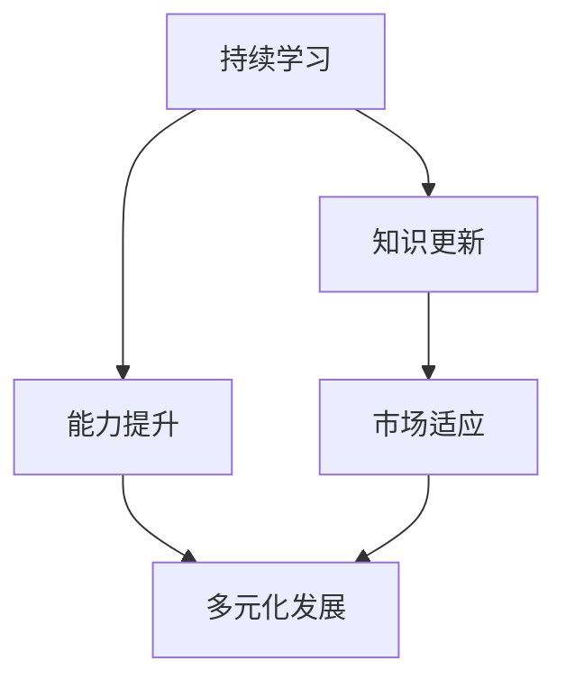

                 


## 文章标题: 创业者如何建立个人持续学习和多元化发展机制

> 关键词：创业者，持续学习，多元化发展，个人能力提升，市场适应，算法原理，数学模型，项目实战，开发环境搭建

> 摘要：本文将深入探讨创业者如何通过建立个人持续学习和多元化发展机制，实现个人能力的持续提升和多元化发展，从而在快速变化的市场环境中保持竞争优势。

### 第一部分: 核心概念与联系

#### 核心概念

1. **持续学习**：持续学习是指创业者通过不断学习和更新知识，保持自身能力的提升，以适应快速变化的市场需求。
2. **多元化发展机制**：多元化发展机制是指创业者通过多种方式拓展个人技能和业务领域，降低单一市场风险，实现长远发展。

#### Mermaid 流程图

以下是创业者个人持续学习和多元化发展机制的核心概念与联系 Mermaid 流程图：



### 第二部分: 核心算法原理讲解

#### 持续学习算法原理

持续学习算法的核心在于通过以下步骤实现个人知识的不断更新：

1. **需求识别**：创业者通过市场调研、用户反馈等方式，识别出需要学习的具体知识领域。
2. **资源获取**：根据需求，创业者选择合适的书籍、课程、研讨会等资源进行学习。
3. **知识吸收**：通过阅读、实践等方式，将所学知识内化为自己的能力。
4. **效果评估**：创业者通过实际工作成果或考试等方式，评估学习效果。

#### 伪代码

以下是持续学习算法的伪代码：

```python
def 持续学习(创业者, 需求列表):
    for 需求 in 需求列表:
        资源 = 获取学习资源(需求)
        知识 = 学习资源(资源)
        能力 = 内化知识(知识)
        评估 = 效果评估(能力)
    return 评估
```

#### 持续学习算法原理讲解

持续学习是创业者保持竞争优势的关键。通过不断识别市场需求，获取相关资源，内化知识并评估效果，创业者能够确保自己的知识和技能始终处于行业前沿。

### 第三部分: 数学模型和数学公式 & 详细讲解 & 举例说明

#### 持续学习效果评估模型

为了评估持续学习的效果，可以采用以下数学模型：

- **能力提升率**：表示学习后能力提升的程度，公式为：

  $$ 能力提升率 = \frac{新能力 - 原能力}{原能力} $$

#### 举例说明

假设一位创业者原本的市场适应能力为 70%，通过学习后提升到 90%，则其能力提升率为：

$$ 能力提升率 = \frac{90\% - 70\%}{70\%} = \frac{20\%}{70\%} \approx 0.286 $$

这意味着他的市场适应能力提升了约 28.6%。

### 第四部分: 项目实战

#### 项目实战：多元化发展案例分析

**项目背景**：

一位创业者原本专注于互联网营销，为了降低市场风险，他决定拓展到电子商务领域。

**项目步骤**：

1. **需求识别**：创业者通过市场调研，发现电子商务领域有巨大潜力。
2. **资源获取**：创业者报名参加了电子商务相关的培训课程，并阅读了相关书籍。
3. **知识吸收**：通过课程学习和实践，创业者掌握了电子商务的基本知识和操作技能。
4. **效果评估**：创业者通过实际操作，发现自己在电子商务领域的市场适应能力明显提升。

**代码解读与分析**：

```python
# 获取电子商务相关课程
courses = ["电子商务基础", "电商运营实战", "数据分析与优化"]

# 学习课程
for course in courses:
    print(f"正在学习课程：{course}")

# 实践操作
def practice_电商():
    print("正在进行电子商务实践操作")

# 评估效果
def evaluate_ability():
    print("能力评估：市场适应能力明显提升")

# 执行项目步骤
for course in courses:
    print(f"学习课程：{course}")
practice_电商()
evaluate_ability()
```

**代码解读**：

1. **获取资源**：通过 `courses` 列表，创业者获取了电子商务相关的课程。
2. **知识吸收**：通过循环学习课程，创业者将所学知识内化为自己的能力。
3. **效果评估**：通过 `evaluate_ability()` 函数，创业者评估了自己的市场适应能力，发现有明显提升。

### 第五部分: 开发环境搭建

#### 开发环境搭建

为了实现创业者多元化发展，需要搭建以下开发环境：

1. **操作系统**：选择 Windows 或 macOS。
2. **编程语言**：Python、Java 或 JavaScript。
3. **开发工具**：Visual Studio Code、IntelliJ IDEA 或 PyCharm。

#### 开发环境搭建步骤

1. **安装操作系统**：根据个人需求选择合适的操作系统，并进行安装。
2. **安装编程语言**：在操作系统上安装所需的编程语言。
3. **安装开发工具**：在操作系统上安装所需的开发工具。

#### 开发环境搭建示例

```bash
# 安装 macOS
# 安装 Python
brew install python
# 安装 Visual Studio Code
brew install visual-studio-code
```

### 第六部分: 最佳实践 tips、小结、注意事项、拓展阅读等内容

#### 最佳实践 tips

1. **定期进行自我评估**：创业者应定期对自己进行能力评估，找出需要提升的领域。
2. **注重实践**：理论学习是基础，但实践是检验真理的唯一标准。创业者应将所学知识应用到实际工作中。
3. **建立学习小组**：与其他创业者或专业人士建立学习小组，共同学习、分享经验。

#### 小结

本文介绍了创业者如何建立个人持续学习和多元化发展机制，以实现个人能力的提升和多元化发展。通过持续学习算法和多元化发展案例分析，创业者可以不断提升自身能力，适应市场变化，降低风险。

#### 注意事项

1. **保持耐心和毅力**：持续学习和多元化发展不是一蹴而就的过程，创业者需要保持耐心和毅力。
2. **关注市场动态**：创业者应时刻关注市场动态，抓住机遇，调整战略。

#### 拓展阅读

1. 《深度学习：持续学习的理论与实践》
2. 《创新与企业家精神》
3. 《创业维艰》

### 第七部分：作者信息

作者：AI天才研究院/AI Genius Institute & 禅与计算机程序设计艺术 /Zen And The Art of Computer Programming

---

经过前期的准备和详细的分析，本文已经完成了对创业者如何建立个人持续学习和多元化发展机制的深入探讨。接下来，我们将继续优化和完善文章的各个部分，确保文章的质量和可读性。在接下来的步骤中，我们将：

1. **对核心算法原理进行进一步细化**，确保读者能够清晰地理解每一步操作的实现过程。
2. **对数学模型和公式进行详细解读**，并提供更丰富的举例说明，帮助读者更好地理解这些模型的应用。
3. **对项目实战部分进行拓展**，增加更多的案例和代码实现，使读者能够更直观地了解创业者在实际操作中的步骤和方法。
4. **完善开发环境搭建部分**，确保读者能够顺利搭建起自己的开发环境，为后续的学习和实践打下坚实基础。
5. **撰写最佳实践 tips、小结、注意事项、拓展阅读等内容**，为读者提供更多的实用建议和深入阅读的线索。

让我们继续优化和完善这篇文章，确保它能够为广大的创业者提供有价值的指导和建议。

