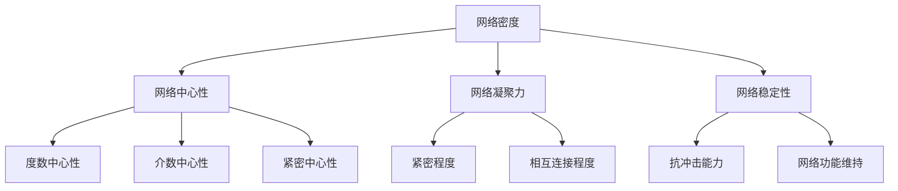
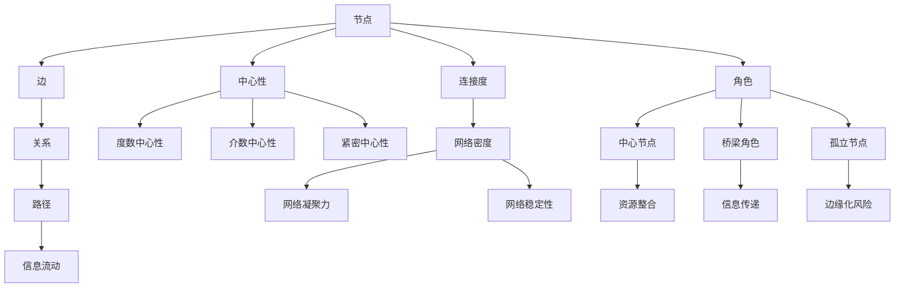

                 

### 文章标题

# 《创业者的人际网络拓展与维护》

### 关键词

- 人际网络
- 创业者
- 拓展技巧
- 维护策略
- 应用案例

### 摘要

本文旨在探讨创业者如何有效拓展和维护人际网络，以实现事业的快速发展。通过对人际网络的基础知识、拓展技巧、应用案例及维护与优化策略的深入分析，本文为创业者提供了一套系统、实用的方法论。文章结构清晰，内容丰富，适合创业者及对人际网络拓展感兴趣的读者阅读和参考。

## 第一部分：人际网络的基础知识

### 1.1 人际网络的定义与重要性

#### 1.1.1 人际网络的定义

人际网络（Social Network）是指个体通过直接或间接的社会关系构成的互动网络。在人际网络中，每个个体都是一个节点，节点之间的联系则构成了网络的边。人际网络的研究源于社会学的领域，但近年来逐渐被商业和管理领域所重视，特别是在创业过程中。

#### 1.1.2 人际网络的重要性

人际网络对创业者的重要性不言而喻。首先，它有助于创业者获取资源，包括资金、人才、技术、市场信息等。其次，人际网络能够帮助创业者分散风险，通过多元化的合作关系来减少单一依赖性。最后，人际网络是创业者进行业务拓展和建立品牌的重要渠道。

#### 1.1.3 人际网络的基本构成要素

人际网络的基本构成要素包括节点（个体）、边（关系）和路径（关系的传递）。节点代表个体，可以是创业者本人、合作伙伴、投资者、员工等。边代表节点之间的关系，可以是合作、友谊、信任等。路径则表示关系的传递方式，如直接联系、间接联系等。

### 1.2 人际网络的层次与类型

#### 1.2.1 人际网络的层次结构

人际网络通常分为三个层次：核心层、紧密层和外围层。

- **核心层**：指的是与创业者关系最为密切的群体，如核心团队成员、亲密朋友、主要合作伙伴等。
- **紧密层**：包括与创业者关系较为紧密的群体，如业务合作伙伴、行业专家、投资人等。
- **外围层**：是指那些与创业者关系较为疏远，但可能带来潜在价值的群体，如行业内其他创业者、潜在客户等。

#### 1.2.2 人际网络的类型

人际网络主要可以分为以下几种类型：

- **强关系网络**：指的是个体之间关系紧密、信任度高的网络，如家庭、亲密朋友。
- **弱关系网络**：是指个体之间关系较为疏远，但能够带来新信息和新机会的网络，如业务合作伙伴、行业专家。
- **结构洞网络**：指的是个体通过关系桥连接不同群体，从而在人际网络中发挥重要作用。

#### 1.2.3 人际网络中的角色与关系

在人际网络中，不同的角色和关系对创业者的成功与否具有重要影响。

- **中心节点**：在人际网络中，中心节点具有很高的连接度，能够连接多个不同的群体，对创业者来说，成为中心节点有助于获取更多资源和机会。
- **桥梁角色**：桥梁角色连接不同的群体，能够在网络中发挥信息传递和资源整合的作用。
- **孤立节点**：孤立节点在人际网络中缺乏连接，容易边缘化，对于创业者来说，应努力避免成为孤立节点。

### 1.3 人际网络的基础概念与联系

为了更好地理解人际网络，我们需要掌握以下几个核心概念：

- **网络密度**：指网络中边的数量与可能边的数量之比，表示网络的紧密程度。
- **网络中心性**：衡量节点在网络中的中心程度，常用的指标有度数中心性、介数中心性和紧密中心性。
- **网络凝聚力**：指网络中个体之间的紧密程度和相互连接的程度。
- **网络稳定性**：指网络在面对外部冲击时，能够维持原有结构和功能的程度。

这些概念之间的关系可以用Mermaid流程图表示：

通过以上对人际网络的基础知识的介绍，创业者可以更好地理解人际网络的本质和作用，为后续的拓展和维护策略奠定基础。

### 1.4 人际网络的基础概念与联系 (续)

在深入探讨人际网络的基础概念时，我们还需要了解一些关键术语和它们之间的关系。以下是一个详细的Mermaid流程图，用于展示这些概念及其相互联系：

**节点（Node）**：在网络中，每个个体都是一个节点。节点代表了网络的主体，是网络分析的基础单位。

**边（Edge）**：节点之间的关系用边来表示。边的类型和强度可以反映个体之间的互动频率和强度。

**关系（Relationship）**：节点之间的关系可以是正式的、非正式的，或是基于共同利益和价值观建立的。关系可以是强关系（如亲密朋友）或弱关系（如业务合作伙伴）。

**路径（Path）**：节点之间的连接路径。路径的长度和类型影响信息的传递速度和效率。

**信息流动（Information Flow）**：信息在网络中的流动，决定了资源的获取和共享方式。有效的信息流动可以增强网络的效率和凝聚力。

**中心性（Centrality）**：衡量节点在网络中的重要性的指标。中心性包括度数中心性、介数中心性和紧密中心性，分别从不同角度评估节点在网络中的影响力。

- **度数中心性（Degree Centrality）**：基于节点的连接度，即连接的节点数量。度数中心性越高，节点在网络中的影响力越大。
- **介数中心性（Closeness Centrality）**：衡量节点到达其他节点的距离和路径数量。介数中心性较高的节点，对网络的整体结构稳定性有重要影响。
- **紧密中心性（Betweenness Centrality）**：衡量节点在网络中作为路径的中转能力。紧密中心性高的节点，在信息传递和资源分配中起着关键作用。

**连接度（Connectivity）**：节点在网络中的连接能力，反映了节点的灵活性和网络的整体结构稳定性。

**网络密度（Network Density）**：网络中实际存在的边数与可能存在的最大边数之比。网络密度越高，网络的凝聚力越强。

**网络凝聚力（Network Cohesion）**：指网络中个体之间的紧密程度和相互连接程度。网络凝聚力是网络稳定性和功能性的重要指标。

**网络稳定性（Network Stability）**：网络在面对外部冲击时，能够维持原有结构和功能的程度。网络稳定性对于创业者的长期发展和风险控制至关重要。

**角色（Role）**：网络中的每个节点可能扮演不同的角色，如中心节点、桥梁角色和孤立节点。这些角色对网络的效率和结构有显著影响。

- **中心节点（Central Node）**：网络中的关键节点，连接多个不同的群体，对资源的获取和分配有重要影响。
- **桥梁角色（Bridge Role）**：连接不同网络群体的节点，对信息的流动和资源的传递起到桥梁作用。
- **孤立节点（Isolated Node）**：缺乏与其他节点的直接联系，容易在网络中边缘化，可能面临资源匮乏和风险增加的问题。

通过上述核心概念和其相互关系的理解，创业者可以更深入地认识到人际网络的结构和运作机制，从而更好地进行人际网络的拓展和维护。

### 1.5 人际网络在创业中的实际应用案例

为了更好地理解人际网络在创业中的实际应用，我们可以通过以下几个具体案例来探讨其在资源获取、风险分散和业务拓展等方面的作用。

#### 案例 1：成功获取投资

**背景介绍**：某创业者张先生在创办一家初创公司前，曾担任一家知名企业的项目经理。他在职期间建立了广泛的人脉网络，特别是在业内拥有较高的声誉和影响力。

**核心概念与联系**：张先生利用其强关系网络，通过朋友引荐和行业活动结识了多位潜在投资者。这些投资者对他的项目表现出浓厚兴趣，并最终决定投资。

**详细讲解与举例说明**：张先生利用其核心层和紧密层的人际关系，通过多次面对面的沟通和交流，建立了信任和信心。在一次行业论坛上，张先生向投资者详细介绍了他的创业项目，并通过展示其技术实力和市场前景，成功获得了投资。

**数学模型与公式**：假设张先生的网络密度为D，度数中心性为DC，介数中心性为CB，紧密中心性为CC。通过以下公式，我们可以衡量他在网络中的影响力：

$$
DC = \frac{连接的节点数}{总节点数}
$$

$$
CB = \frac{网络中所有最短路径经过该节点的比例}{总最短路径数}
$$

$$
CC = \frac{所有其他节点到该节点的最短路径长度之和}{总节点数}
$$

通过这些指标，张先生能够量化其在人际网络中的影响力，从而更好地进行资源获取。

#### 案例 2：风险分散与应对

**背景介绍**：李女士是一位年轻的创业者，她在创办一家互联网公司时，面临着市场波动和资金短缺的风险。

**核心概念与联系**：李女士通过积极参加行业活动和社交聚会，建立了广泛的弱关系网络。这些关系包括业务合作伙伴、行业专家和潜在客户。

**详细讲解与举例说明**：在一次创业交流会上，李女士结识了一位资深投资人。这位投资人不仅提供了资金支持，还帮助她分析了市场风险，并提出了有效的应对策略。

**数学模型与公式**：假设李女士的人际网络中有N个节点，M条边。通过以下公式，我们可以计算网络密度和凝聚力：

$$
D = \frac{M}{\frac{N(N-1)}{2}}
$$

$$
C = \frac{2M}{N(N-1)}
$$

通过这些指标，李女士能够评估她的人际网络密度和凝聚力，从而更好地进行风险分散和应对。

#### 案例 3：业务拓展

**背景介绍**：王先生是一家软件公司的创始人，他在开拓新市场时，遇到了地域限制和客户信任问题。

**核心概念与联系**：王先生通过参加行业展会和论坛，结识了多家潜在客户和合作伙伴。他利用这些弱关系，逐步建立了客户信任，并成功开拓了新市场。

**详细讲解与举例说明**：在一次行业展览会上，王先生与一位大型企业的采购经理进行了深入交流。经过多次沟通，王先生的公司最终获得了该企业的订单，实现了业务拓展。

**数学模型与公式**：假设王先生的人际网络中有N个节点，M条边。通过以下公式，我们可以计算网络中心性和网络凝聚力：

$$
DC = \frac{连接的节点数}{总节点数}
$$

$$
C = \frac{2M}{N(N-1)}
$$

通过这些指标，王先生能够评估他在人际网络中的影响力，并优化其业务拓展策略。

### 项目小结

通过以上案例，我们可以看到人际网络在创业中的实际应用。创业者可以通过建立和优化人际网络，实现资源获取、风险分散和业务拓展。为了达到最佳效果，创业者需要：

1. **建立广泛的网络**：包括强关系和弱关系，确保资源的多样性和信息的丰富性。
2. **优化网络结构**：提高网络的密度和凝聚力，增强网络的整体稳定性。
3. **持续维护和更新**：定期与网络中的个体保持沟通，确保关系的活力和有效性。

总之，人际网络是创业者成功的关键因素之一，创业者应重视人际网络的构建和维护，以实现事业的快速发展。

### 第二部分：人际网络的拓展技巧

#### 2.1.1 通过社交媒体拓展人际网络

社交媒体平台是拓展人际网络的绝佳工具。创业者可以通过以下几个步骤，在社交媒体上建立和扩大自己的人脉：

1. **选择合适的平台**：根据创业者的需求和目标，选择适合的社交媒体平台。例如，LinkedIn适合专业人脉的建立，Twitter和微信公众号则适合传播信息和建立品牌形象。

2. **完善个人资料**：确保个人资料完整、专业，包括头像、简介、职业、教育背景等。清晰的个人资料能够吸引潜在的联系者和合作伙伴。

3. **积极互动与分享**：在社交媒体上积极参与讨论、分享有价值的信息和观点。通过评论、点赞和转发，与平台上的其他用户建立联系。

4. **建立内容品牌**：定期发布高质量的原创内容，如博客文章、行业分析、项目进展等。优质内容能够吸引关注，提升个人和公司的知名度。

5. **利用社交媒体功能**：利用社交媒体平台的私信、群组等功能，主动联系感兴趣的人，建立直接的联系渠道。

6. **参加线上活动和讨论**：积极参与线上活动和讨论，展示自己的专业知识和见解。通过活动，结识志同道合的人，拓展人际网络。

#### 2.1.2 参加行业活动拓展人际网络

参加行业活动是创业者拓展人际网络的重要途径。以下是一些具体的方法和技巧：

1. **选择合适的活动**：选择与创业者所在行业相关的活动，如行业会议、展览会、论坛等。这些活动能够聚集大量潜在的联系者和合作伙伴。

2. **提前准备**：在参加活动前，提前了解活动的议程和参与人员。可以通过活动官网或社交媒体获取相关信息，准备好需要介绍自己和公司内容的简短演讲稿。

3. **积极参与**：在活动中积极发言、提问和参与讨论。通过分享自己的观点和经验，展示专业知识和领导力。

4. **建立联系**：在活动中结识感兴趣的人后，及时交换联系方式，通过邮件或社交媒体进一步沟通和互动。

5. **组织活动**：创业者可以组织一些小型聚会或交流会，邀请行业内的专业人士参与。通过这种方式，不仅可以扩大人际网络，还能提升个人和公司的品牌影响力。

6. **后续跟进**：活动结束后，及时发送感谢邮件，回顾活动中的交流和讨论内容，进一步深化关系。

#### 2.1.3 利用人脉资源拓展人际网络

创业者可以通过以下几个方法，利用现有的人脉资源来拓展人际网络：

1. **主动出击**：通过电话、邮件或社交媒体主动联系现有的朋友、同事、校友等，表达建立联系的意愿。

2. **利用现有关系桥**：通过朋友、家人或同事的推荐，结识新的潜在联系者。这种利用现有关系桥的方式，能够降低建立新关系的难度。

3. **组织聚会和活动**：邀请朋友和同事参加聚会或活动，通过面对面的交流，建立更深层次的关系。

4. **参加兴趣小组和俱乐部**：加入一些与自己兴趣相符的小组或俱乐部，结识志同道合的人。这些兴趣小组和俱乐部提供了一个共同的兴趣和话题，有助于建立自然的联系。

5. **利用职业社交平台**：在职业社交平台如LinkedIn上，主动搜索和联系潜在的合作者和联系者。通过平台的推荐功能，找到与自己有共同兴趣或背景的人。

#### 2.1.4 网络拓展的常见挑战与应对策略

在拓展人际网络的过程中，创业者可能会面临以下常见挑战：

1. **时间管理**：拓展人际网络需要时间和精力，创业者需要在繁忙的工作中合理安排时间。

**应对策略**：设定固定的时间段进行人际网络拓展活动，如每周安排一次行业活动或聚会。

2. **信任建立**：建立信任是人际网络拓展的关键，但往往需要时间和努力。

**应对策略**：通过诚实、透明和积极的沟通，逐步建立信任。提供价值，如分享专业知识和经验，帮助他人解决问题。

3. **资源匮乏**：创业者可能面临资源匮乏的问题，特别是在初创阶段。

**应对策略**：通过低成本或无成本的方式拓展人际网络，如利用社交媒体和免费的活动。

4. **社交障碍**：创业者可能由于性格、经验等原因，在社交活动中感到不自在。

**应对策略**：参加一些小组讨论或聚会，逐步提升社交能力。可以请朋友陪同，或在活动中担任组织者，减轻社交压力。

通过以上策略，创业者可以有效地拓展人际网络，为自己的创业事业打下坚实基础。

### 2.2 人际关系的维护与深化

#### 2.2.1 定期沟通与互动

人际关系的维护需要持续的努力和关注。首先，定期沟通是保持联系的关键。创业者可以通过以下几种方式与网络中的联系人保持定期沟通：

1. **电子邮件**：定期发送更新邮件，如公司动态、项目进展、行业新闻等。这样的邮件不仅能够保持联系，还能展示自己的专业知识和行业敏感度。

2. **电话或视频通话**：不定期地与关键联系人进行电话或视频通话，讨论行业趋势、合作机会等。这种方式能够加深彼此的了解和信任。

3. **社交媒体**：在社交媒体平台上与联系人保持互动，如点赞、评论、转发等。这样的互动能够保持联系的活跃度，并增加双方的互动频率。

4. **线下聚会**：定期组织或参加线下聚会，如行业交流会、晚餐聚会等。面对面的交流能够加深彼此的感情，建立更紧密的联系。

#### 2.2.2 情感投资与信任建立

在人际网络中，情感投资和信任建立是维系关系的关键。以下是一些具体的策略：

1. **真诚关心**：在与人交往时，真诚地关心对方的生活和事业。通过询问和倾听，了解对方的需求和困难，并提供帮助。

2. **提供支持**：在对方需要帮助时，主动提供支持和建议。这种互助精神能够加深彼此的信任和依赖。

3. **共同经历**：参与一些共同的活动或项目，如志愿服务、行业会议等。共同的经历能够增强彼此的默契和情感纽带。

4. **诚实透明**：在沟通和合作中保持诚实和透明，不隐瞒事实，不夸大事实。这样的行为能够赢得对方的信任和尊重。

#### 2.2.3 善于利用关系网络资源

人际网络不仅仅是为了建立联系，更重要的是如何有效地利用这些资源。以下是一些具体的策略：

1. **资源共享**：与他人分享自己的资源和信息，如市场信息、技术资源等。这样的共享能够增强彼此的合作意愿，建立双赢的关系。

2. **介绍合作机会**：在合适的时候，向联系人介绍合作机会，如项目合作、投资机会等。这样的行为能够增加自己在网络中的价值，提高人际网络的质量。

3. **求助与求助**：在需要帮助时，勇于向他人求助，并同样愿意在对方需要时提供帮助。这样的互助关系能够增强网络的稳定性。

4. **信息反馈**：及时向联系人反馈合作或交流的结果，包括成功经验和改进建议。这样的反馈能够增进彼此的信任，优化合作效果。

#### 2.2.4 维护人际关系的最佳实践

为了有效地维护和深化人际关系，创业者可以采用以下最佳实践：

1. **建立联系人档案**：记录联系人的基本信息、联系方式、重要事件和交流记录等。这样的档案有助于及时跟进和个性化沟通。

2. **定期回顾和优化**：定期回顾人际关系，分析哪些关系是有效的，哪些需要进一步维护或拓展。根据实际情况，调整和维护策略。

3. **培养多个核心关系**：在人际网络中，培养多个核心关系，确保在某个关系出现问题时不至于受到重大影响。

4. **持续学习和成长**：不断提升自己的专业知识和技能，增强个人魅力和影响力，从而在人际网络中占据更有利的地位。

通过以上策略和最佳实践，创业者可以有效地维护和深化人际网络，为自己的创业事业提供持续的支持和动力。

### 2.3 高效的人际交往技巧

#### 2.3.1 如何建立良好的第一印象

在人际交往中，第一印象至关重要，它决定了对方是否愿意进一步了解和接触你。以下是一些关键技巧，帮助你建立良好的第一印象：

1. **着装得体**：根据场合选择合适的着装，保持整洁和专业。着装得体不仅能够展现你的自信和专业性，还能让对方感受到你的重视。

2. **礼貌用语**：使用礼貌用语，如“您好”、“请”、“谢谢”等，展现你的尊重和教养。礼貌用语能够营造友好和谐的交流氛围。

3. **面带微笑**：微笑是人际交往中的“万能药”，它能够传递出友好和开放的信号。即使遇到紧张或尴尬的情况，微笑也能帮助你缓解压力，赢得对方的好感。

4. **主动打招呼**：在见面时，主动打招呼，如“你好，很高兴认识你”。主动打招呼能够展现你的自信和热情，让对方感到受欢迎。

5. **倾听和回应**：在交谈中，认真倾听对方的发言，并给予积极的回应。通过倾听和回应，展示你对对方的关注和尊重，建立良好的沟通基础。

6. **简短介绍**：在初次见面时，进行简短的自我介绍，包括姓名、职业、公司等。保持介绍简洁明了，避免冗长和复杂的叙述。

7. **展现自信**：在交谈中展现自信，但不过于自负。自信的态度能够展示你的能力和魅力，让对方对你产生信任。

#### 2.3.2 如何进行有效的沟通

有效的沟通是建立和维护人际关系的关键。以下是一些具体的方法，帮助你进行有效的沟通：

1. **明确目标**：在进行沟通前，明确自己的沟通目标，即你希望从对方那里获得什么信息或达到什么效果。明确的目标能够帮助你在沟通中保持专注和高效。

2. **清晰表达**：在表达自己的观点时，尽量使用简洁明了的语言。避免使用过于复杂或含糊的措辞，确保对方能够准确理解你的意图。

3. **倾听与理解**：在沟通中，不仅要表达自己的观点，还要倾听对方的意见。通过积极的倾听，展示你对对方的尊重和理解，建立信任和共识。

4. **提问与反馈**：在沟通中适时提问，了解对方的观点和需求。同时，给予对方及时的反馈，表达你的理解和认同。这样的互动能够增强沟通的有效性和深度。

5. **控制情绪**：在沟通中，保持冷静和理性，避免情绪化。情绪化的沟通往往会导致误解和冲突，影响人际关系的质量。

6. **非语言沟通**：除了语言表达，非语言沟通同样重要。注意自己的肢体语言、面部表情和语调，确保它们与语言表达一致。非语言沟通能够增强语言表达的效果，提升沟通的整体质量。

7. **适时沉默**：在沟通中，适时保持沉默，给对方思考的空间。沉默能够让对方感受到尊重和重视，促进沟通的深入和有效性。

#### 2.3.3 如何处理人际冲突

人际冲突是人际关系中不可避免的一部分，有效的处理冲突是维护和谐关系的关键。以下是一些具体的方法，帮助你处理人际冲突：

1. **保持冷静**：在冲突发生时，保持冷静和理性，避免情绪化的回应。冷静的态度有助于你客观地分析问题，找到合适的解决方案。

2. **了解原因**：在处理冲突时，深入了解冲突的根源和原因。通过询问和倾听，了解对方的观点和感受，找到问题的核心。

3. **表达理解**：在处理冲突时，表达对对方观点和感受的理解，即使你不同意对方的看法。通过表达理解，展示你的尊重和包容，有助于缓解对方的情绪。

4. **寻求共识**：在冲突中，寻找双方的共同点和利益，寻求共识。通过共识的建立，找到解决问题的最佳方案。

5. **妥协与让步**：在必要的情况下，做出妥协和让步，以维护和谐的人际关系。妥协和让步不仅能够解决问题，还能增强彼此的信任和合作意愿。

6. **积极沟通**：在冲突解决后，通过积极的沟通，确保双方的误解和不满得到解决。通过持续的沟通，巩固解决问题的成果，避免未来再次发生冲突。

通过以上高效的人际交往技巧，创业者可以建立良好的第一印象，进行有效的沟通，并处理人际冲突，从而维护和深化人际网络，为创业事业提供坚实的支持。

### 2.4 人际网络在创业中的应用

#### 3.1 人际网络在创业项目中的价值

人际网络对于创业者来说，具有不可估量的价值。首先，人际网络能够帮助创业者获取丰富的资源，包括资金、人才、技术和市场信息等。以下是人际网络在创业项目中的几个关键价值：

1. **资金获取**：创业者可以通过人际网络，吸引投资者和合作伙伴，为创业项目提供必要的资金支持。特别是在初创阶段，人际网络的资金支持可能是项目启动的关键。

2. **人才引进**：人际网络能够帮助创业者找到合适的团队成员。通过朋友、同事或行业专家的推荐，创业者可以更容易地吸引到具备专业技能和经验的人才。

3. **技术支持**：创业者可以利用人际网络，获取最新的技术和行业动态。通过与业内专家的交流，创业者可以借鉴先进的技术方案，提升项目的竞争力。

4. **市场信息**：人际网络能够提供丰富的市场信息，包括客户需求、竞争对手情况等。这些信息有助于创业者制定更精准的市场策略，提高市场成功率。

5. **合作机会**：人际网络可以帮助创业者发现潜在的合作机会，如与其他企业或组织的合作项目、跨行业合作等。这些合作机会能够扩大创业项目的影响力和市场份额。

6. **品牌推广**：通过人际网络，创业者可以扩大品牌的知名度和影响力。与行业内的重要人物建立联系，能够在行业内外树立良好的品牌形象。

#### 3.2 创业者的人际网络构建策略

为了有效地构建和利用人际网络，创业者需要采取一系列策略。以下是一些关键策略：

1. **明确目标与定位**：在构建人际网络前，创业者需要明确自己的目标与定位。这包括确定自己想要获取的资源、解决的具体问题以及未来发展方向。明确的目标有助于有针对性地拓展和利用人际网络。

2. **识别关键人物**：创业者需要识别并接触那些能够为自己提供资源和支持的关键人物。这包括投资者、行业专家、合作伙伴等。通过精准识别和有效接触，创业者可以更快地建立有价值的联系。

3. **建立信任关系**：建立信任是人际网络拓展和维护的核心。创业者需要通过诚实、透明和积极的沟通，逐步建立与联系者的信任。提供价值、帮助他人和诚实回应是建立信任的重要途径。

4. **积极参与行业活动**：创业者应积极参与行业活动，如会议、研讨会、展览会等。这些活动不仅是拓展人际网络的绝佳机会，还能提升个人的专业形象和行业影响力。

5. **维护与深化关系**：在建立联系后，创业者需要通过定期沟通和互动，维护和深化关系。这包括定期发送更新邮件、参加线下聚会、提供帮助和反馈等。

6. **利用社交媒体**：创业者可以利用社交媒体平台，如LinkedIn、Twitter、微信公众号等，建立和维护人际网络。通过发布专业内容、参与讨论和互动，创业者能够扩大自己的影响力，吸引更多的潜在联系者。

7. **建立核心团队**：创业者需要打造一个高效的团队，通过团队的共同努力，实现创业目标。核心团队成员不仅需要具备专业技能，还要具备良好的人际交往能力和团队合作精神。

8. **优化网络结构**：创业者应定期评估和优化人际网络结构，确保网络的高密度和稳定性。通过识别和培养关键节点，提升网络的整体效能。

通过以上策略，创业者可以有效地构建和利用人际网络，为自己的创业项目提供持续的支持和动力。

### 3.3 人际网络在创业项目中的实际应用案例

为了更好地理解人际网络在创业项目中的应用，我们通过以下几个实际案例来探讨人际网络在资源获取、风险分散和业务拓展方面的具体作用。

#### 案例 1：通过人际网络获取资金支持

**背景介绍**：王女士是一位年轻的创业者，她创办了一家专注于环保科技的创新企业。在创业初期，王女士需要大量资金来支持技术研发和市场推广。

**核心概念与联系**：王女士通过自己的人际网络，特别是她的大学校友和行业内的朋友，成功吸引了几位天使投资者的关注。她利用这些关系，向投资者详细介绍了公司的技术优势和市场前景，最终获得了第一轮资金支持。

**详细讲解与举例说明**：王女士在建立公司之前，就已经通过参加行业活动和校友聚会，建立了广泛的人脉网络。在准备融资时，她通过电话和邮件主动联系了这些潜在投资者，分享了公司的愿景和计划。在多次沟通和交流后，投资者对项目产生了浓厚的兴趣，并决定投资。

**数学模型与公式**：为了量化王女士在人际网络中的影响力，可以使用以下公式：

$$
影响力 = \frac{获得的投资金额}{初始所需资金}
$$

通过这个公式，我们可以看到王女士成功获取的投资金额与她最初所需资金的比值，从而衡量她的人际网络对其创业项目的重要性。

#### 案例 2：利用人际网络分散风险

**背景介绍**：李先生是一位经验丰富的创业者，他在创办一家互联网公司时，面临市场波动和竞争压力的风险。

**核心概念与联系**：李先生通过人际网络，建立了多个业务合作伙伴关系。这些合作伙伴包括不同行业的公司，如硬件制造商、软件开发商等。通过这些合作关系，李先生成功分散了单一市场依赖的风险，提高了企业的抗风险能力。

**详细讲解与举例说明**：在一次行业论坛上，李先生结识了一位从事硬件开发的朋友。经过多次交流和合作，他们决定共同开发一款结合硬件和软件的创新产品。这个合作不仅帮助李先生分散了市场风险，还提升了产品的竞争力。

**数学模型与公式**：为了衡量李先生的人际网络在分散风险方面的效果，可以使用以下公式：

$$
风险分散度 = \frac{非依赖市场收入}{总收入}
$$

通过这个公式，我们可以看到李先生通过人际网络建立的多市场依赖度，从而降低企业的整体风险。

#### 案例 3：通过人际网络拓展业务

**背景介绍**：张先生是一家教育科技公司的创始人，他在拓展海外市场时，遇到了文化差异和语言障碍的挑战。

**核心概念与联系**：张先生通过加入国际创业者协会，结识了多位来自不同国家的创业者。通过这些联系，他获得了海外市场的宝贵信息和合作机会，成功拓展了公司的业务。

**详细讲解与举例说明**：在一次国际创业者协会的会议上，张先生结识了一位来自德国的教育科技创业者。在后续的交流中，他们发现彼此的业务有互补性，决定共同开发一个国际化的教育产品。这个合作不仅帮助张先生拓展了海外市场，还提升了公司的国际化水平。

**数学模型与公式**：为了衡量张先生通过人际网络拓展业务的效果，可以使用以下公式：

$$
业务拓展率 = \frac{新增海外收入}{总收入}
$$

通过这个公式，我们可以看到张先生通过人际网络成功拓展的业务占比，从而评估人际网络对业务增长的作用。

### 项目小结

通过以上案例，我们可以看到人际网络在创业项目中的实际应用和巨大价值。创业者可以通过以下方式利用人际网络：

1. **获取资金支持**：通过建立和利用人际网络，吸引投资者和合作伙伴，为创业项目提供资金支持。
2. **分散风险**：通过建立多元化的合作关系，分散市场依赖，提高企业的抗风险能力。
3. **拓展业务**：通过人际网络获取市场信息、合作伙伴和国际化机会，实现业务的拓展和增长。

总之，人际网络是创业者成功的重要因素之一，创业者应重视人际网络的构建和维护，以实现创业项目的快速发展。

### 3.4 创业者的人际网络构建策略：明确目标与定位

明确目标与定位是构建成功人际网络的第一步。对于创业者来说，这一过程尤为重要，因为它直接关系到人际网络的效能和可持续性。

#### 3.4.1 确定创业目标

在构建人际网络之前，创业者需要明确自己的创业目标。这包括以下几个方面：

1. **项目目标**：明确公司的愿景、使命和短期目标。例如，公司希望在多长时间内达到多少用户量，实现什么样的市场份额等。
2. **资源需求**：确定项目所需的资源，如资金、人才、技术等。这些资源的需求将决定创业者需要建立哪些类型的人际网络。
3. **市场需求**：分析目标市场，了解潜在客户的需求和痛点。这有助于创业者识别需要哪些类型的合作伙伴和联系者。

#### 3.4.2 明确个人定位

除了项目目标外，创业者还需要明确个人的定位，这包括以下几个方面：

1. **专业领域**：明确自己在行业中的专业领域和独特优势。这有助于在人际网络中树立专业形象，吸引同行业的人士建立联系。
2. **个人品牌**：构建个人品牌，通过社交媒体、行业活动等平台展示自己的专业知识和经验。良好的个人品牌能够增强人际网络中的信任度和影响力。
3. **个人兴趣和价值观**：明确个人的兴趣和价值观，这些因素将影响人际网络中的选择和互动方式。与价值观相似的人建立联系，能够增强人际网络的内聚力和稳定性。

#### 3.4.3 制定目标与定位的策略

在明确目标和定位后，创业者可以采取以下策略：

1. **设定具体目标**：将宏观的目标具体化，制定可衡量的短期目标。例如，每月增加10个潜在客户，每季度完成一次产品迭代等。
2. **确定优先级**：根据目标和资源的需求，确定人际网络构建的优先级。例如，首先关注能够提供资金支持的投资者和合作伙伴，然后是能够提供技术支持的专家和顾问。
3. **制定行动计划**：制定具体的行动计划，包括参与哪些行业活动、与哪些人建立联系、定期更新联系人的信息等。
4. **持续评估和调整**：定期评估人际网络的构建效果，根据实际情况调整策略。例如，如果发现某个网络节点没有带来预期的价值，可以重新评估其重要性，甚至考虑取消或更换联系。

#### 3.4.4 实际案例分析

以下是一个具体的案例分析，展示如何通过明确目标和定位构建成功的人际网络：

**案例背景**：李女士是一位专注于健康科技领域的创业者，她创办了一家智能健康监测公司。李女士在构建人际网络时，明确了以下目标和定位：

- **项目目标**：李女士希望公司能在五年内成为国内健康科技领域的领先企业，实现数百万用户的基础规模。
- **个人定位**：李女士擅长医疗健康领域的研发，她将自己定位为一名技术专家和行业领导者。

**具体策略**：

1. **设定具体目标**：李女士设定了每年的用户增长目标、研发项目的进度目标以及市场拓展目标。
2. **确定优先级**：李女士优先建立与医疗专家、投资人和技术顾问的联系，因为这些联系能够直接支持她的创业目标。
3. **制定行动计划**：李女士制定了详细的行动计划，包括参加行业会议、在线课程、社交媒体互动等。
4. **持续评估和调整**：李女士定期评估人际网络的构建效果，通过反馈和数据分析，不断优化和调整策略。

**效果评估**：经过一年的努力，李女士成功吸引了多位投资者和专家的加入，公司的用户量迅速增长，研发项目也按计划推进。通过明确的目标和定位，李女士有效地构建了一个强大的支持网络，为公司的快速发展奠定了基础。

通过上述策略和案例分析，创业者可以更好地明确自己的目标和定位，构建有效的人际网络，为自己的创业事业提供持续的支持和动力。

### 3.5 创业者的人际网络构建策略：打造核心团队

在创业过程中，核心团队是推动公司发展的关键力量。打造一支高效、协作的核心团队，不仅能够提高项目执行力，还能增强企业的创新能力。以下是如何通过以下策略来打造一支强大的核心团队：

#### 3.5.1 确定核心团队的关键角色

一个成功的创业团队通常包括以下关键角色：

1. **创始人或CEO**：作为团队的领导者，负责制定公司的愿景、战略和日常运营。
2. **技术负责人**：负责技术研发，确保项目的技术可行性和产品质量。
3. **市场营销负责人**：负责市场分析和推广策略，推动产品销售和品牌建设。
4. **财务负责人**：负责财务管理，确保公司资金链的稳定和财务健康。
5. **运营负责人**：负责日常运营，确保项目按计划推进，团队协作顺畅。

#### 3.5.2 招聘与选拔

在确定关键角色后，创业者需要通过以下步骤招聘和选拔团队成员：

1. **发布招聘信息**：在招聘网站上发布详细的职位描述，明确岗位职责、技能要求和薪资待遇。
2. **筛选简历**：根据职位要求，筛选合适的简历，重点关注候选人的专业技能、经验和成就。
3. **面试评估**：通过面试评估候选人的沟通能力、团队合作精神和技术能力。可以采用多轮面试，确保评估的全面性和准确性。
4. **背景调查**：对候选人进行背景调查，了解其工作经历和人际关系。

#### 3.5.3 培训与发展

招聘完成后，创业者需要为团队成员提供必要的培训和职业发展机会：

1. **技能培训**：根据团队成员的技能需求，提供专业的技能培训，如技术培训、市场营销培训等。
2. **领导力发展**：为潜在的管理人员提供领导力培训，提升其领导能力和团队管理能力。
3. **职业规划**：与团队成员共同制定职业发展规划，确保其职业目标和公司发展目标一致。

#### 3.5.4 团队协作

打造高效的团队需要注重协作和沟通：

1. **制定明确的职责和目标**：确保每个团队成员都清楚自己的职责和项目的目标，避免职责重叠和冲突。
2. **建立高效的沟通机制**：通过定期会议、项目进展报告等方式，确保团队成员之间的沟通畅通。
3. **鼓励团队合作**：通过团队建设活动和协作工具，增强团队成员之间的互信和合作意愿。

#### 3.5.5 绩效评估与激励

为了保持团队的活力和高效，创业者需要建立科学的绩效评估和激励机制：

1. **绩效评估**：定期对团队成员进行绩效评估，根据评估结果给予相应的奖励和晋升机会。
2. **激励机制**：通过奖金、股权激励等方式，激发团队成员的积极性和创造力。
3. **反馈与改进**：鼓励团队成员提供反馈，不断改进工作流程和团队管理策略。

通过以上策略，创业者可以打造一支强大的核心团队，为创业项目的成功奠定坚实的基础。

### 3.6 创业者的人际网络构建策略：维护和拓展外部关系

在创业过程中，除了打造高效的核心团队，维护和拓展外部关系同样至关重要。以下是一些关键策略，帮助创业者有效地维护和拓展外部关系：

#### 3.6.1 定期沟通与互动

定期沟通是维护外部关系的基础。创业者可以通过以下几种方式与外部联系人保持联系：

1. **电子邮件**：定期发送更新邮件，包括公司动态、项目进展、行业新闻等。这类邮件不仅能够保持联系，还能展示专业知识和行业敏感度。
2. **电话或视频通话**：不定期地与关键联系人进行电话或视频通话，讨论行业趋势、合作机会等。这种方式能够加深彼此的了解和信任。
3. **社交媒体**：在社交媒体平台上与联系人保持互动，如点赞、评论、转发等。这样的互动能够保持联系的活跃度，并增加双方的互动频率。
4. **线下聚会**：定期组织或参加线下聚会，如行业交流会、晚餐聚会等。面对面的交流能够加深彼此的感情，建立更紧密的联系。

#### 3.6.2 情感投资与信任建立

在维护外部关系时，情感投资和信任建立是关键。以下是一些具体的策略：

1. **真诚关心**：在与人交往时，真诚地关心对方的生活和事业。通过询问和倾听，了解对方的需求和困难，并提供帮助。
2. **提供支持**：在对方需要帮助时，主动提供支持和建议。这种互助精神能够加深彼此的信任和依赖。
3. **共同经历**：参与一些共同的活动或项目，如志愿服务、行业会议等。共同的经历能够增强彼此的默契和情感纽带。
4. **诚实透明**：在沟通和合作中保持诚实和透明，不隐瞒事实，不夸大事实。这样的行为能够赢得对方的信任和尊重。

#### 3.6.3 善于利用关系网络资源

利用外部关系网络资源，能够为创业项目提供更多支持和机会。以下是一些具体策略：

1. **资源共享**：与他人分享自己的资源和信息，如市场信息、技术资源等。这样的共享能够增强彼此的合作意愿，建立双赢的关系。
2. **介绍合作机会**：在合适的时候，向联系人介绍合作机会，如项目合作、投资机会等。这样的行为能够增加自己在网络中的价值，提高人际网络的质量。
3. **求助与求助**：在需要帮助时，勇于向他人求助，并同样愿意在对方需要时提供帮助。这样的互助关系能够增强网络的稳定性。
4. **信息反馈**：及时向联系人反馈合作或交流的结果，包括成功经验和改进建议。这样的反馈能够增进彼此的信任，优化合作效果。

#### 3.6.4 维护外部关系的最佳实践

为了有效地维护和拓展外部关系，创业者可以采用以下最佳实践：

1. **建立联系人档案**：记录联系人的基本信息、联系方式、重要事件和交流记录等。这样的档案有助于及时跟进和个性化沟通。
2. **定期回顾和优化**：定期回顾外部关系，分析哪些关系是有效的，哪些需要进一步维护或拓展。根据实际情况，调整维护策略。
3. **培养多个核心关系**：在人际网络中，培养多个核心关系，确保在某个关系出现问题时不至于受到重大影响。
4. **持续学习和成长**：不断提升自己的专业知识和技能，增强个人魅力和影响力，从而在人际网络中占据更有利的地位。

通过以上策略和最佳实践，创业者可以有效地维护和拓展外部关系，为自己的创业事业提供持续的支持和动力。

### 3.7 人际网络在创业项目中的实际应用案例：成功与失败的解析

在创业过程中，人际网络的建立和应用对于项目的成功与否具有决定性作用。以下将通过具体案例对人际网络在创业项目中的成功应用和失败原因进行深入解析。

#### 案例 1：成功的应用

**背景介绍**：张先生是一位年轻的创业者，他在创办一家智能硬件公司时，充分利用了自己的人脉网络。

**核心概念与联系**：张先生在大学期间建立了广泛的科技人脉，通过参加行业活动和学术研讨会，结识了许多行业专家和潜在投资者。

**详细讲解与举例说明**：

1. **资源获取**：张先生通过人脉网络，找到了一位在智能硬件领域有丰富经验的工程师，这位工程师成为了公司的技术总监。此外，他还通过人脉关系获得了第一笔天使投资，为公司的技术研发提供了资金支持。

2. **市场拓展**：张先生利用自己在行业内的知名度，与多家知名科技企业建立了合作关系。这些合作不仅为公司带来了市场机会，还提升了产品的技术水平和市场竞争力。

3. **风险分散**：张先生通过人脉网络，与多个供应商建立了长期合作关系，确保了供应链的稳定。此外，他还通过与多个投资者建立了联系，分散了资金风险。

**经验总结**：

- **有效的资源获取**：充分利用人际网络，找到合适的合作伙伴和投资者，为创业项目提供必要的资源和支持。
- **多元化的合作关系**：建立多元化的合作关系，分散风险，提升供应链的稳定性。
- **持续的沟通与互动**：通过定期的沟通和互动，维护和深化人际关系，确保人际网络的长期有效性。

#### 案例 2：失败的原因

**背景介绍**：李女士是一位初次创业的创业者，她在创办一家电子商务公司时，忽视了人际网络的重要性。

**核心概念与联系**：李女士在创业前没有建立广泛的人脉网络，她主要通过社交媒体和线上平台寻找合作伙伴和资源。

**详细讲解与举例说明**：

1. **资源获取困难**：由于缺乏人脉，李女士在寻找投资者和技术人才时遇到了很大困难。她主要通过在线平台发布招聘信息和寻找潜在投资者，但效果不佳。

2. **市场开拓受阻**：李女士在开拓市场时，缺乏行业内的支持网络。她试图通过广告和线上营销来推广产品，但由于缺乏有效的市场渠道和合作伙伴，市场开拓进展缓慢。

3. **风险集中**：由于缺乏多元化合作，李女士的所有资源和资金都集中在几个关键的供应商和投资者身上。一旦这些合作出现问题，将对公司的运营和资金链造成严重影响。

**失败原因**：

- **人际网络缺失**：缺乏广泛的人脉网络，导致在资源获取、市场拓展和风险分散方面受限。
- **依赖单一渠道**：过度依赖线上平台，忽视了线下活动和人际关系的建立。
- **风险集中**：缺乏多元化的合作关系，导致资源和资金的过度集中，增加了公司的运营风险。

#### 经验总结

通过以上案例，我们可以得出以下经验总结：

1. **重视人际网络**：在创业初期，创业者应重视人际网络的建立和维护，充分利用人脉资源，获取资金、技术和市场支持。
2. **多元化合作**：建立多元化的合作关系，分散风险，确保公司的稳定运营。
3. **持续的沟通与互动**：通过定期的沟通和互动，维护和深化人际关系，确保人际网络的长期有效性。

总之，人际网络是创业成功的关键因素之一。创业者应重视人际网络的构建和维护，充分利用人际网络为创业项目提供支持，实现创业目标的顺利实现。

### 3.8 人际网络拓展与维护的策略：识别与评估

在人际网络拓展与维护的过程中，识别和评估关系是至关重要的一步。只有准确识别和评估关键关系，创业者才能有针对性地进行拓展和维护，从而实现最大化的效益。

#### 3.8.1 关系识别

关系识别是构建有效人际网络的第一步。创业者需要通过以下方式识别关键关系：

1. **分析个人背景**：回顾自己的教育背景、工作经历、社会活动等，识别与这些经历相关的人员。这些人可能成为创业者人际网络中的重要节点。

2. **利用现有资源**：创业者可以借助现有的人脉资源，如朋友、家人、同事、校友等，通过推荐和介绍，扩展人际网络。

3. **参加行业活动**：通过参加行业会议、研讨会、展览会等活动，结识行业内的重要人物。这些活动不仅提供了接触新联系人的机会，还能提升个人的行业影响力。

4. **社交媒体搜索**：利用社交媒体平台，如LinkedIn、微博、微信等，通过关键词搜索、群组参与等方式，找到潜在的合作伙伴和投资者。

#### 3.8.2 关系评估

在识别关键关系后，创业者需要对这些关系进行评估，以确定其价值和潜在影响。以下是一些评估方法：

1. **资源价值评估**：评估关系能够为公司带来的资源，如资金、技术、市场信息、人才等。创业者可以通过与关系人的沟通，了解其资源和能力，并进行量化评估。

2. **关系强度评估**：评估关系之间的紧密程度和信任度。强关系通常基于深厚的情感和共同的价值观，而弱关系则可能更注重实际利益的交换。创业者可以通过定期的沟通和互动，评估关系的强度。

3. **影响力评估**：评估关系人对其业务和公司发展的影响力度。例如，某位关系人能否为公司提供重要的市场机会，或是帮助公司解决关键的技术难题。

4. **长期潜力评估**：评估关系在未来可能为公司带来的长期利益。创业者需要考虑关系人的持续性和可拓展性，以及他们能否为公司带来新的业务和机会。

#### 3.8.3 关系识别与评估的步骤

为了有效地识别和评估关系，创业者可以采取以下步骤：

1. **建立联系人列表**：首先，创业者需要建立一个全面的联系人列表，包括联系人的姓名、联系方式、关系背景等信息。

2. **分类与标记**：根据联系人的特点和资源，对其进行分类和标记。例如，可以将联系人分为潜在投资者、技术合作伙伴、市场渠道等类别。

3. **定期评估**：定期对联系人进行评估，更新联系人列表。创业者可以通过问卷调查、沟通反馈等方式，了解联系人的资源和影响力。

4. **优先级排序**：根据评估结果，对联系人进行优先级排序。重点关注那些资源丰富、关系紧密且具有高影响力的关系人。

5. **策略调整**：根据评估结果，调整人际网络的拓展和维护策略。例如，对于资源丰富但关系较弱的关系人，可以加强沟通，提升关系强度。

#### 3.8.4 实际案例

以下是一个实际案例，展示如何通过关系识别与评估进行人际网络拓展与维护：

**案例背景**：王先生是一家初创科技公司的创始人，他希望通过人际网络获取资金和资源支持。

**关系识别与评估**：

1. **建立联系人列表**：王先生首先列出自己所有的联系人，包括朋友、同事、行业专家、校友等。

2. **分类与标记**：他将联系人分为以下几类：潜在投资者、技术合作伙伴、市场渠道、行业专家等。

3. **定期评估**：王先生定期与这些联系人沟通，了解他们的资源和能力。他通过问卷调查的方式，收集联系人对公司的评价和建议。

4. **优先级排序**：根据评估结果，王先生将潜在投资者和关键技术合作伙伴列为最高优先级，因为他们对公司的发展至关重要。

5. **策略调整**：王先生加强了对这些高优先级联系人的沟通和维护，通过举办小型聚会和私人会议，与他们保持紧密联系。

**结果**：通过有效的关系识别与评估，王先生成功吸引了几位关键投资者，并与几位技术专家建立了长期合作关系，为公司的发展提供了强有力的支持。

通过以上案例，我们可以看到，关系识别与评估是人际网络拓展与维护的重要环节。创业者需要通过系统的方法，准确识别和评估关键关系，从而实现人际网络的优化和最大化效益。

### 3.9 人际网络拓展与维护的策略：风险管理

在人际网络的拓展和维护过程中，风险管理是一个不可忽视的重要环节。有效的风险管理能够帮助创业者识别潜在风险，并采取相应的控制措施，从而确保人际网络的稳定和可持续性。

#### 3.9.1 风险识别

首先，创业者需要识别人际网络中可能存在的风险。以下是一些常见的人际网络风险：

1. **关系破裂**：由于各种原因，如利益冲突、沟通不畅等，可能导致重要关系的破裂。
2. **资源枯竭**：过度依赖某一关系或资源，可能导致在关系断裂时，资源获取受阻。
3. **信息泄露**：在人际网络中，敏感信息可能会被泄露，影响公司的隐私和安全。
4. **信任危机**：信任是人际网络的基础，一旦信任受到质疑，可能导致关系破裂和合作失败。
5. **竞争风险**：与合作伙伴的关系可能因竞争关系而变得复杂，甚至引发冲突。

#### 3.9.2 风险评估

在识别风险后，创业者需要对风险进行评估，以确定其影响程度和发生的可能性。以下是一些评估方法：

1. **定性评估**：通过专家访谈、头脑风暴等方式，对风险的影响程度和发生可能性进行定性分析。
2. **定量评估**：使用数学模型和统计方法，对风险的影响程度和发生可能性进行量化分析。例如，可以采用概率分布、风险矩阵等方法。
3. **情景分析**：通过模拟不同情境下的风险表现，分析其对人际网络的潜在影响。

#### 3.9.3 风险控制

在评估风险后，创业者需要采取相应的控制措施，以降低风险的发生概率和影响程度。以下是一些常见的方法：

1. **建立预警机制**：通过定期监控和评估人际网络状态，及时发现潜在风险。例如，可以设置关键指标，如关系紧张度、合作成功率等，进行实时监控。
2. **制定应急预案**：针对可能发生的风险，制定相应的应急预案，以应对突发情况。例如，可以制定关系破裂后的应对策略，确保在关系破裂时能够迅速找到替代资源。
3. **加强沟通与透明度**：通过加强沟通和保持透明度，增强人际网络中的信任和理解，降低关系破裂的风险。例如，定期召开沟通会议，及时反馈项目进展和问题。
4. **多样化合作**：通过建立多元化的合作关系，分散风险，降低对单一关系的依赖。例如，可以与多个供应商和合作伙伴建立合作关系，确保在某个合作出现问题时，有其他合作可以替代。

#### 3.9.4 实际案例

以下是一个实际案例，展示如何通过风险管理确保人际网络的稳定和可持续性：

**案例背景**：李女士是一家初创企业的创始人，她通过人际网络获得了多项业务合作。但在一次合作中，合作伙伴因内部矛盾导致关系破裂，严重影响了公司的运营。

**风险识别与评估**：

1. **关系破裂风险**：李女士通过分析发现，合作关系的破裂是由于双方在利益分配上存在分歧。
2. **资源枯竭风险**：由于该合作伙伴为公司提供了主要的业务支持，关系破裂后，公司面临资源枯竭的风险。

**风险控制**：

1. **建立预警机制**：李女士通过定期沟通，及时了解合作伙伴的动态，发现问题后，立即采取调整措施。
2. **制定应急预案**：李女士提前制定了合作破裂后的应对策略，包括寻找新的合作伙伴和调整业务计划。
3. **加强沟通与透明度**：李女士通过加强与合作伙伴的沟通，保持了双方的信任和理解，降低了关系破裂的风险。
4. **多样化合作**：李女士积极拓展新的业务合作机会，降低了单一合作关系对公司运营的影响。

**结果**：通过有效的风险管理，李女士成功应对了合作破裂的危机，确保了公司的稳定运营。

通过以上案例，我们可以看到，风险管理在人际网络拓展与维护中的重要性。创业者需要通过系统的识别、评估和控制措施，确保人际网络的稳定和可持续性。

### 3.10 人际网络拓展与维护的策略：持续优化

在人际网络的拓展与维护过程中，持续优化是确保网络效能和可持续性的关键。以下是一些策略，帮助创业者不断优化人际网络。

#### 3.10.1 定期更新联系人信息

联系人信息的更新是保持人际网络活力和有效性的基础。创业者应定期检查和更新联系人的信息，确保信息的准确性和及时性。以下是一些具体措施：

1. **创建联系人档案**：为每个联系人创建详细的档案，包括姓名、联系方式、职业、公司等信息。档案应方便查找和更新。
2. **自动化工具**：利用自动化工具，如联系人管理软件，定期备份和更新联系人信息。这些工具能够自动同步和更新信息，节省时间和精力。
3. **定期确认**：通过定期与联系人沟通，确认其信息的准确性。例如，每年进行一次联系人的信息更新确认。

#### 3.10.2 保持活跃的沟通状态

活跃的沟通状态能够增强人际网络中的互动和信任。以下是一些保持沟通活跃的方法：

1. **定期邮件更新**：定期发送邮件，分享公司的最新动态、项目进展和行业资讯。这些邮件不仅能够保持联系，还能展示公司的专业性和行业敏感度。
2. **社交媒体互动**：在社交媒体平台上，如LinkedIn、微信、微博等，与联系人保持互动。通过点赞、评论、转发等方式，展示关注和支持。
3. **线下聚会**：定期组织或参加线下聚会，如行业交流会、晚餐聚会等。面对面的交流能够加深彼此的感情，建立更紧密的联系。

#### 3.10.3 建立有效的沟通渠道

建立有效的沟通渠道是确保信息传递顺畅和高效的关键。以下是一些有效的沟通渠道：

1. **电话和视频通话**：对于需要深入讨论和交流的内容，采用电话或视频通话，确保沟通的深度和效果。
2. **邮件和短信**：对于简单快捷的信息传递，可以使用邮件和短信，这些工具能够快速传达信息，减少沟通成本。
3. **社交媒体和即时通讯工具**：利用社交媒体和即时通讯工具，如微信、WhatsApp等，进行实时沟通和互动。

#### 3.10.4 优先维护核心关系

在人际网络中，核心关系对创业者的成功至关重要。因此，创业者应优先维护和深化这些关系。以下是一些维护核心关系的策略：

1. **个性化沟通**：针对每个核心关系，进行个性化的沟通和互动。了解对方的需求和痛点，提供有针对性的支持和帮助。
2. **定期会议**：定期与核心关系人进行面对面的会议，讨论合作机会、项目进展和行业趋势。这些会议能够深化关系，增强信任。
3. **互助合作**：与核心关系人建立互助合作关系，通过资源共享、技术交流等方式，提升双方的互利共赢。

#### 3.10.5 持续优化人际网络结构

人际网络的结构对网络的效能和稳定性有重要影响。创业者应定期评估和优化人际网络结构，确保其健康和高效。以下是一些优化策略：

1. **识别关键节点**：通过分析网络结构，识别关键节点，这些节点对网络的稳定性和效能有显著影响。重点关注这些节点，确保其健康和活跃。
2. **调整网络密度**：根据网络密度和凝聚力，调整人际网络的结构。适度增加节点和边的数量，提升网络的密度和凝聚力。
3. **多元化合作**：通过建立多元化的合作关系，分散风险，提升网络的稳定性和灵活性。

通过以上策略，创业者可以持续优化人际网络，确保其效能和可持续性，为创业事业的快速发展提供坚实支持。

### 3.11 人际网络拓展与维护的工具与资源

在人际网络的拓展与维护过程中，使用适当的工具和资源能够极大地提升效率和效果。以下是一些常用工具和资源的推荐，帮助创业者更好地进行人际网络拓展与维护。

#### 3.11.1 人际网络拓展工具

1. **LinkedIn**：LinkedIn 是全球领先的职业社交平台，创业者可以通过该平台建立和拓展专业人脉，寻找潜在的投资者和合作伙伴。

2. **Meetup**：Meetup 是一个基于兴趣的社交网络平台，创业者可以在这里找到并参加各种线下活动，如行业会议、研讨会和社交聚会。

3. **Eventbrite**：Eventbrite 是一个在线活动管理平台，创业者可以利用它来组织和参加行业活动，扩大自己的人脉圈。

4. **Gmail**：Gmail 是一款功能强大的电子邮件服务，创业者可以通过其邮件功能定期与联系人保持沟通，分享公司动态和行业资讯。

5. **WhatsApp**：WhatsApp 是一款流行的即时通讯工具，创业者可以用来与联系人进行实时沟通，提高信息传递的速度和效率。

#### 3.11.2 人际网络维护工具

1. **Evernote**：Evernote 是一款强大的笔记和便签应用，创业者可以使用它来记录和整理联系人信息、项目进展和重要事件。

2. **Trello**：Trello 是一款项目管理和协作工具，创业者可以利用它来管理团队成员的工作任务和项目进度，确保团队高效协同。

3. **Slack**：Slack 是一款团队协作工具，创业者可以在其中创建不同的聊天频道，与团队成员和联系人进行实时沟通和协作。

4. **Asana**：Asana 是一款项目管理和协作工具，创业者可以利用它来跟踪项目进度、分配任务和协调工作，确保项目顺利进行。

#### 3.11.3 人际网络拓展与维护资源推荐

1. **书籍推荐**：

   - 《人脉：人脉就是钱脉》（人脉管理专家哈维·麦克的著作，介绍了人脉建立与拓展的方法和技巧。）
   - 《关键联系：如何通过人脉获取商业机会》（企业家理查德·布兰森的著作，分享了他通过人脉网络成功拓展业务的经历和策略。）
   - 《网络的力量：人际网络如何改变我们的生活》（社会学家马克·格兰诺维特的著作，详细探讨了人际网络的结构和功能。）

2. **课程推荐**：

   - Coursera 上的《人际网络与领导力》（由知名大学开设的课程，介绍了人际网络的基本概念和应用，以及领导力的培养方法。）
   - Udemy 上的《人脉管理：从零开始建立强大人脉网络》（实用课程，涵盖人脉建立、维护和优化的方法和技巧。）

3. **网络资源推荐**：

   - Harvard Business Review（哈佛商业评论）：该网站提供了丰富的商业和管理类文章，有助于创业者了解人际网络的重要性和应用。
   - Inc.com（创业公司）：该网站提供了大量的创业资源和行业资讯，包括人际网络拓展和维护的最佳实践。
   - Entrepreneur.com（企业家）：该网站提供了丰富的创业故事、策略和建议，包括人际网络建设方面的经验分享。

通过使用这些工具和资源，创业者可以更加高效地拓展和维护人际网络，为自己的创业事业提供强有力的支持。

### 附录 A：人际网络拓展与维护的实用技巧

#### A.1 如何在社交场合中有效拓展人脉

在社交场合中拓展人脉是建立人际网络的重要步骤。以下是一些实用的技巧：

1. **提前准备**：在参加社交活动前，了解活动的议程和参与人员，提前准备一些话题和开场白，以便更好地与人交流。

2. **主动交流**：在活动中，主动与人交流，不要害怕表达自己的观点和兴趣。通过积极参与讨论，展示自己的专业知识和热情。

3. **寻找共同点**：与人交流时，寻找共同点，如兴趣爱好、工作经历或行业话题。共同点能够帮助双方建立联系，加深互动。

4. **名片交换**：在交谈结束后，礼貌地交换名片，留下联系方式。交换名片不仅是一种礼节，也是建立后续联系的重要步骤。

5. **跟进交流**：活动结束后，及时通过邮件或社交媒体与刚认识的人进行联系，回顾交流内容，进一步加深关系。

#### A.2 如何在日常生活中维护人际关系

维护人际关系不仅需要社交场合的交流，还需要日常生活中的持续关注。以下是一些实用的技巧：

1. **定期沟通**：通过电话、邮件、短信或社交媒体与朋友、家人和业务伙伴保持定期沟通，分享生活和工作中的点滴。

2. **关注对方动态**：通过社交媒体、新闻或个人交流，了解对方的近况，表达关心和支持。这种关心能够增强关系的亲密感和稳定性。

3. **提供帮助**：在对方需要帮助时，主动提供支持和建议。通过实际的帮助，展示你的能力和关爱，增强关系的信任和依赖。

4. **共度时光**：尽量安排时间与朋友、家人共度时光，通过面对面的交流和活动，加深彼此的感情。

5. **回馈与感恩**：在收到对方帮助或礼物时，及时表示感谢。通过回馈和感恩，表达你的感激之情，增强关系的正面情感。

#### A.3 如何处理人际关系中的冲突

人际关系中的冲突是不可避免的，但有效的处理方式能够维护和谐的关系。以下是一些处理冲突的技巧：

1. **保持冷静**：在冲突发生时，保持冷静和理性，不要情绪化。冷静的态度有助于你更好地分析和解决问题。

2. **倾听与理解**：在处理冲突时，认真倾听对方的观点和感受，尝试理解对方的立场。通过倾听和理解，找到问题的根源。

3. **表达观点**：在表达自己的观点时，使用“I”语言，避免指责对方。例如，“我认为……”，而不是“你总是……”。

4. **寻求共识**：在冲突中，寻找双方的共同点和利益，寻求共识。通过共识的建立，找到解决问题的最佳方案。

5. **妥协与让步**：在必要的情况下，做出妥协和让步，以维护和谐的人际关系。妥协和让步不仅能够解决问题，还能增强彼此的信任和合作意愿。

通过以上实用技巧，创业者可以更加有效地拓展和维护人际网络，为自己的创业事业提供持续的支持和动力。

### 附录 B：人际网络拓展与维护的工具使用指南

在人际网络的拓展与维护过程中，使用合适的工具能够极大地提高效率和效果。以下是对几种常用工具的具体使用指南：

#### B.1 社交媒体平台使用指南

**LinkedIn**：LinkedIn 是一个专注于职业社交的平台，创业者可以利用其强大的搜索和推荐功能，建立和拓展专业人脉。

1. **创建专业个人资料**：确保个人资料的完整性和专业性，包括清晰的头像、详细的简介、职业背景和联系方式。
2. **发布有价值的内容**：定期发布行业分析、项目进展、专业见解等有价值的内容，以吸引关注和增加人脉。
3. **积极参与讨论**：在LinkedIn群组和论坛中积极参与讨论，分享见解，建立自己的专业形象。
4. **联系潜在联系人**：通过LinkedIn的“联系”功能，主动向感兴趣的人发送邀请，并附上个性化的消息。

**Twitter**：Twitter 是一个即时信息分享平台，创业者可以利用其广泛的影响力，快速传播信息，建立个人品牌。

1. **发布定期更新**：每天发布几条关于公司动态、行业资讯的推文，保持活跃度。
2. **使用标签**：在推文中使用相关标签，提高内容被搜索到的概率。
3. **参与话题讨论**：参与热门话题的讨论，与其他用户互动，扩大影响力。
4. **建立关注群组**：关注行业领袖、同行和潜在合作伙伴，通过他们的推文了解行业动态。

**微信公众号**：微信公众号是创业者进行品牌推广和内容营销的重要平台。

1. **内容策划**：根据目标受众的兴趣和需求，制定内容策划策略，定期发布高质量文章、行业报告等。
2. **互动营销**：通过留言、互动问答等方式，与读者建立互动，提高粉丝黏性。
3. **推广活动**：利用公众号推广线上线下活动，吸引潜在客户和合作伙伴。
4. **数据分析**：利用公众号后台的数据分析功能，了解文章阅读量、粉丝行为等，优化内容策略。

#### B.2 行业论坛与社区使用指南

**Stack Overflow**：Stack Overflow 是一个编程问答社区，创业者可以利用它寻找技术问题解决方案。

1. **提问与回答**：积极参与提问和回答，展示自己的技术能力，吸引同行关注。
2. **关注热门话题**：关注热门话题和问题，及时获取行业技术动态。
3. **分享经验**：分享自己在编程和项目管理中的经验，建立专业形象。
4. **建立个人档案**：完善个人档案，包括职业背景、技术专长等，提高可信度。

**Reddit**：Reddit 是一个全球性的内容社区，创业者可以利用其多样化的论坛，拓展人脉。

1. **参与讨论**：在相关论坛中积极参与讨论，分享见解，建立影响力。
2. **创建帖子**：针对行业热点和公司动态，创建有价值的帖子，吸引关注。
3. **关注订阅**：关注感兴趣的论坛和话题，及时获取最新资讯。
4. **互动互动**：与社区成员互动，建立联系，扩大人脉圈。

#### B.3 人脉资源库使用指南

**Gmail联系人管理**：利用Gmail的联系人管理功能，整理和分类联系人信息。

1. **创建联系人**：将重要联系人添加到Gmail联系人列表，确保联系信息准确无误。
2. **标签分类**：根据联系人的特点和关系，使用标签进行分类，便于管理和查找。
3. **自动化备份**：定期备份联系人信息，防止数据丢失。
4. **邮件模板**：创建常用邮件模板，快速发送邮件，提高沟通效率。

**Evernote**：Evernote 是一款强大的笔记应用，创业者可以利用它记录和管理联系人信息、会议笔记和项目计划。

1. **创建笔记本**：为不同的联系人创建独立的笔记本，整理相关信息。
2. **标签和搜索**：使用标签和搜索功能，方便查找和管理联系人信息。
3. **共享笔记**：与关键联系人共享笔记，确保信息的及时更新和共享。
4. **语音笔记**：通过语音输入，快速记录重要信息，便于后续整理。

通过以上工具的使用指南，创业者可以更加高效地拓展和维护人际网络，为自己的创业事业提供强有力的支持。

### 附录 C：人际网络拓展与维护的案例集锦

#### C.1 成功案例解析

**案例背景**：李先生是一位创业公司CEO，他通过有效的人际网络拓展与维护，成功实现了公司的快速增长。

**成功要素**：

1. **精准识别关键关系**：李先生在创业初期，通过参加行业活动和社交媒体，精准识别了行业专家、潜在投资者和重要合作伙伴。他通过详细了解对方的需求和资源，建立有针对性的联系。

2. **持续沟通与互动**：李先生定期与关键联系人进行沟通，分享公司动态和行业资讯，保持联系的活跃度。他还通过组织线下聚会，加深与联系人的关系。

3. **提供价值**：李先生在与人交往时，始终以提供价值为目标。他分享自己的专业知识和经验，帮助联系人解决实际问题，赢得了他们的信任和尊重。

4. **优化网络结构**：李先生通过定期评估和调整人际网络，识别并培养关键节点，优化网络结构，确保网络的稳定性和高效性。

**结果**：通过有效的拓展与维护，李先生成功吸引了多位投资者和重要合作伙伴，公司的业务迅速扩展，市场份额显著提升。

#### C.2 失败案例剖析

**案例背景**：王女士是一位创业初期的创业者，她在拓展人际网络时，由于策略不当，导致失败。

**失败原因**：

1. **目标不明确**：王女士在创业初期，没有明确自己的目标，盲目拓展人际关系。她与各种人建立联系，但缺乏针对性，导致资源分散，效果不佳。

2. **缺乏持续沟通**：王女士在建立联系后，没有定期进行沟通和互动，导致关系逐渐疏远。她未能及时更新联系人信息，失去了与重要联系人的联系。

3. **没有提供价值**：王女士在与联系人交流时，缺乏提供价值的意识。她未能分享自己的专业知识和经验，也未能帮助他人解决问题，导致信任度下降。

4. **网络结构不合理**：王女士的人脉网络结构不合理，缺乏核心节点和关键关系。她的网络密度较低，凝聚力不足，导致资源获取和风险分散困难。

**结果**：由于策略不当，王女士的人脉网络未能发挥预期作用，公司的业务进展缓慢，甚至面临资金短缺的困境。

#### C.3 案例启示与应用

通过以上成功与失败案例的解析，我们可以得到以下启示：

1. **明确目标与定位**：在拓展人际网络时，创业者需要明确自己的目标和定位，精准识别关键关系，有针对性地建立联系。

2. **持续沟通与互动**：建立联系后，创业者需要通过定期的沟通和互动，保持联系的活跃度，增强信任和依赖。

3. **提供价值**：在与联系人交流时，创业者应始终以提供价值为目标，分享专业知识和经验，帮助他人解决问题。

4. **优化网络结构**：创业者需要定期评估和调整人际网络结构，识别并培养关键节点，提高网络的稳定性和高效性。

这些启示和应用对于创业者的人际网络拓展与维护具有重要指导意义，可以帮助他们在人际网络中取得成功。

### 结束语

人际网络对于创业者的成功至关重要。本文通过深入分析人际网络的基础知识、拓展技巧、应用案例及维护与优化策略，为创业者提供了一套系统、实用的方法论。从人际网络的定义与重要性，到拓展技巧与维护策略，再到实际应用案例分析，我们探讨了如何在创业过程中有效利用人际网络，实现事业的快速发展。

首先，我们需要明确人际网络的定义与重要性。人际网络是由个体通过直接或间接的社会关系构成的互动网络，它在创业过程中具有获取资源、分散风险和拓展业务的重要作用。了解人际网络的基础知识，是构建有效人际网络的第一步。

接下来，本文介绍了多种拓展人际网络的方法，包括通过社交媒体、行业活动和利用人脉资源等。通过这些方法，创业者可以广泛结识潜在的合作者和投资者，为创业项目提供必要的支持。

在人际关系维护与深化的部分，我们探讨了如何通过定期沟通、情感投资和资源共享等方式，保持人际网络的活力和稳定性。高效的人际交往技巧，如建立良好的第一印象、进行有效的沟通和处理人际冲突，也是维护人际网络的关键。

最后，本文通过成功与失败案例的解析，总结了人际网络拓展与维护的最佳实践，并推荐了相关的工具和资源，帮助创业者更有效地构建和维护人际网络。

总之，人际网络是创业者成功的关键因素之一。通过本文的探讨，创业者可以更好地理解和利用人际网络，为自己的创业事业提供持续的支持和动力。希望本文对广大创业者有所启发，助力他们在创业道路上取得更大的成功。作者：AI天才研究院/AI Genius Institute & 禅与计算机程序设计艺术 /Zen And The Art of Computer Programming。

