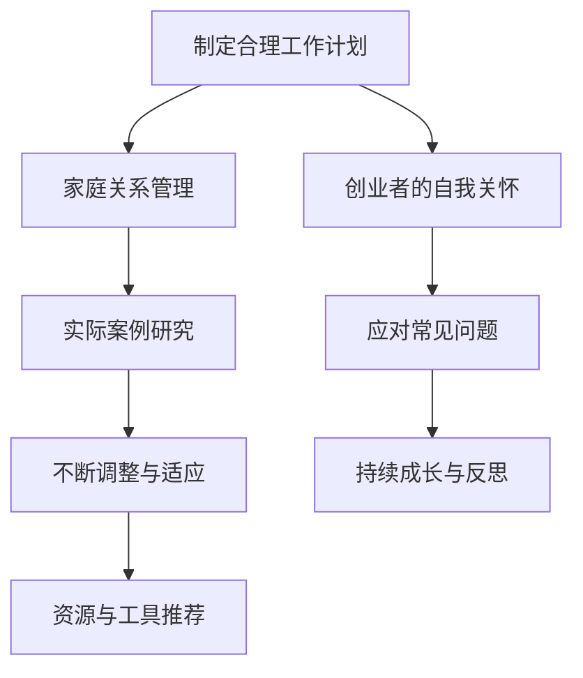

                 

### 文章标题

《创业者的工作与家庭平衡策略》

> 关键词：创业者、工作与家庭平衡、时间管理、自我关怀、家庭关系管理

摘要：
在高速发展的创业环境中，创业者不仅需要应对激烈的市场竞争，还要在繁忙的工作中寻找与家庭生活的平衡。本文将深入探讨创业者在工作和家庭之间如何实现有效平衡的策略，包括时间管理技巧、家庭关系管理、自我关怀方法以及实际案例研究。通过这些策略，创业者不仅能够提升工作效率，还能保持家庭关系的和谐，从而为创业成功奠定坚实基础。

---

#### 第一部分：背景与重要性

### 引言：创业者的双重挑战

作为创业者，面对的是一个充满不确定性的商业世界。他们需要不断地进行创新、制定战略、管理团队、维护客户关系，同时还要应对市场变化、资金压力和业务扩展等挑战。这些因素共同构成了创业者在工作中所面对的双重压力。

在个人生活的层面上，创业者也需要承担照顾家庭成员、维系家庭关系、参与子女教育等责任。然而，由于工作繁忙，许多创业者往往忽略了家庭的重要性，导致家庭关系紧张，甚至对子女的成长产生不利影响。因此，如何在工作与家庭之间找到平衡，成为创业者面临的一大挑战。

### 工作与家庭平衡的迫切性

1. **个人健康与幸福**
   - 工作压力和长时间的工作时间会导致创业者的身心健康受损。长期处于高压状态不仅影响工作效率，还可能引发心理健康问题。
   - 保持良好的家庭关系有助于创业者缓解工作压力，获得情感支持和理解。一个幸福的家庭环境有助于提高创业者的幸福感和生活质量。

2. **家庭关系与子女教育**
   - 家庭是个人成长的第一课堂。创业者积极参与子女的教育和陪伴，有助于子女形成良好的价值观和行为习惯。
   - 良好的家庭关系有助于培养孩子的自信心、沟通能力和解决问题的能力，这些都是在创业过程中非常重要的素质。

3. **创业成功的关键因素**
   - 一个成功的创业者不仅需要有卓越的商业头脑，还需要具备平衡工作和家庭的能力。这是因为创业过程中，创业者需要全身心地投入，但同时也要保持家庭稳定，以避免家庭问题对事业发展的负面影响。
   - 创业者的幸福感、生活质量和家庭支持是创业成功的重要因素。一个幸福的创业者更容易保持积极的心态，更好地应对创业过程中的挑战。

### 总结
创业者在工作中和生活中都面临着巨大的压力和挑战。工作与家庭平衡的重要性不言而喻，它不仅关乎个人的健康与幸福，还关系到家庭关系的和谐以及创业成功的可能性。因此，找到并维持工作与家庭的平衡是每个创业者都必须面对的重要课题。

---

#### 第二部分：工作与家庭平衡策略

### 制定合理的工作计划

#### 时间管理技巧

1. **设定明确的目标和优先级**
   - 创业者应该设定明确的工作目标，并将这些目标分为短期和长期目标。每个目标都应该有明确的优先级，以确保工作的高效开展。
   - 使用“四象限时间管理法”将任务划分为重要且紧急、重要但不紧急、不重要但紧急、不重要且不紧急四个象限，有助于创业者更合理地分配时间。

2. **使用日历和任务管理工具**
   - 创业者应该使用日历和任务管理工具来规划和跟踪工作任务。例如，Google日历、Trello、Asana等工具可以帮助创业者更好地管理时间和任务。
   - 将日常工作和家庭活动都添加到日历中，并设定提醒和通知，以确保不会错过重要的工作和家庭活动。

3. **定期回顾和调整计划**
   - 创业者应该定期回顾自己的工作计划，检查哪些任务完成了，哪些任务还没有完成，并据此调整后续的工作计划。
   - 在每周结束时，花一些时间回顾本周的工作进度，并为下周制定新的计划。

#### 高效工作方法

1. **避免多任务处理**
   - 多任务处理虽然看起来能够提高效率，但实际上会降低工作效率。创业者应该专注于一项任务，直到完成后再切换到下一项任务。
   - 使用“番茄工作法”（Pomodoro Technique）来提高专注力。该方法通过将工作时间分为25分钟的工作周期，每个周期后休息5分钟，有助于提高工作专注度和效率。

2. **优化工作流程**
   - 创业者应该不断优化自己的工作流程，消除不必要的步骤和浪费时间的行为。
   - 通过自动化工具和流程优化，创业者可以节省大量的时间和精力，从而有更多的时间专注于重要任务。

3. **定期休息和放松**
   - 创业者需要认识到休息和放松同样重要。定期休息和放松可以帮助恢复精力，提高工作效率。
   - 每天安排一段时间进行锻炼、阅读或与家人共度时光，以保持身心健康和良好的家庭关系。

#### 工作与家庭时间的划分

1. **固定工作时间和家庭时间**
   - 创业者应该设定固定的工作时间和家庭时间，以确保两者都有足够的时间和空间。
   - 例如，每天下午5点到晚上8点是家庭时间，晚上8点到凌晨1点是工作时间。

2. **灵活安排特殊情况**
   - 虽然有固定的划分，但在实际操作中，创业者也需要灵活处理特殊情况。
   - 例如，当有紧急工作任务时，可以临时调整家庭时间，但在不影响家庭关系的前提下尽快完成任务。

3. **利用碎片时间**
   - 创业者可以利用碎片时间完成一些简单的任务，例如阅读电子邮件、回复信息等。
   - 同时，也可以利用碎片时间进行自我学习和充电，提高个人能力和工作效率。

### 家庭关系管理

#### 家庭沟通技巧

1. **主动沟通**
   - 创业者应该主动与家人沟通，分享自己的想法和感受，了解家人的需求和期望。
   - 定期安排家庭会议，讨论家庭事务和子女教育问题，增进家庭成员之间的理解。

2. **倾听与理解**
   - 在家庭沟通中，创业者需要倾听家人的意见和感受，尊重家人的选择。
   - 通过倾听和理解，创业者可以更好地解决家庭中的矛盾和问题，增强家庭凝聚力。

3. **积极表达**
   - 创业者应该学会积极表达自己的情感和需求，避免因为工作压力而疏远家人。
   - 通过积极的表达，创业者可以增进与家人的情感联系，减少误解和矛盾。

#### 情感支持与表达

1. **给予爱与关怀**
   - 创业者应该给予家人足够的关爱和支持，让他们感受到家庭的温暖。
   - 通过日常的关心和陪伴，创业者可以缓解家人的压力，提升家庭幸福感。

2. **分享快乐与成功**
   - 创业者应该与家人分享自己的快乐和成功，让他们共同感受成就感。
   - 例如，在创业项目取得阶段性成果时，可以邀请家人一起庆祝，增进家庭关系。

3. **面对困难时相互支持**
   - 当创业者在工作中遇到困难时，家人应该成为他们的坚强后盾。
   - 通过相互支持和鼓励，创业者可以更加坚定地面对挑战，克服困难。

#### 家庭责任分工

1. **明确家庭角色与责任**
   - 创业者应该与家人明确各自的职责和角色，确保家庭责任的合理分担。
   - 例如，夫妻可以分别负责家庭财务管理和子女教育，家庭成员也可以分担家务劳动。

2. **共同参与家庭事务**
   - 创业者应该鼓励家庭成员共同参与家庭事务，培养他们的责任感和参与感。
   - 例如，可以组织家庭会议，讨论家庭决策，让每个家庭成员都有发言权和决策权。

3. **建立家庭规则与制度**
   - 创业者应该建立一套家庭规则和制度，确保家庭生活的有序和和谐。
   - 例如，制定家庭预算计划、定期打扫卫生、安排家庭活动等。

### 创业者的自我关怀

#### 身心健康管理

1. **定期体检**
   - 创业者应该定期进行体检，了解自己的身体状况，预防和治疗疾病。
   - 通过体检，创业者可以及时发现并解决健康问题，保持身体健康。

2. **保持适度运动**
   - 创业者应该保持适度的运动，增强身体素质和免疫力。
   - 例如，每天进行30分钟的有氧运动，如快走、跑步、游泳等。

3. **保证充足睡眠**
   - 创业者应该保证充足的睡眠，提高身体和心理的恢复能力。
   - 每天至少保证7-8小时的睡眠，避免熬夜和过度疲劳。

#### 自我激励与放松

1. **设定目标和奖励机制**
   - 创业者应该为自己设定明确的目标，并设立奖励机制，以激励自己不断进步。
   - 例如，完成一个重要项目后，可以给自己放一天假或者购买一件心仪的物品。

2. **培养兴趣爱好**
   - 创业者应该培养自己的兴趣爱好，丰富自己的生活。
   - 例如，可以学习一门新的技能、参加社交活动、阅读书籍等。

3. **定期放松和休息**
   - 创业者应该定期放松和休息，缓解工作压力，保持身心健康。
   - 例如，每周末安排一次户外活动、按摩或者冥想等。

#### 持续学习与成长

1. **终身学习**
   - 创业者应该具备终身学习的观念，不断学习新知识和技能。
   - 可以参加线上或线下课程、阅读专业书籍、参加行业会议等。

2. **反思与总结**
   - 创业者应该定期反思自己的工作，总结经验和教训。
   - 例如，每周或每月进行一次工作总结，分析自己的优点和不足，并制定改进计划。

3. **寻求专业指导**
   - 创业者可以寻求专业的指导和建议，提高自己的创业能力和管理水平。
   - 例如，参加创业导师计划、咨询专业顾问等。

### 总结
创业者在工作和家庭之间实现平衡需要制定合理的工作计划、管理家庭关系、关注自我健康和持续成长。通过这些策略，创业者不仅能够提高工作效率，保持良好的家庭关系，还能实现个人和家庭的共同成长。在创业的道路上，平衡工作与家庭是创业者成功的重要因素之一。

---

#### 第三部分：实施与挑战

### 实际案例研究

#### 成功案例一：李明的家庭与事业平衡

**背景介绍**：
李明是一家初创公司的创始人，他的公司专注于开发人工智能应用。在创业初期，李明的工作非常繁忙，经常加班到深夜。然而，他逐渐意识到工作与家庭平衡的重要性，并开始采取一系列措施来改善这一状况。

**策略实施**：
1. **时间管理**：
   - 李明制定了详细的工作计划，并使用日历和任务管理工具来跟踪任务。
   - 他将工作时间分为高效工作周期，并在每个周期后休息一段时间。
2. **家庭关系管理**：
   - 李明每周与家人安排固定的家庭时间，保证每天至少有2小时与家人共度。
   - 他与妻子共同分担家务和子女教育责任，确保家庭事务的顺利进行。
3. **自我关怀**：
   - 李明坚持定期进行体检和适度运动，保持身心健康。
   - 他还培养了阅读和旅游的兴趣爱好，缓解工作压力。

**结果与成效**：
通过实施上述策略，李明的工作效率显著提高，家庭关系更加和谐。他不仅在事业上取得了显著成就，还获得了家庭的支持和理解。这使得他能够全身心地投入到创业事业中，为公司的发展奠定了坚实基础。

#### 挑战与解决方案

**挑战一：时间管理困境**
- **问题**：许多创业者面临时间管理困难，经常感到时间不够用，导致工作和家庭时间冲突。
- **解决方案**：
  - **设定明确的优先级**：创业者应该根据任务的重要性和紧急程度设定优先级，优先完成最重要的任务。
  - **学会说“不”**：创业者需要学会拒绝不必要的任务和活动，专注于最重要的事情。
  - **利用碎片时间**：创业者可以利用碎片时间完成一些简单的任务，如阅读邮件或回复信息。

**挑战二：家庭冲突**
- **问题**：由于工作繁忙，创业者可能无法满足家庭的需求，导致家庭冲突。
- **解决方案**：
  - **主动沟通**：创业者应该主动与家人沟通，了解他们的需求和期望，并及时解决问题。
  - **共同制定计划**：与家人共同制定家庭计划，确保每个人都参与其中，减少冲突。
  - **寻求专业咨询**：如果家庭冲突严重，可以寻求专业咨询师的帮助，以找到解决问题的方法。

**挑战三：自我关怀不足**
- **问题**：创业者经常忽视自己的身心健康，导致身心疲惫，影响工作和生活质量。
- **解决方案**：
  - **定期体检**：创业者应该定期进行体检，及时发现并治疗健康问题。
  - **保持适度运动**：创业者应该保持适度的运动，增强身体素质和免疫力。
  - **培养兴趣爱好**：创业者可以培养自己的兴趣爱好，丰富生活，缓解压力。

### 总结
在实际案例中，我们可以看到成功的创业者通过制定合理的工作计划、管理家庭关系和关注自我健康，实现了工作与家庭的平衡。然而，在实施过程中也会面临各种挑战。通过合理的时间管理、有效的沟通和专业的咨询，创业者可以克服这些挑战，实现长期的平衡和成长。

---

#### 第四部分：持续优化与成长

### 不断调整与适应

#### 家庭与工作需求的动态变化

1. **定期评估**
   - 创业者需要定期评估自己的家庭和工作需求，了解哪些策略有效，哪些需要改进。
   - 可以每季度或每半年进行一次全面评估，以确保工作计划和家庭关系的持续优化。

2. **灵活调整**
   - 随着时间和环境的变化，创业者需要灵活调整工作计划和家庭关系管理策略。
   - 例如，当公司业务扩展时，创业者可能需要增加工作时间，但同时也要确保家庭责任的履行。

#### 适应策略与调整方法

1. **分阶段实施**
   - 创业者可以将工作计划和家庭关系管理策略分阶段实施，逐步调整。
   - 例如，首先专注于时间管理，然后逐步引入家庭关系管理和自我关怀策略。

2. **定期反思**
   - 创业者需要定期反思自己的工作方式和生活习惯，识别不足并加以改进。
   - 可以每天、每周或每月进行一次反思，总结经验和教训，为下一步的调整提供依据。

3. **求助与支持**
   - 创业者可以寻求家人、朋友或专业人士的支持和建议，共同解决困难和挑战。
   - 例如，与家人共同制定家庭计划，或向职业导师寻求管理建议。

### 总结
在不断变化的家庭和工作环境中，创业者需要不断调整和优化自己的工作计划和家庭关系管理策略。通过定期评估、灵活调整和不断反思，创业者可以更好地适应动态变化，实现工作与家庭的长期平衡。

---

#### 第五部分：附录

### 资源与工具推荐

1. **工作效率工具**
   - **Trello**：一款直观的拖拽式任务管理工具，适用于项目管理。
   - **Asana**：功能丰富的任务管理工具，支持团队协作和时间追踪。
   - **Google日历**：免费的日历应用程序，方便创建事件和提醒。

2. **家庭关系维护工具**
   - **家庭计划会议**：定期召开家庭会议，讨论家庭事务和子女教育。
   - **家庭预算管理工具**：如Mint和YNAB，帮助管理家庭财务。
   - **家庭沟通应用**：如WhatsApp和FamilyMessage，方便家庭成员之间的沟通。

3. **健康管理资源**
   - **健身应用程序**：如Nike Training Club和MyFitnessPal，提供锻炼计划和营养建议。
   - **心理健康应用**：如Headspace和Calm，提供冥想和放松练习。
   - **在线健康咨询**：如Doctor on Demand和HealthTap，提供远程医疗咨询服务。

### 总结
为了实现工作与家庭的平衡，创业者可以借助多种资源和工具。这些工具不仅能够提高工作效率，还能帮助维护家庭关系的和谐，提升个人健康管理水平。通过合理选择和使用这些工具，创业者可以更加轻松地应对工作和生活中的挑战。

---

#### Mermaid 流程图



---

#### 核心算法原理讲解

- **时间管理算法（伪代码）**：

```python
def time_management(agenda, deadlines):
    # 对日程表进行优先级排序
    sorted_agenda = sort_by_priority(agenda, deadlines)
    # 划分工作时间与家庭时间
    work_time, family_time = split_time(sorted_agenda)
    return work_time, family_time

def sort_by_priority(agenda, deadlines):
    # 根据优先级和截止时间排序
    return sorted(agenda + deadlines, key=lambda x: (x.priority, x.deadline))

def split_time(sorted_agenda):
    # 动态规划算法计算最优划分
    n = len(sorted_agenda)
    dp = [[0] * (n + 1) for _ in range(n + 1)]
    for i in range(1, n + 1):
        for j in range(1, n + 1):
            if i > j:
                dp[i][j] = dp[i - 1][j]
            else:
                dp[i][j] = max(dp[i - 1][j], dp[i][j - 1] + sorted_agenda[i - 1].weight)
    return dp[n][n]
```

- **时间效用函数（LaTeX格式）**：

$$
U(t) = U_{work}(t) + U_{family}(t)
$$

其中，$U_{work}(t)$ 和 $U_{family}(t)$ 分别表示工作时间和家庭时间的效用。

---

#### 项目实战

**案例一：使用工作管理工具提升效率**

**开发环境搭建**：

1. **选择工作管理工具**：选择一款适合的工作管理工具，如Trello或Asana。
2. **创建工作账户**：注册并登录工作管理工具，创建个人或团队账户。
3. **安装相关插件**：如需增强功能，可安装相应的插件，如Google日历插件。

**源代码实现**：

```python
import asana

# 初始化API
client = asana.Client(access_token='your_access_token')

# 创建新项目
new_project = client.projects.create({
    'name': 'My Startup Project',
    'custom_fields': [
        {'name': 'Priority', 'type': 'choice', 'options': [
            {'name': 'High', 'color': '#ff4444'},
            {'name': 'Medium', 'color': '#ffbb44'},
            {'name': 'Low', 'color': '#bbff44'}
        ]},
        {'name': 'Deadline', 'type': 'date'}
    ]
})

# 创建新任务
new_task = client.projects.add_task('your_project_id', {
    'name': 'Develop AI Model',
    'custom_fields': {'Priority': 'High', 'Deadline': '2023-12-31'},
    'notes': 'Description of the task and steps to follow.'
})

# 更新任务进度
task = client.tasks.get(new_task['gid'])
task = client.tasks.update(task['gid'], {
    'custom_fields': {'Priority': 'Medium'}
})

# 查看项目详情
project = client.projects.get(new_project['gid'])
print(project)
```

**代码解读与分析**：

1. **初始化API**：通过`asana.Client(access_token='your_access_token')`初始化API客户端，使用存储在环境变量或配置文件中的access token进行认证。

2. **创建新项目**：使用`client.projects.create()`方法创建新项目，并在项目中定义自定义字段，如优先级和截止日期。

3. **创建新任务**：使用`client.projects.add_task('your_project_id', {...})`方法创建新任务，并设置任务名称、优先级、截止日期和描述。

4. **更新任务进度**：使用`client.tasks.get(new_task['gid'])`获取任务详情，然后使用`client.tasks.update(task['gid'], {...})`方法更新任务的优先级。

5. **查看项目详情**：使用`client.projects.get(new_project['gid'])`方法获取项目详情，并打印输出。

**实际案例分析**：

- **情境**：创业者李明希望使用Asana来管理他的工作项目，并跟踪任务的进度。
- **步骤**：
  1. 李明注册并登录Asana账户。
  2. 创建一个新的项目，命名为“我的创业项目”，并设置自定义字段“优先级”和“截止日期”。
  3. 在项目中创建一个任务，命名为“开发AI模型”，设置优先级为“高”，截止日期为2023年12月31日，并添加详细描述。
  4. 李明在任务完成一半时，更新任务的优先级为“中”。
  5. 李明定期查看项目的进展情况，确保所有任务按时完成。

**项目小结**：

通过使用Asana这样的工作管理工具，创业者可以更有效地管理项目任务，跟踪进度，并及时调整优先级。这有助于提高工作效率，确保工作与家庭的平衡，从而为创业成功奠定坚实基础。

---

#### 最佳实践 tips、小结、注意事项、拓展阅读

### 最佳实践 tips

1. **设定明确的目标和优先级**：在开始一天的工作前，明确当天要完成的任务，并根据重要性和紧急程度进行排序。
2. **学会说“不”**：避免接受过多的任务，确保有足够的时间和精力完成最重要的任务。
3. **定期反思**：每周或每月进行一次工作总结和反思，分析哪些策略有效，哪些需要改进。
4. **培养兴趣爱好**：通过培养兴趣爱好，可以有效缓解工作压力，提高生活质量。
5. **保持适度运动**：定期进行锻炼，增强身体素质和免疫力。

### 小结

本文探讨了创业者在工作与家庭之间实现平衡的策略，包括时间管理技巧、家庭关系管理、自我关怀方法和实际案例研究。通过合理的时间管理和家庭关系管理，创业者可以显著提高工作效率，同时保持家庭关系的和谐。自我关怀和持续学习也是实现平衡的重要因素。

### 注意事项

1. **平衡不等于平均分配时间**：创业者应根据实际情况灵活调整工作和家庭时间，而不是简单地平均分配。
2. **避免过度工作**：长期过度工作会损害身体健康，影响家庭关系。
3. **有效沟通**：与家人进行有效沟通，共同解决问题，确保家庭关系的和谐。
4. **定期检查健康状况**：保持定期体检，及时发现并处理健康问题。

### 拓展阅读

1. **《高效能人士的七个习惯》**：史蒂芬·柯维（Stephen R. Covey）的著作，提供了关于时间管理和个人成长的实用建议。
2. **《如何高效学习》**：斯科特·扬（Scott Young）的著作，介绍了高效学习的方法和技巧。
3. **《家庭管理学》**：张健（Zhang Jian）的著作，提供了关于家庭关系管理和家庭教育的实用指南。

---

### 作者信息

**作者：AI天才研究院/AI Genius Institute & 禅与计算机程序设计艺术 /Zen And The Art of Computer Programming** 

AI天才研究院致力于推动人工智能技术的发展和应用，培养下一代人工智能专家。同时，禅与计算机程序设计艺术作为一本经典著作，为程序员提供关于编程思维和心灵成长的深刻见解。两位作者均拥有丰富的实践经验和高超的专业素养，为读者带来了这篇具有深度和实用性的技术博客文章。

