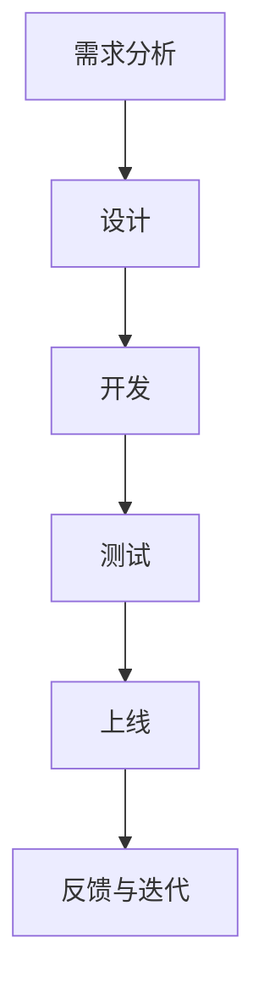
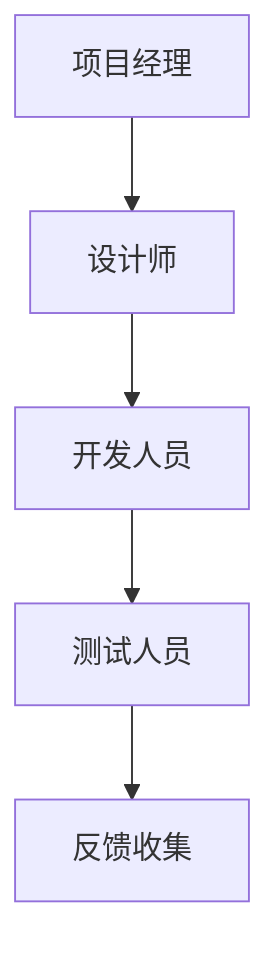
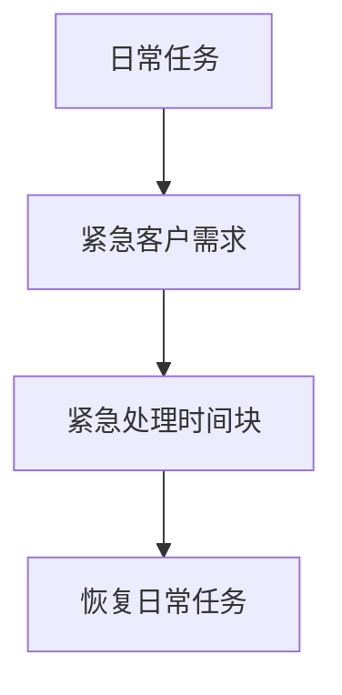

                 

### 《创业者的时间块工作法与效率提升》

> 关键词：时间块工作法、创业、效率提升、时间管理、专注力、团队协作

> 摘要：本文将深入探讨时间块工作法在创业者中的应用，解析其基本概念、核心原则和提升效率的策略。通过分析时间管理的基本概念，我们了解时间块工作法的定义与原则，以及它与日常时间管理的区别。接下来，文章将详细介绍时间块工作法的核心原则，包括如何确定时间块、管理时间块以及调整与优化时间块。在此基础上，文章将探讨时间块工作法在创业中的应用，分享实际案例，帮助创业者提升项目开发周期和团队协作效率。此外，文章还将提供高效利用时间块的方法、团队时间块工作法的协同策略，以及时间块工作法在创业中的成功案例，最后，文章将总结时间块工作法的应用步骤和常见问题解答，为创业者提供实用的指导。通过本文的阅读，创业者将掌握时间块工作法的精髓，实现工作效率的显著提升。

---

# 第一部分：时间块工作法基础

时间块工作法，是一种旨在通过明确划分和高效利用时间块来提升个人和团队工作效率的时间管理方法。它通过对工作内容的合理划分和时间段的科学规划，帮助个体和团队在有限的时间内实现最大化的产出。本部分将首先介绍时间块工作法的基本概念，分析其与日常时间管理的区别，然后深入探讨时间块工作法的核心原则，为后续内容奠定基础。

## 第1章：时间管理的基本概念

### 1.1 时间块工作法的定义与原则

时间块工作法是一种基于时间分段的管理方法，它将工作或任务划分为若干个特定的时间段，每个时间段内专注于一项特定的任务。这种方法的核心在于提高专注度和效率，通过减少干扰和合理安排时间，使个体能够在有限的时间内完成更多的工作。

时间块工作法的基本原则包括：

1. **明确目标**：每个时间块都应该有一个清晰的目标或任务。
2. **专注工作**：在时间块内保持专注，减少外部干扰，避免多任务处理。
3. **合理休息**：时间块之间需要适当的休息，以恢复精力。
4. **灵活调整**：根据实际情况，适时调整时间块的计划和安排。

### 1.2 时间块工作法的优势

时间块工作法具有多项显著优势：

1. **提高专注度**：通过专注工作，减少任务切换的时间成本，提高工作质量。
2. **减少干扰**：明确的时间块划分有助于减少外部干扰，提升工作效率。
3. **高效利用时间**：合理规划时间块，确保每个时间段都被高效利用。
4. **提高生产力**：通过专注和高效，个体能够在有限的时间内完成更多工作。

### 1.3 时间块工作法与日常时间管理的区别

时间块工作法与传统的日常时间管理方法有显著的区别：

1. **分段细化**：时间块工作法将时间划分为更细小的时间段，而日常时间管理则可能更侧重于大的时间段安排。
2. **专注度要求**：时间块工作法强调在每个时间段内保持专注，而日常时间管理可能更注重任务的完成时间。
3. **灵活性**：时间块工作法根据任务和目标灵活调整时间块，而日常时间管理则可能更固定和僵化。
4. **目标导向**：时间块工作法每个时间块都紧密围绕目标，而日常时间管理可能更侧重于日常任务的处理。

## 第2章：时间块工作法核心原则

### 2.1 确定时间块

确定时间块是时间块工作法的基础步骤。根据个人习惯和工作性质，合理划分时间块能够显著提升工作效率。

#### 2.1.1 根据工作性质划分时间块

不同类型的工作需要不同长度的时间块。例如，对于创造性任务，可能需要更长时间块以保持思维的连贯性；而对于事务性工作，较短的时间块能够提高处理速度。

#### 2.1.2 根据个人习惯优化时间块

每个人的生物钟和工作习惯不同，合理调整时间块能够更好地适应个人。例如，有些人可能在早晨精力充沛，适合安排复杂任务；而另一些人可能在下午效率更高。

### 2.2 管理时间块

管理时间块的关键在于制定详细的计划并严格执行。

#### 2.2.1 提前规划时间块

在一天或一周的开始，提前规划好每个时间块的任务，确保工作有条不紊。

#### 2.2.2 遵循时间块计划

在执行过程中，严格遵守时间块计划，避免因临时事务而打乱整体节奏。

### 2.3 调整与优化时间块

在实际执行过程中，可能需要根据实际情况对时间块进行调整和优化。

#### 2.3.1 处理突发事件

突发事件可能会打乱原有计划，需要灵活处理，确保核心任务不受影响。

#### 2.3.2 根据实际情况调整时间块

随着工作进度的变化，可能需要对时间块进行适当调整，以更好地适应实际情况。

---

通过以上章节的介绍，我们初步了解了时间块工作法的基本概念和核心原则。接下来，本文将深入探讨时间块工作法在创业中的应用，帮助创业者更好地利用这一方法提升工作效率和团队协作效果。

## 第3章：时间块工作法在创业中的应用

### 3.1 创业者的时间管理挑战

创业者面临的挑战多种多样，时间管理尤为关键。在创业初期，创业者需要处理大量事务，包括市场调研、产品设计、资金筹集、团队管理等。这些任务往往繁杂且紧急，容易导致时间被无谓地消耗。此外，创业者常常需要快速决策，这就要求他们在有限的时间内做出准确判断，确保企业能够稳步发展。

### 3.2 时间块工作法在创业中的实际应用

时间块工作法在创业中的应用能够有效提升工作效率，以下是具体策略：

#### 3.2.1 优化项目开发周期

在项目开发过程中，创业者可以将项目划分为多个阶段，并为每个阶段设定明确的时间块。例如，可以将项目分为需求分析、设计、开发、测试等阶段，并为每个阶段分配特定的时间块。这样，团队成员能够明确自己的工作目标和期限，提高开发效率。

#### 3.2.2 提升团队协作效率

在团队协作中，时间块工作法有助于提高团队的整体效率。通过明确的时间块，团队成员可以更好地协调工作，减少因任务分配不清而产生的冲突。例如，在一个时间块内，团队成员可以集中讨论项目方案，而在另一个时间块内，各自完成分配的任务。

#### 3.2.3 处理突发事项

在创业过程中，突发事件是不可避免的。时间块工作法提供了一个灵活的框架，使创业者能够及时处理突发事项，同时确保核心任务不受影响。例如，当遇到紧急客户需求时，创业者可以将原本的休息时间调整为一个紧急处理时间块，优先处理重要任务。

### 3.3 创业者时间块工作法的案例分析

以下是一个创业者的时间块工作法案例分析：

**案例背景**：张先生是一家科技初创公司的创始人，负责产品开发、市场推广和团队管理。

**时间块工作法应用**：

1. **每日时间块规划**：
   - 早晨7:00-9:00：锻炼和早餐，为新的一天储备能量。
   - 9:00-11:30：处理邮件和安排当日工作计划。
   - 12:00-13:30：午餐和休息。
   - 13:30-16:00：专注于产品设计，减少干扰。
   - 16:00-17:00：团队会议，讨论项目进度和解决方案。
   - 17:00-18:30：处理市场推广事务。
   - 18:30-19:00：晚餐和休息。

2. **每周时间块规划**：
   - 周一：评估上一周的工作成果，制定本周计划。
   - 周二至周四：专注于关键任务，确保项目稳步推进。
   - 周五：总结本周工作，进行反馈和调整。

**效果评估**：
- **工作效率提升**：通过明确的时间块，张先生能够更专注于关键任务，减少任务切换的时间成本，提高工作效率。
- **团队协作改善**：团队会议的设立使团队成员能够及时沟通和协作，提高了项目的整体效率。
- **突发事件处理**：灵活的时间块规划使张先生能够迅速应对突发事件，确保核心任务不受影响。

通过以上案例分析，我们可以看到时间块工作法在创业中的应用能够显著提升工作效率和团队协作效果。对于创业者而言，掌握并灵活应用时间块工作法，是实现高效管理的重要工具。

---

在了解了时间块工作法在创业中的具体应用后，接下来的部分将探讨如何高效利用时间块，以及团队时间块工作法的协同策略。通过这些实践策略，创业者将进一步掌握时间块工作法的精髓，提升工作效率和团队协作能力。

## 第二部分：时间块工作法效率提升策略

### 第4章：高效利用时间块的方法

时间块工作法的关键在于高效利用每个时间块，以下介绍几种提升时间块工作效率的方法。

#### 4.1 时间块内专注工作

专注工作是提升时间块工作效率的核心。以下是一些实用的方法：

##### 4.1.1 减少干扰

干扰是影响工作效率的主要因素。以下是一些减少干扰的策略：

1. **屏蔽通知**：关闭不必要的手机和电脑通知，避免分心。
2. **创建专注环境**：选择一个安静的环境，减少外部噪音干扰。
3. **专注工具**：使用专注软件，如Pomodoro Technique（番茄工作法），设定专注时间段。

##### 4.1.2 提升专注力

提升专注力有助于更好地利用时间块。以下是一些提升专注力的方法：

1. **定期休息**：长时间工作后，进行短暂休息，帮助大脑恢复专注力。
2. **运动**：定期进行体育锻炼，提高身体和心理的活力。
3. **冥想**：通过冥想训练，提高专注力和注意力。

#### 4.2 时间块间休息与恢复

适当的休息是提高工作效率的重要环节。以下是一些休息与恢复的方法：

##### 4.2.1 制定合理的休息计划

为了确保休息的效率，可以制定以下休息计划：

1. **短时间休息**：在每个时间块结束后，进行5-10分钟的短时间休息。
2. **长时间休息**：每周设定一天作为休息日，放松身心，恢复精力。

##### 4.2.2 休息时间的有效利用

休息时间可以用来进行以下活动：

1. **学习**：利用休息时间学习新知识或技能，提升个人能力。
2. **社交**：与朋友或家人交流，缓解工作压力。
3. **兴趣爱好**：进行自己喜爱的活动，如阅读、绘画等，放松心情。

### 第5章：高效时间块工作技巧

为了更高效地利用时间块，创业者可以采用以下技巧：

#### 5.1 制定优先级

合理分配时间块的关键在于确定任务优先级。以下是一种实用的优先级制定方法：

##### 5.1.1 优先级矩阵

使用优先级矩阵，可以将任务分为四个等级：

1. **重要且紧急**：优先处理这类任务，以避免紧急情况的发生。
2. **重要但不紧急**：这类任务应尽早处理，避免成为紧急任务。
3. **不重要但紧急**：尽量委托给他人处理，自己只需监督。
4. **不重要且不紧急**：减少这类任务的时间投入，集中精力处理更重要的事务。

##### 5.1.2 制定每日工作计划

在每天开始时，制定一个详细的工作计划，确保每个时间块都有明确的目标。以下是一个简单的每日工作计划模板：

1. **早晨**：处理重要紧急任务。
2. **上午**：专注于重要但不紧急的任务。
3. **下午**：处理次要任务和紧急事务。
4. **晚上**：总结一天的工作，为第二天做好准备。

#### 5.2 提升个人能力

提升个人能力是提高工作效率的关键。以下是一些建议：

##### 5.2.1 培养时间块工作习惯

1. **规律作息**：保持规律的生活习惯，确保每天有足够的休息和锻炼。
2. **专注训练**：定期进行专注力训练，提高专注工作的能力。
3. **时间管理**：掌握时间管理的技巧，合理规划每天的工作和时间。

##### 5.2.2 优化工作流程

1. **流程简化**：分析工作流程，去除不必要的步骤，简化流程。
2. **自动化**：利用工具和软件，自动化一些重复性任务，减少人工操作。
3. **团队协作**：建立高效的团队协作机制，提高整体工作效率。

### 第6章：团队时间块工作法的协同

在团队中应用时间块工作法，需要团队成员之间的紧密协作和沟通。以下是一些团队时间块工作法的协同策略：

#### 6.1 团队成员间的沟通

良好的沟通是团队协作的基础。以下是一些建议：

##### 6.1.1 提高沟通效率

1. **明确沟通目标**：每次沟通前明确目的，确保沟通有针对性。
2. **有效沟通工具**：使用如Slack、Trello等沟通工具，提高信息传递速度。
3. **定期会议**：定期召开会议，确保团队成员了解项目进度和协作需求。

##### 6.1.2 减少沟通误解

1. **倾听**：倾听对方意见，确保理解对方的意图。
2. **清晰表达**：表达时尽量清晰、明确，避免模糊表述。
3. **反馈机制**：建立反馈机制，确保沟通信息得到准确传达。

#### 6.2 团队时间块工作法实践

在团队中实施时间块工作法，需要以下实践：

##### 6.2.1 建立团队时间表

1. **统一时间块**：确保团队成员的时间块安排相互协调，避免冲突。
2. **共享时间表**：将团队时间表共享给每个成员，确保大家了解彼此的时间安排。
3. **调整时间表**：根据实际情况，适时调整团队时间表，以适应变化。

##### 6.2.2 团队协作案例分析

以下是一个团队时间块工作法案例：

**团队背景**：一个软件开发团队，负责开发一款移动应用。

**时间块工作法实践**：

1. **每日站立会议**：每天早上举行5-10分钟的站立会议，讨论当天的任务和时间块安排。
2. **项目时间块划分**：将项目划分为需求分析、设计、开发、测试等阶段，并为每个阶段设定时间块。
3. **任务分配**：根据团队成员的能力和时间块安排，合理分配任务。
4. **沟通与协作**：使用Slack进行实时沟通，确保团队成员了解项目进展和协作需求。

**效果评估**：

- **工作效率提升**：通过明确的时间块和有效的沟通，团队成员能够更好地协调工作，提高工作效率。
- **项目进度可控**：项目时间块划分清晰，确保项目进度可控，减少了延误和错误。

通过以上实践，团队成功开发并上线了移动应用，取得了良好的市场反响。

---

在了解了时间块工作法的核心原则和应用策略后，接下来我们将通过成功案例展示时间块工作法在创业中的实际效果。这些案例将为创业者提供宝贵的经验和启示。

### 第7章：时间块工作法在创业中的成功案例

#### 7.1 案例一：公司A的创业成功经验

**案例背景**：公司A成立于2018年，是一家专注于智能家居设备研发的公司。初期团队成员仅有5人，负责产品研发和市场推广。

**时间块工作法实施**：

1. **每日时间块规划**：团队成员每天在开始工作前，制定详细的时间块计划，明确每个时间段的任务。
   - 早晨8:00-9:00：团队站立会议，讨论当天任务和时间块安排。
   - 上午9:00-12:00：专注于产品研发，减少外部干扰。
   - 中午12:00-13:00：午餐和休息。
   - 下午13:00-17:00：继续研发工作，并处理市场推广事务。
   - 下午17:00-18:00：总结当天工作，制定次日计划。

2. **每周时间块规划**：每周进行一次全面的时间块规划，确保长期目标的实现。
   - 周一：评估上一周的工作成果，制定本周计划。
   - 周二至周四：专注于核心研发任务，确保项目进度。
   - 周五：进行团队总结，收集反馈，调整计划。

**成功经验与教训**：

1. **明确目标**：通过时间块工作法，团队成员明确了每个时间段的工作目标，确保了工作的有序进行。
2. **高效协作**：团队通过站立会议和有效的沟通，确保了团队成员之间的协作，提高了工作效率。
3. **灵活调整**：在面对突发事件时，团队能够灵活调整时间块安排，确保核心任务不受影响。

**效果评估**：

- **工作效率提升**：通过明确的时间块和高效的协作，公司A的研发团队成功在六个月内完成了第一代智能家居产品的研发。
- **市场反响良好**：产品成功上市后，获得了市场的广泛认可，为公司带来了可观的收益。

#### 7.2 案例二：个人创业者的高效时间管理

**案例背景**：李先生是一名独立软件咨询师，负责多个项目的设计和开发。他面临的时间管理挑战是确保每个项目都能在规定时间内高质量完成。

**时间块工作法实践**：

1. **时间块规划**：李先生每天早上规划当天的时间块，明确每个时间块的任务。
   - 早晨7:00-9:00：处理邮件和安排当天工作。
   - 上午9:00-12:00：专注于核心项目开发。
   - 中午12:00-13:00：午餐和休息。
   - 下午13:00-17:00：继续项目开发，并处理客户咨询。
   - 下午17:00-18:00：总结当天工作，规划次日任务。

2. **优先级管理**：使用优先级矩阵，确定每个项目的优先级，确保关键任务得到优先处理。

**创业成果与展望**：

1. **项目按时完成**：通过合理的时间块规划和管理，李先生成功按时完成了多个项目，赢得了客户的信任和好评。
2. **收入稳定增长**：随着项目的成功交付，李先生的收入稳定增长，为未来的创业计划提供了坚实的资金基础。
3. **持续优化**：李先生计划进一步优化时间块工作法，结合人工智能技术，提高时间管理和工作效率。

通过以上成功案例，我们可以看到时间块工作法在创业中的实际效果。这些案例不仅展示了时间块工作法的优势，也为创业者提供了宝贵的实践经验。通过合理规划和高效利用时间块，创业者能够显著提升工作效率，实现创业目标。

### 第三部分：时间块工作法应用实践

时间块工作法是一种实用的时间管理工具，通过科学的规划和有效的实施，可以帮助创业者提升工作效率，实现创业目标。本部分将介绍时间块工作法的具体应用步骤，帮助创业者掌握这一方法，并在实践中不断完善和优化。

#### 第8章：时间块工作法应用步骤

时间块工作法的应用可以分为以下几个步骤：

##### 8.1 确定个人目标

在开始应用时间块工作法之前，创业者需要明确自己的个人目标。这些目标可以是短期目标，如完成一个项目、达成一定销售额，也可以是长期目标，如实现企业的可持续发展、提升品牌影响力。明确目标有助于为后续的时间块规划提供方向。

##### 8.2 分析当前时间利用情况

在明确目标后，创业者需要分析当前的时间利用情况。这包括记录每日的工作内容、任务完成情况以及时间的消耗。通过分析，创业者可以发现自己在时间管理方面存在的问题，如哪些任务耗时过长、哪些时间段容易被干扰等。

##### 8.3 制定时间块工作计划

基于目标和分析结果，创业者可以制定时间块工作计划。时间块工作计划应明确每个时间块的任务、目标以及预期的时间长度。以下是一个简单的时间块工作计划模板：

| 时间段       | 任务               | 目标                 |
|--------------|--------------------|----------------------|
| 早晨7:00-9:00 | 处理邮件和安排工作 | 确保每天有清晰的工作计划 |
| 上午9:00-12:00 | 项目开发           | 完成核心任务           |
| 中午12:00-13:00 | 午餐和休息         | 休息并恢复精力         |
| 下午13:00-17:00 | 项目开发           | 继续完成核心任务       |
| 下午17:00-18:00 | 客户沟通和总结     | 确保客户需求得到满足   |

##### 8.4 实施与调整

在制定好时间块工作计划后，创业者需要严格按照计划执行。在执行过程中，可能会遇到各种突发情况，需要灵活调整时间块安排。例如，如果某个任务耗时过长，可以适当调整后续的时间块计划，确保核心任务得到优先处理。

##### 8.5 反馈与优化

在执行一段时间后，创业者需要对时间块工作法的效果进行反馈和优化。可以通过以下方式收集反馈：

1. **自我评估**：定期回顾时间块工作计划的执行情况，评估是否达到预期目标。
2. **团队成员反馈**：与团队成员交流，了解他们在执行时间块工作法过程中的困难和建议。
3. **客户反馈**：了解客户对项目进展和服务的满意度，根据反馈调整工作计划。

通过反馈和优化，创业者可以不断完善时间块工作法，使其更好地适应自己的工作节奏和创业需求。

### 第9章：时间块工作法常见问题解答

在应用时间块工作法的过程中，创业者可能会遇到一些问题和挑战。以下是一些常见问题及其解答：

##### 9.1 如何应对时间块中的突发情况？

突发情况是不可避免的，创业者可以采取以下措施应对：

1. **预留应急时间**：在制定时间块工作计划时，预留一定的应急时间，用于处理突发事件。
2. **优先级调整**：根据突发事件的紧急程度，调整时间块计划，确保核心任务不受影响。
3. **灵活调整**：在突发事件发生时，灵活调整时间块安排，确保工作进度不受影响。

##### 9.2 时间块工作法是否适用于所有人？

时间块工作法具有普遍适用性，不同的人可以根据自己的工作性质和个人习惯进行调整。以下是一些适用性建议：

1. **任务性质**：对于需要高度专注的任务，时间块工作法尤为有效。
2. **个人习惯**：根据个人生物钟和工作习惯，合理调整时间块长度和安排。
3. **团队协作**：在团队中应用时间块工作法，可以提高团队协作效率和项目进展。

##### 9.3 如何保持时间块工作的持久性？

保持时间块工作的持久性是提高工作效率的关键。以下是一些建议：

1. **习惯养成**：通过持续实践，养成遵守时间块计划的习惯。
2. **定期评估**：定期回顾时间块工作法的执行情况，及时调整和优化。
3. **激励措施**：设定奖励机制，激励自己在时间块工作中保持高效。

通过以上问题和解答，创业者可以更好地应对应用时间块工作法过程中遇到的问题和挑战，确保该方法能够持续有效地提高工作效率。

### 附录

#### 附录A：时间块工作法工具推荐

在应用时间块工作法时，一些工具可以帮助创业者更好地规划和执行时间块计划。以下是一些推荐的工具：

1. **Trello**：一款基于看板的项目管理工具，可以帮助创业者清晰规划任务和时间块。
2. **Google Calendar**：一款功能强大的日历工具，可以方便地设置时间块和提醒。
3. **Pomodoro Timer**：一款番茄工作法计时器，可以帮助创业者保持专注和高效。

#### 附录B：时间块工作法资源链接

以下是一些有关时间块工作法的资源链接，供创业者参考：

1. **《时间管理：如何更有效地工作》**：一本详细介绍时间管理技巧和方法的专业书籍。
2. **时间管理课程**：在Coursera、Udemy等在线教育平台上有许多关于时间管理的高质量课程。
3. **时间管理社群和论坛**：如Reddit上的r/productivity、GitHub上的时间管理项目等，创业者可以在这里交流经验和技巧。

通过以上工具和资源，创业者可以更好地掌握时间块工作法，提高工作效率，实现创业目标。

---

本文通过详细的步骤和实际案例，介绍了时间块工作法在创业中的应用和效率提升策略。时间块工作法不仅能够帮助创业者更好地管理时间，提高工作效率，还能够提升团队的协作能力，实现企业的持续发展。希望创业者能够结合自己的实际情况，灵活应用时间块工作法，实现创业梦想。

---

### 文章总结

本文深入探讨了时间块工作法在创业者中的应用，从基本概念、核心原则到实际应用和效率提升策略，全面阐述了这一时间管理工具的优势和实用性。通过明确的目标设定、科学的规划和有效的执行，时间块工作法能够帮助创业者提高专注度、减少干扰、优化团队协作，从而提升整体工作效率。

时间块工作法的核心在于通过分段细化时间和专注工作，使创业者能够在有限的时间内完成更多任务。同时，合理的时间块规划和灵活的调整机制，使得时间块工作法在面对突发事件时依然能够保持高效运作。本文通过实际案例展示了时间块工作法在创业中的成功应用，为创业者提供了宝贵的经验。

然而，时间块工作法并非万能，创业者需要根据自身的工作性质和个人习惯，灵活调整和优化时间块计划。在应用过程中，应不断总结和反思，根据实际情况进行调整，以实现最佳效果。

展望未来，随着人工智能和自动化技术的发展，时间块工作法有望进一步优化，更加智能化和个性化。创业者可以通过引入智能工具，实现自动化任务分配和进度跟踪，进一步提高工作效率。

总之，时间块工作法是一种实用的时间管理工具，能够为创业者提供高效的工作方式。通过本文的介绍，希望创业者能够掌握并灵活应用时间块工作法，提升工作效率，实现创业目标。

---

### 作者信息

作者：AI天才研究院/AI Genius Institute & 禅与计算机程序设计艺术 /Zen And The Art of Computer Programming

AI天才研究院（AI Genius Institute）是一家致力于人工智能研究与应用的领先机构，汇集了全球顶级的人工智能专家和研究人员。研究院在人工智能领域取得了众多突破性成果，推动了人工智能技术的进步与发展。同时，研究院还致力于将先进的人工智能技术应用于实际生产，为各行各业提供创新的解决方案。

《禅与计算机程序设计艺术》（Zen And The Art of Computer Programming）是由艾兹格·迪杰斯特拉（Edsger W. Dijkstra）所著的经典计算机科学书籍。艾兹格·迪杰斯特拉是一位杰出的计算机科学家，曾荣获图灵奖，被誉为计算机科学领域的先驱者之一。他的著作《禅与计算机程序设计艺术》深入探讨了计算机编程的哲学和艺术，对计算机科学的发展产生了深远的影响。

本文由AI天才研究院的研究人员和《禅与计算机程序设计艺术》的作者共同撰写，旨在为广大创业者提供关于时间块工作法在创业中应用的实用指导。希望通过本文，创业者能够更好地掌握时间块工作法，提升工作效率，实现创业梦想。

