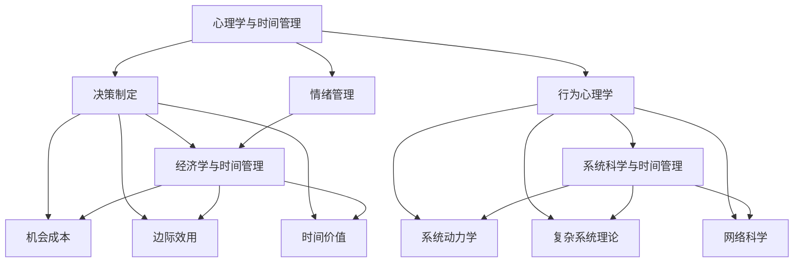

                 

### 文章标题

《创业者的时间管理与效率提升》

#### 关键词
时间管理、效率提升、创业者、优先级、专注力、情绪管理、团队协作

#### 摘要
本文旨在探讨创业者在创业过程中的时间管理与效率提升策略。首先，文章从时间管理的理论基础出发，阐述了时间管理的定义、重要性、基本原则以及常见误区。接着，文章详细介绍了实用的时间管理工具与方法，包括时间日志、优先级管理、时间规划等。随后，文章重点分析了专注力培养与提升、情绪管理与压力缓解等效率提升策略，并结合实际案例进行讲解。最后，文章从创业者的角度出发，提供了时间管理与效率提升的综合应用策略，并推荐了相关书籍与资源，帮助创业者更好地应对时间管理挑战，提升工作效率。

---

### 《创业者的时间管理与效率提升》目录大纲

#### 第一部分：时间管理的理论基础

#### 第1章：时间管理的重要性

##### 1.1.1 时间管理的定义与核心价值

##### 1.1.2 时间管理的基本原则

##### 1.1.3 时间管理的误区与挑战

#### 第2章：时间管理的理论基础

##### 2.1.1 心理学与时间管理

##### 2.1.2 经济学与时间管理

##### 2.1.3 系统科学与时间管理

#### 第二部分：实用的时间管理工具与方法

#### 第3章：时间日志与时间分析

##### 3.1.1 时间日志的记录与整理

##### 3.1.2 时间分析的方法与技巧

##### 3.1.3 时间分析的案例与实战

#### 第4章：优先级管理

##### 4.1.1 优先级矩阵法

##### 4.1.2 重要紧急矩阵法

##### 4.1.3 案例分析：如何提高任务优先级

#### 第5章：时间规划的技巧

##### 5.1.1 Gantt图的使用

##### 5.1.2 关键路径法

##### 5.1.3 案例分析：如何制定合理的时间规划

#### 第三部分：效率提升的策略与实践

#### 第6章：专注力的培养与提升

##### 6.1.1 专注力的重要性

##### 6.1.2 专注力提升的方法与技巧

##### 6.1.3 案例分析：如何提高专注力

#### 第7章：情绪管理与压力缓解

##### 7.1.1 情绪管理的基本原则

##### 7.1.2 压力管理的技巧

##### 7.1.3 案例分析：如何缓解工作压力

#### 第8章：团队时间管理与协作

##### 8.1.1 团队时间管理的重要性

##### 8.1.2 团队协作的技巧

##### 8.1.3 案例分析：如何提升团队效率

#### 第四部分：时间管理与效率提升的综合应用

#### 第9章：创业者的时间管理策略

##### 9.1.1 创业者时间管理的特点

##### 9.1.2 创业者如何制定时间管理计划

##### 9.1.3 创业者时间管理案例分析

#### 第10章：效率提升的持续实践

##### 10.1.1 效率提升的持续动力

##### 10.1.2 如何持续优化时间管理策略

##### 10.1.3 案例分析：如何保持效率提升的动力

#### 第五部分：附录

#### 附录A：时间管理工具推荐

##### A.1.1 时间管理软件介绍

##### A.1.2 时间管理方法总结

##### A.1.3 时间管理工具使用指南

#### 附录B：相关书籍与资源推荐

##### B.1.1 推荐书籍

##### B.1.2 推荐网站与博客

##### B.1.3 推荐讲座与课程

---

### 第一部分：时间管理的理论基础

#### 第1章：时间管理的重要性

时间管理，作为一门理论与实践相结合的学科，旨在帮助人们更有效地利用时间，实现个人和组织的最大价值。对于创业者而言，时间管理尤为重要。因为创业者往往面临着多重任务、资源有限以及时间紧迫等挑战，如何在有限的时间内实现最大的产出，是创业者成功的关键因素之一。

##### 1.1.1 时间管理的定义与核心价值

时间管理可以定义为一系列策略和方法，旨在更有效地规划和利用时间，以实现个人或组织的目标。其核心价值在于提高效率、减少浪费、增强决策能力以及提升生活质量。

- **提高效率**：通过合理安排时间，减少不必要的浪费，使工作更加高效。
- **减少浪费**：明确任务的优先级，避免在低效的任务上耗费过多时间。
- **增强决策能力**：清晰的日程安排和任务规划有助于更好地分析问题和做出决策。
- **提升生活质量**：合理安排时间，确保工作与生活平衡，提高生活质量。

##### 1.1.2 时间管理的基本原则

成功的时间管理需要遵循一些基本原则，这些原则为时间管理提供了指导方针，帮助创业者更好地应对各种挑战。

- **明确目标**：明确个人和组织的短期和长期目标，确保时间管理策略与目标一致。
- **优先级排序**：根据任务的重要性和紧急性进行优先级排序，确保重要任务优先处理。
- **合理规划**：制定详细的时间规划，明确每天、每周和每月的任务安排。
- **专注执行**：在工作时保持专注，避免多任务处理，确保任务高质量完成。
- **定期评估**：定期评估时间管理策略的有效性，根据反馈进行调整。

##### 1.1.3 时间管理的误区与挑战

尽管时间管理的重要性已被广泛认可，但在实际应用中，创业者仍可能遇到以下误区和挑战。

- **误区**：
  - **任务堆积**：拖延和未及时完成任务，导致任务堆积，增加压力。
  - **完美主义**：追求完美导致时间浪费，忽视任务的实际完成。
  - **忽视休息**：过度工作，忽视休息和恢复，影响工作效率和健康。

- **挑战**：
  - **资源有限**：创业者往往面临资源（如时间、资金和人力）的限制，需要更高效地利用。
  - **环境干扰**：外部环境（如会议、电话和信息）可能干扰时间管理，影响工作效率。
  - **情绪波动**：情绪波动（如焦虑和压力）可能影响时间管理能力，导致效率下降。

为了克服这些误区和挑战，创业者需要不断学习和实践时间管理的策略，找到适合自己的方法。以下章节将详细探讨时间管理的理论基础、实用工具与方法，以及效率提升的策略与实践，帮助创业者更好地管理时间和提升工作效率。

---

#### 第2章：时间管理的理论基础

时间管理的成功不仅仅依赖于简单的日程安排，还需要深入理解其理论基础。本章节将探讨心理学、经济学和系统科学在时间管理中的应用，以帮助创业者从多个角度理解和优化时间管理策略。

##### 2.1.1 心理学与时间管理

心理学在时间管理中的应用主要体现在对人类行为和认知过程的理解上。以下是一些关键的心理学概念及其在时间管理中的应用：

- **决策制定**：心理学研究显示，人们在面对多个任务时容易产生决策疲劳。创业者可以通过优先级排序和任务分解来减少决策负担，提高工作效率。

- **行为心理学**：通过了解人类行为习惯和动机，创业者可以设计出更有效的激励机制，如设置奖励和惩罚机制，以鼓励团队按时完成任务。

- **情绪管理**：情绪波动会影响时间管理效果。通过心理学技巧（如正念和冥想），创业者可以更好地控制情绪，保持专注和高效。

##### 2.1.2 经济学与时间管理

经济学为时间管理提供了量化和优化的方法。以下是一些经济学概念及其在时间管理中的应用：

- **机会成本**：经济学中的机会成本概念可以帮助创业者更好地评估任务优先级。例如，如果将时间用于一个项目，可能会错过其他潜在的机会。

- **边际效用**：经济学中的边际效用原理指出，随着投入的增加，额外产出的增量会减少。创业者可以通过优化任务分配，确保资源的最优利用。

- **时间价值**：时间本身就是一种资源，创业者可以通过计算时间价值来衡量不同任务的经济效益，从而更合理地安排时间。

##### 2.1.3 系统科学与时间管理

系统科学提供了从整体和系统角度理解时间管理的视角。以下是一些系统科学概念及其在时间管理中的应用：

- **系统动力学**：通过分析任务的相互依赖性和时间延迟，创业者可以更好地预测任务完成时间和潜在的风险，从而进行更有效的规划。

- **复杂系统理论**：复杂系统理论强调系统的多样性、不确定性和动态性。创业者可以利用这些理论来设计适应性和灵活性强的日程安排，以应对不确定性和变化。

- **网络科学**：网络科学可以帮助创业者理解团队内部和外部关系的复杂性，从而优化团队协作和任务分配。

##### 2.1.4 核心概念之间的关系架构

为了更好地理解上述概念之间的关系，我们可以使用Mermaid流程图来展示时间管理理论的核心架构。



通过以上理论基础的探讨，创业者可以更全面地理解时间管理的复杂性和多样性。接下来，我们将介绍一些实用的时间管理工具和方法，帮助创业者将这些理论应用到实际工作中。

---

#### 第3章：时间日志与时间分析

时间日志是一种记录每日活动和工作时间的方法，通过系统地记录和整理时间使用情况，创业者可以更好地了解自己的时间分配情况，发现时间浪费的环节，并据此进行优化。时间日志不仅是一种工具，更是一种自我反省和自我提升的过程。

##### 3.1.1 时间日志的记录与整理

记录时间日志的第一步是选择一个合适的时间记录工具。对于创业者而言，有多种工具可供选择，包括纸质日志、电子表格以及专门的时间管理软件。以下是一些常见的记录方法：

- **纸质日志**：纸质日志简单易用，适合习惯于传统工作方式的创业者。可以每天记录具体的时间分配，包括工作、休息、会议等。
- **电子表格**：使用电子表格记录时间日志，可以方便地进行数据分析，例如Excel或Google Sheets。创业者可以根据需要自定义表格格式，以便更好地整理和分析数据。
- **时间管理软件**：如Toggl、RescueTime和Harvest等软件，可以自动追踪和记录时间使用情况，并提供详细的分析报告。这些工具通常具有云同步功能，方便在不同设备上查看和管理时间日志。

在记录时间日志时，创业者需要注意以下几点：

- **一致性**：确保每天都能及时记录时间使用情况，避免遗忘或延迟记录。
- **详细记录**：记录时间使用时，尽量详细，包括任务名称、开始时间、结束时间以及任务的具体内容。
- **分类整理**：将时间日志按项目、任务或活动类型进行分类，以便于后续分析和总结。

##### 3.1.2 时间分析的方法与技巧

记录时间日志只是第一步，接下来需要对日志进行分析，以发现时间浪费的环节，优化时间分配。以下是一些常见的时间分析方法：

- **任务分解**：将大任务分解为小任务，分析每个小任务所需的时间，找出时间消耗较大的任务。
- **时间分布分析**：统计每天、每周或每月的时间分配情况，了解时间的具体使用情况，例如工作、学习、休息、社交等。
- **活动对比**：对比实际时间分配与计划时间分配，分析时间偏差的原因，例如是否因为会议、邮件或其他干扰因素导致时间浪费。
- **效率分析**：计算每个任务的平均完成时间和完成率，找出低效任务，优化工作流程。

以下是一个时间分析的具体步骤：

1. **数据收集**：整理并收集时间日志数据，确保数据的准确性和完整性。
2. **数据清洗**：处理和整理数据，删除异常值和错误记录，确保数据质量。
3. **数据可视化**：使用图表和图形工具，如条形图、折线图和饼图，将时间数据可视化，直观地展示时间分布和任务效率。
4. **数据分析**：根据可视化结果，分析时间分配的合理性，找出时间浪费的环节。
5. **优化建议**：基于分析结果，提出具体的优化建议，例如调整任务优先级、优化工作流程或减少不必要的会议和邮件。

##### 3.1.3 时间分析的案例与实战

为了更好地理解时间分析的实际应用，我们可以通过一个具体的案例来说明。

**案例背景**：某创业公司创始人李先生，每天需要处理多个项目任务和日常运营工作，感到时间不够用，希望通过时间日志和时间分析来优化时间管理。

**步骤1：记录时间日志**：李先生选择使用Toggl记录时间日志，每天下班前记录当天的任务和所花费的时间。

**步骤2：整理时间日志**：一周后，李先生整理了时间日志，将其导出为CSV文件，并导入Excel进行分类整理。

**步骤3：数据可视化**：使用Excel制作时间分布图表，如下图所示，直观展示了每天的时间分配情况。


**步骤4：数据分析**：根据图表分析，发现每天的工作时间主要花费在项目任务和会议中，而社交和休息时间相对较少。进一步分析发现，有些会议的时间较长，且内容不明确，影响了实际工作进度。

**步骤5：优化建议**：李先生决定采取以下优化措施：
- **减少不必要的会议**：对会议内容进行筛选，确保每个会议都有明确的目标和议程，避免长时间无效的会议。
- **调整任务优先级**：根据任务的重要性和紧急性重新安排任务，确保重要和紧急的任务优先完成。
- **增加休息时间**：确保每天有足够的休息时间，提高工作效率和身心健康。

通过上述案例分析，我们可以看到，时间日志和时间分析为创业者提供了一个有效的工具和方法，帮助其更好地管理时间，提高工作效率。接下来，我们将进一步探讨优先级管理的方法和技巧。

---

#### 第4章：优先级管理

在时间管理中，优先级管理是至关重要的一个环节。创业者需要明确任务的重要性和紧急性，合理分配时间和资源，确保关键任务得到优先处理。本章节将详细介绍优先级管理的几种方法，包括优先级矩阵法、重要紧急矩阵法和案例分析。

##### 4.1.1 优先级矩阵法

优先级矩阵法是一种基于任务的重要性和紧急性来排序的方法。这种方法使用一个二维矩阵，将任务分为四个象限，每个象限代表不同的重要性和紧急性组合。

- **第一象限（重要且紧急）**：这些任务是必须立即处理的，因为它们既重要又紧急，例如紧急的客户请求或即将到期的项目。
- **第二象限（重要但不紧急）**：这些任务虽然重要，但不紧急，例如市场调研或员工培训。这类任务容易因为忙碌而被忽视，但长期来看对业务发展至关重要。
- **第三象限（不重要但紧急）**：这些任务可能是一些临时性的干扰，如不重要的电话或突发的小事情。虽然需要处理，但不会对长期目标产生重大影响。
- **第四象限（不重要且不紧急）**：这些任务通常是低优先级的，如无聊的活动或无意义的会议。可以尽量减少这些任务，以节省时间和精力。

以下是一个优先级矩阵法的示例：

| 任务       | 重要性 | 紧急性 | 分配时间 |
|------------|--------|--------|----------|
| 项目A      | 高     | 高     | 2小时    |
| 项目B      | 中     | 中     | 1小时    |
| 项目C      | 低     | 低     | 30分钟   |
| 项目D      | 高     | 中     | 1小时30分钟 |
| 项目E      | 低     | 高     | 30分钟   |

通过优先级矩阵法，创业者可以清晰地看到每个任务的优先级，从而合理分配时间和资源。

##### 4.1.2 重要紧急矩阵法

重要紧急矩阵法是一种更直观的优先级管理方法，由美国管理学家戴维·艾伦提出。这种方法将任务分为四个象限，每个象限代表不同的优先级。

- **第一象限（重要且紧急）**：立即处理这些任务，因为它们既重要又紧急。例如，紧急的电话、紧急的项目任务等。
- **第二象限（重要但不紧急）**：规划这些任务，确保它们在未来得到处理。例如，定期的市场调研、员工培训等。
- **第三象限（不重要但紧急）**：委托或推迟这些任务，避免它们成为干扰。例如，不重要的电话、无意义的会议等。
- **第四象限（不重要且不紧急）**：尽量减少或消除这些任务，以节省时间和精力。例如，无聊的活动、无意义的工作等。

以下是一个重要紧急矩阵法的示例：

| 任务       | 重要性 | 紧急性 | 分配时间 |
|------------|--------|--------|----------|
| 项目A      | 高     | 高     | 2小时    |
| 项目B      | 高     | 中     | 1小时    |
| 项目C      | 中     | 高     | 30分钟   |
| 项目D      | 低     | 低     | 30分钟   |
| 项目E      | 中     | 中     | 1小时30分钟 |

通过重要紧急矩阵法，创业者可以更直观地了解任务的优先级，并根据优先级进行任务处理。

##### 4.1.3 案例分析：如何提高任务优先级

为了更好地理解优先级管理在实际中的应用，我们可以通过一个具体的案例来说明。

**案例背景**：某创业公司创始人张先生，在处理日常任务时感到时间压力很大，希望提高任务优先级，以更有效地利用时间。

**步骤1：记录任务清单**：张先生列出所有需要完成的任务，并标明每个任务的紧急性和重要性。

| 任务       | 重要性 | 紧急性 |
|------------|--------|--------|
| 项目A      | 高     | 高     |
| 项目B      | 中     | 中     |
| 项目C      | 低     | 低     |
| 项目D      | 高     | 中     |
| 项目E      | 中     | 高     |

**步骤2：使用优先级矩阵法排序**：根据任务的重要性和紧急性，张先生将任务分为四个象限，并调整时间分配。

| 任务       | 重要性 | 紧急性 | 分配时间 |
|------------|--------|--------|----------|
| 项目A      | 高     | 高     | 3小时    |
| 项目D      | 高     | 中     | 2小时    |
| 项目B      | 中     | 中     | 1小时    |
| 项目E      | 中     | 高     | 1小时    |
| 项目C      | 低     | 低     | 30分钟   |

**步骤3：使用重要紧急矩阵法调整**：根据任务的紧急性和重要性，张先生再次调整任务顺序。

| 任务       | 重要性 | 紧急性 | 分配时间 |
|------------|--------|--------|----------|
| 项目A      | 高     | 高     | 3小时    |
| 项目D      | 高     | 中     | 2小时    |
| 项目E      | 中     | 高     | 1小时    |
| 项目B      | 中     | 中     | 1小时    |
| 项目C      | 低     | 低     | 30分钟   |

通过上述案例分析，我们可以看到，优先级管理可以帮助创业者更清晰地了解任务的重要性和紧急性，从而合理分配时间和资源，提高工作效率。接下来，我们将探讨时间规划的技巧。

---

#### 第5章：时间规划的技巧

时间规划是时间管理的关键环节，它有助于创业者合理安排时间，确保任务按时完成，并提高整体工作效率。本章节将介绍几种常见的时间规划技巧，包括Gantt图的使用、关键路径法以及案例分析。

##### 5.1.1 Gantt图的使用

Gantt图是一种常用的项目管理工具，它通过图表的形式展示项目的进度和时间安排。Gantt图的基本组成包括以下几个部分：

- **横轴**：表示时间，通常以周、月或季度为单位。
- **纵轴**：表示任务或活动。
- **线条**：表示每个任务或活动的开始和结束时间。

使用Gantt图进行时间规划具有以下优点：

- **可视化**：通过图表的形式，创业者可以直观地看到项目的整体进度和时间安排，便于识别和调整。
- **任务分解**：Gantt图可以将大任务分解为子任务，明确每个任务的具体时间和负责人，便于任务分配和监督。
- **资源优化**：Gantt图可以帮助创业者合理分配资源，避免资源冲突，提高资源利用率。

以下是一个简单的Gantt图示例：

```
项目进度 |     |     |     |     |     |
          |  A |  B |  C |  D |  E |
时间轴    1   2   3   4   5   6
```

在这个示例中，项目A从第1周开始，第3周结束；项目B从第2周开始，第4周结束；以此类推。

##### 5.1.2 关键路径法

关键路径法（Critical Path Method，简称CPM）是一种用于确定项目完成时间的方法。它通过分析任务之间的依赖关系，找出项目中时间最长的路径，即关键路径。关键路径上的任务必须按时完成，否则整个项目的进度将会受到影响。

关键路径法的步骤如下：

1. **定义任务**：列出所有任务，并标明每个任务的持续时间。
2. **确定任务依赖关系**：分析任务之间的依赖关系，确定哪些任务必须在其他任务完成后才能开始。
3. **绘制网络图**：根据任务和依赖关系，绘制项目的网络图。
4. **计算最早开始时间和最早完成时间**：从网络图的最开始点开始，逐个计算每个任务的最早开始时间和最早完成时间。
5. **计算最迟开始时间和最迟完成时间**：从网络图的最后结束点开始，逐个计算每个任务的最迟开始时间和最迟完成时间。
6. **确定关键路径**：找出所有任务的总持续时间最长的路径，即关键路径。

以下是一个关键路径法的示例：

```
A (3天) --> B (2天) --> C (4天) --> D (3天)
```

在这个示例中，A是起始任务，D是结束任务。关键路径是A-B-C-D，总持续时间是3+2+4+3=12天。

##### 5.1.3 案例分析：如何制定合理的时间规划

为了更好地理解时间规划的技巧，我们可以通过一个具体的案例来说明。

**案例背景**：某创业公司计划开发一款新软件，需要在6个月内完成。公司创始人王先生需要制定一个合理的时间规划，以确保项目按时完成。

**步骤1：定义任务**：王先生列出所有需要完成的任务，并标明每个任务的持续时间。

| 任务       | 持续时间（天） |
|------------|---------------|
| 需求分析   | 10            |
| 设计       | 15            |
| 编码       | 30            |
| 测试       | 15            |
| 上线       | 5             |

**步骤2：确定任务依赖关系**：根据任务的逻辑顺序，确定任务之间的依赖关系。

- 需求分析完成后才能开始设计。
- 设计完成后才能开始编码。
- 编码完成后才能开始测试。
- 测试完成后才能上线。

**步骤3：绘制网络图**：根据任务和依赖关系，绘制项目的网络图。

```
需求分析 (10天) --> 设计 (15天) --> 编码 (30天) --> 测试 (15天) --> 上线 (5天)
```

**步骤4：计算最早开始时间和最早完成时间**：

- 需求分析：最早开始时间为第1天，最早完成时间为第10天。
- 设计：最早开始时间为第11天，最早完成时间为第26天。
- 编码：最早开始时间为第27天，最早完成时间为第56天。
- 测试：最早开始时间为第57天，最早完成时间为第72天。
- 上线：最早开始时间为第73天，最早完成时间为第78天。

**步骤5：计算最迟开始时间和最迟完成时间**：

- 需求分析：最迟开始时间为第1天，最迟完成时间为第10天。
- 设计：最迟开始时间为第11天，最迟完成时间为第26天。
- 编码：最迟开始时间为第27天，最迟完成时间为第56天。
- 测试：最迟开始时间为第57天，最迟完成时间为第72天。
- 上线：最迟开始时间为第73天，最迟完成时间为第78天。

**步骤6：确定关键路径**：通过比较最早开始时间和最迟开始时间，确定关键路径为需求分析-设计-编码-测试-上线，总持续时间是78天。

通过上述案例分析，我们可以看到，合理的时间规划可以帮助创业者明确任务顺序和时间安排，确保项目按时完成。接下来，我们将探讨专注力的培养与提升。

---

#### 第6章：专注力的培养与提升

专注力是创业者成功的关键因素之一。在时间管理中，专注力直接影响到任务完成的质量和效率。本章节将讨论专注力的重要性、提升专注力的方法和技巧，以及实际案例。

##### 6.1.1 专注力的重要性

专注力是指将注意力集中在某一任务或活动上的能力。在创业者面临众多任务和干扰时，保持专注尤为重要。以下是专注力的重要性：

- **提高工作效率**：专注力可以帮助创业者更高效地完成任务，减少不必要的重复工作和错误。
- **提升决策能力**：专注力有助于创业者更清晰地思考问题，做出更明智的决策。
- **增强创新思维**：在专注的状态下，创业者更容易产生创意和创新的思维。
- **减轻压力**：专注于当前任务，有助于减轻多任务处理带来的压力和焦虑。

##### 6.1.2 提升专注力的方法和技巧

以下是一些提升专注力的方法和技巧：

1. **设定明确的目标**
   - **具体化目标**：将目标具体化，例如“在本周内完成市场调研报告”。
   - **分解目标**：将大目标分解为小目标，逐步实现，避免感到压力过大。

2. **减少干扰**
   - **屏蔽干扰**：在专注工作时，关闭手机、电子邮件和其他可能分散注意力的应用程序。
   - **创造专注环境**：选择一个安静、舒适的环境，减少噪音和视觉干扰。

3. **专注训练**
   - **正念冥想**：通过正念冥想训练，提高对注意力的控制和调节能力。
   - **专注练习**：定期进行专注力练习，如专注呼吸、专注观察某个物体等。

4. **合理安排休息**
   - **分段工作**：采用番茄工作法，将工作时间分为25分钟专注工作加5分钟休息的周期。
   - **休息充足**：确保每天有足够的休息和睡眠，以保持精力充沛。

##### 6.1.3 案例分析：如何提高专注力

为了更好地理解如何提升专注力，我们可以通过一个具体的案例来说明。

**案例背景**：某创业公司创始人赵先生，在处理多任务时经常感到分心，希望提高专注力以提升工作效率。

**步骤1：设定明确的目标**：赵先生决定在本周内完成市场调研报告，并将其具体化为每天完成一部分。

**步骤2：减少干扰**：在专注工作期间，赵先生关闭手机和社交媒体通知，确保在一个安静的环境中工作。

**步骤3：专注训练**：赵先生开始进行正念冥想练习，每天早晨和晚上各进行10分钟的冥想，以提高专注力。

**步骤4：合理安排休息**：赵先生采用番茄工作法，将工作分为25分钟专注工作加5分钟休息的周期。在每个休息时间内，他会起身活动，伸展身体，以缓解疲劳。

**步骤5：定期评估和调整**：赵先生定期评估自己的专注力水平，并根据实际情况调整工作方法和休息时间。例如，如果发现某个时间段内容易分心，他会选择在那个时间段内进行最困难的任务。

通过上述案例分析，我们可以看到，提升专注力需要综合运用多种方法和技巧。创业者可以通过设定明确的目标、减少干扰、专注训练和合理安排休息，逐步提升专注力，提高工作效率。

---

#### 第7章：情绪管理与压力缓解

情绪管理对于创业者来说至关重要。在高压的创业环境中，情绪波动和压力是常见现象。有效管理情绪和缓解压力，不仅有助于提高工作效率，还能维护身心健康。本章节将探讨情绪管理的基本原则、压力管理的技巧以及实际案例分析。

##### 7.1.1 情绪管理的基本原则

情绪管理是指个体通过认知和行为策略，调节和控制自身情绪的过程。以下是一些情绪管理的基本原则：

1. **认识情绪**：了解自己的情绪，包括情绪的类型、发生的原因和影响。
2. **接受情绪**：接受情绪的存在，而不是压抑或逃避。
3. **表达情绪**：找到适当的渠道表达情绪，例如与朋友、家人或心理咨询师交流。
4. **调节情绪**：通过认知重构、放松训练等方法，调节情绪的强度和频率。
5. **培养积极情绪**：通过积极的体验和活动，如运动、阅读、旅行等，培养积极情绪。

##### 7.1.2 压力管理的技巧

压力管理是指通过一系列策略和方法，减轻压力对个体的影响。以下是一些有效的压力管理技巧：

1. **时间管理**：合理安排时间，避免过度工作和拖延，确保有足够的休息和放松时间。
2. **放松训练**：通过深呼吸、冥想、瑜伽等放松训练，缓解身体和心理的压力。
3. **积极思考**：培养积极的思维习惯，避免过度焦虑和悲观。
4. **社交支持**：与家人、朋友和同事保持良好的社交关系，寻求支持和帮助。
5. **健康生活方式**：保持健康的饮食、充足的睡眠和适量的运动，提高抗压能力。

##### 7.1.3 案例分析：如何缓解工作压力

为了更好地理解情绪管理和压力缓解的实际应用，我们可以通过一个具体的案例来说明。

**案例背景**：某创业公司创始人李女士，在创业初期面临巨大的工作压力，导致情绪波动和身体疲劳，希望找到有效的缓解压力的方法。

**步骤1：认识情绪和压力源**：李女士开始记录自己的情绪和压力来源，例如项目的截止日期、团队协作中的冲突等。通过记录，她发现自己的主要压力源是项目进度和团队管理。

**步骤2：时间管理**：李女士制定了详细的工作计划，包括每天的任务安排和休息时间。她确保每天有足够的休息时间，避免过度工作。

**步骤3：放松训练**：李女士开始每天进行20分钟的冥想，通过深呼吸和放松肌肉，缓解身体和心理的压力。

**步骤4：积极思考和社交支持**：李女士通过积极的思考和与家人、朋友的交流，寻找解决问题的方法。她定期与团队成员沟通，解决协作中的问题，提高团队效率。

**步骤5：健康生活方式**：李女士保持健康的饮食，每天晚上保证充足的睡眠，并每周进行至少三次运动，如瑜伽和跑步，以提高身心健康。

通过上述案例分析，我们可以看到，情绪管理和压力缓解需要从多个方面入手，包括认识情绪和压力源、时间管理、放松训练、积极思考和健康生活方式。创业者可以通过这些方法，有效缓解工作压力，提高生活质量。

---

#### 第8章：团队时间管理与协作

在创业过程中，团队时间管理和协作至关重要。有效的团队时间管理可以提高工作效率，减少冲突，增强团队凝聚力。本章节将探讨团队时间管理的重要性、团队协作的技巧以及实际案例分析。

##### 8.1.1 团队时间管理的重要性

团队时间管理是指在团队层面，通过合理安排时间和任务，确保团队高效运作的过程。其重要性体现在以下几个方面：

1. **提高工作效率**：通过合理的时间规划，确保团队任务按时完成，减少延误和等待时间。
2. **减少冲突**：明确任务分配和职责，避免因分工不清导致的冲突和误解。
3. **增强团队凝聚力**：通过有效的团队时间管理，提高团队成员的协作效率和满意度，增强团队凝聚力。
4. **优化资源利用**：合理分配时间和资源，避免资源浪费，提高整体效率。

##### 8.1.2 团队协作的技巧

团队协作是团队时间管理的重要组成部分。以下是一些有效的团队协作技巧：

1. **明确目标**：确保团队成员对项目目标有清晰的理解，明确各自的职责和任务。
2. **沟通机制**：建立有效的沟通机制，确保团队成员之间的信息流通和意见交流。
3. **分工合作**：根据团队成员的特长和技能，合理分配任务，确保每个人都能发挥最大的作用。
4. **定期会议**：定期召开团队会议，总结工作进展，讨论问题和解决方案，确保团队协作的顺畅。
5. **共同决策**：鼓励团队成员参与决策过程，提高团队成员的参与感和责任感。

##### 8.1.3 案例分析：如何提升团队效率

为了更好地理解团队时间管理和协作的实际应用，我们可以通过一个具体的案例来说明。

**案例背景**：某创业公司团队在开发一款新软件时，发现项目进度缓慢，团队协作效率低下，希望找到提升团队效率的方法。

**步骤1：明确目标和分工**：团队领导组织了一次会议，明确了项目的总体目标和各个阶段的任务。团队成员根据自身特长，提出了合理的分工建议，确保每个人都能在自己的领域发挥最大的作用。

**步骤2：建立沟通机制**：团队建立了每日站会和每周例会制度，确保团队成员之间的信息流通。每日站会用于总结前一天的工作进展和遇到的问题，每周例会用于讨论整体项目进展和解决方案。

**步骤3：优化任务分配**：根据任务的重要性和紧急性，团队领导重新调整了任务分配，确保关键任务得到优先处理。同时，鼓励团队成员相互支持和协助，解决任务分配中可能出现的问题。

**步骤4：定期评估和反馈**：团队领导定期评估项目进度和团队协作情况，通过反馈机制，及时发现问题并采取改进措施。例如，对于进度缓慢的任务，团队领导会与相关成员进行讨论，找出原因并制定改进计划。

**步骤5：培训和激励**：团队领导组织了相关培训，提高团队成员的技能和知识水平。同时，通过奖励机制，激励团队成员积极参与团队协作和项目开发。

通过上述案例分析，我们可以看到，有效的团队时间管理和协作可以通过明确目标、建立沟通机制、优化任务分配、定期评估和反馈以及培训和激励来实现。这些方法有助于提升团队效率，确保项目按时完成。

---

#### 第四部分：时间管理与效率提升的综合应用

在了解了时间管理的理论基础和实用方法之后，我们将探讨如何将这些策略应用到创业者的具体实践中。本部分将涵盖创业者的时间管理特点、制定时间管理计划的方法以及实际案例，帮助创业者更好地应对时间管理挑战，提升工作效率。

##### 9.1.1 创业者时间管理的特点

创业者在时间管理上面临着独特的挑战和需求。以下是一些创业者时间管理的特点：

1. **任务多样性**：创业者需要处理多种任务，包括项目管理、客户沟通、市场推广、产品开发等，任务类型多样且复杂。
2. **时间紧迫性**：许多任务具有紧迫性，创业者必须在短时间内完成多项任务，以应对市场变化和竞争压力。
3. **资源有限**：创业初期，创业者可能面临资源（如时间、资金和人力）的限制，需要更高效地利用有限资源。
4. **灵活性**：创业环境变化迅速，创业者需要具备灵活的时间管理能力，快速调整计划以适应新情况。
5. **多角色扮演**：创业者往往需要扮演多个角色，如产品经理、销售经理、客服代表等，需要在不同角色之间灵活切换。

##### 9.1.2 创业者如何制定时间管理计划

为了应对上述挑战，创业者需要制定科学合理的时间管理计划。以下是一些建议：

1. **明确目标**：首先，创业者需要明确个人和团队的短期和长期目标，确保时间管理计划与目标一致。例如，短期内可能目标是完成产品开发，长期目标是实现盈利。
2. **任务分解**：将大任务分解为小任务，明确每个小任务的具体内容和完成时间，以便更好地跟踪和管理。
3. **优先级排序**：根据任务的重要性和紧急性进行优先级排序。创业者可以使用优先级矩阵法或重要紧急矩阵法，确保重要且紧急的任务得到优先处理。
4. **合理规划**：制定详细的时间规划，明确每天、每周和每月的任务安排。例如，每天安排固定的时间进行项目管理、客户沟通、市场推广等。
5. **专注执行**：在工作时保持专注，避免多任务处理，确保任务高质量完成。创业者可以采用番茄工作法等时间管理技巧，提高专注力。
6. **定期评估**：定期评估时间管理计划的有效性，根据实际情况进行调整。创业者可以通过时间日志和时间分析，了解时间使用情况，找出浪费时间的环节，优化时间管理策略。
7. **灵活调整**：创业环境变化迅速，创业者需要具备灵活的时间管理能力，快速调整计划以适应新情况。例如，当市场变化时，创业者可能需要调整市场推广策略，重新安排时间。

##### 9.1.3 创业者时间管理案例分析

为了更好地理解创业者时间管理的实际应用，我们可以通过一个具体的案例来说明。

**案例背景**：某创业公司创始人张先生，在创业初期感到时间压力很大，希望通过时间管理提升工作效率。

**步骤1：明确目标**：张先生明确了公司的短期目标（如完成产品开发、实现市场推广）和长期目标（如实现盈利、扩大团队）。

**步骤2：任务分解**：张先生将大任务（如产品开发）分解为小任务（如需求分析、设计、编码、测试），并明确每个小任务的具体内容和完成时间。

**步骤3：优先级排序**：张先生使用优先级矩阵法，将任务分为重要且紧急、重要但不紧急等不同类别，确保关键任务得到优先处理。

**步骤4：合理规划**：张先生制定了详细的时间规划，明确每天、每周和每月的任务安排。例如，每天安排固定的时间进行项目管理、客户沟通、市场推广等。

**步骤5：专注执行**：张先生采用番茄工作法，将工作时间分为25分钟专注工作加5分钟休息的周期，确保任务高质量完成。

**步骤6：定期评估**：张先生定期评估时间管理计划的有效性，通过时间日志和时间分析，找出浪费时间的环节，优化时间管理策略。

**步骤7：灵活调整**：当市场变化时，张先生能够快速调整时间管理计划，重新安排任务，确保公司目标实现。

通过上述案例分析，我们可以看到，创业者通过制定明确的目标、分解任务、优先级排序、合理规划、专注执行、定期评估和灵活调整，可以有效管理时间，提升工作效率。

---

#### 第10章：效率提升的持续实践

在创业过程中，效率提升不是一蹴而就的，而是一个持续优化的过程。为了保持效率提升的动力，创业者需要采取一系列策略，不断学习和实践，以适应不断变化的环境。本章节将探讨效率提升的持续动力、持续优化时间管理策略的方法，并结合实际案例进行分析。

##### 10.1.1 效率提升的持续动力

持续提升效率需要创业者具备持续动力。以下是一些激发持续动力的策略：

1. **目标驱动**：明确个人和团队的目标，确保每个成员都清楚自己的职责和目标，从而保持工作的动力和方向。
2. **激励制度**：建立有效的激励制度，通过奖励机制激励团队成员，提高工作效率和积极性。
3. **学习和成长**：鼓励团队成员持续学习和成长，通过培训、阅读、交流等方式，提升个人能力和团队整体效率。
4. **积极心态**：保持积极的心态，面对困难和挑战时不轻易放弃，通过积极的态度激发持续动力。

##### 10.1.2 如何持续优化时间管理策略

为了保持效率提升的动力，创业者需要不断优化时间管理策略。以下是一些建议：

1. **定期回顾和反思**：定期回顾时间管理计划的有效性，反思哪些策略有效，哪些需要改进。通过总结经验，不断完善时间管理策略。
2. **适应变化**：创业环境变化迅速，创业者需要灵活调整时间管理策略，以适应新情况。例如，当市场变化时，可以重新评估任务的优先级和资源分配。
3. **持续学习和实践**：创业者需要不断学习新的时间管理方法和工具，如时间日志、Gantt图、关键路径法等，并通过实际应用，不断提升时间管理能力。
4. **引入反馈机制**：建立反馈机制，鼓励团队成员提供意见和建议，通过集体讨论和调整，优化时间管理策略。
5. **培养团队成员的时间管理意识**：通过培训和教育，提高团队成员的时间管理意识，使其主动参与时间管理，共同提升团队效率。

##### 10.1.3 案例分析：如何保持效率提升的动力

为了更好地理解如何保持效率提升的动力，我们可以通过一个具体的案例来说明。

**案例背景**：某创业公司团队在初期通过有效的时间管理策略，提升了工作效率，但在一段时间后，团队成员开始感到效率提升的动力不足，希望找到保持动力和持续优化的方法。

**步骤1：目标驱动**：团队领导组织了一次会议，重新明确了公司的短期和长期目标，确保每个团队成员都清楚自己的职责和目标，从而激发工作动力。

**步骤2：激励制度**：团队领导建立了绩效奖金制度，根据团队成员的工作表现和贡献，发放奖金和奖励，提高团队成员的积极性。

**步骤3：学习和成长**：团队领导组织了时间管理培训，邀请专业讲师分享时间管理方法和技巧，鼓励团队成员参加培训和学习，提升个人能力和团队整体效率。

**步骤4：积极心态**：团队领导通过正面激励和鼓励，培养团队成员的积极心态，面对困难和挑战时不轻易放弃，保持工作的热情和动力。

**步骤5：定期回顾和反思**：团队领导每月组织一次回顾会议，总结时间管理计划的有效性，讨论存在的问题和改进措施，不断优化时间管理策略。

**步骤6：适应变化**：当市场环境发生变化时，团队领导及时调整任务优先级和资源分配，确保团队能够快速适应新情况，保持高效率的工作状态。

**步骤7：引入反馈机制**：团队领导建立了反馈机制，鼓励团队成员提出意见和建议，通过集体讨论和调整，优化时间管理策略，提高团队协作效率。

通过上述案例分析，我们可以看到，创业者通过目标驱动、激励制度、学习和成长、积极心态、定期回顾和反思、适应变化以及引入反馈机制，可以保持效率提升的动力，并持续优化时间管理策略，提升团队整体效率。

---

#### 附录A：时间管理工具推荐

在时间管理过程中，选择合适的工具可以帮助创业者更有效地规划和执行任务。以下是一些常用的时间管理工具及其使用指南：

##### A.1.1 时间管理软件介绍

1. **Toggl**：Toggl是一款功能强大的时间追踪软件，可以记录每日的工作时间，生成详细的报告，帮助创业者分析时间使用情况。

   - **特点**：自动追踪时间、生成报告、支持多种平台同步。
   - **使用指南**：注册账号后，创建项目和工作空间，开始追踪时间，定期查看报告。

2. **RescueTime**：RescueTime是一款自动记录时间使用情况的工具，可以监控浏览器、应用程序等活动，提供详细的时间使用统计。

   - **特点**：自动记录时间、提供详细的统计报告、帮助识别时间浪费的环节。
   - **使用指南**：下载并安装软件，登录账号，软件会自动记录活动，定期查看统计报告。

3. **Harvest**：Harvest是一款专业的项目管理工具，包括时间追踪、发票和项目管理等功能，适合小型创业团队使用。

   - **特点**：时间追踪、项目管理、发票管理、团队协作。
   - **使用指南**：注册账号，创建项目和工作空间，开始追踪时间，管理项目进度。

##### A.1.2 时间管理方法总结

以下是几种常用的时间管理方法及其简要说明：

1. **时间日志法**：通过记录每天的活动和工作时间，分析时间使用情况，找出浪费时间的环节。
2. **优先级矩阵法**：根据任务的重要性和紧急性进行排序，确保关键任务得到优先处理。
3. **Gantt图法**：使用Gantt图展示项目的进度和时间安排，直观地了解任务完成情况。
4. **番茄工作法**：将工作时间分为25分钟专注工作加5分钟休息的周期，提高专注力。
5. **关键路径法**：通过分析任务之间的依赖关系，确定项目完成时间的关键路径。

##### A.1.3 时间管理工具使用指南

以下是一个简单的使用指南，帮助创业者选择和配置适合自己的时间管理工具：

1. **评估需求**：根据创业者的具体需求（如时间追踪、项目管理、团队协作等），选择适合的工具。
2. **免费试用**：多数时间管理工具提供免费试用，创业者可以先试用一段时间，评估其适用性。
3. **功能配置**：根据使用指南，配置工具的基本功能，如项目创建、任务分配、时间追踪等。
4. **定期使用**：持续使用工具，定期查看报告和分析，不断优化时间管理策略。
5. **反馈和调整**：根据使用体验和反馈，调整工具的配置和使用方法，确保工具能够满足实际需求。

通过使用合适的工具和方法，创业者可以更有效地管理时间，提升工作效率，实现个人和团队的目标。

---

#### 附录B：相关书籍与资源推荐

为了帮助创业者进一步深入了解时间管理和效率提升的策略，以下是一些推荐的书籍、网站和讲座资源。

##### B.1.1 推荐书籍

1. **《高效能人士的七个习惯》** - 史蒂芬·柯维
   - 内容摘要：本书介绍了七个高效能习惯，包括主动积极、以终为始等，适用于个人和组织的时间管理和效率提升。
   
2. **《如何高效学习》** - 斯科特·扬
   - 内容摘要：本书通过实例和技巧，帮助读者提高学习效率和记忆力，适用于创业者提升专注力和学习效率。

3. **《时间管理的艺术》** - 彼得·德鲁克
   - 内容摘要：本书深入探讨了时间管理的重要性、方法和技巧，为创业者提供了实用的时间管理策略。

##### B.1.2 推荐网站与博客

1. **Lifehacker**（[https://lifehacker.com/](https://lifehacker.com/)）
   - 内容摘要：Lifehacker提供各种实用技巧、工具和资源，帮助用户提高生活和工作效率。

2. **Productivityist**（[https://www.productivityist.com/](https://www.productivityist.com/)）
   - 内容摘要：Productivityist专注于时间管理和生产力提升，提供专业的指导和建议。

3. **Harvard Business Review**（[https://hbr.org/](https://hbr.org/)）
   - 内容摘要：Harvard Business Review包含大量关于管理和领导力的文章，涵盖时间管理和效率提升的多个方面。

##### B.1.3 推荐讲座与课程

1. **时间管理：如何更高效地利用时间** - Coursera
   - 内容摘要：该课程由哈佛大学提供，涵盖时间管理的基本原则、方法和工具，适合创业者提升时间管理能力。

2. **学习与专注：如何提高学习效率和专注力** - 网易云课堂
   - 内容摘要：该课程通过实例和技巧，帮助用户提高学习效率和专注力，适用于创业者提升个人能力和工作效率。

3. **创业者的时间管理** - TED演讲
   - 内容摘要：TED演讲中，多位创业者分享了他们的时间管理经验和策略，为创业者提供实用的指导。

通过阅读这些书籍、访问这些网站和参加这些讲座，创业者可以进一步拓展时间管理和效率提升的知识，不断提升自己的管理能力，实现个人和团队的目标。

---

### 总结与展望

在本文中，我们系统地探讨了创业者的时间管理与效率提升策略。从时间管理的理论基础出发，我们分析了心理学、经济学和系统科学在时间管理中的应用。通过实用的时间管理工具与方法，如时间日志、优先级管理、时间规划等，我们帮助创业者更好地了解和优化自己的时间使用。此外，我们还详细探讨了专注力培养、情绪管理与压力缓解等效率提升策略，并结合实际案例进行了讲解。

创业者的时间管理不仅关乎个人工作效率，更关系到团队协作和整体业务的成败。通过科学合理的时间管理，创业者可以更有效地应对任务，提高工作效率，实现个人和团队的共同目标。

展望未来，随着科技的不断进步，时间管理和效率提升将迎来更多的机遇和挑战。创业者需要不断学习和实践，适应新的技术和工具，以保持竞争力。同时，我们鼓励创业者积极参与相关学习和交流，分享自己的经验和见解，共同推动时间管理和效率提升领域的发展。

让我们以积极的态度和科学的方法，不断提升自己的时间管理能力，共同迎接未来的挑战，实现更高的效率和更大的成功！作者：AI天才研究院/AI Genius Institute & 禅与计算机程序设计艺术 /Zen And The Art of Computer Programming。

