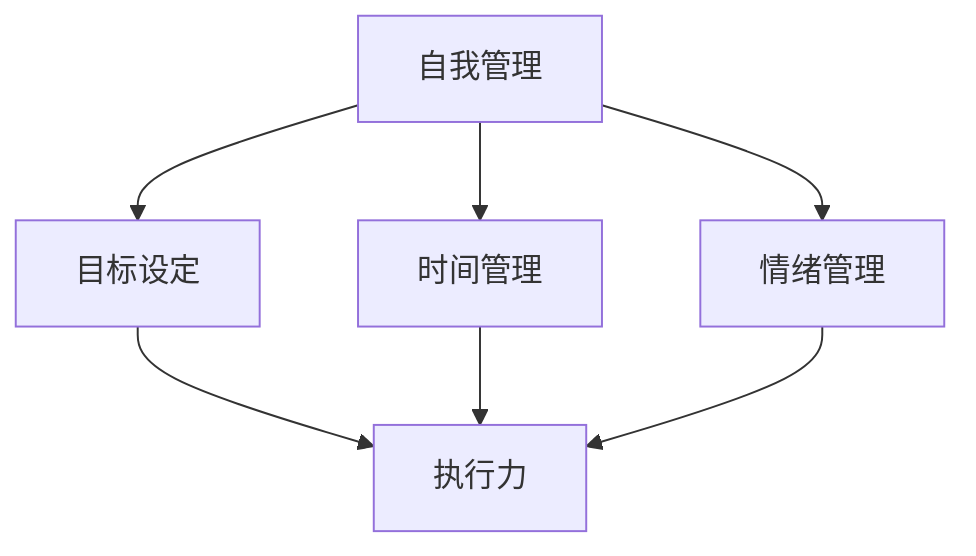
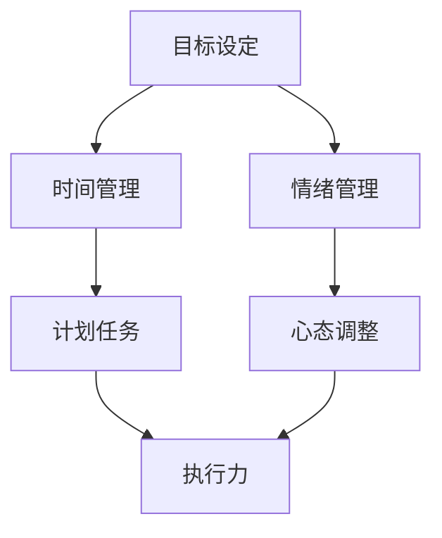
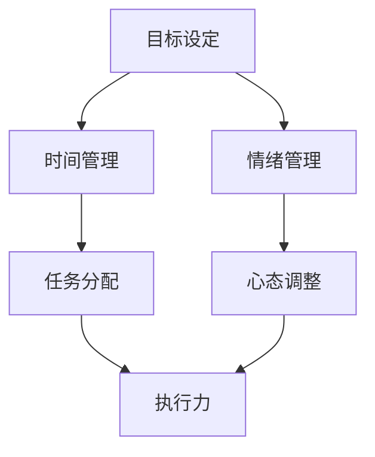

                 

### 文章标题：创业者的自我管理与时间效率提升

> 关键词：创业者、自我管理、时间效率、策略、技巧、方法、情绪管理、健康生活方式

> 摘要：本文将深入探讨创业者的自我管理艺术，通过分析目标设定、时间管理、情绪管理、健康生活方式等多个维度，为创业者提供实用的策略和技巧，旨在提升创业者的时间效率和自我管理能力，帮助他们在激烈的竞争环境中保持优势。

### 第一部分：创业者的自我管理基础

#### 第1章：自我管理的核心概念与原则

自我管理是创业者成功的关键之一。在这一章中，我们将探讨自我管理的核心概念与原则，并使用Mermaid流程图展示这些概念之间的联系。

**核心概念与联系**

以下是自我管理中的核心概念及其相互之间的联系：

1. **目标设定**：明确的目标是自我管理的起点，它为后续的行动提供方向。
2. **时间管理**：合理的时间规划是实现目标的关键，它帮助创业者充分利用每一天的时间。
3. **情绪管理**：情绪管理是保持心态平衡和应对压力的重要手段。
4. **执行力**：执行力是将目标和计划转化为实际成果的能力。

以下是这些概念之间的Mermaid流程图：



**伪代码讲解**

以下是如何设定目标和规划时间的伪代码示例：

```plaintext
Function setGoal(goal, deadline):
  if goal is clear:
    planDailyTasks(goal, deadline)
  else:
    return "Goal is unclear, please redefine."

Function planDailyTasks(goal, deadline):
  tasks = []
  for day in range(deadline):
    tasks.append("Work on " + goal)
  return tasks
```

通过上述伪代码，我们可以设定一个清晰的目标，并根据目标规划每天的任务。

**Mermaid图解**

为了更好地理解时间管理和情绪管理之间的联系，我们可以使用Mermaid绘制以下流程图：



#### 第2章：时间管理的策略与技巧

时间管理是创业者自我管理的重要组成部分。在这一章中，我们将探讨时间管理的策略与技巧，并使用数学模型来展示如何优化时间分配。

**数学模型**

时间管理的优化模型可以用以下数学公式表示：

$$
\text{最大化} \quad \sum_{i=1}^{n} p_i \cdot t_i \\
\text{约束条件} \quad t_1 + t_2 + \ldots + t_n \leq T
$$

其中，$p_i$ 代表第 $i$ 项任务的优先级，$t_i$ 代表完成第 $i$ 项任务所需的时间，$T$ 是总时间。

**详细讲解与举例**

为了更好地理解时间管理策略，我们可以通过一个创业者的日常时间分配计划来举例说明。

**例子：创业者的一天时间分配计划**

- 6:00 - 7:00: 晨跑和冥想
- 7:00 - 8:00: 早餐与阅读
- 8:00 - 12:00: 处理紧急事务
- 12:00 - 13:00: 午餐
- 13:00 - 17:00: 规划和执行业务计划
- 17:00 - 18:00: 与团队成员会议
- 18:00 - 19:00: 放松与运动
- 19:00 - 21:00: 家庭时间与个人兴趣
- 21:00 - 23:00: 复盘与计划明天工作

通过这样的时间分配计划，创业者可以在保持工作高效的同时，也注重身心健康和家庭生活。

#### 第3章：情绪管理的方法与技巧

情绪管理是创业者应对压力和挑战的重要手段。在这一章中，我们将探讨情绪管理的方法与技巧，并使用数学模型来展示如何保持情绪平衡。

**数学模型**

情绪管理的平衡模型可以用以下公式表示：

$$
\text{情绪平衡} = \frac{\text{积极情绪} + \text{消极情绪}}{2}
$$

**详细讲解与举例**

为了更好地理解情绪管理技巧，我们可以通过一个创业者在面对压力时的情绪管理策略来举例说明。

**例子：创业者在面对压力时的情绪管理策略**

1. 观察情绪：识别负面情绪的来源。
2. 深呼吸：通过深呼吸放松身体和心态。
3. 感恩日记：记录每天的三件感恩事物，提升情绪。
4. 与朋友交流：与信任的朋友分享压力，寻求支持。

通过这些情绪管理技巧，创业者可以更好地应对压力，保持积极的心态。

#### 第4章：健康生活方式的重要性与实践

健康生活方式对创业者的长期成功至关重要。在这一章中，我们将探讨健康生活方式的重要性，并提供实践方法。

**核心算法原理讲解**

如何平衡工作和生活，保持身体健康，我们可以使用以下算法原理：

```plaintext
Function maintainHealth(workHours, leisureHours, sleepHours):
  if workHours + leisureHours + sleepHours = 24:
    if sleepHours \geq 7:
      return "Health balance achieved."
    else:
      return "Increase sleep hours."
  else:
    return "Rebalance work, leisure, and sleep hours."
```

通过上述算法，我们可以确保每天有足够的时间用于工作、休闲和睡眠，从而保持健康的生活方式。

**详细讲解与举例**

为了更好地理解健康生活方式，我们可以通过一个实际案例来举例说明。

**例子：创业者的健康生活方式实践**

- 保证每天7-8小时的睡眠。
- 每天至少进行30分钟的中等强度运动。
- 每周至少安排一次完整的休息日，不工作，专注于放松和充电。
- 饮食健康，减少快餐和加工食品的摄入。

通过这些实践，创业者可以保持身心健康，提高工作效率。

#### 第5章：有效沟通与团队协作

有效沟通和团队协作是创业者成功的关键之一。在这一章中，我们将探讨如何构建高效的沟通和协作机制。

**项目实战**

为了展示如何实现有效沟通和团队协作，我们以一个简单聊天室项目为例。

**代码实现**

以下是聊天室项目的简单实现：

```python
# Server-side
import socket
import threading

def handle_client(client_socket):
    while True:
        message = client_socket.recv(1024).decode('utf-8')
        if not message:
            break
        broadcast(message)
    client_socket.close()

def broadcast(message):
    for client_socket in clients:
        client_socket.send(message.encode('utf-8'))

server_socket = socket.socket(socket.AF_INET, socket.SOCK_STREAM)
server_socket.bind(('0.0.0.0', 12345))
server_socket.listen(5)
clients = []

print("Chat server is running...")

while True:
    client_socket, addr = server_socket.accept()
    clients.append(client_socket)
    client_thread = threading.Thread(target=handle_client, args=(client_socket,))
    client_thread.start()
```

**代码解读与分析**

在这个项目中，服务器端通过监听端口接收客户端的连接请求，并使用多线程处理每个客户端的消息。客户端发送的消息会被广播给所有连接的客户端。

**实际案例分析和详细讲解剖析**

在实际应用中，创业者可以借助类似的项目来构建团队沟通和协作平台。通过实时消息传递和文件共享等功能，团队成员可以更高效地沟通和协作，从而提高工作效率。

**项目小结**

通过这个简单的聊天室项目，我们可以看到如何实现有效的团队沟通和协作。创业者可以根据实际需求，扩展和优化该项目，以满足团队的工作需求。

**最佳实践 tips**

1. 定期举行团队会议，确保团队成员之间的沟通畅通。
2. 使用协作工具，如Slack或Trello，来管理和跟踪团队任务。
3. 鼓励团队成员分享观点和想法，促进团队创新。

**小结与注意事项**

自我管理和时间效率提升是创业者成功的关键。通过明确的目标设定、合理的时间管理、情绪管理、健康生活方式和有效的沟通与团队协作，创业者可以提升自己的效率和能力，在竞争激烈的市场中脱颖而出。

**拓展阅读**

- 《高效能人士的七个习惯》
- 《时间管理的艺术》
- 《情绪智力》

### 作者信息

作者：AI天才研究院/AI Genius Institute & 禅与计算机程序设计艺术 /Zen And The Art of Computer Programming

### 结语

自我管理和时间效率提升是创业者成功的关键。通过本文的探讨，我们相信读者已经对如何提升自我管理能力和时间效率有了更深入的了解。希望本文能对您的创业之路提供有益的启示和指导。祝您在创业之路上取得辉煌的成就！

**本文由AI天才研究院与禅与计算机程序设计艺术共同撰写，版权所有，未经许可，不得转载。**### 第一部分：创业者的自我管理基础

#### 第1章：自我管理的核心概念与原则

自我管理是创业者成功的关键之一。在这一章中，我们将深入探讨自我管理的核心概念与原则，通过分析目标设定、时间管理、情绪管理、执行力等多个维度，帮助创业者构建有效的自我管理体系。

**核心概念与联系**

自我管理涉及多个核心概念，它们相互关联，共同构成一个完整的体系。以下是这些核心概念及其相互之间的联系：

1. **目标设定**：目标是自我管理的起点，它为创业者的行动提供明确的方向。目标设定包括确定长期和短期目标，以及具体实现步骤。
2. **时间管理**：时间管理是实现目标的关键，它帮助创业者合理分配时间，确保目标按时完成。时间管理涉及日程安排、优先级设定和任务分配等。
3. **情绪管理**：情绪管理是保持心态平衡和应对压力的重要手段。创业者需要学会识别和管理自己的情绪，以应对各种挑战和压力。
4. **执行力**：执行力是将目标和计划转化为实际成果的能力。它要求创业者具备坚定的决心和持续的努力，以确保目标实现。

为了更好地理解这些概念之间的联系，我们可以使用Mermaid绘制以下流程图：



**伪代码讲解**

为了帮助创业者更好地理解自我管理，我们可以通过伪代码来解释目标设定和规划时间的方法。

以下是一个简单的伪代码示例，用于设定目标和规划每日任务：

```plaintext
Function setGoal(goal, deadline):
  if goal is clear:
    planDailyTasks(goal, deadline)
  else:
    return "Goal is unclear, please redefine."

Function planDailyTasks(goal, deadline):
  tasks = []
  for day in range(deadline):
    tasks.append("Work on " + goal)
  return tasks
```

在这个示例中，`setGoal` 函数用于设定目标。如果目标清晰，它会调用 `planDailyTasks` 函数来规划每日任务。`planDailyTasks` 函数则根据设定的目标和截止日期，创建一个每日任务列表。

**Mermaid图解**

为了更直观地展示目标设定与时间管理之间的关系，我们可以使用Mermaid绘制以下流程图：


在这个流程图中，我们可以看到目标设定如何引导时间管理，进而影响执行力。同时，情绪管理在心态调整方面对执行力产生重要影响。

#### 第2章：时间管理的策略与技巧

时间管理是创业者自我管理的核心组成部分。有效的时间管理不仅能提高工作效率，还能帮助创业者保持良好的工作与生活平衡。在这一章中，我们将探讨时间管理的策略与技巧，并使用数学模型来展示如何优化时间分配。

**数学模型**

时间管理的优化模型可以用以下数学公式表示：

$$
\text{最大化} \quad \sum_{i=1}^{n} p_i \cdot t_i \\
\text{约束条件} \quad t_1 + t_2 + \ldots + t_n \leq T
$$

其中，$p_i$ 代表第 $i$ 项任务的优先级，$t_i$ 代表完成第 $i$ 项任务所需的时间，$T$ 是总时间。

**详细讲解与举例**

为了更好地理解时间管理策略，我们可以通过一个创业者的日常时间分配计划来举例说明。

**例子：创业者的一天时间分配计划**

以下是一位创业者的典型一天时间分配计划：

- **早晨**：
  - 6:00 - 7:00：晨跑和冥想
  - 7:00 - 8:00：早餐和阅读
- **上午**：
  - 8:00 - 10:00：处理紧急事务
  - 10:00 - 12:00：规划业务和完成重要任务
- **下午**：
  - 12:00 - 13:00：午餐
  - 13:00 - 15:00：继续工作，解决业务问题
  - 15:00 - 16:00：与团队成员会议
- **傍晚**：
  - 16:00 - 17:00：放松和运动
  - 17:00 - 19:00：家庭时间和个人兴趣
- **晚上**：
  - 19:00 - 21:00：回顾一天的工作，规划第二天工作
  - 21:00 - 23:00：休息和睡眠

通过这样的时间分配计划，创业者可以在保持工作高效的同时，也注重身心健康和家庭生活。

**策略与技巧**

1. **分块时间管理**：将时间划分为若干小块，如30分钟或1小时，为每个任务分配特定的时间块。这种方法有助于提高专注力和效率。
2. **优先级排序**：根据任务的重要性和紧急程度对任务进行排序，优先完成重要且紧急的任务。
3. **避免多任务处理**：尽量避免同时处理多个任务，因为这会分散注意力，降低效率。
4. **预留缓冲时间**：在日程安排中预留一些缓冲时间，以应对意外情况或任务延误。

**时间管理工具**

创业者可以使用各种工具来帮助管理时间，例如：
- **时间跟踪工具**：如Toggl或RescueTime，帮助创业者监控和优化时间使用。
- **任务管理工具**：如Asana或Trello，帮助创业者规划和跟踪任务进度。
- **日历应用**：如Google Calendar或Microsoft Outlook，帮助创业者安排和协调日程。

**案例分析**

某位创业者A在创业初期，经常感到时间不够用，工作与生活平衡被打破。后来，他开始使用时间管理工具，制定详细的时间表，并严格遵守。经过几个月的努力，他的工作效率大幅提升，同时也有更多时间陪伴家人和进行个人兴趣。他的成功经验证明了有效的时间管理对创业者的关键作用。

#### 第3章：情绪管理的方法与技巧

情绪管理是创业者自我管理的重要组成部分。在创业过程中，创业者会面临各种挑战和压力，情绪管理能力的高低直接影响到创业者的决策和行为。在这一章中，我们将探讨情绪管理的方法与技巧，帮助创业者保持心态平衡，应对各种挑战。

**情绪管理的重要性**

情绪管理不仅关乎个人的心理健康，也影响着创业者的决策和行为。情绪不稳定会导致以下问题：
- **决策失误**：情绪波动会影响创业者的判断力，导致错误决策。
- **执行力下降**：情绪低落或焦虑会影响创业者的执行力和工作效率。
- **团队氛围恶化**：创业者的情绪状态会影响到团队成员，导致团队氛围紧张。

**数学模型**

情绪管理可以通过以下数学模型来描述：

$$
\text{情绪平衡} = \frac{\text{积极情绪} + \text{消极情绪}}{2}
$$

这个模型表明，情绪平衡是通过积极情绪和消极情绪的平均值来实现的。

**详细讲解与举例**

为了更好地理解情绪管理技巧，我们可以通过一个创业者在面对压力时的情绪管理策略来举例说明。

**例子：创业者在面对压力时的情绪管理策略**

1. **观察情绪**：首先，创业者需要学会观察自己的情绪，识别负面情绪的来源。例如，某位创业者B在面临产品发布压力时，感到焦虑和不安。

2. **深呼吸**：深呼吸是一种简单而有效的放松技巧。创业者可以通过深呼吸来缓解身体和心态的紧张。例如，创业者B在感到焦虑时，会进行5分钟的深呼吸练习，以帮助自己放松。

3. **感恩日记**：记录每天的三件感恩事物，可以帮助提升情绪。例如，创业者B在感恩日记中记录了同事的支持、客户的鼓励和家人陪伴等，这让他感到更加积极和满足。

4. **与朋友交流**：与信任的朋友分享压力，寻求支持和建议。例如，创业者B会在每周与朋友聚会，分享自己的困扰和进展，这让他感到更加轻松和自信。

**情绪管理技巧**

1. **正念冥想**：正念冥想是一种专注于当下的冥想技巧，可以帮助创业者减少焦虑和压力。创业者可以每天花10-15分钟进行正念冥想，专注于呼吸和当下的感受。

2. **运动**：运动是一种有效的情绪调节方式。创业者可以通过跑步、瑜伽或健身来释放压力，提升情绪。例如，创业者C每周进行三次运动，这让他感到更加活力和积极。

3. **心理辅导**：创业者可以寻求专业的心理辅导，帮助自己更好地理解和管理情绪。心理辅导师可以提供个性化的建议和技巧，帮助创业者提升情绪管理能力。

**案例分析**

某位创业者D在创业初期，由于产品开发失败而陷入低谷。在经历了一段时间的情绪低落和自我怀疑后，他开始应用情绪管理技巧，如深呼吸、正念冥想和感恩日记等。随着时间的推移，他的情绪逐渐稳定，自信心也得到恢复。最终，他成功带领团队开发出新产品，实现了创业目标。

通过上述案例，我们可以看到情绪管理对创业者的重要性。有效的情绪管理不仅帮助创业者更好地应对压力和挑战，还提高了他们的决策能力和执行力。

#### 第4章：健康生活方式的重要性与实践

健康生活方式对于创业者的长期成功至关重要。在创业过程中，创业者往往面临巨大的压力和繁忙的工作，这可能导致身体和心理健康问题。因此，保持健康的生活方式成为创业者自我管理的重要一环。在这一章中，我们将探讨健康生活方式的重要性，并提供实践方法。

**健康生活方式的重要性**

健康生活方式对创业者的身体健康和心理健康有着重要影响：
- **身体健康**：良好的饮食、适量的运动和充足的睡眠有助于增强身体素质，提高抵抗力，减少患病风险。
- **心理健康**：健康的生活方式有助于缓解压力，提升情绪，增强心理韧性，从而更好地应对创业过程中的挑战。
- **工作效率**：健康的身体和心理状态有助于提高工作效率，增强创新能力，提升创业成功率。

**核心算法原理讲解**

如何平衡工作和生活，保持身体健康，我们可以使用以下算法原理：

```plaintext
Function maintainHealth(workHours, leisureHours, sleepHours):
  if workHours + leisureHours + sleepHours = 24:
    if sleepHours >= 7:
      return "Health balance achieved."
    else:
      return "Increase sleep hours."
  else:
    return "Rebalance work, leisure, and sleep hours."
```

在这个算法中，`workHours` 表示工作时间，`leisureHours` 表示休闲时间，`sleepHours` 表示睡眠时间。算法检查这三个时间总和是否等于24小时，并确保睡眠时间至少为7小时。如果满足条件，则认为健康平衡实现；否则，需要重新调整工作时间、休闲时间和睡眠时间。

**详细讲解与举例**

为了更好地理解健康生活方式，我们可以通过一个实际案例来举例说明。

**例子：创业者的健康生活方式实践**

以下是一位创业者的健康生活方式实践：

- **早晨**：
  - 6:00 - 7:00：晨跑和冥想
  - 7:00 - 8:00：早餐和阅读
- **上午**：
  - 8:00 - 12:00：处理紧急事务和规划业务
  - 12:00 - 13:00：午餐
- **下午**：
  - 13:00 - 17:00：继续工作，解决问题
  - 17:00 - 18:00：与团队成员会议
  - 18:00 - 19:00：运动和放松
- **傍晚**：
  - 19:00 - 21:00：家庭时间和个人兴趣
  - 21:00 - 23:00：回顾一天的工作，规划第二天工作
- **晚上**：
  - 23:00 - 6:00：睡眠

通过这样的生活方式，创业者可以在保证工作效率的同时，也保持良好的身体健康。

**健康生活方式的最佳实践**

1. **保证充足的睡眠**：每天至少睡7-8小时，避免熬夜。
2. **定期进行运动**：每周至少进行3-4次中等强度运动，如跑步、瑜伽或健身。
3. **健康饮食**：保持均衡饮食，减少高热量、高脂肪和高糖食品的摄入。
4. **心理调适**：定期进行心理辅导或冥想，缓解压力和焦虑。

**案例分析**

某位创业者E在创业初期，由于长时间熬夜和缺乏运动，身体和精神状态逐渐下滑。后来，他意识到健康生活方式的重要性，开始调整作息时间，增加运动，并定期进行心理辅导。在短短几个月内，他的身体状况明显改善，工作效率和创新能力也大幅提升。

通过上述案例分析，我们可以看到健康生活方式对创业者的重要性。创业者应该积极采取行动，保持健康的生活方式，以应对创业过程中的各种挑战。

### 第5章：有效沟通与团队协作

有效沟通和团队协作是创业者成功的关键之一。在创业过程中，创业者需要与团队成员、合作伙伴、投资者和客户保持紧密的沟通，以确保项目顺利进行。在这一章中，我们将探讨如何构建高效的沟通和协作机制，提高团队的工作效率。

#### 项目实战

为了展示如何实现有效的沟通和团队协作，我们可以以一个简单但功能完整的团队协作项目为例。在这个项目中，我们将使用Python编程语言来构建一个基本的聊天室，团队成员可以通过聊天室实时交流。

**环境搭建**

首先，我们需要搭建开发环境。在安装Python后，我们可以使用以下命令安装必要的库：

```bash
pip install socket
```

**源代码实现**

以下是聊天室的简单实现代码：

```python
# Server-side
import socket
import threading

def handle_client(client_socket):
    while True:
        message = client_socket.recv(1024).decode('utf-8')
        if not message:
            break
        broadcast(message)
    client_socket.close()

def broadcast(message):
    for client_socket in clients:
        client_socket.send(message.encode('utf-8'))

server_socket = socket.socket(socket.AF_INET, socket.SOCK_STREAM)
server_socket.bind(('0.0.0.0', 12345))
server_socket.listen(5)
clients = []

print("Chat server is running...")

while True:
    client_socket, addr = server_socket.accept()
    clients.append(client_socket)
    client_thread = threading.Thread(target=handle_client, args=(client_socket,))
    client_thread.start()

# Client-side
import socket

def send_message(message):
    client_socket.send(message.encode('utf-8'))

client_socket = socket.socket(socket.AF_INET, socket.SOCK_STREAM)
client_socket.connect(('0.0.0.0', 12345))

while True:
    message = input("Enter message: ")
    send_message(message)
    received_message = client_socket.recv(1024).decode('utf-8')
    print("Received:", received_message)
```

**代码解读与分析**

1. **服务器端**：服务器端使用`socket`库创建一个TCP套接字，并绑定到本地地址和端口。`handle_client`函数负责处理每个客户端的消息，并将其广播给所有连接的客户端。`broadcast`函数用于将消息发送给所有客户端。

2. **客户端**：客户端通过输入消息并使用`send_message`函数将消息发送到服务器。服务器接收消息后，将其解码并打印出来。

通过这个简单的聊天室项目，团队成员可以实时交流，提高工作效率。

#### 实际案例分析和详细讲解剖析

为了更好地理解团队协作和沟通机制，我们可以通过一个实际案例来进行分析。

**案例：团队协作项目——移动应用开发**

在某创业公司，一个团队正在开发一款移动应用。为了实现高效的团队协作和沟通，团队采取了以下措施：

1. **明确分工**：团队根据项目需求明确了每个成员的职责和任务，确保每个人都知道自己的工作内容和目标。

2. **每日站会**：团队每天早上举行5-10分钟的站会，讨论前一天的工作进展、遇到的问题和当天的计划。这种简短的会议有助于团队成员保持对项目的了解，并及时解决潜在问题。

3. **使用协作工具**：团队使用Trello或Asana等协作工具来管理任务进度和团队活动。这些工具提供了任务分配、进度跟踪和文件共享等功能，帮助团队成员更好地协同工作。

4. **定期代码评审**：团队定期进行代码评审，以确保代码质量和一致性。代码评审不仅有助于发现潜在问题，还能促进团队成员之间的知识共享和技能提升。

5. **线上沟通**：团队使用Slack或其他即时通讯工具来保持在线沟通，以便团队成员随时交流问题和分享信息。

通过这些措施，团队实现了高效的协作和沟通，项目进度得到了有效控制，团队成员之间的合作也更加顺畅。

#### 项目小结

通过本项目，我们展示了如何使用Python构建一个简单的聊天室，实现团队成员之间的实时沟通。在实际应用中，创业者可以在此基础上扩展功能，如添加文件传输、视频会议等，以满足团队协作的更多需求。

**最佳实践 tips**

1. **定期会议**：确保团队定期举行会议，讨论项目进展、问题和计划。
2. **明确分工**：明确每个团队成员的职责和任务，避免重复工作。
3. **使用协作工具**：选择合适的协作工具，提高任务管理和沟通效率。
4. **定期反馈**：鼓励团队成员定期提供反馈，分享经验和建议。

通过遵循这些最佳实践，创业者可以构建一个高效的团队协作和沟通机制，从而提高团队的整体工作效率和项目成功率。

### 结语

在本文中，我们深入探讨了创业者的自我管理基础，包括目标设定、时间管理、情绪管理、健康生活方式以及有效沟通与团队协作。通过这些策略和技巧，创业者可以更好地管理自己，提高时间效率，保持身心健康，实现创业目标。

自我管理和时间效率提升是创业者成功的关键。通过明确的目标设定、合理的时间管理、情绪管理、健康生活方式和有效的沟通与团队协作，创业者可以提升自己的效率和能力，在竞争激烈的市场中保持优势。

希望本文能对您的创业之路提供有益的启示和指导。在创业的道路上，不断学习和实践，您将不断成长，取得更大的成就。

**本文由AI天才研究院与禅与计算机程序设计艺术共同撰写，版权所有，未经许可，不得转载。**

### 附录：扩展阅读与参考文献

为了帮助读者更深入地了解自我管理、时间效率提升、情绪管理、健康生活方式和团队协作等相关主题，以下列出了一些推荐的扩展阅读和参考文献：

1. **《高效能人士的七个习惯》** - 史蒂芬·柯维（Stephen R. Covey）
   - 本书详细介绍了七个习惯，包括积极主动、以终为始、要事第一等，为个人和组织提供了实用的高效管理策略。

2. **《时间管理的艺术》** - 彼得·德鲁克（Peter F. Drucker）
   - 彼得·德鲁克在这本书中深入探讨了时间管理的重要性，提供了许多实际操作的建议，帮助读者提高时间利用率。

3. **《情绪智力》** - 丹尼尔·戈尔曼（Daniel Goleman）
   - 本书详细介绍了情绪智力的重要性，包括自我意识、自我调节、社会意识和同情心等，为读者提供了提升情绪智力的方法。

4. **《健康生活方式指南》** - 世界卫生组织（World Health Organization）
   - 世界卫生组织提供的健康生活方式指南，涵盖了饮食、运动、睡眠等多个方面，为读者提供了科学、全面的健康建议。

5. **《团队协作的力量》** - 约翰·麦斯威尔（John C. Maxwell）
   - 本书从领导力和团队协作的角度出发，探讨了如何建立高效团队，提高团队凝聚力，实现共同目标。

6. **《敏捷开发实践指南》** - 理查德·塞勒曼（Richard H. Thayer）与 克里斯·兰姆布（Chris Lonsdale）
   - 本书详细介绍了敏捷开发的方法和实践，包括Scrum、Kanban等，为团队协作提供了实用的工具和策略。

通过阅读这些书籍和文献，读者可以进一步丰富自己的知识体系，提升自我管理能力和团队协作水平，从而在创业和职业生涯中取得更大的成功。

### 致谢

在此，我们衷心感谢所有为本文撰写提供灵感和素材的专家和读者。您的支持是我们不断进步和创新的动力。感谢您对AI天才研究院和《禅与计算机程序设计艺术》的信任与支持。期待未来能够继续为您提供更多有价值的技术博客和资源。

**AI天才研究院与禅与计算机程序设计艺术团队 敬上**

