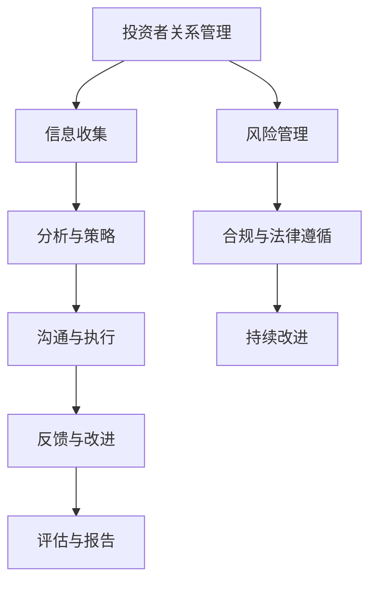
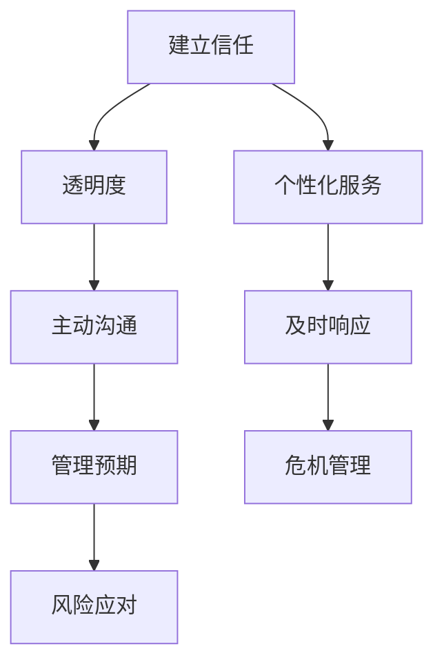

                 

### 第1章 引言

#### 1.1 书籍概述与目标读者

《创业路上的投资者关系：维护良好关系的策略与技巧》是一本针对创业者和企业家在创业过程中与投资者建立和维护关系的指导性书籍。本书旨在为读者提供系统、实用和高效的投资者关系管理策略和技巧，帮助他们在面对投资者时更加自信、从容，从而更好地推进创业项目的发展。

目标读者包括：
- 初创企业创始人
- 创业公司的CTO、CEO和其他高级管理人员
- 投资者关系管理专业人员
- 刚进入投资领域的从业者和创业者

#### 1.2 创业与投资者关系的重要性

投资者关系在创业过程中具有至关重要的地位。良好的投资者关系不仅能够为创业公司带来资金支持，还能提升企业的品牌形象和公信力。以下是从几个关键方面阐述投资者关系的重要性：

1. **资金支持**：投资者是创业公司资金的主要来源之一。通过建立和维护良好的投资者关系，创业者可以更有效地吸引风险投资、私募股权投资和其他形式的资金。

2. **品牌与公信力**：良好的投资者关系能够提升企业的品牌形象和公信力。当投资者对公司有信心时，他们更愿意在公司身上进行投资，这也会吸引其他潜在投资者和合作伙伴的关注。

3. **市场竞争力**：在竞争激烈的市场环境中，拥有良好的投资者关系可以为企业带来竞争优势。投资者关系管理良好的企业往往能够更快地获得市场认可和资金支持。

4. **战略合作伙伴**：投资者不仅是资金来源，还可以成为企业的战略合作伙伴。通过良好的投资者关系，创业者可以与投资者建立深厚的合作关系，共同推动企业的发展。

#### 1.3 投资者关系的挑战与机遇

尽管投资者关系对创业公司至关重要，但在实际操作中，创业者常常面临一系列挑战：

1. **信息不对称**：投资者和创业公司之间存在信息不对称，投资者希望获得更多、更准确的信息，而创业公司则可能担心过度披露信息带来的风险。

2. **信任建立**：建立投资者信任是投资者关系管理中的关键挑战。投资者需要看到创业公司的潜力和发展前景，这需要时间和有效的沟通。

3. **沟通与交流**：投资者关系管理涉及到大量的沟通与交流，如何选择合适的沟通方式、技巧和策略，是创业者需要面临的挑战。

4. **风险与期望管理**：投资者对风险和回报有较高的期望，创业者需要制定有效的风险管理和期望管理策略，以确保投资者对公司有持续信心。

然而，这些挑战同时也伴随着机遇：

1. **资金支持**：良好的投资者关系能够帮助创业公司获得更多、更长期的资金支持，这对于企业的持续发展和扩张至关重要。

2. **品牌提升**：通过有效的投资者关系管理，企业可以提升品牌形象和公信力，吸引更多潜在客户和合作伙伴。

3. **战略资源**：投资者不仅提供资金支持，还可以为企业带来战略资源，如市场渠道、技术支持等。

4. **经验积累**：通过与投资者的互动，创业者可以积累宝贵的经验和知识，提高自己在管理和运营企业方面的能力。

综上所述，投资者关系在创业过程中扮演着不可或缺的角色。面对挑战，创业者需要采取有效的策略和技巧来维护和提升投资者关系，从而更好地推进创业项目的发展。

### 第2章 投资者关系基础知识

投资者关系（Investor Relations，简称IR）是创业公司在资本市场上与投资者建立和维护关系的过程。有效的投资者关系管理不仅可以为创业公司带来资金支持，还能提升企业的品牌形象和公信力。在本章中，我们将详细探讨投资者关系的基础知识，包括投资者分类与需求分析、投资者关系管理的基本原则以及投资者关系管理流程。

#### 2.1 投资者分类与需求分析

投资者可以分为多个类别，每种类型的投资者都有其特定的需求和期望。以下是几种常见的投资者分类及其需求分析：

1. **风险投资者（Venture Capitalists）**
   - **需求分析**：风险投资者通常关注初创企业和高增长潜力项目。他们希望快速获得高回报，因此对项目的创新性、市场前景和团队能力有较高要求。
   - **管理策略**：与风险投资者建立关系时，创业者需要强调项目的创新点、市场潜力以及团队的专业能力和执行力。

2. **私募股权投资者（Private Equity Investors）**
   - **需求分析**：私募股权投资者通常投资于已经成立并具备一定规模和稳定业务的公司。他们更关注企业的盈利能力、财务状况和长期增长潜力。
   - **管理策略**：与私募股权投资者沟通时，创业者需要提供详细的财务报告、业务模型和市场分析，以证明企业的可持续增长和盈利能力。

3. **机构投资者（Institutional Investors）**
   - **需求分析**：机构投资者包括养老基金、保险公司、共同基金等。他们通常进行长期投资，希望获得稳定的回报。他们关注企业的财务健康、风险管理和未来发展潜力。
   - **管理策略**：与机构投资者建立关系时，创业者需要强调企业的财务透明度、风险控制措施以及未来的发展战略。

4. **天使投资者（Angel Investors）**
   - **需求分析**：天使投资者通常是个人投资者，他们愿意在早期阶段投资初创项目。他们关注企业的创新性、团队和市场需求。
   - **管理策略**：与天使投资者沟通时，创业者需要展示项目的创新点、市场潜力以及团队背景，以赢得他们的信任和投资。

5. **个人投资者（Individual Investors）**
   - **需求分析**：个人投资者包括个人股东、投资者等。他们关注企业的业绩、市场表现和未来发展。
   - **管理策略**：与个人投资者建立关系时，创业者需要通过定期的信息披露和市场沟通，提升企业的透明度和公信力。

#### 2.2 投资者关系管理的基本原则

投资者关系管理是一个复杂而系统的工作，以下是一些关键的基本原则：

1. **透明度**：透明度是投资者关系管理的基础。创业者需要确保信息的透明和真实，及时披露公司的财务状况、业务进展和风险信息。

2. **诚信**：诚信是建立投资者信任的关键。创业者应保持诚信，遵守市场规则和法律法规，避免欺诈和误导行为。

3. **沟通**：沟通是投资者关系的核心。创业者需要与投资者保持密切沟通，了解他们的需求和期望，并及时回应他们的疑问和反馈。

4. **及时性**：及时性是投资者关系管理的重要原则。创业者需要及时向投资者披露重要信息，包括公司业务进展、市场变化和风险事件。

5. **个性化**：不同的投资者有不同的需求和期望，创业者需要根据投资者的特点进行个性化沟通和管理。

6. **风险管理**：风险管理是投资者关系管理的重要内容。创业者需要制定有效的风险管理策略，确保公司的财务健康和可持续发展。

7. **持续改进**：投资者关系管理是一个持续改进的过程。创业者需要不断反思和优化管理策略，以提升投资者关系的效果。

#### 2.3 投资者关系管理流程

投资者关系管理流程是一个系统性的过程，包括以下几个关键步骤：

1. **信息收集**：收集与公司业务、财务、市场等相关的重要信息，为投资者关系管理提供数据支持。

2. **分析与策略**：对收集到的信息进行分析，制定投资者关系管理策略，包括沟通计划、信息披露策略和风险应对措施。

3. **沟通与执行**：根据策略实施投资者关系管理，包括与投资者定期沟通、信息披露和风险沟通。

4. **反馈与改进**：收集投资者反馈，分析管理效果，不断优化投资者关系管理策略。

5. **评估与报告**：定期评估投资者关系管理效果，向公司内部和外部利益相关者报告管理成果。

通过以上步骤，创业者可以系统、全面地管理投资者关系，提升企业的资本价值和市场竞争力。

本章介绍了投资者关系的基础知识，包括投资者分类与需求分析、投资者关系管理的基本原则以及投资者关系管理流程。理解这些基础知识对于创业者来说至关重要，有助于他们在创业过程中更加有效地管理投资者关系，为企业的持续发展奠定基础。

### 第3章 维护良好关系的策略

良好的投资者关系对于创业公司的发展至关重要。为了建立和维护这种关系，创业者需要采取一系列策略和技巧。本章将详细探讨以下三个方面：

1. **建立信任与透明度**：信任是投资者关系管理中的核心要素，透明度则是信任的基石。我们将分析信任建设的关键要素，讨论透明度在投资者关系中的重要性，并提供如何实现透明的具体方法。

2. **主动沟通与信息传递**：有效的沟通是投资者关系管理的关键。我们将探讨定期报告与信息披露的重要性，介绍沟通技巧与策略，并讲解如何应对投资者的疑问。

3. **管理预期与风险**：投资者对风险和回报有较高期望，创业者需要制定有效的风险管理和预期管理策略。我们将分析风险管理的重要性，探讨如何制定风险应对策略，并讲解风险沟通与披露策略。

#### 3.1 建立信任与透明度

信任是投资者关系管理中的核心要素。没有信任，投资者很难对创业公司产生信心，从而不愿意进行投资。建立信任的关键在于以下几个要素：

1. **诚信**：诚信是建立信任的基础。创业者需要保持诚信，遵守市场规则和法律法规，避免任何形式的欺诈和误导行为。诚信不仅体现在公司的日常运营中，也体现在与投资者的沟通中。

2. **透明度**：透明度是信任的基石。创业者需要确保公司的财务状况、业务进展和风险信息透明、真实。透明度越高，投资者对公司的信任度就越高。

3. **一致性**：一致性是信任的保障。创业者需要在与投资者的沟通中保持一致性，确保信息的准确性和可靠性。不一致的信息可能会引起投资者的怀疑和误解。

4. **及时性**：及时性是信任的重要组成部分。创业者需要及时向投资者披露重要信息，包括公司的财务状况、业务进展和风险事件。延迟信息披露可能会导致投资者对公司产生不信任。

透明度在投资者关系中的重要性：

1. **提升信任**：透明度能够提升投资者对公司的信任，使投资者更愿意进行投资。

2. **减少信息不对称**：透明度可以减少投资者和公司之间的信息不对称，使投资者能够更好地了解公司的实际情况。

3. **降低投资风险**：透明度可以降低投资风险，使投资者能够做出更加理性的投资决策。

如何做到透明：

1. **定期信息披露**：创业者需要定期向投资者披露公司的财务状况、业务进展和风险信息。信息披露可以通过定期报告、会议、投资者关系管理系统等多种方式进行。

2. **建立透明的财务系统**：创业者需要建立透明的财务系统，确保财务数据的真实性和准确性。这包括财务报告的编制、审计和披露。

3. **提供详细的市场分析**：创业者需要提供详细的市场分析，包括市场趋势、竞争状况和行业动态。这可以帮助投资者更好地了解公司的市场环境。

4. **建立透明的沟通渠道**：创业者需要建立透明的沟通渠道，使投资者能够随时了解公司的最新动态。这包括电子邮件、电话、视频会议等多种沟通方式。

#### 3.2 主动沟通与信息传递

主动沟通是投资者关系管理的关键。通过主动沟通，创业者可以及时向投资者传递公司的重要信息，增强投资者对公司发展的信心。以下是一些主动沟通与信息传递的策略：

1. **定期报告与信息披露**：

   - **定期报告**：创业者需要定期向投资者提供公司财务报告、业务进展报告和市场分析报告。这些报告可以帮助投资者全面了解公司的发展状况。

   - **信息披露**：创业者需要及时向投资者披露公司的重要信息，包括重大业务决策、市场变化和风险事件。信息披露可以通过新闻发布会、投资者会议、投资者关系管理系统等方式进行。

2. **沟通技巧与策略**：

   - **倾听**：在沟通中，创业者需要倾听投资者的意见和需求，了解他们的关注点和疑虑。

   - **清晰表达**：创业者需要用清晰、简洁的语言表达公司的观点和策略，避免使用专业术语和复杂结构。

   - **积极回应**：创业者需要积极回应投资者的疑问和反馈，确保沟通的顺畅和有效性。

   - **个性化沟通**：创业者需要根据投资者的特点和需求，进行个性化沟通。例如，对于机构投资者，可以提供详细的数据分析和财务报告；对于天使投资者，可以强调团队的创新能力和市场前景。

3. **如何应对投资者的疑问**：

   - **提前准备**：在投资者会议或沟通前，创业者需要提前准备，了解投资者的疑问和关注点，制定相应的回应策略。

   - **坦诚回答**：对于投资者的问题，创业者需要坦诚回答，避免回避或误导。如果无法立即回答，可以承诺在适当时间内提供答案。

   - **数据支持**：在回答投资者的问题时，创业者可以提供数据支持，以增强回答的可信度。

   - **透明度**：对于一些敏感或潜在的风险问题，创业者需要保持透明度，确保投资者了解公司的实际情况。

#### 3.3 管理预期与风险

投资者对创业公司通常有较高的预期，同时面临多种风险。创业者需要制定有效的风险管理和预期管理策略，以维护良好的投资者关系。

1. **风险管理的重要性**：

   - **降低投资风险**：通过有效的风险管理，创业者可以降低投资者的投资风险，增强他们的投资信心。

   - **提升公司价值**：良好的风险管理可以提升公司的价值和品牌形象，吸引更多投资者。

   - **维护投资者关系**：通过有效的风险管理，创业者可以减少投资者对公司的不信任，维护良好的投资者关系。

2. **如何制定风险应对策略**：

   - **识别风险**：创业者需要识别公司可能面临的各种风险，包括市场风险、财务风险、运营风险等。

   - **评估风险**：对识别出的风险进行评估，确定其影响程度和发生概率。

   - **制定应对策略**：根据风险评估结果，制定相应的风险应对策略。这可能包括风险规避、风险降低、风险转移等。

3. **风险沟通与披露策略**：

   - **及时披露**：创业者需要及时向投资者披露公司的风险信息，包括潜在的风险因素和应对措施。

   - **透明度**：在风险沟通中，创业者需要保持透明度，确保投资者了解公司的实际情况。

   - **主动沟通**：创业者需要主动与投资者沟通风险信息，避免投资者因缺乏信息而产生误解。

   - **定期评估**：创业者需要定期评估风险管理的有效性，及时调整应对策略。

通过以上策略，创业者可以建立和维护良好的投资者关系，为公司的持续发展奠定基础。

### 第4章 投资者关系工具与技术

在投资者关系管理中，工具和技术的合理运用可以显著提升管理的效率和质量。本章将详细介绍两种关键的投资者关系工具与技术：投资者关系管理系统和数据与报告。

#### 4.1 投资者关系管理系统

投资者关系管理系统（Investor Relations Management System，简称IRMS）是一种专门为投资者关系管理设计的软件系统。它可以帮助企业自动化和优化投资者关系管理流程，提高信息传递的效率和准确性。以下是关于投资者关系管理系统的几个关键方面：

1. **功能与优势**：

   - **信息披露**：IRMS可以自动生成和分发定期的财务报告、业务进展报告和市场分析报告，确保信息披露的及时性和准确性。

   - **沟通管理**：通过IRMS，企业可以与投资者建立在线沟通渠道，包括电子邮件、短信、电话和视频会议等，方便实时沟通和互动。

   - **数据分析**：IRMS可以收集和分析投资者行为数据，帮助企业管理者了解投资者的需求和偏好，制定更有效的沟通策略。

   - **文档管理**：IRMS可以帮助企业存储和管理与投资者沟通的文档、邮件和会议记录，确保信息的可追溯性和完整性。

   - **风险管理**：IRMS可以监控和管理潜在的风险事件，提供预警和应对措施，帮助企业及时应对投资者关系中的挑战。

2. **如何选择合适的系统**：

   - **需求分析**：在选择IRMS之前，企业需要明确自身的投资者关系管理需求，包括信息披露、沟通管理、数据分析、文档管理和风险管理等方面。

   - **功能对比**：企业需要对比不同IRMS的功能和特点，选择符合自身需求、操作简便、扩展性强的系统。

   - **用户界面**：选择用户界面友好、易于操作的IRMS，可以提高员工的使用效率和满意度。

   - **成本效益**：考虑系统的成本效益，包括购买成本、维护成本和使用成本等，确保系统能够为企业带来实际的收益。

3. **系统实施与维护**：

   - **实施策略**：在实施IRMS时，企业需要制定详细的实施计划，包括系统部署、员工培训、数据迁移等环节，确保系统顺利上线。

   - **员工培训**：对员工进行系统操作和投资者关系管理的培训，确保员工能够熟练使用系统，提升管理效率。

   - **系统维护**：定期检查和更新IRMS，确保系统的稳定性和安全性，及时解决使用过程中出现的问题。

#### 4.2 数据与报告

数据与报告在投资者关系管理中起着至关重要的作用。有效的数据分析和高质量的报告可以帮助企业更好地了解投资者的需求和偏好，制定更科学的投资者关系管理策略。以下是关于数据与报告的几个关键方面：

1. **数据分析的作用**：

   - **了解投资者行为**：通过数据分析，企业可以了解投资者的投资偏好、关注点和行为习惯，从而制定更个性化的沟通策略。

   - **优化投资者关系**：数据分析可以帮助企业识别投资者关系管理中的优势和不足，优化管理流程，提升投资者满意度。

   - **预测投资趋势**：通过分析历史数据和行业趋势，企业可以预测未来的投资趋势，提前做好准备。

2. **投资者关系报告的编写技巧**：

   - **内容结构**：投资者关系报告应包括公司的财务状况、业务进展、市场分析、风险管理等信息。报告的结构应清晰、逻辑性强。

   - **数据准确**：报告中的数据应准确无误，确保信息的真实性和可靠性。

   - **图表使用**：适当使用图表和数据可视化工具，可以更直观地展示数据，使报告更具说服力。

   - **定期更新**：投资者关系报告应定期更新，确保投资者能够及时了解公司的最新动态。

3. **如何利用数据分析优化投资者关系**：

   - **定制报告**：根据投资者的需求和偏好，定制个性化的报告，提供他们感兴趣的信息。

   - **定期反馈**：定期收集投资者对报告的反馈，了解他们对报告内容的满意度和建议，不断优化报告。

   - **数据驱动决策**：基于数据分析结果，制定和调整投资者关系管理策略，确保策略的科学性和有效性。

   - **预警系统**：利用数据分析建立预警系统，及时发现和应对潜在的风险和问题，维护良好的投资者关系。

通过运用投资者关系管理系统和有效的数据与报告，企业可以更好地管理投资者关系，提升企业的品牌价值和市场竞争力。

### 第5章 投资者关系实战案例

在投资者关系管理中，实战案例不仅能够提供宝贵的经验，还能帮助读者更好地理解和应用相关策略与技巧。本章将通过几个成功和失败的案例，详细分析投资者关系的维护与改进方法，帮助创业者从实际操作中汲取经验。

#### 5.1 成功案例分享

**案例一：如何吸引机构投资者的关注**

**背景**：某初创企业开发了一款创新的智能家居产品，产品具有独特的技术优势和广阔的市场前景。然而，公司早期资金不足，急需获得机构投资者的关注。

**策略**：

1. **明确市场定位和竞争优势**：公司在产品发布会上详细介绍了市场定位和竞争优势，强调了其技术独特性和市场潜力。

2. **制作精美的演示资料**：公司制作了精美的演示资料，包括产品手册、视频演示和用户反馈，以便机构投资者全面了解产品。

3. **建立长期沟通渠道**：公司通过定期报告和投资者关系管理系统，与机构投资者保持持续沟通，及时分享公司最新动态。

4. **参与行业峰会和论坛**：公司积极参与行业峰会和论坛，通过面对面交流，进一步吸引机构投资者的关注。

**结果**：经过一系列的努力，公司成功吸引了多家知名机构投资者的投资，获得了首轮融资，进一步推动了产品研发和市场推广。

**经验总结**：

- **清晰的市场定位和竞争优势**：明确的市场定位和竞争优势是吸引投资者的重要前提。
- **高质量的演示资料**：精美的演示资料能够直观地展示产品优势，增强投资者的信心。
- **持续沟通**：通过定期报告和投资者关系管理系统，与投资者保持持续沟通，提升投资者的信任度。
- **积极参与行业活动**：参与行业峰会和论坛，通过面对面交流，进一步提升品牌影响力和投资者关注。

**案例二：应对投资者质疑的策略**

**背景**：某初创企业在融资过程中，遭遇了多家投资者对产品市场前景的质疑，导致融资进程受阻。

**策略**：

1. **准备详细的商业计划书**：公司在融资前准备了详细的商业计划书，包括市场分析、产品优势、竞争策略和财务预测，以便应对投资者的质疑。

2. **展示数据支持**：公司在回答投资者质疑时，提供了详细的数据支持，包括市场调查报告、用户反馈数据和产品测试结果。

3. **进行模拟演示**：公司进行了产品模拟演示，通过实际操作，直观地展示了产品的功能和应用场景。

4. **积极回应**：公司对投资者的质疑进行了积极回应，确保每个问题都得到了详细解答。

**结果**：通过以上策略，公司成功打消了投资者的疑虑，最终获得了投资，顺利完成了融资。

**经验总结**：

- **详细的商业计划书**：详细的商业计划书能够提供充分的数据支持，帮助创业者应对投资者的质疑。
- **数据支持**：提供详细的数据支持，增强回答的可信度。
- **模拟演示**：通过实际操作，直观地展示产品优势和应用场景。
- **积极回应**：积极回应投资者的质疑，确保每个问题都得到了详细解答。

**案例三：通过投资者关系提升企业估值**

**背景**：某初创企业在发展过程中，希望通过投资者关系提升公司估值，吸引更多战略投资者。

**策略**：

1. **提升品牌知名度**：公司通过媒体宣传、行业活动等方式，提升品牌知名度，增强市场影响力。

2. **加强投资者关系管理**：公司通过投资者关系管理系统，与投资者保持密切沟通，分享公司最新动态和成绩。

3. **制定明确的增长策略**：公司制定了明确的增长策略，包括市场扩展、产品研发和技术创新，以展示公司的发展潜力和前景。

4. **积极参与资本市场活动**：公司积极参与资本市场活动，如投资者峰会、路演等，与潜在投资者进行面对面交流。

**结果**：通过一系列的努力，公司成功提升了估值，吸引了多家战略投资者的关注，进一步推动了公司发展。

**经验总结**：

- **品牌知名度**：提升品牌知名度，增强市场影响力。
- **投资者关系管理**：通过投资者关系管理系统，与投资者保持密切沟通，分享公司最新动态。
- **明确的增长策略**：制定明确的增长策略，展示公司的发展潜力和前景。
- **积极参与资本市场活动**：通过资本市场活动，与潜在投资者进行面对面交流，提升公司估值。

#### 5.2 失败案例分析

**案例一：沟通不足导致的误解**

**背景**：某初创企业在一次与投资者的沟通中，由于准备不足，导致投资者对公司的产品前景产生了误解。

**原因**：

1. **沟通准备不足**：公司在会议前没有充分准备，无法详细解答投资者的疑问。

2. **信息不对称**：投资者对公司产品技术细节和市场前景了解有限，导致对公司的判断出现偏差。

**结果**：投资者对公司的信任度下降，融资进程受阻。

**改进措施**：

1. **充分准备**：在会议前，公司应充分准备，包括详细解答投资者可能提出的疑问和问题。

2. **透明沟通**：保持透明度，及时向投资者披露公司的重要信息和进展。

3. **增强信息对称**：通过定期的信息披露和市场分析，增强投资者对公司产品和市场的了解。

**案例二：信息披露不当引发的投资者信任危机**

**背景**：某初创企业在披露财务信息时，由于操作失误，导致投资者对公司的财务状况产生了怀疑。

**原因**：

1. **信息披露不当**：公司在信息披露过程中，存在数据错误和信息不透明的问题。

2. **风险沟通不足**：公司未及时与投资者沟通，解释财务状况的变化和原因。

**结果**：投资者对公司的信任度下降，导致公司股价波动，融资困难。

**改进措施**：

1. **提高信息披露质量**：确保信息披露的准确性和及时性，避免数据错误和信息不透明。

2. **加强风险沟通**：及时与投资者沟通，解释财务状况的变化和原因，避免误解和恐慌。

3. **建立透明沟通机制**：建立透明的沟通机制，确保投资者能够随时了解公司的最新动态。

**案例三：风险应对不当带来的损失**

**背景**：某初创企业在面对市场风险时，未能及时制定有效的应对策略，导致公司遭受重大损失。

**原因**：

1. **风险识别不足**：公司未能及时发现市场变化和潜在的风险。

2. **风险应对不力**：公司在面对风险时，未能制定有效的应对策略，导致损失扩大。

**结果**：公司遭受重大损失，投资者信心下降，融资受阻。

**改进措施**：

1. **加强风险识别**：建立完善的风险识别机制，及时发现市场变化和潜在的风险。

2. **制定应对策略**：针对不同类型的风险，制定有效的应对策略，确保能够及时应对。

3. **增强风险沟通**：及时与投资者沟通风险信息，确保他们了解公司的风险状况和应对策略。

通过以上成功和失败的案例，我们可以看到，投资者关系管理在创业过程中至关重要。成功的投资者关系管理不仅能为企业带来资金支持，还能提升企业的品牌价值和市场竞争力。而失败的案例则提醒我们，在投资者关系管理中，需要时刻保持警惕，避免因为沟通不足、信息披露不当或风险应对不力等问题导致投资者关系受损。

#### 第6章 创业者与投资者的互动技巧

在创业过程中，创业者与投资者的互动技巧对于建立和维护良好的投资者关系至关重要。本章将重点探讨以下几个方面：

1. **如何与投资者建立联系**：创业者可以通过参与创业竞赛、投资者峰会和利用社交媒体等方式与投资者建立联系。

2. **投资者会议的准备与执行**：会议议程的规划、沟通技巧以及如何应对投资者的提问是投资者会议成功的关键。

3. **投资者关系中的危机管理**：危机管理的意义、策略与步骤，以及如何处理负面新闻和舆论是本章的重要内容。

##### 6.1 如何与投资者建立联系

与投资者建立联系是投资者关系管理的重要起点。以下是一些有效的策略：

1. **参与创业竞赛与投资者峰会**

   - **目标**：通过创业竞赛和投资者峰会，创业者可以与潜在投资者面对面交流，展示项目亮点。

   - **策略**：创业者需要提前准备，包括完善商业计划书、准备演示文稿和展示材料。在活动期间，积极与投资者交流，了解他们的需求和兴趣，并留下深刻的印象。

   - **实例**：某创业公司在参加了一场知名的创业竞赛后，通过与投资者的一对一交流，获得了多家机构投资者的关注，并在后续的融资中成功获得了投资。

2. **利用社交媒体与投资者互动**

   - **目标**：通过社交媒体平台，创业者可以与投资者保持持续互动，建立和加深联系。

   - **策略**：创业者可以通过发布项目动态、行业分析和市场见解来吸引投资者的关注。此外，还可以通过私信、评论等方式与投资者进行一对一的沟通。

   - **实例**：某初创公司通过在LinkedIn上发布关于公司产品和市场动态的博文，吸引了多位天使投资者的注意，并成功与他们建立了联系。

3. **如何撰写有效的商业计划书**

   - **目标**：商业计划书是创业者向投资者展示项目价值和潜力的关键文件。

   - **策略**：商业计划书应包括项目背景、市场分析、产品描述、竞争优势、营销策略、财务计划和风险分析等内容。语言应简洁明了，数据应准确可靠。

   - **实例**：某创业者在撰写商业计划书时，详细介绍了产品的技术原理、市场前景和团队背景，并提供了详细的市场调查数据和财务预测，成功吸引了投资者的关注。

##### 6.2 投资者会议的准备与执行

投资者会议是创业者与投资者面对面交流的重要环节。以下是一些关键的准备与执行技巧：

1. **会议议程与内容的规划**

   - **目标**：确保会议内容结构合理，重点突出，使投资者能够高效地获取信息。

   - **策略**：会议议程应包括开场介绍、项目展示、问答环节和总结。每个环节的时间应分配合理，确保会议高效进行。

   - **实例**：某创业公司在投资者会议中，提前制定了详细的议程，包括项目背景、市场分析、产品演示和财务预测等内容，确保了会议的高效性和针对性。

2. **沟通技巧与策略**

   - **目标**：通过有效的沟通技巧，增强投资者对项目的信心。

   - **策略**：创业者应保持自信，用简洁明了的语言表达项目亮点和优势。在回答投资者提问时，应条理清晰，用数据和事实支持回答。

   - **实例**：某创业者在回答投资者关于市场前景的提问时，用详细的市场调查数据和行业分析报告进行了支持，使投资者对项目的市场潜力有了更深的了解。

3. **如何应对投资者的提问**

   - **目标**：确保能够及时、准确地回应投资者的疑问，增强投资者信任。

   - **策略**：创业者应提前准备可能被提问的问题，并制定相应的回答策略。在会议中，应保持冷静，用数据和事实支持回答，确保回答的准确性和可信度。

   - **实例**：某创业者在会议中，面对投资者关于产品技术的提问时，通过展示实验室测试数据和用户反馈，成功打消了投资者的疑虑。

##### 6.3 投资者关系中的危机管理

在投资者关系中，危机管理是不可或缺的一部分。以下是一些关键方面：

1. **危机管理的意义**

   - **目标**：确保企业能够在面对危机时迅速反应，减少负面影响，维护投资者关系。

   - **策略**：危机管理不仅是应对突发事件，更是长期的企业管理和沟通策略。通过危机管理，企业可以提升应对危机的能力，增强投资者信心。

2. **危机管理的策略与步骤**

   - **目标**：确保企业能够及时识别危机、制定应对策略并有效执行。

   - **策略**：危机管理应包括危机预警、危机应对策略制定、危机沟通和危机处理后的反思与改进。

   - **步骤**：
     1. **危机预警**：通过监测市场动态、媒体报道和内部反馈，及时识别潜在危机。
     2. **危机应对策略制定**：根据危机的性质和影响，制定具体的应对策略，包括危机处理方案和沟通策略。
     3. **危机沟通**：通过有效的沟通，向投资者披露危机信息，解释危机原因和应对措施，确保信息的透明度和及时性。
     4. **危机处理后的反思与改进**：对危机处理过程进行总结和反思，找出问题所在，制定改进措施，防止类似危机再次发生。

   - **实例**：某创业公司在面对市场负面舆论时，迅速启动了危机管理机制，通过及时披露信息、积极回应投资者疑问和改进产品，成功化解了危机，维护了投资者关系。

3. **如何处理负面新闻与舆论**

   - **目标**：确保企业能够在面对负面新闻和舆论时，及时应对，减少负面影响。

   - **策略**：
     1. **及时回应**：在负面新闻和舆论出现后，企业需要及时回应，解释事件的真相，避免谣言的传播。
     2. **透明沟通**：保持透明度，确保信息的准确性和及时性，让投资者了解企业的真实情况和应对措施。
     3. **积极改进**：针对负面新闻和舆论中提出的问题，积极改进，提升产品和服务质量，增强投资者的信任。

   - **实例**：某创业公司在面对市场负面舆论时，通过及时回应、透明沟通和积极改进，成功缓解了危机，恢复了投资者信心。

通过本章的探讨，创业者可以更好地掌握与投资者建立联系、准备和执行投资者会议，以及应对投资者关系中的危机管理。这些互动技巧不仅有助于建立和维护良好的投资者关系，还能提升企业的品牌价值和市场竞争力。

### 第7章 投资者关系未来趋势与展望

投资者关系管理（Investor Relations Management，简称IRM）在技术不断进步的背景下正经历着深刻变革。未来，随着人工智能（AI）、大数据、社交媒体和可持续发展等因素的推动，投资者关系管理将迈向新的高度。本章将探讨投资者关系管理技术的发展趋势、创业者与投资者关系的未来模式以及IRM在创业公司发展中的重要性。

#### 7.1 投资者关系管理技术的发展趋势

1. **人工智能与大数据在投资者关系中的应用**

   - **目标**：利用AI和大数据技术，提升投资者关系管理的效率和精准度。

   - **应用**：
     1. **自动化沟通**：AI技术可以自动化处理日常沟通任务，如回复投资者邮件、生成报告等，节省人力资源。
     2. **智能分析**：大数据分析可以帮助企业更深入地了解投资者的行为和需求，制定更精准的沟通策略。
     3. **风险预测**：通过分析大量历史数据和趋势，AI可以预测潜在的市场风险和投资者行为，为企业提供预警。

2. **社交媒体与移动端在投资者关系中的影响**

   - **目标**：通过社交媒体和移动端，增强企业与投资者之间的互动和沟通。

   - **应用**：
     1. **实时沟通**：社交媒体平台如LinkedIn、Twitter等提供了企业与投资者实时沟通的渠道，使信息传递更加高效。
     2. **品牌建设**：通过社交媒体，企业可以展示其品牌形象、发布市场动态和公司新闻，提升品牌影响力。
     3. **投资者反馈**：企业可以通过社交媒体平台收集投资者的反馈和建议，及时调整投资者关系管理策略。

3. **企业可持续发展与ESG投资**

   - **目标**：响应全球可持续发展的趋势，提升企业的社会责任形象，吸引ESG（环境、社会和治理）投资者。

   - **应用**：
     1. **ESG报告**：企业需要定期发布ESG报告，披露其在环境、社会和治理方面的表现，提升透明度和公信力。
     2. **可持续发展战略**：企业应制定并实施可持续发展战略，确保业务运营对环境和社会的影响最小化。
     3. **投资者沟通**：企业需要与ESG投资者进行定期沟通，介绍其可持续发展成果和未来规划，增强投资者信心。

#### 7.2 创业者与投资者关系的未来模式

1. **数字化投资者关系管理**

   - **目标**：通过数字化工具和平台，实现更高效、更精准的投资者关系管理。

   - **模式**：
     1. **在线会议与报告**：企业可以通过在线会议系统和虚拟报告平台，与投资者进行远程交流，提高沟通效率。
     2. **定制化服务**：企业可以利用AI和大数据技术，为不同类型的投资者提供定制化的沟通和服务，提升投资者的满意度。
     3. **实时数据监控**：企业可以实时监控投资者行为和反馈，快速响应市场变化，调整投资者关系策略。

2. **社区化投资者关系**

   - **目标**：通过建立投资者社区，增强企业与投资者之间的互动和信任。

   - **模式**：
     1. **投资者论坛**：企业可以建立投资者论坛，供投资者交流、分享观点和反馈。
     2. **互动活动**：企业可以定期举办线上和线下的投资者互动活动，如研讨会、交流会等，增强与投资者的联系。
     3. **反馈机制**：企业应建立有效的反馈机制，及时回应投资者的意见和建议，提升投资者的参与感和忠诚度。

3. **国际化投资者关系**

   - **目标**：拓展国际市场，吸引全球投资者，提升企业的国际影响力。

   - **模式**：
     1. **多语言支持**：企业应提供多语言支持，确保不同语言背景的投资者能够方便地获取信息。
     2. **本地化服务**：企业应根据不同国家和地区的文化和市场特点，提供本地化的投资者关系管理服务。
     3. **全球资本平台**：企业可以通过全球资本平台，如国际投资者峰会和路演活动，与全球投资者建立联系。

#### 7.3 创业者与投资者关系的重要性提升

随着技术的进步和市场环境的变化，投资者关系在创业公司发展中的重要性不断提升。以下是几个关键方面：

1. **资金支持**：投资者关系管理良好的企业更容易获得资金支持。通过有效的IRM，创业者可以吸引更多的风险投资、私募股权投资和其他形式的资金，推动公司发展。

2. **品牌提升**：良好的投资者关系能够提升企业的品牌形象和公信力。当投资者对创业公司有信心时，他们更愿意在公司身上进行投资，这也会吸引更多潜在客户和合作伙伴。

3. **战略资源**：投资者不仅是资金来源，还可以为企业带来战略资源，如市场渠道、技术支持等。通过与投资者的深入合作，创业者可以获取更多的资源，加速公司的发展。

4. **市场竞争**：在竞争激烈的市场环境中，投资者关系管理良好的企业往往具备更强的竞争优势。良好的IRM可以帮助企业快速获得市场认可，提升市场份额。

5. **企业价值**：投资者关系管理对于提升企业价值具有重要意义。通过有效的IRM，企业可以吸引更多投资者，提高公司的市值和估值。

总之，未来投资者关系管理将在技术创新和市场环境变化的推动下，不断发展和完善。创业者应积极适应这些变化，利用先进的技术和策略，提升投资者关系管理水平，为企业的持续发展和成功奠定坚实基础。

### 附录：参考资料与进一步阅读

为了帮助读者深入了解投资者关系管理的理论和实践，本章提供了相关的参考资料和进一步阅读的建议。

#### 附录1：投资者关系管理相关法规与政策

1. **《中华人民共和国证券法》**：该法规定了证券发行与交易的基本规则，包括信息披露的要求。
2. **《上市公司信息披露管理办法》**：详细规定了上市公司信息披露的具体要求和程序。
3. **《企业内部控制基本规范》**：为投资者提供了关于企业内部控制的基本规范，有助于提高信息披露的透明度。
4. **国际证券交易所协会（IOSCO）**：IOSCO发布了《国际证券交易所联合会投资者关系最佳实践指南》，提供了投资者关系管理的国际标准和建议。

#### 附录2：投资者关系管理工具与资源推荐

1. **投资者关系管理系统**：
   - **Oracle IRMS**：提供全面的投资者关系管理功能，包括信息披露、沟通管理和数据分析。
   - **Broadridge IRMS**：支持全球范围内的投资者关系管理，提供定制化的解决方案。
   - **Intrinio**：提供实时股票市场数据、财务报表和公司新闻，支持投资者关系数据分析。

2. **投资者关系管理资源**：
   - **Investor Relations Association（IRA）**：IRA是一个国际性的投资者关系专业组织，提供各种资源和培训。
   - **Investor Relations Consultants Association（IRCA）**：IRCA是一个专业组织，为投资者关系专业人士提供认证和培训。
   - **CFA Institute**：CFA协会提供了丰富的投资者关系相关资源和研究报告。

3. **行业报告与研究**：
   - **PwC Investor Relations Survey**：PwC定期发布投资者关系管理调查报告，分析投资者关系管理的趋势和最佳实践。
   - **Deloitte Investor Relations Trends**：Deloitte发布了关于投资者关系管理的研究报告，探讨行业变化和策略优化。

#### 附录3：推荐阅读书籍与文章

1. **《投资者关系管理：理论与实践》**：作者：李明辉，本书详细介绍了投资者关系管理的理论框架和实践应用。
2. **《公司治理与投资者关系》**：作者：张志宏，本书从公司治理的角度探讨了投资者关系的重要性及其在实践中的应用。
3. **《投资者关系：全球最佳实践》**：作者：David Rose，本书介绍了全球范围内的投资者关系管理最佳实践和成功案例。
4. **《投资者的未来：数字革命如何改变投资组合管理》**：作者：Meir Statman，本书探讨了数字化时代投资者关系管理的新趋势和策略。

通过以上参考资料和进一步阅读建议，读者可以更深入地了解投资者关系管理的理论和实践，为创业公司在投资者关系管理方面提供有力支持。

### 第8章 核心概念与联系

在投资者关系管理（IRM）中，理解核心概念及其相互关系对于制定有效的策略至关重要。本章将使用Mermaid流程图，对核心概念之间的联系进行可视化展示，帮助读者更好地理解和应用。

#### 8.1 投资者关系管理的Mermaid流程图

以下是投资者关系管理的基本流程，通过Mermaid流程图进行可视化：



- **信息收集（B）**：这是IRM的起点，包括收集与公司业务、财务和市场相关的数据和信息。
- **分析与策略（C）**：对收集到的信息进行分析，制定投资者关系管理策略，包括信息披露、沟通计划和风险管理。
- **沟通与执行（D）**：根据策略实施沟通与执行，确保信息的及时传递和有效反馈。
- **反馈与改进（E）**：收集投资者的反馈，对管理效果进行评估，并根据反馈进行改进。
- **评估与报告（F）**：定期评估投资者关系管理的成果，并向公司内部和外部利益相关者报告。
- **风险管理（G）**：制定和实施风险管理策略，确保公司在面对风险时能够及时响应。
- **合规与法律遵循（H）**：遵守相关法规和法律规定，确保投资者关系管理的合法性和合规性。
- **持续改进（I）**：基于反馈和评估结果，持续优化投资者关系管理流程和策略。

通过这个Mermaid流程图，我们可以清晰地看到投资者关系管理各个环节的相互关系和作用，为创业者提供了一个全面、系统的方法来管理投资者关系。

#### 8.2 维护良好关系的策略与技巧Mermaid流程图

以下是关于维护良好投资者关系的策略与技巧的Mermaid流程图：



- **建立信任（A）**：信任是投资者关系的基石，通过诚信、透明度和一致性建立投资者信任。
- **透明度（B）**：透明度是建立信任的关键，确保信息披露的真实和及时。
- **主动沟通（C）**：通过定期报告和个性化沟通，主动与投资者保持联系。
- **管理预期（D）**：合理管理投资者的预期，避免信息不对称和误解。
- **风险应对（E）**：制定有效的风险管理策略，确保公司能够在面对风险时迅速响应。
- **个性化服务（F）**：根据投资者的特点和需求，提供个性化的服务和沟通。
- **及时响应（G）**：及时回应投资者的疑问和反馈，确保沟通的及时性和有效性。
- **危机管理（H）**：制定危机管理策略，确保在危机发生时能够迅速、有效地应对。

通过这个Mermaid流程图，我们可以清晰地看到维护良好投资者关系的策略和技巧之间的逻辑关系和执行顺序。每个环节相互关联，共同构成了一个完整的投资者关系管理体系。

这两个Mermaid流程图不仅展示了投资者关系管理和维护良好投资者关系的核心概念和策略，还提供了直观的可视化工具，帮助读者更好地理解和应用这些概念和策略。通过这些流程图，创业者可以系统地制定和优化投资者关系管理策略，提升企业的市场竞争力。

### 第9章 核心算法原理讲解

在投资者关系管理（IRM）中，主动沟通是一个关键环节。有效的主动沟通可以增强企业与投资者之间的信任，提高投资者满意度。以下将介绍主动沟通算法的原理，并通过伪代码详细阐述其实现过程。

#### 9.1 主动沟通算法原理

主动沟通算法的主要目标是确保企业与投资者之间的沟通及时、准确且高效。该算法需要根据投资者需求和企业内部数据，动态调整沟通内容和方式。以下是主动沟通算法的基本原理：

1. **数据收集**：收集与投资者相关的数据，包括投资者偏好、投资领域、历史沟通记录等。
2. **数据更新**：定期更新数据，确保信息的准确性和时效性。
3. **沟通策略生成**：根据数据分析和投资者需求，生成个性化的沟通策略。
4. **沟通执行**：执行沟通策略，包括发送邮件、安排会议等。
5. **反馈收集**：收集投资者反馈，评估沟通效果，并根据反馈进行优化。

#### 伪代码

以下是一个简化的主动沟通算法伪代码示例：

```python
# 伪代码

def communicate_actively(data, investor):
    """
    主动沟通算法，根据数据与投资者进行有效沟通。
    
    :param data: 投资者数据，包括历史沟通记录、偏好等。
    :param investor: 投资者对象，包含投资者信息。
    :return: 沟通记录。
    """

    # 检查数据是否过时
    if data.is_outdated():
        data.update_data()

    # 如果投资者有疑问，优先回答
    if investor.has_questions():
        communicate_answers(investor)
    else:
        # 发送定期报告
        send_regular_reports()

    # 记录沟通日志
    communication_record = log_communication(investor)

    return communication_record

# 数据更新方法
def update_data(data):
    """
    更新投资者数据。
    
    :param data: 投资者数据对象。
    """
    # 实现数据更新逻辑
    data.fetch_new_data()

# 沟通回答方法
def communicate_answers(investor):
    """
    回答投资者的疑问。
    
    :param investor: 投资者对象。
    """
    # 实现回答疑问逻辑
    investor.answer_questions()

# 沟通日志记录方法
def log_communication(investor):
    """
    记录沟通日志。
    
    :param investor: 投资者对象。
    :return: 沟通日志。
    """
    # 实现日志记录逻辑
    return create_communication_log(investor)
```

#### 9.2 算法工作流程

1. **数据收集**：首先，系统需要收集与投资者相关的数据，如投资领域、历史沟通记录、投资偏好等。这些数据可以通过数据库、CRM系统等渠道获取。

2. **数据更新**：定期检查数据是否过时，如果过时，则需要更新。数据更新可以包括更新投资领域、投资策略、市场动态等。

3. **沟通策略生成**：根据数据分析和投资者需求，系统会生成个性化的沟通策略。这包括决定沟通的内容、方式、频率等。

4. **沟通执行**：根据沟通策略，系统会执行相应的沟通任务，如发送电子邮件、安排电话会议、发布市场报告等。

5. **反馈收集**：在沟通结束后，系统会收集投资者的反馈，评估沟通效果。如果反馈不佳，系统会根据反馈进行调整，以优化沟通策略。

#### 9.3 算法应用实例

假设投资者A最近对公司的市场策略和财务状况有疑问，系统会按照以下步骤进行沟通：

1. **数据更新**：系统首先更新投资者A的数据，确保信息的准确性。

2. **沟通策略生成**：根据数据，系统生成个性化的沟通策略，决定通过邮件详细解答投资者的疑问。

3. **沟通执行**：系统发送一封详细的邮件，解答投资者A的疑问，并提供相关的市场分析和财务报表。

4. **反馈收集**：邮件发送后，系统会收集投资者A的反馈，评估邮件沟通的效果。

5. **策略优化**：根据反馈，系统会调整后续的沟通策略，确保更符合投资者A的需求。

通过上述伪代码和工作流程，我们可以看到主动沟通算法在投资者关系管理中的关键作用。该算法通过自动化和个性化沟通，提高了沟通效率和效果，有助于建立和维护良好的投资者关系。

### 第10章 数学模型和数学公式

在投资者关系管理（IRM）中，数学模型和公式被广泛应用于风险评估、预期管理以及数据分析和决策优化等方面。以下我们将介绍几个关键的数学模型和公式，并对其进行详细讲解和实例说明。

#### 10.1 风险评估模型

风险评估是投资者关系管理中的一个重要环节，用于评估企业面临的风险程度和可能的影响。以下是一种常见风险评估模型：

**贝叶斯风险评估模型**

贝叶斯风险评估模型基于贝叶斯定理，通过历史数据和概率论来评估风险。其基本公式为：

$$
P(A|B) = \frac{P(B|A) \cdot P(A)}{P(B)}
$$

其中：
- \(P(A|B)\) 表示在事件B发生的条件下，事件A发生的概率。
- \(P(B|A)\) 表示在事件A发生的条件下，事件B发生的概率。
- \(P(A)\) 表示事件A发生的先验概率。
- \(P(B)\) 表示事件B发生的先验概率。

**实例说明**：

假设一个创业公司正在开发一种新型智能家居产品。根据历史数据和专家意见，公司评估了产品发布时可能面临的市场风险和竞争风险。根据贝叶斯定理，可以计算出每个风险发生的概率，从而制定相应的风险管理策略。

**公式应用**：

1. **市场风险概率**：

$$
P(市场风险) = \frac{P(市场风险|新产品发布) \cdot P(新产品发布)}{P(新产品发布)}
$$

其中，\(P(市场风险|新产品发布)\) 为在产品发布条件下市场风险发生的概率，\(P(新产品发布)\) 为新产品发布的概率。

2. **竞争风险概率**：

$$
P(竞争风险) = \frac{P(竞争风险|新产品发布) \cdot P(新产品发布)}{P(新产品发布)}
$$

其中，\(P(竞争风险|新产品发布)\) 为在产品发布条件下竞争风险发生的概率。

通过计算这两个概率，公司可以更准确地评估产品发布时的风险水平，并制定相应的风险应对策略。

#### 10.2 预期管理模型

预期管理是投资者关系管理中另一个关键环节，涉及管理投资者对企业的预期和期望。以下是一种常用的预期管理模型：

**期望值模型**

期望值模型用于计算投资者预期的平均收益或损失，公式为：

$$
E(X) = \sum_{i=1}^{n} x_i \cdot p_i
$$

其中：
- \(E(X)\) 表示期望值。
- \(x_i\) 表示第i种结果的收益或损失。
- \(p_i\) 表示第i种结果发生的概率。

**实例说明**：

假设一个创业公司计划在未来三年内实现收入增长。根据市场调研和内部数据，公司预计三种不同的收入增长情景，每种情景的概率如下：

- 高增长：\(x_1 = 30\%\)，\(p_1 = 0.4\)
- 中等增长：\(x_2 = 10\%\)，\(p_2 = 0.5\)
- 低增长：\(x_3 = -5\%\)，\(p_3 = 0.1\)

**公式应用**：

计算公司的预期收入增长：

$$
E(X) = (30\% \cdot 0.4) + (10\% \cdot 0.5) + (-5\% \cdot 0.1) = 12\%
$$

通过计算预期收入增长，公司可以更好地了解市场前景，并根据预期调整投资策略和运营计划。

#### 10.3 数据分析与报告模型

数据分析是投资者关系管理中不可或缺的一部分，用于生成报告和展示企业业绩。以下是一种常见的数据分析模型：

**回归分析模型**

回归分析模型用于分析自变量和因变量之间的关系，公式为：

$$
y = \beta_0 + \beta_1 \cdot x + \epsilon
$$

其中：
- \(y\) 表示因变量（如收入、利润等）。
- \(x\) 表示自变量（如市场份额、广告投入等）。
- \(\beta_0\) 表示常数项。
- \(\beta_1\) 表示自变量对因变量的影响系数。
- \(\epsilon\) 表示随机误差。

**实例说明**：

假设一个创业公司希望分析广告投入对收入的影响。根据历史数据，公司建立了回归模型如下：

$$
收入 = \beta_0 + \beta_1 \cdot 广告投入 + \epsilon
$$

**公式应用**：

通过回归分析，公司可以计算出广告投入对收入的系数 \(\beta_1\)，并预测不同广告投入水平下的收入增长。

通过上述数学模型和公式，创业公司可以在投资者关系管理中更加科学和准确地评估风险、管理预期和进行数据分析，从而制定更有效的投资者关系策略。这些模型不仅提供了理论支持，也为实际操作提供了实用工具。

### 结论

通过本文的详细探讨，我们可以得出以下几点结论：

1. **投资者关系的重要性**：投资者关系对于创业公司的成功至关重要。良好的投资者关系不仅能够为创业公司带来资金支持，还能提升企业的品牌形象和公信力。

2. **维护良好关系的策略**：建立信任、透明度、主动沟通、管理预期和风险管理是维护良好投资者关系的核心策略。创业者需要通过这些策略与投资者保持紧密联系，确保信息的透明和及时传递。

3. **技术工具的应用**：投资者关系管理系统和数据分析工具可以显著提升投资者关系管理的效率和质量。通过这些工具，企业可以更好地了解投资者需求，优化沟通策略，并预测市场风险。

4. **实战案例分析**：成功和失败的案例分析为创业者提供了宝贵的经验。通过学习这些案例，创业者可以更好地应对投资者关系中的挑战，制定更加有效的策略。

5. **未来趋势**：随着人工智能、大数据和社交媒体等技术的发展，投资者关系管理将迎来新的变革。创业者需要紧跟这些趋势，积极应用新技术和策略，以提升企业的市场竞争力。

总结来说，投资者关系管理是一个复杂而系统性的工作，需要创业者具备全面的知识和技能。通过本文的介绍和分析，希望读者能够更好地理解投资者关系的重要性，掌握有效的管理策略和技巧，为创业公司的成功奠定坚实基础。

### 附录

#### 附录1：投资者关系管理相关法规与政策

1. **《中华人民共和国证券法》**：该法规定了证券发行与交易的基本规则，包括信息披露的要求。
2. **《上市公司信息披露管理办法》**：详细规定了上市公司信息披露的具体要求和程序。
3. **《企业内部控制基本规范》**：为投资者提供了关于企业内部控制的基本规范，有助于提高信息披露的透明度。
4. **国际证券交易所协会（IOSCO）**：IOSCO发布了《国际证券交易所联合会投资者关系最佳实践指南》，提供了投资者关系管理的国际标准和建议。

#### 附录2：投资者关系管理工具与资源推荐

1. **投资者关系管理系统**：
   - **Oracle IRMS**：提供全面的投资者关系管理功能，包括信息披露、沟通管理和数据分析。
   - **Broadridge IRMS**：支持全球范围内的投资者关系管理，提供定制化的解决方案。
   - **Intrinio**：提供实时股票市场数据、财务报表和公司新闻，支持投资者关系数据分析。

2. **投资者关系管理资源**：
   - **Investor Relations Association（IRA）**：IRA是一个国际性的投资者关系专业组织，提供各种资源和培训。
   - **Investor Relations Consultants Association（IRCA）**：IRCA是一个专业组织，为投资者关系专业人士提供认证和培训。
   - **CFA Institute**：CFA协会提供了丰富的投资者关系相关资源和研究报告。

3. **行业报告与研究**：
   - **PwC Investor Relations Survey**：PwC定期发布投资者关系管理调查报告，分析投资者关系管理的趋势和最佳实践。
   - **Deloitte Investor Relations Trends**：Deloitte发布了关于投资者关系管理的研究报告，探讨行业变化和策略优化。

#### 附录3：推荐阅读书籍与文章

1. **《投资者关系管理：理论与实践》**：作者：李明辉，本书详细介绍了投资者关系管理的理论框架和实践应用。
2. **《公司治理与投资者关系》**：作者：张志宏，本书从公司治理的角度探讨了投资者关系的重要性及其在实践中的应用。
3. **《投资者关系：全球最佳实践》**：作者：David Rose，本书介绍了全球范围内的投资者关系管理最佳实践和成功案例。
4. **《投资者的未来：数字革命如何改变投资组合管理》**：作者：Meir Statman，本书探讨了数字化时代投资者关系管理的新趋势和策略。

通过以上附录，读者可以更深入地了解投资者关系管理的相关法规、工具和资源，为实践中的投资者关系管理提供有力支持。希望这些资料能够帮助读者在创业道路上取得更大的成功。

