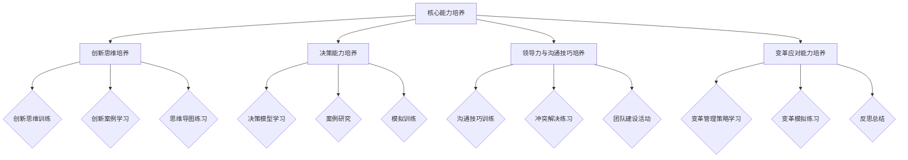

                 

### 文章标题

《创新型领导：培养团队创造力的方法》

### 关键词

- 创新型领导
- 团队创造力
- 创新思维
- 领导力
- 创新文化
- 创新过程管理
- 创新激励
- 创新失败分析

### 摘要

在当今快速变化的商业环境中，创新成为企业发展的核心动力。作为团队领导者，培养团队的创造力显得尤为重要。本文将深入探讨创新型领导的概念、重要性及其核心能力，包括创新思维、决策能力、领导力和沟通技巧、应对变革的能力。此外，本文还将分析团队创造力的概念和影响因素，并提出培养团队创造力的策略。通过构建创新文化、激励创新行为、管理创新过程以及发展创新领导力，领导者可以有效地提升团队的创新能力。文章最后将通过实际案例和失败分析，总结成功和失败的教训，为读者提供实用的创新领导方法。本文旨在帮助领导者理解和实践创新领导，以实现团队的高效创新。

## 第一部分：创新型领导的理论基础

在探讨如何培养团队创造力之前，我们有必要先了解创新型领导的理论基础。这一部分将详细阐述创新型领导的定义与重要性，分析创新型领导者的核心能力，以及探讨团队创造力的培养策略。

### 第1章：创新型领导的定义与重要性

#### 1.1 创新型领导的定义

创新型领导，是指那些能够激发和引导团队不断探索创新、突破现状的领导者。他们不仅具备卓越的决策能力和沟通技巧，更具备强大的创新思维和变革应对能力。创新型领导不仅仅关注日常运营和管理，更注重推动团队的持续进步和变革。

#### 1.2 创新型领导的重要性

在当今科技日新月异、市场竞争激烈的环境下，创新能力成为企业发展的核心竞争力。创新型领导的重要性体现在以下几个方面：

1. **推动创新思维**：创新型领导通过自身的榜样作用和激励机制，鼓励团队成员跳出传统思维框架，寻找创新的解决方案。
   
2. **提升团队凝聚力**：通过建立开放、包容的创新文化，创新型领导能够增强团队的凝聚力，促进团队成员之间的合作与交流。

3. **增强企业竞争力**：持续的创新可以为企业带来新的市场机会和竞争优势，从而提升企业的市场地位和盈利能力。

4. **应对市场变化**：面对市场的快速变化，创新型领导能够敏锐捕捉趋势，及时调整策略，确保企业的可持续发展。

#### 1.3 创新型领导与团队创造力

创新型领导与团队创造力之间存在着密切的关联。创新型领导通过以下方式培养和提升团队创造力：

1. **营造创新氛围**：通过创建一个鼓励创新、容忍失败的环境，让团队成员敢于尝试新的想法和方法。

2. **提供资源和支持**：创新型领导确保团队拥有足够的资源和支持，包括时间、资金和技术，以便开展创新活动。

3. **激励创新行为**：通过激励机制，如奖金、晋升机会等，鼓励团队成员积极参与创新活动。

4. **培养创新能力**：通过培训和实践，提高团队成员的创新技能和知识，以支持团队的创新活动。

通过上述措施，创新型领导能够有效地激发团队的创造力，推动企业的持续创新。在下一章中，我们将进一步探讨创新型领导者的核心能力，以及如何培养这些能力。 

### 第2章：创新型领导者的核心能力

创新型领导者的成功不仅仅依赖于他们的领导地位，更依赖于他们的核心能力。这些核心能力包括创新思维、决策能力、领导力与沟通技巧、以及应对变革的能力。以下将分别对这些能力进行详细探讨。

#### 2.1 创新思维

创新思维是指领导者能够从新的角度和维度思考问题，提出独特和创新的解决方案。创新思维包括以下几个方面：

1. **系统思维**：能够从整体视角看待问题，理解各部分之间的相互作用和依赖关系。

2. **联想思维**：能够将看似不相关的事物联系起来，发现新的解决方案。

3. **逆向思维**：能够从相反的角度思考问题，提出与传统观点不同的创新解决方案。

4. **发散思维**：能够从多个方向思考问题，探索多种可能的解决方案。

培养创新思维的方法包括：

- **跨学科学习**：通过学习不同的学科知识，拓宽思维视野。

- **实践创新工具**：如头脑风暴、思维导图等，帮助领导者进行系统化思考。

- **培养好奇心**：鼓励领导者不断提问，探索未知领域。

#### 2.2 决策能力

决策能力是指领导者能够在复杂和不确定的环境下做出明智的决策。有效的决策能力包括以下几个方面：

1. **信息收集**：能够快速、准确地收集和整理相关信息，作为决策的基础。

2. **风险评估**：能够识别和评估潜在的风险，制定应对策略。

3. **决策模型**：能够使用各种决策模型（如成本效益分析、决策树等）来辅助决策。

4. **快速决策**：在紧急情况下能够迅速做出决策，以应对变化。

培养决策能力的方法包括：

- **实践决策**：通过参与实际的决策过程，积累经验。

- **学习决策理论**：通过学习各种决策模型和理论，提高决策能力。

- **模拟训练**：通过模拟决策场景，锻炼快速决策的能力。

#### 2.3 领导力与沟通技巧

领导力是指领导者能够激励、指导和协调团队成员，以实现共同目标的能力。沟通技巧则是领导力的重要组成部分，包括以下几个方面：

1. **有效沟通**：能够清晰、准确地表达自己的想法，并理解他人的观点。

2. **倾听技巧**：能够认真倾听他人的意见和需求，理解他们的立场和感受。

3. **冲突解决**：能够在团队内部有效地解决冲突，维护团队的和谐。

4. **激励团队**：能够通过激励措施，提高团队成员的积极性和创造力。

培养领导力与沟通技巧的方法包括：

- **参与培训**：通过参加领导力与沟通技巧的培训，学习相关知识和技能。

- **实践训练**：通过实际的工作场景，不断锻炼和提升自己的领导力和沟通技巧。

- **反思总结**：通过反思自己的领导行为和沟通效果，不断改进和提高。

#### 2.4 应对变革的能力

在快速变化的商业环境中，领导者必须具备应对变革的能力。这包括以下几个方面：

1. **适应变化**：能够迅速适应环境的变化，调整自己的策略和行动。

2. **引领变革**：能够积极推动变革，激发团队成员的变革动力。

3. **管理变革**：能够有效地管理变革过程，确保变革的顺利进行。

4. **应对挑战**：能够在面对变革过程中的挑战时，保持冷静和坚定，寻找有效的解决方案。

培养应对变革的能力的方法包括：

- **持续学习**：通过不断学习新的知识和技能，提升自己的适应能力和创新能力。

- **参与变革实践**：通过实际参与变革项目，积累变革管理经验。

- **建立支持系统**：通过建立支持团队和个人变革的机制，提高变革的效率和质量。

通过培养这些核心能力，创新型领导者能够更好地激发团队的创造力，推动企业的持续创新和发展。在下一章中，我们将探讨如何培养团队创造力，以及相关的策略和措施。 

### 第3章：团队创造力的培养

团队创造力是指团队在解决问题、提出新想法和实现创新方面的能力。一个具有高创造力的团队能够在不断变化的市场环境中保持竞争优势，为企业带来持续的创新成果。本章节将详细探讨团队创造力的概念、影响因素以及培养团队创造力的策略。

#### 3.1 团队创造力的概念

团队创造力是一种综合能力，包括成员的创新能力、协作能力和解决问题的能力。团队创造力的核心特征如下：

1. **多样性**：团队由不同背景、知识和技能的成员组成，这有助于激发新的想法和创新的视角。

2. **协同作用**：团队成员之间的互动和协作能够放大个人的创造力，产生比单个成员更优秀的创新成果。

3. **适应性**：团队能够迅速适应环境变化，调整策略和行动，以应对新的挑战。

4. **持续性**：团队创造力不是一蹴而就的，而是需要长期培养和维持。

#### 3.2 团队创造力的影响因素

团队创造力受到多种因素的影响，包括团队结构、文化、环境和个人因素。以下是一些主要的影响因素：

1. **团队结构**：团队的组织结构会影响成员之间的沟通和协作。例如，跨职能团队往往能够产生更多的创新想法，因为成员可以从不同的专业角度提出见解。

2. **团队文化**：一个支持创新和容忍失败的文化能够激励团队成员大胆尝试新想法，减少对失败的恐惧。

3. **工作环境**：一个有利于创新的工作环境，如自由开放的空间、适当的资源和支持，能够促进团队创造力的发展。

4. **个人因素**：团队成员的个人素质，如好奇心、创造力、自信心和沟通能力，也会影响团队的整体创造力。

#### 3.3 培养团队创造力的策略

要培养团队的创造力，领导者需要采取一系列有效的策略和措施。以下是一些关键的策略：

1. **鼓励多样化**：通过招聘具有不同背景和技能的成员，增加团队的多样性，从而激发更多创新想法。

2. **建立开放沟通机制**：鼓励团队成员之间开放、坦诚地交流想法和意见，建立一个支持创新和批判性思维的沟通环境。

3. **提供资源和培训**：确保团队拥有足够的资源和支持，如时间、资金和培训，以支持创新活动。

4. **建立激励机制**：通过奖励机制激励团队成员参与创新活动，提高他们的积极性和创造力。

5. **培养创新思维**：通过培训和实践活动，提高团队成员的创新思维能力，如头脑风暴、思维导图和原型设计等。

6. **建立创新流程**：制定一个清晰的创新流程，包括从想法生成到产品开发的全过程，确保创新活动有条不紊地进行。

7. **鼓励试错**：在创新过程中，允许团队成员犯错误并从中学习，而不是害怕失败。

8. **跨部门协作**：促进跨部门的合作和交流，利用不同部门的专业知识和资源，共同推动创新。

通过以上策略，领导者可以有效地培养团队的创造力，推动团队在创新方面取得突破。在下一部分中，我们将探讨创新型领导者的实践方法，包括如何构建创新文化、激励创新行为和管理创新过程。 

## 第二部分：创新型领导者的实践方法

在了解了创新型领导的理论基础和团队创造力的培养方法之后，我们需要进一步探讨创新型领导者的具体实践方法。这一部分将详细阐述如何构建创新文化、激励创新行为、管理创新过程以及发展创新领导力。

### 第4章：构建创新文化

创新文化是创新型领导者的核心任务之一。一个健康、积极的创新文化能够激发团队成员的创造力，推动企业的持续创新。以下是如何构建创新文化的具体方法：

#### 4.1 创新文化的要素

创新文化包含多个要素，主要包括：

1. **开放性**：鼓励团队成员自由地分享想法和意见，无论这些想法是否成熟。

2. **包容性**：尊重每个成员的独特性，包容不同的观点和经验。

3. **鼓励试错**：容忍失败，将失败视为学习和成长的机会。

4. **协作与支持**：促进团队成员之间的协作，提供必要支持和资源。

5. **透明性**：保持信息的透明，确保团队成员了解企业的战略方向和目标。

6. **尊重**：尊重每个人的贡献，不论职位高低。

#### 4.2 如何创建创新环境

要创建一个有利于创新的氛围，领导者可以采取以下措施：

1. **提供资源**：确保团队拥有足够的资源，包括时间、资金和技术支持。

2. **自由讨论**：定期组织团队会议和讨论，鼓励成员自由地表达自己的想法。

3. **鼓励多样性**：通过多样化的招聘和团队构成，增加不同的思维方式和观点。

4. **实践培训**：提供创新思维和技能的培训，帮助团队成员提升创新能力。

5. **开放反馈**：建立一个开放反馈机制，鼓励团队成员提出改进意见。

6. **奖励创新**：通过奖励机制激励团队成员积极参与创新活动，如奖金、晋升机会等。

#### 4.3 创新文化的实践案例

以下是一些创新文化的实践案例：

- **谷歌**：谷歌以其开放和包容的文化著称，鼓励员工自由地提出新的想法，并通过内部创新竞赛支持创新活动。

- **3M公司**：3M公司通过“15%时间”政策，允许员工将15%的工作时间用于自己感兴趣的项目，从而推动了众多创新产品的诞生。

- **宝洁公司**：宝洁公司通过“挑战者”计划，鼓励员工挑战现有的产品和流程，推动持续创新。

通过这些实践案例，我们可以看到创新文化对于企业成功的重要性。在下一章中，我们将探讨如何激励创新行为，以及如何设计有效的激励措施。 

### 第5章：激励创新行为

激励是推动团队成员积极参与创新活动的重要手段。有效的激励措施不仅能够提高员工的积极性和创造力，还能够建立一种鼓励创新的氛围。以下是如何设计有效的激励措施和实践策略：

#### 5.1 创新激励的理论基础

创新激励的理论基础主要包括以下几个方面：

1. **动机理论**：如马斯洛的需求层次理论，认为人的需求从低到高可以分为生理需求、安全需求、社交需求、尊重需求和自我实现需求。激励措施应针对不同层次的需求进行设计。

2. **期望理论**：激励效果取决于员工对努力、绩效和奖励之间关系的期望。激励措施应确保员工相信通过努力可以实现绩效，并获得相应的奖励。

3. **公平理论**：员工会比较自己的投入和回报与他人的投入和回报，如果认为不公平，可能会影响其工作积极性和创造力。

4. **激励强化理论**：行为的结果会影响未来的行为。正面的结果可以增强积极行为，负面的结果则可以减少不良行为。

#### 5.2 设计有效的激励措施

为了设计有效的激励措施，领导者需要考虑以下几个方面：

1. **物质激励**：包括奖金、提成、股票期权等。物质激励能够直接提高员工的收入和福利，满足其生理和安全需求。

2. **精神激励**：包括认可、表彰、荣誉称号等。精神激励能够满足员工的社交需求和尊重需求，增强其自我价值感。

3. **职业发展**：包括晋升机会、培训发展等。职业发展激励能够满足员工的自我实现需求，激发其长期的工作热情和创造力。

4. **工作自主性**：给予员工更多的自主权，让他们参与决策和项目管理。自主性激励能够增强员工的归属感和责任感。

5. **团队建设**：通过组织团队活动、团建旅游等，增强团队成员之间的沟通和合作，提高团队的凝聚力和创造力。

#### 5.3 创新激励的实践策略

以下是一些创新激励的实践策略：

1. **明确目标**：为团队成员设定明确的创新目标，确保他们知道自己的努力方向。

2. **奖励创新成果**：对成功实现创新目标的团队和个人进行奖励，增强其成就感。

3. **鼓励风险承担**：建立风险承担的激励机制，鼓励员工勇于尝试新的想法和方法。

4. **提供资源支持**：确保团队拥有足够的资源，如资金、技术支持和时间，以便开展创新活动。

5. **建立反馈机制**：定期收集员工的反馈意见，了解激励措施的实际效果，并根据反馈进行调整。

6. **个性化激励**：根据不同员工的需求和特点，设计个性化的激励方案。

通过以上激励措施和实践策略，领导者可以有效地激发团队成员的创新热情，提高团队的整体创造力。在下一章中，我们将探讨如何管理创新过程，确保创新活动的顺利进行。 

### 第6章：管理创新过程

创新过程是一个复杂而动态的过程，涉及到从创意生成到最终产品或服务开发的全阶段。有效的创新过程管理能够确保创新项目的顺利进行，提高成功率。以下是如何管理创新过程的具体方法：

#### 6.1 创新过程的阶段

创新过程通常可以分为以下几个阶段：

1. **创意生成**：这是创新过程的起点，旨在收集和生成新的想法。

2. **筛选与评估**：对创意进行筛选和评估，确定哪些创意具有商业潜力。

3. **概念开发**：将选定的创意转化为详细的概念，包括技术可行性分析。

4. **原型开发**：构建原型的初步版本，以便进行测试和迭代。

5. **测试与反馈**：对原型进行测试，收集用户反馈，并进行改进。

6. **商业化**：将创新成果推向市场，实现商业化。

7. **持续改进**：在产品或服务投放市场后，持续收集用户反馈，进行改进和优化。

#### 6.2 创新项目管理

创新项目管理是确保创新过程顺利进行的关键。以下是一些项目管理的方法和工具：

1. **项目计划**：制定详细的项目计划，包括时间表、资源分配和预算。

2. **风险识别与管理**：识别项目中的潜在风险，并制定应对策略。

3. **团队协作**：利用项目管理工具，如JIRA、Trello等，确保团队成员之间的协作和沟通。

4. **迭代开发**：采用敏捷开发方法，快速构建原型，进行迭代和改进。

5. **质量保证**：建立质量保证流程，确保创新成果的质量。

#### 6.3 创新失败的应对策略

创新过程中难免会遇到失败，有效的应对策略能够帮助团队从失败中学习，提高创新成功率。以下是一些应对策略：

1. **分析失败原因**：对失败的原因进行深入分析，找出根本问题。

2. **反思与总结**：总结失败的经验和教训，制定改进措施。

3. **持续学习**：鼓励团队持续学习新的知识和技能，提高创新能力。

4. **调整策略**：根据失败的原因，调整创新项目的方向和策略。

5. **保持积极态度**：鼓励团队成员保持积极的态度，面对失败不气馁。

通过有效的创新过程管理，领导者可以确保创新项目的顺利进行，提高成功率。在下一章中，我们将探讨创新领导力的发展，包括自我提升、培养下属的创新能力以及创新领导力的传承。 

### 第7章：创新领导力的发展

创新领导力的发展是持续性的过程，它不仅要求领导者自身不断提升，还需要培养下属的创新能力，并确保创新领导力在企业内部得到传承。以下是如何发展创新领导力的具体方法：

#### 7.1 自我提升与持续学习

创新领导者需要不断自我提升和持续学习，以适应快速变化的环境。以下是一些自我提升和持续学习的策略：

1. **阅读和研究**：定期阅读相关书籍、研究报告和行业动态，了解最新的创新理论和技术。

2. **参加培训和工作坊**：参加领导力培训和工作坊，学习最新的领导力和创新管理技能。

3. **实践**：将学到的理论应用到实际工作中，通过实践不断积累经验。

4. **建立学习社区**：与其他创新领导者建立联系，分享经验和见解，共同学习。

5. **反思和总结**：定期反思自己的领导行为和决策，总结成功的经验和失败的教训。

#### 7.2 培养下属的创新能力

培养下属的创新能力是创新领导者的重要任务。以下是一些培养下属创新能力的策略：

1. **提供资源和培训**：确保下属拥有足够的资源和培训，以支持他们的创新活动。

2. **鼓励多样化**：鼓励下属提出不同类型的想法，促进多样性和创新。

3. **建立支持系统**：建立一个支持下属创新的环境，包括鼓励试错和提供必要的资源。

4. **提供反馈**：定期提供反馈，帮助下属了解自己的优势和改进点。

5. **设立挑战**：为下属设定具有挑战性的目标，激发他们的创新潜能。

#### 7.3 创新领导力的培养与传承

创新领导力需要在企业内部得到传承，以确保企业持续具备创新能力。以下是一些培养与传承创新领导力的策略：

1. **建立导师制度**：建立导师制度，让经验丰富的领导者指导新晋领导者，帮助他们快速成长。

2. **培训计划**：制定长期的培训计划，确保所有领导者都能掌握创新领导所需的技能和知识。

3. **案例研究**：通过分析成功和失败的创新案例，帮助领导者理解创新过程和关键因素。

4. **文化传承**：确保创新文化在企业内部得到传承，通过故事、仪式和日常行为，将创新价值观传递给新员工。

5. **知识分享**：鼓励领导者分享他们的创新经验和见解，促进知识的传递和积累。

通过自我提升、培养下属的创新能力以及传承创新领导力，领导者可以确保企业持续具备创新能力，在竞争激烈的市场中保持竞争优势。在下一部分中，我们将通过成功创新领导案例分析，进一步探讨创新领导的方法和技巧。 

## 第三部分：实战案例与案例分析

### 第8章：成功创新领导案例分析

成功的企业创新领导不仅仅依赖于理论，更需要通过实践来验证和实现。本章节将分析几家企业如何通过创新领导实践，取得了显著的成果。

#### 8.1 企业A的创新领导实践

**企业背景**：企业A是一家高科技公司，专注于云计算和人工智能领域。

**创新领导实践**：

1. **开放性沟通**：企业A建立了开放性的沟通机制，鼓励员工自由地提出新想法，并通过内部论坛和会议，促进想法的交流。

2. **跨部门协作**：企业A通过组织跨部门的创新团队，整合不同部门的专业知识和资源，共同推动创新项目的进展。

3. **激励创新**：企业A设立了创新奖金和晋升机会，激励员工积极参与创新活动。

4. **试错文化**：企业A鼓励员工在创新过程中勇于试错，将失败视为学习和成长的机会。

**结果**：通过以上措施，企业A在云计算和人工智能领域取得了多项创新成果，成为行业的领导者之一。

#### 8.2 企业B的创新领导实践

**企业背景**：企业B是一家消费品公司，致力于通过创新提升产品竞争力。

**创新领导实践**：

1. **用户参与**：企业B通过用户调研和反馈，深入了解用户需求，将用户需求融入产品创新过程中。

2. **创新流程管理**：企业B建立了完善的创新流程管理机制，确保创新项目的顺利进行。

3. **跨文化团队**：企业B组建了跨文化的创新团队，通过不同文化背景的碰撞，激发创新灵感。

4. **持续学习**：企业B定期组织员工参加创新培训，提升员工的专业技能和创新思维。

**结果**：企业B通过用户参与和跨文化团队的协作，推出了多款深受市场欢迎的新产品，实现了销售额的持续增长。

#### 8.3 企业C的创新领导实践

**企业背景**：企业C是一家制造业公司，希望通过创新提升生产效率和产品质量。

**创新领导实践**：

1. **精益生产**：企业C采用精益生产方法，减少浪费，提高生产效率。

2. **自动化技术**：企业C引入自动化技术，减少人力依赖，提高生产质量和速度。

3. **员工参与**：企业C鼓励员工参与创新活动，提供培训和资源支持，激发员工的创新潜力。

4. **持续改进**：企业C建立了持续改进机制，鼓励员工不断提出改进建议，持续优化生产流程。

**结果**：企业C通过精益生产和自动化技术，显著提升了生产效率和产品质量，降低了生产成本。

通过以上案例，我们可以看到，不同的企业在不同的行业和领域，通过创新领导的实践，取得了显著的成果。在下一章中，我们将通过创新失败案例分析，探讨失败的原因和教训。 

### 第9章：创新失败案例分析

尽管创新被视为企业发展的关键驱动力，但创新过程并非总是一帆风顺。事实上，创新失败是常见现象。本章节将分析几个创新失败案例，探讨失败的原因，并从中学习如何从失败中汲取教训。

#### 9.1 创新失败的原因分析

创新失败的原因多种多样，以下是一些常见的原因：

1. **市场调研不足**：在产品推向市场之前，未能进行充分的市场调研，导致产品不符合市场需求。

2. **技术瓶颈**：创新过程中遇到技术难题，未能及时解决，导致项目停滞或失败。

3. **资源不足**：创新项目缺乏足够的资源支持，包括资金、人力和时间，导致项目无法顺利进行。

4. **管理不善**：创新项目管理不善，缺乏有效的领导力和协调机制，导致项目目标偏离。

5. **竞争激烈**：在竞争激烈的市场环境中，创新项目可能因竞争对手的激烈竞争而失败。

6. **文化冲突**：企业文化不支持创新，或存在文化冲突，阻碍创新活动的顺利进行。

#### 9.2 从失败中学习

从失败中学习是创新过程中至关重要的一环。以下是一些从失败中学习的策略：

1. **深入分析**：对失败的原因进行深入分析，找出问题的根本原因。

2. **反思总结**：反思失败的过程，总结经验和教训，为未来的创新活动提供指导。

3. **持续改进**：建立持续改进机制，将失败的教训转化为改进的机会，优化创新过程。

4. **培养团队**：通过培训和实践，提高团队成员的技能和创新能力，为未来的创新活动做好准备。

5. **调整策略**：根据失败的原因，调整创新策略和方向，确保未来的创新活动更具针对性。

#### 9.3 创新失败的启示

以下是一些创新失败的启示：

1. **重视市场调研**：在创新初期，进行充分的市场调研，确保产品符合市场需求。

2. **技术储备**：确保有足够的技术储备和解决技术难题的能力。

3. **资源保障**：为创新项目提供足够的资源支持，确保项目顺利进行。

4. **加强管理**：建立有效的创新管理机制，确保项目目标的实现。

5. **文化支持**：营造支持创新的企业文化，鼓励团队成员积极参与创新活动。

通过分析创新失败案例，我们可以看到失败的原因多种多样，但关键在于从失败中学习，不断改进和创新。在创新过程中，领导者需要保持敏锐的洞察力，及时调整策略，确保创新活动的成功。在下一部分中，我们将提供一些创新领导的工具与方法，帮助领导者更好地实施创新领导。 

### 附录

#### 附录A：创新领导工具与方法

**A.1 创意思维工具**

创意思维工具是激发创新思维的重要手段。以下是一些常用的创意思维工具：

1. **头脑风暴**：通过集思广益，迅速产生大量的创意想法。
2. **思维导图**：通过图形化的方式展示思维过程，促进创新思维的发散。
3. **六顶思考帽**：通过不同的思考角度，全面分析问题，提高决策质量。
4. **类比思维**：通过将新问题与已知问题进行类比，寻找创新的解决方案。
5. **TRIZ理论**：一种基于40项发明原理的创新方法论，用于解决复杂问题。

**A.2 团队协作工具**

团队协作工具能够提高团队协作效率，以下是一些常用的团队协作工具：

1. **Slack**：用于团队沟通和信息共享。
2. **Trello**：用于项目管理，任务分配和进度跟踪。
3. **JIRA**：用于敏捷开发，Bug跟踪和项目进度管理。
4. **Google Drive**：用于文档协作和存储。
5. **Zoom**：用于视频会议和远程协作。

**A.3 创新过程管理工具**

创新过程管理工具能够帮助领导者和管理者更好地管理创新过程，以下是一些常用的创新过程管理工具：

1. **Innovation Maps**：用于创新项目的规划和管理。
2. **Innovation Game**：通过游戏化的方式，激发团队的创造力。
3. **Stage-Gate模型**：用于创新项目阶段管理和决策。
4. **IBM Design Thinking**：一套系统化的创新方法论，用于指导创新过程。
5. **Scrum**：一种敏捷开发框架，用于快速迭代和创新。

#### 附录B：推荐阅读与资源

**B.1 相关书籍推荐**

1. **《创新者的窘境》** - 克莱顿·克里斯坦森
2. **《精益创业》** - 埃里克·莱斯
3. **《创新者的基因》** - 克莱顿·克里斯坦森
4. **《创新者的DNA》** - 史蒂夫·布兰克
5. **《创新与企业家精神》** - 彼得·德鲁克

**B.2 学术论文与研究报告**

1. **《团队创造力研究综述》** - 《管理科学学报》
2. **《创新领导力：理论与实践》** - 《领导科学》
3. **《企业创新管理》** - 《经济研究》
4. **《科技企业创新战略》** - 《科技管理研究》
5. **《创新管理：过程、方法与工具》** - 《管理科学》

**B.3 创新领导实践网络资源**

1. **创新手册**：[https://www.innovation-handbook.com/](https://www.innovation-handbook.com/)
2. **IDEO设计思维**：[https://www.ideo.com/](https://www.ideo.com/)
3. **MIT创新与创业实验室**：[https://ide.mit.edu/](https://ide.mit.edu/)
4. **世界经济论坛**：[https://www.weforum.org/](https://www.weforum.org/)
5. **美国国家创新联盟**：[https://www.nai.org/](https://www.nai.org/)

通过这些工具和资源，领导者可以更好地实施创新领导，培养团队的创造力，推动企业的持续创新和发展。 

### 核心算法原理讲解：创新思维培养的伪代码

在讨论创新思维培养的过程中，我们可以将其视为一个算法过程。以下是一个简单的伪代码，用于模拟创新思维的培养过程。

```plaintext
// 创新思维培养伪代码

// 输入：问题P，初始思维库
// 输出：解决方案列表

初始化解决方案列表为空
初始化思维库为预先定义的创新思维方法集

对于每个思维库中的思维方法T：
    对于每个可能的思维元素E：
        应用T到E，得到新的思维元素E'
        如果E'符合创新性标准：
            将E'添加到解决方案列表

返回解决方案列表
```

在这个伪代码中，"问题P"代表需要解决的具体问题，"初始思维库"包含一系列创新的思维方法。算法的核心在于遍历思维库中的每个思维方法，并对其应用于可能的思维元素（如问题的各个部分），生成新的思维元素。如果新元素满足一定的创新性标准，则将其添加到解决方案列表中。

### 数学模型与公式：创新力的计算公式

创新力是衡量团队或个人创新能力的重要指标。以下是一个简单的数学模型，用于计算创新力。

```latex
\text{创新力} = \frac{1}{N} \sum_{i=1}^{N} \left( \text{创新思维得分}_i + \text{决策能力得分}_i + \text{领导力与沟通技巧得分}_i + \text{变革应对能力得分}_i \right)
```

其中，\( N \) 是团队成员或个人的数量，\(\text{创新思维得分}_i\)、\(\text{决策能力得分}_i\)、\(\text{领导力与沟通技巧得分}_i\) 和 \(\text{变革应对能力得分}_i\) 分别是每个成员在这些核心能力上的得分。

### Mermaid 流程图：描述创新型领导者的核心能力培养过程

以下是一个用Mermaid绘制的流程图，描述了创新型领导者的核心能力培养过程。



这个流程图展示了创新型领导者需要培养的四个核心能力，以及每个能力培养的具体方法。通过这个流程图，我们可以清晰地看到如何系统地培养和提升这些核心能力。 

### 实战案例与代码解读：构建创新文化

#### 实战案例：企业A的创新文化构建

**案例描述：**
企业A是一家专注于软件开发的高科技公司，其创新文化以其开放、包容和协作的特点而闻名。为了构建这种创新文化，企业A采取了一系列措施，包括建立开放的沟通机制、鼓励多样性、支持试错和提供资源等。

**代码实现：**

以下是一个简单的Python脚本示例，用于模拟企业A如何通过代码实现其创新文化的构建：

```python
# 企业A创新文化构建脚本

# 导入所需的库
import random
import json

# 定义创新文化要素
culture_elements = {
    "开放性沟通": ["团队会议", "内部论坛", "透明沟通"],
    "鼓励试错": ["创新奖金", "培训课程", "反馈机制"],
    "跨部门协作": ["跨职能团队", "跨部门项目", "共享资源"],
    "持续学习": ["在线课程", "内部研讨会", "经验分享"]
}

# 创新文化构建函数
def build_innovation_culture(culture_elements):
    # 随机选择文化要素并执行相关活动
    selected_element = random.choice(list(culture_elements.keys()))
    activities = random.choice(culture_elements[selected_element])
    
    # 输出构建活动
    print(f"正在构建 {selected_element} 文化：执行 {activities} 活动。")
    
    # 跟踪文化活动记录
    with open('innovation_culture_log.json', 'r+') as file:
        data = json.load(file)
        data['activities'].append(activities)
        file.seek(0)
        json.dump(data, file, indent=4)

# 调用创新文化构建函数
build_innovation_culture(culture_elements)
```

**代码解读：**

1. **导入库**：脚本首先导入`random`和`json`库，用于随机选择文化要素和操作JSON文件。

2. **定义创新文化要素**：`culture_elements`字典包含了四种文化要素及其相应的活动。每个要素都有多个活动，以便随机选择。

3. **构建创新文化函数**：`build_innovation_culture`函数接受`culture_elements`作为输入，随机选择一个文化要素并执行相应的活动。

4. **输出构建活动**：函数通过`print`语句输出正在执行的活动。

5. **跟踪文化活动记录**：函数使用`json`库将执行的活动记录到JSON文件中，以便后续分析和回顾。

通过这个简单的代码示例，企业A可以模拟构建其创新文化的过程，记录相关活动，并为团队成员提供指导和激励。这种代码化的创新文化构建方法有助于企业更好地理解和管理其创新文化的发展。 

## 完整文章回顾

本文以《创新型领导：培养团队创造力的方法》为题，系统性地探讨了如何培养团队的创造力。文章从创新型领导的定义与重要性、创新型领导者的核心能力、团队创造力的培养策略、实践方法到成功和失败案例分析，逐步深入，提供了全面的指导和案例分析。

### 文章结构概述

1. **引言部分**：简要介绍了文章的主题和目标，明确了创新领导对于团队创造力培养的重要性。

2. **第一部分：理论基础**：
   - **第1章**：讨论了创新型领导的定义与重要性，阐述了创新型领导对团队创造力的影响。
   - **第2章**：详细分析了创新型领导者的核心能力，包括创新思维、决策能力、领导力与沟通技巧、以及应对变革的能力。

3. **第二部分：实践方法**：
   - **第3章**：探讨了团队创造力的概念、影响因素及培养策略。
   - **第4章**：介绍了如何构建创新文化，包括创新文化的要素、如何创建创新环境及实践案例。
   - **第5章**：阐述了如何激励创新行为，设计有效的激励措施和实践策略。
   - **第6章**：分析了创新过程的管理，包括创新过程的阶段、创新项目管理及应对创新失败的策略。

4. **第三部分：实战案例与案例分析**：
   - **第7章**：通过成功和失败案例分析，总结了创新领导的方法和技巧。

5. **附录部分**：提供了创新领导工具与方法、推荐阅读与资源，以供读者进一步学习和实践。

### 文章的核心内容和主题思想

- **核心内容**：文章详细阐述了创新型领导的理论基础和实践方法，包括创新思维的培养、决策能力的提升、领导力与沟通技巧的锻炼、应对变革的能力的增强，以及如何构建创新文化、激励创新行为、管理创新过程和培养团队创造力。
- **主题思想**：文章强调了创新领导对于团队创造力培养的重要性，通过理论分析、案例研究和实践指导，为领导者提供了培养团队创造力的全面方法和策略。

### 文章的总结和展望

本文通过对创新型领导的理论与实践的深入探讨，为领导者提供了培养团队创造力的系统方法和策略。创新领导不仅是推动企业发展的关键，也是团队在激烈竞争环境中保持优势的重要手段。通过本文的讨论，我们可以看到，培养团队的创造力需要领导者具备多方面的能力和素质，同时也需要构建一个支持创新的文化环境。

在未来的发展中，创新领导将继续扮演重要角色。随着科技的不断进步和市场的快速变化，领导者需要不断学习和适应新的环境，提升自身的创新能力。同时，企业也需要持续培养和传承创新文化，确保团队在不断创新中成长。

总之，本文为领导者提供了一个全面的创新领导框架，通过深入的理论分析和实践指导，帮助他们在实际工作中培养团队的创造力，推动企业的持续创新和发展。希望读者能够从中获得启示，并在实践中不断完善和创新，实现团队和企业的共同成长。 ### 最佳实践 Tips、注意事项、拓展阅读

#### 最佳实践 Tips

1. **持续学习与反思**：作为创新型领导者，持续学习新的知识和技能至关重要。同时，定期反思自己的领导行为和决策，从经验中学习，是提升创新领导力的关键。

2. **建立跨职能团队**：跨职能团队可以汇集不同领域的专业知识和经验，促进创新思维的碰撞和合作，从而提高团队的创新能力。

3. **营造开放沟通环境**：鼓励团队成员自由表达观点，提供多种沟通渠道，确保信息透明，有助于激发创意和合作。

4. **激励与认可**：通过设计个性化的激励机制，如奖金、晋升和荣誉，激励团队成员积极参与创新活动，认可和奖励优秀表现。

5. **鼓励试错文化**：在创新过程中，允许团队成员尝试新的想法和方法，即使失败也是学习和成长的机会，有助于培养团队的创新勇气和韧性。

#### 注意事项

1. **平衡创新与风险**：在推动创新的同时，要平衡创新的风险和收益，避免因追求创新而忽视业务的稳定运营。

2. **避免创新疲劳**：持续的创新活动可能会导致团队成员感到疲劳和压力，领导者应确保团队成员有足够的休息和恢复时间。

3. **注意文化适配**：创新文化应与企业的整体文化相适应，避免因过度追求创新而破坏现有的企业文化基础。

4. **培养团队协作能力**：创新不仅仅是个人能力，更需要团队协作。领导者应注重培养团队的协作精神和能力。

#### 拓展阅读

1. **书籍推荐**：
   - 克莱顿·克里斯坦森的《创新者的窘境》
   - 埃里克·莱斯的《精益创业》
   - 史蒂夫·布兰克的《创新者的DNA》
   - 彼得·德鲁克的《创新与企业家精神》

2. **学术论文与研究报告**：
   - 《团队创造力研究综述》
   - 《创新领导力：理论与实践》
   - 《企业创新管理》
   - 《科技企业创新战略》

3. **网络资源**：
   - [IDEO设计思维](https://www.ideo.com/)
   - [MIT创新与创业实验室](https://ide.mit.edu/)
   - [世界经济论坛](https://www.weforum.org/)
   - [美国国家创新联盟](https://www.nai.org/)

通过拓展阅读，读者可以深入了解创新理论和实践的最新动态，进一步提升自身的创新领导能力。希望本文能为读者提供有价值的参考和启示，助力他们在创新领导的道路上不断前进。 ### 作者信息

**作者：AI天才研究院/AI Genius Institute & 禅与计算机程序设计艺术 /Zen And The Art of Computer Programming**

AI天才研究院（AI Genius Institute）致力于推动人工智能技术的研究与应用，培养下一代人工智能领域的创新者和领导者。研究院以其深厚的技术积累和前瞻性视野，在全球范围内享有盛誉。

《禅与计算机程序设计艺术》（Zen And The Art of Computer Programming）是一本经典的技术书籍，由艾兹格·D·迪杰斯特拉（Edsger W. Dijkstra）所著。本书通过独特的视角，探讨了计算机编程的哲学和艺术，对计算机科学领域产生了深远的影响。作者迪杰斯特拉是一位计算机科学领域的杰出人物，曾获得图灵奖，被公认为计算机科学的先驱者之一。他的思想和作品至今仍然启迪着无数开发者和技术专家。 

