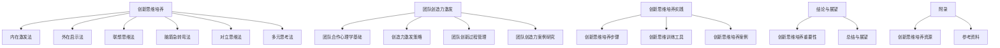

                 

### 引言与背景

#### 1.1 创新思维的重要性

在当今快速发展的科技时代，创新思维被视为推动企业成长、社会进步和国家竞争力提升的关键因素。创新思维不仅仅局限于科研和开发领域，它渗透到各个行业和日常生活的方方面面。因此，培养创新思维，尤其是激发团队创造力，成为企业和组织亟需解决的重要课题。

**创新思维**是一种基于知识和技能，通过灵活、独特的思考方式，创造出新颖、有价值的解决方案或产品的能力。它不仅涉及技术的突破，更包括商业模式的创新、管理方法的革新以及服务的优化等。

**团队创造力**是指团队内部成员在合作过程中，通过思想的碰撞、信息的交流，共同产生新颖想法和解决方案的能力。一个高创造力的团队能够快速适应市场变化，有效应对挑战，从而在竞争中脱颖而出。

在当今复杂多变的环境中，企业需要具备持续创新的能力，才能保持竞争力。创新思维的培养不仅关乎企业内部的成长，也直接影响着社会的进步和人类的生活质量。因此，深入探讨创新思维的方法，并研究如何激发团队创造力，具有重要的现实意义。

#### 1.2 团队创造力与企业成功

团队创造力对企业成功具有至关重要的作用。首先，它能够带来商业价值的提升。通过团队成员的创新，企业能够开发出更符合市场需求的优质产品或服务，提高顾客满意度，进而增强市场竞争力。

其次，团队创造力有助于企业适应快速变化的市场环境。在科技日新月异、市场需求不断变化的今天，只有具备强大创造力的人才和团队，才能及时捕捉市场动态，迅速调整战略，实现持续发展。

此外，团队创造力还能够激发员工的积极性和创造力，提升员工的工作满意度和忠诚度。一个充满活力的团队氛围，有助于员工发挥自身潜力，形成良好的工作习惯和团队合作精神。

总之，团队创造力是企业实现长远发展的关键。通过培养创新思维，激发团队创造力，企业不仅能够实现商业成功，还能为社会的进步做出贡献。

#### 1.3 书籍的目标与结构

本书旨在深入探讨创新思维的培养方法，并研究如何有效激发团队创造力，以帮助企业实现持续创新和商业成功。具体目标如下：

1. **介绍创新思维的基本概念**：通过明确创新思维的定义、分类和特点，帮助读者建立对创新思维的整体认识。

2. **阐述多种创新思维方法**：从内在激发法、外在启示法、联想思维法、脑筋急转弯法、对立思维法到多元思考法，详细介绍各种创新思维方法，并辅以实际案例，帮助读者理解和应用。

3. **研究团队创造力的激发策略**：分析团队合作心理学基础，探讨如何制定明确的创新目标、进行创造性思维训练、营造创新氛围，以及管理团队创新过程。

4. **提供创新思维培养的实践指南**：通过具体的步骤、工具和案例，指导读者如何在实际工作中培养创新思维，提高团队创造力。

5. **总结与展望**：回顾书籍的核心内容，提出创新思维培养的建议，展望未来研究的方向。

本书的结构分为五个部分，依次是引言与背景、创新思维方法、团队创造力激发、创新思维培养实践和结论与展望。每个部分都围绕创新思维和团队创造力展开，旨在为读者提供全面、系统的指导。

### 创新思维的基本概念

#### 1.2.1 创新的定义与分类

**创新**是一个广泛而深刻的概念，它在不同领域有不同的定义和解释。从广义上讲，创新是指通过创造新的想法、方法或产品，来满足市场需求或解决现有问题的过程。创新可以分为多种类型，根据创新的主体、目标和范围，大致可以分为以下几类：

1. **技术性创新**：指通过新的技术研发或改进现有技术，从而产生新产品或服务。技术性创新通常涉及科学研究的突破，如新材料的发现、新型设备的开发等。

2. **商业模式创新**：指通过改变企业的商业运作模式，来实现新的盈利方式或市场拓展。例如，电子商务的兴起改变了传统零售业的商业模式，创造了新的市场机会。

3. **管理创新**：指在企业管理过程中引入新的管理理念、方法和工具，以提高效率、降低成本或提升员工满意度。管理创新包括流程优化、组织重构、绩效管理等。

4. **服务创新**：指通过改进服务质量、服务流程或服务体验，来满足客户需求或提高客户满意度。服务创新可以是服务内容的创新，如在线教育、远程医疗，也可以是服务方式的创新，如智能化服务、个性化服务。

5. **社会创新**：指通过创新的社会组织形式或社会机制，来解决社会问题或提高社会福祉。社会创新涉及公益组织、社会企业等领域，旨在通过创新的方式推动社会进步。

#### 1.2.2 创新思维的特点

**创新思维**是指通过灵活、独特的思考方式，来产生新颖、有价值的想法和解决方案的能力。与传统的线性思维不同，创新思维具有以下几个显著特点：

1. **灵活性**：创新思维能够迅速适应新的情况和问题，不拘泥于传统的思维模式，善于从不同角度和维度思考问题。

2. **独特性**：创新思维能够跳出常规的思维框架，产生与众不同的想法和解决方案，具有强烈的个性化和创新性。

3. **多样性**：创新思维强调多样性和广泛性，鼓励从多个角度、多个维度来思考问题，以发现更多的解决方案。

4. **开放性**：创新思维具有开放性，能够接受不同的意见和观点，通过交流和碰撞，激发更多的创意和灵感。

5. **综合能力**：创新思维不仅涉及逻辑思维、批判性思维，还需要具备创造性思维、系统性思维等综合能力。

#### 1.2.3 创新思维与创造力

**创新思维**和**创造力**是密切相关的概念。**创新思维**是创造力的核心，它决定了个体或团队能够产生多少新颖的想法和解决方案。而**创造力**则是创新思维的结果，是创新思维在实际问题解决中的具体体现。

创新思维与创造力之间的关系可以理解为：

1. **创新思维是创造力的源泉**：只有具备创新思维，个体或团队才能源源不断地产生新颖的想法和解决方案。

2. **创造力是创新思维的验证**：创新思维产生的想法和解决方案需要通过实践来验证其有效性，创造力在这个过程中发挥了关键作用。

3. **创新思维和创造力相互促进**：创新思维的培养能够提升创造力，而创造力的提升又能进一步激发创新思维，形成良性循环。

综上所述，创新思维是培养团队创造力的关键。通过理解创新思维的基本概念，掌握创新思维的特点，我们能够更好地激发团队创造力，推动企业和组织实现持续创新和商业成功。

### 第二部分：创新思维方法

在培养创新思维的过程中，掌握多种创新思维方法是至关重要的。这些方法不仅能够帮助我们跳出传统思维框架，产生新颖的想法，还能在团队协作中激发成员的创造力和潜力。本部分将详细介绍五种创新思维方法：内在激发法、外在启示法、联想思维法、脑筋急转弯法和对立思维法。通过这些方法的详细解析和实践案例，读者可以更好地理解和应用这些方法，提升自身的创新能力。

#### 2.1 内在激发法

**内在激发法**是一种通过激发个体内在动机和自我认知，来培养创新思维的方法。这种方法强调自我驱动和内在动力，认为只有当个体真正愿意去思考、去探索时，才能产生创新的想法。

##### 2.1.1 自我认知与内在动机

内在激发法首先需要个体进行自我认知，了解自己的兴趣、优势和价值观。通过自我认知，个体能够明确自己的目标和方向，从而激发内在动机。例如，一个对环保有强烈兴趣的人，可能会在解决环保问题时产生更多的创新想法。

**情感驱动**是内在激发法的重要组成部分。情感是人类行为的强大动力，能够激发个体的热情和动力。例如，面对一个社会问题，一个富有同情心的人可能会产生强烈的解决欲望，从而促使他们去寻找创新的解决方案。

##### 2.1.2 情感驱动与创新思维

情感驱动不仅能够激发个体的创新欲望，还能够促进创新思维的产生。当个体对某个问题充满情感时，他们更容易产生独特的视角和创新的解决方案。例如，一位热爱编程的人，在面对一个复杂的编程问题时，可能会因为对编程的热爱而产生创新的解决方案。

**内在激发法的实践案例**

一个典型的实践案例是**苹果公司的设计哲学**。苹果公司的创始人史蒂夫·乔布斯（Steve Jobs）通过深入挖掘用户情感需求，设计出了众多创新的产品。例如，iPhone的设计不仅满足了用户对功能的需求，还通过出色的用户体验设计激发了用户的情感共鸣，从而创造出巨大的商业成功。

另一个实践案例是**特斯拉（Tesla）公司的电动车技术**。特斯拉的创始人埃隆·马斯克（Elon Musk）通过对自己环保理念的坚定信念，推动了电动汽车技术的发展。特斯拉的电动车不仅技术先进，还通过出色的性能和设计，激发了用户对环保的热情，成为全球电动车市场的领导者。

#### 2.2 外在启示法

**外在启示法**是一种通过借鉴外部环境和信息，来激发创新思维的方法。这种方法强调通过观察、学习和模仿外部事物，来获取灵感和创新的点子。

##### 2.2.1 环境与创意的关系

外在启示法认为，外部环境是创新的重要源泉。一个多样化的环境，能够提供丰富的信息和资源，从而激发创意的产生。例如，一个艺术家在参观博物馆时，可能会受到古代艺术品的影响，产生新的创作灵感。

**启示思维与灵感来源**

启示思维是指通过观察和分析外部事物，获取灵感和创新点子的过程。灵感的来源可以是多种多样的，包括自然界的现象、社会现象、艺术作品、科技产品等。例如，一位设计师在观察鸟类的飞翔方式后，可能会受到启发，设计出更高效的飞行器。

**外在启示法的实践案例**

一个典型的实践案例是**索尼公司（Sony）的Walkman**。索尼的创始人盛田昭夫（Akio Morita）在旅行中注意到乘客们喜欢在飞机上听音乐，但现有耳机设计不便，于是他灵机一动，设计出了便携式的Walkman。这一创新产品不仅改变了人们的听音乐方式，还开创了一个全新的市场。

另一个实践案例是**Google的Doodle**。Google每年会在其搜索页面上发布特别的Doodle，以庆祝重要的历史事件或文化节日。这些Doodle不仅丰富了用户的使用体验，还通过展示不同的文化和历史知识，激发了用户的创意灵感。

#### 2.3 联想思维法

**联想思维法**是一种通过建立事物之间的联系，来激发创新思维的方法。这种方法强调通过联想和类比，发现新的视角和解决方案。

##### 2.3.1 联想思维的基本原理

联想思维的基本原理是，通过将看似不相关的事物联系起来，产生新的想法和解决方案。例如，一个工程师在解决一个技术问题时，可能会联想到其他领域的技术解决方案，从而找到创新的解决方法。

**联想思维的方法与应用**

联想思维的方法主要包括：

1. **类比联想**：通过将一个问题类比到另一个相似的问题，从而找到解决方案。例如，在解决飞行器设计问题时，可以类比到鸟类飞行的方式，从而得到创新的解决方案。

2. **因果联想**：通过分析问题的原因和结果，建立事物之间的联系，从而产生新的想法。例如，在分析交通事故时，可以联想到交通规则和驾驶习惯，从而提出改进措施。

3. **时空联想**：通过将问题放在不同的时间和空间背景下，从而发现新的视角和解决方案。例如，在解决城市交通拥堵问题时，可以联想到一个未来的智能交通系统。

**联想思维的实际案例**

一个典型的实际案例是**瑞士手表制造商劳力士（Rolex）**的创新设计。劳力士的设计师通过观察动物的运动方式，如猎豹奔跑时的姿态，从而设计了更精准、更稳定的机械手表。这一创新设计不仅提升了手表的性能，还增强了其市场竞争力。

另一个实际案例是**计算机科学中的RSA加密算法**。RSA算法的设计灵感来源于数学中的大数分解问题。算法的发明者通过将大数分解问题类比为寻找两个大质数的过程，从而提出了RSA加密算法，这一创新算法在计算机安全领域发挥了重要作用。

#### 2.4 脑筋急转弯法

**脑筋急转弯法**是一种通过设置思维障碍和逻辑谜题，来激发创新思维的方法。这种方法强调通过逆向思考和跳跃性思维，打破常规思维框架，从而产生创新的解决方案。

##### 2.4.1 脑筋急转弯的特点

**脑筋急转弯**具有以下几个显著特点：

1. **思维挑战性**：脑筋急转弯通常设计成具有挑战性的问题，需要通过逆向思考和跳跃性思维来解决。

2. **逻辑严密性**：脑筋急转弯的问题设计严密，答案往往出人意料，需要通过逻辑推理来解答。

3. **趣味性**：脑筋急转弯法通过趣味性的问题设置，激发人们的兴趣和好奇心，从而更容易产生创新思维。

**脑筋急转弯的实践应用**

脑筋急转弯法的实践应用非常广泛，可以从多个方面激发创新思维：

1. **教育培训**：在教育培训过程中，教师可以通过设置脑筋急转弯问题，激发学生的思维活力，培养学生的创新意识。

2. **团队建设**：在团队建设活动中，组织者可以通过设置脑筋急转弯游戏，促进团队成员之间的交流和互动，提高团队的创新能力。

3. **创意工作坊**：在创意工作坊中，参与者可以通过解决脑筋急转弯问题，激发创意灵感，产生创新的解决方案。

**脑筋急转弯的创意产生**

一个典型的创意产生案例是**谷歌的招聘面试题**。谷歌在招聘过程中，常常设置脑筋急转弯问题，如“如何用砖块搭建一个稳定的结构”或“如何将一条绳子分成两段，使其重量相等”。这些问题不仅考察应聘者的逻辑思维和创新能力，还通过趣味性的问题设置，激发应聘者的创意灵感。

另一个案例是**苹果公司（Apple）的创新设计**。苹果公司在设计iPhone时，遇到了屏幕触控技术的问题。通过设置脑筋急转弯问题，如“如何用手指代替鼠标进行操作”，苹果公司最终发明了触控屏技术，这一创新设计彻底改变了手机市场。

#### 2.5 对立思维法

**对立思维法**是一种通过对比和冲突，来激发创新思维的方法。这种方法强调通过对立思想的碰撞，打破思维定式，产生创新的解决方案。

##### 2.5.1 对立思维的定义与作用

对立思维是指通过对比和冲突，分析两个或多个对立观点或理论，从中寻找创新点子。对立思维的作用主要体现在以下几个方面：

1. **激发创新思维**：对立思维能够激发个体或团队的思维活力，通过对比和冲突，产生新的视角和解决方案。

2. **打破思维定式**：对立思维有助于打破传统的思维定式，从不同角度思考问题，从而找到创新的解决方案。

3. **提高决策质量**：对立思维能够帮助个体或团队在决策过程中，全面考虑各种可能性，提高决策的准确性和科学性。

**对立思维的方法与策略**

对立思维的方法主要包括以下几种：

1. **对比分析**：通过对比分析两个或多个对立观点或理论的优缺点，发现潜在的创新点子。

2. **辩证思考**：辩证思考是一种通过分析和综合对立观点，从中提取有价值的信息和思想的方法。

3. **思维碰撞**：通过组织研讨会、头脑风暴等方式，促进团队成员之间的思想碰撞，产生创新的思维火花。

**对立思维的实际案例**

一个典型的实际案例是**苹果公司和微软公司的竞争**。苹果公司和微软公司在电脑操作系统领域长期竞争，双方通过对比分析，不断推出新的操作系统，从而推动电脑技术的发展。这种对立思维不仅激发了双方的创新能力，也推动了整个电脑行业的进步。

另一个案例是**谷歌和百度的搜索技术竞争**。谷歌和百度在搜索引擎技术领域展开激烈竞争，双方通过对比分析，不断优化和改进搜索算法，从而提高搜索效率和用户体验。这种对立思维不仅推动了搜索引擎技术的发展，也提升了用户的使用体验。

通过对多种创新思维方法的详细解析和实践案例的介绍，我们可以看到，创新思维方法的多样性和实用性。无论是内在激发法、外在启示法、联想思维法、脑筋急转弯法还是对立思维法，都有助于激发团队的创造力，推动企业和组织实现持续创新。在实际应用中，可以根据具体问题和需求，灵活选择和组合这些方法，以实现最佳的创新效果。

### 第三部分：团队创造力激发

#### 3.1 团队合作的心理学基础

团队合作是一个复杂而多维的过程，涉及多个层面的互动和沟通。要激发团队创造力，首先需要理解团队合作背后的心理学基础，包括团队成员的角色与互动、团队动力与信任建设以及团队合作的心理原理。

**团队成员的角色与互动**

在团队中，每个成员都扮演着特定的角色，这些角色相互作用，共同推动团队目标的实现。团队成员的角色可以分为以下几类：

1. **领导者**：领导者负责设定团队目标、制定计划、指导团队成员，确保团队按计划推进。领导者需要具备决策能力、沟通能力和领导力。

2. **执行者**：执行者是团队的核心力量，负责具体任务的执行和完成。他们需要具备执行力和专业技能。

3. **协调者**：协调者负责协调团队成员之间的工作，确保任务顺利进行。他们需要具备组织协调能力和沟通技巧。

4. **贡献者**：贡献者是指为团队提供额外资源或意见的成员。他们可能不直接参与任务执行，但通过提供有价值的观点和资源，帮助团队实现目标。

团队成员之间的互动是团队合作的关键。有效的互动需要建立在相互理解、尊重和信任的基础上。团队成员应该通过定期交流和反馈，建立良好的沟通机制，确保信息的透明和流畅。

**团队动力与信任建设**

团队动力是指推动团队前进的内驱力和外驱力的合力。团队动力的来源主要包括：

1. **共同目标**：共同目标是团队动力的核心。团队成员需要明确团队的目标和愿景，共同为之努力。

2. **积极氛围**：积极的工作氛围能够激发团队成员的积极性和创造力。团队领导需要营造一个支持创新、鼓励尝试的氛围。

3. **认可与激励**：团队成员需要感受到自己的价值和成就，从而激发更大的工作动力。团队领导应该通过认可和激励来激发团队成员的积极性。

信任建设是团队动力的关键。信任是团队成员之间相互依赖的基础，它能够降低沟通成本，提高团队协作效率。信任建设可以通过以下几种方式实现：

1. **透明沟通**：团队成员应该保持沟通的透明性，及时分享信息，避免误解和猜疑。

2. **相互尊重**：团队成员应该尊重彼此的意见和观点，建立相互信任的关系。

3. **共同经历**：团队成员通过共同的经历和挑战，可以加深彼此的了解和信任。

**团队合作的心理原理**

团队合作的心理原理主要包括以下几个方面：

1. **社会认同感**：团队成员在团队中感受到归属感和认同感，这有助于提高团队的凝聚力和合作意愿。

2. **社会影响力**：团队成员的行为和决策会受到其他成员的影响，通过社会影响力，可以引导团队朝着共同目标努力。

3. **社会交换理论**：团队成员在合作过程中，通过相互交换资源和信息，实现个人和团队的共同利益。

4. **共同目标导向**：团队成员将个人目标与团队目标结合起来，通过共同努力实现共同目标。

通过理解团队合作的心理基础，团队领导可以更好地激发团队创造力，促进团队目标的实现。有效的团队合作不仅能够提高工作效率，还能够培养团队成员的协作精神和创新能力，为企业和组织的持续发展奠定坚实的基础。

#### 3.2 创造力激发的策略

激发团队创造力需要系统性和持续性的策略，以下介绍几种关键策略：制定明确的创新目标、进行创造性思维训练和营造创新氛围。

**1. 制定明确的创新目标**

明确的目标是激发团队创造力的第一步。创新目标的设定需要遵循SMART原则（具体、可测量、可达成、相关性强、时限性），确保目标具有可行性和可操作性。在设定创新目标时，可以采取以下步骤：

- **确定创新主题**：明确创新的方向和领域，如产品创新、服务创新或商业模式创新。
- **制定具体目标**：将创新主题细化，制定具体可操作的目标，例如开发一款新产品、优化现有流程或推出一项新的服务。
- **设定时间框架**：为创新目标设定明确的时间节点，如短期目标、中期目标和长期目标。
- **明确评估标准**：制定创新成果的评估标准，以便在项目结束后对创新成果进行评估和总结。

**2. 进行创造性思维训练**

创造性思维训练是提升团队创造力的重要手段。以下是一些常用的创造性思维训练方法：

- **头脑风暴**：头脑风暴是一种集体创意生成的方法，团队成员在短时间内提出尽可能多的想法，不评判任何想法的好坏，鼓励自由发挥。
- **思维导图**：思维导图是一种以图形化的方式表达思维过程的方法，可以帮助团队成员梳理思路，发现潜在的创新点。
- **设计思维**：设计思维是一种以用户为中心的创新方法，通过理解用户需求、提出解决方案和验证方案，来引导团队进行创新。
- **跨学科合作**：跨学科合作可以打破传统思维框架，通过不同领域的知识和视角，激发创新思维。

**3. 营造创新氛围**

创新氛围是激发团队创造力的关键环境因素。以下是一些营造创新氛围的策略：

- **开放沟通**：鼓励团队成员之间开放、坦诚的沟通，建立信任和尊重的关系。通过定期的团队会议、反馈和讨论，促进信息的共享和交流。
- **支持尝试**：为团队成员提供尝试和失败的空间，鼓励他们勇于探索和创新。通过建立支持性的工作环境，减少创新过程中的风险和障碍。
- **激励机制**：建立激励机制，认可和奖励团队成员的创新成果，提高他们的积极性和创造力。可以通过奖金、晋升或荣誉等方式激励创新。
- **资源共享**：提供丰富的资源和工具，支持团队成员的创新活动。例如，提供最新的技术资料、专业培训或实验设备等。

通过制定明确的创新目标、进行创造性思维训练和营造创新氛围，团队可以有效地激发创造力，推动创新项目的成功实施，实现企业的持续发展和竞争力提升。

#### 3.3 团队创新过程管理

团队创新过程管理是确保团队创造力能够有效转化为实际成果的关键环节。为了实现这一目标，我们需要在创新项目的启动、过程中的沟通与协作以及结果的评估与优化方面进行科学管理。

**1. 创新项目的启动**

创新项目的启动是团队创新过程的第一步，也是最为关键的一步。在这一阶段，团队需要完成以下任务：

- **明确创新目标**：团队需要明确创新项目的目标，确保目标具有具体性和可衡量性。通过设定清晰的创新目标，可以为后续工作提供方向和指导。
- **组建创新团队**：组建一支具备多样化技能和知识背景的创新团队。团队成员应该包括来自不同部门和背景的成员，以促进多角度的思维和观点的碰撞。
- **制定项目计划**：制定详细的项目计划，明确项目的时间节点、任务分配和资源需求。项目计划应包括从项目启动到完成的全过程，确保项目的顺利进行。
- **获取支持**：在项目启动阶段，团队需要获取必要的资源和支持，包括资金、技术、设备以及组织内部的认可和鼓励。

**2. 创新过程中的沟通与协作**

在创新项目进行过程中，有效的沟通与协作是保证项目成功的关键。以下是一些关键策略：

- **定期会议**：团队应定期召开会议，讨论项目的进展情况，解决遇到的问题，确保团队成员之间的信息同步。会议形式可以包括项目进展汇报、问题讨论和决策会议等。
- **透明沟通**：建立透明的沟通机制，确保所有团队成员都能够获取到项目的最新信息。通过共享文档、邮件、即时通讯工具等方式，实现信息的及时传递和反馈。
- **跨部门协作**：鼓励跨部门的协作和合作，打破部门壁垒，促进知识共享和资源整合。跨部门协作可以通过联合项目、跨部门团队等方式实现。
- **问题解决**：建立问题解决机制，鼓励团队成员在面对困难和挑战时，积极寻求解决方案。通过定期的项目评估和反馈，及时调整项目方向和策略。

**3. 创新结果的评估与优化**

创新结果的评估与优化是确保创新成果能够持续改进和优化的关键。以下是一些评估与优化的方法：

- **定量评估**：通过量化的指标，如销售额、市场份额、客户满意度等，对创新结果进行评估。定量评估可以帮助团队了解创新成果的实际效果。
- **定性评估**：通过访谈、调查问卷、用户反馈等方式，收集用户和客户的意见和建议，对创新结果进行定性评估。定性评估可以提供更深入的洞察，帮助团队了解用户的真实需求和感受。
- **持续优化**：在评估结果的基础上，对创新项目进行持续优化。通过不断改进和调整，确保创新成果能够持续改进和优化，满足市场和用户的需求。
- **知识管理**：将创新过程中的经验、教训和知识进行整理和总结，形成知识库，为后续的创新项目提供参考和借鉴。知识管理可以帮助团队避免重复错误，提高创新效率。

通过科学的管理和优化，团队可以有效地推动创新项目的实施，将创新思维转化为实际成果，实现企业的持续发展和竞争优势。

#### 3.4 团队创造力案例研究

在探讨如何激发团队创造力时，研究一些成功的团队创新案例可以为我们提供宝贵的经验和启示。以下介绍几个具有代表性的团队创新案例，分析它们的成功经验以及面临的挑战，并提出针对性的实践建议。

**案例一：谷歌的“20%时间”政策**

谷歌的“20%时间”政策是一个著名的团队创新案例。根据这一政策，员工每周有20%的工作时间可以自由支配，用于进行个人感兴趣的项目或尝试新的想法。这一政策极大地激发了员工的创造力，产生了许多成功的产品，如Gmail、Orkut等。

**成功经验**：
1. **鼓励自主探索**：谷歌通过“20%时间”政策，鼓励员工自主探索新想法，这为员工提供了自由发挥的空间。
2. **多样性视角**：不同背景和技能的员工在自由探索过程中，可以带来多样化的视角和创意。
3. **支持失败**：谷歌对失败持开放态度，允许员工在尝试新项目时犯错，这减少了创新过程中的风险。

**面临的挑战**：
1. **资源分配**：如何确保“20%时间”项目的资源需求得到满足，同时不干扰日常工作的进行。
2. **项目管理**：如何管理这些自主项目，确保它们能够按时交付和产生实际成果。

**实践建议**：
1. **明确目标和期望**：为“20%时间”项目设定明确的目标和期望，确保项目方向与公司的整体战略相一致。
2. **建立项目管理机制**：为这些项目建立有效的项目管理机制，确保项目能够按时完成并产生实际成果。
3. **平衡资源分配**：合理分配资源和时间，确保“20%时间”项目不会影响日常工作的顺利进行。

**案例二：苹果公司的设计团队**

苹果公司以其卓越的产品设计而闻名，其设计团队是激发团队创造力的重要典范。苹果公司的设计团队通过跨学科合作、用户反馈和持续迭代，不断推出创新产品，如iPhone、iPad等。

**成功经验**：
1. **跨学科合作**：苹果的设计团队由来自不同领域的专家组成，他们通过跨学科合作，共同创造独特的产品设计。
2. **用户中心设计**：苹果公司始终将用户需求放在首位，通过用户反馈不断优化产品设计和功能。
3. **持续迭代**：苹果公司采用持续迭代的方法，不断改进产品，以保持领先的市场地位。

**面临的挑战**：
1. **协调不同专业团队**：如何协调来自不同专业背景的团队，确保他们在设计过程中能够有效合作。
2. **保持创新速度**：如何在保持产品创新的同时，确保产品的质量和可靠性。

**实践建议**：
1. **建立跨学科团队**：为设计团队引入不同专业背景的成员，促进跨学科合作和创新。
2. **用户反馈机制**：建立有效的用户反馈机制，及时收集用户意见和建议，为产品设计提供依据。
3. **平衡创新与质量**：在追求创新的同时，确保产品的质量和可靠性，通过严格的测试和审核流程来保障。

**案例三：NASA的创新实验室**

美国国家航空航天局（NASA）的创新实验室是一个专注于推动航天技术和科学研究的团队。NASA的创新实验室通过开放式创新和跨机构合作，实现了多项突破性成果，如航天飞机、火星探测器等。

**成功经验**：
1. **开放式创新**：NASA通过开放式创新，与外部机构和私营企业合作，共同推动技术创新。
2. **跨机构合作**：NASA与其他政府和私营机构合作，共享资源和知识，推动技术进步。
3. **持续投资**：NASA对创新项目进行持续投资，确保有足够的资源支持技术创新。

**面临的挑战**：
1. **项目管理和协调**：如何在复杂的跨机构项目中，确保项目管理和协调的效率。
2. **技术创新与安全性**：如何平衡技术创新和航天任务的安全性。

**实践建议**：
1. **建立合作机制**：建立有效的跨机构合作机制，确保不同机构之间的协作顺畅。
2. **注重安全性**：在推动技术创新的同时，高度重视航天任务的安全性，通过严格的测试和审核来保障。
3. **持续投资**：确保对创新项目的持续投资，提供足够的资源支持技术创新。

通过研究这些成功的团队创新案例，我们可以发现，激发团队创造力不仅需要明确的策略和有效的管理，还需要建立支持创新的文化和环境。在实践中，团队可以根据自身的特点和需求，借鉴这些案例的经验，制定适合自己团队的创造力激发策略。

### 第四部分：创新思维培养实践

#### 4.1 创新思维培养的步骤

创新思维培养是一个系统性的过程，需要遵循一定的步骤和方法。以下是创新思维培养的主要步骤，包括确定创新目标、收集创新素材、发散思维与集中思维以及创意筛选与评估。

**1. 确定创新目标**

确定创新目标是创新思维培养的第一步。创新目标应该具有具体性、可行性和可衡量性，确保团队明确知道要达到什么样的创新成果。以下是一些关键步骤：

- **明确创新主题**：根据企业的战略目标和发展需求，确定创新的主题和方向。例如，是产品创新、服务创新还是商业模式创新。
- **设定具体目标**：将创新主题具体化，设定可操作的创新目标。例如，开发一款新功能、优化一个现有流程或推出一项新服务。
- **制定时间框架**：为创新目标设定明确的时间节点，如短期目标、中期目标和长期目标，以确保创新过程的有序推进。
- **明确评估标准**：制定创新成果的评估标准，如销售额、市场份额、用户满意度等，以便在项目结束后对创新成果进行评估和总结。

**2. 收集创新素材**

收集创新素材是培养创新思维的重要环节。素材的多样性能够激发团队成员的创意灵感，以下是一些常见的素材来源：

- **市场研究**：通过市场调研和用户反馈，了解市场需求和用户痛点，获取有价值的创新灵感。
- **竞争对手分析**：分析竞争对手的产品、服务和技术，发现他们的优势和不足，从而找到创新的切入点。
- **行业趋势**：关注行业趋势和发展动态，了解新兴技术、新材料和市场变化，为创新提供前瞻性的指导。
- **跨学科知识**：结合不同领域的知识和经验，如艺术、设计、心理学等，为创新提供多样化的视角。

**3. 发散思维与集中思维**

发散思维和集中思维是创新思维的两个重要阶段。发散思维是指在广泛的信息和想法中，探索各种可能的解决方案；集中思维则是在发散思维的基础上，筛选和集中最有价值的创意。

- **发散思维**：通过头脑风暴、思维导图、自由写作等方法，鼓励团队成员提出尽可能多的想法和创意，不限制任何思路，追求多样性和广泛性。
- **集中思维**：在发散思维的基础上，对提出的创意进行筛选和评估，选择最具潜力和可行性的创意进行进一步开发和验证。

**4. 创意筛选与评估**

创意筛选与评估是确保创新思维能够转化为实际成果的关键步骤。以下是一些常用的创意筛选和评估方法：

- **SWOT分析法**：通过分析创意的优势、劣势、机会和威胁，评估其潜在价值和市场前景。
- **成本效益分析法**：评估创意的成本和潜在收益，确保创意在经济上是可行的。
- **用户反馈法**：通过用户调查和反馈，了解用户对创意的看法和需求，从而优化和调整创意。
- **试点实验**：通过小规模试点实验，验证创意的实际效果和可行性，为后续大规模推广提供依据。

通过以上步骤，团队可以系统地培养创新思维，激发团队成员的创造力，确保创新思维能够转化为实际成果，推动企业的持续发展和竞争力提升。

#### 4.2 创新思维训练工具

在培养创新思维的过程中，使用一些训练工具和技巧可以显著提高团队的创新能力和效率。以下是几种常用的创新思维训练工具，包括SWOT分析法、六顶思考帽法和设计思维工具。

**1. SWOT分析法**

**SWOT分析法**是一种用于评估项目或创意的常用工具，通过分析优势（Strengths）、劣势（Weaknesses）、机会（Opportunities）和威胁（Threats），来评估其潜在价值和可行性。

- **优势**：分析创意或项目在技术、市场、资源等方面的优势，确定其核心竞争力。
- **劣势**：识别创意或项目在技术、市场、资源等方面的不足，找出改进的空间。
- **机会**：分析外部环境中的有利因素，如市场需求、政策支持等，为创意或项目提供发展机会。
- **威胁**：识别外部环境中的不利因素，如竞争对手、技术变革等，为创意或项目的发展设定预警。

**2. 六顶思考帽法**

**六顶思考帽法**是一种用于促进团队成员多角度思考的技巧，由英国心理学家爱德华·德·波诺（Edward de Bono）提出。六顶思考帽分别代表不同的思维模式：

- **白色思考帽**：事实与信息，关注客观的数据和事实。
- **红色思考帽**：情感与直觉，关注团队成员的情感反应和直觉判断。
- **黑色思考帽**：批判与问题，关注潜在的风险和问题。
- **黄色思考帽**：乐观与希望，关注积极的可能性。
- **绿色思考帽**：创新与创意，关注新的想法和解决方案。
- **蓝色思考帽**：控制与结论，关注思考过程的引导和控制。

通过使用六顶思考帽法，团队可以在不同思维模式下进行讨论，从而激发多样化的思考和创新。

**3. 设计思维工具**

**设计思维工具**是一种以用户为中心的创新方法，通过理解和满足用户需求，来设计出创新的解决方案。以下是一些常用的设计思维工具：

- **用户画像**：通过创建用户画像，了解目标用户的需求、行为和偏好，为设计提供依据。
- **用户访谈**：与目标用户进行深入访谈，收集用户反馈和需求，为设计提供真实的用户视角。
- **原型设计**：快速构建原型，通过迭代和用户反馈，不断优化和改进设计。
- **用户测试**：将设计原型展示给用户，收集他们的反馈，验证设计的可行性和用户体验。

通过这些创新思维训练工具，团队可以系统地培养创新思维，提高创新能力，确保创新思维能够有效地转化为实际成果，推动企业的持续发展和竞争力提升。

### 4.3 创新思维培养案例

在创新思维培养的过程中，实践是检验理论的有效途径。以下介绍两个实际案例，分别从个人和团队角度展示如何培养创新思维。

#### 个人创新思维培养案例

**案例一：创新工程师的独白**

**背景**：张华是一名在科技公司工作的软件工程师，他的日常工作是维护和改进公司现有的软件系统。然而，他一直渴望能够开发出更具创新性的软件产品。

**过程**：
1. **自我反思**：张华首先进行了自我反思，了解自己在编程和创新方面的兴趣和优势。他发现自己对人工智能和大数据分析非常感兴趣。
2. **知识积累**：张华通过自学和参加在线课程，不断积累人工智能和大数据分析的知识，掌握了相关技术和工具。
3. **项目实践**：张华开始尝试开发一个小型的人工智能助手，他使用了机器学习和自然语言处理技术，为用户提供便捷的服务。在开发过程中，他不断遇到挑战，但他通过查阅资料、请教同事和尝试不同的解决方案，逐步克服了这些困难。
4. **用户反馈**：在项目完成并投入使用后，张华通过用户反馈，了解了产品的优点和不足。他根据用户的反馈，进行了多次优化和改进，最终开发出了一款受到用户欢迎的人工智能助手。

**结果**：张华的创新项目不仅提升了他的个人技能，还为公司带来了新的业务机会。通过这个项目，张华不仅实现了自我突破，还为公司创造了价值。

#### 团队创新思维培养案例

**案例二：初创团队的成长之路**

**背景**：一个由五名年轻人组成的初创团队，他们的目标是开发一款基于区块链技术的去中心化社交平台。

**过程**：
1. **目标设定**：团队首先明确了他们的创新目标，即开发一款能够提供安全、透明和去中心化社交体验的平台。
2. **头脑风暴**：团队成员通过头脑风暴，提出了许多关于社交平台功能的创意和想法，包括隐私保护、数据共享和去中心化存储等。
3. **原型设计**：团队利用设计思维工具，快速构建了社交平台的原型，并通过用户测试，收集了用户的反馈和建议。
4. **迭代优化**：根据用户反馈，团队对原型进行了多次优化和改进，最终开发出了一款功能完善、用户体验优秀的社交平台。
5. **市场推广**：团队通过社交媒体、网络广告和线下活动，推广他们的社交平台，吸引了大量用户。

**结果**：经过一年的努力，团队的社交平台在市场上取得了成功，获得了大量用户的青睐。通过这个项目，团队成员不仅积累了丰富的实践经验，还提高了团队协作和创新能力。

这两个案例展示了创新思维培养的实践路径。无论是个人还是团队，通过自我反思、知识积累、项目实践和用户反馈，都可以有效地培养创新思维，推动创新项目取得成功。

### 第五部分：结论与展望

#### 5.1 创新思维培养的重要性

创新思维培养在当今社会具有极其重要的意义。首先，**创新思维**是推动企业持续发展的重要动力。在市场竞争日益激烈的环境下，企业需要通过不断创新来满足市场需求、提升竞争力。创新思维能够帮助企业发现新的商业机会，开发新产品和服务，从而在竞争中脱颖而出。

其次，创新思维对于**个人成长**同样至关重要。具备创新思维的个人能够在面对问题和挑战时，提出独特的解决方案，从而在职业生涯中取得更大的成就。创新思维培养不仅有助于提升个人的创造力和解决问题的能力，还能增强自信心和自我驱动力。

此外，创新思维在社会发展中的重要性也不容忽视。创新思维能够促进社会进步，解决重大社会问题，如环境保护、医疗健康、教育公平等。通过创新思维，我们可以探索出更加高效、可持续的解决方案，提高社会福祉。

#### 5.1.1 创新思维对企业发展的意义

创新思维对企业发展具有深远的影响。首先，创新思维能够帮助企业在市场中保持竞争优势。通过持续的创新，企业能够不断推出符合市场需求的新产品和服务，满足消费者的多样化需求，从而提高市场份额。

其次，创新思维能够推动企业的技术进步。创新思维鼓励员工不断探索新技术、新材料和新方法，从而提升企业的技术水平，提高生产效率和产品质量。技术进步不仅能够降低生产成本，还能为企业带来新的利润来源。

此外，创新思维有助于企业的战略调整。在快速变化的市场环境中，企业需要具备敏捷的反应能力和灵活的战略调整能力。创新思维能够帮助企业及时捕捉市场动态，快速调整战略，实现可持续发展。

#### 5.1.2 创新思维对社会的影响

创新思维对社会的影响同样深远。首先，创新思维能够推动社会的科技进步和经济发展。创新思维激发科学家、工程师和技术人员不断探索和发明新技术，推动科技进步，为社会带来更多的经济增长点。

其次，创新思维有助于解决社会问题。创新思维鼓励人们从不同角度思考问题，提出新的解决方案，从而解决一些重大社会问题，如环境保护、医疗健康、教育公平等。通过创新思维，我们可以探索出更加高效、可持续的解决方案，提高社会福祉。

此外，创新思维还能够促进社会的文化繁荣。创新思维鼓励人们勇于表达和探索新的艺术形式，推动文化的多元化和繁荣。通过创新思维，我们可以创造更多的文化产品，丰富人们的精神世界。

#### 5.1.3 创新思维的未来发展趋势

随着科技的不断进步和社会的不断发展，创新思维也在不断演变。以下是一些未来创新思维发展的趋势：

1. **数字化创新**：随着数字化技术的快速发展，创新思维将越来越多地应用于数字化领域，如人工智能、大数据、区块链等。数字化创新将带来更多的商业机会和社会变革。

2. **跨界融合**：创新思维将越来越强调跨界融合，将不同领域的知识和经验结合起来，产生新的创意和解决方案。跨界融合有助于打破传统思维框架，激发更多的创新思维。

3. **用户参与**：用户参与将越来越成为创新思维的重要部分。通过用户反馈和参与，企业可以更好地了解用户需求，从而开发出更加符合市场需求的产品和服务。

4. **可持续发展**：随着全球环保意识的提升，创新思维将越来越注重可持续发展。通过创新思维，我们可以探索出更加环保、高效和可持续的解决方案，推动社会的可持续发展。

总之，创新思维培养在企业发展、社会进步和个人成长中具有极其重要的意义。通过不断探索和创新，我们可以应对未来挑战，推动社会向更加美好的方向发展。

### 5.2 总结与展望

在本书中，我们详细探讨了创新思维的基本概念、多种创新思维方法、团队创造力激发策略以及创新思维培养的实践指南。通过这些内容，我们了解到创新思维的重要性，以及如何通过培养创新思维，激发团队创造力，实现企业和个人的持续发展。

**总结**：

1. **创新思维的重要性**：创新思维是推动企业持续发展的关键因素，它能够帮助企业抓住市场机遇，提升竞争力，实现商业成功。

2. **多种创新思维方法**：我们介绍了内在激发法、外在启示法、联想思维法、脑筋急转弯法和对立思维法等创新思维方法，每种方法都有其独特的应用场景和优势。

3. **团队创造力激发策略**：通过团队合作心理学基础、明确创新目标、创造性思维训练和营造创新氛围，我们可以有效激发团队创造力，推动创新项目的成功实施。

4. **创新思维培养实践**：通过确定创新目标、收集创新素材、发散思维与集中思维以及创意筛选与评估，我们可以系统地培养创新思维，确保创新思维能够转化为实际成果。

**展望**：

未来，随着科技的不断进步和社会的不断发展，创新思维将继续发挥重要作用。以下是我们对未来创新思维培养的展望：

1. **数字化创新**：数字化技术的快速发展将推动创新思维在数字化领域的广泛应用，如人工智能、大数据、区块链等。

2. **跨界融合**：创新思维将越来越强调跨界融合，将不同领域的知识和经验结合起来，产生新的创意和解决方案。

3. **用户参与**：用户参与将越来越成为创新思维的重要部分，通过用户反馈和参与，企业可以更好地了解用户需求，从而开发出更加符合市场需求的产品和服务。

4. **可持续发展**：创新思维将更加注重可持续发展，通过探索环保、高效和可持续的解决方案，推动社会的可持续发展。

总之，创新思维培养是一个持续不断的过程，需要我们不断学习和实践。通过培养创新思维，我们可以应对未来挑战，推动社会向更加美好的方向发展。

### 附录

#### 附录 A：创新思维培养资源

**A.1 相关书籍推荐**

- 《创新者的窘境》（The Innovator's Dilemma） - 克莱顿·克里斯坦森（Clayton M. Christensen）
- 《创新者的基因》（The Innovator's Genome） - 约瑟夫·鲍尔·格雷厄姆（Joseph L. Bower）和亨利·吴（Henry W. Chesbrough）
- 《精益创业》（The Lean Startup） - 艾瑞克·莱斯（Eric Ries）
- 《创新者的思考方式》（The Thinker's Guide to Empathy） - 阿兰·拉金（Alan Lakein）

**A.2 创新思维培养网站和平台**

- [Creativity Post](https://creativitypost.com/)
- [MindTools](https://www.mindtools.com/)
- [Innovation Excellence](https://www.innovationexcellence.com/)
- [Ideascale](https://www.ideascale.com/)

**A.3 创新思维培养培训课程**

- [Coursera](https://www.coursera.org/) 提供多项创新思维相关课程
- [edX](https://www.edx.org/) 提供包括设计思维和创业在内的创新思维课程
- [Udemy](https://www.udemy.com/) 提供多样化的创新思维培训课程

#### 附录 B：参考资料

**B.1 参考文献列表**

1. Christensen, C. M. (1997). The Innovator's Dilemma: When New Technologies Cause Great Firms to Fail. Harvard Business Review.
2. Bower, J. L., & Chesbrough, H. W. (2003). Common Kinds of Breakthroughs and the Quest for Competitive Advantage. California Management Review, 45(4), 34-54.
3. Ries, E. (2011). The Lean Startup: How Today's Entrepreneurs Use Continuous Innovation to Create Radically Successful Businesses. Crown Business.
4. Lakein, A. (2000). The Thinker's Guide to Leadership: New Models, Tools, and Concepts for Leadership Development. McGraw-Hill.

**B.2 相关研究和案例索引**

- **案例研究**：苹果公司（Apple）、谷歌（Google）、特斯拉（Tesla）、NASA的创新实验室等
- **学术研究**：关于创新思维和团队创造力的心理学、管理学、组织行为学等相关研究
- **政策文件**：关于创新驱动发展战略和科技创新政策的相关文件

通过这些参考资料，读者可以进一步深入了解创新思维和团队创造力的培养方法，为实践提供理论支持和实际指导。

### 附录 C：Mermaid 流程图

以下是创新思维方法与团队创造力激发的流程关系图：

这个流程图展示了创新思维方法与团队创造力激发之间的关系，帮助读者理解各个部分之间的关联和作用。通过这个流程图，读者可以更清晰地把握创新思维培养和团队创造力激发的全过程。

