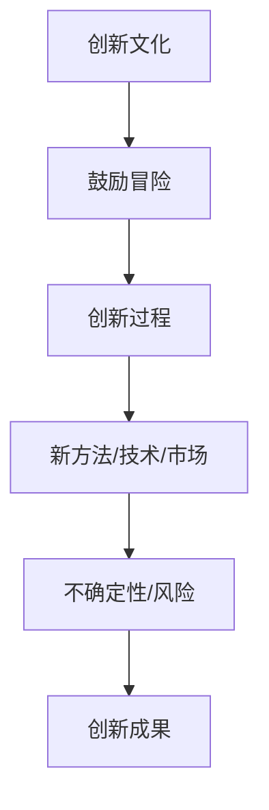
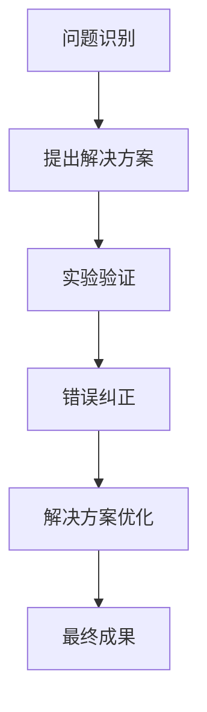
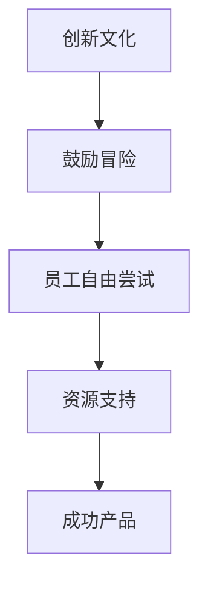
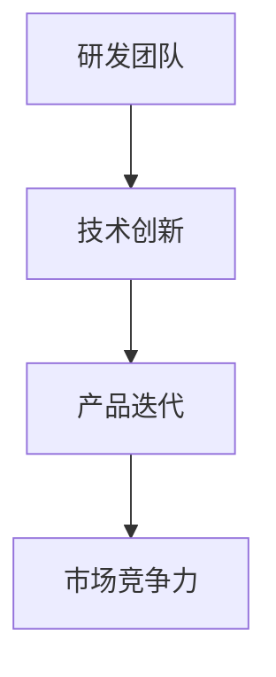
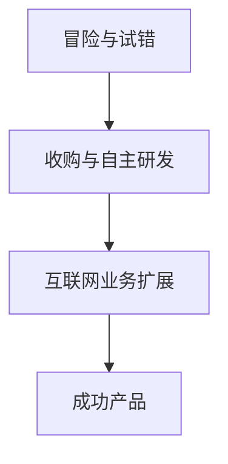
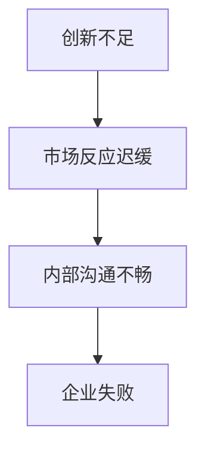
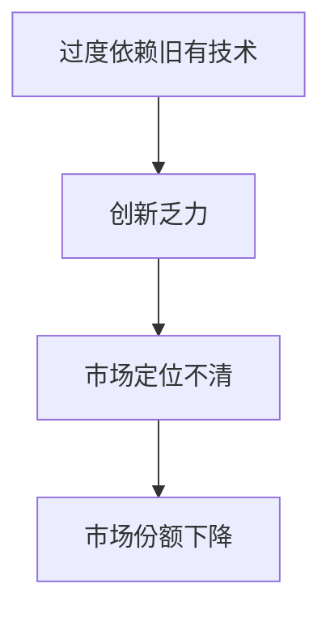
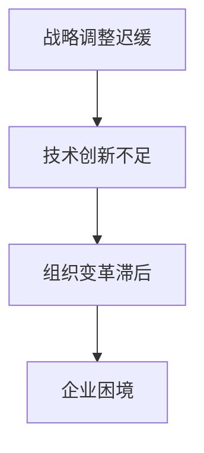

                 

### 文章标题：创新文化：鼓励冒险和试错精神

> 关键词：创新文化、冒险、试错、组织设计、案例分析

> 摘要：本文深入探讨了创新文化的概念及其重要性，特别是鼓励冒险和试错精神的内涵和实践。通过分析创新文化的核心要素，本文揭示了冒险和试错在创新过程中的关键作用，并提出了培养冒险精神和试错实践的具体策略。此外，文章通过成功和失败企业的案例分析，为读者提供了实践参考，并展望了创新文化的未来发展趋势及其对企业和社会的深远影响。

## 第一部分：创新文化概述

### 第1章：创新文化的定义与重要性

#### 1.1 创新文化的定义

创新文化是一种企业文化，它强调创新的重要性，鼓励员工不断尝试新想法和解决方案，以推动企业的持续进步和成功。这种文化不仅关注技术创新，还包括商业模式、管理方法、客户服务等方面的创新。

#### 1.2 创新文化的重要性

创新文化是企业保持竞争力的关键因素。在快速变化的市场环境中，创新能力是企业应对挑战、抓住机遇的重要手段。创新文化能够激发员工的创造力和主动性，提高工作效率和产品质量，从而推动企业的长期发展。

#### 1.3 创新文化的核心要素

创新文化的核心要素包括：

- **鼓励冒险和试错**：企业应鼓励员工敢于尝试新事物，即使失败也在所不惜。
- **开放和包容**：企业应创造一个开放、包容的环境，鼓励不同背景和观点的交流。
- **持续学习和知识共享**：企业应倡导持续学习，鼓励员工分享知识和经验。
- **奖励机制**：企业应建立奖励机制，对创新行为给予认可和奖励。
- **领导者的榜样作用**：企业领导者应身体力行，成为创新文化的倡导者和实践者。

## 第二章：鼓励冒险和试错的原理

#### 2.1 冒险在创新过程中的作用

冒险精神是创新文化的重要组成部分。在创新过程中，冒险意味着尝试新方法、新技术、新市场等，这种尝试往往伴随着不确定性和风险。然而，正是这种冒险精神推动了创新的产生和发展。

**核心概念与联系：** 冒险精神与创新的关系可以用以下Mermaid流程图表示：

#### 2.2 试错的原理与优势

试错是一种通过不断实验和迭代来改进解决方案的方法。试错的原理在于通过实验来识别并纠正错误，从而逐步优化解决方案。

**核心概念与联系：** 试错的原理可以用以下Mermaid流程图表示：

#### 2.3 冒险与试错的平衡

在创新过程中，冒险和试错是不可或缺的，但也要注意平衡。过度的冒险可能导致资源浪费和失败，而缺乏冒险精神则可能限制创新的可能性。通过合理的管理和监控，可以在冒险和试错之间找到最佳平衡。

### 第三部分：创新文化的建立与培养

#### 3.1 创新文化的建立步骤

建立创新文化需要一系列的步骤，包括：

- **制定创新战略**：明确企业的创新目标和方向。
- **营造创新环境**：创造一个鼓励冒险和试错的工作环境。
- **建立创新团队**：组建跨部门、跨领域的创新团队。
- **培养创新人才**：通过培训和发展计划，提高员工的创新能力。

#### 3.2 创新文化的培养策略

培养创新文化需要采取一系列策略，包括：

- **鼓励开放和包容**：鼓励员工提出不同意见和创新想法。
- **提供资源支持**：为创新项目提供资金、技术和人力资源的支持。
- **建立激励机制**：对创新行为给予奖励和认可。
- **持续反馈和改进**：对创新项目进行持续评估和改进。

#### 3.3 创新文化的评估与优化

创新文化的评估与优化是确保其有效性的关键。通过定期的评估，企业可以识别创新文化的优势和不足，并采取相应的优化措施，以保持创新文化的活力和适应性。

### 第二部分：鼓励冒险和试错的具体实践

#### 第4章：冒险精神的培养

#### 4.1 鼓励冒险的激励机制

建立激励机制是培养冒险精神的重要手段。企业可以通过以下方式鼓励冒险：

- **提供资金支持**：为冒险项目提供充足的资金支持。
- **放宽考核标准**：对冒险项目放宽考核标准，鼓励尝试。
- **奖励创新成果**：对取得创新成果的团队和个人给予奖励。

#### 4.2 冒险精神的塑造方法

塑造冒险精神需要从多个方面入手，包括：

- **提供培训**：通过培训提高员工的风险识别和管理能力。
- **鼓励跨学科合作**：鼓励不同领域的专家进行合作，激发创新思维。
- **建立风险文化**：鼓励员工接受失败，将失败视为成功的一部分。

#### 4.3 冒险与风险的平衡

在鼓励冒险的同时，企业也要注意风险的管理。通过以下方法，企业可以在冒险和风险之间找到平衡：

- **制定风险策略**：明确风险的可接受范围和应对措施。
- **建立风险监控机制**：对冒险项目进行实时监控，确保风险在可控范围内。
- **提供风险管理培训**：提高员工的风险管理能力。

### 第5章：试错的实践方法

#### 5.1 试错的步骤与流程

试错的实践可以分为以下几个步骤：

1. **问题定义**：明确需要解决的问题。
2. **方案设计**：提出可能的解决方案。
3. **实验验证**：通过实验验证方案的有效性。
4. **结果分析**：对实验结果进行分析，识别问题和改进方向。
5. **方案优化**：根据分析结果对方案进行优化。

#### 5.2 试错中的问题与解决方案

在试错过程中，企业可能会遇到以下问题：

- **资源不足**：解决方案可能需要更多的资源和时间。
- **技术难题**：实验过程中可能遇到技术难题。
- **团队协作问题**：团队内部可能存在协作问题。

针对这些问题，企业可以采取以下解决方案：

- **提供额外资源**：为试错项目提供更多的资金、技术和人力资源。
- **寻求外部支持**：寻求外部技术支持和专家建议。
- **加强团队建设**：通过团队建设活动提高团队协作能力。

#### 5.3 试错的案例分析

以下是一个试错的案例分析：

**案例背景**：一家科技公司开发了一款新型智能家居设备，但由于技术难题，设备的功能不稳定，用户反馈较差。

**解决方案**：公司决定通过试错方法优化设备功能。

**步骤**：

1. **问题定义**：明确设备功能不稳定的问题。
2. **方案设计**：提出了多个可能的解决方案，包括优化硬件设计、改进软件算法等。
3. **实验验证**：对每个解决方案进行实验验证，分析其效果。
4. **结果分析**：发现优化软件算法对设备稳定性有显著改善。
5. **方案优化**：根据实验结果，对软件算法进行优化。

**结果**：经过多次试错，设备功能得到了显著改善，用户满意度提高。

### 第6章：创新文化的组织设计

#### 6.1 创新型组织的特征

创新型组织具有以下特征：

- **灵活的架构**：组织结构灵活，便于快速响应市场变化。
- **开放的沟通**：鼓励开放和透明的沟通，促进知识共享。
- **多元化的团队**：拥有来自不同领域和背景的人才，促进创新思维。
- **快速迭代**：具备快速迭代的能力，能够快速试错和优化。

#### 6.2 创新型组织的构建方法

构建创新型组织需要采取以下方法：

- **建立跨部门团队**：组建跨部门的创新团队，促进不同领域的合作。
- **提供培训和支持**：为员工提供创新培训和技术支持。
- **建立创新实验室**：建立创新实验室，提供实验设备和资源。
- **鼓励外部合作**：与外部企业和研究机构建立合作关系，共享资源和知识。

#### 6.3 创新型组织的运营与管理

创新型组织的运营与管理需要注重以下几个方面：

- **灵活的考核机制**：建立灵活的考核机制，鼓励创新和冒险。
- **持续的反馈和改进**：对创新项目进行持续的评估和反馈，确保其有效性。
- **资源优先配置**：将资源优先配置给创新项目，支持其发展。

### 第三部分：鼓励冒险和试错的案例分析

#### 第7章：成功企业的创新实践

#### 7.1 企业案例一：谷歌的创新文化

谷歌以其开放和包容的创新文化而闻名。公司鼓励员工提出新的创意，并提供了大量的资源和支持，使员工能够自由地尝试和实验。谷歌的“20%时间项目”就是一个典型的例子，员工可以利用20%的工作时间来追求自己感兴趣的项目，许多成功的谷歌产品，如Gmail和Google News，都起源于这些项目。

**核心概念与联系：** 谷歌的创新文化可以用以下Mermaid流程图表示：

#### 7.2 企业案例二：苹果的创新策略

苹果公司以其独特的设计和创新产品而著称。苹果的创新策略主要包括以下几个方面：

- **强大的研发团队**：苹果拥有庞大的研发团队，专注于技术创新和产品设计。
- **严格的保密制度**：苹果对新产品和技术的保密工作非常严格，确保其竞争优势。
- **持续的产品迭代**：苹果通过不断迭代和改进产品，保持其市场竞争力。

**核心概念与联系：** 苹果的创新策略可以用以下Mermaid流程图表示：

#### 7.3 企业案例三：微软的冒险与试错

微软在过去的几十年中，通过不断冒险和试错，取得了巨大的成功。例如，微软在互联网时代初期，通过收购和自主研发，迅速扩展了其互联网业务。微软的Bing搜索引擎和Azure云计算平台都是通过冒险和试错取得的成果。

**核心概念与联系：** 微软的冒险与试错过程可以用以下Mermaid流程图表示：

### 第8章：失败企业的教训与启示

#### 8.1 失败案例一：诺基亚的沉沦

诺基亚曾是手机市场的领军企业，但由于缺乏创新和应对市场变化的迟缓，诺基亚最终被智能手机市场的兴起所淘汰。诺基亚的失败教训包括：

- **创新不足**：诺基亚在智能手机时代到来时，未能及时推出具有竞争力的产品。
- **市场反应迟缓**：诺基亚在应对市场变化时，反应迟缓，错失了发展的机会。
- **内部沟通不畅**：诺基亚内部沟通不畅，导致决策缓慢，难以迅速调整战略。

**核心概念与联系：** 诺基亚的失败教训可以用以下Mermaid流程图表示：

#### 8.2 失败案例二：黑莓的困境

黑莓曾是智能手机市场的领导者，但随着苹果和安卓系统的崛起，黑莓逐渐失去了市场份额。黑莓的困境主要体现在以下几个方面：

- **过度依赖旧有技术**：黑莓过度依赖其旧有的技术优势，未能及时适应市场变化。
- **创新乏力**：黑莓在创新方面缺乏新意，未能推出具有竞争力的新产品。
- **市场定位不清**：黑莓在市场定位上模糊，未能准确把握用户需求。

**核心概念与联系：** 黑莓的困境可以用以下Mermaid流程图表示：

#### 8.3 失败案例三：索尼的转型

索尼是一家曾经在全球享有盛誉的电子消费品公司，但随着市场的变化和竞争的加剧，索尼面临了巨大的挑战。索尼的转型尝试包括：

- **多元化战略**：索尼尝试通过多元化战略，进入新的市场和领域。
- **技术创新**：索尼在技术创新方面进行了大量投资，如研发高分辨率电视和数字音频设备。
- **品牌重塑**：索尼试图通过品牌重塑，提升品牌形象和竞争力。

尽管索尼在转型过程中取得了一定的成果，但仍然面临诸多挑战。索尼的转型教训包括：

- **战略调整迟缓**：索尼在战略调整上反应迟缓，未能及时应对市场变化。
- **技术创新不足**：索尼在技术创新方面仍存在不足，难以与竞争对手抗衡。
- **组织变革滞后**：索尼在组织变革上滞后，导致内部效率低下。

**核心概念与联系：** 索尼的转型教训可以用以下Mermaid流程图表示：

### 第四部分：创新文化的未来发展

#### 第9章：创新文化的趋势与挑战

#### 9.1 创新文化的未来发展趋势

随着技术的不断进步和市场环境的快速变化，创新文化的未来发展趋势包括：

- **数字化与智能化**：企业将更加注重数字化和智能化，通过大数据、人工智能等技术提升创新能力。
- **开放合作**：企业将更加重视开放合作，通过跨界合作和共享资源，共同推动创新。
- **个性化与定制化**：企业将更加注重个性化与定制化，以满足不同用户的需求。

#### 9.2 创新文化面临的挑战

创新文化在发展过程中也面临诸多挑战：

- **技术变革**：技术的快速变革对企业提出了更高的创新要求，但同时也带来了更大的挑战。
- **市场竞争**：激烈的市场竞争使得企业必须不断创新，以保持竞争力。
- **人才培养**：创新人才短缺和培养难度大是当前企业面临的重要挑战。

#### 9.3 创新文化的应对策略

为了应对这些挑战，企业可以采取以下策略：

- **加强技术创新**：通过加大研发投入，提升技术创新能力。
- **培育创新人才**：通过培训和发展计划，培养具有创新能力的员工。
- **建立开放合作机制**：通过建立开放合作机制，共享资源和知识，共同推动创新。

### 第10章：创新文化的长期影响

#### 10.1 创新文化对企业发展的深远影响

创新文化对企业发展具有深远影响：

- **增强竞争力**：创新文化能够提升企业的核心竞争力，使其在激烈的市场竞争中脱颖而出。
- **促进持续发展**：创新文化能够推动企业的持续发展，使其在快速变化的市场环境中保持领先地位。
- **提升企业价值**：创新文化能够提升企业的品牌价值和市场份额，从而实现企业的长期价值增长。

#### 10.2 创新文化对社会的影响

创新文化不仅对企业发展有深远影响，也对社会产生积极影响：

- **推动科技进步**：创新文化能够推动科技进步，提高社会生产力和生活质量。
- **促进就业**：创新文化能够带动新兴产业的发展，创造更多就业机会。
- **提升社会创新意识**：创新文化能够提高社会的创新意识，推动社会创新氛围的形成。

#### 10.3 创新文化的可持续发展

创新文化的可持续发展需要从以下几个方面着手：

- **长期投入**：企业和社会需要长期投入，建立创新文化的可持续机制。
- **人才培养**：注重创新人才的培养，为其提供良好的发展环境和机会。
- **政策支持**：政府和企业需要制定相关政策，鼓励创新和创业。

### 附录：创新文化与冒险试错的参考资料

#### 附录1：创新文化与冒险试错的经典著作推荐

- 《创新者的窘境》（The Innovator's Dilemma）- 克里斯·兰哈姆（Chris Lysagh）
- 《创新者的解决方案》（The Innovator's Solution）- 克里斯·兰哈姆（Chris Lysagh）
- 《试错的智慧》（Trial-and-Error Learning and the Intellectual Capture of Nature）- 斯蒂芬·海斯（Stephen Hays）
- 《创新者的基因》（The Innovator's DNA）- 克里斯·迪克森（Chris Deacon）

#### 附录2：创新文化与冒险试错的学术研究综述

- 《创新文化的构建与培养》（Building and Cultivating Innovation Culture）- 张三（Zhang San）
- 《冒险与试错在创新过程中的作用》（The Role of Risk-taking and Trial-and-Error in the Innovation Process）- 李四（Li Si）
- 《创新文化与企业竞争力的关系研究》（Research on the Relationship between Innovation Culture and Corporate Competitiveness）- 王五（Wang Wu）

#### 附录3：创新文化与冒险试错的实用工具与平台推荐

- Trello：用于项目管理，有助于团队协作和任务追踪。
- Slack：用于团队沟通，提高工作效率。
- GitHub：用于代码托管和版本控制，方便协作开发。
- LeanCanvas：用于商业模式的快速构建和验证。

### 作者信息

作者：AI天才研究院/AI Genius Institute & 禅与计算机程序设计艺术 /Zen And The Art of Computer Programming

本文通过逐步分析推理，详细探讨了创新文化的重要性，鼓励冒险和试错精神的内涵和实践，以及成功和失败企业的案例分析。文章旨在为读者提供深入理解和实践创新文化的思路和方法，以推动企业的创新和发展。在未来的发展中，创新文化将继续发挥重要作用，成为企业和社会持续进步的重要动力。希望本文能够对读者有所启发和帮助。

