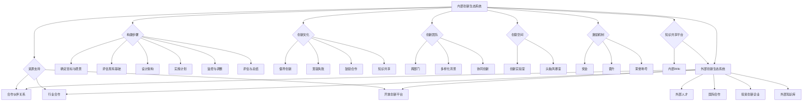

                 

### 第1章 引言

#### 1.1 书籍背景与目的

随着全球经济的快速发展和科技的不断进步，创新已经成为企业获取竞争优势、推动经济增长的重要驱动力。然而，如何构建一个能够有效激发员工创造力、促进创新的组织环境，成为众多企业领导者面临的一大挑战。为此，我们编写了这本书，旨在深入探讨创新生态系统的构建与优化，帮助组织营造一个鼓励创意的氛围，实现持续创新。

本书的目标读者包括企业高管、创新部门负责人、人力资源管理人员、研发团队负责人以及所有关注创新管理、人才发展和技术进步的从业者。通过阅读本书，读者将能够：

- 理解创新生态系统的概念与重要性
- 掌握创新生态系统的构建方法与策略
- 学习如何培养与激发员工的创造力
- 掌握创新过程管理与团队协作的关键技巧
- 分析成功创新生态系统的案例，汲取经验教训
- 评估与优化现有创新生态系统，推动企业持续发展

#### 1.2 创新生态系统的概念与重要性

创新生态系统是指一系列相互关联的元素和过程，它们共同作用，形成一个支持创新的组织环境。这些元素包括组织文化、团队协作、激励机制、资源投入等。创新生态系统的重要性体现在以下几个方面：

1. **激发员工创造力**：创新生态系统为员工提供了一个自由探索、勇于尝试和不断学习的空间，从而激发员工的创造力，推动技术创新和业务发展。

2. **提升企业竞争力**：通过构建创新生态系统，企业能够持续产生新的产品、服务和商业模式，从而在市场竞争中保持领先地位。

3. **促进人才发展**：创新生态系统鼓励员工跨部门、跨领域的合作，促进知识共享与技能提升，为员工提供成长和发展的机会。

4. **增强组织适应能力**：创新生态系统使企业能够快速响应市场变化和客户需求，提高组织的灵活性和应变能力。

5. **推动社会进步**：创新生态系统不仅为企业自身带来发展机遇，还通过技术创新和商业模式变革，推动整个社会的进步和发展。

#### 1.3 本书结构安排与学习目标

本书共分为八个章节，结构安排如下：

1. **第1章 引言**：介绍书籍背景、目的与目标读者，阐述创新生态系统的概念与重要性。
   
2. **第2章 创新生态系统的理论基础**：讨论创新的定义与类型、创新生态系统的构成要素及其与组织文化的关系。

3. **第3章 创造力的培养与激发**：探讨创造力的概念与特征、培养创造力的方法与激发创造力的策略。

4. **第4章 创新过程管理**：介绍创新过程模型、创新项目管理、创新团队协作与创新激励机制。

5. **第5章 创新生态系统的构建**：阐述创新生态系统构建的步骤、内部创新生态系统建设与外部创新生态系统建设。

6. **第6章 创新生态系统案例分析**：分析硅谷、谷歌等成功创新生态系统的案例，探讨经验教训。

7. **第7章 创新生态系统评估与优化**：讨论创新生态系统评估方法、优化策略与持续发展。

8. **第8章 结论**：总结创新生态系统的重要性与未来发展趋势。

通过学习本书，读者将能够：

- 理解创新生态系统的概念、重要性及其构建方法。
- 掌握培养与激发创造力的策略，提升员工创新能力和团队协作效率。
- 学会创新过程管理、创新团队协作与创新激励机制，推动创新项目成功实施。
- 分析成功创新生态系统的案例，为组织创新提供借鉴和启示。
- 评估与优化现有创新生态系统，推动企业持续发展。

### 第2章 创新生态系统的理论基础

#### 2.1 创新的定义与类型

创新是指通过引入新的想法、方法、技术或产品，从而实现某种变革的过程。创新可以分为多种类型，根据创新对象和程度的不同，可以分为以下几种：

1. **产品创新**：指开发新的产品或改进现有产品，以满足市场需求或提升用户体验。
   - **产品生命周期模型**：[](https://mermaid-js.github.io/mermaid/live-editor/ZYoqZacAdXaoYyMnAAEJ0)
   - **创新曲线**：[](https://mermaid-js.github.io/mermaid/live-editor/TgGy4Bv5oE4Ka7dCGoO80)

2. **过程创新**：指通过改进工作流程、优化资源配置或采用新的管理方法，提高组织效率和质量。
   - **六西格玛管理**：[](https://mermaid-js.github.io/mermaid/live-editor/G5IXE5t6ETjg5Gl45tED0)
   - **精益生产**：[](https://mermaid-js.github.io/mermaid/live-editor/W5jXy4BCECjV5kFQzBiJ0)

3. **业务模式创新**：指通过改变商业模式、开拓新市场或创造新的盈利模式，实现业务增长和利润提升。
   - **平台商业模式**：[](https://mermaid-js.github.io/mermaid/live-editor/X7b1wP2CWpYb9FJ6Y5PZ0)
   - **共享经济**：[](https://mermaid-js.github.io/mermaid/live-editor/BxQn8Ey4EdzVokAOpQ6K0)

4. **组织创新**：指通过变革组织结构、流程和文化，提高组织的创新能力和适应能力。
   - **敏捷开发**：[](https://mermaid-js.github.io/mermaid/live-editor/BkHdKkMyd6NCcZt5xKv80)
   - **扁平化管理**：[](https://mermaid-js.github.io/mermaid/live-editor/G5j7x4y5dBpyZxGyZK6Q0)

#### 2.2 创新生态系统的构成要素

创新生态系统由多个相互关联的要素组成，这些要素共同作用，形成一个支持创新的组织环境。以下是创新生态系统的主要构成要素：

1. **组织文化**：创新文化是创新生态系统的核心，它包括鼓励创新、宽容失败、知识共享和协同合作的价值观和行为准则。创新文化能够激发员工的创新意愿，降低创新风险，提高创新成功率。

2. **团队协作**：创新往往需要跨部门、跨领域的协作，团队协作能力是创新生态系统的重要组成部分。高效的团队协作能够促进知识共享、技能互补，提高创新效率。

3. **激励机制**：激励机制是创新生态系统的重要驱动因素，它包括物质激励和非物质激励。合理的激励机制能够激发员工的创新动力，提升创新绩效。

4. **资源投入**：资源投入包括资金、技术、人才等，是创新生态系统的物质基础。充足的资源投入能够为创新项目提供有力保障，提高创新成功率。

5. **人才培养与开发**：人才培养与开发是创新生态系统的关键要素，通过培训、职业发展、激励等手段，提升员工的创新能力，为创新提供人才支持。

6. **创新过程管理**：创新过程管理包括创新项目的规划、实施、监控和评估等环节，是创新生态系统的重要组成部分。有效的创新过程管理能够确保创新项目的顺利推进，提高创新成功率。

7. **外部合作**：外部合作包括与客户、供应商、研究机构等建立合作关系，是创新生态系统的重要补充。外部合作能够为企业带来新的创意、技术和市场机会，推动创新生态系统的持续发展。

#### 2.3 创新生态系统与组织文化的关系

创新生态系统与组织文化密切相关，创新生态系统构建的成功与否很大程度上取决于组织文化的支持。以下是创新生态系统与组织文化之间的关系：

1. **相互促进**：创新生态系统能够促进组织文化的形成和发展，而组织文化又能够支持和强化创新生态系统的运行。例如，鼓励创新的文化能够激发员工的创新意愿，推动创新项目的成功实施。

2. **相互影响**：组织文化对创新生态系统的构建和运行产生影响，而创新生态系统的构建和运行也会反过来影响组织文化。例如，创新生态系统的建立和完善可能会促进组织文化的变革，推动组织从传统型向创新型转变。

3. **共同目标**：创新生态系统与组织文化都致力于推动企业的持续创新和发展，实现企业目标。创新生态系统通过构建一个支持创新的组织环境，提升企业的创新能力，从而实现企业目标；而组织文化通过塑造员工的价值观和行为准则，提高员工的创新意识和创新能力，为创新生态系统提供支持。

4. **动态调整**：创新生态系统与组织文化都是动态的，需要不断调整和优化。随着企业内外环境的变化，创新生态系统和组织文化需要不断适应和调整，以保持其有效性和适应性。

通过本章的讨论，我们可以看到创新生态系统是一个复杂而动态的系统，它由多个相互关联的要素组成，共同作用，推动企业的持续创新和发展。构建一个有效的创新生态系统，需要从创新定义与类型、创新生态系统的构成要素以及创新生态系统与组织文化的关系等多个方面进行深入研究和实践。在接下来的章节中，我们将继续探讨如何培养与激发创造力、管理创新过程、构建创新生态系统以及评估与优化创新生态系统等关键问题。

#### 第3章 创造力的培养与激发

创造力是创新生态系统的核心要素，它驱动着创新过程，推动着企业的发展和进步。在本章中，我们将深入探讨创造力的概念与特征，并介绍培养与激发创造力的具体方法和策略。

#### 3.1 创造力的概念与特征

创造力是指个体在创造性思维过程中产生新颖、有价值的想法和解决方案的能力。创造力不仅体现在科学、技术和艺术等领域，还渗透到生活的方方面面。以下是创造力的几个关键特征：

1. **新颖性**：创造力产生的新想法、解决方案或作品具有独特性和创新性，与众不同。
2. **价值性**：创造力产生的成果对个体、团队或社会具有实际意义和价值，能够解决实际问题或提升生活质量。
3. **适应性**：创造力能够适应不同环境和情境，灵活应对变化和挑战。
4. **累积性**：创造力不是一蹴而就的，它需要不断积累经验、知识和技能，通过实践和反思不断提升。

创造力可以分为两大类型：

1. **垂直型创造力**：指在某个特定领域或方向上深入挖掘、不断拓展的能力，如科学家的研究、艺术家的创作等。
2. **水平型创造力**：指在不同领域或方向之间进行跨界融合、创新突破的能力，如跨学科研究、跨行业合作等。

#### 3.2 培养创造力的方法

培养创造力需要从个人和组织两个层面入手，以下是一些有效的培养创造力方法：

1. **提供多样化挑战**：为员工提供不同类型、不同难度的任务和挑战，激发他们的创造潜能。多样化挑战能够帮助员工突破舒适区，拓展思维边界，提升创造力。
   - **伪代码示例**：
     ```python
     def provide_diverse_challenges(employee):
         """
         提供多样化挑战：
         - 设定不同类型的任务
         - 提供跨部门、跨领域的项目
         - 创设创新竞赛
         """
         employee.assign_tasks_of_different_types()
         employee.involve_in_interdepartmental_projects()
         employee.participate_in_innovation_competitions()
     ```

2. **增强自主学习能力**：鼓励员工自主学习，培养他们的独立思考能力和解决问题的能力。通过提供学习资源、培训机会和自主学习时间，帮助员工不断提升自身技能和知识。
   - **伪代码示例**：
     ```python
     def strengthen_自主学习_ability(employee):
         """
         增强自主学习能力：
         - 提供在线学习平台
         - 设立内部知识分享会
         - 鼓励员工参加外部培训
         """
         employee.access_online_learning_resources()
         employee.join_internal_knowledge_sharing_meetings()
         employee.attend_external_training_programs()
     ```

3. **鼓励失败与反思**：失败是创造力培养过程中的重要环节，通过鼓励员工面对失败、从失败中吸取教训和反思，可以提升他们的创造力和抗挫折能力。
   - **伪代码示例**：
     ```python
     def encourage_failure_and_reflection(employee):
         """
         鼓励失败与反思：
         - 设立失败项目反馈机制
         - 组织反思研讨会
         - 提供心理辅导和支持
         """
         employee.set_up_failure_project_feedback_mechanism()
         employee participate_in_reflection_workshops()
         employee.receive_mental_counseling_and_support()
     ```

4. **建立支持环境**：创造一个支持创新和创造力的组织环境，包括鼓励创新的文化、灵活的工作安排、资源支持等。通过营造一个宽松、自由、包容的工作氛围，激发员工的创造力。
   - **伪代码示例**：
     ```python
     def build_supportive_environment(organization):
         """
         建立支持环境：
         - 设立创新基金
         - 提供创意空间
         - 设立奖励机制
         """
         organization.create_innovation_fund()
         organization.provide_creative_spaces()
         organization.set_up_innovation_rewards()
     ```

#### 3.3 激发创造力的策略

在培养创造力的基础上，组织还需要采取一系列策略来激发员工的创造力，以下是一些有效的策略：

1. **建立创新文化**：创新文化是激发创造力的关键，通过倡导创新、宽容失败、鼓励协作等价值观，营造一个鼓励创新和创造力的组织氛围。
   - **伪代码示例**：
     ```python
     def build_innovative_culture(organization):
         """
         建立创新文化：
         - 设立创新价值观
         - 宣传创新案例
         - 培训创新思维
         """
         organization.define_innovation_values()
         organization.promote_innovation_cases()
         organization.train_innovation_thinking()
     ```

2. **提供创意空间**：为员工提供专门的创意空间，如开放式办公室、创新实验室、茶歇区等，使他们能够自由地交流和思考，激发创造力。
   - **伪代码示例**：
     ```python
     def provide_creative_space(organization):
         """
         提供创意空间：
         - 设立开放式办公室
         - 设立创新实验室
         - 设立茶歇区
         """
         organization.create_open-office_layout()
         organization.set_up_innovation_laboratories()
         organization.provide_snack_areas()
     ```

3. **实施奖励机制**：通过实施奖励机制，如奖金、晋升、荣誉称号等，激励员工积极参与创新活动，提升创新绩效。
   - **伪代码示例**：
     ```python
     def implement_innovation_rewards(organization):
         """
         实施奖励机制：
         - 设立创新奖金
         - 提供晋升机会
         - 设立创新荣誉
         """
         organization.create_innovation_bonus_program()
         organization.offer_promotion_opportunities()
         organization.set_up_innovation_honors()
     ```

4. **加强团队协作**：通过加强团队协作，促进知识共享和技能互补，提高创新效率和创造力。
   - **伪代码示例**：
     ```python
     def strengthen_team_cohesion(organization):
         """
         加强团队协作：
         - 组织团队建设活动
         - 设立跨部门项目
         - 鼓励内部交流
         """
         organization.organize_team_building_activities()
         organization.assign_interdepartmental_projects()
         organization.encourage_internal_communication()
     ```

5. **建立创新生态系统**：通过构建内部和外部创新生态系统，为员工提供丰富的创新资源和合作机会，激发创造力。
   - **伪代码示例**：
     ```python
     def build_innovation_ecosystem(organization):
         """
         建立创新生态系统：
         - 内部合作网络
         - 外部合作伙伴
         - 创新交流平台
         """
         organization.create_internal_cooperation_networks()
         organization establish_external_partner_relationships()
         organization.provide_innovation_communication_platforms()
     ```

通过本章的讨论，我们可以看到创造力是创新生态系统的核心要素，培养与激发创造力对于企业的发展具有重要意义。在接下来的章节中，我们将继续探讨创新过程管理、创新团队协作、创新生态系统构建以及创新生态系统评估与优化等关键问题。

#### 第4章 创新过程管理

创新过程管理是确保创新项目从概念到实际实施并成功落地的关键环节。有效的创新过程管理能够提高创新项目的成功率，确保资源的合理利用，并最终推动企业的发展。本章将详细介绍创新过程模型、创新项目管理、创新团队协作以及创新激励机制。

#### 4.1 创新过程模型

创新过程模型是描述创新项目从启动到实施、监控和评估的各个环节的理论框架。常见的创新过程模型包括以下几种：

1. **线性创新模型**：线性创新模型将创新过程分为几个连续的阶段，如创意生成、项目筛选、开发实施、市场推广等。每个阶段都有明确的任务和目标，项目按照顺序逐步推进。
   - **伪代码示例**：
     ```python
     def linear_innovation_model(innovation_project):
         """
         线性创新模型：
         - 创意生成
         - 项目筛选
         - 开发实施
         - 市场推广
         """
         innovation_project.generate_ideas()
         innovation_project.select_projects()
         innovation_project.develop_and_implement()
         innovation_project.promote_in_market()
     ```

2. **螺旋创新模型**：螺旋创新模型强调创新过程的反复迭代和持续改进。每个迭代周期包括四个阶段：制定计划、执行实施、评估反馈和决策调整。项目在不同迭代周期中逐步完善，直至成功实施。
   - **伪代码示例**：
     ```python
     def spiral_innovation_model(innovation_project):
         """
         螺旋创新模型：
         - 制定计划
         - 执行实施
         - 评估反馈
         - 决策调整
         """
         while not innovation_project.is_successful():
             innovation_project.plan()
             innovation_project.execute()
             innovation_project.evaluate()
             innovation_project.adjust_decisions()
     ```

3. **动态系统创新模型**：动态系统创新模型强调创新过程的复杂性和动态性，认为创新是一个不断演化的系统。该模型关注创新过程中的互动关系、反馈机制和适应性，强调灵活应对变化和挑战。
   - **伪代码示例**：
     ```python
     def dynamic_system_innovation_model(innovation_project):
         """
         动态系统创新模型：
         - 监控环境变化
         - 调整项目策略
         - 实施迭代改进
         - 评估项目效果
         """
         innovation_project.monitor_environment()
         innovation_project.adjust_project_strategy()
         innovation_project.execute_iterations()
         innovation_project.evaluate_project_impact()
     ```

#### 4.2 创新项目管理

创新项目管理是确保创新项目按计划、按预算、高质量地完成的关键。以下是创新项目管理的主要环节和关键技巧：

1. **明确项目目标**：在项目启动阶段，需要明确创新项目的目标、范围和预期成果。这有助于项目团队保持一致的方向和努力。
   - **伪代码示例**：
     ```python
     def set_project_objective(innovation_project):
         """
         明确项目目标：
         - 确定创新方向
         - 设定项目范围
         - 定义预期成果
         """
         innovation_project.define_innovation_direction()
         innovation_project.set_project_scope()
         innovation_project specify_ expected_outcomes()
     ```

2. **制定项目计划**：制定详细的项目计划，包括项目进度、资源分配、风险评估等。项目计划是项目团队共同遵守的行动指南。
   - **伪代码示例**：
     ```python
     def create_project_plan(innovation_project):
         """
         制定项目计划：
         - 制定项目进度表
         - 分配项目资源
         - 识别风险因素
         """
         innovation_project.create_schedule()
         innovation_project.allocate_resources()
         innovation_project.identify_risks()
     ```

3. **确保资源投入**：在项目实施过程中，确保项目所需的资金、技术、人力等资源得到充分保障。这有助于项目顺利推进，提高项目成功率。
   - **伪代码示例**：
     ```python
     def allocate_resources(innovation_project):
         """
         确保资源投入：
         - 分配预算资金
         - 指派技术人员
         - 提供必要设备
         """
         innovation_project.allocate_budget()
         innovation_project.assign_technical_staff()
         innovation_project.provide_necessary_equipment()
     ```

4. **监控项目进度**：通过定期监控项目进度，及时发现问题并采取相应措施，确保项目按计划推进。监控项目进度有助于提高项目透明度和项目管理效率。
   - **伪代码示例**：
     ```python
     def monitor_progress(innovation_project):
         """
         监控项目进度：
         - 定期召开项目会议
         - 分析项目进展数据
         - 识别潜在问题
         """
         innovation_project.hold_regular_meetings()
         innovation_project.analyze_progress_data()
         innovation_project.identify_potential_issues()
     ```

5. **风险管理**：在项目实施过程中，需要对潜在的风险进行识别、评估和应对。通过有效的风险管理，降低项目风险对项目进度和质量的影响。
   - **伪代码示例**：
     ```python
     def identify_and_manage_risks(innovation_project):
         """
         风险管理：
         - 识别潜在风险
         - 评估风险影响
         - 制定应对措施
         """
         innovation_project.identify_risks()
         innovation_project.evaluate_impact()
         innovation_project.create_response_strategies()
     ```

#### 4.3 创新团队协作

创新团队协作是实现创新项目成功的关键因素。高效的团队协作能够促进知识共享、提高创新能力，推动创新项目顺利实施。以下是创新团队协作的关键技巧：

1. **建立明确的团队目标**：确保团队所有成员都明确项目的目标、任务和责任，有助于提高团队协作效率和执行力。
   - **伪代码示例**：
     ```python
     def set_team_objectives(innovation_team):
         """
         建立明确的团队目标：
         - 确定项目目标
         - 设定团队任务
         - 分配个人责任
         """
         innovation_team.define_project_objectives()
         innovation_team.set_team_tasks()
         innovation_team.assign_individual_responsibilities()
     ```

2. **加强沟通与协作**：通过建立有效的沟通机制，确保团队内部信息流畅、沟通及时，有助于提高团队协作效率和项目成功率。
   - **伪代码示例**：
     ```python
     def strengthen_communication_collaboration(innovation_team):
         """
         加强沟通与协作：
         - 定期召开团队会议
         - 采用多种沟通工具
         - 建立知识共享平台
         """
         innovation_team.hold_regular_meetings()
         innovation_team.use_communication_tools()
         innovation_team.create_knowledge_sharing_platforms()
     ```

3. **促进知识共享**：通过鼓励团队成员分享知识、经验和见解，提高团队的整体技能和创新能力。
   - **伪代码示例**：
     ```python
     def promote_knowledge_sharing(innovation_team):
         """
         促进知识共享：
         - 设立内部知识库
         - 组织经验交流会
         - 实施知识传承计划
         """
         innovation_team.create_internal_knowledge_banks()
         innovation_team.organize_experience_sharing_meetings()
         innovation_team.implement_knowledge_transition_programs()
     ```

4. **建立信任与支持**：通过建立信任、支持团队内部成员，有助于提高团队凝聚力和协作效率，推动创新项目的成功实施。
   - **伪代码示例**：
     ```python
     def build_trust_support(innovation_team):
         """
         建立信任与支持：
         - 营造开放氛围
         - 鼓励团队合作
         - 提供心理支持
         """
         innovation_team.create_an_open_atmosphere()
         innovation_team.encourage_team_collaboration()
         innovation_team.provide_mental_support()
     ```

#### 4.4 创新激励机制

创新激励机制是激发员工创新动力、提高创新绩效的重要手段。以下是一些有效的创新激励机制：

1. **奖金和福利**：为创新项目成功实施、取得显著成果的员工提供奖金和福利，激励员工积极参与创新活动。
   - **伪代码示例**：
     ```python
     def provide_innovation_incentives(employees):
         """
         提供创新激励：
         - 发放创新奖金
         - 提供晋升机会
         - 提供额外福利
         """
         employees.reward_innovation_success()
         employees.offer_promotion_opportunities()
         employees.provide_additional_benefits()
     ```

2. **荣誉称号和认可**：为在创新项目中表现突出的员工授予荣誉称号，提高其社会地位和荣誉感，激发创新动力。
   - **伪代码示例**：
     ```python
     def grant_innovation_honors(employees):
         """
         授予创新荣誉：
         - 设立创新奖项
         - 举行颁奖仪式
         - 提高荣誉待遇
         """
         employees.create_innovation_awards()
         employees.hold_award_ceremonies()
         employees.improve_honorary_treatment()
     ```

3. **职业发展机会**：为在创新项目中表现出色的员工提供职业发展机会，如内部晋升、跨部门调岗等，激励员工持续参与创新。
   - **伪代码示例**：
     ```python
     def provide_career_development_opportunities(employees):
         """
         提供职业发展机会：
         - 设立内部晋升机制
         - 提供跨部门调岗机会
         - 建立职业发展规划
         """
         employees.create_internal_promotion_mechanisms()
         employees.offer_interdepartmental_transfer_opportunities()
         employees.develop_career_plans()
     ```

4. **创新工作环境**：为员工创造一个良好的创新工作环境，如提供创意空间、技术支持、学习资源等，激励员工积极参与创新活动。
   - **伪代码示例**：
     ```python
     def create_innovation_working_environment(organization):
         """
         创造创新工作环境：
         - 提供创意空间
         - 提供技术支持
         - 提供学习资源
         """
         organization.provide_creative_spaces()
         organization.offer_technical_support()
         organization.provide_learning_resources()
     ```

通过本章的讨论，我们可以看到创新过程管理是确保创新项目成功实施的关键环节。有效的创新过程管理、创新团队协作和创新激励机制能够提高创新项目的成功率，推动企业的持续发展。在接下来的章节中，我们将继续探讨创新生态系统的构建、创新生态系统案例分析以及创新生态系统评估与优化等关键问题。

#### 第5章 创新生态系统的构建

创新生态系统的构建是确保企业能够持续创新、保持竞争优势的关键。创新生态系统不仅需要内部的支撑，还需要外部的合作与资源。本章将详细介绍创新生态系统构建的步骤、内部创新生态系统建设以及外部创新生态系统建设。

#### 5.1 创新生态系统构建的步骤

构建创新生态系统需要系统性和计划性，以下是一般步骤：

1. **确定目标与愿景**：首先，明确企业创新生态系统的目标与愿景。这包括创新方向、预期成果以及企业希望通过创新生态系统实现的长远目标。

2. **评估现有基础**：对企业现有的资源、能力、文化以及创新实践进行评估，了解企业的优势和劣势，为构建创新生态系统提供基础数据。

3. **设计创新生态系统架构**：根据评估结果，设计创新生态系统的架构。这包括确定关键要素、关系和互动机制，确保各部分之间能够协同作用。

4. **制定实施计划**：制定详细的实施计划，包括时间表、资源配置、责任分工等，确保创新生态系统构建有序进行。

5. **实施与落地**：按照实施计划，逐步推进创新生态系统的建设，包括组织文化变革、团队协作优化、激励机制完善等。

6. **监控与调整**：在实施过程中，定期监控创新生态系统的运行状况，根据反馈进行调整和优化，确保创新生态系统能够持续发挥作用。

7. **评估与总结**：在创新生态系统运行一段时间后，进行评估和总结，分析成果和经验教训，为未来的发展提供参考。

#### 5.2 内部创新生态系统建设

内部创新生态系统建设是创新生态系统构建的核心部分，以下是一些关键步骤：

1. **构建创新文化**：创新文化是内部创新生态系统的基础。企业需要倡导创新、宽容失败、鼓励合作和知识共享的价值观，营造一个有利于创新的氛围。

2. **建立创新团队**：组建跨部门、跨领域的创新团队，确保团队成员具有多样化的背景和技能，促进知识共享和协同创新。

3. **提供创意空间**：为员工提供专门的创意空间，如创新实验室、头脑风暴室等，使他们能够自由地交流和思考，激发创造力。

4. **优化激励机制**：设计合理的激励机制，如奖金、晋升、荣誉称号等，激励员工积极参与创新活动，提高创新绩效。

5. **培养创新能力**：通过培训、学习资源、职业发展机会等手段，提升员工的创新能力，为创新生态系统提供人才支持。

6. **建立知识共享平台**：搭建内部知识共享平台，如内部Wiki、经验交流会议等，促进知识传播和技能互补。

7. **完善资源支持**：确保创新项目所需的资金、技术、设备等资源得到充分保障，为创新活动提供有力支持。

#### 5.3 外部创新生态系统建设

外部创新生态系统建设是扩展企业创新资源、提高创新能力的有效途径。以下是一些关键步骤：

1. **建立合作伙伴关系**：与客户、供应商、研究机构、高校等建立合作伙伴关系，共享资源、知识和技术，共同推动创新。

2. **参与行业合作**：积极参与行业联盟、创新网络等，与其他企业、研究机构共同探讨创新方向、分享创新经验。

3. **开放创新平台**：搭建开放的创新平台，如创新挑战赛、众包平台等，吸引外部创新资源参与企业创新活动。

4. **引进外部人才**：通过引进外部人才，如专家、顾问、兼职人员等，为企业带来新的思维、技术和经验。

5. **参与国际合作**：与国际企业、研究机构合作，共享国际市场和技术资源，提高企业的国际竞争力。

6. **投资创新企业**：通过投资创新企业，如初创公司、高新技术企业等，支持创新项目的发展，实现共赢。

7. **建立外部知识库**：收集和整合外部知识资源，如学术论文、行业报告、专利信息等，为内部创新提供参考。

#### 核心概念与联系

为了更好地理解内部创新生态系统和外部创新生态系统的建设，我们可以通过以下Mermaid流程图展示它们的核心概念及其相互关系：



通过上述步骤和策略，企业可以构建一个有效的内部创新生态系统和外部创新生态系统，实现持续创新和发展。在接下来的章节中，我们将通过案例分析探讨成功创新生态系统的实践，以及如何评估和优化创新生态系统，以推动企业的持续发展。

### 第6章 创新生态系统案例分析

创新生态系统在全球范围内得到了广泛应用，许多企业和组织通过构建和优化创新生态系统，取得了显著的成果。本章将分析硅谷、谷歌等成功创新生态系统的案例，探讨其经验教训，为其他企业组织提供借鉴和启示。

#### 6.1 案例一：硅谷的创新生态系统

硅谷被誉为全球创新生态系统的典范，以其强大的创新能力和卓越的科技成果闻名于世。硅谷的创新生态系统具有以下几个关键特点：

1. **开放的合作环境**：硅谷鼓励企业、研究机构、高校和政府之间的合作，通过共享资源和知识，推动创新成果的转化和应用。

2. **创新文化的培育**：硅谷企业注重创新文化的培育，鼓励员工勇于尝试、宽容失败，并提倡知识共享和团队合作。

3. **强大的资本支持**：硅谷拥有丰富的风险投资资源，为创新项目提供资金支持，推动创新活动的开展。

4. **全球视野**：硅谷企业具有全球视野，积极参与国际合作，引进外部人才和先进技术，提高创新能力和竞争力。

**经验教训**：

- **开放合作**：企业应积极与其他组织合作，共享资源和知识，促进创新成果的转化和应用。
- **创新文化**：企业应注重创新文化的培育，鼓励员工勇于尝试、宽容失败，并提倡知识共享和团队合作。
- **资本支持**：企业应争取风险投资支持，为创新项目提供充足的资金保障。
- **全球视野**：企业应保持全球视野，引进外部人才和先进技术，提高创新能力和竞争力。

#### 6.2 案例二：谷歌的创新生态系统

谷歌以其卓越的创新能力和开放的内部环境著称，其创新生态系统在员工自主创新、技术积累和商业模式创新方面取得了显著成果。谷歌的创新生态系统具有以下几个关键特点：

1. **员工自主创新**：谷歌鼓励员工自主创新，提供专门的创新时间和资源，支持员工开展个人项目。

2. **技术积累与开放**：谷歌注重技术的积累和开放，通过内部研发和开源项目，推动技术创新和知识共享。

3. **创新激励机制**：谷歌实施灵活的创新激励机制，为在创新项目中表现突出的员工提供奖金、晋升和荣誉称号。

4. **团队协作与知识共享**：谷歌强调团队协作和知识共享，通过内部交流会议、技术论坛等平台，促进员工之间的交流和合作。

**经验教训**：

- **员工自主创新**：企业应鼓励员工自主创新，提供创新时间和资源支持，激发员工创造力。
- **技术积累与开放**：企业应注重技术的积累和开放，通过内部研发和开源项目，推动技术创新和知识共享。
- **创新激励机制**：企业应实施灵活的创新激励机制，为在创新项目中表现突出的员工提供奖励和认可。
- **团队协作与知识共享**：企业应强调团队协作和知识共享，通过内部交流平台，促进员工之间的交流和合作。

#### 6.3 案例三：其他成功创新生态系统的案例分析

除了硅谷和谷歌，还有许多其他企业和组织通过构建和优化创新生态系统取得了显著成果。以下是一些案例：

1. **三星**：三星通过构建全球创新网络，与全球领先的研究机构、高校和公司合作，推动技术创新和产业发展。三星注重内部创新文化的培育，鼓励员工跨部门、跨领域的合作，提高创新能力。

2. **IBM**：IBM通过实施“蓝色创新计划”，积极推动内部创新和外部合作。IBM注重技术的积累和开放，通过开源项目和技术共享，推动技术创新和产业发展。

3. **苹果**：苹果通过封闭的创新生态系统，保护其核心技术和产品，保持竞争优势。苹果强调员工自主创新和团队协作，通过内部交流会议和技术论坛，促进员工之间的交流和合作。

**经验教训**：

- **全球合作**：企业应积极与其他组织合作，共享资源和知识，推动创新成果的转化和应用。
- **创新文化**：企业应注重创新文化的培育，鼓励员工勇于尝试、宽容失败，并提倡知识共享和团队合作。
- **激励机制**：企业应实施灵活的创新激励机制，为在创新项目中表现突出的员工提供奖励和认可。
- **技术积累与开放**：企业应注重技术的积累和开放，通过内部研发和开源项目，推动技术创新和知识共享。

通过以上案例分析，我们可以看到成功创新生态系统具有以下几个共同特点：开放合作、创新文化、激励机制、技术积累与开放。这些特点为其他企业和组织提供了有益的启示，有助于其构建和优化创新生态系统，实现持续创新和发展。

#### 第7章 创新生态系统评估与优化

创新生态系统评估与优化是确保企业创新生态系统持续有效运行的关键环节。通过评估创新生态系统的运行状况、识别存在的问题和不足，企业可以针对性地进行优化，提升创新生态系统的效能。本章将介绍创新生态系统评估的方法、优化策略以及如何实现创新生态系统的持续发展。

#### 7.1 创新生态系统评估方法

创新生态系统评估是一个系统性、多层次的过程，包括以下几个方面：

1. **创新绩效评估**：评估创新项目的成功率、创新成果的商业价值、市场影响力等，以衡量创新生态系统的整体绩效。常用的评估指标包括创新项目数量、创新项目成功率、创新成果的市场份额等。

2. **创新氛围评估**：评估组织内部创新文化的氛围，包括员工对创新的认知、参与度、创新意愿等。常用的评估方法包括员工满意度调查、创新氛围问卷调查等。

3. **创新能力评估**：评估组织的创新能力，包括技术能力、研发能力、市场洞察力等。可以通过评估研发项目的创新水平、专利数量、新产品开发速度等指标来衡量。

4. **创新资源配置评估**：评估创新资源（如资金、技术、人才等）的配置和使用效率，确保资源得到合理利用。可以通过评估资源投入与产出比、资源利用率等指标来衡量。

5. **外部合作评估**：评估组织与外部合作伙伴的合作效果，包括合作项目的成功案例、合作网络的广度与深度等。可以通过合作伙伴满意度调查、合作项目成功率等指标来衡量。

#### 7.2 创新生态系统优化策略

在评估创新生态系统后，企业可以根据评估结果采取相应的优化策略，以提高创新生态系统的效能。以下是一些常见的优化策略：

1. **改进激励机制**：根据员工对创新的认知和参与度，调整激励机制，确保激励机制能够激发员工的创新动力。可以通过增加奖金、晋升机会、荣誉称号等方式来改进激励机制。

2. **提升创新能力**：通过加强研发投入、引进高端人才、搭建技术平台等措施，提升组织的创新能力。可以设立专项研发基金、开展技术培训、引进外部技术等。

3. **优化资源配置**：根据创新项目的实际需求，合理配置资源，确保资源能够高效利用。可以通过优化研发流程、提高资源利用率、降低成本等方式来优化资源配置。

4. **加强外部合作**：通过建立广泛的合作网络，引进外部资源、技术、人才等，提升组织的创新能力。可以加强与高校、研究机构、行业联盟等合作，共同推动创新。

5. **构建创新文化**：通过塑造鼓励创新、宽容失败、知识共享的价值观，营造一个有利于创新的组织氛围。可以通过设立创新奖项、举办创新活动、宣传创新案例等方式来构建创新文化。

6. **提高团队协作效率**：通过加强团队协作、优化沟通机制、提高团队凝聚力，提升团队协作效率。可以通过设立跨部门项目、组织团队建设活动、提供沟通工具等方式来提高团队协作效率。

#### 7.3 创新生态系统持续发展

创新生态系统的持续发展是确保企业长期竞争优势的关键。以下是一些实现创新生态系统持续发展的策略：

1. **动态调整与优化**：创新生态系统是一个动态的系统，需要不断适应和调整。企业应定期对创新生态系统进行评估和优化，根据市场环境、技术发展趋势等调整创新策略。

2. **知识管理与传承**：通过建立有效的知识管理体系，确保创新成果的积累和传承。可以通过搭建内部知识库、开展知识分享活动、实施知识传承计划等方式来加强知识管理。

3. **人才培养与开发**：通过建立完善的培训体系、提供职业发展机会，提升员工的创新能力。可以通过开展内部培训、外部交流、引进外部人才等方式来加强人才培养与开发。

4. **持续创新投入**：确保创新投入的稳定性和持续性，为创新生态系统的运行提供保障。可以通过设立创新基金、加大研发投入等方式来确保持续创新投入。

5. **风险管理**：在创新生态系统的运行过程中，需重视风险的管理与控制。可以通过建立风险管理机制、开展风险评估、制定应对措施等方式来降低创新风险。

通过本章的讨论，我们可以看到创新生态系统评估与优化对于企业持续创新和发展具有重要意义。企业应通过科学的评估方法和有效的优化策略，持续改进创新生态系统，实现持续创新和长期竞争优势。

### 第8章 结论

创新生态系统是企业持续创新和发展的关键因素，它通过激发员工的创造力、优化创新过程、加强团队协作和外部合作，为企业提供源源不断的创新动力。本章将总结创新生态系统的重要性，探讨其未来发展趋势，并展望其对企业和社会的深远影响。

#### 8.1 创新生态系统的重要性

创新生态系统的重要性体现在以下几个方面：

1. **激发员工创造力**：创新生态系统为员工提供了一个自由探索、勇于尝试和不断学习的空间，从而激发员工的创造力，推动技术创新和业务发展。

2. **提升企业竞争力**：通过构建创新生态系统，企业能够持续产生新的产品、服务和商业模式，从而在市场竞争中保持领先地位。

3. **促进人才发展**：创新生态系统鼓励员工跨部门、跨领域的合作，促进知识共享与技能提升，为员工提供成长和发展的机会。

4. **增强组织适应能力**：创新生态系统使企业能够快速响应市场变化和客户需求，提高组织的灵活性和应变能力。

5. **推动社会进步**：创新生态系统不仅为企业自身带来发展机遇，还通过技术创新和商业模式变革，推动整个社会的进步和发展。

#### 8.2 创新生态系统的未来发展趋势

随着全球科技的发展和市场竞争的加剧，创新生态系统在未来将呈现以下发展趋势：

1. **数字化与智能化**：数字化和智能化技术将在创新生态系统中发挥越来越重要的作用，通过大数据、人工智能等技术的应用，提升创新效率和质量。

2. **跨界融合**：创新生态系统将呈现跨界融合的趋势，不同行业、不同领域的企业和组织将加强合作，共同推动创新。

3. **全球化**：随着全球化进程的加快，创新生态系统将呈现全球化特征，跨国合作和创新资源流动将更加频繁。

4. **开放共享**：创新生态系统将更加开放和共享，企业将更加重视知识共享和技术合作，推动创新资源的优化配置。

5. **持续优化**：创新生态系统将不断适应和调整，通过持续评估和优化，确保创新生态系统的效能和适应性。

#### 8.3 创新生态系统对企业和社会的深远影响

创新生态系统对企业和社会的深远影响体现在以下几个方面：

1. **企业层面**：创新生态系统有助于企业提升竞争力、实现持续发展，为企业带来新的增长点和商业机会。

2. **社会层面**：创新生态系统推动社会进步，通过技术创新和商业模式变革，提高生活质量、推动经济发展和社会进步。

3. **人才层面**：创新生态系统为人才提供更多的发展机会，激发人才的创造力和创新能力，提升整体人才素质。

4. **环境层面**：创新生态系统有助于推动绿色发展和可持续发展，通过技术创新解决环境问题，促进生态文明建设。

总之，创新生态系统是企业和社会持续创新和发展的关键。企业应积极构建和优化创新生态系统，激发员工的创造力，提升创新能力，实现持续发展。同时，政府和社会也应加大对创新生态系统的支持和引导，共同推动创新生态系统的建设和发展。

### 最佳实践 Tips

- **建立开放的创新文化**：鼓励员工分享知识和经验，宽容失败，营造一个鼓励创新和协作的工作环境。
- **实施灵活的激励机制**：根据员工的表现和贡献，提供多样化的奖励和晋升机会，激发员工的创新动力。
- **加强跨界合作**：与外部合作伙伴建立紧密联系，共同推动创新，拓展企业的创新资源和视野。
- **持续优化创新过程**：定期评估创新生态系统的运行状况，根据市场和技术变化进行优化，确保创新生态系统的效能。

### 注意事项

- **避免创新孤岛**：确保创新项目能够与其他部门或外部合作伙伴有效沟通和协作，避免形成创新孤岛。
- **关注风险管理**：在创新过程中，重视风险管理，制定应对措施，降低创新风险。
- **持续投入与支持**：确保创新投入的稳定性和持续性，为创新生态系统的运行提供保障。

### 拓展阅读

- **相关书籍**：
  - 《创新与企业家精神》（作者：彼得·德鲁克）
  - 《创新者的窘境》（作者：克里斯坦森）
  - 《创新生态：打造可持续的创新体系》（作者：拉里·普雷斯顿）

- **学术论文**：
  - “Innovation Ecosystems: A Theoretical Introduction”（作者：Mario D. Vassalo等）
  - “Building Innovation Ecosystems for Sustainable Development”（作者：Alessandro Marangoni等）

- **行业报告**：
  - “Global Innovation Ecosystems Report 2022”（作者：PricewaterhouseCoopers）
  - “China’s Innovation Ecosystem: Challenges and Opportunities”（作者：Boston Consulting Group）

### 作者信息

作者：AI天才研究院/AI Genius Institute & 禅与计算机程序设计艺术 /Zen And The Art of Computer Programming

### 总结

创新生态系统是推动企业和社会持续发展的关键。通过构建和优化创新生态系统，企业可以激发员工的创造力，提升创新能力，实现持续发展。同时，政府和社会也应加大对创新生态系统的支持和引导，共同推动创新生态系统的建设和发展。让我们共同努力，构建一个充满活力和创新的社会，实现可持续发展和共同繁荣。


