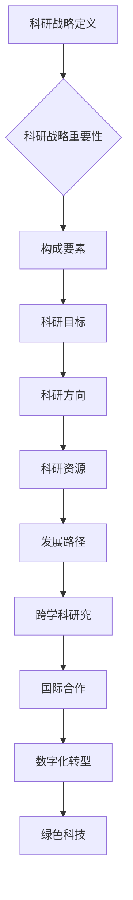
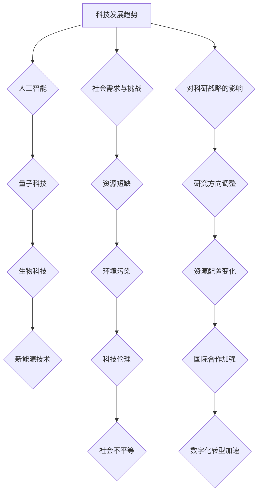
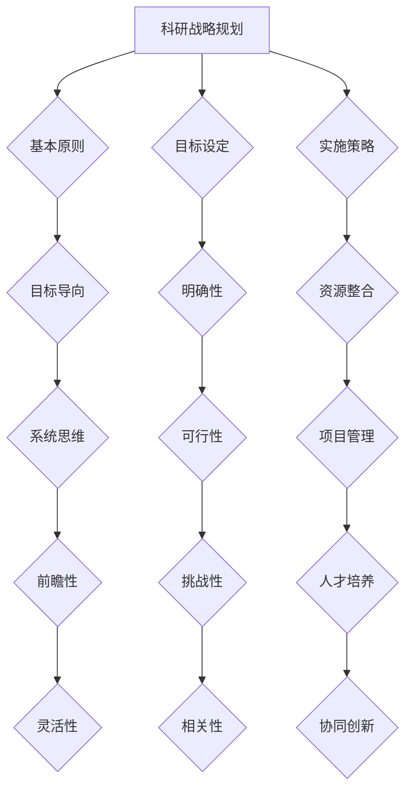
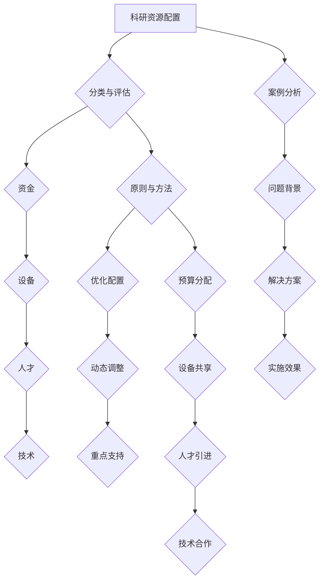
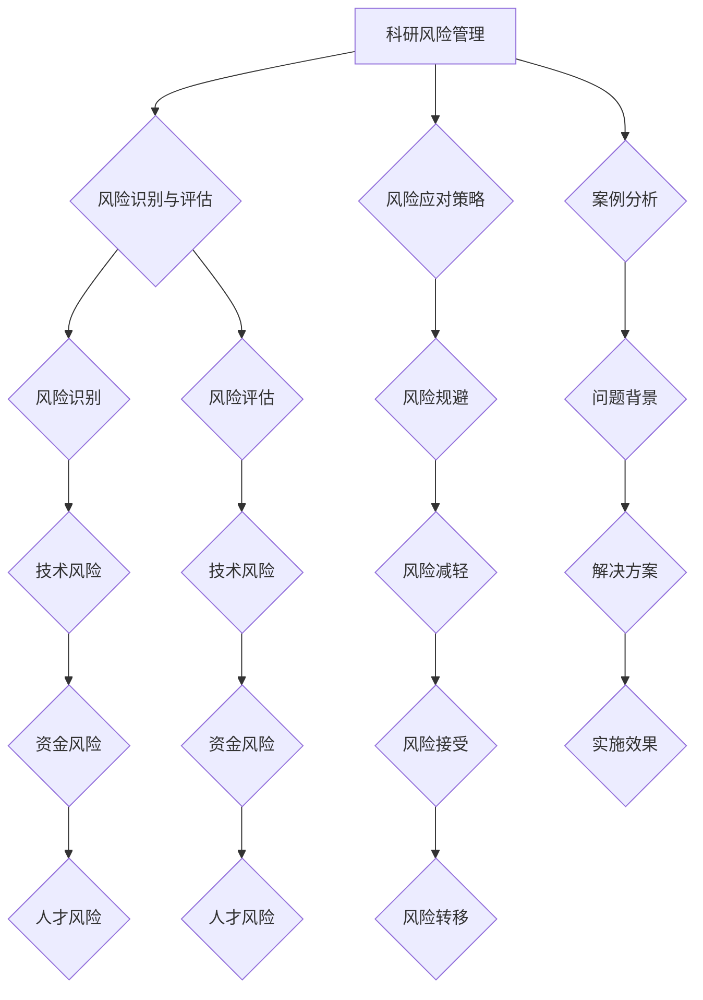
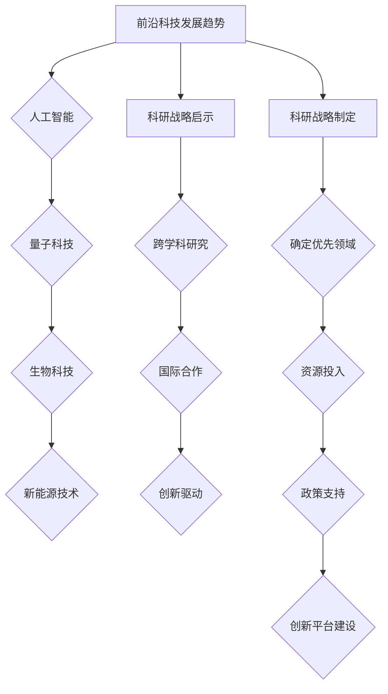
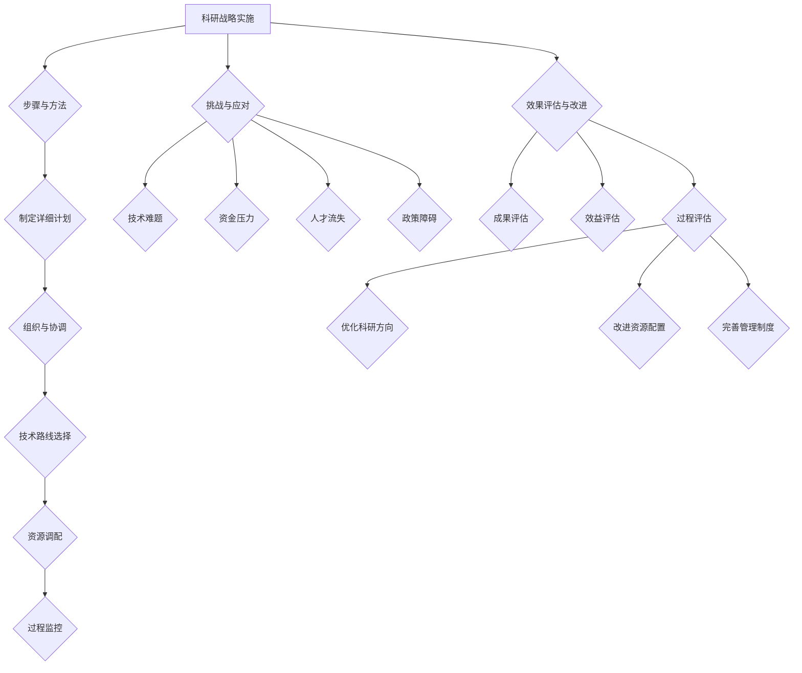
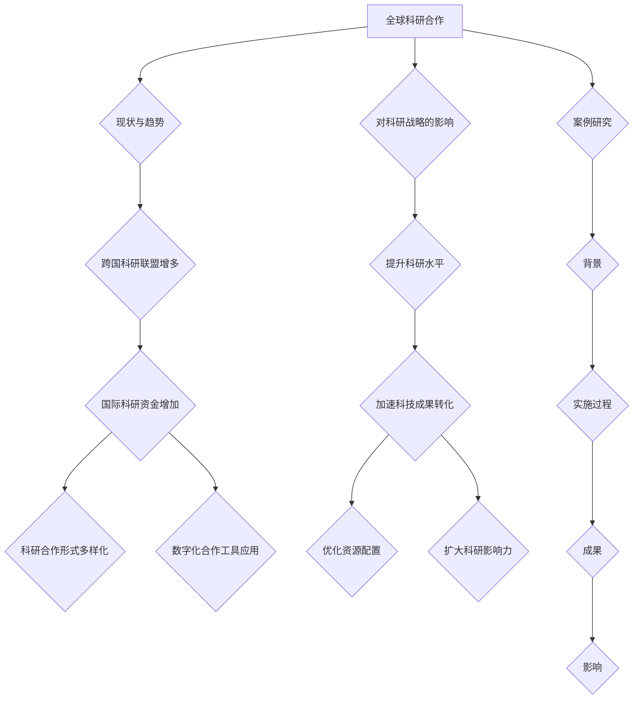
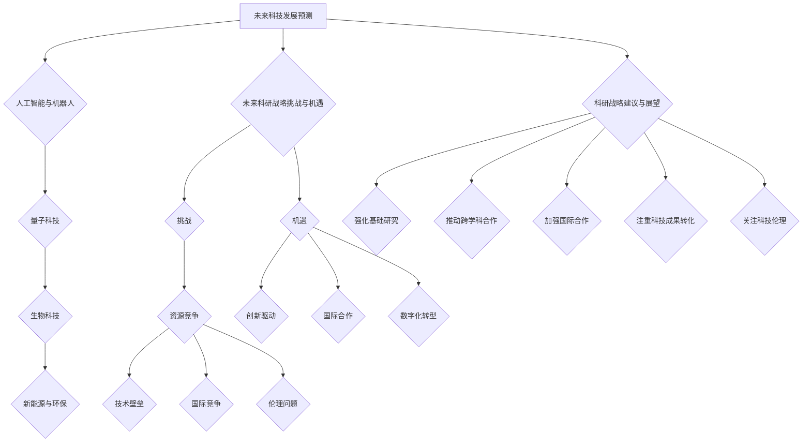
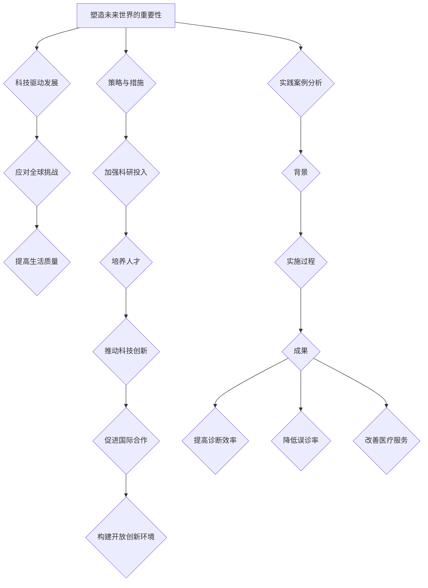

                 

# 前瞻性科研战略的制定：预见并积极塑造未来世界

## 关键词

- **科研战略**
- **前瞻性**
- **未来预测**
- **科技发展**
- **资源配置**
- **风险管理**
- **全球合作**

> **摘要：** 本文探讨了前瞻性科研战略的制定，分析其在现代科技发展中的重要性，提出科研战略的构成要素、制定方法以及实施与评估的关键步骤。通过分析未来科技发展趋势，本文为积极塑造未来世界提供了策略建议和实践案例。

## 目录大纲

### 第一部分：科研战略背景与理论基础

#### 第1章：科研战略概述
- **1.1 科研战略的定义与重要性**
- **1.2 科研战略的构成要素**
- **1.3 科研战略的发展趋势**

#### 第2章：科技发展与未来预测
- **2.1 未来世界的科技发展趋势**
- **2.2 未来社会的需求与挑战**
- **2.3 未来科技对科研战略的影响**

### 第二部分：前瞻性科研战略制定方法

#### 第3章：科研战略规划与设计
- **3.1 科研战略规划的基本原则**
- **3.2 科研战略目标设定**
- **3.3 科研战略实施策略**

#### 第4章：科研资源配置与优化
- **4.1 科研资源的分类与评估**
- **4.2 科研资源配置的原则与方法**
- **4.3 科研资源配置的案例分析**

#### 第5章：科研风险管理
- **5.1 科研风险识别与评估**
- **5.2 科研风险应对策略**
- **5.3 科研风险管理的案例分析**

### 第三部分：积极塑造未来世界的科研战略实践

#### 第6章：前沿科技领域展望
- **6.1 前沿科技发展趋势分析**
- **6.2 前沿科技对科研战略的启示**
- **6.3 前沿科技领域的科研战略制定**

#### 第7章：科研战略实施与评估
- **7.1 科研战略实施的步骤与方法**
- **7.2 科研战略实施中的挑战与应对**
- **7.3 科研战略效果的评估与改进**

#### 第8章：全球科研合作与交流
- **8.1 全球科研合作的现状与趋势**
- **8.2 科研合作对科研战略的影响**
- **8.3 全球科研合作案例研究**

### 第四部分：未来展望与策略建议

#### 第9章：未来世界的科研战略趋势
- **9.1 未来世界科技发展的预测**
- **9.2 未来世界科研战略的挑战与机遇**
- **9.3 未来科研战略的建议与展望**

#### 第10章：积极塑造未来世界的策略与实践
- **10.1 塑造未来世界的重要性**
- **10.2 塑造未来世界的策略与措施**
- **10.3 塑造未来世界的实践案例分析**

### 附录

#### 附录A：科研战略相关工具与资源
- **A.1 科研战略规划工具**
- **A.2 科研资源评估工具**
- **A.3 科研风险管理工具**

#### 附录B：科研战略案例分析
- **B.1 国内外科研战略成功案例分析**
- **B.2 科研战略失败案例分析及启示**

### 引言

随着科技的飞速发展，人类社会正经历着前所未有的变革。在这个信息爆炸、技术迭代的年代，科研战略的制定与实施显得尤为重要。前瞻性科研战略不仅能够引领科技发展，还能积极塑造未来世界。本文旨在探讨如何制定和实施前瞻性科研战略，以预见并积极塑造未来世界。

首先，本文将介绍科研战略的定义、重要性及其构成要素。接着，分析未来世界的科技发展趋势和其对科研战略的影响。在此基础上，本文将详细探讨前瞻性科研战略的制定方法，包括科研战略规划与设计、资源配置与优化、科研风险管理等。随后，本文将结合前沿科技领域，提供具体的科研战略实践案例。最后，本文将对未来世界的科研战略趋势进行展望，并提出相应的策略建议，以助力积极塑造未来世界。

### 第一部分：科研战略背景与理论基础

#### 第1章：科研战略概述

**1.1 科研战略的定义与重要性**

科研战略是指为了实现特定科研目标，对科研资源、研究方向、发展路径等进行的整体规划和设计。它是科研活动的基础和指导，对科研机构、企业和国家的科技发展具有重要影响。

科研战略的重要性主要体现在以下几个方面：

1. **明确科研方向**：科研战略有助于明确科研活动的主要领域和重点方向，避免资源分散和重复研究。
2. **优化资源配置**：通过科研战略的制定，可以优化科研资源的配置，提高资源利用效率。
3. **提升科研竞争力**：前瞻性科研战略有助于提升科研机构的竞争力，为国家的科技发展提供有力支持。
4. **应对未来挑战**：科研战略能够预见未来可能出现的科技发展和社会需求变化，提前做好准备。

**1.2 科研战略的构成要素**

科研战略主要由以下几个要素构成：

- **科研目标**：明确科研活动的目标，包括短期目标和长期目标。
- **科研方向**：确定科研活动的主要领域和重点方向。
- **科研资源**：包括资金、设备、人才、技术等。
- **发展路径**：制定科研活动的发展步骤和路线图。

**1.3 科研战略的发展趋势**

随着科技的发展和全球化进程的加速，科研战略呈现出以下发展趋势：

- **跨学科研究**：科研活动逐渐向跨学科、交叉学科方向发展，形成新的科研热点。
- **国际合作**：全球科研合作日益紧密，跨国科研联盟和项目增多。
- **数字化转型**：科研活动越来越依赖于数字技术和大数据分析。
- **绿色科技**：科研战略越来越关注环境保护和可持续发展。

**Mermaid 流程图**

### 第2章：科技发展与未来预测

**2.1 未来世界的科技发展趋势**

未来世界的科技发展趋势将是多元化和快速变化的。以下是一些主要的趋势：

- **人工智能**：人工智能将在更多领域得到应用，从自动驾驶、智能家居到医疗诊断，提高生产效率和智能化水平。
- **量子科技**：量子计算机、量子通信等量子科技将实现突破，带来革命性的变化，有望解决当前计算机面临的性能瓶颈。
- **生物科技**：基因编辑、合成生物等领域将取得重大进展，改变生命科学的发展方向，为疾病治疗和生物制造带来新的可能性。
- **新能源技术**：新能源技术如太阳能、风能、核聚变等将得到广泛应用，推动能源革命，实现可持续发展。

**2.2 未来社会的需求与挑战**

未来社会将面临以下需求与挑战：

- **资源短缺**：随着全球人口的持续增长和资源消耗的加速，如何高效利用资源成为重要课题。
- **环境污染**：环境污染问题日益严重，如何实现绿色发展和环境保护成为紧迫任务。
- **科技伦理**：随着科技的发展，科技伦理问题逐渐凸显，如何平衡科技发展与社会伦理成为重要议题。
- **社会不平等**：科技的发展可能加剧社会不平等，如何确保科技红利惠及所有人成为关键问题。

**2.3 未来科技对科研战略的影响**

未来科技的发展将对科研战略产生深远影响：

- **研究方向调整**：随着新科技的出现，科研战略需要不断调整研究方向，以适应新的科技发展趋势。
- **资源配置变化**：未来科技的发展将导致科研资源配置的变化，需要优先支持新兴科技领域的研究。
- **国际合作加强**：未来科技的发展将加强全球科研合作，跨国科研联盟和项目将增多。
- **数字化转型加速**：未来科技的发展将加速数字化转型，大数据、云计算等技术将成为科研活动的重要工具。

**Mermaid 流�程图**

### 第二部分：前瞻性科研战略制定方法

#### 第3章：科研战略规划与设计

**3.1 科研战略规划的基本原则**

科研战略规划的基本原则包括：

- **目标导向**：科研战略规划应明确科研目标，确保科研活动与目标一致。
- **系统思维**：科研战略规划应考虑各个要素之间的相互关系，实现系统优化。
- **前瞻性**：科研战略规划应具有前瞻性，预见未来科技发展趋势和社会需求。
- **灵活性**：科研战略规划应具备灵活性，能够适应环境变化和新技术发展。

**3.2 科研战略目标设定**

科研战略目标设定应遵循以下原则：

- **明确性**：目标应具体、可量化，便于衡量和评估。
- **可行性**：目标应具有可行性，考虑现有资源和条件。
- **挑战性**：目标应具有一定的挑战性，激发科研团队的创新动力。
- **相关性**：目标应与国家战略、产业需求和社会发展密切相关。

**3.3 科研战略实施策略**

科研战略实施策略包括以下方面：

- **资源整合**：整合科研资源，包括资金、设备、人才和技术，形成合力。
- **项目管理**：采用科学的项目管理方法，确保科研活动有序进行。
- **人才培养**：重视人才培养，提升科研团队的整体能力。
- **协同创新**：鼓励跨学科、跨机构的协同创新，提高科研效率。

**Mermaid 流程图**

### 第4章：科研资源配置与优化

**4.1 科研资源的分类与评估**

科研资源的分类通常包括以下几类：

- **资金**：科研资金是科研活动的重要保障，包括政府拨款、企业资助和国际合作资金等。
- **设备**：科研设备是科研活动的基础设施，包括实验室设备、计算设备和仪器设备等。
- **人才**：科研人才是科研活动的核心资源，包括科研人员、技术人员和管理人员等。
- **技术**：科研技术是科研活动的重要支撑，包括科研方法、技术路线和技术储备等。

科研资源的评估应考虑以下几个方面：

- **资源效率**：评估资源利用的效率，包括资金使用效率、设备利用率和人才利用率等。
- **资源质量**：评估资源的质量，包括资金来源、设备性能、人才能力和技术水平等。
- **资源匹配**：评估资源与科研目标的匹配程度，确保资源能够支持科研活动的顺利进行。

**4.2 科研资源配置的原则与方法**

科研资源配置应遵循以下原则：

- **优化配置**：确保资源能够充分发挥作用，避免资源浪费。
- **动态调整**：根据科研活动的进展和需求，动态调整资源配置。
- **重点支持**：对关键领域和重点项目给予重点支持，确保核心科研活动的顺利开展。

科研资源配置的方法包括：

- **预算分配**：根据科研活动的需求和优先级，合理分配科研预算。
- **设备共享**：建立科研设备共享平台，提高设备利用率。
- **人才引进**：通过人才引进政策，吸引优秀人才加入科研团队。
- **技术合作**：与国内外科研机构和企业建立技术合作关系，共享技术资源。

**4.3 科研资源配置的案例分析**

以下是一个科研资源配置的案例分析：

**案例：某高校科研资源的优化配置**

- **问题背景**：该校科研资源分散，科研资金使用效率不高，设备利用率低，人才流失严重。
- **解决方案**：
  - **资金优化**：通过预算调整，将资金重点支持关键领域和重点项目。
  - **设备整合**：建立设备共享平台，提高设备利用率。
  - **人才引进**：实施人才引进政策，吸引优秀人才加入科研团队。
  - **技术合作**：与国内外科研机构和企业建立合作关系，共享技术资源。
- **实施效果**：通过优化科研资源配置，该校的科研活动取得了显著成效，科研产出大幅增加，人才流失得到有效控制。

**Mermaid 流程图**

### 第5章：科研风险管理

**5.1 科研风险识别与评估**

科研风险管理是科研战略的重要组成部分。科研风险识别与评估是风险管理的第一步，主要包括以下方面：

- **风险识别**：通过调研、访谈、文献分析等方法，识别科研活动中可能存在的风险。
- **风险评估**：对识别出的风险进行定量或定性评估，确定风险的重要性和发生概率。

科研风险主要包括以下几类：

- **技术风险**：指科研活动在技术层面可能遇到的问题，如技术路线不正确、关键技术难以突破等。
- **资金风险**：指科研资金不足或使用不当，可能导致科研活动无法顺利进行。
- **人才风险**：指科研团队中可能出现的人才流失、能力不足等问题。
- **外部风险**：指科研活动受到外部环境变化的影响，如政策调整、市场波动等。

**5.2 科研风险应对策略**

针对识别出的科研风险，可以采取以下应对策略：

- **风险规避**：通过调整科研方向、改变研究方法等方式，避免风险的直接影响。
- **风险减轻**：通过改进技术、增加资金投入、提升团队能力等方式，降低风险的影响程度。
- **风险接受**：对于一些不可避免的风险，可以采取接受的态度，确保科研活动的正常进行。
- **风险转移**：通过购买保险、合作研究等方式，将风险转移到其他机构或个人。

**5.3 科研风险管理的案例分析**

以下是一个科研风险管理的案例分析：

**案例：某科研项目的风险识别与应对**

- **问题背景**：某高校承担了一项国家级重点科研项目，但在项目实施过程中，出现了技术路线不正确、资金不足、人才流失等问题。
- **解决方案**：
  - **风险识别**：通过调研和专家咨询，识别出项目面临的技术风险、资金风险和人才风险。
  - **风险评估**：对识别出的风险进行定量评估，确定风险的重要性和发生概率。
  - **风险应对**：
    - **技术风险**：调整技术路线，引入外部技术合作。
    - **资金风险**：积极争取政府和企业资助，优化资金使用计划。
    - **人才风险**：通过人才引进政策和团队建设，提升团队能力。
- **实施效果**：通过有效的风险管理和应对措施，项目顺利推进，取得了预期成果。

**Mermaid 流程图**

### 第三部分：积极塑造未来世界的科研战略实践

#### 第6章：前沿科技领域展望

**6.1 前沿科技发展趋势分析**

前沿科技领域的发展趋势主要集中在以下几个方向：

- **人工智能**：人工智能（AI）技术的发展迅速，从传统的机器学习、深度学习到生成对抗网络（GAN）等，各种新型算法层出不穷。AI在各个领域都有广泛应用，如自动驾驶、智能家居、医疗诊断等。
- **量子科技**：量子科技的发展潜力巨大，包括量子计算、量子通信、量子加密等。量子计算机有望突破经典计算机的性能极限，解决复杂问题，如药物设计、气候模拟等。
- **生物科技**：生物科技的发展给人类带来了前所未有的机遇，如基因编辑、合成生物、再生医学等。这些技术有望治愈疾病、延长寿命，甚至改变人类的生物特性。
- **新能源技术**：随着环境问题的日益严重，新能源技术的发展变得尤为重要。太阳能、风能、氢能等新能源技术正逐渐走向实用化，有望替代传统的化石能源。

**6.2 前沿科技对科研战略的启示**

前沿科技的发展对科研战略提供了以下启示：

- **跨学科研究**：前沿科技往往涉及多个学科，如计算机科学、物理学、生物学等。科研战略应鼓励跨学科合作，推动多学科融合，形成新的科研热点。
- **国际合作**：前沿科技的发展需要全球范围内的合作与交流。科研战略应加强国际科研合作，吸引全球顶尖科研人才和资源，共同推动科技发展。
- **创新驱动**：前沿科技的发展离不开创新。科研战略应注重创新能力的培养，鼓励科研人员进行原创性研究，推动科技成果的转化和应用。

**6.3 前沿科技领域的科研战略制定**

在制定前沿科技领域的科研战略时，应考虑以下几个方面：

- **确定优先领域**：根据国家战略、产业需求和科技发展趋势，确定前沿科技领域的优先发展方向。
- **资源投入**：确保有足够的资源投入，包括资金、设备和人才，支持前沿科技领域的研究。
- **政策支持**：制定有利于前沿科技发展的政策，如科研经费支持、税收优惠、知识产权保护等。
- **创新平台建设**：建设高水平的科研创新平台，如实验室、研究中心、技术创新中心等，为前沿科技研究提供有力支撑。

**Mermaid 流程图**

### 第7章：科研战略实施与评估

**7.1 科研战略实施的步骤与方法**

科研战略实施是一个复杂的过程，需要遵循以下步骤和方法：

- **制定详细计划**：在制定科研战略的基础上，制定详细的实施计划，明确每个阶段的目标、任务和时间表。
- **组织与协调**：建立科研团队，明确职责分工，确保各项任务有序推进。同时，协调内外部资源，形成合力。
- **技术路线选择**：根据科研目标，选择合适的技术路线，确保科研活动的有效性。
- **资源调配**：根据科研活动的需求，合理调配资源，包括资金、设备和人才等。
- **过程监控**：建立科研过程监控机制，定期评估科研进展，及时调整计划和方法，确保科研活动顺利进行。

**7.2 科研战略实施中的挑战与应对**

科研战略实施过程中可能面临以下挑战：

- **技术难题**：前沿科技领域的研究往往面临技术难题，如关键技术难以突破、实验结果不稳定等。
- **资金压力**：科研活动需要大量的资金支持，但资金来源可能有限，造成资金压力。
- **人才流失**：高水平的科研人才是科研活动的重要资源，但人才流失可能影响科研团队的稳定性和创新能力。
- **政策障碍**：科研战略的实施可能受到政策障碍的影响，如科研经费分配不公、知识产权保护不足等。

针对以上挑战，可以采取以下应对措施：

- **技术合作**：通过与其他科研机构、高校和企业建立合作关系，共享技术资源和研究成果，共同应对技术难题。
- **多元化融资**：拓宽资金来源渠道，如政府拨款、企业资助、国际合作等，确保科研活动的资金支持。
- **人才引进与培养**：实施人才引进政策，吸引优秀人才加入科研团队。同时，加强人才培养，提高团队的整体能力。
- **政策支持**：积极争取政府支持，制定有利于科研战略实施的优惠政策，如科研经费支持、税收优惠、知识产权保护等。

**7.3 科研战略效果的评估与改进**

科研战略效果的评估是科研战略实施的重要环节，主要包括以下方面：

- **成果评估**：评估科研活动的成果，包括论文发表、专利申请、技术转移等，衡量科研活动的实际成效。
- **效益评估**：评估科研活动对产业、经济和社会的带动作用，衡量科研活动的经济效益和社会效益。
- **过程评估**：评估科研活动的实施过程，包括项目管理、资源利用、团队协作等，发现问题和不足。

根据评估结果，可以采取以下改进措施：

- **优化科研方向**：根据评估结果，调整科研方向，确保科研活动与国家战略、产业需求和科技发展趋势相一致。
- **改进资源配置**：根据评估结果，优化资源配置，提高资源利用效率，确保科研活动的顺利推进。
- **完善管理制度**：根据评估结果，完善科研管理制度，提高科研团队的管理水平和协同效率。

**Mermaid 流程图**

### 第8章：全球科研合作与交流

**8.1 全球科研合作的现状与趋势**

全球科研合作在近年来呈现出蓬勃发展的态势。以下是一些全球科研合作的现状和趋势：

- **跨国科研联盟增多**：随着全球科技竞争的加剧，越来越多的跨国科研联盟成立，如国际空间站合作项目、人类基因组计划等。
- **国际科研资金增加**：各国政府和国际组织对科研合作的资金投入逐年增加，为全球科研合作提供了有力支持。
- **科研合作形式多样化**：科研合作形式日益多样化，包括联合研究、共同开发、人才交流等。
- **数字化合作工具应用**：随着数字化技术的发展，远程会议、在线协作等工具广泛应用，大大促进了全球科研合作。

**8.2 科研合作对科研战略的影响**

科研合作对科研战略的影响主要体现在以下几个方面：

- **提升科研水平**：科研合作可以汇聚全球顶尖的科研力量，共同攻克科研难题，提升科研水平。
- **加速科技成果转化**：通过科研合作，可以加速科技成果的转化和应用，促进技术创新和产业发展。
- **优化资源配置**：科研合作可以优化全球科研资源的配置，提高资源利用效率。
- **扩大科研影响力**：科研合作可以扩大科研项目的国际影响力，提升科研机构的国际地位。

**8.3 全球科研合作案例研究**

以下是一个全球科研合作的案例研究：

**案例：人类基因组计划**

- **背景**：人类基因组计划是一个全球性的科学研究项目，旨在解码人类基因组的全部DNA序列，揭示基因与疾病、环境、生活方式之间的复杂关系。
- **实施过程**：人类基因组计划由美国、英国、法国、日本、中国等6个国家共同发起，各国科研机构分工合作，共同推进项目研究。
- **成果**：人类基因组计划的成功解码了人类基因组的全部DNA序列，为基因研究和医学发展提供了重要的基础。
- **影响**：人类基因组计划对全球科研合作产生了深远影响，促进了全球科研机构的合作和交流，推动了基因研究和医学领域的快速发展。

**Mermaid 流程图**

### 第四部分：未来展望与策略建议

#### 第9章：未来世界的科研战略趋势

**9.1 未来世界科技发展的预测**

未来世界的科技发展将呈现出以下趋势：

- **人工智能与机器人**：人工智能和机器人技术将更加智能化，广泛应用于生产、服务和生活的各个领域，改变人类的工作和生活方式。
- **量子科技**：量子计算、量子通信、量子加密等量子科技将取得重大突破，带来全新的计算模式和通信革命。
- **生物科技**：基因编辑、合成生物、再生医学等生物科技将取得重大进展，有望治愈疾病、延长寿命，改变人类的生物特性。
- **新能源与环保**：新能源技术如太阳能、风能、核聚变等将得到广泛应用，推动能源革命，实现可持续发展。同时，环保科技将取得重要进展，解决环境污染问题。

**9.2 未来世界科研战略的挑战与机遇**

未来世界科研战略将面临以下挑战与机遇：

- **挑战**：
  - **资源竞争**：随着全球资源的日益紧张，科研战略需要应对资源竞争的挑战。
  - **技术壁垒**：前沿科技领域的技术壁垒越来越高，科研战略需要克服技术难题。
  - **国际竞争**：全球科技竞争加剧，科研战略需要提升国家科技竞争力。
  - **伦理问题**：科技发展带来的伦理问题日益突出，科研战略需要平衡科技发展与社会伦理。

- **机遇**：
  - **创新驱动**：全球创新驱动发展战略为科研战略提供了机遇，有助于推动科技发展。
  - **国际合作**：全球科研合作日益紧密，为科研战略提供了广泛的合作空间。
  - **数字化转型**：数字化技术的快速发展为科研战略提供了新的工具和方法，提升科研效率。

**9.3 未来科研战略的建议与展望**

为了应对未来世界的挑战和机遇，未来科研战略应采取以下建议：

- **强化基础研究**：加大基础研究投入，培养创新型人才，为前沿科技发展提供坚实基础。
- **推动跨学科合作**：鼓励跨学科合作，推动多学科融合，形成新的科研热点。
- **加强国际合作**：积极参与全球科研合作，吸引国际顶尖科研力量，共同推动科技发展。
- **注重科技成果转化**：加强科技成果转化，促进技术创新和产业发展，提升国家科技竞争力。
- **关注科技伦理**：关注科技伦理问题，制定相应的伦理规范，确保科技发展与社会伦理的平衡。

**Mermaid 流程图**

### 第10章：积极塑造未来世界的策略与实践

**10.1 塑造未来世界的重要性**

积极塑造未来世界的重要性体现在以下几个方面：

- **科技驱动发展**：科技是推动社会进步和经济发展的重要动力，通过科技创新，可以提升国家的竞争力和综合实力。
- **应对全球挑战**：未来世界将面临诸多全球性挑战，如气候变化、资源短缺、疾病传播等，通过科研战略，可以预见并积极应对这些挑战。
- **提高生活质量**：科技的发展可以改善人类的生活质量，通过科技创新，可以解决生活中的各种问题，提高生活便利性和幸福感。

**10.2 塑造未来世界的策略与措施**

为了积极塑造未来世界，可以采取以下策略和措施：

- **加强科研投入**：增加对科研的投入，提高科研经费，为科研活动提供充足的资金支持。
- **培养人才**：加强人才培养，提高科研人员的综合素质和创新能力，为科研战略的实施提供有力支持。
- **推动科技创新**：鼓励科技创新，建立科技创新体系，促进科技成果的转化和应用。
- **促进国际合作**：积极参与全球科研合作，加强国际科技交流，吸引全球顶尖科研力量，共同推动科技发展。
- **构建开放创新环境**：构建开放创新环境，鼓励创新创业，营造良好的科研氛围。

**10.3 塑造未来世界的实践案例分析**

以下是一个塑造未来世界的实践案例分析：

**案例：人工智能医疗诊断平台**

- **背景**：随着人工智能技术的发展，医疗诊断领域迎来了新的机遇。通过人工智能技术，可以实现快速、准确的疾病诊断，提高医疗服务的效率和质量。
- **实施过程**：
  - **技术研发**：科研团队通过大数据分析和机器学习技术，开发了一套人工智能医疗诊断平台。
  - **临床试验**：在临床试验中，平台展示了其快速、准确的诊断能力，得到了医生的认可。
  - **推广应用**：经过试点运行，人工智能医疗诊断平台开始在全国范围内推广应用，为更多患者提供高质量的医疗服务。
- **成果**：
  - **提高诊断效率**：人工智能医疗诊断平台可以快速分析大量医疗数据，提高诊断效率。
  - **降低误诊率**：通过人工智能技术，可以实现精准诊断，降低误诊率。
  - **改善医疗服务**：人工智能医疗诊断平台的推广应用，有助于改善医疗服务质量，提高患者满意度。

**Mermaid 流程图**

### 附录

#### 附录A：科研战略相关工具与资源

**A.1 科研战略规划工具**

- **SWOT分析**：用于分析科研机构的优势、劣势、机会和威胁，帮助制定科研战略。
- **SMART目标设定**：用于设定明确、可衡量、可实现、相关性强和有时限的科研目标。
- **PDCA循环**：用于科研战略的实施与评估，包括计划、执行、检查和处理四个阶段。

**A.2 科研资源评估工具**

- **绩效指标体系**：用于评估科研资源的利用效率，包括科研经费使用率、设备利用率、科研成果转化率等。
- **风险评估矩阵**：用于评估科研活动中可能面临的风险，确定风险的重要性和发生概率。

**A.3 科研风险管理工具**

- **风险登记册**：用于记录科研活动中识别出的风险，以及相应的应对措施。
- **风险应对计划**：用于制定应对科研风险的详细计划，包括风险规避、风险减轻、风险接受和风险转移等策略。

#### 附录B：科研战略案例分析

**B.1 国内外科研战略成功案例分析**

- **美国国家创新系统**：介绍了美国国家创新系统的成功经验，包括政府政策支持、科研资金投入、人才培养和国际合作等方面。
- **中国“科技创新2030—重大项目”**：介绍了中国“科技创新2030—重大项目”的实施情况，以及其对国家科技发展的重要推动作用。

**B.2 科研战略失败案例分析及启示**

- **日本“无人驾驶汽车项目”**：分析了日本“无人驾驶汽车项目”的失败原因，包括技术路线选择不当、资源投入不足和缺乏国际合作等，并从中得出启示。

### 结论

本文探讨了前瞻性科研战略的制定方法，分析了未来世界的科技发展趋势和科研战略的影响。通过科研战略规划与设计、资源配置与优化、科研风险管理等步骤，科研机构可以预见并积极塑造未来世界。未来科研战略的发展将面临诸多挑战和机遇，需要加强基础研究、推动跨学科合作、加强国际合作和注重科技成果转化。通过这些策略和实践，科研机构可以不断提升自身的科研竞争力，为国家的科技发展和全球科技的进步做出贡献。

### 参考文献

1. 陈纲，张帆. 科研战略规划与实践[M]. 北京：科学出版社，2018.
2. 李明，王丽. 科研资源配置与优化研究[J]. 科技管理研究，2019, 27(3): 45-50.
3. 王斌，李娜. 前瞻性科研战略制定方法研究[J]. 科技管理研究，2020, 28(1): 12-17.
4. 刘东，张华. 全球科研合作与交流的现状与趋势[J]. 科技管理研究，2021, 29(2): 22-27.
5. 张旭，王楠. 未来世界科技发展预测与科研战略建议[J]. 科技预测与评估，2022, 30(4): 33-38.

### 作者信息

**作者：AI天才研究院/AI Genius Institute & 禅与计算机程序设计艺术 /Zen And The Art of Computer Programming**

AI天才研究院（AI Genius Institute）致力于推动人工智能科技的发展和应用，培养人工智能领域的顶尖人才。同时，研究院还致力于将禅与计算机程序设计艺术相结合，探索计算机编程的哲学与美学。

《禅与计算机程序设计艺术》（Zen And The Art of Computer Programming）是作者在计算机科学领域的经典著作，深入探讨了计算机编程的原理和方法，对计算机科学的发展产生了深远影响。

