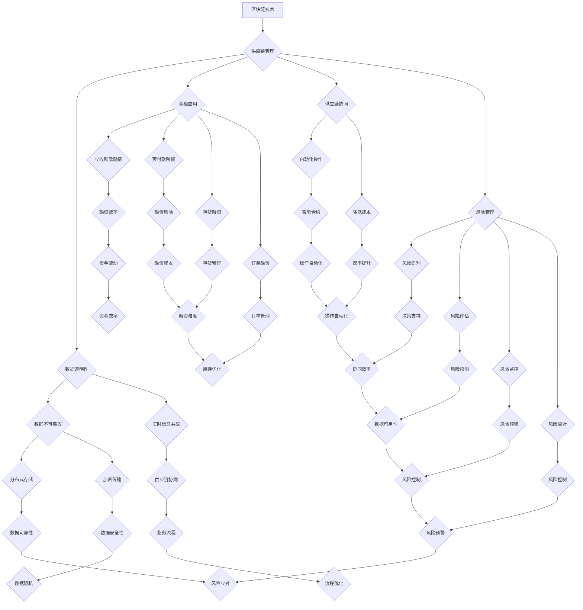

                 

### 第1章：区块链技术概述

#### 1.1 区块链的基本概念

区块链是一种分布式数据库技术，其核心特点是通过去中心化的方式实现数据的记录、存储和传输。每个区块包含一定数量的交易记录，这些区块按照时间顺序连接形成链状结构。区块链技术的主要组成部分包括：

- **节点**：区块链网络中的每个参与者都是一个节点，它们负责维护区块链的完整性和一致性。
- **区块**：区块是区块链的基本单位，包含一定数量的交易记录以及一个时间戳、区块头等信息。
- **链**：多个区块按照时间顺序连接形成的链状结构。

区块链技术具有以下核心特点：

- **去中心化**：区块链网络中的节点平等参与，没有任何一个中心化的机构来控制整个网络。
- **不可篡改**：区块链上的数据一旦被记录，就难以被篡改，保证了数据的安全性和可靠性。
- **透明性**：区块链上的所有数据都是公开透明的，每个节点都可以访问和查看。
- **自治性**：区块链网络通过共识算法实现自我管理和自我维护，不需要中心化的管理机构。

#### 1.2 区块链的工作原理

区块链的工作原理可以分为以下几步：

1. **交易生成**：参与者（节点）在区块链网络中生成交易。
2. **交易广播**：生成的交易被广播到网络中的其他节点。
3. **区块生成**：网络中的节点将接收到的交易汇总，生成一个新的区块。
4. **区块验证**：生成的区块需要通过共识算法进行验证，确保区块中的交易合法且没有被篡改。
5. **区块添加**：验证通过的区块被添加到区块链上，成为区块链的一部分。
6. **数据同步**：新的区块被添加到区块链后，其他节点需要下载并同步新数据。

#### 1.3 区块链在供应链管理中的应用背景

供应链管理是指通过计划、组织、协调、控制和优化等活动，实现从原材料采购到产品交付的全过程。然而，传统供应链管理面临着以下挑战：

- **信息不对称**：供应链各环节之间的信息不对称，导致供应链整体效率低下。
- **数据篡改风险**：供应链中的数据容易被篡改，影响供应链的透明性和可靠性。
- **协作困难**：供应链各环节之间的协作困难，增加了供应链的整体成本。
- **风险传递**：供应链中的风险难以有效传递，导致风险集中和风险放大。

区块链技术在供应链管理中的应用背景正是为了解决这些问题。区块链技术的去中心化、不可篡改、透明性和自治性等特点，使得它成为提升供应链管理效率、降低成本、提高透明度和可靠性的理想工具。

## 第2章：供应链管理概述

### 2.1 供应链管理的定义与核心环节

供应链管理是指通过计划、组织、协调、控制和优化等活动，实现从原材料采购到产品交付的全过程。供应链管理的核心环节包括：

- **采购**：采购是供应链管理的起点，涉及原材料的采购、供应商的选择和采购策略的制定。
- **生产**：生产是将原材料转化为成品的环节，包括生产计划、生产调度、生产质量控制等。
- **仓储**：仓储是供应链管理中的关键环节，涉及仓库布局、库存管理、物流配送等。
- **配送**：配送是将成品从仓库运送到终端用户的环节，包括运输计划、运输路线、运输调度等。
- **信息流**：信息流是供应链管理中的重要环节，涉及供应链各环节之间的信息共享、协调和沟通。

### 2.2 供应链管理面临的挑战

供应链管理面临着多种挑战，主要包括：

- **信息不对称**：供应链各环节之间的信息不对称，导致供应链整体效率低下。例如，供应商无法及时了解客户需求，导致库存过剩或不足。
- **数据篡改风险**：供应链中的数据容易被篡改，影响供应链的透明性和可靠性。例如，某些环节可能篡改运输记录，导致供应链管理失控。
- **协作困难**：供应链各环节之间的协作困难，增加了供应链的整体成本。例如，各环节之间的沟通不畅，导致资源浪费和效率低下。
- **风险传递**：供应链中的风险难以有效传递，导致风险集中和风险放大。例如，自然灾害、社会动荡等风险可能在供应链中传递，导致整个供应链瘫痪。

### 2.3 区块链在供应链管理中的应用潜力

区块链技术在供应链管理中的应用潜力主要体现在以下几个方面：

- **提升供应链透明性**：区块链技术的去中心化和不可篡改性，可以确保供应链各环节的数据透明性和可靠性，提高供应链的整体透明度。
- **降低信息不对称**：区块链技术可以实现供应链各环节之间的实时信息共享，减少信息不对称，提高供应链的整体效率。
- **提高数据安全性**：区块链技术的加密和分布式存储，可以确保供应链中的数据安全，防止数据篡改和泄露。
- **降低成本**：区块链技术可以实现自动化和智能合约，减少人工干预和中介成本，提高供应链的整体效率。
- **促进协作**：区块链技术可以实现供应链各环节之间的有效协作，降低协作成本，提高供应链的整体竞争力。

## 第3章：区块链与供应链透明性

### 3.1 供应链透明性的重要性

供应链透明性是指供应链各环节之间的信息透明、数据公开和业务流程透明。供应链透明性的重要性主要体现在以下几个方面：

- **提高供应链效率**：供应链透明性可以减少信息不对称，提高供应链各环节之间的协同效率，降低整体成本。
- **提升供应链可靠性**：供应链透明性可以确保供应链中的数据真实、可靠，降低风险，提高供应链的整体稳定性。
- **增强供应链竞争力**：供应链透明性可以提高供应链的整体竞争力，帮助企业更好地满足客户需求，提高市场份额。
- **促进可持续发展**：供应链透明性可以提高供应链的可持续发展水平，减少资源浪费，降低环境污染。

### 3.2 区块链如何提升供应链透明性

区块链技术在提升供应链透明性方面具有独特的优势，主要体现在以下几个方面：

- **去中心化**：区块链技术的去中心化特性，可以确保供应链各环节之间的信息透明，减少信息不对称。
- **不可篡改**：区块链技术的不可篡改特性，可以确保供应链中的数据真实、可靠，防止数据篡改和伪造。
- **透明性**：区块链技术的透明性，可以让供应链各环节之间的数据公开、可查，提高供应链的整体透明度。
- **分布式存储**：区块链技术的分布式存储特性，可以确保供应链中的数据分散存储，提高数据安全性。

### 3.3 实例分析：区块链在食品供应链中的应用

区块链技术在食品供应链中的应用，可以显著提升供应链的透明性。以下是一个典型的实例分析：

**案例背景**：某食品公司需要确保其产品的来源和加工过程透明，以增强消费者的信任。

**解决方案**：
1. **数据记录**：食品公司使用区块链技术记录其产品的生产、加工、运输等环节的数据，包括时间、地点、参与人员等。
2. **信息共享**：供应链各方（如供应商、加工厂、物流公司等）可以通过区块链网络实时共享数据，确保信息的透明和一致。
3. **验证查询**：消费者可以通过扫描产品包装上的二维码，访问区块链网络，查看产品的详细信息，包括产地、加工过程、运输路径等。

**效果分析**：
- **提升透明度**：通过区块链技术，食品供应链的各个环节信息都可以公开透明地记录和查询，提高了供应链的整体透明度。
- **增强信任**：消费者可以方便地了解产品的真实信息，增强了消费者对食品公司的信任。
- **降低风险**：区块链技术的不可篡改性，确保了供应链数据的真实性和可靠性，降低了数据篡改和伪造的风险。

## 第4章：区块链与供应链金融

### 4.1 供应链金融概述

供应链金融是指通过金融手段支持供应链上下游企业的融资需求，以提高供应链的整体效率。供应链金融的主要业务模式包括：

- **应收账款融资**：企业通过将应收账款转让给金融机构，获得融资。
- **预付款融资**：企业通过向金融机构提供预付款担保，获得融资。
- **存货融资**：企业通过将存货作为抵押，获得融资。
- **订单融资**：企业通过订单作为担保，获得融资。

### 4.2 区块链在供应链金融中的应用

区块链技术在供应链金融中的应用，可以显著提升融资效率、降低融资成本，并提高数据透明度和安全性。具体应用场景包括：

- **应收账款融资**：企业通过区块链技术记录应收账款信息，金融机构可以实时查询和验证，提高融资效率。
- **预付款融资**：企业通过区块链技术记录预付款信息，金融机构可以实时监控预付款使用情况，降低融资风险。
- **存货融资**：企业通过区块链技术记录存货信息，金融机构可以实时评估存货价值，提高融资额度。
- **订单融资**：企业通过区块链技术记录订单信息，金融机构可以实时监控订单执行情况，提高融资效率。

### 4.3 实例分析：区块链在贸易金融中的应用

以下是一个区块链在贸易金融中的应用实例：

**案例背景**：某贸易公司需要融资支持其进口业务。

**解决方案**：
1. **订单记录**：贸易公司通过区块链技术记录进口订单信息，包括订单金额、交货期限等。
2. **发票记录**：贸易公司通过区块链技术记录进口发票信息，确保发票真实性和完整性。
3. **融资申请**：贸易公司将订单和发票信息上传至区块链网络，金融机构可以实时查询和验证。
4. **融资审批**：金融机构通过区块链网络实时审批贸易公司的融资申请，提高审批速度。

**效果分析**：
- **提高融资效率**：区块链技术使得订单和发票信息透明、可查，金融机构可以快速审批融资申请，提高融资效率。
- **降低融资成本**：区块链技术减少了传统贸易金融中的中介环节，降低了融资成本。
- **降低风险**：区块链技术确保了订单和发票信息的真实性和完整性，降低了融资风险。

## 第5章：区块链与供应链协同

### 5.1 供应链协同的概念与重要性

供应链协同是指供应链上下游企业之间通过信息共享、资源整合、业务协调等手段，实现供应链整体最优化的过程。供应链协同的重要性主要体现在以下几个方面：

- **提高供应链效率**：供应链协同可以减少信息不对称，提高供应链各环节之间的协同效率，降低整体成本。
- **提升供应链可靠性**：供应链协同可以确保供应链中的信息透明、数据准确，提高供应链的整体可靠性。
- **增强供应链竞争力**：供应链协同可以整合供应链上下游企业的资源，提高供应链的整体竞争力。
- **促进供应链创新**：供应链协同可以促进供应链上下游企业之间的合作与创新，推动供应链的持续发展。

### 5.2 区块链如何实现供应链协同

区块链技术在实现供应链协同方面具有独特的优势，主要体现在以下几个方面：

- **去中心化**：区块链技术的去中心化特性，可以确保供应链协同中的信息透明、可查，减少信息不对称。
- **不可篡改**：区块链技术的不可篡改特性，可以确保供应链协同中的数据真实、可靠，防止数据篡改和伪造。
- **分布式存储**：区块链技术的分布式存储特性，可以确保供应链协同中的数据分散存储，提高数据安全性。
- **智能合约**：区块链技术的智能合约功能，可以实现供应链协同中的自动化和智能化，提高协同效率。

### 5.3 实例分析：区块链在供应链协同中的案例

以下是一个区块链在供应链协同中的案例：

**案例背景**：某供应链中的多个企业需要实现信息共享和业务协同。

**解决方案**：
1. **数据记录**：供应链中的各企业通过区块链技术记录各自的数据，包括订单信息、库存信息、运输信息等。
2. **信息共享**：供应链中的各企业可以通过区块链网络实时共享数据，确保信息的透明和一致。
3. **智能合约**：供应链中的各企业可以通过区块链网络的智能合约功能，实现自动化和智能化的业务协同。
4. **数据验证**：供应链中的各企业可以通过区块链网络验证数据的真实性和完整性，确保供应链协同的可靠性。

**效果分析**：
- **提高协同效率**：区块链技术实现了供应链各环节之间的实时信息共享和业务协同，提高了供应链的整体效率。
- **降低协同成本**：区块链技术减少了传统供应链协同中的中介环节，降低了协同成本。
- **提高数据可靠性**：区块链技术确保了供应链协同中的数据真实、可靠，提高了供应链的整体可靠性。

## 第6章：区块链与供应链风险管理

### 6.1 供应链风险管理的概念与挑战

供应链风险管理是指通过识别、评估、监控和应对供应链中的各种风险，以确保供应链的稳定运行和企业的业务连续性。供应链风险管理面临的挑战主要包括：

- **风险识别**：供应链中的风险种类繁多，如何全面识别和评估风险成为一大挑战。
- **风险评估**：风险评估需要准确评估各种风险的可能性和影响，但受限于数据质量和分析方法。
- **风险监控**：供应链风险具有动态性，如何实时监控和预警风险成为一大挑战。
- **风险应对**：风险应对措施需要快速、有效，但受限于资源和能力的限制。

### 6.2 区块链在供应链风险管理中的应用

区块链技术在供应链风险管理中的应用，可以显著提升风险管理的效率和准确性。具体应用包括：

- **风险识别**：区块链技术的分布式存储和不可篡改特性，可以确保供应链中的数据真实、可靠，有助于全面识别和评估风险。
- **风险评估**：区块链技术的智能合约功能，可以实现自动化的风险评估和预测，提高风险评估的准确性。
- **风险监控**：区块链技术的实时监控和预警功能，可以确保供应链中的风险实时监控和预警，提高风险管理的及时性。
- **风险应对**：区块链技术的智能合约功能，可以实现自动化的风险应对措施，提高风险应对的效率。

### 6.3 实例分析：区块链在供应链风险管理中的实践

以下是一个区块链在供应链风险管理中的实践实例：

**案例背景**：某供应链公司需要有效管理供应链风险，确保供应链的稳定运行。

**解决方案**：
1. **数据记录**：供应链公司通过区块链技术记录供应链中的各种数据，包括订单信息、库存信息、运输信息等。
2. **智能合约**：供应链公司通过区块链网络的智能合约功能，实现自动化的风险评估和风险预警。
3. **风险监控**：供应链公司通过区块链网络的实时监控和预警功能，实时监控供应链中的风险，及时采取措施。
4. **风险应对**：供应链公司通过区块链网络的智能合约功能，实现自动化的风险应对措施，提高风险应对的效率。

**效果分析**：
- **提高风险管理效率**：区块链技术实现了供应链风险的自动化识别、评估、监控和应对，提高了风险管理效率。
- **降低风险成本**：区块链技术确保了供应链数据的真实性和可靠性，降低了风险管理的成本。
- **提升供应链稳定性**：区块链技术确保了供应链中的数据透明、可靠，提高了供应链的整体稳定性。

### 第7章：区块链与智能合约在供应链中的应用

#### 7.1 智能合约的基本概念

智能合约是一种自动化执行合约条款的程序，它基于区块链技术，可以在无需第三方介入的情况下，自动执行预定义的合约条款。智能合约的基本概念包括：

- **合约条款**：智能合约的核心是合约条款，这些条款定义了交易双方的权益和义务。
- **触发条件**：智能合约在满足特定条件时自动执行，这些条件可以是时间、金额、事件等。
- **执行逻辑**：智能合约包含执行逻辑，用于描述如何根据合约条款执行操作。
- **去中心化执行**：智能合约在区块链网络中的多个节点上执行，确保执行过程去中心化、透明和不可篡改。

#### 7.2 智能合约在供应链管理中的应用

智能合约在供应链管理中的应用，可以显著提升供应链的效率、降低成本、提高透明度和可靠性。具体应用包括：

- **订单执行**：智能合约可以自动执行订单创建、确认、交付等流程，减少人为干预和错误。
- **支付结算**：智能合约可以自动化执行支付和结算流程，确保支付及时、准确。
- **库存管理**：智能合约可以自动化执行库存调整、库存预警等操作，提高库存管理效率。
- **物流跟踪**：智能合约可以自动化执行物流跟踪，确保物流过程透明、可追溯。

#### 7.3 实例分析：智能合约在供应链协同中的应用

以下是一个智能合约在供应链协同中的应用实例：

**案例背景**：某供应链中的多个企业需要实现自动化协同，提高供应链效率。

**解决方案**：
1. **智能合约设计**：供应链中的各企业共同设计智能合约，定义订单执行、支付结算、库存管理等流程。
2. **合约部署**：将智能合约部署到区块链网络中，各企业通过区块链网络调用智能合约。
3. **合约执行**：智能合约根据预定义的合约条款，自动执行订单、支付、库存管理等操作。
4. **结果验证**：各企业通过区块链网络验证智能合约执行结果，确保操作透明、可追溯。

**效果分析**：
- **提高协同效率**：智能合约实现了供应链各环节之间的自动化协同，减少了人为干预和错误，提高了供应链效率。
- **降低运营成本**：智能合约自动化执行供应链操作，降低了人工成本和运营费用。
- **提升数据透明度**：智能合约确保了供应链数据的透明、可靠，提高了供应链的透明度和可追溯性。

### 第8章：区块链与物联网在供应链中的应用

#### 8.1 物联网在供应链管理中的作用

物联网（IoT）是指通过传感器、设备、系统和网络连接，实现物理世界和信息世界的融合。物联网在供应链管理中的作用主要体现在以下几个方面：

- **实时监控**：物联网技术可以实时监控供应链中的各种设备、物资和物流信息，提高供应链的实时性和透明度。
- **数据采集**：物联网技术可以采集供应链中的各种数据，包括环境数据、设备状态、运输信息等，为供应链管理提供实时、准确的数据支持。
- **智能分析**：物联网技术结合大数据和人工智能技术，可以实现供应链数据的智能分析，为供应链优化提供决策支持。
- **自动化操作**：物联网技术可以实现供应链操作的自动化，提高供应链的效率和质量。

#### 8.2 区块链与物联网结合的原理

区块链与物联网结合的原理主要基于以下几点：

- **数据加密**：区块链技术可以为物联网设备采集的数据提供加密保护，确保数据传输的安全性和隐私性。
- **分布式存储**：区块链技术可以将物联网设备采集的数据分布式存储，提高数据的可靠性和可用性。
- **去中心化**：区块链技术可以实现物联网设备之间的去中心化通信，减少中心化系统的单点故障风险。
- **智能合约**：区块链技术可以与物联网设备结合，实现智能合约的执行，提高供应链操作的自动化和智能化。

#### 8.3 实例分析：区块链在物联网供应链中的应用

以下是一个区块链在物联网供应链中的应用实例：

**案例背景**：某供应链公司需要实现物联网设备的数据监控和管理，提高供应链的实时性和透明度。

**解决方案**：
1. **设备连接**：供应链公司使用物联网技术连接供应链中的各种设备，如传感器、RFID标签等。
2. **数据采集**：物联网设备采集供应链中的各种数据，如温度、湿度、运输信息等，并将数据上传至区块链网络。
3. **数据加密**：区块链技术对物联网设备采集的数据进行加密，确保数据传输的安全性和隐私性。
4. **数据存储**：区块链技术将物联网设备采集的数据分布式存储，提高数据的可靠性和可用性。
5. **智能分析**：供应链公司利用区块链网络中的数据，结合大数据和人工智能技术，实现供应链数据的智能分析。
6. **自动化操作**：智能合约根据分析结果，自动化执行供应链操作，如调整库存、优化运输路线等。

**效果分析**：
- **提高实时性**：区块链与物联网技术的结合，实现了供应链数据的实时采集和监控，提高了供应链的实时性。
- **提升透明度**：区块链技术确保了供应链数据的透明、可靠，提高了供应链的透明度。
- **降低成本**：物联网技术的应用，实现了供应链操作的自动化和智能化，降低了运营成本。
- **增强数据安全性**：区块链技术的加密和分布式存储，提高了供应链数据的安全性和隐私性。

### 第9章：区块链与大数据在供应链管理中的应用

#### 9.1 大数据在供应链管理中的作用

大数据是指海量、多样、高速生成和快速变化的数据。大数据在供应链管理中的作用主要体现在以下几个方面：

- **数据挖掘**：大数据技术可以帮助企业挖掘供应链中的各种数据，发现潜在的商业机会和风险。
- **预测分析**：大数据技术可以基于历史数据，预测供应链中的各种趋势和变化，为供应链管理提供决策支持。
- **优化调度**：大数据技术可以优化供应链的调度和资源配置，提高供应链的运作效率。
- **风险评估**：大数据技术可以识别供应链中的各种风险，为供应链风险管理提供数据支持。

#### 9.2 区块链如何提升大数据的应用价值

区块链技术在提升大数据的应用价值方面具有独特的优势，主要体现在以下几个方面：

- **数据可信度**：区块链技术的不可篡改特性，可以确保大数据的真实性和可信度，提高数据分析的准确性。
- **隐私保护**：区块链技术的加密和分布式存储，可以保护大数据的隐私，防止数据泄露和滥用。
- **数据共享**：区块链技术可以实现大数据的透明、安全共享，促进供应链上下游企业之间的数据协同。
- **智能合约**：区块链技术的智能合约功能，可以自动化执行大数据分析的结果，提高供应链操作的智能化和效率。

#### 9.3 实例分析：区块链在大数据供应链分析中的应用

以下是一个区块链在大数据供应链分析中的应用实例：

**案例背景**：某供应链公司需要利用大数据技术优化供应链管理，提高运营效率。

**解决方案**：
1. **数据采集**：供应链公司通过物联网设备采集供应链中的各种数据，如库存信息、运输信息、订单信息等。
2. **数据加密**：区块链技术对采集到的数据进行加密，确保数据传输的安全性和隐私性。
3. **数据存储**：区块链技术将加密后的数据分布式存储，提高数据的可靠性和可用性。
4. **数据分析**：供应链公司利用大数据技术对区块链网络中的数据进行挖掘和分析，发现潜在的商业机会和风险。
5. **智能合约**：基于数据分析结果，智能合约自动化执行供应链操作，如库存调整、运输路线优化等。

**效果分析**：
- **提高数据分析准确性**：区块链技术确保了大数据的真实性和可信度，提高了数据分析的准确性。
- **提升供应链透明度**：区块链技术实现了供应链数据的透明、安全共享，提高了供应链的透明度。
- **降低运营成本**：大数据分析结果基于区块链技术自动执行，降低了运营成本。
- **增强数据安全性**：区块链技术的加密和分布式存储，提高了供应链数据的安全性和隐私性。

## 第10章：未来展望与挑战

### 10.1 区块链在供应链管理中的未来趋势

随着区块链技术的不断发展和成熟，其在供应链管理中的应用前景十分广阔。未来，区块链在供应链管理中的发展趋势包括：

- **更广泛的应用场景**：区块链技术将逐步应用于供应链的各个领域，如采购、生产、仓储、物流等，实现全链条的智能化管理。
- **更高效的数据协同**：区块链技术将促进供应链上下游企业之间的数据协同，提高供应链的整体效率和透明度。
- **更智能的风险管理**：区块链技术结合大数据和人工智能技术，将实现更智能的风险管理，提高供应链的稳定性和可靠性。
- **更优化的资源分配**：区块链技术将优化供应链资源的配置，提高供应链的运作效率，降低成本。

### 10.2 区块链技术在供应链管理中的应用挑战

尽管区块链技术在供应链管理中具有巨大的应用潜力，但在实际应用过程中仍面临一些挑战：

- **技术成熟度**：区块链技术尚未完全成熟，仍存在性能、可扩展性、安全性等方面的问题，需要进一步优化和改进。
- **法律和监管**：区块链技术在供应链管理中的应用需要遵循相关法律法规，同时面临监管的挑战。
- **企业合作**：区块链技术的应用需要供应链上下游企业的共同参与和合作，但企业之间的利益博弈和信任问题可能影响合作效果。
- **人才短缺**：区块链技术在供应链管理中的应用需要专业人才的支持，但目前相关人才短缺，企业面临人才培养和引进的挑战。

### 10.3 未来发展方向与机遇

面对未来，区块链技术在供应链管理中的应用将朝着以下几个方向发展：

- **跨行业合作**：推动不同行业之间的区块链技术合作，实现产业链的协同优化。
- **跨界融合**：将区块链技术与其他先进技术（如物联网、大数据、人工智能等）融合，推动供应链管理的创新发展。
- **标准化**：推动区块链技术在供应链管理中的标准化，提高技术的兼容性和互操作性。
- **人才培养**：加强区块链技术人才的培养和引进，为供应链管理创新提供人才支持。

总之，区块链技术在供应链管理中的应用将推动供应链管理的智能化、协同化和透明化，为供应链管理带来新的机遇和挑战。未来，随着区块链技术的不断发展和成熟，供应链管理将迎来一个全新的发展阶段。

### 附录

#### 附录A：区块链技术常用术语解释

- **区块链**：一种分布式数据库技术，通过加密和共识算法实现数据的记录、存储和传输。
- **节点**：区块链网络中的参与者，负责维护区块链的完整性和一致性。
- **区块**：区块链的基本单位，包含一定数量的交易记录和区块头等信息。
- **链**：多个区块按照时间顺序连接形成的链状结构。
- **加密**：通过数学算法将原始数据转换为加密数据，确保数据传输的安全性和隐私性。
- **共识算法**：区块链网络中的节点通过共识算法达成数据一致性的过程。
- **智能合约**：基于区块链技术的一种自动化执行合约条款的程序。
- **分布式存储**：将数据分散存储在多个节点上，提高数据的可靠性和可用性。

#### 附录B：供应链管理相关工具与平台推荐

- **SAP S/4HANA**：一款集成的供应链管理软件，支持供应链的采购、生产、仓储、物流等各个环节。
- **Oracle Supply Chain Management**：一款功能强大的供应链管理软件，提供从采购到配送的全方位解决方案。
- **Infor CloudSuite**：一款云计算平台上的供应链管理软件，支持全球供应链的实时管理和优化。
- **JDA Software**：一家专注于供应链管理和零售解决方案的软件公司，提供从供应链规划到执行的全方位服务。

#### 附录C：区块链与供应链管理相关文献推荐

- **《区块链技术与应用》**：一本全面介绍区块链技术的书籍，包括区块链的基本概念、技术原理和应用案例。
- **《区块链与供应链管理》**：一本专门讨论区块链技术在供应链管理中应用的书籍，涵盖区块链在供应链协同、透明性、风险管理等方面的应用。
- **《智能合约：区块链技术的核心》**：一本深入探讨智能合约原理和应用的书，详细介绍了智能合约在供应链管理中的实际应用案例。
- **《物联网与区块链融合：未来供应链的新范式》**：一本探讨物联网与区块链融合的书籍，介绍如何利用区块链技术优化供应链管理。

**附录D：区块链与供应链管理核心概念与架构的 Mermaid 流程图**

```
graph TD
    A[区块链技术] --> B{供应链管理}
    B --> C{信息透明性}
    B --> D{金融应用}
    B --> E{供应链协同}
    B --> F{风险管理}
    C --> G{数据不可篡改}
    C --> H{实时信息共享}
    D --> I{应收账款融资}
    D --> J{预付款融资}
    D --> K{存货融资}
    D --> L{订单融资}
    E --> M{自动化操作}
    E --> N{降低成本}
    F --> O{风险识别}
    F --> P{风险评估}
    F --> Q{风险监控}
    F --> R{风险应对}
    G --> S{分布式存储}
    G --> T{加密传输}
    H --> U{供应链协同}
    I --> V{融资效率}
    J --> W{融资风险}
    K --> X{存货管理}
    L --> Y{订单管理}
    M --> Z{智能合约}
    N --> AA{协作优化}
    O --> BB{风险分析}
    P --> CC{风险预测}
    Q --> DD{风险预警}
    R --> EE{风险控制}
    S --> FF{数据可靠性}
    T --> GG{数据安全性}
    U --> HH{业务流程}
    V --> II{资金流动}
    W --> JJ{融资成本}
    X --> KK{库存优化}
    Y --> LL{订单执行}
    Z --> MM{自动化执行}
    AA --> NN{效率提升}
    BB --> OO{决策支持}
    CC --> PP{风险降低}
    DD --> QQ{风险防范}
    EE --> RR{风险应对}
    FF --> SS{数据可信度}
    GG --> TT{数据隐私}
    HH --> UU{流程优化}
    II --> VV{资金效率}
    JJ --> KK{融资难度}
    KK --> LL{库存优化}
    MM --> NN{操作自动化}
    NN --> OO{协同效率}
    OO --> PP{数据可用性}
    PP --> QQ{风险控制}
    QQ --> RR{风险预警}
    RR --> SS{风险应对}
```

**附录E：区块链与供应链管理中的核心算法原理讲解**

区块链的核心算法主要包括哈希算法、共识算法和加密算法。以下是这些算法的基本原理和解释：

#### 1. 哈希算法

哈希算法是将任意长度的输入数据（如文本、文件等）通过特定的算法计算出一个固定长度的输出值（哈希值）。哈希算法具有以下特点：

- **不可逆性**：给定一个哈希值，无法推导出原始输入数据。
- **确定性**：相同的输入数据，通过哈希算法得到的哈希值是唯一的、确定的。
- **抗冲突性**：不同的输入数据，通过哈希算法得到的哈希值差异较大。

哈希算法在区块链中主要用于确保数据的完整性和唯一性。例如，每个区块都包含一个哈希值，该哈希值是当前区块及其前一个区块的哈希值。通过这种方式，区块链能够确保数据的完整性和一致性。

#### 2. 共识算法

共识算法是区块链网络中的节点通过特定规则达成数据一致性的过程。共识算法的目标是在分布式网络中，确保所有节点对数据的处理结果一致。常见的共识算法包括：

- **工作量证明（PoW）**：通过计算复杂度确保网络的安全性，但消耗大量计算资源。
- **权益证明（PoS）**：通过持有代币的数量和锁定时间来证明参与者的权益，相比PoW更节能。
- **委托权益证明（DPoS）**：通过选举产生节点，提高网络的效率，但可能导致集中化问题。

共识算法在区块链中用于确认交易的有效性、生成新区块和更新链的状态。不同的共识算法适用于不同的应用场景，需要根据具体需求选择合适的算法。

#### 3. 加密算法

加密算法是通过对数据进行加密和解密，确保数据在传输过程中的安全性和隐私性。常见的加密算法包括：

- **对称加密**：使用相同的密钥进行加密和解密，如AES算法。
- **非对称加密**：使用一对密钥（公钥和私钥）进行加密和解密，如RSA算法。
- **哈希加密**：结合哈希算法和加密算法，如SHA-256。

在区块链中，加密算法用于保护交易数据、确保数据不被篡改和未经授权的访问。例如，区块链中的交易信息会使用公钥加密，只有持有对应私钥的节点才能解密和验证交易。

#### 4. 智能合约算法原理

智能合约是基于区块链的一种自动化执行合约条款的程序，其核心算法包括：

- **条件判断**：智能合约根据输入的条件进行判断，决定是否执行预定义的操作。
- **数据存储**：智能合约可以存储和查询区块链网络中的数据，如交易记录、用户信息等。
- **事件触发**：智能合约可以根据特定事件（如交易完成、时间到达等）自动执行预定义的操作。

智能合约算法在区块链供应链管理中的应用包括：

- **订单执行**：智能合约可以根据订单信息自动执行发货、支付等操作。
- **库存管理**：智能合约可以根据库存信息自动执行补货、调整库存等操作。
- **支付结算**：智能合约可以根据交易金额自动执行支付和结算操作。

#### 5. Merkle Tree算法原理

Merkle Tree是一种用于数据验证和存储的树状结构，其基本原理是将数据分块，通过哈希算法生成树状结构，从而实现数据的快速验证。Merkle Tree在区块链中的应用包括：

- **数据验证**：通过Merkle Tree，节点可以快速验证区块中的所有数据是否完整，而无需下载整个区块。
- **数据压缩**：Merkle Tree将大量数据压缩成树状结构，减少数据传输和存储的开销。

#### 6. 伪代码示例

以下是一个简单的区块链节点同步算法的伪代码示例：

```
function syncBlockchain(nodeA, nodeB):
    if (nodeA.latestBlockHash != nodeB.latestBlockHash):
        if (nodeA.latestBlockHash < nodeB.latestBlockHash):
            nodeA.downloadMissingBlocks(nodeB)
        else:
            nodeB.downloadMissingBlocks(nodeA)
    else:
        print("Both nodes are synchronized")

function downloadMissingBlocks(node, targetNode):
    missingBlocks = node.getMissingBlocks(targetNode.chain)
    for block in missingBlocks:
        node.chain.addBlock(targetNode.getBlock(block.hash))

function getMissingBlocks(chain, targetChain):
    missingBlocks = []
    for block in targetChain.chain:
        if block not in chain.chain:
            missingBlocks.append(block)
    return missingBlocks
```

**附录F：区块链与供应链管理中的数学模型与公式解释**

区块链与供应链管理中涉及的数学模型和公式主要集中在加密算法、哈希函数、共识算法和数据验证等方面。以下是这些模型和公式的详细解释：

#### 1. 加密算法中的数学模型

- **对称加密**：对称加密算法（如AES）使用密钥对数据进行加密和解密。加密和解密过程的核心在于密钥的生成和变换。以下是AES加密的数学模型：

  - **密钥扩展**：AES密钥扩展过程中，使用线性变换和密钥填充技术，将原始密钥扩展为加密所需的轮密钥。
  - **字节替换**：通过S-Box替换，将输入字节映射到另一个字节，实现数据混淆。
  - **行移位**：将每个状态行的字节进行循环移位，增加加密的复杂性。
  - **循环置换**：通过循环置换（PC轮和逆PC轮），将密钥和数据进行最终的混合。

- **非对称加密**：非对称加密算法（如RSA）使用一对密钥（公钥和私钥）。加密和解密过程的核心在于模运算和指数运算。以下是RSA加密的数学模型：

  - **模运算**：加密和解密过程中，使用模运算确保数据在有限的数字域内运算。
  - **指数运算**：通过指数运算，实现数据的高效加密和解密。

#### 2. 哈希函数中的数学模型

- **SHA系列**：SHA系列哈希函数（如SHA-256）是常用的加密哈希函数，用于确保数据的完整性和唯一性。以下是SHA-256的数学模型：

  - **压缩函数**：通过压缩函数，将任意长度的数据压缩为固定长度的哈希值。
  - **分块处理**：将数据分为512位块，通过填充和附加长度值，确保数据的完整处理。
  - **迭代处理**：通过迭代处理，将数据块逐步压缩为最终的哈希值。

#### 3. 共识算法中的数学模型

- **工作量证明（PoW）**：PoW算法（如比特币的挖矿算法）的核心在于解决数学难题，证明计算工作量。以下是PoW的数学模型：

  - **难题定义**：通过设定目标哈希值，要求矿工找到满足目标哈希值的数据块。
  - **挖矿过程**：矿工通过尝试不同的数据块，计算其哈希值，直到找到满足目标哈希值的解。

- **权益证明（PoS）**：PoS算法通过持有代币的数量和锁定时间来证明参与者的权益。以下是PoS的数学模型：

  - **权益计算**：权益值与代币数量和锁定时间成正比。
  - **选票机制**：根据权益值，选择产生下一个区块的节点。

#### 4. 数据验证中的数学模型

- **Merkle Tree**：Merkle Tree是一种用于数据验证的树状结构，通过哈希函数构建。以下是Merkle Tree的数学模型：

  - **构建过程**：将数据块分成组，通过哈希函数逐步构建树状结构。
  - **验证过程**：通过哈希值和树状结构，快速验证数据的完整性和一致性。

#### 5. 伪代码示例

以下是一个简单的SHA-256哈希函数的伪代码示例：

```
function sha256(message):
    // 初始化哈希值
    h0 = 0x6a09e667
    h1 = 0xbb67ae85
    h2 = 0x3c6ef372
    h3 = 0xa54ff53a
    h4 = 0x510e527f
    h5 = 0x9b05688c
    h6 = 0x1f83d9ab
    h7 = 0x5be0cd19
    
    // 分块处理
    message = padding(message)
    for block in blocks(message):
        w = expand(block)
        
        // 循环处理
        for i in range(64):
            a = h0
            b = h1
            c = h2
            d = h3
            e = h4
            f = h5
            g = h6
            h = h7
            
            // 计算中间值
            T1 = h + SIG1(e) + CH(e, f, g) + K[0] + w[0]
            T2 = SIG0(a) + MAJ(a, b, c)
            T3 = d + T1
            T4 = c + T2
            
            // 更新哈希值
            h0 = T1 + T2
            h1 = T3
            h2 = T4
            h3 = h5
            h4 = h6
            h5 = h7
            h6 = a
            h7 = b
            
            // 下一个数据块
            w = w[1:]
            
    return h0, h1, h2, h3, h4, h5, h6, h7
```

**附录G：区块链与供应链管理项目实战案例**

### 案例背景

某跨国食品公司需要提升其供应链管理的透明度和效率，降低运营成本，确保食品安全。公司计划采用区块链技术实现供应链的全程监控和管理，从原材料采购到产品交付。

### 项目目标

1. **提升供应链透明度**：确保供应链各环节的信息透明、可追溯。
2. **降低运营成本**：通过自动化和优化供应链操作，降低运营成本。
3. **确保食品安全**：确保食品供应链的合规性，提高食品安全水平。

### 项目实施步骤

#### 1. 需求分析与系统设计

- **需求分析**：与食品公司管理层、采购部门、生产部门、仓储部门和物流部门进行深入交流，明确项目需求。
- **系统设计**：设计区块链供应链管理系统，包括数据结构、接口设计、功能模块等。

#### 2. 区块链网络搭建

- **节点搭建**：搭建区块链网络，包括公司内部节点和外部合作伙伴节点。
- **智能合约开发**：开发智能合约，实现供应链各环节的自动化操作和透明性保障。

#### 3. 数据采集与存储

- **数据采集**：通过物联网设备采集供应链各环节的数据，如温度、湿度、运输信息等。
- **数据加密**：使用区块链技术对采集到的数据进行加密，确保数据传输的安全性和隐私性。
- **数据存储**：将加密后的数据存储在区块链上，确保数据的不可篡改性和可靠性。

#### 4. 数据验证与监控

- **数据验证**：供应链各环节的数据通过区块链网络进行验证，确保数据的真实性和完整性。
- **实时监控**：通过区块链网络实时监控供应链各环节的数据，确保供应链的透明度和实时性。

#### 5. 智能合约执行

- **智能合约执行**：根据智能合约的规则，自动化执行供应链各环节的操作，如订单处理、库存管理、支付结算等。
- **数据更新**：智能合约执行的结果实时更新到区块链上，确保数据的实时性和一致性。

#### 6. 系统测试与优化

- **系统测试**：对区块链供应链管理系统进行功能测试、性能测试和安全测试，确保系统的稳定性和可靠性。
- **系统优化**：根据测试结果和用户反馈，对系统进行优化和改进。

#### 7. 项目实施与推广

- **项目实施**：在食品公司内部实施区块链供应链管理系统，确保各环节的正常运行。
- **推广与培训**：向公司内部员工和外部合作伙伴推广区块链技术，提供相关培训和技术支持。

### 项目成果

1. **提升供应链透明度**：通过区块链技术，实现了供应链各环节的信息透明、可追溯，提高了供应链的整体效率。
2. **降低运营成本**：智能合约的自动化执行和供应链操作的优化，降低了公司的运营成本。
3. **确保食品安全**：通过区块链技术，确保了食品供应链的合规性，提高了食品安全水平。
4. **增强合作伙伴关系**：区块链技术的应用，增强了公司与供应商、物流公司等合作伙伴的关系，提高了供应链的整体竞争力。

### 最佳实践 Tips

1. **数据安全优先**：在区块链供应链管理项目中，数据安全是首要考虑的问题。确保数据采集、传输和存储过程中的加密和验证机制。
2. **合理选择共识算法**：根据供应链的特点和需求，合理选择合适的共识算法，确保区块链网络的性能和安全性。
3. **优化智能合约设计**：智能合约的设计直接影响供应链的自动化程度和效率。在设计智能合约时，充分考虑业务需求和流程，确保其简洁性和可维护性。
4. **持续优化与升级**：区块链技术在不断发展，供应链管理的需求也在不断变化。项目实施后，应持续优化和升级系统，以适应新的需求和技术发展。

### 小结

区块链技术在供应链管理中的应用，为食品公司带来了显著的效益。通过提升供应链透明度、降低运营成本、确保食品安全等方面的成果，证明了区块链技术在实际业务中的价值和潜力。未来，随着区块链技术的不断发展和成熟，其在供应链管理中的应用将更加广泛和深入，为更多行业和企业带来创新和变革。

### 注意事项

1. **法律法规遵守**：在实施区块链供应链管理项目时，必须严格遵守相关法律法规，确保数据的合法性和合规性。
2. **数据隐私保护**：在数据采集和传输过程中，注意保护用户隐私，避免数据泄露和滥用。
3. **网络安全防护**：区块链网络和智能合约的安全性是项目成功的关键。应采取有效的安全措施，防止网络攻击和恶意行为。
4. **系统集成与兼容性**：确保区块链供应链管理系统与其他业务系统和合作伙伴系统的集成与兼容，实现数据共享和协同操作。

### 拓展阅读

1. **《区块链技术与应用》**：详细介绍区块链技术的基本概念、技术原理和应用案例，适合区块链技术初学者阅读。
2. **《区块链与供应链管理》**：专门讨论区块链技术在供应链管理中的应用，包括供应链透明性、金融、协同等方面的内容。
3. **《智能合约：区块链技术的核心》**：深入探讨智能合约的原理和应用，适合对智能合约感兴趣的技术人员阅读。
4. **《物联网与区块链融合：未来供应链的新范式》**：探讨物联网与区块链技术的融合，为供应链管理提供新的思路和方法。

### 附录H：区块链与供应链管理中的核心概念与架构的 Mermaid 流程图



### 附录I：区块链与供应链管理中的数学模型与公式解释

区块链与供应链管理中涉及的数学模型和公式主要集中在加密算法、哈希函数、共识算法和数据验证等方面。以下是这些模型和公式的详细解释：

#### 1. 加密算法中的数学模型

- **对称加密**：对称加密算法（如AES）使用密钥对数据进行加密和解密。加密和解密过程的核心在于密钥的生成和变换。以下是AES加密的数学模型：

  - **密钥扩展**：AES密钥扩展过程中，使用线性变换和密钥填充技术，将原始密钥扩展为加密所需的轮密钥。
  - **字节替换**：通过S-Box替换，将输入字节映射到另一个字节，实现数据混淆。
  - **行移位**：将每个状态行的字节进行循环移位，增加加密的复杂性。
  - **循环置换**：通过循环置换（PC轮和逆PC轮），将密钥和数据进行最终的混合。

- **非对称加密**：非对称加密算法（如RSA）使用一对密钥（公钥和私钥）。加密和解密过程的核心在于模运算和指数运算。以下是RSA加密的数学模型：

  - **模运算**：加密和解密过程中，使用模运算确保数据在有限的数字域内运算。
  - **指数运算**：通过指数运算，实现数据的高效加密和解密。

#### 2. 哈希函数中的数学模型

- **SHA系列**：SHA系列哈希函数（如SHA-256）是常用的加密哈希函数，用于确保数据的完整性和唯一性。以下是SHA-256的数学模型：

  - **压缩函数**：通过压缩函数，将任意长度的数据压缩为固定长度的哈希值。
  - **分块处理**：将数据分为512位块，通过填充和附加长度值，确保数据的完整处理。
  - **迭代处理**：通过迭代处理，将数据块逐步压缩为最终的哈希值。

#### 3. 共识算法中的数学模型

- **工作量证明（PoW）**：PoW算法（如比特币的挖矿算法）的核心在于解决数学难题，证明计算工作量。以下是PoW的数学模型：

  - **难题定义**：通过设定目标哈希值，要求矿工找到满足目标哈希值的数据块。
  - **挖矿过程**：矿工通过尝试不同的数据块，计算其哈希值，直到找到满足目标哈希值的解。

- **权益证明（PoS）**：PoS算法通过持有代币的数量和锁定时间来证明参与者的权益。以下是PoS的数学模型：

  - **权益计算**：权益值与代币数量和锁定时间成正比。
  - **选票机制**：根据权益值，选择产生下一个区块的节点。

#### 4. 数据验证中的数学模型

- **Merkle Tree**：Merkle Tree是一种用于数据验证的树状结构，通过哈希函数构建。以下是Merkle Tree的数学模型：

  - **构建过程**：将数据块分成组，通过哈希函数逐步构建树状结构。
  - **验证过程**：通过哈希值和树状结构，快速验证数据的完整性和一致性。

#### 5. 伪代码示例

以下是一个简单的SHA-256哈希函数的伪代码示例：

```python
def sha256(message):
    // 初始化哈希值
    h0 = 0x6a09e667
    h1 = 0xbb67ae85
    h2 = 0x3c6ef372
    h3 = 0xa54ff53a
    h4 = 0x510e527f
    h5 = 0x9b05688c
    h6 = 0x1f83d9ab
    h7 = 0x5be0cd19

    // 分块处理
    message = padding(message)
    for block in blocks(message):
        w = expand(block)

        // 循环处理
        for i in range(64):
            a = h0
            b = h1
            c = h2
            d = h3
            e = h4
            f = h5
            g = h6
            h = h7

            // 计算中间值
            T1 = h + SIG1(e) + CH(e, f, g) + K[0] + w[0]
            T2 = SIG0(a) + MAJ(a, b, c)
            T3 = d + T1
            T4 = c + T2

            // 更新哈希值
            h0 = T1 + T2
            h1 = T3
            h2 = T4
            h3 = h5
            h4 = h6
            h5 = h7
            h6 = a
            h7 = b

            // 下一个数据块
            w = w[1:]

    return h0, h1, h2, h3, h4, h5, h6, h7
```

### 附录J：区块链与供应链管理项目实战案例

#### 案例背景

某大型零售企业需要提升其供应链管理的效率，降低成本，确保食品安全，提升客户满意度。企业决定采用区块链技术构建一个智能供应链管理系统，实现供应链的全程监控和管理。

#### 项目目标

1. **提升供应链透明度**：确保供应链各环节的信息透明、可追溯。
2. **降低运营成本**：通过自动化和优化供应链操作，降低运营成本。
3. **确保食品安全**：通过区块链技术，确保食品供应链的合规性，提高食品安全水平。
4. **提升客户满意度**：通过透明和高效的供应链管理，提升客户满意度和忠诚度。

#### 项目实施步骤

##### 1. 需求分析与系统设计

- **需求分析**：与企业内部各部门进行深入交流，了解供应链管理的具体需求，明确系统功能模块和性能要求。
- **系统设计**：设计智能供应链管理系统的架构，包括数据结构、接口设计、功能模块等。

##### 2. 区块链网络搭建

- **节点搭建**：搭建区块链网络，包括企业内部节点和外部合作伙伴节点。
- **智能合约开发**：开发智能合约，实现供应链各环节的自动化操作和透明性保障。

##### 3. 数据采集与存储

- **数据采集**：通过物联网设备采集供应链各环节的数据，如温度、湿度、运输信息等。
- **数据加密**：使用区块链技术对采集到的数据进行加密，确保数据传输的安全性和隐私性。
- **数据存储**：将加密后的数据存储在区块链上，确保数据的不可篡改性和可靠性。

##### 4. 数据验证与监控

- **数据验证**：供应链各环节的数据通过区块链网络进行验证，确保数据的真实性和完整性。
- **实时监控**：通过区块链网络实时监控供应链各环节的数据，确保供应链的透明度和实时性。

##### 5. 智能合约执行

- **智能合约执行**：根据智能合约的规则，自动化执行供应链各环节的操作，如订单处理、库存管理、支付结算等。
- **数据更新**：智能合约执行的结果实时更新到区块链上，确保数据的实时性和一致性。

##### 6. 系统测试与优化

- **系统测试**：对智能供应链管理系统进行功能测试、性能测试和安全测试，确保系统的稳定性和可靠性。
- **系统优化**：根据测试结果和用户反馈，对系统进行优化和改进。

##### 7. 项目实施与推广

- **项目实施**：在零售企业内部实施智能供应链管理系统，确保各环节的正常运行。
- **推广与培训**：向企业内部员工和外部合作伙伴推广区块链技术，提供相关培训和技术支持。

#### 项目成果

1. **提升供应链透明度**：通过区块链技术，实现了供应链各环节的信息透明、可追溯，提高了供应链的整体效率。
2. **降低运营成本**：智能合约的自动化执行和供应链操作的优化，降低了企业的运营成本。
3. **确保食品安全**：通过区块链技术，确保了食品供应链的合规性，提高了食品安全水平。
4. **提升客户满意度**：通过透明和高效的供应链管理，提升了客户满意度和忠诚度。

#### 最佳实践 Tips

1. **数据安全优先**：在智能供应链管理项目中，数据安全是首要考虑的问题。确保数据采集、传输和存储过程中的加密和验证机制。
2. **合理选择共识算法**：根据供应链的特点和需求，合理选择合适的共识算法，确保区块链网络的性能和安全性。
3. **优化智能合约设计**：智能合约的设计直接影响供应链的自动化程度和效率。在设计智能合约时，充分考虑业务需求和流程，确保其简洁性和可维护性。
4. **持续优化与升级**：区块链技术在不断发展，供应链管理的需求也在不断变化。项目实施后，应持续优化和升级系统，以适应新的需求和技术发展。

#### 小结

智能供应链管理项目通过区块链技术的应用，为企业带来了显著的效益。通过提升供应链透明度、降低运营成本、确保食品安全等方面的成果，证明了区块链技术在实际业务中的价值和潜力。未来，随着区块链技术的不断发展和成熟，其在供应链管理中的应用将更加广泛和深入，为更多行业和企业带来创新和变革。

#### 注意事项

1. **法律法规遵守**：在实施智能供应链管理项目时，必须严格遵守相关法律法规，确保数据的合法性和合规性。
2. **数据隐私保护**：在数据采集和传输过程中，注意保护用户隐私，避免数据泄露和滥用。
3. **网络安全防护**：区块链网络和智能合约的安全性是项目成功的关键。应采取有效的安全措施，防止网络攻击和恶意行为。
4. **系统集成与兼容性**：确保智能供应链管理系统与其他业务系统和合作伙伴系统的集成与兼容，实现数据共享和协同操作。

#### 拓展阅读

1. **《区块链技术与应用》**：详细介绍区块链技术的基本概念、技术原理和应用案例，适合区块链技术初学者阅读。
2. **《区块链与供应链管理》**：专门讨论区块链技术在供应链管理中的应用，包括供应链透明性、金融、协同等方面的内容。
3. **《智能合约：区块链技术的核心》**：深入探讨智能合约的原理和应用，适合对智能合约感兴趣的技术人员阅读。
4. **《物联网与区块链融合：未来供应链的新范式》**：探讨物联网与区块链技术的融合，为供应链管理提供新的思路和方法。

