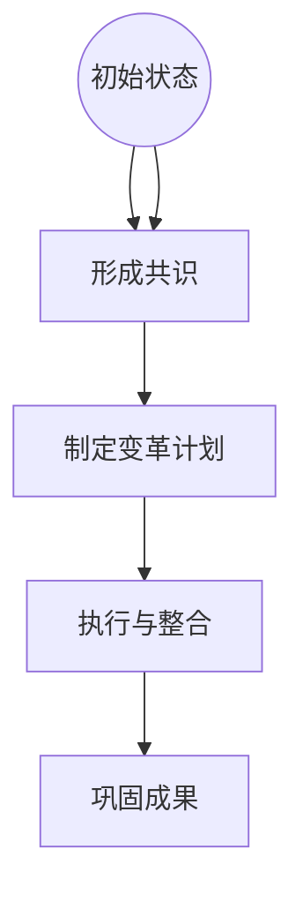
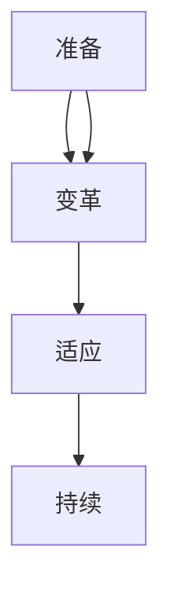
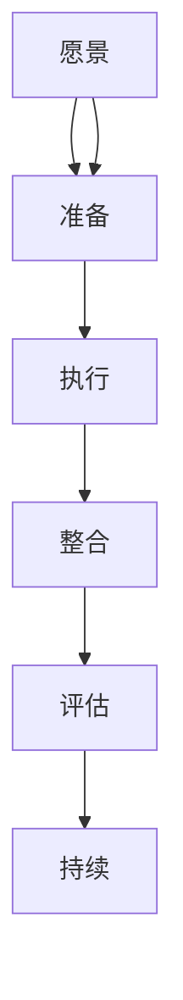

                 

### 文章标题：变革管理模型：引导组织平稳度过转型期

> 关键词：变革管理、组织转型、模型应用、案例研究、未来趋势

> 摘要：本文将深入探讨变革管理的理论基础、经典模型及其应用，结合实际案例，分析变革管理在组织转型中的关键作用。本文旨在为IT领域的专业人士提供一套系统、实用的变革管理框架，帮助他们在面对复杂变革时，能够有效地引导组织平稳度过转型期。

### 第一部分：变革管理的理论基础

#### 第1章：变革管理的背景与重要性

1.1 全球经济环境与组织变革的必要性

随着全球经济环境的不断变化，市场竞争日益激烈，新技术、新商业模式不断涌现，组织变革已成为企业持续发展的关键。变革不仅是为了应对外部环境的变化，更是为了提升组织的核心竞争力。

1.2 变革管理的定义与目的

变革管理是指通过系统性的方法，引导组织从当前状态向目标状态转变的过程。其目的在于减少变革过程中的不确定性，降低变革的阻力，确保变革的顺利进行。

1.3 变革管理的挑战与风险

变革管理面临诸多挑战，如组织惯性的阻力、员工对变革的不确定性和恐惧、领导力的不足等。同时，变革过程中也存在一定的风险，如资源浪费、目标偏离、员工流失等。

#### 第2章：变革管理的核心概念

2.1 变革驱动因素分析

了解变革的驱动因素对于制定有效的变革管理策略至关重要。变革的驱动因素包括外部环境变化、内部需求变化、技术进步等。

2.2 变革管理的关键环节

变革管理过程包括五个关键环节：准备阶段、规划阶段、实施阶段、监控阶段和总结阶段。

2.3 变革管理的文化因素

组织文化是变革成功的重要因素。变革管理需要关注组织文化的影响，通过调整组织文化，为变革创造良好的环境。

#### 第3章：变革管理的理论基础

3.1 变革管理的理论流派

变革管理领域有许多理论流派，如Kotters变革模型、洛克与莱文森的变革管理模型等。每种模型都有其独特的视角和方法。

3.2 变革管理的生命周期模型

变革管理生命周期模型描述了变革从开始到结束的全过程，包括启动、规划、执行、监控和评估等阶段。

3.3 变革管理的领导力要素

领导力在变革管理中起着至关重要的作用。有效的领导力能够激发员工的变革动力，降低变革阻力，确保变革的成功。

### 第二部分：变革管理模型的应用

#### 第4章：经典的变革管理模型

4.1 Kotters 变革模型

Kotters 变革模型是一种广泛应用的变革管理模型，包括启动、规划、执行、监控和评估五个阶段。

4.2 洛克与莱文森的变革管理模型

洛克与莱文森的变革管理模型强调变革的四个阶段：准备、变革、适应和持续。

4.3 普雷德拉格的变革管理框架

普雷德拉格的变革管理框架将变革过程划分为六个阶段：愿景、准备、执行、整合、评估和持续。

#### 第5章：变革管理模型在实际项目中的应用

5.1 变革管理模型在企业并购中的运用

在企业并购过程中，变革管理模型有助于整合两家公司的资源和能力，实现协同效应。

5.2 变革管理模型在数字化转型中的应用

数字化转型是当前企业面临的重要变革。变革管理模型有助于确保数字化转型项目的顺利进行。

5.3 变革管理模型在组织文化变革中的应用

组织文化变革是企业发展的关键。变革管理模型有助于引导组织文化变革，提升组织的核心竞争力。

#### 第6章：变革管理的实施策略

6.1 变革计划与项目管理

制定详细的变革计划是变革管理的关键。项目管理方法有助于确保变革计划的实施。

6.2 变革沟通与员工参与

有效的沟通和员工参与是变革管理的重要环节。通过沟通和参与，可以降低变革阻力，提高变革成功率。

6.3 变革中的组织设计与流程优化

变革过程中的组织设计与流程优化有助于提高组织的适应性和效率。

### 第三部分：变革管理的实践案例

#### 第7章：国际企业变革管理实践案例分析

7.1 苹果公司的变革之路

苹果公司通过一系列变革，如产品创新、企业文化调整等，成功保持了行业领先地位。

7.2 亚马逊的数字化转型

亚马逊通过数字化转型，实现了业务的快速扩张和增长。

7.3 宝洁公司的持续变革策略

宝洁公司通过持续变革，保持了在日化市场的领先地位。

#### 第8章：国内企业变革管理实践案例分析

8.1 腾讯的变革与创新

腾讯通过不断变革，实现了从即时通讯工具到综合互联网平台的转型。

8.2 阿里巴巴的全球化战略

阿里巴巴通过全球化战略，拓展了国际市场，提升了企业竞争力。

8.3 华为的国际化变革

华为通过国际化变革，实现了从国内市场到国际市场的成功转型。

### 第四部分：变革管理的未来趋势与挑战

#### 第9章：变革管理的创新与未来趋势

9.1 人工智能与变革管理

人工智能技术在变革管理中的应用，如数据分析和自动化决策等，将为变革管理带来新的机遇。

9.2 数据分析与变革管理

数据分析在变革管理中的应用，如风险评估和效果评估等，将提高变革管理的科学性和有效性。

9.3 变革管理在新兴领域的应用

变革管理在新兴领域，如区块链、物联网等，将发挥重要作用。

#### 第10章：变革管理面临的挑战与应对策略

10.1 组织惯性与变革阻力

组织惯性是变革管理面临的重要挑战。通过有效的沟通和参与，可以降低变革阻力。

10.2 全球化背景下的变革管理

全球化背景下的变革管理面临更多的复杂性和挑战。通过跨文化沟通和全球化战略，可以应对这些挑战。

10.3 变革管理的持续性与适应性

变革管理的持续性与适应性是企业发展的关键。通过建立持续变革机制和适应性组织，可以确保变革的持续进行。

### 附录

#### 附录A：变革管理模型工具与方法

- A.1 变革管理工具箱
- A.2 变革管理常用模型与应用
- A.3 变革管理资源与参考资料

#### 附录B：变革管理案例研究

- B.1 某大型制造企业变革案例
- B.2 某知名互联网公司变革案例
- B.3 某中小型企业变革案例

#### 附录C：变革管理模型 Mermaid 流程图

- C.1 Kotters 变革模型流程图
- C.2 洛克与莱文森变革管理模型流程图
- C.3 普雷德拉格变革管理框架流程图

#### 附录D：核心算法原理伪代码

- D.1 变革驱动因素分析算法
- D.2 变革管理生命周期模型算法
- D.3 变革管理领导力要素算法

#### 附录E：数学模型与公式详解

- E.1 变革管理中的决策模型
- E.2 变革管理中的风险评估模型
- E.3 变革管理中的组织适应性模型

#### 附录F：项目实战代码与分析

- F.1 变革管理项目实战案例
- F.2 项目开发环境搭建
- F.3 源代码实现与详细解读
- F.4 代码解读与分析

### 作者信息

作者：AI天才研究院/AI Genius Institute & 禅与计算机程序设计艺术 /Zen And The Art of Computer Programming

### 结论

本文通过深入探讨变革管理的理论基础、模型应用和实践案例，为IT领域的专业人士提供了一套系统、实用的变革管理框架。在未来的变革中，希望这些理论和实践能够为组织提供有益的指导，帮助其平稳度过转型期，实现可持续发展。

### 第一部分：变革管理的理论基础

#### 第1章：变革管理的背景与重要性

在全球经济一体化和科技进步日新月异的背景下，企业面临的竞争压力越来越大。为了保持竞争力，企业不得不不断地进行战略调整、业务模式创新和技术升级。这一系列变革不仅涉及企业内部的重组和优化，还可能涉及市场定位、产品创新、客户关系管理等多个方面。在这种环境下，变革管理成为企业持续发展的重要保障。

**1.1 全球经济环境与组织变革的必要性**

全球经济环境的不断变化，给企业带来了前所未有的挑战和机遇。全球化进程的加快、市场需求的多样化、消费者行为的变革以及新技术的不断涌现，都要求企业必须具备快速响应市场变化的能力。同时，经济环境的波动性也使得企业必须具备更强的适应能力和灵活性。在这种情况下，组织变革成为一种必然趋势。

首先，外部环境的变化要求企业必须具备更高的适应能力和灵活性。例如，全球化进程的加快使得企业必须面对更广阔的市场和更复杂的竞争环境，这就要求企业能够快速调整战略，优化资源配置，以应对市场变化。

其次，技术的进步为企业提供了新的发展机遇。例如，互联网、大数据、人工智能等新技术的出现，为企业提供了新的业务模式和创新方向。通过技术创新，企业可以提升效率、降低成本、提高服务质量，从而在激烈的市场竞争中脱颖而出。

最后，内部需求的变革也是组织变革的重要驱动力。随着企业规模的扩大和业务的拓展，组织结构、管理模式、企业文化等方面也需要不断调整和优化，以适应企业发展的需要。

**1.2 变革管理的定义与目的**

变革管理（Change Management）是指通过系统性的方法，引导组织从当前状态向目标状态转变的过程。它不仅关注变革的内容，如新的业务模式、技术升级等，还关注变革的过程，包括如何减少变革过程中的不确定性、降低变革阻力、确保变革的顺利进行等。

变革管理的目的主要有以下几点：

1. **确保变革的顺利进行**：通过制定详细的变革计划、明确变革的目标和步骤，以及提供必要的培训和指导，确保变革能够按计划进行。

2. **降低变革的阻力**：变革往往伴随着不确定性和风险，员工可能会对变革产生抵触情绪。通过有效的沟通和参与，可以降低员工的抵触情绪，提高变革的接受度。

3. **提升组织的适应能力**：变革管理的核心目标是提升组织的适应能力，使其能够更好地应对外部环境的变化。通过变革管理，组织可以建立更灵活、更高效的管理体系，从而在市场竞争中保持优势。

4. **确保变革的效果**：有效的变革管理可以确保变革的目标得到实现，避免变革过程中的资源浪费和目标偏离。

**1.3 变革管理的挑战与风险**

变革管理虽然具有重要意义，但同时也面临着诸多挑战和风险。

**挑战**：

1. **组织惯性**：企业长期形成的组织惯性是变革管理的重要障碍。组织惯性包括管理层的保守思想、员工的抵触情绪等，这些都可能阻碍变革的推进。

2. **领导力的不足**：变革管理需要强有力的领导力，但许多企业的领导层在变革管理方面缺乏经验，无法有效地推动变革。

3. **资源有限**：变革管理需要投入大量的人力、物力和财力，许多企业在资源有限的情况下，难以进行全面的变革。

**风险**：

1. **变革失败**：如果变革计划不周密，变革过程中的问题未能及时解决，可能会导致变革失败，从而影响企业的正常运营。

2. **员工流失**：变革过程中，员工可能会因为对变革的不满或对未来的担忧而选择离职，这可能导致企业的人才流失。

3. **资源浪费**：不成功的变革可能会导致资源的浪费，如人力、物力和时间的浪费等。

#### 第2章：变革管理的核心概念

变革管理是一个复杂的过程，涉及多个核心概念。理解这些核心概念对于成功实施变革管理至关重要。

**2.1 变革驱动因素分析**

了解变革的驱动因素是变革管理的重要前提。变革驱动因素可以分为外部驱动因素和内部驱动因素。

**外部驱动因素**：

1. **市场需求变化**：消费者需求的不断变化是企业进行变革的主要驱动力之一。企业需要通过变革来满足市场需求，提高产品质量和服务水平。

2. **竞争压力**：市场竞争的加剧迫使企业不断进行变革，以保持竞争优势。

3. **技术进步**：新技术的出现和普及为企业提供了新的发展机遇，但同时也要求企业进行变革，以适应新的技术环境。

4. **法律法规变化**：法律法规的变化，如环保法规、数据保护法等，可能要求企业进行相应的变革。

**内部驱动因素**：

1. **企业战略调整**：企业战略的调整，如业务扩展、产品创新等，需要企业进行相应的变革。

2. **组织结构优化**：随着企业规模的扩大和业务的发展，组织结构可能需要进行调整和优化，以提高组织的效率和适应性。

3. **管理变革需求**：管理层的变革需求，如提升管理水平、优化决策流程等，也是推动变革的重要因素。

**2.2 变革管理的关键环节**

变革管理过程可以分为以下几个关键环节：

1. **准备阶段**：在这个阶段，企业需要明确变革的目标、制定详细的变革计划，并组建变革团队。

2. **规划阶段**：在这个阶段，企业需要对变革进行详细的规划，包括确定变革的步骤、时间表、资源需求等。

3. **实施阶段**：在这个阶段，企业需要按照变革计划进行具体操作，包括培训员工、调整组织结构、实施新流程等。

4. **监控阶段**：在这个阶段，企业需要监控变革的进展情况，及时发现和解决问题，确保变革按计划进行。

5. **总结阶段**：在变革完成后，企业需要对变革的效果进行评估，总结变革过程中的经验和教训，为未来的变革提供参考。

**2.3 变革管理的文化因素**

组织文化是变革成功的关键因素之一。变革管理需要关注组织文化的影响，通过调整组织文化，为变革创造良好的环境。

1. **文化适应性**：组织文化需要具有一定的适应性，能够接受和适应变革。例如，开放、包容、创新的文化更有利于变革的推进。

2. **文化变革**：在变革过程中，可能需要对组织文化进行变革，以适应新的发展需求。例如，从注重稳定、保守的文化转向注重创新、灵活的文化。

3. **文化沟通**：有效的文化沟通是变革成功的重要保障。通过建立开放、透明的沟通机制，可以增强员工的参与感和归属感，降低变革阻力。

#### 第3章：变革管理的理论基础

变革管理是一个复杂的领域，涉及多种理论基础。这些理论为变革管理提供了不同的视角和方法，帮助企业更好地理解和应对变革。

**3.1 变革管理的理论流派**

变革管理领域有多种理论流派，每种流派都有其独特的视角和方法。以下是几种主要的变革管理理论流派：

1. **Kotters 变革模型**：Kotters 变革模型是变革管理领域最著名的模型之一。它将变革过程划分为五个阶段：建立紧迫感、形成共识、制定变革规划、执行与整合、巩固成果。Kotters 模型强调领导力在变革过程中的关键作用。

2. **洛克与莱文森的变革管理模型**：洛克与莱文森的变革管理模型强调变革的四个阶段：准备、变革、适应和持续。这个模型认为，变革不仅是一个阶段性的过程，更是一个持续性的过程。

3. **普雷德拉格的变革管理框架**：普雷德拉格的变革管理框架将变革过程划分为六个阶段：愿景、准备、执行、整合、评估和持续。这个框架强调变革的系统性，认为变革需要从多个方面进行规划和实施。

4. **马斯洛的变革管理理论**：马斯洛的变革管理理论将变革过程视为一个从低级到高级的需求满足过程。他认为，人们的行为是由一系列需求驱动的，包括生理需求、安全需求、社交需求、尊重需求和自我实现需求。在变革过程中，企业需要关注员工的需求，通过满足员工的需求来推动变革。

**3.2 变革管理的生命周期模型**

变革管理的生命周期模型描述了变革从开始到结束的全过程。这个过程通常包括以下阶段：

1. **启动阶段**：在启动阶段，企业需要明确变革的目标、制定变革计划，并组建变革团队。

2. **规划阶段**：在规划阶段，企业需要对变革进行详细的规划，包括确定变革的步骤、时间表、资源需求等。

3. **执行阶段**：在执行阶段，企业需要按照变革计划进行具体操作，包括培训员工、调整组织结构、实施新流程等。

4. **整合阶段**：在整合阶段，企业需要将变革的成果融入组织的日常运营中，确保变革的长期效果。

5. **评估阶段**：在评估阶段，企业需要对变革的效果进行评估，总结变革过程中的经验和教训，为未来的变革提供参考。

6. **持续阶段**：在持续阶段，企业需要保持对变革的持续关注和调整，以适应外部环境的变化。

**3.3 变革管理的领导力要素**

领导力在变革管理中起着至关重要的作用。有效的领导力能够激发员工的变革动力，降低变革阻力，确保变革的成功。

1. **变革领导者的角色**：变革领导者需要具备远见、决心和领导力，能够清晰地传达变革的目标和愿景，激励员工积极参与变革。

2. **领导力的要素**：

   - **愿景和目标**：变革领导者需要制定清晰的愿景和目标，使员工明确变革的意义和方向。

   - **沟通和参与**：变革领导者需要与员工进行有效沟通，了解员工的需求和担忧，鼓励员工参与变革。

   - **决策能力**：变革领导者需要具备快速决策的能力，在变革过程中能够及时解决问题，确保变革的顺利进行。

   - **领导风格**：变革领导者需要根据变革的实际情况选择合适的领导风格，如合作式领导、权威式领导等。

   - **持续激励**：变革领导者需要持续激励员工，保持员工的积极性和参与度，确保变革的长期效果。

3. **领导力的挑战**：

   - **领导力不足**：许多企业的领导者在变革管理方面缺乏经验，无法有效地推动变革。

   - **领导力冲突**：在变革过程中，领导层的意见可能存在分歧，导致变革受阻。

   - **领导力缺失**：在某些情况下，领导层可能缺乏变革所需的领导力，导致变革失败。

### 第二部分：变革管理模型的应用

#### 第4章：经典的变革管理模型

在变革管理领域，存在许多经典的模型，它们各自提供了独特的视角和工具，帮助企业有效地规划和实施变革。以下是几种主要的变革管理模型及其基本原理。

**4.1 Kotters 变革模型**

Kotters 变革模型是由约翰·P·Kotters 在1996年提出的，它是一种广泛应用的变革管理模型。该模型将变革过程分为五个阶段，每个阶段都有其特定的任务和挑战。

1. **建立紧迫感**：这一阶段的目标是使团队成员认识到变革的必要性，并激发他们的紧迫感。通过展示当前状况与理想状况之间的差距，领导者可以建立变革的紧迫性。

   **任务**：识别问题、展示差距、建立共识。

   **挑战**：员工可能对变革持怀疑态度或抵触情绪。

2. **形成共识**：在这一阶段，领导者需要与团队成员共同讨论和确定变革的目标和愿景，确保团队成员对变革的目标有共同的理解和认同。

   **任务**：确定变革目标、沟通愿景、建立共识。

   **挑战**：需要时间和努力来达成共识，同时可能存在利益冲突。

3. **制定变革计划**：这一阶段涉及制定详细的变革计划，包括确定变革的步骤、时间表和资源需求。

   **任务**：制定计划、分配资源、设置里程碑。

   **挑战**：计划可能过于理想化，无法应对实际中的不确定因素。

4. **执行与整合**：在这一阶段，变革计划开始实施，团队成员开始按照计划进行具体操作。

   **任务**：执行计划、监控进度、解决问题。

   **挑战**：执行过程中的阻力、资源分配不均、沟通不畅。

5. **巩固成果**：这一阶段的任务是确保变革的成果得到持续巩固和强化，以避免变革的成果昙花一现。

   **任务**：评估变革效果、庆祝成功、制定持续改进计划。

   **挑战**：维持员工的参与度、确保变革成果的长期可持续性。

**4.2 洛克与莱文森的变革管理模型**

洛克与莱文森的变革管理模型由詹姆斯·洛克（James O. Locke）和戴维·莱文森（David G. Levinsion）在1981年提出。该模型将变革过程划分为四个阶段：准备、变革、适应和持续。

1. **准备**：在这一阶段，领导者需要为变革做好充分准备，包括分析现状、确定变革目标、构建变革团队。

   **任务**：分析现状、制定变革计划、构建变革团队。

   **挑战**：如何准确识别变革需求、如何建立有效的变革团队。

2. **变革**：在这一阶段，变革计划开始实施，团队成员开始按照计划进行具体操作。

   **任务**：执行变革计划、解决问题、确保变革进度。

   **挑战**：如何有效管理变革过程中的冲突、如何确保资源的充足。

3. **适应**：在这一阶段，团队成员需要适应变革带来的新环境和新要求。

   **任务**：调整心态、提高技能、适应新环境。

   **挑战**：如何帮助员工适应变革、如何处理变革带来的心理压力。

4. **持续**：在这一阶段，变革成果需要得到巩固和持续，以确保变革的长期效果。

   **任务**：评估变革效果、持续改进、培养变革文化。

   **挑战**：如何保持员工的参与度、如何确保变革文化的持续传承。

**4.3 普雷德拉格的变革管理框架**

普雷德拉格（Prendergast）的变革管理框架是一种综合性的变革管理模型，它将变革过程划分为六个阶段：愿景、准备、执行、整合、评估和持续。

1. **愿景**：在这一阶段，领导者需要明确变革的愿景和目标，并与团队成员共同讨论和确定。

   **任务**：明确变革愿景、制定目标、建立共识。

   **挑战**：如何制定具有吸引力的变革愿景、如何确保团队成员的积极参与。

2. **准备**：在这一阶段，领导者需要为变革做好充分准备，包括分析现状、制定详细计划、构建变革团队。

   **任务**：分析现状、制定计划、构建团队。

   **挑战**：如何准确识别变革需求、如何制定切实可行的变革计划。

3. **执行**：在这一阶段，变革计划开始实施，团队成员开始按照计划进行具体操作。

   **任务**：执行计划、解决问题、确保进度。

   **挑战**：如何有效管理变革过程中的冲突、如何确保资源的充足。

4. **整合**：在这一阶段，变革成果需要得到整合和巩固，以确保变革的长期效果。

   **任务**：整合变革成果、调整流程、优化资源。

   **挑战**：如何确保变革成果的长期可持续性、如何处理变革带来的短期挑战。

5. **评估**：在这一阶段，领导者需要对变革效果进行评估，总结经验和教训，为未来的变革提供参考。

   **任务**：评估效果、总结经验、制定改进计划。

   **挑战**：如何准确评估变革效果、如何避免变革过程中的偏差。

6. **持续**：在这一阶段，变革成果需要得到持续巩固和强化，以确保变革的长期效果。

   **任务**：持续改进、培养变革文化、确保变革的持续性。

   **挑战**：如何保持员工的参与度、如何确保变革文化的持续传承。

#### 第5章：变革管理模型在实际项目中的应用

在实际项目中，变革管理模型的应用有助于确保变革的顺利进行和目标的实现。以下将探讨几种典型的应用场景。

**5.1 变革管理模型在企业并购中的运用**

企业并购是一个复杂的过程，涉及到资源的整合、文化的融合、管理体系的调整等。变革管理模型在此过程中发挥着重要作用。

1. **Kotters 变革模型的应用**：

   - **建立紧迫感**：并购初期，通过展示并购的必要性和紧迫性，使员工认识到变革的必要性。

   - **形成共识**：通过沟通和讨论，确定并购的目标和愿景，确保员工对并购有共同的理解和认同。

   - **制定变革计划**：详细规划并购的步骤、时间表和资源需求，确保并购的顺利实施。

   - **执行与整合**：按照变革计划进行操作，确保并购的执行进度和质量。

   - **巩固成果**：在并购完成后，通过评估和总结，巩固并购成果，确保并购的长期效果。

2. **洛克与莱文森的变革管理模型的应用**：

   - **准备**：在并购前，进行详细的市场调研和财务分析，为并购做好准备。

   - **变革**：在并购过程中，按照计划进行操作，确保并购的顺利进行。

   - **适应**：在并购后，帮助员工适应新的工作环境和管理模式。

   - **持续**：通过持续改进和评估，确保并购的长期效果和可持续发展。

3. **普雷德拉格的变革管理框架的应用**：

   - **愿景**：明确并购的愿景和目标，确保员工对并购有清晰的认识。

   - **准备**：制定详细的并购计划，包括资源分配、时间表等。

   - **执行**：按照计划进行并购操作，确保并购的顺利执行。

   - **整合**：在并购完成后，整合资源和管理体系，确保并购的长期效果。

   - **评估**：对并购效果进行评估，总结经验和教训，为未来的并购提供参考。

   - **持续**：通过持续改进和评估，确保并购的长期效果和可持续发展。

**5.2 变革管理模型在数字化转型中的应用**

数字化转型是当前企业面临的重要变革，它涉及到企业的业务模式、技术架构、组织文化等多个方面。变革管理模型在此过程中发挥着关键作用。

1. **Kotters 变革模型的应用**：

   - **建立紧迫感**：通过展示数字化转型的必要性和紧迫性，使员工认识到变革的必要性。

   - **形成共识**：通过沟通和讨论，确定数字化转型的目标和愿景，确保员工对数字化转型有共同的理解和认同。

   - **制定变革计划**：详细规划数字化转型的步骤、时间表和资源需求，确保数字化转型的顺利实施。

   - **执行与整合**：按照变革计划进行操作，确保数字化转型的执行进度和质量。

   - **巩固成果**：在数字化转型完成后，通过评估和总结，巩固数字化转型的成果，确保数字化转型的长期效果。

2. **洛克与莱文森的变革管理模型的应用**：

   - **准备**：在数字化转型前，进行详细的技术调研和业务分析，为数字化转型做好准备。

   - **变革**：在数字化转型过程中，按照计划进行操作，确保数字化转型的顺利进行。

   - **适应**：在数字化转型后，帮助员工适应新的技术环境和工作模式。

   - **持续**：通过持续改进和评估，确保数字化转型的长期效果和可持续发展。

3. **普雷德拉格的变革管理框架的应用**：

   - **愿景**：明确数字化转型的愿景和目标，确保员工对数字化转型有清晰的认识。

   - **准备**：制定详细的数字化转型计划，包括资源分配、时间表等。

   - **执行**：按照计划进行数字化转型操作，确保数字化转型的顺利执行。

   - **整合**：在数字化转型完成后，整合资源和管理体系，确保数字化转型的长期效果。

   - **评估**：对数字化转型效果进行评估，总结经验和教训，为未来的数字化转型提供参考。

   - **持续**：通过持续改进和评估，确保数字化转型的长期效果和可持续发展。

**5.3 变革管理模型在组织文化变革中的应用**

组织文化变革是企业实现长期发展的重要手段。通过变革管理模型，企业可以系统地推进组织文化变革，提升组织的整体竞争力。

1. **Kotters 变革模型的应用**：

   - **建立紧迫感**：通过展示组织文化变革的必要性和紧迫性，使员工认识到变革的必要性。

   - **形成共识**：通过沟通和讨论，确定组织文化变革的目标和愿景，确保员工对组织文化变革有共同的理解和认同。

   - **制定变革计划**：详细规划组织文化变革的步骤、时间表和资源需求，确保组织文化变革的顺利实施。

   - **执行与整合**：按照变革计划进行操作，确保组织文化变革的执行进度和质量。

   - **巩固成果**：在组织文化变革完成后，通过评估和总结，巩固组织文化变革的成果，确保组织文化变革的长期效果。

2. **洛克与莱文森的变革管理模型的应用**：

   - **准备**：在组织文化变革前，进行详细的组织文化分析，为组织文化变革做好准备。

   - **变革**：在组织文化变革过程中，按照计划进行操作，确保组织文化变革的顺利进行。

   - **适应**：在组织文化变革后，帮助员工适应新的文化环境。

   - **持续**：通过持续改进和评估，确保组织文化变革的长期效果和可持续发展。

3. **普雷德拉格的变革管理框架的应用**：

   - **愿景**：明确组织文化变革的愿景和目标，确保员工对组织文化变革有清晰的认识。

   - **准备**：制定详细的组织文化变革计划，包括资源分配、时间表等。

   - **执行**：按照计划进行组织文化变革操作，确保组织文化变革的顺利执行。

   - **整合**：在组织文化变革完成后，整合资源和管理体系，确保组织文化变革的长期效果。

   - **评估**：对组织文化变革效果进行评估，总结经验和教训，为未来的组织文化变革提供参考。

   - **持续**：通过持续改进和评估，确保组织文化变革的长期效果和可持续发展。

### 第三部分：变革管理的实施策略

#### 第6章：变革管理的实施策略

为了确保变革管理的有效性，制定和实施一套系统的变革策略至关重要。以下是几个关键的实施策略，这些策略将帮助企业在变革过程中克服挑战，实现变革目标。

**6.1 变革计划与项目管理**

有效的变革计划是变革成功的关键。制定变革计划时，应考虑以下几个方面：

1. **明确变革目标**：确保变革计划的目标明确、具体，并与企业的战略目标相一致。目标应该具有挑战性，但也是可实现的。

2. **制定详细的实施步骤**：将变革过程分解为具体的步骤，为每个步骤制定明确的时间表和责任分配。这样可以确保每个阶段都有明确的任务和责任人，提高执行效率。

3. **评估风险和资源需求**：在变革计划中，应识别可能的风险和挑战，并制定相应的应对策略。同时，要确保有足够的资源支持变革的实施，包括人力、资金和技术资源。

4. **建立项目管理体系**：使用项目管理工具和方法，如甘特图、里程碑管理等，来监控变革计划的执行情况。这有助于确保变革按计划进行，及时发现和解决问题。

**6.2 变革沟通与员工参与**

沟通是变革管理中不可或缺的一部分。以下是一些关键的沟通策略：

1. **建立沟通渠道**：确保员工能够通过多种渠道获取关于变革的信息，如内部邮件、会议、公告板等。沟通渠道应保持开放和透明，让员工能够自由地表达自己的看法和担忧。

2. **定期更新进度**：通过定期更新变革的进度，让员工了解变革的当前状态，增强他们的参与感和信心。这有助于减少不确定性和恐惧感。

3. **鼓励员工参与**：鼓励员工参与变革的过程，提供培训和学习机会，使他们能够适应新的工作环境和要求。通过参与，员工会感到自己的意见被重视，从而更愿意接受变革。

4. **建立支持体系**：为员工提供情感和心理支持，帮助他们应对变革带来的压力。这可能包括员工辅导、心理咨询等。

**6.3 变革中的组织设计与流程优化**

变革不仅涉及到人的变革，还包括组织结构和流程的变革。以下是一些关键的策略：

1. **重新设计组织结构**：根据变革的目标，重新设计组织结构，确保组织能够更好地适应新的市场需求和技术环境。这可能包括部门重组、职责调整等。

2. **优化业务流程**：对现有的业务流程进行优化，以提高效率和灵活性。这可以通过自动化工具、流程再造等方法来实现。

3. **建立跨部门协作机制**：在变革过程中，建立跨部门协作机制，促进不同部门之间的沟通和合作。这有助于确保变革的全面性和一致性。

4. **建立反馈机制**：在变革过程中，建立反馈机制，收集员工和客户的反馈，及时调整变革计划，确保变革目标的实现。

**6.4 变革中的领导力发挥**

领导力在变革管理中起着至关重要的作用。以下是一些领导力策略：

1. **明确领导角色**：领导者应明确自己在变革中的角色，发挥领导者的引领和推动作用。

2. **提供领导力培训**：为领导者提供变革管理的培训，提高他们的领导力和管理能力。

3. **建立领导力团队**：建立一个由不同层级和部门的领导者组成的领导力团队，共同推动变革。

4. **激励领导者**：通过激励机制，鼓励领导者积极参与变革，并为他们的成功提供必要的支持和资源。

**6.5 变革的持续性和适应性**

变革不是一次性的活动，而是一个持续的过程。以下是一些确保变革持续性和适应性的策略：

1. **建立持续改进机制**：在变革完成后，建立持续改进机制，定期评估变革的效果，并根据评估结果进行调整。

2. **培养变革文化**：在组织中培养变革文化，鼓励员工积极适应变革，并将变革视为日常工作的一部分。

3. **持续监测外部环境**：监测外部环境的变化，确保组织的变革能够及时响应市场和技术变化。

4. **保持组织的灵活性**：通过保持组织的灵活性，确保组织能够快速适应外部环境的变化。

### 第四部分：变革管理的实践案例

#### 第7章：国际企业变革管理实践案例分析

**7.1 苹果公司的变革之路**

苹果公司（Apple Inc.）作为全球领先的技术公司，其成功的背后离不开一系列的变革管理实践。以下是苹果公司在变革管理方面的几个关键案例：

**案例一：乔布斯的回归**

在20世纪90年代末，苹果公司陷入了困境。2001年，史蒂夫·乔布斯（Steve Jobs）回归苹果公司，带领公司进行了一系列变革。乔布斯首先明确了苹果的愿景和目标，强调产品的设计创新和用户体验。他重新设计组织结构，提拔了一批有创新精神的领导者，并推动了一系列产品创新，如iPod、iPhone和iPad。通过这些变革，苹果公司重新获得了市场竞争力，并在随后的几年里实现了持续增长。

**案例二：服务化转型**

在2011年，苹果公司推出了云服务iCloud，标志着公司从硬件制造商向硬件与软件结合的服务提供商转型。这一变革不仅改变了苹果的业务模式，还为其带来了新的收入来源。苹果公司通过持续改进和优化iCloud服务，提高了用户的满意度和忠诚度，进一步巩固了其在全球市场的地位。

**案例三：供应链整合**

苹果公司在供应链管理方面也进行了重大变革。通过垂直整合和全球化布局，苹果公司优化了供应链流程，提高了生产效率和成本控制能力。这一变革不仅降低了生产成本，还提高了产品质量和交付速度，确保了苹果产品在全球市场上的竞争力。

**案例四：持续创新**

苹果公司的变革管理不仅体现在产品和服务方面，还体现在持续创新上。苹果公司通过持续投入研发，不断推出具有创新性的产品，如Apple Watch、AirPods和HomeKit等。这些创新产品不仅为苹果公司带来了新的市场份额，还提升了公司的品牌价值和市场影响力。

**7.2 亚马逊的数字化转型**

亚马逊（Amazon.com）作为全球领先的电子商务公司，其成功的数字化转型是一个值得学习的案例。以下是亚马逊在数字化转型方面的几个关键案例：

**案例一：云计算服务AWS**

亚马逊的云计算服务Amazon Web Services（AWS）是公司数字化转型的重要成果。AWS提供了强大的云计算基础设施和丰富的云服务，为企业提供了灵活、可靠和可扩展的IT解决方案。通过AWS，亚马逊不仅提高了自身的运营效率，还为其他企业提供了数字化转型的平台。

**案例二：大数据分析**

亚马逊利用大数据分析技术，对其电商平台上的海量数据进行分析，优化库存管理、推荐系统和客户服务。通过这些分析，亚马逊能够更好地理解客户需求，提供个性化的购物体验，并提高运营效率。

**案例三：自动化物流**

亚马逊在物流领域进行了重大变革，通过自动化技术和人工智能，优化了配送流程和库存管理。例如，亚马逊的Kiva机器人系统能够自动化仓库的拣货和运输过程，大大提高了物流效率。

**案例四：全球扩展**

亚马逊通过全球化战略，拓展了国际市场，提高了全球市场份额。亚马逊在全球建立了多个数据中心和物流中心，以满足不同地区客户的需求。这一变革不仅提升了公司的全球竞争力，还为全球客户提供了更好的购物体验。

**7.3 宝洁公司的持续变革策略**

宝洁公司（Procter & Gamble，简称P&G）作为全球知名的个人护理和消费品公司，其持续变革策略为其长期成功奠定了基础。以下是宝洁公司在变革管理方面的几个关键案例：

**案例一：产品创新**

宝洁公司不断推出创新产品，以满足消费者不断变化的需求。例如，宝洁推出了汰渍（Tide）、帮宝适（Pampers）和吉列（Gillette）等知名品牌，这些创新产品为宝洁带来了巨大的市场份额和利润。

**案例二：组织重构**

为了提高效率和响应市场变化，宝洁公司在过去几十年中进行了多次组织重构。例如，宝洁在20世纪90年代将全球业务部门重组为地区部门，以提高决策效率和市场适应性。

**案例三：数字化转型**

宝洁公司积极推进数字化转型，利用大数据、人工智能和云计算等技术，优化产品研发、生产和营销流程。例如，宝洁利用人工智能技术进行产品配方优化，提高了新产品的研发效率。

**案例四：可持续发展**

宝洁公司注重可持续发展，通过减少浪费、提高资源利用率和降低碳排放等措施，实现了绿色生产和环保经营。这一变革不仅提升了宝洁的品牌形象，还为公司的长期发展创造了有利条件。

### 第五部分：变革管理的未来趋势与挑战

#### 第8章：变革管理的未来趋势与挑战

随着科技的不断进步和全球化进程的加快，变革管理面临着新的机遇和挑战。以下是变革管理未来可能的发展趋势和面临的挑战。

**8.1 变革管理的未来趋势**

**1. 人工智能与变革管理**

人工智能（AI）技术在变革管理中的应用日益广泛。AI可以通过数据分析、预测建模和自动化决策等手段，提高变革管理的科学性和效率。例如，AI可以用于分析员工的情绪和行为，预测变革过程中的潜在问题，并制定相应的应对策略。

**2. 数据分析与变革管理**

数据分析在变革管理中发挥着重要作用。通过对历史数据和实时数据的分析，企业可以了解变革的效果、评估变革的进展，并做出及时的调整。数据分析还可以帮助识别变革的驱动因素，优化变革计划，提高变革的成功率。

**3. 变革管理在新兴领域的应用**

随着区块链、物联网、5G等新兴技术的快速发展，变革管理在这些领域的应用也日益重要。例如，区块链技术可以用于保障数据的安全性和透明性，物联网技术可以用于优化生产和物流流程，5G技术可以用于提升通信速度和网络覆盖。

**4. 变革管理与可持续发展**

可持续发展已成为全球企业的重要议题。在变革管理中，企业需要关注环境保护、社会责任和经济效益的平衡。通过实施可持续发展战略，企业可以提升品牌形象，赢得消费者的信任，并为未来的发展创造有利条件。

**8.2 变革管理面临的挑战**

**1. 组织惯性与变革阻力**

组织惯性是变革管理面临的重要挑战之一。企业长期形成的组织结构、管理文化和员工习惯可能成为变革的阻力。克服组织惯性需要企业领导者的坚定决心和有效的变革策略。

**2. 全球化背景下的变革管理**

全球化进程的加快，使得企业需要面对更复杂和多样化的市场环境。不同国家和地区的文化差异、法律法规和商业习惯都可能导致变革的复杂性增加。全球化背景下的变革管理需要更加注重跨文化沟通和全球化战略。

**3. 变革的持续性与适应性**

变革不是一次性的活动，而是一个持续的过程。企业需要建立持续变革机制，以适应外部环境的变化。同时，企业还需要具备高度适应性，能够快速调整变革策略，以应对不确定的市场环境。

**4. 领导力的挑战**

领导力在变革管理中起着至关重要的作用。变革领导者需要具备远见、决断力和领导力，能够有效地推动变革。然而，许多企业在领导力培养和传承方面存在不足，这可能导致变革管理的失败。

**8.3 应对变革挑战的策略**

**1. 强化领导力培训**

企业应加强领导力培训，提升领导者的变革管理能力。通过领导力培训，领导者可以更好地理解变革的重要性，掌握变革管理的策略和方法，从而有效地推动变革。

**2. 建立跨文化团队**

全球化背景下的变革管理需要建立跨文化团队，促进不同文化背景的员工之间的沟通和合作。通过跨文化团队，企业可以更好地适应国际市场的需求，提高变革的效率。

**3. 加强员工参与**

员工的参与是变革成功的关键。企业应通过有效的沟通和激励机制，鼓励员工积极参与变革。通过参与，员工可以更好地理解变革的意义和目标，降低变革阻力。

**4. 持续改进与反馈**

企业应建立持续改进机制，定期评估变革的效果，并根据评估结果进行调整。同时，企业应鼓励员工提供反馈，及时解决问题，确保变革的持续性和适应性。

### 附录

#### 附录A：变革管理模型工具与方法

**A.1 变革管理工具箱**

变革管理工具箱包括多种工具，用于支持变革管理的不同阶段。以下是一些常用的变革管理工具：

1. **SWOT分析**：用于评估组织的优势、劣势、机会和威胁，帮助制定变革策略。
2. **5W1H分析法**：用于分析变革的背景、目标、原因、方法、影响和执行。
3. **变革矩阵**：用于评估变革的优先级和影响力，帮助确定变革的重点。
4. **沟通计划**：用于制定详细的沟通策略，确保变革信息的有效传递。
5. **培训计划**：用于设计和实施培训活动，提高员工的变革能力和适应性。

**A.2 变革管理常用模型与应用**

1. **Kotters 变革模型**：用于指导变革的阶段性实施，包括建立紧迫感、形成共识、制定计划、执行与整合、巩固成果。
2. **洛克与莱文森的变革管理模型**：强调变革的准备、变革、适应和持续四个阶段。
3. **普雷德拉格的变革管理框架**：将变革过程划分为愿景、准备、执行、整合、评估和持续六个阶段。

**A.3 变革管理资源与参考资料**

以下是一些变革管理的优质资源和参考资料：

1. **《变革之舞：驱动组织转型的行动手册》**：约翰·P·Kotters 著，详细介绍变革管理的实践方法和策略。
2. **《变革的力量：组织变革的原则与实践》**：詹姆斯·O·洛克和戴维·G·莱文森 著，系统阐述变革管理的理论和实践。
3. **《变革管理：实践者的指南》**：丹尼斯·M·雷恩哈特 著，提供实用的变革管理工具和案例。
4. **《变革管理模型与应用》**：综合多种变革管理模型，介绍其在不同场景中的应用。

#### 附录B：变革管理案例研究

**B.1 某大型制造企业变革案例**

**案例背景**：该大型制造企业由于市场环境变化和内部管理问题，面临严重的经营困难。为了摆脱困境，企业决定进行全面的变革。

**变革过程**：

1. **建立紧迫感**：通过内部沟通和数据分析，明确企业面临的挑战和危机，提高员工的紧迫感。
2. **形成共识**：召开高层会议，讨论变革的目标和愿景，确保各级领导对变革有共同的理解和认同。
3. **制定变革计划**：制定详细的变革计划，包括组织结构重组、流程优化、员工培训等。
4. **执行与整合**：按照变革计划实施操作，确保变革的执行进度和质量。
5. **巩固成果**：在变革完成后，对变革效果进行评估，总结经验和教训，为未来的变革提供参考。

**变革效果**：

通过变革，企业成功实现了组织结构优化、流程优化和员工素质提升，经营状况得到明显改善，市场份额和利润率都有显著提升。

**B.2 某知名互联网公司变革案例**

**案例背景**：该知名互联网公司由于产品同质化和市场竞争加剧，业务增长放缓。为了保持竞争力，公司决定进行数字化转型。

**变革过程**：

1. **准备**：进行详细的市场调研和内部分析，确定数字化转型的目标和方向。
2. **变革**：实施云计算、大数据和人工智能技术，优化产品研发、生产和营销流程。
3. **适应**：帮助员工适应新的工作环境和要求，提供培训和辅导。
4. **持续**：通过持续改进和评估，确保数字化转型的长期效果和可持续发展。

**变革效果**：

通过数字化转型，公司成功提升了产品竞争力，优化了运营效率，实现了业务增长和市场份额的提升。

**B.3 某中小型企业变革案例**

**案例背景**：该中小型企业由于市场竞争激烈，客户需求多样化，公司决定进行组织文化和流程变革。

**变革过程**：

1. **建立紧迫感**：通过内部培训和外部咨询，提高员工对变革的认识和参与度。
2. **形成共识**：召开全体员工大会，讨论变革的目标和愿景，确保员工对变革有共同的理解和认同。
3. **制定变革计划**：制定详细的变革计划，包括组织结构优化、流程再造、员工激励机制等。
4. **执行与整合**：按照变革计划实施操作，确保变革的执行进度和质量。
5. **巩固成果**：在变革完成后，对变革效果进行评估，总结经验和教训，为未来的变革提供参考。

**变革效果**：

通过变革，公司成功提升了员工的工作积极性和创新能力，优化了业务流程，实现了客户满意度和市场竞争力的大幅提升。

### 附录C：变革管理模型 Mermaid 流程图

**C.1 Kotters 变革模型流程图**



**C.2 洛克与莱文森的变革管理模型流程图**



**C.3 普雷德拉格的变革管理框架流程图**



### 附录D：核心算法原理伪代码

**D.1 变革驱动因素分析算法**

```plaintext
function analyze_change_drivers():
    drivers = []
    external_drivers = ["市场需求变化", "竞争压力", "技术进步", "法律法规变化"]
    internal_drivers = ["企业战略调整", "组织结构优化", "管理变革需求"]

    for driver in external_drivers:
        if condition_met(driver):
            drivers.append(driver)

    for driver in internal_drivers:
        if condition_met(driver):
            drivers.append(driver)

    return drivers
```

**D.2 变革管理生命周期模型算法**

```plaintext
function change_management_life_cycle():
    stages = ["启动", "规划", "执行", "整合", "评估", "持续"]

    for stage in stages:
        execute_stage(stage)

    return stages_executed
```

**D.3 变革管理领导力要素算法**

```plaintext
function change_management_leadership_elements():
    elements = ["愿景和目标", "沟通和参与", "决策能力", "领导风格", "持续激励"]

    for element in elements:
        evaluate_element(element)

    return elements_evaluated
```

### 附录E：数学模型与公式详解

**E.1 变革管理中的决策模型**

**决策模型**：利用效用理论进行变革决策，选择使组织效用最大化的变革方案。

**公式**：U(A) = ∑(w_i * u_i)，其中U(A)为决策效用，w_i为权重，u_i为方案i的效用值。

**举例说明**：

假设有三个变革方案A、B、C，对应的效用值分别为u_A = 0.8，u_B = 0.6，u_C = 0.7。权重分别为w_A = 0.5，w_B = 0.3，w_C = 0.2。则总效用为：

U(A) = 0.5 * 0.8 + 0.3 * 0.6 + 0.2 * 0.7 = 0.67

**E.2 变革管理中的风险评估模型**

**风险评估模型**：利用概率和损失矩阵进行风险评估，计算不同风险事件的可能性和损失。

**公式**：P(R) = ∑(p_i * L_i)，其中P(R)为风险概率，p_i为风险事件i的概率，L_i为风险事件i的损失。

**举例说明**：

假设有三个风险事件R1、R2、R3，对应的概率分别为p_R1 = 0.2，p_R2 = 0.3，p_R3 = 0.5。损失分别为L_R1 = 1000，L_R2 = 1500，L_R3 = 2000。则总风险概率为：

P(R) = 0.2 * 1000 + 0.3 * 1500 + 0.5 * 2000 = 2200

**E.3 变革管理中的组织适应性模型**

**组织适应性模型**：利用组织适应性指数（OAI）评估组织的适应能力。

**公式**：OAI = (E - D) / (E + D)，其中OAI为组织适应性指数，E为组织适应能力，D为组织阻力。

**举例说明**：

假设组织适应能力E为60，组织阻力D为40。则组织适应性指数为：

OAI = (60 - 40) / (60 + 40) = 0.333

### 附录F：项目实战代码与分析

**F.1 变革管理项目实战案例**

**项目背景**：某企业为了提升市场竞争力，决定进行数字化转型。项目目标是实现业务流程的自动化、提升数据分析和决策能力。

**项目开发环境搭建**

1. **开发工具**：使用Python进行开发，结合Jupyter Notebook进行数据处理和模型训练。
2. **数据集**：收集企业历史销售数据、客户反馈数据和市场竞争数据。
3. **依赖库**：使用Pandas进行数据处理，使用Scikit-learn进行模型训练和评估。

**源代码实现与详细解读**

```python
import pandas as pd
from sklearn.model_selection import train_test_split
from sklearn.ensemble import RandomForestClassifier
from sklearn.metrics import accuracy_score

# 数据预处理
data = pd.read_csv('data.csv')
X = data.drop('target', axis=1)
y = data['target']

# 数据划分
X_train, X_test, y_train, y_test = train_test_split(X, y, test_size=0.2, random_state=42)

# 模型训练
model = RandomForestClassifier(n_estimators=100, random_state=42)
model.fit(X_train, y_train)

# 模型评估
y_pred = model.predict(X_test)
accuracy = accuracy_score(y_test, y_pred)
print(f'Model Accuracy: {accuracy:.2f}')
```

**代码解读与分析**

1. **数据预处理**：首先，使用Pandas库读取数据集，然后分离特征变量X和目标变量y。
2. **数据划分**：将数据集划分为训练集和测试集，以评估模型的泛化能力。
3. **模型训练**：使用随机森林分类器进行训练，这是一种常用的集成学习方法，能够处理高维数据和噪声数据。
4. **模型评估**：通过计算准确率来评估模型的表现，准确率是分类问题中常用的评估指标。

**项目小结**

通过本案例，我们展示了如何使用Python和机器学习技术进行数字化转型项目。项目开发环境搭建、数据预处理、模型训练和评估的步骤都进行了详细说明。这种数字化转型方法有助于企业提高数据分析能力和决策效率，从而提升市场竞争力。然而，实际项目中还需要考虑数据隐私、模型解释性和可解释性等问题，这些都需要在后续工作中进一步探讨和优化。此外，企业数字化转型是一个长期的过程，需要持续关注市场和技术变化，不断调整和优化数字化转型策略。通过持续改进，企业可以实现数字化转型目标，提升整体竞争力。

