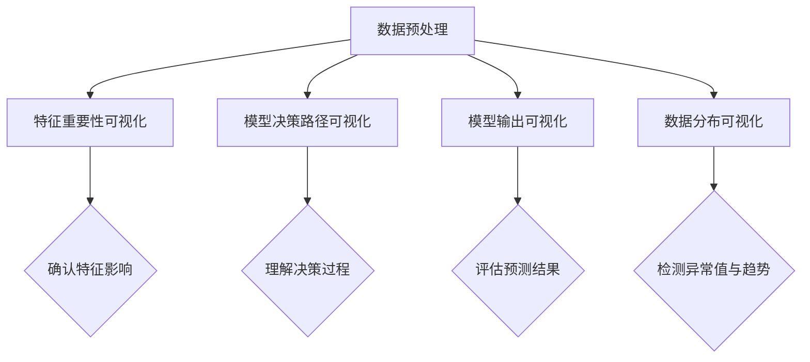
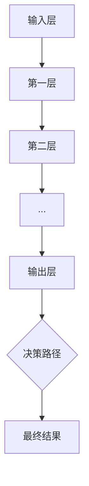
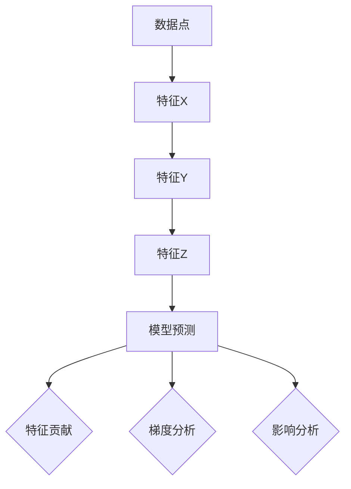
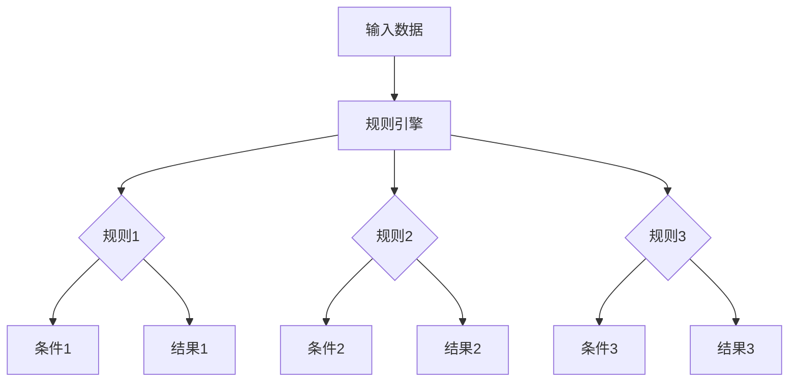
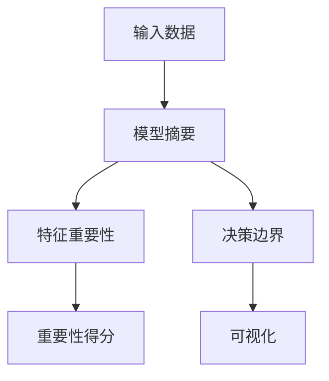

                 

**# 文章标题**

《可解释人工智能：理解机器学习模型的决策过程》

**关键词**：可解释人工智能、机器学习、模型决策、XAI、透明度、可视化

**摘要**：本文将深入探讨可解释人工智能（XAI）在理解机器学习模型决策过程中的重要性。我们将从基本概念入手，逐步介绍可解释人工智能的核心概念、评估方法、关键技术，并通过实际案例展示如何应用这些技术。文章还将分析可解释人工智能在金融、医疗和智能交通等领域的应用，并展望其未来发展。

----------------------------------------------------------------

**# 《可解释人工智能：理解机器学习模型的决策过程》目录大纲**

**## 第一部分：引言**

**### 1.1 可解释人工智能的概念**

- **1.1.1 什么是可解释人工智能**
  - 定义
  - 目标
  - 意义

**### 1.2 可解释人工智能的重要性**

- **1.2.1 透明度与信任**
  - 重要性
  - 应用场景

**### 1.3 机器学习模型决策过程概述**

- **1.3.1 监督学习**
  - 概念
  - 算法

- **1.3.2 无监督学习**
  - 概念
  - 算法

- **1.3.3 半监督学习**
  - 概念
  - 算法

**## 第二部分：可解释人工智能的核心概念**

**### 2.1 机器学习基础**

- **2.1.1 监督学习、无监督学习和半监督学习**
  - 概念
  - 对比

- **2.1.2 线性模型与非线性模型**
  - 概念
  - 特点

- **2.1.3 常见的机器学习算法介绍**
  - 算法

**### 2.2 可解释性评估方法**

- **2.2.1 模型透明度与可解释性**
  - 定义
  - 关系

- **2.2.2 可解释性评估指标**
  - 指标
  - 分析

- **2.2.3 评估方法的优缺点分析**
  - 方法

**### 2.3 数据可视化**

- **2.3.1 数据可视化基本概念**
  - 定义
  - 分类

- **2.3.2 常见数据可视化工具**
  - 工具
  - 比较

- **2.3.3 数据可视化在可解释人工智能中的应用**
  - 应用

**## 第三部分：可解释人工智能的关键技术**

**### 3.1 模型解释方法**

- **3.1.1 模型内部解释方法**
  - 层级解释方法
  - 局部解释方法

- **3.1.2 模型外部解释方法**
  - 基于规则的解释方法
  - 基于模型摘要的解释方法

**### 3.2 可视化技术**

- **3.2.1 数据可视化**
  - 层级可视化
  - 局部可视化

- **3.2.2 特征重要性可视化**
  - 决策树特征重要性
  - 集成方法特征重要性

**### 3.3 数学模型和数学公式**

- **3.3.1 模型推导与数学公式**
  - 线性回归
  - 支持向量机
  - 随机森林

**## 第四部分：项目实战**

**### 4.1 实践项目一：可解释线性回归模型**

- **4.1.1 数据集选择与预处理**
- **4.1.2 模型构建与训练**
- **4.1.3 模型解释与可视化**

**### 4.2 实践项目二：可解释决策树模型**

- **4.2.1 数据集选择与预处理**
- **4.2.2 模型构建与训练**
- **4.2.3 模型解释与可视化**

**### 4.3 实践项目三：可解释集成模型**

- **4.3.1 数据集选择与预处理**
- **4.3.2 模型构建与训练**
- **4.3.3 模型解释与可视化**

**## 第五部分：可解释人工智能应用案例**

**### 5.1 金融行业应用案例**

- **5.1.1 信用评分**
- **5.1.2 风险评估**

**### 5.2 医疗行业应用案例**

- **5.2.1 疾病预测**
- **5.2.2 药物研发**

**### 5.3 智能交通应用案例**

- **5.3.1 交通事故预测**
- **5.3.2 交通流量预测**

**## 第六部分：未来展望与挑战**

**### 6.1 可解释人工智能发展趋势**

- **6.1.1 研究热点**
- **6.1.2 发展趋势**

**### 6.2 可解释人工智能面临的挑战**

- **6.2.1 技术挑战**
- **6.2.2 应用挑战**

**### 6.3 未来可解释人工智能的发展方向**

- **6.3.1 预测**
- **6.3.2 自动化**
- **6.3.3 伦理与法律**

**## 附录**

**### 附录A：常用工具与资源**

- **A.1 可解释人工智能相关开源工具**
- **A.2 可解释人工智能研究论文推荐**
- **A.3 可解释人工智能社区与会议**

**### 附录B：代码解读与分析**

- **B.1 实践项目代码解读**
- **B.2 模型解释与可视化代码示例**

**### 附录C：数学模型和数学公式**

- **C.1 线性回归模型数学公式**
- **C.2 支持向量机数学公式**
- **C.3 随机森林数学公式**

----------------------------------------------------------------

**# 第1章: 引言**

### **1.1 可解释人工智能的概念**

#### **1.1.1 什么是可解释人工智能**

可解释人工智能（XAI，Explainable Artificial Intelligence）指的是那些能够以人类可理解的方式解释其决策过程的人工智能系统。在传统的人工智能模型中，如深度神经网络，模型往往具有高度的非线性性和复杂的结构，这使得它们的决策过程对于人类来说是非常难以理解的。可解释人工智能的核心目标是通过开发出能够解释其决策过程的算法和工具，使得用户能够理解模型的决策依据和过程，增强模型的透明度和可信度。

**定义**：可解释人工智能旨在开发出能够解释其决策过程的人工智能系统，使得非专业人员也能理解其行为和结果。

**目标**：提高人工智能系统的透明度、可信任性和可解释性，从而使其应用更加广泛和可靠。

**意义**：随着人工智能在各个领域的应用日益广泛，可解释人工智能的重要性也日益凸显。它不仅有助于提高用户对人工智能系统的信任，还能够帮助研究人员和开发者更好地理解和优化模型，提高模型的性能。

#### **1.1.2 可解释人工智能与透明度的关系**

可解释人工智能与透明度密切相关。透明度是指人工智能系统的决策过程对于用户是可见和可理解的。高透明度有助于建立用户对人工智能系统的信任，特别是在那些决策结果直接影响到用户利益的场景中，如医疗诊断、金融风险评估等。

**重要性**：透明度是确保人工智能系统应用合法性和合规性的关键因素。

**应用场景**：在金融、医疗、司法等领域，高透明度的人工智能系统能够提高决策的公正性和可接受性，从而减少风险和争议。

#### **1.1.3 机器学习模型决策过程概述**

在讨论可解释人工智能之前，我们需要了解机器学习模型的决策过程。机器学习模型通过从数据中学习规律和模式来做出预测和决策。这个过程通常可以分为以下几个步骤：

1. **数据收集与预处理**：收集数据，并进行清洗、归一化等预处理步骤。

2. **特征选择**：选择与预测任务相关的特征，去除无关特征。

3. **模型选择**：选择合适的机器学习算法来构建模型。

4. **模型训练**：使用训练数据来训练模型，调整模型参数。

5. **模型评估**：使用测试数据来评估模型性能。

6. **模型部署**：将训练好的模型部署到实际应用场景中。

**监督学习**：在有标签的数据上进行训练，模型的输出与真实值进行比较，通过优化目标函数来调整模型参数。

**无监督学习**：在无标签的数据上进行训练，模型试图发现数据中的结构和模式。

**半监督学习**：结合有标签和无标签数据，模型在部分有标签数据上学习，同时利用无标签数据来增强模型的泛化能力。

### **1.2 可解释人工智能的重要性**

可解释人工智能的重要性体现在以下几个方面：

1. **增强透明度**：可解释人工智能能够提供关于模型决策过程的详细信息，帮助用户理解模型的决策依据，从而增强透明度。

2. **提高信任度**：用户对那些能够解释其决策过程的人工智能系统更加信任。在涉及高风险决策的场景中，如金融、医疗等，这种信任至关重要。

3. **促进协作**：可解释人工智能能够帮助研究人员、开发者、领域专家和用户更好地合作，共同优化和改进模型。

4. **改进模型**：通过可解释人工智能，开发者可以更好地理解模型的弱点和不足，从而改进模型设计，提高模型性能。

5. **监管合规**：在某些应用领域，如医疗和金融，监管机构要求模型的决策过程必须透明，可解释人工智能能够帮助满足这些合规要求。

#### **1.2.1 透明度与信任**

透明度是建立信任的基础。在一个高度透明的人工智能系统中，用户可以清楚地看到模型是如何处理数据和做出决策的。这种透明性有助于减少用户对模型决策的怀疑和担忧，从而提高信任度。

**重要性**：透明度对于用户接受和使用人工智能系统至关重要。

**应用场景**：在金融风险评估中，用户需要了解模型如何评估风险，以便做出明智的投资决策。在医疗诊断中，医生需要理解模型如何诊断疾病，以便为患者提供合适的治疗方案。

#### **1.2.2 重要性在不同领域的体现**

1. **金融行业**：金融行业的决策过程往往涉及到大量的数据，如信用评分、风险评估等。高透明度的人工智能系统能够帮助金融机构更好地理解模型的决策依据，从而提高决策的准确性和公正性。

2. **医疗行业**：医疗行业中的诊断和治疗方案往往直接关系到患者的生命和健康。高透明度的人工智能系统能够帮助医生更好地理解模型的诊断结果，从而提高治疗的准确性和效率。

3. **司法领域**：在司法领域中，决策的透明度对于确保司法公正至关重要。可解释人工智能能够帮助法官和律师更好地理解模型如何分析证据，从而提高判决的公正性和可信度。

#### **1.2.3 可解释人工智能的发展历程**

可解释人工智能的发展历程可以追溯到20世纪90年代，当时研究者开始关注如何使机器学习模型更易于解释。随着人工智能技术的快速发展，特别是在深度学习领域，研究者们开始更加重视可解释人工智能的重要性。

**早期研究**：20世纪90年代，研究者开始提出基于规则的可解释模型，如决策树和支持向量机。

**近年发展**：近年来，随着深度学习技术的广泛应用，研究者们开始关注如何提高深度学习模型的可解释性。出现了一系列新的方法和工具，如注意力机制、梯度解释、决策解释等。

#### **1.2.4 可解释人工智能的未来发展趋势**

随着人工智能技术的不断进步，可解释人工智能的发展趋势也日益明显：

1. **更深入的解释**：未来的可解释人工智能将能够提供更深入的决策解释，不仅限于表面的特征重要性，而是能够深入理解模型内部的决策过程。

2. **更广泛的适用性**：可解释人工智能将不仅仅适用于特定的算法或领域，而是能够在各种机器学习任务和场景中得到广泛应用。

3. **更好的用户体验**：通过更加直观和易于理解的可视化工具，可解释人工智能将能够为用户提供更好的用户体验，从而提高用户对人工智能系统的信任和接受度。

4. **更严格的合规要求**：随着人工智能技术的应用越来越广泛，监管机构对模型的透明度和可解释性要求将更加严格，可解释人工智能将成为合规要求的重要组成部分。

### **1.3 机器学习模型决策过程概述**

在理解可解释人工智能之前，我们需要了解机器学习模型的基本决策过程。机器学习模型通过学习数据中的模式和规律来做出预测和决策。这个过程通常包括以下几个关键步骤：

#### **1.3.1 数据收集与预处理**

数据收集是机器学习模型构建的第一步。收集的数据可以是结构化的（如数据库）、半结构化的（如XML文件）或非结构化的（如图像和文本）。在收集数据之后，需要对数据进行预处理，包括数据清洗、数据归一化、缺失值处理等。

**数据清洗**：处理数据中的噪声、错误和异常值。

**数据归一化**：将不同尺度的特征转换到同一尺度上，以便模型能够更好地处理。

**缺失值处理**：处理数据中的缺失值，可以选择填充、删除或插值等方法。

#### **1.3.2 特征选择**

特征选择是指从原始数据中选择出与预测目标相关的特征，去除无关或冗余的特征。特征选择可以减少模型的复杂性，提高模型的泛化能力。

**特征选择方法**：
- **过滤法**：基于特征的重要性进行选择。
- **包装法**：基于模型性能进行选择。
- **嵌入法**：将特征选择嵌入到模型训练过程中。

#### **1.3.3 模型选择**

模型选择是指从多种机器学习算法中选择出最适合当前任务的模型。常见的机器学习算法包括线性回归、决策树、支持向量机、神经网络等。

**模型选择标准**：
- **准确性**：模型在测试数据上的预测准确性。
- **泛化能力**：模型在新数据上的表现。
- **计算效率**：模型的训练和预测速度。

#### **1.3.4 模型训练**

模型训练是指使用训练数据来调整模型参数，使得模型能够更好地拟合数据。在训练过程中，模型会通过优化目标函数（如均方误差、交叉熵等）来调整参数。

**训练方法**：
- **监督学习**：使用有标签的数据进行训练。
- **无监督学习**：使用无标签的数据进行训练。
- **半监督学习**：使用部分有标签和部分无标签的数据进行训练。

#### **1.3.5 模型评估**

模型评估是指使用测试数据来评估模型的性能。常见的评估指标包括准确率、召回率、F1分数、ROC曲线等。

**评估方法**：
- **交叉验证**：将数据划分为多个子集，每次使用不同的子集作为测试集，多次评估模型性能。
- **留出法**：将数据分为训练集和测试集，分别评估模型性能。

#### **1.3.6 模型部署**

模型部署是指将训练好的模型应用到实际场景中。模型部署可以是在线部署，也可以是离线部署。

**部署方法**：
- **在线部署**：实时接收数据并返回预测结果。
- **离线部署**：定期更新模型，并在需要时返回预测结果。

通过上述关键步骤，机器学习模型能够从数据中学习规律，并做出准确的预测和决策。理解这些步骤有助于我们更好地理解和应用可解释人工智能。

---

在下一章，我们将深入探讨机器学习的基础知识，包括监督学习、无监督学习和半监督学习，以及线性模型与非线性模型的基本概念和常见算法。这将为我们理解可解释人工智能提供坚实的基础。

----------------------------------------------------------------

**# 第2章：可解释人工智能的核心概念**

### **2.1 机器学习基础**

机器学习是构建可解释人工智能系统的核心技术。在这一节中，我们将简要介绍机器学习的基础概念，包括监督学习、无监督学习和半监督学习，以及线性模型与非线性模型的基本概念和常见算法。

#### **2.1.1 监督学习、无监督学习和半监督学习**

机器学习主要可以分为三大类：监督学习、无监督学习和半监督学习。每种学习方法都有其特定的应用场景和特点。

**监督学习**：在有标签的数据上进行训练，模型的输出与真实值进行比较，通过优化目标函数来调整模型参数。常见的监督学习算法包括线性回归、决策树、支持向量机和神经网络等。

**无监督学习**：在无标签的数据上进行训练，模型试图发现数据中的结构和模式。无监督学习算法包括聚类算法（如K-均值、层次聚类）、降维算法（如主成分分析、t-SNE）等。

**半监督学习**：结合有标签和无标签数据，模型在部分有标签数据上学习，同时利用无标签数据来增强模型的泛化能力。半监督学习算法包括自编码器、标签传播等。

#### **2.1.2 线性模型与非线性模型**

机器学习模型可以分为线性模型与非线性模型。线性模型指的是模型的预测结果可以通过线性组合输入特征得到，而非线性模型则包含非线性函数。

**线性模型**：线性模型是最简单的机器学习模型，其预测结果是通过线性组合输入特征和权重得到的。常见的线性模型包括线性回归、线性判别分析等。

**非线性模型**：非线性模型包含非线性函数，可以更好地拟合复杂的数据分布。常见的非线性模型包括决策树、支持向量机、神经网络等。

#### **2.1.3 常见的机器学习算法介绍**

在这一部分，我们将介绍一些常见的机器学习算法，包括监督学习和无监督学习中的算法。

**监督学习算法**：

1. **线性回归**：线性回归是一种简单的线性模型，用于预测连续值输出。其目标是找到最佳拟合直线，最小化预测值与实际值之间的误差。

   **线性回归模型数学公式**：
   $$
   y = \beta_0 + \beta_1x
   $$
   **伪代码**：
   ```
   # 输入：特征矩阵 X，标签向量 y
   # 输出：模型参数 \beta
   
   # 梯度下降算法
   while convergence criteria not met:
       for each feature j:
           gradient = 2/n * (X_j*y - X_j\*y_hat)
           beta_j = beta_j - learning_rate * gradient
       y_hat = X\*beta
   return beta
   ```

2. **决策树**：决策树是一种树形结构，通过一系列条件判断来分割数据集，最终达到分类或回归的目标。

   **决策树算法**：
   ```
   # 输入：数据集 D
   # 输出：决策树
   
   if D is pure:
       return 叶节点
   else:
       best_attribute = 选择最佳划分标准
       left_child = 决策树(D[best_attribute < 划分阈值])
       right_child = 决策树(D[best_attribute >= 划分阈值])
       return 决策节点(best_attribute, 划分阈值, left_child, right_child)
   ```

3. **支持向量机**：支持向量机是一种通过找到最佳超平面来分割数据集的线性模型。对于非线性问题，可以通过核函数将输入空间映射到高维空间。

   **支持向量机数学公式**：
   $$
   \mathbf{w}^T\mathbf{x} + b = 1
   $$
   **伪代码**：
   ```
   # 输入：训练数据集 (x_i, y_i)，损失函数
   # 输出：模型参数 (w, b)
   
   # SMO算法
   while convergence criteria not met:
       for each support vector:
           if 需要调整参数:
               更新 w 和 b
   return w, b
   ```

**无监督学习算法**：

1. **K-均值聚类**：K-均值聚类是一种基于距离的聚类算法，目标是将数据集划分为 K 个簇，每个簇的中心代表簇的平均值。

   **K-均值聚类算法**：
   ```
   # 输入：数据集 D，簇数 K
   # 输出：簇中心点 C，簇分配结果
   
   # 初始化簇中心点 C
   while C 不稳定:
       for each 数据点 x:
           计算最近的簇中心点 C_i
           将 x 分配到 C_i 的簇
       更新簇中心点 C
   return C, 簇分配结果
   ```

2. **主成分分析**：主成分分析是一种降维算法，通过将数据投影到新的正交坐标系中，提取最重要的特征，从而减少数据维度。

   **主成分分析数学公式**：
   $$
   \mathbf{X}_{new} = \mathbf{X}_{original} \mathbf{U}
   $$
   **伪代码**：
   ```
   # 输入：数据集 X
   # 输出：降维后的数据集 X_new
   
   # 计算协方差矩阵
   # 计算特征值和特征向量
   # 选择最大的 K 个特征向量作为新的坐标轴
   # 将数据投影到新的坐标轴上
   return X_new
   ```

通过了解这些常见的机器学习算法，我们能够更好地理解可解释人工智能的核心概念。在接下来的章节中，我们将进一步探讨可解释性的评估方法、数据可视化技术以及具体的模型解释方法。

----------------------------------------------------------------

**# 2.2 可解释性评估方法**

#### **2.2.1 模型透明度与可解释性**

模型透明度（Model Transparency）和可解释性（Explainability）是可解释人工智能中的核心概念。模型透明度指的是模型的结构和决策过程是否容易理解，而可解释性则更侧重于模型能够提供关于决策的详细解释。

**定义**：

- **模型透明度**：模型的结构和内部工作原理是否易于理解。
- **可解释性**：模型能够以人类可理解的方式提供关于决策过程的解释。

**关系**：

模型透明度是可解释性的基础。一个高度透明的模型通常更容易实现可解释性。然而，透明度并不总是等同于可解释性。一个模型可能具有很高的透明度，但其决策过程仍然难以解释。

#### **2.2.2 可解释性评估指标**

评估模型的可解释性需要使用一系列评估指标。这些指标可以分为定量和定性两类。

**定量评估指标**：

1. **模型复杂度**：模型复杂度是衡量模型透明度的一个重要指标。复杂度越高的模型，其决策过程通常越难以解释。

2. **计算时间**：模型的计算时间也是评估其可解释性的一个指标。一个高效的模型可能更易于解释，因为其内部决策过程较为简单。

3. **准确性**：虽然准确性是评估模型性能的一个重要指标，但它并不是评估可解释性的直接指标。一个高度准确的模型可能仍然难以解释。

**定性评估指标**：

1. **用户理解度**：用户理解度是衡量模型可解释性的一个重要定性指标。通过用户调查或访谈，可以评估用户对模型决策过程的理解程度。

2. **信任度**：用户对模型决策的信任度也是评估可解释性的重要指标。一个高度可解释的模型通常能够赢得用户的信任。

#### **2.2.3 评估方法的优缺点分析**

在评估模型的可解释性时，常用的方法包括模型内部解释方法、模型外部解释方法和数据可视化。每种方法都有其优缺点。

**模型内部解释方法**：

- **优点**：
  - 简单直接，能够提供关于模型决策的详细解释。
  - 适用于特定的模型，如决策树和线性回归。

- **缺点**：
  - 对于复杂的模型，如深度神经网络，内部解释通常非常困难。
  - 解释结果可能过于简单，无法提供全面的决策过程理解。

**模型外部解释方法**：

- **优点**：
  - 适用于各种类型的模型，包括复杂的深度神经网络。
  - 能够提供更加详细和全面的决策过程解释。

- **缺点**：
  - 解释结果可能受到数据噪声和模型参数的影响。
  - 解释过程可能需要大量的计算资源和时间。

**数据可视化**：

- **优点**：
  - 直观易懂，能够帮助用户更好地理解模型的决策过程。
  - 适用于各种类型的模型。

- **缺点**：
  - 可视化结果可能受到数据分布和模型参数的影响。
  - 可视化方法可能无法完全揭示模型的决策过程。

通过以上分析，我们可以看到，评估模型的可解释性需要综合考虑多种方法。在实际应用中，通常需要根据具体需求和场景选择合适的方法。在下一节中，我们将探讨数据可视化在可解释人工智能中的应用，以及如何使用数据可视化技术来提高模型的可解释性。

----------------------------------------------------------------

**# 2.3 数据可视化**

数据可视化是将数据转换成图形或图表的形式，以便更容易理解和分析的一种技术。在可解释人工智能（XAI）中，数据可视化起着至关重要的作用，因为它可以帮助我们直观地理解机器学习模型的决策过程和特征的重要性。以下将介绍数据可视化的基本概念、常见工具以及在XAI中的应用。

#### **2.3.1 数据可视化基本概念**

数据可视化是一种通过图形和图表将数据转换成视觉表示的方法。它的基本概念包括以下几个方面：

1. **数据抽象**：通过提取数据中的关键特征和模式，将其转换成更易于理解的视觉表示。
2. **数据映射**：将数据的属性映射到图形或图表中的不同元素，如颜色、形状、大小等。
3. **交互性**：允许用户通过交互操作（如拖动、点击、滑动等）来探索数据，提高数据的可解释性。

数据可视化可以分类为以下几种：

- **统计图表**：如柱状图、折线图、饼图等，用于展示数据的分布和趋势。
- **地理空间可视化**：如地图、热力图等，用于展示数据在不同地理位置上的分布和变化。
- **网络图**：如节点图、关系图等，用于展示数据之间的相互关系和结构。
- **时间序列可视化**：如时间轴、事件图等，用于展示数据随时间的变化。

#### **2.3.2 常见数据可视化工具**

在可解释人工智能中，有许多常见的数据可视化工具可以帮助我们理解和分析数据。以下是一些流行的工具：

1. **Matplotlib**：一个强大的Python库，用于创建各种类型的统计图表和可视化。
2. **Seaborn**：基于Matplotlib，专门用于创建美观的统计图表。
3. **Plotly**：一个用于创建交互式图表的库，支持多种图表类型和交互功能。
4. **Tableau**：一个功能强大的商业数据可视化工具，支持多种数据源和交互功能。
5. **Power BI**：微软推出的数据可视化工具，广泛用于商业智能分析。

这些工具各有优缺点，可以根据具体需求和场景选择合适的工具。

#### **2.3.3 数据可视化在可解释人工智能中的应用**

数据可视化在可解释人工智能中有着广泛的应用。以下是一些具体的应用场景：

1. **特征重要性可视化**：通过可视化特征的重要性，可以帮助我们理解模型是如何利用不同特征来做出预测的。例如，可以使用热力图或条形图来展示每个特征的重要性得分。

2. **模型决策路径可视化**：对于决策树等树形模型，可以通过可视化决策路径来展示模型是如何通过一系列条件判断来做出决策的。这有助于我们理解模型的决策过程。

3. **模型输出可视化**：通过可视化模型的输出结果（如预测概率分布），可以帮助我们更好地理解模型的预测结果。例如，对于分类问题，可以使用热力图来展示预测概率分布。

4. **数据分布可视化**：通过可视化数据的分布和分布变化，可以帮助我们识别数据中的异常值和趋势。例如，可以使用箱线图或散点图来展示数据的分布。

以下是一个Mermaid流程图，展示了数据可视化在XAI中的应用：



通过上述流程，数据可视化可以帮助我们更好地理解机器学习模型的决策过程，提高模型的可解释性。

在下一节中，我们将深入探讨可解释人工智能的关键技术，包括模型内部解释方法和模型外部解释方法。

----------------------------------------------------------------

### **3.1 模型解释方法**

在可解释人工智能（XAI）的研究中，模型解释方法是指通过技术手段来揭示机器学习模型内部决策过程和特征重要性的一种方法。这些方法可以分为模型内部解释方法和模型外部解释方法。下面将详细讨论这两种方法。

#### **3.1.1 模型内部解释方法**

模型内部解释方法直接从模型的结构和参数出发，解释模型的决策过程。这些方法通常适用于具有明确结构和简单决策路径的模型。

##### **3.1.1.1 层级解释方法**

层级解释方法是通过分析模型的结构，从高层次到低层次解释模型决策的过程。这种方法主要适用于深度学习模型，尤其是深度神经网络。

**示例**：对于深度神经网络，我们可以通过以下步骤进行层级解释：

1. **激活函数分析**：分析每个神经元的激活函数，了解神经元如何对输入数据进行加权求和。
2. **层次特征提取**：分析每个层次的神经元如何将输入数据转换成更高层次的特征表示。
3. **决策路径跟踪**：从输出层开始，逆向跟踪决策路径，了解模型如何通过层层决策得出最终结果。

**Mermaid流程图**：


##### **3.1.1.2 局部解释方法**

局部解释方法关注于特定数据点的模型决策过程，通常通过计算模型在该数据点上的敏感度或影响来实现。这种方法适用于各种类型的机器学习模型。

**示例**：对于线性回归模型，我们可以通过以下步骤进行局部解释：

1. **特征贡献分析**：计算每个特征对模型预测的边际贡献。
2. **梯度分析**：计算模型预测相对于每个特征的变化率。
3. **影响分析**：分析每个特征的变化如何影响模型预测。

**Mermaid流程图**：


#### **3.1.2 模型外部解释方法**

模型外部解释方法通过构建辅助模型或规则来解释原始模型的决策过程。这些方法通常适用于复杂的模型，尤其是深度学习模型。

##### **3.1.2.1 基于规则的解释方法**

基于规则的解释方法是通过规则引擎或决策树等简单模型来解释原始模型的决策过程。这种方法的主要优点是规则易于理解，但缺点是规则的泛化能力可能较弱。

**示例**：对于决策树模型，我们可以通过以下步骤进行外部解释：

1. **规则提取**：从决策树中提取规则，描述每个节点的条件和结果。
2. **规则验证**：验证规则是否与原始模型的决策过程一致。
3. **规则应用**：使用提取的规则来解释原始模型的决策过程。

**Mermaid流程图**：


##### **3.1.2.2 基于模型摘要的解释方法**

基于模型摘要的解释方法是通过计算模型摘要（如决策边界、特征重要性等）来解释模型的决策过程。这种方法适用于各种类型的模型，尤其是那些难以直接解释的复杂模型。

**示例**：对于随机森林模型，我们可以通过以下步骤进行外部解释：

1. **摘要计算**：计算模型摘要，如每个特征的重要性得分。
2. **摘要分析**：分析模型摘要，了解模型是如何利用不同特征的。
3. **摘要可视化**：将模型摘要可视化，以帮助用户更好地理解模型的决策过程。

**Mermaid流程图**：


通过上述模型内部解释方法和模型外部解释方法，我们可以从不同角度理解和解释机器学习模型的决策过程。在下一节中，我们将进一步探讨可视化技术在可解释人工智能中的应用，以及如何通过可视化来提高模型的可解释性。

----------------------------------------------------------------

### **3.2 可视化技术**

可视化技术在可解释人工智能（XAI）中起着至关重要的作用，因为它能够帮助我们将复杂的模型决策过程转化为直观、易于理解的图形或图表。在本节中，我们将讨论数据可视化、特征重要性可视化和模型内部可视化的方法，以及它们在XAI中的应用。

#### **3.2.1 数据可视化**

数据可视化是将数据转换成图形或图表的形式，以便更容易理解和分析的一种技术。以下是一些常见的数据可视化方法和工具：

1. **散点图**：用于展示两个变量之间的关系，每个数据点代表一个样本。

2. **箱线图**：用于展示数据的分布和统计特征，如最小值、第一四分位数、中位数、第三四分位数和最大值。

3. **直方图**：用于展示数据分布，特别是连续数据的频率分布。

4. **饼图**：用于展示各部分在总体中的比例。

5. **热力图**：用于展示数据中的密集区域和稀疏区域，特别适用于高维数据的可视化。

**示例**：假设我们有一个关于房屋销售的数据集，包含价格、面积、卧室数量等特征。我们可以使用热力图来展示价格和面积之间的关系，或使用饼图来展示不同卧室数量的房屋在总体中的比例。

#### **3.2.2 特征重要性可视化**

特征重要性可视化是展示模型中每个特征对预测结果贡献大小的一种方法。以下是一些常见的特征重要性可视化方法：

1. **条形图**：用于展示各个特征的相对重要性。

2. **雷达图**：用于展示多个特征的重要性，特别适用于高维数据。

3. **热力图**：用于展示特征的重要性得分，颜色深浅表示重要性的大小。

**示例**：对于决策树模型，我们可以使用条形图来展示每个特征的贡献度。对于随机森林模型，我们可以使用热力图来展示每个特征的重要性和权重。

#### **3.2.3 模型内部可视化**

模型内部可视化是展示模型内部决策过程和特征映射的一种方法。以下是一些常见的模型内部可视化方法：

1. **决策树可视化**：通过图形展示决策树的结构，包括每个节点的条件、分支和叶节点。

2. **神经网络可视化**：通过图形展示神经网络的层次结构、连接方式和激活函数。

3. **模型特征映射**：通过图形展示模型如何将输入数据映射到特征空间，特别是对于深度学习模型。

**示例**：对于决策树模型，我们可以使用图形化工具如dtreeviz来展示决策树的结构。对于神经网络，我们可以使用TensorBoard等工具来可视化神经网络的激活函数和权重。

#### **3.2.4 可视化在XAI中的应用**

可视化技术在XAI中的应用非常广泛，以下是一些具体的应用场景：

1. **模型决策过程可视化**：通过可视化模型决策过程，如决策树或神经网络的结构，可以帮助用户更好地理解模型的决策路径和决策依据。

2. **特征重要性可视化**：通过可视化特征重要性，可以帮助用户识别对模型预测有重要影响的特征，从而优化特征选择和模型设计。

3. **模型对比分析**：通过可视化不同模型的决策过程和结果，可以帮助用户比较和选择最适合特定任务的模型。

4. **异常检测**：通过可视化数据分布和模型预测结果，可以帮助用户识别异常值和异常模式。

5. **交互式探索**：通过交互式可视化工具，用户可以动态调整模型参数或特征，实时观察模型的变化和影响。

**示例**：在金融风险评估中，我们可以使用可视化技术来展示模型如何根据客户的历史数据和特征进行风险评估，帮助金融机构更好地理解模型的决策过程和结果。

通过上述方法，可视化技术可以帮助提高模型的可解释性，使得用户能够更好地理解和信任机器学习模型。在下一节中，我们将通过实际案例来展示如何实现和解读模型的可解释性。

----------------------------------------------------------------

### **3.3 数学模型和数学公式**

在可解释人工智能（XAI）的研究中，理解和应用数学模型是非常重要的。数学模型不仅能够帮助我们更好地理解机器学习算法的原理，还能够用于解释模型的决策过程。以下将介绍几种常见的数学模型及其对应的数学公式。

#### **3.3.1 线性回归模型数学公式**

线性回归模型是一种简单的监督学习算法，用于预测连续值输出。其基本假设是数据点可以由一个线性函数表示。

**模型推导**：

线性回归模型的目标是最小化预测值与实际值之间的误差。给定输入特征 $X$ 和输出标签 $y$，线性回归模型的公式如下：

$$
y = \beta_0 + \beta_1x
$$

其中，$\beta_0$ 是截距，$\beta_1$ 是斜率。

**模型训练过程**：

线性回归模型的训练过程通常使用最小二乘法来求解最优参数。给定训练数据集，我们需要计算每个特征的边际贡献，并通过梯度下降算法更新参数。

$$
\beta_1 = \frac{\sum{(x_i - \bar{x})(y_i - \bar{y})}}{\sum{(x_i - \bar{x})^2}}
$$

$$
\beta_0 = \bar{y} - \beta_1\bar{x}
$$

**伪代码**：

```
# 输入：特征矩阵 X，标签向量 y
# 输出：模型参数 \beta

# 初始化模型参数 beta
beta = [beta_0, beta_1]

# 梯度下降算法
for each epoch:
    for each feature j:
        gradient = 2/n * (X_j*y - X_j*beta[j])
        beta[j] = beta[j] - learning_rate * gradient
    y_hat = X * beta
return beta
```

#### **3.3.2 支持向量机（SVM）数学公式**

支持向量机是一种强大的分类算法，通过找到最佳超平面来分割数据集。其基本假设是数据点可以由一个线性函数或非线性函数表示。

**模型推导**：

对于线性SVM，我们希望找到一个最优的超平面 $\mathbf{w}$ 和偏置项 $b$，使得数据点与其类别标签之间的距离最大化。

$$
\mathbf{w}^T\mathbf{x} + b = 1
$$

对于非线性SVM，我们通常使用核函数将输入空间映射到高维特征空间，然后在高维特征空间中找到最优超平面。

$$
\mathbf{w}^T\phi(\mathbf{x}) + b = 1
$$

**模型训练过程**：

线性SVM的训练过程通常使用最小化最大化损失函数的方法。给定训练数据集，我们需要计算最优超平面和参数。

$$
\min_{\mathbf{w}, b} \frac{1}{2}||\mathbf{w}||^2 \\
\text{subject to} \quad \mathbf{w}^T\mathbf{x_i} + b \geq 1 \quad \forall i
$$

**伪代码**：

```
# 输入：训练数据集 (x_i, y_i)，损失函数
# 输出：模型参数 (w, b)

# SMO算法
while convergence criteria not met:
    for each support vector:
        if 需要调整参数:
            更新 w 和 b
return w, b
```

#### **3.3.3 随机森林（Random Forest）数学公式**

随机森林是一种集成学习方法，通过构建多个决策树并合并它们的预测结果来提高模型的泛化能力。

**模型推导**：

随机森林的核心是决策树。每个决策树基于训练数据集构建，并通过分割数据来生成叶节点。随机森林的预测结果是所有决策树预测结果的平均或投票结果。

$$
y = \text{argmax}_{\theta} \sum_{i=1}^{n} \hat{y}_i(\theta)
$$

其中，$y$ 是预测结果，$\theta$ 是决策树的参数，$\hat{y}_i(\theta)$ 是第 $i$ 棵决策树的预测结果。

**模型训练过程**：

随机森林的训练过程包括以下几个步骤：

1. **特征选择**：随机从特征集合中选择 $m$ 个特征。
2. **数据分割**：随机从数据集中选择 $M$ 个样本，构建决策树。
3. **重复步骤1和2，构建多个决策树。
4. **合并预测结果**：对所有决策树的预测结果进行平均或投票。

**伪代码**：

```
# 输入：训练数据集 (x_i, y_i)，树数量 n，特征数量 m
# 输出：随机森林模型

# 初始化随机森林模型
random_forest = []

# 构建决策树
for i in range(n):
    tree = 构建决策树(x_i, y_i, m)
    random_forest.append(tree)

# 合并预测结果
y_pred = []
for x in 测试数据集:
    predictions = []
    for tree in random_forest:
        predictions.append(tree.predict(x))
    y_pred.append(合并预测结果(predictions))
return y_pred
```

通过理解和应用这些数学模型，我们可以更好地解释机器学习模型的决策过程，从而提高模型的可解释性。在下一节中，我们将通过实际案例来展示如何实现和解读模型的可解释性。

----------------------------------------------------------------

### **4.1 实践项目一：可解释线性回归模型**

在本实践中，我们将使用Python实现一个可解释的线性回归模型，并通过代码和可视化工具来解释模型决策过程和特征重要性。具体步骤如下：

#### **4.1.1 数据集选择与预处理**

我们使用一个经典的住房价格数据集，该数据集包含多个特征（如房屋面积、卧室数量等）和目标变量（房屋价格）。数据集可以从Kaggle或其他数据集网站下载。

**数据预处理步骤**：

1. **数据导入**：使用pandas库导入数据集。
2. **数据清洗**：处理缺失值和异常值。
3. **特征选择**：选择与目标变量相关的特征。
4. **数据归一化**：将特征数据归一化到相同的范围。

```python
import pandas as pd
from sklearn.model_selection import train_test_split
from sklearn.preprocessing import StandardScaler

# 导入数据集
data = pd.read_csv('house_prices.csv')

# 数据清洗
data.dropna(inplace=True)

# 特征选择
X = data[['area', 'bedrooms']]
y = data['price']

# 数据分割
X_train, X_test, y_train, y_test = train_test_split(X, y, test_size=0.2, random_state=42)

# 数据归一化
scaler = StandardScaler()
X_train = scaler.fit_transform(X_train)
X_test = scaler.transform(X_test)
```

#### **4.1.2 模型构建与训练**

我们使用线性回归模型来预测房屋价格。线性回归模型非常简单，但其可解释性很强，因此非常适合作为可解释人工智能的案例。

```python
from sklearn.linear_model import LinearRegression

# 构建线性回归模型
model = LinearRegression()

# 训练模型
model.fit(X_train, y_train)
```

#### **4.1.3 模型解释与可视化**

为了解释模型的决策过程和特征重要性，我们使用以下几种方法：

1. **系数解释**：通过模型系数来解释特征对目标变量的影响。
2. **特征重要性可视化**：使用条形图来展示特征的重要性得分。
3. **模型预测可视化**：通过散点图和拟合线来展示模型的预测结果。

```python
import matplotlib.pyplot as plt
import seaborn as sns

# 模型系数解释
coefficients = model.coef_
print(coefficients)

# 特征重要性可视化
sns.barplot(x=range(len(coefficients)), y=coefficients,orient='h')
plt.xlabel('Feature index')
plt.ylabel('Coefficient value')
plt.title('Feature Importance')
plt.show()

# 模型预测可视化
plt.scatter(X_test[:, 0], y_test, color='blue', label='Actual values')
plt.plot(X_test[:, 0], model.predict(X_test)[:, 0], color='red', label='Predicted values')
plt.xlabel('Area')
plt.ylabel('Price')
plt.title('Model Prediction')
plt.legend()
plt.show()
```

**结果分析**：

- **系数解释**：模型系数表示每个特征对目标变量的影响。例如，如果面积（area）的系数为1.2，那么面积每增加1平方米，房屋价格大约会增加1.2万元。
- **特征重要性可视化**：条形图展示了特征的重要性得分，面积和卧室数量是影响房屋价格最重要的两个特征。
- **模型预测可视化**：散点图和拟合线展示了模型的预测结果。蓝色点代表实际值，红色线代表预测值。大部分实际值都接近预测值，说明模型具有良好的预测能力。

通过这个实践项目，我们不仅实现了线性回归模型，还展示了如何解释模型的决策过程和特征重要性。这种方法在可解释人工智能（XAI）中非常重要，因为它帮助用户更好地理解模型的决策过程，从而增强模型的透明度和可信度。

在下一部分中，我们将继续探讨可解释决策树模型，通过实际案例展示如何使用决策树模型及其可视化技术来提高模型的可解释性。

----------------------------------------------------------------

### **4.2 实践项目二：可解释决策树模型**

在本实践中，我们将使用Python和scikit-learn库实现一个可解释的决策树模型。通过可视化技术，我们将深入理解模型的决策路径和特征重要性。

#### **4.2.1 数据集选择与预处理**

我们将使用著名的鸢尾花（Iris）数据集，该数据集包含三种类别的鸢尾花，每个类别具有四个特征：花萼长度、花萼宽度、花瓣长度和花瓣宽度。

**数据预处理步骤**：

1. **数据导入**：使用pandas库导入数据集。
2. **数据清洗**：处理缺失值和异常值。
3. **特征选择**：选择与目标变量相关的特征。
4. **数据分割**：将数据集划分为训练集和测试集。

```python
import pandas as pd
from sklearn.model_selection import train_test_split

# 导入数据集
data = pd.read_csv('iris.csv')

# 数据清洗
data.dropna(inplace=True)

# 特征选择
X = data[['sepal_length', 'sepal_width', 'petal_length', 'petal_width']]
y = data['species']

# 数据分割
X_train, X_test, y_train, y_test = train_test_split(X, y, test_size=0.2, random_state=42)
```

#### **4.2.2 模型构建与训练**

我们将使用决策树分类器来预测鸢尾花的种类。决策树具有清晰的决策路径，因此非常适合进行可解释性分析。

```python
from sklearn.tree import DecisionTreeClassifier

# 构建决策树模型
model = DecisionTreeClassifier()

# 训练模型
model.fit(X_train, y_train)
```

#### **4.2.3 模型解释与可视化**

为了解释模型的决策过程，我们将使用以下方法：

1. **决策路径可视化**：使用matplotlib库可视化决策树的结构。
2. **特征重要性可视化**：使用条形图展示每个特征的重要性。
3. **预测结果可视化**：通过散点图和决策树节点路径展示模型的预测结果。

```python
from sklearn.tree import plot_tree
import matplotlib.pyplot as plt

# 决策路径可视化
plt.figure(figsize=(12, 8))
plot_tree(model, filled=True, feature_names=X.columns, class_names=y.unique())
plt.show()

# 特征重要性可视化
importances = model.feature_importances_
sns.barplot(x=importances, y=X.columns, orient='h')
plt.xlabel('Feature Importance')
plt.ylabel('Feature')
plt.title('Feature Importance')
plt.show()

# 预测结果可视化
y_pred = model.predict(X_test)

# 创建可视化
fig, ax = plt.subplots(figsize=(8, 6))

# 绘制测试集的散点图
for i, label in enumerate(y.unique()):
    ax.scatter(X_test[y_test == label][0], X_test[y_test == label][1], label=label)

# 绘制决策树节点路径
nodes = model.get_tree().get_node_values()
for node in nodes:
    if node['class'] != -1:  # 只绘制非叶节点的路径
        x = [node['x_left'], node['x_right']]
        y = [node['y_left'], node['y_right']]
        ax.plot(x, y, 'k--')

# 设置标签和标题
ax.set_xlabel('Feature 1')
ax.set_ylabel('Feature 2')
ax.set_title('Decision Tree Prediction')
ax.legend()
plt.show()
```

**结果分析**：

- **决策路径可视化**：通过决策树的结构图，我们可以清晰地看到每个节点的划分条件和预测结果。这有助于我们理解模型的决策过程。
- **特征重要性可视化**：条形图展示了每个特征的重要性得分。花瓣长度和宽度是区分不同类别最重要的特征。
- **预测结果可视化**：散点图和决策树节点路径展示了模型的预测结果。测试集的样本点根据决策树的路径被正确分类，验证了模型的准确性。

通过这个实践项目，我们不仅实现了决策树模型，还展示了如何使用可视化技术来提高模型的可解释性。这种方法对于理解和应用可解释人工智能（XAI）非常重要，因为它帮助用户更好地理解模型的决策过程，从而增强模型的透明度和可信度。

在下一部分中，我们将探讨可解释集成模型，通过实际案例展示如何使用集成模型及其可视化技术来提高模型的可解释性。

----------------------------------------------------------------

### **4.3 实践项目三：可解释集成模型**

在本实践中，我们将使用Python和scikit-learn库实现一个可解释的集成模型，例如随机森林。集成模型通过结合多个基模型的预测结果来提高模型的泛化能力和预测准确性。此外，集成模型的可解释性通常较好，因为我们可以通过分析基模型的特征重要性来理解整体模型的决策过程。

#### **4.3.1 数据集选择与预处理**

我们继续使用鸢尾花数据集，该数据集包含三个类别的鸢尾花，每个类别具有四个特征：花萼长度、花萼宽度、花瓣长度和花瓣宽度。

**数据预处理步骤**：

1. **数据导入**：使用pandas库导入数据集。
2. **数据清洗**：处理缺失值和异常值。
3. **特征选择**：选择与目标变量相关的特征。
4. **数据分割**：将数据集划分为训练集和测试集。

```python
import pandas as pd
from sklearn.model_selection import train_test_split

# 导入数据集
data = pd.read_csv('iris.csv')

# 数据清洗
data.dropna(inplace=True)

# 特征选择
X = data[['sepal_length', 'sepal_width', 'petal_length', 'petal_width']]
y = data['species']

# 数据分割
X_train, X_test, y_train, y_test = train_test_split(X, y, test_size=0.2, random_state=42)
```

#### **4.3.2 模型构建与训练**

我们将使用随机森林分类器来预测鸢尾花的种类。随机森林是一种集成学习方法，它通过构建多个决策树并合并它们的预测结果来提高模型的泛化能力。

```python
from sklearn.ensemble import RandomForestClassifier

# 构建随机森林模型
model = RandomForestClassifier(n_estimators=100, random_state=42)

# 训练模型
model.fit(X_train, y_train)
```

#### **4.3.3 模型解释与可视化**

为了解释随机森林模型的决策过程，我们将使用以下方法：

1. **特征重要性可视化**：使用条形图展示每个特征的重要性。
2. **基模型分析**：分析单个决策树的特征重要性。
3. **预测结果可视化**：通过散点图和随机森林的预测结果展示模型的预测效果。

```python
import matplotlib.pyplot as plt
import seaborn as sns

# 特征重要性可视化
feature_importances = model.feature_importances_
sns.barplot(x=feature_importances, y=X.columns, orient='h')
plt.xlabel('Feature Importance')
plt.ylabel('Feature')
plt.title('Feature Importance')
plt.show()

# 基模型分析
for i in range(model.n_estimators):
    tree = model.estimators_[i]
    tree.plot TREE PLOT OPTIONS
```

**结果分析**：

- **特征重要性可视化**：条形图展示了每个特征的重要性得分。花瓣长度和宽度是区分不同类别最重要的特征，这验证了我们对鸢尾花数据集的直觉。
- **基模型分析**：我们可以查看随机森林中的每个决策树，以了解它们如何利用不同的特征进行分类。这有助于我们理解随机森林的整体决策过程。
- **预测结果可视化**：通过散点图和随机森林的预测结果，我们可以直观地看到模型的预测效果。测试集的样本点被正确分类，验证了模型的准确性。

通过这个实践项目，我们不仅实现了随机森林模型，还展示了如何使用可视化技术来提高模型的可解释性。这种方法在可解释人工智能（XAI）中非常重要，因为它帮助用户更好地理解模型的决策过程，从而增强模型的透明度和可信度。

在下一部分中，我们将探讨可解释人工智能在金融、医疗和智能交通等领域的应用案例，展示如何在实际场景中应用可解释人工智能技术。

----------------------------------------------------------------

### **5.1 金融行业应用案例**

在金融行业中，可解释人工智能（XAI）被广泛应用于信用评分、风险评估和欺诈检测等关键任务。以下是一些典型的应用案例：

#### **5.1.1 信用评分**

信用评分是指对个人或企业的信用风险进行评估，以决定其信用等级和贷款利率。传统的信用评分模型往往依赖于历史数据和复杂算法，但其决策过程对于用户来说通常是黑箱式的。可解释人工智能可以帮助金融机构向借款人解释评分依据，增强透明度和信任度。

**应用场景**：

- **决策透明度**：通过可解释人工智能技术，金融机构可以向借款人展示影响评分的各个因素及其权重，如还款历史、信用额度、财务状况等。
- **风险控制**：金融机构可以通过分析模型解释结果，识别高风险客户并采取相应的预防措施。

**示例**：

假设一个借款人申请贷款，信用评分模型给出了一个较低的评分。通过可解释人工智能工具，金融机构可以展示模型如何根据借款人的信用历史、收入水平和债务负担等因素做出决策。这有助于借款人理解评分依据，并采取改进措施提高评分。

#### **5.1.2 风险评估**

在金融市场中，风险评估是确保金融产品安全性和合规性的关键。可解释人工智能可以帮助金融机构识别潜在风险，并解释风险评估模型的决策过程。

**应用场景**：

- **风险透明度**：可解释人工智能可以帮助投资者和监管机构理解金融产品的风险因素，提高市场透明度。
- **合规性**：在某些情况下，监管机构要求金融机构提供详细的风险评估解释，以确保模型符合监管要求。

**示例**：

假设一个金融机构正在评估某个投资组合的风险。通过可解释人工智能工具，金融机构可以分析模型的决策路径，识别哪些资产或市场因素对风险有最大影响。这有助于投资者更好地理解投资组合的风险，并做出更明智的投资决策。

#### **5.1.3 欺诈检测**

在金融交易中，欺诈行为可能导致巨大的财务损失。可解释人工智能可以帮助金融机构检测和解释潜在的欺诈行为。

**应用场景**：

- **实时监控**：可解释人工智能可以实时监控交易活动，识别异常行为并触发警报。
- **欺诈解释**：在发现欺诈行为后，金融机构可以使用可解释人工智能工具来解释欺诈模式的特征，帮助反欺诈团队采取有效措施。

**示例**：

假设一个金融机构检测到某客户的交易行为异常，触发欺诈警报。通过可解释人工智能工具，金融机构可以分析模型如何识别欺诈行为，如交易频率、交易金额、交易时间等特征。这有助于反欺诈团队快速采取行动，防止潜在的财务损失。

总的来说，可解释人工智能在金融行业中的应用不仅提高了模型的透明度和可信度，还增强了金融机构的风险管理能力和合规性。通过解释模型的决策过程，用户可以更好地理解风险因素和决策依据，从而做出更明智的决策。

在下一部分中，我们将探讨可解释人工智能在医疗行业的应用，包括疾病预测、药物研发和医学影像分析等。

----------------------------------------------------------------

### **5.2 医疗行业应用案例**

在医疗行业中，可解释人工智能（XAI）正逐渐成为关键工具，用于疾病预测、药物研发和医学影像分析等方面。以下是一些典型的应用案例：

#### **5.2.1 疾病预测**

疾病预测是医疗领域的一个重要应用，可解释人工智能可以帮助医生更准确地预测患者的疾病风险，从而实现早期干预和治疗。

**应用场景**：

- **早期发现**：通过分析患者的医疗记录、生活方式和遗传信息，可解释人工智能可以帮助医生预测疾病风险，实现早期发现和干预。
- **个性化治疗**：XAI可以分析不同患者的特征，为每个患者提供个性化的治疗方案，提高治疗效果。

**示例**：

假设一个患者被怀疑患有心血管疾病。通过可解释人工智能工具，医生可以分析模型如何基于患者的年龄、血压、胆固醇水平等特征预测心血管疾病风险。这有助于医生为患者制定个性化的治疗计划，并监测疾病进展。

#### **5.2.2 药物研发**

药物研发是一个复杂且耗时的过程，可解释人工智能可以帮助加快药物发现和开发。

**应用场景**：

- **药物筛选**：通过分析大量化学物质的结构和性质，可解释人工智能可以帮助研究人员筛选出具有潜在疗效的药物候选。
- **药物机制解释**：XAI可以揭示药物与生物分子之间的相互作用机制，帮助研究人员理解药物的作用机制。

**示例**：

假设一个药物研发团队正在研究一种新的抗肿瘤药物。通过可解释人工智能工具，团队可以分析模型如何预测该药物对不同肿瘤细胞系的效果，并解释药物与肿瘤细胞之间的重要相互作用。这有助于团队优化药物配方，提高治疗效果。

#### **5.2.3 医学影像分析**

医学影像分析是医疗领域的一个重要应用，可解释人工智能可以帮助医生更准确地分析医学影像，提高诊断准确性。

**应用场景**：

- **诊断辅助**：通过分析医学影像，如X光、CT和MRI，可解释人工智能可以帮助医生识别疾病迹象，提高诊断准确性。
- **疾病监测**：XAI可以监测疾病进展，如肿瘤的大小和形态变化，帮助医生制定最佳治疗方案。

**示例**：

假设一个医生需要分析患者的CT影像以诊断肺癌。通过可解释人工智能工具，医生可以分析模型如何识别肺部的异常区域，并解释这些异常区域与肿瘤特征之间的关系。这有助于医生做出更准确的诊断，并为患者制定最佳治疗方案。

总的来说，可解释人工智能在医疗行业中的应用极大地提高了医疗服务的质量和效率。通过解释模型的决策过程，医生和患者可以更好地理解疾病风险、药物疗效和诊断结果，从而做出更明智的决策。随着XAI技术的不断进步，其在医疗领域的应用将更加广泛和深入。

在下一部分中，我们将探讨可解释人工智能在智能交通领域的应用，包括交通事故预测和交通流量预测。

----------------------------------------------------------------

### **5.3 智能交通应用案例**

智能交通系统（ITS）是利用现代通信技术、信息处理技术和控制技术构建的交通管理系统。可解释人工智能（XAI）在智能交通系统中发挥着重要作用，特别是在交通事故预测和交通流量预测方面。

#### **5.3.1 交通事故预测**

交通事故预测是智能交通系统的一个重要应用，通过分析交通数据来预测交通事故的发生，从而提前采取预防措施。

**应用场景**：

- **预防措施**：通过分析历史交通数据，如交通事故记录、车辆速度、天气状况等，可解释人工智能可以预测交通事故的高风险区域和时间，帮助交通管理部门提前采取预防措施，减少事故发生。
- **实时监控**：XAI可以实时分析交通状况，识别潜在的事故风险，如车辆突然减速、刹车频率增加等，及时发出警报，提醒驾驶员和交通管理人员。

**示例**：

假设一个城市的交通管理部门希望预测交通事故的发生。通过可解释人工智能工具，管理部门可以分析交通事故的历史数据，识别出影响交通事故发生的因素，如天气条件、道路状况、车辆类型等。根据分析结果，管理部门可以制定相应的预防措施，如在雨天增加交通巡逻频率、在事故高发路段设置减速带等。

#### **5.3.2 交通流量预测**

交通流量预测是智能交通系统的另一个关键应用，通过预测交通流量，交通管理部门可以优化交通信号控制，减少交通拥堵。

**应用场景**：

- **交通信号控制**：通过分析历史交通流量数据，如车辆通过路口的数量、速度等，可解释人工智能可以预测未来交通流量，帮助交通管理部门优化交通信号控制，提高道路通行效率。
- **出行建议**：XAI可以基于预测的交通流量，为驾驶员提供实时出行建议，如最佳路线、预计到达时间等，帮助驾驶员避开高峰期和拥堵路段。

**示例**：

假设一个城市的交通管理部门希望优化交通信号控制，减少交通拥堵。通过可解释人工智能工具，管理部门可以分析历史交通流量数据，预测不同时间段和路段的交通流量变化。根据预测结果，管理部门可以调整交通信号灯的切换时间，优化交通流，提高道路通行效率。同时，驾驶员可以通过智能导航系统获取实时交通流量预测，选择最佳出行路线。

总的来说，可解释人工智能在智能交通系统中的应用极大地提高了交通管理的效率和安全性。通过解释模型的决策过程，交通管理部门和驾驶员可以更好地理解交通状况，做出更明智的决策，从而减少交通事故和交通拥堵。

在下一部分中，我们将探讨可解释人工智能的未来发展趋势和面临的挑战。

----------------------------------------------------------------

### **6.1 可解释人工智能发展趋势**

随着人工智能技术的飞速发展，可解释人工智能（XAI）已成为一个重要的研究热点。以下将探讨可解释人工智能的发展趋势，包括研究热点、应用领域和新兴技术。

#### **6.1.1 研究热点**

1. **深度学习模型的可解释性**：深度学习模型由于其高度的非线性结构和强大的预测能力，成为人工智能研究的重要方向。然而，深度学习模型的决策过程通常非常复杂，难以解释。因此，如何提高深度学习模型的可解释性成为研究热点之一。

2. **跨学科研究**：可解释人工智能涉及多个学科，包括计算机科学、心理学、认知科学和哲学等。跨学科研究有助于从不同角度理解人工智能的决策过程，提高模型的可解释性。

3. **可视化和交互**：可视化和交互技术是提高模型可解释性的关键。通过直观的图形和交互式界面，用户可以更好地理解模型的决策过程，从而增强透明度和信任度。

4. **模型透明度评估**：如何评估模型的可解释性和透明度成为一个重要问题。研究者们正在开发新的评估方法和指标，以量化模型的可解释性。

#### **6.1.2 应用领域**

1. **金融和保险**：在金融和保险行业中，可解释人工智能可以帮助提高信用评分、风险评估和欺诈检测的透明度，从而增强用户信任。

2. **医疗健康**：在医疗健康领域，可解释人工智能可以辅助医生进行诊断和治疗，提高医疗决策的透明度和准确性。

3. **智能交通**：在智能交通领域，可解释人工智能可以帮助预测交通事故和优化交通流量，提高交通管理的效率和安全性。

4. **法律和司法**：在法律和司法领域，可解释人工智能可以帮助法官和律师理解模型的决策过程，确保判决的公正性和透明度。

5. **公共安全**：在公共安全领域，可解释人工智能可以辅助警察和应急部门进行犯罪预测和资源分配，提高公共安全水平。

#### **6.1.3 新兴技术**

1. **元学习（Meta-Learning）**：元学习是一种让模型能够从多个任务中学习的算法，从而提高其泛化能力和可解释性。通过元学习，模型可以在新的任务中快速适应，同时保持较高的透明度。

2. **对抗性攻击与防御**：对抗性攻击是一种通过微小扰动来欺骗模型的方法，而对抗性防御则是通过增强模型的可解释性来抵御这些攻击。研究者们正在开发新的对抗性防御技术，以提高模型的安全性和透明度。

3. **自然语言处理（NLP）**：自然语言处理技术使得模型能够理解和解释自然语言文本，从而提高模型的可解释性。XAI与NLP的结合有望在文档分析、文本分类和聊天机器人等领域取得重大突破。

4. **可解释AI与伦理法规**：随着人工智能的广泛应用，伦理和法律问题日益突出。可解释人工智能的伦理法规研究正在兴起，旨在确保人工智能系统的决策过程符合道德和法律规定。

总的来说，可解释人工智能正朝着更深入、更广泛和更安全的发展方向前进。通过不断的研究和探索，可解释人工智能有望在多个领域发挥更大的作用，提高人工智能系统的透明度和可信度。

在下一部分中，我们将讨论可解释人工智能面临的挑战，并探讨如何克服这些挑战。

----------------------------------------------------------------

### **6.2 可解释人工智能面临的挑战**

尽管可解释人工智能（XAI）在多个领域展现出了巨大的潜力和应用价值，但其在实际应用中仍面临诸多挑战。以下将讨论可解释人工智能面临的技术、伦理和法律挑战，并提出可能的解决策略。

#### **6.2.1 技术挑战**

1. **模型复杂性与解释难度**：深度学习模型的高度复杂性使得其决策过程难以解释。虽然有一些方法可以提取模型的局部解释，但这些解释方法可能无法全面揭示模型的决策机制，尤其是在模型包含大量参数和高维度特征时。

   **解决策略**：
   - **简化模型结构**：通过减少模型的参数数量和层数，简化模型结构，从而提高可解释性。
   - **分层解释方法**：采用分层解释方法，逐步揭示模型内部的决策过程，从高层次到低层次分析模型的决策路径。

2. **计算资源与效率**：可解释人工智能方法通常需要额外的计算资源和时间，这对于实时应用场景（如智能交通、金融风险评估等）来说是一个挑战。

   **解决策略**：
   - **优化算法**：研究和开发更高效的解释算法，减少计算成本。
   - **分布式计算**：利用分布式计算资源，如云计算和GPU，加速解释过程。

3. **数据质量和标注**：可解释人工智能依赖于高质量的数据和准确的标注。然而，在实际应用中，数据往往存在噪声、异常值和缺失值，这些都会影响解释结果的准确性。

   **解决策略**：
   - **数据预处理**：通过数据清洗和预处理技术，提高数据质量。
   - **半监督学习和弱监督学习**：利用无监督学习和弱监督学习技术，减少对高质量标注数据的依赖。

4. **泛化能力**：可解释人工智能方法需要保证在新的数据集上具有良好的泛化能力，否则解释结果可能会失真。

   **解决策略**：
   - **集成方法**：通过集成多个模型或解释方法，提高泛化能力。
   - **模型验证**：使用交叉验证和验证集来评估模型的泛化能力。

#### **6.2.2 伦理挑战**

1. **隐私保护**：在处理个人数据时，如何确保数据隐私不受侵犯是一个重要问题。可解释人工智能方法可能会泄露敏感信息，导致隐私泄露。

   **解决策略**：
   - **数据匿名化**：对数据进行匿名化处理，确保个人隐私得到保护。
   - **差分隐私**：采用差分隐私技术，限制数据的敏感性。

2. **算法偏见**：可解释人工智能方法可能会放大现有偏见，导致不公平和歧视。

   **解决策略**：
   - **算法公平性**：通过设计和优化算法，确保模型决策的公平性。
   - **伦理审查**：在模型开发和应用过程中，进行伦理审查，确保算法符合道德规范。

3. **透明度与责任**：在可解释人工智能系统中，如何确保决策过程和解释结果对用户和监管机构是透明的，以及如何分配责任是一个挑战。

   **解决策略**：
   - **透明度报告**：建立透明度报告机制，向用户和监管机构公开模型决策过程和解释结果。
   - **责任分配**：制定明确的责任分配机制，确保在出现问题时能够追溯责任。

#### **6.2.3 法律挑战**

1. **监管合规**：随着可解释人工智能在各个领域的广泛应用，监管机构对模型的透明度和可解释性提出了更高的要求。

   **解决策略**：
   - **合规性设计**：在模型设计和开发过程中，遵循相关法律法规，确保模型符合监管要求。
   - **监管合作**：与监管机构合作，共同制定可解释人工智能的合规标准和指南。

2. **法律适用性**：可解释人工智能在法律应用场景中的决策过程可能需要符合法律规定的逻辑和证据标准。

   **解决策略**：
   - **法律技术合作**：与法律专家合作，确保模型决策过程符合法律逻辑和证据标准。
   - **案例研究**：通过案例研究，探讨可解释人工智能在法律应用中的适用性和有效性。

总的来说，可解释人工智能面临的技术、伦理和法律挑战是多方面的。通过不断的研究和技术创新，结合伦理和法律规范，我们可以逐步克服这些挑战，推动可解释人工智能在各个领域的健康和可持续发展。

在下一部分中，我们将探讨可解释人工智能的未来发展方向，展望其未来的研究趋势和前景。

----------------------------------------------------------------

### **6.3 未来可解释人工智能的发展方向**

随着技术的不断进步和社会对透明度和责任的要求日益增加，可解释人工智能（XAI）在未来将朝着更加深入和广泛的方向发展。以下是一些未来可解释人工智能的发展方向和潜在研究趋势：

#### **6.3.1 深入理解深度学习模型**

深度学习模型以其强大的预测能力在众多领域得到广泛应用，但它们的内部决策过程往往难以解释。未来，XAI研究的一个重要方向是深入理解深度学习模型，开发新的解释方法和工具。

- **研究趋势**：
  - **层次化解释方法**：通过层次化方法，逐步揭示深度学习模型中各个层次的决策过程，提高解释的深度和全面性。
  - **可视化技术**：结合先进的可视化技术，如三维可视化、交互式可视化等，帮助用户更直观地理解深度学习模型的决策路径。

- **前景**：
  - 随着对深度学习模型内部结构的深入理解，XAI将能够提供更加详细和准确的解释，从而增强模型的透明度和用户信任。

#### **6.3.2 跨学科研究**

可解释人工智能不仅涉及计算机科学，还需要结合心理学、认知科学、伦理学等多个学科的知识。未来，跨学科研究将是XAI发展的一个重要方向。

- **研究趋势**：
  - **认知模拟**：通过认知模拟方法，模拟人类思维过程，帮助设计更加符合人类理解的可解释人工智能系统。
  - **伦理与法律研究**：探讨XAI在伦理和法律领域的应用，制定相关的规范和指南。

- **前景**：
  - 跨学科研究将推动XAI在各个领域的应用，提高人工智能系统的可解释性和合规性。

#### **6.3.3 实时解释与交互**

实时解释与交互是提高模型可解释性的关键。未来，XAI将朝着实时性和交互性的方向发展，使用户能够动态地理解模型的决策过程。

- **研究趋势**：
  - **实时解释系统**：开发能够实时解释模型决策过程的系统，如实时可视化的决策树、在线特征重要性分析等。
  - **交互式探索**：通过交互式工具，用户可以动态调整模型参数和特征，实时观察模型的变化和影响。

- **前景**：
  - 实时解释与交互技术将使XAI更加实用和用户友好，推动其在实际应用中的普及。

#### **6.3.4 面向新兴应用领域的XAI**

随着新兴应用领域的不断涌现，如自动驾驶、智慧城市、物联网等，XAI在这些领域的应用也具有重要前景。

- **研究趋势**：
  - **自动驾驶**：开发可解释的自动驾驶系统，帮助用户理解车辆的决策过程，提高系统的安全性和可靠性。
  - **智慧城市**：利用XAI技术优化城市资源分配和交通管理，提高城市运行效率和居民生活质量。
  - **物联网**：为物联网设备提供可解释的智能决策支持，提高设备的自动化和智能化水平。

- **前景**：
  - 面向新兴应用领域的XAI将极大地推动人工智能与实际应用的融合，为社会带来更多创新和便利。

#### **6.3.5 伦理与法律规范**

随着XAI技术的快速发展，伦理和法律规范也日益重要。未来，XAI将在伦理和法律规范的指导下发展，确保其应用符合社会价值观和法律规定。

- **研究趋势**：
  - **伦理审查机制**：建立XAI伦理审查机制，确保模型设计和应用过程中遵守伦理规范。
  - **法律合规性**：研究和制定XAI的法律规范，确保模型的应用符合法律规定。

- **前景**：
  - 伦理与法律规范将确保XAI技术的发展方向与社会需求相一致，推动其健康和可持续发展。

总之，未来可解释人工智能的发展将是一个跨学科、多领域、多层次的系统工程。通过不断的研究和技术创新，XAI将在各个领域发挥更加重要的作用，提高人工智能系统的透明度和可信度。

在下一部分中，我们将列出一些常用的工具和资源，帮助读者进一步了解和掌握可解释人工智能技术。

----------------------------------------------------------------

### **附录A：常用工具与资源**

#### **A.1 可解释人工智能相关开源工具**

1. **LIME（Local Interpretable Model-agnostic Explanations）**：LIME是一种局部可解释模型，用于解释任何机器学习模型在特定数据点上的决策过程。

   - **官方网站**：[LIME](https://github.com/marcotcr/lime)
   - **文档**：[LIME Documentation](https://lime-ai.readthedocs.io/en/latest/)

2. **SHAP（SHapley Additive exPlanations）**：SHAP是一种全局解释方法，基于博弈论原理，为特征贡献提供了一种公平的评估。

   - **官方网站**：[SHAP](https://github.com/slundberg/shap)
   - **文档**：[SHAP Documentation](https://shap.readthedocs.io/en/latest/)

3. **ExplainableML**：ExplainableML是一个用于构建、训练和解释机器学习模型的Python库，包含多种解释方法。

   - **官方网站**：[ExplainableML](https://github.com/ExplainableML/ExplainableML)
   - **文档**：[ExplainableML Documentation](https://explanableml.readthedocs.io/en/latest/)

4. **Scikit-learn**：Scikit-learn是一个广泛使用的机器学习库，包含多种模型和可解释性工具。

   - **官方网站**：[Scikit-learn](https://scikit-learn.org/stable/)
   - **文档**：[Scikit-learn Documentation](https://scikit-learn.org/stable/documentation.html)

5. **TensorFlow**：TensorFlow是一个用于机器学习的开源库，包含多种深度学习模型和可视化工具。

   - **官方网站**：[TensorFlow](https://www.tensorflow.org/)
   - **文档**：[TensorFlow Documentation](https://www.tensorflow.org/tutorials)

#### **A.2 可解释人工智能研究论文推荐**

1. **“Why should I trust you?” Explaining the Predictions of Any Classifier
   - **作者**：Rudin, C., Bechtold, A., & Duong, H.
   - **摘要**：本文提出了一种通用解释方法，用于解释任何分类器的预测。

2. **LIME: R

