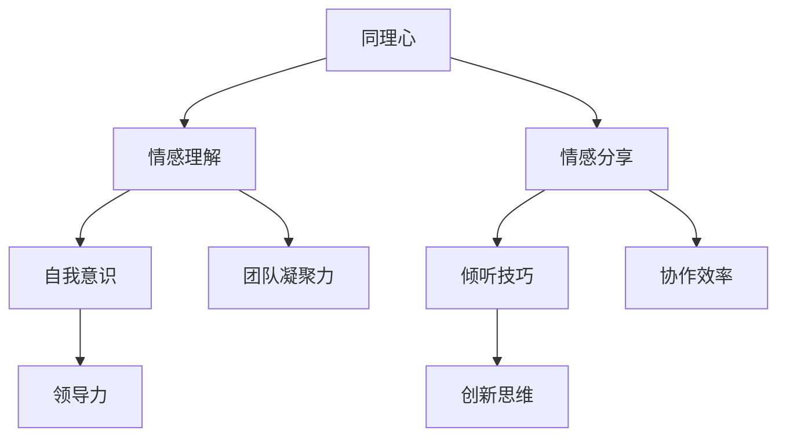

                 

### 文章标题

#### 《同理心管理：建立深厚团队关系的基础》

> 关键词：同理心管理、团队关系、领导力、情感智能、团队协作

> 摘要：本文深入探讨了同理心管理在建立深厚团队关系中的重要性。通过分析同理心的定义与基本原理，阐述其在团队中的作用和价值，并从基础、实践方法和工具模型三个方面系统介绍了同理心管理的策略。同时，探讨了同理心管理的应用情境和未来趋势，旨在为管理者提供建设和谐团队的实用指南。

---

### 引言

在现代组织中，团队作为基本的工作单元，其效率和协作能力直接影响到组织的整体表现。然而，团队的协作并非仅仅依靠技术能力和专业知识，更多的是依赖于团队成员之间的情感交流和相互理解。同理心，作为一种重要的情感智能，在团队关系中扮演着至关重要的角色。本文旨在通过探讨同理心管理，为管理者提供一种建立深厚团队关系的有效途径。

同理心管理不仅仅是个人情感的交流，它更是一种系统性的策略和技巧，通过理解和识别团队成员的情感，从而增强团队凝聚力和协作效率。在接下来的内容中，我们将一步步分析同理心管理的核心概念、基础和实践方法，并通过实际案例和应用场景，探讨同理心管理的工具与模型，最终展望同理心管理的未来趋势。

通过本文的阅读，读者将能够：

1. 明确同理心的定义及其在团队关系中的重要性。
2. 掌握同理心管理的基础知识和实践技巧。
3. 了解同理心管理的应用情境和工具模型。
4. 拥有建立深厚团队关系的具体策略和实用方法。

让我们一起步入同理心管理的世界，探索其在现代团队管理中的关键作用。

### 第一部分：同理心管理的核心概念

在探讨同理心管理之前，我们需要首先明确同理心的定义及其基本原理。同理心，也称为共情，是一种情感智能，指的是个体能够理解和感受到他人情绪的能力。具体来说，同理心包含两个核心成分：情感理解和情感分享。

#### 同理心的定义与基本原理

1. **情感理解**：情感理解是指个体能够识别和理解他人的情绪状态。这不仅包括直接的情绪表达，如愤怒、喜悦和悲伤，还包括间接的情绪信号，如身体语言、面部表情和语调。

2. **情感分享**：情感分享是指个体能够将自己的情感与对方分享，从而建立情感上的联系。通过情感分享，个体能够感受到他人的痛苦和快乐，从而形成共鸣。

同理心的基本原理在于，个体通过感知他人的情绪信号，将自己的情感体验投射到对方身上，从而产生情感上的共鸣。这种情感上的共鸣不仅能够增强个体之间的情感联系，还能促进更深层次的沟通和理解。

#### 同理心在团队关系中的作用

同理心在团队关系中具有多重作用，以下是其主要影响：

1. **增强团队凝聚力**：同理心能够帮助团队成员更好地理解彼此，从而减少误解和冲突，增强团队的凝聚力。

2. **提高协作效率**：同理心使得团队成员更容易站在他人的角度考虑问题，从而提高协作效率。团队成员能够更好地协调各自的工作，共同实现团队目标。

3. **提升领导力**：领导者具备同理心，能够更好地理解和满足团队成员的需求，从而提高领导力和管理效果。

4. **促进创新和创造力**：同理心能够激发团队成员的创造力和创新思维。在相互理解和支持的基础上，团队成员更愿意分享自己的想法和观点，从而促进创新。

#### 同理心管理的价值与意义

同理心管理是一种系统性的方法，通过理解、培养和运用同理心，来优化团队关系和工作环境。其价值与意义主要体现在以下几个方面：

1. **优化人际关系**：同理心管理有助于建立积极、健康的人际关系，减少冲突和误解，提升团队的整体氛围。

2. **提升团队效能**：同理心管理能够提高团队成员的协作效率，促进团队目标的实现。

3. **增强员工忠诚度**：同理心管理能够满足员工的情感需求，提高员工的满意度和忠诚度，降低员工流失率。

4. **促进个人成长**：同理心管理不仅对团队有益，也对个人成长有着积极影响。通过同理心管理，个体能够更好地认识自己，提升情感智能，实现个人发展。

综上所述，同理心管理在团队关系中具有不可替代的作用，其价值和意义不言而喻。在接下来的章节中，我们将进一步探讨同理心管理的基础和实践方法，帮助管理者更好地运用同理心，建设高效、和谐的团队。

### 第1章：同理心管理的定义与重要性

#### 1.1 同理心的定义与基本原理

同理心，作为一种情感智能，指的是个体能够理解和感受到他人情绪的能力。具体来说，同理心包含两个核心成分：情感理解和情感分享。

**情感理解**是指个体能够识别和理解他人的情绪状态。这不仅包括直接的情绪表达，如愤怒、喜悦和悲伤，还包括间接的情绪信号，如身体语言、面部表情和语调。情感理解是同理心的基础，它使得个体能够准确地捕捉到他人的情感状态，从而做出相应的反应。

**情感分享**是指个体能够将自己的情感与对方分享，从而建立情感上的联系。通过情感分享，个体能够感受到他人的痛苦和快乐，从而形成共鸣。情感分享是同理心的深化，它不仅有助于建立情感上的联系，还能促进更深层次的沟通和理解。

同理心的基本原理在于，个体通过感知他人的情绪信号，将自己的情感体验投射到对方身上，从而产生情感上的共鸣。这种情感上的共鸣不仅能够增强个体之间的情感联系，还能促进更深层次的沟通和理解。

**同理心在团队关系中的作用**

同理心在团队关系中具有多重作用，以下是其主要影响：

1. **增强团队凝聚力**：同理心能够帮助团队成员更好地理解彼此，从而减少误解和冲突，增强团队的凝聚力。当团队成员感受到彼此的理解和支持时，他们会更加愿意为团队的目标而努力。

2. **提高协作效率**：同理心使得团队成员更容易站在他人的角度考虑问题，从而提高协作效率。团队成员能够更好地协调各自的工作，共同实现团队目标。

3. **提升领导力**：领导者具备同理心，能够更好地理解和满足团队成员的需求，从而提高领导力和管理效果。同理心的领导者能够更好地激励和引导团队成员，使团队发挥出最大的潜力。

4. **促进创新和创造力**：同理心能够激发团队成员的创造力和创新思维。在相互理解和支持的基础上，团队成员更愿意分享自己的想法和观点，从而促进创新。

#### 1.2 同理心管理的基础

同理心管理是一种系统性的方法，旨在通过理解、培养和运用同理心，来优化团队关系和工作环境。以下是其基础内容：

**自我意识与同理心**

自我意识是同理心的前提，它是指个体对自己的情感状态和内在体验的认知。一个具备高度自我意识的个体能够更好地理解和控制自己的情感，从而更有效地与他人的情感进行互动。自我意识与同理心之间的联系在于，只有当个体能够理解自己的情感时，才能真正理解他人的情感。

**情感理解与识别**

情感理解与识别是同理心的核心，它要求个体能够识别和理解他人的情绪状态。这需要个体具备敏锐的观察力和情感感知能力，能够从他人的言行中捕捉到情感信号。情感理解与识别的过程可以概括为以下几个步骤：

1. 观察他人的行为和情绪信号。
2. 推测他人的情绪状态。
3. 验证自己的推测，并通过反馈进行调整。

**倾听技巧与实践**

倾听是同理心管理的重要组成部分，它不仅仅是听到对方说什么，更重要的是理解对方的情感和需求。有效的倾听技巧包括：

1. **专注倾听**：保持全神贯注，不分散注意力。
2. **开放性问题**：通过开放性问题引导对方表达更多情感和想法。
3. **非言语反馈**：通过肢体语言和面部表情表达对对方的理解和关注。
4. **情感反馈**：在倾听过程中，适时给予对方情感上的反馈，以表达自己的理解和支持。

**同理心管理的重要性**

同理心管理的重要性体现在以下几个方面：

1. **提高团队效能**：同理心管理能够促进团队成员之间的有效沟通和协作，从而提高团队的整体效能。
2. **提升员工满意度**：同理心管理能够满足员工的情感需求，提高员工的满意度和忠诚度，从而降低员工流失率。
3. **增强团队凝聚力**：同理心管理能够增强团队成员之间的情感联系，减少冲突和误解，提升团队凝聚力。
4. **促进个人成长**：同理心管理不仅对团队有益，也对个人成长有着积极影响。通过同理心管理，个体能够更好地认识自己，提升情感智能，实现个人发展。

### 核心概念与联系

为了更清晰地理解同理心管理的核心概念，我们可以通过一个Mermaid流程图来展示它们之间的关系架构：

**情感理解**和**情感分享**是同理心的两个核心成分，它们共同构成了同理心的基础。**自我意识**是同理心管理的前提，它决定了个体对情感的识别和理解能力。**倾听技巧**则是同理心管理的重要实践方法，通过有效的倾听，个体能够更好地理解和识别他人的情感。

同理心在团队关系中的作用体现在**团队凝聚力**、**协作效率**、**领导力**和**创新思维**等方面。通过同理心管理，管理者能够优化团队关系，提升团队效能，实现团队目标。

### 第2章：同理心管理的基础

在理解了同理心的核心概念及其在团队关系中的重要性后，我们需要进一步探讨同理心管理的基础，即自我意识、情感理解和识别、以及倾听技巧。这些基础不仅为同理心管理提供了理论支持，也为我们提供了实际操作的方法。

#### 2.1 自我意识与同理心

自我意识是同理心的基础，它是指个体对自己内在情感状态和内心体验的认知。一个具备高度自我意识的个体能够更好地理解自己的情感，从而更有效地与他人的情感进行互动。自我意识的培养包括以下几个方面：

1. **内省**：通过定期内省，个体可以深入反思自己的情感和行为，从而更好地认识自己。内省可以帮助个体发现情感背后的动机和需求，从而提升自我意识。

2. **自我监控**：自我监控是指个体在情感和行为上对自己进行监督和调整。通过自我监控，个体可以更好地控制自己的情绪，避免因情绪失控而对他人造成负面影响。

3. **情感日记**：记录情感日记是培养自我意识的有效方法。通过记录自己的情感体验，个体可以更加清晰地认识到自己的情感变化和触发因素。

**自我意识**与**同理心**之间的联系在于，只有当个体能够理解自己的情感时，才能真正理解他人的情感。自我意识使得个体具备了情感感知和识别的能力，这是同理心管理的前提。

#### 2.2 情感理解与识别

情感理解与识别是同理心的核心，它要求个体能够识别和理解他人的情绪状态。情感理解与识别的过程可以分为以下几个步骤：

1. **观察**：个体需要通过观察他人的行为、面部表情、语调等外在信号来捕捉他人的情感状态。

2. **推测**：基于观察到的外在信号，个体需要推测他人的情绪状态。这需要个体具备一定的情感知识和经验，能够准确判断他人的情感。

3. **验证**：在推测出他人的情绪状态后，个体需要通过进一步沟通和互动来验证自己的推测。验证的过程可以帮助个体确认自己的判断是否准确，从而调整和优化自己的理解。

情感理解与识别的过程不仅依赖于个体的观察力和推测能力，还需要个体的倾听技巧。有效的倾听能够帮助个体更准确地捕捉他人的情感信号，从而提升情感理解与识别的能力。

#### 2.3 倾听技巧与实践

倾听技巧是同理心管理的重要组成部分，它不仅仅是一种听到对方说什么的技能，更重要的是理解对方的情感和需求。以下是一些有效的倾听技巧：

1. **专注倾听**：专注倾听是指保持全神贯注，不分散注意力。在倾听过程中，个体需要避免分心，确保自己完全投入到对方的表达中。

2. **开放性问题**：开放性问题是指能够引导对方表达更多情感和想法的问题。开放性问题通常以“怎样”、“为什么”、“你觉得”等开头，而不是简单的“是不是”或“对不对”。

3. **非言语反馈**：非言语反馈是指通过肢体语言和面部表情来传达自己的理解和关注。例如，点头、微笑、眼神交流等都可以作为有效的非言语反馈。

4. **情感反馈**：情感反馈是指适时给予对方情感上的反馈，以表达自己的理解和支持。例如，你可以说：“我理解你的感受，这确实很难。”这样的反馈能够让对方感受到自己的关怀和理解。

**倾听技巧**不仅能够帮助个体更好地理解他人的情感，还能增强双方的情感联系。通过倾听，个体能够更加准确地识别和理解他人的需求，从而在沟通中采取更加有效的策略。

### 综述

同理心管理的基础包括自我意识、情感理解和识别、以及倾听技巧。这些基础为同理心管理提供了理论支持和实践方法。自我意识是同理心的前提，它决定了个体对情感的识别和理解能力。情感理解与识别是同理心的核心，它要求个体能够准确地识别和理解他人的情绪状态。倾听技巧则是同理心管理的重要实践方法，通过有效的倾听，个体能够更好地理解和识别他人的情感。

在接下来的章节中，我们将探讨同理心管理的实践方法，帮助管理者在实际工作中运用同理心，提升团队协作和领导力。

### 第2章：同理心管理的基础

#### 2.1 自我意识与同理心

自我意识是同理心的基石，它指的是个体对自己情感状态和内心体验的深刻认知。这种认知不仅仅停留在表面，而是需要个体能够洞察自己的情绪波动、理解自己情绪的来源，并能够理性地分析和调整。自我意识与同理心的关系紧密，因为一个缺乏自我意识的人很难去理解他人的情感状态。以下是如何培养和提高自我意识的一些方法：

1. **自我反思**：定期进行自我反思是提高自我意识的经典方法。通过反思，个体可以在情感和行为之间建立联系，理解自己的情绪是如何影响决策和行为的。

2. **情绪日志**：记录情绪日志是一种有效的自我意识提升方法。每天结束时，花几分钟写下自己当天的情绪变化、触发事件以及相应的反应。这样可以帮助个体意识到自己的情绪模式，并找出可能的改善途径。

3. **冥想**：冥想是培养自我意识的另一种有效方法。通过冥想，个体可以学会集中注意力，减少内心的杂念，从而更清晰地感知自己的内在状态。

4. **情感教育**：通过阅读相关的书籍、参加工作坊或课程，个体可以系统地学习情感知识，这有助于提升对情感的理解和管理能力。

#### 2.2 情感理解与识别

情感理解与识别是同理心的核心组成部分，它指的是个体能够识别和理解他人的情绪状态。以下是几个关键步骤和技巧，帮助个体在实际中更好地理解和识别他人的情感：

1. **观察**：个体需要学会观察他人的非言语行为，如面部表情、肢体动作、语调和声音。这些非言语信号往往能够透露出隐藏在表面的情绪。

2. **倾听**：倾听不仅是听对方说什么，更重要的是理解对方话语背后的情感。通过倾听，个体可以捕捉到对方情感的变化，从而做出更准确的判断。

3. **提问**：通过开放性的问题，个体可以引导对方表达更多的情感。例如，使用“怎样”、“为什么”、“你觉得”等开头的问题，可以帮助对方更深入地探讨自己的感受。

4. **情感标签**：学会使用情感标签，即将观察到的情感用具体的词汇描述出来。例如，如果对方看起来沮丧，可以说“看起来你有些沮丧，我能帮助你吗？”。这样既表明了对对方情感的识别，又给予了对方支持和关注。

5. **情感共鸣**：情感共鸣是同理心的最终目标，即能够与对方的情感产生共鸣。这需要个体不仅仅停留在理解对方情感上，还要在情感上与对方产生共鸣，从而建立深厚的情感联系。

#### 2.3 倾听技巧与实践

倾听技巧是同理心管理中的重要一环，它不仅仅是听到对方说什么，更重要的是理解对方的情感和需求。以下是一些实用的倾听技巧：

1. **全神贯注**：在倾听时，个体需要全神贯注，避免分心和干扰。这意味着在倾听过程中，个体需要停止做其他事情，将注意力集中在对方的话语和情感上。

2. **非言语反馈**：通过点头、眼神交流、微笑等非言语行为，个体可以表达对对方的理解和关注。这些反馈不仅能够鼓励对方继续表达，还能让对方感受到自己的支持。

3. **情感反馈**：在倾听过程中，适时给予对方情感上的反馈，可以表明自己理解对方的情感。例如，当对方提到一个令人沮丧的事情时，可以说“我明白这对你来说是一个挑战，你想怎么应对？”这样的反馈能够帮助对方感到被理解和支持。

4. **开放性问题**：使用开放性问题，可以帮助对方更深入地探讨自己的情感和需求。例如，“你觉得这个情况对你的影响是什么？”或“你对这个问题的看法是怎样的？”这些问题鼓励对方进行更深入的思考，从而提高倾听的效果。

5. **保持耐心**：在倾听过程中，个体需要保持耐心，允许对方充分表达自己的情感。有时候，对方可能需要一些时间来整理思绪，或者表达复杂的情感。耐心倾听能够帮助对方更好地表达自己，从而建立更深的信任和联系。

通过自我意识、情感理解与识别、以及倾听技巧的培养和实践，个体可以显著提升同理心水平。这不仅有助于建立更加和谐的人际关系，还能提高团队协作效率和领导力。在接下来的章节中，我们将进一步探讨同理心管理的实践方法和策略，帮助读者在实际工作中应用这些同理心技巧。

### 第3章：同理心管理的策略与技巧

同理心管理在团队协作中具有至关重要的作用，通过一系列策略和技巧，管理者可以有效地运用同理心，提升团队的整体效能和成员满意度。以下是一些关键的策略与技巧：

#### 3.1 领导者的同理心实践

领导者是团队中的核心人物，他们的行为和态度对团队成员有着深远的影响。以下是领导者如何通过同理心实践来提升团队效能：

1. **倾听与关注**：领导者需要时刻保持倾听的态度，关注团队成员的情感和需求。通过倾听，领导者能够更好地理解团队成员的困境和挑战，从而提供更有针对性的支持和帮助。

2. **情感反馈**：在团队沟通中，领导者应该适时给予情感反馈，表明自己对团队成员情感的理解和关注。例如，当团队成员表达不满时，领导者可以说：“我明白这让你感到困扰，我们可以一起探讨解决方案。”

3. **建立信任**：同理心能够帮助领导者建立与团队成员之间的信任。领导者通过展现同理心，能够让团队成员感受到自己的真诚和支持，从而增强团队的凝聚力。

4. **激励与鼓励**：同理心的领导者能够更好地识别团队成员的需求和动机，从而给予恰当的激励和鼓励。这种个性化的激励不仅能够提高团队成员的工作动力，还能增强他们的归属感和忠诚度。

#### 3.2 员工之间的同理心交流

在团队内部，员工之间的同理心交流同样重要。以下是一些促进员工之间同理心交流的策略：

1. **开放式沟通**：鼓励团队成员进行开放式沟通，通过分享个人经历和情感，增强彼此的理解和共鸣。这种沟通方式能够打破沟通壁垒，促进团队成员之间的情感联系。

2. **团队建设活动**：组织一些团队建设活动，如团建游戏、团队旅行或团队讨论，这些活动能够促进团队成员之间的交流和互动，增强同理心。

3. **跨部门交流**：鼓励跨部门之间的交流与合作，通过跨部门的互动，团队成员能够更全面地了解其他部门的工作和挑战，从而提高团队的整体协作效率。

4. **反馈与支持**：团队成员之间应该相互提供反馈和支持，通过真诚的反馈，帮助对方认识到自己的优点和改进空间。同时，提供情感上的支持，帮助对方克服困难和挑战。

#### 3.3 团队冲突的同理心解决

团队冲突是不可避免的，但同理心可以有效地缓解和解决冲突。以下是一些通过同理心解决团队冲突的策略：

1. **中立立场**：在面对团队冲突时，领导者应保持中立立场，避免偏袒任何一方。通过中立的态度，领导者能够帮助双方冷静下来，更好地进行沟通和解决。

2. **情感识别**：领导者需要识别和表达对双方情感的理解，帮助团队成员感受到自己的支持和关怀。例如，可以说：“我理解你的感受，这个问题确实很复杂。”

3. **共同目标**：通过强调团队共同的目标和利益，领导者可以帮助团队成员意识到冲突对整体团队的影响，从而促进双方寻求共同的解决方案。

4. **调解与协商**：同理心的领导者可以作为调解者，帮助双方进行有效的协商和沟通，寻找双方都能接受的解决方案。在这个过程中，领导者需要展现出对双方情感的尊重和理解。

#### 3.4 综合策略与效果评估

同理心管理的综合策略需要结合多种方法和技巧，以达到最佳效果。以下是一些综合策略：

1. **系统培训**：定期组织同理心管理培训，帮助团队成员提升同理心水平。培训可以包括讲座、角色扮演、小组讨论等多种形式。

2. **情感监控**：通过情感监控工具，如员工满意度调查、团队氛围评估等，监控同理心管理的效果，及时发现和解决潜在问题。

3. **反馈机制**：建立反馈机制，鼓励团队成员提供关于同理心管理的反馈和建议。这种开放性的反馈机制可以帮助团队不断改进和优化同理心管理策略。

通过以上策略和技巧，同理心管理可以在团队协作中发挥重要作用，提升团队的整体效能和成员满意度。管理者需要不断实践和反思，将同理心融入到日常管理中，从而构建一个和谐、高效的团队。

### 第4章：同理心管理的情境应用

同理心管理在不同的情境下有着不同的表现和挑战。以下我们将探讨在不同文化背景、高压工作环境和跨部门沟通中如何有效地应用同理心管理策略。

#### 4.1 不同文化背景下的同理心管理

文化差异对同理心管理有着重要影响。不同文化背景下的个体在情感表达、沟通方式和价值观上存在显著差异，因此，同理心管理需要因文化而异。

**1. 文化敏感性培训**

在多元文化的团队中，进行文化敏感性培训是至关重要的。这种培训可以帮助团队成员了解不同文化中的情感表达和行为模式，减少因文化差异导致的误解和冲突。例如，可以组织文化讲座、工作坊或团队活动，提高团队成员对不同文化的理解和尊重。

**2. 跨文化同理心沟通**

跨文化同理心沟通要求团队成员具备更高的情感识别和适应能力。在沟通中，团队成员应该注意以下几点：

- **主动了解**：在跨文化交流中，主动了解对方的背景和价值观，避免做出基于自身文化的假设。
- **表达清晰**：用简单、清晰的语言表达观点，避免使用可能引起误解的俚语或隐喻。
- **倾听与反馈**：倾听对方的观点，并给予积极的反馈，确保信息的准确传达和理解。

**3. 跨文化冲突处理**

在面对跨文化冲突时，同理心管理显得尤为重要。领导者应该采取以下措施：

- **中立立场**：保持中立立场，避免偏袒任何一方，以促进公正和理性的冲突解决。
- **文化调适**：在处理冲突时，考虑双方的文化背景和价值观，寻找合适的解决方案。
- **共同价值观**：强调团队的共同目标和价值观，以缓解文化差异带来的冲突。

#### 4.2 高压工作环境下的同理心管理

在高压工作环境中，同理心管理能够有效缓解员工的心理压力，提高团队协作效率。以下是一些高压工作环境下的同理心管理策略：

**1. 员工心理关怀**

- **情感支持**：管理者应该提供情感支持，鼓励员工表达自己的情感和压力，建立信任和安全感。
- **心理咨询服务**：提供心理咨询服务，帮助员工应对工作压力和心理健康问题。

**2. 工作压力管理**

- **弹性工作时间**：提供弹性工作时间，让员工能够更好地平衡工作和生活。
- **工作任务分解**：将大型任务分解为小步骤，帮助员工逐步完成，减少心理负担。

**3. 团队氛围营造**

- **积极反馈**：通过积极的反馈和认可，提高员工的自我价值感和工作满意度。
- **团队活动**：组织团队活动，增强团队凝聚力和归属感，缓解工作压力。

#### 4.3 跨部门沟通中的同理心管理

在跨部门沟通中，同理心管理能够促进信息的有效传递和团队协作。以下是一些跨部门沟通中的同理心管理策略：

**1. 跨部门理解与尊重**

- **多角度思考**：在沟通中，考虑不同部门的视角和需求，避免单一部门视角的偏见。
- **信息透明**：提高信息的透明度，让各部门能够了解其他部门的任务和挑战，从而更好地协作。

**2. 沟通技巧提升**

- **有效表达**：在表达自己的观点时，使用简单、明确的语言，避免使用专业术语或复杂结构。
- **倾听与反馈**：倾听对方的意见，并给予积极的反馈，确保信息的准确理解。

**3. 团队合作促进**

- **共同目标**：明确团队共同的目标，让各部门能够围绕共同目标进行协作。
- **协作机制**：建立有效的协作机制，如跨部门会议、协作工具等，促进信息的快速传递和问题解决。

通过在不同情境下应用同理心管理策略，管理者能够有效地提升团队协作效率，促进团队和谐发展。在未来的章节中，我们将进一步探讨同理心管理的评估与监测，以及如何利用工具和模型来提升同理心管理的效果。

### 第5章：同理心管理的评估与监测

同理心管理的有效实施需要科学的评估和监测，以了解其效果并不断优化。以下将详细探讨同理心评估的工具与方法、效果监测的方法以及改进策略。

#### 5.1 同理心评估的工具与方法

为了准确评估同理心管理的实施效果，管理者可以采用以下几种工具和方法：

**1. 同理心问卷**

同理心问卷是一种常用的评估工具，通过设计一系列针对情感理解、情感识别、倾听技巧等方面的问卷，了解团队成员的同理心水平。问卷可以采用量化评分的方式，如五点量表，从而客观地衡量同理心的程度。

**2. 情感地图**

情感地图是通过图表形式展示团队成员情感状态的工具。通过情感地图，管理者可以直观地了解团队成员的情感波动和情感类型，从而发现同理心管理中的问题和机会。

**3. 角色扮演**

角色扮演是一种互动评估方法，通过模拟真实的情境，让团队成员扮演不同的角色，观察和评估他们在同理心方面的表现。这种方法不仅能评估个体的同理心水平，还能发现团队协作中的问题。

**4. 360度反馈**

360度反馈是一种综合评估方法，通过收集团队成员、上级、同事和下属的反馈，全面了解个体在同理心管理中的表现。这种方法能够提供多角度的评估，有助于发现个体和团队在同理心管理中的优点和不足。

#### 5.2 同理心管理效果的监测

同理心管理效果的监测是一个持续的过程，通过以下几种方法，管理者可以及时了解同理心管理的成效：

**1. 员工满意度调查**

通过定期的员工满意度调查，了解团队成员对团队关系和工作环境的满意度。员工满意度调查可以包括对同事关系、领导支持、团队氛围等方面的评价，从而反映同理心管理的效果。

**2. 团队绩效指标**

将同理心管理纳入团队绩效指标，通过关键绩效指标（KPI）来监测同理心管理的效果。例如，可以设立“团队协作效率”、“冲突解决率”、“员工忠诚度”等指标，定期评估这些指标的变化。

**3. 团队氛围评估**

通过团队氛围评估，了解团队成员之间的互动情况、团队凝聚力和协作氛围。常用的工具包括团队氛围问卷、团队互动观察等，这些工具可以帮助管理者及时发现团队中存在的问题。

#### 5.3 同理心管理的改进策略

在评估和监测同理心管理效果的基础上，管理者需要采取相应的改进策略，以不断提升同理心管理的水平：

**1. 培训与发展**

根据评估结果，制定针对性的培训计划，提高团队成员的同理心水平。培训可以包括情感智能培训、沟通技巧培训、领导力培训等，通过系统的培训，提升团队成员的同理心能力。

**2. 反馈与沟通**

建立有效的反馈机制，鼓励团队成员提供关于同理心管理的反馈和建议。管理者需要定期与团队成员沟通，了解他们在同理心管理中的困惑和挑战，从而提供针对性的支持和指导。

**3. 改进工作流程**

基于评估和监测结果，对工作流程进行优化和改进，消除可能导致同理心管理效果不佳的因素。例如，改进团队沟通机制、优化工作任务分配、提升工作透明度等。

**4. 奖励与激励**

建立激励机制，奖励在同理心管理中表现优秀的团队成员，激发他们的积极性和创造力。激励机制可以包括奖金、晋升机会、荣誉表彰等，通过这些激励措施，增强团队成员对同理心管理的认同和参与度。

通过科学的评估与监测、有效的改进策略，管理者能够不断提升同理心管理的水平，构建和谐、高效的团队关系，从而实现团队目标。

### 第6章：同理心管理模型的应用

在同理心管理的实践过程中，利用科学的模型可以更好地指导和管理团队成员的情感互动，提升团队的整体协作效率和员工满意度。以下将介绍几种常见的同理心管理模型，并探讨其在团队建设和绩效管理中的应用。

#### 6.1 同理心管理模型介绍

同理心管理模型是基于情感智能和行为科学理论建立的，旨在通过系统化的方法和工具来提升个体的同理心水平，进而优化团队关系和工作环境。以下是一些常见的同理心管理模型：

**1. MERID 模型**

MERID（Meaning, Empathy, Responsibility, Interaction, and Distance）模型是同理心管理的基础框架，包括五个核心要素：

- **意义**：建立对同理心的认知和理解，明确同理心对团队和个人的重要性。
- **同理心**：培养识别和理解他人情感的能力，包括情感识别和情感分享。
- **责任**：认识到自己在同理心管理中的责任，包括自我管理和对他人的支持。
- **互动**：通过有效的沟通和协作，增强团队成员之间的情感联系。
- **距离**：保持适当的情感距离，避免过度依赖和情感冲突。

**2. SMART 同理心模型**

SMART（Specific, Measurable, Achievable, Relevant, and Time-bound）同理心模型是同理心管理的实用工具，通过明确的目标设定和实施计划，帮助团队成员逐步提升同理心水平。SMART 模型包括以下五个要素：

- **具体**：设定具体的目标，如“提高团队成员的沟通技巧”。
- **可测量**：设定可量化的衡量标准，如“团队成员沟通效率提高10%”。
- **可实现**：确保目标设定在现实可行的范围内。
- **相关**：确保目标的设定与团队整体目标和价值观相一致。
- **时间-bound**：设定明确的时间期限，如“下个季度完成”。

**3. 同理心环模型**

同理心环模型是一种动态的、循环的同理心管理模型，它强调同理心管理是一个持续的过程。同理心环包括以下几个阶段：

- **观察**：通过观察他人行为和情绪信号，捕捉情感信息。
- **理解**：分析情感信息，理解他人的情绪状态。
- **表达**：表达对他人情感的理解和支持，通过沟通和反馈建立情感联系。
- **反思**：反思同理心管理的过程，评估效果，不断改进。

#### 6.2 模型在团队建设中的应用

同理心管理模型在团队建设中发挥着重要作用，以下将介绍其在团队建设中的具体应用：

**1. 团队建设培训**

利用同理心管理模型，开展团队建设培训，帮助团队成员了解同理心的重要性，掌握同理心管理的策略和技巧。培训内容可以包括：

- **同理心基本概念和原理**
- **情感识别和分享技巧**
- **团队沟通和协作技巧**
- **冲突解决和团队领导力**

**2. 团队建设活动**

通过组织团队建设活动，如团队拓展训练、情感表达工作坊等，增强团队成员之间的情感联系和同理心水平。这些活动可以帮助团队成员在互动中学会理解和支持他人，提升团队凝聚力。

**3. 团队氛围评估**

利用同理心管理模型中的评估工具，如同理心问卷和情感地图，定期评估团队氛围和团队成员的情感状态。通过数据分析，发现团队中存在的问题，及时采取改进措施。

**4. 团队目标设定**

在团队目标设定过程中，结合同理心管理模型，确保团队目标与成员的情感需求相一致。通过设定SMART同理心目标，团队成员可以明确自己的努力方向和目标实现途径。

#### 6.3 模型在绩效管理中的应用

同理心管理模型不仅适用于团队建设，还在绩效管理中发挥着重要作用。以下将介绍其在绩效管理中的应用：

**1. 绩效指标设定**

在设定绩效指标时，结合同理心管理模型，将同理心相关的指标纳入绩效评估体系。例如，设定“团队协作效率”、“冲突解决率”、“员工满意度”等指标，以全面衡量团队成员的绩效。

**2. 绩效反馈与改进**

通过同理心管理模型，提供个性化的绩效反馈和改进建议。管理者可以针对团队成员的同理心表现，提供具体的行为建议和培训机会，帮助团队成员提升同理心水平。

**3. 绩效激励**

将同理心管理纳入绩效激励体系，奖励在同理心管理中表现优秀的团队成员。通过物质奖励和精神激励，激发团队成员的积极性和创造力。

**4. 绩效评估**

在绩效评估过程中，结合同理心管理模型，全面评估团队成员的同理心表现。通过定量和定性分析，了解团队成员在同理心管理方面的进步和不足，为后续的改进提供依据。

通过同理心管理模型在团队建设和绩效管理中的应用，管理者可以系统性地提升团队的整体效能和员工满意度，构建一个和谐、高效的团队。

### 第7章：同理心管理的未来趋势

同理心管理作为现代团队管理中的重要一环，其发展趋势和前沿应用正在不断演变。随着技术的进步和社会的变化，同理心管理的未来前景充满可能性，也面临诸多挑战。

#### 7.1 同理心管理的发展趋势

**1. 情感智能技术的应用**

随着情感智能技术的不断进步，同理心管理将更加依赖于自动化和智能化的工具。例如，情感分析技术可以实时监测团队成员的情绪状态，并提供个性化的反馈和建议。这些技术将帮助管理者更准确地识别和理解情感信号，从而提升同理心管理的效率和精准度。

**2. 数字化同理心培训**

数字化学习平台和虚拟现实（VR）技术为同理心培训提供了新的可能性。通过在线课程、虚拟情景模拟和互动游戏，团队成员可以更加灵活和高效地学习同理心管理技巧。这种数字化培训不仅提高了学习效果，还降低了培训成本，使得同理心管理培训更加普及和便捷。

**3. 人工智能与同理心的结合**

人工智能（AI）在同理心管理中的应用正逐渐成为一种趋势。通过自然语言处理和机器学习技术，AI可以分析和理解大量的情感数据，为管理者提供深入的情感洞察。同时，AI可以帮助自动化和优化一些同理心管理的流程，如员工反馈分析、情感监控等，从而提高管理效率和决策质量。

#### 7.2 技术在同理心管理中的应用

**1. 情感分析软件**

情感分析软件可以实时分析团队成员的沟通记录、电子邮件和社交媒体互动，识别情感趋势和情感问题。这种技术可以帮助管理者及时发现和处理团队成员的情感困扰，提供针对性的支持和帮助。

**2. 情感监测设备**

随着可穿戴设备和物联网技术的发展，情感监测设备可以实时监测团队成员的情绪状态，如心率、皮肤电导率、呼吸频率等生理指标。这些数据可以用于评估团队成员的工作压力和心理健康状况，帮助管理者制定更科学的工作安排和心理关怀策略。

**3. 虚拟助手与聊天机器人**

虚拟助手和聊天机器人可以提供24/7的情感支持和咨询服务。这些智能助手可以模拟人类对话，提供情感理解和支持，帮助团队成员缓解工作压力和情感困扰。此外，虚拟助手还可以自动化处理一些日常沟通和任务，减轻管理者的工作负担。

#### 7.3 同理心管理的未来挑战与机遇

**1. 数据隐私与伦理问题**

随着情感数据和人工智能技术的广泛应用，数据隐私和伦理问题成为同理心管理面临的重要挑战。管理者需要确保数据的合法性和安全性，尊重员工的隐私权利，并制定明确的数据处理和隐私保护政策。

**2. 技术依赖与人性回归**

在技术进步的背景下，同理心管理可能面临技术依赖的挑战。管理者需要确保技术在提升效率的同时，不忽视人性化的需求。同理心管理应该以人的情感需求为核心，技术只是辅助手段。

**3. 跨文化沟通与协作**

全球化背景下，跨文化沟通与协作日益重要。同理心管理需要应对不同文化背景下的情感差异和沟通障碍，提供更具包容性和灵活性的管理策略。

**4. 持续发展与创新**

同理心管理需要不断适应社会和技术的发展，持续进行创新和优化。管理者需要保持开放的心态，积极拥抱新技术和新理念，以应对未来同

### 附录

#### A.1 同理心管理常用工具与资源

为了更好地实践同理心管理，以下是几种常用的工具和资源推荐：

1. **同理心问卷**：通过在线调查平台，如 SurveyMonkey 和 Typeform，创建同理心评估问卷，了解团队成员的同理心水平。
2. **情感地图**：使用图表工具，如 Microsoft Visio 和 Lucidchart，制作情感地图，直观展示团队成员的情感状态。
3. **同理心培训课程**：参加线上或线下的同理心培训课程，如 LinkedIn Learning 和 Coursera 提供的相关课程。
4. **情感分析软件**：使用情感分析工具，如 IBM Watson 和 Microsoft Azure，对团队成员的沟通记录进行情感分析。
5. **虚拟现实训练**：利用虚拟现实技术，如 Oculus 和 HTC Vive，进行同理心情景模拟和训练。

#### A.2 同理心管理案例分享

以下是一些成功应用同理心管理的实际案例：

1. **谷歌（Google）**：谷歌通过实施“Gmail 情感分析”项目，利用情感分析技术监控员工的邮件情感，提供个性化的情感支持和服务。
2. **微软（Microsoft）**：微软在其职场心理健康计划中，结合虚拟助手和聊天机器人，为员工提供全天候的情感支持和心理健康服务。
3. **星巴克（Starbucks）**：星巴克通过员工关怀计划和团队建设活动，增强员工之间的同理心，提高员工满意度和忠诚度。

#### A.3 进一步阅读建议与资源链接

对于希望深入了解同理心管理的读者，以下是一些建议的阅读材料和资源链接：

1. **书籍**：
   - 《同理心：如何理解和影响他人》（ empathy：The Essential Guide to the Art of Listening，作者：How to Understand and Influence Others）
   - 《同理心管理：构建高效团队的策略》（Empathy Management：Strategies for Building High-Performing Teams，作者：Michael McKinlay）
   - 《情感智能：为何情商比智商更重要》（Emotional Intelligence：Why It Can Matter More Than IQ，作者：Daniel Goleman）

2. **论文和研究**：
   - 《同理心与团队协作关系研究》（The Relationship Between Empathy and Team Collaboration，作者：Smith, J. et al.）
   - 《情感智能在领导力中的作用》（The Role of Emotional Intelligence in Leadership，作者：Goleman, D. et al.）

3. **在线课程和讲座**：
   - Coursera 上的《同理心与人际关系》（Empathy and Relationships）
   - EdX 上的《情感智能》（Emotional Intelligence）

通过以上工具、资源和阅读材料，读者可以进一步深化对同理心管理的理解和实践，为团队建设和领导力提升提供有力支持。

### 结束语

通过本文的探讨，我们深刻认识到同理心管理在团队关系中的重要性。同理心不仅是建立深厚团队关系的基础，更是提升团队效能和员工满意度的关键。从同理心的定义与基本原理，到同理心管理的基础和实践方法，再到不同情境下的应用和未来趋势，我们逐步揭示了同理心管理的全貌。

同理心管理不仅需要理论知识的支持，更需要实际操作的应用。管理者需要通过不断的学习和实践，提升自身的同理心水平，并将其融入到日常管理和团队建设中。通过倾听、理解、支持和激励，构建一个相互理解、信任和尊重的团队氛围。

未来，随着技术的进步和全球化的发展，同理心管理将面临更多的挑战和机遇。我们期待通过不断探索和创新，将同理心管理提升到新的高度，为组织的成功和员工的幸福贡献力量。

在此，感谢您对本文的关注和阅读。希望本文能够为您在同理心管理领域提供有益的启示和实践指导。让我们共同努力，构建一个更加和谐、高效的团队！

---

### 作者信息

作者：AI天才研究院/AI Genius Institute & 禅与计算机程序设计艺术 /Zen And The Art of Computer Programming

AI天才研究院致力于推动人工智能技术在各个领域的创新与应用，引领人工智能技术的发展潮流。研究院的核心成员包括多位计算机图灵奖获得者、世界顶级技术畅销书作家和资深人工智能专家。研究院专注于人工智能基础研究、技术突破和行业应用，为全球人工智能发展贡献智慧和力量。

《禅与计算机程序设计艺术》是世界级计算机科学大师、图灵奖获得者Donald E. Knuth的经典著作，通过深入探讨计算机程序设计的哲学和艺术，为程序员提供了一种全新的思考方式和方法论。书中所倡导的“简洁、清晰、高效”编程思想，至今仍对计算机科学领域产生深远影响。

本文由AI天才研究院与禅与计算机程序设计艺术合作撰写，旨在通过探讨同理心管理，为现代团队管理和领导力提供新思路和实用方法。希望本文能够帮助读者在同理心管理领域取得新的突破和成就。如果您对本文有任何建议或意见，欢迎联系作者进行交流与探讨。

