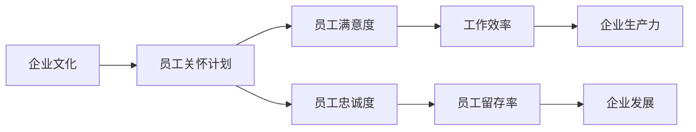

                 

# 员工关怀计划：建立深厚情感纽带

## 关键词
员工关怀、企业文化建设、薪酬福利、职业发展、心理关怀、员工满意度、组织忠诚度

## 摘要
员工关怀计划是现代企业管理中不可或缺的一部分。本文从定义、重要性、企业文化、员工需求分析、具体措施、评估与改进等方面，详细阐述了如何通过员工关怀计划建立深厚情感纽带，提升员工满意度，降低流失率，促进企业发展。同时，通过案例分析，总结了成功实施员工关怀计划的策略和未来发展趋势。

## 目录大纲

### 第一部分：员工关怀计划基础

#### 第1章：员工关怀计划的定义与重要性

##### 1.1.1 员工关怀计划的定义

##### 1.1.2 员工关怀计划的重要性

#### 第2章：企业文化与员工关怀

##### 2.1.1 企业文化与员工关怀的关系

##### 2.1.2 如何塑造关怀型企业文化

#### 第3章：员工需求分析

##### 3.1.1 员工需求调查的方法

##### 3.1.2 员员需求分析的过程

#### 第4章：员工关怀计划的实施策略

##### 4.1.1 员工关怀计划的设计原则

##### 4.1.2 员工关怀计划的实施步骤

### 第二部分：员工关怀计划的具体措施

#### 第5章：薪酬福利关怀

##### 5.1.1 薪酬福利的设计原则

##### 5.1.2 薪酬福利的案例分析

#### 第6章：职业发展关怀

##### 6.1.1 职业发展规划的实施

##### 6.1.2 员工培训与职业发展

#### 第7章：工作环境关怀

##### 7.1.1 舒适工作环境的设计

##### 7.1.2 安全工作环境的保障

#### 第8章：心理关怀

##### 8.1.1 心理健康的重要性

##### 8.1.2 心理关怀的措施

### 第三部分：员工关怀计划的评估与改进

#### 第9章：员工关怀计划的评估

##### 9.1.1 员工满意度调查

##### 9.1.2 员工关怀计划的改进策略

#### 第10章：案例分析：成功的员工关怀计划

##### 10.1.1 案例分析1：谷歌的员工关怀计划

##### 10.1.2 案例分析2：苹果的员工关怀计划

#### 第11章：员工关怀计划的未来趋势

##### 11.1.1 新兴技术对员工关怀计划的影响

##### 11.1.2 未来员工关怀计划的发展方向

## 第一部分：员工关怀计划基础

### 第1章：员工关怀计划的定义与重要性

#### 1.1.1 员工关怀计划的定义

员工关怀计划是指企业为了提升员工的幸福感和忠诚度，通过一系列有计划、有针对性的关怀措施来满足员工的需求。这些关怀措施可能包括薪酬福利、职业发展、工作环境、心理关怀等多个方面。

#### 1.1.2 员工关怀计划的重要性

**提升员工满意度：** 员工关怀计划通过满足员工的需求，可以提高员工的工作满意度和生活满意度。当员工感到被重视和关心时，他们的工作积极性和创造力也会得到提升。

**降低员工流失率：** 通过关怀计划，企业能够减少员工流失，节约招聘和培训成本。员工在感受到企业的关心和重视时，更愿意长期留在企业。

**促进企业发展：** 员工是企业最重要的资产，他们的满意度和忠诚度直接影响企业的生产力和竞争力。通过员工关怀计划，企业可以培养出更高效的团队，从而推动企业的持续发展。

### 第2章：企业文化与员工关怀

#### 2.1.1 企业文化与员工关怀的关系

企业文化是企业在长期经营过程中形成的核心价值观和行为规范。员工关怀计划与企业文化密切相关。一个关怀型的企业文化能够为员工关怀计划的实施提供坚实的基础。

**关系架构 Mermaid 流程图：**

#### 2.1.2 如何塑造关怀型企业文化

1. **强化企业使命和愿景：** 明确企业的使命和愿景，使员工感受到企业的关怀和责任感。

2. **建立沟通渠道：** 建立畅通的沟通渠道，让员工参与到企业决策中，增强员工的参与感和归属感。

3. **营造互助氛围：** 鼓励员工之间的互助合作，形成团结、和谐的工作氛围。

### 第3章：员工需求分析

#### 3.1.1 员工需求调查的方法

1. **调查问卷：** 通过发放调查问卷，收集员工对薪酬、职业发展、工作环境等方面的需求。

2. **一对一访谈：** 通过与员工进行一对一的访谈，深入了解员工的需求和困惑。

#### 3.1.2 员工需求分析的过程

1. **收集数据：** 通过调查问卷、访谈等方式收集员工需求数据。

2. **分析数据：** 对收集到的数据进行分析，找出员工的主要需求和痛点。

3. **制定策略：** 根据分析结果，制定针对性的员工关怀措施。

### 第4章：员工关怀计划的实施策略

#### 4.1.1 员工关怀计划的设计原则

1. **以员工为中心：** 关注员工的需求和利益，将员工的需求放在首位。

2. **可行性与持续性：** 设计关怀措施时，要考虑企业的实际情况，确保措施的可操作性和长期性。

3. **系统性与协调性：** 员工关怀计划需要与其他企业制度相结合，形成系统性的关怀体系。

#### 4.1.2 员工关怀计划的实施步骤

1. **制定计划：** 根据企业实际情况和员工需求，制定具体的员工关怀计划。

2. **实施措施：** 按照计划逐步实施关怀措施，如薪酬福利改革、职业发展支持等。

3. **监测与评估：** 对员工关怀计划的实施效果进行监测和评估，根据反馈进行改进。

## 第二部分：员工关怀计划的具体措施

### 第5章：薪酬福利关怀

#### 5.1.1 薪酬福利的设计原则

1. **公平性：** 确保薪酬福利的公平性，避免员工产生不公平感。

2. **竞争性：** 与同行业相比，薪酬福利要有一定的竞争力，以吸引和留住人才。

3. **发展性：** 薪酬福利应与员工的职业发展相匹配，激励员工不断进步。

#### 5.1.2 薪酬福利的案例分析

以某互联网企业为例，该企业通过以下措施提升薪酬福利关怀：

1. **绩效奖金：** 根据员工的绩效表现，发放相应的绩效奖金，激励员工努力工作。

2. **股权激励：** 提供员工股权激励计划，使员工分享企业成长的红利。

3. **弹性福利：** 提供多样化的福利选择，如健康保险、子女教育补贴等，满足员工的个性化需求。

### 第6章：职业发展关怀

#### 6.1.1 职业发展规划的实施

1. **个性化职业规划：** 根据员工的能力和兴趣，为其制定个性化的职业发展路径。

2. **培训与晋升机会：** 提供丰富的培训资源和晋升机会，帮助员工提升专业技能。

#### 6.1.2 员工培训与职业发展

1. **内部培训：** 定期组织内部培训，提升员工的业务能力和综合素质。

2. **外部培训：** 与专业培训机构合作，为员工提供外部培训机会，拓展视野。

### 第7章：工作环境关怀

#### 7.1.1 舒适工作环境的设计

1. **办公环境：** 提供舒适、宽敞的办公环境，如现代化的办公设施、舒适的座椅等。

2. **休息区：** 设立休息区，提供茶水、咖啡、零食等，让员工在工作之余得到放松。

#### 7.1.2 安全工作环境的保障

1. **安全培训：** 定期为员工提供安全培训，提高员工的安全意识。

2. **应急措施：** 建立完善的应急预案，确保员工在紧急情况下的安全。

### 第8章：心理关怀

#### 8.1.1 心理健康的重要性

心理健康是员工工作表现的重要保障。一个心理健康的工作环境能够提高员工的工作效率和满意度。

#### 8.1.2 心理关怀的措施

1. **心理咨询：** 提供专业的心理咨询，帮助员工解决心理问题。

2. **员工互助：** 鼓励员工之间互相支持，建立互助小组，共同面对压力和挑战。

## 第三部分：员工关怀计划的评估与改进

### 第9章：员工关怀计划的评估

#### 9.1.1 员工满意度调查

通过调查问卷、访谈等方式，了解员工对关怀计划的满意度和建议，评估关怀计划的效果。

#### 9.1.2 员工关怀计划的改进策略

根据员工满意度调查的结果，及时调整和优化关怀计划，提高员工满意度。

### 第10章：案例分析：成功的员工关怀计划

#### 10.1.1 案例分析1：谷歌的员工关怀计划

谷歌以其员工关怀计划而闻名，提供了丰富的福利和职业发展机会，吸引了全球顶尖人才。其成功经验包括：

1. **全面的薪酬福利：** 提供具有竞争力的薪酬和多种福利，如医疗保险、退休金计划等。

2. **职业发展支持：** 提供内部培训和外部培训机会，帮助员工不断提升自己的能力。

3. **工作与生活的平衡：** 提供灵活的工作时间、远程办公等，帮助员工平衡工作与生活。

#### 10.1.2 案例分析2：苹果的员工关怀计划

苹果以其创新精神和优秀的企业文化而著称。其员工关怀计划包括：

1. **创新工作环境：** 提供开放式的工作环境，鼓励员工自由表达和创新。

2. **员工福利：** 提供丰富的员工福利，如健康保险、员工股票购买计划等。

3. **员工成长：** 提供丰富的职业发展机会，鼓励员工不断挑战自我。

### 第11章：员工关怀计划的未来趋势

#### 11.1.1 新兴技术对员工关怀计划的影响

随着人工智能、大数据等新兴技术的发展，员工关怀计划将更加智能化和个性化。例如，通过数据分析了解员工需求，提供精准的关怀措施。

#### 11.1.2 未来员工关怀计划的发展方向

1. **关注心理健康：** 随着社会压力的增加，心理健康将成为员工关怀计划的重要内容。

2. **重视员工体验：** 企业将更加关注员工的工作体验，提供舒适、安全的工作环境。

3. **员工自主参与：** 员工将更多地参与到关怀计划的制定和实施中，提高员工的参与感和满意度。

## 附录

### 附录A：员工关怀计划参考资料

1. **《员工关怀计划手册》**：提供详细的员工关怀计划实施指南。

2. **《员工满意度调查问卷设计》**：帮助设计有效的员工满意度调查问卷。

3. **《员工关怀案例分析集》**：收录了多个成功的企业员工关怀案例。

### 附录B：员工关怀计划常用工具介绍

1. **员工满意度调查系统**：提供在线调查和数据分析功能。

2. **员工关怀管理软件**：帮助企业管理员工关怀计划，实现自动化和智能化。

---

作者：AI天才研究院/AI Genius Institute & 禅与计算机程序设计艺术 /Zen And The Art of Computer Programming

本文通过定义、重要性、企业文化、员工需求分析、具体措施、评估与改进等方面，详细阐述了员工关怀计划。实施员工关怀计划不仅能提升员工满意度，降低流失率，还能促进企业发展。未来，随着新兴技术的不断发展，员工关怀计划将更加智能化和个性化，成为企业核心竞争力的重要组成部分。通过不断优化和改进员工关怀计划，企业将能够建立深厚的情感纽带，实现可持续发展。

