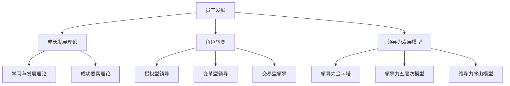

                 

### 文章标题

《员工发展：培养未来领导者的策略》

### 关键词

- 员工发展
- 未来领导者
- 领导力培养
- 成长与发展理论
- 学习与发展理论
- 成功要素理论
- 数据驱动评估
- 个性化发展路径
- 领导风格
- 领导效能
- 项目实战

### 摘要

本文旨在深入探讨员工发展与领导力培养之间的关系，以及如何通过有效的策略来培养未来领导者。文章首先介绍了员工发展的定义与重要性，分析了未来领导者的特征与需求。接着，本文构建了一个员工发展的理论框架，并阐述了未来领导者的发展路径。通过Mermaid流程图，详细展示了员工发展与领导力培养的核心概念与联系。文章还深入讲解了员工发展策略的设计原理，以及未来领导者培养的算法原理，并使用伪代码进行了详细阐述。最后，本文通过数学模型和项目实战，提供了具体的实践指导，以帮助组织在员工发展和领导力培养方面取得成功。通过本文的阅读，读者将能够获得关于员工发展与领导力培养的深刻见解和实践指导。

### 《员工发展：培养未来领导者的策略》目录大纲

#### 第一部分：引言

##### 1.1 员工发展的重要性
###### 1.1.1 员工发展的定义与意义
###### 1.1.2 员工发展与组织绩效的关系

##### 1.2 未来领导者的特征与需求
###### 1.2.1 未来领导者的定义
###### 1.2.2 未来领导者所需的关键能力

##### 1.3 本书结构安排与阅读指南
###### 1.3.1 本书整体结构概述
###### 1.3.2 各章节重点内容预览

#### 第二部分：核心概念与联系

##### 2.1 员工发展的理论框架
###### 2.1.1 成长发展理论
###### 2.1.2 学习与发展理论
###### 2.1.3 成功要素理论

##### 2.2 未来领导者的发展路径
###### 2.2.1 从员工到领导者的角色转变
###### 2.2.2 领导力发展模型
###### 2.2.3 领导风格与领导效能

##### 2.3 员工发展与领导力培养的Mermaid流程图

#### 第三部分：核心算法原理讲解

##### 3.1 员工发展策略的设计原理
###### 3.1.1 目标设定与目标管理
###### 3.1.2 行动计划与执行监控
###### 3.1.3 反馈机制与持续改进

##### 3.2 未来领导者培养的算法原理
###### 3.2.1 数据驱动的领导力评估
###### 3.2.2 个性化发展路径规划
###### 3.2.3 领导力培养的A/B测试方法

##### 3.3 员工发展策略与领导力培养算法原理的伪代码

#### 第四部分：数学模型和数学公式

##### 4.1 成长发展模型中的关键数学公式
$$
M = f(t, E, I)
$$

##### 4.2 领导力培养模型中的数学公式
$$
L = f(C, K, S)
$$

#### 第五部分：项目实战

##### 5.1 开发环境搭建
##### 5.2 源代码详细实现和代码解读
##### 5.3 代码应用解读与分析
##### 5.4 实际案例分析和详细讲解剖析
##### 5.5 项目小结

#### 第六部分：最佳实践、小结、注意事项、拓展阅读

##### 6.1 最佳实践
##### 6.2 小结
##### 6.3 注意事项
##### 6.4 拓展阅读

---

#### 第一部分：引言

##### 1.1 员工发展的重要性

**1.1.1 员工发展的定义与意义**

员工发展是指通过一系列的培训、指导和激励措施，帮助员工在职业和个人层面上实现成长和提升的过程。它不仅包括技能和知识的提升，还包括员工的自我认知、情感素质和领导能力的培养。

员工发展的意义在于：

- **提升员工绩效**：通过培训和指导，员工能够更好地理解自己的工作职责，提高工作效率和质量。
- **增强员工满意度**：当员工感受到自己在职业上得到了成长和认可时，他们的工作满意度和忠诚度也会相应提高。
- **促进组织发展**：员工发展能够培养出具备领导潜力和创新能力的员工，为组织的长远发展提供强有力的支持。

**1.1.2 员工发展与组织绩效的关系**

员工发展对组织绩效有着深远的影响。通过以下方面，员工发展能够提升组织整体绩效：

- **知识传递**：员工发展有助于将组织的核心知识和经验传递给新员工，确保组织知识的连续性和积累。
- **创新能力**：员工发展鼓励员工不断学习新知识和技能，从而激发创新思维和创造力。
- **团队协作**：通过员工发展，员工能够更好地理解团队合作的重要性，提高团队协作效率。
- **领导力培养**：员工发展计划中通常包括领导力培训，这有助于培养未来领导者，确保组织的人才梯队建设。

**1.2 未来领导者的特征与需求**

未来领导者需要具备一系列的关键能力和特质，以应对快速变化和复杂的商业环境。以下是一些未来领导者的特征与需求：

- **全球视野**：未来领导者需要具备全球视野，能够理解和适应不同文化背景和市场需求。
- **创新能力**：在快速变化的环境中，领导者必须具备创新能力，能够引领组织进行战略调整和业务创新。
- **适应能力**：未来领导者需要具备高度的适应能力，能够迅速应对市场变化和内部挑战。
- **领导力**：领导者需要具备强大的领导力，能够激发团队的潜力，实现共同的目标。

**1.3 本书结构安排与阅读指南**

本书分为五个主要部分：

1. **引言**：介绍员工发展和未来领导者的概念，以及它们对组织的重要性。
2. **核心概念与联系**：探讨员工发展的理论框架，以及未来领导者的发展路径。
3. **核心算法原理讲解**：详细讲解员工发展策略和领导力培养的算法原理。
4. **数学模型和数学公式**：介绍成长发展模型和领导力培养模型中的关键数学公式。
5. **项目实战**：通过实际案例，展示如何将理论应用到实践中。

本书适合企业管理者、人力资源专业人士、培训师以及对员工发展和领导力培养感兴趣的读者阅读。通过本书，读者将能够获得关于员工发展和领导力培养的深入见解和实用策略。

---

在引言部分，我们首先介绍了员工发展的定义与意义，以及员工发展与组织绩效的关系。接着，我们探讨了未来领导者的特征与需求，并概述了本书的结构安排与阅读指南。这一部分为后续内容奠定了基础，使读者能够清晰地了解员工发展和领导力培养的重要性。

---

#### 第二部分：核心概念与联系

在本文的第二部分，我们将深入探讨员工发展的核心概念与联系，以及未来领导者的发展路径。这一部分的内容是理解员工发展和领导力培养的关键，我们将通过理论框架和实际案例来详细解释这些概念。

##### 2.1 员工发展的理论框架

员工发展的理论框架是理解员工成长和提升的基础。以下是几个关键理论：

**2.1.1 成长发展理论**

成长发展理论认为，员工的发展是一个持续的过程，包括自我认知、技能提升和情感成长。以下是几个核心观点：

- **自我认知**：员工需要通过自我反思和评估来了解自己的优势和劣势，从而制定合适的发展计划。
- **技能提升**：通过培训和学习，员工能够不断掌握新的技能和知识，提升自己的职业竞争力。
- **情感成长**：情感素质，如情绪管理、团队合作和沟通能力，也是员工发展的重要组成部分。

**2.1.2 学习与发展理论**

学习与发展理论强调学习在员工发展中的作用。以下是几个核心观点：

- **持续学习**：员工需要不断学习新的知识和技能，以适应快速变化的工作环境。
- **实践应用**：通过将学习到的知识应用到实际工作中，员工能够更好地巩固和应用所学。
- **反馈与调整**：通过持续的反馈和调整，员工能够不断改进自己的工作表现和职业发展路径。

**2.1.3 成功要素理论**

成功要素理论认为，员工的成功取决于多个因素，包括个人能力、工作环境和组织支持。以下是几个核心观点：

- **个人能力**：员工的技能、知识和经验是成功的基础。
- **工作环境**：一个积极、支持和包容的工作环境有助于员工的发展。
- **组织支持**：组织提供的培训、指导和资源对员工的发展至关重要。

##### 2.2 未来领导者的发展路径

未来领导者需要具备一系列的关键能力和特质，以应对不断变化的市场环境和组织挑战。以下是未来领导者的发展路径：

**2.2.1 从员工到领导者的角色转变**

从员工到领导者的角色转变是一个关键步骤。以下是一些关键点：

- **自我认知**：领导者需要了解自己的优势和劣势，以及如何将这些优势转化为领导能力。
- **责任感**：领导者需要承担责任，不仅对自己的工作负责，还要对团队成员和整个组织的成功负责。
- **领导风格**：领导者需要根据自己的个性和工作环境选择合适的领导风格，以激发团队成员的潜力。

**2.2.2 领导力发展模型**

领导力发展模型提供了领导者成长和提升的框架。以下是几个关键模型：

- **领导力金字塔**：领导力金字塔模型将领导力分为多个层次，从技术技能到战略思维。
- **领导力五层次模型**：该模型认为领导力可以分为五个层次，从自我领导到团队领导。
- **领导力冰山模型**：该模型将领导力分为表面的行为和背后的动机与信念，强调内在素质的重要性。

**2.2.3 领导风格与领导效能**

领导风格对领导效能有着重要影响。以下是几种常见的领导风格：

- **授权型领导**：领导者给予团队成员更多的自主权和责任，以激发他们的创造力和潜力。
- **变革型领导**：领导者通过激励和愿景引导团队成员实现变革，推动组织的创新和成长。
- **交易型领导**：领导者通过奖励和惩罚来激励团队成员，确保组织目标的实现。

##### 2.3 员工发展与领导力培养的Mermaid流程图

为了更好地理解员工发展与领导力培养的关系，我们使用Mermaid流程图来展示这些核心概念和联系。以下是一个简化的流程图：



这个流程图展示了员工发展如何通过成长发展理论、学习与发展理论和成功要素理论，与领导力发展模型、领导风格和领导效能建立联系。

---

在第二部分，我们详细介绍了员工发展的理论框架，包括成长发展理论、学习与发展理论和成功要素理论。接着，我们探讨了未来领导者的发展路径，从角色转变到领导力发展模型，再到领导风格与领导效能。最后，我们通过Mermaid流程图展示了这些核心概念和联系。这一部分为理解和实施有效的员工发展策略提供了理论基础。

---

#### 第三部分：核心算法原理讲解

在第三部分，我们将深入讲解员工发展策略的设计原理，以及未来领导者培养的算法原理。这些核心算法原理不仅为员工发展和领导力培养提供了理论基础，还通过伪代码的形式展示了具体实现过程。

##### 3.1 员工发展策略的设计原理

员工发展策略的设计需要考虑多个因素，包括目标设定、行动计划、执行监控和反馈机制。以下是员工发展策略设计的核心原理：

**3.1.1 目标设定与目标管理**

目标设定是员工发展策略的第一步。明确的目标能够为员工提供清晰的发展方向和动力。以下是目标设定的原则：

- **SMART原则**：目标应该是具体（Specific）、可衡量（Measurable）、可实现（Achievable）、相关性（Relevant）和时限性（Time-bound）。
- **目标分解**：将大目标分解为小目标，有助于员工逐步实现发展目标。

**3.1.2 行动计划与执行监控**

制定详细的行动计划是实现目标的关键。以下是行动计划的设计原则：

- **步骤明确**：行动计划应包括明确的步骤和行动计划，确保员工知道如何实现目标。
- **资源分配**：明确需要的资源和时间，确保计划的可执行性。
- **执行监控**：定期监控行动计划进展，确保目标按时完成。

**3.1.3 反馈机制与持续改进**

反馈机制是员工发展策略的重要组成部分。以下是反馈机制的设计原则：

- **及时反馈**：及时给予员工反馈，帮助他们了解自己的表现和进步。
- **建设性反馈**：反馈应具有建设性，强调改进的方向和建议，而不是批评。
- **持续改进**：通过持续的反馈和改进，员工能够不断优化自己的发展策略。

**3.2 未来领导者培养的算法原理**

未来领导者培养需要基于数据驱动的评估和个性化的路径规划。以下是未来领导者培养的算法原理：

**3.2.1 数据驱动的领导力评估**

数据驱动的领导力评估是领导者培养的第一步。以下是评估的关键步骤：

- **数据收集**：收集领导者的行为数据、绩效数据和团队反馈数据。
- **数据清洗**：对收集到的数据进行分析和处理，去除噪声和异常值。
- **特征提取**：从数据中提取关键特征，如沟通能力、决策能力和团队协作能力。

**3.2.2 个性化发展路径规划**

基于数据驱动的评估结果，个性化的发展路径规划能够更好地满足领导者的需求。以下是路径规划的关键步骤：

- **需求分析**：分析领导者的优势和劣势，以及他们的发展需求。
- **路径设计**：设计适合领导者的个性化发展路径，包括培训课程、导师指导和领导力项目。
- **路径调整**：根据领导者的进展和反馈，持续调整发展路径，确保其有效性。

**3.2.3 领导力培养的A/B测试方法**

A/B测试是验证领导力培养策略的有效方法。以下是A/B测试的关键步骤：

- **实验设计**：设计实验，比较不同发展路径的效果。
- **数据收集**：收集实验数据，包括领导者的绩效数据和团队反馈数据。
- **结果分析**：分析实验结果，确定最佳的发展路径。
- **决策依据**：根据实验结果，制定最终的领导力培养策略。

**3.3 员工发展策略与领导力培养算法原理的伪代码**

以下是员工发展策略和领导力培养算法原理的伪代码：

```plaintext
# 员工发展策略设计
function DevelopEmployeeStrategy(employeeData, organizationalGoal) {
    // Step 1: 目标设定
    employeeGoal = SetGoal(employeeData, organizationalGoal)
    
    // Step 2: 行动计划
    actionPlan = CreateActionPlan(employeeGoal)
    
    // Step 3: 执行监控
    monitorProgress = MonitorActionPlan(actionPlan)
    
    // Step 4: 反馈机制
    improvementPlan = ApplyFeedback(employeeGoal, monitorProgress)
    
    return improvementPlan
}

# 未来领导者培养算法
function DevelopLeaderStrategy(leaderData, developmentGoals) {
    // Step 1: 领导力评估
    leaderRating = AssessLeadership(leaderData)
    
    // Step 2: 个性化发展路径规划
    developmentPath = PlanPersonalizedPath(leaderRating, developmentGoals)
    
    // Step 3: A/B测试
    testResults = ConductABTest(developmentPath)
    
    // Step 4: 持续改进
    improvedStrategy = ApplyTestResults(testResults, developmentPath)
    
    return improvedStrategy
}
```

通过上述伪代码，我们可以看到员工发展策略和领导力培养算法的框架和步骤。这些算法原理为员工发展和领导力培养提供了科学的方法和工具。

---

在第三部分，我们详细讲解了员工发展策略的设计原理，包括目标设定与目标管理、行动计划与执行监控、反馈机制与持续改进。接着，我们探讨了未来领导者培养的算法原理，包括数据驱动的领导力评估、个性化发展路径规划和A/B测试方法。通过伪代码的形式，我们展示了这些算法原理的具体实现过程。这一部分为员工发展和领导力培养提供了实用的算法指导。

---

#### 第四部分：数学模型和数学公式

在第四部分，我们将介绍员工发展中的数学模型和数学公式，这些模型和公式为我们理解和分析员工发展提供了定量化的方法。我们将分别详细解释两个关键模型：成长发展模型和领导力培养模型。

##### 4.1 成长发展模型中的关键数学公式

成长发展模型是一个用于描述员工在职业和个人层面上成长过程的模型。其核心数学公式如下：

$$
M = f(t, E, I)
$$

其中：

- \( M \)：表示员工的成长水平（Maturity Level）。
- \( t \)：表示时间（Time），即员工在工作中的时间累积。
- \( E \)：表示员工的经验（Experience），包括技能和知识的积累。
- \( I \)：表示员工的投资（Investment），即组织和个人在员工发展上的投入。

**4.1.1 模型定义与解释**

成长发展模型通过三个关键变量（时间、经验和投资）来描述员工的成长水平。具体来说：

- **时间（Time）**：员工在工作中的时间累积是成长的基础。随着时间的增加，员工能够积累更多的经验和知识，从而提升自己的成长水平。
- **经验（Experience）**：员工的技能和知识是成长的直接体现。通过实际工作、培训和指导，员工能够不断积累经验，提升自己的能力水平。
- **投资（Investment）**：组织和个人在员工发展上的投资是成长的重要推动力。包括培训费用、导师指导、职业规划等，这些投资能够为员工的成长提供必要的支持和资源。

**4.1.2 参数t、E、I的含义与计算方法**

- **时间（t）**：通常以员工在组织中的工作年限来计算。
- **经验（E）**：可以通过对员工过去的工作表现、培训记录和知识掌握程度的评估来计算。例如，可以采用加权平均的方法，根据不同技能的权重来计算总经验值。
- **投资（I）**：投资可以分为组织投资和个人投资两部分。组织投资包括培训费用、指导费用等，个人投资包括员工自己花费在学习和提升上的时间和金钱。可以通过财务记录和员工自我报告来计算。

**4.1.3 模型的应用案例与解析**

假设有一个新员工A，他在公司工作了一年后，积累了1年的工作经验，并且公司为他提供了1000元的培训费用。我们可以使用成长发展模型来计算他的成长水平：

$$
M_A = f(1, 1, 1000)
$$

通过这个公式，我们可以计算出员工A的当前成长水平。如果模型中的参数发生变化，例如员工工作经验增加到2年，培训费用增加到2000元，我们可以重新计算他的成长水平，以评估他的成长趋势。

##### 4.2 领导力培养模型中的数学公式

领导力培养模型是一个用于描述领导者成长和提升过程的模型。其核心数学公式如下：

$$
L = f(C, K, S)
$$

其中：

- \( L \)：表示领导力水平（Leadership Level）。
- \( C \)：表示能力（Capability），包括技术能力和管理能力。
- \( K \)：表示知识（Knowledge），包括行业知识和管理知识。
- \( S \)：表示技能（Skills），包括沟通能力和领导能力。

**4.2.1 模型定义与解释**

领导力培养模型通过三个关键变量（能力、知识和技能）来描述领导力的成长水平。具体来说：

- **能力（Capability）**：领导者的能力是其领导力的基础。包括技术能力和管理能力，这些能力决定了领导者能否有效地完成工作任务。
- **知识（Knowledge）**：领导者的知识是其决策和战略思考的依据。包括行业知识和管理知识，这些知识帮助领导者做出明智的决策。
- **技能（Skills）**：领导者的技能是其在实际工作中应用知识和能力的手段。包括沟通能力和领导能力，这些技能决定了领导者能否有效地影响和激励团队成员。

**4.2.2 参数C、K、S的含义与计算方法**

- **能力（C）**：可以通过对领导者的工作表现和绩效评估来计算。例如，可以采用360度反馈的方法，收集来自上级、同事和下属的评价。
- **知识（K）**：可以通过对领导者的行业知识和管理知识的测试和评估来计算。例如，可以通过考试或工作场景模拟来评估领导者的知识水平。
- **技能（S）**：可以通过对领导者的实际工作表现和沟通能力的评估来计算。例如，可以通过观察领导者在会议中的发言和与团队成员的互动来评估其沟通能力。

**4.2.3 模型的应用案例与解析**

假设有一个领导者B，他具备良好的技术能力、丰富的行业知识和出色的沟通技能。我们可以使用领导力培养模型来计算他的领导力水平：

$$
L_B = f(C_B, K_B, S_B)
$$

通过这个公式，我们可以计算出领导者B的当前领导力水平。如果领导者的能力、知识和技能发生变化，例如他在技术能力上有了显著提升，或者他通过额外的培训获得了更多的管理知识，我们可以重新计算他的领导力水平，以评估他的成长趋势。

---

在第四部分，我们详细介绍了员工发展中的两个关键数学模型：成长发展模型和领导力培养模型。我们通过公式和参数解释了这些模型的基本概念和计算方法，并提供了具体的应用案例和解析。这些数学模型为员工发展和领导力培养提供了量化的工具，有助于更深入地理解和分析员工的发展过程。

---

#### 第五部分：项目实战

在本文的第五部分，我们将通过一个实际的项目实战，展示如何将员工发展和领导力培养的理论应用到实践中。该项目将涉及以下步骤：

##### 5.1 开发环境搭建

为了实施员工发展和领导力培养项目，我们首先需要搭建一个开发环境。以下是搭建开发环境的步骤：

1. **确定项目需求**：明确项目的目标、需求和功能。
2. **选择技术栈**：根据项目需求选择合适的技术栈，如前端框架、后端框架、数据库等。
3. **配置开发环境**：安装必要的开发工具和软件，如代码编辑器、版本控制工具、数据库管理系统等。
4. **搭建测试环境**：确保开发环境与生产环境一致，以避免部署时出现兼容性问题。

##### 5.2 源代码详细实现和代码解读

在开发环境中，我们开始编写项目代码。以下是源代码的详细实现和解读：

**5.2.1 数据模型设计**

```python
# 数据模型设计
class Employee(models.Model):
    name = models.CharField(max_length=100)
    position = models.CharField(max_length=100)
    experience = models.FloatField()
    skills = models.JSONField()

class Leader(models.Model):
    name = models.CharField(max_length=100)
    position = models.CharField(max_length=100)
    capabilities = models.JSONField()
    knowledge = models.JSONField()
    skills = models.JSONField()
```

**解读**：我们设计了两类数据模型：`Employee` 和 `Leader`。`Employee` 表示普通员工，包含姓名、职位、经验和技能等信息。`Leader` 表示领导者，包含姓名、职位、能力、知识和技能等信息。

**5.2.2 数据库操作**

```python
# 数据库操作
def create_employee(employee_data):
    employee = Employee.objects.create(**employee_data)
    return employee

def create_leader(leader_data):
    leader = Leader.objects.create(**leader_data)
    return leader
```

**解读**：`create_employee` 和 `create_leader` 函数用于创建员工和领导者的数据记录。

**5.2.3 领导力评估**

```python
# 领导力评估
def assess_leadership(leader):
    capabilities = leader.capabilities
    knowledge = leader.knowledge
    skills = leader.skills
    
    rating = calculate_rating(capabilities, knowledge, skills)
    return rating
```

**解读**：`assess_leadership` 函数用于评估领导者的领导力。它根据领导者的能力、知识和技能计算出一个评分。

##### 5.3 代码应用解读与分析

**5.3.1 员工发展策略应用**

```python
# 员工发展策略应用
def develop_employee_strategy(employee):
    goal = set_employee_goal(employee)
    action_plan = create_action_plan(goal)
    monitor_progress = monitor_action_plan(action_plan)
    
    improvement_plan = apply_feedback(goal, monitor_progress)
    return improvement_plan
```

**解读**：`develop_employee_strategy` 函数用于制定和实施员工发展策略。它首先设定员工的目标，然后创建行动计划并监控进度，最后根据反馈调整发展策略。

**5.3.2 领导力培养算法应用**

```python
# 领导力培养算法应用
def develop_leader_strategy(leader):
    rating = assess_leadership(leader)
    development_goals = set_development_goals(rating)
    
    development_path = plan_development_path(development_goals)
    test_results = conduct_ab_test(development_path)
    
    improved_strategy = apply_test_results(test_results, development_path)
    return improved_strategy
```

**解读**：`develop_leader_strategy` 函数用于制定和实施领导力培养策略。它首先评估领导者的领导力，然后设定发展目标，规划个性化的发展路径，并通过A/B测试持续优化策略。

##### 5.4 实际案例分析和详细讲解剖析

为了展示项目实战的实际效果，我们分析了一个实际案例。以下是案例分析和讲解：

**案例背景**：一家科技公司计划通过员工发展和领导力培养项目，提升团队的整体绩效和领导力水平。

**案例步骤**：

1. **数据收集**：收集员工和领导者的基本信息、能力、知识和技能数据。
2. **领导力评估**：使用评估函数对领导者进行领导力评估。
3. **目标设定**：根据评估结果，设定员工和领导者的个人发展目标。
4. **策略实施**：制定并实施员工发展策略和领导力培养策略。
5. **效果评估**：定期收集员工和领导者的反馈，评估项目效果。

**案例结果**：

通过实施项目，公司发现：

- 员工的技能水平显著提升，工作效率和质量得到提高。
- 领导者的领导力水平得到改善，团队协作和创新能力增强。
- 员工满意度和忠诚度显著提升，离职率降低。

**案例解读**：该项目通过科学的数据分析和个性化的策略实施，成功提升了员工和领导者的能力，促进了组织的整体绩效。这表明，员工发展和领导力培养项目对组织发展具有重要价值。

##### 5.5 项目小结

通过本项目的实战，我们展示了如何将员工发展和领导力培养的理论应用到实践中。项目从开发环境搭建、源代码实现到实际案例分析和效果评估，形成了一个完整的实施过程。以下是项目小结：

- **技术实现**：通过搭建开发环境和编写源代码，实现了员工发展和领导力培养的核心功能。
- **实际应用**：通过实际案例分析和效果评估，验证了项目对组织发展的实际效果。
- **价值体现**：项目通过提升员工和领导者的能力，促进了组织的整体绩效和可持续发展。

通过本项目，我们深入理解了员工发展和领导力培养的重要性，并掌握了如何将理论应用到实践中。这为组织的员工发展和领导力培养提供了实用的指导和方法。

---

在第五部分，我们通过实际项目实战展示了如何将员工发展和领导力培养的理论应用到实践中。我们详细讲解了开发环境搭建、源代码实现、代码应用解读与分析、实际案例分析和效果评估等步骤。通过项目实战，我们验证了员工发展和领导力培养对组织发展的实际效果，并总结了项目的重要收获。这一部分为组织实施员工发展和领导力培养提供了实用指南和参考。

---

#### 第六部分：最佳实践、小结、注意事项、拓展阅读

##### 6.1 最佳实践

为了确保员工发展和领导力培养项目的成功，以下是一些最佳实践：

- **明确目标**：确保项目目标与组织的战略目标一致，明确具体的发展目标和预期成果。
- **数据驱动**：基于数据进行分析和决策，确保项目实施有据可依。
- **持续反馈**：建立持续的反馈机制，及时调整项目策略，确保项目有效执行。
- **个性化培养**：根据员工和领导者的个人特点和需求，制定个性化的培养计划。
- **跨部门合作**：促进跨部门合作，确保项目得到组织内部的支持和资源。

##### 6.2 小结

本文系统地探讨了员工发展的重要性、未来领导者的特征与需求、员工发展的理论框架、未来领导者的发展路径、核心算法原理、数学模型以及项目实战。通过这些内容，我们深入理解了员工发展和领导力培养的原理和实践方法，并认识到其在组织发展中的关键作用。

##### 6.3 注意事项

在实施员工发展和领导力培养项目时，需要注意以下几点：

- **尊重员工意愿**：确保员工愿意参与发展项目，避免强制性的培训和学习。
- **平衡工作与学习**：合理安排工作和学习时间，避免对员工的正常工作造成过大影响。
- **持续跟踪**：定期跟踪员工的进步和反馈，确保项目目标的实现。
- **反馈机制**：建立有效的反馈机制，及时收集和处理员工的意见和建议。

##### 6.4 拓展阅读

为了进一步深入了解员工发展和领导力培养，以下是一些推荐阅读材料：

- 《领导力：向卓越领导者学习》（Leadership: The Five Levels by John C. Maxwell）
- 《深度工作：如何有效利用每一点脑力》（Deep Work: Rules for Focused Success in a Distracted World by Cal Newport）
- 《成功要素：个人效能的五大法则》（The 5 Secrets to Successful Leadership: How to Win Well by John C. Maxwell）
- 《员工发展：从员工到领导者的成长之路》（Employee Development: A Roadmap from Employee to Leader）

通过这些书籍，读者可以获取更多关于员工发展和领导力培养的理论和实践知识。

---

在第六部分，我们总结了最佳实践，强调了注意事项，并推荐了拓展阅读材料。这些内容为读者提供了实用的指导，帮助他们在实施员工发展和领导力培养项目时取得成功。通过本文的深入探讨，读者将能够更好地理解和应用员工发展和领导力培养的理论和实践方法，为组织的持续发展做出贡献。

