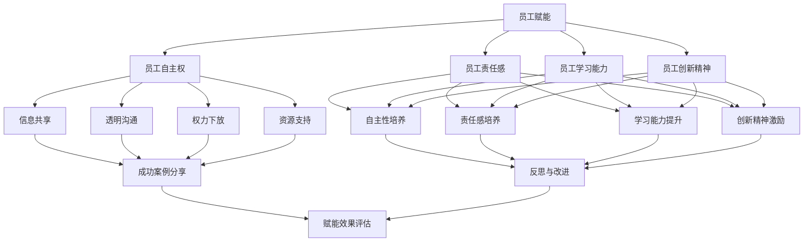

                 

### 文章标题: 员工赋能：释放团队潜力的关键

> 关键词：员工赋能，团队潜力，领导力，自我管理，信息共享，透明沟通

> 摘要：本文将深入探讨员工赋能的概念、原则和实践方法。通过分析赋能的四大核心原则——自主权、责任感、学习能力和创新精神，以及信息共享、透明沟通、权力下放和资源支持等实践方法，本文旨在为企业和团队提供一套系统的员工赋能策略，从而释放团队潜力，提升整体效能。

### 第一部分: 员工赋能：理解与概念

#### 第1章: 员工赋能：释放团队潜力的关键

## 1.1 员工赋能的定义与重要性

### 1.1.1 员工赋能的基本概念

员工赋能是指通过提供必要的资源、信息和自主权，激发员工的潜力，提高他们的工作积极性和创造力，从而实现个人和团队的目标。员工赋能不仅仅是一种管理理念，更是一种实践，它旨在建立一个积极、高效和可持续的工作环境。

### 1.1.2 员工赋能的重要性

员工赋能对企业和团队的发展具有重要意义。首先，它能够提升员工的满意度和忠诚度，从而降低员工流失率。其次，赋能能够激发员工的创造力，提高工作效率和产品质量。最后，赋能有助于建立一种开放、透明和协作的工作文化，增强团队的凝聚力。

### 1.1.3 赋能的对比与传统管理

传统管理强调的是控制和监督，而员工赋能则更注重员工的自主性和创新能力。在传统管理模式下，员工往往被动的接受指令和任务，缺乏自主决策的权力。而在赋能管理模式下，员工被赋予更多的自主权，能够根据自己的判断和想法来完成任务。

## 1.2 赋能的四大原则

### 1.2.1 自主权

自主权是员工赋能的核心原则之一。它要求员工能够在工作中自主决策，对自己的工作负责。自主权的赋予不仅能够提高员工的工作积极性，还能激发他们的创造力和创新能力。

### 1.2.2 责任感

责任感是员工赋能的另一个重要原则。它要求员工对自己的工作负责，对团队和企业的目标有清晰的认识，能够在工作中承担责任，确保任务的顺利完成。

### 1.2.3 学习能力

学习能力是员工赋能的持续动力。它要求员工不断学习新知识、新技能，以适应不断变化的工作环境。通过提升学习能力，员工能够不断提高自己的专业水平，为企业的发展做出更大的贡献。

### 1.2.4 创新精神

创新精神是员工赋能的关键因素。它要求员工敢于挑战传统，勇于尝试新事物，能够在工作中提出新的想法和解决方案。创新精神不仅能够提升工作效率，还能推动企业的持续发展。

## 1.3 赋能的核心元素

### 1.3.1 信息共享

信息共享是员工赋能的基础。它要求企业和团队建立开放的信息共享平台，确保员工能够随时获取到必要的资讯和资源。

### 1.3.2 透明沟通

透明沟通是员工赋能的重要保障。它要求企业和团队在沟通中保持开放、坦诚和真实，确保员工能够了解企业的战略和目标，以及自己在团队中的作用和价值。

### 1.3.3 权力下放

权力下放是员工赋能的核心策略。它要求企业和团队将权力下放给员工，让他们能够自主决策，发挥自己的才能。

### 1.3.4 资源支持

资源支持是员工赋能的有力保障。它要求企业和团队为员工提供必要的资源和支持，帮助他们克服工作中的困难和挑战。

### 1.3.5 成功案例分享

成功案例分享是员工赋能的有效方法。它要求企业和团队分享成功的经验和案例，激发员工的积极性和创造力。

### 1.3.6 反思与改进

反思与改进是员工赋能的持续动力。它要求企业和团队不断反思和改进赋能实践，以适应不断变化的工作环境和需求。

### 1.3.7 赋能的影响评估

赋能的影响评估是员工赋能的重要环节。它要求企业和团队对赋能效果进行评估，以了解赋能实践的有效性，并为进一步优化赋能策略提供依据。

#### 第2章: 员工赋能的实践方法

## 2.1 员工赋能策略制定

### 2.1.1 调研与分析

在制定员工赋能策略之前，首先需要对企业和团队进行调研与分析。这包括了解企业的愿景、使命和目标，分析企业的组织结构、工作流程和员工的工作状态。通过调研与分析，可以找出员工赋能的重点和难点。

### 2.1.2 制定明确的赋能目标

制定明确的赋能目标是为了确保员工赋能策略的可行性和有效性。这些目标应该与企业的愿景、使命和目标相一致，同时要考虑员工的个人发展需求。

### 2.1.3 确定赋能的关键环节

确定赋能的关键环节是为了确保员工赋能策略的全面性和系统性。这些关键环节包括信息共享、透明沟通、权力下放和资源支持等。

## 2.2 员工自主性培养

### 2.2.1 明确岗位职责与自主权

明确岗位职责与自主权是为了确保员工能够在工作中发挥自己的才能和潜力。这需要企业和团队为员工提供清晰的岗位职责说明书，同时赋予员工相应的自主权。

### 2.2.2 自主性培养的方法与技巧

自主性培养的方法与技巧包括提供培训和教育、建立反馈机制、鼓励员工提出建议和想法、为员工提供自主决策的机会等。这些方法与技巧可以帮助员工逐步提高自主性。

### 2.2.3 自主性培养的实际案例

自主性培养的实际案例可以为企业提供有益的参考。例如，某企业通过推行自主项目管理，让员工自主选择项目、制定计划、分配资源，从而提高了员工的工作积极性和创造力。

## 2.3 责任感培养

### 2.3.1 责任感的重要性

责任感是员工赋能的重要原则之一。它要求员工对自己的工作负责，对团队和企业的目标有清晰的认识。责任感的重要性在于它能够提升员工的工作质量和效率，增强团队的凝聚力。

### 2.3.2 培养责任感的策略

培养责任感的策略包括建立明确的责任制度、开展责任感培训、设立责任目标、提供反馈和激励等。这些策略可以帮助员工树立责任感，提高工作质量。

### 2.3.3 培养责任感的案例分析

培养责任感的案例分析可以为企业提供实用的指导。例如，某企业通过推行“责任岗”制度，让员工对自己的工作负责，从而提高了工作质量和效率。

## 2.4 学习能力提升

### 2.4.1 学习能力对企业发展的意义

学习能力是企业持续发展的关键。它要求员工不断学习新知识、新技能，以适应不断变化的工作环境。学习能力的提升不仅能够提高员工的专业水平，还能推动企业的创新发展。

### 2.4.2 提升学习能力的方法

提升学习能力的方法包括提供培训和学习资源、鼓励员工参加外部培训和认证、建立学习型组织等。这些方法可以帮助员工提升学习能力，提高工作效率。

### 2.4.3 学习能力提升的实际案例

学习能力提升的实际案例可以为企业提供有益的参考。例如，某企业通过建立“学习日”制度，让员工每天花一定的时间学习新知识，从而提高了员工的学习能力和工作效率。

## 2.5 创新精神激励

### 2.5.1 创新精神的重要性

创新精神是企业和团队持续发展的动力。它要求员工敢于挑战传统，勇于尝试新事物，能够在工作中提出新的想法和解决方案。创新精神的重要性在于它能够推动企业的创新发展，提高市场竞争力。

### 2.5.2 激发创新精神的方法

激发创新精神的方法包括提供创新培训、鼓励员工提出创新建议、设立创新奖项等。这些方法可以帮助员工树立创新意识，提高创新能力。

### 2.5.3 创新激励的实际案例

创新激励的实际案例可以为企业提供实用的指导。例如，某企业通过设立“创新之星”奖项，鼓励员工提出创新建议，从而提高了企业的创新能力和市场竞争力。

### 2.5.4 创新失败的处理与反思

创新失败的处理与反思是激发创新精神的重要环节。它要求企业和团队对待创新失败保持开放的心态，从中吸取教训，不断优化创新过程。

#### 第3章: 信息共享与透明沟通

## 3.1 信息共享的重要性

信息共享是员工赋能的基础。它要求企业和团队建立开放的信息共享平台，确保员工能够随时获取到必要的资讯和资源。

### 3.1.1 信息共享的基本原则

信息共享的基本原则包括及时性、准确性、完整性和可靠性。这些原则有助于确保信息共享的有效性，提高员工的工作效率和决策质量。

### 3.1.2 信息共享的障碍与解决方法

信息共享的障碍包括信息孤岛、信息不对称、沟通不畅等。解决这些障碍的方法包括建立统一的信息共享平台、加强沟通和协作、提高员工的信息素养等。

### 3.1.3 信息共享的成功案例

信息共享的成功案例可以为企业提供有益的参考。例如，某企业通过建立内部知识库，实现了信息的高效共享和传递，从而提高了团队的工作效率和创新能力。

## 3.2 透明沟通

透明沟通是员工赋能的重要保障。它要求企业和团队在沟通中保持开放、坦诚和真实，确保员工能够了解企业的战略和目标，以及自己在团队中的作用和价值。

### 3.2.1 透明沟通的定义与优势

透明沟通是指企业和团队在沟通中保持开放、坦诚和真实，确保信息传递的准确性和及时性。透明沟通的优势包括增强团队凝聚力、提高工作效率、减少误解和冲突等。

### 3.2.2 透明沟通的障碍与解决方法

透明沟通的障碍包括信息不对称、沟通不畅、信任缺失等。解决这些障碍的方法包括建立开放的信息沟通渠道、加强沟通培训、提高员工的沟通能力等。

### 3.2.3 透明沟通的实践方法

透明沟通的实践方法包括定期召开团队会议、建立内部通讯平台、开展团队建设活动等。这些方法有助于建立透明沟通的文化，提高团队的整体效能。

### 3.2.4 透明沟通的案例分析

透明沟通的案例分析可以为企业提供实用的指导。例如，某企业通过建立“沟通日”制度，确保团队成员能够及时沟通和交流，从而提高了团队的凝聚力和工作效率。

#### 第4章: 权力下放与资源支持

## 4.1 权力下放的重要性

权力下放是员工赋能的核心策略之一。它要求企业和团队将权力下放给员工，让他们能够自主决策，发挥自己的才能。

### 4.1.1 权力下放的原理与实践

权力下放的原理是通过授权和赋能，让员工能够自主决策，发挥自己的才能。权力下放的实践方法包括明确岗位职责、授权给员工、提供必要的资源和支持等。

### 4.1.2 权力下放的成功案例分析

权力下放的成功案例分析可以为企业提供有益的参考。例如，某企业通过实施“项目经理制”，让员工自主负责项目，从而提高了项目的执行效率和团队的工作积极性。

### 4.1.3 权力下放的挑战与应对策略

权力下放面临的挑战包括员工的能力不足、管理层的信任问题、组织文化的适应性等。应对策略包括加强员工的培训和能力建设、建立信任机制、逐步推行权力下放等。

## 4.2 资源支持

资源支持是员工赋能的有力保障。它要求企业和团队为员工提供必要的资源和支持，帮助他们克服工作中的困难和挑战。

### 4.2.1 资源支持的种类与方式

资源支持的种类包括财务资源、人力资源、技术资源等。支持的方式包括提供资金、培训、设备、技术支持等。

### 4.2.2 资源支持的实际案例

资源支持的实际案例可以为企业提供有益的参考。例如，某企业通过提供资金支持，帮助员工自主创业，从而激发了员工的工作热情和创造力。

### 4.2.3 资源支持与团队效能的关系

资源支持与团队效能的关系是相互促进的。资源支持能够提高团队的工作效率和创新能力，进而提升团队的整体效能。同时，团队的高效能也为资源的投入提供了良好的回报。

### 4.2.4 资源支持的创新实践

资源支持的创新实践包括建立共享资源平台、实施跨界合作、引入外部资源等。这些创新实践有助于提高资源的利用效率，推动团队的创新和发展。

#### 第5章: 成功案例与反思

## 5.1 成功案例分享

### 5.1.1 案例一：某企业员工赋能实践

该企业通过实施员工赋能策略，提高了员工的工作积极性和创造力。具体实践包括明确岗位职责、授权给员工、提供必要的资源和支持等。

### 5.1.2 案例二：某创业团队如何通过赋能实现突破

该创业团队通过建立开放的信息共享平台、实施透明沟通、权力下放和资源支持等赋能实践，成功实现了团队的突破和发展。

### 5.1.3 案例三：某非营利组织如何通过赋能提高工作效率

该非营利组织通过实施员工赋能策略，提高了员工的工作效率和服务质量。具体实践包括提供培训、建立反馈机制、鼓励员工提出建议等。

## 5.2 反思与改进

### 5.2.1 赋能实践中的常见问题

赋能实践中的常见问题包括员工能力不足、管理层支持不够、资源分配不合理等。针对这些问题，需要采取相应的改进措施。

### 5.2.2 反思与改进的方法

反思与改进的方法包括定期评估赋能效果、收集员工反馈、分析问题原因、制定改进计划等。

### 5.2.3 改进赋能实践的案例分析

改进赋能实践的案例分析可以为企业提供有益的参考。例如，某企业通过定期评估赋能效果，发现员工能力不足的问题，并采取了相应的培训措施，从而提高了员工的工作能力。

#### 第6章: 赋能的效果评估与持续改进

## 6.1 赋能效果的评估指标

### 6.1.1 评估指标的选择

赋能效果的评估指标应包括员工满意度、工作效率、创新能力、团队效能等方面。这些指标可以帮助企业和团队全面了解赋能实践的效果。

### 6.1.2 数据收集与分析方法

数据收集与分析方法是评估赋能效果的关键。企业和团队应建立完善的统计和分析系统，确保数据的准确性和可靠性。

### 6.1.3 赋能效果的案例解析

赋能效果的案例解析可以为企业提供具体的参考。例如，某企业通过收集和分析员工满意度数据，发现员工对赋能实践的高度认可，从而证明了赋能实践的有效性。

## 6.2 持续改进

### 6.2.1 持续改进的策略

持续改进的策略包括定期评估赋能效果、根据反馈进行调整、推动创新实践等。这些策略有助于确保赋能实践的持续改进。

### 6.2.2 反馈机制与改进措施

反馈机制与改进措施是持续改进的重要环节。企业和团队应建立有效的反馈机制，及时收集和分析员工的反馈，并根据反馈采取相应的改进措施。

### 6.2.3 持续改进的实际案例

持续改进的实际案例可以为企业提供有益的参考。例如，某企业通过建立反馈机制，及时收集员工的建议和意见，并根据反馈调整赋能实践，从而提高了员工的工作满意度和工作效率。

#### 第7章: 员工赋能的未来趋势

## 7.1 未来赋能技术的发展趋势

### 7.1.1 人工智能赋能

人工智能赋能是未来员工赋能的重要趋势。通过引入人工智能技术，企业和团队可以实现自动化、智能化的赋能实践，提高工作效率和决策质量。

### 7.1.2 区块链赋能

区块链赋能是未来员工赋能的另一重要趋势。通过区块链技术，企业和团队可以实现信息共享、透明沟通、权力下放等赋能实践，提高协同效率和信任度。

### 7.1.3 互联网赋能

互联网赋能是未来员工赋能的核心趋势。通过互联网技术，企业和团队可以实现信息共享、在线协作、远程办公等赋能实践，提高团队的灵活性和响应速度。

## 7.2 员工赋能的持续挑战与机遇

### 7.2.1 持续挑战分析

持续挑战包括技术更新、组织变革、员工适应等。这些挑战要求企业和团队不断提高技术水平、推动组织变革、帮助员工适应新环境。

### 7.2.2 机遇与应对策略

机遇包括技术进步、市场变化、员工需求等。这些机遇为企业和团队提供了广阔的发展空间，要求他们抓住机遇，应对挑战。

### 7.2.3 未来赋能模式的探索

未来赋能模式的探索包括灵活办公、远程协作、个性化赋能等。这些模式有助于适应未来工作环境的变化，提高员工的满意度和工作效率。

### 7.2.4 员工赋能的伦理问题与解决方案

员工赋能的伦理问题包括隐私保护、数据安全、公平性等。解决这些伦理问题需要企业和团队采取相应的措施，确保赋能实践的合法性和公正性。

### 7.2.5 国际视野下的员工赋能实践

国际视野下的员工赋能实践可以为企业提供有益的参考。通过借鉴国际经验，企业和团队可以不断完善自己的赋能实践，提高竞争力。

### 7.2.6 未来展望

未来展望包括员工赋能技术的发展、赋能模式的创新、赋能实践的优化等。这些展望为企业和团队提供了明确的方向，有助于实现可持续发展。

### 7.2.7 结论与建议

结论与建议包括重视员工赋能、制定明确策略、持续改进实践等。这些结论和建议为企业和团队提供了实用的指导，有助于实现员工赋能的目标。

### 7.2.8 附录

附录包括赋能工具与资源、参考资料等。这些附录为企业和团队提供了实用的参考资料，有助于开展员工赋能实践。

### 赋能核心概念与联系

- **Mermaid 流程图**：

  mermaid
  flowchart TD
  subgraph 员工赋能核心原则
  A[自主权] --> B[责任感]
  B --> C[学习能力]
  C --> D[创新精神]
  end
  subgraph 赋能核心元素
  E[信息共享] --> F[透明沟通]
  F --> G[权力下放]
  G --> H[资源支持]
  end
  A --> I[自主性培养]
  B --> J[责任感培养]
  C --> K[学习能力提升]
  D --> L[创新精神激励]
  E --> M[信息共享实践]
  F --> N[透明沟通实践]
  G --> O[权力下放实践]
  H --> P[资源支持实践]
  I --> Q[自主性培养案例]
  J --> R[责任感培养案例]
  K --> S[学习能力提升案例]
  L --> T[创新精神激励案例]
  M --> U[信息共享成功案例]
  N --> V[透明沟通成功案例]
  O --> W[权力下放成功案例]
  P --> X[资源支持成功案例]
  end

### 赋能的核心概念与联系

为了更好地理解员工赋能的核心概念及其相互关系，我们可以使用 Mermaid 流程图来展示这些概念之间的联系。以下是赋能的关键概念及其相互关系的流程图：

在上述流程图中：

- **A[员工赋能]** 是整个流程的核心，它连接了所有其他概念，代表了整个赋能过程。
- **B[员工自主权]**、**C[员工责任感]**、**D[员工学习能力]** 和 **E[员工创新精神]** 是赋能的四大核心原则，它们分别代表了员工在赋能过程中需要具备的基本素质。
- **F[信息共享]**、**G[透明沟通]**、**H[权力下放]** 和 **I[资源支持]** 是赋能的四个核心元素，它们是实施赋能策略的重要手段。
- **J[自主性培养]**、**K[责任感培养]**、**L[学习能力提升]** 和 **M[创新精神激励]** 是针对赋能四大原则的具体实践方法。
- **N[成功案例分享]**、**O[反思与改进]** 和 **P[赋能效果评估]** 是赋能实践的后续工作，它们帮助企业和团队不断优化赋能策略，确保赋能效果的持续提升。

通过这个流程图，我们可以清晰地看到员工赋能的核心概念及其相互关系，从而为制定和实施有效的赋能策略提供了直观的指导。在接下来的章节中，我们将逐一深入探讨这些概念的具体内涵和实践方法。

