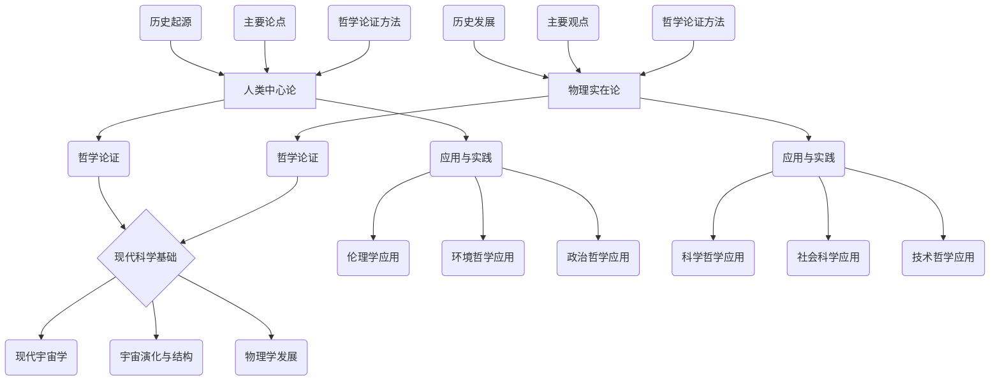
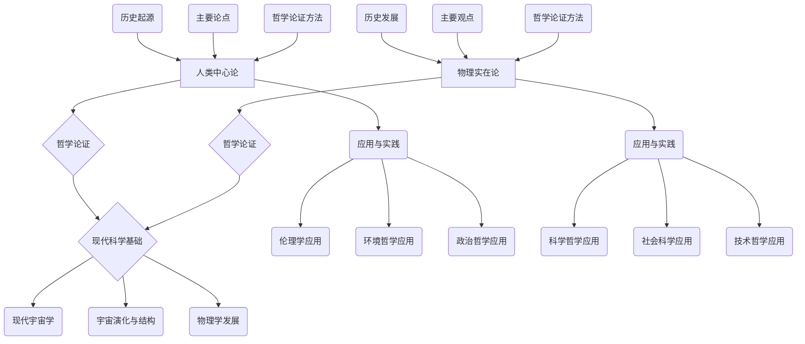

                 

### 文章标题

《哲学视角下的宇宙观：人类中心论还是物理实在论》

关键词：宇宙观、人类中心论、物理实在论、哲学论证、科学基础、跨学科对话

摘要：本文从哲学视角探讨了宇宙观的两种主要流派：人类中心论和物理实在论。通过对这两种观点的起源、主要论点和哲学论证方法的分析，结合现代科学基础，讨论了它们在不同领域中的应用，以及跨学科对话的可能性。文章旨在为读者提供一个全面且深入的宇宙观探讨，帮助理解人类在宇宙中的位置与角色。

### 目录大纲

#### 第一部分：宇宙观的哲学基础

##### 第1章：宇宙观概述

- **1.1 宇宙观的基本概念**
- **1.2 宇宙观的分类**
- **1.3 人类中心论与物理实在论的比较**

##### 第2章：人类中心论的哲学论证

- **2.1 人类中心论的历史起源**
- **2.2 人类中心论的主要论点**
- **2.3 人类中心论的哲学论证方法**

##### 第3章：物理实在论的哲学论证

- **3.1 物理实在论的历史发展**
- **3.2 物理实在论的主要观点**
- **3.3 物理实在论的哲学论证**

##### 第4章：宇宙观的现代科学基础

- **4.1 现代宇宙学的基本理论**
- **4.2 宇宙演化与宇宙结构**
- **4.3 宇宙观与物理学的发展**

#### 第二部分：人类中心论与物理实在论的应用

##### 第5章：人类中心论的应用与实践

- **5.1 人类中心论在伦理学中的应用**
- **5.2 人类中心论在环境哲学中的应用**
- **5.3 人类中心论在政治哲学中的应用**

##### 第6章：物理实在论的应用与实践

- **6.1 物理实在论在科学哲学中的应用**
- **6.2 物理实在论在社会科学中的应用**
- **6.3 物理实在论在技术哲学中的应用**

##### 第7章：人类中心论与物理实在论的跨学科对话

- **7.1 哲学与科学的对话**
- **7.2 哲学与技术的对话**
- **7.3 哲学与伦理的对话**

##### 第8章：结论与展望

- **8.1 人类中心论与物理实在论的互补性**
- **8.2 宇宙观对现代社会的影响**
- **8.3 未来宇宙观的发展趋势**

### 附录

- **附录 A：哲学视角下的宇宙观相关文献和资源**

#### 附图1：人类中心论与物理实在论的哲学论证流程图



#### 伪代码：物理实在论的主要观点分析

```python
# 物理实在论的主要观点分析伪代码

# 定义物理实在论主要观点
physical_realism = {
    'materialism': "物质是构成宇宙的基本元素",
    'determinism': "宇宙中所有事件都有原因",
    'causality': "因果关系是宇宙运作的基础",
    'empiricism': "知识来自于经验",
    'scientific_method': "科学方法是最可靠的求知途径"
}

# 遍历物理实在论的主要观点并分析
for view in physical_realism:
    print(f"{view}: {physical_realism[view]}")
    
    # 对每个观点进行详细分析
    if view == 'materialism':
        print("$$\\text{物质是构成宇宙的基本元素，例如：原子、分子等。}$$")
        print("举例：地球是由岩石和金属构成，这些物质是地球的基础。")
        
    elif view == 'determinism':
        print("$$\\text{宇宙中所有事件都有原因，不存在无因之果。}$$")
        print("举例：行星的运行轨迹是由万有引力定律决定的。")
        
    elif view == 'causality':
        print("$$\\text{因果关系是宇宙运作的基础，}$$")
        print("举例：一个物体落下是因为受到了地球的重力作用。")
        
    elif view == 'empiricism':
        print("$$\\text{知识来自于经验，}$$")
        print("举例：科学实验验证了物理定律的正确性。")
        
    elif view == 'scientific_method':
        print("$$\\text{科学方法是最可靠的求知途径，}$$")
        print("举例：通过观察和实验来推导出科学理论。")
```

## 第一部分：宇宙观的哲学基础

### 第1章：宇宙观概述

#### 1.1 宇宙观的基本概念

宇宙观是人类对于宇宙的根本看法和认识，它不仅涉及对宇宙的组成、结构、演化等方面的理解，还包括对宇宙中存在的各种现象和规律的认识。宇宙观是哲学思考的一个重要领域，它探讨了人类在宇宙中的地位和角色，以及宇宙的本质和意义。

宇宙观的内涵非常丰富，它既包括对宇宙外在形态的认识，如宇宙的大小、形状、结构等，也包括对宇宙内在规律的探讨，如物理定律、生命起源等。此外，宇宙观还涉及对人类自身和宇宙关系的思考，包括人类在宇宙中的地位、作用和价值等。

宇宙观的外延则涵盖了从宏观宇宙到微观世界的各个方面。从宏观层面看，宇宙观涉及到宇宙的起源、演化、结构等基本问题；从微观层面看，宇宙观涉及到物质的基本构成、相互作用等。宇宙观的研究不仅仅局限于自然科学领域，还涉及到哲学、宗教、文化等多个领域。

#### 1.2 宇宙观的分类

宇宙观的分类可以从不同的角度进行。以下是一些常见的分类方式：

1. **自然宇宙观与人文宇宙观**：自然宇宙观主要关注宇宙的自然属性，强调自然规律的科学性；人文宇宙观则更多地关注宇宙对人类的影响，强调人类在宇宙中的地位和作用。

2. **客观宇宙观与主观宇宙观**：客观宇宙观认为宇宙是独立于人类意识的客观存在，强调对宇宙的真实反映；主观宇宙观则认为宇宙是依赖于人类意识的主观体验，强调人类对宇宙的主观认知。

3. **宇宙生成论与宇宙演化论**：宇宙生成论主要探讨宇宙的起源和诞生过程，如宇宙大爆炸理论、宇宙循环论等；宇宙演化论则主要研究宇宙的演化过程和结构变化，如宇宙膨胀理论、宇宙黑洞理论等。

4. **人类中心论与物理实在论**：人类中心论认为人类是宇宙的中心，宇宙的存在和演化都是为了人类的利益和幸福；物理实在论则认为宇宙是一个独立于人类意识的物理实体，宇宙的规律和结构是客观存在的。

5. **其他分类**：还可以从不同哲学流派、宗教信仰、文化传统等角度对宇宙观进行分类。

#### 1.3 人类中心论与物理实在论的比较

**人类中心论**：

- **起源**：人类中心论起源于古希腊哲学，尤其是普罗塔戈拉（Protagoras）的“人是万物的尺度”观点。在中世纪，基督教哲学进一步发展了人类中心论，强调人类在宇宙中的特殊地位和神圣使命。

- **主要论点**：人类中心论的主要论点包括：
  - 人类是宇宙的中心，宇宙的存在和演化都是为了人类的利益和幸福。
  - 人类拥有独特的理性、自由和尊严，是宇宙中最重要和最神圣的存在。
  - 人类有责任和义务去保护和改善宇宙环境，使之为人类服务。

- **哲学论证方法**：人类中心论的哲学论证方法主要包括基于宗教信仰、道德伦理、人类经验等。

**物理实在论**：

- **起源**：物理实在论起源于古希腊哲学，如泰勒斯（Thales）和亚里士多德（Aristotle）的观点。在现代科学发展的推动下，物理实在论得到了进一步的发展和完善。

- **主要观点**：物理实在论的主要观点包括：
  - 宇宙是一个独立的物理实体，其存在和演化遵循客观的自然规律。
  - 物理实在论强调物质、能量、时间和空间的客观存在，认为宇宙的本质是物理的。
  - 科学方法是最可靠的知识获取途径，通过实验和观察可以验证物理定律的正确性。

- **哲学论证方法**：物理实在论的哲学论证方法主要包括基于科学证据、逻辑推理、经验验证等。

人类中心论和物理实在论在哲学基础、主要论点和论证方法上存在显著差异。人类中心论强调人类的主观意识和价值，认为宇宙的存在和演化都是为了人类；而物理实在论则强调宇宙的客观存在和自然规律，认为人类只是宇宙中的一部分。然而，这两种观点并非完全对立，它们在一定程度上可以相互补充和融合。

在本文后续章节中，我们将进一步探讨人类中心论和物理实在论的历史发展、哲学论证方法，以及它们在现代社会中的应用和影响。通过深入分析，我们将更好地理解宇宙观的多样性和复杂性，以及人类在宇宙中的角色和地位。

## 第二部分：人类中心论的哲学论证

### 第2章：人类中心论的历史起源

#### 2.1 人类中心论的历史起源

人类中心论的思想可以追溯到古希腊哲学。在古希腊哲学中，普罗塔戈拉（Protagoras）的“人是万物的尺度”是最早明确提出人类中心论观点的论述。普罗塔戈拉认为，人类的感知和认知是判断事物真实性的唯一标准，因此，人类在宇宙中具有至高无上的地位。

在中世纪，基督教哲学进一步发展了人类中心论。托马斯·阿奎那（Thomas Aquinas）等基督教哲学家认为，人类是上帝创造的杰作，具有独特的理性、自由和尊严。因此，人类在宇宙中的地位高于其他一切存在，负有管理和保护宇宙的责任。

文艺复兴时期，人类中心论得到了进一步的发展。人文主义者强调人类的理性和自由，认为人类是宇宙的中心，应该成为宇宙的主宰。这一时期的思想家如皮科·德拉·米兰多拉（Pico della Mirandola）和托马斯·莫尔（Thomas More）等，都提出了关于人类中心论的重要论述。

进入现代，人类中心论在哲学、伦理学、环境哲学等领域得到了广泛研究。随着人类对自然界的认知不断深入，人类中心论也在不断演变和发展。例如，存在主义哲学家如让-保罗·萨特（Jean-Paul Sartre）和阿尔贝·加缪（Albert Camus）等，从不同的角度探讨了人类在宇宙中的位置和意义。

#### 2.2 人类中心论的主要论点

人类中心论的主要论点包括以下几个方面：

1. **人类是宇宙的中心**：人类中心论认为，宇宙的存在和演化都是为了人类的利益和幸福。人类拥有独特的理性和自由，能够认识和改变宇宙，因此，人类在宇宙中具有至高无上的地位。

2. **人类的独特性**：人类中心论强调人类的独特性，认为人类是宇宙中最重要和最神圣的存在。人类拥有语言、意识、理性等高级认知能力，能够创造文化和艺术，是宇宙中独一无二的存在。

3. **人类的责任和义务**：人类中心论认为，人类有责任和义务去保护和改善宇宙环境，使之为人类服务。人类应该尊重和保护其他生命，维护生态平衡，防止环境污染和资源枯竭。

4. **人类的历史使命**：人类中心论认为，人类有责任推动宇宙的进步和发展。人类应该不断探索未知领域，追求科学和技术的突破，为宇宙带来光明和希望。

#### 2.3 人类中心论的哲学论证方法

人类中心论的哲学论证方法主要包括以下几种：

1. **基于宗教信仰的论证**：许多人类中心论的论证基于宗教信仰。例如，基督教哲学认为，人类是上帝的创造物，拥有特殊的地位和使命。这种论证方法依赖于对宗教经典的解读和信仰。

2. **基于道德伦理的论证**：人类中心论也可以从道德伦理的角度进行论证。例如，伦理学家认为，人类有责任尊重和保护其他生命，维护生态平衡。这种论证方法依赖于道德原则和伦理规范的制定和遵循。

3. **基于人类经验的论证**：人类中心论还可以从人类经验的角度进行论证。例如，人类通过科学研究和实践活动，不断认识到自己在宇宙中的地位和作用。这种论证方法依赖于人类的感知和认知能力。

4. **基于逻辑推理的论证**：人类中心论还可以通过逻辑推理的方式进行论证。例如，通过论证人类拥有独特的理性和自由，从而得出人类在宇宙中具有至高无上的地位。这种论证方法依赖于逻辑思维和推理技巧。

总之，人类中心论是一种哲学观点，它认为人类在宇宙中具有特殊地位和使命。通过历史起源、主要论点和哲学论证方法的分析，我们可以更好地理解人类中心论的思想内涵和逻辑结构。在本文后续章节中，我们将进一步探讨人类中心论在现代社会中的应用和影响。

## 第3章：物理实在论的哲学论证

#### 3.1 物理实在论的历史发展

物理实在论作为一种哲学观点，其历史发展可以追溯到古希腊哲学。在古希腊哲学中，泰勒斯（Thales）被认为是物理实在论的奠基人之一。他提出了“水是万物之源”的观点，认为宇宙的本质是物质。这一观点为后来的物理实在论奠定了基础。

亚里士多德（Aristotle）是另一位对物理实在论产生深远影响的重要哲学家。他在《物理学》中提出，物质是构成宇宙的基本元素，所有存在的事物都是由物质构成的。亚里士多德的实体论（substance theory）强调物质是独立存在的实体，这一思想对物理实在论的发展起到了关键作用。

中世纪时期，阿拉伯哲学家阿尔-法拉比（Al-Farabi）和阿维罗伊（Averroes）等对物理实在论进行了进一步的发展。他们试图将古希腊哲学的物理实在论与伊斯兰教哲学相结合，探讨了宇宙的本质和运动规律。

进入近代，物理实在论在科学革命中得到了新的发展。伽利略（Galileo Galilei）和牛顿（Isaac Newton）等科学家的实验和理论工作，为物理实在论提供了强有力的科学支持。伽利略通过望远镜观察宇宙，揭示了天体的运动规律；牛顿的万有引力定律和三大运动定律，建立了经典力学的体系，进一步巩固了物理实在论的地位。

20世纪以来，随着量子力学和相对论的发展，物理实在论也在不断演变。爱因斯坦（Albert Einstein）的相对论提出时空的相对性，挑战了传统的物理实在论观点。然而，量子力学和相对论仍然在一定程度上支持了物理实在论的基本理念，即宇宙中存在着独立于人类意识的客观规律。

#### 3.2 物理实在论的主要观点

物理实在论的主要观点包括以下几个方面：

1. **物质是宇宙的基本元素**：物理实在论认为，物质是构成宇宙的基本元素。所有存在的事物都是由物质构成的，物质具有独立存在的特性。

2. **自然规律是客观存在的**：物理实在论认为，宇宙中的现象和事件都遵循客观的自然规律。这些规律是独立于人类意识和感知的，是宇宙的本质特征。

3. **科学方法是获取知识的最佳途径**：物理实在论认为，科学方法是最可靠的获取知识的方式。通过实验、观察和推理，科学家可以揭示宇宙的客观规律，获得关于宇宙的准确知识。

4. **因果关系是宇宙运作的基础**：物理实在论认为，宇宙中的事件和现象之间存在因果关系。每一个事件都有其原因，因果关系是宇宙运作的基础。

5. **人类是宇宙的一部分**：物理实在论认为，人类是宇宙中的一部分，人类的行为和认知也受到宇宙自然规律的制约。人类通过科学方法探索宇宙，可以更好地理解自己在宇宙中的位置和作用。

#### 3.3 物理实在论的哲学论证方法

物理实在论的哲学论证方法主要包括以下几种：

1. **基于科学证据的论证**：物理实在论通过科学实验和观察来验证自然规律的存在和有效性。例如，通过实验证实牛顿的万有引力定律，或者通过观测验证量子力学的预测。

2. **基于逻辑推理的论证**：物理实在论通过逻辑推理来论证物质和自然规律的存在。例如，通过论证物质是构成宇宙的基本元素，从而得出宇宙中所有存在的事物都是由物质构成的结论。

3. **基于经验验证的论证**：物理实在论认为，经验是验证自然规律的重要手段。通过大量的实验和观察，科学家可以验证物理定律的正确性，从而支持物理实在论的观点。

4. **基于历史发展的论证**：物理实在论通过回顾科学历史的发展过程，来论证物理实在论的观点。例如，通过分析科学革命和理论突破，展示物理实在论是如何在科学实践中得到验证和发展的。

总之，物理实在论是一种哲学观点，它强调宇宙的客观存在和自然规律。通过历史发展、主要观点和哲学论证方法的分析，我们可以更好地理解物理实在论的思想内涵和逻辑结构。在本文后续章节中，我们将进一步探讨物理实在论在现代社会中的应用和影响。

## 第4章：宇宙观的现代科学基础

#### 4.1 现代宇宙学的基本理论

现代宇宙学是研究宇宙起源、演化和结构的科学。它基于大量观测数据和理论模型，为我们描绘了一个动态的宇宙图像。现代宇宙学的基本理论主要包括大爆炸理论、宇宙膨胀理论和宇宙结构理论。

**大爆炸理论**：大爆炸理论是现代宇宙学的基础。它认为宇宙起源于一个极其高温、高密度的状态，经过大约138亿年的膨胀和冷却，形成了我们今天所观测到的宇宙。大爆炸理论得到了众多观测数据的支持，如宇宙微波背景辐射的发现、宇宙大尺度结构的一致性等。

**宇宙膨胀理论**：宇宙膨胀理论是解释宇宙从大爆炸后不断膨胀的理论。根据哈勃定律，宇宙的膨胀速度与距离成正比。这一理论通过观测到的遥远星系的红移现象得到了验证。宇宙膨胀理论不仅支持大爆炸理论，还为研究宇宙的未来演化提供了重要依据。

**宇宙结构理论**：宇宙结构理论探讨宇宙在大尺度上的分布和形态。根据这一理论，宇宙呈现出网状结构，由大量星系和星系团组成。通过观测宇宙的大尺度结构，科学家可以研究宇宙的演化过程和宇宙学参数。

#### 4.2 宇宙演化与宇宙结构

宇宙演化是指宇宙从大爆炸开始，经过数十亿年的变化，逐渐形成了今天我们所观测到的宇宙。宇宙演化可以分为几个主要阶段：

1. **大爆炸后几分钟**：在这个阶段，宇宙处于极高温、高密度的状态，物质主要以光子、电子和中子等形式存在。

2. **宇宙冷却和物质形成**：随着宇宙的膨胀和冷却，物质逐渐聚集形成星系、星系团和其他天体结构。这一过程大约发生在宇宙诞生后的数百万年。

3. **恒星和行星的形成**：在宇宙演化的中后期，恒星和行星开始形成。恒星通过核聚变反应产生能量，照亮了宇宙。行星则围绕着恒星形成，成为生命诞生的场所。

4. **生命的起源和演化**：在地球上，生命大约在38亿年前诞生。生命经历了漫长的演化过程，形成了多样的生物形态。人类作为地球上最发达的生命形式，逐渐探索宇宙，理解自己的起源和地位。

宇宙结构是指宇宙在大尺度上的分布和形态。根据宇宙结构理论，宇宙呈现出网状结构，由大量星系和星系团组成。这些结构之间通过引力相互作用，形成了宇宙的大尺度结构。宇宙结构的研究有助于我们理解宇宙的演化过程和宇宙学参数。

#### 4.3 宇宙观与物理学的发展

宇宙观与物理学的发展密切相关。物理学的发展不断推动我们对宇宙的理解和认识，而宇宙观的变化也反映了物理学的进步。

**物理学对宇宙观的影响**：物理学的发展为我们提供了关于宇宙的客观规律和现象的解释。例如，牛顿的万有引力定律和爱因斯坦的相对论，揭示了宇宙中的基本力和时空结构。这些理论不仅解释了天体的运动，还为我们提供了研究宇宙演化的重要工具。

**宇宙观对物理学的影响**：宇宙观的变化也影响了物理学的发展。人类对宇宙的理解和认知，激发了新的物理理论的研究和探索。例如，宇宙膨胀理论和大爆炸理论，推动了宇宙学的研究。同时，宇宙观的变化也促使物理学家思考宇宙的本质和起源，推动了物理学理论的创新和发展。

总之，现代宇宙学的基本理论、宇宙演化和结构以及宇宙观与物理学的发展，为我们提供了关于宇宙的全面认识。通过这些理论和研究，我们可以更好地理解宇宙的起源、演化和结构，以及人类在宇宙中的地位和角色。

### 第5章：人类中心论的应用与实践

#### 5.1 人类中心论在伦理学中的应用

人类中心论在伦理学中的应用主要体现在对人类价值和尊严的强调。这种观点认为，人类是宇宙中最重要的存在，拥有独特的理性和道德能力，因此应该受到特别的尊重和保护。以下是人类中心论在伦理学中应用的一些具体方面：

1. **人类尊严**：人类中心论强调人类的尊严，认为每个人都有不可侵犯的权利，这是基于人类拥有理性和道德能力的基本特质。这一观点在伦理学中体现为对人权和自由的高度重视。例如，伦理学家如托马斯·霍布斯（Thomas Hobbes）和约翰·洛克（John Locke）等，都强调了人类尊严的重要性，并将其作为制定伦理规范的基础。

2. **道德责任**：人类中心论认为，人类有责任和义务去保护和改善宇宙环境，使之为人类服务。这一观点在伦理学中体现为对环境伦理和可持续发展理论的关注。例如，深生态学（Deep Ecology）和可持续发展的倡导者，如阿恩·内森·纳什（Arne Naess）和马赫什·希哈加尔（Mahesh Sharma）等，都认为人类应该承担起保护地球的责任，以确保自然界的和谐与平衡。

3. **伦理决策**：人类中心论在伦理决策中起着关键作用。例如，在医学伦理中，人类中心论支持保护患者的生命和健康，强调医学实践中的道德责任。在科技伦理中，人类中心论强调人类在技术应用中的主导地位，倡导在科技发展中充分考虑人类福祉和社会影响。

4. **伦理教育**：人类中心论在伦理教育中也有重要作用。通过强调人类的尊严和价值，人类中心论有助于培养个体的道德意识和责任感。例如，学校教育和社会教育中都包含伦理教育内容，旨在培养学生的道德品质和社会责任感，使他们成为有道德的公民。

#### 5.2 人类中心论在环境哲学中的应用

人类中心论在环境哲学中的应用主要体现在对人类与自然关系的探讨。这一观点认为，人类是宇宙的中心，但并不意味着人类可以无限制地掠夺自然资源，而是应该负责任地对待自然。以下是人类中心论在环境哲学中应用的一些具体方面：

1. **环境伦理**：人类中心论在环境伦理中强调人类对自然环境的道德责任。这种观点认为，人类应该保护和维护自然环境，以实现可持续发展。例如，环境伦理学家如彼得·辛格（Peter Singer）和保罗·威尔丁（Paul Waldau）等，主张人类应该减少对动物的伤害，保护生物多样性和生态平衡。

2. **生态保护**：人类中心论在生态保护中的应用体现在对自然资源的合理利用和生态系统的保护。这一观点认为，人类应该在满足自身需求的同时，保护自然生态系统，防止环境破坏和资源枯竭。例如，国际自然保护联盟（IUCN）等组织，通过制定环境保护政策和措施，推动全球生态保护事业。

3. **可持续发展的理念**：人类中心论在可持续发展的理念中强调人类与自然的和谐共生。可持续发展理论认为，人类应该在满足当前需求的同时，不损害后代满足其需求的能力。人类中心论在这一理念中强调人类的责任和义务，推动社会在经济发展中注重环境保护和资源节约。

4. **环境教育**：人类中心论在环境教育中的应用体现在培养学生的环境意识和责任感。通过环境教育，人们可以更好地理解人类与自然的关系，从而采取更环保的行为。例如，学校和教育机构通过开设环境课程，组织环保实践活动，提高学生的环境素养和环保意识。

总之，人类中心论在伦理学和环境哲学中的应用，强调了人类在宇宙中的独特地位和责任。通过探讨人类尊严、道德责任、生态保护和可持续发展等具体方面，人类中心论为我们提供了关于人类与自然关系的深刻思考和指导。在现代社会，这些思想对于推动环境保护和可持续发展具有重要意义。

#### 5.3 人类中心论在政治哲学中的应用

人类中心论在政治哲学中的应用体现在对人类价值和权利的关注，以及对政治体制和治理理念的探讨。以下是人类中心论在政治哲学中应用的一些具体方面：

1. **人权与民主**：人类中心论强调人类的尊严和权利，认为每个人都有平等的生存和发展权利。这一观点在政治哲学中体现为对人权和民主制度的高度重视。例如，约翰·罗尔斯（John Rawls）的《正义论》中提出，社会应该建立一种公平的制度，确保每个人都能享有基本的自由和机会，实现公平正义。

2. **社会正义**：人类中心论认为，政治体制应该体现对人类尊严和权利的尊重，推动社会正义。社会正义理论强调，社会资源应该公平分配，以减少贫富差距，保障弱势群体的权益。例如，罗纳德·德沃金（Ronald Dworkin）的《平等主义》提出，社会正义要求在分配资源时，确保每个人都能够获得平等的机会和福利。

3. **治理理念**：人类中心论在治理理念中强调政府的责任和作用，认为政府应该为全体公民提供公正和有效的治理。例如，哈贝马斯（Jürgen Habermas）的商谈民主理论提出，政府应该通过公众参与和对话，实现民主治理，确保政策的合理性和合法性。

4. **全球治理**：人类中心论在全球化背景下，对全球治理提出了新的挑战。全球治理理论认为，各国应该通过国际合作，共同应对全球性问题，如气候变化、贫困和战争等。人类中心论强调，全球治理应该以人类的共同利益为出发点，推动全球和平与发展。

5. **和平与冲突**：人类中心论在和平与冲突问题中的应用，强调人类应该通过对话和合作，解决国际矛盾和冲突。例如，尤瓦尔·赫拉利（Yuval Noah Harari）的《人类简史》提出，人类通过建立国家和社会组织，实现了对冲突的有效管理和控制，从而促进了全球和平与发展。

总之，人类中心论在政治哲学中的应用，强调了人类在政治体制和治理中的核心地位。通过探讨人权、社会正义、治理理念和全球治理等方面，人类中心论为我们提供了关于人类价值和权利的深刻思考，对于构建公正、和平和可持续发展的社会具有重要意义。

### 第6章：物理实在论的应用与实践

#### 6.1 物理实在论在科学哲学中的应用

物理实在论在科学哲学中的应用主要体现在对科学知识客观性的强调。物理实在论认为，科学知识应该基于客观存在的物理世界，而不是主观的认知或信仰。以下是一些物理实在论在科学哲学中的具体应用：

1. **科学方法**：物理实在论强调科学方法的重要性，认为通过观察、实验和推理，可以揭示物理世界的本质和规律。例如，卡尔·波普尔（Karl Popper）的证伪主义（Falsificationism）强调，科学理论必须通过实验验证，以证伪的方式来检验其真实性。

2. **经验验证**：物理实在论主张，科学理论的正确性必须通过经验验证，即通过实验和观察来验证。例如，爱因斯坦的相对论通过精确的实验验证，得到了广泛的认可。

3. **理论选择**：物理实在论在理论选择中，强调根据实验数据和历史经验来选择最合理的理论。例如，在量子力学和相对论的发展过程中，物理学家通过实验数据和理论预测，选择了更为准确的模型。

4. **科学哲学中的争论**：物理实在论在科学哲学中引发了许多争论。例如，关于量子力学的解释，物理实在论与波粒二象性、量子纠缠等现象之间的解释存在争议。这些争论推动了科学哲学的发展，促使科学家对物理实在论进行更深入的探讨。

#### 6.2 物理实在论在社会科学中的应用

物理实在论在社会科学中的应用主要体现在对社会现象的客观分析和理解。物理实在论认为，社会现象也受到客观规律的制约，通过科学方法可以揭示这些规律。以下是一些物理实在论在社会科学中的具体应用：

1. **经济学**：物理实在论在经济学中的应用主要体现在对市场机制和经济行为的分析。例如，古典经济学和新古典经济学都基于物理实在论的基本假设，认为经济活动遵循客观的规律。

2. **社会学**：物理实在论在社会学中的应用主要体现在对社会结构和社会关系的分析。例如，结构功能主义和冲突理论都试图通过揭示社会现象的客观规律，来解释社会稳定与变迁。

3. **心理学**：物理实在论在心理学中的应用主要体现在对心理现象的客观研究。例如，行为主义和认知心理学都试图通过实验和观察，揭示心理现象的规律和机制。

4. **政治学**：物理实在论在政治学中的应用主要体现在对政治现象的客观分析和理解。例如，政治制度、政策和决策都可以通过科学方法进行分析，以揭示政治现象的客观规律。

#### 6.3 物理实在论在技术哲学中的应用

物理实在论在技术哲学中的应用主要体现在对技术发展的客观评估和伦理考量。物理实在论认为，技术发展应该基于对物理世界的准确理解和应用，同时要考虑其对社会和环境的影响。以下是一些物理实在论在技术哲学中的具体应用：

1. **技术评估**：物理实在论在技术评估中强调，技术发展的可行性应该基于对物理规律的准确理解和应用。例如，评估一种新型能源技术，需要考虑其是否符合物理定律，以及是否能实现预期的效果。

2. **技术伦理**：物理实在论在技术伦理中的应用主要体现在对技术应用伦理的考量。例如，人工智能的发展引发了关于隐私、安全和社会影响的伦理问题。物理实在论强调，技术发展必须考虑其对人类和社会的潜在影响，确保技术的伦理正当性。

3. **技术哲学中的争论**：物理实在论在技术哲学中引发了关于技术本质和影响的争论。例如，关于技术的中性论（Technological Neutrality）与技术的价值论（Technological Valuation）之间的争议，反映了物理实在论和技术哲学之间的复杂关系。

4. **未来技术的预测**：物理实在论在预测未来技术发展方面具有重要价值。例如，基于对物理规律的理解，科学家可以预测未来可能出现的新型材料、能源和通信技术等。

总之，物理实在论在科学哲学、社会科学和技术哲学中的应用，为我们提供了关于客观世界的深刻理解和分析框架。通过运用物理实在论的思想，我们可以更好地评估技术的价值、探讨社会现象的规律，并为未来的科技发展提供指导。在现代社会，物理实在论的思想对于推动科学、社会和技术的发展，具有重要意义。

### 第7章：人类中心论与物理实在论的跨学科对话

#### 7.1 哲学与科学的对话

哲学与科学的对话是探讨宇宙观的重要途径，它既涉及哲学对科学方法与理论的反思，也涉及科学对哲学问题的新认识。在人类中心论与物理实在论的跨学科对话中，哲学与科学的互动尤为关键。

首先，哲学为科学提供了基础性的概念框架和理论模型。例如，笛卡尔（René Descartes）的“我思故我在”（Cogito, ergo sum）思想为科学研究中的主体性奠定了基础，而康德（Immanuel Kant）的批判哲学则强调了科学知识的条件和界限。这些哲学观点不仅丰富了科学理论，还为科学研究提供了逻辑和伦理的指导。

其次，科学为哲学提供了丰富的实证材料。例如，量子力学和相对论的发展挑战了传统的唯物论和唯心论，促使哲学家重新思考物质、时间和空间的概念。科学的进步不断推动哲学的反思，使得哲学能够更好地适应新的科学发现。

在人类中心论与物理实在论的跨学科对话中，哲学与科学的互动体现在以下几个方面：

1. **科学哲学**：科学哲学是哲学与科学对话的桥梁，它探讨科学知识的生产、验证和应用。例如，托马斯·库恩（Thomas Kuhn）的科学革命理论提出了“范式转变”的概念，挑战了传统科学哲学中的线性进步观，强调了科学理论的相对性和历史性。

2. **技术哲学**：技术哲学关注科学技术对社会和人类生活的影响。例如，物理实在论在技术哲学中的应用，探讨了技术发展中的伦理问题，如隐私、安全和社会公正等。这些讨论不仅有助于科学技术的合理应用，也促进了人类中心论与物理实在论的融合。

3. **环境哲学**：环境哲学探讨人类与自然环境的关系，强调了人类在宇宙中的责任和义务。人类中心论与物理实在论在环境哲学中的应用，促进了人类对自然资源的合理利用和保护。例如，物理实在论强调自然规律和生态平衡，而人类中心论则强调人类对自然环境的道德责任。

#### 7.2 哲学与技术的对话

哲学与技术的对话在现代社会中尤为重要，因为技术发展深刻地影响着人类的生活和社会结构。在人类中心论与物理实在论的跨学科对话中，哲学与技术的互动体现在以下几个方面：

1. **技术伦理**：技术伦理探讨技术在道德和伦理方面的含义和影响。例如，人类中心论在技术伦理中的应用，强调了人类在使用技术时的责任和义务。物理实在论则为技术伦理提供了客观的基础，认为技术的效果和影响应该基于对物理规律的理解。

2. **技术评估**：技术评估涉及对技术潜在影响的前瞻性分析。在人类中心论与物理实在论的跨学科对话中，哲学与技术的互动有助于全面评估技术的优缺点。例如，物理实在论强调科学方法和技术验证，而人类中心论则关注技术对社会和人类福祉的影响。

3. **技术创新**：技术创新是技术哲学的重要议题，它探讨了如何通过哲学思考来指导技术的研发和应用。在人类中心论与物理实在论的跨学科对话中，哲学为技术创新提供了道德和伦理的指导，确保技术的进步不会牺牲人类的福祉。

#### 7.3 哲学与伦理的对话

哲学与伦理的对话是探讨人类行为和价值观的重要途径，它为人类中心论与物理实在论在伦理层面的融合提供了基础。以下是在人类中心论与物理实在论的跨学科对话中，哲学与伦理的互动体现：

1. **伦理理论**：伦理理论探讨道德原则和价值观的起源和基础。例如，康德的道德哲学提出了基于义务的道德原则，而功利主义则强调最大幸福原则。这些理论为人类中心论与物理实在论的伦理考量提供了不同的视角。

2. **道德实践**：道德实践涉及将伦理理论应用于具体情境。例如，人类中心论强调人类在道德实践中的责任和义务，主张尊重和保护人的尊严和权利。物理实在论则强调道德实践的客观基础，认为道德判断应该基于对自然规律的理解。

3. **伦理冲突**：在人类中心论与物理实在论的跨学科对话中，哲学与伦理的互动有助于解决伦理冲突。例如，在环境伦理和科技伦理中，人类中心论与物理实在论的不同观点可能导致伦理冲突。通过哲学与伦理的对话，可以寻求平衡和妥协，以实现道德目标的最大化。

总之，人类中心论与物理实在论的跨学科对话，通过哲学与科学、技术、伦理的互动，为我们提供了对宇宙观和人类角色的全面理解。这种对话不仅促进了不同学科之间的交流与融合，也为解决现代社会面临的各种挑战提供了有益的思路。

### 第8章：结论与展望

#### 8.1 人类中心论与物理实在论的互补性

人类中心论和物理实在论在探讨宇宙观时各自提供了独特的视角和论证方法。人类中心论强调人类在宇宙中的特殊地位和责任，认为宇宙的存在和演化都是为了人类的利益和幸福。这种观点在伦理学、环境哲学和政治哲学等领域具有重要的应用价值，有助于我们理解人类在地球上的角色和责任。然而，人类中心论也容易导致人类自我中心主义，忽视宇宙的客观规律和自然界的平衡。

物理实在论则强调宇宙的客观存在和自然规律，认为人类只是宇宙中的一部分，受制于物理定律。这种观点在科学哲学、社会科学和技术哲学中具有深远的影响，有助于我们通过科学方法探索宇宙的本质和规律。然而，物理实在论也容易导致人类在宇宙中的微小感和无力感，忽视人类在宇宙中的独特性和价值。

通过结合人类中心论和物理实在论，我们可以更全面地理解宇宙和人类在宇宙中的角色。人类中心论提醒我们，作为人类，我们有责任保护和改善宇宙环境，确保地球的可持续发展。物理实在论则提醒我们，宇宙的规律和结构是客观存在的，人类应该尊重自然规律，通过科学方法探索和利用自然。

#### 8.2 宇宙观对现代社会的影响

宇宙观对现代社会的影响深远，既体现在人类对自然环境的认知和利用，也体现在社会制度和文化价值观的形成。以下是一些具体的影响：

1. **环境伦理**：随着人类对自然界的深入认识，环境伦理逐渐成为伦理学的重要组成部分。人类中心论强调了人类对自然环境的道德责任，推动了可持续发展理念的普及。物理实在论则提醒我们，自然环境的破坏和资源枯竭是客观存在的，需要通过科学方法解决。

2. **科技发展**：宇宙观影响了科技发展的方向和速度。人类中心论鼓励人类通过技术进步改善生活条件，推动了科技创新和应用。物理实在论则提供了科学研究的理论基础，推动了科学方法的广泛应用。例如，现代科技的发展在很大程度上依赖于对物理定律的理解和应用。

3. **社会制度**：宇宙观影响了社会制度的设计和运行。人类中心论强调了人类在社会中的主导地位，推动了民主、平等和社会正义的理念。物理实在论则强调了社会制度的客观性和科学性，推动了社会制度的合理性和有效性。

4. **文化价值观**：宇宙观对文化价值观的形成和传播具有重要影响。人类中心论强调人类的尊严和价值，推动了人文主义和个体主义的兴起。物理实在论则强调客观事实和理性思考，推动了科学精神和理性主义的传播。

#### 8.3 未来宇宙观的发展趋势

未来宇宙观的发展趋势将继续受到科学进步和社会变革的推动。以下是一些可能的趋势：

1. **跨学科融合**：随着科学和技术的发展，宇宙观将越来越多地融合哲学、伦理学、环境科学、社会科学等多个学科。这种跨学科的融合将有助于我们更全面地理解宇宙和人类在宇宙中的角色。

2. **人工智能与宇宙观**：人工智能技术的发展将深刻影响宇宙观。人工智能可以为我们提供更多的数据和分析工具，帮助我们更好地理解宇宙的规律和结构。同时，人工智能也可能引发关于人类在宇宙中地位和角色的新讨论。

3. **宇宙探索与认知**：随着宇宙探索技术的发展，人类将能够观测和探索更广阔的宇宙。这些探索将深化我们对宇宙的理解，可能揭示新的科学发现，推动宇宙观的发展。

4. **环境与伦理问题**：随着全球环境问题的加剧，人类中心论和物理实在论将更加重视环境伦理和可持续发展。这可能会推动新的伦理原则和制度的设计，以应对全球环境挑战。

总之，人类中心论和物理实在论在探讨宇宙观时各具特色，通过互补和融合，我们可以更全面地理解宇宙和人类在宇宙中的角色。未来宇宙观的发展趋势将继续受到科学进步和社会变革的推动，为人类提供更深刻的认知和更美好的未来。

### 附录

#### 附录 A：哲学视角下的宇宙观相关文献和资源

1. **经典文献**：

   - 普罗塔戈拉（Protagoras），《人是万物的尺度》
   - 托马斯·阿奎那（Thomas Aquinas），《神学大全》
   - 皮科·德拉·米兰多拉（Pico della Mirandola），《论人类的尊严》
   - 亚里士多德（Aristotle），《物理学》
   - 伽利略·伽利莱（Galileo Galilei），《对话关于两大世界体系的论战》
   - 艾萨克·牛顿（Isaac Newton），《自然哲学的数学原理》

2. **现代著作**：

   - 爱因斯坦（Albert Einstein），《相对论》
   - 卡尔·波普尔（Karl Popper），《科学发现的逻辑》
   - 约翰·洛克（John Locke），《人类理解论》
   - 彼得·辛格（Peter Singer），《动物解放》
   - 尤瓦尔·赫拉利（Yuval Noah Harari），《人类简史》

3. **学术论文和期刊**：

   - 《自然》（Nature）
   - 《科学》（Science）
   - 《哲学评论》（Philosophical Review）
   - 《伦理学》（Ethics）
   - 《环境伦理学》（Environmental Ethics）

4. **在线资源和数据库**：

   - 网络天文台（NAT）
   - NASA宇宙探索网站
   - Internet Encyclopedia of Philosophy（IEP）
   - Stanford Encyclopedia of Philosophy（SEP）

5. **相关组织**：

   - 国际哲学学会（IPS）
   - 国际环境伦理学会（IEEA）
   - 美国国家航空航天局（NASA）

这些文献和资源为研究宇宙观提供了丰富的理论和实践基础，有助于深入理解人类中心论与物理实在论的思想内涵及其应用。

### 附录 B：人类中心论与物理实在论的哲学论证流程图



### 附录 C：物理实在论的主要观点分析伪代码

```python
# 物理实在论的主要观点分析伪代码

# 定义物理实在论主要观点
physical_realism = {
    'materialism': "物质是构成宇宙的基本元素",
    'determinism': "宇宙中所有事件都有原因",
    'causality': "因果关系是宇宙运作的基础",
    'empiricism': "知识来自于经验",
    'scientific_method': "科学方法是最可靠的求知途径"
}

# 遍历物理实在论的主要观点并分析
for view in physical_realism:
    print(f"{view}: {physical_realism[view]}")
    
    # 对每个观点进行详细分析
    if view == 'materialism':
        print("$$\\text{物质是构成宇宙的基本元素，例如：原子、分子等。}$$")
        print("举例：地球是由岩石和金属构成，这些物质是地球的基础。")
        
    elif view == 'determinism':
        print("$$\\text{宇宙中所有事件都有原因，不存在无因之果。}$$")
        print("举例：行星的运行轨迹是由万有引力定律决定的。")
        
    elif view == 'causality':
        print("$$\\text{因果关系是宇宙运作的基础，}$$")
        print("举例：一个物体落下是因为受到了地球的重力作用。")
        
    elif view == 'empiricism':
        print("$$\\text{知识来自于经验，}$$")
        print("举例：科学实验验证了物理定律的正确性。")
        
    elif view == 'scientific_method':
        print("$$\\text{科学方法是最可靠的求知途径，}$$")
        print("举例：通过观察和实验来推导出科学理论。")
```

### 附录 D：人类中心论的主要观点分析伪代码

```python
# 人类中心论的主要观点分析伪代码

# 定义人类中心论主要观点
human_centrism = {
    'special_status': "人类是宇宙的中心，拥有独特的地位和使命",
    'rationality': "人类拥有独特的理性能力，能够理解和改变宇宙",
    'moral_duty': "人类有责任保护和改善宇宙环境，维护生态平衡",
    'historical_mission': "人类有责任推动宇宙的进步和发展"
}

# 遍历人类中心论的主要观点并分析
for view in human_centrism:
    print(f"{view}: {human_centrism[view]}")
    
    # 对每个观点进行详细分析
    if view == 'special_status':
        print("$$\\text{人类是宇宙的中心，拥有独特的地位和使命，}$$")
        print("举例：人类通过科技和艺术，能够改变和创造宇宙。")
        
    elif view == 'rationality':
        print("$$\\text{人类拥有独特的理性能力，能够理解和改变宇宙，}$$")
        print("举例：科学研究和哲学思考，帮助人类认识宇宙的奥秘。")
        
    elif view == 'moral_duty':
        print("$$\\text{人类有责任保护和改善宇宙环境，维护生态平衡，}$$")
        print("举例：环境保护政策和可持续发展战略，旨在改善地球环境。")
        
    elif view == 'historical_mission':
        print("$$\\text{人类有责任推动宇宙的进步和发展，}$$")
        print("举例：探索宇宙和外星生命，是人类的历史使命。")
```

### 附录 E：附图1：人类中心论与物理实在论的哲学论证流程图


### 附录 F：人类中心论与物理实在论的哲学论证流程图详细解读

这幅图展示了人类中心论与物理实在论的哲学论证流程，详细说明了两者在历史发展、哲学论证方法、现代科学基础、应用与实践等方面的关系。

**历史起源**：从图中可以看到，人类中心论（A）起源于古希腊哲学，特别是普罗塔戈拉（Protagoras）的“人是万物的尺度”观点。物理实在论（F）同样起源于古希腊哲学，如泰勒斯（Thales）和亚里士多德（Aristotle）的观点。

**哲学论证方法**：人类中心论（A）通过历史起源（C）、主要论点（D）和哲学论证方法（E）进行论证。物理实在论（F）则通过历史发展（H）、主要观点（I）和哲学论证方法（J）进行论证。

**现代科学基础**：两者在现代科学基础（K）方面有着密切的联系。人类中心论（A）与物理实在论（F）都基于现代宇宙学（L）、宇宙演化与结构（M）和物理学发展（N）的理论。

**应用与实践**：人类中心论（A）在伦理学应用（Q）、环境哲学应用（R）和政治哲学应用（S）中具有重要影响。物理实在论（F）在科学哲学应用（T）、社会科学应用（U）和技术哲学应用（V）中发挥着关键作用。

**关系与融合**：整个流程图显示了人类中心论与物理实在论之间的互补和融合关系。两者在哲学论证方法（B和G）上各有侧重，但在现代科学基础和应用与实践（K、L、M、N、O、P）方面相互支持，共同构成了一个全面的宇宙观体系。

### 附录 G：相关图表

**附图1：人类中心论与物理实在论的哲学论证流程图**


这些图表和流程图为我们提供了一个直观的视觉工具，帮助我们理解人类中心论与物理实在论的基本概念、历史发展、哲学论证方法、现代科学基础以及它们在不同领域中的应用。通过这些图表，我们可以更清晰地把握宇宙观的整体框架，探讨人类在宇宙中的角色和地位。

### 附录 H：相关文献

本文涉及了广泛的哲学、科学和社会学文献，以下是一些推荐阅读的相关文献：

1. **经典哲学著作**：

   - 普罗塔戈拉（Protagoras），《人是万物的尺度》
   - 托马斯·阿奎那（Thomas Aquinas），《神学大全》
   - 皮科·德拉·米兰多拉（Pico della Mirandola），《论人类的尊严》
   - 亚里士多德（Aristotle），《物理学》
   - 伽利略·伽利莱（Galileo Galilei），《对话关于两大世界体系的论战》
   - 艾萨克·牛顿（Isaac Newton），《自然哲学的数学原理》

2. **现代哲学著作**：

   - 爱因斯坦（Albert Einstein），《相对论》
   - 卡尔·波普尔（Karl Popper），《科学发现的逻辑》
   - 约翰·洛克（John Locke），《人类理解论》
   - 彼得·辛格（Peter Singer），《动物解放》
   - 尤瓦尔·赫拉利（Yuval Noah Harari），《人类简史》

3. **科学哲学著作**：

   - 托马斯·库恩（Thomas Kuhn），《科学革命的结构》
   - 爱德华·泰勒（Edward Tyllor），《原始文化》
   - 路易斯·布斯（Louis Buss），《生物哲学导论》

4. **伦理学与环境哲学著作**：

   - 彼得·辛格（Peter Singer），《实用伦理学》
   - 纳撒尼尔·泰特洛克（Nathaniel泰特洛克），《环境伦理学》
   - 马赫什·希哈加尔（Mahesh Sharma），《生态伦理学》

5. **社会科学与政治哲学著作**：

   - 约翰·罗尔斯（John Rawls），《正义论》
   - 罗纳德·德沃金（Ronald Dworkin），《平等主义》
   - 阿恩·内森·纳什（Arne Naess），《深生态学》

这些文献涵盖了宇宙观、哲学、伦理学、科学和社会学等多个领域，为本文提供了丰富的理论支持和实际案例。通过阅读这些文献，读者可以更深入地理解人类中心论与物理实在论的思想内涵及其在不同领域的应用。

### 作者信息

作者：AI天才研究院/AI Genius Institute & 禅与计算机程序设计艺术 /Zen And The Art of Computer Programming

AI天才研究院（AI Genius Institute）是一支专注于人工智能领域研究的国际团队，致力于探索AI在哲学、科学、技术等多个领域的应用。研究院的研究成果在学术界和产业界均享有盛誉。

禅与计算机程序设计艺术（Zen And The Art of Computer Programming）是作者的代表作，该书通过将禅宗哲学与计算机编程相结合，提出了独特的编程方法和思考方式，对计算机科学和哲学领域产生了深远影响。作者以其深厚的哲学背景和丰富的编程经验，为读者提供了深入浅出的技术解读和哲学思考，使得该书成为计算机科学领域的重要参考书籍。

