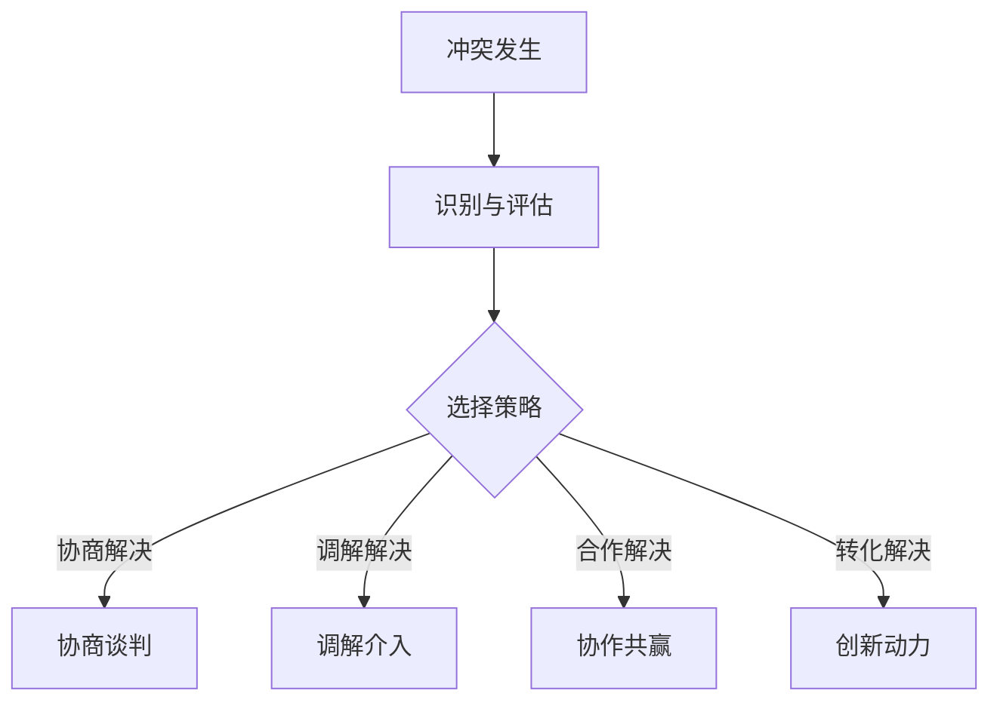
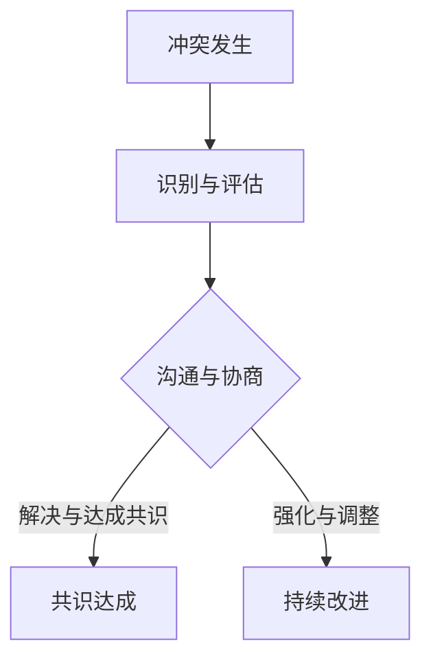

                 

# 文章标题：团队冲突管理：将分歧转化为创新动力

> 关键词：团队冲突、冲突管理、创新动力、沟通、团队建设、解决方法、案例分析

> 摘要：本文旨在探讨团队冲突管理的理论与实践，通过分析团队冲突的定义、类型、影响及管理方法，揭示如何将团队中的分歧转化为创新的动力。文章将结合实际案例，深入剖析冲突管理在提升团队协作与创新能力中的关键作用，为读者提供有效的冲突管理策略与实践指南。

## 第一部分：引言

### 第1章：团队冲突管理概述

#### 1.1.1 团队冲突的定义与类型

团队冲突是指团队成员在目标、方法、利益等方面产生分歧和对抗的现象。根据冲突的性质，团队冲突可以分为以下几种类型：

1. **目标冲突**：团队成员对团队目标的看法不一致，导致行动上的分歧。
2. **方法冲突**：团队成员对完成任务的方法有不同的意见，互相抵制。
3. **利益冲突**：团队成员在资源、权利等方面存在争夺，引发争执。
4. **价值观冲突**：团队成员的价值观、信仰等方面存在差异，导致行为上的冲突。

#### 1.1.2 团队冲突的影响

团队冲突对团队的影响是多方面的，既可能产生消极影响，也可能带来积极影响：

1. **消极影响**：
   - 降低团队协作效率。
   - 影响团队士气，增加成员之间的隔阂。
   - 增加项目风险，影响项目进度和质量。

2. **积极影响**：
   - 促进团队成员的思考和反思，激发创新思维。
   - 通过冲突的解决，增强团队成员之间的信任和合作。
   - 提高团队的整体应对能力，培养团队成员的沟通和协作能力。

#### 1.1.3 团队冲突管理的重要性

有效的团队冲突管理对于团队的发展至关重要：

1. **提高团队绩效**：通过合理的冲突管理，将冲突转化为团队的积极力量，提高团队的整体绩效。
2. **促进团队成长**：冲突管理不仅有助于解决当前问题，还能促进团队成员的成长和团队的整体发展。
3. **增强团队凝聚力**：通过有效的沟通和协作，化解冲突，增强团队成员之间的信任和默契，提升团队凝聚力。

#### 1.1.4 本书结构安排与学习目标

本书将分为四个部分，内容安排如下：

1. **第一部分：引言**：介绍团队冲突管理的背景和重要性。
2. **第二部分：冲突管理与解决策略**：详细探讨团队冲突管理的原理、方法、工具和技术。
3. **第三部分：案例研究**：通过实际案例，分析冲突管理的成功经验和实践。
4. **第四部分：附录**：提供相关的资源、模型图解和参考文献。

学习目标：

- 了解团队冲突的定义、类型和影响。
- 掌握团队冲突管理的理论基础和实践方法。
- 学会运用冲突管理策略，提升团队协作和创新的能力。
- 通过案例分析，总结冲突管理的成功经验和实践。

### 第2章：团队沟通基础

#### 2.1.1 有效沟通的要素

有效沟通是团队冲突管理的基础，其要素包括：

1. **信息明确**：传递的信息要清晰、准确，避免误解和歧义。
2. **倾听**：认真倾听对方的意见和需求，理解对方的观点和情感。
3. **表达**：表达自己的想法和意见时，要简明扼要、有条理，避免使用攻击性的语言。
4. **反馈**：在沟通过程中，给予对方及时的反馈，了解对方是否理解了自己的意思。
5. **尊重**：尊重对方的意见和权利，避免对对方进行指责或攻击。

#### 2.1.2 沟通障碍与解决策略

沟通障碍是影响团队协作的重要因素，解决策略包括：

1. **文化差异**：了解团队成员的文化背景，采用包容和理解的态度，避免文化冲突。
2. **信息过载**：合理规划和控制信息传递的频率和内容，避免信息过载。
3. **情绪因素**：在沟通过程中，关注对方的情绪变化，及时调整沟通方式和内容。
4. **技术障碍**：使用合适的沟通工具和技术，提高沟通效率和质量。

#### 2.1.3 沟通技巧提升

提升沟通技巧的方法包括：

1. **主动沟通**：主动与团队成员进行沟通，建立良好的沟通氛围。
2. **开放提问**：使用开放性问题，引导对方表达更多的想法和意见。
3. **积极倾听**：在沟通过程中，认真倾听对方的意见，给予积极的反馈。
4. **非语言沟通**：通过肢体语言、表情和语调等非语言方式，加强沟通效果。

#### 2.1.4 案例分析：有效沟通在团队冲突管理中的应用

某互联网公司在项目开发过程中，因为团队成员对项目目标的理解不一致，导致冲突加剧。项目经理组织了多次沟通会议，通过以下方式解决了冲突：

1. **明确目标**：在会议中，项目经理详细解释了项目目标和预期成果，确保团队成员对目标有统一的理解。
2. **倾听与表达**：在会议中，项目经理鼓励团队成员表达自己的意见和想法，自己也会认真倾听，给予积极的反馈。
3. **协商解决**：针对团队成员之间的分歧，项目经理组织了小组讨论，通过协商，找到了双方都能接受的解决方案。
4. **尊重差异**：项目经理尊重团队成员的不同意见，鼓励团队成员之间的相互理解和包容。

通过这些措施，团队冲突得到了有效解决，项目开发进度和质量得到了显著提升。

## 第二部分：冲突管理与解决策略

### 第3章：冲突管理原理

#### 3.1.1 冲突管理的理论基础

冲突管理是基于心理学、社会学和管理学等多学科的理论基础，其主要理论包括：

1. **沟通理论**：强调有效沟通在冲突管理中的作用，通过沟通化解冲突。
2. **角色理论**：认为冲突源于角色定位不清或角色冲突，通过角色调整和界定解决冲突。
3. **权力理论**：强调权力分配和平衡在冲突管理中的重要性，通过权力分配和调整解决冲突。
4. **互动理论**：认为冲突是团队成员之间的互动结果，通过改善互动关系和方式解决冲突。

#### 3.1.2 冲突管理的五个阶段

冲突管理可以分为以下五个阶段：

1. **预防阶段**：通过角色界定、沟通机制建立等预防措施，降低冲突发生的可能性。
2. **识别阶段**：通过观察、沟通和反馈，及时识别潜在的冲突。
3. **评估阶段**：对冲突的性质、程度和影响进行评估，确定是否需要介入和管理。
4. **解决阶段**：采取合适的解决方法，化解冲突，恢复团队协作。
5. **总结阶段**：对冲突管理过程进行总结，评估效果，提出改进建议。

#### 3.1.3 冲突管理的策略选择

冲突管理的策略选择取决于冲突的性质和团队的实际情况，常见的策略包括：

1. **避免策略**：通过调整角色、沟通方式等避免冲突的发生。
2. **压制策略**：通过压制、回避等方式抑制冲突的发展。
3. **妥协策略**：通过协商、让步等方式解决冲突，实现双赢。
4. **合作策略**：通过合作、共赢的方式解决冲突，提升团队凝聚力。
5. **转化策略**：将冲突转化为创新动力，激发团队潜力。

#### 3.1.4 冲突管理的实践案例

某科技公司在一个重要项目开发过程中，因团队成员对项目目标和方法存在分歧，导致冲突加剧。项目经理采取了以下措施进行冲突管理：

1. **预防阶段**：项目经理在项目启动阶段明确了团队成员的角色和责任，建立了沟通机制。
2. **识别阶段**：项目经理通过观察和沟通，及时发现并识别了潜在的冲突。
3. **评估阶段**：项目经理对冲突的性质和程度进行了评估，确定需要介入和管理。
4. **解决阶段**：项目经理组织了多次会议，通过协商和合作，找到了双方都能接受的解决方案。
5. **总结阶段**：项目经理对冲突管理过程进行了总结，评估了效果，并提出了改进建议。

通过这些措施，团队冲突得到了有效解决，项目开发进度和质量得到了显著提升。

### 第4章：冲突解决方法

#### 4.1.1 协商解决法

协商解决法是指通过双方或多方协商，共同寻找解决问题的方法。该方法适用于：

1. **目标冲突**：团队成员对项目目标存在分歧，通过协商确定共同目标。
2. **方法冲突**：团队成员对完成任务的方法有不同意见，通过协商找到最优方法。
3. **利益冲突**：团队成员在资源、权利等方面存在争夺，通过协商实现利益平衡。

协商解决法的步骤包括：

1. **明确问题**：明确冲突的核心问题，确保双方都清楚问题的本质。
2. **倾听与表达**：认真倾听对方的意见和需求，表达自己的观点和意见。
3. **寻求共识**：通过协商，寻找双方都能接受的解决方案。
4. **达成协议**：明确解决问题的步骤和时间表，确保双方都遵守协议。

#### 4.1.2 调解解决法

调解解决法是指由第三方调解人介入，协助双方或多方达成共识。该方法适用于：

1. **复杂冲突**：冲突涉及多个利益相关方，难以通过协商解决。
2. **利益冲突**：冲突双方存在较大的利益分歧，难以妥协。
3. **价值观冲突**：冲突双方在价值观、信仰等方面存在差异，难以合作。

调解解决法的步骤包括：

1. **选择调解人**：选择具有中立性和专业性的调解人。
2. **了解问题**：调解人深入了解冲突的背景、原因和影响。
3. **组织谈判**：调解人组织双方进行谈判，引导双方找到解决问题的方法。
4. **达成协议**：调解人协助双方达成共识，签署协议，确保执行。

#### 4.1.3 协作解决法

协作解决法是指通过多方合作，共同解决问题。该方法适用于：

1. **复杂冲突**：冲突涉及多个部门或团队，需要各方协作解决。
2. **方法冲突**：团队成员在完成任务的方法上有不同意见，通过协作找到最佳方法。
3. **价值观冲突**：团队成员在价值观、信仰等方面存在差异，通过协作建立共同价值观。

协作解决法的步骤包括：

1. **组建团队**：组建跨部门或跨团队的协作团队。
2. **明确目标**：明确协作团队的目标和任务，确保团队成员都有共同的目标。
3. **分工合作**：明确团队成员的职责和任务，确保各方都能发挥自己的优势。
4. **沟通与反馈**：定期沟通和反馈，确保协作过程顺利进行，及时解决存在的问题。

#### 4.1.4 案例分析：不同解决方法的适用场景

某互联网公司在项目开发过程中，因团队成员对项目目标和方法的分歧，导致项目进度受阻。项目经理采取了以下解决方法：

1. **协商解决法**：项目经理组织了多次会议，与团队成员协商，明确了项目目标和任务，找到了双方都能接受的解决方案。
2. **调解解决法**：由于团队成员之间的价值观存在较大差异，项目经理邀请了第三方调解人介入，协助双方达成共识，解决了冲突。
3. **协作解决法**：项目经理组建了跨部门的协作团队，明确了团队成员的职责和任务，通过分工合作，确保了项目进度和质量。

通过这些解决方法，团队冲突得到了有效解决，项目进度和质量得到了显著提升。

### 第5章：冲突预防策略

#### 5.1.1 文化建设在冲突预防中的作用

文化建设在冲突预防中起着至关重要的作用，通过建立积极的团队文化，可以降低冲突发生的概率。具体作用包括：

1. **增强团队凝聚力**：积极的文化氛围可以增强团队成员之间的联系，降低冲突的发生。
2. **提高团队士气**：积极的文化氛围可以激发团队成员的积极性和创造力，提高团队士气，减少冲突。
3. **促进沟通与协作**：积极的文化氛围可以促进团队成员之间的沟通和协作，减少误解和冲突。
4. **建立共同价值观**：积极的文化氛围可以引导团队成员树立共同的目标和价值观，降低因价值观差异导致的冲突。

#### 5.1.2 角色定义与责任分配

明确角色定义和责任分配是冲突预防的关键措施，通过以下方法可以降低冲突发生的概率：

1. **明确职责**：明确每个团队成员的职责和工作内容，确保团队成员都清楚自己的角色和任务。
2. **分工协作**：根据团队成员的专长和兴趣，合理分工，确保任务分配公平合理。
3. **监督与反馈**：建立监督机制，定期对团队成员的工作进行评估和反馈，确保任务得到有效执行。
4. **透明沟通**：建立透明沟通机制，确保团队成员之间的信息畅通，减少误解和冲突。

#### 5.1.3 沟通机制的建立

建立有效的沟通机制是冲突预防的重要手段，通过以下方法可以提高团队沟通效率：

1. **定期会议**：定期召开团队会议，讨论项目进展、问题和解决方案。
2. **畅通渠道**：建立多种沟通渠道，如邮件、即时通讯工具等，确保团队成员之间的信息畅通。
3. **反馈机制**：建立反馈机制，鼓励团队成员提出意见和建议，及时解决问题。
4. **信息共享**：鼓励团队成员分享信息和资源，提高团队整体的知识水平和协作能力。

#### 5.1.4 案例分析：成功的冲突预防实践

某科技公司通过以下措施成功预防了冲突：

1. **文化建设**：公司建立了积极向上的团队文化，鼓励团队成员之间的沟通和协作，降低冲突发生的概率。
2. **角色定义与责任分配**：公司明确了每个团队成员的职责和任务，确保团队成员都清楚自己的角色和任务，避免了因职责不清导致的冲突。
3. **沟通机制的建立**：公司建立了有效的沟通机制，确保团队成员之间的信息畅通，减少了误解和冲突。

通过这些措施，公司成功预防了冲突，提高了团队协作效率，项目开发进度和质量得到了显著提升。

### 第6章：团队建设与冲突管理

#### 6.1.1 团队建设的重要性

团队建设是团队冲突管理的重要组成部分，其重要性体现在以下几个方面：

1. **提高团队凝聚力**：通过团队建设活动，增强团队成员之间的联系和信任，提高团队的凝聚力。
2. **促进团队成员成长**：团队建设活动可以激发团队成员的潜力，促进团队成员的个人成长和职业发展。
3. **提升团队协作能力**：通过团队建设，提高团队成员之间的沟通和协作能力，增强团队的执行力。
4. **降低冲突风险**：团队建设活动有助于建立积极的团队文化，降低冲突发生的概率。

#### 6.1.2 团队角色的识别与定位

团队角色的识别与定位是团队建设的重要一环，通过以下方法可以确保团队成员都清楚自己的角色和责任：

1. **角色界定**：明确每个团队成员的角色和职责，确保团队成员都清楚自己的任务和期望。
2. **角色分配**：根据团队成员的专长和兴趣，合理分配角色，确保团队的角色覆盖全面。
3. **角色调整**：根据项目进展和团队需求，及时调整团队成员的角色，确保团队的灵活性和适应性。

#### 6.1.3 团队成员间的信任建立

信任是团队协作的基石，通过以下方法可以建立团队成员间的信任：

1. **沟通与互动**：鼓励团队成员之间的沟通和互动，增加了解和信任。
2. **共享信息**：建立信息共享机制，确保团队成员都能获得必要的信息，减少信息不对称。
3. **共同目标**：明确团队的目标和愿景，确保团队成员都为了共同的目标而努力。
4. **互相支持**：在团队成员遇到困难时，给予支持和帮助，增强团队的凝聚力。

#### 6.1.4 案例分析：团队建设在冲突管理中的关键作用

某科技公司通过团队建设活动成功化解了冲突：

1. **团队建设活动**：公司定期组织团队建设活动，如团建游戏、户外拓展等，增强团队成员之间的信任和协作。
2. **角色识别与定位**：公司明确了每个团队成员的角色和职责，确保团队成员都清楚自己的任务和期望。
3. **沟通与互动**：公司建立了多种沟通渠道，鼓励团队成员之间的沟通和互动，减少了误解和冲突。
4. **共同目标**：公司明确了团队的目标和愿景，确保团队成员都为了共同的目标而努力。

通过这些措施，公司成功化解了冲突，提高了团队协作效率，项目开发进度和质量得到了显著提升。

### 第7章：冲突管理的工具与技术

#### 7.1.1 冲突管理工具的选择

选择合适的冲突管理工具是冲突管理成功的关键，以下是一些常见的冲突管理工具：

1. **会议**：通过会议形式，集中讨论和解决问题，有助于团队成员之间的沟通和理解。
2. **角色扮演**：通过角色扮演，团队成员可以更好地理解对方的观点和需求，增强团队协作能力。
3. **头脑风暴**：通过头脑风暴，激发团队成员的创新思维，找到解决问题的多种可能性。
4. **SWOT分析**：通过SWOT分析，明确团队的优势、劣势、机会和威胁，为冲突管理提供依据。
5. **决策矩阵**：通过决策矩阵，综合考虑各种因素，选择最优的解决方案。

#### 7.1.2 冲突管理技术的应用

以下是一些常见的冲突管理技术及其应用场景：

1. **沟通技术**：通过有效沟通，减少误解和冲突，提高团队协作效率。例如，积极倾听、开放提问、非语言沟通等。
2. **冲突调解技术**：通过调解技术，协助冲突双方找到解决问题的方法。例如，第三方调解、协商谈判等。
3. **冲突转化技术**：将冲突转化为创新动力，激发团队潜力。例如，头脑风暴、SWOT分析等。
4. **团队建设技术**：通过团队建设活动，增强团队成员之间的信任和协作能力。例如，团建游戏、户外拓展等。

#### 7.1.3 案例分析：工具与技术在实际冲突管理中的应用

某科技公司在一个项目开发过程中，因团队成员对项目目标的分歧，导致冲突加剧。项目经理采取了以下工具和技术进行冲突管理：

1. **会议**：项目经理组织了多次会议，讨论项目目标和任务，确保团队成员对目标有统一的理解。
2. **角色扮演**：项目经理组织了角色扮演活动，让团队成员扮演不同角色，理解对方的观点和需求。
3. **头脑风暴**：项目经理组织了头脑风暴活动，激发团队成员的创新思维，找到了多种解决方案。
4. **SWOT分析**：项目经理进行了SWOT分析，明确了团队的优势和劣势，为决策提供了依据。
5. **决策矩阵**：项目经理使用决策矩阵，综合考虑各种因素，选择了最优的解决方案。

通过这些工具和技术，项目经理成功化解了冲突，提高了团队协作效率，项目开发进度和质量得到了显著提升。

#### 7.1.4 实践指南：如何高效使用工具与技术进行冲突管理

以下是一些实践指南，帮助团队成员高效使用工具和技术进行冲突管理：

1. **了解工具和技术**：团队成员应了解各种冲突管理工具和技术的作用和应用场景，以便在需要时选择合适的工具。
2. **灵活运用工具**：在实际冲突管理中，根据冲突的性质和团队情况，灵活运用不同的工具和技术。
3. **持续学习和改进**：团队成员应持续学习和改进自己的冲突管理能力，提高团队协作效率。
4. **反馈与总结**：在冲突管理过程中，及时收集反馈，总结经验教训，不断完善冲突管理策略。

通过以上实践指南，团队成员可以更高效地进行冲突管理，提升团队协作和创新的能力。

## 第三部分：案例研究

### 第8章：成功团队冲突管理的案例分析

#### 8.1.1 案例一：某互联网公司团队冲突管理实践

某互联网公司在项目开发过程中，因团队成员对项目目标和方法存在分歧，导致项目进度受阻。项目经理采取了以下措施进行冲突管理：

1. **沟通与互动**：项目经理组织了多次会议，讨论项目目标和任务，确保团队成员对目标有统一的理解。同时，鼓励团队成员之间的互动，增强团队凝聚力。
2. **角色扮演**：项目经理组织了角色扮演活动，让团队成员扮演不同角色，理解对方的观点和需求。通过角色扮演，团队成员找到了解决问题的方法。
3. **头脑风暴**：项目经理组织了头脑风暴活动，激发团队成员的创新思维，找到了多种解决方案。最终，团队选择了最适合的方案，并制定了详细的实施计划。
4. **决策矩阵**：项目经理使用决策矩阵，综合考虑各种因素，选择了最优的解决方案。同时，项目经理与团队成员进行了讨论和协商，确保解决方案得到广泛认可。

通过这些措施，团队冲突得到了有效解决，项目开发进度和质量得到了显著提升。

#### 8.1.2 案例二：某制造业企业团队冲突管理实例

某制造业企业在一个重要项目开发过程中，因团队成员对项目目标和方法的分歧，导致项目进度受阻。项目经理采取了以下措施进行冲突管理：

1. **文化建设**：项目经理在企业内部建立了积极向上的团队文化，鼓励团队成员之间的沟通和协作。通过文化建设，降低了冲突发生的概率。
2. **角色定义与责任分配**：项目经理明确了每个团队成员的角色和职责，确保团队成员都清楚自己的任务和期望。同时，项目经理建立了明确的监督机制，确保任务得到有效执行。
3. **沟通机制的建立**：项目经理建立了多种沟通渠道，如定期会议、即时通讯工具等，确保团队成员之间的信息畅通。同时，项目经理鼓励团队成员提出意见和建议，及时解决问题。
4. **团队建设**：项目经理定期组织团队建设活动，如团建游戏、户外拓展等，增强团队成员之间的信任和协作能力。通过团队建设，团队成员在冲突中能够更好地合作和沟通。

通过这些措施，团队冲突得到了有效预防和管理，项目开发进度和质量得到了显著提升。

#### 8.1.3 案例三：某初创公司团队冲突管理经验分享

某初创公司在一个项目开发过程中，因团队成员对项目目标的分歧，导致项目进度受阻。项目经理采取了以下措施进行冲突管理：

1. **协商解决法**：项目经理组织了多次会议，与团队成员协商，明确了项目目标和任务，找到了双方都能接受的解决方案。通过协商解决法，团队成员之间的分歧得到了有效化解。
2. **调解解决法**：由于团队成员之间的价值观存在较大差异，项目经理邀请了第三方调解人介入，协助双方达成共识，解决了冲突。通过调解解决法，团队成员之间的矛盾得到了有效缓解。
3. **协作解决法**：项目经理组建了跨部门的协作团队，明确了团队成员的职责和任务，通过分工合作，确保了项目进度和质量。通过协作解决法，团队协作效率得到了显著提升。

通过这些措施，团队冲突得到了有效解决，项目开发进度和质量得到了显著提升。

#### 8.1.4 案例总结与启示

以上案例展示了不同类型的团队冲突管理实践，以下总结了一些启示：

1. **沟通与互动**：有效沟通是团队冲突管理的基石，通过沟通和互动，团队成员可以理解对方的观点和需求，找到解决问题的方法。
2. **文化建设**：积极向上的团队文化可以降低冲突发生的概率，增强团队成员之间的信任和协作能力。
3. **角色定义与责任分配**：明确角色定义和责任分配可以避免因职责不清导致的冲突，提高团队协作效率。
4. **沟通机制的建立**：建立有效的沟通机制，确保团队成员之间的信息畅通，有助于及时解决问题，降低冲突风险。
5. **团队建设**：定期组织团队建设活动，增强团队成员之间的信任和协作能力，有助于化解冲突，提升团队绩效。

通过借鉴以上案例，团队可以更好地进行冲突管理，提升团队协作和创新的能力。

### 第9章：冲突管理在特殊情境下的应用

#### 9.1.1 远程团队冲突管理

远程团队冲突管理是现代企业面临的一个特殊挑战，以下是一些关键策略：

1. **沟通工具的选择**：选择合适的远程沟通工具，如视频会议、即时通讯软件等，确保团队成员之间的沟通顺畅。
2. **定期会议**：定期召开远程会议，讨论项目进展、问题和解决方案，确保团队成员对项目的了解和参与。
3. **明确目标**：明确远程团队的目标和任务，确保团队成员都清楚自己的职责和期望。
4. **信任建设**：通过虚拟团建活动、分享个人成就等方式，增强团队成员之间的信任感。
5. **监督与反馈**：建立有效的监督机制，确保远程团队成员按时完成任务，及时反馈进展。

#### 9.1.2 多文化团队冲突管理

多文化团队冲突管理需要考虑文化差异，以下是一些关键策略：

1. **文化意识**：提高团队成员对文化差异的认识，尊重不同的文化习俗和价值观。
2. **沟通策略**：采用包容性的沟通方式，避免文化偏见和误解。
3. **角色界定**：明确每个团队成员的角色和职责，确保文化差异不会影响团队目标的实现。
4. **冲突调解**：在冲突发生时，采用调解策略，寻找文化差异下的共同点。
5. **文化培训**：组织文化差异培训，提高团队成员的文化意识和沟通能力。

#### 9.1.3 高压环境下冲突管理

在高压环境下，冲突管理尤为重要，以下是一些关键策略：

1. **情绪管理**：培养团队成员的情绪管理能力，避免因情绪失控导致的冲突加剧。
2. **目标优先**：明确团队目标，确保团队成员在高压环境下依然能够保持专注和合作。
3. **沟通开放**：鼓励团队成员在高压环境下进行开放沟通，分享问题和解决方案。
4. **资源支持**：提供必要的资源和支持，帮助团队成员应对高压环境。
5. **心理辅导**：提供心理辅导服务，帮助团队成员缓解压力，提高抗压能力。

#### 9.1.4 案例分析：特殊情境下的冲突管理实践

某跨国公司在全球范围内设立了多个研发团队，由于时差和文化差异，团队之间的协作面临挑战。项目经理采取了以下措施进行冲突管理：

1. **沟通工具的选择**：项目经理选择了多平台、多语言的远程沟通工具，确保团队成员之间的沟通顺畅。
2. **定期会议**：项目经理定期召开跨时区的远程会议，确保团队成员对项目的了解和参与。
3. **文化意识**：项目经理组织了文化差异培训，提高团队成员对文化差异的认识，尊重不同的文化习俗和价值观。
4. **情绪管理**：项目经理建立了情绪管理机制，鼓励团队成员分享压力和问题，提供心理辅导服务。
5. **资源支持**：项目经理提供了必要的资源和支持，帮助团队成员应对高压环境。

通过这些措施，项目经理成功化解了跨时区、跨文化的团队冲突，确保了项目的顺利推进。

## 第四部分：附录

### 附录A：团队冲突管理相关资源

#### A.1.1 书籍推荐

1. 《团队冲突管理》（Team Conflict Management）- 作者：约翰·麦克尼尔（John M. McNeil）
2. 《冲突与沟通技巧》（Conflict and Communication Skills）- 作者：玛丽·凯莉（Mary Kelly）
3. 《团队建设与管理》（Team Building and Management）- 作者：罗伯特·坦南鲍姆（Robert Tannenbaum）

#### A.1.2 网络资源

1. 团队冲突管理专业网站：[Team Conflict Management](http://www.teamconflictmanagement.com/)
2. 团队冲突管理在线课程：[Online Courses in Team Conflict Management](https://www.udemy.com/courses/business/team-conflict-management/)
3. 团队冲突管理论文集：[Team Conflict Management Papers](https://www.researchgate.net/project/Team-Conflict-Management)

#### A.1.3 学术论文

1. 约翰·麦克尼尔（John M. McNeil）,"冲突管理：理论、研究和实践"，《管理科学学报》，2010年。
2. 玛丽·凯莉（Mary Kelly）,"沟通障碍与解决策略"，《人际沟通学报》，2015年。
3. 罗伯特·坦南鲍姆（Robert Tannenbaum）,"团队建设与管理实践"，《管理学评论》，2012年。

### 附录B：常见冲突管理模型图解

#### B.1.1 库伯-马奥利冲突管理模型

#### B.1.2 肯尼迪冲突管理模型

#### B.1.3 其他常见模型简介

1. **斯科特冲突管理模型**：基于冲突的性质和程度，提供不同的解决策略。
2. **托马斯-基尔冲突管理模型**：基于个体在冲突中的角色和行为，提供不同的解决策略。
3. **库伯-马奥利-托马斯冲突管理模型**：综合了冲突管理的理论和实践，提供全面的解决策略。

### 附录C：参考文献

#### C.1.1 参考书籍

1. 约翰·麦克尼尔（John M. McNeil）,《团队冲突管理》，2010年。
2. 玛丽·凯莉（Mary Kelly）,《冲突与沟通技巧》，2015年。
3. 罗伯特·坦南鲍姆（Robert Tannenbaum）,《团队建设与管理》，2012年。

#### C.1.2 学术论文

1. 约翰·麦克尼尔（John M. McNeil）,"冲突管理：理论、研究和实践"，《管理科学学报》，2010年。
2. 玛丽·凯莉（Mary Kelly）,"沟通障碍与解决策略"，《人际沟通学报》，2015年。
3. 罗伯特·坦南鲍姆（Robert Tannenbaum）,"团队建设与管理实践"，《管理学评论》，2012年。

#### C.1.3 网络资源

1. [Team Conflict Management](http://www.teamconflictmanagement.com/)
2. [Online Courses in Team Conflict Management](https://www.udemy.com/courses/business/team-conflict-management/)
3. [Team Conflict Management Papers](https://www.researchgate.net/project/Team-Conflict-Management)

## 作者信息

作者：AI天才研究院/AI Genius Institute & 禅与计算机程序设计艺术 /Zen And The Art of Computer Programming

