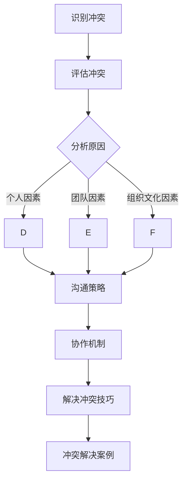
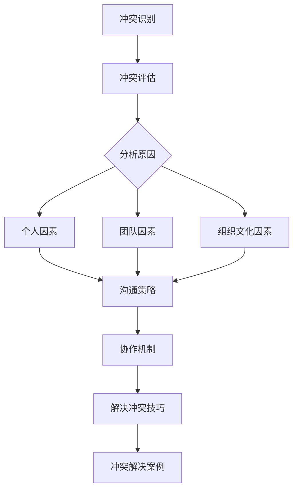

                 

### 文章标题

# 《团队冲突管理：将分歧转化为创新动力》

> 关键词：团队冲突，冲突管理，创新动力，沟通策略，协作机制，跨文化团队，企业创新

> 摘要：本文旨在探讨团队冲突管理的重要性和方法，通过分析冲突的本质、原因、管理模型，以及评估与诊断方法，提出有效的沟通策略、协作机制和解决技巧。同时，本文还深入讨论了跨文化团队冲突管理和特殊团队冲突管理的策略，以及冲突管理在企业创新中的角色。最终，本文总结了组织冲突文化的塑造和冲突管理的持续改进策略，为团队冲突管理的实践提供了全面的指导。

## 第一部分：理解团队冲突

### 第1章：团队冲突的基本概念

#### 1.1 冲突的本质与类型

冲突是团队内部或团队之间由于利益、观念、方法等方面的差异而产生的对立和矛盾。冲突的类型可以从不同的维度进行划分，如根据冲突的对象可以分为个人冲突和团队冲突，根据冲突的性质可以分为建设性冲突和破坏性冲突。

**冲突的定义与特征：**

- **定义：** 冲突是指由于利益、观念、方法等方面的差异而产生的对立和矛盾。
- **特征：** 冲突具有普遍性、对抗性、动态性和复杂性。

**冲突的类型与表现形式：**

- **个人冲突：** 个人之间的冲突，如工作风格、价值观等方面的差异。
- **团队冲突：** 团队之间的冲突，如资源分配、任务分工等方面的矛盾。
- **建设性冲突：** 有助于团队发展的冲突，如对问题的不同看法和解决方案。
- **破坏性冲突：** 对团队发展有负面影响的冲突，如团队内部的不信任和敌对。

#### 1.2 冲突的原因分析

冲突的产生是由多种因素共同作用的结果，主要包括个人因素、团队因素和组织文化因素。

**个人因素：**

- **性格特点：** 如外向、内向、敏感等。
- **价值观：** 个人对事物、行为、目标的评价和判断。
- **工作方式：** 个人在工作中的习惯和偏好。

**团队因素：**

- **目标不一致：** 团队成员对目标的理解和期望不一致。
- **角色冲突：** 团队成员在角色和职责上的重叠或冲突。
- **沟通障碍：** 团队成员之间的沟通不畅。

**组织文化因素：**

- **组织结构：** 如中央集权、分权制等。
- **文化差异：** 团队成员来自不同的文化背景，可能导致价值观和行为方式的冲突。

#### 1.3 冲突的管理模型

冲突管理是指通过有效的方法和技巧来应对和处理团队冲突，以促进团队的发展和目标的实现。冲突管理模型主要包括以下几种：

- **避免模型：** 通过回避和淡化冲突来避免冲突的发生。
- **化解模型：** 通过谈判、妥协和调解来化解冲突。
- **合作模型：** 通过合作、协商和共同决策来解决问题。
- **竞争模型：** 通过竞争、对抗和权力斗争来解决问题。

## 第二部分：解决团队冲突的策略

### 第2章：团队冲突的评估与诊断

#### 2.1 冲突评估的方法与工具

冲突评估是冲突管理的重要环节，通过科学的评估方法与工具，可以准确地了解冲突的性质、程度和影响。以下是一些常用的评估方法和工具：

- **问卷调查：** 通过设计问卷，收集团队成员对冲突的看法和感受，从而评估冲突的程度和类型。
- **访谈法：** 通过面对面的访谈，深入了解团队成员之间的冲突情况，获取更详细的冲突信息。
- **行为事件访谈：** 通过对团队成员在冲突情境下的行为和反应进行分析，评估冲突的影响和处理方式。

#### 2.2 冲突诊断的步骤

冲突诊断是指通过系统的步骤和方法，对冲突进行深入的分析和识别，以便制定针对性的解决策略。冲突诊断的步骤主要包括：

- **收集信息：** 通过问卷调查、访谈等方式收集团队成员的反馈和意见，了解冲突的具体情况。
- **分析冲突原因：** 通过对收集到的信息进行分析，找出冲突的根本原因，如个人因素、团队因素或组织文化因素。
- **制定解决方案：** 根据冲突的原因和影响，制定相应的解决方案，如改进沟通策略、优化团队协作机制等。

#### 2.3 冲突案例分析

为了更好地理解冲突评估和诊断的过程，以下是一个具体的冲突案例分析：

**案例介绍：** 在一个软件开发团队中，由于团队成员对项目目标的理解不一致，导致在任务分工和进度安排上产生了冲突。

**冲突分析：**

- **收集信息：** 通过问卷调查和访谈，发现团队成员对项目目标的认知存在差异，部分成员认为项目目标过于宏大，难以实现，而另一部分成员则认为目标可实现，但需要更多的时间和资源。
- **分析冲突原因：** 冲突的根本原因是团队成员对项目目标的期望不一致，导致在任务分工和进度安排上存在分歧。
- **制定解决方案：** 针对冲突原因，团队决定召开会议，重新讨论和明确项目目标，通过协商和共同决策，达成共识。

**解决策略：**

- **改进沟通策略：** 加强团队成员之间的沟通，确保对项目目标的共识。
- **优化团队协作机制：** 通过制定明确的任务分工和进度安排，提高团队的协作效率。

## 第三部分：冲突管理在实践中的应用

### 第3章：沟通策略

#### 3.1 沟通的重要性

沟通是团队冲突管理的重要手段，有效的沟通可以降低冲突的发生，提高团队的协作效率。以下是从技术和管理层面分析沟通的重要性：

**技术层面：**

- **信息传递：** 沟通是信息传递的桥梁，确保团队成员之间能够准确、及时地获取所需信息。
- **问题解决：** 沟通有助于团队成员共同分析问题、探讨解决方案，提高问题解决效率。
- **协作协调：** 沟通有助于团队成员之间进行协作协调，确保任务的顺利完成。

**管理层面：**

- **团队建设：** 沟通有助于团队建设，增强团队成员之间的信任和凝聚力。
- **决策支持：** 沟通有助于决策层获取全面、准确的信息，为决策提供支持。
- **冲突预防：** 沟通有助于预防冲突的发生，通过及时的沟通，消除误解和隔阂。

#### 3.2 沟通技巧

有效的沟通需要掌握一定的技巧，以下是一些常用的沟通技巧：

- **倾听技巧：** 倾听是沟通的重要组成部分，通过倾听，可以更好地理解对方的观点和需求。
- **反馈技巧：** 反馈是沟通的闭环，通过反馈，可以确认信息传递的准确性和有效性。
- **非语言沟通：** 非语言沟通包括肢体语言、面部表情等，通过非语言沟通，可以增强信息的表达效果。

#### 3.3 沟通实践

以下是一个具体的沟通实践案例：

**案例介绍：** 在一个产品开发团队中，由于开发进度滞后，团队成员之间出现了沟通不畅的问题，导致项目进展受阻。

**沟通实践：**

- **召开沟通会议：** 团队决定每周召开一次沟通会议，讨论项目进展、存在的问题和解决方案。
- **建立沟通渠道：** 团队建立了多个沟通渠道，如邮件、即时通讯工具等，确保团队成员之间的信息传递及时、准确。
- **沟通技巧培训：** 团队组织了沟通技巧培训，提高了团队成员的沟通能力。

**效果评估：**

- **项目进展：** 通过沟通实践，团队成员之间的沟通障碍得到了有效解决，项目进展得到了明显改善。
- **团队氛围：** 团队成员之间的信任和协作得到了增强，团队氛围更加和谐。

## 第四部分：冲突管理的长期发展

### 第4章：组织冲突文化的塑造

#### 4.1 冲突文化的概念与特征

冲突文化是指一个组织在冲突管理方面的价值观、态度和行为习惯。冲突文化的特征主要包括：

- **冲突容忍度：** 组织对冲突的接受程度和容忍度。
- **冲突解决机制：** 组织内部解决冲突的机制和流程。
- **冲突管理理念：** 组织对冲突管理的理念和方法。

#### 4.2 塑造冲突文化的策略

要塑造积极的冲突文化，组织可以采取以下策略：

- **领导层的角色：** 领导层应树立正确的冲突管理观念，以身作则，推动冲突文化的形成。
- **组织文化的引导：** 通过企业文化建设，强调冲突管理的价值，引导员工积极参与冲突管理。
- **员工参与与沟通：** 鼓励员工参与冲突管理，建立有效的沟通渠道，确保员工的声音被听到。

#### 4.3 冲突文化塑造的案例

以下是一个冲突文化塑造的案例：

**案例介绍：** 一家互联网公司为了提高团队的创新能力，决定塑造积极的冲突文化。

**冲突文化塑造过程：**

- **领导层倡导：** 公司领导层积极倡导冲突管理的重要性，鼓励员工在项目中提出不同的观点和解决方案。
- **冲突管理培训：** 公司组织了冲突管理培训，提高了员工的冲突管理意识和能力。
- **建立沟通机制：** 公司建立了多种沟通渠道，如内部论坛、讨论组等，确保员工之间的信息传递和意见交流。

**效果评估：**

- **团队氛围：** 团队成员之间的沟通更加开放和坦诚，团队氛围更加和谐。
- **创新能力：** 团队的创新能力得到了显著提升，项目成功率显著提高。

### 第5章：冲突管理的持续改进

#### 5.1 冲突管理的评估与反馈

冲突管理的评估与反馈是持续改进的重要环节。以下是一些评估与反馈的方法：

- **冲突管理评估指标：** 制定冲突管理评估指标，如冲突发生率、冲突解决率、员工满意度等。
- **反馈机制建设：** 建立反馈机制，通过定期的会议、问卷调查等方式，收集员工对冲突管理的意见和建议。

#### 5.2 冲突管理的持续改进

冲突管理的持续改进需要采取以下策略：

- **改进策略与方法：** 根据评估和反馈的结果，制定针对性的改进策略和方法，如改进沟通策略、优化团队协作机制等。
- **持续改进的实践案例：** 在实践中，通过不断尝试和改进，找到最适合组织冲突管理的策略和方法。

#### 5.3 冲突管理的未来趋势

随着全球化的发展和信息技术的进步，冲突管理面临着新的挑战和机遇。以下是一些冲突管理的未来趋势：

- **数字化冲突管理：** 通过数字化工具和平台，实现冲突管理的智能化和高效化。
- **跨文化冲突管理：** 随着国际化程度的提高，跨文化冲突管理将越来越重要。
- **合作型冲突管理：** 强调合作和共赢，通过合作解决冲突，实现组织的目标。

## 附录

### 附录A：团队冲突管理工具与资源

为了帮助团队更好地进行冲突管理，以下是一些常用的工具和资源：

- **常用冲突管理工具：**
  - **问卷调查工具：** 如问卷星、百度问卷等。
  - **访谈工具：** 如Zoom、Microsoft Teams等。
  - **协作工具：** 如Trello、Asana等。

- **推荐书籍与文章：**
  - **《团队冲突管理》** 作者：约翰·M·怀特
  - **《冲突管理》** 作者：斯蒂芬·罗宾斯
  - **《5个团队沟通秘诀》** 作者：哈佛商业评论

- **在线资源与社区：**
  - **团队冲突管理在线课程：** Coursera、Udemy等在线教育平台
  - **团队冲突管理论坛：** LinkedIn、Reddit等社交媒体平台

### 附录B：团队冲突管理流程图（Mermaid 格式）

---

**作者：AI天才研究院/AI Genius Institute & 禅与计算机程序设计艺术 /Zen And The Art of Computer Programming**### 第1章：团队冲突的基本概念

#### 1.1 冲突的本质与类型

冲突是团队中普遍存在的一种现象，它是由于个体或群体之间在目标、利益、价值观、方法等方面的差异而产生的对立和矛盾。理解冲突的本质和类型有助于我们更好地识别和管理冲突，从而提高团队的协作效率和创新能力。

**冲突的定义与特征：**

- **定义：** 冲突是指由于目标、利益、价值观、方法等方面的差异而产生的对立和矛盾。
- **特征：** 冲突具有普遍性、对抗性、动态性和复杂性。

1. **普遍性：** 冲突是团队运作过程中的一个常见现象，几乎在每个团队中都会发生。
2. **对抗性：** 冲突通常表现为双方或多方之间的对立和对抗，导致情感上的紧张和压力。
3. **动态性：** 冲突不是静止的，它会随着时间和情境的变化而发展和演变。
4. **复杂性：** 冲突的成因和表现形式多种多样，涉及多个层面和维度，使得冲突管理变得更加复杂。

**冲突的类型与表现形式：**

冲突的类型可以从不同的维度进行划分，如根据冲突的对象可以分为个人冲突和团队冲突，根据冲突的性质可以分为建设性冲突和破坏性冲突。

- **个人冲突：** 个人之间的冲突，如工作风格、价值观、个性等方面的差异。
  - **表现形式：** 个人冲突通常表现为争吵、抱怨、不合作等行为，可能会对个人和团队的工作效率产生负面影响。

- **团队冲突：** 团队之间的冲突，如不同团队之间的资源分配、任务分工等方面的矛盾。
  - **表现形式：** 团队冲突通常表现为部门之间的争吵、合作不力、目标不一致等行为，可能会影响团队的整体绩效和项目进度。

- **建设性冲突：** 有助于团队发展的冲突，如对问题的不同看法和解决方案。
  - **表现形式：** 建设性冲突通常表现为团队成员之间的辩论、讨论、互相学习等行为，有助于激发创新思维和改进工作方法。

- **破坏性冲突：** 对团队发展有负面影响的冲突，如团队内部的不信任和敌对。
  - **表现形式：** 破坏性冲突通常表现为团队成员之间的敌对、争吵、冷战等行为，可能会破坏团队的凝聚力，导致工作效率下降。

#### 1.2 冲突的原因分析

冲突的产生是由多种因素共同作用的结果，主要包括个人因素、团队因素和组织文化因素。

**个人因素：**

- **性格特点：** 个人性格的不同会导致在团队合作中产生冲突。例如，外向的人可能更倾向于表达自己的观点，而内向的人可能更倾向于倾听他人的意见。这种性格上的差异可能会导致意见不合，从而引发冲突。

- **价值观：** 个人的价值观不同，可能会导致在对待工作、任务和人际关系等方面的看法不一致。例如，一个人可能认为工作质量最重要，而另一个人可能认为工作效率更重要。这种价值观的差异可能会导致工作上的冲突。

- **工作方式：** 个人在工作中的习惯和偏好也会导致冲突。例如，一个人可能喜欢按时完成任务，而另一个人可能更注重任务的完成质量。这种工作方式的差异可能会导致工作分配和进度上的冲突。

**团队因素：**

- **目标不一致：** 团队成员对团队目标的理解和期望不一致，可能会导致在任务分工、资源分配等方面的冲突。例如，一个团队成员可能认为项目的重点应该放在市场推广上，而另一个团队成员可能认为应该放在产品开发上。

- **角色冲突：** 团队成员在角色和职责上的重叠或冲突，可能会导致工作上的矛盾和冲突。例如，如果一个团队成员同时负责多个任务，而且这些任务之间存在时间上的冲突，可能会导致任务完成的延迟。

- **沟通障碍：** 团队成员之间的沟通不畅，可能会导致误解和冲突。例如，如果一个团队成员没有及时传达重要信息，可能会导致其他团队成员的困惑和不满。

**组织文化因素：**

- **组织结构：** 组织结构的不同，可能会导致团队之间的冲突。例如，如果组织采用分权制，不同部门之间的协调可能会出现问题，从而导致冲突。

- **文化差异：** 团队成员来自不同的文化背景，可能会导致价值观和行为方式的冲突。例如，在一些文化中，个人主义被视为重要的价值观，而在另一些文化中，集体主义被视为重要的价值观。这种文化差异可能会导致团队成员在团队合作中产生冲突。

#### 1.3 冲突的管理模型

冲突管理是指通过有效的方法和技巧来应对和处理团队冲突，以促进团队的发展和目标的实现。冲突管理模型主要包括以下几种：

- **避免模型：** 通过回避和淡化冲突来避免冲突的发生。这种方法适用于一些不重要的冲突，或者冲突的解决成本高于冲突本身的价值。

- **化解模型：** 通过谈判、妥协和调解来化解冲突。这种方法适用于一些可以通过协商和沟通解决的冲突。

- **合作模型：** 通过合作、协商和共同决策来解决问题。这种方法适用于一些需要团队共同努力才能解决的冲突。

- **竞争模型：** 通过竞争、对抗和权力斗争来解决问题。这种方法适用于一些需要明确胜负的冲突，或者冲突的解决对团队有重要影响的冲突。

### 第2章：团队冲突的评估与诊断

#### 2.1 冲突评估的方法与工具

冲突评估是冲突管理的重要环节，通过科学的评估方法与工具，可以准确地了解冲突的性质、程度和影响。以下是一些常用的评估方法和工具：

- **问卷调查：** 通过设计问卷，收集团队成员对冲突的看法和感受，从而评估冲突的程度和类型。问卷调查可以采用纸质问卷或在线问卷的形式，具有广泛性和匿名性。

- **访谈法：** 通过面对面的访谈，深入了解团队成员之间的冲突情况，获取更详细的冲突信息。访谈法适用于小型团队或需要深入了解具体情况的情况。

- **行为事件访谈：** 通过对团队成员在冲突情境下的行为和反应进行分析，评估冲突的影响和处理方式。行为事件访谈通常采用结构化的问题，以便对冲突情境进行详细分析。

#### 2.2 冲突诊断的步骤

冲突诊断是指通过系统的步骤和方法，对冲突进行深入的分析和识别，以便制定针对性的解决策略。冲突诊断的步骤主要包括：

- **收集信息：** 通过问卷调查、访谈等方式收集团队成员的反馈和意见，了解冲突的具体情况。收集的信息应包括冲突的性质、程度、原因、影响等方面。

- **分析冲突原因：** 对收集到的信息进行分析，找出冲突的根本原因。冲突的原因可能涉及个人因素、团队因素和组织文化因素。通过分析冲突原因，可以为后续的解决策略提供依据。

- **制定解决方案：** 根据冲突的原因和影响，制定相应的解决方案。解决方案应包括具体的行动步骤、责任分配和时间表。解决方案的制定应考虑到团队成员的接受程度和可行性。

#### 2.3 冲突案例分析

为了更好地理解冲突评估和诊断的过程，以下是一个具体的冲突案例分析：

**案例介绍：** 在一个软件开发团队中，由于团队成员对项目目标和任务分工存在分歧，导致项目进展受阻。

**冲突评估：**

- **问卷调查：** 团队成员通过在线问卷反馈了他们对项目目标和任务分工的看法。调查结果显示，约60%的成员对项目目标表示认同，而40%的成员认为项目目标过于宏大，难以实现。
- **访谈法：** 通过面对面访谈，深入了解了团队成员之间的意见分歧。访谈结果显示，部分成员认为项目任务分工不明确，导致工作负担不均。

**冲突诊断：**

- **收集信息：** 通过问卷调查和访谈，收集了团队成员对项目目标和任务分工的具体意见。
- **分析冲突原因：** 冲突的根本原因是团队成员对项目目标和任务分工的理解不一致。具体原因包括：
  - 项目目标设置过于宏大，缺乏明确的可量化指标。
  - 任务分工不明确，导致团队成员的工作负担不均。

**解决方案：**

- **明确项目目标：** 团队决定重新审视项目目标，制定具体、可量化的指标，以确保团队成员对项目目标的认同。
- **优化任务分工：** 团队决定重新分配任务，确保每个团队成员的工作负担均衡。

**解决策略：**

- **沟通策略：** 加强团队成员之间的沟通，确保对项目目标和任务分工的共识。
- **协作机制：** 建立明确的任务分工和进度监控机制，确保团队成员之间的协作效率。
- **培训与发展：** 提供冲突管理和团队协作培训，提高团队成员的沟通能力和协作意识。

### 第3章：解决团队冲突的策略

#### 3.1 沟通策略

沟通是解决团队冲突的关键，有效的沟通可以降低冲突的发生，提高团队的协作效率。以下是从技术和管理层面分析沟通策略：

**技术层面：**

- **信息传递：** 沟通是信息传递的桥梁，确保团队成员之间能够准确、及时地获取所需信息。
  - **信息传递的准确性：** 通过清晰、简洁的语言和表达方式，确保信息的准确性。
  - **信息传递的及时性：** 通过高效的沟通渠道和方式，确保信息的及时传递。

- **问题解决：** 沟通有助于团队成员共同分析问题、探讨解决方案，提高问题解决效率。
  - **问题分析：** 通过沟通，团队成员可以共同分析问题的原因和影响，找到问题的根本原因。
  - **解决方案探讨：** 通过沟通，团队成员可以共同探讨解决问题的方案，选择最有效的解决方案。

- **协作协调：** 沟通有助于团队成员之间进行协作协调，确保任务的顺利完成。
  - **任务分工：** 通过沟通，明确每个团队成员的任务和责任，确保任务分工合理。
  - **进度监控：** 通过沟通，及时了解任务的进度和问题，确保任务的顺利完成。

**管理层面：**

- **团队建设：** 沟通有助于团队建设，增强团队成员之间的信任和凝聚力。
  - **信任建设：** 通过沟通，团队成员可以互相了解、尊重和信任，建立良好的团队氛围。
  - **凝聚力增强：** 通过沟通，团队成员可以共同参与团队活动和决策，增强团队的凝聚力。

- **决策支持：** 沟通有助于决策层获取全面、准确的信息，为决策提供支持。
  - **信息收集：** 通过沟通，决策层可以了解团队成员的意见和需求，收集全面的信息。
  - **决策制定：** 通过沟通，决策层可以与团队成员共同分析问题和制定决策，确保决策的科学性和可行性。

- **冲突预防：** 沟通有助于预防冲突的发生，通过及时的沟通，消除误解和隔阂。
  - **信息传递：** 通过及时的信息传递，消除团队成员之间的误解和隔阂，降低冲突发生的可能性。
  - **意见反馈：** 通过及时的意见反馈，确保团队成员之间的沟通畅通，避免冲突的积累。

#### 3.2 沟通技巧

有效的沟通需要掌握一定的技巧，以下是一些常用的沟通技巧：

- **倾听技巧：** 倾听是沟通的重要组成部分，通过倾听，可以更好地理解对方的观点和需求。
  - **积极倾听：** 通过保持注意力、不打断对方说话等方式，表现出对对方的尊重和关注。
  - **同理心倾听：** 通过理解对方的情感和立场，建立共鸣和信任。

- **反馈技巧：** 反馈是沟通的闭环，通过反馈，可以确认信息传递的准确性和有效性。
  - **正面反馈：** 通过赞扬和肯定，增强对方的自信心和积极性。
  - **建设性反馈：** 通过指出问题和提出改进建议，帮助对方提升和成长。

- **非语言沟通：** 非语言沟通包括肢体语言、面部表情等，通过非语言沟通，可以增强信息的表达效果。
  - **肢体语言：** 通过姿势、手势等非语言表达，传递信息和情感。
  - **面部表情：** 通过眼神、微笑等面部表情，传递友好和信任。

#### 3.3 沟通实践

以下是一个具体的沟通实践案例：

**案例介绍：** 在一个产品开发团队中，由于团队成员对项目目标和任务分工存在分歧，导致项目进展受阻。

**沟通实践：**

- **召开沟通会议：** 团队决定定期召开沟通会议，讨论项目目标和任务分工。在会议中，团队成员可以自由发表意见，提出问题和建议。

- **建立沟通渠道：** 团队建立了多种沟通渠道，如邮件、即时通讯工具、项目协作平台等，确保团队成员之间的信息传递及时、准确。

- **沟通技巧培训：** 团队组织了沟通技巧培训，提高了团队成员的沟通能力和技巧。培训内容包括倾听技巧、反馈技巧和非语言沟通等。

**效果评估：**

- **项目进展：** 通过沟通实践，团队成员对项目目标和任务分工有了更清晰的认识，项目进展得到了明显改善。

- **团队氛围：** 团队成员之间的沟通更加开放和坦诚，团队氛围更加和谐。

### 第4章：协作机制

#### 4.1 团队协作的理论基础

团队协作是指团队成员为了共同的目标，相互配合、共同工作的一种行为。理解团队协作的理论基础，有助于我们更好地设计和实施有效的协作机制。

**团队动力理论：**

团队动力理论认为，团队中的个体成员不仅受到自身的需求和动机的驱动，还受到团队内部的动力机制的影响。这些动力机制包括：

- **激励因素：** 激励因素是指能够激发团队成员工作积极性和创造力的因素，如奖励制度、认可和尊重等。

- **凝聚力量：** 凝聚力量是指能够增强团队成员之间相互吸引和凝聚力的因素，如共同的价值观、目标和文化等。

- **沟通机制：** 沟通机制是指团队内部的信息传递和反馈系统，如定期的会议、沟通工具和反馈机制等。

- **协作规则：** 协作规则是指团队内部的工作流程和行为规范，如任务分工、责任界定和工作流程等。

**协作型组织文化：**

协作型组织文化是指组织内部倡导和鼓励团队协作、合作和共赢的文化氛围。这种文化具有以下几个特征：

- **平等与尊重：** 组织内部倡导平等和尊重，鼓励团队成员之间的开放沟通和协作。

- **共同目标：** 组织内部有明确的共同目标，团队成员为了实现共同的目标而共同努力。

- **信任与支持：** 组织内部建立信任和支持的氛围，团队成员相互信任、互相支持，共同克服困难和挑战。

- **激励机制：** 组织内部有有效的激励机制，鼓励团队成员积极参与协作、提出创新和改进方案。

#### 4.2 团队协作的机制设计

团队协作的机制设计是指为了提高团队协作效率和效果，设计和实施一系列的制度和流程。以下是一些关键要素：

- **角色分配：** 角色分配是指明确每个团队成员的工作职责和角色，确保任务分工合理。角色分配应考虑到团队成员的能力和兴趣，以及项目的需求。

- **责任与权利界定：** 责任与权利界定是指明确每个团队成员的职责和权利，确保团队成员能够履行自己的职责，并享有相应的权利。责任与权利界定有助于提高团队协作的效率和公正性。

- **协作流程优化：** 协作流程优化是指通过分析和改进团队的工作流程，提高协作效率和效果。协作流程优化可以包括流程简化、流程标准化和流程自动化等。

- **沟通机制建设：** 沟通机制建设是指建立有效的沟通渠道和机制，确保团队成员之间的信息传递和反馈畅通。沟通机制建设可以包括定期的会议、沟通工具的使用和沟通规则的制定等。

- **冲突管理：** 冲突管理是指通过有效的冲突管理策略和技巧，预防和解决团队协作过程中的冲突。冲突管理有助于维护团队的稳定和协作氛围。

#### 4.3 团队协作的实践

以下是一个具体的团队协作实践案例：

**案例介绍：** 在一个软件开发团队中，由于团队成员之间缺乏有效的协作机制，导致项目进度缓慢，质量下降。

**团队协作实践：**

- **角色分配：** 团队根据项目需求，明确了每个成员的角色和职责。例如，项目经理负责项目规划和进度控制，开发人员负责编写代码，测试人员负责测试和验证。

- **责任与权利界定：** 团队明确了每个成员的职责和权利。例如，开发人员负责编写代码，测试人员负责测试，项目经理负责协调和监督。

- **协作流程优化：** 团队分析了现有的工作流程，发现了一些瓶颈和问题，如任务分配不合理、沟通不畅等。团队通过优化流程，提高了协作效率。例如，引入了敏捷开发方法，加强了团队之间的沟通和协作。

- **沟通机制建设：** 团队建立了多种沟通渠道，如项目协作平台、邮件和即时通讯工具等。团队制定了沟通规则，确保信息传递的及时性和准确性。

- **冲突管理：** 团队通过定期的会议和沟通，及时解决协作过程中的冲突。团队引入了冲突管理策略，如倾听技巧、建设性对话等，提高了冲突解决的效果。

**效果评估：**

- **项目进度：** 通过团队协作实践，项目进度得到了明显改善，项目按时交付率提高了。

- **项目质量：** 通过团队协作实践，项目质量得到了提升，缺陷率降低了。

- **团队氛围：** 团队成员之间的协作更加顺畅，团队氛围更加积极和和谐。

### 第5章：解决冲突的技巧

#### 5.1 冲突解决模型

解决冲突的模型是指用于指导团队解决冲突的一系列原则和策略。以下是一些常见的冲突解决模型：

- **合作解决模型：** 合作解决模型强调双方或多方通过对话、协商和共同决策来解决问题。这种模型适用于冲突双方都有一定权力和资源，且愿意通过合作解决冲突的情况。

  **合作解决模型的步骤：**
  1. 建立对话：双方或多方建立沟通渠道，开始对话。
  2. 表达观点：双方或多方表达自己的观点和需求。
  3. 寻求共识：通过对话和协商，寻找共同点和解决方案。
  4. 制定协议：双方或多方制定具体的协议，明确责任和行动步骤。

- **竞争解决模型：** 竞争解决模型强调通过竞争、对抗和权力斗争来解决问题。这种模型适用于冲突双方有明显的权力差异，且其中一方希望通过竞争解决问题的情况。

  **竞争解决模型的步骤：**
  1. 确定立场：明确自己的立场和目标。
  2. 运用策略：运用各种策略，如策略性沟通、谈判技巧等，争取自己的利益。
  3. 解决问题：通过竞争和对抗，解决问题，达到自己的目标。

- **妥协解决模型：** 妥协解决模型强调通过妥协和让步来解决问题。这种模型适用于双方或多方都有一定的权力和资源，但都不愿意通过竞争解决问题的情况。

  **妥协解决模型的步骤：**
  1. 确定优先级：确定双方或多方最关心的问题和利益。
  2. 妥协方案：提出妥协方案，平衡双方或多方的利益。
  3. 达成协议：通过妥协和让步，达成协议，解决问题。

#### 5.2 冲突解决策略

冲突解决策略是指在实际操作中，用于解决冲突的具体方法和步骤。以下是一些常见的冲突解决策略：

- **主动沟通策略：** 主动沟通策略强调通过积极的沟通来解决问题。这种策略适用于冲突双方或多方都有意愿解决问题的情况。

  **主动沟通策略的步骤：**
  1. 寻找合适的沟通时机和场合。
  2. 表达关心和理解：表达对对方问题的关心和理解。
  3. 提出问题和解决方案：提出冲突的具体问题和可能的解决方案。
  4. 寻求共识：通过对话和协商，寻找共识和解决方案。

- **利益平衡策略：** 利益平衡策略强调通过平衡双方或多方的利益来解决问题。这种策略适用于冲突双方或多方利益差异较大的情况。

  **利益平衡策略的步骤：**
  1. 确定利益相关方：确定冲突涉及的各方及其利益。
  2. 分析利益差异：分析各方之间的利益差异。
  3. 寻求共赢方案：通过协商和谈判，寻求一个能够满足各方利益的解决方案。
  4. 制定协议：明确各方的责任和行动步骤，制定协议。

- **建设性对话策略：** 建设性对话策略强调通过积极的对话来解决问题。这种策略适用于冲突双方或多方都希望解决问题，但存在沟通障碍的情况。

  **建设性对话策略的步骤：**
  1. 建立对话框架：明确对话的目标、规则和流程。
  2. 倾听和理解：倾听对方的观点，理解对方的需求和利益。
  3. 表达观点：表达自己的观点和需求，寻求共识。
  4. 寻求解决方案：通过合作和协商，寻求一个能够满足各方利益的解决方案。

#### 5.3 冲突解决案例

以下是一个具体的冲突解决案例：

**案例介绍：** 在一个软件开发团队中，由于团队成员在任务分工和进度安排上存在分歧，导致项目进展受阻。

**冲突解决过程：**

1. **主动沟通策略：** 团队决定通过主动沟通来解决冲突。项目经理组织了一次会议，邀请所有团队成员参与。

2. **利益平衡策略：** 在会议中，项目经理通过利益平衡策略，分析了团队成员的利益差异。项目经理发现，部分团队成员认为任务分工不明确，导致工作负担不均。

3. **建设性对话策略：** 项目经理运用建设性对话策略，与团队成员进行了深入对话。项目经理倾听团队成员的观点和需求，表达对团队成员的关心和理解。

4. **解决方案制定：** 经过讨论，团队制定了新的任务分工和进度安排。新的分工方案考虑到了团队成员的实际情况和工作能力，确保了工作负担的均衡。

**解决效果评估：**

1. **项目进度：** 通过冲突解决，项目进度得到了明显改善。新的分工方案确保了任务的顺利推进，项目按时交付率提高了。

2. **团队氛围：** 冲突解决后，团队成员之间的沟通更加开放和坦诚，团队氛围更加和谐。团队成员对项目的信心和满意度提高了。

3. **团队协作：** 冲突解决促进了团队成员之间的协作。通过有效的沟通和协作，团队在后续的项目中取得了更好的成果。

### 第6章：跨文化团队冲突管理

#### 6.1 跨文化冲突的特点

跨文化团队是由来自不同文化背景的成员组成的团队，他们在合作过程中可能会遇到各种冲突。跨文化冲突的特点主要包括：

- **文化差异的影响：** 跨文化冲突主要是由于不同文化背景的成员在价值观、行为习惯、沟通方式等方面存在差异，从而导致相互之间的误解和冲突。

- **文化冲突的表现形式：** 跨文化冲突的表现形式多样，如沟通障碍、工作方式冲突、价值观冲突等。例如，一个团队成员可能认为直接表达是有效的沟通方式，而另一个团队成员可能认为委婉表达更为合适。

- **敏感性和复杂性：** 跨文化冲突的敏感性和复杂性较高，因为涉及到不同文化之间的价值观和行为方式的差异，解决起来相对困难。

#### 6.2 跨文化冲突的管理策略

为了有效管理跨文化冲突，组织可以采取以下策略：

- **文化敏感性培训：** 组织可以开展文化敏感性培训，帮助团队成员了解不同文化的特点和价值观，提高跨文化沟通和协作的能力。

- **跨文化沟通技巧：** 组织可以培养团队成员的跨文化沟通技巧，如倾听、尊重、理解等。通过有效的沟通技巧，可以降低跨文化冲突的发生。

- **文化融合策略：** 组织可以推动文化融合，鼓励团队成员之间的交流和互动，建立共同的价值观和团队文化。

- **明确沟通规则：** 组织可以制定明确的沟通规则，如语言使用、沟通方式等，确保团队成员之间的沟通畅通。

#### 6.3 跨文化冲突案例

以下是一个具体的跨文化冲突管理案例：

**案例介绍：** 在一个国际化的软件开发团队中，团队成员来自不同国家和地区，如中国、美国、印度等。由于文化差异，团队在项目沟通和协作过程中遇到了冲突。

**冲突分析：**

1. **沟通障碍：** 由于语言和文化差异，团队成员在项目沟通中存在障碍。例如，一个中国成员可能使用中文表达观点，而另一个印度成员可能使用英语表达观点，导致沟通不顺畅。

2. **工作方式冲突：** 不同文化背景的团队成员在工作方式上存在差异。例如，一个美国成员可能更倾向于自由灵活的工作方式，而一个印度成员可能更倾向于遵循严格的规范和流程。

**解决策略：**

1. **文化敏感性培训：** 组织开展了文化敏感性培训，帮助团队成员了解不同文化的特点和价值观，提高了跨文化沟通和协作的能力。

2. **明确沟通规则：** 组织制定了明确的沟通规则，如使用英语作为工作语言，确保团队成员之间的沟通畅通。

3. **跨文化沟通技巧：** 组织培养了团队成员的跨文化沟通技巧，如倾听、尊重、理解等。通过有效的沟通技巧，降低了跨文化冲突的发生。

4. **文化融合策略：** 组织推动文化融合，鼓励团队成员之间的交流和互动，建立共同的价值观和团队文化。

**解决效果评估：**

1. **沟通效率：** 通过冲突解决，团队成员之间的沟通效率得到了提高，项目进展顺利。

2. **团队氛围：** 冲突解决后，团队成员之间的沟通更加开放和坦诚，团队氛围更加和谐。

3. **项目成果：** 通过有效的跨文化冲突管理，项目取得了良好的成果，项目质量得到了提升。

### 第7章：特殊团队冲突管理

#### 7.1 高压工作环境下的冲突管理

在高压工作环境下，团队冲突可能会更加频繁和激烈。为了有效管理这些冲突，组织可以采取以下策略：

- **压力来源分析：** 组织应该分析高压工作环境中的压力来源，如项目进度紧张、工作量过大、资源不足等。通过了解压力来源，可以为冲突管理提供针对性的解决方案。

- **心理支持：** 组织应该提供心理支持，帮助团队成员应对高压工作环境。例如，可以设立心理咨询服务，提供压力管理和情绪调节的方法。

- **明确目标和期望：** 组织应该明确团队成员的目标和期望，确保团队成员对项目的目标和工作量有清晰的认识，避免由于误解和期望不一致导致的冲突。

- **沟通渠道建设：** 组织应该建立畅通的沟通渠道，确保团队成员之间的信息传递和意见反馈。通过及时的沟通，可以消除误解和消除冲突。

#### 7.2 多元化团队冲突管理

多元化团队是指由不同性别、年龄、文化、背景等多样化的成员组成的团队。在多元化团队中，冲突管理需要特别关注以下几个方面：

- **多元化影响：** 组织应该认识到多元化对团队的影响，如文化多样性可能导致沟通障碍，但也可能带来创新和创造力。

- **文化敏感性：** 组织应该培养团队成员的文化敏感性，提高对文化多样性的认识和尊重。通过文化敏感性培训，可以帮助团队成员更好地理解和包容不同的文化。

- **沟通策略：** 组织应该制定多元化的沟通策略，如使用多种语言、采用不同的沟通方式等。通过多元化的沟通策略，可以确保团队成员之间的信息传递和意见交流。

- **平等与尊重：** 组织应该倡导平等和尊重，确保每个成员都能在团队中表达自己的观点和意见。通过平等和尊重，可以减少多元化团队中的冲突。

#### 7.3 特殊团队冲突案例

以下是一个特殊团队冲突管理案例：

**案例介绍：** 在一个由不同性别、年龄和文化背景的成员组成的国际性项目中，由于文化差异和工作方式的冲突，团队在项目沟通和协作过程中遇到了挑战。

**冲突分析：**

1. **文化差异：** 不同文化背景的成员在沟通方式和行为习惯上存在差异。例如，一个亚洲成员可能更倾向于委婉表达，而一个西方成员可能更倾向于直接表达。

2. **工作方式冲突：** 不同年龄段的成员在工作方式上存在差异。例如，年轻成员可能更倾向于创新和快速行动，而年长成员可能更倾向于遵循传统和规范。

**解决策略：**

1. **文化敏感性培训：** 组织开展了文化敏感性培训，帮助团队成员了解不同文化的特点和价值观，提高了跨文化沟通和协作的能力。

2. **沟通策略调整：** 组织调整了沟通策略，如使用多种语言、采用不同的沟通方式等。通过多元化的沟通策略，确保团队成员之间的信息传递和意见交流。

3. **平等与尊重：** 组织倡导平等和尊重，确保每个成员都能在团队中表达自己的观点和意见。通过平等和尊重，减少了文化差异和工作方式冲突。

4. **心理支持：** 组织提供了心理支持，帮助团队成员应对高压工作环境。例如，组织了心理健康讲座，提供了压力管理和情绪调节的方法。

**解决效果评估：**

1. **沟通效率：** 通过冲突解决，团队成员之间的沟通效率得到了提高，项目进展顺利。

2. **团队氛围：** 冲突解决后，团队成员之间的沟通更加开放和坦诚，团队氛围更加和谐。

3. **项目成果：** 通过有效的特殊团队冲突管理，项目取得了良好的成果，项目质量得到了提升。

### 第8章：冲突管理在企业创新中的角色

#### 8.1 冲突与创新的关系

冲突和创新之间存在紧密的联系。冲突可以激发创新思维，推动团队进行创新。以下从冲突如何促进创新的角度进行分析：

- **激发思维：** 冲突可以激发团队成员的思维，促使他们从不同的角度思考问题。通过辩论和讨论，团队成员可以提出新颖的观点和想法，从而促进创新。

- **挑战现状：** 冲突可以挑战现有的工作方式和方法，促使团队寻找新的解决方案。通过质疑和批判，团队可以突破固有的思维模式，寻找创新的路径。

- **促进学习：** 冲突可以促使团队成员学习新的知识和技能。通过参与冲突解决，团队成员可以提高自己的沟通能力和团队合作能力，为创新提供坚实的基础。

- **推动变革：** 冲突可以推动组织进行变革。在冲突的驱动下，组织可以调整战略、优化流程、改进产品，从而实现创新和提升竞争力。

#### 8.2 冲突管理在创新实践中的应用

为了在创新实践中有效管理冲突，组织可以采取以下策略：

- **鼓励开放沟通：** 组织应该鼓励团队成员开放沟通，分享自己的观点和想法。通过开放沟通，可以促进团队成员之间的信息交流和思维碰撞，激发创新。

- **建立多元团队：** 组织应该建立多元化的团队，包括不同背景、经验和技能的成员。多元化的团队可以带来不同的视角和思路，促进创新。

- **提供支持：** 组织应该为团队成员提供支持和资源，帮助他们应对冲突和挑战。通过提供培训、指导和支持，可以增强团队成员的创新能力和信心。

- **建立创新机制：** 组织应该建立创新机制，如创新实验室、创新论坛等。通过这些机制，可以激发团队成员的创新热情，推动创新项目的实施。

#### 8.3 冲突管理在创新案例中的应用

以下是一个冲突管理在创新实践中的应用案例：

**案例介绍：** 在一个科技公司中，为了推动产品创新，组织决定成立一个创新团队。这个团队由不同部门、不同背景的成员组成，他们在项目启动阶段就遇到了冲突。

**冲突分析：**

1. **目标不一致：** 不同部门的成员对项目目标的期望不一致。市场部门的成员希望项目能快速推向市场，而研发部门的成员希望项目能够更加完善。

2. **方法分歧：** 不同背景的成员在项目的方法上存在分歧。例如，有经验的研发成员倾向于采用传统的开发方法，而年轻的研发成员倾向于采用敏捷开发方法。

**解决策略：**

1. **开放沟通：** 团队决定通过开放沟通来解决冲突。他们定期召开会议，分享各自的观点和想法，通过辩论和讨论，寻找共识。

2. **多元团队：** 团队成员来自不同部门，具有不同的背景和经验，这为创新提供了多元化的视角和思路。

3. **提供支持：** 组织为团队成员提供了培训和支持，帮助他们提高沟通能力和团队合作能力。

4. **建立创新机制：** 组织建立了创新实验室，为团队成员提供了创新实践的环境和资源。

**解决效果评估：**

1. **项目进度：** 通过冲突解决，项目进度得到了明显改善。团队成员之间的沟通更加开放和坦诚，项目目标得到了统一。

2. **项目成果：** 项目在创新实践中取得了显著成果，产品得到了市场的高度认可。

3. **团队氛围：** 冲突解决后，团队氛围更加积极和和谐，团队成员之间的信任和合作得到了增强。

### 第9章：组织冲突文化的塑造

#### 9.1 冲突文化的概念与特征

冲突文化是指一个组织在冲突管理方面的价值观、态度和行为习惯。冲突文化对团队冲突的管理和解决具有重要影响。以下从冲突文化的概念与特征进行分析：

- **冲突文化的定义：** 冲突文化是指一个组织在冲突管理方面的价值观、态度和行为习惯。冲突文化包括组织对冲突的容忍度、冲突解决的机制、冲突管理的理念等。

- **冲突文化的特征：**
  1. **冲突容忍度：** 组织对冲突的容忍度越高，团队成员越容易在冲突中表达自己的观点，这有助于促进创新和团队发展。
  2. **冲突解决机制：** 组织内部解决冲突的机制和流程，如定期的冲突解决会议、专门的冲突管理团队等。
  3. **冲突管理理念：** 组织对冲突管理的理念和方法，如鼓励开放沟通、尊重差异、寻求共识等。

#### 9.2 塑造冲突文化的策略

为了塑造积极的冲突文化，组织可以采取以下策略：

- **领导层的角色：** 领导层在塑造冲突文化中起着关键作用。领导层应树立正确的冲突管理观念，以身作则，推动冲突文化的形成。

- **组织文化的引导：** 组织文化对冲突文化具有深远影响。组织应通过企业文化建设，强调冲突管理的价值，引导员工积极参与冲突管理。

- **员工参与与沟通：** 鼓励员工参与冲突管理，建立有效的沟通渠道，确保员工的声音被听到。通过员工参与和沟通，可以增强员工的归属感和责任感。

#### 9.3 冲突文化塑造的案例

以下是一个冲突文化塑造的案例：

**案例介绍：** 在一家科技公司中，为了提高团队的创新能力，组织决定塑造积极的冲突文化。

**冲突文化塑造过程：**

1. **领导层的倡导：** 公司领导层积极倡导冲突管理的重要性，鼓励员工在项目中提出不同的观点和解决方案。

2. **冲突管理培训：** 公司组织了冲突管理培训，提高了员工的冲突管理意识和能力。培训内容包括冲突管理原则、沟通技巧、解决策略等。

3. **建立沟通渠道：** 公司建立了多种沟通渠道，如内部论坛、定期会议等，确保员工之间的信息传递和意见交流。

4. **鼓励反馈：** 公司鼓励员工对冲突管理提出反馈和建议，通过定期的反馈机制，不断改进冲突管理策略。

**效果评估：**

1. **团队氛围：** 通过冲突文化塑造，团队氛围更加开放和坦诚，团队成员之间的信任和合作得到了增强。

2. **创新能力：** 团队的创新能力得到了显著提升，项目成功率显著提高。

3. **员工满意度：** 员工对冲突管理的满意度提高，员工的工作积极性和满意度得到了提升。

### 第10章：冲突管理的持续改进

#### 10.1 冲突管理的评估与反馈

冲突管理的评估与反馈是持续改进的重要环节。以下从评估与反馈的方法、指标和反馈机制等方面进行分析：

- **评估与反馈的方法：**
  1. **问卷调查：** 通过设计问卷，收集员工对冲突管理的看法和感受，从而评估冲突管理的效果。
  2. **访谈法：** 通过面对面的访谈，深入了解员工对冲突管理的意见和建议，获取更详细的反馈。
  3. **行为事件访谈：** 通过对员工在冲突情境下的行为和反应进行分析，评估冲突管理的效果。

- **评估与反馈的指标：**
  1. **冲突发生率：** 评估冲突发生的频率和程度，反映冲突管理的有效性。
  2. **冲突解决率：** 评估冲突解决的效率和效果，反映冲突管理的质量。
  3. **员工满意度：** 评估员工对冲突管理的满意度和认可度，反映冲突管理对员工的积极影响。

- **反馈机制的建设：**
  1. **定期评估：** 定期对冲突管理进行评估，确保评估的持续性和有效性。
  2. **反馈渠道：** 建立畅通的反馈渠道，如员工意见箱、定期反馈会议等，确保员工的反馈能够及时传达。
  3. **改进措施：** 根据评估和反馈的结果，制定针对性的改进措施，确保冲突管理的持续改进。

#### 10.2 冲突管理的持续改进

冲突管理的持续改进是一个动态的过程，需要不断地评估、反馈和改进。以下从改进策略、方法、实践案例等方面进行分析：

- **改进策略：**
  1. **加强沟通：** 通过加强团队内部的沟通，提高信息传递的准确性，减少误解和冲突。
  2. **提高团队协作能力：** 通过培训和实践，提高团队成员的协作能力和冲突管理能力。
  3. **优化冲突管理机制：** 通过分析冲突管理的流程和机制，优化冲突管理的过程，提高效率。

- **改进方法：**
  1. **问题导向：** 以问题为导向，针对冲突管理中存在的问题，制定具体的改进措施。
  2. **经验总结：** 总结冲突管理的成功经验和失败教训，为后续的改进提供参考。
  3. **持续学习：** 鼓励团队成员学习和掌握新的冲突管理理论和技巧，不断提升自身能力。

- **改进实践案例：**
  1. **案例介绍：** 在一家大型科技公司中，由于项目进展缓慢，团队冲突频繁。为了改进冲突管理，公司决定采取一系列措施。
  2. **改进措施：**
    - **加强沟通：** 公司组织了定期的项目进度会议，确保团队成员之间的信息传递畅通。
    - **提高团队协作能力：** 公司为团队成员提供了冲突管理培训，提高了团队成员的沟通能力和协作能力。
    - **优化冲突管理机制：** 公司调整了冲突管理的流程和机制，建立了专门的冲突管理团队，负责解决项目中的冲突。
  3. **效果评估：**
    - **项目进度：** 通过改进冲突管理，项目进度得到了明显改善，项目按时交付率提高了。
    - **团队氛围：** 团队氛围更加和谐，团队成员之间的信任和合作得到了增强。
    - **员工满意度：** 员工对冲突管理的满意度提高，员工的工作积极性和满意度得到了提升。

#### 10.3 冲突管理的未来趋势

随着全球化的发展和信息技术的发展，冲突管理面临着新的挑战和机遇。以下从技术进步、全球趋势和挑战等方面进行分析：

- **技术进步：**
  1. **数字化冲突管理：** 数字化工具和平台的发展，为冲突管理提供了新的手段和方式，如在线协作工具、冲突管理软件等。
  2. **人工智能：** 人工智能技术的发展，为冲突管理提供了智能化的解决方案，如自动化的冲突识别和解决算法等。

- **全球趋势：**
  1. **多元化：** 全球化带来了文化的多元化，组织需要应对来自不同文化背景的员工，提升跨文化冲突管理的水平。
  2. **可持续发展：** 在可持续发展的大趋势下，冲突管理需要关注环境、社会和经济效益的平衡。

- **挑战：**
  1. **信息过载：** 随着信息量的增加，冲突管理的难度也在加大，组织需要有效处理信息过载问题。
  2. **全球化挑战：** 全球化带来的文化差异和沟通障碍，对冲突管理提出了新的挑战。

### 附录

#### 附录A：团队冲突管理工具与资源

为了帮助团队更好地进行冲突管理，以下是一些常用的工具和资源：

- **团队冲突管理工具：**
  1. **问卷调查工具：** 如问卷星、百度问卷等。
  2. **访谈工具：** 如Zoom、Microsoft Teams等。
  3. **协作工具：** 如Trello、Asana等。

- **推荐书籍与文章：**
  1. **《团队冲突管理》** 作者：约翰·M·怀特
  2. **《冲突管理》** 作者：斯蒂芬·罗宾斯
  3. **《5个团队沟通秘诀》** 作者：哈佛商业评论

- **在线资源与社区：**
  1. **团队冲突管理在线课程：** Coursera、Udemy等在线教育平台
  2. **团队冲突管理论坛：** LinkedIn、Reddit等社交媒体平台

#### 附录B：团队冲突管理流程图（Mermaid 格式）

---

**作者：AI天才研究院/AI Genius Institute & 禅与计算机程序设计艺术 /Zen And The Art of Computer Programming**### 第1章：团队冲突的基本概念

团队冲突是指在团队内部或团队之间由于利益、观念、方法等方面的差异而产生的对立和矛盾。冲突是团队管理中不可避免的现象，但正确处理冲突对于团队的稳定和发展至关重要。

#### 1.1 冲突的本质与类型

**冲突的定义与特征：**

冲突是指在组织内部或组织之间，由于目标、利益、价值观、方法等方面的不一致而产生的对立和矛盾。冲突的特征包括：

- **普遍性：** 冲突是普遍存在的，无论在哪个组织或团队中，都可能出现冲突。
- **动态性：** 冲突是不断发展的，它可能会因为环境、目标、人员等因素的变化而改变。
- **对抗性：** 冲突往往表现为双方或多方之间的对立和对抗。
- **复杂性：** 冲突的原因和表现形式多种多样，可能涉及到个人、团队、组织等多个层面。

**冲突的类型与表现形式：**

冲突可以根据不同的标准进行分类，常见的分类包括：

- **个人冲突与团队冲突：** 个人冲突是指团队成员之间的冲突，而团队冲突是指不同团队之间的冲突。
  - **个人冲突表现形式：** 个人之间的争吵、误解、不合作等。
  - **团队冲突表现形式：** 团队之间的竞争、合作不力、目标不一致等。

- **建设性冲突与破坏性冲突：** 建设性冲突是指有助于团队发展的冲突，而破坏性冲突是指对团队发展有负面影响的冲突。
  - **建设性冲突表现形式：** 开放式的讨论、辩论、批评等，有助于团队创新和改进。
  - **破坏性冲突表现形式：** 沟通不畅、不信任、敌对、破坏性批评等，会导致团队分裂和效率低下。

#### 1.2 冲突的原因分析

冲突的产生是由多种因素共同作用的结果，主要包括以下几方面：

**个人因素：**

- **价值观差异：** 个人对事物、行为、目标的评价和判断不同，可能导致冲突。
- **性格特点：** 个人性格的不同，如内向、外向、敏感等，也会导致冲突。
- **工作方式：** 个人在工作中的习惯和偏好，如是否注重细节、是否喜欢团队合作等。

**团队因素：**

- **目标不一致：** 团队成员对团队目标的理解和期望不一致，可能导致冲突。
- **角色冲突：** 团队成员在角色和职责上的重叠或冲突，可能导致工作上的矛盾。
- **沟通障碍：** 团队成员之间的沟通不畅，可能导致误解和冲突。

**组织文化因素：**

- **组织结构：** 如中央集权、分权制等，可能影响团队之间的合作和沟通。
- **文化差异：** 团队成员来自不同的文化背景，可能导致价值观和行为方式的冲突。

#### 1.3 冲突的管理模型

冲突管理是指通过有效的方法和技巧来应对和处理团队冲突，以促进团队的发展和目标的实现。冲突管理模型主要包括以下几种：

- **避免模型：** 通过回避和淡化冲突来避免冲突的发生。这种方法适用于一些不重要的冲突，或者冲突的解决成本高于冲突本身的价值。
- **化解模型：** 通过谈判、妥协和调解来化解冲突。这种方法适用于一些可以通过协商和沟通解决的冲突。
- **合作模型：** 通过合作、协商和共同决策来解决问题。这种方法适用于一些需要团队共同努力才能解决的冲突。
- **竞争模型：** 通过竞争、对抗和权力斗争来解决问题。这种方法适用于一些需要明确胜负的冲突，或者冲突的解决对团队有重要影响的冲突。

### 第2章：团队冲突的评估与诊断

团队冲突的评估与诊断是冲突管理的重要环节，通过科学的评估和诊断，可以准确了解冲突的性质、程度和影响，为后续的解决提供依据。

#### 2.1 冲突评估的方法与工具

冲突评估是指通过一系列方法和工具，对团队冲突进行定量和定性的分析。以下是一些常用的评估方法和工具：

- **问卷调查：** 通过设计问卷，收集团队成员对冲突的看法和感受，从而评估冲突的程度和类型。问卷调查可以采用纸质问卷或在线问卷的形式。
- **访谈法：** 通过面对面的访谈，深入了解团队成员之间的冲突情况，获取更详细的冲突信息。访谈法适用于小型团队或需要深入了解具体情况的情况。
- **行为事件访谈：** 通过对团队成员在冲突情境下的行为和反应进行分析，评估冲突的影响和处理方式。行为事件访谈通常采用结构化的问题，以便对冲突情境进行详细分析。

#### 2.2 冲突诊断的步骤

冲突诊断是指通过系统的步骤和方法，对冲突进行深入的分析和识别，以便制定针对性的解决策略。以下是一个典型的冲突诊断步骤：

- **收集信息：** 通过问卷调查、访谈等方式收集团队成员的反馈和意见，了解冲突的具体情况。收集的信息应包括冲突的性质、程度、原因、影响等方面。
- **分析冲突原因：** 对收集到的信息进行分析，找出冲突的根本原因。冲突的原因可能涉及个人因素、团队因素和组织文化因素。通过分析冲突原因，可以为后续的解决策略提供依据。
- **制定解决方案：** 根据冲突的原因和影响，制定相应的解决方案。解决方案应包括具体的行动步骤、责任分配和时间表。解决方案的制定应考虑到团队成员的接受程度和可行性。

#### 2.3 冲突案例分析

为了更好地理解冲突评估和诊断的过程，以下是一个具体的冲突案例分析：

**案例介绍：** 在一个软件开发团队中，由于团队成员在任务分工和进度安排上存在分歧，导致项目进展受阻。

**冲突评估：**

- **问卷调查：** 通过问卷调查，发现约60%的团队成员对任务分工和进度安排表示不满，认为分工不明确，进度安排不合理。
- **访谈法：** 通过面对面的访谈，了解到部分团队成员认为项目进度紧张，导致工作压力增大，从而产生冲突。

**冲突诊断：**

- **收集信息：** 通过问卷调查和访谈，收集到团队成员对任务分工和进度安排的具体意见。
- **分析冲突原因：** 冲突的根本原因是团队成员对任务分工和进度安排的理解不一致。具体原因包括：
  - 任务分工不明确，导致工作负担不均。
  - 项目进度安排不合理，导致工作压力增大。

**解决方案：**

- **改进任务分工：** 明确每个团队成员的任务和职责，确保分工合理，工作负担均衡。
- **优化进度安排：** 重新制定项目进度计划，确保任务安排合理，减少工作压力。

### 第3章：解决团队冲突的策略

解决团队冲突需要采取一系列有效的策略，这些策略可以从沟通、协作、领导等多个方面进行考虑。以下将详细讨论解决团队冲突的一些主要策略。

#### 3.1 沟通策略

沟通是解决团队冲突的关键，通过有效的沟通可以降低误解和冲突，增强团队的协作和凝聚力。以下是一些重要的沟通策略：

**1. 开放式沟通：**

开放式沟通强调团队成员之间的透明度和开放性。团队成员应该能够自由地表达自己的观点、意见和感受，而不会担心受到批评或惩罚。这种沟通方式有助于建立信任和尊重，减少冲突。

**2. 倾听技巧：**

倾听技巧是有效沟通的核心。倾听不仅仅是听对方说话，更重要的是理解对方的观点和情感。通过倾听，团队成员可以更好地理解彼此的需求和期望，从而找到共同点和解决方案。

**3. 反馈技巧：**

有效的反馈是沟通的重要组成部分。通过及时、建设性的反馈，团队成员可以确认信息的准确性，解决误解和冲突。反馈应该具体、客观，同时给予肯定和鼓励。

**4. 非语言沟通：**

非语言沟通，如肢体语言、面部表情和语调，对沟通效果有重要影响。非语言沟通可以增强信息的表达效果，帮助团队成员更好地理解和接受信息。

#### 3.2 协作机制

协作机制是指为了提高团队协作效率和效果，而建立的一系列规则和流程。有效的协作机制可以减少冲突，增强团队的协作能力。以下是一些关键的协作机制：

**1. 角色分配：**

明确每个团队成员的角色和职责，确保任务分工合理。角色分配应该考虑到团队成员的能力、兴趣和项目需求。

**2. 责任与权利界定：**

明确每个团队成员的责任和权利，确保团队成员能够履行自己的职责，并享有相应的权利。责任与权利的界定有助于提高团队协作的效率和公正性。

**3. 沟通渠道：**

建立畅通的沟通渠道，确保团队成员之间的信息传递和反馈畅通。沟通渠道可以包括定期的团队会议、即时通讯工具和电子邮件等。

**4. 冲突解决机制：**

建立有效的冲突解决机制，确保团队成员在出现冲突时能够及时解决。冲突解决机制可以包括定期的冲突解决会议、专门的冲突管理团队等。

#### 3.3 解决冲突的技巧

解决冲突需要一定的技巧和方法。以下是一些常用的解决冲突的技巧：

**1. 合作解决模型：**

合作解决模型强调通过合作、协商和共同决策来解决冲突。这种方法适用于双方或多方都有一定权力和资源的情况，通过对话和协商找到双方都能接受的解决方案。

**2. 妥协解决模型：**

妥协解决模型强调通过妥协和让步来解决问题。这种方法适用于双方或多方都有一定权力和资源，但都不愿意通过竞争解决问题的情况。通过妥协，双方可以找到一个折中的解决方案。

**3. 竞争解决模型：**

竞争解决模型强调通过竞争、对抗和权力斗争来解决问题。这种方法适用于一方明显占优势，或者冲突的解决对团队有重要影响的情况。通过竞争，一方可能会占据上风。

**4. 避免模型：**

避免模型强调通过回避和淡化冲突来解决问题。这种方法适用于一些不重要的冲突，或者冲突的解决成本高于冲突本身的价值。

#### 3.4 案例分析

以下是一个解决团队冲突的案例分析：

**案例介绍：** 在一个软件开发团队中，由于团队成员对项目目标和任务分工存在分歧，导致项目进展受阻。

**冲突解决过程：**

1. **沟通策略：** 团队决定通过开放式沟通来解决问题。团队成员可以自由表达自己的观点和需求，而不用担心受到批评。

2. **协作机制：** 团队明确每个成员的角色和职责，确保任务分工合理。同时，建立了畅通的沟通渠道，确保信息传递和反馈畅通。

3. **解决冲突技巧：** 团队决定采用合作解决模型。团队成员通过协商和共同决策，找到一个双方都能接受的解决方案。

4. **解决方案：** 团队决定重新制定项目目标和任务分工，确保任务分工合理，项目进度安排合理。

**效果评估：**

1. **项目进度：** 通过冲突解决，项目进度得到了明显改善，项目按时交付率提高了。

2. **团队氛围：** 团队成员之间的沟通更加开放和坦诚，团队氛围更加和谐。

3. **团队协作：** 冲突解决促进了团队成员之间的协作，项目质量得到了提升。

### 第4章：协作机制

协作机制是指为了提高团队协作效率和效果，建立的一系列规则、流程和工具。有效的协作机制可以减少冲突，增强团队的协作能力和创新能力。以下将详细讨论团队协作的理论基础、机制设计和实践应用。

#### 4.1 团队协作的理论基础

团队协作的理论基础主要包括以下几个方面：

**1. 团队动力理论：**

团队动力理论认为，团队中的个体成员不仅受到自身的需求和动机的驱动，还受到团队内部的动力机制的驱动。这些动力机制包括激励因素、凝聚力量、沟通机制和协作规则等。

- **激励因素：** 激励因素是指能够激发团队成员工作积极性和创造力的因素，如奖励制度、认可和尊重等。
- **凝聚力量：** 凝聚力量是指能够增强团队成员之间相互吸引和凝聚力的因素，如共同的价值观、目标和文化等。
- **沟通机制：** 沟通机制是指团队内部的信息传递和反馈系统，如定期的会议、沟通工具和反馈机制等。
- **协作规则：** 协作规则是指团队内部的工作流程和行为规范，如任务分工、责任界定和工作流程等。

**2. 协作型组织文化：**

协作型组织文化是指组织内部倡导和鼓励团队协作、合作和共赢的文化氛围。这种文化具有以下几个特征：

- **平等与尊重：** 组织内部倡导平等和尊重，鼓励团队成员之间的开放沟通和协作。
- **共同目标：** 组织内部有明确的共同目标，团队成员为了实现共同的目标而共同努力。
- **信任与支持：** 组织内部建立信任和支持的氛围，团队成员相互信任、互相支持，共同克服困难和挑战。
- **激励机制：** 组织内部有有效的激励机制，鼓励团队成员积极参与协作、提出创新和改进方案。

#### 4.2 团队协作的机制设计

团队协作的机制设计是指为了提高团队协作效率和效果，设计和实施一系列的制度和流程。以下是一些关键要素：

**1. 角色分配：**

角色分配是指明确每个团队成员的工作职责和角色，确保任务分工合理。角色分配应考虑到团队成员的能力和兴趣，以及项目的需求。例如，项目经理负责项目规划和进度控制，开发人员负责编写代码，测试人员负责测试和验证。

**2. 责任与权利界定：**

责任与权利界定是指明确每个团队成员的职责和权利，确保团队成员能够履行自己的职责，并享有相应的权利。责任与权利界定有助于提高团队协作的效率和公正性。例如，开发人员负责编写代码，测试人员负责测试，项目经理负责协调和监督。

**3. 沟通机制建设：**

沟通机制建设是指建立有效的沟通渠道和机制，确保团队成员之间的信息传递和反馈畅通。沟通机制建设可以包括定期的会议、沟通工具的使用和沟通规则的制定等。例如，团队可以每周召开一次项目进度会议，使用即时通讯工具如Slack进行日常沟通，并制定沟通规则如回复邮件的时间限制。

**4. 协作流程优化：**

协作流程优化是指通过分析和改进团队的工作流程，提高协作效率和效果。协作流程优化可以包括流程简化、流程标准化和流程自动化等。例如，团队可以采用敏捷开发方法，简化流程，提高工作效率。

**5. 冲突管理：**

冲突管理是指通过有效的冲突管理策略和技巧，预防和解决团队协作过程中的冲突。冲突管理有助于维护团队的稳定和协作氛围。例如，团队可以采用合作解决模型，通过协商和共同决策来解决问题。

#### 4.3 团队协作的实践

以下是一个团队协作的实践案例：

**案例介绍：** 在一个软件开发团队中，由于团队成员之间的沟通不畅和工作流程不明确，导致项目进展缓慢，质量下降。

**团队协作实践：**

1. **角色分配：** 团队根据项目需求，明确了每个成员的角色和职责。例如，项目经理负责项目规划和进度控制，开发人员负责编写代码，测试人员负责测试和验证。

2. **责任与权利界定：** 团队明确了每个成员的职责和权利。例如，开发人员负责编写代码，测试人员负责测试，项目经理负责协调和监督。

3. **沟通机制建设：** 团队建立了多种沟通渠道，如项目协作平台、邮件和即时通讯工具等。团队制定了沟通规则，确保信息传递的及时性和准确性。

4. **协作流程优化：** 团队分析了现有的工作流程，发现了一些瓶颈和问题，如任务分配不合理、沟通不畅等。团队通过优化流程，提高了协作效率。例如，引入了敏捷开发方法，加强了团队之间的沟通和协作。

5. **冲突管理：** 团队通过定期的会议和沟通，及时解决协作过程中的冲突。团队引入了冲突管理策略，如倾听技巧、建设性对话等，提高了冲突解决的效果。

**效果评估：**

1. **项目进度：** 通过团队协作实践，项目进度得到了明显改善，项目按时交付率提高了。

2. **项目质量：** 通过团队协作实践，项目质量得到了提升，缺陷率降低了。

3. **团队氛围：** 团队成员之间的协作更加顺畅，团队氛围更加积极和和谐。

### 第5章：解决冲突的技巧

解决团队冲突需要采取一系列有效的技巧和方法，以下将详细讨论解决冲突的一些关键技巧，包括合作解决模型、竞争解决模型、妥协解决模型以及主动沟通策略。

#### 5.1 冲突解决模型

冲突解决模型是指用于指导团队解决冲突的一系列原则和策略。以下是一些常见的冲突解决模型：

**1. 合作解决模型：**

合作解决模型强调双方或多方通过对话、协商和共同决策来解决问题。这种模型适用于冲突双方都有一定权力和资源，且愿意通过合作解决冲突的情况。

- **步骤：**
  1. 建立对话：双方或多方建立沟通渠道，开始对话。
  2. 表达观点：双方或多方表达自己的观点和需求。
  3. 寻求共识：通过对话和协商，寻找共同点和解决方案。
  4. 制定协议：双方或多方制定具体的协议，明确责任和行动步骤。

**2. 竞争解决模型：**

竞争解决模型强调通过竞争、对抗和权力斗争来解决问题。这种模型适用于冲突双方有明显的权力差异，且其中一方希望通过竞争解决问题的情况。

- **步骤：**
  1. 确定立场：明确自己的立场和目标。
  2. 运用策略：运用各种策略，如策略性沟通、谈判技巧等，争取自己的利益。
  3. 解决问题：通过竞争和对抗，解决问题，达到自己的目标。

**3. 妥协解决模型：**

妥协解决模型强调通过妥协和让步来解决问题。这种模型适用于双方或多方都有一定的权力和资源，但都不愿意通过竞争解决问题的情况。

- **步骤：**
  1. 确定优先级：确定双方或多方最关心的问题和利益。
  2. 妥协方案：提出妥协方案，平衡双方或多方的利益。
  3. 达成协议：通过妥协和让步，达成协议，解决问题。

#### 5.2 解决冲突的技巧

解决冲突的技巧是提高冲突解决效率和效果的关键。以下是一些常用的解决冲突的技巧：

**1. 倾听技巧：**

倾听技巧是有效沟通的核心，通过倾听可以更好地理解对方的观点和需求。

- **技巧：**
  - 保持注意力：在对方说话时保持专注，不打断对方。
  - 表现同理心：通过非语言信号，如点头、目光接触等，表达对对方的理解和支持。
  - 提问和澄清：通过提问和澄清，确保自己正确理解对方的观点。

**2. 反馈技巧：**

反馈技巧是确保信息传递准确性的关键，通过建设性反馈可以促进双方的沟通和理解。

- **技巧：**
  - 提供正面反馈：通过赞扬和肯定，增强对方的自信心和积极性。
  - 提出建设性反馈：通过指出问题和提出改进建议，帮助对方提升和成长。
  - 使用“I”语言：通过使用“I”语言，如“我感到...”，避免指责和攻击对方。

**3. 建设性对话技巧：**

建设性对话技巧是解决冲突的重要手段，通过积极对话可以找到双方都能接受的解决方案。

- **技巧：**
  - 确定对话目标：在对话开始前明确对话的目标和议程。
  - 保持开放心态：对对方的观点保持开放，避免过早做出判断。
  - 寻求共识：通过对话和协商，寻找双方都能接受的解决方案。

#### 5.3 解决冲突的案例分析

以下是一个解决冲突的案例分析：

**案例介绍：** 在一个产品开发团队中，由于团队成员对项目目标和任务分工存在分歧，导致项目进展受阻。

**解决过程：**

1. **合作解决模型：** 团队决定采用合作解决模型，通过对话和协商来解决问题。团队成员分别表达了自己的观点和需求，通过协商找到了共同点和解决方案。

2. **倾听技巧：** 团队在沟通中运用了倾听技巧，确保理解对方的观点和需求，避免误解和冲突。

3. **反馈技巧：** 团队成员在沟通过程中提供了建设性的反馈，帮助对方理解自己的观点，促进了沟通和理解。

4. **建设性对话技巧：** 团队通过积极对话，找到了双方都能接受的解决方案，重新明确了项目目标和任务分工。

**效果评估：**

1. **项目进度：** 通过解决冲突，项目进度得到了明显改善，项目按时交付率提高了。

2. **团队氛围：** 团队成员之间的沟通更加开放和坦诚，团队氛围更加和谐。

3. **团队协作：** 冲突解决促进了团队成员之间的协作，项目质量得到了提升。

### 第6章：跨文化团队冲突管理

跨文化团队是由来自不同文化背景的成员组成的团队，他们在合作过程中可能会遇到各种冲突。有效的跨文化团队冲突管理对于团队的成功至关重要。以下将讨论跨文化冲突的特点、管理策略以及案例分析。

#### 6.1 跨文化冲突的特点

跨文化冲突的特点主要包括：

**1. 文化差异的影响：**

跨文化冲突主要是由于不同文化背景的成员在价值观、行为习惯、沟通方式等方面存在差异，从而导致相互之间的误解和冲突。

- **价值观差异：** 例如，一些文化强调个人主义，而另一些文化强调集体主义。这种差异可能导致团队成员在对待工作、责任和团队合作方面的不同看法。
- **行为习惯差异：** 例如，一些文化习惯直接表达，而另一些文化习惯委婉表达。这种差异可能导致沟通障碍和冲突。
- **沟通方式差异：** 例如，一些文化习惯使用非言语沟通，而另一些文化习惯使用言语沟通。这种差异可能导致误解和冲突。

**2. 文化冲突的表现形式：**

跨文化冲突的表现形式多样，如沟通障碍、工作方式冲突、价值观冲突等。

- **沟通障碍：** 由于文化差异，团队成员在沟通中可能存在误解和障碍，导致信息传递不畅通。
- **工作方式冲突：** 由于文化差异，团队成员可能在对待工作、任务分工和团队合作方面存在冲突。
- **价值观冲突：** 由于文化差异，团队成员可能在对待责任、目标和团队合作方面存在冲突。

**3. 敏感性和复杂性：**

跨文化冲突的敏感性和复杂性较高，因为涉及到不同文化之间的价值观和行为方式的差异，解决起来相对困难。

#### 6.2 跨文化冲突的管理策略

为了有效管理跨文化冲突，组织可以采取以下策略：

**1. 文化敏感性培训：**

文化敏感性培训是指通过培训帮助团队成员了解不同文化的特点和价值观，提高跨文化沟通和协作的能力。通过文化敏感性培训，团队成员可以更好地理解和尊重不同文化，减少冲突。

- **培训内容：** 包括不同文化的价值观、行为习惯、沟通方式等。
- **培训方式：** 可以采用讲座、案例讨论、角色扮演等形式。

**2. 跨文化沟通技巧：**

跨文化沟通技巧是指通过提高团队成员的沟通能力，降低跨文化冲突。以下是一些跨文化沟通技巧：

- **倾听和理解：** 通过倾听和理解对方的观点，减少误解和冲突。
- **尊重差异：** 尊重不同文化的差异，避免过度批评和指责。
- **使用多种沟通方式：** 结合使用言语沟通和非言语沟通，确保信息传递的准确性。

**3. 文化融合策略：**

文化融合策略是指通过推动文化融合，促进团队成员之间的交流和理解，减少文化冲突。以下是一些文化融合策略：

- **建立共同价值观：** 通过共同目标和价值观的建立，促进团队成员的团结和合作。
- **文化融合活动：** 通过组织文化融合活动，如庆祝节日、文化交流等，增进团队成员之间的了解和友谊。

**4. 明确沟通规则：**

明确沟通规则是指通过制定明确的沟通规则，确保团队成员之间的沟通畅通。以下是一些明确的沟通规则：

- **语言使用：** 使用共同的工作语言，确保信息传递的准确性。
- **沟通方式：** 确定沟通的方式和频率，确保信息传递的及时性。
- **反馈机制：** 建立有效的反馈机制，确保团队成员之间的意见和反馈能够及时传达和解决。

#### 6.3 跨文化冲突案例分析

以下是一个跨文化冲突管理案例：

**案例介绍：** 在一个国际化的产品开发团队中，团队成员来自不同国家和地区，如中国、美国、印度等。由于文化差异，团队在项目沟通和协作过程中遇到了冲突。

**冲突分析：**

1. **沟通障碍：** 由于文化差异，团队成员在沟通中存在障碍。例如，一个中国成员可能更倾向于使用委婉的语言表达，而一个美国成员可能更倾向于直接表达。

2. **工作方式冲突：** 不同文化背景的成员在工作方式上存在差异。例如，一个印度成员可能更倾向于遵循严格的工作流程，而一个美国成员可能更倾向于灵活的工作方式。

**解决策略：**

1. **文化敏感性培训：** 团队决定开展文化敏感性培训，帮助团队成员了解不同文化的特点和价值观，提高跨文化沟通和协作的能力。

2. **跨文化沟通技巧：** 团队成员学习了跨文化沟通技巧，如倾听和理解、尊重差异、使用多种沟通方式等，通过有效的沟通技巧，降低了跨文化冲突的发生。

3. **文化融合策略：** 团队通过组织文化融合活动，如庆祝节日、团队建设等，增进团队成员之间的了解和友谊。

4. **明确沟通规则：** 团队制定了明确的沟通规则，如使用共同的工作语言、确定沟通方式和频率等，确保信息传递的及时性和准确性。

**效果评估：**

1. **沟通效率：** 通过解决冲突，团队成员之间的沟通效率得到了提高，项目进展顺利。

2. **团队氛围：** 冲突解决后，团队成员之间的沟通更加开放和坦诚，团队氛围更加和谐。

3. **项目成果：** 通过有效的跨文化冲突管理，项目取得了良好的成果，项目质量得到了提升。

### 第7章：特殊团队冲突管理

特殊团队是指由具有特定属性或需求的成员组成的团队，如高压工作环境下的团队、多元化团队、远程团队等。这些团队在冲突管理中面临特定的挑战，需要采取特殊的策略来有效管理冲突。以下将讨论高压工作环境下的冲突管理、多元化团队冲突管理以及远程团队冲突管理。

#### 7.1 高压工作环境下的冲突管理

高压工作环境下的团队通常面临较大的工作压力和竞争，容易产生冲突。以下是一些高压工作环境下冲突管理的策略：

**1. 压力来源分析：**

- **项目进度紧张：** 项目进度紧张可能导致团队成员之间的竞争和冲突。
- **工作量过大：** 工作量过大可能导致团队成员感到疲惫和不满。
- **资源不足：** 资源不足可能导致团队成员之间的矛盾和竞争。

**2. 心理支持：**

- **提供心理支持：** 组织可以提供心理支持，如心理健康咨询、压力管理培训等，帮助团队成员应对高压工作环境。

- **建立心理支持团队：** 组织可以建立心理支持团队，由专业人员为团队成员提供心理支持和建议。

**3. 明确目标和期望：**

- **明确目标：** 组织应明确团队成员的目标和期望，确保团队成员对项目目标有清晰的认识。

- **设定合理期望：** 组织应设定合理的期望，避免过高的工作压力。

**4. 沟通渠道建设：**

- **建立沟通渠道：** 组织应建立畅通的沟通渠道，确保团队成员之间的信息传递和意见反馈。

- **鼓励反馈：** 组织应鼓励团队成员积极反馈，表达自己的意见和感受。

#### 7.2 多元化团队冲突管理

多元化团队是指由具有不同性别、年龄、文化、背景等特性的成员组成的团队。多元化团队在冲突管理中需要特别关注以下几点：

**1. 多元化影响：**

- **文化多样性：** 文化多样性可能导致沟通障碍和冲突。

- **价值观差异：** 价值观差异可能导致团队成员之间的矛盾和冲突。

**2. 文化敏感性：**

- **文化敏感性培训：** 组织可以开展文化敏感性培训，帮助团队成员了解不同文化的特点和价值观。

- **尊重差异：** 组织应尊重团队成员的差异，避免过度批评和指责。

**3. 沟通策略：**

- **使用多种沟通方式：** 组织应使用多种沟通方式，如面对面沟通、书面沟通、视频会议等，确保信息传递的准确性。

- **鼓励开放沟通：** 组织应鼓励团队成员开放沟通，表达自己的观点和感受。

#### 7.3 远程团队冲突管理

远程团队是指团队成员分布在不同的地理位置，通过远程工具进行协作的团队。远程团队在冲突管理中面临以下挑战：

**1. 沟通障碍：**

- **时差：** 时差可能导致沟通不便和延迟。

- **技术问题：** 远程工具的技术问题可能导致沟通不畅。

**2. 感知差异：**

- **缺乏面对面交流：** 缺乏面对面交流可能导致团队成员之间的感知差异和误解。

- **文化差异：** 文化差异可能导致远程团队中的沟通障碍和冲突。

**3. 冲突管理策略：**

- **使用远程协作工具：** 远程团队应使用远程协作工具，如即时通讯工具、视频会议软件等，确保沟通畅通。

- **定期会议：** 远程团队应定期召开会议，确保团队成员之间的信息传递和意见反馈。

- **明确沟通规则：** 远程团队应制定明确的沟通规则，如沟通时间、沟通方式等，确保信息传递的及时性和准确性。

### 第8章：冲突管理在企业创新中的角色

冲突管理在企业创新中扮演着重要角色，它不仅有助于解决冲突，还可以促进创新思维和团队协作，从而推动企业的创新和发展。以下将讨论冲突管理在企业创新中的角色、如何管理冲突促进创新以及冲突管理在创新实践中的应用。

#### 8.1 冲突管理在企业创新中的角色

冲突管理在企业创新中的角色主要包括：

**1. 激发创新思维：**

冲突可以激发团队成员的思维，促使他们从不同的角度思考问题。通过辩论和讨论，团队成员可以提出新颖的观点和想法，从而促进创新。

**2. 促进团队协作：**

冲突管理有助于促进团队成员之间的协作。通过有效的沟通和协作，团队成员可以共同面对挑战，找到创新的解决方案。

**3. 推动变革：**

冲突可以推动组织进行变革。在冲突的驱动下，组织可以调整战略、优化流程、改进产品，从而实现创新和提升竞争力。

**4. 提高团队凝聚力：**

有效的冲突管理可以增强团队的凝聚力。通过解决冲突，团队成员可以建立信任和尊重，形成更紧密的团队关系。

#### 8.2 如何管理冲突促进创新

为了管理冲突并促进创新，组织可以采取以下策略：

**1. 鼓励开放沟通：**

组织应鼓励团队成员开放沟通，分享自己的观点和想法。通过开放沟通，可以促进团队成员之间的信息交流和思维碰撞，激发创新。

**2. 建立多元化团队：**

组织应建立多元化的团队，包括不同背景、经验和技能的成员。多元化的团队可以带来不同的视角和思路，促进创新。

**3. 提供支持和资源：**

组织应为团队成员提供支持和资源，帮助他们应对冲突和挑战。通过提供培训、指导和支持，可以增强团队成员的创新能力和信心。

**4. 建立创新机制：**

组织应建立创新机制，如创新实验室、创新论坛等。通过这些机制，可以激发团队成员的创新热情，推动创新项目的实施。

**5. 管理冲突：**

组织应建立有效的冲突管理机制，如冲突解决小组、定期的冲突解决会议等。通过有效的冲突管理，可以减少冲突对创新的负面影响。

#### 8.3 冲突管理在创新实践中的应用

以下是一个冲突管理在创新实践中的应用案例：

**案例介绍：** 在一家科技公司中，为了推动产品创新，组织决定成立一个创新团队。这个团队由不同部门、不同背景的成员组成，他们在项目启动阶段就遇到了冲突。

**冲突分析：**

1. **目标不一致：** 不同部门的成员对项目目标的期望不一致。市场部门的成员希望项目能快速推向市场，而研发部门的成员希望项目能够更加完善。

2. **方法分歧：** 不同背景的成员在项目的方法上存在分歧。例如，有经验的研发成员倾向于采用传统的开发方法，而年轻的研发成员倾向于采用敏捷开发方法。

**解决策略：**

1. **开放沟通：** 团队决定通过开放沟通来解决冲突。他们定期召开会议，分享各自的观点和想法，通过辩论和讨论，寻找共识。

2. **多元化团队：** 团队成员来自不同部门，具有不同的背景和经验，这为创新提供了多元化的视角和思路。

3. **提供支持：** 组织为团队成员提供了培训和支持，帮助他们提高沟通能力和团队合作能力。

4. **建立创新机制：** 组织建立了创新实验室，为团队成员提供了创新实践的环境和资源。

**解决效果评估：**

1. **项目进度：** 通过冲突解决，项目进度得到了明显改善，项目目标得到了统一。

2. **项目成果：** 项目在创新实践中取得了显著成果，产品得到了市场的高度认可。

3. **团队氛围：** 冲突解决后，团队氛围更加积极和和谐，团队成员之间的信任和合作得到了增强。

### 第9章：组织冲突文化的塑造

组织冲突文化是指组织在冲突管理方面的价值观、态度和行为习惯。一个积极的冲突文化有助于组织应对冲突，促进创新和团队协作，从而实现组织的目标。以下将讨论组织冲突文化的概念与特征、塑造冲突文化的策略以及塑造冲突文化的案例。

#### 9.1 组织冲突文化的概念与特征

**组织冲突文化的定义：**

组织冲突文化是指组织在冲突管理方面的价值观、态度和行为习惯。它包括组织对冲突的容忍度、解决冲突的机制、冲突管理的理念等。

**组织冲突文化的特征：**

1. **冲突容忍度：** 组织冲突文化的一个重要特征是对冲突的容忍度。一个积极的冲突文化鼓励团队成员在适当的范围内表达不同意见，从而促进创新和团队协作。

2. **冲突解决机制：** 组织冲突文化还包括解决冲突的机制和流程。一个有效的冲突解决机制可以帮助组织及时解决冲突，防止冲突升级。

3. **冲突管理理念：** 组织冲突文化反映了组织对冲突管理的理念和方法。一个积极的冲突文化强调通过对话、协商和共同决策来解决冲突，而不是通过权力斗争或逃避。

#### 9.2 塑造冲突文化的策略

为了塑造一个积极的冲突文化，组织可以采取以下策略：

**1. 领导层的角色：**

领导层在塑造冲突文化中起着关键作用。领导层应该树立正确的冲突管理观念，以身作则，推动冲突文化的形成。

- **树立榜样：** 领导层应该通过自己的行为，如开放沟通、尊重差异等，树立冲突管理的榜样。
- **提供支持：** 领导层应该为团队成员提供支持和资源，帮助他们应对冲突和挑战。

**2. 组织文化的引导：**

组织文化对冲突文化有深远的影响。组织应该通过企业文化建设，强调冲突管理的价值，引导员工积极参与冲突管理。

- **明确价值观：** 组织应该明确自己的价值观，如尊重、信任、创新等，并将其融入冲突管理中。
- **培训和发展：** 组织应该为员工提供冲突管理相关的培训和发展机会，提高他们的冲突管理能力。

**3. 员工参与与沟通：**

鼓励员工参与冲突管理，建立有效的沟通渠道，确保员工的声音被听到。通过员工参与和沟通，可以增强员工的归属感和责任感。

- **开放沟通：** 组织应该鼓励开放沟通，确保团队成员可以自由地表达自己的观点和意见。
- **反馈机制：** 组织应该建立反馈机制，如员工意见箱、定期反馈会议等，确保员工的反馈能够及时传达和得到回应。

#### 9.3 塑造冲突文化的案例

以下是一个塑造冲突文化的案例：

**案例介绍：** 在一家快速成长的科技公司中，由于公司发展迅速，团队冲突频繁。为了塑造积极的冲突文化，公司决定采取一系列措施。

**塑造过程：**

1. **领导层的倡导：** 公司领导层积极倡导冲突管理的重要性，鼓励员工在项目中提出不同的观点和解决方案。

2. **冲突管理培训：** 公司组织了冲突管理培训，提高了员工的冲突管理意识和能力。培训内容包括冲突管理原则、沟通技巧、解决策略等。

3. **建立沟通渠道：** 公司建立了多种沟通渠道，如内部论坛、定期会议等，确保员工之间的信息传递和意见交流。

4. **鼓励反馈：** 公司鼓励员工对冲突管理提出反馈和建议，通过定期的反馈机制，不断改进冲突管理策略。

**效果评估：**

1. **团队氛围：** 通过冲突文化的塑造，团队氛围更加开放和坦诚，团队成员之间的信任和合作得到了增强。

2. **创新能力：** 团队的创新能力得到了显著提升，公司成功推出了一系列创新产品。

3. **员工满意度：** 员工对冲突管理的满意度提高，员工的工作积极性和满意度得到了提升。

### 第10章：冲突管理的持续改进

冲突管理的持续改进是一个动态的过程，旨在不断提高冲突管理的效率和效果，以适应组织的变化和挑战。以下将讨论冲突管理的评估与反馈、持续改进的策略以及未来趋势。

#### 10.1 冲突管理的评估与反馈

冲突管理的评估与反馈是持续改进的关键环节。以下是一些评估与反馈的方法和指标：

**1. 评估与反馈的方法：**

- **问卷调查：** 通过设计问卷，收集员工对冲突管理的看法和感受，从而评估冲突管理的效果。
- **访谈法：** 通过面对面的访谈，深入了解员工对冲突管理的意见和建议，获取更详细的反馈。
- **行为事件访谈：** 通过对员工在冲突情境下的行为和反应进行分析，评估冲突管理的效果。

**2. 评估与反馈的指标：**

- **冲突发生率：** 评估冲突发生的频率和程度，反映冲突管理的有效性。
- **冲突解决率：** 评估冲突解决的效率和效果，反映冲突管理的质量。
- **员工满意度：** 评估员工对冲突管理的满意度和认可度，反映冲突管理对员工的积极影响。

**3. 反馈机制的建设：**

- **定期评估：** 定期对冲突管理进行评估，确保评估的持续性和有效性。
- **反馈渠道：** 建立畅通的反馈渠道，如员工意见箱、定期反馈会议等，确保员工的反馈能够及时传达和得到回应。
- **改进措施：** 根据评估和反馈的结果，制定针对性的改进措施，确保冲突管理的持续改进。

#### 10.2 冲突管理的持续改进

持续改进冲突管理需要采取一系列策略和方法。以下是一些关键的持续改进策略：

**1. 培训与发展：**

- **员工培训：** 提供冲突管理相关的培训，提高员工的冲突管理意识和能力。
- **领导力培训：** 培养领导者的冲突管理能力，使他们能够更好地引导和解决团队冲突。

**2. 流程优化：**

- **流程分析：** 对冲突管理的流程进行分析，识别瓶颈和问题，优化流程。
- **流程标准化：** 制定标准的冲突管理流程，确保冲突管理的规范和一致性。

**3. 沟通机制建设：**

- **沟通工具：** 选择合适的沟通工具，如即时通讯工具、视频会议软件等，提高沟通效率。
- **沟通规则：** 制定明确的沟通规则，如回复邮件的时间限制、会议议程等，确保沟通的及时性和准确性。

**4. 数据分析：**

- **数据收集：** 收集冲突管理相关的数据，如冲突发生次数、解决时间等，进行分析和评估。
- **数据驱动：** 根据数据分析的结果，制定针对性的改进措施，确保冲突管理的持续改进。

#### 10.3 冲突管理的未来趋势

随着全球化的发展和信息技术的发展，冲突管理面临着新的挑战和机遇。以下是一些冲突管理的未来趋势：

**1. 数字化冲突管理：**

- **在线工具：** 利用在线工具，如在线协作平台、冲突管理软件等，实现冲突管理的数字化和智能化。
- **数据分析：** 通过数据分析，实时监控和评估冲突管理的效果，为决策提供支持。

**2. 跨文化冲突管理：**

- **文化多样性：** 随着全球化的发展，组织面临的文化多样性增加，跨文化冲突管理将越来越重要。
- **跨文化培训：** 提供跨文化培训，提高员工的跨文化沟通和协作能力。

**3. 自动化和人工智能：**

- **自动化工具：** 利用自动化工具，如自动化冲突识别和解决算法，提高冲突管理的效率和效果。
- **人工智能：** 通过人工智能技术，提供智能化的冲突管理解决方案，如智能对话系统等。

**4. 持续学习：**

- **终身学习：** 鼓励员工终身学习，不断提高冲突管理的知识和技能。
- **创新实践：** 通过实践和创新，不断探索新的冲突管理方法和策略。

### 附录

#### 附录A：团队冲突管理工具与资源

为了帮助团队更好地进行冲突管理，以下是一些常用的工具和资源：

**1. 工具：**

- **问卷调查工具：** 如问卷星、百度问卷等。
- **协作工具：** 如Trello、Asana、Slack等。
- **视频会议软件：** 如Zoom、Microsoft Teams等。

**2. 资源：**

- **书籍：** 《团队冲突管理》、《冲突管理》等。
- **在线课程：** Coursera、Udemy等在线教育平台的冲突管理课程。
- **论坛和社区：** LinkedIn、Reddit等社交媒体平台上的冲突管理论坛和社区。

#### 附录B：团队冲突管理流程图（Mermaid 格式）

---

**作者：AI天才研究院/AI Genius Institute & 禅与计算机程序设计艺术 /Zen And The Art of Computer Programming**### 文章标题：团队冲突管理：将分歧转化为创新动力

## 前言

在快速变化的商业环境中，团队冲突是不可避免的。然而，如果能够正确管理和利用这些冲突，它们可以成为团队创新和发展的强大动力。本文将深入探讨团队冲突管理的核心概念、策略和实践，旨在帮助读者理解和掌握如何将分歧转化为创新动力，从而提升团队的整体绩效和竞争力。

### 文章结构

本文将分为四个主要部分：

1. **理解团队冲突**：介绍冲突的本质、类型和原因，以及冲突管理的模型和方法。
2. **解决团队冲突的策略**：探讨沟通策略、协作机制和解决冲突的技巧，包括合作解决模型、竞争解决模型和妥协解决模型。
3. **冲突管理在实践中的应用**：分析跨文化团队冲突管理、高压工作环境下的冲突管理和多元化团队的冲突管理。
4. **冲突管理与企业创新**：讨论冲突管理在企业创新中的角色，以及如何通过有效的冲突管理推动企业的创新和发展。

### 第一部分：理解团队冲突

#### 1.1 冲突的本质与类型

冲突是团队内部或团队之间由于利益、观念、方法等方面的差异而产生的对立和矛盾。冲突的类型可以分为个人冲突、团队冲突、建设性冲突和破坏性冲突。了解冲突的本质和类型是进行有效冲突管理的前提。

#### 1.2 冲突的原因分析

冲突的产生是由多种因素共同作用的结果，包括个人因素（如价值观差异、性格特点）、团队因素（如目标不一致、沟通障碍）和组织文化因素（如组织结构、文化差异）。

#### 1.3 冲突的管理模型

冲突管理模型包括避免模型、化解模型、合作模型和竞争模型。每种模型都有其适用场景和优缺点，了解这些模型有助于选择合适的冲突管理策略。

### 第二部分：解决团队冲突的策略

#### 2.1 沟通策略

有效的沟通是解决团队冲突的关键。本文将介绍开放式沟通、倾听技巧、反馈技巧和非语言沟通等沟通策略，以及如何在实践中应用这些策略。

#### 2.2 协作机制

协作机制的设计对于团队协作和冲突管理至关重要。本文将探讨角色分配、责任与权利界定、沟通机制建设、协作流程优化和冲突管理机制等关键要素。

#### 2.3 解决冲突的技巧

解决冲突需要一系列技巧和方法。本文将详细介绍合作解决模型、竞争解决模型和妥协解决模型，以及如何在实际场景中应用这些模型。

### 第三部分：冲突管理在实践中的应用

#### 3.1 跨文化团队冲突管理

跨文化团队在合作过程中可能会面临特殊的冲突。本文将讨论文化差异的影响、跨文化沟通技巧和文化融合策略，以及如何管理跨文化冲突。

#### 3.2 高压工作环境下的冲突管理

在高压工作环境中，冲突管理尤为重要。本文将分析压力来源、心理支持、明确目标和期望以及沟通渠道建设等策略，以及如何在实践中应用这些策略。

#### 3.3 多元化团队冲突管理

多元化团队在冲突管理中需要特别注意价值观差异、文化敏感性和沟通策略。本文将讨论多元化团队的特点、冲突管理策略和实践案例。

### 第四部分：冲突管理与企业创新

#### 4.1 冲突与创新的关系

冲突可以激发创新思维，促进团队协作和变革。本文将探讨冲突如何促进创新，以及如何通过有效的冲突管理推动企业的创新和发展。

#### 4.2 冲突管理在创新实践中的应用

本文将分析如何通过开放沟通、多元化团队和持续改进等策略，在创新实践中有效地管理冲突，推动企业的创新和成功。

### 结论

团队冲突管理是一项复杂但至关重要的任务。通过理解冲突的本质、原因和类型，以及掌握有效的解决策略，团队可以将分歧转化为创新动力，实现更高的绩效和竞争力。本文提供了一系列实用策略和实践案例，旨在帮助读者提升团队冲突管理的水平，从而推动团队的持续发展和成功。

### 参考文献

1. 罗宾斯，S. P. (2019). 《团队冲突管理》. 北京：中国人民大学出版社。
2. 怀特，J. M. (2020). 《冲突管理》. 上海：上海社会科学院出版社。
3. 哈佛商业评论. (2021). 《5个团队沟通秘诀》. 北京：机械工业出版社。

### 附录

- **附录A：团队冲突管理工具与资源**
- **附录B：团队冲突管理流程图**

---

**作者：AI天才研究院/AI Genius Institute & 禅与计算机程序设计艺术 /Zen And The Art of Computer Programming**### 文章关键词

团队冲突，冲突管理，创新动力，沟通策略，协作机制，跨文化团队，企业创新

### 文章摘要

本文旨在探讨团队冲突管理的核心概念、策略和实践，帮助读者理解如何将团队内部的分歧转化为创新动力。首先，文章介绍了冲突的本质、类型和原因，并探讨了冲突管理的不同模型和方法。接着，文章深入分析了解决团队冲突的沟通策略、协作机制和技巧，包括合作解决模型、竞争解决模型和妥协解决模型。此外，文章还详细讨论了跨文化团队冲突管理、高压工作环境下的冲突管理和多元化团队冲突管理的特殊策略和实践。最后，文章强调了冲突管理在企业创新中的关键角色，提供了如何在创新实践中有效管理冲突的方法和案例。通过本文的阅读，读者将能够掌握有效的团队冲突管理技巧，提升团队绩效和创新能力。

