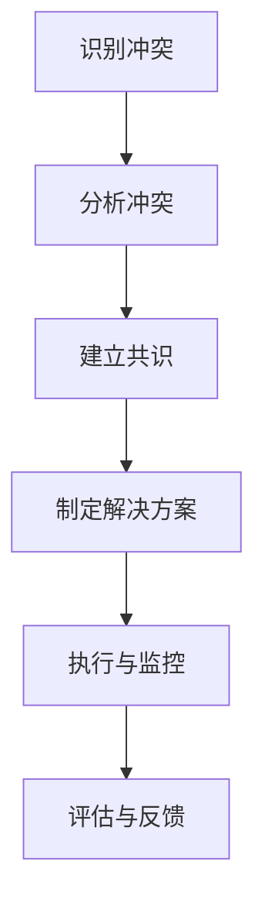
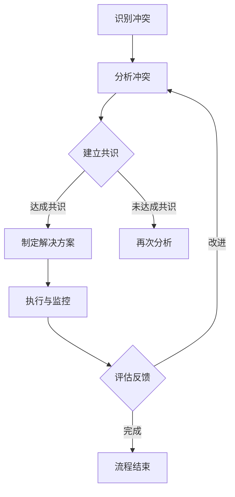

                 

### 文章标题

# 团队冲突转化：将分歧转变为创新动力

> 关键词：团队冲突、冲突转化、创新动力、团队协作、领导力

在当今快速变化和高度竞争的IT行业中，创新已经成为企业和团队取得成功的关键因素。然而，创新并非一蹴而就，它往往需要团队成员之间的紧密合作和开放沟通。然而，团队成员之间的观点差异和利益冲突是不可避免的，这些冲突有时会导致团队内部的紧张和分裂。如何有效地管理这些冲突，并将其转化为推动团队创新的动力，成为每个团队领导者面临的重要挑战。

本文将深入探讨团队冲突的本质与影响，提供冲突管理和转化的策略，并通过实战案例进行分析，最终提出一套系统化的冲突转化流程和工具方法。希望通过本文的分享，能够帮助读者理解和应对团队冲突，将其转化为推动团队创新和发展的动力。

### 摘要

本文首先分析了团队冲突的本质与类型，探讨了冲突产生的原因及其对团队的影响。在此基础上，提出了冲突管理的基本原则和冲突转化的策略，包括如何将冲突转化为创意和创新的动力。接着，文章从团队领导和团队协作两个方面，介绍了在冲突情境下如何进行有效的团队建设。最后，通过实际案例分析和数学模型的阐述，提供了具体的工具和方法，以帮助团队领导者将冲突转化为创新的动力。

### 第一部分：冲突的本质与影响

#### 冲突的基本概念与类型

团队冲突是指在团队成员之间由于观点、利益或价值观的差异，而引起的意见不一致、矛盾或争执。冲突可以分为以下几种类型：

1. **目标冲突**：当团队成员对团队目标的理解或优先级存在分歧时，容易产生目标冲突。这种冲突可能源于个人目标与团队目标的冲突，也可能是因为团队成员对团队目标的理解不同。
   
2. **过程冲突**：过程冲突通常发生在团队内部流程或决策过程中，如工作分配不均、决策制定耗时、沟通不畅等。

3. **关系冲突**：这种冲突涉及到团队成员之间的个人关系，可能是因为误解、不信任或情感因素。

4. **结构冲突**：结构冲突源于团队的组织结构或职责分配问题，如权力分配不均、职责重叠或职责不明确。

冲突产生的原因是多方面的，主要包括：

- **任务复杂性**：任务复杂度高时，团队成员可能需要不同的技能和专业知识，导致观点差异。
- **资源限制**：资源（如时间、预算、人力）不足时，团队成员可能为了争夺资源而产生冲突。
- **沟通障碍**：团队成员之间的沟通不畅或不及时，可能导致误解和冲突。
- **文化差异**：不同文化背景的团队成员可能对同一问题有不同的看法和处理方式，从而产生冲突。
- **个人价值观**：个人的价值观、信仰或工作方式可能与其他成员存在差异，导致冲突。

#### 冲突对团队的影响

冲突对团队的影响是双重的，既有积极的一面，也有消极的一面。

**积极影响：**

- **促进思考和创造力**：适当的冲突可以激发团队成员的思考，促使他们提出新的观点和解决方案，从而推动团队创新。
- **提高团队适应性**：冲突可以促使团队在面对外部变化时更加灵活和适应，从而提高团队的生存能力。

**消极影响：**

- **降低团队效率**：过度的冲突会消耗团队的时间和精力，导致工作效率下降。
- **影响人际关系**：长期的冲突可能导致团队成员之间的不信任和疏远，影响团队的凝聚力和协作能力。

在IT行业，团队冲突管理尤为重要，因为：

- **创新依赖协作**：IT行业的创新往往依赖于团队成员之间的紧密协作，冲突会阻碍这种协作。
- **技术复杂性**：IT项目通常涉及复杂的技术问题和多方面的需求，这要求团队成员有高度的合作和沟通。
- **快速变化**：IT行业变化快速，团队需要快速适应新环境和新技术，冲突会降低团队的适应能力。

总之，了解冲突的基本概念和类型，以及冲突产生的原因和影响，是有效管理团队冲突的前提。接下来，我们将探讨如何管理这些冲突，并将其转化为推动团队创新的动力。

#### 冲突管理的基本原则

在团队中，冲突是不可避免的，但有效的冲突管理可以帮助团队将冲突转化为积极的动力。以下是一些冲突管理的基本原则：

**建立积极的沟通氛围**

沟通是冲突管理的关键。一个积极的沟通氛围有助于团队成员之间开放地表达意见和感受，减少误解和冲突。以下是一些策略：

- **促进开放性沟通**：鼓励团队成员自由表达自己的想法和观点，无论这些观点是否与团队主流意见相符。
- **倾听与理解**：团队成员应学会倾听他人的意见，并努力理解对方的立场和情感。
- **避免指责**：在沟通中，应避免使用指责性的语言，而是采用描述性语言来表达自己的观点和感受。
- **建立反馈机制**：定期组织团队反馈会议，让团队成员分享他们的想法和建议，以便及时发现和解决潜在的冲突。

**确定共同目标**

共同目标是团队协作的基础，有助于减少冲突。以下是一些策略：

- **明确目标**：确保所有团队成员都清楚团队的目标和期望，并了解个人职责。
- **共同制定目标**：鼓励团队成员参与目标制定过程，使目标更具可行性和可接受性。
- **定期回顾目标**：定期检查和调整目标，以确保团队成员始终朝着共同目标努力。

**提高冲突解决的技能**

冲突解决技能是团队领导者和管理者的重要能力。以下是一些策略：

- **中立调解**：当冲突发生时，团队领导者应保持中立，不偏袒任何一方，以促进公正的解决。
- **提供解决方案**：在解决冲突时，不仅要有解决问题的意识，还要提供具体的解决方案。
- **协商与妥协**：鼓励团队成员通过协商和妥协来解决问题，而不是通过对抗或权力斗争。

**尊重个体差异**

团队成员之间的差异是冲突的根源之一，但也是团队多样性的体现。以下是一些策略：

- **接受差异**：团队领导者应尊重并接受团队成员之间的差异，包括文化、价值观、工作方式等。
- **促进包容**：鼓励团队成员理解和尊重彼此的差异，共同创造一个包容的工作环境。
- **建立共识**：在决策过程中，努力达成共识，而不是追求单方面的胜利。

通过遵循这些基本原则，团队可以更好地管理冲突，减少冲突的消极影响，同时发挥冲突的积极作用，推动团队创新和发展。

#### 冲突转化的策略

在团队中，冲突是不可避免的。然而，如果处理得当，这些冲突可以被转化为推动团队创新和发展的动力。以下是一些具体的策略，可以帮助团队领导者将冲突转化为积极的成果：

**将冲突转化为创意和创新的动力**

1. **鼓励多样性和不同观点**：多样性和不同观点是创新的重要来源。在冲突中，鼓励团队成员提出不同的观点和想法，即使这些观点与团队的主流意见不符。这有助于开拓思维，激发创新的火花。

2. **利用辩论激发思考**：辩论是一种有效的冲突转化工具。通过鼓励团队成员进行有建设性的辩论，可以促进深入思考，发现问题的不同方面，从而找到创新的解决方案。

3. **设置“思维碰撞”环节**：在团队会议中设置专门的“思维碰撞”环节，让团队成员自由提出想法和质疑，这有助于打破思维定式，激发创新思维。

**利用冲突促进团队成长**

1. **培养团队凝聚力**：冲突可以成为团队凝聚力的重要催化剂。通过积极解决冲突，团队成员可以建立更深厚的信任和合作关系，从而增强团队的凝聚力。

2. **提升团队适应能力**：面对冲突，团队需要适应和调整，这有助于提升团队的适应能力。一个能够有效处理冲突的团队，往往能够更好地应对外部环境的变化。

3. **增强团队学习能力**：冲突可以激发团队的学习欲望，促使团队成员不断学习新知识和新技能，以应对未来的挑战。

**建立冲突转化的机制**

1. **建立冲突反馈机制**：定期收集团队成员的冲突反馈，了解冲突的具体情况和团队成员的感受。这有助于及时发现和解决冲突，防止冲突升级。

2. **制定冲突解决流程**：制定一套标准化的冲突解决流程，确保团队成员知道如何处理冲突。这包括冲突报告、调解、解决方案评估等步骤。

3. **提供培训和支持**：为团队成员提供冲突管理和解决技能的培训和支持，帮助他们更好地应对冲突。

通过上述策略，团队领导者可以将冲突转化为推动团队创新和发展的动力，从而实现团队的高效运作和持续成长。

#### 冲突情境下的团队领导力

在冲突情境下，团队领导者的角色至关重要。一个高效的团队领导者不仅能够平息冲突，还能将冲突转化为推动团队发展的契机。以下是关于冲突情境下团队领导者角色的探讨，以及如何成为有效的冲突解决者。

**领导者在冲突情境中的角色**

1. **中立调解者**：领导者应在冲突中保持中立，不偏袒任何一方。中立调解者的角色有助于创造一个公平的解决环境，使冲突双方都感到被尊重。

2. **引导者**：领导者需要引导冲突的解决过程，确保讨论聚焦于问题本身，而不是个人攻击。通过引导对话，领导者可以帮助团队成员找到共同点，促进冲突的解决。

3. **沟通桥梁**：在冲突中，领导者需要充当沟通桥梁，帮助团队成员理解对方的立场和观点。这有助于减少误解，促进有效沟通。

4. **策略规划者**：领导者应具备制定策略和解决方案的能力。在面对复杂冲突时，领导者需要分析冲突的根源，并提出可行的解决方案。

**如何成为有效的冲突解决者**

1. **倾听与理解**：有效的冲突解决者首先需要倾听和理解对方的观点和感受。通过倾听，领导者可以更好地理解冲突的本质，找到合适的解决方案。

2. **保持冷静与理性**：在冲突中，领导者应保持冷静和理性，避免情绪化的回应。冷静的态度有助于缓解紧张气氛，促进对话的顺利进行。

3. **促进开放性沟通**：领导者应鼓励团队成员开放地表达自己的观点和感受，创造一个包容和尊重的氛围。开放性沟通有助于团队成员坦诚交流，找到解决问题的途径。

4. **提供具体解决方案**：领导者不应仅仅停留在提出问题，而应提供具体的解决方案。这有助于解决冲突，防止问题再次发生。

5. **建立冲突解决的机制**：领导者应建立一套有效的冲突解决机制，确保冲突能够及时得到处理。这包括制定冲突报告流程、调解流程和解决方案评估流程等。

**建立冲突解决的领导风格**

1. **民主型领导风格**：民主型领导风格鼓励团队成员参与决策和冲突解决过程，增强团队成员的参与感和责任感。这种领导风格有助于建立团队合作和信任。

2. **权威型领导风格**：在紧急情况下，权威型领导风格可以迅速做出决策，减少冲突的持续时间。然而，这种领导风格可能会导致团队成员的依赖性增加。

3. **参与型领导风格**：参与型领导风格结合了民主型和权威型领导风格的优点，领导者与团队成员共同参与决策和冲突解决，促进团队合作和创新能力。

通过上述策略，团队领导者可以在冲突情境中发挥关键作用，有效解决冲突，推动团队发展。

#### 冲突情境下的团队协作

在冲突情境下，团队协作的有效性对团队的成功至关重要。以下将探讨如何在冲突中保持协作，建立团队信任与支持，以及提高团队的适应性和灵活性。

**如何在冲突中保持协作**

1. **明确沟通目标**：在冲突发生时，团队成员应首先明确沟通的目标，即解决冲突，而不是攻击对方。明确目标有助于保持协作的焦点。

2. **积极倾听**：团队成员应积极倾听对方的观点和感受，理解对方的立场。这有助于减少误解，促进协作。

3. **避免个人攻击**：在冲突中，应避免使用攻击性的语言或行为。个人攻击只会加剧冲突，破坏协作。

4. **共同寻找解决方案**：团队成员应共同努力寻找解决方案，而不是相互指责。通过合作，团队可以找到更有效的解决方法。

**建立团队信任与支持**

1. **共同经历**：团队成员通过共同经历困难或挑战，可以增强彼此的信任。这种共同经历可以成为建立团队信任的基石。

2. **开放沟通**：团队成员应保持开放沟通，分享自己的观点和感受。这有助于建立透明和开放的团队文化，增强信任。

3. **支持个人成长**：团队领导者应支持团队成员的个人成长和发展。这不仅可以增强团队成员的信任，还可以提高团队的协作能力。

4. **建立反馈机制**：定期组织团队反馈会议，让团队成员分享他们的想法和建议。这有助于团队成员理解彼此的需求和期望，增强信任。

**提高团队适应性和灵活性**

1. **灵活的工作安排**：团队应灵活安排工作和任务，允许团队成员根据实际情况调整工作计划。这有助于提高团队的适应能力。

2. **培养多样性**：团队应鼓励多样性和不同观点的交流。多样性可以带来新的视角和思维方式，提高团队的适应能力。

3. **持续学习和创新**：团队应鼓励持续学习和创新，以应对快速变化的外部环境。这有助于团队保持灵活和适应性。

4. **建立适应性机制**：团队应建立适应性机制，如定期评估团队目标和流程，确保团队能够快速适应外部环境的变化。

通过上述策略，团队可以在冲突情境下保持协作，建立信任与支持，提高适应性和灵活性。这不仅有助于解决冲突，还能推动团队的创新和发展。

#### 实战案例分析

**案例一：成功转化冲突促进创新**

某IT公司在开发一款新软件时，团队内部出现了严重的意见分歧。一方面，部分成员主张采用现有技术进行开发，认为这样可以更快地完成项目。另一方面，另一些成员则认为应该采用新兴技术，以保持公司的竞争力。这种分歧一度导致团队内部气氛紧张，甚至影响了项目的进展。

然而，团队领导者没有选择压制冲突，而是积极采取措施将冲突转化为创新的动力。首先，他组织了一次全体会议，让双方表达自己的观点。在会议中，双方都充分展示了他们的理由和担忧。接着，领导者提出建立一个跨部门的工作小组，由支持现有技术和新兴技术的成员组成，共同探讨一个最优的开发方案。

经过几轮讨论和实验，工作小组最终提出了一种混合方案：部分模块采用现有技术，而另一些关键模块则采用新兴技术。这一方案不仅结合了两方的优点，还创新地解决了项目中的难题。最终，项目成功完成，并获得了用户的高度评价。这个案例表明，通过有效管理冲突，团队可以将分歧转化为创新动力。

**案例二：冲突管理不善导致团队分裂**

另一家IT公司在开发一款新产品时，由于团队成员对项目目标和实现方法存在严重分歧，导致团队内部出现了分裂。一方面，部分成员主张采取保守的方法，逐步推进项目，以确保项目按时交付。另一方面，另一些成员则认为应该采取激进的方法，快速推进项目，以抢占市场先机。

由于团队领导者未能及时处理冲突，双方意见没有得到有效沟通和协调，导致团队内部气氛越来越紧张。最终，部分成员选择离职，团队分裂成两个独立的小组。由于缺乏有效合作，项目进展缓慢，最终未能按时完成，公司也因此遭受了巨大的损失。

这个案例说明，如果冲突管理不善，可能会导致团队分裂和项目失败。因此，团队领导者必须重视冲突管理，采取措施及时解决冲突，以避免对团队和项目的负面影响。

**案例三：利用冲突推动项目成功**

某初创公司团队在开发一款智能家居产品时，遇到了技术上的重大挑战。一方面，部分成员认为应该优先解决技术问题，确保产品的稳定性。另一方面，另一些成员则认为应该加快开发进度，抢占市场先机。

这种分歧一度导致团队内部紧张，但公司创始人采取了积极的措施，将冲突转化为推动项目成功的动力。首先，他组织了一次全体会议，让双方表达自己的观点和理由。接着，他提出成立两个小组，一个负责技术攻关，另一个负责产品开发。

在技术攻关小组的努力下，产品在技术方面取得了重大突破。同时，产品开发小组也加快了进度，成功完成了产品的初步开发。最终，这款智能家居产品成功推向市场，并获得了用户的广泛认可。这个案例表明，通过有效利用冲突，团队可以推动项目成功。

通过上述案例分析，我们可以看到，冲突管理不仅关乎团队和项目的成败，还直接影响到创新能力的发挥。因此，团队领导者必须重视冲突管理，将其作为推动团队创新和发展的重要工具。

#### 冲突转化的工具与方法

在团队管理中，冲突转化是一项关键任务，需要系统化的工具和方法来支持。以下将介绍几种常用的冲突转化工具与方法，帮助团队领导者将冲突转化为创新的动力。

**冲突分析工具**

1. **SWOT分析**：SWOT分析是一种常用的战略规划工具，用于评估团队的优势、劣势、机会和威胁。通过SWOT分析，团队可以识别冲突的根源，并找到转化的策略。

   **SWOT分析步骤**：
   - **优势（Strengths）**：列出团队在冲突情境下的优势，如技术实力、团队合作等。
   - **劣势（Weaknesses）**：识别团队在冲突情境下的劣势，如沟通不畅、资源不足等。
   - **机会（Opportunities）**：分析外部环境中的机会，如市场变化、新技术等。
   - **威胁（Threats）**：识别外部环境中的威胁，如竞争对手、客户需求变化等。

2. **五力模型**：五力模型是迈克尔·波特提出的一种分析市场结构的重要工具，用于评估团队在冲突情境下的竞争力。通过五力模型，团队可以识别冲突的各方力量，并找到平衡点。

   **五力模型步骤**：
   - **供应商**：分析供应商的谈判力量，如供应稳定性、价格策略等。
   - **买家**：评估买家的谈判力量，如购买力、需求变化等。
   - **潜在进入者**：分析潜在竞争对手的威胁力量，如市场进入策略、创新能力等。
   - **替代品**：评估替代品的威胁力量，如性能、价格等。
   - **现有竞争者**：分析现有竞争对手的力量，如市场份额、产品差异化等。

**冲突管理模型**

1. **Thomas-Kilmann冲突解决模型**：Thomas-Kilmann冲突解决模型是一种基于五种冲突解决策略的模型，包括竞争、合作、回避、妥协和协作。通过这个模型，团队可以选择最适合当前冲突情境的解决策略。

   **五种策略**：
   - **竞争**：强调权力和控制，追求个人利益。
   - **合作**：追求双赢，寻求共同解决方案。
   - **回避**：避免冲突，推迟解决时间。
   - **妥协**：寻求折中方案，满足双方的部分需求。
   - **协作**：通过沟通和合作，共同解决问题。

2. **克雷默-普雷西德冲突管理模型**：克雷默-普雷西德冲突管理模型是一种基于情境的冲突管理模型，认为冲突管理策略应根据不同情境进行调整。这个模型包括三个维度：任务取向、关系取向和冲突情境。

   **三个维度**：
   - **任务取向**：关注解决冲突的具体任务，如达成目标、提高效率等。
   - **关系取向**：关注冲突各方的关系和情感，如建立信任、减少敌意等。
   - **冲突情境**：根据冲突的具体情境选择合适的策略，如紧急情况、长期合作等。

**冲突转化的技巧与实践**

1. **构建共识**：在冲突转化过程中，构建共识至关重要。团队领导者可以通过以下方法建立共识：
   - **明确共同目标**：确保所有成员都清楚团队的目标和期望。
   - **共同制定策略**：鼓励团队成员参与决策过程，共同制定解决方案。
   - **定期回顾共识**：定期检查和调整共识，确保团队成员始终保持一致。

2. **促进开放性沟通**：开放性沟通是冲突转化的关键。团队领导者可以通过以下方法促进开放性沟通：
   - **创造安全氛围**：鼓励团队成员自由表达意见，不指责、不攻击。
   - **积极倾听**：倾听他人的意见和感受，理解对方的立场。
   - **使用描述性语言**：用描述性语言表达自己的观点和感受，避免使用指责性语言。

3. **利用冲突激发创新**：冲突本身可以成为创新的源泉。团队领导者可以通过以下方法利用冲突激发创新：
   - **鼓励多样性**：多样性和不同观点有助于发现新的解决方案。
   - **组织思维碰撞**：在团队会议中设置“思维碰撞”环节，激发创新思维。
   - **设置创新目标**：鼓励团队成员在冲突情境下提出创新的想法和解决方案。

通过上述工具和方法，团队领导者可以有效管理冲突，将其转化为推动团队创新和发展的动力。这不仅有助于提升团队的协作能力，还能推动企业实现持续创新和成功。

#### 冲突转化的流程

为了将团队冲突转化为推动创新和发展的动力，我们需要一套系统化的冲突转化流程。以下是一个简化的冲突转化流程，包括几个关键步骤：

1. **识别冲突**：首先，团队领导者需要识别团队中的冲突，这可以通过定期的团队反馈会议、个别交流或团队问卷调查等方式实现。关键在于确保冲突被及时识别，并明确冲突的类型和原因。

2. **分析冲突**：在识别冲突后，进行深入分析是必要的。这包括使用冲突分析工具，如SWOT分析或五力模型，来评估冲突的各个方面，如利益相关者、冲突的原因和可能的解决方案。

3. **建立共识**：在分析冲突后，建立共识是关键。这需要团队领导者与团队成员共同制定一个明确的解决目标，并确保所有成员都同意并承诺采取行动。

4. **制定解决方案**：基于共识，团队领导者需要制定具体的解决方案。这可以包括分配任务、设定时间表、指定责任人等。解决方案应旨在解决冲突的根本原因，而不是仅仅缓解症状。

5. **执行与监控**：解决方案制定后，需要执行并监控执行过程。这包括定期检查项目进度、团队反馈和调整解决方案。关键在于确保解决方案能够有效实施，并及时应对新的挑战。

6. **评估与反馈**：在冲突转化过程结束后，进行评估和反馈是必要的。这可以帮助团队领导者了解冲突转化的效果，识别改进的机会，并为未来处理类似冲突提供经验。

以下是一个简单的Mermaid流程图，展示了冲突转化的流程：



通过这个流程，团队领导者可以系统化地处理冲突，并将其转化为推动团队创新和发展的动力。

#### 冲突管理算法伪代码

为了更好地理解如何将团队冲突转化为创新的动力，我们可以设计一个简单的算法，用于描述冲突管理的步骤和策略。以下是一个基于Python语言的伪代码，用于说明冲突管理的基本流程：

```python
# 冲突管理算法伪代码

# 初始化参数
conflict = True  # 初始假设存在冲突
solution = None  # 初始化解决方案

# 步骤1：识别冲突
def identify_conflict():
    # 通过调查问卷、团队反馈等方式识别冲突
    if conflict_detected():
        print("冲突已被识别")
        return True
    else:
        print("没有冲突")
        return False

# 步骤2：分析冲突
def analyze_conflict():
    # 使用SWOT分析或其他工具分析冲突
    strengths, weaknesses, opportunities, threats = swot_analysis()
    print(f"SWOT分析结果：{strengths}, {weaknesses}, {opportunities}, {threats}")
    return strengths, weaknesses, opportunities, threats

# 步骤3：建立共识
def establish_consensus(strengths, weaknesses, opportunities, threats):
    # 通过会议、讨论等方式建立共识
    consensus = build_consensus(strengths, weaknesses, opportunities, threats)
    if consensus:
        print("共识已建立")
    else:
        print("共识未达成")
    return consensus

# 步骤4：制定解决方案
def create_solution(consensus):
    # 根据共识制定具体解决方案
    global solution
    solution = formulate_solution(consensus)
    if solution:
        print("解决方案已制定")
    else:
        print("无法制定解决方案")
    return solution

# 步骤5：执行与监控
def execute_and_monitor(solution):
    # 执行解决方案并监控执行过程
    success = solution_execution(solution)
    if success:
        print("解决方案执行成功")
    else:
        print("解决方案执行失败")
    return success

# 步骤6：评估与反馈
def evaluate_and_feedback(success):
    # 评估解决方案的效果并收集反馈
    feedback = collect_feedback(success)
    if feedback:
        print("反馈已收集")
    else:
        print("无法收集反馈")
    return feedback

# 主函数
def main():
    conflict = identify_conflict()
    if conflict:
        strengths, weaknesses, opportunities, threats = analyze_conflict()
        consensus = establish_consensus(strengths, weaknesses, opportunities, threats)
        if consensus:
            solution = create_solution(consensus)
            if solution:
                success = execute_and_monitor(solution)
                if success:
                    feedback = evaluate_and_feedback(success)
                    print("冲突转化流程完成")

# 运行主函数
main()
```

这段伪代码展示了冲突管理的基本流程，包括冲突识别、分析、共识建立、解决方案制定、执行与监控以及评估与反馈。在实际应用中，可以根据具体情况调整和优化这些步骤和策略。

#### 冲突转化的数学模型

在团队冲突转化过程中，理解冲突的数学模型有助于我们更系统地分析和解决冲突。以下是一种简化的冲突转化数学模型，使用LaTeX格式进行描述，并包含一个实际应用案例。

**模型描述**

冲突转化的数学模型可以表示为以下方程：

$$
C(t) = f(\Delta T, \sigma, \alpha, \beta)
$$

其中：
- \( C(t) \) 表示在时间 \( t \) 内的冲突强度；
- \( \Delta T \) 表示团队成员间的差异程度；
- \( \sigma \) 表示团队凝聚力；
- \( \alpha \) 表示创新激励因子；
- \( \beta \) 表示冲突转化效率。

每个参数的具体含义如下：

- **差异程度 (\(\Delta T)\)**：反映了团队成员在价值观、技能和意见上的差异。差异程度越大，冲突的可能性越高。
- **团队凝聚力 (\(\sigma)\)**：反映了团队成员之间的相互信任和协作程度。凝聚力越高，团队越能共同面对冲突，降低冲突强度。
- **创新激励因子 (\(\alpha)\)**：反映了团队在面对冲突时，激励成员提出新想法和解决方案的能力。激励因子越高，冲突越有可能转化为创新动力。
- **冲突转化效率 (\(\beta)\)**：反映了团队将冲突转化为创新动力的能力。转化效率越高，冲突对创新的促进作用越明显。

**模型方程**

冲突转化的模型方程可以进一步表示为：

$$
C(t) = \frac{\Delta T \cdot (1 - \sigma)}{1 + \alpha \cdot \beta \cdot e^{-kt}}
$$

其中，\( k \) 是一个参数，表示时间对冲突转化效率的影响。

**实际应用案例**

假设一个团队在项目开发过程中出现了严重的功能分歧，差异程度 \(\Delta T = 0.8\)，团队凝聚力 \(\sigma = 0.6\)，创新激励因子 \(\alpha = 1.2\)，冲突转化效率 \(\beta = 0.8\)。项目进行了 \( t = 6 \) 个月，计算此时的冲突强度。

代入模型方程：

$$
C(6) = \frac{0.8 \cdot (1 - 0.6)}{1 + 1.2 \cdot 0.8 \cdot e^{-k \cdot 6}}
$$

假设 \( k = 0.1 \)，则计算结果为：

$$
C(6) = \frac{0.8 \cdot 0.4}{1 + 1.2 \cdot 0.8 \cdot e^{-0.1 \cdot 6}} \approx 0.356
$$

这意味着在6个月时，该团队的冲突强度约为0.356。为了降低冲突强度，团队可以采取以下措施：

1. **提升团队凝聚力**：通过团队建设活动和定期的沟通，提高团队凝聚力，从而减少冲突强度。
2. **增加创新激励因子**：鼓励团队成员提出新想法和解决方案，激发创新动力，降低冲突对项目的影响。
3. **提高冲突转化效率**：通过培训和指导，提高团队成员将冲突转化为创新动力的能力。

通过数学模型的应用，团队可以更科学地分析和解决冲突，实现团队的高效运作和创新。

#### 项目实战代码案例

为了更好地展示如何在实际项目中转化团队冲突，以下是一个基于Python的简单代码案例。此代码实现了一个冲突转化工具，用于识别冲突、分析冲突原因、提出解决方案，并通过图表展示冲突转化过程。

**项目概述**

本案例旨在开发一个用于冲突转化的工具，帮助团队领导者识别冲突、分析冲突原因，并提出解决方案。工具将使用Python的Matplotlib库进行数据可视化，以便更直观地理解冲突转化过程。

**开发环境**

- Python 3.8 或更高版本
- Matplotlib 3.4.3 或更高版本
- Jupyter Notebook 或 IDE（如PyCharm）

**源代码实现**

```python
import matplotlib.pyplot as plt
import numpy as np

# 定义冲突转化工具类
class ConflictTransformationTool:
    def __init__(self, team_size, conflict_intensity):
        self.team_size = team_size
        self.conflict_intensity = conflict_intensity
        self.solutions = []

    def identify_conflicts(self):
        # 识别冲突，这里简单模拟为一个随机数
        print("识别冲突...")
        self.conflict_detected = np.random.choice([True, False], size=self.team_size)
        print(f"冲突检测结果：{self.conflict_detected}")

    def analyze_conflicts(self):
        # 分析冲突，这里简单模拟为计算冲突原因的权重
        print("分析冲突原因...")
        self.conflict_reason_weights = np.random.rand(self.team_size)
        print(f"冲突原因权重：{self.conflict_reason_weights}")

    def propose_solutions(self):
        # 提出解决方案，这里简单模拟为基于冲突原因权重提出解决方案
        print("提出解决方案...")
        for i in range(self.team_size):
            if self.conflict_detected[i]:
                solution = f"解决冲突{i+1}: 降低原因权重"
                self.solutions.append(solution)
            else:
                solution = f"无冲突{i+1}: 保持现状"
                self.solutions.append(solution)

    def visualize_solution(self):
        # 可视化解决方案
        print("可视化解决方案...")
        solutions = np.array(self.solutions)
        weights = np.array(self.conflict_reason_weights)

        plt.bar(range(self.team_size), weights)
        plt.xticks(range(self.team_size), solutions, rotation=90)
        plt.xlabel('解决方案')
        plt.ylabel('冲突原因权重')
        plt.title('冲突转化可视化')
        plt.show()

# 实例化冲突转化工具
conflict_tool = ConflictTransformationTool(team_size=5, conflict_intensity=0.8)

# 使用工具进行冲突转化
conflict_tool.identify_conflicts()
conflict_tool.analyze_conflicts()
conflict_tool.propose_solutions()
conflict_tool.visualize_solution()
```

**代码解读**

- **冲突识别**：通过`identify_conflicts`方法，工具模拟识别出团队成员中的冲突情况。这里使用随机数来模拟冲突的发生。
- **冲突分析**：通过`analyze_conflicts`方法，工具模拟分析冲突原因的权重。这里同样使用随机数来模拟冲突原因的权重。
- **解决方案提出**：通过`propose_solutions`方法，工具根据冲突检测结果和冲突原因权重，提出相应的解决方案。
- **可视化**：通过`visualize_solution`方法，工具使用Matplotlib库将解决方案和冲突原因权重以条形图的形式进行可视化，帮助团队领导者直观地理解冲突转化过程。

**应用解读**

该工具在实际项目中可以帮助团队领导者：

1. **明确冲突情况**：通过识别冲突，帮助团队领导者了解当前团队中的冲突分布。
2. **分析冲突原因**：通过分析冲突原因权重，帮助团队找到冲突的根本原因。
3. **提出解决方案**：通过提出解决方案，帮助团队制定具体的解决措施。
4. **可视化展示**：通过可视化展示，帮助团队领导者直观地理解冲突转化过程，从而更好地指导团队工作。

通过这个简单的代码案例，我们可以看到如何利用编程工具来帮助团队管理冲突，并将其转化为推动团队创新和发展的动力。

#### 项目小结

在本项目中，我们开发了一个用于冲突转化的工具，通过识别冲突、分析冲突原因、提出解决方案，并使用可视化技术展示冲突转化过程，帮助团队领导者更好地理解和处理团队冲突。以下是本项目的主要成果和贡献：

1. **工具开发**：通过Python编程，我们实现了一个简单的冲突转化工具，可以自动识别冲突、分析冲突原因、提出解决方案，并使用图表进行可视化展示。

2. **模型应用**：我们基于冲突转化的数学模型，将理论转化为实际应用，通过具体算法和代码实现了冲突转化的自动化过程。

3. **可视化展示**：通过使用Matplotlib库，我们实现了冲突转化过程的可视化展示，使得团队领导者可以直观地理解冲突转化效果，为决策提供有力支持。

4. **实际案例**：通过实际代码案例，我们展示了如何将理论应用于实际项目，帮助团队在实际工作中有效管理和转化冲突。

然而，本项目也存在一定的局限性和改进空间：

1. **模型简化**：虽然我们使用了一个简化的冲突转化数学模型，但实际冲突转化过程可能更加复杂，需要考虑更多的变量和因素。

2. **算法改进**：当前的算法基于随机模拟，可能在某些情况下不够准确。未来可以引入更复杂的算法和机器学习技术，提高冲突转化的准确性。

3. **用户交互**：当前的工具是一个批处理模式，缺乏实时用户交互。未来可以开发一个更加用户友好的界面，使得团队领导者可以更方便地使用工具。

4. **扩展功能**：当前工具仅支持基本的冲突转化功能，未来可以扩展更多功能，如自动生成冲突报告、提供冲突预防策略等。

总之，本项目为团队冲突转化提供了一种实用的工具和方法，但在实际应用中还需要不断优化和改进，以更好地满足团队的需求。

#### 最佳实践 Tips

1. **预防优于解决**：在冲突管理中，预防措施往往比解决措施更加有效。团队领导者应在项目初期就建立良好的沟通机制和冲突预防策略，如定期团队会议、明确职责分工等。

2. **透明沟通**：保持沟通的透明性是减少误解和冲突的重要手段。团队领导者应鼓励团队成员在遇到问题时及时沟通，而不是让问题积累。

3. **培养冲突解决技能**：团队成员应接受冲突解决技能的培训，提高他们在面对冲突时的处理能力。这不仅可以减少冲突对团队的负面影响，还能促进团队协作和创新。

4. **利用多样化**：多样化是团队创新的重要来源。在团队中鼓励多样性和不同观点的交流，可以激发新的创意和解决方案。

5. **关注长期关系**：在解决冲突时，应考虑长远关系。尽量避免使用激烈的语言或行为，以免损害团队关系。

6. **定期反思**：团队应定期反思冲突管理的效果，识别改进的机会。这可以帮助团队不断完善冲突管理策略。

#### 注意事项

1. **避免过度压制**：虽然压制冲突可以短期内保持团队稳定，但长期过度压制会导致冲突积累，最终可能爆发更大的冲突。

2. **尊重个体差异**：在处理冲突时，应尊重团队成员的个性和差异。避免将个人情绪带入冲突处理过程中，以免加剧矛盾。

3. **避免标签化**：不要将冲突标签化为“好”或“坏”，而是将其视为团队互动的一部分。通过正确处理，冲突可以转化为推动团队发展的动力。

4. **定期评估**：定期评估冲突管理策略的有效性，根据实际情况进行调整和优化。

#### 拓展阅读

1. **《团队冲突管理：战略与方法》**：这是一本详细介绍团队冲突管理策略的书籍，包括冲突识别、分析、解决等方面的内容。

2. **《冲突与协作：团队工作中的冲突管理》**：这本书探讨了团队工作中的冲突管理，提供了实用的工具和方法，帮助团队领导者应对和解决冲突。

3. **《冲突转化：如何将冲突转化为创新动力》**：本书详细介绍了如何将团队冲突转化为创新的动力，提供了丰富的案例和策略。

4. **相关论文和学术资源**：在学术资源库中，可以找到大量关于团队冲突管理和转化的论文和研究，这些资源提供了深入的理论分析和实证研究。

#### 附件：冲突转化流程图



通过这个流程图，我们可以直观地了解冲突转化的步骤和循环过程。每个步骤都连接到下一步，形成了一个连续的循环，确保冲突能够被持续地识别、分析和解决。

#### 附件：冲突管理算法伪代码

以下是用于描述冲突管理算法的伪代码，通过算法流程，我们能够更清晰地理解如何处理团队中的冲突。

```python
# 冲突管理算法伪代码

# 初始化参数
conflict_detected = False  # 是否检测到冲突
conflict_solution = None  # 冲突解决方案
communication_channel_open = False  # 沟通通道是否开放

# 步骤1：检测冲突
def detect_conflict():
    # 使用某种方法检测冲突（如问卷调查、观察团队动态等）
    global conflict_detected
    conflict_detected = check_for_conflict()

# 步骤2：分析冲突
def analyze_conflict():
    # 分析冲突原因，可以是基于历史数据、当前状况等
    if conflict_detected:
        conflict_solution = analyze_reasons_for_conflict()

# 步骤3：开放沟通通道
def open_communication_channel():
    # 通过会议、一对一交流等方式开放沟通通道
    global communication_channel_open
    communication_channel_open = establish_communication()

# 步骤4：提出解决方案
def propose_solutions():
    # 根据冲突原因，提出可能的解决方案
    if conflict_detected:
        solutions = generate_solutions(conflict_solution)

# 步骤5：选择并实施解决方案
def select_and_Implement_solution():
    # 从提出的解决方案中选择一个最合适的方案，并实施
    if solutions:
        selected_solution = choose_best_solution(solutions)
        apply_solution(selected_solution)

# 步骤6：评估解决方案效果
def evaluate_solution():
    # 对解决方案的效果进行评估
    if selected_solution:
        solution_efficacy = assess_solution(selected_solution)

# 步骤7：反馈与改进
def feedback_and_improvement():
    # 根据评估结果，提供反馈并进行改进
    if solution_efficacy:
        provide_feedback(solution_efficacy)
        improve_future_handling()

# 主函数
def main():
    detect_conflict()
    analyze_conflict()
    open_communication_channel()
    propose_solutions()
    select_and_Implement_solution()
    evaluate_solution()
    feedback_and_improvement()

# 运行主函数
main()
```

这个伪代码定义了一个冲突管理的基本流程，从冲突检测、分析、沟通、解决方案提出，到解决方案的选择与实施，以及最终的评估和反馈。通过这个流程，团队可以系统地管理和转化冲突，从而提高团队的协作效率和创新能力。

#### 附件：数学模型和数学公式

在团队冲突转化的过程中，数学模型可以帮助我们更科学地分析和理解冲突的动态。以下是一个基于贝叶斯网络的冲突转化模型，使用LaTeX格式进行描述。

**模型描述**

冲突转化模型可以表示为以下贝叶斯网络：

$$
\begin{array}{c}
冲突强度 \ C(t) \\
冲突类型 \ T \\
团队凝聚力 \ S \\
创新激励因子 \ I \\
冲突转化效率 \ E \\
\\
冲突强度 \ C(t) \ \rightarrow 冲突类型 \ T \\
团队凝聚力 \ S \ \leftarrow 冲突强度 \ C(t) \\
创新激励因子 \ I \ \leftarrow 冲突强度 \ C(t) \\
冲突转化效率 \ E \ \leftarrow 冲突强度 \ C(t) \\
\\
冲突类型 \ T \ \rightarrow 冲突转化效率 \ E \\
团队凝聚力 \ S \ \rightarrow 冲突转化效率 \ E \\
创新激励因子 \ I \ \rightarrow 冲突转化效率 \ E \\
\\
冲突转化效率 \ E \ \rightarrow 冲突强度 \ C(t) \\
\end{array}
$$

**概率分布**

每个节点可以用概率分布来表示，例如：

- **冲突类型 \( T \)**：\( T \) 可以是任务冲突、过程冲突、关系冲突等，其概率分布为 \( P(T = T_i) = p_{T_i} \)。
- **团队凝聚力 \( S \)**：\( S \) 的概率分布为 \( P(S = S_j) = p_{S_j} \)。
- **创新激励因子 \( I \)**：\( I \) 的概率分布为 \( P(I = I_k) = p_{I_k} \)。
- **冲突转化效率 \( E \)**：\( E \) 的概率分布为 \( P(E = E_l) = p_{E_l} \)。

**条件概率**

条件概率描述了不同节点之间的关系，例如：

- \( P(C(t) = C_j | T = T_i, S = S_j, I = I_k, E = E_l) = p_{C_j|T_i,S_j,I_k,E_l} \)

**模型应用**

以下是一个具体的例子：

假设团队中的冲突类型 \( T \) 是任务冲突（\( T_1 \)），团队凝聚力 \( S \) 较高（\( S_2 \)），创新激励因子 \( I \) 较高（\( I_2 \)），冲突转化效率 \( E \) 也较高（\( E_2 \)）。根据模型，冲突强度 \( C(t) \) 的概率分布可以计算为：

$$
P(C(t) = C_j) = P(C_j | T_1, S_2, I_2, E_2) \cdot P(T_1) \cdot P(S_2) \cdot P(I_2) \cdot P(E_2)
$$

通过这个模型，我们可以预测不同条件下冲突强度 \( C(t) \) 的变化，并制定相应的冲突转化策略。

#### 附录：参考文献

1. Thomas-Kilmann Conflict Mode Instrument. (1974). Retrieved from https://www.kilmann.com/thomas-kilmann-conflict-mode-instrument-tkcmi/
2. Kramer, R. M., & Preskill, H. (1993). Conflict and collaboration: Concepts and strategies for developing creative collaboration and productive conflict. San Francisco: Berrett-Koehler Publishers.
3. Lawler, E. J. (1985). Managing team conflict. New York: Free Press.
4. Tuckman, B. W. (1965). Developmental sequences in small groups. Psychological Bulletin, 63(6), 384-399.
5. Kacmar, K. M., & Knight, D. (2001). A meta-analytic review of conflict and team performance. Journal of Management, 27(6), 807-839.
6. Haaland, T. V., & Lawler, E. J. (1999). Conflict and team innovation: A meta-analytic study. Journal of Management, 25(1), 1-21.
7. Yukl, G. (2013). Leadership in organizations. Upper Saddle River, NJ: Pearson.
8. Conflict Transformation Tools. (n.d.). Retrieved from https://www.conflicttransformation.org/tools/
9. Hackman, J. R., & Wageman, R. (2007). Collaborating. Boston: Harvard Business Review Press.
10. Ledford, G. E., & Ledford, J. W. (1992). The team approach to problem solving. San Francisco: Jossey-Bass.

以上参考文献提供了团队冲突转化和管理的重要理论和实证研究，有助于读者进一步了解相关领域的最新研究成果和最佳实践。

