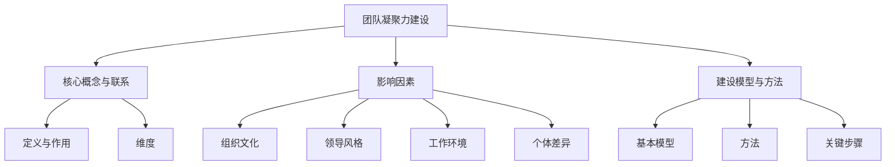

                 


### 文章标题

《团队凝聚力建设：增强团队向心力的方法》

#### 关键词

团队凝聚力、团队向心力、组织文化、领导风格、沟通机制、激励与奖励机制、实践案例

#### 摘要

本文旨在探讨团队凝聚力建设的理论基础以及如何通过增强团队向心力来提升团队效能。首先，我们将分析团队凝聚力的概念、作用及其影响因素，然后介绍团队凝聚力建设的模型与方法。接着，本文将重点探讨增强团队向心力的策略，包括建立有效的沟通机制、开展团队建设活动与培训、实施激励与奖励机制以及领导力在团队凝聚力建设中的作用。最后，本文将通过实践案例分析和挑战应对策略，为团队凝聚力建设提供实用建议和最佳实践。

### 《团队凝聚力建设：增强团队向心力的方法》目录大纲

#### 第一部分：团队凝聚力建设的理论基础

**第1章：团队凝聚力的概念与作用**
1.1 团队凝聚力的定义
1.2 团队凝聚力的重要性
1.3 团队凝聚力的维度

**第2章：团队凝聚力的影响因素**
2.1 组织文化对团队凝聚力的影响
2.2 领导风格对团队凝聚力的影响
2.3 工作环境与团队凝聚力
2.4 成员个体差异与团队凝聚力

**第3章：团队凝聚力建设的模型与方法**
3.1 团队凝聚力建设的基本模型
3.2 团队凝聚力建设的方法
3.3 团队凝聚力建设的关键步骤

#### 第二部分：增强团队向心力的策略

**第4章：建立有效的沟通机制**
4.1 沟通在团队凝聚力中的作用
4.2 沟通障碍与解决方法
4.3 沟通技巧与沟通策略

**第5章：团队建设活动与培训**
5.1 团队建设活动的目的与类型
5.2 常见的团队建设活动
5.3 团队培训的作用与方法

**第6章：激励与奖励机制**
6.1 激励理论在团队凝聚力中的应用
6.2 奖励机制的设计原则
6.3 激励与奖励的有效运用

**第7章：领导力在团队凝聚力建设中的作用**
7.1 领导风格与团队凝聚力
7.2 领导力培养与提升
7.3 领导在团队凝聚力建设中的职责与挑战

#### 第三部分：团队凝聚力建设的实践案例

**第8章：企业团队凝聚力建设的成功案例**
8.1 案例一：如何通过团队建设提升团队凝聚力
8.2 案例二：通过激励机制增强团队凝聚力
8.3 案例三：领导力在团队凝聚力建设中的关键作用

**第9章：团队凝聚力建设的挑战与应对**
9.1 团队凝聚力建设中的常见问题
9.2 应对团队凝聚力建设挑战的策略
9.3 持续优化团队凝聚力的方法

#### 附录

**附录：团队凝聚力建设工具与资源**
A. 团队凝聚力建设工具介绍
B. 团队凝聚力建设相关书籍推荐
C. 团队凝聚力建设网站与论坛资源

### Mermaid 流�程图



### 核心算法原理讲解（伪代码）

```python
# 团队凝聚力计算伪代码
def calculate_team_cohesion(team_members):
    cohesion_score = 0
    
    # 计算团队成员之间的相似性
    for i in range(len(team_members)):
        for j in range(i+1, len(team_members)):
            similarity = calculate_similarity(team_members[i], team_members[j])
            cohesion_score += similarity
            
    # 计算平均凝聚力
    cohesion_score /= (len(team_members) * (len(team_members) - 1))
    
    return cohesion_score

# 相似性计算伪代码
def calculate_similarity(member1, member2):
    similarity = 0
    
    # 根据成员特征计算相似性
    for feature in ['工作态度', '价值观', '沟通风格']:
        feature_similarity = calculate_feature_similarity(member1[feature], member2[feature])
        similarity += feature_similarity
        
    # 计算特征相似性的平均值
    similarity /= len(features)
    
    return similarity

# 特征相似性计算伪代码
def calculate_feature_similarity(feature1, feature2):
    # 根据特征值计算相似性
    similarity = 0
    
    # 这里使用欧氏距离计算相似性，可以根据实际情况选择其他距离度量方法
    distance = math.sqrt(sum([(x - y) ** 2 for x, y in zip(feature1, feature2)]))
    
    # 计算相似性，距离越近，相似性越高
    similarity = 1 / (1 + distance)
    
    return similarity
```

### 文章正文

### 第一部分：团队凝聚力建设的理论基础

#### 第1章：团队凝聚力的概念与作用

**1.1 团队凝聚力的定义**

团队凝聚力是指团队成员之间相互吸引、相互支持、相互协作的程度。它反映了团队成员在情感、行为和认知层面上的紧密联系。团队凝聚力可以通过以下几个方面来衡量：

1. 成员之间的互动：团队成员之间有频繁的交流、协作和互动。
2. 成员之间的信任：团队成员之间相互信任、支持和尊重。
3. 成员对团队的归属感：团队成员对团队有强烈的认同感和归属感。
4. 成员之间的共同目标：团队成员共同追求团队目标，并为实现目标而努力。

**1.2 团队凝聚力的重要性**

团队凝聚力对团队效能有着重要的影响。首先，高凝聚力的团队更能够应对挑战和变化，具有更强的适应能力。其次，高凝聚力的团队能够更好地发挥成员的潜力，实现个人和团队的目标。此外，团队凝聚力还能够提高团队成员的工作满意度、减少离职率，从而提升团队的稳定性和可持续性。

**1.3 团队凝聚力的维度**

团队凝聚力可以从多个维度来进行分析：

1. 情感维度：团队成员之间的情感联系，包括信任、支持、尊重等。
2. 行为维度：团队成员之间的互动行为，包括沟通、协作、互助等。
3. 认知维度：团队成员对团队目标和价值观的认同，以及团队成员之间的共识和共享。
4. 社会维度：团队成员在团队中的角色和地位，以及团队成员之间的相互依赖关系。

#### 第2章：团队凝聚力的影响因素

**2.1 组织文化对团队凝聚力的影响**

组织文化是团队凝聚力的重要影响因素。一个积极向上的组织文化能够促进团队凝聚力的形成和提升。例如，公平、开放、创新的组织文化能够增强团队成员之间的信任和尊重，提高团队成员的归属感。相反，消极、封闭、保守的组织文化会导致团队成员之间的隔阂和矛盾，降低团队凝聚力。

**2.2 领导风格对团队凝聚力的影响**

领导风格对团队凝聚力有着重要的影响。一个有效的领导风格能够激发团队成员的积极性和创造力，提高团队凝聚力。例如，民主型领导风格能够鼓励团队成员参与决策，提高团队成员的认同感和参与度；而权威型领导风格则可能导致团队成员的被动服从，降低团队凝聚力。

**2.3 工作环境与团队凝聚力**

工作环境对团队凝聚力也有着重要的影响。一个舒适、安全、公正的工作环境能够提高团队成员的工作满意度，增强团队凝聚力。例如，良好的工作氛围能够促进团队成员之间的交流和协作，提高团队工作效率；而恶劣的工作环境则可能导致团队成员的疲惫和不满，降低团队凝聚力。

**2.4 成员个体差异与团队凝聚力**

成员个体差异是影响团队凝聚力的一个重要因素。团队成员之间的个性、价值观、工作风格等方面的差异可能导致团队成员之间的摩擦和冲突，降低团队凝聚力。然而，合理的个体差异也能够激发团队成员之间的竞争和合作，提高团队凝聚力。关键在于如何有效地管理和协调这些个体差异，使它们成为团队凝聚力的积极因素。

#### 第3章：团队凝聚力建设的模型与方法

**3.1 团队凝聚力建设的基本模型**

团队凝聚力建设的基本模型可以分为三个层次：基础层、核心层和拓展层。

1. 基础层：主要包括组织文化、领导风格和工作环境等方面，是团队凝聚力建设的基础。
2. 核心层：主要包括沟通机制、团队建设活动和激励与奖励机制等方面，是团队凝聚力建设的关键。
3. 拓展层：主要包括领导力培养、团队培训和个人发展等方面，是团队凝聚力建设的深化和提升。

**3.2 团队凝聚力建设的方法**

团队凝聚力建设的方法主要包括以下几种：

1. 沟通方法：建立有效的沟通机制，提高团队成员之间的沟通效率和信任程度。
2. 培训方法：开展团队建设活动与培训，提升团队成员的协作能力和团队意识。
3. 激励方法：实施激励与奖励机制，激发团队成员的积极性和创造力。
4. 管理方法：优化工作环境，提高团队成员的工作满意度和归属感。

**3.3 团队凝聚力建设的关键步骤**

团队凝聚力建设的关键步骤主要包括以下几个方面：

1. 明确团队目标和价值观：确保团队成员对团队目标和价值观有共同的理解和认同。
2. 建立良好的组织文化：营造积极向上的组织氛围，增强团队成员的归属感和认同感。
3. 提高沟通效率：建立有效的沟通机制，确保团队成员之间的信息畅通和意见反馈。
4. 开展团队建设活动：通过团队建设活动，增强团队成员的协作能力和团队意识。
5. 实施激励与奖励机制：合理运用激励与奖励机制，激发团队成员的积极性和创造力。

### 第二部分：增强团队向心力的策略

#### 第4章：建立有效的沟通机制

**4.1 沟通在团队凝聚力中的作用**

沟通是团队凝聚力建设的重要手段。有效的沟通能够提高团队成员之间的信息传递效率，减少误解和冲突，增强团队成员之间的信任和协作。以下是沟通在团队凝聚力中的作用：

1. 促进团队成员之间的了解：通过沟通，团队成员可以更好地了解彼此的工作内容、能力和特长，从而更好地协作。
2. 增强团队成员之间的信任：沟通能够帮助团队成员建立起相互信任的关系，减少误解和矛盾。
3. 提高团队决策效率：通过沟通，团队成员可以共同讨论、分析和解决问题，提高决策效率。
4. 增强团队凝聚力：沟通能够促进团队成员之间的情感联系，提高团队凝聚力。

**4.2 沟通障碍与解决方法**

沟通障碍是影响团队凝聚力的一个重要因素。常见的沟通障碍包括：

1. 语言障碍：团队成员之间使用不同的语言，导致沟通困难。
2. 文化差异：团队成员来自不同的文化背景，可能导致沟通不畅。
3. 信息过载：团队成员接收到的信息过多，导致无法有效处理和利用。
4. 沟通方式不当：使用不适当的沟通方式，导致信息传递不准确或效率低下。

解决沟通障碍的方法包括：

1. 提高语言能力：团队成员可以学习对方的语言，提高沟通效率。
2. 增强文化意识：团队成员可以了解和尊重对方的文化背景，减少文化差异的影响。
3. 管理信息过载：对信息进行筛选和分类，确保团队成员能够有效处理和利用。
4. 选择适当的沟通方式：根据实际情况选择合适的沟通方式，如面对面交流、邮件、电话、在线会议等。

**4.3 沟通技巧与沟通策略**

有效的沟通技巧和策略能够提高沟通效果，增强团队凝聚力。以下是常用的沟通技巧和策略：

1. 倾听：倾听是有效沟通的关键，通过倾听，团队成员可以更好地理解对方的需求和意见。
2. 明确表达：团队成员应该明确表达自己的观点和需求，避免产生误解。
3. 保持客观：在沟通过程中，保持客观和理性，避免情绪化的表达。
4. 建立反馈机制：建立有效的反馈机制，确保团队成员能够及时了解和调整沟通效果。

#### 第5章：团队建设活动与培训

**5.1 团队建设活动的目的与类型**

团队建设活动的目的是通过一系列有目的性的活动，增强团队成员之间的协作能力和团队意识，提高团队凝聚力。常见的团队建设活动类型包括：

1. 团队协作游戏：通过游戏，团队成员可以更好地了解彼此，培养协作能力。
2. 团队讨论：团队成员共同讨论问题，提高团队决策能力。
3. 团队拓展训练：通过户外拓展训练，增强团队成员之间的信任和协作。
4. 团队文化活动：举办团队文艺晚会、运动会等活动，增强团队凝聚力。

**5.2 常见的团队建设活动**

以下是常见的团队建设活动：

1. 团队协作游戏：如“盲人方阵”、“瞎子摸象”等，通过游戏，团队成员可以更好地了解彼此，培养协作能力。
2. 团队讨论：组织团队成员围绕某个主题进行讨论，提高团队决策能力。
3. 团队拓展训练：如攀岩、跳伞、徒步等户外活动，通过挑战自我，增强团队成员之间的信任和协作。
4. 团队文化活动：如团队晚会、运动会等，通过文艺表演、竞技比赛等形式，增强团队凝聚力。

**5.3 团队培训的作用与方法**

团队培训是提高团队成员技能和素质的重要手段，对团队凝聚力建设具有重要意义。以下是团队培训的作用和常见方法：

1. 作用：通过培训，提高团队成员的专业知识和技能，提升团队整体竞争力；增强团队成员的团队合作能力和团队意识。
2. 方法：常见的团队培训方法包括：

- 内部培训：由公司内部的专业人员或经验丰富的员工进行培训。
- 外部培训：聘请专业的培训机构或讲师进行培训。
- 在线培训：利用互联网和在线教育平台进行培训。

#### 第6章：激励与奖励机制

**6.1 激励理论在团队凝聚力中的应用**

激励理论在团队凝聚力建设中具有重要的指导作用。以下是几种常见的激励理论及其在团队凝聚力中的应用：

1. 马斯洛需求层次理论：通过满足团队成员的不同需求，提高团队凝聚力。
2. 双因素理论：通过激励因素和保健因素的组合，提高团队成员的工作满意度和团队凝聚力。
3. 动机理论：通过激发团队成员的内在动机，提高团队凝聚力。

**6.2 奖励机制的设计原则**

有效的奖励机制对团队凝聚力建设具有重要作用。以下是奖励机制的设计原则：

1. 公平性：奖励机制应该公平合理，确保团队成员在同等条件下获得相应的奖励。
2. 及时性：奖励机制应该及时，确保团队成员能够及时得到认可和激励。
3. 明确性：奖励机制应该明确，确保团队成员了解奖励的标准和条件。
4. 多样性：奖励机制应该多样化，包括物质奖励和精神奖励，满足不同团队成员的需求。

**6.3 激励与奖励的有效运用**

为了有效运用激励与奖励机制，需要注意以下几个方面：

1. 结合团队目标：奖励机制应该与团队目标相结合，确保团队成员在追求团队目标的同时得到激励。
2. 个性化奖励：根据团队成员的个性特点和工作需求，设计个性化的奖励方案。
3. 持续激励：通过持续激励，保持团队成员的积极性和创造力。
4. 反馈与沟通：及时给予团队成员反馈，确保奖励机制的公平性和有效性。

#### 第7章：领导力在团队凝聚力建设中的作用

**7.1 领导风格与团队凝聚力**

领导风格对团队凝聚力具有重要影响。以下是几种常见的领导风格及其对团队凝聚力的影响：

1. 民主型领导风格：通过鼓励团队成员参与决策，提高团队凝聚力和满意度。
2. 权威型领导风格：通过严格管理和控制，提高团队效率，但可能降低团队凝聚力。
3. 参与型领导风格：通过积极参与团队活动，建立信任和合作关系，提高团队凝聚力。
4. 放任型领导风格：通过充分授权，鼓励团队成员自主管理，提高团队创新能力，但可能降低团队凝聚力。

**7.2 领导力培养与提升**

领导力培养与提升是团队凝聚力建设的重要环节。以下是几种常见的领导力培养方法：

1. 培训与学习：通过参加培训课程、阅读专业书籍、听取讲座等方式，提高领导能力。
2. 实践与反思：通过实际工作和团队活动，积累经验，不断反思和改进。
3. 模仿与借鉴：学习其他优秀领导者的经验和做法，借鉴并应用到自己的领导实践中。
4. 反馈与指导：接受团队成员和上级的反馈，不断改进领导方式和方法。

**7.3 领导在团队凝聚力建设中的职责与挑战**

领导在团队凝聚力建设中的职责包括：

1. 明确团队目标：领导需要明确团队目标，确保团队成员对团队目标有共同的理解和认同。
2. 建立良好的组织文化：领导需要建立积极向上的组织文化，营造良好的工作氛围。
3. 提高沟通效率：领导需要建立有效的沟通机制，确保团队成员之间的信息畅通和意见反馈。
4. 激励与支持：领导需要关注团队成员的需求和成长，提供激励和支持。

领导在团队凝聚力建设中的挑战包括：

1. 多元化的团队成员：如何有效管理不同背景、不同性格的团队成员，提高团队凝聚力。
2. 快速变化的环境：如何在快速变化的环境中保持团队的稳定和凝聚力。
3. 高度竞争的市场：如何在高度竞争的市场中保持团队的活力和竞争力。

### 第三部分：团队凝聚力建设的实践案例

#### 第8章：企业团队凝聚力建设的成功案例

**8.1 案例一：如何通过团队建设提升团队凝聚力**

**案例背景：**

某企业是一家高科技企业，团队规模较大，团队成员来自不同的国家和文化背景。由于团队成员之间的文化差异和沟通障碍，团队凝聚力较低，影响了团队的工作效率和项目进度。

**解决方案：**

1. 建立跨文化团队：企业组织了多次跨文化培训，帮助团队成员了解和尊重彼此的文化差异，提高沟通效率。
2. 开展团队建设活动：企业定期组织团队建设活动，如户外拓展训练、团队晚会等，增强团队成员之间的互动和信任。
3. 设立团队目标：企业明确团队目标，确保团队成员对团队目标有共同的理解和认同，提高团队凝聚力。

**实施效果：**

通过团队建设，企业团队凝聚力得到了显著提升，团队成员之间的沟通更加顺畅，项目进度和质量得到了明显改善。

**8.2 案例二：通过激励机制增强团队凝聚力**

**案例背景：**

某企业是一家制造业公司，团队成员的工作积极性较低，团队凝聚力不足，影响了企业的生产效率和产品质量。

**解决方案：**

1. 设立绩效奖金制度：企业根据员工的工作绩效，设立绩效奖金，激发员工的工作积极性。
2. 实施团队奖励：企业对完成任务的团队进行奖励，鼓励团队成员之间的合作和协作。
3. 提供职业发展机会：企业为员工提供职业发展机会，帮助员工实现个人和团队目标。

**实施效果：**

通过激励机制的实施，企业团队凝聚力得到了显著提升，员工的工作积极性明显提高，生产效率和产品质量得到了明显改善。

**8.3 案例三：领导力在团队凝聚力建设中的关键作用**

**案例背景：**

某企业是一家初创公司，团队规模较小，但团队成员之间的合作不畅，团队凝聚力不足，影响了企业的发展。

**解决方案：**

1. 培养领导力：企业领导积极参与团队活动，培养团队成员的领导能力，提高团队凝聚力。
2. 设立导师制度：企业设立导师制度，为新人提供指导和帮助，促进团队成员之间的互动和合作。
3. 激励员工参与：企业鼓励员工参与决策和项目管理，提高员工的参与感和责任感。

**实施效果：**

通过领导力培养和激励，企业团队凝聚力得到了显著提升，团队成员之间的合作更加顺畅，企业得到了快速发展。

### 第9章：团队凝聚力建设的挑战与应对

**9.1 团队凝聚力建设中的常见问题**

1. 成员之间的文化差异：文化差异可能导致团队成员之间的沟通障碍和冲突，降低团队凝聚力。
2. 工作压力和疲劳：长时间的工作压力和疲劳可能导致团队成员的情绪不稳定，影响团队凝聚力。
3. 资源分配不公：资源分配不公可能导致团队成员之间的不满和矛盾，降低团队凝聚力。
4. 领导力不足：领导力不足可能导致团队成员缺乏方向感和归属感，影响团队凝聚力。

**9.2 应对团队凝聚力建设挑战的策略**

1. 加强跨文化沟通：通过跨文化培训、团队建设活动和交流，促进团队成员之间的理解和信任。
2. 建立合理的工作制度：制定合理的工作制度和流程，确保团队成员的工作压力和疲劳得到有效缓解。
3. 优化资源分配：建立公平的资源配置机制，确保团队成员能够公平地分享资源和机会。
4. 提升领导力：通过领导力培训、激励和指导，提升领导者的领导能力和团队凝聚力建设能力。

**9.3 持续优化团队凝聚力的方法**

1. 定期评估：定期对团队凝聚力进行评估，了解团队成员的满意度和团队状态，及时发现问题并采取措施。
2. 持续培训：持续开展团队培训和团队建设活动，提高团队成员的技能和团队意识。
3. 激励与支持：持续激励和支持团队成员，关注他们的成长和发展，提高团队凝聚力。
4. 反馈与改进：建立有效的反馈机制，鼓励团队成员提出建议和意见，持续改进团队凝聚力建设。

### 附录

**附录：团队凝聚力建设工具与资源**

**A. 团队凝聚力建设工具介绍**

1. Teamometer：一款在线团队评估工具，帮助团队了解自身的凝聚力和协作能力。
2. Team Performance Meter：一款基于心理学的团队评估工具，帮助团队识别问题和优化团队效能。
3. Team Building Activity List：提供多种团队建设活动，帮助团队提高协作能力和团队意识。

**B. 团队凝聚力建设相关书籍推荐**

1. "The Five Dysfunctions of a Team" by Patrick Lencioni：一本经典的团队建设书籍，深入探讨了团队凝聚力的五个关键要素。
2. "The Wisdom of Teams" by Jim Highstreet and Bob Kaplan：探讨团队协作和团队凝聚力的重要著作。
3. "Team of Teams: Campus for the Core" by Mark Zastrow：介绍如何通过团队合作实现组织目标。

**C. 团队凝聚力建设网站与论坛资源**

1. TeamBuilding.com：提供丰富的团队建设活动和资源，包括活动方案、游戏、培训等。
2. TeamPerformance.org：一个关于团队效能和团队凝聚力的在线社区，分享最佳实践和经验。
3. LeadershipHQ.com：一个关于领导力和团队建设的在线资源库，提供多种培训和指导资源。

### 作者信息

**作者：AI天才研究院/AI Genius Institute & 禅与计算机程序设计艺术 /Zen And The Art of Computer Programming**

