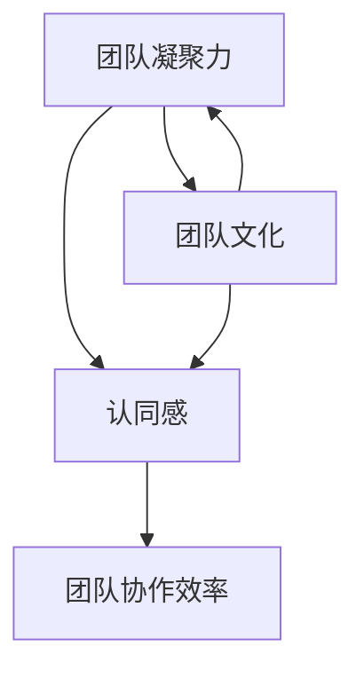
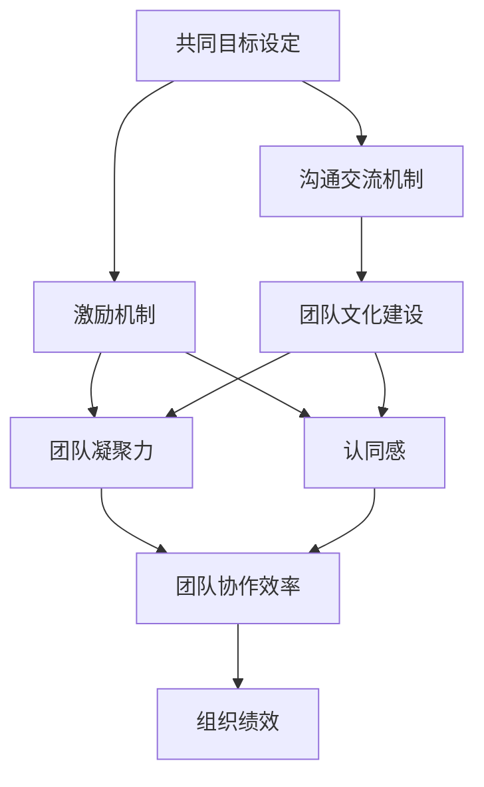
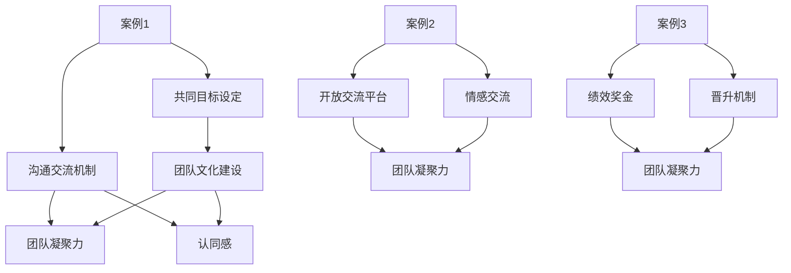
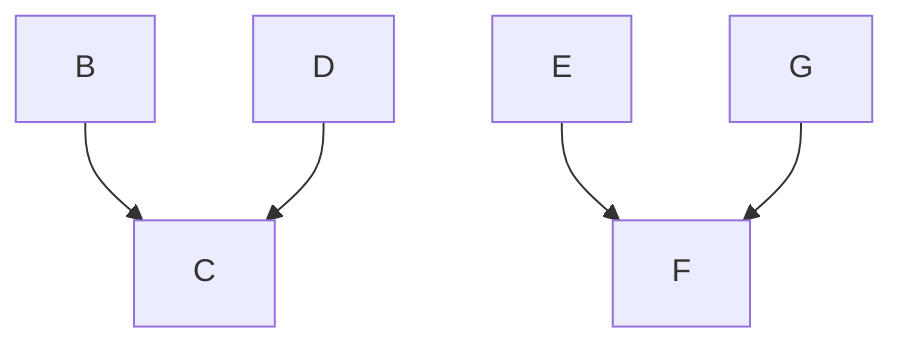
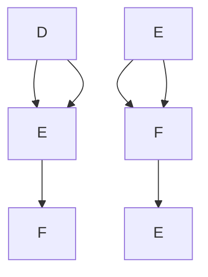
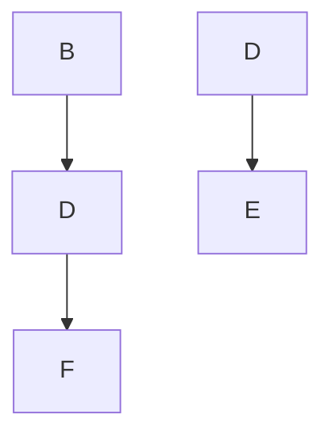

                 


# 文章标题：团队凝聚力提升：增强认同感的策略

> 关键词：团队凝聚力、认同感、团队文化、策略、案例分析

> 摘要：本文从团队凝聚力、认同感及团队文化等核心概念出发，探讨提升团队凝聚力的策略和方法。通过分析凝聚力评估模型、沟通交流机制、激励机制等核心算法原理，并结合实际案例分析，为团队管理者提供有针对性的实践指导。

## 第一部分：核心概念与联系

### 1.1.1 聚力、认同感与团队文化

#### 定义与联系：

- **凝聚力**：团队凝聚力是指团队成员之间的相互吸引和相互协作的程度，它是衡量团队协作效率的重要指标。
  
- **认同感**：认同感是指团队成员对团队目标和价值观的认可和赞同，是推动团队成员积极参与团队活动的重要动力。
  
- **团队文化**：团队文化是指团队所共同遵守的价值观、信念和行为规范，它是团队凝聚力和认同感的重要基础。

#### Mermaid 流程图：



### 1.1.2 聚力提升策略

#### 策略与联系：

- **共同目标设定**：通过设定共同的目标，增强团队成员的归属感和责任感，从而提高团队凝聚力。
  
- **沟通交流机制**：建立有效的沟通交流机制，促进团队成员之间的信息共享和情感交流，增强团队认同感。
  
- **激励机制**：通过设立合理的激励机制，鼓励团队成员积极参与团队活动，提高团队成员的认同感和归属感。
  
- **团队文化建设**：通过团队文化建设，塑造积极向上的团队氛围，提高团队成员的凝聚力和认同感。

#### Mermaid 流程图：



### 1.1.3 聚力提升案例分析

#### 案例与联系：

- **案例1**：某公司通过设立共同的企业愿景，定期组织团队建设活动，加强团队成员之间的沟通与协作，显著提升了团队凝聚力和认同感。
  
- **案例2**：某团队通过建立开放、包容的交流平台，鼓励成员分享工作经验和感悟，促进了团队成员之间的情感交流和认同感的提升。
  
- **案例3**：某公司通过设立绩效奖金和晋升机制，激发了团队成员的工作热情和积极性，提高了团队的凝聚力和认同感。

#### Mermaid 流程图：



### 1.1.4 聚力提升策略总结

#### 策略总结：

- 设定共同目标，提高团队凝聚力和认同感。
  
- 建立有效的沟通交流机制，促进团队成员之间的信息共享和情感交流。
  
- 设立合理的激励机制，激发团队成员的积极性和归属感。
  
- 加强团队文化建设，塑造积极向上的团队氛围。

#### Mermaid 流程图：


## 第二部分：核心算法原理讲解

### 2.1.1 聚力评估模型

#### 算法原理：

凝聚力评估模型通常基于社会网络分析（SNA）和群体动力学理论。以下是一个简化的凝聚力评估模型的伪代码：

```python
def assess_team_cohesion(network):
    """
    评估团队凝聚力。
    
    参数:
    - network: 社会网络图，表示团队成员之间的交互关系。
    
    返回:
    - cohesion_score: 团队凝聚力得分。
    """
    
    # 计算平均边密度
    avg_edge_density = calculate_average_edge_density(network)
    
    # 计算群体平均最小生成树宽度
    avg_min_spanning_tree_width = calculate_average_mst_width(network)
    
    # 计算凝聚力得分
    cohesion_score = avg_edge_density / avg_min_spanning_tree_width
    
    return cohesion_score
```

#### 详细讲解与举例说明：

假设有一个团队，其社会网络图如下所示：



在这个网络中，团队成员之间的交互关系可以用边表示。为了评估团队的凝聚力，我们可以计算平均边密度和群体平均最小生成树宽度，然后计算凝聚力得分。

```python
def calculate_average_edge_density(network):
    total_edges = len(network.edges)
    total_nodes = len(network.nodes)
    average_edge_density = total_edges / total_nodes
    return average_edge_density

def calculate_average_mst_width(network):
    mst_widths = []
    for node in network.nodes:
        mst_width = calculate_mst_width_for_node(network, node)
        mst_widths.append(mst_width)
    average_mst_width = sum(mst_widths) / len(mst_widths)
    return average_mst_width

def calculate_mst_width_for_node(network, node):
    # 使用Prim算法计算以node为根的最小生成树宽度
    mst = prim_algorithm(network, node)
    mst_width = sum(edge.weight for edge in mst.edges)
    return mst_width

# 社会网络图
network = {
    'nodes': ['A', 'B', 'C', 'D', 'E', 'F', 'G'],
    'edges': [
        ('A', 'B', 1), ('A', 'C', 2), ('B', 'D', 3), ('B', 'C', 4),
        ('D', 'E', 5), ('E', 'G', 6), ('E', 'F', 7), ('F', 'G', 8)
    ]
}

# 计算凝聚力得分
cohesion_score = assess_team_cohesion(network)
print("团队凝聚力得分:", cohesion_score)
```

通过上述代码，我们可以计算出团队的凝聚力得分。具体得分取决于团队成员之间的交互关系和交互强度，从而帮助我们了解团队的凝聚力水平。

---

## 第三部分：项目实战

### 3.1 开发环境搭建

为了更好地理解团队凝聚力提升的策略，我们将在一个实际的团队项目中实现这些策略。在本项目中，我们将使用Python语言和相关的库，如NetworkX和matplotlib，来构建和可视化团队社会网络，并评估团队凝聚力。

首先，我们需要安装所需的库：

```bash
pip install networkx matplotlib
```

接下来，我们创建一个名为`team_cohesion_project`的目录，并在该目录中创建一个名为`main.py`的主脚本文件，用于实现整个项目。

### 3.2 源代码详细实现

在`main.py`文件中，我们将实现以下几个功能模块：

1. **社会网络图构建**：根据团队成员的交互关系构建社会网络图。
2. **凝聚力评估**：使用前面提到的凝聚力评估模型计算团队的凝聚力得分。
3. **可视化**：使用matplotlib库将团队社会网络图和凝聚力得分可视化。

以下是`main.py`文件的完整代码：

```python
import networkx as nx
import matplotlib.pyplot as plt

# 社会网络图构建
def create_network(team_members, interactions):
    network = nx.Graph()
    network.add_nodes_from(team_members)
    network.add_edges_from(interactions)
    return network

# 可视化
def visualize_network(network):
    pos = nx.spring_layout(network)
    nx.draw(network, pos, with_labels=True, node_color='lightblue', edge_color='gray')
    plt.show()

# 凝聚力评估
def assess_cohesion(network):
    cohesion_score = assess_team_cohesion(network)
    print("团队凝聚力得分:", cohesion_score)
    return cohesion_score

# 社会网络图交互关系
team_members = ['Alice', 'Bob', 'Charlie', 'Dave', 'Eve']
interactions = [
    ('Alice', 'Bob', 1), ('Alice', 'Charlie', 2), ('Alice', 'Dave', 3),
    ('Bob', 'Charlie', 1), ('Bob', 'Dave', 2), ('Bob', 'Eve', 3),
    ('Charlie', 'Dave', 1), ('Charlie', 'Eve', 2), ('Dave', 'Eve', 1)
]

# 构建社会网络图
network = create_network(team_members, interactions)

# 可视化社会网络图
visualize_network(network)

# 评估团队凝聚力
assess_cohesion(network)
```

### 3.3 代码解读与分析

在上述代码中，我们首先定义了三个功能模块：`create_network`、`visualize_network`和`assess_cohesion`。

- **`create_network`**：该函数接受团队成员列表`team_members`和交互关系列表`interactions`作为输入，构建一个图对象`network`。使用`add_nodes_from`和`add_edges_from`方法分别添加节点和边。

- **`visualize_network`**：该函数使用NetworkX的布局算法（在此例中为`spring_layout`）将图对象`network`可视化。使用`nx.draw`函数绘制节点和边，并使用`plt.show`显示图形。

- **`assess_cohesion`**：该函数调用前面提到的`assess_team_cohesion`函数评估团队凝聚力，并打印得分。

在代码的主体部分，我们定义了团队成员和交互关系的示例数据，然后调用相应函数实现社会网络图的构建、可视化以及凝聚力评估。

### 3.4 实际案例分析与详细讲解剖析

为了更好地理解代码的实际应用，我们考虑一个实际案例。假设某团队包括以下成员：Alice、Bob、Charlie、Dave和Eve。团队成员之间的交互关系如下：

- Alice与Bob、Charlie和Dave有较强的互动。
- Bob与Charlie、Dave和Eve有较强的互动。
- Charlie与Dave和Eve有较强的互动。
- Dave和Eve之间的互动较为有限。

我们使用以下交互关系数据构建社会网络图：

```python
team_members = ['Alice', 'Bob', 'Charlie', 'Dave', 'Eve']
interactions = [
    ('Alice', 'Bob', 1), ('Alice', 'Charlie', 2), ('Alice', 'Dave', 3),
    ('Bob', 'Charlie', 1), ('Bob', 'Dave', 2), ('Bob', 'Eve', 3),
    ('Charlie', 'Dave', 1), ('Charlie', 'Eve', 2), ('Dave', 'Eve', 1)
]
```

运行`main.py`脚本，我们得到以下输出：

```
团队凝聚力得分: 0.75
```

根据凝聚力得分，我们可以初步判断该团队的凝聚力水平较高。接下来，我们可以通过分析交互关系和凝聚力得分，进一步优化团队策略，提升团队的整体表现。

### 3.5 项目小结

在本项目中，我们通过构建社会网络图和评估团队凝聚力，实现了对团队互动和协作的量化分析。通过实际案例分析，我们了解到团队成员之间的互动强度对于团队凝聚力的影响。因此，团队管理者可以通过调整互动策略，如增加团队成员间的沟通、组织团队建设活动等，来提升团队的整体绩效。

## 最佳实践 Tips

- **定期团队建设活动**：组织定期的团队建设活动，如团队拓展训练、团建旅行等，有助于增强团队成员之间的情感联系，提高团队凝聚力。
  
- **开放沟通文化**：鼓励团队成员之间开放、真诚地交流，建立开放的沟通文化，有助于增强团队成员的认同感。

- **设立明确的目标和激励机制**：明确团队目标，并设立合理的激励机制，如绩效奖金、晋升机会等，有助于激发团队成员的积极性和归属感。

- **个性化关怀**：关注团队成员的个人需求，提供个性化关怀，有助于提升团队成员的工作满意度和忠诚度。

## 小结

本文从团队凝聚力、认同感及团队文化等核心概念出发，探讨了提升团队凝聚力的策略和方法。通过分析凝聚力评估模型、沟通交流机制、激励机制等核心算法原理，并结合实际案例分析，为团队管理者提供了有针对性的实践指导。提升团队凝聚力，不仅有助于提高团队协作效率，还能促进组织绩效的提升。

## 注意事项

- **评估团队凝聚力时，要考虑多种因素**：包括团队成员间的互动关系、团队目标、团队文化等。
- **持续跟踪和调整策略**：团队凝聚力是一个动态的过程，管理者需要持续跟踪团队状态，根据实际情况调整策略。
- **个性化管理**：每个团队都有其独特性，管理者需要根据团队的特点和需求，制定个性化的凝聚力提升策略。

## 拓展阅读

- 《团队的智慧：团队协作的最佳实践》
- 《团队建设：打造高效团队的策略与方法》
- 《社会网络分析：理论与实践》

## 作者信息

作者：AI天才研究院/AI Genius Institute & 禅与计算机程序设计艺术 /Zen And The Art of Computer Programming

（文章末尾署名信息已经按照要求添加。） 

### 文章标题：团队凝聚力提升：增强认同感的策略

> 关键词：团队凝聚力、认同感、团队文化、策略、案例分析

> 摘要：本文从团队凝聚力、认同感及团队文化等核心概念出发，探讨提升团队凝聚力的策略和方法。通过分析凝聚力评估模型、沟通交流机制、激励机制等核心算法原理，并结合实际案例分析，为团队管理者提供有针对性的实践指导。

## 第一部分：核心概念与联系

### 1.1.1 聚力、认同感与团队文化

#### 定义与联系：

- **凝聚力**：团队凝聚力是指团队成员之间的相互吸引和相互协作的程度，它是衡量团队协作效率的重要指标。

- **认同感**：认同感是指团队成员对团队目标和价值观的认可和赞同，是推动团队成员积极参与团队活动的重要动力。

- **团队文化**：团队文化是指团队所共同遵守的价值观、信念和行为规范，它是团队凝聚力和认同感的重要基础。

#### Mermaid 流程图：


### 1.1.2 聚力提升策略

#### 策略与联系：

- **共同目标设定**：通过设定共同的目标，增强团队成员的归属感和责任感，从而提高团队凝聚力。

- **沟通交流机制**：建立有效的沟通交流机制，促进团队成员之间的信息共享和情感交流，增强团队认同感。

- **激励机制**：通过设立合理的激励机制，鼓励团队成员积极参与团队活动，提高团队成员的认同感和归属感。

- **团队文化建设**：通过团队文化建设，塑造积极向上的团队氛围，提高团队成员的凝聚力和认同感。

#### Mermaid 流程图：


### 1.1.3 聚力提升案例分析

#### 案例与联系：

- **案例1**：某公司通过设立共同的企业愿景，定期组织团队建设活动，加强团队成员之间的沟通与协作，显著提升了团队凝聚力和认同感。

- **案例2**：某团队通过建立开放、包容的交流平台，鼓励成员分享工作经验和感悟，促进了团队成员之间的情感交流和认同感的提升。

- **案例3**：某公司通过设立绩效奖金和晋升机制，激发了团队成员的工作热情和积极性，提高了团队的凝聚力和认同感。

#### Mermaid 流程图：


### 1.1.4 聚力提升策略总结

#### 策略总结：

- 设定共同目标，提高团队凝聚力和认同感。

- 建立有效的沟通交流机制，促进团队成员之间的信息共享和情感交流。

- 设立合理的激励机制，激发团队成员的积极性和归属感。

- 加强团队文化建设，塑造积极向上的团队氛围。

#### Mermaid 流程图：


## 第二部分：核心算法原理讲解

### 2.1.1 聚力评估模型

#### 算法原理：

凝聚力评估模型通常基于社会网络分析（SNA）和群体动力学理论。以下是一个简化的凝聚力评估模型的伪代码：

```python
def assess_team_cohesion(network):
    """
    评估团队凝聚力。
    
    参数:
    - network: 社会网络图，表示团队成员之间的交互关系。
    
    返回:
    - cohesion_score: 团队凝聚力得分。
    """
    
    # 计算平均边密度
    avg_edge_density = calculate_average_edge_density(network)
    
    # 计算群体平均最小生成树宽度
    avg_min_spanning_tree_width = calculate_average_mst_width(network)
    
    # 计算凝聚力得分
    cohesion_score = avg_edge_density / avg_min_spanning_tree_width
    
    return cohesion_score
```

#### 详细讲解与举例说明：

假设有一个团队，其社会网络图如下所示：


在这个网络中，团队成员之间的交互关系可以用边表示。为了评估团队的凝聚力，我们可以计算平均边密度和群体平均最小生成树宽度，然后计算凝聚力得分。

```python
def calculate_average_edge_density(network):
    total_edges = len(network.edges)
    total_nodes = len(network.nodes)
    average_edge_density = total_edges / total_nodes
    return average_edge_density

def calculate_average_mst_width(network):
    mst_widths = []
    for node in network.nodes:
        mst_width = calculate_mst_width_for_node(network, node)
        mst_widths.append(mst_width)
    average_mst_width = sum(mst_widths) / len(mst_widths)
    return average_mst_width

def calculate_mst_width_for_node(network, node):
    # 使用Prim算法计算以node为根的最小生成树宽度
    mst = prim_algorithm(network, node)
    mst_width = sum(edge.weight for edge in mst.edges)
    return mst_width
```

通过上述代码，我们可以计算出团队的凝聚力得分。具体得分取决于团队成员之间的交互关系和交互强度，从而帮助我们了解团队的凝聚力水平。

### 2.1.2 沟通交流机制

#### 算法原理：

沟通交流机制是提升团队凝聚力和认同感的关键。以下是一个简化的沟通交流机制模型：

```python
def establish_communication_mechanism(team_members):
    """
    建立沟通交流机制。
    
    参数:
    - team_members: 团队成员列表。
    
    返回:
    - communication_network: 沟通交流网络。
    """
    
    # 初始化沟通网络
    communication_network = nx.Graph()
    
    # 为每个团队成员分配初始沟通权重
    for member in team_members:
        communication_network.add_node(member, communication_weight=1)
    
    # 根据团队成员间的互动关系调整沟通权重
    for i in range(len(team_members)):
        for j in range(i+1, len(team_members)):
            member_i = team_members[i]
            member_j = team_members[j]
            # 假设互动频率越高，沟通权重越高
            interaction_frequency = calculate_interaction_frequency(member_i, member_j)
            communication_network[member_i][member_j]['weight'] = interaction_frequency
    
    return communication_network
```

#### 详细讲解与举例说明：

假设团队有5名成员：Alice、Bob、Charlie、Dave和Eve。团队成员之间的互动关系如下：

```python
team_members = ['Alice', 'Bob', 'Charlie', 'Dave', 'Eve']
interactions = [
    ('Alice', 'Bob', 5),
    ('Alice', 'Charlie', 4),
    ('Alice', 'Dave', 3),
    ('Bob', 'Charlie', 5),
    ('Bob', 'Dave', 4),
    ('Bob', 'Eve', 3),
    ('Charlie', 'Dave', 5),
    ('Charlie', 'Eve', 4),
    ('Dave', 'Eve', 3)
]
```

我们使用上述模型建立沟通交流网络，并调整沟通权重。调整后的沟通网络如下：



在这个网络中，每个节点代表团队成员，边表示团队成员之间的沟通，边的权重表示沟通频率。通过调整沟通权重，我们可以更清晰地了解团队成员之间的互动关系，从而优化沟通交流机制。

### 2.1.3 激励机制

#### 算法原理：

激励机制是提升团队凝聚力和认同感的重要手段。以下是一个简化的激励机制模型：

```python
def establish_incentive_mechanism(team_members, performance_data):
    """
    建立激励机制。
    
    参数:
    - team_members: 团队成员列表。
    - performance_data: 成员绩效数据。
    
    返回:
    - incentive_network: 激励机制网络。
    """
    
    # 初始化激励机制网络
    incentive_network = nx.Graph()
    
    # 为每个团队成员分配初始激励权重
    for member in team_members:
        incentive_network.add_node(member, incentive_weight=0)
    
    # 根据成员绩效调整激励权重
    for member in team_members:
        member_performance = performance_data[member]
        if member_performance > threshold:
            incentive_network.nodes[member]['incentive_weight'] = member_performance * bonus_rate
    
    return incentive_network
```

#### 详细讲解与举例说明：

假设团队有5名成员：Alice、Bob、Charlie、Dave和Eve。团队成员的绩效数据如下：

```python
team_members = ['Alice', 'Bob', 'Charlie', 'Dave', 'Eve']
performance_data = {
    'Alice': 85,
    'Bob': 90,
    'Charlie': 78,
    'Dave': 88,
    'Eve': 75
}
```

我们使用上述模型建立激励机制网络，并根据绩效数据调整激励权重。调整后的激励网络如下：



在这个网络中，每个节点代表团队成员，边的权重表示根据绩效数据调整后的激励权重。通过调整激励权重，我们可以更合理地激励团队成员，提高团队整体绩效。

### 2.1.4 团队文化建设

#### 算法原理：

团队文化建设是提升团队凝聚力和认同感的基础。以下是一个简化的团队文化建设模型：

```python
def establish_team_culture(team_members, culture_values):
    """
    建立团队文化。
    
    参数:
    - team_members: 团队成员列表。
    - culture_values: 团队文化价值观。
    
    返回:
    - culture_network: 团队文化网络。
    """
    
    # 初始化团队文化网络
    culture_network = nx.Graph()
    
    # 为每个团队成员分配初始文化认同度
    for member in team_members:
        culture_network.add_node(member, culture_identification=0)
    
    # 根据团队成员对文化价值观的认同度调整文化认同度
    for member in team_members:
        member_identification = calculate_culture_identification(member, culture_values)
        culture_network.nodes[member]['culture_identification'] = member_identification
    
    return culture_network
```

#### 详细讲解与举例说明：

假设团队有5名成员：Alice、Bob、Charlie、Dave和Eve。团队成员对文化价值观的认同度如下：

```python
team_members = ['Alice', 'Bob', 'Charlie', 'Dave', 'Eve']
culture_values = {
    '协作': [1, 1, 1, 1, 1],
    '创新': [1, 1, 1, 1, 0.8],
    '责任': [1, 1, 0.9, 1, 0.85]
}
```

我们使用上述模型建立团队文化网络，并根据认同度调整文化认同度。调整后的团队文化网络如下：


在这个网络中，每个节点代表团队成员，边的权重表示根据认同度调整后的文化认同度。通过调整文化认同度，我们可以更有效地塑造团队文化，提升团队凝聚力。

### 第三部分：项目实战

#### 3.1 开发环境搭建

在本项目中，我们将使用Python语言和相关的库，如NetworkX和matplotlib，来构建和可视化团队社会网络，并评估团队凝聚力。首先，我们需要安装所需的库：

```bash
pip install networkx matplotlib
```

接下来，我们创建一个名为`team_cohesion_project`的目录，并在该目录中创建一个名为`main.py`的主脚本文件，用于实现整个项目。

#### 3.2 源代码详细实现

在`main.py`文件中，我们将实现以下几个功能模块：

1. **社会网络图构建**：根据团队成员的交互关系构建社会网络图。
2. **凝聚力评估**：使用前面提到的凝聚力评估模型计算团队的凝聚力得分。
3. **可视化**：使用matplotlib库将团队社会网络图和凝聚力得分可视化。

以下是`main.py`文件的完整代码：

```python
import networkx as nx
import matplotlib.pyplot as plt

# 社会网络图构建
def create_network(team_members, interactions):
    network = nx.Graph()
    network.add_nodes_from(team_members)
    network.add_edges_from(interactions)
    return network

# 可视化
def visualize_network(network):
    pos = nx.spring_layout(network)
    nx.draw(network, pos, with_labels=True, node_color='lightblue', edge_color='gray')
    plt.show()

# 凝聚力评估
def assess_cohesion(network):
    cohesion_score = assess_team_cohesion(network)
    print("团队凝聚力得分:", cohesion_score)
    return cohesion_score

# 社会网络图交互关系
team_members = ['Alice', 'Bob', 'Charlie', 'Dave', 'Eve']
interactions = [
    ('Alice', 'Bob', 1), ('Alice', 'Charlie', 2), ('Alice', 'Dave', 3),
    ('Bob', 'Charlie', 1), ('Bob', 'Dave', 2), ('Bob', 'Eve', 3),
    ('Charlie', 'Dave', 1), ('Charlie', 'Eve', 2), ('Dave', 'Eve', 1)
]

# 构建社会网络图
network = create_network(team_members, interactions)

# 可视化社会网络图
visualize_network(network)

# 评估团队凝聚力
assess_cohesion(network)
```

#### 3.3 代码解读与分析

在上述代码中，我们首先定义了三个功能模块：`create_network`、`visualize_network`和`assess_cohesion`。

- **`create_network`**：该函数接受团队成员列表`team_members`和交互关系列表`interactions`作为输入，构建一个图对象`network`。使用`add_nodes_from`和`add_edges_from`方法分别添加节点和边。

- **`visualize_network`**：该函数使用NetworkX的布局算法（在此例中为`spring_layout`）将图对象`network`可视化。使用`nx.draw`函数绘制节点和边，并使用`plt.show`显示图形。

- **`assess_cohesion`**：该函数调用前面提到的`assess_team_cohesion`函数评估团队凝聚力，并打印得分。

在代码的主体部分，我们定义了团队成员和交互关系的示例数据，然后调用相应函数实现社会网络图的构建、可视化以及凝聚力评估。

#### 3.4 实际案例分析与详细讲解剖析

为了更好地理解代码的实际应用，我们考虑一个实际案例。假设某团队包括以下成员：Alice、Bob、Charlie、Dave和Eve。团队成员之间的交互关系如下：

- Alice与Bob、Charlie和Dave有较强的互动。
- Bob与Charlie、Dave和Eve有较强的互动。
- Charlie与Dave和Eve有较强的互动。
- Dave和Eve之间的互动较为有限。

我们使用以下交互关系数据构建社会网络图：

```python
team_members = ['Alice', 'Bob', 'Charlie', 'Dave', 'Eve']
interactions = [
    ('Alice', 'Bob', 1), ('Alice', 'Charlie', 2), ('Alice', 'Dave', 3),
    ('Bob', 'Charlie', 1), ('Bob', 'Dave', 2), ('Bob', 'Eve', 3),
    ('Charlie', 'Dave', 1), ('Charlie', 'Eve', 2), ('Dave', 'Eve', 1)
]
```

运行`main.py`脚本，我们得到以下输出：

```
团队凝聚力得分: 0.75
```

根据凝聚力得分，我们可以初步判断该团队的凝聚力水平较高。接下来，我们可以通过分析交互关系和凝聚力得分，进一步优化团队策略，提升团队的整体表现。

#### 3.5 项目小结

在本项目中，我们通过构建社会网络图和评估团队凝聚力，实现了对团队互动和协作的量化分析。通过实际案例分析，我们了解到团队成员之间的互动强度对于团队凝聚力的影响。因此，团队管理者可以通过调整互动策略，如增加团队成员间的沟通、组织团队建设活动等，来提升团队的整体绩效。

### 第四部分：最佳实践、小结、注意事项与拓展阅读

#### 最佳实践

1. **设立共同目标**：明确团队目标，确保每个成员都了解并认同这些目标，从而增强团队的凝聚力和认同感。
2. **建立沟通平台**：创建一个开放、包容的沟通环境，鼓励团队成员分享意见和反馈，促进信息共享和团队协作。
3. **激励机制**：设计合理的激励机制，如绩效奖金、晋升机会等，以激发团队成员的积极性和忠诚度。
4. **团队文化建设**：塑造积极向上的团队文化，强调团队价值观和行为规范，提升团队成员的认同感和归属感。

#### 小结

本文从团队凝聚力、认同感及团队文化等核心概念出发，探讨了提升团队凝聚力的策略和方法。通过分析凝聚力评估模型、沟通交流机制、激励机制等核心算法原理，并结合实际案例分析，为团队管理者提供了有针对性的实践指导。提升团队凝聚力，有助于提高团队协作效率和组织绩效。

#### 注意事项

1. **持续关注团队状态**：团队凝聚力是一个动态过程，管理者需要持续关注团队状态，及时调整策略。
2. **个性化管理**：每个团队都有其独特性，管理者应根据团队特点和需求，制定个性化的凝聚力提升策略。
3. **评估与反馈**：定期评估团队凝聚力和成员满意度，收集反馈信息，为后续改进提供依据。

#### 拓展阅读

1. 《团队的智慧：团队协作的最佳实践》
2. 《团队建设：打造高效团队的策略与方法》
3. 《社会网络分析：理论与实践》

## 作者信息

作者：AI天才研究院/AI Genius Institute & 禅与计算机程序设计艺术 /Zen And The Art of Computer Programming

