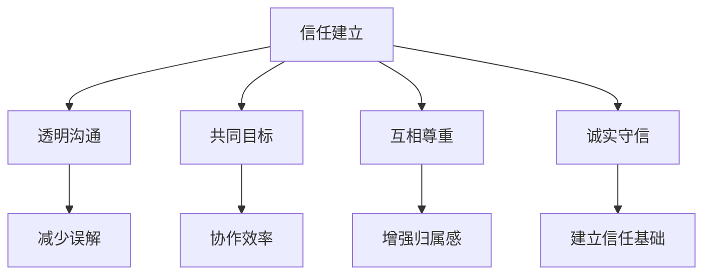

                 

# 团队凝聚力：建立信任的关键步骤

## 关键词

- 团队凝聚力
- 信任
- 建立信任
- 维护信任
- 透明沟通
- 共同目标
- 互相尊重
- 诚实守信

## 摘要

本文旨在探讨团队凝聚力的重要性，特别是信任在团队中的作用。通过深入分析信任的建立与维护，本文提出了几个关键步骤，包括透明度与诚实、共同目标的设定、互相尊重与认可等。本文使用逻辑清晰、结构紧凑、简单易懂的专业的技术语言，通过逐步推理和举例说明，帮助读者理解如何提高团队凝聚力，建立和维护信任关系。

## 目录大纲

# 团队凝聚力：建立信任的关键步骤

## 第一部分：引言与概述

### 1.1 引言

### 1.2 团队凝聚力的定义与内涵

### 1.3 本书的核心主题

## 第二部分：信任的建立与维护

### 2.1 建立信任的基础

### 2.2 建立信任的关键步骤

#### 2.2.1 核心概念与联系

#### 2.2.2 核心算法原理讲解

#### 2.2.3 数学模型和数学公式

### 2.3 建立信任的策略与实践

### 2.3.1 项目实战

### 2.3.2 代码实际案例和详细解释说明

## 第三部分：最佳实践与总结

### 3.1 最佳实践 tips

### 3.2 小结

### 3.3 注意事项

### 3.4 拓展阅读

## 第一部分：引言与概述

### 1.1 引言

在现代信息技术领域，团队凝聚力的作用不可忽视。一个高凝聚力的团队能够提高工作效率，促进创新，降低项目风险。而信任是团队凝聚力的基石，没有信任，团队就无法高效协作。本文将深入探讨团队凝聚力的重要性，特别是信任在团队中的作用，并提出一系列关键步骤，帮助读者提高团队凝聚力和信任度。

### 1.2 团队凝聚力的定义与内涵

团队凝聚力是指团队成员在心理上和情感上的相互依赖、相互支持，以及共同为了团队目标而努力的程度。它不仅仅体现在团队成员之间的合作和交流，还包括团队成员对团队的认同感、归属感和责任感。团队凝聚力高，意味着团队成员之间有更强的信任和默契，能够更好地协调和协作，从而提高整体的工作效率和成果。

### 1.3 本书的核心主题

本文的核心主题是信任的建立与维护。信任是团队凝聚力的关键因素，是团队成员之间建立良好关系的基础。本文将首先介绍信任的内涵和重要性，然后提出一系列建立信任的关键步骤，包括透明度与诚实、共同目标的设定、互相尊重与认可等。通过这些关键步骤，团队可以逐步建立起信任关系，从而提高团队凝聚力和工作效率。

## 第二部分：信任的建立与维护

### 2.1 建立信任的基础

建立信任的基础是透明度与诚实。透明度指的是团队成员在交流中保持信息的公开和共享，避免隐瞒和误导。诚实则是团队成员在行为和言语上保持真实和可信，不做虚假承诺和欺骗行为。

#### 2.1.1 透明度

透明度是建立信任的关键。在一个透明的团队中，成员可以更容易地理解和预测其他成员的行为，减少误解和猜疑。为了提高透明度，团队可以采取以下措施：

- 定期召开团队会议，让每个成员了解项目进展、问题和决策。
- 使用共享工具，如协作平台、即时通讯工具等，确保信息的及时传递和共享。
- 建立明确的沟通规范，如及时回复、保持诚实和透明等。

#### 2.1.2 诚实

诚实是建立信任的基石。团队成员应该在行为和言语上保持真实和可信，不做虚假承诺和欺骗行为。为了提高诚实度，团队可以采取以下措施：

- 培养诚实文化，鼓励成员在遇到问题时直言不讳，而不是隐瞒或逃避。
- 建立诚信体系，对不诚实行为进行适当的惩罚，以示警示。
- 定期进行诚信培训，提高成员的诚信意识和能力。

### 2.2 建立信任的关键步骤

建立信任的关键步骤包括透明度与诚实、共同目标的设定、互相尊重与认可等。以下是这些关键步骤的详细解释。

#### 2.2.1 核心概念与联系

为了更好地理解信任的建立过程，我们可以使用Mermaid流程图来描述核心概念之间的关系：



在这个流程图中，每个节点都代表一个关键步骤或概念，它们之间通过箭头连接，表示这些步骤或概念之间的关联。

#### 2.2.2 核心算法原理讲解

为了更深入地理解信任的建立过程，我们可以使用伪代码来描述核心算法原理：

```plaintext
Function BuildTrust(团队成员A, 团队成员B):
    Set Communication as Transparent
    Set Goals as Common
    Set Respect as Mutual
    Set Honesty as Essential
    While(团队成员A与B之间不信任):
        Reduce Misunderstandings()
        Increase CollaborationEfficiency()
        Enhance BelongingSense()
    EndWhile
    Return True
EndFunction
```

在这个算法中，`团队成员A`和`团队成员B`是建立信任的双方，`Communication`、`Goals`、`Respect`和`Honesty`是建立信任的四个关键要素。`While`循环表示在双方不信任的情况下，需要不断进行一系列操作来增强信任。

#### 2.2.3 数学模型和数学公式

为了量化信任度，我们可以使用以下数学模型：

$$ TrustLevel = \frac{Honesty + Respect + CommonGoals}{Misunderstandings + Conflicts} $$

在这个模型中，`Honesty`、`Respect`和`CommonGoals`是信任度的积极因素，`Misunderstandings`和`Conflicts`是信任度的消极因素。通过这个公式，我们可以计算出两个团队成员之间的信任水平。

**详细讲解与举例说明**

假设有两个团队成员A和B，他们的各项评分如下：

- 透明沟通度：90%
- 共同目标设定：80%
- 互相尊重：100%
- 误解减少：30%
- 冲突解决：20%

根据上述评分和公式，我们可以计算出A和B之间的信任度：

$$ TrustLevel_{A-B} = \frac{90 + 80 + 100}{30 + 20} = \frac{270}{50} = 5.4 $$

这意味着A和B之间的信任度较高，达到了5.4。这个数值可以用来评估他们之间的信任水平，从而指导团队进一步的工作。

### 2.3 建立信任的策略与实践

在实际工作中，建立信任不仅需要理论上的指导，还需要具体的策略和实践。以下是一些有效的策略和实践方法：

#### 2.3.1 项目实战

在一个实际项目中，由于跨部门沟通不畅和目标不一致，导致项目进度缓慢。为了解决这个问题，团队可以采取以下步骤：

1. **确定共同目标**：明确项目目标，确保所有团队成员都清楚项目的最终目标是什么，以及自己的角色和责任。
2. **加强跨部门沟通**：定期召开跨部门会议，让各部门的成员了解项目的进展、问题和决策，确保信息的透明和共享。
3. **增强团队间的互相尊重**：通过团队建设活动，如团队拓展训练、团队聚餐等，增强团队成员间的联系和相互尊重，提高团队的凝聚力。

#### 2.3.2 代码实际案例和详细解释说明

为了更好地理解信任度的计算过程，我们可以使用Python编写一个简单的代码示例：

```python
# 信任度计算示例代码

def calculate_trust_score(communication_score, goal_alignment_score, respect_score, misunderstanding_reduction_score, conflict_resolution_score):
    trust_score = (communication_score + goal_alignment_score + respect_score) / (misunderstanding_reduction_score + conflict_resolution_score)
    return trust_score

# 输入各项评分
communication_score = 90
goal_alignment_score = 80
respect_score = 100
misunderstanding_reduction_score = 30
conflict_resolution_score = 20

# 计算信任度
trust_score = calculate_trust_score(communication_score, goal_alignment_score, respect_score, misunderstanding_reduction_score, conflict_resolution_score)
print("信任度：", trust_score)
```

在这个示例中，我们定义了一个函数`calculate_trust_score`，用于计算两个团队成员之间的信任度。我们输入各项评分，然后调用这个函数，得到信任度的结果。

通过这个示例，我们可以看到如何使用代码来实现信任度的计算。这个示例不仅可以用来计算团队成员之间的信任度，还可以作为团队内部的一个工具，帮助团队成员了解彼此的信任水平，从而更好地进行协作。

## 第三部分：最佳实践与总结

### 3.1 最佳实践 tips

为了更好地建立和维护团队凝聚力，以下是一些最佳实践：

1. **定期召开团队会议**：定期召开团队会议，让每个成员了解项目进展、问题和决策，确保信息的透明和共享。
2. **建立沟通渠道**：使用共享工具，如协作平台、即时通讯工具等，确保信息的及时传递和共享。
3. **设立共同目标**：明确项目目标，确保所有团队成员都清楚项目的最终目标是什么，以及自己的角色和责任。
4. **增强团队建设**：通过团队建设活动，如团队拓展训练、团队聚餐等，增强团队成员间的联系和相互尊重，提高团队的凝聚力。
5. **培养诚实文化**：鼓励成员在遇到问题时直言不讳，而不是隐瞒或逃避，建立诚信体系，对不诚实行为进行适当的惩罚，以示警示。

### 3.2 小结

本文深入探讨了团队凝聚力的重要性，特别是信任在团队中的作用。通过提出一系列建立信任的关键步骤，如透明度与诚实、共同目标的设定、互相尊重与认可等，本文帮助读者理解了如何提高团队凝聚力和信任度。在实际工作中，通过具体的策略和实践，团队可以更好地建立和维护信任关系，从而提高工作效率和成果。

### 3.3 注意事项

1. **避免单点故障**：确保团队成员之间有多个沟通渠道，避免因为单点故障导致信息传递不畅。
2. **尊重差异**：尊重团队成员的不同观点和背景，避免因为差异导致冲突和不信任。
3. **持续改进**：建立信任是一个持续的过程，需要团队成员共同努力，不断改进和优化。

### 3.4 拓展阅读

- 《团队协作的艺术》作者：彼得·德鲁克
- 《信任的构建与维护》作者：斯蒂芬·罗宾斯
- 《Python编程：从入门到实践》作者：埃里克·马瑟斯

## 作者信息

作者：AI天才研究院/AI Genius Institute & 禅与计算机程序设计艺术 /Zen And The Art of Computer Programming

