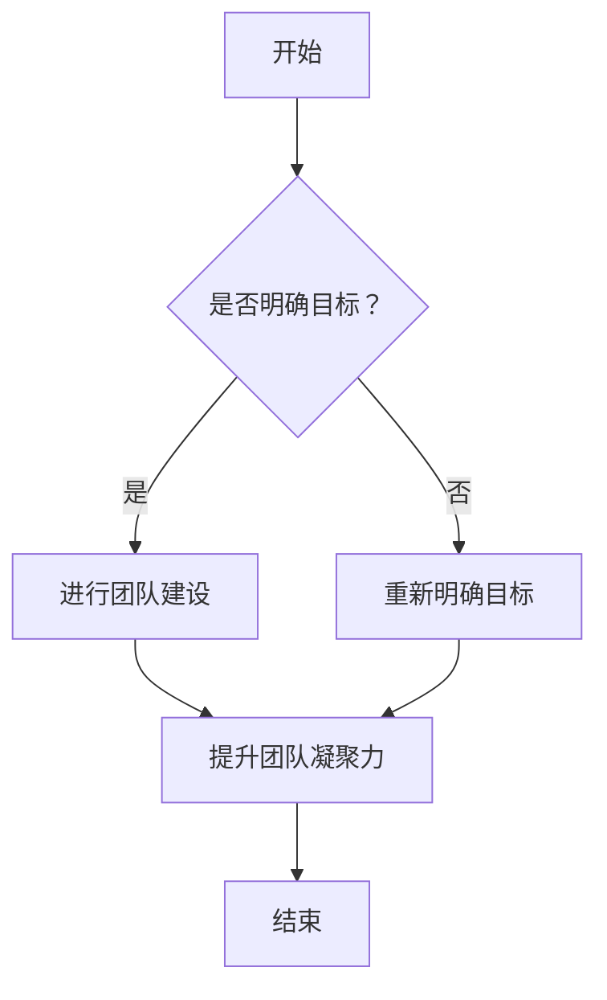

                 

### 文章标题

# 《团队凝聚力：建立共同愿景的艺术》

> 关键词：团队凝聚力、共同愿景、领导力、绩效、策略

> 摘要：本文从团队凝聚力的重要性出发，详细探讨了团队凝聚力与绩效之间的关系，团队凝聚力的构成和影响因素，以及如何建立和实现共同愿景。文章还介绍了提高团队凝聚力的策略和领导者在其中的作用，并通过成功和失败的案例分析，为团队凝聚力管理提供了有益的启示。

### 目录大纲

1. **第一部分：了解团队凝聚力**
   1. **第1章：团队凝聚力的重要性**
      1.1 团队凝聚力概述
      1.2 团队凝聚力的影响
      1.3 团队凝聚力与绩效的关系
   2. **第2章：团队凝聚力的构成**
      2.1 共同目标
      2.2 相互信任
      2.3 团队成员之间的良好沟通
   3. **第3章：团队凝聚力的影响因素**
      3.1 外部因素
      3.2 内部因素

2. **第二部分：建立共同愿景**
   1. **第4章：共同愿景的重要性**
      4.1 共同愿景的定义
      4.2 共同愿景的作用
      4.3 共同愿景与团队凝聚力的关系
   2. **第5章：如何建立共同愿景**
      5.1 明确共同愿景的步骤
      5.2 领导者的角色
      5.3 团队成员的参与
   3. **第6章：共同愿景的实践**
      6.1 制定战略规划
      6.2 分享愿景信息
      6.3 鼓励团队成员参与

3. **第三部分：提高团队凝聚力**
   1. **第7章：提高团队凝聚力的策略**
      7.1 建立积极的团队文化
      7.2 提升团队成员之间的信任
      7.3 有效的沟通和冲突解决
   2. **第8章：领导者在团队凝聚力中的作用**
      8.1 领导风格与团队凝聚力
      8.2 领导者的激励策略
      8.3 领导者的反馈与支持
   3. **第9章：持续提升团队凝聚力**
      9.1 团队建设的持续性
      9.2 跨部门合作与沟通
      9.3 适应性变革与持续改进

4. **第四部分：案例分析**
   1. **第10章：成功团队凝聚力案例分析**
      10.1 案例背景
      10.2 团队凝聚力策略
      10.3 成功因素分析
   2. **第11章：团队凝聚力失败案例分析**
      11.1 案例背景
      11.2 团队凝聚力问题
      11.3 失败原因分析
   3. **第12章：总结与展望**
      12.1 团队凝聚力的总结
      12.2 未来发展趋势
      12.3 建议与启示

### 第一部分：了解团队凝聚力

#### 第1章：团队凝聚力的重要性

##### 1.1 团队凝聚力概述

团队凝聚力是指团队成员之间相互吸引、相互信任、共同协作的一种力量。这种力量能够促进团队成员之间的沟通和协作，从而提高团队的整体绩效。

团队凝聚力不仅仅是团队成员之间的感情联系，更是团队内部的一种机制，它能够激发团队成员的潜力，使团队成员能够为实现共同目标而努力。

##### 1.2 团队凝聚力的影响

团队凝聚力对团队的影响是多方面的，主要表现在以下几个方面：

1. **绩效提升**：高凝聚力的团队能够更好地协同工作，提高工作效率，从而提升团队的绩效。

2. **创新氛围**：团队凝聚力强的团队通常能够营造一种开放、包容的创新氛围，鼓励团队成员提出新的想法和解决方案。

3. **员工满意度**：高凝聚力的团队能够提高员工的归属感和满意度，从而减少员工流失率。

4. **团队稳定性**：团队凝聚力能够增强团队的稳定性，减少团队内部的冲突和矛盾。

##### 1.3 团队凝聚力与绩效的关系

团队凝聚力和绩效之间的关系是相互影响的。高凝聚力的团队往往能够实现更高的绩效，而高绩效的团队也往往能够增强凝聚力。

具体来说，团队凝聚力对绩效的影响主要表现在以下几个方面：

1. **协同工作**：高凝聚力的团队能够更好地协同工作，提高工作效率。

2. **资源共享**：团队凝聚力强的团队能够更好地共享资源和信息，从而提高决策的质量。

3. **冲突减少**：团队凝聚力能够减少团队成员之间的冲突和误解，从而提高团队的整体合作效率。

4. **创新能力**：高凝聚力的团队能够激发团队成员的创新思维，促进团队的创新活动。

#### 第2章：团队凝聚力的构成

##### 2.1 共同目标

共同目标是团队凝聚力的核心要素之一。一个明确的共同目标能够激发团队成员的积极性，使团队成员能够为了实现目标而共同努力。

共同目标的设定需要考虑以下几个方面：

1. **具体明确**：目标应当具体明确，以便团队成员能够清晰地了解自己的任务和责任。

2. **可行性强**：目标应当具备可行性，即团队成员能够在既定时间和资源限制下实现目标。

3. **激励性**：目标应当具有激励性，能够激发团队成员的积极性和创造力。

##### 2.2 相互信任

相互信任是团队凝聚力的另一个重要组成部分。团队成员之间的信任能够减少误解和冲突，增强团队的合作精神。

建立相互信任的方法包括：

1. **透明沟通**：团队成员之间应当保持透明沟通，及时分享信息，避免信息不对称。

2. **相互支持**：团队成员应当相互支持，帮助对方解决问题，共同克服困难。

3. **尊重差异**：团队成员之间应当尊重彼此的差异，包容不同的观点和意见。

##### 2.3 团队成员之间的良好沟通

良好的沟通是团队凝聚力的关键。有效的沟通能够确保团队成员之间能够相互理解，减少误解和冲突，提高团队的工作效率。

良好的沟通应当具备以下几个特点：

1. **清晰简洁**：沟通内容应当清晰简洁，避免使用复杂难懂的术语。

2. **积极倾听**：团队成员应当积极倾听对方的意见和想法，避免打断对方。

3. **及时反馈**：团队成员应当及时反馈沟通内容，确保双方都能够理解和执行。

#### 第3章：团队凝聚力的影响因素

##### 3.1 外部因素

外部因素对团队凝聚力有着重要的影响。外部因素主要包括以下几个方面：

1. **组织文化**：组织文化能够影响团队成员的行为和态度，从而影响团队凝聚力。

2. **领导风格**：领导者的风格对团队凝聚力有着直接的影响。不同的领导风格可能会产生不同的团队凝聚力。

3. **竞争环境**：竞争环境对团队凝聚力也有着重要的影响。在竞争激烈的环境中，团队凝聚力可能会增强，以应对外部压力。

##### 3.2 内部因素

内部因素主要涉及团队内部的管理和组织机制。内部因素主要包括以下几个方面：

1. **团队结构**：团队结构对团队凝聚力有着重要的影响。合理的团队结构能够促进团队成员之间的沟通和协作。

2. **激励制度**：激励制度能够激励团队成员的积极性，从而增强团队凝聚力。

3. **团队氛围**：团队氛围对团队凝聚力有着直接的影响。积极、和谐的氛围能够增强团队成员之间的凝聚力。

### 第二部分：建立共同愿景

#### 第4章：共同愿景的重要性

##### 4.1 共同愿景的定义

共同愿景是指团队成员共同拥有的、对未来的一种期望和期待。这种愿景能够为团队成员提供方向和动力，使他们能够为了实现愿景而共同努力。

共同愿景不仅仅是一种目标，更是一种价值观和信仰。它能够激发团队成员的内在动力，使他们能够克服困难和挑战。

##### 4.2 共同愿景的作用

共同愿景对团队有着重要的作用，主要包括以下几个方面：

1. **指导方向**：共同愿景能够为团队成员提供明确的方向和目标，使团队成员能够朝着共同的目标前进。

2. **激励动力**：共同愿景能够激发团队成员的内在动力，使他们能够为实现愿景而付出努力。

3. **增强凝聚力**：共同愿景能够增强团队成员之间的凝聚力，使他们能够为了实现共同目标而共同努力。

##### 4.3 共同愿景与团队凝聚力的关系

共同愿景和团队凝聚力之间存在着密切的关系。共同愿景是团队凝聚力的重要基础，而团队凝聚力则是实现共同愿景的关键保障。

具体来说，共同愿景和团队凝聚力的关系主要表现在以下几个方面：

1. **相互促进**：共同愿景能够增强团队成员之间的凝聚力，而高凝聚力的团队也更有可能实现共同愿景。

2. **相辅相成**：共同愿景和团队凝聚力相互促进，共同愿景为团队凝聚力提供了方向和动力，而团队凝聚力则为共同愿景的实现提供了保障。

#### 第5章：如何建立共同愿景

##### 5.1 明确共同愿景的步骤

建立共同愿景需要遵循一定的步骤，主要包括以下几个方面：

1. **分析现状**：首先，需要分析团队的现状，包括团队的优点和不足，以及团队面临的机会和挑战。

2. **确定愿景**：在分析现状的基础上，确定团队的共同愿景。愿景应当具备吸引力、可行性，并能够激发团队成员的积极性。

3. **沟通共识**：通过沟通和讨论，确保团队成员对共同愿景达成共识。这一步骤至关重要，因为只有团队成员都认同共同愿景，才能够共同努力实现它。

4. **制定战略**：根据共同愿景，制定具体的战略和行动计划。战略应当明确目标、方法和时间表，以便团队成员能够按照计划行动。

##### 5.2 领导者的角色

领导者在建立共同愿景中扮演着关键角色。领导者需要从以下几个方面发挥作用：

1. **激发热情**：领导者需要激发团队成员对共同愿景的热情和兴趣，使他们能够主动参与愿景的实现。

2. **引导讨论**：领导者需要引导团队成员进行讨论，确保团队成员能够充分表达自己的意见和想法，从而达成共识。

3. **提供支持**：领导者需要为团队成员提供支持和帮助，确保他们在实现愿景的过程中能够克服困难和挑战。

##### 5.3 团队成员的参与

团队成员的参与是建立共同愿景的重要环节。团队成员需要从以下几个方面发挥作用：

1. **提出建议**：团队成员应当积极提出自己的建议和想法，为共同愿景的制定提供多元化的视角。

2. **参与讨论**：团队成员应当积极参与讨论，确保共同愿景的制定能够充分考虑团队成员的意见和需求。

3. **执行计划**：团队成员应当积极参与共同愿景的实现，按照既定的计划和目标努力工作。

#### 第6章：共同愿景的实践

##### 6.1 制定战略规划

制定战略规划是共同愿景实现的关键步骤。战略规划应当包括以下几个方面：

1. **目标明确**：明确共同愿景的具体目标和实现时间。

2. **路径清晰**：明确实现愿景的具体路径和方法。

3. **资源保障**：确保实现愿景所需的资源和条件。

4. **风险评估**：对实现愿景可能面临的风险进行评估，并制定相应的应对措施。

##### 6.2 分享愿景信息

分享愿景信息是共同愿景实践的重要环节。通过分享愿景信息，可以确保团队成员都能够了解共同愿景的具体内容和目标，从而提高他们的参与度和积极性。

分享愿景信息的方法包括：

1. **内部会议**：通过内部会议，向团队成员传达共同愿景的具体内容和目标。

2. **宣传材料**：通过宣传材料，如海报、手册等，向团队成员传达共同愿景的信息。

3. **在线平台**：通过在线平台，如企业微信、企业QQ等，向团队成员分享共同愿景的信息。

##### 6.3 鼓励团队成员参与

鼓励团队成员参与是共同愿景实践的关键。通过以下方法，可以有效地鼓励团队成员参与：

1. **提供培训**：为团队成员提供培训，提高他们的技能和知识，使他们能够更好地参与到共同愿景的实现过程中。

2. **建立激励机制**：建立激励机制，对积极参与共同愿景的团队成员进行奖励，提高他们的积极性。

3. **组织活动**：组织各种活动，如团队建设、技能竞赛等，增强团队成员之间的沟通和合作，提高团队的凝聚力。

### 第三部分：提高团队凝聚力

#### 第7章：提高团队凝聚力的策略

##### 7.1 建立积极的团队文化

建立积极的团队文化是提高团队凝聚力的关键。积极的团队文化能够激发团队成员的积极性和创造力，使团队成员能够为了共同的目标而努力。

建立积极的团队文化需要从以下几个方面入手：

1. **价值观传播**：将积极向上的价值观传播给团队成员，使他们能够认同和遵循。

2. **激励机制**：建立激励机制，鼓励团队成员积极参与团队活动，提高团队的凝聚力。

3. **团队建设**：通过团队建设活动，增强团队成员之间的沟通和合作，提高团队的凝聚力。

##### 7.2 提升团队成员之间的信任

提升团队成员之间的信任是提高团队凝聚力的重要策略。信任能够减少团队成员之间的误解和冲突，增强团队的合作精神。

提升团队成员之间的信任可以从以下几个方面入手：

1. **透明沟通**：保持沟通的透明度，确保团队成员能够了解团队的目标和进展。

2. **相互支持**：在团队中建立相互支持的文化，使团队成员能够相互帮助，共同克服困难。

3. **尊重差异**：尊重团队成员之间的差异，包容不同的观点和意见，避免产生冲突。

##### 7.3 有效的沟通和冲突解决

有效的沟通和冲突解决是提高团队凝聚力的关键。有效的沟通能够确保团队成员之间的信息畅通，减少误解和冲突；而冲突解决则能够及时解决团队成员之间的矛盾，维护团队的和谐。

提高团队凝聚力的策略包括：

1. **建立沟通渠道**：建立多种沟通渠道，如会议、邮件、即时通讯等，确保团队成员能够方便地沟通。

2. **制定冲突解决机制**：制定明确的冲突解决机制，确保团队成员在出现冲突时能够及时解决，避免问题扩大。

3. **培训沟通技巧**：为团队成员提供沟通技巧培训，提高他们的沟通能力和解决问题的能力。

#### 第8章：领导者在团队凝聚力中的作用

##### 8.1 领导风格与团队凝聚力

领导风格对团队凝聚力有着重要的影响。不同的领导风格会产生不同的团队凝聚力。

1. **权威型领导**：权威型领导能够迅速作出决策，但可能会导致团队成员的被动参与和缺乏创新。

2. **民主型领导**：民主型领导能够激发团队成员的积极性和创造力，但可能需要更多的时间来作出决策。

3. **参与型领导**：参与型领导能够确保团队成员的参与和反馈，从而提高团队的凝聚力和绩效。

##### 8.2 领导者的激励策略

领导者的激励策略对团队凝聚力有着重要的影响。领导者的激励策略应当旨在激发团队成员的积极性和创造力。

1. **目标激励**：为团队成员设定明确的目标，激发他们的工作热情。

2. **奖励激励**：对表现优秀的团队成员进行奖励，提高他们的工作积极性。

3. **认可激励**：对团队成员的贡献和成就给予认可和赞扬，增强他们的归属感和团队凝聚力。

##### 8.3 领导者的反馈与支持

领导者的反馈与支持对团队凝聚力有着重要的影响。领导者的反馈与支持能够帮助团队成员提高自己的工作能力和绩效，从而增强团队的凝聚力。

1. **及时反馈**：及时给予团队成员工作反馈，指出他们的优点和不足，帮助他们改进。

2. **提供支持**：为团队成员提供必要的支持和资源，帮助他们克服工作中的困难。

3. **建立支持系统**：建立团队支持系统，如心理辅导、技能培训等，帮助团队成员提高自己的综合素质。

#### 第9章：持续提升团队凝聚力

##### 9.1 团队建设的持续性

团队建设是一个持续的过程，需要定期进行。通过定期团队建设，可以不断提高团队的凝聚力，增强团队的合作能力。

1. **定期活动**：定期组织团队建设活动，如团建活动、培训等，增强团队成员之间的沟通和合作。

2. **反馈机制**：建立反馈机制，定期收集团队成员的意见和建议，及时调整团队建设策略。

3. **持续改进**：根据反馈和实际情况，持续改进团队建设策略，不断提高团队凝聚力。

##### 9.2 跨部门合作与沟通

跨部门合作与沟通对团队凝聚力有着重要的影响。通过跨部门合作与沟通，可以促进不同部门之间的协作，提高团队的整体绩效。

1. **建立合作机制**：建立跨部门合作机制，明确各部门的职责和协作方式，确保跨部门合作的顺利进行。

2. **加强沟通**：加强跨部门沟通，建立多种沟通渠道，如会议、邮件、即时通讯等，确保信息畅通。

3. **共享资源**：通过共享资源，如信息、工具等，促进跨部门之间的协作。

##### 9.3 适应性变革与持续改进

团队凝聚力不是一成不变的，需要随着环境和团队状况的变化而进行适应性变革和持续改进。

1. **适应环境变化**：随着环境和团队状况的变化，及时调整团队建设和凝聚力的策略。

2. **持续改进**：通过定期的评估和反馈，持续改进团队建设和凝聚力的策略。

3. **培养变革意识**：培养团队成员的变革意识，鼓励他们积极参与变革，为团队的发展贡献力量。

### 第四部分：案例分析

#### 第10章：成功团队凝聚力案例分析

##### 10.1 案例背景

某科技公司是一家全球知名的企业，其团队凝聚力一直是其成功的重要因素之一。为了进一步提高团队凝聚力，该公司采取了一系列措施，取得了显著的效果。

##### 10.2 团队凝聚力策略

该公司的团队凝聚力策略主要包括以下几个方面：

1. **明确共同愿景**：公司明确了“成为全球领先的科技公司”的共同愿景，使团队成员都能够为了这一目标而努力。

2. **建立积极的团队文化**：公司建立了积极的团队文化，鼓励创新、开放和协作。

3. **提升团队成员之间的信任**：通过透明的沟通和相互支持，提升了团队成员之间的信任。

4. **有效的沟通和冲突解决**：建立了有效的沟通渠道和冲突解决机制，确保团队成员之间的信息畅通和矛盾及时解决。

##### 10.3 成功因素分析

该公司的成功因素主要包括以下几个方面：

1. **领导者的作用**：公司领导者在团队凝聚力建设过程中发挥了关键作用，他们不仅提供了明确的方向和目标，还积极引导和激励团队成员。

2. **团队成员的参与**：团队成员积极参与团队建设和凝聚力提升，他们提出了许多有益的建议和想法，为团队的发展贡献力量。

3. **持续的团队建设**：公司注重团队建设的持续性，定期进行团队建设活动，不断提高团队的凝聚力。

4. **适应性和变革意识**：公司具有强烈的适应性和变革意识，能够根据环境和团队状况的变化，及时调整团队建设和凝聚力的策略。

#### 第11章：团队凝聚力失败案例分析

##### 11.1 案例背景

某初创公司在成立初期，由于团队成员之间的矛盾和沟通不畅，团队凝聚力严重不足。这使得公司在市场竞争中处于不利地位，最终导致失败。

##### 11.2 团队凝聚力问题

该公司的团队凝聚力问题主要包括以下几个方面：

1. **缺乏共同愿景**：团队成员缺乏共同的目标和愿景，导致他们在工作中缺乏动力和协作。

2. **沟通不畅**：团队成员之间的沟通不畅，导致误解和冲突频发。

3. **信任缺失**：团队成员之间的信任缺失，导致协作困难。

4. **缺乏有效的团队建设**：公司没有进行有效的团队建设，团队成员之间的联系和合作不够紧密。

##### 11.3 失败原因分析

该公司的失败原因主要包括以下几个方面：

1. **领导者的失误**：公司领导者没有为团队成员提供明确的目标和方向，也没有有效地引导和激励团队成员。

2. **团队成员的消极态度**：团队成员缺乏积极性和协作精神，导致团队凝聚力不足。

3. **缺乏团队建设**：公司没有进行有效的团队建设，导致团队成员之间的联系和合作不够紧密。

4. **环境变化应对不足**：公司在面对市场环境变化时，没有及时调整团队建设和凝聚力策略，导致团队凝聚力不足，无法适应市场变化。

### 第12章：总结与展望

#### 12.1 团队凝聚力的总结

团队凝聚力是团队成功的关键因素之一。通过了解团队凝聚力的构成、影响因素和重要性，我们可以更好地理解团队凝聚力在团队管理中的作用。

1. **了解团队凝聚力的重要性**：团队凝聚力对团队绩效、员工满意度和团队稳定性都有着重要的影响。

2. **掌握团队凝聚力的构成**：共同目标、相互信任和良好的沟通是团队凝聚力的核心要素。

3. **分析团队凝聚力的影响因素**：外部因素和内部因素都会对团队凝聚力产生影响。

#### 12.2 未来发展趋势

随着社会和科技的发展，团队凝聚力在未来将会面临新的挑战和机遇。

1. **数字化时代**：数字化时代将为团队凝聚力带来新的机遇，如在线协作工具和虚拟团队建设等。

2. **全球化**：全球化将促进跨文化团队的建设，提高团队凝聚力的挑战。

3. **人工智能**：人工智能将在团队管理中发挥重要作用，如自动化沟通工具和智能冲突解决系统等。

#### 12.3 建议与启示

为了提高团队凝聚力，我们可以从以下几个方面入手：

1. **明确共同愿景**：建立明确的共同愿景，为团队成员提供明确的目标和方向。

2. **提升团队成员之间的信任**：通过透明的沟通和相互支持，提升团队成员之间的信任。

3. **加强沟通和协作**：建立有效的沟通渠道和协作机制，确保团队成员之间的信息畅通和协作顺畅。

4. **注重团队建设**：定期进行团队建设活动，增强团队成员之间的联系和合作。

5. **适应环境变化**：随着环境和团队状况的变化，及时调整团队建设和凝聚力策略。 

作者：AI天才研究院/AI Genius Institute & 禅与计算机程序设计艺术 /Zen And The Art of Computer Programming

### 附录

本博客文章中的流程图、伪代码、数学公式等均使用Mermaid、LaTeX格式进行展示。以下为具体的示例：

#### Mermaid 流程图示例



#### 伪代码示例

```python
# 计算两个数的和
def sum(a, b):
    return a + b

# 调用函数并打印结果
print(sum(3, 4))
```

#### LaTeX 公式示例

独立段落中的公式：

$$E = mc^2$$

段落内的公式：

$1 + 1 = 2$

这些示例展示了如何在博客文章中嵌入专业的技术内容和表达方式，使文章既具备深度又易于理解。希望对您的撰写工作有所帮助。祝您创作顺利！

